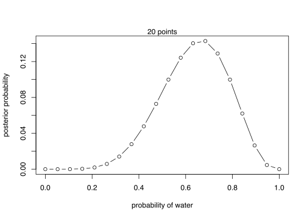
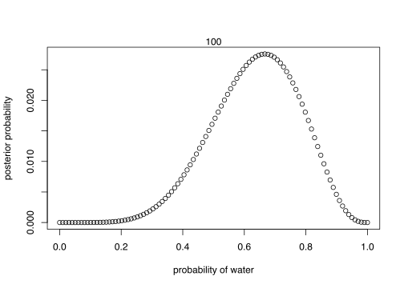

# Small Worlds and Large Worlds


```r
library(here)
source(here::here("code/scripts/source.R"))
```


```r
slides_dir = here::here("docs/slides/L01")
```

<div class="figure">

<p class="caption">Keep in mind that inside the model, there's this perfectly logical world. But that's the small world. Colombo rediscovered the Americas. The most interesting thing is that he charted his course using a globe that makes the earth much smaller than it is. Ironic because the ancient Greeks knew how big it was. But Colombo listened to an Austrian called Behaim who decided to make it smaller. So the Atlantic and Pacific oceans were joined. You can imagine sailing from Spain.</p>
</div>

<div class="figure">

<p class="caption">Consider this analogy. When you make a model, you're Colombus planning with the Austrian globe. Your responsibility is to think you might be wrong, and that the Earth is bigger than that. Study and reconsider the effects. In the real world, there are no optimal procedures. No guarantee that it will guide our behaviour optimally. We should use both of these worlds, and bounce back and forth between them.</p>
</div>


## The garden of forking data


<div class="figure">

<p class="caption">Consider a garden of forking data. Bag with 4 marbles in 2 colours - blue and white. Your job is to tell from a few draws from the bag, how many blue marbles and how many white marbles. List all the possibilities. 5 possibilities. Always step 1 in Bayesian analysis. Now draw, with replacement, three marbles. So what's in the bag?</p>
</div>

<div class="figure">

<p class="caption">Let's take a conjecture one at a time. Count all the ways you could see the data if that was the truth. Garden of forking data. Four paths based on this conjecture. On the second draw, there are again four things that could have happened. Do it a third time. Now prune it down and count the paths that are consistent with the data. Only three ways that we could have seen the data. Is three large or small? Need to compare it with another model; another conjecture.</p>
</div>


<div class="figure">

<p class="caption">No matter how complicated, Bayesian analysis is just counting.</p>
</div>

<div class="figure">

<p class="caption">Computers are good at counting. Computers are bad at being ethical. So you need to bring the responsibility to these counts. These are the relative plausibilities. Probably either 2 blue marbles or three. Say we draw another marble...</p>
</div>

<div class="figure">

<p class="caption">You can just update your previous count by mulitplying your previous counts, because that's the way addition works. Multiplication is just compressed counting. Looks implausible that there's only one blue marble. Keep drawing marbles until you reach a certain level of confidence.</p>
</div>

<div class="figure">

<p class="caption">You can use different types of data. Very straight forward. Say you have a friend who works in the factory. Every Bag contains at least one. In the factory manufacturing process, there are no all-blue or all-white. And there are specific ratios. How to use this? Multiply. The goal is to understand what's happening mechanically in every Bayesian model. The computer is going to rank an infinite number of possibilities using the power of calculus based on their probability.</p>
</div>

<div class="figure">

<p class="caption">The counts get big really quickly due to combinatorics, so you normalise them between 0 and 1, which also makes them nice to work with.</p>
</div>


```r
ways = c(0, 3, 8, 9, 0)
ways/sum(ways)
```

```
## [1] 0.00 0.15 0.40 0.45 0.00
```

## Building a model


<div class="figure">

<p class="caption">We need some procedure by which we build a model. In every modelling exercise, there's this recursive process. What do we know about the process before we collect the data? Then we update with the data and count the ways. Then we step out from the small world to the large world. What could be messing with our inference?</p>
</div>


---------------------------


```r
slides_dir = here::here("docs/slides/L02")
```


<div class="figure">

<p class="caption">The assumptions you build into the model also explain how it learns. It structures experience. No learning without assumptions.</p>
</div>


```marginfigure
Design the model using the scientific background of the data. Add the data and update, then get critical. Never relinquish control to the golem. 
```

<div class="figure">

<p class="caption">Let's go through an example. We would continue this sampling process. Here we can see exactly how the data is generated. We're throwing the small world around in order to estimate something about the large world.</p>
</div>

<div class="figure">

<p class="caption">What's the data story? What do you know about how the data has arisen? We know a lot. We saw it generated. We think there's no way you can rig the throw. So each throw is random, and the probability your hand lands on water should be proportional to the amount of water on earth.</p>
</div>


```marginfigure
It's a chaotic system. It's a deterministic physical system, but tiny differences in the initial conditions result in effectively random outcomes.
```


```marginfigure
All the tosses are independent - but this is an assumption, so we should test that. 
```

<div class="figure">

<p class="caption">Give you model some initial plausibility about the values of $p$. Conditioning means slicing off possibilities.</p>
</div>

<div class="figure">

<p class="caption">The prior sets all the possible states it could be in. Then the first data point arrives, and the model will update this. The prior is then transformed into a new distribution. If there's any relevant information, the model figures it out. Now higer values are more likely, and now that you've observed water, "no water" is impossible.</p>
</div>


<div class="figure">

<p class="caption">Now the second plot includes the second sample. Every posterior is the prior for the next plot. When n = 2, you got land, so "all water" also become impossible.</p>
</div>

<div class="figure">

<p class="caption">Note it's shifting less and less, so each additional data point contributes less marginal information.</p>
</div>


<div class="figure">

<p class="caption">So this is the conditioning step. We did this one data point at a time, but usually we just throw the whole sample in. But we get the same answer. Like a cat, you can give it all the treats at once, and it'll get just as fat. For this model, the sequence doesn't matter, but sometimes it does so you should pay attention to that.</p>
</div>


```marginfigure
The sample size makes it more and more peaked. 
```

<div class="figure">

<p class="caption">We want to make an inference about the large world. We need to be critical about. Are there biased throws? We'll do a lot of posterior prediction checks.</p>
</div>

## Components of the model


<div class="figure">

<p class="caption">Here we have three variables.</p>
</div>


```marginfigure
$N$ = number of tosses.
$p$ = true proportion of water
$W$ = observed water catches.
The arrows show that generatively, $N$ and $p$ cause $W$. The values of $N$ and $p$ don't depend on $W$. But they do *inferentially*. Bayesian inference works backwards.
```


<div class="figure">

<p class="caption">Two of these variables have been observed. But one of them has not, so we have to infer it from the other two. </p>
</div>


<div class="figure">

<p class="caption">We want a mathematical function so that we don't have to draw the garden. It's called a probability distribution.</p>
</div>

<div class="figure">

<p class="caption">This is a famous probability distribution that's very easy to build up from first principles.</p>
</div>

<div class="figure">

<p class="caption">We also have to count for the orderings - what are all the ways that can happen?</p>
</div>

<div class="figure">

<p class="caption">In this particular case, it's the above formula. Together, this gives you the binomial distribution.</p>
</div>

<div class="figure">

<p class="caption">It's just a compressed mathematical formula for the garden of forking data. </p>
</div>


```r
dbinom(6, size = 9, prob = .5)
```

```
## [1] 0.1640625
```

<div class="figure">

<p class="caption">These probabilities describe the prior predictive distribution. In later chapters, this will be a very interesting object.</p>
</div>


<div class="figure">

<p class="caption">There's a stereotyped way to write models.</p>
</div>


```marginfigure
"W is distributed binomially with $N$ trials and probability $p$, and $p$ is distributed uniformly with a mean of 0 and a standard distribution of 1."

Simplest possible Bayesian model I can imagine. Actually LaPlace's model - the law of succession.
```

## Making the model go


<div class="figure">

<p class="caption">The code looks a little different. What you must do mechanically is compute the posterior. Your target is always a posterior distribution. Nice not to have a choice.</p>
</div>


```marginfigure
You use Bayes theorem. We're multiplying the prior by the number of ways the data could have arisen, then standardising. Normalise by summing up the numerators. Its job is to count up the relative number of ways that you could see the data. 
```

<div class="figure">

<p class="caption">The model we just updated looks like this. I want to emphasise the multiplication. You take each value, a vertical slice, through each point. In the model we just did, the data are running the show. The prior is not doing any work. We could do better.</p>
</div>

<div class="figure">

<p class="caption">We could use our knowledge that more than half of the Earth is covered by water. YOu can embody that in the prior and that lets you get to the answer faster.</p>
</div>

<div class="figure">

<p class="caption">Posterior distributions are always: the relative number of ways each value you have could be true, given the data and the prior probability.</p>
</div>

<div class="figure">

<p class="caption">You have a choice about how to approximate that posterior. Today we'll use grid approximation, because it forces you to see we're just counting up. Markov chains solve a whole lot of important problems.</p>
</div>

<div class="figure">

<p class="caption">Instead of considering every infinitesimal possibility and integrating over them, we're only going to consider a finite number. Grid approximation works well here, but not with more than a few variables.</p>
</div>


<div class="figure">

<p class="caption">We immediately rule of 0 and 1. If your grid is only 3, we already have some information. Let's consider 5.</p>
</div>


<div class="figure">

<p class="caption">This is still a finite grid. But this is just an approximation, but it's a very good one.</p>
</div>

<div class="figure">

<p class="caption">Here's the code.</p>
</div>

<div class="figure">

<p class="caption">Step one: define the grid.</p>
</div>


<div class="figure">

<p class="caption">Then define the prior probability $p$. </p>
</div>

<div class="figure">

<p class="caption">Now the probability of the data. We put the whole `p_grid` in.</p>
</div>

<div class="figure">

<p class="caption">Then finally standardise it. Here nothing happens. The important thing is the multiplication step.</p>
</div>


```r
# define grid
p_grid = seq(from = 0, to = 1, length.out = 20)

# define prior
prior = rep(1, 20)

# compute likelihood at each value in grid
likelihood = dbinom(6, size = 9, prob = p_grid)

# compute product of likelihood and prior
unstd.posterior = likelihood * prior

# standardise the posterior, so it susms to 1
posterior = unstd.posterior / sum(unstd.posterior)

# plot
plot(p_grid, posterior, type = "b",
     xlab = "probability of water",
     ylab = "posterior probability")
mtext("20 points")
```



With four different grid sizes.


```r
lapply(c(5, 100, 1000, 1e5), function(grid_size){
  p_grid = seq(from = 0, to = 1, length.out = grid_size)
  
  # define prior
  prior = rep(1, grid_size)
  
  # compute likelihood at each value in grid
  likelihood = dbinom(6, size = 9, prob = p_grid)
  
  # compute product of likelihood and prior
  unstd.posterior = likelihood * prior
  
  # standardise the posterior, so it susms to 1
  posterior = unstd.posterior / sum(unstd.posterior)
  
  # plot
  plot(p_grid, posterior, type = "b",
       xlab = "probability of water",
       ylab = "posterior probability")
  mtext(grid_size)  
})
```



```
## [[1]]
## NULL
## 
## [[2]]
## NULL
## 
## [[3]]
## NULL
## 
## [[4]]
## NULL
```


