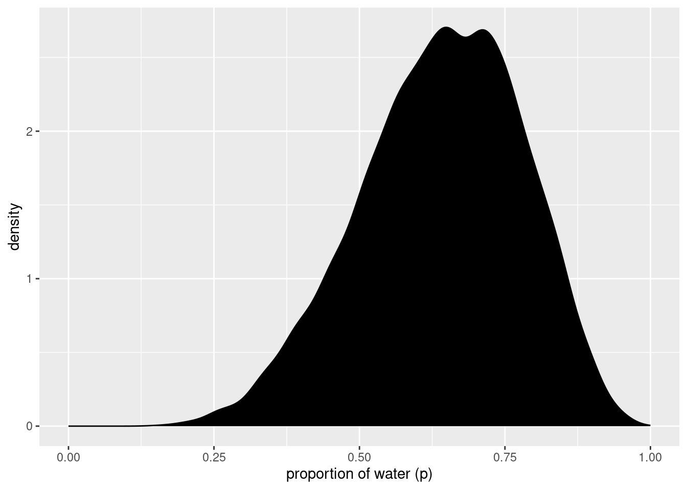

# Sampling from the Imaginary


```r
library(here)
source(here::here("code/scripts/source.R"))
```


```r
slides_dir = here::here("docs/slides/L02")
```

<div class="figure">
<p class="caption">(\#fig:unnamed-chunk-3)When I work with Bayesian models, we work with random numbers drawn from the posterior distribution. That's nice, because you can easily summarise the sample. And you can make inferences from the sample. Cognitively a prosthetic because it helps us transform hard calculus problems into easy data summary problems. </p></div>


<div class="figure">
<p class="caption">(\#fig:unnamed-chunk-6)One line in R is sufficient to do the sampling. `p` are the possibilities of our grid. We'll get a big bag of numbers, and they'll be in the same distribution as our posterior. When you use Markov chains, they only spit out samples.</p></div>

## Sampling from a grid-approximate posterior

Generate the samples. First compute the posterior.


```r
# how many grid points would you like?
n <- 1000
n_success <- 6
n_trials  <- 9

(
  d <-
  tibble(p_grid = seq(from = 0, to = 1, length.out = n),
         # note we're still using a flat uniform prior
         prior  = 1) %>% 
  mutate(likelihood = dbinom(n_success, size = n_trials, prob = p_grid)) %>% 
  mutate(posterior = (likelihood * prior) / sum(likelihood * prior))
)
```

```
## # A tibble: 1,000 × 4
##     p_grid prior likelihood posterior
##      <dbl> <dbl>      <dbl>     <dbl>
##  1 0           1   0         0       
##  2 0.00100     1   8.43e-17  8.43e-19
##  3 0.00200     1   5.38e-15  5.38e-17
##  4 0.00300     1   6.11e-14  6.11e-16
##  5 0.00400     1   3.42e-13  3.42e-15
##  6 0.00501     1   1.30e-12  1.30e-14
##  7 0.00601     1   3.87e-12  3.88e-14
##  8 0.00701     1   9.73e-12  9.74e-14
##  9 0.00801     1   2.16e-11  2.16e-13
## 10 0.00901     1   4.37e-11  4.38e-13
## # … with 990 more rows
```

Now draw 10,000 samples from this posterior. Scoop out 10,000 values from the bucket containing parameter values that exist in proportion to the posterior probability.


```r
# how many samples would you like?
n_samples <- 1e4

# make it reproducible
set.seed(3)

samples <-
  d %>% 
  slice_sample(n = n_samples, weight_by = posterior, replace = T)

glimpse(samples)
```

```
## Rows: 10,000
## Columns: 4
## $ p_grid     <dbl> 0.5645646, 0.6516517, 0.5475475, 0.5905906, 0.5955956, 0.78…
## $ prior      <dbl> 1, 1, 1, 1, 1, 1, 1, 1, 1, 1, 1, 1, 1, 1, 1, 1, 1, 1, 1, 1,…
## $ likelihood <dbl> 0.22455994, 0.27190272, 0.20966655, 0.24460869, 0.24799092,…
## $ posterior  <dbl> 0.0022478473, 0.0027217490, 0.0020987643, 0.0024485355, 0.0…
```

<p><span class="marginnote shownote">
<!--
<div class="figure">-->

<!--
<p class="caption marginnote">--> <!--</p>-->
<!--</div>--></span></p>

```r
samples %>% 
  mutate(sample_number = 1:n()) %>% 
  
  ggplot(aes(x = sample_number, y = p_grid)) +
  geom_point(alpha = 1/10) +
  scale_y_continuous("proportion of water (p)", limits = c(0, 1)) +
  xlab("sample number")
```

<p><span class="marginnote shownote">
<!--
<div class="figure">-->

<!--
<p class="caption marginnote">--> <!--</p>-->
<!--</div>--></span></p>

```r
samples %>% 
  ggplot(aes(x = p_grid)) +
  geom_density(fill = "black") +
  scale_x_continuous("proportion of water (p)", limits = c(0, 1))
```

Here's what it looks like with `1e6`:


```r
set.seed(3)

d %>% 
  slice_sample(n = 1e6, weight_by = posterior, replace = T) %>% 
  ggplot(aes(x = p_grid)) +
  geom_density(fill = "black") +
  scale_x_continuous("proportion of water (p)", limits = c(0, 1))
```


>All you’ve done so far is crudely replicate the posterior density you had already computed. That isn’t of much value. But next it is time to use these samples to describe and understand the posterior. That is of great value.

## Sampling to summarize

<div class="figure">
<p class="caption">(\#fig:unnamed-chunk-8)What might you want to compute? Commonly people want to construct intervals.</p></div>

***3.2.1 Intervals of defined boudaries***

What's the posterior probability that the proportion of water is less than 0.5?


```r
# add up posterior probability where p < 0.5
d %>% 
  filter(p_grid < .5) %>% 
  summarise(sum = sum(posterior))
```

```
## # A tibble: 1 × 1
##     sum
##   <dbl>
## 1 0.172
```

But since grid approximation isn't practical in general, it won't always be so easy. Once there is more than one parameter in the posterior distribution, even this simple sum is no longer very simple. 

So let's see how to perform it using samples from the posterior.


```r
# Add up all the samples under .5, divided by the total number of samples
samples %>%
  filter(p_grid < .5) %>% 
  summarise(sum = n() / n_samples)
```

```
## # A tibble: 1 × 1
##     sum
##   <dbl>
## 1 0.163
```
Do the same but using `count()`:


```r
samples %>% 
  count(p_grid < .5) %>% 
  mutate(probability = n / sum(n))
```

```
## # A tibble: 2 × 3
##   `p_grid < 0.5`     n probability
##   <lgl>          <int>       <dbl>
## 1 FALSE           8371       0.837
## 2 TRUE            1629       0.163
```


<div class="figure">
<p class="caption">(\#fig:unnamed-chunk-10)Two general kinds of intervals. One is an interval of defined boundaries. Upper left is the probability that less than half the world is covered by water. Compute by counting the number of samples that satisfy the criteria, then dividing by the total number of samples. Upper right is the probability between 50% and 70%. Lower right - there's an infinite number of 80% intervals.</p></div>

Using the same approach, how much posterior probability lies between 0.5 and 0.75?


```r
samples %>% 
  filter(p_grid > .5 & p_grid < .75) %>% 
  summarise(sum = n() / n_samples)
```

```
## # A tibble: 1 × 1
##     sum
##   <dbl>
## 1 0.606
```

This is shown in the upper right of Figure 3.2.


```r
# upper left panel
p1 <-
  d %>% 
  ggplot(aes(x = p_grid, y = posterior)) +
  geom_line() +
  geom_area(data = d %>% filter(p_grid < .5)) +
  labs(x = "proportion of water (p)",
       y = "density")

# upper right panel
p2 <-
  d %>% 
  ggplot(aes(x = p_grid, y = posterior)) +
  geom_line() +
  # note this next line is the only difference in code from the last plot
  geom_area(data = d %>% filter(p_grid < .75 & p_grid > .5)) +
  labs(x = "proportion of water (p)",
       y = "density")

library(patchwork)
p1 + p2
```


***3.2.2 Intervals of defined mass***

What a compatibility interval indicates is a range of parameter values compatible with the model and data. 

Where does the 80th percentile lie? i.e. the boundaries fo the lower 80% posterior probability. 


```r
(q_80 <- quantile(samples$p_grid, prob = .8))
```

```
##       80% 
## 0.7627628
```

This is shown in the bottom-left of Figure 3.2. Similarly, the middle 80% interval lies between the 10th percentile and the 90th percentile.


```r
samples %>% 
  summarise(`10th percentile` = quantile(p_grid, p = .1),
            `90th percentile` = quantile(p_grid, p = .9))
```

```
## # A tibble: 1 × 2
##   `10th percentile` `90th percentile`
##               <dbl>             <dbl>
## 1             0.451             0.815
```

For quick indexing:


```r
(q_10_and_90 <- quantile(samples$p_grid, prob = c(.1, .9)))
```

```
##       10%       90% 
## 0.4514515 0.8148148
```

This is shown in the bottom-right of Figure 3.2.


```r
# lower left panel
p1 <-
  d %>% 
  ggplot(aes(x = p_grid, y = posterior)) +
  geom_line() +
  geom_area(data = d %>% filter(p_grid < q_80)) +
  annotate(geom = "text",
           x = .25, y = .0025,
           label = "lower 80%") +
  labs(x = "proportion of water (p)",
       y = "density")

# lower right panel
p2 <-
  d %>% 
  ggplot(aes(x = p_grid, y = posterior)) +
  geom_line() +
  geom_area(data = d %>% filter(p_grid > q_10_and_90[1] & p_grid < q_10_and_90[2])) +
  annotate(geom = "text",
           x = .25, y = .0025,
           label = "middle 80%") +
  labs(x = "proportion of water (p)",
       y = "density")

p1 + p2
```


Intervals of this sort are very common in the scientific literature. We'll call them **Percentile Intervals** (PI). These do a good job of communicating the shape of a distribution, as long as it's not too asymmetrical. 

But in terms of supporting inferences about which parameters are consistent with the data, they are not perfect. 

Consider the posterior distribution consistent with observing three waters in three tosses, and a flat prior. 


```r
# here we update the `dbinom()` parameters
n_success <- 3
n_trials  <- 3

# update `d`
d <-
  d %>% 
  mutate(likelihood = dbinom(n_success, size = n_trials, prob = p_grid)) %>% 
  mutate(posterior  = (likelihood * prior) / sum(likelihood * prior))

# make the next part reproducible
set.seed(3)

# here's our new samples tibble
(
  samples <-
    d %>% 
    slice_sample(n = n_samples, weight_by = posterior, replace = T)
)
```

```
## # A tibble: 10,000 × 4
##    p_grid prior likelihood posterior
##     <dbl> <dbl>      <dbl>     <dbl>
##  1  0.717     1     0.368   0.00147 
##  2  0.652     1     0.277   0.00111 
##  3  0.548     1     0.164   0.000656
##  4  1         1     1       0.00400 
##  5  0.991     1     0.973   0.00389 
##  6  0.788     1     0.489   0.00195 
##  7  0.940     1     0.830   0.00332 
##  8  0.817     1     0.545   0.00218 
##  9  0.955     1     0.871   0.00348 
## 10  0.449     1     0.0908  0.000363
## # … with 9,990 more rows
```

The `rethinking::PI()` function works like a nice shorthand for `quantile()`.


```r
quantile(samples$p_grid, prob = c(.25, .75))
```

```
##       25%       75% 
## 0.7087087 0.9349349
```

```r
rethinking::PI(samples$p_grid, prob = .5)
```

```
##       25%       75% 
## 0.7087087 0.9349349
```


<div class="figure">
<p class="caption">(\#fig:unnamed-chunk-15)Two basic kinds of specified mass intervals. PI gives you the central area, where .25 is left over in each tail. They're not necessarily the right thing to use. What if you have an asymmetric distribution? Now the 50 percentile interval omits the highest value. Use the HPDI to keep the highest point. But remember these are just summaries.</p></div>


