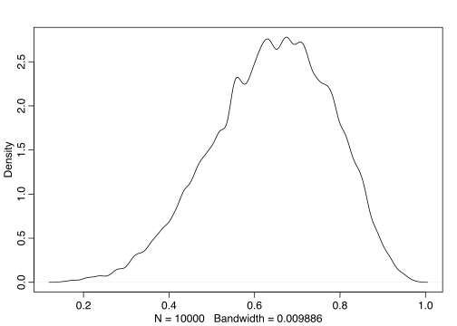
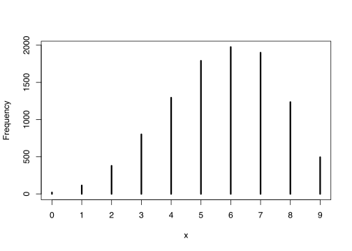
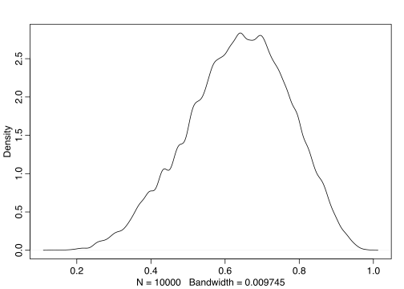

# Sampling from the Imaginary


```r
library(here)
source(here::here("code/scripts/source.R"))
```


```r
slides_dir = here::here("docs/slides/L02")
```

<div class="figure">

<p class="caption">When I work with Bayesian models, we work with random numbers drawn from the posterior distribution. That's nice, because you can easily summarise the sample. And you can make inferences from the sample. Cognitively a prosthetic because it helps us transform hard calculus problems into easy data summary problems. </p>
</div>


<div class="figure">

<p class="caption">One line in R is sufficient to do the sampling. `p` are the possibilities of our grid. We'll get a big bag of numbers, and they'll be in the same distribution as our posterior. When you use Markov chains, they only spit out samples.</p>
</div>

## Sampling from a grid-approximate posterior

Generate the samples. First compute the posterior.


```r
p_grid = seq(from = 0, to = 1, length.out = 1000)
prob_p = rep(1, 1000)
prob_data = dbinom(6, size = 9, prob = p_grid)
posterior = prob_data * prob_p
posterior = posterior / sum(posterior)
```

Now draw 10,000 samples from this posterior. Scoop out 10,000 values from the bucket containing parameter values that exist in proportion to the posterior probability.


```r
samples = sample(p_grid, prob = posterior, size = 1e4, replace = T)
```


```r
plot(samples)
```


```r
dens(samples)
```



>All you’ve done so far is crudely replicate the posterior density you had already computed. That isn’t of much value. But next it is time to use these samples to describe and understand the posterior. That is of great value.

## Sampling to summarize

<div class="figure">

<p class="caption">What might you want to compute? Commonly people want to construct intervals.</p>
</div>

***3.2.1 Intervals of defined boudaries***

What's the posterior probability that the proportion of water is less than 0.5?


```r
# add up posterior probability where p < 0.5
sum(posterior[ p_grid < 0.5])
```

```
## [1] 0.1718746
```

But since grid approximation isn't practical in general, it won't always be so easy. Once there is more than one parameter in the posterior distribution, even this simple sum is no longer very simple. 

So let's see how to perform it using samples from the posterior.


```r
# Add up all the samples under .5, divided by the total number of samples
sum(samples < 0.5) / 1e4
```

```
## [1] 0.1744
```

<div class="figure">

<p class="caption">Two general kinds of intervals. One is an interval of defined boundaries. Upper left is the probability that less than half the world is covered by water. Compute by counting the number of samples that satisfy the criteria, then dividing by the total number of samples. Upper right is the probability between 50% and 70%. Lower right - there's an infinite number of 80% intervals.</p>
</div>

Using the same approach, how much posterior probability lies between 0.5 and 0.75?


```r
sum(samples > 0.5 & samples < 0.75) / 1e4
```

```
## [1] 0.5954
```

This is shown in the upper right of Figure 3.2.

***3.2.2 Intervals of defined mass***

What a compatibility interval indicates is a range of parameter values compatible with the model and data. 

Where does the 80th percentile lie? i.e. the boundaries fo the lower 80% posterior probability. 


```r
quantile (samples, .8)
```

```
##       80% 
## 0.7637638
```

This is shown in the bottom-left of Figure 3.2. Similarly, the middle 80% interval lies between the 10th percentile and the 90th percentile.


```r
quantile(samples, c(.1, .9))
```

```
##       10%       90% 
## 0.4524525 0.8148148
```

This is shown in the bottom-right of Figure 3.2.

Intervals of this sort are very common in the scientific literature. We'll call them **Percentile Intervals** (PI). These do a good job of communicating the shape of a distribution, as long as it's not too asymmetrical. 

But in terms of supporting inferences about which parameters are consistent with the data, they are not perfect. 

Consider the posterior distribution consistent with observing three waters in three tosses, and a flat prior. 


```r
n_grid = 1000
p_grid = seq(from = 0, to = 1, length.out = n_grid)
prior = rep(1, n_grid)
likelihood = dbinom(3, size = 3, prob = p_grid)
posterior = likelihood * prior
posterior = posterior / sum(posterior)
samples = sample(p_grid, size = 1e4, replace = T, prob = posterior)
```

<div class="figure">

<p class="caption">Two basic kinds of specified mass intervals. PI gives you the central area, where .25 is left over in each tail. They're not necessarily the right thing to use. What if you have an asymmetric distribution? Now the 50 percentile interval omits the highest value. Use the HPDI to keep the highest point. But remember these are just summaries.</p>
</div>


```r
rethinking::PI(samples, prob = .5)
```

```
##       25%       75% 
## 0.7057057 0.9309309
```

In this example, it ends up excluding the most probable parameter values, near $p$ = 1.


```r
rethinking::HPDI(samples, prob = 0.5)
```

```
##      |0.5      0.5| 
## 0.8418418 1.0000000
```

Here the HPDI has an advantage over the PI, but in most cases, the two are very similar. That's because the posterior is skewed. When the posterior is bell-shaped, it hardly matters whate type of interval you use. 

> Often, all compatibility intervals do is communicate the shape of a distribution.

***3.2.3 Point estimates***


```r
p_grid[which.max(posterior)]
```

```
## [1] 1
```


```r
rethinking::chainmode(samples, adj = 0.01)
```

```
## [1] 0.9972835
```


```r
mean(samples)
```

```
## [1] 0.8001949
```

```r
median(samples)
```

```
## [1] 0.8418418
```

We care about uncertainty, and we want to summarise that. To use a point estimate, you need to provide a cost-benefit analysis. e.g. conservation or forecasting. 

One principles way to go beyond using the entire posterior as the estimate is to choose a **Loss Function**: a rule that tells you the cost assoicated with using any particular point estimate. 

>Tell me which value of $p$, the proportion of water on the Earth, you think is correct, and if you get it exactly right, I will pay you $100. But I will subtract money from your gain, proportional to the distance fo your decision from the correct value. Now that you have the posterior distribution in hand, how should you use it to maximise your expected winnings?


```r
# The expected loss will be:
sum(posterior*abs(.5 - p_grid))
```

```
## [1] 0.3128752
```

We can repeat this for every possible decision:


```r
loss = sapply(p_grid, function(d) sum(posterior*abs(d - p_grid)))
```

Now it's easy to find the parameter value that minimises that loss:


```r
p_grid[which.min(loss)]
```

```
## [1] 0.8408408
```

And this is actually the posterior median.


```r
median(samples)
```

```
## [1] 0.8418418
```

Usually it's better to communicate as much as you can about the posterior distribution, as well as the data and the model itself. 


You can't have confidence in an interval. It's doublespeak. *Compatibility* emphasises the uncertainty. Credibility is the next conversation. 

## Sampling to simulate prediction


We've got the model and now we want to know what it expects. So we get it to simulate predictions. 

***3.3.1 Dummy data***

Suppose $N$ = 2, two tosses, then there are only three possible observations: 0, 1 and 2 water. You can compute the probability of each for any given value of $p$. Let's use $p$ = 0.7, about the true proportion of water on the Earth.


```r
dbinom(0:2, size = 2, prob = .7)
```

```
## [1] 0.09 0.42 0.49
```

Now we'll simulate observations using these probabilities.


```r
rbinom(1, size = 2, prob = 0.7)
```

```
## [1] 2
```

That 1 means "1 water in 2 tosses." You can simulate a set of 10:


```r
rbinom(10, size = 2, prob = 0.7)
```

```
##  [1] 1 2 1 0 2 1 2 1 2 1
```

Let's generate 10,000 just to verify 0, 1 and 2 appear in proportion to their likelihoods:


```r
dummy_w = rbinom(1e5, size = 2, prob = .7)
table(dummy_w) / 1e5
```

```
## dummy_w
##       0       1       2 
## 0.08849 0.42252 0.48899
```

Let's now simulate the sample size as before, with 9 tosses


```r
dummy_w = rbinom(1e5, size = 9, prob = .7)
simplehist(dummy_w, xlab = "dummy water count")
```


***3.3.2 ### Model checking***

Means:
1. Ensuring the model fitting worked correctly; and
2. Evaluating the adequacy of a model for some purpose. 

<div class="figure">

<p class="caption">Let's consider three values from it. If we took the true value A and simulated a bunch of globe tosses, what would the sampling distribution look like? </p>
</div>


<div class="figure">

<p class="caption">If it were B instead, it would centre around 6.</p>
</div>

<div class="figure">

<p class="caption">We want a posterior predictive distribution which mixes all these together in proportion to the posterior probability of each value of $p$. We want the actual predictions of the model are not any one of these sampling distributions, they're all of them mixed together in the proper weights to the improbable weights of $p$ are given little weight and vice versa. </p>
</div>


<div class="figure">

<p class="caption">The probabilities come from the samples from the posterior distribution.</p>
</div>


```r
w =  rbinom(1e4, size = 9, prob = .6)
rethinking::simplehist(w)
```


This generates 10,000 simulated predictions of 9 globe tosses `(size = 9)`, assuming $p$ = 0.6. The predictions are stored as counts of water. 

To propagate parameter uncertainty into these predictions, replace the value of `0.6` with samples from the posterior.


```r
p_grid = seq(from = 0, to = 1, length.out = 1000)
prob_p = rep(1, 1000)
prob_data = dbinom(6, size = 9, prob = p_grid)
posterior = prob_data * prob_p
posterior = posterior / sum(posterior)
samples = sample(p_grid, prob = posterior, size = 1e4, replace = T)
w = rbinom(1e4, size = 9, prob = samples)
rethinking::simplehist(w)
```




## Practice {-}


```r
p_grid <- seq( from=0 , to=1 , length.out=1000 )
prior <- rep( 1 , 1000 )
likelihood <- dbinom( 6 , size=9 , prob=p_grid )
posterior <- likelihood * prior
posterior <- posterior / sum(posterior)
set.seed(100)
samples <- sample( p_grid , prob=posterior , size=1e4 , replace=TRUE )
```


```r
rethinking::dens(samples)
```




```r
# 3E1. How much posterior lies below = 0.2?
sum(samples < 0.2) / length(samples)
```

```
## [1] 4e-04
```

```r
# 3E2. How much posterior probability lies above p = 0.8?
sum(samples > 0.8) / length(samples)
```

```
## [1] 0.1116
```

```r
# How much posterior probability lies between p = 0.2 and p = 0.8?
sum(samples > 0.2 & samples < 0.8) / length(samples)
```

```
## [1] 0.888
```

```r
# 3E4. 20% of the posterior probability lies below which value of p?
quantile(samples, 0.2)
```

```
##       20% 
## 0.5185185
```

```r
# 3E5. 20% of the posterior probability lies above which value of p?
quantile(samples, 0.8)
```

```
##       80% 
## 0.7557558
```

## Homework: week 1 {-}

1. Suppose the globe tossing data (Chapter 2) had turned out ot be 4 water in 15 tosses. Construct the posterior distribution, using grid approximation. Use the same flat prior as in the book.


```r
grid_size = 1000
n_water = 4

p_grid = seq(from = 0, to = 1, length.out = grid_size)

# define prior
prior = rep(1, grid_size)

# compute likelihood at each value in grid
likelihood = dbinom(n_water, size = 9, prob = p_grid)

# compute product of likelihood and prior
unstd.posterior = likelihood * prior

# standardise the posterior, so it susms to 1
posterior = unstd.posterior / sum(unstd.posterior)

# plot
plot(p_grid, posterior, type = "b",
     xlab = "probability of water",
     ylab = "posterior probability")
mtext(grid_size)  
```


2. Start over in 1, but now use a prior that is zero below $p$ = 0.5 and a constant above $p$ = 0.5. This corresponds to prior inforamtion that a majority of the Earth's surface is water. What difference does the better prior make? 


```r
grid_size = 1000
n_water = 4

p_grid = seq(from = 0, to = 1, length.out = grid_size)

# define prior
prior = ifelse(p_grid < .5, 0, 1)

# compute likelihood at each value in grid
likelihood = dbinom(n_water, size = 9, prob = p_grid)

# compute product of likelihood and prior
unstd.posterior = likelihood * prior

# standardise the posterior, so it susms to 1
posterior = unstd.posterior / sum(unstd.posterior)

# plot
plot(p_grid, posterior, type = "b",
     xlab = "probability of water",
     ylab = "posterior probability")
mtext(grid_size)  
```


3. For the posterior distribution from **2**, compute 89% percentile and HPDI intervals. Compare the widths of these intervals. Which is wider? Why? If you had only the information in the interval, what might you misunderstand about the shape of the posterior distribution? 


```r
samples = sample(p_grid, prob = posterior, size = 1e4, replace = T)

rethinking::PI(samples)
```

```
##        5%       94% 
## 0.5085085 0.7497497
```

```r
rethinking::HPDI(samples)
```

```
##     |0.89     0.89| 
## 0.5005005 0.7097097
```

```r
# PI is wider, and neither tells you that the highest point is just after 50%.
```

