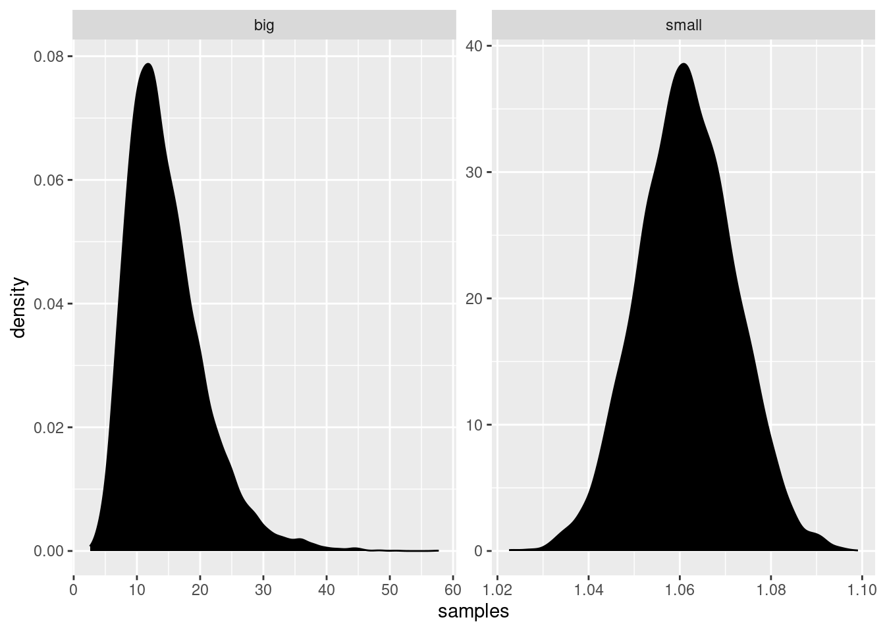
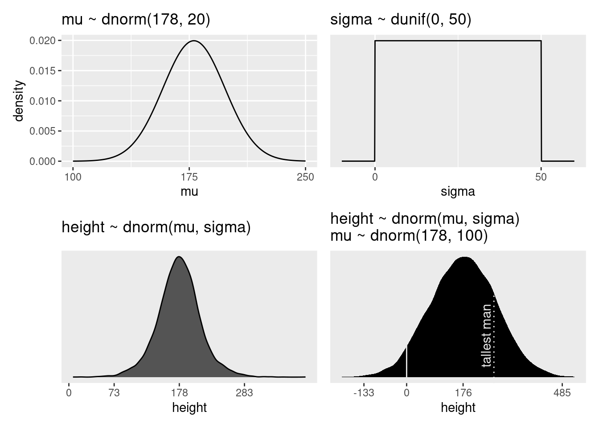
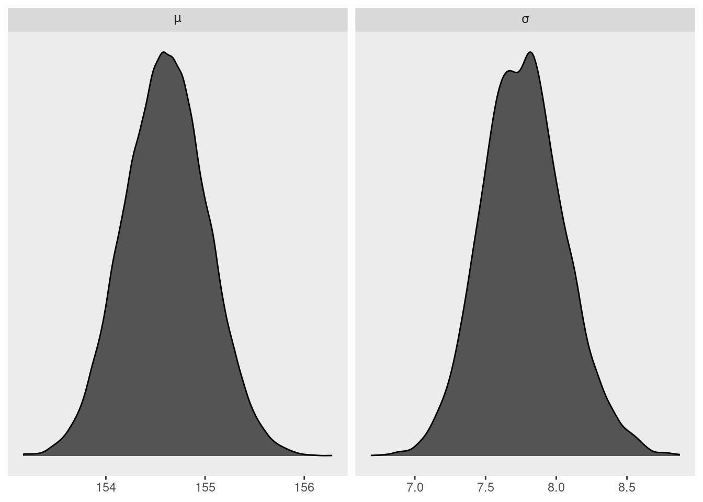
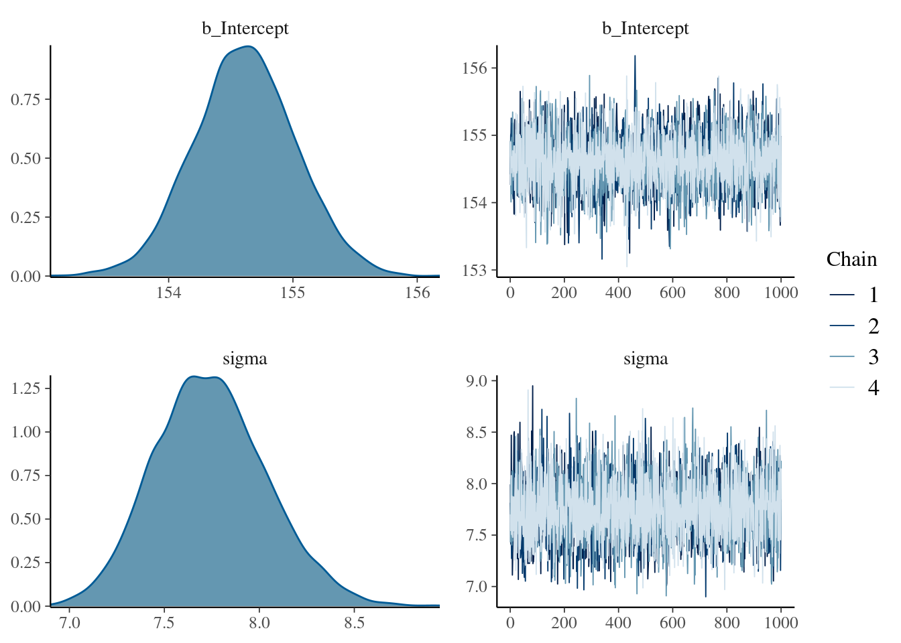
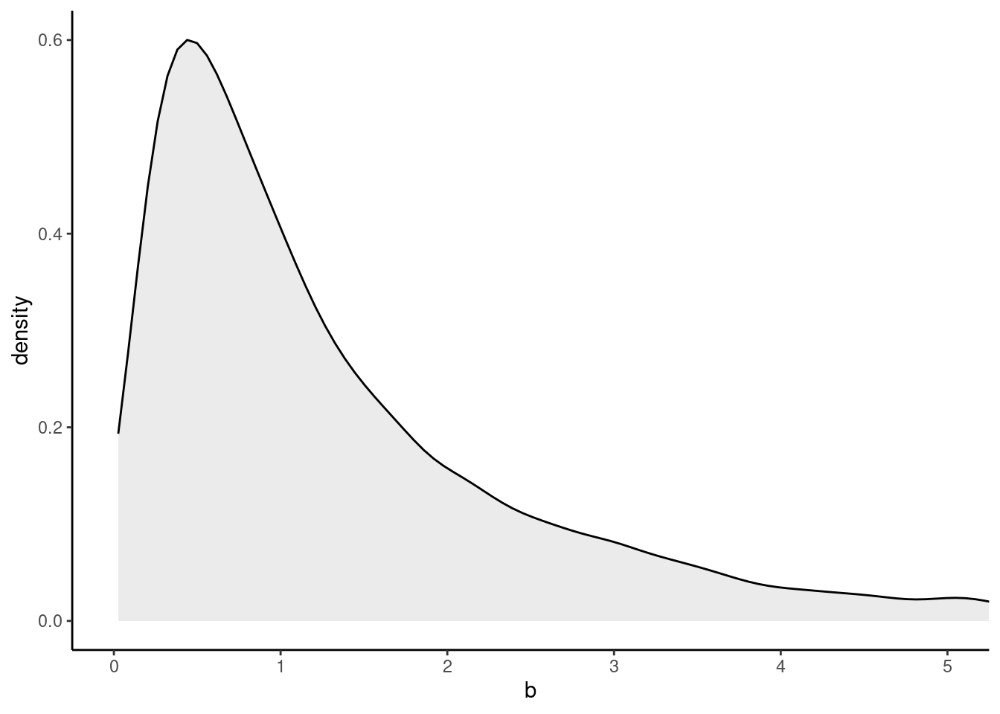
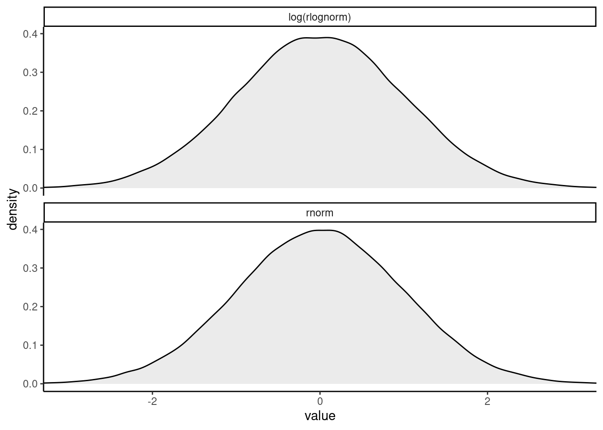

# Geocentric Models


```r
library(here)
source(here::here("code/scripts/source.R"))
```


```r
slides_dir = here::here("docs/slides/L03")
```


Introduction into regression models.

<div class="figure">

<p class="caption">As scientists, we're always dealing with questions that have higher dimensions and more complexity than what we can measure. Above is the path of Mars, called *retrograde motion*. It's an illusion caused by the joint movement of ourselves and Mars. The relative velocities create the illusion.</p>
</div>

<div class="figure">

<p class="caption">A lot of people published models, but this one is very accurate. They're full-blown mathematical models. But they're also wrong. You can't use them to send a probe to Mars. This is like a regression model. They're incredibly accurate for specific purposes, but they're also deeply wrong. Keep in mind the small world / large world distinction. You could say scientists are geocentric people. The reason Ptolemy's model works so well is that they used Fourier series - circles in circles ("epicircles"). You can use this for anything with periodic cycles. And this model still works. </p>
</div>

<div class="figure">

<p class="caption">We're here to build models of many diverse things. We don't usually use Fourier models; instead we tend to use regression. Linear regression models are incredibly useful. But if you use them without wisdom, all they do is describe things without wisdom.</p>
</div>

<div class="figure">

<p class="caption">Statistical golems which measure how the mean of some measure changes when you learn other things. The mean is always modeled as some additive weighted measure of variables.</p>
</div>

<div class="figure">

<p class="caption">Gauss developed regression, but he did it using a Bayesian argument. He used it to predict when a comet would return.</p>
</div>

## Why normal distributions are normal

<div class="figure">

<p class="caption">These appear all throughout nature. Why are they so normal? They arise from all over the place.</p>
</div>

***4.1.1 Normal by addition***

One of the things that are nice about them is that they are additive. So easy to work with. 
Second is that they're very common.

<div class="figure">

<p class="caption">Imagine a football pitch. We all line up on the midfield line. Take a coin out of your pocket and flip it. One step left for heads, right for tails. Do it a few hundred times.</p>
</div>


<div class="figure">

<p class="caption">The frequency distribution will be Gaussian.</p>
</div>


```r
pos = replicate(1000, sum(runif(16, -1, 1)))
plot(density(pos))
```


<div class="figure">

<p class="caption">This is a simulation of the soccer field experiment. After four flips (steps). Black follows one particular student. A pattern forms in the aggregation. This isn't very Gaussian yet. </p>
</div>

<div class="figure">

<p class="caption">After 8 it's pretty Gaussian.</p>
</div>

<div class="figure">

<p class="caption">And after 16 it's very Gaussian. It'll get wider and wider over time. Why does this happen? Lot's of mathematical theorems. But the intuition is that each coin flip is a fluctuation. And in the long run, fluctuations tend to cancel. If you get a string of lefts, eventually you'll get a string of rights, so the average student will end up near the middle. A very large number of them exactly cancel each other. There are more paths that will give you 0 than any other path. Then there are a few less that give you +1 or -1. And so forth.</p>
</div>


```r
# we set the seed to make the results of `runif()` reproducible.
set.seed(4)

pos <- 
  # make data with 100 people, 16 steps each with a starting point of `step == 0` (i.e., 17 rows per person)
  crossing(person = 1:100,
           step   = 0:16) %>% 
  # for all steps above `step == 0` simulate a `deviation`
  mutate(deviation = map_dbl(step, ~if_else(. == 0, 0, runif(1, -1, 1)))) %>% 
  # after grouping by `person`, compute the cumulative sum of the deviations, then `ungroup()`
  group_by(person) %>%
  mutate(position = cumsum(deviation)) %>% 
  ungroup() 

ggplot(data = pos, 
       aes(x = step, y = position, group = person)) +
  geom_vline(xintercept = c(4, 8, 16), linetype = 2) +
  geom_line(aes(color = person < 2, alpha  = person < 2)) +
  scale_color_manual(values = c("skyblue4", "black")) +
  scale_alpha_manual(values = c(1/5, 1)) +
  scale_x_continuous("step number", breaks = c(0, 4, 8, 12, 16)) +
  theme(legend.position = "none")
```


```r
# Figure 4.2.a.
p1 <-
  pos %>%
  filter(step == 4) %>%
  ggplot(aes(x = position)) +
  geom_line(stat = "density", color = "dodgerblue1") +
  labs(title = "4 steps")

# Figure 4.2.b.
p2 <-
  pos %>%
  filter(step == 8) %>%
  ggplot(aes(x = position)) +
  geom_density(color = "dodgerblue2", outline.type = "full") +
  labs(title = "8 steps")

# this is an intermediary step to get an SD value
sd <-
  pos %>%
  filter(step == 16) %>%
  summarise(sd = sd(position)) %>% 
  pull(sd)

# Figure 4.2.c.
p3 <-
  pos %>%
  filter(step == 16) %>%
  ggplot(aes(x = position)) +
  stat_function(fun = dnorm, 
                args = list(mean = 0, sd = sd),
                linetype = 2) +
  geom_density(color = "transparent", fill = "dodgerblue3", alpha = 1/2) +
  labs(title = "16 steps",
       y = "density")

library(patchwork)

# combine the ggplots
(p1 | p2 | p3) & coord_cartesian(xlim = c(-6, 6))
```


<div class="figure">

<p class="caption">That's why a bunch of natural systems are normally distributed. We don't need to know anything except that they cancel out. A lot of common statistics follow this kind of process. What you're left with are particular shapes, called *maximum entropy distributions*. For the Gaussian, **addition** is our friend. One of the things about it is that products of deviations are actually addition. So lots of multiplicative interactions also produce Gaussian distributions. You can measure things on logarithmic scales.</p>
</div>


<div class="figure">

<p class="caption">This is the ontological perspective on distributions. When fluctuations tend to dampen one another, you end up with a symmetric curve. What neat and also frustrating is that you lose a lot of information about the generative processes. When you see heights are normally distributed, you learn basically nothing about it. This is cool because all that's preserved from the underlying process is the mean and the variance. What's terrible is that you can't figure out the process from the distribution. All the maximum entropy distributions have the same feature. Power laws arise through lots of processes, and it tells you nothing other than it has high variance. The other perspective is epistemological. If you're building a model and you want to be as conservative as possible, you should use the Gaussian distribution. Because any other distribution will be narrower. So it's a very good assumption to use when you don't have additional information. The Gaussian is the one where all you're willing to say is there's a mean and a variance, you should use the Gaussian. It assumes the least.</p>
</div>

***4.1.2 Normal by multiplication***

This code just samples 12 random numbers between 1.0 and 1.1, each representing a proportional increase in growth. Thus 1.0 means no additional growth and 1.1 means a 10% increase.


```r
set.seed(4)

prod(1 + runif(12, 0, .1))
```

```
## [1] 1.774719
```

Now what distribution do you think these random products will take? Let’s generate 10,000 of them and see:


```r
set.seed(4)

growth <- 
  tibble(growth = map_dbl(1:10000, ~ prod(1 + runif(12, 0, 0.1))))

ggplot(data = growth, aes(x = growth)) +
  geom_density()
```


Multiplying small numbers if approximately the same as addition.

The smaller the effect of each locus, the better this additive approximation will be. In this way, small effects that multiply together are approximately additive, and so they also tend to stabilize on Gaussian distributions. 

Verify by comparing:


```r
# simulate
set.seed(4)

samples <-
  tibble(big   = map_dbl(1:10000, ~ prod(1 + runif(12, 0, 0.5))),
         small = map_dbl(1:10000, ~ prod(1 + runif(12, 0, 0.01))))

# wrangle
samples %>% 
  pivot_longer(everything(), values_to = "samples") %>% 
  
  # plot
  ggplot(aes(x = samples)) +
  geom_density(fill = "black") +
  facet_wrap(~ name, scales = "free") 
```



***4.1.3 Normal by log-multiplication***

Large deviates that are multiplied together do not produce Gaussian distributions, but they do tend to produce Gaussian distributions on the log scale. e.g.:


```r
samples %>% 
  mutate(log_big = log(big)) %>% 
  
  ggplot(aes(x = log_big)) +
  geom_density(fill = "gray33") +
  xlab("the log of the big")
```


Adding logs is equivalent to multiplying the original numbers. 

***4.1.4 Using Gaussian distributions***

**Caution**: Many natural (and unnatural) processes have much heavier tails - much higher probabilities of producing extreme events.

## A language for describing models

<div class="figure">

<p class="caption">All of those things are linear models. Just learn the linear modeling strategies instead of the specific procedures. We'll build up linear models from the ground up. You can build the model you need.</p>
</div>

***4.2.1 Re-describing the glob tossing model***

<div class="figure">

<p class="caption">We're going to write out all the models in the same standard notation. We're going to write this in our code so that it's reinforced.</p>
</div>

<div class="figure">

<p class="caption">Same applies for more complex models. Some of these things you can observe (water tosses), and some you can't (regression slopes). We need to list these variables and then define them.</p>
</div>

<div class="figure">

<p class="caption">The motor of these linear regression models. There's some mean of the normal distribution that is explained by $x$. But $x$ also has a distribution. </p>
</div>


```r
# how many `p_grid` points would you like?
n_points <- 100

d <-
  tibble(p_grid = seq(from = 0, to = 1, length.out = n_points),
         w      = 6, 
         n      = 9) %>% 
  mutate(prior      = dunif(p_grid, 0, 1),
         likelihood = dbinom(w, n, p_grid)) %>% 
  mutate(posterior = likelihood * prior / sum(likelihood * prior))

head(d)
```

```
## # A tibble: 6 × 6
##   p_grid     w     n prior likelihood posterior
##    <dbl> <dbl> <dbl> <dbl>      <dbl>     <dbl>
## 1 0          6     9     1   0         0       
## 2 0.0101     6     9     1   8.65e-11  8.74e-12
## 3 0.0202     6     9     1   5.37e- 9  5.43e-10
## 4 0.0303     6     9     1   5.93e- 8  5.99e- 9
## 5 0.0404     6     9     1   3.23e- 7  3.26e- 8
## 6 0.0505     6     9     1   1.19e- 6  1.21e- 7
```

```r
d %>% 
  pivot_longer(prior:posterior) %>% 
  # this line allows us to dictate the order in which the panels will appear
  mutate(name = factor(name, levels = c("prior", "likelihood", "posterior"))) %>% 
  
  ggplot(aes(x = p_grid, y = value, fill = name)) +
  geom_area() +
  scale_fill_manual(values = c("blue", "red", "purple")) +
  scale_y_continuous(NULL, breaks = NULL) +
  theme(legend.position = "none") +
  facet_wrap(~ name, scales = "free")
```


## Gaussian model of height

Before we add a predictor variable, we want to model the outcome variable as a Gaussian distribution. There are an infinite number of possible Gaussian distributions based on infinite combinations of $\mu$ and $\sigma$. We want our Bayesian machine to consider every possible distribution, and rank them by posterior plausibility. 

***4.3.1 The data***

<div class="figure">

<p class="caption">These height data come from Nancy Howell's data. `Howell1` is a simplified dataset. We'll focus just on adult heights at the moment. </p>
</div>


```r
data(Howell1)
d <- Howell1
```


```r
d %>% 
  str()
```

```
## 'data.frame':	544 obs. of  4 variables:
##  $ height: num  152 140 137 157 145 ...
##  $ weight: num  47.8 36.5 31.9 53 41.3 ...
##  $ age   : num  63 63 65 41 51 35 32 27 19 54 ...
##  $ male  : int  1 0 0 1 0 1 0 1 0 1 ...
```


```r
rethinking::precis(d)
```

```
##               mean         sd      5.5%     94.5%     histogram
## height 138.2635963 27.6024476 81.108550 165.73500 ▁▁▁▁▁▁▁▂▁▇▇▅▁
## weight  35.6106176 14.7191782  9.360721  54.50289 ▁▂▃▂▂▂▂▅▇▇▃▂▁
## age     29.3443934 20.7468882  1.000000  66.13500     ▇▅▅▃▅▂▂▁▁
## male     0.4724265  0.4996986  0.000000   1.00000    ▇▁▁▁▁▁▁▁▁▇
```


```r
head(d$height)
```

```
## [1] 151.765 139.700 136.525 156.845 145.415 163.830
```

Filter for adults:

```r
d2 = d[d$age >= 18, ]
```

***4.3.2 The model***

<div class="figure">

<p class="caption">Here's the distribution of height data. $h$ is distributed normally.</p>
</div>

<div class="figure">

<p class="caption">There's nothing special about the particular letters used. But it's important to be able to read this. Now we have three variables. One is observed, and two have not. We have to infrer them from $h$.</p>
</div>

<div class="figure">

<p class="caption">Because this is Bayesian, they have prior distributions. Using 187 cm (height of Richard) as the prior. Standard deviation is on the mean. 20 is very generous. Then for sigma, uniform 50. </p>
</div>

Whatever the prior, it's a very good idea to plot your priors:


```r
p1 <-
  tibble(x = seq(from = 100, to = 250, by = .1)) %>% 
  
  ggplot(aes(x = x, y = dnorm(x, mean = 178, sd = 20))) +
  geom_line() +
  scale_x_continuous(breaks = seq(from = 100, to = 250, by = 75)) +
  labs(title = "mu ~ dnorm(178, 20)",
       y = "density")

p1
```


The $\sigma$ prior is a truly flat prior.


```r
p2 <-
  tibble(x = seq(from = -10, to = 60, by = .1)) %>%
  
  ggplot(aes(x = x, y = dunif(x, min = 0, max = 50))) +
  geom_line() +
  scale_x_continuous(breaks = c(0, 50)) +
  scale_y_continuous(NULL, breaks = NULL) +
  ggtitle("sigma ~ dunif(0, 50)")

p2
```


A standard deviation like $\sigma$ must be positive, so bounding it at zero makes sense.

<div class="figure">

<p class="caption">Before your model has seen the data. This is not p-hacking, because we're not using the data. We're using scientific information. All you have to sample values.</p>
</div>


```r
n <- 1e4

set.seed(4)

sim <-
  tibble(sample_mu    = rnorm(n, mean = 178, sd  = 20),
         sample_sigma = runif(n, min = 0, max = 50)) %>% 
  mutate(height = rnorm(n, mean = sample_mu, sd = sample_sigma))
  
p3 <- sim %>% 
  ggplot(aes(x = height)) +
  geom_density(fill = "grey33") +
  scale_x_continuous(breaks = c(0, 73, 178, 283)) +
  scale_y_continuous(NULL, breaks = NULL) +
  ggtitle("height ~ dnorm(mu, sigma)") +
  theme(panel.grid = element_blank())

p3
```


This is not a normal distribution. It's a t-distribution because you have uncertainty about variance, which gives it fat tails. There are some really really tall individuals in this prior. But at least we don't have any negative heights. 

Let's see the implied heights with a flatter and less informative prior for $\mu$.:


```r
# simulate
set.seed(4)

sim <-
  tibble(sample_mu    = rnorm(n, mean = 178, sd = 100),
         sample_sigma = runif(n, min = 0, max = 50)) %>% 
  mutate(height = rnorm(n, mean = sample_mu, sd = sample_sigma))

# compute the values we'll use to break on our x axis
breaks <-
  c(mean(sim$height) - 3 * sd(sim$height), 0, mean(sim$height), mean(sim$height) + 3 * sd(sim$height)) %>% 
  round(digits = 0)

# this is just for aesthetics
text <-
  tibble(height = 272 - 25,
         y      = .0013,
         label  = "tallest man",
         angle  = 90)

# plot
p4 <-
  sim %>% 
  ggplot(aes(x = height)) +
  geom_density(fill = "black", size = 0) +
  geom_vline(xintercept = 0, color = "grey92") +
  geom_vline(xintercept = 272, color = "grey92", linetype = 3) +
  geom_text(data = text,
            aes(y = y, label = label, angle = angle),
            color = "grey92") +
  scale_x_continuous(breaks = breaks) +
  scale_y_continuous(NULL, breaks = NULL) +
  ggtitle("height ~ dnorm(mu, sigma)\nmu ~ dnorm(178, 100)") +
  theme(panel.grid = element_blank())

p4
```


```r
(p1 + xlab("mu") | p2 + xlab("sigma")) / (p3 | p4)
```




Before it even sees the data, it expects 4% of people to have negative height, and also some giants. Does it matter? In this case we have so much data that the silly prior is harmless. But that won't always be the case. There are plenty of inference problems for which the data alone are not sufficient, no matter how numerous. Bayes lets us proceed in these cases, but only if we use our scientific knowledge to construct sensible priors. *The important thing is that your prior not be based on the values in the data, but only on what you know about the data before you see it.*

Let's use a different prior.

<div class="figure">

<p class="caption">Typical linear regression priors are flat. They're bad new because they create impossible outcomes before you even see the data.</p>
</div>

***4.3.3 Grid approximation of the posterior distribution***

<div class="figure">

<p class="caption">Once you start working with mixed models, the priors have a greater effect, so it's good to get used to prior predictive simulation now. We'll calculate the grid and the posterior probability. How? Multiply the observed height conditional on the mu and sigma at that point. Times the prior probability of that mu and sigma. They code to do this is some loops. </p>
</div>


<div class="figure">

<p class="caption">100x100 you start to see the Gaussian hill. Gradually the values become increasingly implausible. What we do here is draw samples.</p>
</div>

Here are the guts of the golem:


```r
d2 <- 
  d %>%
  filter(age >= 18)

n <- 200

d_grid <-
  # we'll accomplish with `tidyr::crossing()` what McElreath did with base R `expand.grid()`
  tidyr::crossing(mu    = seq(from = 140, to = 160, length.out = n),
                  sigma = seq(from = 4, to = 9, length.out = n))

glimpse(d_grid)
```

```
## Rows: 40,000
## Columns: 2
## $ mu    <dbl> 140, 140, 140, 140, 140, 140, 140, 140, 140, 140, 140, 140, 140,…
## $ sigma <dbl> 4.000000, 4.025126, 4.050251, 4.075377, 4.100503, 4.125628, 4.15…
```

`d_grid` contains every combination of `mu` and `sigma` across their specified values. 

Create custom function:


```r
grid_function <- function(mu, sigma) {
  
  dnorm(d2$height, mean = mu, sd = sigma, log = T) %>% 
    sum()
  
}
```


```r
d_grid <-
  d_grid %>% 
  mutate(log_likelihood = purrr::map2(mu, sigma, grid_function)) %>%
  unnest(log_likelihood) %>% 
  mutate(prior_mu    = dnorm(mu, mean = 178, sd = 20, log = T),
         prior_sigma = dunif(sigma, min = 0, max = 50, log = T)) %>% 
  mutate(product = log_likelihood + prior_mu + prior_sigma) %>% 
  mutate(probability = exp(product - max(product)))
  
head(d_grid)
```

```
## # A tibble: 6 × 7
##      mu sigma log_likelihood prior_mu prior_sigma product probability
##   <dbl> <dbl>          <dbl>    <dbl>       <dbl>   <dbl>       <dbl>
## 1   140  4            -3813.    -5.72       -3.91  -3822.           0
## 2   140  4.03         -3778.    -5.72       -3.91  -3787.           0
## 3   140  4.05         -3743.    -5.72       -3.91  -3753.           0
## 4   140  4.08         -3709.    -5.72       -3.91  -3719.           0
## 5   140  4.10         -3676.    -5.72       -3.91  -3686.           0
## 6   140  4.13         -3644.    -5.72       -3.91  -3653.           0
```


Inspect the posterior distribution


```r
d_grid %>% 
  ggplot(aes(x = mu, y = sigma, z = probability)) + 
  geom_contour() +
  labs(x = expression(mu),
       y = expression(sigma)) +
  coord_cartesian(xlim = range(d_grid$mu),
                  ylim = range(d_grid$sigma)) +
  theme(panel.grid = element_blank())
```


```r
d_grid %>% 
  ggplot(aes(x = mu, y = sigma, fill = probability)) + 
  geom_raster(interpolate = T) +
  scale_fill_viridis_c(option = "B") +
  labs(x = expression(mu),
       y = expression(sigma)) +
  theme(panel.grid = element_blank())
```


***4.3.4 Sampling from the posterior***


```r
set.seed(4)

d_grid_samples <- 
  d_grid %>% 
  sample_n(size = 1e4, replace = T, weight = probability)

d_grid_samples %>% 
  ggplot(aes(x = mu, y = sigma)) + 
  geom_point(size = .9, alpha = 1/15) +
  scale_fill_viridis_c() +
  labs(x = expression(mu[samples]),
       y = expression(sigma[samples])) +
  theme(panel.grid = element_blank())
```


```r
d_grid_samples %>% 
  pivot_longer(mu:sigma) %>% 

  ggplot(aes(x = value)) + 
  geom_density(fill = "grey33") +
  scale_y_continuous(NULL, breaks = NULL) +
  xlab(NULL) +
  theme(panel.grid = element_blank()) +
  facet_wrap(~ name, scales = "free", labeller = label_parsed)
```



Summarise the widths:


```r
d_grid_samples %>% 
  pivot_longer(mu:sigma) %>% 
  group_by(name) %>% 
  tidybayes::mode_hdi(value)
```

```
## # A tibble: 2 × 7
##   name   value .lower .upper .width .point .interval
##   <chr>  <dbl>  <dbl>  <dbl>  <dbl> <chr>  <chr>    
## 1 mu    155.   154.   155.     0.95 mode   hdi      
## 2 sigma   7.82   7.14   8.30   0.95 mode   hdi
```

<div class="figure">

<p class="caption">Once you have the samples, you just work with the data frame. You can look at cross-sections of this.</p>
</div>

Note that this isn't perfectly symmetrical for sigma - the right tail is longer. This is almost always true for SD parameters. Why? Because you know something about the SD before you see the data: you know it's positive. So you always have more uncertainty on the higher end. 

Let's analyze only 20 of the heights from the height data to reveal this issue.


```r
set.seed(4)
(d3 <- sample(d2$height, size = 20))
```

```
##  [1] 147.3200 154.9400 168.9100 156.8450 165.7350 151.7650 165.7350 156.2100
##  [9] 144.7800 154.9400 151.1300 147.9550 149.8600 162.5600 161.9250 164.4650
## [17] 160.9852 151.7650 163.8300 149.8600
```

Now repeat the code from the previous subsection, modified to focus on the 20 heights in `d3` rather than the original data.


```r
n <- 200

# note we've redefined the ranges of `mu` and `sigma`
d_grid <-
  crossing(mu    = seq(from = 150, to = 170, length.out = n),
           sigma = seq(from = 4, to = 20, length.out = n))

# amend the grid function
grid_function <- function(mu, sigma) {
  
  dnorm(d3, mean = mu, sd = sigma, log = T) %>% 
    sum()
  
}

# make the posterior
d_grid <-
  d_grid %>% 
  mutate(log_likelihood = map2_dbl(mu, sigma, grid_function)) %>% 
  mutate(prior_mu    = dnorm(mu, mean = 178, sd = 20, log = T),
         prior_sigma = dunif(sigma, min = 0, max = 50, log = T)) %>% 
  mutate(product = log_likelihood + prior_mu + prior_sigma) %>% 
  mutate(probability = exp(product - max(product)))

# `sample_n()` and plot
set.seed(4)

d_grid_samples <- 
  d_grid %>% 
  sample_n(size = 1e4, replace = T, weight = probability)

d_grid_samples %>% 
  ggplot(aes(x = mu, y = sigma)) + 
  geom_point(size = .9, alpha = 1/15) +
  labs(x = expression(mu[samples]),
       y = expression(sigma[samples])) +
  theme(panel.grid = element_blank())
```


And the updated densities..

```r
d_grid_samples %>% 
  pivot_longer(mu:sigma) %>% 

  ggplot(aes(x = value)) + 
  geom_density(fill = "grey33", size = 0) +
  scale_y_continuous(NULL, breaks = NULL) +
  xlab(NULL) +
  theme(panel.grid = element_blank()) +
  facet_wrap(~ name, scales = "free", labeller = label_parsed)
```


Now you can see the posterior for $\sigma$ is not Gaussian, but as a long tail towards higher values. 

***4.3.5 Finding the posterior distribution with `quap`***


<div class="figure">

<p class="caption">Grid approximation is useful for teaching, but now we'll do a fancy approximation of it so we can go to higher dimensions. THat approximation asserts that the distribution is normal for every parameter. But once you get to generalised linear models it's a bad approximation. How does this work? You need two numbers: mean and SD. For multi-dimensional Gaussians, you also need a covariance matrix for the parameters. How do you do it? You climb the hill. It doesn't know what the hill is, but it knows what is up and down. So it tries to find the peak. When it gets to the peak, it needs to measure the curvature of the peak. And that's all it needs to approxi ate the curve. Often called the LaPlace approximation.</p>
</div>


`quap` works by making the formula lists. Typically there's some abbreviated forms. You'll have to write how every parameter multiplies every variable. 


```r
b4.1 <- 
  brm(data = d2, 
      family = gaussian,
      height ~ 1,
      prior = c(prior(normal(178, 20), class = Intercept),
                prior(uniform(0, 50), class = sigma)),
      iter = 31000, warmup = 30000, chains = 4, cores = 4,
      seed = 4,
      file = "fits/b04.01")

# HMC tends to work better when you default to an exponential or half Cauchy for sigma
b4.1_hc <- 
  brms::brm(data = d2, 
            family = gaussian,
            height ~ 1,
            prior = c(brms::prior(normal(178, 20), class = Intercept),
                      # the magic lives here
                      brms::prior(cauchy(0, 1), class = sigma)),
            iter = 2000, warmup = 1000, chains = 4, cores = 4,
            seed = 4,
            file = "fits/b04.01_hc")
```

Plug in the parameters and plug it into `quap`.


`quap` translates it into a statement about a log probability of the combinations of data, then passes it to the hill-finding algorithm built into R called `optim`, which passes it back as a list of means and a covariance matrix, which is sufficient to create a posterior distribution.

<div class="figure">

<p class="caption">`precis` is minimalistic compared to `summary`. Provides the 89% compatibility intervals.</p>
</div>


These numbers provide Gaussian approximations for each parameter's *marginal* distribution, meaning the plausibility of each value of $\mu$ after averaging over the plausibilities of each value of $\sigma$. 

`quap` estimates the posterior by climbing it like a hill. To do this, it has to start climbing someplace, at some combination of parameter values. But it's possible to specify a starting value


```r
plot(b4.1_hc)
```



Get the model summary:


```r
print(b4.1_hc)
```

```
##  Family: gaussian 
##   Links: mu = identity; sigma = identity 
## Formula: height ~ 1 
##    Data: d2 (Number of observations: 352) 
##   Draws: 4 chains, each with iter = 2000; warmup = 1000; thin = 1;
##          total post-warmup draws = 4000
## 
## Population-Level Effects: 
##           Estimate Est.Error l-95% CI u-95% CI Rhat Bulk_ESS Tail_ESS
## Intercept   154.61      0.41   153.81   155.42 1.00     3833     2967
## 
## Family Specific Parameters: 
##       Estimate Est.Error l-95% CI u-95% CI Rhat Bulk_ESS Tail_ESS
## sigma     7.74      0.29     7.20     8.35 1.00     3511     2853
## 
## Draws were sampled using sampling(NUTS). For each parameter, Bulk_ESS
## and Tail_ESS are effective sample size measures, and Rhat is the potential
## scale reduction factor on split chains (at convergence, Rhat = 1).
```

If you want the 89% intervals like `rethinking`:


```r
summary(b4.1_hc, prob = .89)
```

```
##  Family: gaussian 
##   Links: mu = identity; sigma = identity 
## Formula: height ~ 1 
##    Data: d2 (Number of observations: 352) 
##   Draws: 4 chains, each with iter = 2000; warmup = 1000; thin = 1;
##          total post-warmup draws = 4000
## 
## Population-Level Effects: 
##           Estimate Est.Error l-89% CI u-89% CI Rhat Bulk_ESS Tail_ESS
## Intercept   154.61      0.41   153.96   155.27 1.00     3833     2967
## 
## Family Specific Parameters: 
##       Estimate Est.Error l-89% CI u-89% CI Rhat Bulk_ESS Tail_ESS
## sigma     7.74      0.29     7.29     8.23 1.00     3511     2853
## 
## Draws were sampled using sampling(NUTS). For each parameter, Bulk_ESS
## and Tail_ESS are effective sample size measures, and Rhat is the potential
## scale reduction factor on split chains (at convergence, Rhat = 1).
```


Let's splice in a more informative prior for $\mu$ so you can see the effect.


```r
b4.2 <- 
  brm(data = d2, 
      family = gaussian,
      height ~ 1,
      prior = c(prior(normal(178, 0.1), class = Intercept),
                prior(uniform(0, 50), class = sigma)),
      iter = 2000, warmup = 1000, chains = 4, cores = 4,
      seed = 4,
      file = "fits/b04.02")

plot(b4.2)
```


```r
summary(b4.2)
```

```
##  Family: gaussian 
##   Links: mu = identity; sigma = identity 
## Formula: height ~ 1 
##    Data: d2 (Number of observations: 352) 
##   Draws: 4 chains, each with iter = 2000; warmup = 1000; thin = 1;
##          total post-warmup draws = 4000
## 
## Population-Level Effects: 
##           Estimate Est.Error l-95% CI u-95% CI Rhat Bulk_ESS Tail_ESS
## Intercept   177.86      0.10   177.66   178.06 1.00     3468     2724
## 
## Family Specific Parameters: 
##       Estimate Est.Error l-95% CI u-95% CI Rhat Bulk_ESS Tail_ESS
## sigma    24.59      0.91    22.95    26.54 1.01      483      422
## 
## Draws were sampled using sampling(NUTS). For each parameter, Bulk_ESS
## and Tail_ESS are effective sample size measures, and Rhat is the potential
## scale reduction factor on split chains (at convergence, Rhat = 1).
```


Compare the two:


```r
rbind(summary(b4.1_hc)$fixed,
      summary(b4.2)$fixed)
```

```
##            Estimate Est.Error l-95% CI u-95% CI     Rhat Bulk_ESS Tail_ESS
## Intercept  154.6133 0.4100253 153.8146 155.4213 1.000224 3832.983 2967.025
## Intercept1 177.8637 0.1014405 177.6609 178.0614 1.000387 3467.763 2724.301
```

***4.3.6 Sampling from a ~~`quap`~~ `brm()` fit***

To this the matrix of variances and covariances among all paris of parameters:


```r
post <- brms::as_draws_df(b4.1_hc) %>% 
  dplyr::select(b_Intercept, sigma, lp__)
```

```
## Warning: Dropping 'draws_df' class as required metadata was removed.
```

```r
head(post)
```

```
## # A tibble: 6 × 3
##   b_Intercept sigma   lp__
##         <dbl> <dbl>  <dbl>
## 1        154.  7.99 -1227.
## 2        155.  7.43 -1227.
## 3        155.  7.41 -1227.
## 4        155.  8.47 -1229.
## 5        154.  7.94 -1227.
## 6        155.  7.74 -1227.
```

This is a **Variant-covariance Matrix**. It is the multi-dimensional glue of a quadratic approximation, because it tells us how each parameter relates to every other parameter in the posterior distribution.


```r
# NOw `select()` the columns and feed them into `cov()`
dplyr::select(post, b_Intercept:sigma) %>% 
  cov()
```

```
##              b_Intercept        sigma
## b_Intercept  0.168120762 -0.005250413
## sigma       -0.005250413  0.086979181
```

```r
# variances
dplyr::select(post, b_Intercept:sigma) %>%
  cov() %>%
  diag()
```

```
## b_Intercept       sigma 
##  0.16812076  0.08697918
```

```r
# correlation
post %>%
  dplyr::select(b_Intercept, sigma) %>%
    cor()
```

```
##             b_Intercept       sigma
## b_Intercept  1.00000000 -0.04341854
## sigma       -0.04341854  1.00000000
```


```r
post %>%
  pivot_longer(-lp__) %>% 
  group_by(name) %>%
  summarise(mean = mean(value),
            sd   = sd(value),
            `2.5%`  = quantile(value, probs = .025),
            `97.5%` = quantile(value, probs = .975)) %>%
  mutate_if(is.numeric, round, digits = 2) %>% 
  mutate(histospark = c(histospark(post$b_Intercept), histospark(post$sigma)))
```

```
## # A tibble: 2 × 6
##   name          mean    sd `2.5%` `97.5%` histospark 
##   <chr>        <dbl> <dbl>  <dbl>   <dbl> <chr>      
## 1 b_Intercept 155.    0.41  154.   155.   ▁▁▅▇▂▁▁    
## 2 sigma         7.74  0.29    7.2    8.35 ▁▁▂▅▇▇▃▁▁▁▁
```


<div class="figure">

<p class="caption">To find out what it means, you draw some lines. I think of this tool as a scaffold so you can learn how to do modelling. But after you can use packages that use abbreviations. But it's important to learn how to build them. You'll come to appreciate how explicit it is. </p>
</div>

You want to graduate beyond `quap` because for generalised linear modelling it becomes dangerous.

## Linear prediction

Let's look at how height in these Kalahari foragers covaries with weight. 


```r
ggplot(data = d2, 
       aes(x = weight, y = height)) +
  geom_point(shape = 1, size = 2) +
  theme_bw() +
  theme(panel.grid = element_blank())
```


So now let's add a line. When we learn the predictions, we can learn the statistical association between weight and height. The question is how would you statistically describe this relationship?

***4.4.1 The linear model strategy***

<div class="figure">

<p class="caption">So what do we do? We add another variable to the model, and now we have a linear regression. This model has all the standard features. Now there's an $i$ on $\mu$. That means it's different for each person. $\alpha$ is out population mean. $\beta$ describes the relationship between $x$ and $y$.</p>
</div>

<div class="figure">

<p class="caption">The equals sign mean that it's deterministically defined. $\beta$ is what you'd call a slope, or the rate of change in $mu$ for a unit change in $x$. Why do we subtract x bar? This is called centering the predictor. Should be your default behaviour.</p>
</div>

<div class="figure">

<p class="caption">It's now predicting lines. So what does the prior predictive distribution look like? A whole lot of lines.</p>
</div>


```r
set.seed(2971)
# how many lines would you like?
n_lines <- 100

lines <-
  tibble(n = 1:n_lines,
         a = rnorm(n_lines, mean = 178, sd = 20),
         b = rnorm(n_lines, mean = 0, sd = 10)) %>% 
  expand(nesting(n, a, b), weight = range(d2$weight)) %>% 
  mutate(height = a + b * (weight - mean(d2$weight)))

head(lines)
```

```
## # A tibble: 6 × 5
##       n     a      b weight height
##   <int> <dbl>  <dbl>  <dbl>  <dbl>
## 1     1  191. -7.06    31.1  289. 
## 2     1  191. -7.06    63.0   63.5
## 3     2  199.  0.839   31.1  187. 
## 4     2  199.  0.839   63.0  214. 
## 5     3  202.  3.93    31.1  147. 
## 6     3  202.  3.93    63.0  272.
```

Now we have 100 paris of $\alpha$ and $\beta$ values.

Simulate 100 lines as before. 


```r
lines %>% 
  ggplot(aes(x = weight, y = height, group = n)) +
  geom_hline(yintercept = c(0, 272), linetype = 2:1, size = 1/3) +
  geom_line(alpha = 1/10) +
  coord_cartesian(ylim = c(-100, 400)) +
  ggtitle("b ~ dnorm(0, 10)") +
  theme_classic()
```


Getting the scatter right is important, because you can see these impossibly steep lines. Some of them take you from impossibly short individuals to twice the tallest. Want to dampen these expectations. Practise on these safe examples. 

<div class="figure">

<p class="caption">We know that $\beta$ is positive, so let's make it positive. A log normal distribution is a normal distribution logged. What's nice is that they're all positive. We want to assume the relationship between weight and height is positive.</p>
</div>


```r
set.seed(4)

tibble(b = rlnorm(1e4, mean = 0, sd = 1)) %>% 
  ggplot(aes(x = b)) +
  geom_density(fill = "grey92") +
  coord_cartesian(xlim = c(0, 5)) +
  theme_classic()
```



A log-normal distribution is the distibution whose logarithm is normally distributed.


```r
set.seed(4)

tibble(rnorm           = rnorm(1e5, mean = 0, sd = 1),
       `log(rlognorm)` = log(rlnorm(1e5, mean = 0, sd = 1))) %>% 
  pivot_longer(everything()) %>% 

  ggplot(aes(x = value)) +
  geom_density(fill = "grey92") +
  coord_cartesian(xlim = c(-3, 3)) +
  theme_classic() +
  facet_wrap(~ name, nrow = 2)
```




Still a lot of scatter, but still one crazy line. Now at least we're in the possible range.


```r
# make a tibble to annotate the plot
text <-
  tibble(weight = c(34, 43),
         height = c(0 - 25, 272 + 25),
         label  = c("Embryo", "World's tallest person (272 cm)"))

# simulate
set.seed(2971)

tibble(n = 1:n_lines,
       a = rnorm(n_lines, mean = 178, sd = 20),
       b = rlnorm(n_lines, mean = 0, sd = 1)) %>% 
  expand(nesting(n, a, b), weight = range(d2$weight)) %>% 
  mutate(height = a + b * (weight - mean(d2$weight))) %>%
  
  # plot
  ggplot(aes(x = weight, y = height, group = n)) +
  geom_hline(yintercept = c(0, 272), linetype = 2:1, size = 1/3) +
  geom_line(alpha = 1/10) +
  geom_text(data = text,
            aes(label = label),
            size = 3) +
  coord_cartesian(ylim = c(-100, 400)) +
  ggtitle("log(b) ~ dnorm(0, 1)") +
  theme_classic()
```


> How to choose a prior? The procedure we've performed in this chapter is to choose priors conditional on pre-data knowledge of the variables - their constraints, ranges, and theoretical relationships. 

***4.4.2 Finding the posterior distribution***

<div class="figure">

<p class="caption">Measure $\bar{x}$ Then define the `quap` model. Focus on the $\mu$ line. </p>
</div>

To add a predictor, just use the `+` operator in the model `formula`.


```r
# make a new variable for `weight - xbar`
d2 <-
  d2 %>% 
  mutate(weight_c = weight - mean(weight))
# fit model
b4.3 <- 
  brm(data = d2, 
      family = gaussian,
      height ~ 1 + weight_c,
      prior = c(prior(normal(178, 20), class = Intercept),
                prior(lognormal(0, 1), class = b),
                prior(uniform(0, 50), class = sigma)),
      iter = 28000, warmup = 27000, chains = 4, cores = 4,
      seed = 4,
      file = "fits/b04.03")
```


```r
plot(b4.3)
```


```r
b4.3b <- 
  brm(data = d2, 
      family = gaussian,
      bf(height ~ a + exp(lb) * weight_c,
         a ~ 1,
         lb ~ 1,
         nl = TRUE),
      prior = c(prior(normal(178, 20), class = b, nlpar = a),
                prior(normal(0, 1), class = b, nlpar = lb),
                prior(uniform(0, 50), class = sigma)),
      iter = 31000, warmup = 30000, chains = 4, cores = 4,
      seed = 4,
      file = "fits/b04.03b")
```


***4.4.3 Interpreting the posterior distribution***


```r
brms::posterior_summary(b4.3)[1:3, ] %>% 
  round(digits = 2)
```

```
##             Estimate Est.Error   Q2.5  Q97.5
## b_Intercept    154.6      0.27 154.08 155.14
## b_weight_c       0.9      0.04   0.83   0.99
## sigma            5.1      0.19   4.75   5.50
```

See the covariances:


```r
vcov(b4.3) %>% 
  round(3)
```

```
##           Intercept weight_c
## Intercept     0.076    0.000
## weight_c      0.000    0.002
```

No $\sigma$. To get that we have to extract the posterior draws and use the `cov()` function instead:


```r
brms::as_draws_df(b4.3) %>%
  dplyr::select(-lp__, -starts_with(".")) %>%
  cov() %>%
  round(digits = 3)
```

```
## Warning: Dropping 'draws_df' class as required metadata was removed.
```

```
##             b_Intercept b_weight_c sigma
## b_Intercept       0.076      0.000 0.000
## b_weight_c        0.000      0.002 0.000
## sigma             0.000      0.000 0.036
```


Very little covariation among the parameters in this case.


```r
# Show both the marginal posteriors and the covariance
pairs(b4.3)
```


In the practice problems at the end of the chapter, you'll see that the lack of covariance among the parameters results from **Centering**.

Plot the data with the posterior mean values for `a` and `b`:


```r
d2 %>%
  ggplot(aes(x = weight_c, y = height)) +
  geom_abline(intercept = fixef(b4.3)[1], 
              slope     = fixef(b4.3)[2]) +
  geom_point(shape = 1, size = 2, color = "royalblue") +
  theme_classic()
```


Adjust the x-axis breaks to return them to real values.


```r
labels <-
  c(-10, 0, 10) + mean(d2$weight) %>% 
  round(digits = 0)

d2 %>%
  ggplot(aes(x = weight_c, y = height)) +
  geom_abline(intercept = fixef(b4.3)[1], 
              slope     = fixef(b4.3)[2]) +
  geom_point(shape = 1, size = 2, color = "royalblue") +
  scale_x_continuous("weight",
                     breaks = c(-10, 0, 10),
                     labels = labels) +
  theme_bw() +
  theme(panel.grid = element_blank())
```


<div class="figure">

<p class="caption">We managed to get this posterior distribution, and we can take from the precis values the `a` and `b`b values and draw a line with those, where `a` is the expected value of height (155) when weight is at its average value. And the expected change in height is nearly 1. But the posterior distribution is not a single line, it's an infinite number of lines each with a probability. So let's get more lines on the graph to show the uncertainty in inference. </p>
</div>

<div class="figure">

<p class="caption">Here's the basic idea. We're going to sample from the posterior distribution. But what's great is that you can use this process for any model you ever want to fit. You can sample from the posterior, then push the samples back through the model itself to plot the uncertainty.</p>
</div>

<div class="figure">

<p class="caption">You're doing calculus here, but just doesn't feel like it. Each row is a line. Lines that are more plausible have more ways to happen, so they're overlap more in the areas that are more plausible.</p>
</div>


```r
post <- brms::as_draws_df(b4.3)

post %>%
  slice(1:5)  # this serves a similar function as `head()`
```

```
## # A draws_df: 5 iterations, 1 chains, and 4 variables
##   b_Intercept b_weight_c sigma  lp__
## 1         154       0.89   5.0 -1081
## 2         155       0.88   5.1 -1080
## 3         154       0.86   5.2 -1080
## 4         154       0.91   5.0 -1079
## 5         155       0.92   5.2 -1079
## # ... hidden reserved variables {'.chain', '.iteration', '.draw'}
```

<div class="figure">

<p class="caption">To see this work, and reinforce how Bayesian updating works, let's start with a reduced dataset of 10 randomly sampled adults. We fit our linear regression model, and get a quadratic approximation of the posterior distribution. You'll see they're very different from the prior. Now they're very concentrated around the data. You can see there's a lot of scatter because the model isn't sure where it should be.</p>
</div>


```r
N <- 10

b4.3_010 <- 
  brm(data = d2 %>%
        slice(1:N),  # note our tricky use of `N` and `slice()`
      family = gaussian,
      height ~ 1 + weight_c,
      prior = c(prior(normal(178, 20), class = Intercept),
                prior(lognormal(0, 1), class = b),
                prior(uniform(0, 50), class = sigma)),
      iter = 11000, warmup = 10000, chains = 4, cores = 4,
      seed = 4,
      file = "fits/b04.03_010")

N <- 50

b4.3_050 <- 
  brm(data = d2 %>%
        slice(1:N), 
      family = gaussian,
      height ~ 1 + weight_c,
      prior = c(prior(normal(178, 20), class = Intercept),
                prior(lognormal(0, 1), class = b),
                prior(uniform(0, 50), class = sigma)),
      iter = 11000, warmup = 10000, chains = 4, cores = 4,
      seed = 4,
      file = "fits/b04.03_050")

N <- 150

b4.3_150 <- 
  brm(data = d2 %>%
        slice(1:N), 
      family = gaussian,
      height ~ 1 + weight_c,
      prior = c(prior(normal(178, 20), class = Intercept),
                prior(lognormal(0, 1), class = b),
                prior(uniform(0, 50), class = sigma)),
      iter = 21000, warmup = 20000, chains = 4, cores = 4,
      seed = 4,
      file = "fits/b04.03_150")

N <- 352

b4.3_352 <- 
  brm(data = d2 %>%
        slice(1:N), 
      family = gaussian,
      height ~ 1 + weight_c,
      prior = c(prior(normal(178, 20), class = Intercept),
                prior(lognormal(0, 1), class = b),
                prior(uniform(0, 50), class = sigma)),
      iter = 28000, warmup = 27000, chains = 4, cores = 4,
      seed = 4,
      file = "fits/b04.03_352")
```


```r
post010 <- brms::as_draws_df(b4.3_010)
post050 <- brms::as_draws_df(b4.3_050)
post150 <- brms::as_draws_df(b4.3_150)
post352 <- brms::as_draws_df(b4.3_352)
```


Now plot 20 of these lines:


