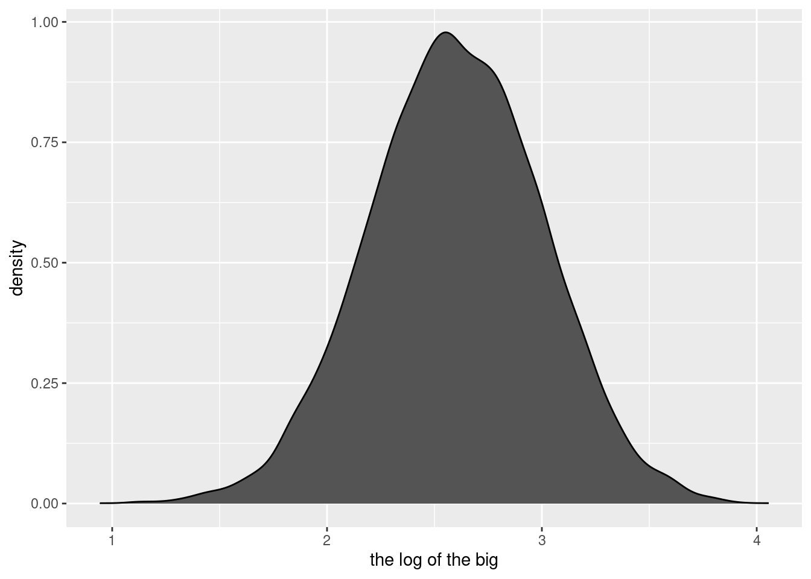
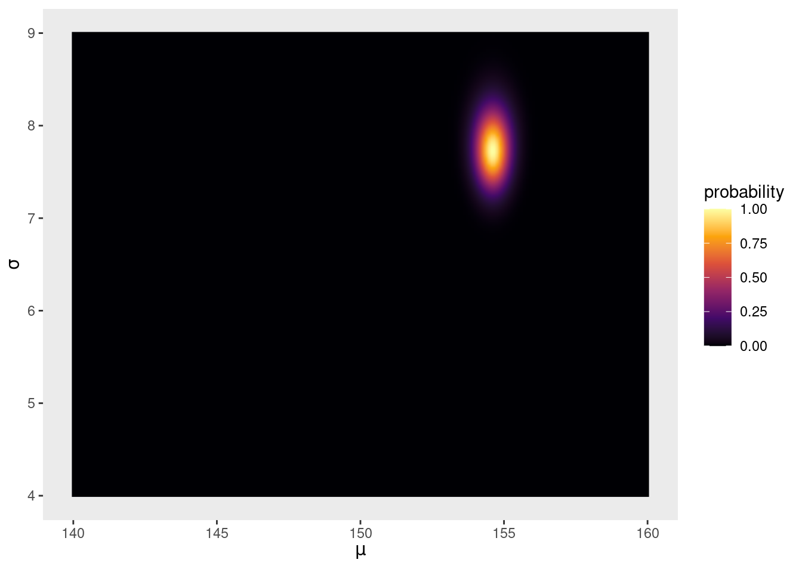
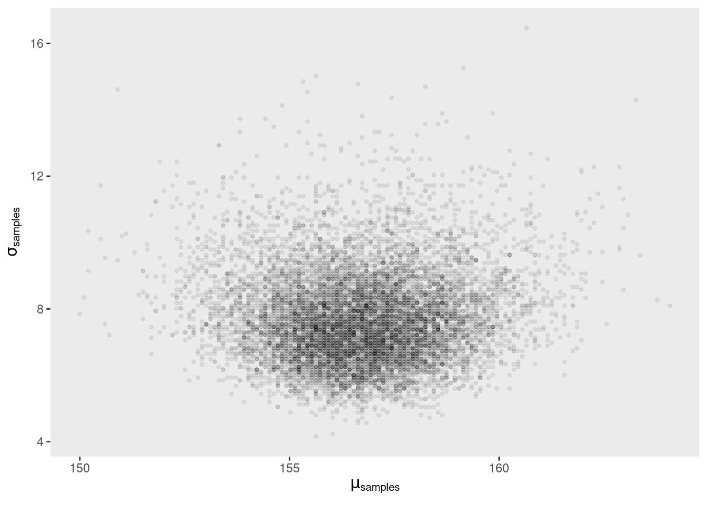
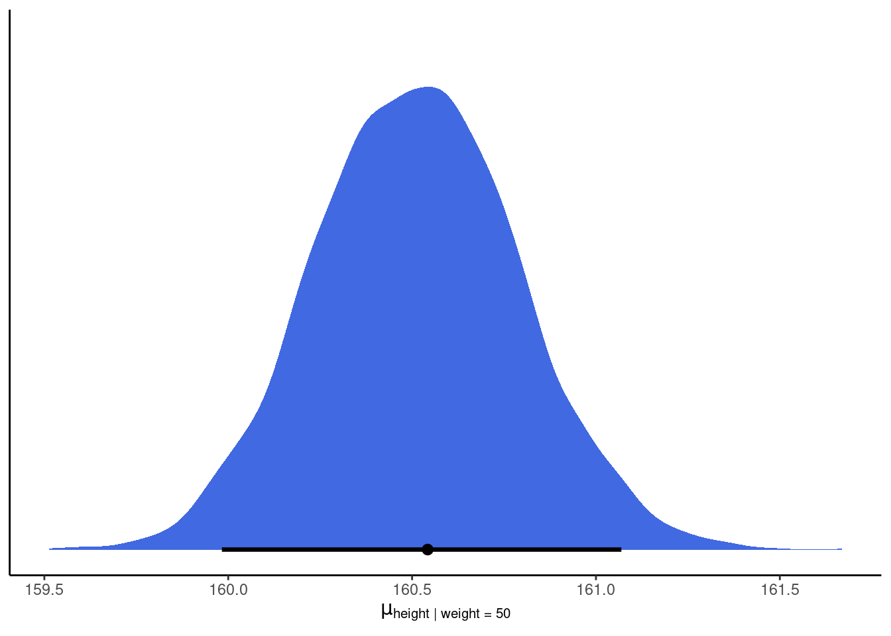
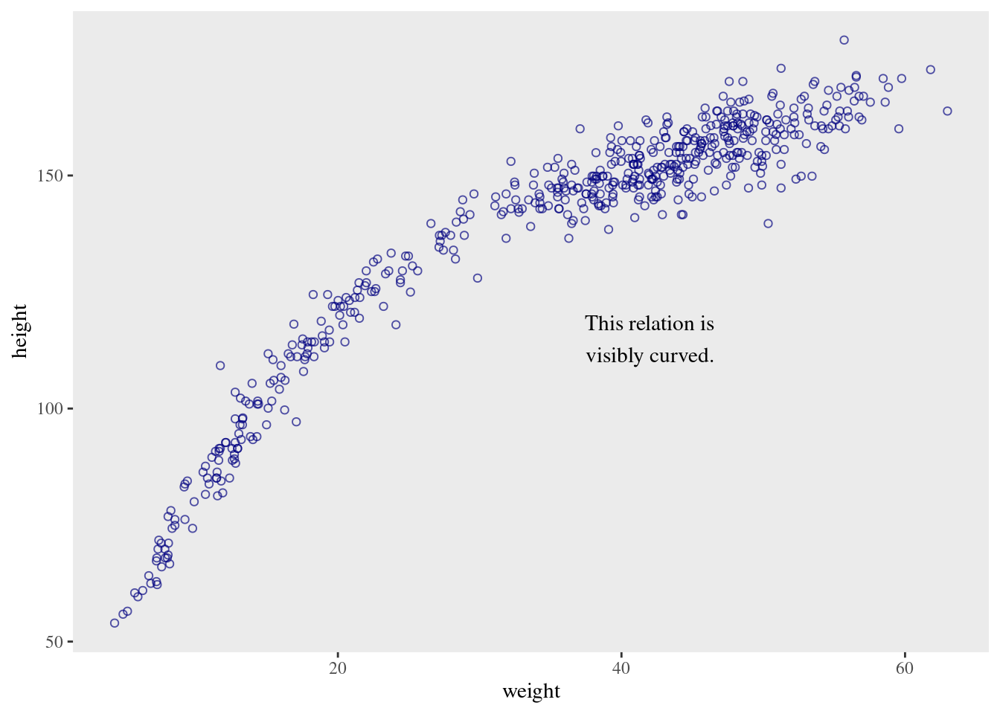
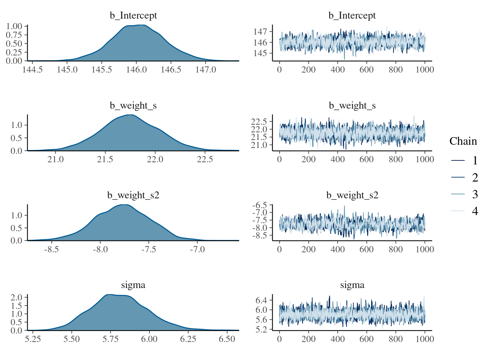
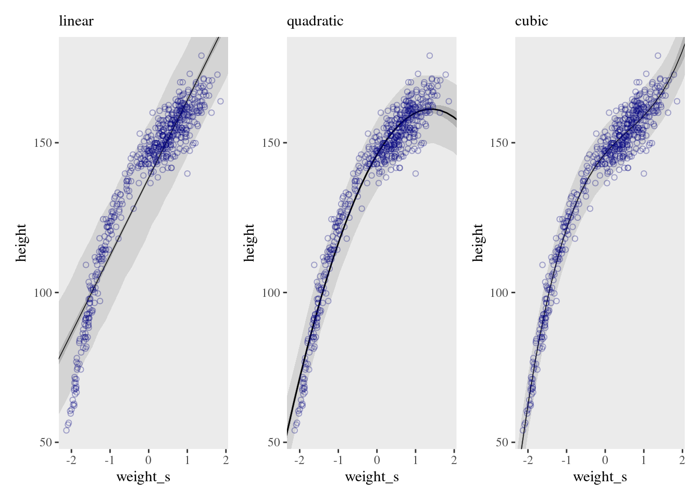
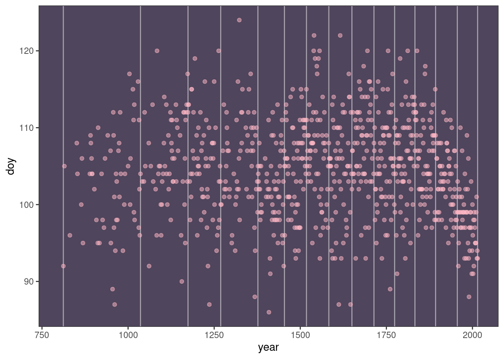
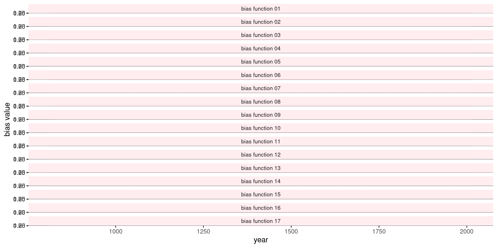
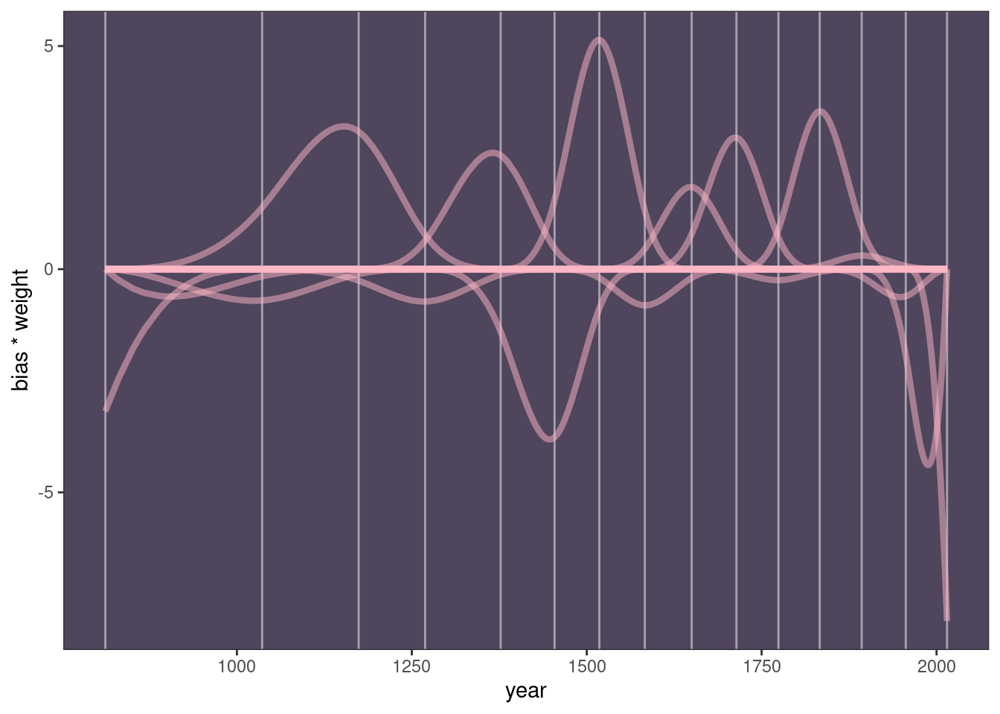

# Geocentric Models


```r
library(here)
source(here::here("code/scripts/source.R"))
```


```r
slides_dir = here::here("docs/slides/L03")
```


Introduction into regression models.

<div class="figure">

<p class="caption">As scientists, we're always dealing with questions that have higher dimensions and more complexity than what we can measure. Above is the path of Mars, called *retrograde motion*. It's an illusion caused by the joint movement of ourselves and Mars. The relative velocities create the illusion.</p>
</div>

<div class="figure">

<p class="caption">A lot of people published models, but this one is very accurate. They're full-blown mathematical models. But they're also wrong. You can't use them to send a probe to Mars. This is like a regression model. They're incredibly accurate for specific purposes, but they're also deeply wrong. Keep in mind the small world / large world distinction. You could say scientists are geocentric people. The reason Ptolemy's model works so well is that they used Fourier series - circles in circles ("epicircles"). You can use this for anything with periodic cycles. And this model still works. </p>
</div>

<div class="figure">

<p class="caption">We're here to build models of many diverse things. We don't usually use Fourier models; instead we tend to use regression. Linear regression models are incredibly useful. But if you use them without wisdom, all they do is describe things without wisdom.</p>
</div>

<div class="figure">

<p class="caption">Statistical golems which measure how the mean of some measure changes when you learn other things. The mean is always modeled as some additive weighted measure of variables.</p>
</div>

<div class="figure">

<p class="caption">Gauss developed regression, but he did it using a Bayesian argument. He used it to predict when a comet would return.</p>
</div>

## Why normal distributions are normal

<div class="figure">

<p class="caption">These appear all throughout nature. Why are they so normal? They arise from all over the place.</p>
</div>

***4.1.1 Normal by addition***

One of the things that are nice about them is that they are additive. So easy to work with. 
Second is that they're very common.

<div class="figure">

<p class="caption">Imagine a football pitch. We all line up on the midfield line. Take a coin out of your pocket and flip it. One step left for heads, right for tails. Do it a few hundred times.</p>
</div>


<div class="figure">

<p class="caption">The frequency distribution will be Gaussian.</p>
</div>


```r
pos = replicate(1000, sum(runif(16, -1, 1)))
plot(density(pos))
```


<div class="figure">

<p class="caption">This is a simulation of the soccer field experiment. After four flips (steps). Black follows one particular student. A pattern forms in the aggregation. This isn't very Gaussian yet. </p>
</div>

<div class="figure">

<p class="caption">After 8 it's pretty Gaussian.</p>
</div>

<div class="figure">

<p class="caption">And after 16 it's very Gaussian. It'll get wider and wider over time. Why does this happen? Lot's of mathematical theorems. But the intuition is that each coin flip is a fluctuation. And in the long run, fluctuations tend to cancel. If you get a string of lefts, eventually you'll get a string of rights, so the average student will end up near the middle. A very large number of them exactly cancel each other. There are more paths that will give you 0 than any other path. Then there are a few less that give you +1 or -1. And so forth.</p>
</div>


```r
# we set the seed to make the results of `runif()` reproducible.
set.seed(4)

pos <- 
  # make data with 100 people, 16 steps each with a starting point of `step == 0` (i.e., 17 rows per person)
  crossing(person = 1:100,
           step   = 0:16) %>% 
  # for all steps above `step == 0` simulate a `deviation`
  mutate(deviation = map_dbl(step, ~if_else(. == 0, 0, runif(1, -1, 1)))) %>% 
  # after grouping by `person`, compute the cumulative sum of the deviations, then `ungroup()`
  group_by(person) %>%
  mutate(position = cumsum(deviation)) %>% 
  ungroup() 

ggplot(data = pos, 
       aes(x = step, y = position, group = person)) +
  geom_vline(xintercept = c(4, 8, 16), linetype = 2) +
  geom_line(aes(color = person < 2, alpha  = person < 2)) +
  scale_color_manual(values = c("skyblue4", "black")) +
  scale_alpha_manual(values = c(1/5, 1)) +
  scale_x_continuous("step number", breaks = c(0, 4, 8, 12, 16)) +
  theme(legend.position = "none")
```


```r
# Figure 4.2.a.
p1 <-
  pos %>%
  filter(step == 4) %>%
  ggplot(aes(x = position)) +
  geom_line(stat = "density", color = "dodgerblue1") +
  labs(title = "4 steps")

# Figure 4.2.b.
p2 <-
  pos %>%
  filter(step == 8) %>%
  ggplot(aes(x = position)) +
  geom_density(color = "dodgerblue2", outline.type = "full") +
  labs(title = "8 steps")

# this is an intermediary step to get an SD value
sd <-
  pos %>%
  filter(step == 16) %>%
  summarise(sd = sd(position)) %>% 
  pull(sd)

# Figure 4.2.c.
p3 <-
  pos %>%
  filter(step == 16) %>%
  ggplot(aes(x = position)) +
  stat_function(fun = dnorm, 
                args = list(mean = 0, sd = sd),
                linetype = 2) +
  geom_density(color = "transparent", fill = "dodgerblue3", alpha = 1/2) +
  labs(title = "16 steps",
       y = "density")

library(patchwork)

# combine the ggplots
(p1 | p2 | p3) & coord_cartesian(xlim = c(-6, 6))
```


<div class="figure">

<p class="caption">That's why a bunch of natural systems are normally distributed. We don't need to know anything except that they cancel out. A lot of common statistics follow this kind of process. What you're left with are particular shapes, called *maximum entropy distributions*. For the Gaussian, **addition** is our friend. One of the things about it is that products of deviations are actually addition. So lots of multiplicative interactions also produce Gaussian distributions. You can measure things on logarithmic scales.</p>
</div>


<div class="figure">

<p class="caption">This is the ontological perspective on distributions. When fluctuations tend to dampen one another, you end up with a symmetric curve. What neat and also frustrating is that you lose a lot of information about the generative processes. When you see heights are normally distributed, you learn basically nothing about it. This is cool because all that's preserved from the underlying process is the mean and the variance. What's terrible is that you can't figure out the process from the distribution. All the maximum entropy distributions have the same feature. Power laws arise through lots of processes, and it tells you nothing other than it has high variance. The other perspective is epistemological. If you're building a model and you want to be as conservative as possible, you should use the Gaussian distribution. Because any other distribution will be narrower. So it's a very good assumption to use when you don't have additional information. The Gaussian is the one where all you're willing to say is there's a mean and a variance, you should use the Gaussian. It assumes the least.</p>
</div>

***4.1.2 Normal by multiplication***

This code just samples 12 random numbers between 1.0 and 1.1, each representing a proportional increase in growth. Thus 1.0 means no additional growth and 1.1 means a 10% increase.


```r
set.seed(4)

prod(1 + runif(12, 0, .1))
```

```
## [1] 1.774719
```

Now what distribution do you think these random products will take? Let’s generate 10,000 of them and see:


```r
set.seed(4)

growth <- 
  tibble(growth = map_dbl(1:10000, ~ prod(1 + runif(12, 0, 0.1))))

ggplot(data = growth, aes(x = growth)) +
  geom_density()
```


Multiplying small numbers if approximately the same as addition.

The smaller the effect of each locus, the better this additive approximation will be. In this way, small effects that multiply together are approximately additive, and so they also tend to stabilize on Gaussian distributions. 

Verify by comparing:


```r
# simulate
set.seed(4)

samples <-
  tibble(big   = map_dbl(1:10000, ~ prod(1 + runif(12, 0, 0.5))),
         small = map_dbl(1:10000, ~ prod(1 + runif(12, 0, 0.01))))

# wrangle
samples %>% 
  pivot_longer(everything(), values_to = "samples") %>% 
  
  # plot
  ggplot(aes(x = samples)) +
  geom_density(fill = "black") +
  facet_wrap(~ name, scales = "free") 
```


***4.1.3 Normal by log-multiplication***

Large deviates that are multiplied together do not produce Gaussian distributions, but they do tend to produce Gaussian distributions on the log scale. e.g.:


```r
samples %>% 
  mutate(log_big = log(big)) %>% 
  
  ggplot(aes(x = log_big)) +
  geom_density(fill = "gray33") +
  xlab("the log of the big")
```



Adding logs is equivalent to multiplying the original numbers. 

***4.1.4 Using Gaussian distributions***

**Caution**: Many natural (and unnatural) processes have much heavier tails - much higher probabilities of producing extreme events.

## A language for describing models

<div class="figure">

<p class="caption">All of those things are linear models. Just learn the linear modeling strategies instead of the specific procedures. We'll build up linear models from the ground up. You can build the model you need.</p>
</div>

***4.2.1 Re-describing the glob tossing model***

<div class="figure">

<p class="caption">We're going to write out all the models in the same standard notation. We're going to write this in our code so that it's reinforced.</p>
</div>

<div class="figure">

<p class="caption">Same applies for more complex models. Some of these things you can observe (water tosses), and some you can't (regression slopes). We need to list these variables and then define them.</p>
</div>

<div class="figure">

<p class="caption">The motor of these linear regression models. There's some mean of the normal distribution that is explained by $x$. But $x$ also has a distribution. </p>
</div>


```r
# how many `p_grid` points would you like?
n_points <- 100

d <-
  tibble(p_grid = seq(from = 0, to = 1, length.out = n_points),
         w      = 6, 
         n      = 9) %>% 
  mutate(prior      = dunif(p_grid, 0, 1),
         likelihood = dbinom(w, n, p_grid)) %>% 
  mutate(posterior = likelihood * prior / sum(likelihood * prior))

head(d)
```

```
## # A tibble: 6 × 6
##   p_grid     w     n prior likelihood posterior
##    <dbl> <dbl> <dbl> <dbl>      <dbl>     <dbl>
## 1 0          6     9     1   0         0       
## 2 0.0101     6     9     1   8.65e-11  8.74e-12
## 3 0.0202     6     9     1   5.37e- 9  5.43e-10
## 4 0.0303     6     9     1   5.93e- 8  5.99e- 9
## 5 0.0404     6     9     1   3.23e- 7  3.26e- 8
## 6 0.0505     6     9     1   1.19e- 6  1.21e- 7
```

```r
d %>% 
  pivot_longer(prior:posterior) %>% 
  # this line allows us to dictate the order in which the panels will appear
  mutate(name = factor(name, levels = c("prior", "likelihood", "posterior"))) %>% 
  
  ggplot(aes(x = p_grid, y = value, fill = name)) +
  geom_area() +
  scale_fill_manual(values = c("blue", "red", "purple")) +
  scale_y_continuous(NULL, breaks = NULL) +
  theme(legend.position = "none") +
  facet_wrap(~ name, scales = "free")
```


## Gaussian model of height

Before we add a predictor variable, we want to model the outcome variable as a Gaussian distribution. There are an infinite number of possible Gaussian distributions based on infinite combinations of $\mu$ and $\sigma$. We want our Bayesian machine to consider every possible distribution, and rank them by posterior plausibility. 

***4.3.1 The data***

<div class="figure">

<p class="caption">These height data come from Nancy Howell's data. `Howell1` is a simplified dataset. We'll focus just on adult heights at the moment. </p>
</div>


```r
data(Howell1)
d <- Howell1
```


```r
d %>% 
  str()
```

```
## 'data.frame':	544 obs. of  4 variables:
##  $ height: num  152 140 137 157 145 ...
##  $ weight: num  47.8 36.5 31.9 53 41.3 ...
##  $ age   : num  63 63 65 41 51 35 32 27 19 54 ...
##  $ male  : int  1 0 0 1 0 1 0 1 0 1 ...
```


```r
rethinking::precis(d)
```

```
##               mean         sd      5.5%     94.5%     histogram
## height 138.2635963 27.6024476 81.108550 165.73500 ▁▁▁▁▁▁▁▂▁▇▇▅▁
## weight  35.6106176 14.7191782  9.360721  54.50289 ▁▂▃▂▂▂▂▅▇▇▃▂▁
## age     29.3443934 20.7468882  1.000000  66.13500     ▇▅▅▃▅▂▂▁▁
## male     0.4724265  0.4996986  0.000000   1.00000    ▇▁▁▁▁▁▁▁▁▇
```


```r
head(d$height)
```

```
## [1] 151.765 139.700 136.525 156.845 145.415 163.830
```

Filter for adults:

```r
d2 = d[d$age >= 18, ]
```

***4.3.2 The model***

<div class="figure">

<p class="caption">Here's the distribution of height data. $h$ is distributed normally.</p>
</div>

<div class="figure">

<p class="caption">There's nothing special about the particular letters used. But it's important to be able to read this. Now we have three variables. One is observed, and two have not. We have to infrer them from $h$.</p>
</div>

<div class="figure">

<p class="caption">Because this is Bayesian, they have prior distributions. Using 187 cm (height of Richard) as the prior. Standard deviation is on the mean. 20 is very generous. Then for sigma, uniform 50. </p>
</div>

Whatever the prior, it's a very good idea to plot your priors:


```r
p1 <-
  tibble(x = seq(from = 100, to = 250, by = .1)) %>% 
  
  ggplot(aes(x = x, y = dnorm(x, mean = 178, sd = 20))) +
  geom_line() +
  scale_x_continuous(breaks = seq(from = 100, to = 250, by = 75)) +
  labs(title = "mu ~ dnorm(178, 20)",
       y = "density")

p1
```


The $\sigma$ prior is a truly flat prior.


```r
p2 <-
  tibble(x = seq(from = -10, to = 60, by = .1)) %>%
  
  ggplot(aes(x = x, y = dunif(x, min = 0, max = 50))) +
  geom_line() +
  scale_x_continuous(breaks = c(0, 50)) +
  scale_y_continuous(NULL, breaks = NULL) +
  ggtitle("sigma ~ dunif(0, 50)")

p2
```


A standard deviation like $\sigma$ must be positive, so bounding it at zero makes sense.

<div class="figure">

<p class="caption">Before your model has seen the data. This is not p-hacking, because we're not using the data. We're using scientific information. All you have to sample values.</p>
</div>


```r
n <- 1e4

set.seed(4)

sim <-
  tibble(sample_mu    = rnorm(n, mean = 178, sd  = 20),
         sample_sigma = runif(n, min = 0, max = 50)) %>% 
  mutate(height = rnorm(n, mean = sample_mu, sd = sample_sigma))
  
p3 <- sim %>% 
  ggplot(aes(x = height)) +
  geom_density(fill = "grey33") +
  scale_x_continuous(breaks = c(0, 73, 178, 283)) +
  scale_y_continuous(NULL, breaks = NULL) +
  ggtitle("height ~ dnorm(mu, sigma)") +
  theme(panel.grid = element_blank())

p3
```


This is not a normal distribution. It's a t-distribution because you have uncertainty about variance, which gives it fat tails. There are some really really tall individuals in this prior. But at least we don't have any negative heights. 

Let's see the implied heights with a flatter and less informative prior for $\mu$.:


```r
# simulate
set.seed(4)

sim <-
  tibble(sample_mu    = rnorm(n, mean = 178, sd = 100),
         sample_sigma = runif(n, min = 0, max = 50)) %>% 
  mutate(height = rnorm(n, mean = sample_mu, sd = sample_sigma))

# compute the values we'll use to break on our x axis
breaks <-
  c(mean(sim$height) - 3 * sd(sim$height), 0, mean(sim$height), mean(sim$height) + 3 * sd(sim$height)) %>% 
  round(digits = 0)

# this is just for aesthetics
text <-
  tibble(height = 272 - 25,
         y      = .0013,
         label  = "tallest man",
         angle  = 90)

# plot
p4 <-
  sim %>% 
  ggplot(aes(x = height)) +
  geom_density(fill = "black", size = 0) +
  geom_vline(xintercept = 0, color = "grey92") +
  geom_vline(xintercept = 272, color = "grey92", linetype = 3) +
  geom_text(data = text,
            aes(y = y, label = label, angle = angle),
            color = "grey92") +
  scale_x_continuous(breaks = breaks) +
  scale_y_continuous(NULL, breaks = NULL) +
  ggtitle("height ~ dnorm(mu, sigma)\nmu ~ dnorm(178, 100)") +
  theme(panel.grid = element_blank())

p4
```


```r
(p1 + xlab("mu") | p2 + xlab("sigma")) / (p3 | p4)
```


Before it even sees the data, it expects 4% of people to have negative height, and also some giants. Does it matter? In this case we have so much data that the silly prior is harmless. But that won't always be the case. There are plenty of inference problems for which the data alone are not sufficient, no matter how numerous. Bayes lets us proceed in these cases, but only if we use our scientific knowledge to construct sensible priors. *The important thing is that your prior not be based on the values in the data, but only on what you know about the data before you see it.*

Let's use a different prior.

<div class="figure">

<p class="caption">Typical linear regression priors are flat. They're bad new because they create impossible outcomes before you even see the data.</p>
</div>

***4.3.3 Grid approximation of the posterior distribution***

<div class="figure">

<p class="caption">Once you start working with mixed models, the priors have a greater effect, so it's good to get used to prior predictive simulation now. We'll calculate the grid and the posterior probability. How? Multiply the observed height conditional on the mu and sigma at that point. Times the prior probability of that mu and sigma. They code to do this is some loops. </p>
</div>


<div class="figure">

<p class="caption">100x100 you start to see the Gaussian hill. Gradually the values become increasingly implausible. What we do here is draw samples.</p>
</div>

Here are the guts of the golem:


```r
d2 <- 
  d %>%
  filter(age >= 18)

n <- 200

d_grid <-
  # we'll accomplish with `tidyr::crossing()` what McElreath did with base R `expand.grid()`
  tidyr::crossing(mu    = seq(from = 140, to = 160, length.out = n),
                  sigma = seq(from = 4, to = 9, length.out = n))

glimpse(d_grid)
```

```
## Rows: 40,000
## Columns: 2
## $ mu    <dbl> 140, 140, 140, 140, 140, 140, 140, 140, 140, 140, 140, 140, 140,…
## $ sigma <dbl> 4.000000, 4.025126, 4.050251, 4.075377, 4.100503, 4.125628, 4.15…
```

`d_grid` contains every combination of `mu` and `sigma` across their specified values. 

Create custom function:


```r
grid_function <- function(mu, sigma) {
  
  dnorm(d2$height, mean = mu, sd = sigma, log = T) %>% 
    sum()
  
}
```


```r
d_grid <-
  d_grid %>% 
  mutate(log_likelihood = purrr::map2(mu, sigma, grid_function)) %>%
  unnest(log_likelihood) %>% 
  mutate(prior_mu    = dnorm(mu, mean = 178, sd = 20, log = T),
         prior_sigma = dunif(sigma, min = 0, max = 50, log = T)) %>% 
  mutate(product = log_likelihood + prior_mu + prior_sigma) %>% 
  mutate(probability = exp(product - max(product)))
  
head(d_grid)
```

```
## # A tibble: 6 × 7
##      mu sigma log_likelihood prior_mu prior_sigma product probability
##   <dbl> <dbl>          <dbl>    <dbl>       <dbl>   <dbl>       <dbl>
## 1   140  4            -3813.    -5.72       -3.91  -3822.           0
## 2   140  4.03         -3778.    -5.72       -3.91  -3787.           0
## 3   140  4.05         -3743.    -5.72       -3.91  -3753.           0
## 4   140  4.08         -3709.    -5.72       -3.91  -3719.           0
## 5   140  4.10         -3676.    -5.72       -3.91  -3686.           0
## 6   140  4.13         -3644.    -5.72       -3.91  -3653.           0
```


Inspect the posterior distribution


```r
d_grid %>% 
  ggplot(aes(x = mu, y = sigma, z = probability)) + 
  geom_contour() +
  labs(x = expression(mu),
       y = expression(sigma)) +
  coord_cartesian(xlim = range(d_grid$mu),
                  ylim = range(d_grid$sigma)) +
  theme(panel.grid = element_blank())
```


```r
d_grid %>% 
  ggplot(aes(x = mu, y = sigma, fill = probability)) + 
  geom_raster(interpolate = T) +
  scale_fill_viridis_c(option = "B") +
  labs(x = expression(mu),
       y = expression(sigma)) +
  theme(panel.grid = element_blank())
```



***4.3.4 Sampling from the posterior***


```r
set.seed(4)

d_grid_samples <- 
  d_grid %>% 
  sample_n(size = 1e4, replace = T, weight = probability)

d_grid_samples %>% 
  ggplot(aes(x = mu, y = sigma)) + 
  geom_point(size = .9, alpha = 1/15) +
  scale_fill_viridis_c() +
  labs(x = expression(mu[samples]),
       y = expression(sigma[samples])) +
  theme(panel.grid = element_blank())
```


```r
d_grid_samples %>% 
  pivot_longer(mu:sigma) %>% 

  ggplot(aes(x = value)) + 
  geom_density(fill = "grey33") +
  scale_y_continuous(NULL, breaks = NULL) +
  xlab(NULL) +
  theme(panel.grid = element_blank()) +
  facet_wrap(~ name, scales = "free", labeller = label_parsed)
```


Summarise the widths:


```r
d_grid_samples %>% 
  pivot_longer(mu:sigma) %>% 
  group_by(name) %>% 
  tidybayes::mode_hdi(value)
```

```
## # A tibble: 2 × 7
##   name   value .lower .upper .width .point .interval
##   <chr>  <dbl>  <dbl>  <dbl>  <dbl> <chr>  <chr>    
## 1 mu    155.   154.   155.     0.95 mode   hdi      
## 2 sigma   7.82   7.14   8.30   0.95 mode   hdi
```

<div class="figure">

<p class="caption">Once you have the samples, you just work with the data frame. You can look at cross-sections of this.</p>
</div>

Note that this isn't perfectly symmetrical for sigma - the right tail is longer. This is almost always true for SD parameters. Why? Because you know something about the SD before you see the data: you know it's positive. So you always have more uncertainty on the higher end. 

Let's analyze only 20 of the heights from the height data to reveal this issue.


```r
set.seed(4)
(d3 <- sample(d2$height, size = 20))
```

```
##  [1] 147.3200 154.9400 168.9100 156.8450 165.7350 151.7650 165.7350 156.2100
##  [9] 144.7800 154.9400 151.1300 147.9550 149.8600 162.5600 161.9250 164.4650
## [17] 160.9852 151.7650 163.8300 149.8600
```

Now repeat the code from the previous subsection, modified to focus on the 20 heights in `d3` rather than the original data.


```r
n <- 200

# note we've redefined the ranges of `mu` and `sigma`
d_grid <-
  crossing(mu    = seq(from = 150, to = 170, length.out = n),
           sigma = seq(from = 4, to = 20, length.out = n))

# amend the grid function
grid_function <- function(mu, sigma) {
  
  dnorm(d3, mean = mu, sd = sigma, log = T) %>% 
    sum()
  
}

# make the posterior
d_grid <-
  d_grid %>% 
  mutate(log_likelihood = map2_dbl(mu, sigma, grid_function)) %>% 
  mutate(prior_mu    = dnorm(mu, mean = 178, sd = 20, log = T),
         prior_sigma = dunif(sigma, min = 0, max = 50, log = T)) %>% 
  mutate(product = log_likelihood + prior_mu + prior_sigma) %>% 
  mutate(probability = exp(product - max(product)))

# `sample_n()` and plot
set.seed(4)

d_grid_samples <- 
  d_grid %>% 
  sample_n(size = 1e4, replace = T, weight = probability)

d_grid_samples %>% 
  ggplot(aes(x = mu, y = sigma)) + 
  geom_point(size = .9, alpha = 1/15) +
  labs(x = expression(mu[samples]),
       y = expression(sigma[samples])) +
  theme(panel.grid = element_blank())
```



And the updated densities..

```r
d_grid_samples %>% 
  pivot_longer(mu:sigma) %>% 

  ggplot(aes(x = value)) + 
  geom_density(fill = "grey33", size = 0) +
  scale_y_continuous(NULL, breaks = NULL) +
  xlab(NULL) +
  theme(panel.grid = element_blank()) +
  facet_wrap(~ name, scales = "free", labeller = label_parsed)
```


Now you can see the posterior for $\sigma$ is not Gaussian, but as a long tail towards higher values. 

***4.3.5 Finding the posterior distribution with `quap`***


<div class="figure">

<p class="caption">Grid approximation is useful for teaching, but now we'll do a fancy approximation of it so we can go to higher dimensions. THat approximation asserts that the distribution is normal for every parameter. But once you get to generalised linear models it's a bad approximation. How does this work? You need two numbers: mean and SD. For multi-dimensional Gaussians, you also need a covariance matrix for the parameters. How do you do it? You climb the hill. It doesn't know what the hill is, but it knows what is up and down. So it tries to find the peak. When it gets to the peak, it needs to measure the curvature of the peak. And that's all it needs to approxi ate the curve. Often called the LaPlace approximation.</p>
</div>


`quap` works by making the formula lists. Typically there's some abbreviated forms. You'll have to write how every parameter multiplies every variable. 


```r
b4.1 <- 
  brm(data = d2, 
      family = gaussian,
      height ~ 1,
      prior = c(prior(normal(178, 20), class = Intercept),
                prior(uniform(0, 50), class = sigma)),
      iter = 31000, warmup = 30000, chains = 4, cores = 4,
      seed = 4,
      file = "fits/b04.01")

# HMC tends to work better when you default to an exponential or half Cauchy for sigma
b4.1_hc <- 
  brms::brm(data = d2, 
            family = gaussian,
            height ~ 1,
            prior = c(brms::prior(normal(178, 20), class = Intercept),
                      # the magic lives here
                      brms::prior(cauchy(0, 1), class = sigma)),
            iter = 2000, warmup = 1000, chains = 4, cores = 4,
            seed = 4,
            file = "fits/b04.01_hc")
```

Plug in the parameters and plug it into `quap`.


`quap` translates it into a statement about a log probability of the combinations of data, then passes it to the hill-finding algorithm built into R called `optim`, which passes it back as a list of means and a covariance matrix, which is sufficient to create a posterior distribution.

<div class="figure">

<p class="caption">`precis` is minimalistic compared to `summary`. Provides the 89% compatibility intervals.</p>
</div>


These numbers provide Gaussian approximations for each parameter's *marginal* distribution, meaning the plausibility of each value of $\mu$ after averaging over the plausibilities of each value of $\sigma$. 

`quap` estimates the posterior by climbing it like a hill. To do this, it has to start climbing someplace, at some combination of parameter values. But it's possible to specify a starting value


```r
plot(b4.1_hc)
```


Get the model summary:


```r
print(b4.1_hc)
```

```
##  Family: gaussian 
##   Links: mu = identity; sigma = identity 
## Formula: height ~ 1 
##    Data: d2 (Number of observations: 352) 
## Samples: 4 chains, each with iter = 2000; warmup = 1000; thin = 1;
##          total post-warmup samples = 4000
## 
## Population-Level Effects: 
##           Estimate Est.Error l-95% CI u-95% CI Rhat Bulk_ESS Tail_ESS
## Intercept   154.61      0.41   153.81   155.42 1.00     3833     2967
## 
## Family Specific Parameters: 
##       Estimate Est.Error l-95% CI u-95% CI Rhat Bulk_ESS Tail_ESS
## sigma     7.74      0.29     7.20     8.35 1.00     3511     2853
## 
## Samples were drawn using sampling(NUTS). For each parameter, Bulk_ESS
## and Tail_ESS are effective sample size measures, and Rhat is the potential
## scale reduction factor on split chains (at convergence, Rhat = 1).
```

If you want the 89% intervals like `rethinking`:


```r
summary(b4.1_hc, prob = .89)
```

```
##  Family: gaussian 
##   Links: mu = identity; sigma = identity 
## Formula: height ~ 1 
##    Data: d2 (Number of observations: 352) 
## Samples: 4 chains, each with iter = 2000; warmup = 1000; thin = 1;
##          total post-warmup samples = 4000
## 
## Population-Level Effects: 
##           Estimate Est.Error l-89% CI u-89% CI Rhat Bulk_ESS Tail_ESS
## Intercept   154.61      0.41   153.96   155.27 1.00     3833     2967
## 
## Family Specific Parameters: 
##       Estimate Est.Error l-89% CI u-89% CI Rhat Bulk_ESS Tail_ESS
## sigma     7.74      0.29     7.29     8.23 1.00     3511     2853
## 
## Samples were drawn using sampling(NUTS). For each parameter, Bulk_ESS
## and Tail_ESS are effective sample size measures, and Rhat is the potential
## scale reduction factor on split chains (at convergence, Rhat = 1).
```


Let's splice in a more informative prior for $\mu$ so you can see the effect.


```r
b4.2 <- 
  brm(data = d2, 
      family = gaussian,
      height ~ 1,
      prior = c(prior(normal(178, 0.1), class = Intercept),
                prior(uniform(0, 50), class = sigma)),
      iter = 2000, warmup = 1000, chains = 4, cores = 4,
      seed = 4,
      file = "fits/b04.02")

plot(b4.2)
```


```r
summary(b4.2)
```

```
##  Family: gaussian 
##   Links: mu = identity; sigma = identity 
## Formula: height ~ 1 
##    Data: d2 (Number of observations: 352) 
## Samples: 4 chains, each with iter = 2000; warmup = 1000; thin = 1;
##          total post-warmup samples = 4000
## 
## Population-Level Effects: 
##           Estimate Est.Error l-95% CI u-95% CI Rhat Bulk_ESS Tail_ESS
## Intercept   177.86      0.10   177.66   178.06 1.00     3467     2724
## 
## Family Specific Parameters: 
##       Estimate Est.Error l-95% CI u-95% CI Rhat Bulk_ESS Tail_ESS
## sigma    24.59      0.91    22.95    26.54 1.01      483      422
## 
## Samples were drawn using sampling(NUTS). For each parameter, Bulk_ESS
## and Tail_ESS are effective sample size measures, and Rhat is the potential
## scale reduction factor on split chains (at convergence, Rhat = 1).
```


Compare the two:


```r
rbind(summary(b4.1_hc)$fixed,
      summary(b4.2)$fixed)
```

```
##           Estimate Est.Error l-95% CI u-95% CI     Rhat Bulk_ESS Tail_ESS
## Intercept 154.6133 0.4100253 153.8146 155.4213 1.000225     3833     2967
## Intercept 177.8637 0.1014405 177.6609 178.0614 1.000384     3467     2724
```

***4.3.6 Sampling from a ~~`quap`~~ `brm()` fit***

To this the matrix of variances and covariances among all paris of parameters:


```r
post <- brms::posterior_samples(b4.1_hc) %>% 
  dplyr::select(b_Intercept, sigma, lp__)

head(post)
```

```
##   b_Intercept    sigma      lp__
## 1    154.2645 7.992651 -1227.255
## 2    154.6744 7.427472 -1227.075
## 3    154.7472 7.410110 -1227.193
## 4    154.7948 8.470115 -1229.452
## 5    154.2154 7.940177 -1227.219
## 6    154.7131 7.744806 -1226.553
```

This is a **Variant-covariance Matrix**. It is the multi-dimensional glue of a quadratic approximation, because it tells us how each parameter relates to every other parameter in the posterior distribution.


```r
# NOw `select()` the columns and feed them into `cov()`
dplyr::select(post, b_Intercept:sigma) %>% 
  cov()
```

```
##              b_Intercept        sigma
## b_Intercept  0.168120762 -0.005250413
## sigma       -0.005250413  0.086979181
```

```r
# variances
dplyr::select(post, b_Intercept:sigma) %>%
  cov() %>%
  diag()
```

```
## b_Intercept       sigma 
##  0.16812076  0.08697918
```

```r
# correlation
post %>%
  dplyr::select(b_Intercept, sigma) %>%
    cor()
```

```
##             b_Intercept       sigma
## b_Intercept  1.00000000 -0.04341854
## sigma       -0.04341854  1.00000000
```


```r
post %>%
  pivot_longer(-lp__) %>% 
  group_by(name) %>%
  summarise(mean = mean(value),
            sd   = sd(value),
            `2.5%`  = quantile(value, probs = .025),
            `97.5%` = quantile(value, probs = .975)) %>%
  mutate_if(is.numeric, round, digits = 2) %>% 
  mutate(histospark = c(histospark(post$b_Intercept), histospark(post$sigma)))
```

```
## # A tibble: 2 × 6
##   name          mean    sd `2.5%` `97.5%` histospark 
##   <chr>        <dbl> <dbl>  <dbl>   <dbl> <chr>      
## 1 b_Intercept 155.    0.41  154.   155.   ▁▁▅▇▂▁▁    
## 2 sigma         7.74  0.29    7.2    8.35 ▁▁▂▅▇▇▃▁▁▁▁
```


<div class="figure">

<p class="caption">To find out what it means, you draw some lines. I think of this tool as a scaffold so you can learn how to do modelling. But after you can use packages that use abbreviations. But it's important to learn how to build them. You'll come to appreciate how explicit it is. </p>
</div>

You want to graduate beyond `quap` because for generalised linear modelling it becomes dangerous.

## Linear prediction

Let's look at how height in these Kalahari foragers covaries with weight. 


```r
ggplot(data = d2, 
       aes(x = weight, y = height)) +
  geom_point(shape = 1, size = 2) +
  theme_bw() +
  theme(panel.grid = element_blank())
```


So now let's add a line. When we learn the predictions, we can learn the statistical association between weight and height. The question is how would you statistically describe this relationship?

***4.4.1 The linear model strategy***

<div class="figure">

<p class="caption">So what do we do? We add another variable to the model, and now we have a linear regression. This model has all the standard features. Now there's an $i$ on $\mu$. That means it's different for each person. $\alpha$ is out population mean. $\beta$ describes the relationship between $x$ and $y$.</p>
</div>

<div class="figure">

<p class="caption">The equals sign mean that it's deterministically defined. $\beta$ is what you'd call a slope, or the rate of change in $mu$ for a unit change in $x$. Why do we subtract x bar? This is called centering the predictor. Should be your default behaviour.</p>
</div>

<div class="figure">

<p class="caption">It's now predicting lines. So what does the prior predictive distribution look like? A whole lot of lines.</p>
</div>


```r
set.seed(2971)
# how many lines would you like?
n_lines <- 100

lines <-
  tibble(n = 1:n_lines,
         a = rnorm(n_lines, mean = 178, sd = 20),
         b = rnorm(n_lines, mean = 0, sd = 10)) %>% 
  expand(nesting(n, a, b), weight = range(d2$weight)) %>% 
  mutate(height = a + b * (weight - mean(d2$weight)))

head(lines)
```

```
## # A tibble: 6 × 5
##       n     a      b weight height
##   <int> <dbl>  <dbl>  <dbl>  <dbl>
## 1     1  191. -7.06    31.1  289. 
## 2     1  191. -7.06    63.0   63.5
## 3     2  199.  0.839   31.1  187. 
## 4     2  199.  0.839   63.0  214. 
## 5     3  202.  3.93    31.1  147. 
## 6     3  202.  3.93    63.0  272.
```

Now we have 100 paris of $\alpha$ and $\beta$ values.

Simulate 100 lines as before. 


```r
lines %>% 
  ggplot(aes(x = weight, y = height, group = n)) +
  geom_hline(yintercept = c(0, 272), linetype = 2:1, size = 1/3) +
  geom_line(alpha = 1/10) +
  coord_cartesian(ylim = c(-100, 400)) +
  ggtitle("b ~ dnorm(0, 10)") +
  theme_classic()
```


Getting the scatter right is important, because you can see these impossibly steep lines. Some of them take you from impossibly short individuals to twice the tallest. Want to dampen these expectations. Practise on these safe examples. 

<div class="figure">

<p class="caption">We know that $\beta$ is positive, so let's make it positive. A log normal distribution is a normal distribution logged. What's nice is that they're all positive. We want to assume the relationship between weight and height is positive.</p>
</div>


```r
set.seed(4)

tibble(b = rlnorm(1e4, mean = 0, sd = 1)) %>% 
  ggplot(aes(x = b)) +
  geom_density(fill = "grey92") +
  coord_cartesian(xlim = c(0, 5)) +
  theme_classic()
```


A log-normal distribution is the distibution whose logarithm is normally distributed.


```r
set.seed(4)

tibble(rnorm           = rnorm(1e5, mean = 0, sd = 1),
       `log(rlognorm)` = log(rlnorm(1e5, mean = 0, sd = 1))) %>% 
  pivot_longer(everything()) %>% 

  ggplot(aes(x = value)) +
  geom_density(fill = "grey92") +
  coord_cartesian(xlim = c(-3, 3)) +
  theme_classic() +
  facet_wrap(~ name, nrow = 2)
```


Still a lot of scatter, but still one crazy line. Now at least we're in the possible range.


```r
# make a tibble to annotate the plot
text <-
  tibble(weight = c(34, 43),
         height = c(0 - 25, 272 + 25),
         label  = c("Embryo", "World's tallest person (272 cm)"))

# simulate
set.seed(2971)

tibble(n = 1:n_lines,
       a = rnorm(n_lines, mean = 178, sd = 20),
       b = rlnorm(n_lines, mean = 0, sd = 1)) %>% 
  expand(nesting(n, a, b), weight = range(d2$weight)) %>% 
  mutate(height = a + b * (weight - mean(d2$weight))) %>%
  
  # plot
  ggplot(aes(x = weight, y = height, group = n)) +
  geom_hline(yintercept = c(0, 272), linetype = 2:1, size = 1/3) +
  geom_line(alpha = 1/10) +
  geom_text(data = text,
            aes(label = label),
            size = 3) +
  coord_cartesian(ylim = c(-100, 400)) +
  ggtitle("log(b) ~ dnorm(0, 1)") +
  theme_classic()
```


> How to choose a prior? The procedure we've performed in this chapter is to choose priors conditional on pre-data knowledge of the variables - their constraints, ranges, and theoretical relationships. 

***4.4.2 Finding the posterior distribution***

<div class="figure">

<p class="caption">Measure $\bar{x}$ Then define the `quap` model. Focus on the $\mu$ line. </p>
</div>

To add a predictor, just use the `+` operator in the model `formula`.


```r
# make a new variable for `weight - xbar`
d2 <-
  d2 %>% 
  mutate(weight_c = weight - mean(weight))
# fit model
b4.3 <- 
  brm(data = d2, 
      family = gaussian,
      height ~ 1 + weight_c,
      prior = c(prior(normal(178, 20), class = Intercept),
                prior(lognormal(0, 1), class = b),
                prior(uniform(0, 50), class = sigma)),
      iter = 28000, warmup = 27000, chains = 4, cores = 4,
      seed = 4,
      file = "fits/b04.03")
```


```r
plot(b4.3)
```


```r
b4.3b <- 
  brm(data = d2, 
      family = gaussian,
      bf(height ~ a + exp(lb) * weight_c,
         a ~ 1,
         lb ~ 1,
         nl = TRUE),
      prior = c(prior(normal(178, 20), class = b, nlpar = a),
                prior(normal(0, 1), class = b, nlpar = lb),
                prior(uniform(0, 50), class = sigma)),
      iter = 31000, warmup = 30000, chains = 4, cores = 4,
      seed = 4,
      file = "fits/b04.03b")
```


***4.4.3 Interpreting the posterior distribution***


```r
brms::posterior_summary(b4.3)[1:3, ] %>% 
  round(digits = 2)
```

```
##             Estimate Est.Error   Q2.5  Q97.5
## b_Intercept    154.6      0.27 154.08 155.14
## b_weight_c       0.9      0.04   0.83   0.99
## sigma            5.1      0.19   4.75   5.50
```

See the covariances:


```r
vcov(b4.3) %>% 
  round(3)
```

```
##           Intercept weight_c
## Intercept     0.076    0.000
## weight_c      0.000    0.002
```

No $\sigma$. To get that we have to extract the posterior draws and use the `cov()` function instead:


```r
brms::posterior_samples(b4.3) %>%
  dplyr::select(-lp__, -starts_with(".")) %>%
  cov() %>%
  round(digits = 3)
```

```
##             b_Intercept b_weight_c sigma
## b_Intercept       0.076      0.000 0.000
## b_weight_c        0.000      0.002 0.000
## sigma             0.000      0.000 0.036
```


Very little covariation among the parameters in this case.


```r
# Show both the marginal posteriors and the covariance
pairs(b4.3)
```


In the practice problems at the end of the chapter, you'll see that the lack of covariance among the parameters results from **Centering**.

Plot the data with the posterior mean values for `a` and `b`:


```r
d2 %>%
  ggplot(aes(x = weight_c, y = height)) +
  geom_abline(intercept = fixef(b4.3)[1], 
              slope     = fixef(b4.3)[2]) +
  geom_point(shape = 1, size = 2, color = "royalblue") +
  theme_classic()
```


Adjust the x-axis breaks to return them to real values.


```r
labels <-
  c(-10, 0, 10) + mean(d2$weight) %>% 
  round(digits = 0)

d2 %>%
  ggplot(aes(x = weight_c, y = height)) +
  geom_abline(intercept = fixef(b4.3)[1], 
              slope     = fixef(b4.3)[2]) +
  geom_point(shape = 1, size = 2, color = "royalblue") +
  scale_x_continuous("weight",
                     breaks = c(-10, 0, 10),
                     labels = labels) +
  theme_bw() +
  theme(panel.grid = element_blank())
```


<div class="figure">

<p class="caption">We managed to get this posterior distribution, and we can take from the precis values the `a` and `b`b values and draw a line with those, where `a` is the expected value of height (155) when weight is at its average value. And the expected change in height is nearly 1. But the posterior distribution is not a single line, it's an infinite number of lines each with a probability. So let's get more lines on the graph to show the uncertainty in inference. </p>
</div>

<div class="figure">

<p class="caption">Here's the basic idea. We're going to sample from the posterior distribution. But what's great is that you can use this process for any model you ever want to fit. You can sample from the posterior, then push the samples back through the model itself to plot the uncertainty.</p>
</div>

<div class="figure">

<p class="caption">You're doing calculus here, but just doesn't feel like it. Each row is a line. Lines that are more plausible have more ways to happen, so they're overlap more in the areas that are more plausible.</p>
</div>


```r
post <- brms::posterior_samples(b4.3)

post %>%
  slice(1:5)  # this serves a similar function as `head()`
```

```
##   b_Intercept b_weight_c    sigma      lp__
## 1    154.0395  0.8883175 5.019815 -1081.040
## 2    155.0064  0.8813894 5.149540 -1080.008
## 3    154.2648  0.8641695 5.200915 -1080.066
## 4    154.4480  0.9149853 4.956529 -1079.143
## 5    154.7072  0.9176580 5.190356 -1079.014
```

<div class="figure">

<p class="caption">To see this work, and reinforce how Bayesian updating works, let's start with a reduced dataset of 10 randomly sampled adults. We fit our linear regression model, and get a quadratic approximation of the posterior distribution. You'll see they're very different from the prior. Now they're very concentrated around the data. You can see there's a lot of scatter because the model isn't sure where it should be.</p>
</div>


```r
N <- 10

b4.3_010 <- 
  brm(data = d2 %>%
        slice(1:N),  # note our tricky use of `N` and `slice()`
      family = gaussian,
      height ~ 1 + weight_c,
      prior = c(prior(normal(178, 20), class = Intercept),
                prior(lognormal(0, 1), class = b),
                prior(uniform(0, 50), class = sigma)),
      iter = 11000, warmup = 10000, chains = 4, cores = 4,
      seed = 4,
      file = "fits/b04.03_010")

N <- 50

b4.3_050 <- 
  brm(data = d2 %>%
        slice(1:N), 
      family = gaussian,
      height ~ 1 + weight_c,
      prior = c(prior(normal(178, 20), class = Intercept),
                prior(lognormal(0, 1), class = b),
                prior(uniform(0, 50), class = sigma)),
      iter = 11000, warmup = 10000, chains = 4, cores = 4,
      seed = 4,
      file = "fits/b04.03_050")

N <- 150

b4.3_150 <- 
  brm(data = d2 %>%
        slice(1:N), 
      family = gaussian,
      height ~ 1 + weight_c,
      prior = c(prior(normal(178, 20), class = Intercept),
                prior(lognormal(0, 1), class = b),
                prior(uniform(0, 50), class = sigma)),
      iter = 21000, warmup = 20000, chains = 4, cores = 4,
      seed = 4,
      file = "fits/b04.03_150")

N <- 352

b4.3_352 <- 
  brm(data = d2 %>%
        slice(1:N), 
      family = gaussian,
      height ~ 1 + weight_c,
      prior = c(prior(normal(178, 20), class = Intercept),
                prior(lognormal(0, 1), class = b),
                prior(uniform(0, 50), class = sigma)),
      iter = 28000, warmup = 27000, chains = 4, cores = 4,
      seed = 4,
      file = "fits/b04.03_352")
```


```r
post010 <- brms::posterior_samples(b4.3_010) %>% 
  dplyr::select(-starts_with("."))
post050 <- brms::posterior_samples(b4.3_050) %>% 
  dplyr::select(-starts_with("."))
post150 <- brms::posterior_samples(b4.3_150) %>% 
  dplyr::select(-starts_with("."))
post352 <- brms::posterior_samples(b4.3_352) %>% 
  dplyr::select(-starts_with("."))
```


Now plot 20 of these lines:


```r
p1 <- 
  ggplot(data =  d2[1:10, ], 
         aes(x = weight_c, y = height)) +
  geom_abline(intercept = post010 %>% 
                dplyr::slice(1:20) %>% 
                dplyr::pull("b_Intercept"), 
              slope     = post010 %>% 
                dplyr::slice(1:20) %>% 
                dplyr::pull("b_weight_c"),
              size = 1/3, alpha = .3) +
  geom_point(shape = 1, size = 2, color = "royalblue") +
  coord_cartesian(xlim = range(d2$weight_c),
                  ylim = range(d2$height)) +
  labs(subtitle = "N = 10")

p2 <-
  ggplot(data =  d2[1:50, ], 
         aes(x = weight_c, y = height)) +
  geom_abline(intercept = post050 %>% 
                dplyr::slice(1:20) %>% 
                dplyr::pull("b_Intercept"), 
              slope     = post050 %>% 
                dplyr::slice(1:20) %>% 
                dplyr::pull("b_weight_c"),
              size = 1/3, alpha = .3) +
  geom_point(shape = 1, size = 2, color = "royalblue") +
  coord_cartesian(xlim = range(d2$weight_c),
                  ylim = range(d2$height)) +
  labs(subtitle = "N = 50")

p3 <-
  ggplot(data =  d2[1:150, ], 
         aes(x = weight_c, y = height)) +
  geom_abline(intercept = post150 %>% 
                dplyr::slice(1:20) %>% 
                dplyr::pull("b_Intercept"), 
              slope     = post150 %>% 
                dplyr::slice(1:20) %>% 
                dplyr::pull("b_weight_c"),
              size = 1/3, alpha = .3) +
  geom_point(shape = 1, size = 2, color = "royalblue") +
  coord_cartesian(xlim = range(d2$weight_c),
                  ylim = range(d2$height)) +
  labs(subtitle = "N = 150")

p4 <- 
  ggplot(data =  d2[1:352, ], 
         aes(x = weight_c, y = height)) +
  geom_abline(intercept = post352 %>% 
                dplyr::slice(1:20) %>% 
                dplyr::pull("b_Intercept"), 
              slope     = post352 %>% 
                dplyr::slice(1:20) %>% 
                dplyr::pull("b_weight_c"),
              size = 1/3, alpha = .3) +
  geom_point(shape = 1, size = 2, color = "royalblue") +
  coord_cartesian(xlim = range(d2$weight_c),
                  ylim = range(d2$height)) +
  labs(subtitle = "N = 352")
```


```r
(p1 + p2 + p3 + p4) &
  scale_x_continuous("weight",
                     breaks = c(-10, 0, 10),
                     labels = labels) &
  theme_classic()
```


<div class="figure">

<p class="caption">Now add 50, and you'll see they get more concentrated. Note the uncertainty at the ends are more uncertain. They pivot around the means in the centre.</p>
</div>


<div class="figure">

<p class="caption">With the whole dataset, it gets quite narrow. You constrained the model to pick a line, and these are the lines that it likes. Doesn't mean that it's right.</p>
</div>

 

--------------------


```r
slides_dir = here::here("docs/slides/L04")
```


The basic idea that any particular value of the $x$ variables, $\mu$ has some density. It's confident of the values on the inside, less of the values on the outside. As an example, what does the model expect the height of the individual is if weight is 50? $\mu$ at 50 is now going to create a distribution.


```r
mean(d2$weight)
```

```
## [1] 44.99049
```

```r
mu_at_50 <- 
  post %>% 
  transmute(mu_at_50 = b_Intercept + b_weight_c + 5.01)
 
head(mu_at_50)
```

```
##   mu_at_50
## 1 159.9379
## 2 160.8978
## 3 160.1390
## 4 160.3730
## 5 160.6349
## 6 160.3570
```

`mu_at_50` is a vector of predicted means, one for each random sample from the posterior. 


```r
mu_at_50 %>%
  ggplot(aes(x = mu_at_50)) +
  geom_density(size = 0, fill = "royalblue") +
  scale_y_continuous(NULL, breaks = NULL) +
  xlab(expression(mu["height | weight = 50"])) +
  theme_classic()
```


Find the 89% compatibility interval


```r
tidybayes::mean_hdi(mu_at_50[, 1], .width = c(.89, .95))
```

```
##          y     ymin     ymax .width .point .interval
## 1 160.5127 160.0827 160.9675   0.89   mean       hdi
## 2 160.5127 159.9828 161.0691   0.95   mean       hdi
```

Add them to the density plot:

```r
mu_at_50 %>%
  ggplot(aes(x = mu_at_50, y = 0)) +
  stat_halfeye(point_interval = mode_hdi, .width = .95,
               fill = "royalblue") +
  scale_y_continuous(NULL, breaks = NULL) +
  xlab(expression(mu["height | weight = 50"])) +
  theme_classic()
```




It's not sure how tall an individual is, but it thinks it's in this region. But we want to do this for every x-axis value. This is what produces the smooth bowtie.


```r
mu <- fitted(b4.3, summary = F)

str(mu)
```

```
##  num [1:4000, 1:352] 157 158 157 157 157 ...
```

When you specify `summary = F`, `fitted()` returns a matrix of values with as many rows as there were post-warmup iterations across your HMC chains and as many columns as there were cases in your analysis.

You need to make a sequence of x-axis values (`weight.seq`). You could make it extraplote further if you like. Then you send these in to the funciton via `link`. There's a box in the chapter that shows you how link works. It just loops, but saves you time. 

What you end up with in $m$ is 1000 rows, where each column is a value of weight. Then you can plot these up. 

There are 352 rows in `d2`, corresponding to 352 individuals. What to do with this big matrix? `link` provides a posterior distribution of $\mu$ for each case we feed it. We actually want a distribution of $\mu$ for each unique weight value on the horizontal axis. Just pass it some new data:


```r
weight_seq <- 
  tibble(weight = 25:70) %>% 
  mutate(weight_c = weight - mean(d2$weight))

# With `newdata`, you can accommodate custom predictor values.
mu <-
  fitted(b4.3,
               summary = F,
               newdata = weight_seq) %>%
  data.frame() %>%
  # here we name the columns after the `weight` values from which they were computed
  set_names(25:70) %>% 
  mutate(iter = 1:n())
```

And now there are only 46 columns in `mu`, because we fed it 46 different values for `weight`. Let's plot the distribution:


```r
# Convert to long format
mu <- 
  mu %>%
  pivot_longer(-iter,
               names_to = "weight",
               values_to = "height") %>% 
  # we might reformat `weight` to numerals
  mutate(weight = as.numeric(weight))

head(mu)
```

```
## # A tibble: 6 × 3
##    iter weight height
##   <int>  <dbl>  <dbl>
## 1     1     25   136.
## 2     1     26   137.
## 3     1     27   138.
## 4     1     28   139.
## 5     1     29   140.
## 6     1     30   141.
```

```r
d2 %>%
  ggplot(aes(x = weight, y = height)) +
  geom_point(data = mu %>% filter(iter < 101), 
             color = "navyblue", alpha = .05) +
  coord_cartesian(xlim = c(30, 65)) +
  theme(panel.grid = element_blank())
```


```r
mu_summary <-
  fitted(b4.3, 
         newdata = weight_seq) %>%
  data.frame() %>%
  bind_cols(weight_seq)

head(mu_summary)
```

```
##   Estimate Est.Error     Q2.5    Q97.5 weight  weight_c
## 1 136.5262 0.8833715 134.7405 138.1822     25 -19.99049
## 2 137.4303 0.8437461 135.7240 139.0135     26 -18.99049
## 3 138.3343 0.8043407 136.7118 139.8447     27 -17.99049
## 4 139.2384 0.7651894 137.7003 140.6785     28 -16.99049
## 5 140.1424 0.7263331 138.6846 141.5160     29 -15.99049
## 6 141.0465 0.6878220 139.6690 142.3502     30 -14.99049
```

```r
d2 %>%
  ggplot(aes(x = weight, y = height)) +
  geom_smooth(data = mu_summary,
              aes(y = Estimate, ymin = Q2.5, ymax = Q97.5),
              stat = "identity",
              fill = "grey70", color = "black", alpha = 1, size = 1/2) +
  geom_point(color = "navyblue", shape = 1, size = 1.5, alpha = 2/3) +
  coord_cartesian(xlim = range(d2$weight)) +
  theme(text = element_text(family = "Times"),
        panel.grid = element_blank())
```


Here's the recipe for generating predictions and intervals from the posterior of a fit model:
1. Use `link` to generate distributions of posteriro values for $\mu$. The default behaviour os `link` is to use the original data, so you have to pass it a list of new horizontal axis values you want to plot posterior predictions across.
1. Use summary functions like `mean` or `PI` to find averages and lower and upper bounds of $\mu$ for each value of the predictor variable.
1. Finally, use plotting functions like `lines` and `shade` to draw the lines and intervals. Or you might plot the distributions of the predictions, or do further numerical calculations with them. It's really up to you.


<div class="figure">

<p class="caption">This is like rolling your own `link` here.</p>
</div>

Whatever model you find yourself with, this approach can be used to generate posterior predictions for any component of it. 

<div class="figure">

<p class="caption">Think what's going on with the distribution. Fuzzy bowtie. There's a grey bowtie on the right that follows the same distribution on the left. Just comes from plotting the compatibility interval of the bowtie.</p>
</div>

<div class="figure">

<p class="caption">Again, there's a correspondence between the spaghetti lines, and the bowtie form...</p>
</div>

<div class="figure">

<p class="caption">Same information, just a different visual style.</p>
</div>

<div class="figure">

<p class="caption">One benefit of the spaghetti lines is it prevents you from thinking the boundary is some magical event. Nothing happens at that boundary. Probability is a continuous space. We can do the same thing for sigma. There's an envelope we expect heights to be in. Helper function called `sim` that shows conceptually what's happening. </p>
</div>

We've only been plotting the $\mu$ part. To bring in the variability expressed by $\sigma$, we'll have to switch to the `predict()` function, the analogue to `rethinking::sim()`.


```r
weight_seq <- 
  tibble(weight = 25:70) %>% 
  mutate(weight_c = weight - mean(d2$weight))
```


```r
pred_height <-
  predict(b4.3,
          newdata = weight_seq) %>%
  data.frame() %>%
  bind_cols(weight_seq)
  
pred_height %>%
  slice(1:6)
```

```
##   Estimate Est.Error     Q2.5    Q97.5 weight  weight_c
## 1 136.5044  5.155403 126.6730 146.5360     25 -19.99049
## 2 137.2964  5.111683 127.0205 147.4790     26 -18.99049
## 3 138.2894  5.188730 128.2625 148.6319     27 -17.99049
## 4 139.2834  5.207064 128.5694 149.3074     28 -16.99049
## 5 140.1359  5.169219 129.9008 149.9215     29 -15.99049
## 6 140.9788  5.167895 131.2321 151.3942     30 -14.99049
```

Now `height.PI` contains the 89% posterior prediction interval of observable (according to the model) heights, across the values of weight in `weight.seq`.


```r
d2 %>%
  ggplot(aes(x = weight)) +
  geom_ribbon(data = pred_height, 
              aes(ymin = Q2.5, ymax = Q97.5),
              fill = "grey83") +
  geom_smooth(data = mu_summary,
              aes(y = Estimate, ymin = Q2.5, ymax = Q97.5),
              stat = "identity",
              fill = "grey70", color = "black", alpha = 1, size = 1/2) +
  geom_point(aes(y = height),
             color = "navyblue", shape = 1, size = 1.5, alpha = 2/3) +
  coord_cartesian(xlim = range(d2$weight),
                  ylim = range(d2$height)) +
  theme(text = element_text(family = "Times"),
        panel.grid = element_blank())
```


If the rough shaded interval bothers you, increase the number of samples from the posterior distribution.


## Curves from lines

<div class="figure">

<p class="caption">That's linear regression. The funny thing about it is not linear. Really linear regression is additive. You have an equation for $\mu$ which is a sum of a bunch of variables. We should call these additive regressions because you can use them to draw "lines" i.e. curves from lines. Why? There's no reason that nature should be populated by straight-line relationships. We routinely have reason to think about curvo-linear relationship. There are common strategies. The two most common are polynomial regression - the most common - involves adding a square term. Also pretty bad. Often it's used irresponsibly.The second is splines. Basis splines, probably the most common. Computer drawing software uses these. They don't exhibit the common pathologies of polynomials. But remember that they're geocentric models. So when you receive the information from the model, there's nothing mechanistic about this, and they can exhibit very strange behaviour outside of the range of the data. </p>
</div>

***4.5.1 Polynomial regression***


<div class="figure">

<p class="caption">This is a descriptive strategy for drawing curves for the relationship between two variables. Second-order gives you a parabola. You can keep going - third order, fourth order. And on and on and on. You can push this to the limits of absurdity.</p>
</div>
 

<div class="figure">

<p class="caption">The data we're going to use is the total sample. Now we'll use the kids. Looking at this you can appreciate this isn't a line. Instead, let's fit a parabola.</p>
</div>
 


```r
d %>% 
  ggplot(aes(x = weight, y = height)) +
  geom_point(color = "navyblue", shape = 1, size = 1.5, alpha = 2/3) +
  annotate(geom = "text",
           x = 42, y = 115,
           label = "This relation is\nvisibly curved.",
           family = "Times") +
  theme(text = element_text(family = "Times"),
        panel.grid = element_blank())
```


The relationship is visibly curved now that we've included the non-adult individuals.

<div class="figure">

<p class="caption">We can just glue on an epicycle here and square it. Why? So alpha can be the mean. Then you need to give it a new $\beta$ coefficient. Setting priors for this is really hard, because $\beta_2$ has no meaning. But the curve depends on $\beta_1$ and $\beta_2$, and they don't work in isolation. The individual parameters don't have meaning. It's a horrible problem in interpretation. Otherwise it's the same model. It's a linear regression in the sense that it's additive.</p>
</div>


<div class="figure">

<p class="caption">To get the machine to work, very useful to standardise the predictor variables. Center then divide by SD. Take weight, subtract the average weight from each weight value, then divide each of those 0-centered values by the standard deviation of weight. Takes weight and creates a set of z-scores. The fitting software works better on standardise values because it doesn't have to guess the scale.</p>
</div>

<div class="figure">

<p class="caption">There's a function in R called `scale`. All it does is subtract the mean, then divide by the standard deviation. Square the standardised weight.</p>
</div>


```r
# Standardise our weight variable
d <-
  d %>%
  mutate(weight_s = (weight - mean(weight)) / sd(weight)) %>% 
  mutate(weight_s2 = weight_s^2)

# Fit the model
b4.5 <- 
  brm(data = d, 
      family = gaussian,
      height ~ 1 + weight_s + weight_s2,
      prior = c(prior(normal(178, 20), class = Intercept),
                prior(lognormal(0, 1), class = b, coef = "weight_s"),
                prior(normal(0, 1), class = b, coef = "weight_s2"),
                prior(uniform(0, 50), class = sigma)),
      iter = 30000, warmup = 29000, chains = 4, cores = 4,
      seed = 4,
      file = "fits/b04.05")

plot(b4.5)
```




```r
print(b4.5)
```

```
##  Family: gaussian 
##   Links: mu = identity; sigma = identity 
## Formula: height ~ 1 + weight_s + weight_s2 
##    Data: d (Number of observations: 544) 
## Samples: 4 chains, each with iter = 30000; warmup = 29000; thin = 1;
##          total post-warmup samples = 4000
## 
## Population-Level Effects: 
##           Estimate Est.Error l-95% CI u-95% CI Rhat Bulk_ESS Tail_ESS
## Intercept   146.03      0.38   145.29   146.78 1.01     1369     2019
## weight_s     21.75      0.29    21.17    22.33 1.00     1773     2031
## weight_s2    -7.77      0.28    -8.34    -7.25 1.01      901      935
## 
## Family Specific Parameters: 
##       Estimate Est.Error l-95% CI u-95% CI Rhat Bulk_ESS Tail_ESS
## sigma     5.81      0.18     5.48     6.18 1.00     2472     2150
## 
## Samples were drawn using sampling(NUTS). For each parameter, Bulk_ESS
## and Tail_ESS are effective sample size measures, and Rhat is the potential
## scale reduction factor on split chains (at convergence, Rhat = 1).
```


<div class="figure">

<p class="caption">Cooked spaghetti. Now it has an infinite number of parabolas. Now we sample from the posterior, and we got a sample of the high-probability parabolas, a tiny slice of the whole space. And we draw them up, to start with, just 10 individuals. Over the full range, we get parabolas that vary wildly outside of the weights, but straight within the range of the data. This is a phenomenon that's always present. THe uncertainty intervals always fan out outside of the data range. This is a problem for prediction. Not true for splines. This is because every parameter acts globally on the shape. You can't tune a specfic region.</p>
</div>

<div class="figure">

<p class="caption">Now we add the next 10, including some children, and the flailing stops. Now we get curves in a much smaller region of the parameter space.</p>
</div>

<div class="figure">

<p class="caption">Now it's getting more concentrated. </p>
</div>


<div class="figure">

<p class="caption">Now a thick dark line. Conditional on wanting a parabola to describe the relationship, here are the parabolas. Doesn't mean the parabola is correct.</p>
</div>

`fitted()` and `predict()` wrangling..


```r
weight_seq <- 
  tibble(weight_s = seq(from = -2.5, to = 2.5, length.out = 30)) %>% 
  mutate(weight_s2 = weight_s^2)

fitd_quad <-
  fitted(b4.5, 
         newdata = weight_seq) %>%
  data.frame() %>%
  bind_cols(weight_seq)

pred_quad <-
  predict(b4.5, 
          newdata = weight_seq) %>%
  data.frame() %>%
  bind_cols(weight_seq)  
```

Plot

```r
p2 <-
  ggplot(data = d, 
       aes(x = weight_s)) +
  geom_ribbon(data = pred_quad, 
              aes(ymin = Q2.5, ymax = Q97.5),
              fill = "grey83") +
  geom_smooth(data = fitd_quad,
              aes(y = Estimate, ymin = Q2.5, ymax = Q97.5),
              stat = "identity",
              fill = "grey70", color = "black", alpha = 1, size = 1/2) +
  geom_point(aes(y = height),
             color = "navyblue", shape = 1, size = 1.5, alpha = 1/3) +
  labs(subtitle = "quadratic",
       y = "height") +
  coord_cartesian(xlim = range(d$weight_s),
                  ylim = range(d$height)) +
  theme(text = element_text(family = "Times"),
        panel.grid = element_blank())

p2
```


> When you have expert knoweldge, it is often easy to do better than a linear model. These models are geocentric devices for describing partial correlations. We should feel embarrassed to use them, just so we don't become satisfied with the phenomenological explanations they provide.


<div class="figure">

<p class="caption">It's very sure, conditional on the shape, that that's the parameter you want. Those lines don't fit the data very well, but there's almost no uncertainty about where they are. I've extended the data a bit, and you can see the quadratic bends down. It curves down because it has to. Cubic have to turn twice. Have to turn. Can't be *monotonic*. For the cubic, we add our cubic term $\beta_3$. Fits even better, but now it's extrapolating upwards. </p>
</div>


<div class="figure">

<p class="caption">In this example, you had that outside of the range below the range. But this can also happen internally, when you have a gap in your data, and it'll do silly things in between. The bigger problem is that the parameters all jointly determine the shape, so the model can't tune them independently to create local fits. That's why you get silly predictions. Polynomials aren't that flexible, because the *must* turn, a certain number of times.</p>
</div>

Cubics:


```r
d <-
  d %>% 
  mutate(weight_s3 = weight_s^3)

b4.6 <- 
  brm(data = d, 
      family = gaussian,
      height ~ 1 + weight_s + weight_s2 + weight_s3,
      prior = c(prior(normal(178, 20), class = Intercept),
                prior(lognormal(0, 1), class = b, coef = "weight_s"),
                prior(normal(0, 1), class = b, coef = "weight_s2"),
                prior(normal(0, 1), class = b, coef = "weight_s3"),
                prior(uniform(0, 50), class = sigma)),
      iter = 40000, warmup = 39000, chains = 4, cores = 4,
      seed = 4,
      file = "fits/b04.06")

# Old linear model
b4.7 <- 
  brm(data = d, 
      family = gaussian,
      height ~ 1 + weight_s,
      prior = c(prior(normal(178, 20), class = Intercept),
                prior(lognormal(0, 1), class = b, coef = "weight_s"),
                prior(uniform(0, 50), class = sigma)),
      iter = 40000, warmup = 39000, chains = 4, cores = 4,
      seed = 4,
      file = "fits/b04.07")

weight_seq <- 
  weight_seq %>% 
  mutate(weight_s3 = weight_s^3)

fitd_cub <-
  fitted(b4.6, 
         newdata = weight_seq) %>%
  as_tibble() %>%
  bind_cols(weight_seq)

pred_cub <-
  predict(b4.6, 
          newdata = weight_seq) %>%
  as_tibble() %>%
  bind_cols(weight_seq) 

p3 <-
  ggplot(data = d, 
       aes(x = weight_s)) +
  geom_ribbon(data = pred_cub, 
              aes(ymin = Q2.5, ymax = Q97.5),
              fill = "grey83") +
  geom_smooth(data = fitd_cub,
              aes(y = Estimate, ymin = Q2.5, ymax = Q97.5),
              stat = "identity",
              fill = "grey70", color = "black", alpha = 1, size = 1/4) +
  geom_point(aes(y = height),
             color = "navyblue", shape = 1, size = 1.5, alpha = 1/3) +
  labs(subtitle = "cubic",
       y = "height") +
  coord_cartesian(xlim = range(d$weight_s),
                  ylim = range(d$height)) +
  theme(text = element_text(family = "Times"),
        panel.grid = element_blank())

fitd_line <-
  fitted(b4.7, 
         newdata = weight_seq) %>%
  as_tibble() %>%
  bind_cols(weight_seq)

pred_line <-
  predict(b4.7, 
          newdata = weight_seq) %>%
  as_tibble() %>%
  bind_cols(weight_seq) 

p1 <-
  ggplot(data = d, 
       aes(x = weight_s)) +
  geom_ribbon(data = pred_line, 
              aes(ymin = Q2.5, ymax = Q97.5),
              fill = "grey83") +
  geom_smooth(data = fitd_line,
              aes(y = Estimate, ymin = Q2.5, ymax = Q97.5),
              stat = "identity",
              fill = "grey70", color = "black", alpha = 1, size = 1/4) +
  geom_point(aes(y = height),
             color = "navyblue", shape = 1, size = 1.5, alpha = 1/3) +
  labs(subtitle = "linear",
       y = "height") +
  coord_cartesian(xlim = range(d$weight_s),
                  ylim = range(d$height)) +
  theme(text = element_text(family = "Times"),
        panel.grid = element_blank())
```


```r
p1 | p2 | p3
```



Converting back to natural scale


```r
at <- c(-2, -1, 0, 1, 2)

ggplot(data = d, 
       aes(x = weight_s)) +
  geom_ribbon(data = pred_cub, 
              aes(ymin = Q2.5, ymax = Q97.5),
              fill = "grey83") +
  geom_point(aes(y = height),
             color = "navyblue", shape = 1, size = 1.5, alpha = 1/3) +
  coord_cartesian(xlim = range(d$weight_s)) +
  theme(text = element_text(family = "Times"),
        panel.grid = element_blank()) +
  
  # here it is!
  scale_x_continuous("standardized weight converted back",
                     breaks = at,
                     labels = round(at*sd(d$weight) + mean(d$weight), 1))
```


***4.5.2 Splines***


<div class="figure">

<p class="caption">A common alternative is another geocentric model, which is also satisfying because it's born from a physical system used to do the same thing. A spline is this metal bar on the draftsman's table. It bends the line to allow drafters to draw smooth curves. This things still exist. The spline is the bar, and the weights are anchors, *knots*.</p>
</div>

<div class="figure">

<p class="caption">You can get a globally very wiggly function, with a bunch of local wiggly functions by putting them together. Very good for extrapolating. But remember they're geocentric, so you have to understand how they work. The basis function is a local function, and the spline is made up of interpolating basis functions. Basis = "component". Big wiggly function made up of less wiggly functions. The "P" stands for "penalised". </p>
</div>

<div class="figure">

<p class="caption">Again, it's a linear model, an additive equation for $\mu$. But the predictor variables are not observed, rather synthetic data that defines the range of the curve that the parameter acts in. The actual predictor of interest will not appear in your model, but you'll get a fantastic predictor of the relationship between the variables. There will be one weight for each of the basis functions. And the weights affect the range defined by the $\beta$ variables. </p>
</div>

<div class="figure">

<p class="caption">New example. Let's find something very wiggly. Climate data. Date of first cherry blossom bloom. Turns out there's a very interesting relationship between the date of bloom, and the temperature. Big signature of climate change in this data. </p>
</div>


```r
library(rethinking)

data(cherry_blossoms)
d <- cherry_blossoms
rm(cherry_blossoms)
detach(package:rethinking, unload = T)
```

Summarise the data:


```r
d %>% 
  tidyr::gather() %>% 
  group_by(key) %>% 
  summarise(mean = mean(value, na.rm = T),
            sd   = sd(value, na.rm = T),
            ll   = quantile(value, prob = .055, na.rm = T),
            ul   = quantile(value, prob = .945, na.rm = T)) %>% 
  mutate_if(is.double, round, digits = 2)
```

```
## # A tibble: 5 × 5
##   key           mean     sd     ll      ul
##   <chr>        <dbl>  <dbl>  <dbl>   <dbl>
## 1 doy         105.     6.41  94.4   115   
## 2 temp          6.14   0.66   5.15    7.29
## 3 temp_lower    5.1    0.85   3.79    6.37
## 4 temp_upper    7.19   0.99   5.9     8.9 
## 5 year       1408    351.   868.   1948.
```

Plot `doy` against `year`

```r
d %>% 
  ggplot(aes(x = year, y = doy)) +
  # color from here: https://www.colorhexa.com/ffb7c5
  geom_point(color = "#ffb7c5", alpha = 1/2) +
  theme_bw() +
  theme(panel.grid = element_blank(),
        # color from here: https://www.colordic.org/w/, inspired by https://chichacha.netlify.com/2018/11/29/plotting-traditional-colours-of-japan/
        panel.background = element_rect(fill = "#4f455c"))
```

```
## Warning: Removed 388 rows containing missing values (geom_point).
```


<div class="figure">

<p class="caption">1215 observations. Earliest date is little after 800. A few gaps. Earlier dates are getting temps from tree rings. Wiggles a lot. You can see there's overlap. You'll recognise the end of this trend. Our goal is to de-trend this temperature record. We want to look at micro-deviations. </p>
</div>

<div class="figure">

<p class="caption">Let's start with a terrible approximation, and work forwards. Here's the recipe. First choose the location of the knots. Here they are points where the basis spline pivots. Choose a degree of the basis function. Then choose degree of local spline. Then find the posterior distribution of weights. Run this just like any old linear regression.</p>
</div>


<div class="figure">

<p class="caption">Start with just 5 knots at equal quantiles. Large literature on this. Nice because it gives you more knots where there's more data. One at the median, then one at each extreme, and one in between.</p>
</div>

<div class="figure">

<p class="caption">Let's think about construction of these synthetic variables. Think of year. We'll never use them again. The knots are anchored at year, but then they're gone. Start with a degree 1 basis function (i.e. straight line). Wiggly function composed of straight line. Focus on the one in red. Basis fucntion 4 has its maximum value at the fourth knot. Only basis function with a non-zero value at that location. It's weight is determining the position of the spline at that point. As you move away, there are two basis functions that are turning on. Each of them have they're own precious parameter value. When you get to higher degress, they'll be curves. At any particular point (except at a knot), two of these basis functions will determine the value.</p>
</div>

Let's use 15 knots:

```r
d %>% 
  count(is.na(doy)) %>% 
  mutate(percent = 100 * n / sum(n))
```

```
##   is.na(doy)   n  percent
## 1      FALSE 827 68.06584
## 2       TRUE 388 31.93416
```

```r
# Exclude missing cases
d2 <-
  d %>% 
  drop_na(doy)
```


```r
num_knots <- 15
knot_list <- quantile(d2$year, probs = seq(from = 0, to = 1, length.out = num_knots))

knot_list
```

```
##        0% 7.142857% 14.28571% 21.42857% 28.57143% 35.71429% 42.85714%       50% 
##       812      1036      1174      1269      1377      1454      1518      1583 
## 57.14286% 64.28571% 71.42857% 78.57143% 85.71429% 92.85714%      100% 
##      1650      1714      1774      1833      1893      1956      2015
```

Let's see where they are:

```r
d %>% 
  ggplot(aes(x = year, y = doy)) +
  geom_vline(xintercept = knot_list, color = "white", alpha = 1/2) +
  geom_point(color = "#ffb7c5", alpha = 1/2) +
  theme_bw() +
  theme(panel.background = element_rect(fill = "#4f455c"),
        panel.grid = element_blank())
```

```
## Warning: Removed 388 rows containing missing values (geom_point).
```



>The next choice is polynomial degree. This determines how basis functions combine, which determines how the parameters interact to produce the spline. For degree 1, as in Figure 4.12, two basis functions combine at each point. For degree 2, three functions combine at each point. For degree 3, four combine. 


```r
B <- splines::bs(d2$year,
        knots = knot_list[-c(1, num_knots)], 
        degree = 3, 
        intercept = TRUE)
```

Make version of top panel of Figure 4.13:


```r
# wrangle a bit
b <-
  B %>% 
  data.frame() %>% 
  set_names(str_c(0, 1:9), 10:17) %>%  
  bind_cols(dplyr::select(d2, year)) %>% 
  pivot_longer(-year,
               names_to = "bias_function",
               values_to = "bias")

# plot
b %>% 
  ggplot(aes(x = year, y = bias, group = bias_function)) +
  geom_vline(xintercept = knot_list, color = "white", alpha = 1/2) +
  geom_line(color = "#ffb7c5", alpha = 1/2, size = 1.5) +
  ylab("bias value") +
  theme_bw() +
  theme(panel.background = element_rect(fill = "#4f455c"),
        panel.grid = element_blank())
```


To see what's going on, break it up with `facet_wrap()`:


```r
b %>% 
  mutate(bias_function = str_c("bias function ", bias_function)) %>% 
  
  ggplot(aes(x = year, y = bias)) +
  geom_vline(xintercept = knot_list, color = "white", alpha = 1/2) +
  geom_line(color = "#ffb7c5", size = 1.5) +
  ylab("bias value") +
  theme_bw() +
  theme(panel.background = element_rect(fill = "#4f455c"),
        panel.grid = element_blank(),
        strip.background = element_rect(fill = scales::alpha("#ffb7c5", .25), color = "transparent"),
        strip.text = element_text(size = 8, margin = margin(0.1, 0, 0.1, 0, "cm"))) +
  facet_wrap(~ bias_function, ncol = 1)
```




This is the first time we've used an **exponential distribution** as a prior. They're useful priors for scale parameters, parameters that must be positive. We'll use exponential priors for the rest of the book, in place of uniform priors. They way to read an exponential distribution is to think of it as containing just an average deviation, which is inverse of the rate. 


```r
tibble(x = seq(from = 0, to = 10, by = 0.1)) %>% 
  mutate(d = dexp(x, rate = 1)) %>% 
  
  ggplot(aes(x = x, y = d)) +
  geom_area(fill = "#ffb7c5") +
  scale_y_continuous(NULL, breaks = NULL) +
  theme_bw() +
  theme(panel.background = element_rect(fill = "#4f455c"),
        panel.grid = element_blank())
```


<div class="figure">

<p class="caption">The only new trick here is to use linear algebra. You can imagine writing 5 terms. We have a prior for each of the weights. If you make it tighter, the curve gets less wiggly, and that's why they call it a penalty. You want one so that you don't *overfit*. </p>
</div>


Add the `B` matrix to the `d2` data frame.

```r
d3 <-
  d2 %>% 
  mutate(B = B) 

# take a look at the structure of `d3
d3 %>% glimpse()
```

```
## Rows: 827
## Columns: 6
## $ year       <int> 812, 815, 831, 851, 853, 864, 866, 869, 889, 891, 892, 894,…
## $ doy        <int> 92, 105, 96, 108, 104, 100, 106, 95, 104, 109, 108, 106, 10…
## $ temp       <dbl> NA, NA, NA, 7.38, NA, 6.42, 6.44, NA, 6.83, 6.98, 7.11, 6.9…
## $ temp_upper <dbl> NA, NA, NA, 12.10, NA, 8.69, 8.11, NA, 8.48, 8.96, 9.11, 8.…
## $ temp_lower <dbl> NA, NA, NA, 2.66, NA, 4.14, 4.77, NA, 5.19, 5.00, 5.11, 5.5…
## $ B          <bs[,17]> <bs[26 x 17]>
```


```r
b4.8 <- 
  brm(data = d3,
      family = gaussian,
      doy ~ 1 + B,
      prior = c(prior(normal(100, 10), class = Intercept),
                prior(normal(0, 10), class = b),
                prior(exponential(1), class = sigma)),
      iter = 2000, warmup = 1000, chains = 4, cores = 4,
      seed = 4,
      file = "fits/b04.08")

print(b4.8)
```

Each of the 17 columns in our `B` matrix was assigned its own parameter.

Then plot the posterior predictions:


```r
post <- brms::posterior_samples(b4.8)

glimpse(post)
```

```
## Rows: 4,000
## Columns: 20
## $ b_Intercept <dbl> 103.7409, 104.2580, 103.1339, 104.6669, 105.2082, 105.4170…
## $ b_B1        <dbl> -6.4826048, -5.4990824, -2.1646605, 0.4607746, -9.0040921,…
## $ b_B2        <dbl> 3.74875270, -0.53550232, -0.42138745, -8.06386888, 0.66505…
## $ b_B3        <dbl> -4.2204293, -2.2608174, -0.9518396, -1.7896559, -8.0291467…
## $ b_B4        <dbl> 5.8833689, 4.7218957, 3.5397449, 3.2324508, 5.1640256, 5.9…
## $ b_B5        <dbl> -4.6338971, -2.0490845, -1.7740736, -1.4582729, -4.3913120…
## $ b_B6        <dbl> 6.00593380, 2.37093832, 6.60788828, 0.95493974, 2.78863329…
## $ b_B7        <dbl> -6.943649, -3.842189, -7.997412, -6.776613, -5.620181, -6.…
## $ b_B8        <dbl> 7.316514, 5.119854, 8.393274, 5.799375, 6.329872, 5.731784…
## $ b_B9        <dbl> -1.9490036, -0.2646558, -1.4861210, -1.3906578, -3.7449285…
## $ b_B10       <dbl> 3.9720418, 2.9088482, 4.1508398, 1.3121326, 2.3465406, 3.1…
## $ b_B11       <dbl> 3.6933735, 3.2552081, 2.3290076, 3.5780345, 1.4853387, 1.4…
## $ b_B12       <dbl> -0.2419564, -2.2181982, -0.6924766, -1.5380999, -1.3345390…
## $ b_B13       <dbl> 5.416313, 3.645593, 6.208850, 4.199717, 4.373958, 3.727896…
## $ b_B14       <dbl> 1.5023931, 2.6503143, 1.1680142, 1.9840733, -3.6880151, -4…
## $ b_B15       <dbl> -1.51102386, -4.81636227, 1.75411291, -3.42256204, -1.6810…
## $ b_B16       <dbl> -8.483994, -7.033578, -8.794870, -4.457966, -10.427317, -1…
## $ b_B17       <dbl> -9.947067, -10.641582, -8.199229, -8.768240, -7.976792, -8…
## $ sigma       <dbl> 6.077514, 5.949900, 6.119600, 5.906621, 5.937513, 5.884939…
## $ lp__        <dbl> -2711.191, -2710.897, -2714.579, -2714.185, -2711.390, -27…
```

```r
post %>% 
  dplyr::select(b_B1:b_B17) %>% 
  set_names(c(str_c(0, 1:9), 10:17)) %>% 
  pivot_longer(everything(), names_to = "bias_function") %>% 
  group_by(bias_function) %>% 
  summarise(weight = mean(value)) %>% 
  full_join(b, by = "bias_function") %>% 
  
  # plot
  ggplot(aes(x = year, y = bias * weight, group = bias_function)) +
  geom_vline(xintercept = knot_list, color = "white", alpha = 1/2) +
  geom_line(color = "#ffb7c5", alpha = 1/2, size = 1.5) +
  theme_bw() +
  theme(panel.background = element_rect(fill = "#4f455c"),
        panel.grid = element_blank()) 
```



Finally, the 97% posterior interval for $\mu$. 


```r
f <- fitted(b4.8)

f %>% 
  data.frame() %>% 
  bind_cols(d2) %>% 
  
  ggplot(aes(x = year, y = doy, ymin = Q2.5, ymax = Q97.5)) + 
  geom_vline(xintercept = knot_list, color = "white", alpha = 1/2) +
  geom_hline(yintercept = fixef(b4.8)[1, 1], color = "white", linetype = 2) +
  geom_point(color = "#ffb7c5", alpha = 1/2) +
  geom_ribbon(fill = "white", alpha = 2/3) +
  labs(x = "year",
       y = "day in year") +
  theme_bw() +
  theme(panel.background = element_rect(fill = "#4f455c"),
        panel.grid = element_blank())
```


<div class="figure">

<p class="caption">Repeating the equation for $mu$. Showing you the posterior mean weights multiplied by those basis functions. That's what the predictor up top is. Focusing on the posteriro mean. There's uncertainty here. What happens now is you're adding those values together. Two lines get added together, and that determines prediction of temperature.</p>
</div>

<div class="figure">

<p class="caption">Resulting spline isn't super wiggly. Depends on what you want to de-trend.</p>
</div>

Re-do with 5 knots:


```r
# redo the `B` splines
num_knots <- 5
knot_list <- quantile(d2$year, probs = seq(from = 0, to = 1, length.out = num_knots))

B <- splines::bs(d2$year,
                 knots = knot_list[-c(1, num_knots)], 
                 # this makes the splines liner rater than cubic
                 degree = 1, 
                 intercept = TRUE)

# define a new `d4` data
d4 <- 
  d2 %>% 
  mutate(B = B)

b4.9 <- 
  brm(data = d4,
      family = gaussian,
      formula = doy ~ 1 + B,
      prior = c(prior(normal(100, 10), class = Intercept),
                prior(normal(0, 10), class = b),
                prior(exponential(1), class = sigma)),
      iter = 2000, warmup = 1000, chains = 4, cores = 4,
      seed = 4,
      file = "fits/b04.09")

print(b4.9)
```

```
##  Family: gaussian 
##   Links: mu = identity; sigma = identity 
## Formula: doy ~ 1 + B 
##    Data: d4 (Number of observations: 827) 
## Samples: 4 chains, each with iter = 2000; warmup = 1000; thin = 1;
##          total post-warmup samples = 4000
## 
## Population-Level Effects: 
##           Estimate Est.Error l-95% CI u-95% CI Rhat Bulk_ESS Tail_ESS
## Intercept   103.46      4.57    94.27   112.27 1.01      673     1077
## B1           -0.32      4.65    -9.48     9.16 1.01      694     1124
## B2            1.49      4.60    -7.52    10.84 1.01      692     1048
## B3            1.57      4.60    -7.40    10.90 1.01      681     1117
## B4            3.99      4.59    -5.00    13.02 1.01      689     1140
## B5           -5.56      4.63   -14.64     3.76 1.01      685     1175
## 
## Family Specific Parameters: 
##       Estimate Est.Error l-95% CI u-95% CI Rhat Bulk_ESS Tail_ESS
## sigma     6.10      0.15     5.82     6.41 1.00     2537     1993
## 
## Samples were drawn using sampling(NUTS). For each parameter, Bulk_ESS
## and Tail_ESS are effective sample size measures, and Rhat is the potential
## scale reduction factor on split chains (at convergence, Rhat = 1).
```


<div class="figure">

<p class="caption">Let's do cubic splines. Most popular because they're flexible but not crazy. Play around with the number of knots. What you'll see is you can have too few knots, but at some point you'll have enough that it won't make much of a difference. This is what the basis functions look like, and now they're wigglier, but they also overlap more, so now at a particular point you can have up to four basis curves overlapping. </p>
</div>

<div class="figure">

<p class="caption">Here's with 50 samples from the posterior distribution. There's all this wiggle, and you add them together and get the spline. Some of these regions have substantial uncertainty about the weight. The uncertainty will collapse. At the parameter level, there's more uncertainty than there is at the prediction level. This is because the parameters combine to make a prediction. You can be uncertain about the values of the parameters, but you can be very certain about they're sum. Because if you make $w_3$ bigger, you have to make something else smaller. So when you plot the parameters, you'll see a lot more uncertainty than the predictions.</p>
</div>

<div class="figure">

<p class="caption">Now when we add them, we get a pretty wiggly line. The amount of wiggliness depends on your scale of interest. Play around with the knots and degree and priors.</p>
</div>


```r
## top
# wrangle a bit
b <-
  invoke(data.frame, d4) %>% 
  pivot_longer(starts_with("B"),
               names_to = "bias_function",
               values_to = "bias")

# plot
p1 <- 
  b %>% 
  ggplot(aes(x = year, y = bias, group = bias_function)) +
  geom_vline(xintercept = knot_list, color = "white", alpha = 1/2) +
  geom_line(color = "#ffb7c5", alpha = 1/2, size = 1.5) +
  scale_x_continuous(NULL, breaks = NULL) +
  ylab("bias value")

## middle
# wrangle
p2 <-
  brms::posterior_samples(b4.9) %>% 
  dplyr::select(b_B1:b_B5) %>% 
  set_names(str_c("B.", 1:5)) %>% 
  pivot_longer(everything(), names_to = "bias_function") %>% 
  group_by(bias_function) %>% 
  summarise(weight = mean(value)) %>% 
  full_join(b, by = "bias_function") %>% 
  
  # plot
  ggplot(aes(x = year, y = bias * weight, group = bias_function)) +
  geom_vline(xintercept = knot_list, color = "white", alpha = 1/2) +
  geom_line(color = "#ffb7c5", alpha = 1/2, size = 1.5) +
  scale_x_continuous(NULL, breaks = NULL)

## bottom
# wrangle
f <- fitted(b4.9)

p3 <-
  f %>% 
  data.frame() %>% 
  bind_cols(d2) %>% 
  
  # plot
  ggplot(aes(x = year, y = doy, ymin = Q2.5, ymax = Q97.5)) + 
  geom_vline(xintercept = knot_list, color = "white", alpha = 1/2) +
  geom_hline(yintercept = fixef(b4.9)[1, 1], color = "white", linetype = 2) +
  geom_point(color = "#ffb7c5", alpha = 1/2) +
  geom_ribbon(fill = "white", alpha = 2/3) +
  labs(x = "year",
       y = "day in year")

(p1 / p2 / p3) &
  theme_bw() &
  theme(panel.background = element_rect(fill = "#4f455c"),
        panel.grid = element_blank())
```


<div class="figure">

<p class="caption">Lots of different methods. There are ways of doing Bayesian splines where the number of knots is a parameter you can get a posterior distribution for. Why not just have a knot at every year.</p>
</div>


## Practice


