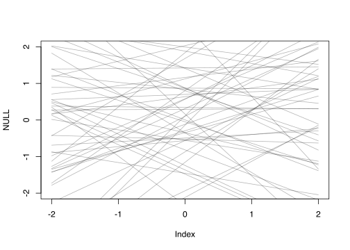
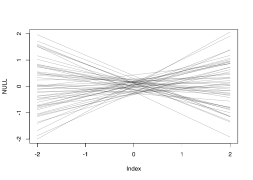
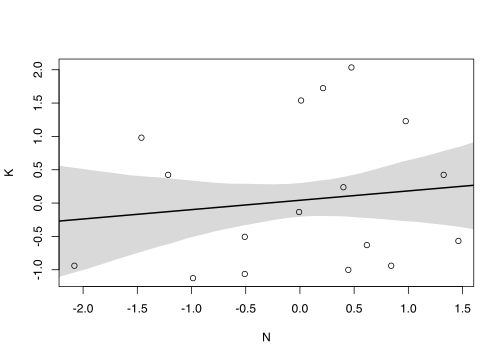
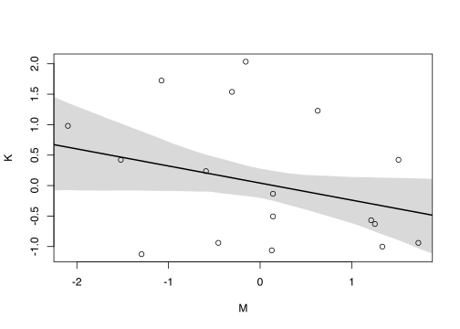
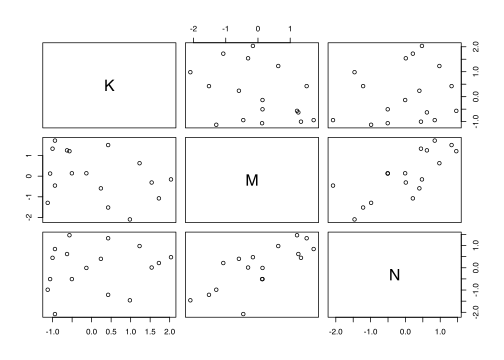
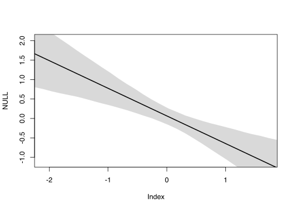
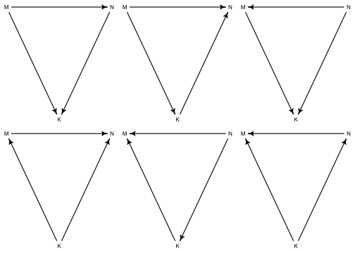

# The Many Variables & The Spurious Waffles


```r
library(here)
source(here::here("code/scripts/source.R"))
```


```r
slides_dir = here::here("docs/slides/L05")
```


<div class="figure">

<p class="caption">Went to College in Atlanta. Has Waffle Houses. Always open. Sometimes there are two Waffle Houses. Other things in the South include Hurricanes.</p>
</div>

<div class="figure">

<p class="caption">Because Waffle House is in the South, they invest in disaster preparedness, and even during a storm they stay open.</p>
</div>

<div class="figure">

<p class="caption">They even have a Waffle House index. If it's closed, it's a really bad storm. FEMA uses the index internally at FEMA.</p>
</div>

<div class="figure">

<p class="caption">There are other things in the South. They have the highest divorce rates in the South. This sets up spurious correlations with anything in the South. So does Waffle House cause divorce? But in regression it's quite robust. Statistically, it's quite hard to get rid of it. But nature is full of stuff like this.</p>
</div>

<div class="figure">

<p class="caption">Correlation is commonplace. Great example of the divorce rate in Maine with the per capita consumption of margarine. Lot's of things will cause a high correlation between variables, even if they have to relation.</p>
</div>


<div class="figure">

<p class="caption">Have the goal of both building it up and breaking it down. Can remove spurious correlations, and uncover masked associations you wouldn't see otheriwse. But adding variables can cause as much harm as good. You can actually hide associations as well. So you need a broader structure to think about this. </p>
</div>

<div class="figure">

<p class="caption">Making decisions between good and bad will mean forming a framework to make them. The goal is to learn the back-door criterion. Waffle House doesn't cause divorce, but something does. The South is more religious. Lot's of things that are correlated with divorce rate. Marriage rate? Can't get divorce if you haven't been married, but could also be spurious. Might indicate that it's a society that views things favourably. </p>
</div>

## Spurious association

<div class="figure">

<p class="caption">Another variable - median age at marriage, could also be causal. Which could it be? We want to now put both in the same model, which reveals that one of these is an imposter.</p>
</div>


```r
# load data
data("WaffleDivorce")
d = WaffleDivorce

# Standardise variables
d$D = rethinking::standardize( d$Divorce )
d$M = rethinking::standardize( d$Marriage)
d$A = rethinking::standardize( d$MedianAgeMarriage)
```


<div class="figure">

<p class="caption">This is what multiple regression is for. We've got two questions in a model that has both questions. Do you get any predictive information from the second variable? </p>
</div>


<div class="figure">

<p class="caption">The arrows have directions to them; can be bidirectional. They're acyclic, so they don't loop. They're called graphs because they have nodes and edges. The associations are Bayesian networks, but they don't have interactions.</p>
</div>


<div class="figure">

<p class="caption">We have here a plausible graph. How does A affect M? If the young are getting married too, then more people are getting married. Median age of marriage influences divorce rate because possibly young people make worse decisions. Is the arrow from M to D there? We want to tell the difference between A and D, and M and D. **NOTE**: when you're walking along the path, you can walk backwards along a path. </p>
</div>


<div class="figure">

<p class="caption">We want to tell the difference between these two things. Something causes waffle house, and something causes divorce. That thing is the South, and so they end up being correlated even though there's no causal relationship.</p>
</div>

`|` means "conditional on".


<div class="figure">

<p class="caption">Already know how to do these, just need to do extra stuff. Linear regression is a special type of Bayesian network where there's an outcome variable, which is assigned Gaussian probability with some mean that is conditional based on some variable, and a standard deviation. The `i`s are states. Have some intercepts. </p>
</div>


<div class="figure">

<p class="caption">Have to think harder about priors now. It help a lot by standardising the priors - converting them into Z-scores. If you make all your variables z-scores, you make you life easier. (But not in all cases.) When you standardise your predictors, you're setting your mean as 0. The regression line has to go through 0, and so alpha should be 0, We'll give it a Gaussian prior with a tight SD. Maybe should even be tighter. Slopes are a little harder. You don't want to use flat priors because you don't want it to think wildly impossible slopes are possible to start. That's why we do some prior predictive simulation.</p>
</div>

<div class="figure">

<p class="caption">You can fit your model. You can run that model. `extract.prior` samples from the prior to simulate. Then pass it to `link` to create predictions based on the prior. Then you can plot the regression lines. </p>
</div>
If $\beta_A = 1$, that would imply that a change of one standard deviation in age at marriage is assocatied with a change of one standard deviation in divorce.

To know if that's strong, how big is a standard deviation of age at marriage?


```r
sd( d$MedianAgeMarriage )
```

```
## [1] 1.24363
```


```r
m5.1 = rethinking::quap(
  alist(
    D ~ dnorm( mu , sigma ) ,
    mu <- a + bA * A ,
    a ~ dnorm( 0 , 0.2 ) ,
    bA ~ dnorm( 0 , 0.5 ) ,
    sigma ~ dexp( 1 )
  ) , data = d )
```


<div class="figure">

<p class="caption">This is 50 regression lines from the prior. Standardised deviation of marriage. 2 SD is almost all. If your model thinks a possible divorce rate is outside the observable range of divorce rates, then they're bad. This prior allows really strong relationships. Allows it to govern nearly all the variation in divorce rate. But we'll move forward with this. This is the flattest prior you could justify scientifically. Priors by frequentists consider even crazier priors, just as vertical lines.</p>
</div>


```r
set.seed(10)
prior = rethinking::extract.prior( m5.1 )
mu <- rethinking::link( m5.1 , 
            post=prior , 
            data=list( A=c(-2,2) ) )

plot( NULL , xlim=c(-2,2) , ylim=c(-2,2) )
for ( i in 1:50 ) lines( c(-2,2) , mu[i,] , col=col.alpha("black",0.4) )
```


Now for the posterior predictions:


```r
# compute percentile interval of mean
A_seq = seq( from=-3 , to=3.2 , length.out=30 )
mu = link( m5.1 , data=list(A=A_seq) )
mu.mean = apply( mu , 2, mean )
mu.PI = apply( mu , 2 , PI )

# plot it all
plot( D ~ A , data=d , col=rangi2 )
lines( A_seq , mu.mean , lwd=2 )
shade( mu.PI , A_seq )
```


$\beta_A$ is reliably negative. You can fit a similar regression for the relationship in the left-hand plot:


```r
m5.2 <- rethinking::quap(
  alist(
    D ~ dnorm( mu , sigma ) ,
    mu <- a + bM * M ,
    a ~ dnorm( 0 , 0.2 ) ,
    bM ~ dnorm( 0 , 0.5 ) ,
    sigma ~ dexp( 1 )
  ) , data = d )
```

Drawing a DAG


```r
dag5.1 <- dagitty::dagitty( "dag{ A -> D; A -> M; M -> D }" )
dagitty::coordinates(dag5.1) <- list( x=c(A=0,D=1,M=2) , y=c(A=0,D=1,M=0) )
rethinking::drawdag( dag5.1 )
```


***5.1.2 Testable implications***


```r
DMA_dag2 <- dagitty('dag{ D <- A -> M }')
impliedConditionalIndependencies( DMA_dag2 )
```

```
## D _||_ M | A
```


```r
DMA_dag1 <- dagitty('dag{ D <- A -> M -> D }')
impliedConditionalIndependencies( DMA_dag1 )
```

No conditional independencies, so no output.

***5.1.3 Multiple regression notation***

<div class="figure">

<p class="caption">Linear means additive, so the model makes a plane. You keep adding them together. There are four parameters. $\alpha$, two slopes $\beta_1$ and $\beta_2$, and the standard deviation $\sigma$.</p>
</div>

***5.1.4 Approximating the posterior***


```r
m5.3 <- quap(
  alist(
    D ~ dnorm( mu , sigma ) ,
    mu <- a + bM*M + bA*A ,
    a ~ dnorm( 0 , 0.2 ) ,
    bM ~ dnorm( 0 , 0.5 ) ,
    bA ~ dnorm( 0 , 0.5 ) ,
    sigma ~ dexp( 1 )
  ) , data = d )
precis( m5.3 )
```

```
##                mean         sd       5.5%      94.5%
## a     -2.828642e-05 0.09707123 -0.1551669  0.1551103
## bM    -6.553086e-02 0.15076312 -0.3064794  0.1754177
## bA    -6.136370e-01 0.15097351 -0.8549218 -0.3723521
## sigma  7.850672e-01 0.07783076  0.6606786  0.9094558
```


Here's the quap code, and we get a table of coefficients. Look for the mean, and as I promised, $\alpha$ is 0. ``bM` is about twice the size of the posterior value itself. No consistent relationship. Age of marriage however, is -.6, but now the posterior mass is entirely below 0. What's the lesson here? There's probably no causal relationship between marriage rate and divorce, and that's because it was confounded by age of marriage. 


<div class="figure">

<p class="caption">This shows all three models. Bottom is age of marriage only. The one with marriage rates in the middle. Then marriage rate and and age of marriage in the bottom.</p>
</div>


```r
# Faulty code
#plot( rethinking::coeftab(m5.1,m5.2,m5.3), par=c("bA","bM") )
```

<div class="figure">

<p class="caption">This is the graph. Once you know the median age of marriage, you get little extra information in marriage. But when you ad A, it does give you information. If you just wanted to make a prediction, M is useful, but if you wanted to change D, you need to change other things like A.</p>
</div>


You have to be clear about whether you're interesting in predicting things, or understanding the true nature of things. 

Let's simulate the divorce example. Every DAG implies a simulation, and such simulations can help us design models to correclty infer relationships among variables.


```r
N = 50 # number of simulated States
age = rnorm(N) # sim A
mar = rnorm(N, -age) # sim A -> M
div = rnorm(N, age) # sim A -> D
```

***5.1.5 Plotting multivariate posteriors***

<div class="figure">

<p class="caption">How do we visualise models like this? Lots of ways. Usually the most useful way to visualise depends on the model. You want to think about what you're trying to communicate. The first are predictor residual plots, not that you need to do them, but good for understanding how these linear regressions works.</p>
</div>

*5.1.5.1 Predictor residual plots*

<div class="figure">

<p class="caption">Purpose is to show how the association looks, having controlled for the other predictors. We want to calculate the intermediate states. Great for intuition but terrible for analysis. Never any statistical justification for running regression over residuals. Why? Gives you the wrong answer, because it gives you bias estimates. What to do instead? Multiple regressions.</p>
</div>

Recipe:

1. Regress a predictor, and find the extra variance left over, and look at the pattern of the relationship between the residuals and the outcome.


```r
# Approximate the posterior
m5.4 = rethinking::quap(
  alist(
    M ~ dnorm( mu , sigma ) ,
    mu <- a + bAM * A ,
    a ~ dnorm( 0, 0.2 ) ,
    bAM ~ dnorm( 0, 0.5 ) ,
    sigma ~ dexp( 1 )
  ), data = d
)
```


```r
# Compute the residuals
mu = rethinking::link(m5.4)
mu_mean = apply( mu, 2, mean)
mu_resid = d$M - mu_mean
```


<div class="figure">

<p class="caption">Here's our first residual plot</p>
</div>

<div class="figure">

<p class="caption">What are we looking at here? Marriage rate, standardised. THe distance from the regression line - the expected value of M conditional on A, is the residual. THe unexplained bit from the model. Highlighted some states with high residuals. Now we'll take the absolute distances for each point.</p>
</div>


<div class="figure">

<p class="caption">Now take those residuals, and look at the correlation between the residuals of M and D. And you can see nothing. Shows you what the model is doing inside. If you do the multiple regresssion all at once, it handles all of that. If you do it this way you don't. But really good for intuition. Point of Maine with a really high divorce rate. </p>
</div>

<div class="figure">

<p class="caption">Still no explanation about why ME is so high. Now you can pivot A on M. </p>
</div>

<div class="figure">

<p class="caption">Then put those on the plot on the bottom. So now that you know M, there's considerable information in also knowing A. But the reverse is not true. </p>
</div>

<div class="figure">

<p class="caption">This is one of the things we mean. In observational studies like this one, there's no ethical intervention we can make. But we want to make causal information. Linear regression allows you to do that, but only if you have an idea of the causal relationship between the variables. To interpret, you need a causal framework. We'll have an example latter when controlling can *create* a confound. These models are not magic. You shouldn't get cocky. This is the kind of study where you use average data. Quite a pathological dataset.</p>
</div>

<div class="figure">

<p class="caption">Cases where you hold other predictor variables constant. All the code for generating them is in the text. In the real world we can't do that. If we're right in our DAG here, and we manipulate A, you'll also manipulate M as well. </p>
</div>


Goals:
1. Figure out whether the approximation of the posterior works. Compare the predictions with the raw data. If they're different, they fail. 
2. It can inspire you to look at the cases that don't fit well, and figure out what you need to make better causal inferences.


```r
# call link without specifying new data
# so it uses original data
mu = link(m5.3)

# summarize samples across cases
mu_mean = apply(mu, 2, mean)
mu_PI = apply(mu, 2, rethinking::PI)

# simulate observations
# again no new data, so uses original data
D_sim = rethinking::sim( m5.3 , n=1e4 )
D_PI = apply( D_sim, 2, rethinking::PI)
```


Plot predictions against observed. 


```r
plot(mu_mean ~ d$D, col = rangi2, ylim = range(mu_PI) ,
     xlab = "Observed divorce", ylab = "Predicted divorce")
abline( a=0, b=1, lty=2 )
for ( i in 1:nrow(d) ) lines( rep(d$D[i], 2) , mu_PI[, i] , col = rangi2 )
```


```r
plot(mu_mean ~ d$D, col = rangi2, ylim = range(mu_PI) ,
     xlab = "Observed divorce", ylab = "Predicted divorce")
abline( a=0, b=1, lty=2 )
for ( i in 1:nrow(d) ) lines( rep(d$D[i], 2) , mu_PI[, i] , col = rangi2 )
identify( x=d$D , y=mu_mean , labels=d$Loc )
```


```
## integer(0)
```


<div class="figure">

<p class="caption">Diagonal is unity - perfect prediction. But there are states where they're making bad predictions, like ID. Has a very low D. That's why there's a mismatch. It's getting it really wrong. Why? The Mormons. They have a very low divorce rate. UT as well.</p>
</div>

*5.1.5.3 Counterfactual plots*

They can be produced for any values of the predictor variables you like, even unobserved combinations like high median age of marriage and high marriage rate.

Used with clarity of purpose, counterfactual plots help you understand the model, as well as generate predictions for imaginary interventions and compute how much some observed outcome could be attributed to some cause. 

Recipe:
1. Pick a variable to manipulate (the intervention variable)
2. Define the range of values to set the intervention variable to.
3. FOr each vlaue of the intervention variable, and for each sample in posterior, use the causal model to simulate the values of other variables, including the outcome. 


```r
data(WaffleDivorce)
d <- list()
d$A <- standardize( WaffleDivorce$MedianAgeMarriage )
d$D <- standardize( WaffleDivorce$Divorce )
d$M <- standardize( WaffleDivorce$Marriage )
m5.3_A <- quap(
  alist(
    ## A -> D <- M
    D ~ dnorm( mu , sigma ) ,
    mu <- a + bM*M + bA*A ,
    a ~ dnorm( 0 , 0.2 ) ,
    bM ~ dnorm( 0 , 0.5 ) ,
    bA ~ dnorm( 0 , 0.5 ) ,
    sigma ~ dexp( 1 ),
    ## A -> M
    M ~ dnorm( mu_M , sigma_M ),
    mu_M <- aM + bAM*A,
    aM ~ dnorm( 0 , 0.2 ),
    bAM ~ dnorm( 0 , 0.5 ),
    sigma_M ~ dexp( 1 )
  ) , data = d )

precis(m5.3_A)
```

```
##                  mean         sd       5.5%      94.5%
## a       -2.515644e-07 0.09707590 -0.1551463  0.1551458
## bM      -6.538073e-02 0.15077284 -0.3063448  0.1755834
## bA      -6.135131e-01 0.15098338 -0.8548137 -0.3722125
## sigma    7.851167e-01 0.07784307  0.6607084  0.9095249
## aM      -4.065746e-07 0.08684798 -0.1388002  0.1387994
## bAM     -6.947375e-01 0.09572712 -0.8477279 -0.5417471
## sigma_M  6.817382e-01 0.06758039  0.5737317  0.7897448
```

Now simulate what would happen if we manipulate A. 

```r
# Define a rang eof values for A
A_seq <- seq( from=-2 , to=2 , length.out=30 )
```


```r
# Simulate the influence of A on M
# prep data
sim_dat <- data.frame( A=A_seq )

# simulate M and then D, using A_seq
s <- rethinking::sim( m5.3_A , data=sim_dat , vars=c("M","D") )
```


```r
#Plot the predictions
plot( sim_dat$A , colMeans(s$D) , ylim=c(-2,2) , type="l" , xlab="manipulated A" , ylab="counterfactual D" )
shade( apply(s$D,2,PI) , sim_dat$A )
mtext( "Total counterfactual effect of A on D" )
```


```r
# new data frame, standardized to mean 26.1 and std dev 1.24
sim2_dat <- data.frame( A=(c(20,30)-26.1)/1.24 )
s2 <- rethinking::sim( m5.3_A , data=sim2_dat , vars=c("M","D") )
mean( s2$D[,2] - s2$D[,1] )
```

```
## [1] -4.540882
```

This is a huge effect of 4.5 standard deviations, probably impossibly large.

Now let's simulate the effect of manipulating $M$. It's like a perfectly controlled experiment. We'll simulate a counterfactual for an average state, with $A = 0$, and see what changing $M$ does.


```r
sim_dat <- data.frame( M=seq(from=-2,to=2,length.out=30) , A=0 )
s <- rethinking::sim( m5.3_A , data=sim_dat , vars="D" )

plot( sim_dat$M , colMeans(s) , ylim=c(-2,2) , type="l" ,
  xlab="manipulated M" , ylab="counterfactual D" )
shade( apply(s,2,PI) , sim_dat$M )
mtext( "Total counterfactual effect of M on D" )
```


Note that we only simulated $D$ now. We don't simulate $A$, because $M$ doesn't influence it. 

**Simulatig counterfactuals**

Define a range of vlaues that we want to assign to $A$:

```r
A_seq <- seq( from=-2 , to=2 , length.out=30 )
```

Then extract the posterior samples:


```r
post <- rethinking::extract.samples( m5.3_A )
M_sim <- with( post , sapply( 1:30 ,
  function(i) rnorm( 1e3 , aM + bAM*A_seq[i] , sigma_M ) ) )
# The linear model inside `rnorm` comes right out of the model definition.
```

This produces a matrix of values, with samples in rows and cases corresponding to the values in `A_seq` in the columns. Now that we have simulated values for $M$, we can simulate $D$ too:


```r
D_sim <- with( post , sapply( 1:30 ,
  function(i) rnorm( 1e3 , a + bA*A_seq[i] + bM*M_sim[,i] , sigma ) ) )
```

If you plot `A_seq` against the column means of `D_sim`, you'll see the same result as before. 


```r
ggplot() +
  geom_line(aes(A_seq, colMeans(D_sim)))
```


## Masked relationship

<div class="figure">

<p class="caption">Another good thing regression can do is reveal spurious correlations. When there are two predictors that both influence the outcome in different directions, you can get the total causal effect between the two. This tends to arise where you have two predictors, and they act in different directions, and cancel each other out, so if you don't model both of them individually, it looks like they have no effect. Noise can also cause you not to see a relationship.</p>
</div>

<div class="figure">

<p class="caption">Relationship between milk energy and how brainy they are? Intersted in things that are interested in what makes us unique. Primates are mammals, and some mammals have very highly energetic milk, like seals basically ooze butter. Primates in contrast carry their offspring on them. As a consequence, the energy density is lower. Human milk is not energetically rich. 75% of our brain mass is neocortex. Then the brainiest primate is *Cebus*. Can we see a signal of selection on milk energy from braininess?</p>
</div>

<div class="figure">

<p class="caption">Sample of primate species. Pairs plot. Particularly strong correlation between the magnitude of body mass (log(mass)) is strongly correlated with neocortex. No particular strong relationship between `log(mass)` and `kcal.per.g`.</p>
</div>

```r
data(milk)
d <- milk
str(d)
```

```
## 'data.frame':	29 obs. of  8 variables:
##  $ clade         : Factor w/ 4 levels "Ape","New World Monkey",..: 4 4 4 4 4 2 2 2 2 2 ...
##  $ species       : Factor w/ 29 levels "A palliata","Alouatta seniculus",..: 11 8 9 10 16 2 1 6 28 27 ...
##  $ kcal.per.g    : num  0.49 0.51 0.46 0.48 0.6 0.47 0.56 0.89 0.91 0.92 ...
##  $ perc.fat      : num  16.6 19.3 14.1 14.9 27.3 ...
##  $ perc.protein  : num  15.4 16.9 16.9 13.2 19.5 ...
##  $ perc.lactose  : num  68 63.8 69 71.9 53.2 ...
##  $ mass          : num  1.95 2.09 2.51 1.62 2.19 5.25 5.37 2.51 0.71 0.68 ...
##  $ neocortex.perc: num  55.2 NA NA NA NA ...
```

As before, standardising helps us both get a reliable approximation of the posterior as well as build reasonable priors.


```r
d$K <- standardize( d$kcal.per.g )
d$N <- standardize( d$neocortex.perc )
d$M <- standardize( log(d$mass) )
```

Let's first just try to run this as a quap model with some vague priors:


```r
m5.5_draft <- quap(
  alist(
    K ~ dnorm( mu , sigma ) ,
    mu <- a + bN*N ,
    a ~ dnorm( 0 , 1 ) ,
    bN ~ dnorm( 0 , 1 ) ,
    sigma ~ dexp( 1 )
  ) , data=d )
# Returns following error:
# Error in quap(alist(K ~ dnorm(mu, sigma), mu <- a + bN * N, a ~ dnorm(0,  : 
#  initial value in 'vmmin' is not finite
# The start values for the parameters were invalid. This could be caused by missing values (NA) in the data or by start values outside the parameter constraints. If there are no NA values in the data, try using explicit start values.
```

The culprit is the missing values in `N`. 


```r
d$neocortex.perc
```

```
##  [1] 55.16    NA    NA    NA    NA 64.54 64.54 67.64    NA 68.85 58.85 61.69
## [13] 60.32    NA    NA 69.97    NA 70.41    NA 73.40    NA 67.53    NA 71.26
## [25] 72.60    NA 70.24 76.30 75.49
```

Here we'll just drop the missing values, known as **complete case analysis**. But it isn't always a good thing - see Chapter 15.


```r
dcc <- d[ complete.cases(d$K,d$N,d$M) , ]
```

Now let's model with that.


```r
m5.5_draft <- quap(
  alist(
    K ~ dnorm( mu , sigma ) ,
    mu <- a + bN*N ,
    a ~ dnorm( 0 , 1 ) ,
    bN ~ dnorm( 0 , 1 ) ,
    sigma ~ dexp( 1 )
  ) , data=dcc )
```

Simulate and plot 50 prior regression lines.

```r
prior <- rethinking::extract.prior( m5.5_draft )
xseq <- c(-2,2)
mu <- link( m5.5_draft , post=prior , data=list(N=xseq) )


plot( NULL , xlim=xseq , ylim=xseq )
for ( i in 1:50 ) lines( xseq , mu[i,] , col=col.alpha("black",0.3) )
```




```r
m5.5 <- quap(
  alist(
    K ~ dnorm( mu , sigma ) ,
    mu <- a + bN*N ,
    a ~ dnorm( 0 , 0.2 ) ,
    bN ~ dnorm( 0 , 0.5 ) ,
    sigma ~ dexp( 1 )
  ) , data=dcc )

prior <- rethinking::extract.prior( m5.5 )
xseq <- c(-2,2)
mu <- link( m5.5 , post=prior , data=list(N=xseq) )


plot( NULL , xlim=xseq , ylim=xseq )
for ( i in 1:50 ) lines( xseq , mu[i,] , col=col.alpha("black",0.3) )
```




<div class="figure">

<p class="caption">We need to do some prior predictive simulation. Left is not a good prior. All we need to do to get the regression lines to live in the outcome space, we can contract $lpha$ - should be about 0, and the slope should be about 0.5 to be tighter. If you standardise the predictor and outcome, Normal(0, 0.5) should keep you in the outcome space.</p>
</div>

```r
precis( m5.5 )
```

```
##             mean        sd       5.5%     94.5%
## a     0.03993496 0.1544904 -0.2069706 0.2868405
## bN    0.13323261 0.2237459 -0.2243565 0.4908218
## sigma 0.99981473 0.1647058  0.7365831 1.2630463
```


```r
xseq <- seq( from=min(dcc$N)-0.15 , to=max(dcc$N)+0.15 , length.out=30 )
mu <- link( m5.5 , data=list(N=xseq) )
mu_mean <- apply(mu,2,mean)
mu_PI <- apply(mu,2,PI)
plot( K ~ N , data=dcc )
lines( xseq , mu_mean , lwd=2 )
shade( mu_PI , xseq )
```




<div class="figure">

<p class="caption">There's a slight relationship between brain and milk energy, and a slightly negative relationship with body mass. Look what happens when you include both in a model.</p>
</div>

Let's consider another predictor variable, adult female body mass, `mass`. Let's use the logarithm of mass as a predictor as well. Why a logarithm instead of the raw mass? 
>Because taking the log of a measure translates the measure into magnitudes. 


```r
m5.6 <- quap(
  alist(
    K ~ dnorm( mu , sigma ) ,
    mu <- a + bM*M ,
    a ~ dnorm( 0 , 0.2 ) ,
    bM ~ dnorm( 0 , 0.5 ) ,
    sigma ~ dexp( 1 )
  ) , data=dcc )
precis(m5.6)
```

```
##              mean        sd       5.5%      94.5%
## a      0.04654706 0.1512803 -0.1952281 0.28832217
## bM    -0.28253741 0.1928825 -0.5908009 0.02572611
## sigma  0.94928377 0.1570633  0.6982662 1.20030131
```

```r
xseq <- seq( from=min(dcc$M)-0.15 , to=max(dcc$M)+0.15 , length.out=30 )
mu <- link( m5.6 , data=list(M=xseq) )
mu_mean <- apply(mu,2,mean)
mu_PI <- apply(mu,2,PI)
plot( K ~ M , data=dcc )
lines( xseq , mu_mean , lwd=2 )
shade( mu_PI , xseq )
```




<div class="figure">

<p class="caption">Now very strong relationship between both.</p>
</div>

Now add both together.


```r
m5.7 <- quap(
  alist(
    K ~ dnorm( mu , sigma ) ,
    mu <- a + bN*N + bM*M ,
    a ~ dnorm( 0 , 0.2 ) ,
    bN ~ dnorm( 0 , 0.5 ) ,
    bM ~ dnorm( 0 , 0.5 ) ,
    sigma ~ dexp( 1 )
  ) , data=dcc )
precis(m5.7)
```

```
##              mean        sd       5.5%      94.5%
## a      0.06799172 0.1339987 -0.1461641  0.2821475
## bN     0.67511778 0.2482986  0.2782886  1.0719470
## bM    -0.70299094 0.2207870 -1.0558513 -0.3501306
## sigma  0.73801445 0.1324619  0.5263148  0.9497141
```


```r
# Faulty code
plot( rethinking::coeftab( m5.5 , m5.6 , m5.7 ) , pars=c("bM","bN") )
```


<div class="figure">

<p class="caption">You can see strong relationships, but only when they're both present in the model. This is the masking effect. One is positively related to the outcome, the other is negatively related to the outcome, and they're correlated with one another. Bigger primates need bigger brains, bigger brains need more energy, bigger bodies need less because they're are longer developmental times. THey're antagonistic effects, but correlated in same species. This sort of effect can happen a lot. </p>
</div>


```r
pairs( ~K + M + N , dcc )
```




```r
xseq <- seq( from=min(dcc$M)-0.15 , to=max(dcc$M)+0.15 , length.out=30 )
mu <- link( m5.7 , data=data.frame( M=xseq , N=0 ) )
mu_mean <- apply(mu,2,mean)
mu_PI <- apply(mu,2,PI)
plot( NULL , xlim=range(dcc$M) , ylim=range(dcc$K) )
lines( xseq , mu_mean , lwd=2 )
shade( mu_PI , xseq )
```



**Simulating a masking relationship**

<div class="figure">

<p class="caption">Fake data that causes this relationship. `U` is unobserved, some life history variable. Then the causal influence on each of those. This relationship is sufficient to create what we saw.</p>
</div>


```r
# M -> K <- N
# M -> N
n <- 100
M <- rnorm( n )
N <- rnorm( n , M )
K <- rnorm( n , N - M )
d_sim <- data.frame(K=K,N=N,M=M)
```


```r
# M -> K <- N
# N -> M
n <- 100
N <- rnorm( n )
M <- rnorm( n , N )
K <- rnorm( n , N - M )
d_sim2 <- data.frame(K=K,N=N,M=M)

# M -> K <- N
# M <- U -> N
n <- 100
U <- rnorm( n )
N <- rnorm( n , U )
M <- rnorm( n , U )
K <- rnorm( n , N - M )
d_sim3 <- data.frame(K=K,N=N,M=M)
```


```r
dag5.7 <- dagitty( "dag{
  M -> K <- N
  M -> N }" )
coordinates(dag5.7) <- list( x=c(M=0,K=1,N=2) , y=c(M=0.5,K=1,N=0.5) )
MElist <- equivalentDAGs(dag5.7)
drawdag(MElist)
```



## Categorical variables

<div class="figure">

<p class="caption">Often we have data that represents discrete categories. Want to include those, but they're not continuous. Useful variables because the mean varies, but can't add them as they are. First is to create a dummy, and the next is almost always superior, and that's the index. </p>
</div>


```r
data(Howell1)
d <- Howell1
str(d)
```

```
## 'data.frame':	544 obs. of  4 variables:
##  $ height: num  152 140 137 157 145 ...
##  $ weight: num  47.8 36.5 31.9 53 41.3 ...
##  $ age   : num  63 63 65 41 51 35 32 27 19 54 ...
##  $ male  : int  1 0 0 1 0 1 0 1 0 1 ...
```

`male` is an indicator, or dummy, variable.

<div class="figure">

<p class="caption">Take a categorical variable and convert them to indicator variables. They stand in for something. e.g. Kalahari height data, `0` means not `male`. </p>
</div>

<div class="figure">

<p class="caption">Height varies by sex, so you could include it in the model. The linear model looks like a continuous predictor, because you've coded it as 0 and 1, if effectively turns the parameter off and on, and adjusts the mean. Effectively makes two intercepts, one male, one female. `alpha` is the intercept for females, and `alpha + betaM` is the intercept for males. </p>
</div>

```r
mu_female <- rnorm(1e4,178,20)
mu_male <- rnorm(1e4,178,20) + rnorm(1e4,0,10)
precis( data.frame( mu_female , mu_male ) )
```

```
##               mean       sd     5.5%    94.5%  histogram
## mu_female 178.1461 20.09029 145.7927 210.2094   ▁▁▃▇▇▂▁▁
## mu_male   178.0465 22.42885 142.2931 213.8318 ▁▁▁▃▇▇▃▁▁▁
```


<div class="figure">

<p class="caption">Have to pick same number of priors for number of categories. Consequence is you end up assuming that one of the categories is less certain than all the others.</p>
</div>

<div class="figure">

<p class="caption">This is the better option.</p>
</div>


```r
d$sex <- ifelse( d$male==1 , 2 , 1 )
str( d$sex )
```

```
##  num [1:544] 2 1 1 2 1 2 1 2 1 2 ...
```

-------


```r
slides_dir = here::here("docs/slides/L06")
```


<div class="figure">

<p class="caption">Pick up where we left off. How to include un-ordered categorical data in a regression? A lot of downsides for using dummy variables. Index variables have a lot of advantages, including that you can assign the same priors to each of the categories. Another reason is that when you get more and more categories, you don't have to change anything other than include more numbers in the index. Grows really nicely, and is the foundation of multi-level models.</p>
</div>

<div class="figure">

<p class="caption">Can code this in `quap`. The bracket notation means `a` for each `sex`. Now you see you get an alpha for each sex. The awkwardness is you need to make inferences.</p>
</div>


```r
m5.8 <- quap(
  alist(
    height ~ dnorm( mu , sigma ) ,
    mu <- a[sex] ,
    a[sex] ~ dnorm( 178 , 20 ) ,
    sigma ~ dunif( 0 , 50 )
  ) , data=d )
precis( m5.8 , depth=2 )
```

```
##            mean        sd      5.5%     94.5%
## a[1]  134.90989 1.6069263 132.34172 137.47807
## a[2]  142.57814 1.6974653 139.86527 145.29102
## sigma  27.30984 0.8280327  25.98648  28.63319
```

<div class="figure">

<p class="caption">If you want the posterior distribution for the sexes, you extract samples from the posterior. Then compute the difference by subtracting the difference from each sample. Still it in a column called `diff_fm`. Posterior mean is -8. All the comparisons are already in the posterior, you just have to extract samples to compute them. We'll be using this kind of coding in future examples.</p>
</div>

```r
post <- extract.samples(m5.8)
post$diff_fm <- post$a[,1] - post$a[,2]
precis( post , depth=2 )
```

```
##               mean       sd      5.5%      94.5%      histogram
## sigma    27.310267 0.823548  25.99069  28.624085  ▁▁▁▁▃▅▇▇▃▂▁▁▁
## a[1]    134.929201 1.614624 132.35170 137.497897  ▁▁▁▂▅▇▇▅▂▁▁▁▁
## a[2]    142.560957 1.707162 139.79832 145.272769 ▁▁▁▂▃▇▇▇▃▂▁▁▁▁
## diff_fm  -7.631755 2.340842 -11.38814  -3.913309     ▁▁▁▂▇▇▃▁▁▁
```

***5.3.2. Many categories***


```r
data(milk)
d <- milk
levels(d$clade)
```

```
## [1] "Ape"              "New World Monkey" "Old World Monkey" "Strepsirrhine"
```


```r
d$clade_id <- as.integer( d$clade )
```


```r
d$K <- standardize( d$kcal.per.g )
m5.9 <- quap(
  alist(
    K ~ dnorm( mu , sigma ),
    mu <- a[clade_id],
    a[clade_id] ~ dnorm( 0 , 0.5 ),
    sigma ~ dexp( 1 )
  ) , data=d )
labels <- paste( "a[" , 1:4 , "]:" , levels(d$clade) , sep="")
# Faulty code
#plot( precis( m5.9 , depth=2 , pars="a" ) , labels=labels , xlab="expected kcal (std)" )
```


```r
# Randomly assign these primates to some made up categories
set.seed(63)
d$house <- sample( rep(1:4,each=8) , size=nrow(d) )
```


```r
# Now include these categories as another predictor in the model
m5.10 <- quap(
  alist(
    K ~ dnorm( mu , sigma ),
    mu <- a[clade_id] + h[house],
    a[clade_id] ~ dnorm( 0 , 0.5 ),
    h[house] ~ dnorm( 0 , 0.5 ),
    sigma ~ dexp( 1 )
  ) , data=d )
```


## Practice
