# The Many Variables & The Spurious Waffles


```r
library(here)
source(here::here("code/scripts/source.R"))
```


```r
slides_dir = here::here("docs/slides/L05")
```


<div class="figure">

<p class="caption">Went to College in Atlanta. Has Waffle Houses. Always open. Sometimes there are two Waffle Houses. Other things in the South include Hurricanes.</p>
</div>

<div class="figure">

<p class="caption">Because Waffle House is in the South, they invest in disaster preparedness, and even during a storm they stay open.</p>
</div>

<div class="figure">

<p class="caption">They even have a Waffle House index. If it's closed, it's a really bad storm. FEMA uses the index internally at FEMA.</p>
</div>

<div class="figure">

<p class="caption">There are other things in the South. They have the highest divorce rates in the South. This sets up spurious correlations with anything in the South. So does Waffle House cause divorce? But in regression it's quite robust. Statistically, it's quite hard to get rid of it. But nature is full of stuff like this.</p>
</div>

<div class="figure">

<p class="caption">Correlation is commonplace. Great example of the divorce rate in Maine with the per capita consumption of margarine. Lot's of things will cause a high correlation between variables, even if they have to relation.</p>
</div>


<div class="figure">

<p class="caption">Have the goal of both building it up and breaking it down. Can remove spurious correlations, and uncover masked associations you wouldn't see otheriwse. But adding variables can cause as much harm as good. You can actually hide associations as well. So you need a broader structure to think about this. </p>
</div>

<div class="figure">

<p class="caption">Making decisions between good and bad will mean forming a framework to make them. The goal is to learn the back-door criterion. Waffle House doesn't cause divorce, but something does. The South is more religious. Lot's of things that are correlated with divorce rate. Marriage rate? Can't get divorce if you haven't been married, but could also be spurious. Might indicate that it's a society that views things favourably. </p>
</div>

## Spurious association

<div class="figure">

<p class="caption">Another variable - median age at marriage, could also be causal. Which could it be? We want to now put both in the same model, which reveals that one of these is an imposter.</p>
</div>


```r
data(WaffleDivorce, package = "rethinking")
d <- WaffleDivorce
```

Standardise the focal variables:

```r
d <-
  d %>% 
  mutate(d = rethinking::standardize(Divorce),
         m = rethinking::standardize(Marriage),
         a = rethinking::standardize(MedianAgeMarriage))
```

Check it out:

```r
head(d)
```

```
##     Location Loc Population MedianAgeMarriage Marriage Marriage.SE Divorce
## 1    Alabama  AL       4.78              25.3     20.2        1.27    12.7
## 2     Alaska  AK       0.71              25.2     26.0        2.93    12.5
## 3    Arizona  AZ       6.33              25.8     20.3        0.98    10.8
## 4   Arkansas  AR       2.92              24.3     26.4        1.70    13.5
## 5 California  CA      37.25              26.8     19.1        0.39     8.0
## 6   Colorado  CO       5.03              25.7     23.5        1.24    11.6
##   Divorce.SE WaffleHouses South Slaves1860 Population1860 PropSlaves1860
## 1       0.79          128     1     435080         964201           0.45
## 2       2.05            0     0          0              0           0.00
## 3       0.74           18     0          0              0           0.00
## 4       1.22           41     1     111115         435450           0.26
## 5       0.24            0     0          0         379994           0.00
## 6       0.94           11     0          0          34277           0.00
##            d           m          a
## 1  1.6542053  0.02264406 -0.6062895
## 2  1.5443643  1.54980162 -0.6866993
## 3  0.6107159  0.04897436 -0.2042408
## 4  2.0935693  1.65512283 -1.4103870
## 5 -0.9270579 -0.26698927  0.5998567
## 6  1.0500799  0.89154405 -0.2846505
```

```r
glimpse(d)
```

```
## Rows: 50
## Columns: 16
## $ Location          <fct> Alabama, Alaska, Arizona, Arkansas, California, Colo…
## $ Loc               <fct> AL, AK, AZ, AR, CA, CO, CT, DE, DC, FL, GA, HI, ID, …
## $ Population        <dbl> 4.78, 0.71, 6.33, 2.92, 37.25, 5.03, 3.57, 0.90, 0.6…
## $ MedianAgeMarriage <dbl> 25.3, 25.2, 25.8, 24.3, 26.8, 25.7, 27.6, 26.6, 29.7…
## $ Marriage          <dbl> 20.2, 26.0, 20.3, 26.4, 19.1, 23.5, 17.1, 23.1, 17.7…
## $ Marriage.SE       <dbl> 1.27, 2.93, 0.98, 1.70, 0.39, 1.24, 1.06, 2.89, 2.53…
## $ Divorce           <dbl> 12.7, 12.5, 10.8, 13.5, 8.0, 11.6, 6.7, 8.9, 6.3, 8.…
## $ Divorce.SE        <dbl> 0.79, 2.05, 0.74, 1.22, 0.24, 0.94, 0.77, 1.39, 1.89…
## $ WaffleHouses      <int> 128, 0, 18, 41, 0, 11, 0, 3, 0, 133, 381, 0, 0, 2, 1…
## $ South             <int> 1, 0, 0, 1, 0, 0, 0, 0, 0, 1, 1, 0, 0, 0, 0, 0, 0, 1…
## $ Slaves1860        <int> 435080, 0, 0, 111115, 0, 0, 0, 1798, 0, 61745, 46219…
## $ Population1860    <int> 964201, 0, 0, 435450, 379994, 34277, 460147, 112216,…
## $ PropSlaves1860    <dbl> 4.5e-01, 0.0e+00, 0.0e+00, 2.6e-01, 0.0e+00, 0.0e+00…
## $ d                 <dbl> 1.6542053, 1.5443643, 0.6107159, 2.0935693, -0.92705…
## $ m                 <dbl> 0.02264406, 1.54980162, 0.04897436, 1.65512283, -0.2…
## $ a                 <dbl> -0.6062895, -0.6866993, -0.2042408, -1.4103870, 0.59…
```


```r
d %>%
  ggplot(aes(x = WaffleHouses/Population, y = Divorce)) +
  stat_smooth(method = "lm", fullrange = T, size = 1/2,
              color = "firebrick4", fill = "firebrick", alpha = 1/5) +
  geom_point(size = 1.5, color = "firebrick4", alpha = 1/2) +
  ggrepel::geom_text_repel(data = d %>% filter(Loc %in% c("ME", "OK", "AR", "AL", "GA", "SC", "NJ")),
                           aes(label = Loc), 
                           size = 3, seed = 1042) +  # this makes it reproducible
  scale_x_continuous("Waffle Houses per million", limits = c(0, 55)) +
  ylab("Divorce rate") +
  coord_cartesian(xlim = c(0, 50), ylim = c(5, 15)) +
  theme_bw() +
  theme(panel.grid = element_blank())
```

```
## `geom_smooth()` using formula 'y ~ x'
```

<div class="figure">

<p class="caption">Figure 5.1</p>
</div>

Or on a map:


```r
left_join(
  # get the map data
  urbnmapr::get_urbn_map(map = "states", sf = TRUE),
  # add the primary data
  d %>% 
    mutate(state_name = Location %>% as.character(),
           across(c("d", "m", "a"), ~as.numeric(.))) %>% 
    dplyr::select(d:a, state_name),
  by = "state_name"
) %>%
  # convert to the long format for faceting
  tidyr::pivot_longer(cols = c("d", "m", "a")) %>% 
  
  # plot!
  ggplot() +
  geom_sf(aes(fill = value, geometry = geometry),
          size = 0) +
  scale_fill_gradient(low = "#f8eaea", high = "firebrick4") +
  theme_void() +
  theme(legend.position = "none",
        strip.text = element_text(margin = margin(0, 0, .5, 0))) +
  facet_wrap(~ name)
```

```
## old-style crs object detected; please recreate object with a recent sf::st_crs()
```

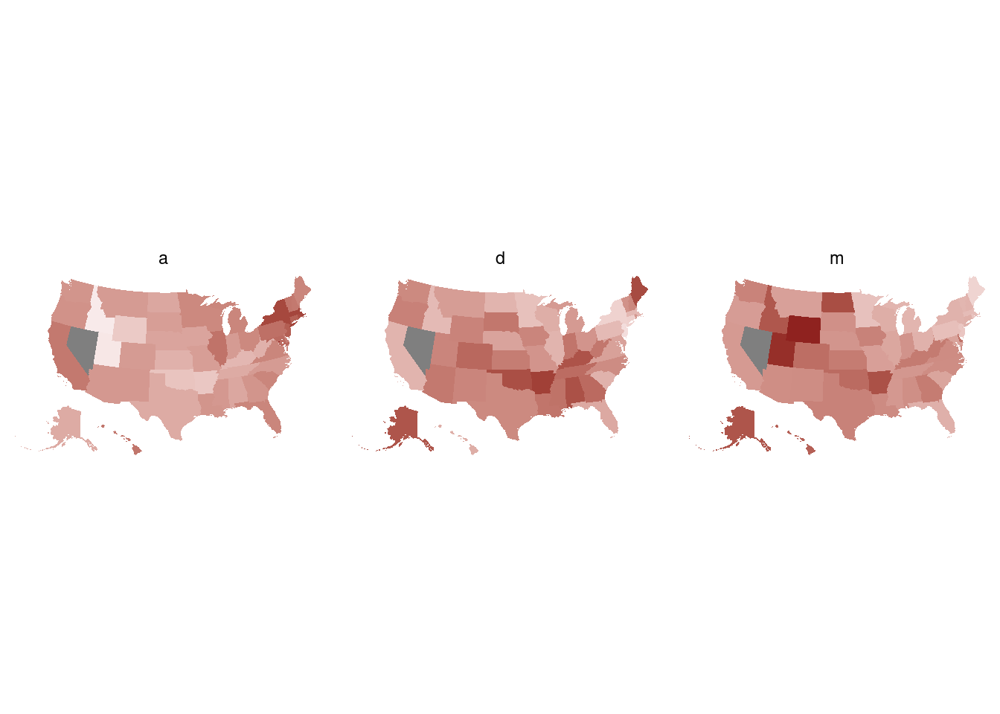


<div class="figure">

<p class="caption">This is what multiple regression is for. We've got two questions in a model that has both questions. Do you get any predictive information from the second variable? </p>
</div>


<div class="figure">

<p class="caption">The arrows have directions to them; can be bidirectional. They're acyclic, so they don't loop. They're called graphs because they have nodes and edges. The associations are Bayesian networks, but they don't have interactions.</p>
</div>


<div class="figure">

<p class="caption">We have here a plausible graph. How does A affect M? If the young are getting married too, then more people are getting married. Median age of marriage influences divorce rate because possibly young people make worse decisions. Is the arrow from M to D there? We want to tell the difference between A and D, and M and D. **NOTE**: when you're walking along the path, you can walk backwards along a path. </p>
</div>


<div class="figure">

<p class="caption">We want to tell the difference between these two things. Something causes waffle house, and something causes divorce. That thing is the South, and so they end up being correlated even though there's no causal relationship.</p>
</div>

`|` means "conditional on".


<div class="figure">

<p class="caption">Already know how to do these, just need to do extra stuff. Linear regression is a special type of Bayesian network where there's an outcome variable, which is assigned Gaussian probability with some mean that is conditional based on some variable, and a standard deviation. The `i`s are states. Have some intercepts. </p>
</div>


<div class="figure">

<p class="caption">Have to think harder about priors now. It help a lot by standardising the priors - converting them into Z-scores. If you make all your variables z-scores, you make you life easier. (But not in all cases.) When you standardise your predictors, you're setting your mean as 0. The regression line has to go through 0, and so alpha should be 0, We'll give it a Gaussian prior with a tight SD. Maybe should even be tighter. Slopes are a little harder. You don't want to use flat priors because you don't want it to think wildly impossible slopes are possible to start. That's why we do some prior predictive simulation.</p>
</div>

<div class="figure">

<p class="caption">You can fit your model. You can run that model. `extract.prior` samples from the prior to simulate. Then pass it to `link` to create predictions based on the prior. Then you can plot the regression lines. </p>
</div>
If $\beta_A = 1$, that would imply that a change of one standard deviation in age at marriage is associated with a change of one standard deviation in divorce.

To know if that's strong, how big is a standard deviation of age at marriage?


```r
sd( d$MedianAgeMarriage )
```

```
## [1] 1.24363
```


```r
b5.1 <- 
  brm(data = d, 
      family = gaussian,
      d ~ 1 + a,
      prior = c(prior(normal(0, 0.2), class = Intercept),
                prior(normal(0, 0.5), class = b),
                prior(exponential(1), class = sigma)),
      iter = 2000, warmup = 1000, chains = 4, cores = 4,
      seed = 5,
      sample_prior = T,
      file = "fits/b05.01")
```

`sample_prior = T` tells `brms` to take draws from both the posterior distribution (as usual) and from the prior predictive distribution. 

<div class="figure">

<p class="caption">This is 50 regression lines from the prior. Standardised deviation of marriage. 2 SD is almost all. If your model thinks a possible divorce rate is outside the observable range of divorce rates, then they're bad. This prior allows really strong relationships. Allows it to govern nearly all the variation in divorce rate. But we'll move forward with this. This is the flattest prior you could justify scientifically. Priors by frequentists consider even crazier priors, just as vertical lines.</p>
</div>


```r
prior <- prior_samples(b5.1)

prior %>% glimpse()
```

```
## Rows: 4,000
## Columns: 3
## $ Intercept <dbl> 0.262235852, 0.435592131, -0.294742095, -0.007232040, 0.0583…
## $ b         <dbl> 0.01116464, -0.18996254, 0.43071360, -0.60435682, -0.3140181…
## $ sigma     <dbl> 2.20380842, 0.57847121, 1.00816092, 2.94427170, 0.30736807, …
```

```r
set.seed(5)

prior %>% 
  slice_sample(n = 50) %>% 
  rownames_to_column("draw") %>% 
  expand(nesting(draw, Intercept, b),
         a = c(-2, 2)) %>% 
  mutate(d = Intercept + b * a) %>% 
  
  ggplot(aes(x = a, y = d)) +
  geom_line(aes(group = draw),
            color = "firebrick", alpha = .4) +
  labs(x = "Median age marriage (std)",
       y = "Divorce rate (std)") +
  coord_cartesian(ylim = c(-2, 2)) +
  theme_bw() +
  theme(panel.grid = element_blank()) 
```

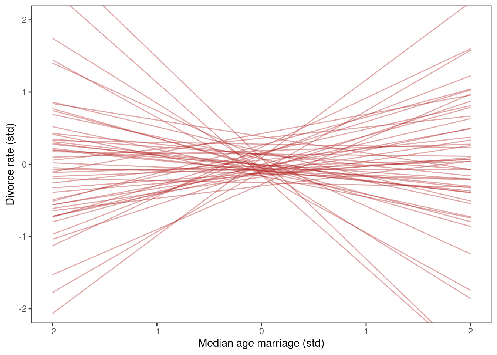

Now for the posterior predictions:


```r
# determine the range of `a` values we'd like to feed into `fitted()`
nd <- tibble(a = seq(from = -3, to = 3.2, length.out = 30))

# now use `fitted()` to get the model-implied trajectories
fitted(b5.1,
       newdata = nd) %>% 
  data.frame() %>% 
  bind_cols(nd) %>% 
  
  # plot
  ggplot(aes(x = a)) +
  geom_smooth(aes(y = Estimate, ymin = Q2.5, ymax = Q97.5),
              stat = "identity",
              fill = "firebrick", color = "firebrick4", alpha = 1/5, size = 1/4) +
  geom_point(data = d, 
             aes(y = d), 
             size = 2, color = "firebrick4") +
  labs(x = "Median age marriage (std)",
       y = "Divorce rate (std)") +
  coord_cartesian(xlim = range(d$a), 
                  ylim = range(d$d)) +
  theme_bw() +
  theme(panel.grid = element_blank()) 
```

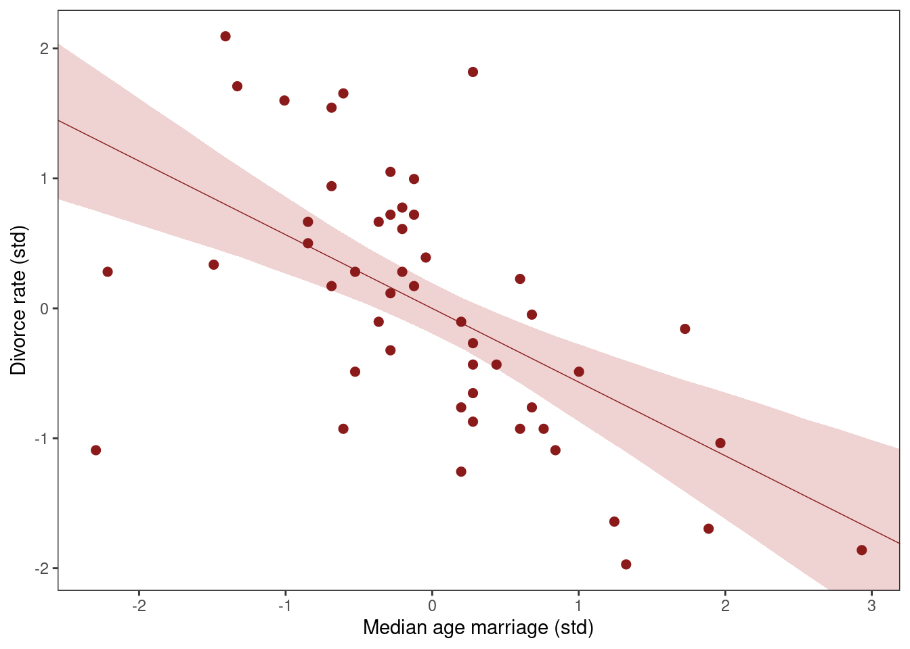
$\beta_A$ is reliably negative. 


```r
print(b5.1)
```

```
##  Family: gaussian 
##   Links: mu = identity; sigma = identity 
## Formula: d ~ 1 + a 
##    Data: d (Number of observations: 50) 
## Samples: 4 chains, each with iter = 2000; warmup = 1000; thin = 1;
##          total post-warmup samples = 4000
## 
## Population-Level Effects: 
##           Estimate Est.Error l-95% CI u-95% CI Rhat Bulk_ESS Tail_ESS
## Intercept    -0.00      0.10    -0.19     0.19 1.00     3996     2866
## a            -0.57      0.11    -0.79    -0.34 1.00     3262     2655
## 
## Family Specific Parameters: 
##       Estimate Est.Error l-95% CI u-95% CI Rhat Bulk_ESS Tail_ESS
## sigma     0.82      0.09     0.68     1.01 1.00     3512     2309
## 
## Samples were drawn using sampling(NUTS). For each parameter, Bulk_ESS
## and Tail_ESS are effective sample size measures, and Rhat is the potential
## scale reduction factor on split chains (at convergence, Rhat = 1).
```


You can fit a similar regression for the relationship in the left-hand plot:


```r
b5.2 <- 
  brm(data = d, 
      family = gaussian,
      d ~ 1 + m,
      prior = c(prior(normal(0, 0.2), class = Intercept),
                prior(normal(0, 0.5), class = b),
                prior(exponential(1), class = sigma)),
      iter = 2000, warmup = 1000, chains = 4, cores = 4,
      seed = 5,
      file = "fits/b05.02")
```


```r
print(b5.2)
```

```
##  Family: gaussian 
##   Links: mu = identity; sigma = identity 
## Formula: d ~ 1 + m 
##    Data: d (Number of observations: 50) 
## Samples: 4 chains, each with iter = 2000; warmup = 1000; thin = 1;
##          total post-warmup samples = 4000
## 
## Population-Level Effects: 
##           Estimate Est.Error l-95% CI u-95% CI Rhat Bulk_ESS Tail_ESS
## Intercept    -0.00      0.11    -0.22     0.22 1.00     4140     3154
## m             0.35      0.13     0.09     0.61 1.00     3307     2899
## 
## Family Specific Parameters: 
##       Estimate Est.Error l-95% CI u-95% CI Rhat Bulk_ESS Tail_ESS
## sigma     0.95      0.10     0.79     1.17 1.00     4091     2703
## 
## Samples were drawn using sampling(NUTS). For each parameter, Bulk_ESS
## and Tail_ESS are effective sample size measures, and Rhat is the potential
## scale reduction factor on split chains (at convergence, Rhat = 1).
```

Make the left-hand panel


```r
nd <- tibble(m = seq(from = -2.5, to = 3.5, length.out = 30))

fitted(b5.2, newdata = nd) %>%
  data.frame() %>%
  bind_cols(nd) %>% 
  
  ggplot(aes(x = m)) +
  geom_smooth(aes(y = Estimate, ymin = Q2.5, ymax = Q97.5),
              stat = "identity",
              fill = "firebrick", color = "firebrick4", alpha = 1/5, size = 1/4) +
  geom_point(data = d, 
             aes(y = d), 
             size = 2, color = "firebrick4") +
  labs(x = "Marriage rate (std)",
       y = "Divorce rate (std)") +
  coord_cartesian(xlim = range(d$m), 
                  ylim = range(d$d)) +
  theme_bw() +
  theme(panel.grid = element_blank()) 
```

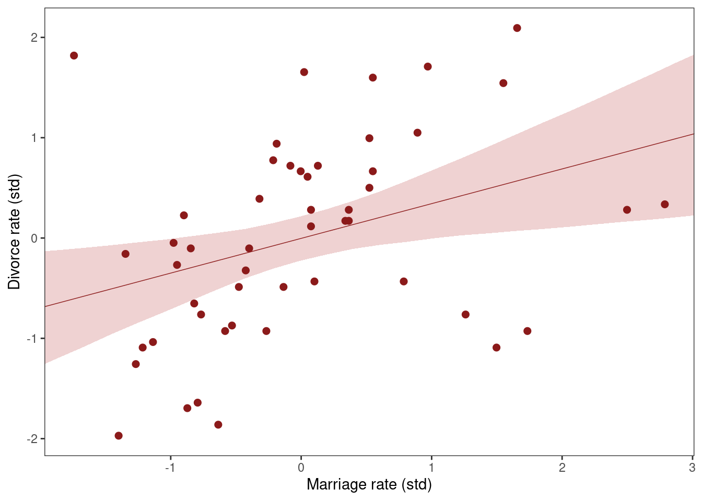


Drawing a DAG


```r
dag5.1 <- dagitty::dagitty( "dag{ A -> D; A -> M; M -> D }" )
dagitty::coordinates(dag5.1) <- list( x=c(A=0,D=1,M=2) , y=c(A=0,D=1,M=0) )
rethinking::drawdag( dag5.1 )
```

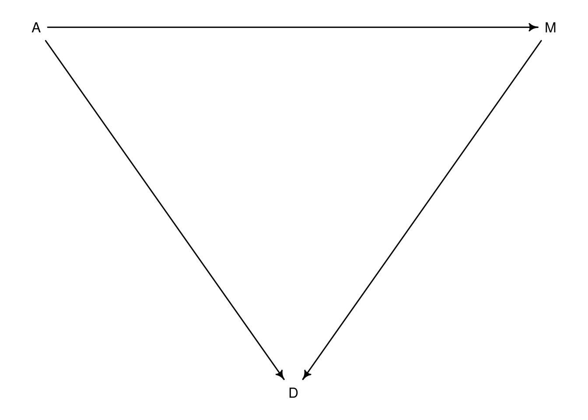

***5.1.2 Testable implications***


```r
set.seed(5)

ggdag::dagify(M ~ A,
       D ~ A + M) %>%
  ggdag::ggdag(node_size = 8)
```


Get correlations


```r
d %>% 
  dplyr::select(d:a) %>% 
  cor()
```

```
##            d          m          a
## d  1.0000000  0.3737314 -0.5972392
## m  0.3737314  1.0000000 -0.7210960
## a -0.5972392 -0.7210960  1.0000000
```


```r
dagitty::dagitty('dag{ D <- A -> M }') %>% 
  dagitty::impliedConditionalIndependencies()
```

```
## D _||_ M | A
```


```r
dagitty::dagitty('dag{D <- A -> M -> D}') %>% 
  dagitty::impliedConditionalIndependencies()
```


***5.1.3 Multiple regression notation***

<div class="figure">

<p class="caption">Linear means additive, so the model makes a plane. You keep adding them together. There are four parameters. $\alpha$, two slopes $\beta_1$ and $\beta_2$, and the standard deviation $\sigma$.</p>
</div>

***5.1.4 Approximating the posterior***


```r
b5.3 <- 
  brm(data = d, 
      family = gaussian,
      d ~ 1 + m + a,
      prior = c(prior(normal(0, 0.2), class = Intercept),
                prior(normal(0, 0.5), class = b),
                prior(exponential(1), class = sigma)),
      iter = 2000, warmup = 1000, chains = 4, cores = 4,
      seed = 5,
      file = "fits/b05.03")
```


```r
print(b5.3)
```

```
##  Family: gaussian 
##   Links: mu = identity; sigma = identity 
## Formula: d ~ 1 + m + a 
##    Data: d (Number of observations: 50) 
## Samples: 4 chains, each with iter = 2000; warmup = 1000; thin = 1;
##          total post-warmup samples = 4000
## 
## Population-Level Effects: 
##           Estimate Est.Error l-95% CI u-95% CI Rhat Bulk_ESS Tail_ESS
## Intercept    -0.00      0.10    -0.19     0.20 1.00     4036     2610
## m            -0.06      0.16    -0.37     0.25 1.00     2532     2536
## a            -0.61      0.16    -0.91    -0.30 1.00     2522     2486
## 
## Family Specific Parameters: 
##       Estimate Est.Error l-95% CI u-95% CI Rhat Bulk_ESS Tail_ESS
## sigma     0.83      0.09     0.68     1.02 1.00     3601     2653
## 
## Samples were drawn using sampling(NUTS). For each parameter, Bulk_ESS
## and Tail_ESS are effective sample size measures, and Rhat is the potential
## scale reduction factor on split chains (at convergence, Rhat = 1).
```


Here's the quap code, and we get a table of coefficients. Look for the mean, and as I promised, $\alpha$ is 0. ``bM` is about twice the size of the posterior value itself. No consistent relationship. Age of marriage however, is -.6, but now the posterior mass is entirely below 0. What's the lesson here? There's probably no causal relationship between marriage rate and divorce, and that's because it was confounded by age of marriage. 


<div class="figure">

<p class="caption">This shows all three models. Bottom is age of marriage only. The one with marriage rates in the middle. Then marriage rate and and age of marriage in the bottom.</p>
</div>


```r
# first, extract and rename the necessary posterior parameters
bind_cols(
  brms::posterior_samples(b5.1) %>% 
    transmute(`b5.1_beta[A]` = b_a),
  brms::posterior_samples(b5.2) %>% 
    transmute(`b5.2_beta[M]` = b_m),
  brms::posterior_samples(b5.3) %>% 
    transmute(`b5.3_beta[M]` = b_m,
              `b5.3_beta[A]` = b_a)
  ) %>% 
  # convert them to the long format, group, and get the posterior summaries
  pivot_longer(everything()) %>% 
  group_by(name) %>% 
  summarise(mean = mean(value),
            ll   = quantile(value, prob = .025),
            ul   = quantile(value, prob = .975)) %>% 
  # since the `key` variable is really two variables in one, here we split them up
  separate(col = name, into = c("fit", "parameter"), sep = "_") %>% 
  
  # plot!
  ggplot(aes(x = mean, xmin = ll, xmax = ul, y = fit)) +
  geom_vline(xintercept = 0, color = "firebrick", alpha = 1/5) +
  geom_pointrange(color = "firebrick") +
  labs(x = "posterior", y = NULL) +
  theme_bw() +
  theme(panel.grid = element_blank(),
        strip.background = element_rect(fill = "transparent", color = "transparent")) +
  facet_wrap(~ parameter, ncol = 1, labeller = label_parsed)
```


<div class="figure">

<p class="caption">This is the graph. Once you know the median age of marriage, you get little extra information in marriage. But when you ad A, it does give you information. If you just wanted to make a prediction, M is useful, but if you wanted to change D, you need to change other things like A.</p>
</div>


You have to be clear about whether you're interesting in predicting things, or understanding the true nature of things. 

Let's simulate the divorce example. Every DAG implies a simulation, and such simulations can help us design models to correctly infer relationships among variables.


```r
# how many states would you like?
n <- 50 

set.seed(5)
sim_d <-
  tibble(age = rnorm(n, mean = 0, sd = 1)) %>%  # sim A 
  mutate(mar = rnorm(n, mean = -age, sd = 1),   # sim A -> M 
         div = rnorm(n, mean =  age, sd = 1))   # sim A -> D

head(sim_d)
```

```
## # A tibble: 6 × 3
##       age    mar    div
##     <dbl>  <dbl>  <dbl>
## 1 -0.841   2.30  -2.84 
## 2  1.38   -1.20   2.52 
## 3 -1.26    2.28  -0.580
## 4  0.0701 -0.662  0.279
## 5  1.71   -1.82   1.65 
## 6 -0.603  -0.322  0.291
```


```r
pairs(sim_d, col = "firebrick4")
```

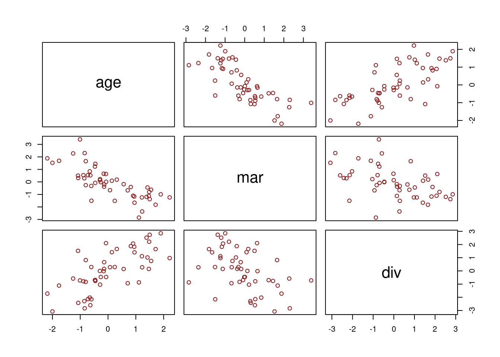


***5.1.5 Plotting multivariate posteriors***

<div class="figure">

<p class="caption">How do we visualise models like this? Lots of ways. Usually the most useful way to visualise depends on the model. You want to think about what you're trying to communicate. The first are predictor residual plots, not that you need to do them, but good for understanding how these linear regressions works.</p>
</div>

*5.1.5.1 Predictor residual plots*

<div class="figure">

<p class="caption">Purpose is to show how the association looks, having controlled for the other predictors. We want to calculate the intermediate states. Great for intuition but terrible for analysis. Never any statistical justification for running regression over residuals. Why? Gives you the wrong answer, because it gives you bias estimates. What to do instead? Multiple regressions.</p>
</div>

Recipe:

1. Regress a predictor, and find the extra variance left over, and look at the pattern of the relationship between the residuals and the outcome.


```r
b5.4 <- 
  brm(data = d, 
      family = gaussian,
      m ~ 1 + a,
      prior = c(prior(normal(0, 0.2), class = Intercept),
                prior(normal(0, 0.5), class = b),
                prior(exponential(1), class = sigma)),
      iter = 2000, warmup = 1000, chains = 4, cores = 4,
      seed = 5,
      file = "fits/b05.04")
```


```r
print(b5.4)
```

```
##  Family: gaussian 
##   Links: mu = identity; sigma = identity 
## Formula: m ~ 1 + a 
##    Data: d (Number of observations: 50) 
## Samples: 4 chains, each with iter = 2000; warmup = 1000; thin = 1;
##          total post-warmup samples = 4000
## 
## Population-Level Effects: 
##           Estimate Est.Error l-95% CI u-95% CI Rhat Bulk_ESS Tail_ESS
## Intercept    -0.00      0.09    -0.18     0.18 1.00     3699     3022
## a            -0.69      0.10    -0.89    -0.50 1.00     3628     2808
## 
## Family Specific Parameters: 
##       Estimate Est.Error l-95% CI u-95% CI Rhat Bulk_ESS Tail_ESS
## sigma     0.71      0.07     0.59     0.87 1.00     3316     2683
## 
## Samples were drawn using sampling(NUTS). For each parameter, Bulk_ESS
## and Tail_ESS are effective sample size measures, and Rhat is the potential
## scale reduction factor on split chains (at convergence, Rhat = 1).
```


```r
f <- 
  fitted(b5.4) %>%
  data.frame() %>%
  bind_cols(d)

glimpse(f)
```

```
## Rows: 50
## Columns: 20
## $ Estimate          <dbl> 0.41910637, 0.47479957, 0.14064036, 0.97603837, -0.4…
## $ Est.Error         <dbl> 0.10921357, 0.11410274, 0.09208704, 0.16994304, 0.10…
## $ Q2.5              <dbl> 0.20609178, 0.25056245, -0.04056262, 0.64629944, -0.…
## $ Q97.5             <dbl> 0.63362431, 0.69624957, 0.32271400, 1.30996611, -0.2…
## $ Location          <fct> Alabama, Alaska, Arizona, Arkansas, California, Colo…
## $ Loc               <fct> AL, AK, AZ, AR, CA, CO, CT, DE, DC, FL, GA, HI, ID, …
## $ Population        <dbl> 4.78, 0.71, 6.33, 2.92, 37.25, 5.03, 3.57, 0.90, 0.6…
## $ MedianAgeMarriage <dbl> 25.3, 25.2, 25.8, 24.3, 26.8, 25.7, 27.6, 26.6, 29.7…
## $ Marriage          <dbl> 20.2, 26.0, 20.3, 26.4, 19.1, 23.5, 17.1, 23.1, 17.7…
## $ Marriage.SE       <dbl> 1.27, 2.93, 0.98, 1.70, 0.39, 1.24, 1.06, 2.89, 2.53…
## $ Divorce           <dbl> 12.7, 12.5, 10.8, 13.5, 8.0, 11.6, 6.7, 8.9, 6.3, 8.…
## $ Divorce.SE        <dbl> 0.79, 2.05, 0.74, 1.22, 0.24, 0.94, 0.77, 1.39, 1.89…
## $ WaffleHouses      <int> 128, 0, 18, 41, 0, 11, 0, 3, 0, 133, 381, 0, 0, 2, 1…
## $ South             <int> 1, 0, 0, 1, 0, 0, 0, 0, 0, 1, 1, 0, 0, 0, 0, 0, 0, 1…
## $ Slaves1860        <int> 435080, 0, 0, 111115, 0, 0, 0, 1798, 0, 61745, 46219…
## $ Population1860    <int> 964201, 0, 0, 435450, 379994, 34277, 460147, 112216,…
## $ PropSlaves1860    <dbl> 4.5e-01, 0.0e+00, 0.0e+00, 2.6e-01, 0.0e+00, 0.0e+00…
## $ d                 <dbl> 1.6542053, 1.5443643, 0.6107159, 2.0935693, -0.92705…
## $ m                 <dbl> 0.02264406, 1.54980162, 0.04897436, 1.65512283, -0.2…
## $ a                 <dbl> -0.6062895, -0.6866993, -0.2042408, -1.4103870, 0.59…
```


<div class="figure">

<p class="caption">Here's our first residual plot</p>
</div>


```r
p1 <-
  f %>% 
  ggplot(aes(x = a, y = m)) +
  geom_point(size = 2, shape = 1, color = "firebrick4") +
  geom_segment(aes(xend = a, yend = Estimate), 
               size = 1/4) +
  geom_line(aes(y = Estimate), 
            color = "firebrick4") +
  geom_text_repel(data = . %>% filter(Loc %in% c("WY", "ND", "ME", "HI", "DC")),  
                  aes(label = Loc), 
                  size = 3, seed = 14) +
  labs(x = "Age at marriage (std)",
       y = "Marriage rate (std)") +
  coord_cartesian(ylim = range(d$m)) +
  theme_bw() +
  theme(panel.grid = element_blank()) 

p1
```

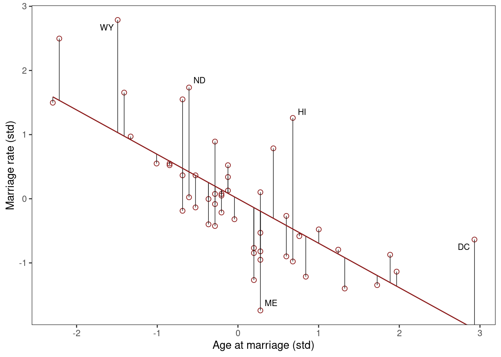

<div class="figure">

<p class="caption">What are we looking at here? Marriage rate, standardised. THe distance from the regression line - the expected value of M conditional on A, is the residual. THe unexplained bit from the model. Highlighted some states with high residuals. Now we'll take the absolute distances for each point.</p>
</div>


<div class="figure">

<p class="caption">Now take those residuals, and look at the correlation between the residuals of M and D. And you can see nothing. Shows you what the model is doing inside. If you do the multiple regresssion all at once, it handles all of that. If you do it this way you don't. But really good for intuition. Point of Maine with a really high divorce rate. </p>
</div>


```r
r <- 
  residuals(b5.4) %>%
  # to use this in ggplot2, we need to make it a tibble or data frame
  data.frame() %>% 
  bind_cols(d)

p3 <-
  r %>% 
  ggplot(aes(x = Estimate, y = d)) +
  stat_smooth(method = "lm", fullrange = T,
              color = "firebrick4", fill = "firebrick4", 
              alpha = 1/5, size = 1/2) +
  geom_vline(xintercept = 0, linetype = 2, color = "grey50") +
  geom_point(size = 2, color = "firebrick4", alpha = 2/3) +
  geom_text_repel(data = . %>% filter(Loc %in% c("WY", "ND", "ME", "HI", "DC")),  
                  aes(label = Loc), 
                  size = 3, seed = 5) +
  scale_x_continuous(limits = c(-2, 2)) +
  coord_cartesian(xlim = range(r$Estimate)) +
  labs(x = "Marriage rate residuals",
       y = "Divorce rate (std)") +
  theme_bw() +
  theme(panel.grid = element_blank())

p3
```

```
## `geom_smooth()` using formula 'y ~ x'
```

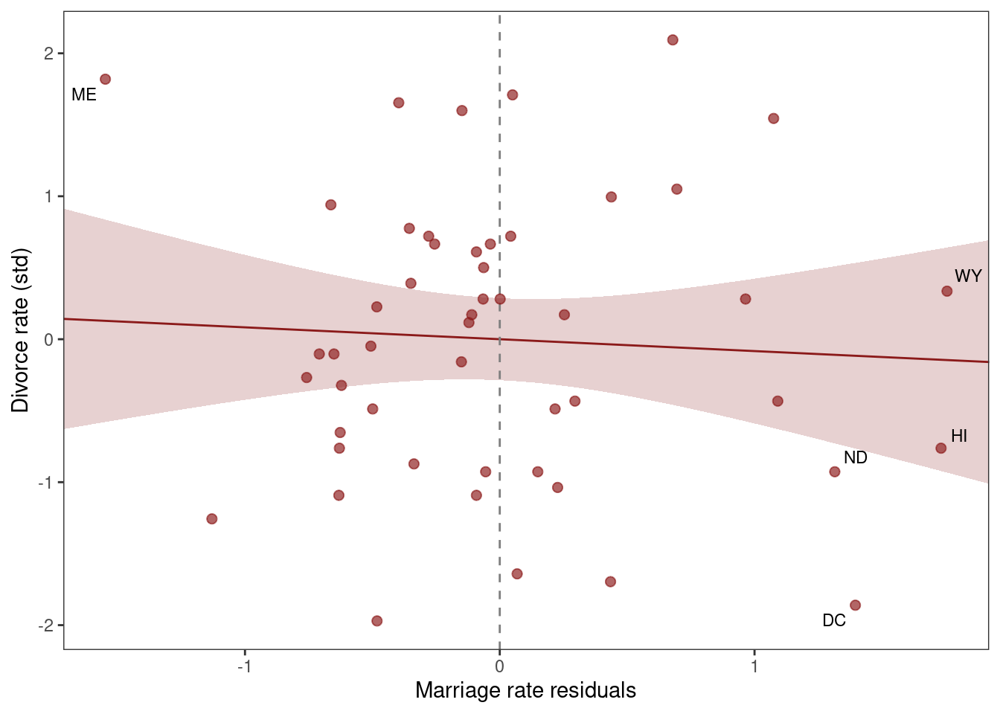

<div class="figure">

<p class="caption">Still no explanation about why ME is so high. Now you can pivot A on M. </p>
</div>


```r
b5.4b <- 
  brm(data = d, 
      family = gaussian,
      a ~ 1 + m,
      prior = c(prior(normal(0, 0.2), class = Intercept),
                prior(normal(0, 0.5), class = b),
                prior(exponential(1), class = sigma)),
      iter = 2000, warmup = 1000, chains = 4, cores = 4,
      seed = 5,
      file = "fits/b05.04b")
```


```r
p2 <-
  fitted(b5.4b) %>%
  data.frame() %>%
  bind_cols(d) %>% 
  
  ggplot(aes(x = m, y = a)) +
  geom_point(size = 2, shape = 1, color = "firebrick4") +
  geom_segment(aes(xend = m, yend = Estimate), 
               size = 1/4) +
  geom_line(aes(y = Estimate), 
            color = "firebrick4") +
  geom_text_repel(data = . %>% filter(Loc %in% c("DC", "HI", "ID")),  
                  aes(label = Loc), 
                  size = 3, seed = 5) +
  labs(x = "Marriage rate (std)",
       y = "Age at marriage (std)") +
  coord_cartesian(ylim = range(d$a)) +
  theme_bw() +
  theme(panel.grid = element_blank())   

p2
```

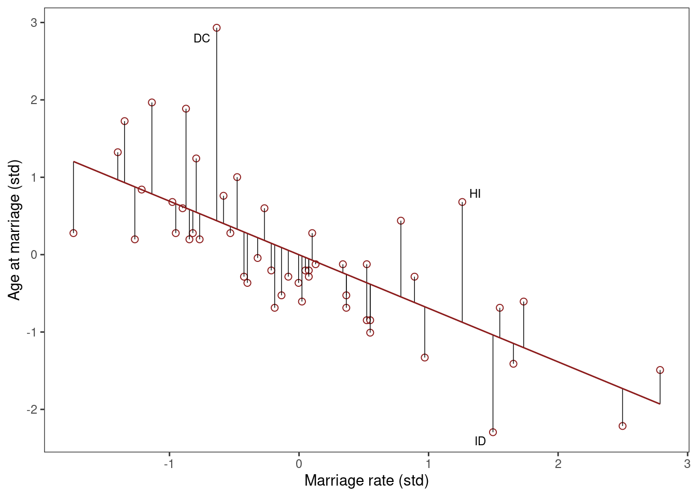

<div class="figure">

<p class="caption">Then put those on the plot on the bottom. So now that you know M, there's considerable information in also knowing A. But the reverse is not true. </p>
</div>


```r
r <-
  residuals(b5.4b) %>%
  data.frame() %>% 
  bind_cols(d)

p4 <-
  r %>%
  ggplot(aes(x = Estimate, y = d)) +
  stat_smooth(method = "lm", fullrange = T,
              color = "firebrick4", fill = "firebrick4", 
              alpha = 1/5, size = 1/2) +
  geom_vline(xintercept = 0, linetype = 2, color = "grey50") +
  geom_point(size = 2, color = "firebrick4", alpha = 2/3) +
  geom_text_repel(data = . %>% filter(Loc %in% c("ID", "HI", "DC")),  
                  aes(label = Loc), 
                  size = 3, seed = 5) +
  scale_x_continuous(limits = c(-2, 3)) +
  coord_cartesian(xlim = range(r$Estimate),
                  ylim = range(d$d)) +
  labs(x = "Age at marriage residuals",
       y = "Divorce rate (std)") +
  theme_bw() +
  theme(panel.grid = element_blank())

p4
```

```
## `geom_smooth()` using formula 'y ~ x'
```


```r
p1 + p2 + p3 + p4 + plot_annotation(title = "Understanding multiple regression through residuals")
```

```
## `geom_smooth()` using formula 'y ~ x'
## `geom_smooth()` using formula 'y ~ x'
```

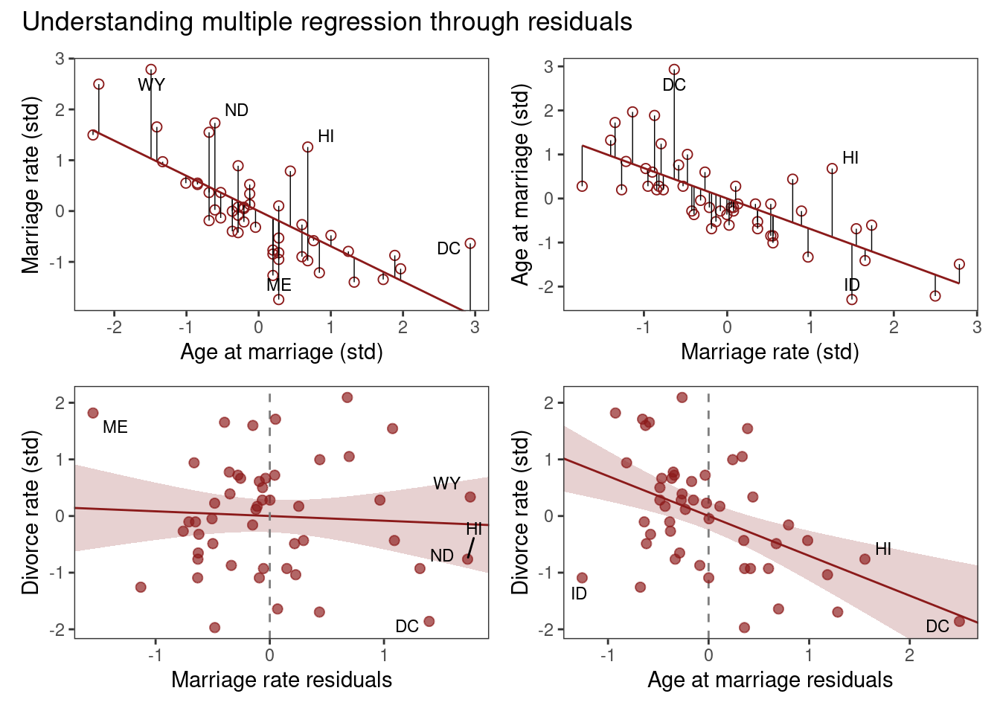

<div class="figure">

<p class="caption">This is one of the things we mean. In observational studies like this one, there's no ethical intervention we can make. But we want to make causal information. Linear regression allows you to do that, but only if you have an idea of the causal relationship between the variables. To interpret, you need a causal framework. We'll have an example latter when controlling can *create* a confound. These models are not magic. You shouldn't get cocky. This is the kind of study where you use average data. Quite a pathological dataset.</p>
</div>

<div class="figure">

<p class="caption">Cases where you hold other predictor variables constant. All the code for generating them is in the text. In the real world we can't do that. If we're right in our DAG here, and we manipulate A, you'll also manipulate M as well. </p>
</div>


Goals:
1. Figure out whether the approximation of the posterior works. Compare the predictions with the raw data. If they're different, they fail. 
2. It can inspire you to look at the cases that don't fit well, and figure out what you need to make better causal inferences.


Plot predictions against observed. 


```r
fitted(b5.3) %>%
  data.frame() %>%
  # un-standardize the model predictions
  mutate_all(~. * sd(d$Divorce) + mean(d$Divorce)) %>% 
  bind_cols(d) %>%
  
  ggplot(aes(x = Divorce, y = Estimate)) +
  geom_abline(linetype = 2, color = "grey50", size = .5) +
  geom_point(size = 1.5, color = "firebrick4", alpha = 3/4) +
  geom_linerange(aes(ymin = Q2.5, ymax = Q97.5),
                 size = 1/4, color = "firebrick4") +
  geom_text(data = . %>% filter(Loc %in% c("ID", "UT", "RI", "ME")),
            aes(label = Loc), 
            hjust = 1, nudge_x = - 0.25) +
  labs(x = "Observed divorce", y = "Predicted divorce") +
  theme_bw() +
  theme(panel.grid = element_blank())
```


<div class="figure">

<p class="caption">Diagonal is unity - perfect prediction. But there are states where they're making bad predictions, like ID. Has a very low D. That's why there's a mismatch. It's getting it really wrong. Why? The Mormons. They have a very low divorce rate. UT as well.</p>
</div>

*5.1.5.3 Counterfactual plots*

They can be produced for any values of the predictor variables you like, even unobserved combinations like high median age of marriage and high marriage rate.

Used with clarity of purpose, counterfactual plots help you understand the model, as well as generate predictions for imaginary interventions and compute how much some observed outcome could be attributed to some cause. 

Recipe:
1. Pick a variable to manipulate (the intervention variable)
2. Define the range of values to set the intervention variable to.
3. For each value of the intervention variable, and for each sample in posterior, use the causal model to simulate the values of other variables, including the outcome. 


```r
d_model <- bf(d ~ 1 + a + m)
m_model <- bf(m ~ 1 + a)

b5.3_A <-
  brm(data = d, 
      family = gaussian,
      d_model + m_model + set_rescor(FALSE),
      prior = c(prior(normal(0, 0.2), class = Intercept, resp = d),
                prior(normal(0, 0.5), class = b, resp = d),
                prior(exponential(1), class = sigma, resp = d),
                
                prior(normal(0, 0.2), class = Intercept, resp = m),
                prior(normal(0, 0.5), class = b, resp = m),
                prior(exponential(1), class = sigma, resp = m)),
      iter = 2000, warmup = 1000, chains = 4, cores = 4,
      seed = 5,
      file = "fits/b05.03_A")
```


```r
nd <- tibble(a = seq(from = -2, to = 2, length.out = 30),
             m = 0)

p1 <-
  predict(b5.3_A,
          resp = "d",
          newdata = nd) %>% 
  data.frame() %>% 
  bind_cols(nd) %>% 
  
  ggplot(aes(x = a, y = Estimate, ymin = Q2.5, ymax = Q97.5)) +
  geom_smooth(stat = "identity",
              fill = "firebrick", color = "firebrick4", alpha = 1/5, size = 1/4) +
  labs(subtitle = "Total counterfactual effect of A on D",
       x = "manipulated A",
       y = "counterfactual D") +
  coord_cartesian(ylim = c(-2, 2)) +
  theme_bw() +
  theme(panel.grid = element_blank()) 

p1
```

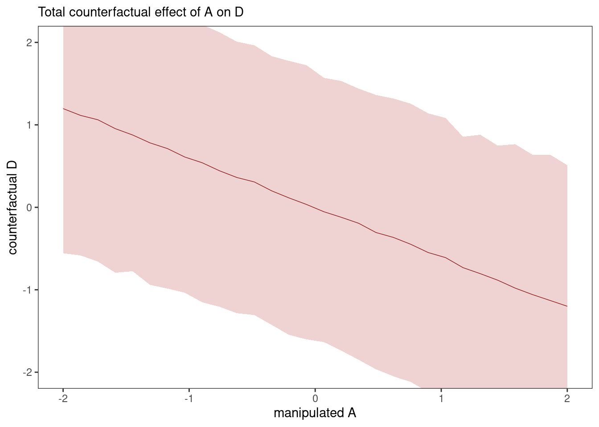


Now simulate what would happen if we manipulate A. 


```r
nd <- tibble(a = seq(from = -2, to = 2, length.out = 30))

p2 <-
  predict(b5.3_A,
          resp = "m",
          newdata = nd) %>% 
  data.frame() %>% 
  bind_cols(nd) %>% 
  
  ggplot(aes(x = a, y = Estimate, ymin = Q2.5, ymax = Q97.5)) +
  geom_smooth(stat = "identity",
              fill = "firebrick", color = "firebrick4", alpha = 1/5, size = 1/4) +
  labs(subtitle = "Counterfactual effect of A on M",
       x = "manipulated A",
       y = "counterfactual M") +
  coord_cartesian(ylim = c(-2, 2)) +
  theme_bw() +
  theme(panel.grid = element_blank()) 

p1 + p2 + plot_annotation(title = "Counterfactual plots for the multivariate divorce model")
```

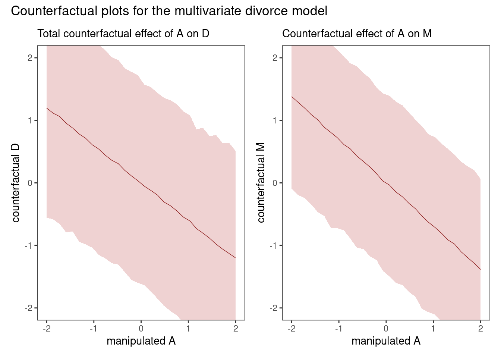


```r
# new data frame, standardized to mean 26.1 and std dev 1.24 
nd <- tibble(a = (c(20, 30) - 26.1) / 1.24,
             m = 0)

predict(b5.3_A,
        resp = "d",
        newdata = nd,
        summary = F) %>% 
  data.frame() %>% 
  set_names("a20", "a30") %>% 
  mutate(difference = a30 - a20) %>% 
  summarise(mean = mean(difference))
```

```
##        mean
## 1 -4.849687
```


This is a huge effect of 4.5 standard deviations, probably impossibly large.

Now let's simulate the effect of manipulating $M$. It's like a perfectly controlled experiment. We'll simulate a counterfactual for an average state, with $A = 0$, and see what changing $M$ does.


```r
nd <- tibble(m = seq(from = -2, to = 2, length.out = 30),
             a = 0)

predict(b5.3_A,
        resp = "d",
        newdata = nd) %>% 
  data.frame() %>% 
  bind_cols(nd) %>% 
  
  ggplot(aes(x = m, y = Estimate, ymin = Q2.5, ymax = Q97.5)) +
  geom_smooth(stat = "identity",
              fill = "firebrick", color = "firebrick4", alpha = 1/5, size = 1/4) +
  labs(subtitle = "Total counterfactual effect of M on D",
       x = "manipulated M",
       y = "counterfactual D") +
  coord_cartesian(ylim = c(-2, 2)) +
  theme_bw() +
  theme(panel.grid = element_blank()) 
```

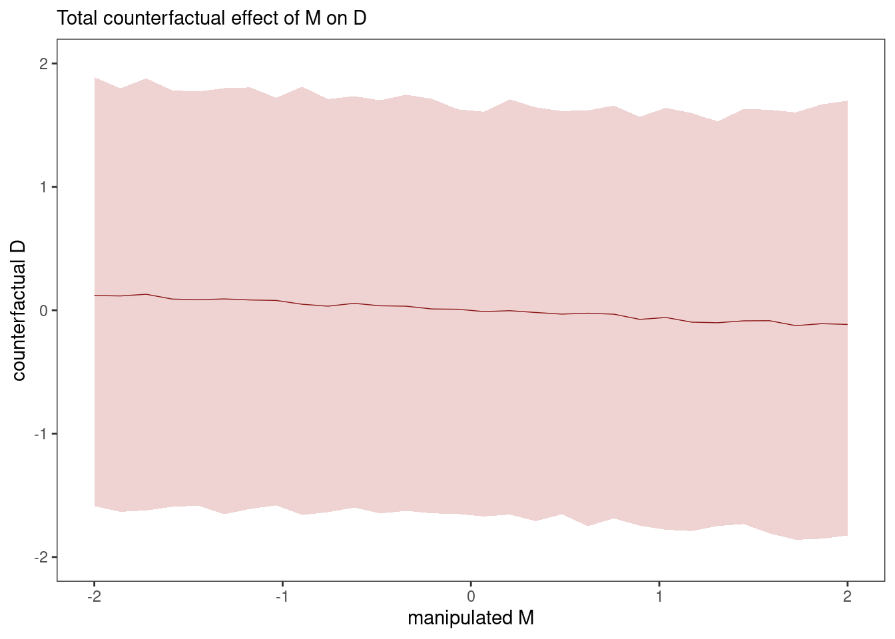


Note that we only simulated $D$ now. We don't simulate $A$, because $M$ doesn't influence it. 

**Simulating counterfactuals**

Define a range of values that we want to assign to $A$ and extract the posterior samples:


```r
post <-
  brms::posterior_samples(b5.3_A) %>% 
  mutate(iter = 1:n())
```


```r
post <-
  post %>% 
  expand(nesting(iter, b_m_Intercept, b_m_a, sigma_m, b_d_Intercept, b_d_a, b_d_m, sigma_d),
         a = seq(from = -2, to = 2, length.out = 30)) %>% 
  mutate(m_sim = rnorm(n(), mean = b_m_Intercept + b_m_a * a, sd = sigma_m)) %>% 
  mutate(d_sim = rnorm(n(), mean = b_d_Intercept + b_d_a * a + b_d_m * m_sim, sd = sigma_d)) %>% 
  pivot_longer(ends_with("sim")) %>% 
  group_by(a, name) %>% 
  summarise(mean = mean(value),
            ll = quantile(value, prob = .025),
            ul = quantile(value, prob = .975))
```

```
## `summarise()` has grouped output by 'a'. You can override using the `.groups` argument.
```

```r
# what did we do?
head(post)
```

```
## # A tibble: 6 × 5
## # Groups:   a [3]
##       a name   mean     ll    ul
##   <dbl> <chr> <dbl>  <dbl> <dbl>
## 1 -2    d_sim 1.12  -0.623  2.86
## 2 -2    m_sim 1.39  -0.109  2.85
## 3 -1.86 d_sim 1.06  -0.612  2.78
## 4 -1.86 m_sim 1.27  -0.166  2.70
## 5 -1.72 d_sim 0.978 -0.725  2.69
## 6 -1.72 m_sim 1.19  -0.280  2.61
```


If you plot `A_seq` against the column means of `D_sim`, you'll see the same result as before. 


```r
post %>% 
  mutate(dv = if_else(name == "d_sim", "predictions for D", "predictions for M")) %>% 
  
  ggplot(aes(x = a, y = mean, ymin = ll, ymax = ul)) +
  geom_smooth(stat = "identity",
              fill = "firebrick", color = "firebrick4", alpha = 1/5, size = 1/4) +
  labs(title = "Hand-made counterfactual plots for the multivariate divorce model",
       x = "manipulated A",
       y = "counterfactual") +
  coord_cartesian(ylim = c(-2, 2)) +
  theme_bw() +
  theme(panel.grid = element_blank(),
        strip.background = element_blank()) +
  facet_wrap(~ dv)
```

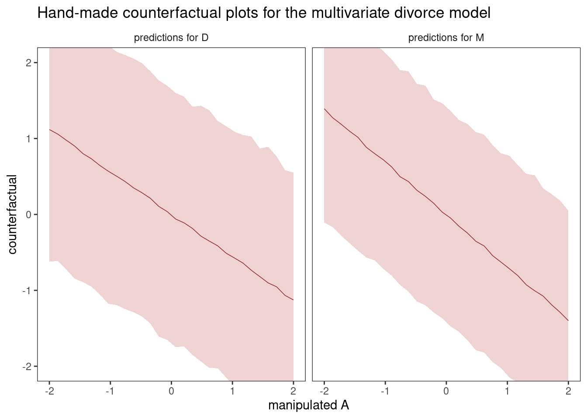


## Masked relationship

<div class="figure">

<p class="caption">Another good thing regression can do is reveal spurious correlations. When there are two predictors that both influence the outcome in different directions, you can get the total causal effect between the two. This tends to arise where you have two predictors, and they act in different directions, and cancel each other out, so if you don't model both of them individually, it looks like they have no effect. Noise can also cause you not to see a relationship.</p>
</div>

<div class="figure">

<p class="caption">Relationship between milk energy and how brainy they are? Intersted in things that are interested in what makes us unique. Primates are mammals, and some mammals have very highly energetic milk, like seals basically ooze butter. Primates in contrast carry their offspring on them. As a consequence, the energy density is lower. Human milk is not energetically rich. 75% of our brain mass is neocortex. Then the brainiest primate is *Cebus*. Can we see a signal of selection on milk energy from braininess?</p>
</div>

<div class="figure">

<p class="caption">Sample of primate species. Pairs plot. Particularly strong correlation between the magnitude of body mass (log(mass)) is strongly correlated with neocortex. No particular strong relationship between `log(mass)` and `kcal.per.g`.</p>
</div>


```r
data(milk, package = "rethinking")
d <- milk
rm(milk)

glimpse(d)
```

```
## Rows: 29
## Columns: 8
## $ clade          <fct> Strepsirrhine, Strepsirrhine, Strepsirrhine, Strepsirrh…
## $ species        <fct> Eulemur fulvus, E macaco, E mongoz, E rubriventer, Lemu…
## $ kcal.per.g     <dbl> 0.49, 0.51, 0.46, 0.48, 0.60, 0.47, 0.56, 0.89, 0.91, 0…
## $ perc.fat       <dbl> 16.60, 19.27, 14.11, 14.91, 27.28, 21.22, 29.66, 53.41,…
## $ perc.protein   <dbl> 15.42, 16.91, 16.85, 13.18, 19.50, 23.58, 23.46, 15.80,…
## $ perc.lactose   <dbl> 67.98, 63.82, 69.04, 71.91, 53.22, 55.20, 46.88, 30.79,…
## $ mass           <dbl> 1.95, 2.09, 2.51, 1.62, 2.19, 5.25, 5.37, 2.51, 0.71, 0…
## $ neocortex.perc <dbl> 55.16, NA, NA, NA, NA, 64.54, 64.54, 67.64, NA, 68.85, …
```


```r
d %>% 
  dplyr::select(kcal.per.g, mass, neocortex.perc) %>% 
  pairs(col = "firebrick4")
```

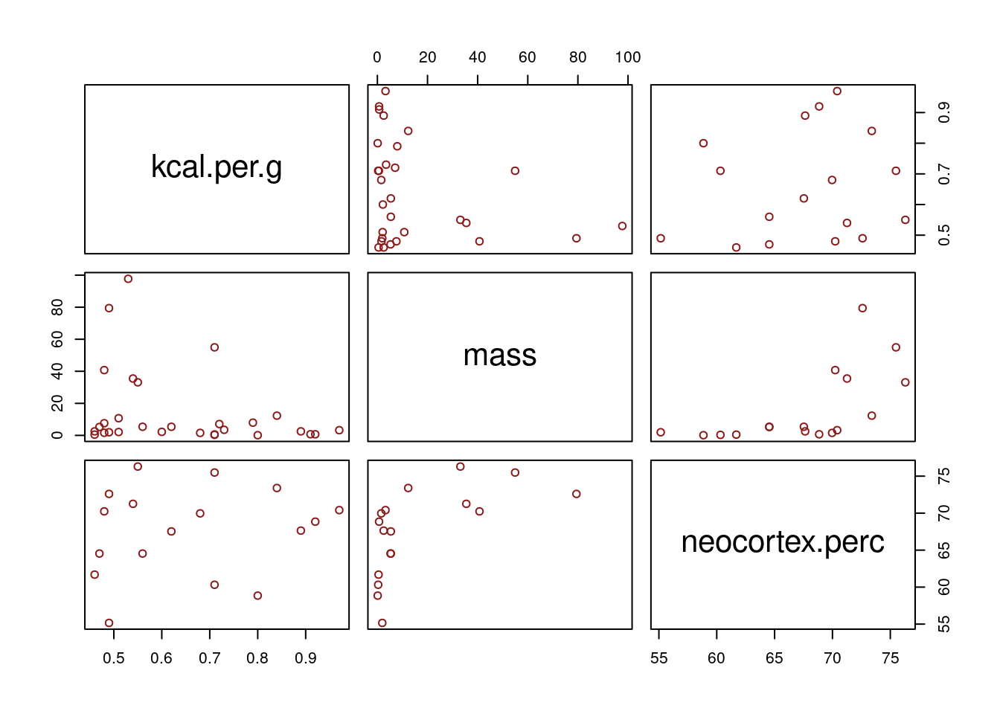


As before, standardising helps us both get a reliable approximation of the posterior as well as build reasonable priors.


```r
d <-
  d %>% 
  mutate(kcal.per.g_s     = (kcal.per.g - mean(kcal.per.g)) / sd(kcal.per.g), 
         log_mass_s       = (log(mass) - mean(log(mass))) / sd(log(mass)), 
         neocortex.perc_s = (neocortex.perc - mean(neocortex.perc, na.rm = T)) / sd(neocortex.perc, na.rm = T)
         )
```

Let's first just try to run this as a quap model with some vague priors:


```r
b5.5_draft <- 
  brm(data = d, 
      family = gaussian,
      kcal.per.g_s ~ 1 + neocortex.perc_s,
      prior = c(prior(normal(0, 1), class = Intercept),
                prior(normal(0, 1), class = b),
                prior(exponential(1), class = sigma)),
      iter = 2000, warmup = 1000, chains = 4, cores = 4,
      seed = 5,
      sample_prior = T,
      file = "fits/b05.05_draft")
```

The culprit is the missing values in `N`. 

Here we'll just drop the missing values, known as **complete case analysis**. But it isn't always a good thing - see Chapter 15.


```r
dcc <- 
  d %>%
  drop_na(ends_with("_s"))

# how many rows did we drop?
nrow(d) - nrow(dcc)
```

```
## [1] 12
```

Now let's model with that.


```r
b5.5_draft <- 
  brm(data = dcc, 
      family = gaussian,
      kcal.per.g_s ~ 1 + neocortex.perc_s,
      prior = c(prior(normal(0, 1), class = Intercept),
                prior(normal(0, 1), class = b),
                prior(exponential(1), class = sigma)),
      iter = 2000, warmup = 1000, chains = 4, cores = 4,
      seed = 5,
      sample_prior = T,
      file = "fits/b05.05_draft")
```

Simulate and plot 50 prior regression lines.

```r
set.seed(5)

prior_samples(b5.5_draft) %>% 
  slice_sample(n = 50) %>% 
  rownames_to_column() %>% 
  expand(nesting(rowname, Intercept, b),
         neocortex.perc_s = c(-2, 2)) %>% 
  mutate(kcal.per.g_s = Intercept + b * neocortex.perc_s) %>% 
  
  ggplot(aes(x = neocortex.perc_s, y = kcal.per.g_s)) +
  geom_line(aes(group = rowname),
            color = "firebrick", alpha = .4) +
  coord_cartesian(ylim = c(-2, 2)) +
  labs(x = "neocortex percent (std)",
       y = "kilocal per g (std)",
       subtitle = "Intercept ~ dnorm(0, 1)\nb ~ dnorm(0, 1)") +
  theme_bw() +
  theme(panel.grid = element_blank()) 
```

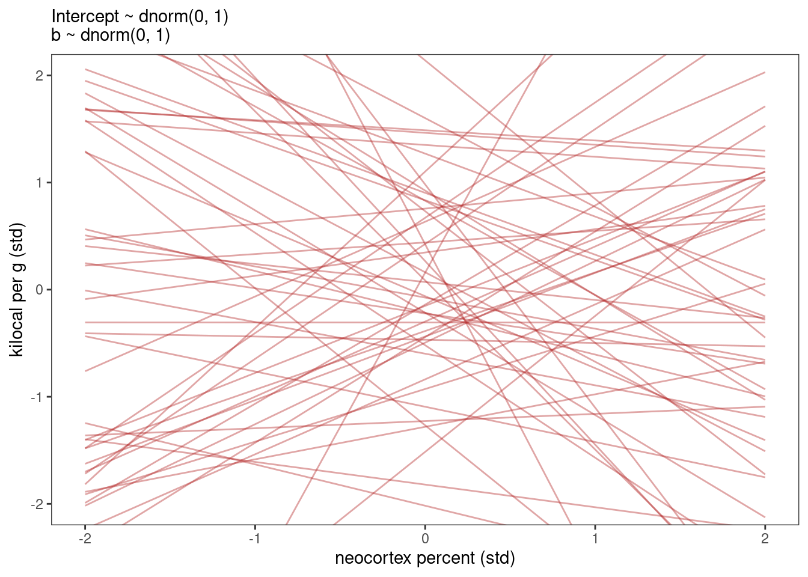


```r
print(b5.5_draft)
```

```
##  Family: gaussian 
##   Links: mu = identity; sigma = identity 
## Formula: kcal.per.g_s ~ 1 + neocortex.perc_s 
##    Data: d (Number of observations: 17) 
## Samples: 4 chains, each with iter = 2000; warmup = 1000; thin = 1;
##          total post-warmup samples = 4000
## 
## Population-Level Effects: 
##                  Estimate Est.Error l-95% CI u-95% CI Rhat Bulk_ESS Tail_ESS
## Intercept            0.09      0.26    -0.44     0.61 1.00     3341     2624
## neocortex.perc_s     0.16      0.27    -0.38     0.70 1.00     3647     2763
## 
## Family Specific Parameters: 
##       Estimate Est.Error l-95% CI u-95% CI Rhat Bulk_ESS Tail_ESS
## sigma     1.13      0.21     0.81     1.63 1.00     2827     2553
## 
## Samples were drawn using sampling(NUTS). For each parameter, Bulk_ESS
## and Tail_ESS are effective sample size measures, and Rhat is the potential
## scale reduction factor on split chains (at convergence, Rhat = 1).
```

Tighten up the fit:


```r
b5.5 <- 
  brm(data = dcc, 
      family = gaussian,
      kcal.per.g_s ~ 1 + neocortex.perc_s,
      prior = c(prior(normal(0, 0.2), class = Intercept),
                prior(normal(0, 0.5), class = b),
                prior(exponential(1), class = sigma)),
      iter = 2000, warmup = 1000, chains = 4, cores = 4,
      seed = 5,
      sample_prior = T,
      file = "fits/b05.05")
```


```r
set.seed(5)
prior_samples(b5.5) %>% 
  slice_sample(n = 50) %>% 
  rownames_to_column() %>% 
  expand(nesting(rowname, Intercept, b),
         neocortex.perc_s = c(-2, 2)) %>% 
  mutate(kcal.per.g_s = Intercept + b * neocortex.perc_s) %>% 
  
  ggplot(aes(x = neocortex.perc_s, y = kcal.per.g_s, group = rowname)) +
  geom_line(color = "firebrick", alpha = .4) +
  coord_cartesian(ylim = c(-2, 2)) +
  labs(subtitle = "Intercept ~ dnorm(0, 0.2)\nb ~ dnorm(0, 0.5)",
       x = "neocortex percent (std)",
       y = "kilocal per g (std)") +
  theme_bw() +
  theme(panel.grid = element_blank()) 
```

<div class="figure">
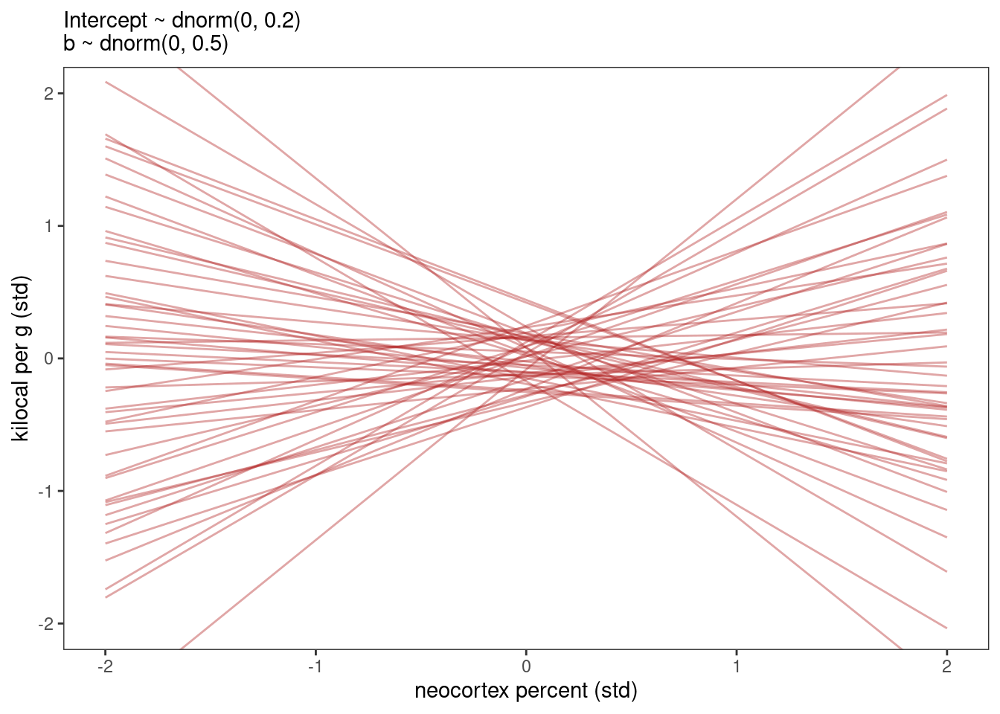
<p class="caption">Figure 5.8b</p>
</div>


<div class="figure">

<p class="caption">We need to do some prior predictive simulation. Left is not a good prior. All we need to do to get the regression lines to live in the outcome space, we can contract $lpha$ - should be about 0, and the slope should be about 0.5 to be tighter. If you standardise the predictor and outcome, Normal(0, 0.5) should keep you in the outcome space.</p>
</div>


```r
print(b5.5)
```

```
##  Family: gaussian 
##   Links: mu = identity; sigma = identity 
## Formula: kcal.per.g_s ~ 1 + neocortex.perc_s 
##    Data: dcc (Number of observations: 17) 
## Samples: 4 chains, each with iter = 2000; warmup = 1000; thin = 1;
##          total post-warmup samples = 4000
## 
## Population-Level Effects: 
##                  Estimate Est.Error l-95% CI u-95% CI Rhat Bulk_ESS Tail_ESS
## Intercept            0.04      0.16    -0.27     0.35 1.00     3606     2670
## neocortex.perc_s     0.13      0.24    -0.35     0.59 1.00     3510     2316
## 
## Family Specific Parameters: 
##       Estimate Est.Error l-95% CI u-95% CI Rhat Bulk_ESS Tail_ESS
## sigma     1.10      0.20     0.79     1.58 1.00     3002     2584
## 
## Samples were drawn using sampling(NUTS). For each parameter, Bulk_ESS
## and Tail_ESS are effective sample size measures, and Rhat is the potential
## scale reduction factor on split chains (at convergence, Rhat = 1).
```


```r
# wrangle
bind_rows(
  posterior_samples(b5.5_draft) %>% dplyr::select(b_Intercept:sigma),
  posterior_samples(b5.5) %>% dplyr::select(b_Intercept:sigma)
  )  %>% 
  mutate(fit = rep(c("b5.5_draft", "b5.5"), each = n() / 2)) %>% 
  pivot_longer(-fit) %>% 
  group_by(name, fit) %>% 
  summarise(mean = mean(value),
            ll = quantile(value, prob = .025),
            ul = quantile(value, prob = .975)) %>% 
  mutate(fit = factor(fit, levels = c("b5.5_draft", "b5.5"))) %>% 
  
  # plot
  ggplot(aes(x = mean, y = fit, xmin = ll, xmax = ul)) +
  geom_pointrange(color = "firebrick") +
  geom_hline(yintercept = 0, color = "firebrick", alpha = 1/5) +
  labs(x = "posterior", 
       y = NULL) +
  theme_bw() +
  theme(axis.text.y = element_text(hjust = 0),
        axis.ticks.y = element_blank(),
        panel.grid = element_blank(),
        strip.background = element_blank()) +
  facet_wrap(~ name, ncol = 1)
```

```
## `summarise()` has grouped output by 'name'. You can override using the `.groups` argument.
```

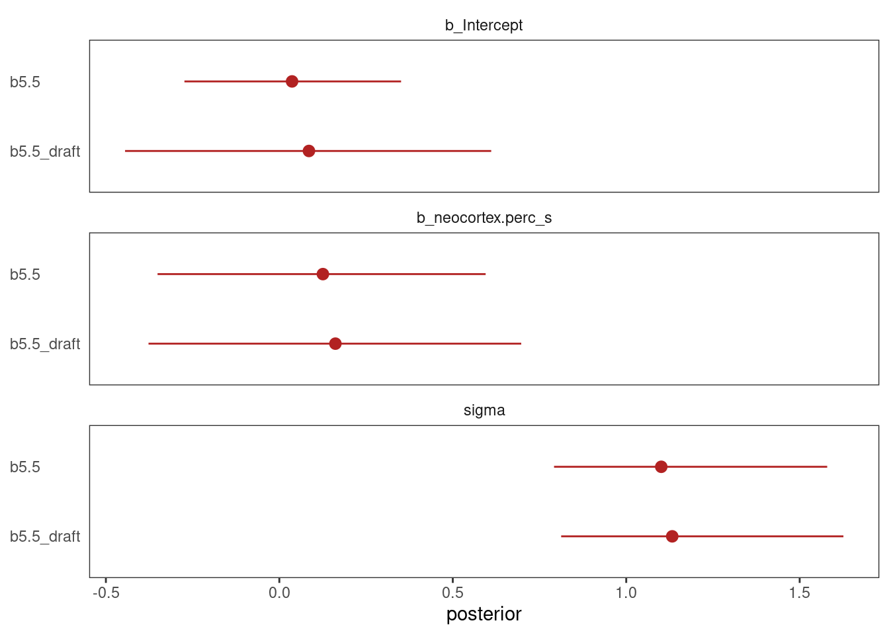


```r
nd <- tibble(neocortex.perc_s = seq(from = -2.5, to = 2, length.out = 30))

fitted(b5.5, 
       newdata = nd,
       probs = c(.025, .975, .25, .75)) %>%
  data.frame() %>%
  bind_cols(nd) %>% 
  
  ggplot(aes(x = neocortex.perc_s, y = Estimate)) +
  geom_ribbon(aes(ymin = Q2.5, ymax = Q97.5),
              fill = "firebrick", alpha = 1/5) +
  geom_smooth(aes(ymin = Q25, ymax = Q75),
              stat = "identity",
              fill = "firebrick4", color = "firebrick4", alpha = 1/5, size = 1/2) +
  geom_point(data = dcc, 
             aes(x = neocortex.perc_s, y = kcal.per.g_s),
             size = 2, color = "firebrick4") +
  coord_cartesian(xlim = range(dcc$neocortex.perc_s), 
                  ylim = range(dcc$kcal.per.g_s)) +
  labs(x = "neocortex percent (std)",
       y = "kilocal per g (std)") +
  theme_bw() +
  theme(panel.grid = element_blank())
```

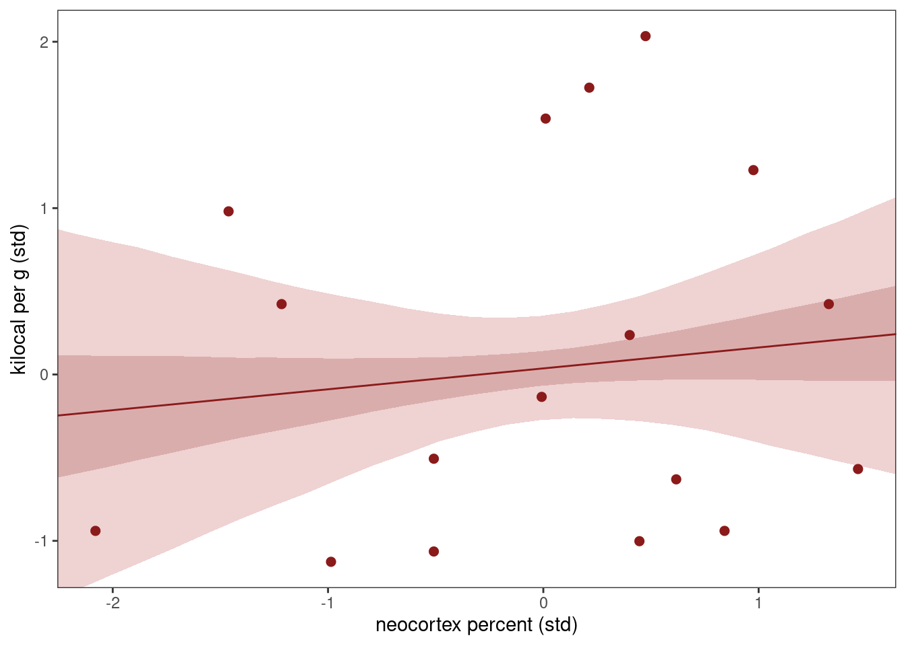


<div class="figure">

<p class="caption">There's a slight relationship between brain and milk energy, and a slightly negative relationship with body mass. Look what happens when you include both in a model.</p>
</div>

Let's consider another predictor variable, adult female body mass, `mass`. Let's use the logarithm of mass as a predictor as well. Why a logarithm instead of the raw mass? 
>Because taking the log of a measure translates the measure into magnitudes. 


```r
b5.6 <- 
  brm(data = dcc, 
      family = gaussian,
      kcal.per.g_s ~ 1 + log_mass_s,
      prior = c(prior(normal(0, 0.2), class = Intercept),
                prior(normal(0, 0.5), class = b),
                prior(exponential(1), class = sigma)),
      iter = 2000, warmup = 1000, chains = 4, cores = 4,
      seed = 5,
      sample_prior = T,
      file = "fits/b05.06")
```


```r
print(b5.6)
```

```
##  Family: gaussian 
##   Links: mu = identity; sigma = identity 
## Formula: kcal.per.g_s ~ 1 + log_mass_s 
##    Data: dcc (Number of observations: 17) 
## Samples: 4 chains, each with iter = 2000; warmup = 1000; thin = 1;
##          total post-warmup samples = 4000
## 
## Population-Level Effects: 
##            Estimate Est.Error l-95% CI u-95% CI Rhat Bulk_ESS Tail_ESS
## Intercept      0.04      0.15    -0.26     0.34 1.00     4160     2389
## log_mass_s    -0.27      0.21    -0.68     0.17 1.00     3708     2578
## 
## Family Specific Parameters: 
##       Estimate Est.Error l-95% CI u-95% CI Rhat Bulk_ESS Tail_ESS
## sigma     1.05      0.19     0.75     1.47 1.00     3106     2655
## 
## Samples were drawn using sampling(NUTS). For each parameter, Bulk_ESS
## and Tail_ESS are effective sample size measures, and Rhat is the potential
## scale reduction factor on split chains (at convergence, Rhat = 1).
```


```r
nd <- tibble(log_mass_s = seq(from = -2.5, to = 2.5, length.out = 30))

fitted(b5.6, 
       newdata = nd,
       probs = c(.025, .975, .25, .75)) %>%
  data.frame() %>%
  bind_cols(nd) %>% 
  
  ggplot(aes(x = log_mass_s, y = Estimate)) +
  geom_ribbon(aes(ymin = Q2.5, ymax = Q97.5),
              fill = "firebrick", alpha = 1/5) +
  geom_smooth(aes(ymin = Q25, ymax = Q75),
              stat = "identity",
              fill = "firebrick4", color = "firebrick4", alpha = 1/5, size = 1/2) +
  geom_point(data = dcc, 
             aes(y = kcal.per.g_s),
             size = 2, color = "firebrick4") +
  coord_cartesian(xlim = range(dcc$log_mass_s), 
                  ylim = range(dcc$kcal.per.g_s)) +
  labs(x = "log body mass (std)",
       y = "kilocal per g (std)") +
  theme_bw() +
  theme(panel.grid = element_blank())
```

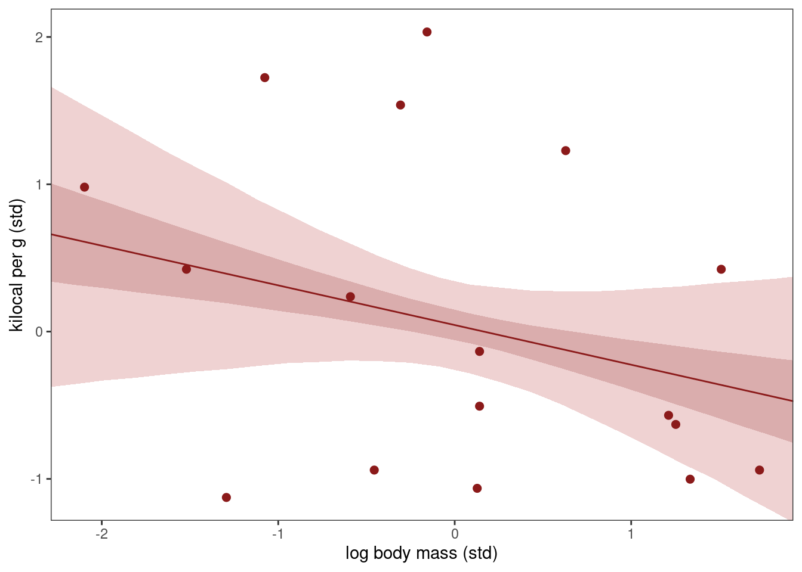


<div class="figure">

<p class="caption">Now very strong relationship between both.</p>
</div>

Now add both together.


```r
b5.7 <- 
  brm(data = dcc, 
      family = gaussian,
      kcal.per.g_s ~ 1 + neocortex.perc_s + log_mass_s,
      prior = c(prior(normal(0, 0.2), class = Intercept),
                prior(normal(0, 0.5), class = b),
                prior(exponential(1), class = sigma)),
      iter = 2000, warmup = 1000, chains = 4, cores = 4,
      seed = 5,
      file = "fits/b05.07")
```


```r
print(b5.7)
```

```
##  Family: gaussian 
##   Links: mu = identity; sigma = identity 
## Formula: kcal.per.g_s ~ 1 + neocortex.perc_s + log_mass_s 
##    Data: dcc (Number of observations: 17) 
## Samples: 4 chains, each with iter = 2000; warmup = 1000; thin = 1;
##          total post-warmup samples = 4000
## 
## Population-Level Effects: 
##                  Estimate Est.Error l-95% CI u-95% CI Rhat Bulk_ESS Tail_ESS
## Intercept            0.07      0.15    -0.23     0.35 1.00     3492     2495
## neocortex.perc_s     0.60      0.28    -0.00     1.12 1.00     2331     1968
## log_mass_s          -0.64      0.25    -1.11    -0.11 1.00     2412     2618
## 
## Family Specific Parameters: 
##       Estimate Est.Error l-95% CI u-95% CI Rhat Bulk_ESS Tail_ESS
## sigma     0.87      0.18     0.59     1.28 1.00     2337     2059
## 
## Samples were drawn using sampling(NUTS). For each parameter, Bulk_ESS
## and Tail_ESS are effective sample size measures, and Rhat is the potential
## scale reduction factor on split chains (at convergence, Rhat = 1).
```


```r
bind_cols(
  brms::posterior_samples(b5.5) %>% 
    transmute(`b5.5_beta[N]` = b_neocortex.perc_s),
  brms::posterior_samples(b5.6) %>% 
    transmute(`b5.6_beta[M]` = b_log_mass_s),
  brms::posterior_samples(b5.7) %>% 
    transmute(`b5.7_beta[N]` = b_neocortex.perc_s,
              `b5.7_beta[M]` = b_log_mass_s)
  ) %>% 
  pivot_longer(everything()) %>% 
  group_by(name) %>% 
  summarise(mean = mean(value),
            ll   = quantile(value, prob = .025),
            ul   = quantile(value, prob = .975)) %>% 
  separate(name, into = c("fit", "parameter"), sep = "_") %>% 
  # complete(fit, parameter) %>% 
  
  ggplot(aes(x = mean, y = fit, xmin = ll, xmax = ul)) +
  geom_pointrange(color = "firebrick") +
  geom_hline(yintercept = 0, color = "firebrick", alpha = 1/5) +
  ylab(NULL) +
  theme_bw() +
  theme(panel.grid = element_blank(),
        strip.background = element_rect(fill = "transparent", color = "transparent")) +
  facet_wrap(~ parameter, ncol = 1, labeller = label_parsed)
```


<div class="figure">

<p class="caption">You can see strong relationships, but only when they're both present in the model. This is the masking effect. One is positively related to the outcome, the other is negatively related to the outcome, and they're correlated with one another. Bigger primates need bigger brains, bigger brains need more energy, bigger bodies need less because they're are longer developmental times. THey're antagonistic effects, but correlated in same species. This sort of effect can happen a lot. </p>
</div>


```r
# define custom functions
my_diag <- function(data, mapping, ...) {
  ggplot(data = data, mapping = mapping) + 
    geom_density(fill = "firebrick4", size = 0)
}

my_lower <- function(data, mapping, ...) {
  ggplot(data = data, mapping = mapping) + 
    geom_smooth(method = "lm", color = "firebrick4", size = 1, 
                se = F) +
    geom_point(color = "firebrick", alpha = .8, size = 1/3)
  }

# plot
dcc %>% 
  dplyr::select(ends_with("_s")) %>% 
  GGally::ggpairs(upper = list(continuous = GGally::wrap("cor", family = "sans", color = "black")),
          # plug those custom functions into `ggpairs()`
          diag  = list(continuous = my_diag),
          lower = list(continuous = my_lower)) + 
  theme_bw() +
  theme(axis.text = element_blank(),
        axis.ticks = element_blank(),
        panel.grid = element_blank(),
        strip.background = element_rect(fill = "white", color = "white"))
```

```
## `geom_smooth()` using formula 'y ~ x'
## `geom_smooth()` using formula 'y ~ x'
## `geom_smooth()` using formula 'y ~ x'
```

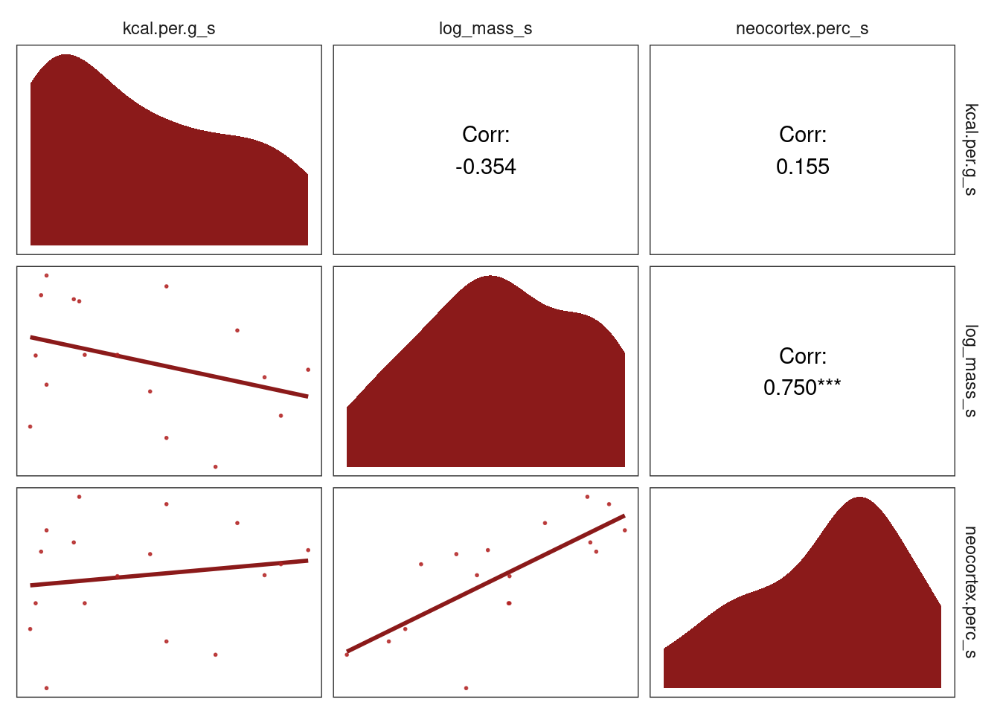


```r
nd <- tibble(neocortex.perc_s = seq(from = -2.5, to = 2, length.out = 30),
             log_mass_s       = 0)

p1 <-
  fitted(b5.7, 
         newdata = nd,
         probs = c(.025, .975, .25, .75)) %>%
  data.frame() %>%
  bind_cols(nd) %>% 
  
  ggplot(aes(x = neocortex.perc_s, y = Estimate)) +
  geom_ribbon(aes(ymin = Q2.5, ymax = Q97.5),
              fill = "firebrick", alpha = 1/5) +
  geom_smooth(aes(ymin = Q25, ymax = Q75),
              stat = "identity",
              fill = "firebrick4", color = "firebrick4", alpha = 1/5, size = 1/2) +
  coord_cartesian(xlim = range(dcc$neocortex.perc_s), 
                  ylim = range(dcc$kcal.per.g_s)) +
  labs(subtitle = "Counterfactual holding M = 0", 
       x = "neocortex percent (std)",
       y = "kilocal per g (std)")

nd <- tibble(log_mass_s       = seq(from = -2.5, to = 2.5, length.out = 30),
             neocortex.perc_s = 0)

p2 <-
  fitted(b5.7, 
         newdata = nd,
         probs = c(.025, .975, .25, .75)) %>%
  data.frame() %>%
  bind_cols(nd) %>% 
  
  ggplot(aes(x = log_mass_s, y = Estimate)) +
  geom_ribbon(aes(ymin = Q2.5, ymax = Q97.5),
              fill = "firebrick", alpha = 1/5) +
  geom_smooth(aes(ymin = Q25, ymax = Q75),
              stat = "identity",
              fill = "firebrick4", color = "firebrick4", alpha = 1/5, size = 1/2) +
  coord_cartesian(xlim = range(dcc$log_mass_s), 
                  ylim = range(dcc$kcal.per.g_s)) +
  labs(subtitle = "Counterfactual holding N = 0",
       x = "log body mass (std)",
       y = "kilocal per g (std)")

# combine
p1 + p2 + 
  plot_annotation(title = "Figure 5.9 [bottom row]. Milk energy and neocortex among primates.") &
  theme_bw() &
  theme(panel.grid = element_blank())
```

<div class="figure">
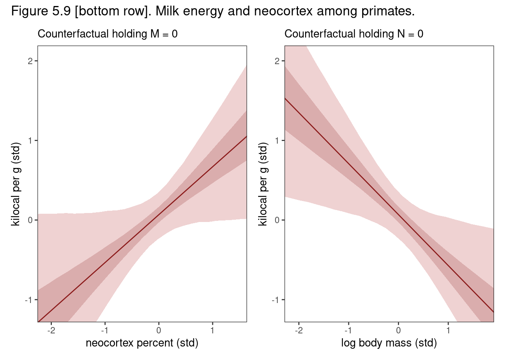
<p class="caption">Figure 5.9 (bottom row)</p>
</div>

**Simulating a masking relationship**

<div class="figure">

<p class="caption">Fake data that causes this relationship. `U` is unobserved, some life history variable. Then the causal influence on each of those. This relationship is sufficient to create what we saw.</p>
</div>


```r
# how many cases would you like?
n <- 100

set.seed(5)
d_sim <- 
  tibble(m = rnorm(n, mean = 0, sd = 1)) %>% 
  mutate(n = rnorm(n, mean = m, sd = 1)) %>% 
  mutate(k = rnorm(n, mean = n - m, sd = 1))
```

Get a sense of what we just simulated:


```r
d_sim %>% 
  GGally::ggpairs(upper = list(continuous = GGally::wrap("cor", family = "sans", color = "firebrick4")),
          diag  = list(continuous = my_diag),
          lower = list(continuous = my_lower)) + 
  theme_bw() +
  theme(axis.text = element_blank(),
        axis.ticks = element_blank(),
        panel.grid = element_blank(),
        strip.background = element_rect(fill = "white", color = "white"))
```

```
## `geom_smooth()` using formula 'y ~ x'
## `geom_smooth()` using formula 'y ~ x'
## `geom_smooth()` using formula 'y ~ x'
```

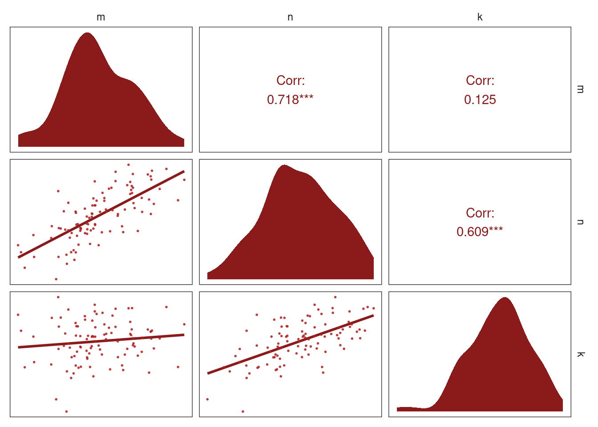


## Categorical variables

<div class="figure">

<p class="caption">Often we have data that represents discrete categories. Want to include those, but they're not continuous. Useful variables because the mean varies, but can't add them as they are. First is to create a dummy, and the next is almost always superior, and that's the index. </p>
</div>


```r
data(Howell1, package = "rethinking")
d <- Howell1
rm(Howell1)

d %>% 
  glimpse()
```

```
## Rows: 544
## Columns: 4
## $ height <dbl> 151.7650, 139.7000, 136.5250, 156.8450, 145.4150, 163.8300, 149…
## $ weight <dbl> 47.82561, 36.48581, 31.86484, 53.04191, 41.27687, 62.99259, 38.…
## $ age    <dbl> 63.0, 63.0, 65.0, 41.0, 51.0, 35.0, 32.0, 27.0, 19.0, 54.0, 47.…
## $ male   <int> 1, 0, 0, 1, 0, 1, 0, 1, 0, 1, 0, 1, 0, 0, 0, 1, 1, 0, 1, 0, 0, …
```

`male` is an indicator, or dummy, variable.

<div class="figure">

<p class="caption">Take a categorical variable and convert them to indicator variables. They stand in for something. e.g. Kalahari height data, `0` means not `male`. </p>
</div>

<div class="figure">

<p class="caption">Height varies by sex, so you could include it in the model. The linear model looks like a continuous predictor, because you've coded it as 0 and 1, if effectively turns the parameter off and on, and adjusts the mean. Effectively makes two intercepts, one male, one female. `alpha` is the intercept for females, and `alpha + betaM` is the intercept for males. </p>
</div>


```r
set.seed(5)

prior <-
  tibble(mu_female = rnorm(1e4, mean = 178, sd = 20)) %>% 
  mutate(mu_male = mu_female + rnorm(1e4, mean = 0, sd = 10))

prior %>% 
  pivot_longer(everything()) %>% 
  group_by(name) %>% 
  summarise(mean = mean(value),
            sd   = sd(value),
            ll   = quantile(value, prob = .025),
            ul   = quantile(value, prob = .975)) %>% 
  mutate_if(is.double, round, digits = 2)
```

```
## # A tibble: 2 × 5
##   name       mean    sd    ll    ul
##   <chr>     <dbl> <dbl> <dbl> <dbl>
## 1 mu_female  178.  20.2  138.  219.
## 2 mu_male    178.  22.5  133.  222.
```

Visualise the two prior predictive distributions:

```r
prior %>% 
  pivot_longer(everything()) %>% 
  ggplot(aes(x = value, fill = name, color = name)) +
  geom_density(size = 2/3, alpha = 2/3) +
  scale_fill_manual(NULL, values = c("firebrick4", "black")) +
  scale_color_manual(NULL, values = c("firebrick4", "black")) +
  scale_y_continuous(NULL, breaks = NULL) +
  xlab("prior predictive distribution for our dummy groups") +
  theme_bw() +
  theme(panel.grid = element_blank(),
        legend.position = c(.82, .83))
```

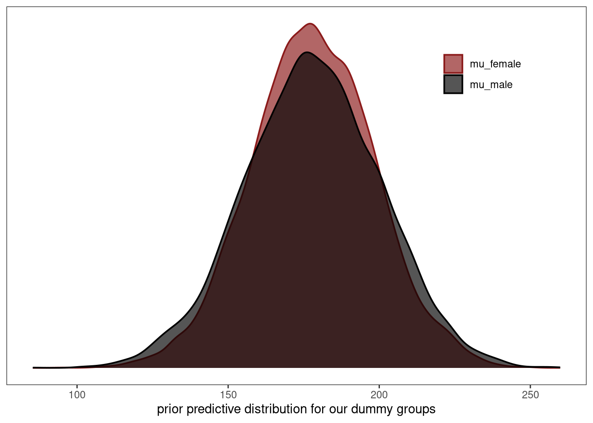


<div class="figure">

<p class="caption">Have to pick same number of priors for number of categories. Consequence is you end up assuming that one of the categories is less certain than all the others.</p>
</div>

<div class="figure">

<p class="caption">This is the better option.</p>
</div>


```r
d <-
  d %>% 
  mutate(sex = ifelse(male == 1, 2, 1))

head(d)
```

```
##    height   weight age male sex
## 1 151.765 47.82561  63    1   2
## 2 139.700 36.48581  63    0   1
## 3 136.525 31.86484  65    0   1
## 4 156.845 53.04191  41    1   2
## 5 145.415 41.27687  51    0   1
## 6 163.830 62.99259  35    1   2
```

Make it a factor:


```r
d <-
  d %>% 
  mutate(sex = factor(sex))
```


-------


```r
slides_dir = here::here("docs/slides/L06")
```


<div class="figure">

<p class="caption">Pick up where we left off. How to include un-ordered categorical data in a regression? A lot of downsides for using dummy variables. Index variables have a lot of advantages, including that you can assign the same priors to each of the categories. Another reason is that when you get more and more categories, you don't have to change anything other than include more numbers in the index. Grows really nicely, and is the foundation of multi-level models.</p>
</div>

<div class="figure">

<p class="caption">Can code this in `quap`. The bracket notation means `a` for each `sex`. Now you see you get an alpha for each sex. The awkwardness is you need to make inferences.</p>
</div>


```r
b5.8 <- 
  brm(data = d, 
      family = gaussian,
      height ~ 0 + sex,
      prior = c(prior(normal(178, 20), class = b),
                prior(exponential(1), class = sigma)),
      iter = 2000, warmup = 1000, chains = 4, cores = 4,
      seed = 5,
      file = "fits/b05.08")
```


```r
print(b5.8)
```

```
##  Family: gaussian 
##   Links: mu = identity; sigma = identity 
## Formula: height ~ 0 + sex 
##    Data: d (Number of observations: 544) 
## Samples: 4 chains, each with iter = 2000; warmup = 1000; thin = 1;
##          total post-warmup samples = 4000
## 
## Population-Level Effects: 
##      Estimate Est.Error l-95% CI u-95% CI Rhat Bulk_ESS Tail_ESS
## sex1   134.85      1.58   131.82   137.92 1.00     4036     3015
## sex2   142.61      1.71   139.29   145.91 1.00     3244     2615
## 
## Family Specific Parameters: 
##       Estimate Est.Error l-95% CI u-95% CI Rhat Bulk_ESS Tail_ESS
## sigma    26.79      0.77    25.33    28.38 1.00     3510     2929
## 
## Samples were drawn using sampling(NUTS). For each parameter, Bulk_ESS
## and Tail_ESS are effective sample size measures, and Rhat is the potential
## scale reduction factor on split chains (at convergence, Rhat = 1).
```


<div class="figure">

<p class="caption">If you want the posterior distribution for the sexes, you extract samples from the posterior. Then compute the difference by subtracting the difference from each sample. Still it in a column called `diff_fm`. Posterior mean is -8. All the comparisons are already in the posterior, you just have to extract samples to compute them. We'll be using this kind of coding in future examples.</p>
</div>


```r
brms::posterior_samples(b5.8) %>% 
  mutate(diff_fm = b_sex1 - b_sex2) %>% 
  gather(key, value, -`lp__`) %>% 
  group_by(key) %>% 
  tidybayes::mean_qi(value, .width = .89)
```

```
## # A tibble: 4 × 7
##   key      value .lower .upper .width .point .interval
##   <chr>    <dbl>  <dbl>  <dbl>  <dbl> <chr>  <chr>    
## 1 b_sex1  135.    132.  137.     0.89 mean   qi       
## 2 b_sex2  143.    140.  145.     0.89 mean   qi       
## 3 diff_fm  -7.76  -11.5  -3.89   0.89 mean   qi       
## 4 sigma    26.8    25.6  28.1    0.89 mean   qi
```

***5.3.2. Many categories***


```r
data(milk, package = "rethinking")
d <- milk
rm(milk)
```

Peek at `clade`


```r
d %>%
  distinct(clade)
```

```
##              clade
## 1    Strepsirrhine
## 2 New World Monkey
## 3 Old World Monkey
## 4              Ape
```


```r
d$clade_id <- as.integer( d$clade )
```


```r
# standardize the `kcal.per.g` variable
d <-
  d %>% 
  mutate(kcal.per.g_s = (kcal.per.g - mean(kcal.per.g)) / sd(kcal.per.g))

b5.9 <- 
  brm(data = d, 
      family = gaussian,
      kcal.per.g_s ~ 0 + clade,
      prior = c(prior(normal(0, 0.5), class = b),
                prior(exponential(1), class = sigma)),
      iter = 2000, warmup = 1000, chains = 4, cores = 4,
      seed = 5,
      file = "fits/b05.09")
```


```r
print(b5.9)
```

```
##  Family: gaussian 
##   Links: mu = identity; sigma = identity 
## Formula: kcal.per.g_s ~ 0 + clade 
##    Data: d (Number of observations: 29) 
## Samples: 4 chains, each with iter = 2000; warmup = 1000; thin = 1;
##          total post-warmup samples = 4000
## 
## Population-Level Effects: 
##                     Estimate Est.Error l-95% CI u-95% CI Rhat Bulk_ESS Tail_ESS
## cladeApe               -0.46      0.25    -0.93     0.03 1.00     4699     2968
## cladeNewWorldMonkey     0.35      0.24    -0.14     0.79 1.00     4923     2929
## cladeOldWorldMonkey     0.63      0.27     0.07     1.15 1.00     4212     2878
## cladeStrepsirrhine     -0.55      0.29    -1.11     0.02 1.00     4735     2564
## 
## Family Specific Parameters: 
##       Estimate Est.Error l-95% CI u-95% CI Rhat Bulk_ESS Tail_ESS
## sigma     0.80      0.12     0.60     1.08 1.00     3960     2649
## 
## Samples were drawn using sampling(NUTS). For each parameter, Bulk_ESS
## and Tail_ESS are effective sample size measures, and Rhat is the potential
## scale reduction factor on split chains (at convergence, Rhat = 1).
```


```r
bayesplot::color_scheme_set("red")

post <- brms::posterior_samples(b5.9)

post %>% 
  dplyr::select(starts_with("b_")) %>% 
  bayesplot::mcmc_intervals(prob = .5,
                 point_est = "median") +
  labs(title = "My fancy bayesplot-based coefficient plot") +
  theme_bw() +
  theme(axis.text.y = element_text(hjust = 0),
        axis.ticks.y = element_blank(),
        panel.grid = element_blank())
```

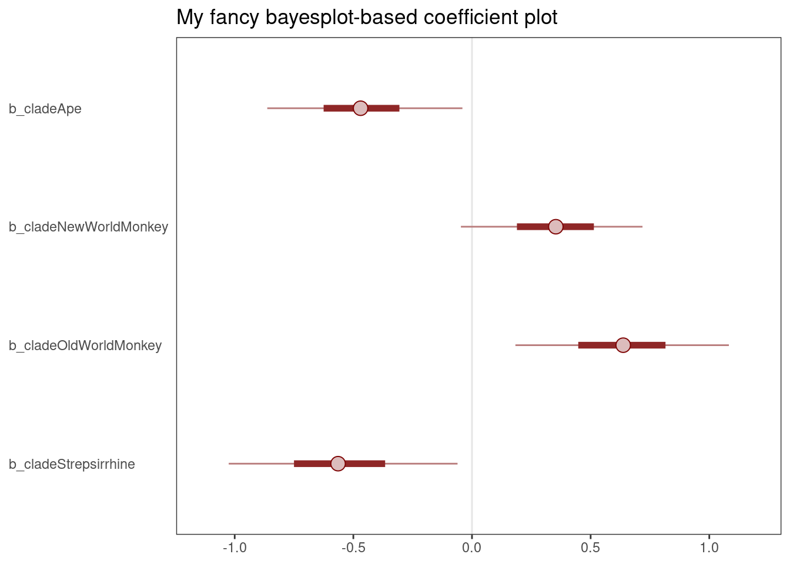


```r
# Randomly assign these primates to some made up categories
houses <- c("Gryffindor", "Hufflepuff", "Ravenclaw", "Slytherin")

set.seed(63)
d <-
  d %>% 
  mutate(house = sample(rep(houses, each = 8), size = n()))
```


```r
# Now include these categories as another predictor in the model
b5.10 <- 
  brm(data = d, 
      family = gaussian,
      kcal.per.g_s ~ 0 + clade + house,
      prior = c(prior(normal(0, 0.5), class = b),
                prior(exponential(1), class = sigma)),
      iter = 2000, warmup = 1000, chains = 4, cores = 4,
      seed = 5,
      file = "fits/b05.10")
```


```r
print(b5.10)
```

```
##  Family: gaussian 
##   Links: mu = identity; sigma = identity 
## Formula: kcal.per.g_s ~ 0 + clade + house 
##    Data: d (Number of observations: 29) 
## Samples: 4 chains, each with iter = 2000; warmup = 1000; thin = 1;
##          total post-warmup samples = 4000
## 
## Population-Level Effects: 
##                     Estimate Est.Error l-95% CI u-95% CI Rhat Bulk_ESS Tail_ESS
## cladeApe               -0.44      0.26    -0.96     0.09 1.00     3977     3335
## cladeNewWorldMonkey     0.33      0.26    -0.16     0.84 1.00     4054     3259
## cladeOldWorldMonkey     0.50      0.29    -0.09     1.06 1.00     4328     2808
## cladeStrepsirrhine     -0.51      0.30    -1.08     0.09 1.00     4519     2982
## houseHufflepuff        -0.16      0.29    -0.71     0.39 1.00     4670     3556
## houseRavenclaw         -0.12      0.27    -0.65     0.41 1.00     3989     3025
## houseSlytherin          0.49      0.30    -0.09     1.08 1.00     3764     2918
## 
## Family Specific Parameters: 
##       Estimate Est.Error l-95% CI u-95% CI Rhat Bulk_ESS Tail_ESS
## sigma     0.77      0.11     0.59     1.02 1.00     3984     2942
## 
## Samples were drawn using sampling(NUTS). For each parameter, Bulk_ESS
## and Tail_ESS are effective sample size measures, and Rhat is the potential
## scale reduction factor on split chains (at convergence, Rhat = 1).
```

Notice we lost the first category of the second variable. This is because with **brms** formula syntax `<criterion> ~ 0 + <index variable>`, it only works with one index variable. 

Here's the fix:

```r
b5.11 <- 
  brm(data = d, 
      family = gaussian,
      bf(kcal.per.g_s ~ 0 + a + h, 
         a ~ 0 + clade, 
         h ~ 0 + house,
         nl = TRUE),
      prior = c(prior(normal(0, 0.5), nlpar = a),
                prior(normal(0, 0.5), nlpar = h),
                prior(exponential(1), class = sigma)),
      iter = 2000, warmup = 1000, chains = 4, cores = 4,
      seed = 5,
      file = "fits/b05.11")
```


```r
print(b5.11)
```

```
##  Family: gaussian 
##   Links: mu = identity; sigma = identity 
## Formula: kcal.per.g_s ~ 0 + a + h 
##          a ~ 0 + clade
##          h ~ 0 + house
##    Data: d (Number of observations: 29) 
## Samples: 4 chains, each with iter = 2000; warmup = 1000; thin = 1;
##          total post-warmup samples = 4000
## 
## Population-Level Effects: 
##                       Estimate Est.Error l-95% CI u-95% CI Rhat Bulk_ESS
## a_cladeApe               -0.39      0.28    -0.93     0.17 1.00     2770
## a_cladeNewWorldMonkey     0.36      0.29    -0.22     0.91 1.00     3073
## a_cladeOldWorldMonkey     0.53      0.32    -0.10     1.15 1.00     3827
## a_cladeStrepsirrhine     -0.46      0.32    -1.07     0.17 1.00     3413
## h_houseGryffindor        -0.10      0.28    -0.65     0.45 1.00     2677
## h_houseHufflepuff        -0.19      0.30    -0.77     0.40 1.00     3111
## h_houseRavenclaw         -0.15      0.29    -0.74     0.41 1.00     3114
## h_houseSlytherin          0.45      0.32    -0.16     1.07 1.00     3898
##                       Tail_ESS
## a_cladeApe                2860
## a_cladeNewWorldMonkey     3273
## a_cladeOldWorldMonkey     2986
## a_cladeStrepsirrhine      3272
## h_houseGryffindor         3061
## h_houseHufflepuff         3259
## h_houseRavenclaw          3163
## h_houseSlytherin          3290
## 
## Family Specific Parameters: 
##       Estimate Est.Error l-95% CI u-95% CI Rhat Bulk_ESS Tail_ESS
## sigma     0.78      0.12     0.59     1.06 1.00     3643     2636
## 
## Samples were drawn using sampling(NUTS). For each parameter, Bulk_ESS
## and Tail_ESS are effective sample size measures, and Rhat is the potential
## scale reduction factor on split chains (at convergence, Rhat = 1).
```


```r
brms::posterior_samples(b5.11) %>% 
  pivot_longer(starts_with("b_")) %>% 
  mutate(name = str_remove(name, "b_") %>% 
                str_remove(., "clade") %>% 
                str_remove(., "house") %>% 
                str_replace(., "World", " World ")) %>% 
  separate(name, into = c("predictor", "level"), sep = "_") %>% 
  mutate(predictor = if_else(predictor == "a", "predictor: clade", "predictor: house")) %>% 
  
  ggplot(aes(x = value, y = reorder(level, value))) +  # note how we used `reorder()` to arrange the coefficients
  geom_vline(xintercept = 0, color = "firebrick4", alpha = 1/10) +
  stat_pointinterval(point_interval = mode_hdi, .width = .89, 
                     size = 1, color = "firebrick4") +
  labs(x = "expected kcal (std)", 
       y = NULL) +
  theme_bw() +
  theme(axis.text.y = element_text(hjust = 0),
        axis.ticks.y = element_blank(),
        panel.grid = element_blank(),
        strip.background = element_blank()) +
  facet_wrap(~ predictor, scales = "free_y")
```

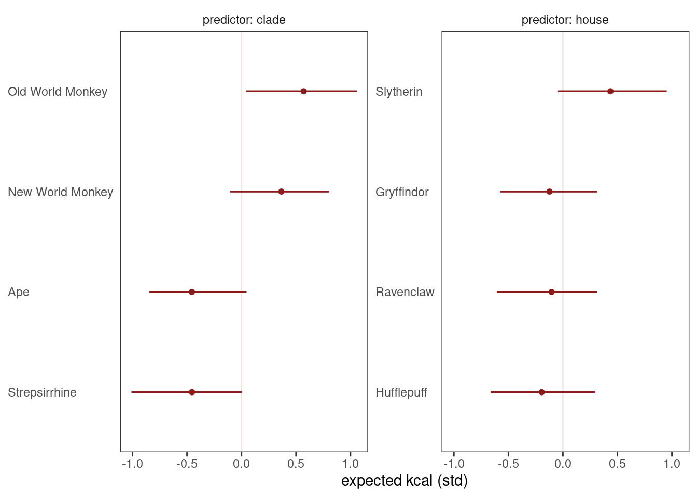


## Practice
