# The Haunted DAG & The Causal Terror


```r
library(here)
source(here::here("code/scripts/source.R"))
```


```r
slides_dir = here::here("docs/slides/L06")
```


<div class="figure">

<p class="caption">Interesting feature of scientific literature is that there's a negative correlation between surprising things and true things. The most trustworthy science is incredibly boring. Paper from PNAS. Hurricanes get names. They had this convention of alternating names. You can regress them, and if you do a terrible regression, female hurricanes are deadlier, but it's not robust. And there's no robust mechanism.</p>
</div>

<div class="figure">

<p class="caption">This is Mono Lake, with high levels of arsenic. Why's that bad? Arsenate mimics phosphate, and things break. How do the organisms in this lake adapt to it? Dr Wolfe-Simon published a study showing evidence that bacteria in the lake were using arsenic in their DNA. Since then it turns out it probably wasn't true, even though it was a rigorous study.</p>
</div>

<div class="figure">

<p class="caption">We don't need any elaborate theory that we all have. All you need to get a negative correlation between newsworthy things and trustworthy things are peer-review. Here's a simulated example. Imagine that either journals or grant-review panels, you care about both. But you also care about rigour. A study can get published or funding *if* it's sufficiently trustworthy *or* it's sufficiently newsworthy. So even it there's no correlation in the production of science, post-selection there'll be a negative correlation. Here you can see there's no correlation. There's a threshold of the sum of newsworthiness and trustowrthiness. The blue are the ones that get funded, and the correlations are -0.8. You can't know from the correlation what's happening generatively. This is a spurious correlation. Conditioning on a variable in a regression is a selection process. Don't just add things to regressions. It's called a Simpson's paradox.</p>
</div>


```r
library(tidyverse)

set.seed(1914)
n <- 200  # number of grant proposals
p <- 0.1  # proportion to select

d <-
  # uncorrelated newsworthiness and trustworthiness
  tibble(newsworthiness  = rnorm(n, mean = 0, sd = 1),
         trustworthiness = rnorm(n, mean = 0, sd = 1)) %>% 
  # total_score
  mutate(total_score = newsworthiness + trustworthiness) %>% 
  # select top 10% of combined scores
  mutate(selected = ifelse(total_score >= quantile(total_score, 1 - p), TRUE, FALSE))

head(d)
```

```
## # A tibble: 6 × 4
##   newsworthiness trustworthiness total_score selected
##            <dbl>           <dbl>       <dbl> <lgl>   
## 1         -0.379         -1.20        -1.58  FALSE   
## 2          0.130          0.504        0.634 FALSE   
## 3          0.334          0.532        0.866 FALSE   
## 4         -1.89          -0.594       -2.48  FALSE   
## 5          2.05           0.0672       2.12  TRUE    
## 6          2.54           1.02         3.56  TRUE
```

```r
# Correlation
d %>% 
  filter(selected == TRUE) %>% 
  dplyr::select(newsworthiness, trustworthiness) %>% 
  cor()
```

```
##                 newsworthiness trustworthiness
## newsworthiness       1.0000000      -0.7680083
## trustworthiness     -0.7680083       1.0000000
```

```r
ggplot2::theme_set(theme_minimal())

# we'll need this for the annotation
text <-
  tibble(newsworthiness  = c(2, 1), 
         trustworthiness = c(2.25, -2.5),
         selected        = c(TRUE, FALSE),
         label           = c("selected", "rejected"))

d %>% 
  ggplot(aes(x = newsworthiness, y = trustworthiness, color = selected)) +
  geom_point(aes(shape = selected), alpha = 3/4) +
  geom_text(data = text,
            aes(label = label)) +
  geom_smooth(data = . %>% filter(selected == TRUE),
              method = "lm", fullrange = T,
              color = "lightblue", se = F, size = 1/2) +
  scale_color_manual(values = c("black", "lightblue")) +
  scale_shape_manual(values = c(1, 19)) +
  scale_x_continuous(limits = c(-3, 3.9), expand = c(0, 0)) +
  coord_cartesian(ylim = range(d$trustworthiness)) +
  theme(legend.position = "none")
```

```
## `geom_smooth()` using formula 'y ~ x'
```

<div class="figure">
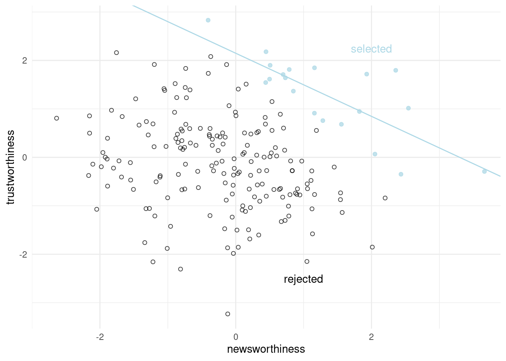
<p class="caption">Figure 6.1</p>
</div>


<div class="figure">

<p class="caption">Regression is an incredible tool. But it's an oracle. It automatically finds the most informative cases. It's amazing that the universe is designed such that this works out. But it's a historical oracle. Like the Oracle of Delphi. Poweful, but not benign. Or like a genie. Will take your wish (question) very literally.</p>
</div>

<div class="figure">

<p class="caption">"Table 2": uninterpretable causal salad. Adding variable can create confounds.</p>
</div>


<div class="figure">

<p class="caption">Going to use a lot of simulated examples. Actually there's this benign fact that there are only four confounds. Ignoring those things, these are the only kinds we get. Going to explain each of them to see what they do. Going to learn how to de-confound each of them. If you know the causal graph, you can deconfound or conclude that it's hopeless and can't confound. So we'll come back to this.</p>
</div>

<div class="figure">

<p class="caption">The most famous confound. Variable that is a common cause of two others. Median age of marriage creates a fork. Creates a spurious correlation between M and D. Interested in the causal effect of X on Y. In the fork, you deconfound by conditioning on Z and shut the fork. There's this notation at the bottom of the slide. X is independent on Y conditional on Z.</p>
</div>

<div class="figure">

<p class="caption">The pipe is a lot like the fork. Here there's a mediation. In reality X is mediated by Z. If we condition on Z, we don't notice the true effect. If you condition on Z, then you remove the dependency between X and Y. From the data alone, you can't see the difference between a pipe and a fork. </p>
</div>

## Multicollinearity

Means a very strong association between two or more predictors. 

Consequence: the posterior distribution will seem to suggest that none of the variables is reliably associated with the outcome, even if all of the variables are in reality strongly associated with the outcome.

That said, the model will work fine for prediction; you will just be frustrated trying to understand it.

***6.1.1 Multicollinear legs***

Imagine trying to predict an individual's height using the length of their legs as a predictor. But once you put both legs (right and left) into the model, something vexing will happen. 


```r
n <- 100
set.seed(909)

d <- 
  tibble(height   = rnorm(n, mean = 10, sd = 2),
         leg_prop = runif(n, min = 0.4, max = 0.5)) %>% 
  mutate(leg_left  = leg_prop * height + rnorm(n, mean = 0, sd = 0.02),
         leg_right = leg_prop * height + rnorm(n, mean = 0, sd = 0.02))
```

We expect the beta coefficient that measures the association of a leg with height to end up around the average height (10) divided by 45% of the average height (4.5). 


```r
d %>%
  dplyr::select(leg_left:leg_right) %>%
  cor() %>%
  round(digits = 4)
```

```
##           leg_left leg_right
## leg_left    1.0000    0.9997
## leg_right   0.9997    1.0000
```


```r
d %>%
  ggplot(aes(x = leg_left, y = leg_right)) +
  geom_point(alpha = 1/2, color = "forestgreen")
```

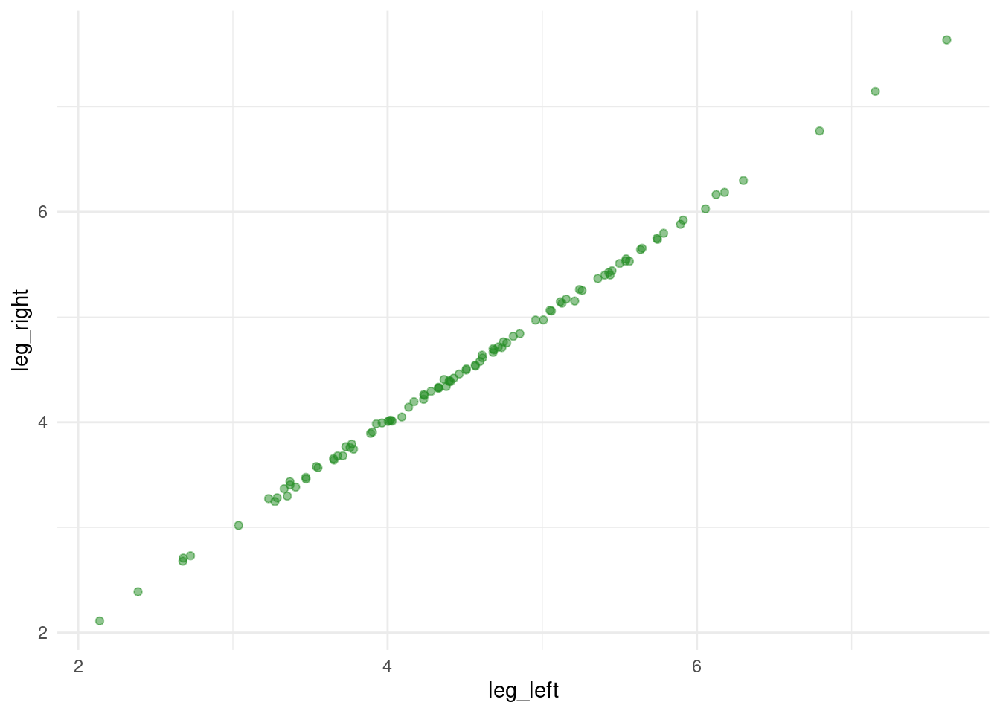


```r
b6.1 <- 
  brm(data = d, 
      family = gaussian,
      height ~ 1 + leg_left + leg_right,
      prior = c(prior(normal(10, 100), class = Intercept),
                prior(normal(2, 10), class = b),
                prior(exponential(1), class = sigma)),
      iter = 2000, warmup = 1000, chains = 4, cores = 4,
      seed = 6,
      file = "fits/b06.01")
```


```r
print(b6.1)
```

```
##  Family: gaussian 
##   Links: mu = identity; sigma = identity 
## Formula: height ~ 1 + leg_left + leg_right 
##    Data: d (Number of observations: 100) 
## Samples: 4 chains, each with iter = 2000; warmup = 1000; thin = 1;
##          total post-warmup samples = 4000
## 
## Population-Level Effects: 
##           Estimate Est.Error l-95% CI u-95% CI Rhat Bulk_ESS Tail_ESS
## Intercept     0.97      0.30     0.37     1.55 1.00     3783     2879
## leg_left      0.20      2.59    -4.98     5.14 1.01     1692     1804
## leg_right     1.79      2.60    -3.17     6.95 1.01     1694     1786
## 
## Family Specific Parameters: 
##       Estimate Est.Error l-95% CI u-95% CI Rhat Bulk_ESS Tail_ESS
## sigma     0.63      0.05     0.55     0.73 1.00     2347     1805
## 
## Samples were drawn using sampling(NUTS). For each parameter, Bulk_ESS
## and Tail_ESS are effective sample size measures, and Rhat is the potential
## scale reduction factor on split chains (at convergence, Rhat = 1).
```


```r
bayesplot::color_scheme_set("orange")

brms::mcmc_plot(b6.1, 
                     type = "intervals", 
                     prob = .5, 
                     prob_outer = .95,
                     point_est = "mean") +
  labs(title = "The coefficient plot for the two-leg model",
       subtitle = "Holy smokes; look at the widths of those betas!") +
  theme(axis.text.y = element_text(hjust = 0),
        panel.grid.minor = element_blank(),
        strip.text = element_text(hjust = 0)) 
```

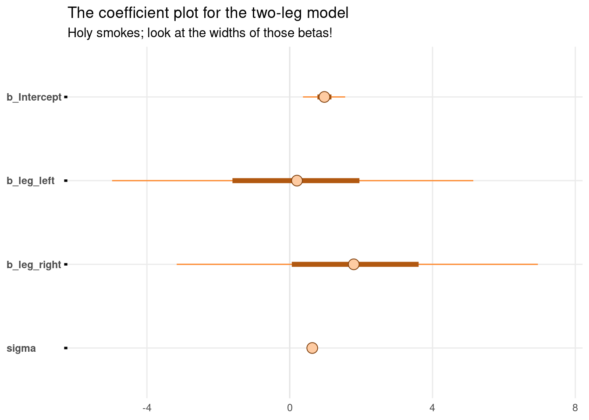


```r
pairs(b6.1, pars = parnames(b6.1)[2:3])
```

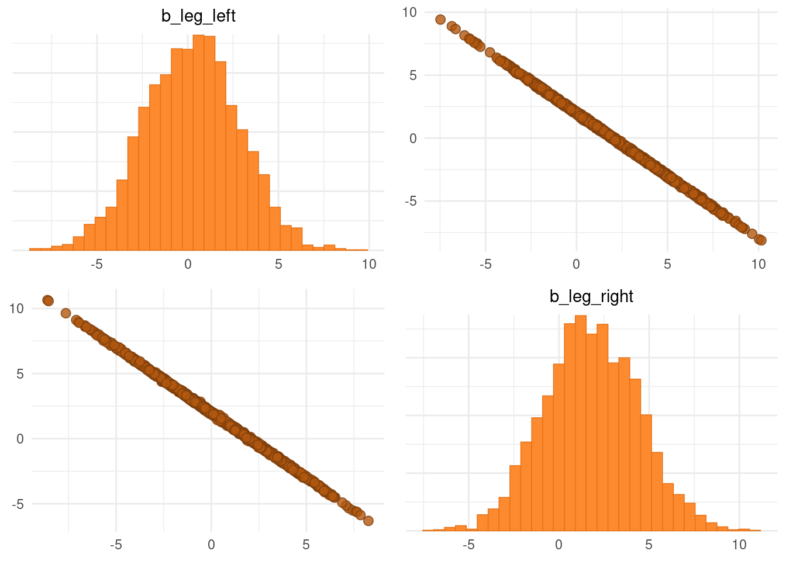

The posterior distribution for these two parameters is very hgihly correlated, with all of the plausible values of `bl` and `br` lying around a narrow ridge. When `bl` is large, then `br` must be small. Since both leg variables contain almost exactly the same information, if you insist on including both in a model, then there will be a practically infinite number of combinations of `bl` and `br` that produce the same predictions.

Compute the posterior distribution and plot it.


```r
post <- brms::posterior_samples(b6.1)
  
post %>% 
  ggplot(aes(x = b_leg_left, y = b_leg_right)) +
  geom_point(color = "forestgreen", alpha = 1/10, size = 1/2)
```

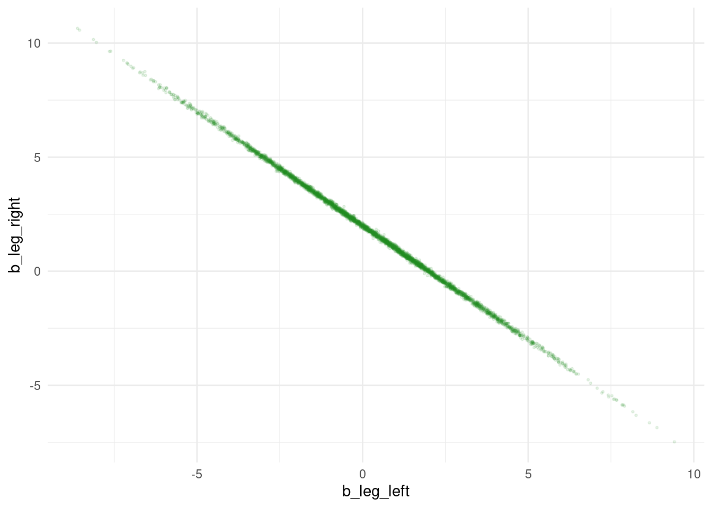

```r
post %>% 
  ggplot(aes(x = b_leg_left + b_leg_right, y = 0)) +
  stat_halfeye(point_interval = median_qi, 
               fill = "steelblue", .width = .95) +
  scale_y_continuous(NULL, breaks = NULL) +
  labs(title = "Sum the multicollinear coefficients",
       subtitle = "Marked by the median and 95% PIs")
```

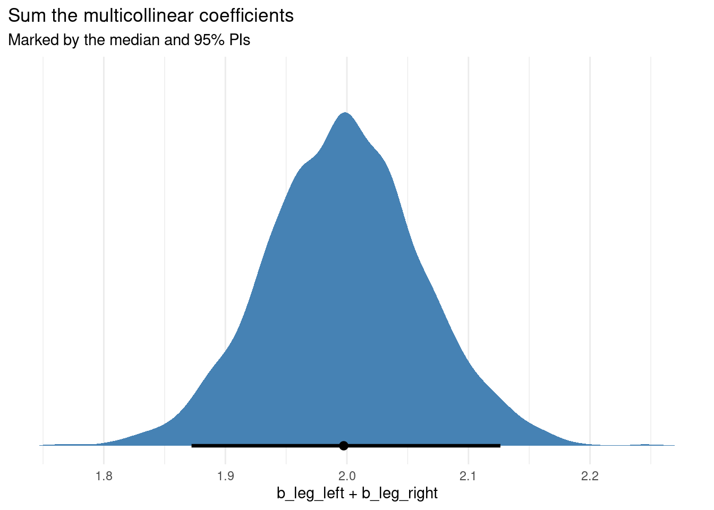


```r
b6.2 <- 
  brm(data = d, 
      family = gaussian,
      height ~ 1 + leg_left,
      prior = c(prior(normal(10, 100), class = Intercept),
                prior(normal(2, 10), class = b),
                prior(exponential(1), class = sigma)),
      iter = 2000, warmup = 1000, chains = 4, cores = 4,
      seed = 6,
      file = "fits/b06.02")
```


```r
print(b6.2)
```

```
##  Family: gaussian 
##   Links: mu = identity; sigma = identity 
## Formula: height ~ 1 + leg_left 
##    Data: d (Number of observations: 100) 
## Samples: 4 chains, each with iter = 2000; warmup = 1000; thin = 1;
##          total post-warmup samples = 4000
## 
## Population-Level Effects: 
##           Estimate Est.Error l-95% CI u-95% CI Rhat Bulk_ESS Tail_ESS
## Intercept     1.01      0.29     0.43     1.58 1.00     3998     2753
## leg_left      1.99      0.06     1.87     2.11 1.00     4009     3011
## 
## Family Specific Parameters: 
##       Estimate Est.Error l-95% CI u-95% CI Rhat Bulk_ESS Tail_ESS
## sigma     0.63      0.04     0.55     0.73 1.00     3402     2899
## 
## Samples were drawn using sampling(NUTS). For each parameter, Bulk_ESS
## and Tail_ESS are effective sample size measures, and Rhat is the potential
## scale reduction factor on split chains (at convergence, Rhat = 1).
```


```r
brms::posterior_samples(b6.2) %>% 
  
  ggplot(aes(x = b_leg_left, y = 0)) +
  stat_halfeye(point_interval = median_qi, 
               fill = "steelblue", .width = .95) +
  scale_y_continuous(NULL, breaks = NULL) +
  labs(title = "Just one coefficient needed",
       subtitle = "Marked by the median and 95% PIs",
       x = "only b_leg_left, this time")
```

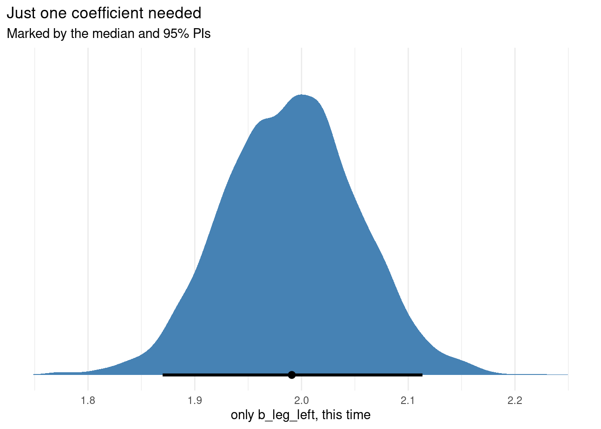


The basic lesson is this:
>When two predictor varilables are very strongly correlated (conditional on other variables in the model), including both in a model may lead to confusion.

***6.1.2. Multicollinear milk***


```r
data(milk, package = "rethinking")
d <- milk
rm(milk)

d <-
  d %>% 
  mutate(k = rethinking::standardize(kcal.per.g),
         f = rethinking::standardize(perc.fat),
         l = rethinking::standardize(perc.lactose))
```


```r
# k regressed on f
b6.3 <- 
  brm(data = d, 
      family = gaussian,
      k ~ 1 + f,
      prior = c(prior(normal(0, 0.2), class = Intercept),
                prior(normal(0, 0.5), class = b),
                prior(exponential(1), class = sigma)),
      iter = 2000, warmup = 1000, chains = 4, cores = 4,
      seed = 6,
      file = "fits/b06.03")

# k regressed on l
b6.4 <- 
  brm(data = d, 
      family = gaussian,
      k ~ 1 + l,
      prior = c(prior(normal(0, 0.2), class = Intercept),
                prior(normal(0, 0.5), class = b),
                prior(exponential(1), class = sigma)),
      iter = 2000, warmup = 1000, chains = 4, cores = 4,
      seed = 6,
      file = "fits/b06.04")
```


```r
brms::posterior_samples(b6.3) %>% round(digits = 2)
```

```
##      b_Intercept  b_f sigma   lp__
## 1          -0.02 0.88  0.46 -20.61
## 2          -0.05 0.91  0.60 -22.64
## 3          -0.02 0.84  0.56 -21.57
## 4          -0.03 0.84  0.55 -21.42
## 5           0.05 0.86  0.58 -22.02
## 6          -0.06 0.92  0.42 -21.37
## 7           0.16 0.95  0.55 -23.40
## 8           0.10 0.90  0.57 -22.46
## 9          -0.06 0.84  0.44 -21.02
## 10         -0.10 0.78  0.48 -21.76
## 11          0.16 0.89  0.44 -22.91
## 12          0.14 0.94  0.47 -22.50
## 13         -0.06 0.74  0.52 -21.91
## 14         -0.07 0.64  0.49 -24.03
## 15         -0.16 0.83  0.51 -22.64
## 16          0.15 0.88  0.44 -22.70
## 17         -0.17 0.83  0.52 -22.82
## 18         -0.05 0.82  0.60 -22.47
## 19         -0.01 0.83  0.39 -21.62
## 20          0.02 0.93  0.52 -21.29
## 21          0.14 0.68  0.52 -23.90
## 22          0.10 0.68  0.56 -23.58
## 23         -0.06 0.68  0.56 -23.08
## 24          0.05 0.81  0.50 -21.05
## 25         -0.02 0.81  0.48 -20.79
## 26         -0.02 0.96  0.37 -22.78
## 27          0.04 0.85  0.50 -20.86
## 28         -0.09 0.87  0.50 -21.35
## 29          0.12 0.88  0.42 -22.20
## 30          0.01 0.82  0.42 -20.92
## 31          0.07 0.78  0.53 -21.60
## 32          0.01 0.88  0.39 -21.55
## 33          0.02 0.85  0.55 -21.39
## 34          0.05 0.83  0.42 -21.04
## 35          0.04 0.70  0.54 -22.48
## 36          0.07 0.65  0.53 -23.51
## 37          0.06 0.82  0.50 -21.08
## 38         -0.05 1.07  0.44 -23.86
## 39          0.08 0.82  0.44 -21.34
## 40          0.16 0.81  0.48 -22.62
## 41          0.02 0.94  0.40 -21.64
## 42          0.02 0.86  0.43 -20.72
## 43          0.00 0.91  0.49 -20.82
## 44          0.01 0.87  0.46 -20.57
## 45          0.03 0.87  0.43 -20.77
## 46          0.00 0.88  0.51 -20.89
## 47          0.16 0.91  0.46 -22.95
## 48         -0.06 0.89  0.43 -21.06
## 49          0.05 0.75  0.54 -21.79
## 50          0.10 1.00  0.46 -22.56
## 51         -0.14 0.97  0.51 -22.89
## 52         -0.14 0.96  0.55 -23.08
## 53          0.05 0.76  0.43 -21.72
## 54          0.01 0.89  0.39 -21.42
## 55         -0.01 0.82  0.56 -21.54
## 56          0.02 0.87  0.42 -20.84
## 57         -0.17 0.86  0.43 -23.18
## 58          0.07 0.84  0.54 -21.58
## 59         -0.01 0.83  0.52 -21.04
## 60         -0.12 0.89  0.53 -22.06
## 61         -0.15 0.86  0.47 -22.27
## 62          0.06 0.71  0.48 -22.27
## 63         -0.03 0.77  0.50 -21.26
## 64          0.00 0.91  0.46 -20.74
## 65         -0.10 0.88  0.43 -21.57
## 66         -0.10 0.88  0.43 -21.57
## 67          0.09 0.89  0.57 -22.24
## 68         -0.02 0.81  0.43 -20.88
## 69          0.00 0.76  0.44 -21.39
## 70         -0.08 0.85  0.52 -21.39
## 71         -0.01 0.88  0.49 -20.67
## 72         -0.01 0.88  0.49 -20.67
## 73          0.10 0.90  0.38 -22.87
## 74         -0.11 0.82  0.42 -22.24
## 75          0.04 0.88  0.43 -20.78
## 76         -0.04 0.83  0.50 -20.90
## 77          0.06 0.85  0.43 -21.04
## 78         -0.01 0.95  0.50 -21.23
## 79         -0.06 1.04  0.45 -23.16
## 80         -0.01 0.95  0.50 -21.28
## 81          0.08 0.72  0.48 -22.37
## 82          0.03 0.79  0.52 -21.28
## 83          0.06 0.78  0.47 -21.24
## 84          0.00 0.74  0.44 -21.75
## 85          0.16 0.94  0.42 -23.58
## 86          0.17 0.87  0.39 -24.72
## 87          0.06 0.88  0.47 -20.92
## 88          0.07 0.91  0.38 -22.46
## 89          0.00 0.90  0.37 -22.29
## 90         -0.05 0.77  0.64 -23.36
## 91         -0.05 0.81  0.53 -21.31
## 92         -0.06 0.85  0.41 -21.26
## 93         -0.06 0.85  0.41 -21.26
## 94         -0.02 0.77  0.48 -21.19
## 95          0.04 0.91  0.35 -23.19
## 96          0.00 0.84  0.61 -22.54
## 97         -0.02 0.65  0.47 -23.49
## 98          0.06 0.76  0.50 -21.51
## 99          0.09 0.87  0.47 -21.24
## 100        -0.13 0.91  0.54 -22.42
## 101         0.12 0.84  0.43 -22.11
## 102        -0.07 0.83  0.45 -21.12
## 103         0.08 0.88  0.48 -21.09
## 104        -0.06 0.87  0.50 -20.95
## 105         0.04 0.82  0.44 -20.96
## 106        -0.02 0.93  0.46 -20.87
## 107         0.09 0.75  0.49 -21.96
## 108         0.11 0.75  0.46 -22.27
## 109         0.11 0.75  0.46 -22.27
## 110        -0.10 0.97  0.49 -22.19
## 111        -0.04 0.74  0.51 -21.73
## 112         0.14 0.88  0.41 -22.79
## 113        -0.15 0.83  0.60 -23.37
## 114        -0.11 0.81  0.52 -21.87
## 115        -0.18 0.96  0.56 -24.10
## 116        -0.02 0.87  0.69 -24.23
## 117         0.07 0.93  0.52 -21.52
## 118        -0.02 0.83  0.43 -20.83
## 119         0.06 0.94  0.50 -21.40
## 120        -0.09 0.82  0.41 -21.72
## 121        -0.08 0.87  0.42 -21.35
## 122         0.10 0.87  0.52 -21.61
## 123         0.08 0.87  0.50 -21.20
## 124         0.01 0.77  0.40 -22.05
## 125        -0.11 0.87  0.44 -21.63
## 126        -0.08 0.94  0.41 -22.11
## 127         0.02 0.75  0.54 -21.78
## 128         0.01 0.84  0.57 -21.74
## 129         0.03 0.86  0.49 -20.74
## 130        -0.03 0.94  0.47 -21.03
## 131         0.16 0.72  0.43 -24.50
## 132        -0.13 1.07  0.65 -25.87
## 133         0.02 0.73  0.40 -22.73
## 134        -0.09 0.83  0.46 -21.29
## 135         0.11 0.85  0.47 -21.49
## 136        -0.04 0.68  0.42 -23.49
## 137         0.25 0.82  0.52 -25.02
## 138        -0.09 0.94  0.54 -22.14
## 139         0.10 0.85  0.45 -21.35
## 140        -0.04 0.90  0.49 -20.88
## 141        -0.09 0.86  0.39 -22.17
## 142        -0.06 0.88  0.50 -21.09
## 143        -0.20 0.81  0.60 -24.53
## 144        -0.12 0.96  0.53 -22.55
## 145         0.07 0.90  0.45 -21.09
## 146        -0.01 0.81  0.46 -20.73
## 147        -0.01 0.81  0.46 -20.73
## 148         0.04 0.77  0.55 -21.78
## 149         0.08 0.89  0.38 -22.30
## 150         0.08 0.95  0.47 -21.60
## 151         0.01 0.89  0.41 -20.97
## 152        -0.03 0.79  0.56 -21.80
## 153        -0.06 0.80  0.49 -21.11
## 154         0.05 0.68  0.53 -22.83
## 155        -0.07 0.91  0.48 -21.18
## 156        -0.16 0.88  0.50 -22.49
## 157         0.11 0.65  0.68 -25.55
## 158         0.02 0.77  0.52 -21.37
## 159        -0.02 0.81  0.48 -20.81
## 160         0.10 0.77  0.43 -22.24
## 161         0.09 0.86  0.56 -21.99
## 162         0.07 0.88  0.56 -21.81
## 163        -0.04 0.87  0.42 -20.94
## 164         0.02 0.87  0.46 -20.57
## 165         0.01 0.85  0.46 -20.57
## 166         0.03 0.74  0.55 -21.97
## 167         0.20 0.75  0.53 -24.33
## 168         0.02 0.84  0.54 -21.20
## 169        -0.05 0.88  0.42 -21.08
## 170         0.15 0.90  0.41 -23.30
## 171         0.09 0.81  0.51 -21.47
## 172         0.02 0.89  0.49 -20.73
## 173        -0.04 0.82  0.44 -20.83
## 174         0.00 0.82  0.52 -20.97
## 175        -0.03 0.90  0.40 -21.38
## 176        -0.03 0.72  0.42 -22.49
## 177         0.02 0.91  0.40 -21.36
## 178         0.00 0.84  0.43 -20.74
## 179        -0.01 0.84  0.43 -20.67
## 180        -0.04 0.88  0.38 -21.74
## 181         0.04 0.77  0.60 -22.61
## 182         0.09 0.53  0.59 -26.61
## 183        -0.08 0.95  0.71 -25.53
## 184        -0.09 0.55  0.46 -27.46
## 185        -0.07 0.51  0.42 -31.85
## 186        -0.06 0.58  0.57 -25.23
## 187         0.05 1.13  0.49 -25.25
## 188         0.03 1.09  0.50 -23.83
## 189        -0.03 0.66  0.46 -23.35
## 190         0.04 0.91  0.56 -21.81
## 191         0.03 1.11  0.64 -25.74
## 192         0.01 0.91  0.56 -21.64
## 193         0.05 0.90  0.44 -20.92
## 194         0.01 0.88  0.39 -21.30
## 195         0.01 0.86  0.46 -20.56
## 196         0.12 0.88  0.44 -21.80
## 197         0.14 0.68  0.47 -24.23
## 198         0.00 0.73  0.41 -22.58
## 199        -0.03 1.02  0.51 -22.42
## 200         0.01 0.70  0.45 -22.50
## 201        -0.11 0.95  0.49 -22.04
## 202         0.06 0.94  0.58 -22.54
## 203         0.00 0.93  0.42 -21.09
## 204        -0.10 0.77  0.39 -23.37
## 205         0.10 0.98  0.62 -23.93
## 206         0.07 0.77  0.41 -22.24
## 207         0.03 0.80  0.49 -20.93
## 208         0.04 0.91  0.45 -20.93
## 209        -0.02 0.79  0.46 -20.88
## 210        -0.12 0.89  0.51 -21.93
## 211         0.11 0.82  0.43 -21.85
## 212         0.03 0.78  0.53 -21.41
## 213        -0.04 0.81  0.54 -21.36
## 214        -0.15 0.89  0.40 -23.56
## 215         0.09 1.05  0.52 -23.54
## 216         0.13 0.94  0.52 -22.39
## 217         0.03 0.76  0.44 -21.51
## 218        -0.02 0.95  0.52 -21.45
## 219         0.01 0.85  0.55 -21.42
## 220         0.07 0.86  0.50 -21.01
## 221        -0.02 0.83  0.48 -20.70
## 222         0.01 0.91  0.40 -21.33
## 223        -0.13 0.88  0.47 -21.91
## 224         0.03 0.86  0.41 -21.01
## 225         0.03 0.86  0.41 -21.01
## 226         0.07 0.86  0.44 -20.97
## 227        -0.16 0.82  0.41 -23.42
## 228        -0.10 0.84  0.43 -21.75
## 229        -0.26 0.92  0.62 -26.17
## 230        -0.22 0.91  0.59 -24.90
## 231        -0.04 1.02  0.52 -22.46
## 232         0.03 0.95  0.47 -21.14
## 233         0.03 0.91  0.51 -21.08
## 234        -0.01 0.79  0.43 -21.16
## 235         0.08 0.79  0.53 -21.76
## 236        -0.06 0.92  0.42 -21.38
## 237         0.05 0.91  0.55 -21.66
## 238         0.01 0.81  0.42 -21.10
## 239         0.05 1.01  0.41 -22.80
## 240         0.09 1.00  0.45 -22.71
## 241         0.18 0.88  0.49 -23.01
## 242        -0.03 0.82  0.37 -22.20
## 243         0.11 0.90  0.47 -21.55
## 244         0.04 0.83  0.38 -22.16
## 245        -0.03 1.05  0.55 -23.27
## 246        -0.04 0.76  0.45 -21.39
## 247         0.03 0.77  0.41 -21.85
## 248         0.06 1.03  0.57 -23.48
## 249         0.00 0.72  0.53 -21.96
## 250        -0.02 0.90  0.38 -21.77
## 251         0.10 0.91  0.50 -21.54
## 252         0.02 0.94  0.51 -21.21
## 253         0.02 0.81  0.64 -23.05
## 254         0.10 0.93  0.54 -22.07
## 255         0.09 0.93  0.57 -22.40
## 256        -0.07 0.80  0.50 -21.26
## 257        -0.02 0.88  0.40 -21.10
## 258         0.06 1.09  0.41 -25.77
## 259         0.04 0.79  0.50 -21.11
## 260         0.04 0.71  0.49 -22.09
## 261        -0.02 0.83  0.50 -20.86
## 262        -0.09 1.07  0.43 -24.87
## 263        -0.08 0.74  0.65 -23.94
## 264         0.04 0.70  0.63 -23.71
## 265        -0.08 0.91  0.39 -22.27
## 266        -0.08 0.91  0.56 -22.09
## 267        -0.05 0.86  0.51 -21.01
## 268         0.09 0.82  0.43 -21.57
## 269         0.06 0.85  0.42 -21.14
## 270         0.09 0.84  0.46 -21.27
## 271         0.10 0.95  0.56 -22.50
## 272         0.22 0.86  0.54 -24.25
## 273        -0.01 0.96  0.62 -23.22
## 274         0.02 0.79  0.39 -22.11
## 275        -0.09 0.92  0.45 -21.41
## 276         0.09 0.84  0.58 -22.32
## 277         0.18 0.78  0.54 -23.53
## 278        -0.11 0.91  0.41 -22.24
## 279         0.08 0.80  0.43 -21.73
## 280         0.11 0.78  0.41 -22.75
## 281         0.06 0.97  0.47 -21.56
## 282        -0.06 0.84  0.62 -22.88
## 283        -0.03 0.71  0.43 -22.70
## 284         0.03 0.99  0.46 -21.76
## 285         0.01 0.99  0.50 -21.81
## 286        -0.05 0.91  0.52 -21.26
## 287        -0.13 0.97  0.40 -23.99
## 288         0.08 0.79  0.57 -22.20
## 289         0.03 0.74  0.51 -21.62
## 290        -0.04 0.89  0.55 -21.56
## 291         0.19 0.89  0.46 -23.55
## 292         0.03 0.81  0.59 -22.13
## 293         0.16 0.90  0.42 -23.17
## 294         0.04 0.96  0.48 -21.35
## 295        -0.01 0.88  0.57 -21.79
## 296         0.05 0.94  0.41 -21.72
## 297         0.02 0.94  0.42 -21.32
## 298        -0.04 0.76  0.56 -21.96
## 299        -0.05 0.77  0.54 -21.75
## 300         0.05 0.95  0.44 -21.31
## 301         0.07 0.70  0.57 -22.99
## 302         0.03 0.91  0.45 -20.78
## 303         0.04 0.85  0.45 -20.68
## 304         0.12 0.84  0.54 -22.12
## 305         0.05 0.70  0.50 -22.33
## 306        -0.09 0.99  0.52 -22.53
## 307         0.04 0.70  0.51 -22.35
## 308        -0.27 0.82  0.65 -26.69
## 309        -0.18 0.87  0.42 -23.62
## 310        -0.07 0.99  0.47 -21.94
## 311         0.01 0.72  0.45 -22.08
## 312        -0.01 1.01  0.54 -22.52
## 313        -0.01 0.71  0.44 -22.18
## 314         0.03 0.81  0.45 -20.82
## 315        -0.03 0.93  0.48 -21.02
## 316        -0.03 0.76  0.39 -22.52
## 317        -0.03 0.78  0.44 -21.23
## 318         0.06 0.85  0.61 -22.73
## 319         0.01 0.91  0.40 -21.35
## 320        -0.04 0.96  0.40 -21.99
## 321         0.02 0.84  0.55 -21.44
## 322        -0.16 0.88  0.44 -22.67
## 323        -0.10 0.96  0.45 -22.07
## 324         0.02 0.66  0.54 -23.11
## 325        -0.03 0.85  0.52 -21.03
## 326         0.02 0.73  0.54 -21.93
## 327         0.16 0.70  0.59 -24.22
## 328         0.01 0.95  0.32 -25.60
## 329         0.07 0.82  0.62 -22.97
## 330        -0.02 0.90  0.39 -21.48
## 331         0.11 0.90  0.42 -22.00
## 332        -0.07 0.76  0.56 -22.13
## 333        -0.15 0.84  0.47 -22.28
## 334        -0.04 0.94  0.48 -21.15
## 335         0.09 0.84  0.44 -21.25
## 336        -0.07 0.90  0.45 -21.04
## 337         0.00 0.76  0.42 -21.70
## 338         0.00 0.92  0.60 -22.42
## 339         0.04 0.91  0.54 -21.50
## 340        -0.07 0.82  0.44 -21.15
## 341         0.07 0.90  0.43 -21.18
## 342         0.03 0.84  0.45 -20.69
## 343         0.03 0.74  0.43 -21.89
## 344        -0.01 0.78  0.45 -21.10
## 345        -0.12 0.91  0.62 -23.50
## 346         0.09 0.95  0.41 -22.23
## 347        -0.05 0.81  0.40 -21.77
## 348         0.10 0.94  0.52 -22.05
## 349         0.01 0.97  0.43 -21.61
## 350        -0.04 0.82  0.42 -21.14
## 351         0.01 0.85  0.43 -20.72
## 352         0.05 0.88  0.43 -20.93
## 353        -0.11 1.03  0.45 -23.47
## 354        -0.03 1.10  0.42 -25.46
## 355         0.05 0.91  0.52 -21.27
## 356        -0.11 0.90  0.53 -21.91
## 357        -0.03 0.93  0.43 -21.13
## 358         0.05 0.79  0.47 -21.08
## 359        -0.03 0.82  0.55 -21.40
## 360         0.03 0.92  0.45 -20.85
## 361        -0.05 0.81  0.48 -20.90
## 362        -0.06 0.89  0.44 -20.94
## 363         0.06 0.87  0.53 -21.30
## 364        -0.10 0.80  0.43 -21.98
## 365         0.09 0.96  0.60 -23.27
## 366        -0.07 0.78  0.37 -23.33
## 367         0.00 0.93  0.59 -22.45
## 368         0.01 0.88  0.41 -20.97
## 369        -0.06 0.87  0.52 -21.19
## 370        -0.14 0.73  0.55 -23.22
## 371         0.19 1.02  0.47 -25.11
## 372         0.02 0.76  0.37 -23.20
## 373         0.06 0.79  0.38 -22.69
## 374         0.11 0.74  0.38 -24.58
## 375         0.01 0.89  0.44 -20.66
## 376         0.00 0.86  0.45 -20.55
## 377         0.03 0.84  0.46 -20.64
## 378        -0.03 0.89  0.43 -20.81
## 379         0.07 0.86  0.53 -21.37
## 380        -0.10 0.91  0.42 -21.84
## 381        -0.05 0.67  0.58 -23.43
## 382        -0.05 0.78  0.45 -21.25
## 383        -0.18 0.73  0.58 -24.11
## 384        -0.17 0.84  0.56 -23.24
## 385         0.08 1.02  0.56 -23.33
## 386        -0.07 1.05  0.49 -23.13
## 387         0.11 0.88  0.58 -22.60
## 388         0.17 1.01  0.53 -24.14
## 389        -0.18 0.80  0.46 -23.34
## 390        -0.12 0.80  0.48 -21.89
## 391         0.14 0.84  0.54 -22.46
## 392        -0.02 1.01  0.50 -22.16
## 393        -0.01 0.89  0.49 -20.72
## 394        -0.01 0.82  0.48 -20.71
## 395         0.04 0.82  0.38 -22.19
## 396        -0.01 0.85  0.38 -21.64
## 397        -0.07 0.76  0.45 -21.64
## 398         0.00 0.76  0.47 -21.15
## 399         0.00 0.76  0.47 -21.15
## 400         0.16 0.71  0.59 -24.18
## 401         0.04 1.12  0.79 -28.96
## 402         0.01 0.98  0.58 -22.61
## 403        -0.08 0.95  0.49 -21.72
## 404         0.01 0.85  0.44 -20.65
## 405        -0.04 0.72  0.50 -21.96
## 406        -0.15 0.69  0.47 -24.19
## 407         0.15 0.98  0.52 -23.25
## 408         0.01 0.77  0.50 -21.17
## 409        -0.10 0.87  0.44 -21.47
## 410        -0.15 0.93  0.50 -22.66
## 411         0.13 0.86  0.43 -22.16
## 412        -0.13 0.88  0.45 -22.00
## 413        -0.12 0.86  0.48 -21.68
## 414         0.04 0.70  0.55 -22.59
## 415         0.01 0.88  0.46 -20.60
## 416        -0.04 0.90  0.46 -20.76
## 417        -0.04 0.99  0.47 -21.79
## 418        -0.08 1.02  0.45 -22.74
## 419        -0.01 0.95  0.44 -21.20
## 420        -0.04 0.93  0.33 -24.80
## 421         0.13 0.79  0.54 -22.57
## 422         0.15 0.85  0.57 -22.97
## 423        -0.02 0.88  0.41 -21.00
## 424         0.05 0.82  0.47 -20.88
## 425         0.14 0.86  0.58 -23.08
## 426         0.01 0.91  0.45 -20.74
## 427        -0.10 0.87  0.36 -23.52
## 428         0.10 0.70  0.61 -23.83
## 429         0.14 0.85  0.55 -22.50
## 430        -0.11 0.86  0.42 -22.03
## 431        -0.10 0.97  0.40 -23.04
## 432         0.01 0.90  0.45 -20.69
## 433         0.15 0.89  0.49 -22.33
## 434         0.07 0.97  0.42 -22.25
## 435        -0.06 0.68  0.48 -22.78
## 436         0.07 0.79  0.53 -21.62
## 437         0.07 0.83  0.45 -21.01
## 438        -0.08 0.85  0.52 -21.39
## 439        -0.07 0.75  0.58 -22.50
## 440        -0.04 0.84  0.50 -20.91
## 441        -0.03 0.78  0.55 -21.68
## 442        -0.06 0.73  0.55 -22.26
## 443        -0.06 1.06  0.49 -23.40
## 444         0.12 0.68  0.51 -23.45
## 445         0.13 0.66  0.50 -24.13
## 446         0.09 0.83  0.47 -21.33
## 447        -0.09 0.91  0.42 -21.77
## 448         0.02 0.90  0.39 -21.59
## 449        -0.03 0.80  0.57 -21.96
## 450        -0.07 0.85  0.42 -21.24
## 451        -0.04 0.97  0.46 -21.42
## 452         0.03 0.66  0.51 -22.98
## 453         0.04 1.04  0.47 -22.82
## 454         0.10 0.86  0.55 -22.00
## 455        -0.02 0.80  0.49 -20.88
## 456         0.18 0.85  0.49 -23.02
## 457        -0.01 0.86  0.45 -20.55
## 458        -0.09 0.94  0.47 -21.63
## 459         0.10 0.83  0.56 -22.10
## 460        -0.09 0.86  0.38 -22.53
## 461         0.10 0.89  0.51 -21.61
## 462        -0.01 0.88  0.43 -20.70
## 463         0.02 0.85  0.45 -20.60
## 464         0.02 0.90  0.45 -20.74
## 465         0.01 0.86  0.42 -20.85
## 466        -0.09 0.95  0.46 -21.68
## 467        -0.03 0.67  0.56 -23.15
## 468        -0.10 0.83  0.46 -21.50
## 469        -0.04 0.73  0.44 -22.04
## 470        -0.04 0.88  0.64 -23.19
## 471        -0.07 0.91  0.38 -22.29
## 472        -0.07 0.82  0.46 -21.03
## 473         0.14 0.67  0.80 -28.00
## 474         0.12 0.77  0.46 -22.32
## 475        -0.04 0.84  0.41 -21.21
## 476         0.03 0.92  0.50 -20.99
## 477        -0.07 0.83  0.45 -21.00
## 478         0.00 0.95  0.39 -22.08
## 479         0.02 0.87  0.54 -21.21
## 480         0.01 0.79  0.37 -22.81
## 481        -0.02 0.96  0.54 -21.87
## 482         0.06 0.76  0.43 -21.81
## 483        -0.07 0.98  0.58 -22.95
## 484        -0.07 1.01  0.49 -22.51
## 485         0.09 0.78  0.52 -21.78
## 486        -0.12 0.62  0.53 -24.81
## 487        -0.08 0.97  0.67 -24.70
## 488         0.05 0.76  0.46 -21.40
## 489        -0.05 0.92  0.42 -21.34
## 490        -0.04 0.82  0.56 -21.64
## 491         0.02 0.86  0.39 -21.36
## 492         0.03 0.90  0.55 -21.49
## 493        -0.06 0.77  0.49 -21.39
## 494        -0.04 0.75  0.47 -21.48
## 495         0.01 0.98  0.43 -21.80
## 496        -0.22 0.88  0.45 -24.64
## 497        -0.05 0.92  0.46 -21.02
## 498         0.13 0.84  0.48 -21.82
## 499        -0.06 0.86  0.55 -21.64
## 500         0.04 0.88  0.42 -20.96
## 501        -0.02 0.79  0.52 -21.18
## 502         0.07 0.73  0.53 -22.14
## 503         0.01 0.89  0.53 -21.21
## 504         0.01 0.87  0.47 -20.58
## 505        -0.01 0.86  0.44 -20.63
## 506        -0.03 0.78  0.55 -21.72
## 507         0.08 0.91  0.50 -21.30
## 508        -0.08 0.88  0.47 -21.11
## 509         0.11 0.93  0.50 -21.95
## 510         0.10 0.91  0.50 -21.58
## 511        -0.06 0.74  0.46 -21.86
## 512        -0.15 0.70  0.48 -23.74
## 513         0.05 1.01  0.51 -22.32
## 514        -0.10 0.78  0.43 -22.19
## 515        -0.02 0.80  0.52 -21.11
## 516        -0.01 0.90  0.45 -20.66
## 517         0.05 1.01  0.44 -22.35
## 518         0.23 0.90  0.46 -24.88
## 519        -0.02 0.90  0.47 -20.69
## 520         0.01 0.85  0.44 -20.64
## 521        -0.01 0.89  0.44 -20.66
## 522        -0.01 0.85  0.53 -21.12
## 523         0.00 0.88  0.53 -21.10
## 524         0.03 0.77  0.47 -21.17
## 525        -0.03 0.94  0.46 -21.07
## 526         0.07 0.77  0.57 -22.22
## 527         0.00 0.97  0.52 -21.68
## 528        -0.01 0.77  0.39 -22.38
## 529         0.03 0.95  0.54 -21.80
## 530        -0.02 0.88  0.47 -20.60
## 531        -0.04 0.69  0.46 -22.55
## 532        -0.05 0.72  0.45 -22.32
## 533        -0.03 0.88  0.45 -20.65
## 534         0.08 0.80  0.44 -21.41
## 535         0.07 0.75  0.59 -22.73
## 536        -0.08 0.88  0.37 -22.87
## 537        -0.09 0.81  0.34 -25.59
## 538         0.12 0.95  0.61 -23.75
## 539         0.06 0.86  0.50 -21.03
## 540        -0.12 0.94  0.44 -22.36
## 541         0.04 0.90  0.55 -21.58
## 542        -0.13 0.88  0.43 -22.32
## 543         0.14 0.83  0.53 -22.41
## 544        -0.13 0.85  0.41 -22.64
## 545         0.09 0.71  0.47 -22.68
## 546         0.09 0.84  0.52 -21.47
## 547         0.01 0.84  0.54 -21.24
## 548        -0.04 0.87  0.40 -21.37
## 549         0.01 0.91  0.40 -21.22
## 550        -0.04 0.82  0.50 -20.92
## 551        -0.01 0.65  0.56 -23.32
## 552         0.04 0.97  0.52 -21.68
## 553        -0.03 0.75  0.49 -21.40
## 554         0.09 0.79  0.55 -22.05
## 555         0.10 0.72  0.66 -24.44
## 556        -0.10 0.90  0.44 -21.54
## 557         0.06 0.88  0.48 -20.86
## 558        -0.01 0.92  0.49 -20.95
## 559         0.01 0.95  0.44 -21.12
## 560         0.00 0.77  0.50 -21.14
## 561         0.00 0.95  0.39 -22.09
## 562        -0.03 0.85  0.57 -21.80
## 563        -0.10 0.89  0.49 -21.43
## 564         0.09 0.89  0.46 -21.25
## 565        -0.10 0.89  0.40 -22.12
## 566        -0.04 0.91  0.52 -21.19
## 567         0.09 0.78  0.48 -21.67
## 568        -0.03 0.76  0.35 -24.35
## 569        -0.03 0.89  0.46 -20.64
## 570         0.01 0.83  0.52 -21.03
## 571         0.05 0.88  0.41 -21.20
## 572         0.04 0.86  0.47 -20.68
## 573         0.05 0.83  0.44 -20.88
## 574         0.08 0.75  0.48 -21.85
## 575         0.06 0.78  0.49 -21.33
## 576         0.10 1.01  0.52 -22.96
## 577        -0.12 0.73  0.41 -24.16
## 578        -0.08 0.77  0.45 -21.82
## 579         0.17 0.83  0.60 -23.73
## 580        -0.06 0.94  0.47 -21.32
## 581         0.07 0.75  0.43 -22.05
## 582         0.04 0.89  0.47 -20.75
## 583        -0.06 0.85  0.47 -20.81
## 584         0.05 0.87  0.46 -20.80
## 585         0.10 0.80  0.48 -21.54
## 586        -0.09 0.92  0.46 -21.50
## 587         0.06 0.76  0.54 -21.88
## 588        -0.03 0.79  0.42 -21.36
## 589        -0.09 1.02  0.56 -23.35
## 590         0.01 0.89  0.51 -20.84
## 591         0.15 0.80  0.43 -22.95
## 592         0.01 0.89  0.40 -21.21
## 593         0.18 0.82  0.48 -23.24
## 594         0.21 0.83  0.47 -24.04
## 595         0.09 0.92  0.51 -21.55
## 596         0.05 0.87  0.53 -21.23
## 597         0.08 0.66  0.46 -23.78
## 598         0.06 0.88  0.50 -21.03
## 599         0.25 0.83  0.58 -25.49
## 600        -0.04 0.90  0.45 -20.76
## 601         0.09 0.84  0.45 -21.24
## 602         0.04 0.90  0.41 -21.27
## 603         0.02 0.79  0.41 -21.60
## 604         0.03 0.83  0.39 -21.74
## 605        -0.11 0.79  0.66 -24.18
## 606        -0.11 0.79  0.66 -24.18
## 607        -0.07 0.75  0.55 -22.16
## 608        -0.07 0.80  0.45 -21.24
## 609         0.04 0.96  0.51 -21.52
## 610        -0.03 0.99  0.42 -22.03
## 611         0.02 0.75  0.47 -21.43
## 612         0.02 0.71  0.50 -22.09
## 613         0.04 1.01  0.54 -22.56
## 614         0.09 0.93  0.50 -21.56
## 615        -0.12 1.05  0.46 -24.05
## 616         0.09 0.79  0.52 -21.70
## 617         0.02 0.90  0.43 -20.85
## 618        -0.05 0.88  0.40 -21.41
## 619         0.06 0.86  0.48 -20.85
## 620        -0.02 0.70  0.49 -22.18
## 621        -0.13 0.92  0.41 -22.93
## 622        -0.10 0.91  0.42 -21.85
## 623        -0.03 0.83  0.41 -21.14
## 624        -0.03 0.83  0.41 -21.14
## 625         0.09 0.97  0.55 -22.56
## 626         0.04 0.78  0.36 -23.69
## 627        -0.04 0.96  0.45 -21.35
## 628        -0.11 0.80  0.44 -22.04
## 629        -0.12 0.80  0.52 -22.07
## 630        -0.23 0.88  0.55 -24.62
## 631        -0.17 0.87  0.55 -23.17
## 632        -0.18 0.87  0.57 -23.72
## 633         0.13 0.79  0.43 -22.60
## 634        -0.11 0.93  0.48 -21.75
## 635        -0.11 0.91  0.51 -21.85
## 636         0.11 0.79  0.44 -21.93
## 637         0.04 0.81  0.48 -20.87
## 638         0.04 0.71  0.58 -22.83
## 639         0.03 0.77  0.44 -21.32
## 640         0.05 0.83  0.47 -20.85
## 641        -0.05 0.94  0.48 -21.22
## 642         0.04 0.75  0.41 -22.23
## 643        -0.08 0.93  0.62 -23.34
## 644        -0.09 0.82  0.51 -21.42
## 645        -0.12 0.70  0.56 -23.46
## 646        -0.09 0.74  0.62 -23.57
## 647         0.07 0.94  0.37 -23.30
## 648         0.18 0.93  0.36 -27.09
## 649        -0.10 0.93  0.45 -21.69
## 650        -0.10 0.93  0.45 -21.69
## 651        -0.02 0.89  0.44 -20.66
## 652        -0.01 0.82  0.47 -20.69
## 653         0.00 0.94  0.48 -21.00
## 654        -0.05 0.77  0.50 -21.41
## 655         0.07 0.95  0.47 -21.50
## 656         0.19 0.80  0.48 -23.53
## 657         0.14 0.78  0.58 -23.22
## 658         0.09 0.74  0.53 -22.29
## 659         0.08 0.73  0.48 -22.08
## 660        -0.03 0.92  0.46 -20.87
## 661        -0.01 0.93  0.47 -20.87
## 662        -0.06 0.88  0.39 -21.81
## 663        -0.04 0.96  0.52 -21.67
## 664         0.08 0.90  0.37 -22.91
## 665         0.02 0.78  0.41 -21.74
## 666        -0.01 0.92  0.54 -21.47
## 667        -0.01 0.92  0.49 -20.86
## 668        -0.03 0.89  0.48 -20.75
## 669         0.09 0.96  0.50 -22.07
## 670         0.15 0.98  0.47 -23.31
## 671        -0.13 0.93  0.55 -22.60
## 672         0.11 0.97  0.46 -22.32
## 673        -0.13 0.76  0.53 -22.56
## 674        -0.04 0.67  0.68 -24.87
## 675         0.12 0.68  0.53 -23.52
## 676        -0.13 0.76  0.50 -22.41
## 677        -0.22 0.84  0.49 -24.08
## 678        -0.07 0.90  0.47 -21.06
## 679        -0.12 0.97  0.54 -22.78
## 680        -0.04 0.88  0.46 -20.67
## 681        -0.03 0.89  0.47 -20.68
## 682         0.06 0.84  0.47 -20.84
## 683        -0.09 0.86  0.52 -21.51
## 684        -0.05 0.77  0.43 -21.47
## 685         0.00 0.76  0.54 -21.70
## 686        -0.01 0.76  0.56 -21.95
## 687        -0.06 0.92  0.41 -21.60
## 688        -0.06 0.79  0.47 -21.13
## 689         0.05 0.95  0.47 -21.32
## 690         0.13 0.84  0.56 -22.54
## 691         0.07 0.71  0.47 -22.33
## 692         0.00 1.10  0.52 -24.31
## 693         0.06 0.71  0.46 -22.32
## 694         0.00 0.82  0.45 -20.65
## 695         0.01 0.92  0.45 -20.83
## 696        -0.02 0.80  0.45 -20.84
## 697         0.03 0.94  0.44 -21.05
## 698        -0.06 0.61  0.56 -24.51
## 699        -0.07 0.69  0.56 -23.02
## 700         0.08 0.81  0.50 -21.29
## 701        -0.12 0.94  0.59 -23.23
## 702         0.33 0.96  0.63 -28.82
## 703         0.29 0.90  0.62 -27.07
## 704         0.16 0.81  0.59 -23.51
## 705        -0.05 1.02  0.44 -22.63
## 706        -0.04 0.99  0.45 -21.86
## 707        -0.03 0.78  0.49 -21.08
## 708        -0.04 0.97  0.45 -21.53
## 709         0.02 0.77  0.44 -21.30
## 710        -0.04 0.79  0.42 -21.32
## 711         0.01 0.93  0.52 -21.25
## 712        -0.01 0.88  0.58 -22.04
## 713         0.07 0.91  0.39 -22.14
## 714         0.02 0.98  0.47 -21.57
## 715         0.07 0.87  0.48 -21.02
## 716         0.06 0.97  0.46 -21.67
## 717         0.06 0.97  0.46 -21.67
## 718        -0.04 0.85  0.50 -20.86
## 719         0.03 0.92  0.53 -21.32
## 720         0.08 1.01  0.58 -23.55
## 721         0.06 0.96  0.66 -24.15
## 722        -0.02 0.82  0.70 -24.51
## 723        -0.02 0.75  0.47 -21.44
## 724         0.05 0.82  0.59 -22.18
## 725        -0.23 0.71  0.59 -25.66
## 726        -0.07 0.79  0.49 -21.31
## 727         0.12 0.89  0.45 -21.78
## 728        -0.01 0.86  0.53 -21.12
## 729         0.00 0.87  0.57 -21.81
## 730         0.00 0.90  0.51 -20.96
## 731         0.07 0.86  0.53 -21.47
## 732        -0.09 0.80  0.50 -21.56
## 733         0.00 0.87  0.45 -20.57
## 734         0.10 0.99  0.48 -22.52
## 735        -0.04 0.72  0.45 -22.09
## 736        -0.08 0.77  0.46 -21.76
## 737         0.10 1.09  0.54 -24.63
## 738         0.03 1.13  0.53 -25.05
## 739        -0.11 0.71  0.41 -24.29
## 740        -0.12 0.70  0.46 -23.39
## 741        -0.02 0.82  0.56 -21.69
## 742         0.09 0.86  0.45 -21.24
## 743         0.11 0.90  0.48 -21.59
## 744        -0.08 0.75  0.55 -22.22
## 745        -0.02 1.13  0.48 -25.31
## 746        -0.07 0.96  0.55 -22.15
## 747        -0.05 0.70  0.43 -23.05
## 748         0.05 1.01  0.38 -23.86
## 749         0.03 0.98  0.42 -21.94
## 750        -0.09 0.77  0.52 -21.90
## 751         0.07 0.79  0.54 -21.74
## 752        -0.02 0.93  0.42 -21.14
## 753        -0.03 0.79  0.46 -20.93
## 754        -0.06 0.90  0.39 -21.90
## 755         0.03 0.84  0.36 -22.59
## 756         0.07 0.90  0.61 -22.83
## 757         0.05 0.82  0.68 -24.21
## 758         0.03 0.75  0.54 -21.84
## 759        -0.05 0.83  0.62 -22.84
## 760        -0.03 0.88  0.69 -24.35
## 761        -0.12 0.85  0.54 -22.18
## 762        -0.07 0.64  0.43 -24.82
## 763         0.09 0.86  0.54 -21.75
## 764         0.16 1.00  0.48 -23.89
## 765         0.11 0.96  0.41 -22.96
## 766         0.11 0.96  0.41 -22.96
## 767        -0.14 0.74  0.49 -22.94
## 768        -0.05 0.77  0.53 -21.61
## 769        -0.04 0.78  0.50 -21.25
## 770         0.04 0.96  0.41 -21.83
## 771        -0.05 0.67  0.50 -22.93
## 772        -0.12 0.81  0.54 -22.18
## 773        -0.11 0.79  0.56 -22.38
## 774         0.02 0.90  0.39 -21.48
## 775        -0.13 0.85  0.51 -21.94
## 776         0.12 0.85  0.60 -22.92
## 777         0.15 0.97  0.53 -23.19
## 778         0.05 0.82  0.37 -22.53
## 779        -0.14 0.94  0.43 -22.96
## 780         0.15 0.79  0.55 -22.93
## 781        -0.05 1.18  0.59 -26.84
## 782         0.13 0.79  0.46 -22.23
## 783         0.13 0.79  0.46 -22.23
## 784        -0.15 0.84  0.45 -22.48
## 785         0.19 0.89  0.48 -23.27
## 786        -0.08 0.73  0.55 -22.42
## 787         0.02 0.75  0.58 -22.28
## 788         0.00 0.95  0.39 -21.92
## 789         0.06 0.89  0.46 -20.88
## 790        -0.05 0.89  0.45 -20.84
## 791        -0.22 0.91  0.49 -24.43
## 792         0.18 0.90  0.50 -23.24
## 793         0.19 0.91  0.51 -23.40
## 794         0.10 0.89  0.53 -21.76
## 795        -0.07 0.85  0.38 -22.43
## 796         0.01 0.88  0.39 -21.31
## 797        -0.08 0.92  0.58 -22.56
## 798         0.01 0.94  0.61 -22.76
## 799         0.02 0.94  0.57 -22.15
## 800        -0.04 0.92  0.54 -21.53
## 801        -0.01 0.77  0.51 -21.25
## 802        -0.05 0.96  0.56 -22.21
## 803         0.08 0.88  0.50 -21.30
## 804        -0.06 0.82  0.43 -21.07
## 805         0.01 0.70  0.55 -22.57
## 806        -0.13 0.75  0.54 -22.78
## 807        -0.07 0.74  0.61 -23.03
## 808         0.10 0.84  0.57 -22.30
## 809        -0.03 0.77  0.46 -21.16
## 810         0.06 0.83  0.38 -22.12
## 811         0.03 0.86  0.56 -21.57
## 812         0.04 0.89  0.54 -21.34
## 813         0.06 0.69  0.47 -22.59
## 814         0.10 0.75  0.53 -22.34
## 815        -0.04 0.94  0.46 -21.07
## 816         0.03 0.80  0.41 -21.31
## 817         0.01 0.80  0.43 -20.92
## 818        -0.18 0.84  0.43 -23.73
## 819         0.20 0.88  0.52 -23.59
## 820        -0.04 0.75  0.46 -21.60
## 821         0.04 0.95  0.53 -21.69
## 822        -0.09 0.95  0.50 -21.86
## 823        -0.13 0.87  0.47 -21.82
## 824        -0.13 0.89  0.45 -22.15
## 825         0.14 0.85  0.44 -22.28
## 826         0.02 0.86  0.51 -20.86
## 827        -0.04 0.86  0.39 -21.61
## 828         0.02 0.94  0.47 -21.07
## 829        -0.03 0.85  0.51 -20.90
## 830        -0.06 0.99  0.55 -22.55
## 831         0.01 0.80  0.42 -21.06
## 832        -0.05 0.96  0.49 -21.50
## 833         0.19 1.00  0.47 -24.87
## 834        -0.13 0.82  0.59 -23.00
## 835        -0.13 0.76  0.54 -22.80
## 836         0.02 0.81  0.54 -21.37
## 837         0.10 0.85  0.64 -23.69
## 838        -0.10 0.69  0.44 -23.78
## 839         0.01 0.77  0.51 -21.33
## 840         0.13 0.99  0.52 -22.97
## 841         0.00 0.80  0.45 -20.80
## 842        -0.02 0.99  0.42 -22.12
## 843        -0.13 0.95  0.54 -22.71
## 844         0.04 0.85  0.43 -20.81
## 845         0.03 0.85  0.47 -20.66
## 846         0.00 0.92  0.49 -20.90
## 847        -0.21 0.90  0.66 -25.59
## 848        -0.05 0.80  0.46 -20.98
## 849        -0.05 0.91  0.40 -21.46
## 850        -0.19 0.73  0.56 -24.31
## 851        -0.26 0.80  0.56 -25.65
## 852         0.01 0.91  0.60 -22.54
## 853         0.04 0.75  0.47 -21.53
## 854         0.09 0.82  0.41 -21.84
## 855         0.03 0.87  0.42 -20.83
## 856        -0.03 0.87  0.46 -20.61
## 857         0.03 0.90  0.47 -20.70
## 858        -0.06 0.92  0.57 -22.15
## 859        -0.13 0.83  0.61 -23.29
## 860        -0.12 0.80  0.57 -22.59
## 861         0.10 0.84  0.39 -22.56
## 862         0.11 0.78  0.40 -23.10
## 863        -0.12 0.90  0.43 -22.02
## 864        -0.01 0.75  0.44 -21.59
## 865        -0.02 0.91  0.54 -21.50
## 866         0.05 0.90  0.43 -21.01
## 867        -0.01 0.97  0.45 -21.40
## 868         0.09 0.90  0.45 -21.34
## 869        -0.11 0.86  0.54 -22.03
## 870         0.12 0.87  0.43 -22.01
## 871         0.05 0.79  0.46 -21.10
## 872        -0.01 0.72  0.47 -21.77
## 873        -0.04 0.95  0.57 -22.18
## 874        -0.16 0.96  0.50 -23.03
## 875        -0.12 0.83  0.45 -21.75
## 876        -0.03 0.88  0.48 -20.67
## 877        -0.09 0.80  0.45 -21.51
## 878         0.08 0.93  0.54 -21.87
## 879        -0.01 0.77  0.42 -21.59
## 880         0.06 0.91  0.49 -21.13
## 881        -0.07 0.76  0.55 -22.10
## 882         0.01 0.68  0.54 -22.69
## 883         0.07 0.69  0.52 -22.81
## 884         0.03 0.97  0.49 -21.48
## 885        -0.05 0.92  0.49 -21.07
## 886         0.00 0.88  0.45 -20.58
## 887        -0.05 0.85  0.48 -20.83
## 888         0.12 0.81  0.55 -22.31
## 889        -0.09 0.90  0.40 -21.96
## 890         0.11 0.79  0.55 -22.20
## 891         0.02 0.75  0.51 -21.46
## 892        -0.02 0.97  0.38 -22.87
## 893        -0.05 0.87  0.48 -20.78
## 894         0.02 0.92  0.48 -20.88
## 895        -0.01 0.93  0.48 -20.95
## 896         0.08 0.82  0.45 -21.22
## 897        -0.07 0.92  0.50 -21.28
## 898         0.05 0.81  0.43 -21.10
## 899        -0.06 0.92  0.50 -21.18
## 900         0.04 0.80  0.43 -21.25
## 901        -0.03 0.83  0.49 -20.76
## 902        -0.09 0.82  0.47 -21.36
## 903         0.09 1.02  0.51 -22.82
## 904        -0.05 0.74  0.41 -22.41
## 905        -0.15 0.79  0.49 -22.61
## 906         0.08 0.84  0.53 -21.45
## 907         0.05 0.94  0.45 -21.19
## 908        -0.19 0.87  0.54 -23.47
## 909        -0.17 0.92  0.49 -23.07
## 910        -0.09 0.90  0.53 -21.70
## 911        -0.07 0.90  0.54 -21.72
## 912        -0.07 0.97  0.53 -22.15
## 913         0.09 0.78  0.46 -21.64
## 914        -0.09 0.96  0.43 -22.10
## 915         0.06 0.89  0.58 -22.11
## 916         0.10 0.99  0.47 -22.54
## 917        -0.12 0.58  0.55 -25.82
## 918        -0.08 0.86  0.49 -21.08
## 919        -0.04 0.83  0.50 -20.89
## 920         0.04 0.92  0.42 -21.19
## 921        -0.01 0.92  0.39 -21.55
## 922        -0.06 0.89  0.36 -22.86
## 923         0.12 0.85  0.43 -21.94
## 924        -0.01 0.90  0.40 -21.19
## 925         0.02 0.84  0.49 -20.75
## 926        -0.12 0.85  0.46 -21.79
## 927         0.14 0.91  0.51 -22.33
## 928         0.02 0.97  0.49 -21.51
## 929        -0.01 0.80  0.41 -21.44
## 930         0.04 0.98  0.49 -21.68
## 931         0.00 0.66  0.47 -23.17
## 932        -0.05 0.74  0.56 -22.17
## 933        -0.08 0.74  0.50 -22.04
## 934         0.04 0.84  0.49 -20.77
## 935        -0.08 0.86  0.45 -21.07
## 936        -0.03 0.95  0.40 -21.84
## 937         0.06 0.77  0.48 -21.35
## 938        -0.01 0.93  0.46 -20.93
## 939        -0.17 0.98  0.51 -23.64
## 940         0.01 0.78  0.51 -21.14
## 941         0.13 0.76  0.46 -22.69
## 942        -0.11 0.97  0.52 -22.49
## 943        -0.04 0.86  0.54 -21.31
## 944         0.00 0.78  0.51 -21.14
## 945        -0.07 0.85  0.44 -21.11
## 946         0.01 0.79  0.46 -20.86
## 947         0.04 0.94  0.45 -21.08
## 948         0.13 0.85  0.49 -21.98
## 949        -0.05 0.69  0.47 -22.65
## 950        -0.09 0.84  0.52 -21.47
## 951        -0.07 0.81  0.54 -21.57
## 952         0.09 1.01  0.43 -22.92
## 953         0.02 0.68  0.54 -22.67
## 954        -0.11 0.79  0.45 -21.96
## 955        -0.01 0.72  0.52 -21.92
## 956         0.02 0.91  0.44 -20.79
## 957        -0.03 0.97  0.45 -21.46
## 958         0.00 0.85  0.38 -21.65
## 959        -0.03 0.80  0.60 -22.33
## 960        -0.12 0.84  0.46 -21.73
## 961        -0.06 0.82  0.45 -20.95
## 962         0.00 0.84  0.38 -21.64
## 963        -0.12 0.94  0.62 -23.83
## 964         0.00 0.89  0.49 -20.76
## 965        -0.04 0.90  0.49 -20.81
## 966        -0.02 0.98  0.49 -21.63
## 967         0.00 0.72  0.50 -21.87
## 968         0.01 0.81  0.45 -20.71
## 969         0.07 0.93  0.48 -21.29
## 970        -0.06 0.80  0.42 -21.59
## 971        -0.08 0.91  0.47 -21.19
## 972         0.06 0.84  0.44 -20.93
## 973         0.08 0.74  0.46 -22.02
## 974        -0.07 0.76  0.52 -21.79
## 975        -0.07 0.76  0.52 -21.79
## 976        -0.11 0.71  0.53 -22.81
## 977         0.15 0.96  0.42 -23.52
## 978         0.11 0.93  0.42 -22.30
## 979         0.13 0.82  0.40 -23.03
## 980         0.08 0.89  0.50 -21.23
## 981        -0.11 0.88  0.46 -21.47
## 982        -0.09 1.01  0.50 -22.59
## 983        -0.01 1.02  0.50 -22.27
## 984         0.10 0.83  0.53 -21.80
## 985         0.11 0.82  0.54 -21.93
## 986        -0.06 0.99  0.43 -22.20
## 987        -0.04 0.74  0.40 -22.65
## 988        -0.06 0.71  0.51 -22.32
## 989         0.05 0.97  0.45 -21.66
## 990        -0.01 1.01  0.45 -22.15
## 991        -0.08 1.03  0.50 -22.83
## 992         0.01 0.91  0.44 -20.78
## 993         0.00 0.84  0.43 -20.69
## 994        -0.03 0.88  0.49 -20.78
## 995         0.03 0.83  0.44 -20.75
## 996        -0.08 0.81  0.47 -21.19
## 997        -0.05 0.93  0.51 -21.37
## 998         0.07 0.81  0.40 -22.10
## 999        -0.10 0.88  0.54 -21.90
## 1000        0.14 0.79  0.45 -22.47
## 1001       -0.01 0.85  0.49 -20.66
## 1002       -0.06 0.87  0.54 -21.44
## 1003        0.07 1.05  0.48 -23.17
## 1004       -0.17 0.79  0.45 -23.34
## 1005        0.11 0.73  0.60 -23.46
## 1006       -0.03 0.93  0.58 -22.22
## 1007       -0.09 0.88  0.41 -21.74
## 1008        0.09 0.87  0.45 -21.23
## 1009       -0.04 0.91  0.40 -21.45
## 1010       -0.09 0.81  0.53 -21.75
## 1011        0.11 0.89  0.48 -21.55
## 1012       -0.08 0.84  0.42 -21.45
## 1013       -0.09 0.70  0.62 -23.90
## 1014        0.03 0.99  0.42 -22.07
## 1015       -0.01 1.00  0.47 -21.77
## 1016        0.14 0.74  0.46 -23.14
## 1017       -0.06 0.98  0.51 -21.89
## 1018       -0.03 1.09  0.57 -24.57
## 1019        0.18 0.82  0.52 -23.19
## 1020       -0.11 0.77  0.43 -22.59
## 1021       -0.13 0.64  0.50 -24.60
## 1022       -0.15 0.81  0.58 -23.28
## 1023       -0.01 0.91  0.54 -21.42
## 1024        0.06 0.92  0.49 -21.20
## 1025        0.05 0.93  0.60 -22.63
## 1026        0.18 0.65  0.53 -25.26
## 1027        0.19 0.62  0.53 -26.40
## 1028        0.23 0.74  0.54 -25.17
## 1029        0.21 0.74  0.50 -24.73
## 1030       -0.02 0.98  0.51 -21.67
## 1031        0.08 0.80  0.56 -22.06
## 1032       -0.03 0.87  0.50 -20.85
## 1033        0.04 0.84  0.41 -21.14
## 1034       -0.05 0.80  0.44 -21.06
## 1035       -0.06 0.80  0.52 -21.26
## 1036        0.01 0.81  0.49 -20.79
## 1037       -0.13 0.80  0.50 -22.15
## 1038        0.12 1.05  0.57 -24.33
## 1039        0.13 0.99  0.45 -23.17
## 1040       -0.12 0.74  0.57 -23.07
## 1041       -0.05 0.73  0.48 -21.82
## 1042       -0.04 0.89  0.39 -21.53
## 1043       -0.01 0.74  0.46 -21.57
## 1044       -0.11 0.79  0.47 -21.75
## 1045       -0.11 0.79  0.45 -21.89
## 1046        0.08 1.02  0.46 -22.83
## 1047       -0.11 0.74  0.50 -22.35
## 1048       -0.03 0.76  0.46 -21.26
## 1049        0.05 0.91  0.50 -21.15
## 1050       -0.05 0.83  0.44 -20.92
## 1051       -0.03 0.81  0.48 -20.82
## 1052        0.00 0.89  0.51 -20.90
## 1053        0.09 0.91  0.42 -21.61
## 1054        0.19 0.82  0.64 -24.75
## 1055        0.19 0.88  0.55 -23.56
## 1056       -0.03 0.94  0.49 -21.13
## 1057       -0.05 0.78  0.42 -21.67
## 1058        0.05 0.86  0.57 -21.88
## 1059       -0.15 0.91  0.39 -23.75
## 1060       -0.16 0.94  0.47 -22.85
## 1061        0.09 0.82  0.45 -21.35
## 1062       -0.05 0.94  0.53 -21.70
## 1063        0.05 0.64  0.49 -23.56
## 1064        0.04 1.05  0.49 -23.03
## 1065        0.08 0.83  0.47 -21.14
## 1066       -0.02 0.85  0.50 -20.73
## 1067        0.02 0.89  0.44 -20.66
## 1068       -0.02 0.82  0.50 -20.83
## 1069        0.05 0.75  0.41 -22.23
## 1070       -0.05 0.99  0.56 -22.74
## 1071       -0.09 0.97  0.51 -22.04
## 1072       -0.02 0.89  0.50 -20.82
## 1073        0.11 0.91  0.42 -22.07
## 1074        0.01 0.87  0.44 -20.60
## 1075       -0.05 0.90  0.45 -20.90
## 1076       -0.09 0.96  0.50 -21.99
## 1077        0.20 0.90  0.48 -23.66
## 1078       -0.17 0.72  0.52 -23.79
## 1079        0.16 0.88  0.51 -22.62
## 1080        0.16 0.95  0.51 -23.17
## 1081       -0.06 0.72  0.55 -22.41
## 1082        0.05 1.00  0.43 -22.21
## 1083        0.00 0.98  0.38 -23.05
## 1084       -0.03 0.82  0.58 -21.94
## 1085       -0.05 0.73  0.50 -21.85
## 1086       -0.02 0.86  0.42 -20.89
## 1087       -0.01 0.92  0.57 -21.90
## 1088        0.00 1.11  0.52 -24.42
## 1089       -0.02 1.01  0.48 -21.98
## 1090        0.10 0.93  0.45 -21.70
## 1091       -0.08 0.83  0.45 -21.15
## 1092       -0.12 0.89  0.46 -21.90
## 1093        0.10 0.86  0.40 -21.99
## 1094       -0.12 0.81  0.53 -22.16
## 1095       -0.01 0.76  0.56 -21.96
## 1096       -0.05 0.75  0.56 -22.16
## 1097        0.06 0.69  0.45 -22.96
## 1098       -0.02 0.72  0.50 -21.88
## 1099        0.01 0.99  0.51 -21.97
## 1100       -0.01 0.84  0.53 -21.04
## 1101       -0.08 1.04  0.45 -23.42
## 1102        0.15 0.66  0.65 -25.48
## 1103        0.03 0.51  0.66 -27.20
## 1104        0.10 0.94  0.53 -22.20
## 1105       -0.09 0.81  0.46 -21.34
## 1106        0.13 0.96  0.51 -22.60
## 1107        0.16 0.97  0.62 -24.53
## 1108       -0.04 0.74  0.44 -21.81
## 1109        0.04 0.79  0.45 -21.10
## 1110       -0.01 0.82  0.44 -20.79
## 1111        0.10 0.94  0.38 -23.20
## 1112        0.07 0.96  0.42 -22.00
## 1113        0.00 0.82  0.49 -20.73
## 1114        0.05 0.95  0.45 -21.35
## 1115       -0.07 0.83  0.40 -21.56
## 1116       -0.07 0.82  0.53 -21.38
## 1117        0.05 0.90  0.41 -21.26
## 1118       -0.13 0.77  0.45 -22.61
## 1119        0.06 0.90  0.47 -20.97
## 1120        0.06 0.89  0.50 -21.14
## 1121       -0.06 0.82  0.44 -21.02
## 1122        0.05 0.83  0.44 -20.87
## 1123       -0.11 0.88  0.45 -21.58
## 1124       -0.07 0.92  0.41 -21.74
## 1125        0.04 0.83  0.40 -21.36
## 1126       -0.03 0.79  0.62 -22.82
## 1127       -0.19 0.87  0.48 -23.43
## 1128       -0.04 0.93  0.55 -21.82
## 1129       -0.04 0.71  0.49 -22.19
## 1130        0.01 0.99  0.47 -21.74
## 1131        0.05 0.88  0.43 -20.92
## 1132       -0.02 0.92  0.42 -21.01
## 1133        0.05 0.80  0.51 -21.13
## 1134       -0.02 0.93  0.49 -21.00
## 1135        0.00 0.92  0.44 -20.79
## 1136        0.06 0.90  0.39 -21.72
## 1137        0.01 0.99  0.44 -21.80
## 1138        0.00 0.84  0.34 -23.68
## 1139        0.00 0.91  0.35 -23.41
## 1140        0.07 0.81  0.59 -22.43
## 1141       -0.05 0.75  0.49 -21.49
## 1142       -0.01 0.96  0.53 -21.78
## 1143       -0.07 1.02  0.50 -22.72
## 1144        0.11 0.75  0.48 -22.19
## 1145        0.11 0.79  0.54 -22.25
## 1146       -0.04 0.77  0.48 -21.18
## 1147       -0.11 0.78  0.50 -22.05
## 1148       -0.12 0.77  0.44 -22.55
## 1149       -0.06 1.01  0.52 -22.55
## 1150        0.16 1.03  0.51 -24.33
## 1151       -0.08 0.86  0.47 -21.04
## 1152        0.08 0.87  0.46 -21.05
## 1153        0.14 0.74  0.45 -23.31
## 1154        0.17 0.78  0.41 -24.43
## 1155       -0.04 0.85  0.38 -21.83
## 1156        0.04 0.83  0.53 -21.26
## 1157        0.07 0.74  0.50 -21.81
## 1158        0.12 0.95  0.49 -22.24
## 1159       -0.07 0.80  0.51 -21.38
## 1160       -0.05 0.77  0.46 -21.25
## 1161       -0.08 0.95  0.59 -22.84
## 1162        0.01 0.93  0.38 -21.97
## 1163       -0.02 0.91  0.46 -20.77
## 1164       -0.08 0.95  0.39 -22.74
## 1165        0.00 0.98  0.33 -25.76
## 1166        0.07 0.74  0.59 -22.88
## 1167        0.06 0.78  0.63 -23.19
## 1168       -0.13 0.86  0.43 -22.19
## 1169        0.10 0.94  0.56 -22.53
## 1170        0.02 0.99  0.54 -22.17
## 1171        0.17 1.00  0.57 -24.34
## 1172        0.00 0.86  0.42 -20.77
## 1173        0.03 0.89  0.37 -22.44
## 1174        0.00 0.92  0.42 -21.05
## 1175        0.08 0.81  0.52 -21.50
## 1176       -0.19 0.77  0.48 -23.99
## 1177       -0.14 0.84  0.49 -22.11
## 1178       -0.04 0.79  0.55 -21.59
## 1179        0.05 0.84  0.49 -20.86
## 1180       -0.04 0.99  0.53 -22.23
## 1181       -0.11 0.91  0.47 -21.66
## 1182        0.03 0.91  0.51 -21.04
## 1183        0.14 0.83  0.45 -22.29
## 1184        0.16 0.87  0.48 -22.53
## 1185        0.13 0.84  0.41 -22.72
## 1186        0.04 0.73  0.45 -21.99
## 1187        0.00 0.86  0.52 -20.92
## 1188       -0.04 0.88  0.44 -20.80
## 1189        0.04 0.78  0.40 -22.04
## 1190        0.00 0.82  0.43 -20.89
## 1191       -0.09 0.88  0.48 -21.22
## 1192        0.09 0.74  0.48 -22.05
## 1193       -0.04 0.92  0.43 -21.11
## 1194       -0.04 0.94  0.44 -21.13
## 1195       -0.04 0.91  0.43 -21.03
## 1196       -0.07 0.99  0.54 -22.44
## 1197       -0.19 0.83  0.44 -23.90
## 1198        0.22 0.85  0.52 -24.03
## 1199        0.05 0.77  0.60 -22.58
## 1200        0.03 0.81  0.57 -21.87
## 1201        0.05 0.87  0.49 -20.87
## 1202        0.01 0.78  0.52 -21.25
## 1203       -0.07 0.88  0.55 -21.80
## 1204        0.04 0.90  0.50 -20.95
## 1205       -0.01 0.79  0.68 -24.15
## 1206        0.07 0.98  0.56 -22.61
## 1207        0.08 0.93  0.44 -21.46
## 1208        0.16 1.04  0.54 -24.60
## 1209        0.06 0.87  0.48 -20.91
## 1210       -0.03 0.85  0.55 -21.37
## 1211       -0.02 0.80  0.39 -21.72
## 1212       -0.04 0.80  0.44 -20.97
## 1213        0.01 0.90  0.44 -20.69
## 1214       -0.05 0.80  0.46 -21.00
## 1215        0.01 0.89  0.51 -20.94
## 1216        0.01 0.88  0.43 -20.67
## 1217       -0.05 0.88  0.42 -21.00
## 1218        0.09 0.87  0.37 -22.93
## 1219        0.07 0.84  0.45 -21.02
## 1220       -0.07 0.92  0.41 -21.55
## 1221        0.09 0.85  0.55 -21.90
## 1222        0.01 0.77  0.43 -21.41
## 1223        0.03 0.72  0.38 -24.03
## 1224        0.08 0.85  0.43 -21.28
## 1225       -0.09 0.89  0.52 -21.57
## 1226        0.07 0.81  0.41 -21.70
## 1227        0.01 0.96  0.50 -21.40
## 1228       -0.01 0.85  0.50 -20.76
## 1229        0.08 0.81  0.48 -21.17
## 1230       -0.12 0.66  0.52 -23.84
## 1231        0.11 0.98  0.44 -22.73
## 1232       -0.07 0.82  0.61 -22.69
## 1233        0.07 0.98  0.35 -25.07
## 1234        0.05 0.82  0.45 -20.89
## 1235       -0.09 0.80  0.55 -21.97
## 1236       -0.01 0.90  0.50 -20.88
## 1237        0.00 0.91  0.47 -20.72
## 1238       -0.01 0.88  0.60 -22.43
## 1239        0.11 0.97  0.46 -22.40
## 1240        0.08 0.90  0.44 -21.25
## 1241       -0.01 0.81  0.60 -22.34
## 1242        0.08 0.93  0.51 -21.68
## 1243        0.04 0.82  0.66 -23.72
## 1244       -0.08 1.04  0.43 -23.73
## 1245       -0.01 0.97  0.43 -21.49
## 1246        0.01 0.78  0.45 -20.98
## 1247       -0.09 0.86  0.60 -22.67
## 1248       -0.08 1.00  0.52 -22.57
## 1249       -0.05 0.89  0.54 -21.42
## 1250       -0.01 0.86  0.38 -21.62
## 1251       -0.02 0.83  0.52 -21.03
## 1252       -0.09 0.85  0.41 -21.81
## 1253       -0.08 0.95  0.37 -23.38
## 1254       -0.09 0.84  0.44 -21.40
## 1255        0.00 0.82  0.50 -20.77
## 1256       -0.01 0.76  0.59 -22.39
## 1257        0.06 0.90  0.40 -21.44
## 1258        0.04 1.01  0.43 -22.41
## 1259       -0.06 0.92  0.44 -21.16
## 1260        0.05 0.85  0.41 -21.16
## 1261        0.10 0.74  0.40 -23.58
## 1262       -0.12 0.98  0.52 -22.74
## 1263        0.08 0.83  0.39 -22.42
## 1264       -0.10 0.93  0.57 -22.66
## 1265       -0.08 0.82  0.51 -21.34
## 1266       -0.09 0.96  0.55 -22.42
## 1267        0.10 0.93  0.50 -21.71
## 1268       -0.02 0.75  0.53 -21.69
## 1269        0.02 0.96  0.41 -21.81
## 1270        0.00 0.77  0.47 -21.09
## 1271        0.02 0.98  0.52 -21.87
## 1272       -0.05 0.80  0.51 -21.12
## 1273       -0.14 0.90  0.47 -22.13
## 1274        0.14 0.83  0.46 -22.27
## 1275       -0.01 1.00  0.43 -21.99
## 1276        0.05 0.88  0.54 -21.44
## 1277        0.06 0.80  0.44 -21.13
## 1278       -0.06 0.93  0.50 -21.23
## 1279        0.08 0.85  0.47 -21.08
## 1280        0.01 0.90  0.43 -20.78
## 1281        0.01 0.84  0.45 -20.61
## 1282        0.05 0.91  0.43 -21.03
## 1283        0.02 0.86  0.44 -20.65
## 1284        0.03 0.83  0.49 -20.74
## 1285        0.03 0.95  0.48 -21.24
## 1286        0.17 1.02  0.41 -25.86
## 1287        0.13 0.99  0.44 -23.11
## 1288       -0.03 0.79  0.60 -22.45
## 1289       -0.01 0.92  0.39 -21.65
## 1290        0.04 0.85  0.60 -22.27
## 1291        0.07 0.82  0.50 -21.13
## 1292       -0.05 0.87  0.40 -21.34
## 1293       -0.05 1.03  0.54 -23.01
## 1294        0.08 0.87  0.47 -21.08
## 1295        0.08 0.92  0.36 -23.59
## 1296        0.05 0.93  0.48 -21.11
## 1297       -0.05 0.87  0.43 -20.82
## 1298        0.04 0.94  0.58 -22.36
## 1299       -0.22 0.96  0.40 -26.74
## 1300        0.09 0.83  0.64 -23.44
## 1301       -0.05 0.97  0.47 -21.57
## 1302       -0.10 0.90  0.66 -24.08
## 1303       -0.06 0.84  0.67 -23.98
## 1304       -0.07 0.98  0.67 -24.69
## 1305        0.06 0.81  0.46 -20.99
## 1306       -0.07 0.91  0.47 -21.14
## 1307       -0.07 0.93  0.48 -21.32
## 1308        0.10 0.88  0.45 -21.36
## 1309       -0.08 0.87  0.49 -21.18
## 1310       -0.15 0.77  0.49 -22.87
## 1311       -0.04 0.80  0.45 -20.97
## 1312        0.06 0.91  0.47 -21.04
## 1313        0.02 0.85  0.43 -20.68
## 1314       -0.02 0.93  0.39 -21.77
## 1315        0.06 0.78  0.50 -21.31
## 1316       -0.17 0.94  0.49 -23.09
## 1317       -0.01 0.79  0.47 -20.88
## 1318       -0.07 0.96  0.47 -21.66
## 1319       -0.06 0.82  0.39 -21.90
## 1320       -0.03 0.84  0.54 -21.33
## 1321        0.03 1.01  0.49 -22.09
## 1322        0.04 0.98  0.48 -21.58
## 1323        0.10 0.93  0.53 -22.00
## 1324        0.00 0.90  0.42 -20.82
## 1325        0.22 0.86  0.41 -25.70
## 1326       -0.09 0.88  0.56 -22.09
## 1327       -0.20 0.83  0.53 -23.76
## 1328        0.10 0.77  0.47 -22.01
## 1329       -0.12 0.96  0.50 -22.33
## 1330       -0.16 0.84  0.58 -23.18
## 1331       -0.02 0.80  0.51 -21.02
## 1332       -0.04 0.84  0.52 -21.02
## 1333        0.11 1.14  0.65 -27.15
## 1334        0.08 1.10  0.64 -26.02
## 1335       -0.07 0.99  0.49 -22.10
## 1336        0.14 0.91  0.64 -24.15
## 1337        0.04 0.87  0.41 -21.13
## 1338        0.05 0.86  0.39 -21.50
## 1339        0.02 0.79  0.43 -21.10
## 1340       -0.01 0.93  0.54 -21.57
## 1341        0.11 0.76  0.52 -22.19
## 1342        0.08 0.74  0.48 -21.97
## 1343       -0.08 1.03  0.51 -22.96
## 1344        0.00 0.99  0.49 -21.66
## 1345        0.02 0.80  0.48 -20.80
## 1346       -0.03 0.88  0.43 -20.71
## 1347        0.05 0.82  0.46 -20.86
## 1348        0.01 0.90  0.44 -20.69
## 1349       -0.06 0.95  0.48 -21.44
## 1350       -0.02 0.87  0.46 -20.59
## 1351        0.02 0.87  0.46 -20.58
## 1352       -0.03 0.88  0.49 -20.79
## 1353        0.09 1.07  0.51 -23.94
## 1354       -0.02 0.83  0.47 -20.64
## 1355        0.00 0.80  0.48 -20.80
## 1356       -0.09 0.94  0.41 -22.23
## 1357       -0.09 0.81  0.50 -21.46
## 1358        0.14 0.68  0.57 -24.05
## 1359       -0.01 0.97  0.44 -21.53
## 1360        0.04 0.87  0.51 -20.92
## 1361        0.03 0.77  0.45 -21.29
## 1362        0.02 0.91  0.48 -20.81
## 1363       -0.06 0.81  0.45 -20.97
## 1364       -0.17 0.98  0.47 -23.70
## 1365       -0.14 0.94  0.48 -22.51
## 1366        0.13 0.79  0.48 -22.20
## 1367        0.10 0.77  0.47 -21.92
## 1368       -0.05 0.87  0.55 -21.59
## 1369       -0.11 0.72  0.54 -22.88
## 1370       -0.06 0.87  0.50 -21.00
## 1371       -0.20 0.77  0.42 -25.16
## 1372        0.08 0.86  0.44 -21.09
## 1373       -0.03 0.83  0.52 -21.03
## 1374        0.01 0.84  0.42 -20.83
## 1375        0.10 0.90  0.50 -21.59
## 1376        0.00 0.78  0.45 -21.03
## 1377        0.03 0.75  0.45 -21.55
## 1378        0.03 0.78  0.47 -21.01
## 1379       -0.01 0.89  0.47 -20.64
## 1380       -0.01 0.89  0.47 -20.64
## 1381        0.01 0.93  0.51 -21.14
## 1382        0.12 0.70  0.54 -23.33
## 1383        0.09 0.70  0.45 -23.06
## 1384        0.05 0.94  0.43 -21.33
## 1385       -0.03 0.80  0.55 -21.62
## 1386        0.00 0.97  0.43 -21.56
## 1387       -0.06 0.78  0.46 -21.38
## 1388        0.14 0.86  0.40 -23.14
## 1389       -0.13 0.86  0.53 -22.24
## 1390        0.11 0.87  0.41 -22.19
## 1391       -0.13 0.77  0.61 -23.53
## 1392       -0.03 0.87  0.40 -21.28
## 1393       -0.07 0.91  0.54 -21.72
## 1394        0.01 0.77  0.39 -22.20
## 1395        0.04 0.88  0.45 -20.69
## 1396        0.03 0.93  0.52 -21.28
## 1397       -0.10 0.89  0.38 -22.82
## 1398       -0.05 0.93  0.47 -21.12
## 1399       -0.03 0.86  0.43 -20.78
## 1400        0.00 0.97  0.43 -21.59
## 1401        0.02 0.73  0.57 -22.39
## 1402       -0.08 0.82  0.42 -21.56
## 1403        0.04 0.86  0.50 -20.83
## 1404        0.07 0.87  0.42 -21.26
## 1405       -0.18 0.92  0.56 -23.68
## 1406       -0.02 0.76  0.50 -21.36
## 1407       -0.01 0.98  0.45 -21.59
## 1408        0.04 0.86  0.37 -22.26
## 1409       -0.03 0.72  0.50 -21.86
## 1410       -0.06 0.97  0.54 -22.07
## 1411        0.03 0.80  0.37 -22.87
## 1412       -0.07 0.97  0.65 -24.24
## 1413       -0.06 0.80  0.46 -21.08
## 1414        0.04 0.85  0.41 -21.07
## 1415       -0.07 0.96  0.49 -21.74
## 1416       -0.01 0.91  0.33 -24.33
## 1417       -0.07 0.94  0.42 -21.67
## 1418        0.08 0.77  0.49 -21.53
## 1419       -0.09 0.97  0.52 -22.14
## 1420        0.12 0.80  0.44 -22.12
## 1421        0.05 0.82  0.51 -21.12
## 1422       -0.04 0.62  0.50 -24.17
## 1423       -0.06 0.60  0.49 -25.07
## 1424       -0.02 0.66  0.50 -22.89
## 1425       -0.06 0.53  0.65 -26.88
## 1426       -0.14 0.97  0.51 -22.96
## 1427        0.17 0.94  0.50 -23.26
## 1428        0.11 0.90  0.44 -21.73
## 1429       -0.04 0.83  0.55 -21.42
## 1430       -0.01 0.87  0.44 -20.62
## 1431       -0.01 0.84  0.53 -21.09
## 1432       -0.09 0.78  0.45 -21.80
## 1433       -0.06 0.85  0.47 -20.87
## 1434       -0.09 0.86  0.40 -22.14
## 1435       -0.10 0.85  0.42 -21.66
## 1436        0.11 0.88  0.54 -22.00
## 1437       -0.08 0.87  0.42 -21.46
## 1438       -0.04 0.85  0.35 -23.33
## 1439        0.07 0.84  0.50 -21.08
## 1440       -0.08 0.94  0.51 -21.76
## 1441       -0.04 1.01  0.53 -22.44
## 1442        0.01 0.82  0.43 -20.86
## 1443        0.06 0.91  0.54 -21.61
## 1444        0.04 0.85  0.64 -23.18
## 1445        0.02 0.87  0.47 -20.58
## 1446       -0.04 0.89  0.49 -20.89
## 1447       -0.02 1.07  0.53 -23.61
## 1448       -0.06 0.89  0.50 -21.06
## 1449       -0.05 0.95  0.37 -22.99
## 1450        0.02 0.74  0.54 -21.93
## 1451        0.07 0.88  0.47 -21.01
## 1452       -0.08 0.87  0.51 -21.29
## 1453       -0.08 0.78  0.41 -22.09
## 1454        0.03 0.82  0.57 -21.73
## 1455        0.03 0.76  0.61 -22.83
## 1456       -0.01 0.98  0.61 -23.22
## 1457        0.11 0.88  0.60 -22.96
## 1458        0.20 1.01  0.47 -25.08
## 1459        0.14 1.01  0.45 -23.94
## 1460        0.03 0.84  0.42 -20.86
## 1461        0.17 0.76  0.52 -23.36
## 1462        0.09 0.77  0.51 -21.83
## 1463       -0.08 0.97  0.44 -22.06
## 1464       -0.03 0.90  0.46 -20.74
## 1465        0.06 0.86  0.43 -20.94
## 1466        0.00 0.87  0.48 -20.60
## 1467       -0.02 0.86  0.46 -20.58
## 1468       -0.04 0.88  0.44 -20.80
## 1469        0.00 0.78  0.47 -21.02
## 1470       -0.01 0.90  0.44 -20.68
## 1471        0.01 0.82  0.51 -20.91
## 1472       -0.03 0.70  0.53 -22.39
## 1473       -0.05 0.85  0.38 -21.99
## 1474        0.08 0.81  0.57 -22.14
## 1475        0.06 0.76  0.60 -22.79
## 1476        0.08 0.76  0.71 -25.03
## 1477       -0.05 0.82  0.45 -20.88
## 1478        0.01 0.91  0.51 -21.01
## 1479       -0.09 0.85  0.52 -21.42
## 1480       -0.04 0.78  0.48 -21.11
## 1481        0.12 0.78  0.55 -22.57
## 1482       -0.10 0.93  0.40 -22.47
## 1483        0.20 0.83  0.53 -23.66
## 1484       -0.10 0.83  0.50 -21.57
## 1485       -0.08 0.85  0.39 -22.14
## 1486        0.09 0.88  0.56 -22.10
## 1487        0.11 1.00  0.49 -22.79
## 1488       -0.02 0.80  0.43 -21.02
## 1489       -0.03 0.95  0.54 -21.84
## 1490        0.03 0.77  0.43 -21.46
## 1491       -0.08 0.84  0.46 -21.06
## 1492       -0.02 1.00  0.39 -23.13
## 1493        0.09 0.77  0.53 -22.03
## 1494       -0.03 0.98  0.44 -21.65
## 1495        0.14 0.93  0.42 -23.00
## 1496        0.00 0.86  0.46 -20.55
## 1497       -0.01 0.87  0.40 -21.09
## 1498        0.04 0.82  0.50 -20.97
## 1499        0.02 0.82  0.51 -20.97
## 1500        0.19 0.76  0.62 -24.69
## 1501        0.14 0.73  0.52 -23.13
## 1502        0.00 0.79  0.55 -21.61
## 1503        0.04 0.85  0.46 -20.71
## 1504       -0.04 0.81  0.68 -23.99
## 1505       -0.12 0.76  0.39 -24.03
## 1506        0.01 0.77  0.48 -21.08
## 1507        0.05 0.97  0.51 -21.68
## 1508       -0.09 0.76  0.44 -21.96
## 1509        0.06 0.96  0.51 -21.79
## 1510       -0.08 0.76  0.47 -21.67
## 1511       -0.06 0.75  0.43 -22.13
## 1512        0.01 0.88  0.56 -21.66
## 1513        0.00 0.73  0.40 -22.67
## 1514        0.07 0.80  0.40 -22.00
## 1515        0.02 0.97  0.51 -21.67
## 1516       -0.02 0.75  0.43 -21.69
## 1517        0.08 0.67  0.51 -23.28
## 1518        0.01 0.98  0.43 -21.80
## 1519       -0.01 0.75  0.52 -21.59
## 1520        0.02 0.90  0.50 -20.90
## 1521        0.06 0.94  0.44 -21.33
## 1522       -0.01 0.96  0.52 -21.61
## 1523       -0.04 0.72  0.50 -21.89
## 1524        0.09 1.01  0.50 -22.71
## 1525       -0.11 1.01  0.57 -23.47
## 1526       -0.11 1.04  0.51 -23.51
## 1527        0.02 0.79  0.52 -21.20
## 1528        0.01 0.73  0.53 -21.90
## 1529       -0.04 0.47  0.62 -28.09
## 1530       -0.07 0.66  0.72 -25.89
## 1531        0.09 1.07  0.41 -25.41
## 1532       -0.12 0.64  0.49 -24.61
## 1533       -0.11 0.64  0.49 -24.39
## 1534       -0.12 0.65  0.45 -24.74
## 1535       -0.07 0.86  0.48 -20.94
## 1536       -0.06 0.68  0.54 -22.88
## 1537       -0.03 0.92  0.42 -21.08
## 1538       -0.12 0.95  0.42 -22.79
## 1539       -0.07 0.88  0.54 -21.58
## 1540        0.07 0.82  0.40 -21.94
## 1541       -0.03 0.82  0.62 -22.65
## 1542       -0.01 0.90  0.33 -24.69
## 1543        0.02 0.82  0.71 -24.62
## 1544       -0.07 0.92  0.40 -22.00
## 1545       -0.02 0.85  0.36 -22.50
## 1546       -0.05 0.84  0.48 -20.82
## 1547        0.08 0.82  0.50 -21.32
## 1548        0.11 0.90  0.58 -22.72
## 1549       -0.08 0.77  0.37 -23.80
## 1550        0.06 0.91  0.41 -21.41
## 1551        0.03 0.80  0.50 -20.96
## 1552       -0.02 0.94  0.44 -21.03
## 1553        0.13 0.74  0.41 -23.93
## 1554       -0.04 1.05  0.52 -23.20
## 1555       -0.09 0.90  0.61 -23.01
## 1556        0.04 0.79  0.43 -21.23
## 1557       -0.05 0.98  0.53 -22.14
## 1558        0.03 0.77  0.31 -27.92
## 1559       -0.13 0.95  0.48 -22.32
## 1560       -0.03 0.85  0.45 -20.64
## 1561        0.06 0.88  0.46 -20.89
## 1562        0.00 0.70  0.47 -22.22
## 1563        0.01 1.02  0.51 -22.42
## 1564       -0.06 0.83  0.45 -20.87
## 1565       -0.03 0.82  0.43 -20.90
## 1566        0.19 0.86  0.53 -23.29
## 1567        0.09 0.80  0.57 -22.18
## 1568        0.01 1.10  0.69 -26.46
## 1569       -0.02 1.01  0.43 -22.30
## 1570        0.03 0.91  0.37 -22.31
## 1571        0.10 0.76  0.52 -22.13
## 1572       -0.04 0.88  0.63 -23.10
## 1573       -0.04 0.87  0.63 -22.96
## 1574        0.07 0.86  0.49 -21.06
## 1575       -0.05 0.95  0.51 -21.56
## 1576        0.09 0.81  0.45 -21.47
## 1577       -0.16 0.85  0.42 -23.26
## 1578       -0.06 0.82  0.43 -21.07
## 1579       -0.09 0.88  0.48 -21.18
## 1580        0.02 0.75  0.44 -21.47
## 1581       -0.01 0.94  0.51 -21.29
## 1582       -0.01 0.79  0.45 -20.87
## 1583       -0.06 0.93  0.43 -21.32
## 1584        0.03 0.97  0.38 -23.07
## 1585        0.09 1.01  0.44 -22.79
## 1586        0.10 0.68  0.54 -23.35
## 1587       -0.12 1.03  0.47 -23.51
## 1588        0.14 0.78  0.50 -22.43
## 1589        0.28 0.97  0.54 -26.79
## 1590       -0.28 0.78  0.51 -26.45
## 1591        0.06 0.97  0.52 -21.88
## 1592        0.08 0.88  0.52 -21.41
## 1593        0.15 0.73  0.67 -25.24
## 1594        0.10 0.78  0.63 -23.47
## 1595       -0.18 1.01  0.49 -24.46
## 1596        0.19 0.71  0.47 -24.76
## 1597        0.19 0.71  0.47 -24.76
## 1598       -0.21 0.85  0.49 -23.83
## 1599       -0.05 0.93  0.57 -22.12
## 1600        0.00 0.78  0.46 -20.96
## 1601       -0.03 0.91  0.48 -20.90
## 1602        0.03 0.82  0.44 -20.85
## 1603       -0.04 0.85  0.51 -20.94
## 1604        0.06 0.84  0.44 -20.93
## 1605       -0.12 0.82  0.41 -22.44
## 1606        0.12 0.87  0.50 -21.81
## 1607       -0.13 0.77  0.51 -22.42
## 1608       -0.02 0.83  0.51 -20.95
## 1609        0.02 0.86  0.60 -22.22
## 1610       -0.05 0.90  0.39 -21.77
## 1611       -0.03 0.93  0.40 -21.65
## 1612        0.01 0.86  0.46 -20.56
## 1613       -0.10 0.84  0.54 -21.86
## 1614       -0.06 0.79  0.52 -21.42
## 1615        0.04 0.93  0.37 -22.53
## 1616        0.05 0.82  0.50 -20.96
## 1617        0.08 1.01  0.53 -22.77
## 1618       -0.03 0.83  0.49 -20.79
## 1619        0.05 0.91  0.50 -21.03
## 1620       -0.11 0.92  0.43 -22.05
## 1621       -0.02 0.70  0.54 -22.36
## 1622        0.11 0.89  0.57 -22.52
## 1623       -0.01 0.77  0.52 -21.43
## 1624       -0.02 0.96  0.55 -21.96
## 1625        0.01 1.01  0.52 -22.20
## 1626       -0.08 1.04  0.49 -23.10
## 1627        0.05 0.65  0.48 -23.61
## 1628        0.06 1.04  0.47 -22.91
## 1629       -0.04 1.00  0.44 -22.24
## 1630        0.04 0.70  0.48 -22.32
## 1631       -0.07 0.99  0.47 -22.00
## 1632        0.05 0.83  0.46 -20.83
## 1633       -0.06 0.89  0.43 -21.01
## 1634        0.06 0.82  0.47 -20.97
## 1635       -0.11 0.97  0.50 -22.28
## 1636       -0.04 0.88  0.42 -20.97
## 1637       -0.09 0.86  0.49 -21.20
## 1638       -0.15 0.87  0.55 -22.66
## 1639        0.19 1.05  0.50 -25.39
## 1640        0.14 0.92  0.60 -23.46
## 1641        0.24 0.81  0.51 -24.97
## 1642       -0.04 0.86  0.56 -21.66
## 1643       -0.03 0.84  0.55 -21.47
## 1644        0.10 0.91  0.43 -21.69
## 1645       -0.04 0.80  0.46 -20.93
## 1646       -0.05 0.93  0.41 -21.42
## 1647        0.09 0.81  0.54 -21.88
## 1648       -0.08 0.98  0.55 -22.73
## 1649       -0.02 0.89  0.49 -20.73
## 1650        0.02 0.72  0.48 -21.91
## 1651       -0.13 0.92  0.40 -23.31
## 1652       -0.01 0.80  0.47 -20.77
## 1653        0.04 0.93  0.53 -21.47
## 1654        0.08 0.93  0.44 -21.57
## 1655        0.04 0.84  0.44 -20.77
## 1656        0.04 0.89  0.44 -20.79
## 1657       -0.07 0.80  0.54 -21.62
## 1658        0.04 0.91  0.39 -21.69
## 1659       -0.05 0.81  0.59 -22.18
## 1660        0.01 0.82  0.39 -21.68
## 1661        0.07 0.80  0.45 -21.29
## 1662        0.00 0.90  0.60 -22.43
## 1663       -0.02 0.77  0.36 -23.87
## 1664        0.10 0.84  0.48 -21.33
## 1665        0.02 0.91  0.51 -21.03
## 1666        0.09 0.99  0.40 -23.06
## 1667        0.11 1.00  0.59 -23.80
## 1668        0.09 0.99  0.58 -23.23
## 1669        0.10 0.90  0.49 -21.45
## 1670        0.09 0.90  0.49 -21.40
## 1671        0.10 0.82  0.50 -21.50
## 1672       -0.08 0.88  0.40 -21.94
## 1673        0.00 0.85  0.48 -20.62
## 1674        0.00 0.92  0.45 -20.77
## 1675        0.05 0.75  0.46 -21.60
## 1676       -0.06 0.83  0.52 -21.19
## 1677        0.03 0.82  0.43 -20.94
## 1678        0.01 0.89  0.42 -20.86
## 1679        0.11 0.75  0.61 -23.42
## 1680       -0.02 0.98  0.44 -21.62
## 1681        0.04 0.72  0.53 -22.11
## 1682       -0.02 0.83  0.40 -21.29
## 1683       -0.10 0.94  0.55 -22.44
## 1684        0.05 0.76  0.52 -21.57
## 1685        0.07 0.87  0.39 -21.81
## 1686        0.02 0.91  0.45 -20.76
## 1687       -0.02 0.81  0.49 -20.86
## 1688       -0.02 1.00  0.47 -21.80
## 1689        0.02 0.94  0.59 -22.47
## 1690       -0.11 0.97  0.51 -22.42
## 1691       -0.07 0.83  0.42 -21.38
## 1692        0.06 0.79  0.53 -21.56
## 1693       -0.07 1.04  0.42 -23.91
## 1694       -0.12 0.86  0.42 -22.04
## 1695        0.04 0.82  0.59 -22.19
## 1696        0.03 0.94  0.42 -21.39
## 1697       -0.03 0.74  0.63 -23.34
## 1698        0.05 0.83  0.59 -22.19
## 1699        0.05 0.83  0.61 -22.64
## 1700        0.02 0.89  0.56 -21.68
## 1701       -0.11 1.00  0.52 -22.95
## 1702       -0.04 1.02  0.54 -22.79
## 1703       -0.10 0.88  0.47 -21.33
## 1704        0.10 0.85  0.46 -21.44
## 1705       -0.10 0.90  0.42 -21.82
## 1706       -0.07 0.82  0.46 -21.07
## 1707        0.16 1.06  0.54 -25.04
## 1708        0.00 0.86  0.39 -21.52
## 1709        0.06 0.98  0.46 -21.83
## 1710       -0.01 0.97  0.57 -22.42
## 1711        0.05 0.88  0.47 -20.79
## 1712       -0.05 0.77  0.47 -21.25
## 1713       -0.01 0.81  0.49 -20.82
## 1714       -0.07 0.88  0.53 -21.42
## 1715        0.10 0.87  0.46 -21.38
## 1716       -0.06 0.92  0.44 -21.16
## 1717        0.05 0.79  0.52 -21.34
## 1718        0.09 0.71  0.51 -22.56
## 1719       -0.07 0.88  0.45 -20.95
## 1720       -0.01 0.88  0.54 -21.33
## 1721       -0.01 0.77  0.44 -21.26
## 1722        0.00 0.81  0.54 -21.37
## 1723       -0.01 0.82  0.51 -20.93
## 1724       -0.10 0.87  0.52 -21.60
## 1725       -0.07 0.77  0.45 -21.56
## 1726        0.03 0.67  0.51 -22.75
## 1727       -0.05 0.97  0.51 -21.76
## 1728       -0.04 0.77  0.46 -21.24
## 1729        0.03 0.96  0.46 -21.26
## 1730        0.11 0.94  0.40 -22.92
## 1731        0.00 0.94  0.49 -21.05
## 1732        0.18 0.88  0.56 -23.45
## 1733        0.13 0.83  0.50 -22.01
## 1734       -0.07 0.94  0.39 -22.14
## 1735       -0.02 0.85  0.37 -22.23
## 1736        0.01 0.84  0.57 -21.77
## 1737        0.08 0.87  0.52 -21.36
## 1738       -0.10 0.90  0.48 -21.39
## 1739        0.07 0.83  0.45 -20.98
## 1740        0.07 0.73  0.46 -22.03
## 1741       -0.08 0.81  0.47 -21.17
## 1742        0.02 0.90  0.50 -20.87
## 1743        0.01 1.00  0.50 -21.84
## 1744        0.06 0.82  0.43 -21.20
## 1745        0.08 0.88  0.41 -21.46
## 1746        0.08 0.76  0.41 -22.59
## 1747        0.06 0.78  0.45 -21.40
## 1748        0.13 0.85  0.40 -22.93
## 1749       -0.04 0.82  0.59 -22.10
## 1750       -0.07 0.89  0.37 -22.90
## 1751        0.04 0.87  0.47 -20.71
## 1752       -0.04 0.87  0.44 -20.75
## 1753        0.00 0.78  0.60 -22.53
## 1754       -0.04 0.91  0.40 -21.57
## 1755       -0.09 0.81  0.43 -21.49
## 1756       -0.07 0.85  0.45 -20.95
## 1757        0.07 0.90  0.50 -21.23
## 1758       -0.10 0.83  0.40 -22.20
## 1759       -0.07 0.92  0.56 -22.12
## 1760       -0.03 0.70  0.63 -23.59
## 1761       -0.03 0.65  0.53 -23.33
## 1762        0.03 0.96  0.48 -21.30
## 1763        0.01 0.76  0.46 -21.17
## 1764        0.04 0.86  0.50 -20.88
## 1765       -0.09 0.89  0.45 -21.36
## 1766        0.00 0.94  0.47 -20.97
## 1767        0.03 0.87  0.54 -21.29
## 1768       -0.02 0.85  0.54 -21.24
## 1769       -0.12 0.75  0.49 -22.34
## 1770       -0.04 0.82  0.42 -21.12
## 1771        0.06 0.91  0.52 -21.48
## 1772       -0.01 0.78  0.45 -21.02
## 1773       -0.04 0.86  0.48 -20.74
## 1774       -0.05 0.87  0.49 -20.85
## 1775       -0.06 0.79  0.41 -21.81
## 1776       -0.01 0.86  0.37 -22.01
## 1777       -0.02 0.90  0.53 -21.20
## 1778        0.14 0.94  0.47 -22.60
## 1779        0.02 0.81  0.48 -20.82
## 1780        0.00 0.88  0.43 -20.65
## 1781        0.06 0.94  0.49 -21.34
## 1782       -0.07 0.87  0.49 -20.99
## 1783       -0.03 0.86  0.49 -20.74
## 1784        0.12 0.86  0.52 -21.89
## 1785       -0.03 0.70  0.48 -22.27
## 1786        0.00 0.96  0.46 -21.21
## 1787        0.04 0.81  0.43 -21.04
## 1788       -0.04 0.91  0.50 -20.96
## 1789       -0.06 0.82  0.43 -21.15
## 1790       -0.04 0.77  0.43 -21.58
## 1791        0.05 0.97  0.51 -21.66
## 1792       -0.01 1.07  0.48 -23.33
## 1793       -0.03 0.67  0.46 -23.22
## 1794       -0.09 1.07  0.47 -23.98
## 1795       -0.07 1.02  0.51 -22.67
## 1796        0.06 0.72  0.46 -22.17
## 1797        0.01 0.65  0.60 -23.82
## 1798        0.01 0.94  0.40 -21.59
## 1799        0.01 0.91  0.51 -21.00
## 1800       -0.01 1.06  0.44 -23.59
## 1801        0.01 0.93  0.60 -22.64
## 1802       -0.07 0.88  0.60 -22.56
## 1803       -0.01 0.83  0.41 -20.99
## 1804       -0.01 0.84  0.41 -21.03
## 1805        0.02 0.85  0.52 -20.96
## 1806        0.01 0.82  0.43 -20.78
## 1807       -0.01 0.91  0.44 -20.74
## 1808        0.00 0.89  0.47 -20.60
## 1809        0.05 0.84  0.55 -21.46
## 1810       -0.05 0.80  0.44 -21.05
## 1811       -0.05 0.74  0.44 -21.80
## 1812       -0.02 0.73  0.49 -21.65
## 1813       -0.07 0.72  0.55 -22.37
## 1814        0.17 0.73  0.56 -23.96
## 1815        0.19 0.83  0.57 -23.67
## 1816        0.06 0.84  0.54 -21.52
## 1817        0.11 0.81  0.49 -21.73
## 1818        0.04 0.81  0.46 -20.82
## 1819        0.11 0.84  0.47 -21.51
## 1820        0.15 0.82  0.45 -22.44
## 1821       -0.15 0.91  0.52 -22.55
## 1822        0.15 0.92  0.44 -22.80
## 1823        0.08 0.84  0.42 -21.45
## 1824       -0.03 0.83  0.37 -22.23
## 1825        0.02 0.79  0.48 -20.97
## 1826        0.03 0.81  0.45 -20.79
## 1827       -0.11 0.90  0.54 -22.06
## 1828        0.05 0.85  0.37 -22.55
## 1829        0.00 0.73  0.46 -21.75
## 1830       -0.04 1.00  0.48 -21.95
## 1831       -0.07 0.84  0.38 -22.29
## 1832        0.08 0.81  0.37 -23.17
## 1833       -0.11 0.97  0.68 -25.06
## 1834        0.02 0.77  0.47 -21.16
## 1835       -0.06 0.92  0.46 -21.09
## 1836        0.07 0.71  0.44 -22.82
## 1837        0.07 0.71  0.44 -22.82
## 1838       -0.04 0.61  0.52 -24.20
## 1839       -0.10 0.79  0.49 -21.62
## 1840        0.10 0.93  0.46 -21.66
## 1841        0.04 0.97  0.55 -22.28
## 1842       -0.02 0.76  0.40 -22.27
## 1843       -0.02 0.76  0.40 -22.27
## 1844        0.03 0.97  0.54 -22.04
## 1845        0.03 0.98  0.50 -21.69
## 1846        0.00 0.92  0.53 -21.36
## 1847       -0.08 0.82  0.50 -21.25
## 1848       -0.06 0.94  0.43 -21.51
## 1849        0.00 0.80  0.46 -20.79
## 1850        0.12 0.72  0.56 -23.13
## 1851        0.00 0.80  0.60 -22.44
## 1852        0.08 1.01  0.54 -22.84
## 1853       -0.06 0.73  0.41 -22.72
## 1854       -0.09 0.81  0.47 -21.30
## 1855        0.09 0.83  0.46 -21.21
## 1856        0.08 0.87  0.51 -21.35
## 1857       -0.07 0.86  0.37 -22.67
## 1858        0.05 0.89  0.52 -21.22
## 1859        0.04 0.88  0.47 -20.72
## 1860       -0.05 0.92  0.42 -21.22
## 1861        0.13 0.89  0.51 -22.09
## 1862       -0.13 0.84  0.45 -21.99
## 1863        0.02 1.00  0.43 -22.17
## 1864        0.11 0.99  0.48 -22.49
## 1865        0.01 0.89  0.52 -21.04
## 1866        0.07 0.86  0.49 -20.98
## 1867       -0.05 0.92  0.46 -20.99
## 1868        0.03 1.01  0.45 -22.09
## 1869       -0.02 0.78  0.44 -21.06
## 1870        0.00 0.98  0.43 -21.68
## 1871        0.06 0.91  0.42 -21.24
## 1872        0.04 0.88  0.42 -21.00
## 1873       -0.09 0.92  0.45 -21.41
## 1874        0.10 0.82  0.47 -21.39
## 1875        0.05 0.72  0.51 -22.02
## 1876        0.03 0.75  0.51 -21.53
## 1877        0.01 0.81  0.46 -20.74
## 1878        0.08 0.89  0.42 -21.32
## 1879        0.04 0.85  0.44 -20.81
## 1880       -0.15 0.75  0.55 -23.25
## 1881       -0.16 0.85  0.56 -23.17
## 1882       -0.26 0.73  0.49 -26.45
## 1883       -0.18 0.66  0.44 -26.42
## 1884       -0.01 0.86  0.47 -20.58
## 1885       -0.02 0.88  0.53 -21.12
## 1886        0.05 0.84  0.42 -21.04
## 1887       -0.07 0.87  0.41 -21.35
## 1888        0.12 0.79  0.49 -21.95
## 1889        0.05 0.76  0.54 -21.85
## 1890        0.02 0.84  0.57 -21.70
## 1891       -0.02 0.85  0.67 -23.73
## 1892       -0.01 0.87  0.55 -21.39
## 1893       -0.06 0.95  0.50 -21.52
## 1894       -0.06 0.96  0.50 -21.63
## 1895        0.01 0.92  0.52 -21.19
## 1896       -0.13 0.70  0.42 -24.48
## 1897       -0.06 0.88  0.46 -20.87
## 1898       -0.01 0.76  0.55 -21.71
## 1899        0.04 0.93  0.41 -21.45
## 1900       -0.02 0.80  0.54 -21.36
## 1901        0.00 0.91  0.42 -20.95
## 1902        0.06 0.81  0.38 -22.60
## 1903        0.05 0.77  0.57 -22.10
## 1904       -0.12 0.84  0.46 -21.73
## 1905       -0.01 0.86  0.46 -20.56
## 1906        0.06 0.81  0.39 -21.99
## 1907       -0.08 0.91  0.53 -21.65
## 1908        0.08 0.86  0.45 -21.05
## 1909       -0.01 0.92  0.56 -21.82
## 1910       -0.03 1.01  0.68 -25.03
## 1911        0.00 1.01  0.57 -22.89
## 1912       -0.01 1.11  0.52 -24.51
## 1913       -0.12 0.85  0.48 -21.70
## 1914       -0.08 0.92  0.40 -22.03
## 1915        0.08 0.83  0.47 -21.11
## 1916       -0.11 0.81  0.46 -21.74
## 1917        0.11 0.92  0.47 -21.78
## 1918        0.07 0.89  0.50 -21.12
## 1919        0.04 0.80  0.57 -21.97
## 1920       -0.03 0.85  0.38 -21.77
## 1921       -0.05 0.83  0.53 -21.23
## 1922       -0.24 0.87  0.61 -25.59
## 1923       -0.07 0.74  0.47 -21.91
## 1924        0.12 0.94  0.49 -22.11
## 1925       -0.05 0.92  0.43 -21.15
## 1926        0.06 0.78  0.50 -21.36
## 1927       -0.10 0.95  0.48 -21.95
## 1928       -0.06 0.79  0.49 -21.20
## 1929       -0.09 0.81  0.47 -21.34
## 1930       -0.05 0.86  0.44 -20.82
## 1931        0.11 0.96  0.47 -22.09
## 1932       -0.06 0.69  0.46 -22.65
## 1933       -0.06 0.70  0.47 -22.44
## 1934       -0.02 0.92  0.43 -20.89
## 1935       -0.15 0.84  0.46 -22.32
## 1936        0.05 0.90  0.48 -20.88
## 1937       -0.04 0.84  0.44 -20.80
## 1938       -0.09 0.77  0.52 -21.84
## 1939       -0.02 0.90  0.49 -20.79
## 1940        0.05 0.83  0.47 -20.85
## 1941       -0.18 0.91  0.58 -23.79
## 1942        0.14 0.81  0.44 -22.53
## 1943        0.01 0.91  0.38 -21.98
## 1944       -0.05 0.84  0.61 -22.63
## 1945       -0.02 0.83  0.50 -20.82
## 1946       -0.05 0.88  0.44 -20.82
## 1947        0.11 0.78  0.44 -22.26
## 1948        0.10 0.78  0.44 -21.97
## 1949        0.09 0.75  0.50 -21.93
## 1950        0.07 0.94  0.45 -21.39
## 1951        0.07 0.98  0.47 -21.91
## 1952        0.07 0.80  0.56 -21.97
## 1953       -0.06 0.88  0.37 -22.48
## 1954       -0.13 0.62  0.52 -25.01
## 1955       -0.10 0.75  0.50 -22.14
## 1956       -0.06 0.90  0.55 -21.77
## 1957        0.04 0.88  0.50 -20.88
## 1958        0.03 0.91  0.48 -20.89
## 1959        0.06 0.91  0.57 -22.03
## 1960        0.04 0.99  0.73 -26.00
## 1961       -0.04 0.79  0.36 -23.47
## 1962        0.02 0.81  0.39 -21.82
## 1963        0.13 0.93  0.57 -22.98
## 1964        0.03 0.90  0.63 -22.98
## 1965       -0.02 0.87  0.52 -21.00
## 1966        0.12 0.84  0.46 -21.83
## 1967       -0.09 0.80  0.54 -21.87
## 1968       -0.12 0.98  0.44 -22.75
## 1969        0.13 0.98  0.47 -22.72
## 1970        0.00 0.87  0.58 -21.94
## 1971       -0.02 0.82  0.41 -21.08
## 1972       -0.02 0.82  0.41 -21.08
## 1973       -0.07 0.87  0.41 -21.50
## 1974        0.06 0.85  0.60 -22.38
## 1975        0.02 0.80  0.44 -20.96
## 1976        0.04 0.89  0.50 -20.90
## 1977       -0.03 0.92  0.41 -21.19
## 1978        0.02 1.03  0.63 -24.20
## 1979        0.04 0.98  0.60 -23.10
## 1980        0.05 0.91  0.60 -22.52
## 1981        0.11 0.80  0.52 -21.82
## 1982       -0.14 0.88  0.49 -22.21
## 1983       -0.16 0.93  0.46 -22.94
## 1984        0.06 0.80  0.48 -21.09
## 1985        0.01 0.78  0.53 -21.31
## 1986        0.07 0.89  0.60 -22.55
## 1987       -0.12 0.65  0.44 -25.38
## 1988        0.07 1.04  0.49 -23.01
## 1989       -0.17 0.81  0.51 -22.84
## 1990        0.14 0.82  0.49 -22.12
## 1991        0.15 0.87  0.52 -22.43
## 1992       -0.11 0.86  0.48 -21.60
## 1993        0.12 0.91  0.48 -21.84
## 1994       -0.06 0.78  0.52 -21.48
## 1995       -0.09 0.70  0.44 -23.34
## 1996        0.05 1.00  0.54 -22.52
## 1997       -0.03 0.75  0.44 -21.72
## 1998       -0.10 0.74  0.63 -23.74
## 1999        0.05 0.95  0.37 -23.09
## 2000        0.06 0.84  0.47 -20.87
## 2001        0.07 0.73  0.66 -24.06
## 2002        0.00 0.93  0.36 -22.68
## 2003       -0.02 0.95  0.34 -24.24
## 2004       -0.17 0.88  0.48 -22.91
## 2005        0.15 1.02  0.55 -24.11
## 2006       -0.06 0.79  0.55 -21.66
## 2007        0.04 0.99  0.43 -22.02
## 2008       -0.09 0.73  0.41 -23.54
## 2009       -0.06 0.78  0.50 -21.43
## 2010        0.00 0.74  0.57 -22.22
## 2011        0.08 0.90  0.43 -21.34
## 2012       -0.01 0.82  0.50 -20.84
## 2013       -0.12 0.95  0.57 -22.89
## 2014       -0.11 0.90  0.61 -23.26
## 2015       -0.05 0.89  0.62 -22.96
## 2016        0.11 0.73  0.62 -23.68
## 2017       -0.04 0.85  0.57 -21.79
## 2018       -0.06 0.84  0.72 -25.20
## 2019        0.00 0.81  0.64 -23.07
## 2020        0.17 0.75  0.62 -24.48
## 2021        0.19 0.78  0.55 -23.70
## 2022       -0.06 0.96  0.55 -22.23
## 2023       -0.09 1.08  0.46 -24.66
## 2024        0.01 1.00  0.50 -22.00
## 2025       -0.06 0.79  0.47 -21.18
## 2026        0.06 0.95  0.45 -21.40
## 2027       -0.09 0.73  0.52 -22.30
## 2028        0.05 0.98  0.42 -22.08
## 2029        0.12 0.91  0.42 -22.27
## 2030       -0.15 0.77  0.61 -23.83
## 2031       -0.01 1.00  0.46 -21.87
## 2032        0.03 0.74  0.50 -21.62
## 2033        0.02 1.02  0.42 -22.84
## 2034        0.03 1.02  0.47 -22.33
## 2035       -0.03 0.65  0.49 -23.17
## 2036        0.03 0.93  0.42 -21.23
## 2037        0.04 0.77  0.57 -22.08
## 2038        0.00 0.89  0.57 -21.87
## 2039        0.08 0.68  0.40 -24.92
## 2040        0.07 0.90  0.57 -22.03
## 2041       -0.01 0.91  0.48 -20.75
## 2042        0.19 0.83  0.63 -24.54
## 2043        0.11 0.99  0.49 -22.52
## 2044       -0.06 0.83  0.46 -20.88
## 2045       -0.08 0.86  0.43 -21.15
## 2046       -0.10 0.83  0.55 -22.05
## 2047        0.01 0.86  0.44 -20.63
## 2048        0.05 0.79  0.47 -21.10
## 2049        0.08 0.73  0.54 -22.41
## 2050       -0.02 0.70  0.57 -22.71
## 2051        0.08 0.71  0.43 -23.08
## 2052        0.14 0.87  0.40 -23.13
## 2053       -0.15 0.86  0.54 -22.66
## 2054        0.00 0.93  0.43 -21.00
## 2055        0.06 0.83  0.41 -21.36
## 2056        0.07 0.82  0.42 -21.52
## 2057        0.08 0.83  0.42 -21.46
## 2058        0.11 0.74  0.57 -22.94
## 2059        0.05 1.04  0.54 -23.29
## 2060       -0.07 0.70  0.43 -23.09
## 2061       -0.03 0.90  0.44 -20.77
## 2062        0.09 0.83  0.49 -21.25
## 2063       -0.04 0.90  0.45 -20.83
## 2064       -0.01 0.88  0.46 -20.59
## 2065        0.02 0.84  0.47 -20.62
## 2066        0.06 0.81  0.42 -21.45
## 2067       -0.04 0.89  0.54 -21.45
## 2068       -0.04 0.78  0.47 -21.12
## 2069        0.04 0.90  0.57 -21.84
## 2070       -0.02 0.69  0.50 -22.42
## 2071       -0.06 0.70  0.53 -22.45
## 2072        0.08 0.81  0.52 -21.45
## 2073       -0.03 0.84  0.50 -20.81
## 2074        0.06 0.85  0.48 -20.89
## 2075       -0.03 0.88  0.48 -20.72
## 2076        0.07 0.86  0.38 -22.26
## 2077        0.00 0.87  0.55 -21.48
## 2078       -0.03 0.87  0.48 -20.69
## 2079       -0.05 0.81  0.45 -21.04
## 2080        0.06 0.86  0.45 -20.84
## 2081       -0.01 0.71  0.43 -22.47
## 2082        0.02 1.03  0.53 -22.76
## 2083       -0.03 0.89  0.52 -21.01
## 2084       -0.09 0.73  0.39 -24.25
## 2085       -0.11 0.69  0.38 -26.49
## 2086        0.11 1.00  0.54 -22.99
## 2087        0.09 1.04  0.51 -23.34
## 2088       -0.10 0.79  0.45 -21.83
## 2089       -0.01 0.89  0.48 -20.68
## 2090       -0.01 0.82  0.50 -20.86
## 2091        0.00 0.90  0.43 -20.73
## 2092       -0.06 0.84  0.53 -21.41
## 2093       -0.02 0.94  0.41 -21.40
## 2094       -0.01 0.93  0.45 -20.91
## 2095       -0.05 0.86  0.48 -20.78
## 2096        0.07 0.87  0.46 -20.93
## 2097        0.00 0.87  0.41 -20.97
## 2098       -0.02 0.86  0.51 -20.88
## 2099        0.05 0.78  0.52 -21.43
## 2100        0.05 0.71  0.47 -22.30
## 2101       -0.20 0.97  0.59 -25.03
## 2102       -0.12 1.00  0.49 -22.87
## 2103       -0.07 0.73  0.48 -21.99
## 2104       -0.07 0.71  0.43 -23.00
## 2105       -0.02 0.69  0.42 -23.29
## 2106       -0.06 0.84  0.58 -22.05
## 2107       -0.05 0.90  0.43 -20.98
## 2108        0.07 0.87  0.51 -21.24
## 2109        0.03 0.78  0.47 -20.99
## 2110        0.05 0.97  0.49 -21.61
## 2111       -0.13 0.94  0.40 -23.40
## 2112       -0.06 0.85  0.58 -22.17
## 2113       -0.06 0.89  0.60 -22.66
## 2114       -0.02 0.81  0.53 -21.21
## 2115       -0.03 0.93  0.37 -22.44
## 2116       -0.04 0.89  0.43 -20.92
## 2117        0.06 0.91  0.52 -21.33
## 2118        0.04 0.78  0.60 -22.52
## 2119       -0.03 0.90  0.38 -21.77
## 2120       -0.09 0.89  0.40 -21.96
## 2121        0.10 0.76  0.61 -23.20
## 2122        0.01 0.81  0.54 -21.37
## 2123        0.05 0.75  0.42 -22.15
## 2124       -0.04 0.90  0.58 -22.15
## 2125        0.03 0.90  0.53 -21.31
## 2126       -0.04 0.76  0.48 -21.32
## 2127       -0.03 0.91  0.39 -21.67
## 2128       -0.06 0.91  0.44 -21.06
## 2129       -0.01 0.91  0.45 -20.73
## 2130       -0.02 0.84  0.48 -20.64
## 2131        0.05 0.79  0.43 -21.32
## 2132        0.11 0.75  0.44 -22.64
## 2133        0.07 0.78  0.42 -21.93
## 2134       -0.01 0.96  0.47 -21.23
## 2135        0.02 0.95  0.53 -21.58
## 2136       -0.14 0.83  0.50 -22.12
## 2137        0.10 0.87  0.41 -22.05
## 2138       -0.04 0.88  0.57 -21.88
## 2139        0.04 0.81  0.40 -21.71
## 2140        0.04 0.83  0.42 -20.99
## 2141       -0.01 0.73  0.43 -22.09
## 2142        0.04 0.89  0.48 -20.79
## 2143       -0.04 0.87  0.45 -20.73
## 2144       -0.14 0.90  0.43 -22.38
## 2145       -0.06 0.86  0.49 -20.91
## 2146       -0.10 0.87  0.49 -21.45
## 2147        0.14 0.93  0.40 -23.41
## 2148       -0.02 0.80  0.52 -21.17
## 2149        0.16 0.77  0.43 -23.94
## 2150        0.13 0.81  0.45 -22.24
## 2151        0.08 0.81  0.49 -21.31
## 2152       -0.02 0.95  0.51 -21.44
## 2153       -0.02 0.88  0.54 -21.24
## 2154       -0.05 0.84  0.48 -20.79
## 2155        0.13 0.97  0.48 -22.58
## 2156       -0.11 0.71  0.47 -22.89
## 2157       -0.09 0.69  0.47 -23.17
## 2158        0.18 0.86  0.64 -24.59
## 2159       -0.16 0.71  0.43 -25.02
## 2160       -0.18 0.66  0.44 -26.69
## 2161       -0.14 0.68  0.46 -24.35
## 2162       -0.16 0.75  0.48 -23.21
## 2163        0.04 0.84  0.54 -21.30
## 2164       -0.12 0.94  0.49 -22.19
## 2165       -0.07 0.87  0.50 -21.17
## 2166       -0.14 0.99  0.47 -23.21
## 2167        0.15 0.73  0.51 -23.24
## 2168       -0.12 0.86  0.49 -21.71
## 2169       -0.14 0.87  0.46 -22.26
## 2170        0.03 0.81  0.49 -20.84
## 2171        0.13 0.89  0.48 -21.89
## 2172       -0.12 0.91  0.50 -21.85
## 2173        0.13 0.79  0.44 -22.43
## 2174       -0.12 0.92  0.46 -21.96
## 2175        0.00 0.95  0.43 -21.33
## 2176       -0.02 0.86  0.45 -20.62
## 2177        0.03 0.85  0.39 -21.40
## 2178        0.03 0.87  0.36 -22.69
## 2179       -0.04 0.91  0.40 -21.48
## 2180        0.04 0.85  0.53 -21.27
## 2181        0.06 0.91  0.60 -22.72
## 2182       -0.02 0.84  0.37 -22.40
## 2183        0.09 0.85  0.57 -22.19
## 2184       -0.18 0.87  0.46 -23.10
## 2185        0.00 0.94  0.47 -21.02
## 2186       -0.10 0.73  0.56 -22.76
## 2187       -0.14 0.72  0.65 -24.68
## 2188       -0.12 0.71  0.66 -24.75
## 2189       -0.16 0.67  0.61 -25.01
## 2190        0.10 0.98  0.41 -22.92
## 2191       -0.05 0.79  0.45 -21.14
## 2192       -0.08 0.81  0.47 -21.27
## 2193        0.05 0.92  0.48 -21.02
## 2194       -0.02 0.83  0.36 -22.55
## 2195       -0.03 0.89  0.65 -23.52
## 2196        0.11 0.72  0.44 -23.15
## 2197       -0.18 0.98  0.50 -23.81
## 2198        0.12 0.74  0.50 -22.56
## 2199        0.02 0.79  0.53 -21.37
## 2200       -0.04 0.93  0.43 -21.21
## 2201        0.00 0.78  0.55 -21.58
## 2202       -0.01 0.87  0.43 -20.70
## 2203       -0.17 0.84  0.56 -23.21
## 2204       -0.09 0.95  0.53 -22.08
## 2205        0.07 0.92  0.43 -21.36
## 2206       -0.04 1.00  0.51 -22.16
## 2207        0.03 0.86  0.47 -20.65
## 2208        0.02 0.93  0.48 -20.98
## 2209        0.00 1.03  0.45 -22.55
## 2210        0.00 0.70  0.49 -22.15
## 2211        0.12 0.83  0.38 -23.38
## 2212       -0.18 0.86  0.50 -22.99
## 2213       -0.05 0.67  0.46 -23.26
## 2214        0.00 1.05  0.55 -23.31
## 2215        0.00 0.69  0.45 -22.71
## 2216        0.01 0.79  0.46 -20.90
## 2217       -0.02 0.89  0.43 -20.78
## 2218        0.04 0.85  0.49 -20.79
## 2219       -0.04 0.86  0.43 -20.81
## 2220       -0.14 0.93  0.42 -22.89
## 2221       -0.19 0.82  0.64 -24.88
## 2222       -0.02 0.92  0.44 -20.92
## 2223        0.08 0.78  0.54 -21.90
## 2224        0.09 0.76  0.60 -23.05
## 2225       -0.16 0.86  0.43 -22.82
## 2226        0.06 0.86  0.54 -21.44
## 2227        0.11 0.84  0.59 -22.60
## 2228        0.06 0.83  0.49 -20.91
## 2229       -0.03 0.87  0.52 -20.99
## 2230       -0.04 0.78  0.61 -22.81
## 2231        0.07 0.96  0.39 -22.51
## 2232       -0.11 0.77  0.61 -23.25
## 2233       -0.13 0.76  0.50 -22.47
## 2234        0.14 0.79  0.47 -22.40
## 2235        0.14 0.78  0.47 -22.55
## 2236       -0.13 0.96  0.46 -22.63
## 2237       -0.18 0.89  0.44 -23.46
## 2238        0.03 0.89  0.58 -22.09
## 2239        0.03 0.69  0.42 -23.40
## 2240       -0.01 1.03  0.48 -22.39
## 2241        0.05 0.91  0.47 -20.89
## 2242       -0.05 0.78  0.47 -21.11
## 2243       -0.02 0.81  0.42 -21.06
## 2244        0.10 0.89  0.39 -22.49
## 2245       -0.13 0.98  0.56 -23.35
## 2246       -0.25 0.97  0.37 -30.56
## 2247       -0.07 0.83  0.56 -21.87
## 2248       -0.04 1.07  0.59 -24.23
## 2249       -0.02 0.78  0.45 -21.11
## 2250        0.11 0.82  0.50 -21.69
## 2251        0.08 0.88  0.49 -21.15
## 2252       -0.05 0.94  0.40 -21.83
## 2253        0.01 0.78  0.36 -23.57
## 2254        0.01 0.92  0.43 -20.95
## 2255        0.08 0.93  0.56 -22.23
## 2256        0.13 0.84  0.55 -22.49
## 2257       -0.11 0.91  0.40 -22.72
## 2258        0.03 0.81  0.42 -21.12
## 2259        0.02 0.88  0.48 -20.62
## 2260        0.10 0.82  0.44 -21.64
## 2261        0.07 0.85  0.47 -20.99
## 2262        0.10 0.90  0.42 -21.74
## 2263       -0.02 0.74  0.54 -21.92
## 2264        0.03 0.79  0.48 -20.92
## 2265       -0.04 0.88  0.47 -20.75
## 2266       -0.03 1.01  0.52 -22.35
## 2267        0.04 0.75  0.43 -21.84
## 2268       -0.05 0.96  0.62 -23.28
## 2269        0.00 0.69  0.46 -22.45
## 2270        0.04 1.00  0.49 -22.05
## 2271        0.11 0.79  0.60 -23.06
## 2272       -0.01 0.86  0.57 -21.64
## 2273       -0.04 0.76  0.56 -22.05
## 2274        0.21 0.96  0.48 -24.49
## 2275       -0.21 0.67  0.56 -25.63
## 2276       -0.09 0.69  0.52 -23.00
## 2277        0.10 0.90  0.50 -21.56
## 2278        0.15 0.79  0.49 -22.46
## 2279        0.12 0.80  0.47 -21.92
## 2280        0.11 0.96  0.52 -22.30
## 2281        0.12 0.97  0.52 -22.77
## 2282        0.13 0.97  0.53 -22.93
## 2283       -0.06 1.00  0.56 -22.92
## 2284       -0.01 0.77  0.49 -21.14
## 2285       -0.07 0.90  0.33 -25.37
## 2286        0.11 0.83  0.67 -24.33
## 2287       -0.10 0.87  0.42 -21.61
## 2288       -0.03 0.96  0.49 -21.33
## 2289        0.06 0.88  0.47 -20.87
## 2290        0.06 0.88  0.47 -20.87
## 2291       -0.13 0.91  0.46 -22.11
## 2292       -0.10 0.94  0.45 -21.77
## 2293        0.20 0.88  0.53 -23.60
## 2294        0.08 0.77  0.49 -21.53
## 2295       -0.07 0.95  0.43 -21.62
## 2296        0.02 0.82  0.57 -21.83
## 2297        0.04 0.72  0.53 -22.08
## 2298       -0.03 0.95  0.43 -21.25
## 2299       -0.16 0.94  0.43 -23.51
## 2300        0.00 0.83  0.63 -22.89
## 2301        0.00 0.72  0.49 -21.77
## 2302        0.04 0.83  0.47 -20.77
## 2303       -0.05 0.83  0.49 -20.94
## 2304        0.01 0.78  0.50 -21.08
## 2305       -0.10 0.83  0.43 -21.66
## 2306        0.10 0.80  0.56 -22.25
## 2307        0.11 0.81  0.55 -22.23
## 2308        0.19 0.86  0.64 -24.91
## 2309       -0.19 0.88  0.39 -25.22
## 2310       -0.02 0.81  0.50 -20.88
## 2311        0.00 0.92  0.44 -20.80
## 2312       -0.01 0.81  0.49 -20.78
## 2313        0.00 0.80  0.55 -21.58
## 2314       -0.09 0.89  0.56 -22.13
## 2315       -0.13 0.82  0.50 -22.04
## 2316       -0.13 0.79  0.49 -22.10
## 2317       -0.08 0.82  0.45 -21.19
## 2318       -0.09 0.86  0.49 -21.17
## 2319       -0.08 0.93  0.63 -23.47
## 2320        0.02 1.03  0.59 -23.65
## 2321       -0.05 0.97  0.53 -21.96
## 2322        0.05 0.84  0.42 -21.02
## 2323        0.06 0.88  0.42 -21.06
## 2324        0.09 0.81  0.40 -22.14
## 2325       -0.10 0.91  0.52 -21.82
## 2326        0.07 0.89  0.60 -22.66
## 2327        0.03 0.90  0.53 -21.33
## 2328        0.00 0.95  0.49 -21.18
## 2329        0.15 0.79  0.45 -22.88
## 2330        0.13 0.75  0.46 -22.73
## 2331        0.05 0.81  0.51 -21.09
## 2332       -0.09 0.85  0.48 -21.17
## 2333       -0.11 0.79  0.56 -22.47
## 2334        0.18 0.75  0.69 -25.74
## 2335        0.11 0.81  0.47 -21.58
## 2336       -0.07 0.95  0.47 -21.46
## 2337       -0.06 0.91  0.50 -21.15
## 2338        0.06 0.83  0.46 -20.91
## 2339       -0.06 0.89  0.52 -21.24
## 2340       -0.09 0.92  0.50 -21.54
## 2341       -0.19 0.86  0.46 -23.66
## 2342       -0.09 0.97  0.47 -22.01
## 2343        0.01 0.93  0.47 -20.89
## 2344        0.02 0.93  0.52 -21.29
## 2345       -0.05 1.01  0.47 -22.17
## 2346       -0.02 0.79  0.59 -22.23
## 2347       -0.10 0.83  0.64 -23.52
## 2348       -0.09 0.80  0.53 -21.86
## 2349        0.10 0.99  0.49 -22.41
## 2350       -0.03 0.80  0.58 -22.09
## 2351       -0.19 0.89  0.48 -23.50
## 2352       -0.10 0.87  0.45 -21.36
## 2353       -0.12 0.87  0.48 -21.79
## 2354       -0.10 0.91  0.50 -21.65
## 2355       -0.02 0.92  0.45 -20.86
## 2356        0.02 0.89  0.46 -20.64
## 2357        0.01 0.79  0.46 -20.86
## 2358        0.00 0.93  0.47 -20.84
## 2359       -0.05 0.83  0.50 -20.93
## 2360        0.09 0.80  0.56 -22.17
## 2361       -0.05 0.95  0.45 -21.33
## 2362        0.02 0.74  0.41 -22.20
## 2363       -0.05 0.81  0.48 -20.92
## 2364        0.02 0.72  0.51 -21.81
## 2365       -0.02 0.68  0.47 -22.71
## 2366        0.04 1.05  0.39 -24.70
## 2367       -0.05 0.64  0.57 -23.81
## 2368        0.03 0.66  0.63 -24.03
## 2369        0.03 0.78  0.48 -21.05
## 2370        0.01 0.85  0.50 -20.74
## 2371        0.08 0.96  0.43 -21.98
## 2372        0.09 0.90  0.53 -21.65
## 2373        0.18 0.93  0.50 -23.45
## 2374       -0.16 0.78  0.43 -23.46
## 2375       -0.03 0.84  0.40 -21.19
## 2376       -0.01 0.78  0.47 -20.98
## 2377        0.13 0.70  0.45 -23.80
## 2378       -0.05 1.10  0.59 -24.82
## 2379       -0.04 1.06  0.53 -23.42
## 2380        0.05 0.83  0.45 -20.84
## 2381       -0.03 0.91  0.47 -20.79
## 2382        0.02 0.83  0.51 -20.86
## 2383        0.03 0.92  0.47 -20.92
## 2384       -0.06 0.97  0.48 -21.60
## 2385        0.11 0.77  0.50 -21.98
## 2386       -0.08 0.95  0.46 -21.54
## 2387        0.02 0.62  0.52 -23.94
## 2388       -0.02 0.73  0.54 -22.04
## 2389        0.04 0.72  0.57 -22.49
## 2390       -0.16 0.92  0.56 -23.22
## 2391       -0.03 0.96  0.43 -21.39
## 2392        0.07 0.90  0.46 -21.12
## 2393       -0.07 0.83  0.48 -21.04
## 2394        0.07 0.93  0.50 -21.41
## 2395        0.03 1.01  0.51 -22.19
## 2396       -0.15 0.72  0.51 -23.26
## 2397        0.15 0.96  0.44 -23.20
## 2398        0.03 0.91  0.45 -20.76
## 2399        0.08 0.98  0.44 -22.19
## 2400        0.06 0.73  0.49 -21.92
## 2401        0.01 0.94  0.50 -21.08
## 2402       -0.10 0.88  0.53 -21.81
## 2403       -0.16 0.88  0.53 -22.69
## 2404        0.09 0.77  0.54 -22.07
## 2405       -0.10 0.99  0.63 -24.11
## 2406        0.16 0.82  0.45 -22.78
## 2407        0.05 0.79  0.44 -21.19
## 2408       -0.01 0.82  0.43 -20.85
## 2409        0.01 0.90  0.49 -20.82
## 2410        0.05 0.91  0.55 -21.76
## 2411        0.05 0.92  0.55 -21.72
## 2412        0.04 0.67  0.48 -23.07
## 2413        0.03 0.92  0.45 -20.90
## 2414       -0.01 0.75  0.49 -21.37
## 2415       -0.01 0.97  0.43 -21.56
## 2416        0.08 0.95  0.45 -21.70
## 2417        0.09 0.83  0.45 -21.29
## 2418        0.11 0.79  0.53 -22.03
## 2419        0.19 0.80  0.53 -23.63
## 2420        0.07 0.78  0.54 -21.73
## 2421       -0.07 0.97  0.45 -21.82
## 2422        0.05 0.86  0.60 -22.40
## 2423        0.01 0.75  0.50 -21.34
## 2424        0.00 0.94  0.44 -21.03
## 2425       -0.01 0.95  0.46 -21.15
## 2426        0.01 0.87  0.47 -20.57
## 2427        0.01 0.81  0.45 -20.72
## 2428        0.04 0.94  0.40 -21.63
## 2429       -0.08 0.82  0.56 -21.91
## 2430       -0.08 0.81  0.61 -22.98
## 2431       -0.03 0.98  0.38 -22.88
## 2432        0.00 0.97  0.44 -21.44
## 2433        0.03 1.03  0.40 -23.53
## 2434       -0.04 0.70  0.58 -22.83
## 2435       -0.04 0.92  0.47 -20.91
## 2436       -0.10 0.95  0.38 -23.53
## 2437       -0.10 0.85  0.41 -21.86
## 2438        0.10 0.93  0.43 -21.91
## 2439        0.05 0.91  0.48 -20.93
## 2440        0.15 0.90  0.52 -22.53
## 2441        0.13 0.91  0.52 -22.22
## 2442       -0.03 0.81  0.56 -21.62
## 2443        0.16 1.03  0.48 -24.21
## 2444       -0.09 0.92  0.70 -25.05
## 2445        0.10 0.79  0.36 -24.44
## 2446        0.08 0.85  0.38 -22.51
## 2447       -0.04 0.76  0.65 -23.64
## 2448       -0.03 0.78  0.36 -23.35
## 2449        0.04 0.94  0.51 -21.37
## 2450        0.06 0.96  0.59 -22.81
## 2451        0.00 0.98  0.48 -21.49
## 2452       -0.16 0.88  0.53 -22.68
## 2453        0.07 0.85  0.61 -22.65
## 2454       -0.10 0.87  0.39 -22.52
## 2455        0.02 0.88  0.51 -20.96
## 2456       -0.03 0.71  0.48 -22.06
## 2457        0.03 0.94  0.47 -21.01
## 2458       -0.02 0.78  0.46 -20.98
## 2459       -0.02 0.96  0.39 -22.14
## 2460       -0.03 0.96  0.35 -24.03
## 2461        0.00 0.90  0.45 -20.67
## 2462       -0.02 0.80  0.47 -20.83
## 2463       -0.01 0.81  0.47 -20.77
## 2464        0.01 0.96  0.49 -21.33
## 2465        0.04 0.81  0.47 -20.83
## 2466       -0.11 0.63  0.62 -24.97
## 2467       -0.01 0.72  0.55 -22.20
## 2468       -0.02 0.79  0.38 -22.20
## 2469        0.06 0.83  0.52 -21.27
## 2470       -0.03 0.85  0.48 -20.67
## 2471       -0.08 0.87  0.50 -21.26
## 2472       -0.10 0.90  0.46 -21.45
## 2473       -0.06 0.90  0.38 -22.21
## 2474        0.08 0.81  0.59 -22.44
## 2475        0.07 0.86  0.38 -22.24
## 2476       -0.01 0.85  0.40 -21.21
## 2477        0.03 0.85  0.42 -20.81
## 2478        0.07 0.78  0.46 -21.39
## 2479       -0.14 0.93  0.50 -22.43
## 2480       -0.11 0.90  0.52 -21.85
## 2481        0.04 0.79  0.49 -21.07
## 2482       -0.06 0.75  0.44 -21.97
## 2483        0.05 1.04  0.66 -25.16
## 2484        0.03 1.04  0.68 -25.34
## 2485       -0.19 0.85  0.53 -23.31
## 2486       -0.11 0.83  0.54 -22.00
## 2487       -0.07 0.78  0.47 -21.37
## 2488       -0.03 0.85  0.44 -20.70
## 2489        0.03 0.89  0.47 -20.67
## 2490       -0.05 0.75  0.46 -21.63
## 2491        0.03 0.92  0.51 -21.15
## 2492        0.02 0.80  0.41 -21.35
## 2493        0.00 0.91  0.43 -20.83
## 2494       -0.06 0.92  0.38 -22.44
## 2495        0.09 0.72  0.63 -23.81
## 2496        0.08 0.62  0.61 -24.74
## 2497        0.00 0.67  0.56 -22.99
## 2498        0.07 0.89  0.34 -24.33
## 2499        0.07 0.89  0.34 -24.33
## 2500        0.02 0.87  0.41 -20.97
## 2501        0.02 0.87  0.41 -21.01
## 2502       -0.03 0.78  0.55 -21.68
## 2503       -0.15 0.76  0.43 -23.57
## 2504       -0.15 0.76  0.43 -23.57
## 2505       -0.07 0.75  0.48 -21.71
## 2506       -0.10 0.81  0.56 -22.18
## 2507       -0.15 0.88  0.44 -22.65
## 2508       -0.13 0.94  0.42 -22.98
## 2509       -0.08 0.85  0.45 -21.16
## 2510       -0.06 0.80  0.48 -21.07
## 2511        0.05 0.94  0.46 -21.13
## 2512        0.00 0.88  0.58 -21.97
## 2513        0.04 0.87  0.31 -26.70
## 2514        0.01 0.87  0.34 -23.46
## 2515       -0.04 0.80  0.68 -24.20
## 2516       -0.03 0.84  0.52 -21.02
## 2517        0.02 0.96  0.42 -21.57
## 2518       -0.08 0.70  0.51 -22.61
## 2519        0.00 0.70  0.52 -22.18
## 2520       -0.04 0.77  0.49 -21.23
## 2521       -0.14 0.58  0.51 -26.30
## 2522        0.10 0.63  0.54 -24.37
## 2523       -0.04 0.79  0.58 -22.09
## 2524       -0.15 0.90  0.51 -22.38
## 2525        0.14 0.81  0.45 -22.39
## 2526       -0.20 0.75  0.62 -25.08
## 2527       -0.14 0.93  0.64 -24.35
## 2528        0.02 0.83  0.38 -21.82
## 2529        0.02 0.77  0.43 -21.33
## 2530        0.02 0.86  0.43 -20.69
## 2531        0.02 0.85  0.46 -20.60
## 2532        0.14 1.00  0.46 -23.48
## 2533       -0.15 0.74  0.52 -23.21
## 2534        0.12 0.94  0.44 -22.29
## 2535       -0.14 0.74  0.50 -22.77
## 2536        0.04 0.71  0.54 -22.42
## 2537       -0.04 0.83  0.41 -21.16
## 2538        0.01 0.83  0.45 -20.60
## 2539       -0.22 0.83  0.62 -25.14
## 2540        0.12 0.87  0.42 -22.07
## 2541       -0.07 0.84  0.51 -21.20
## 2542       -0.11 0.81  0.43 -22.04
## 2543       -0.01 0.83  0.49 -20.68
## 2544       -0.02 0.93  0.64 -23.35
## 2545        0.01 1.05  0.48 -23.01
## 2546       -0.07 0.74  0.55 -22.27
## 2547        0.04 0.97  0.49 -21.47
## 2548       -0.07 0.84  0.45 -21.00
## 2549        0.07 0.85  0.47 -20.92
## 2550        0.21 0.92  0.50 -24.17
## 2551       -0.18 0.87  0.38 -25.08
## 2552        0.02 0.88  0.42 -20.83
## 2553        0.02 0.91  0.42 -20.97
## 2554       -0.10 0.83  0.52 -21.60
## 2555        0.08 0.89  0.40 -21.66
## 2556       -0.17 0.92  0.52 -23.10
## 2557       -0.12 0.85  0.48 -21.77
## 2558       -0.14 0.86  0.47 -22.01
## 2559        0.00 0.99  0.50 -21.76
## 2560       -0.01 0.88  0.48 -20.61
## 2561        0.01 0.97  0.55 -22.13
## 2562        0.15 1.00  0.45 -23.76
## 2563       -0.05 0.91  0.43 -21.03
## 2564        0.00 0.89  0.47 -20.62
## 2565        0.04 0.91  0.43 -20.94
## 2566        0.14 0.94  0.49 -22.47
## 2567       -0.11 0.85  0.48 -21.59
## 2568       -0.12 0.72  0.49 -22.86
## 2569        0.11 0.85  0.44 -21.61
## 2570       -0.09 0.89  0.51 -21.48
## 2571       -0.03 0.67  0.58 -23.30
## 2572        0.04 0.92  0.43 -20.99
## 2573        0.09 0.95  0.45 -21.85
## 2574       -0.05 0.76  0.46 -21.48
## 2575        0.02 0.98  0.47 -21.57
## 2576       -0.04 0.74  0.50 -21.65
## 2577        0.02 0.94  0.39 -21.74
## 2578       -0.02 0.95  0.36 -23.15
## 2579       -0.02 0.86  0.39 -21.33
## 2580        0.02 0.93  0.49 -20.99
## 2581       -0.04 0.87  0.45 -20.67
## 2582        0.03 0.89  0.48 -20.75
## 2583        0.04 0.95  0.47 -21.21
## 2584       -0.01 0.77  0.61 -22.63
## 2585        0.00 0.89  0.34 -23.96
## 2586       -0.04 0.93  0.49 -21.12
## 2587       -0.08 0.83  0.48 -21.13
## 2588       -0.09 0.77  0.54 -22.05
## 2589        0.08 0.91  0.42 -21.57
## 2590       -0.05 0.74  0.45 -21.72
## 2591        0.03 1.02  0.52 -22.55
## 2592        0.07 0.83  0.54 -21.59
## 2593        0.00 0.85  0.43 -20.71
## 2594       -0.09 0.96  0.42 -22.15
## 2595        0.01 0.86  0.45 -20.59
## 2596       -0.02 0.84  0.48 -20.64
## 2597        0.01 0.87  0.43 -20.66
## 2598       -0.01 0.86  0.47 -20.57
## 2599        0.01 0.82  0.51 -20.92
## 2600       -0.06 0.92  0.50 -21.29
## 2601       -0.10 0.88  0.53 -21.70
## 2602       -0.04 0.91  0.52 -21.29
## 2603        0.03 0.74  0.46 -21.63
## 2604        0.14 0.89  0.39 -23.45
## 2605        0.02 0.89  0.38 -21.84
## 2606       -0.03 0.72  0.53 -22.05
## 2607       -0.10 0.86  0.47 -21.30
## 2608        0.00 0.94  0.47 -21.02
## 2609        0.03 0.84  0.46 -20.63
## 2610       -0.05 0.89  0.47 -20.80
## 2611        0.04 0.84  0.45 -20.72
## 2612        0.00 0.85  0.44 -20.59
## 2613        0.04 0.79  0.39 -22.28
## 2614        0.05 0.78  0.39 -22.29
## 2615        0.07 0.94  0.51 -21.61
## 2616        0.14 0.88  0.48 -22.14
## 2617        0.08 0.79  0.47 -21.43
## 2618       -0.08 0.96  0.46 -21.64
## 2619       -0.13 1.03  0.55 -23.92
## 2620       -0.06 0.75  0.40 -22.73
## 2621        0.12 0.99  0.44 -22.95
## 2622       -0.13 0.77  0.55 -22.66
## 2623       -0.11 0.73  0.61 -23.52
## 2624        0.11 0.90  0.39 -22.82
## 2625        0.03 0.98  0.55 -22.25
## 2626       -0.04 0.94  0.53 -21.57
## 2627        0.06 0.85  0.44 -20.93
## 2628       -0.10 0.93  0.44 -21.99
## 2629        0.16 0.80  0.39 -24.54
## 2630        0.02 0.88  0.50 -20.79
## 2631        0.01 0.95  0.49 -21.19
## 2632       -0.24 0.94  0.38 -28.56
## 2633        0.15 0.92  0.58 -23.43
## 2634       -0.10 0.82  0.37 -23.47
## 2635       -0.06 0.77  0.43 -21.74
## 2636        0.06 0.94  0.46 -21.28
## 2637       -0.08 0.80  0.46 -21.25
## 2638       -0.13 0.82  0.53 -22.18
## 2639       -0.13 0.88  0.50 -21.98
## 2640        0.13 0.82  0.44 -22.09
## 2641       -0.10 0.91  0.53 -21.89
## 2642        0.02 0.88  0.40 -21.06
## 2643       -0.02 0.84  0.51 -20.92
## 2644       -0.03 0.86  0.43 -20.72
## 2645        0.06 0.87  0.50 -20.98
## 2646        0.01 0.94  0.53 -21.54
## 2647        0.13 0.79  0.50 -22.13
## 2648       -0.03 0.82  0.45 -20.81
## 2649       -0.04 0.88  0.46 -20.67
## 2650        0.02 0.90  0.48 -20.75
## 2651       -0.15 0.89  0.56 -22.97
## 2652       -0.01 0.97  0.54 -22.01
## 2653       -0.01 0.71  0.44 -22.50
## 2654       -0.07 0.71  0.49 -22.35
## 2655       -0.08 0.93  0.40 -22.18
## 2656        0.10 0.77  0.61 -23.12
## 2657        0.08 0.84  0.64 -23.36
## 2658       -0.10 0.83  0.41 -22.00
## 2659       -0.04 0.87  0.45 -20.69
## 2660        0.04 0.87  0.45 -20.68
## 2661        0.06 0.95  0.49 -21.50
## 2662       -0.01 0.77  0.47 -21.07
## 2663       -0.02 0.86  0.44 -20.61
## 2664       -0.02 0.95  0.45 -21.14
## 2665       -0.02 0.98  0.48 -21.62
## 2666       -0.05 0.89  0.49 -20.89
## 2667       -0.02 1.02  0.49 -22.34
## 2668        0.00 0.92  0.49 -20.87
## 2669        0.00 0.82  0.42 -21.00
## 2670        0.00 0.87  0.46 -20.56
## 2671        0.08 0.90  0.38 -22.60
## 2672        0.05 0.97  0.44 -21.61
## 2673        0.01 0.76  0.43 -21.55
## 2674       -0.05 0.85  0.44 -20.83
## 2675        0.08 0.92  0.54 -21.84
## 2676       -0.10 0.82  0.40 -22.30
## 2677        0.05 0.80  0.48 -21.05
## 2678       -0.15 0.72  0.46 -23.69
## 2679        0.10 1.10  0.52 -24.79
## 2680        0.13 1.00  0.59 -23.97
## 2681        0.05 0.95  0.52 -21.63
## 2682       -0.05 0.93  0.48 -21.06
## 2683       -0.09 0.90  0.56 -22.10
## 2684       -0.01 0.96  0.53 -21.64
## 2685       -0.05 1.04  0.49 -22.83
## 2686        0.02 0.95  0.49 -21.22
## 2687       -0.01 0.79  0.51 -21.09
## 2688        0.00 0.92  0.44 -20.81
## 2689       -0.02 0.99  0.51 -21.89
## 2690       -0.03 0.97  0.50 -21.63
## 2691       -0.03 0.98  0.50 -21.70
## 2692       -0.01 1.02  0.49 -22.30
## 2693        0.05 0.95  0.49 -21.34
## 2694        0.04 0.97  0.52 -21.78
## 2695       -0.05 0.76  0.43 -21.72
## 2696        0.04 0.97  0.49 -21.58
## 2697       -0.09 0.85  0.41 -21.80
## 2698        0.16 0.88  0.44 -22.92
## 2699        0.08 0.83  0.47 -21.17
## 2700       -0.08 0.87  0.47 -21.11
## 2701        0.08 0.85  0.45 -21.07
## 2702       -0.08 0.87  0.45 -21.13
## 2703        0.07 0.85  0.54 -21.57
## 2704       -0.02 0.90  0.41 -21.08
## 2705        0.02 0.83  0.57 -21.77
## 2706        0.09 0.88  0.41 -21.83
## 2707        0.12 0.83  0.49 -21.74
## 2708        0.05 0.88  0.51 -21.09
## 2709        0.22 0.82  0.48 -24.30
## 2710        0.00 0.80  0.48 -20.81
## 2711       -0.06 0.91  0.43 -21.20
## 2712       -0.07 0.92  0.44 -21.31
## 2713       -0.02 0.97  0.42 -21.82
## 2714        0.02 0.74  0.52 -21.62
## 2715        0.15 0.76  0.49 -22.94
## 2716       -0.04 0.92  0.51 -21.21
## 2717        0.03 0.84  0.41 -21.10
## 2718       -0.05 1.05  0.57 -23.73
## 2719       -0.06 0.99  0.62 -23.66
## 2720        0.04 0.91  0.34 -23.87
## 2721       -0.03 0.88  0.37 -22.26
## 2722       -0.02 0.83  0.44 -20.72
## 2723        0.02 0.95  0.45 -21.23
## 2724        0.03 0.90  0.43 -20.84
## 2725        0.13 0.91  0.43 -22.38
## 2726        0.03 0.89  0.45 -20.69
## 2727        0.02 0.83  0.43 -20.86
## 2728       -0.06 0.89  0.39 -21.82
## 2729       -0.05 0.91  0.40 -21.65
## 2730        0.00 0.84  0.43 -20.66
## 2731       -0.01 0.88  0.49 -20.69
## 2732        0.04 0.92  0.47 -20.96
## 2733        0.00 1.05  0.46 -23.10
## 2734       -0.01 0.80  0.74 -25.54
## 2735       -0.09 0.91  0.62 -23.29
## 2736       -0.11 0.85  0.64 -23.59
## 2737        0.10 0.84  0.36 -23.90
## 2738        0.00 0.90  0.42 -20.90
## 2739        0.04 0.85  0.56 -21.65
## 2740        0.05 0.97  0.36 -24.10
## 2741       -0.01 0.80  0.67 -23.92
## 2742       -0.09 0.76  0.68 -24.52
## 2743        0.28 0.91  0.53 -26.18
## 2744        0.17 0.85  0.54 -23.14
## 2745        0.17 0.85  0.53 -22.87
## 2746        0.01 0.87  0.51 -20.85
## 2747       -0.03 0.90  0.43 -20.79
## 2748        0.06 0.83  0.47 -20.93
## 2749       -0.07 0.95  0.41 -22.02
## 2750       -0.02 0.86  0.39 -21.42
## 2751       -0.06 0.81  0.41 -21.49
## 2752       -0.04 0.88  0.55 -21.51
## 2753       -0.10 0.79  0.49 -21.69
## 2754        0.08 1.00  0.46 -22.38
## 2755        0.09 1.00  0.45 -22.74
## 2756       -0.12 0.78  0.55 -22.51
## 2757       -0.12 0.78  0.55 -22.51
## 2758        0.20 0.83  0.48 -23.57
## 2759        0.13 0.88  0.48 -21.87
## 2760       -0.03 0.88  0.46 -20.65
## 2761       -0.06 0.89  0.48 -20.99
## 2762       -0.15 0.92  0.44 -23.00
## 2763        0.04 0.83  0.58 -21.94
## 2764       -0.04 0.79  0.40 -21.79
## 2765        0.04 0.95  0.52 -21.57
## 2766        0.08 1.01  0.48 -22.45
## 2767        0.06 0.99  0.62 -23.60
## 2768        0.04 0.88  0.48 -20.79
## 2769       -0.04 0.86  0.47 -20.68
## 2770        0.03 0.77  0.52 -21.39
## 2771        0.07 0.72  0.52 -22.22
## 2772        0.08 0.70  0.50 -22.70
## 2773       -0.01 0.78  0.54 -21.52
## 2774        0.06 0.92  0.44 -21.12
## 2775        0.21 0.94  0.51 -24.12
## 2776        0.20 0.97  0.61 -25.18
## 2777       -0.08 0.75  0.43 -22.29
## 2778        0.16 0.94  0.55 -23.33
## 2779       -0.17 0.82  0.45 -23.17
## 2780        0.13 1.03  0.55 -24.04
## 2781       -0.13 0.77  0.42 -23.03
## 2782       -0.05 0.88  0.56 -21.69
## 2783        0.03 0.88  0.41 -21.02
## 2784       -0.01 0.97  0.41 -21.85
## 2785        0.05 0.75  0.42 -21.96
## 2786       -0.03 0.92  0.45 -20.90
## 2787       -0.06 0.83  0.36 -23.04
## 2788        0.03 0.92  0.55 -21.65
## 2789       -0.03 0.82  0.41 -21.18
## 2790        0.05 0.91  0.52 -21.28
## 2791        0.11 0.69  0.49 -23.26
## 2792        0.08 0.65  0.50 -23.79
## 2793       -0.03 1.09  0.46 -24.28
## 2794        0.21 0.86  0.43 -24.73
## 2795        0.27 0.86  0.40 -28.72
## 2796       -0.11 0.79  0.56 -22.35
## 2797        0.15 0.86  0.42 -22.92
## 2798       -0.18 0.77  0.59 -24.04
## 2799        0.06 0.79  0.47 -21.16
## 2800        0.16 0.87  0.40 -23.66
## 2801       -0.14 0.84  0.52 -22.15
## 2802        0.10 0.94  0.43 -22.04
## 2803       -0.10 0.76  0.52 -22.12
## 2804       -0.06 0.80  0.49 -21.10
## 2805       -0.06 0.79  0.43 -21.46
## 2806       -0.08 0.86  0.44 -21.12
## 2807       -0.04 0.86  0.46 -20.66
## 2808       -0.10 0.84  0.53 -21.64
## 2809        0.07 0.89  0.43 -21.25
## 2810       -0.13 0.81  0.47 -22.14
## 2811       -0.13 0.78  0.54 -22.63
## 2812       -0.08 0.80  0.53 -21.65
## 2813        0.09 0.92  0.46 -21.51
## 2814        0.09 0.92  0.46 -21.51
## 2815       -0.01 0.95  0.49 -21.19
## 2816        0.05 0.98  0.50 -21.70
## 2817        0.01 0.76  0.43 -21.58
## 2818        0.02 0.76  0.54 -21.64
## 2819       -0.06 0.94  0.52 -21.55
## 2820        0.07 0.80  0.43 -21.35
## 2821        0.03 0.83  0.40 -21.48
## 2822        0.01 0.78  0.41 -21.51
## 2823       -0.01 0.94  0.55 -21.82
## 2824        0.07 0.99  0.54 -22.44
## 2825        0.09 1.00  0.55 -22.97
## 2826        0.03 0.86  0.66 -23.64
## 2827        0.04 0.87  0.68 -24.08
## 2828        0.07 0.95  0.41 -22.01
## 2829       -0.01 0.69  0.55 -22.65
## 2830        0.04 0.81  0.62 -22.73
## 2831        0.01 0.66  0.38 -25.91
## 2832       -0.18 0.91  0.61 -24.20
## 2833       -0.22 0.84  0.70 -26.64
## 2834       -0.21 0.82  0.68 -26.03
## 2835       -0.07 1.01  0.46 -22.44
## 2836       -0.07 0.67  0.57 -23.42
## 2837       -0.02 0.67  0.49 -22.72
## 2838       -0.03 0.81  0.46 -20.76
## 2839       -0.03 0.96  0.48 -21.28
## 2840        0.01 0.76  0.45 -21.29
## 2841        0.06 0.73  0.43 -22.19
## 2842       -0.07 0.99  0.54 -22.54
## 2843       -0.05 0.85  0.55 -21.52
## 2844       -0.10 0.94  0.47 -21.74
## 2845       -0.02 0.92  0.61 -22.75
## 2846        0.00 0.79  0.40 -21.80
## 2847       -0.05 0.76  0.69 -24.42
## 2848       -0.13 0.71  0.53 -23.30
## 2849       -0.13 0.74  0.49 -22.70
## 2850        0.04 0.81  0.49 -20.94
## 2851        0.09 0.80  0.53 -21.86
## 2852        0.08 0.80  0.54 -21.79
## 2853       -0.04 1.01  0.47 -22.10
## 2854        0.03 0.68  0.47 -22.84
## 2855        0.00 0.66  0.53 -23.09
## 2856       -0.08 0.79  0.51 -21.56
## 2857        0.07 0.91  0.43 -21.25
## 2858        0.07 0.86  0.42 -21.36
## 2859        0.05 0.93  0.62 -23.14
## 2860        0.01 0.84  0.37 -22.13
## 2861        0.02 0.77  0.45 -21.22
## 2862       -0.03 0.69  0.65 -24.09
## 2863       -0.03 0.96  0.39 -22.28
## 2864        0.03 0.93  0.44 -21.02
## 2865       -0.04 0.79  0.49 -21.09
## 2866       -0.06 0.66  0.50 -23.28
## 2867       -0.06 0.67  0.56 -23.24
## 2868       -0.01 0.99  0.42 -21.96
## 2869        0.04 0.95  0.40 -21.89
## 2870       -0.10 1.01  0.62 -24.20
## 2871       -0.03 0.91  0.58 -22.10
## 2872        0.05 0.92  0.58 -22.35
## 2873        0.03 0.89  0.47 -20.67
## 2874        0.10 0.92  0.53 -21.99
## 2875       -0.03 0.79  0.43 -21.08
## 2876       -0.15 0.78  0.40 -24.10
## 2877       -0.02 0.79  0.49 -21.00
## 2878        0.01 0.94  0.42 -21.23
## 2879        0.05 0.82  0.53 -21.24
## 2880       -0.07 0.79  0.46 -21.29
## 2881        0.06 0.94  0.47 -21.25
## 2882        0.06 0.78  0.50 -21.39
## 2883        0.19 0.76  0.46 -24.27
## 2884       -0.17 1.03  0.50 -24.47
## 2885       -0.06 1.02  0.45 -22.64
## 2886        0.08 0.78  0.52 -21.67
## 2887       -0.08 0.85  0.40 -21.72
## 2888       -0.05 0.87  0.50 -20.98
## 2889       -0.07 0.96  0.43 -21.90
## 2890        0.03 0.86  0.46 -20.62
## 2891        0.01 0.71  0.54 -22.22
## 2892        0.02 0.70  0.52 -22.29
## 2893       -0.03 1.02  0.48 -22.24
## 2894       -0.10 0.89  0.52 -21.75
## 2895        0.09 0.82  0.41 -22.01
## 2896        0.10 0.84  0.42 -21.66
## 2897       -0.03 0.89  0.47 -20.71
## 2898        0.02 0.83  0.43 -20.80
## 2899        0.05 0.86  0.45 -20.80
## 2900       -0.04 0.94  0.52 -21.44
## 2901       -0.02 1.00  0.51 -22.11
## 2902        0.09 0.93  0.53 -21.89
## 2903        0.13 1.00  0.48 -23.21
## 2904       -0.14 0.72  0.48 -23.26
## 2905        0.17 0.98  0.49 -23.65
## 2906       -0.02 0.81  0.55 -21.40
## 2907       -0.01 0.80  0.51 -21.04
## 2908       -0.04 0.70  0.54 -22.41
## 2909        0.10 0.94  0.45 -21.79
## 2910       -0.18 0.83  0.54 -23.35
## 2911        0.10 0.95  0.51 -22.12
## 2912        0.06 0.93  0.51 -21.44
## 2913        0.13 0.92  0.49 -22.19
## 2914       -0.13 0.83  0.43 -22.31
## 2915        0.10 0.93  0.51 -21.84
## 2916       -0.13 0.86  0.48 -21.90
## 2917        0.03 0.88  0.48 -20.69
## 2918       -0.06 0.83  0.45 -20.92
## 2919        0.07 0.85  0.50 -21.13
## 2920       -0.03 0.86  0.65 -23.30
## 2921       -0.03 0.98  0.42 -22.00
## 2922       -0.03 0.92  0.36 -22.91
## 2923        0.03 0.84  0.49 -20.75
## 2924       -0.08 0.90  0.44 -21.27
## 2925       -0.17 0.80  0.45 -23.17
## 2926        0.13 0.81  0.54 -22.36
## 2927       -0.09 0.90  0.44 -21.52
## 2928        0.04 0.78  0.44 -21.29
## 2929       -0.05 0.94  0.46 -21.16
## 2930        0.12 1.04  0.40 -25.48
## 2931        0.13 0.96  0.44 -22.71
## 2932        0.09 0.92  0.47 -21.47
## 2933       -0.08 0.92  0.50 -21.41
## 2934       -0.03 0.85  0.53 -21.15
## 2935        0.05 0.80  0.44 -21.13
## 2936        0.12 0.82  0.48 -21.74
## 2937        0.07 0.91  0.54 -21.66
## 2938        0.06 0.91  0.49 -21.08
## 2939       -0.01 0.85  0.48 -20.62
## 2940       -0.06 0.86  0.51 -21.03
## 2941       -0.05 0.79  0.47 -21.07
## 2942       -0.08 0.76  0.43 -22.07
## 2943       -0.02 0.96  0.53 -21.68
## 2944        0.01 0.79  0.47 -20.92
## 2945        0.10 0.73  0.46 -22.58
## 2946        0.01 0.90  0.57 -21.92
## 2947        0.11 0.90  0.51 -21.73
## 2948        0.25 0.94  0.49 -25.47
## 2949        0.05 1.01  0.62 -23.78
## 2950       -0.03 0.76  0.52 -21.58
## 2951        0.08 0.87  0.55 -21.77
## 2952        0.19 0.86  0.56 -23.64
## 2953       -0.17 0.78  0.43 -23.83
## 2954        0.18 0.79  0.65 -24.87
## 2955        0.02 0.79  0.44 -21.00
## 2956       -0.07 0.92  0.46 -21.16
## 2957        0.07 0.76  0.48 -21.52
## 2958        0.17 0.74  0.58 -23.89
## 2959        0.01 0.96  0.45 -21.21
## 2960       -0.02 0.75  0.49 -21.39
## 2961        0.04 0.80  0.37 -22.99
## 2962       -0.08 0.90  0.52 -21.42
## 2963        0.02 0.80  0.48 -20.83
## 2964       -0.05 0.93  0.44 -21.17
## 2965        0.06 1.02  0.50 -22.57
## 2966       -0.04 0.84  0.43 -20.85
## 2967        0.02 0.86  0.46 -20.58
## 2968        0.05 0.67  0.47 -23.00
## 2969       -0.05 0.80  0.45 -21.01
## 2970       -0.10 0.81  0.46 -21.55
## 2971        0.02 0.87  0.48 -20.63
## 2972        0.07 0.95  0.43 -21.71
## 2973       -0.03 0.86  0.51 -20.86
## 2974       -0.04 0.83  0.49 -20.83
## 2975        0.05 0.87  0.49 -20.78
## 2976        0.07 0.95  0.48 -21.44
## 2977        0.11 0.90  0.45 -21.60
## 2978        0.11 0.87  0.53 -21.78
## 2979        0.00 0.94  0.50 -21.16
## 2980        0.01 0.98  0.48 -21.50
## 2981        0.02 0.76  0.45 -21.39
## 2982       -0.09 0.87  0.52 -21.55
## 2983        0.06 0.93  0.48 -21.21
## 2984        0.00 0.76  0.43 -21.51
## 2985       -0.12 0.96  0.54 -22.68
## 2986        0.11 0.77  0.52 -22.16
## 2987       -0.06 0.84  0.48 -20.90
## 2988       -0.05 1.01  0.43 -22.55
## 2989        0.08 0.77  0.52 -21.78
## 2990        0.10 0.84  0.48 -21.38
## 2991        0.01 0.82  0.38 -22.04
## 2992       -0.04 0.93  0.51 -21.28
## 2993        0.04 0.82  0.40 -21.46
## 2994       -0.01 0.87  0.55 -21.41
## 2995       -0.01 0.92  0.55 -21.62
## 2996        0.04 0.89  0.52 -21.15
## 2997       -0.06 0.81  0.47 -20.99
## 2998        0.08 0.82  0.53 -21.60
## 2999        0.11 0.86  0.51 -21.68
## 3000       -0.13 0.87  0.45 -22.05
## 3001        0.09 0.90  0.46 -21.27
## 3002       -0.10 0.80  0.46 -21.55
## 3003        0.11 0.90  0.46 -21.61
## 3004       -0.02 0.84  0.41 -20.99
## 3005        0.02 0.82  0.47 -20.69
## 3006        0.06 0.81  0.37 -22.84
## 3007        0.11 0.83  0.39 -22.85
## 3008        0.08 0.81  0.38 -22.89
## 3009        0.00 0.96  0.46 -21.21
## 3010       -0.03 0.78  0.48 -21.03
## 3011        0.04 0.85  0.48 -20.71
## 3012        0.02 0.92  0.51 -21.16
## 3013        0.02 0.69  0.45 -22.75
## 3014        0.05 0.72  0.49 -21.91
## 3015       -0.01 0.91  0.38 -22.06
## 3016        0.04 0.87  0.58 -21.99
## 3017        0.05 0.90  0.44 -20.93
## 3018        0.07 0.90  0.44 -21.09
## 3019        0.09 0.93  0.42 -21.88
## 3020       -0.20 0.71  0.49 -24.92
## 3021       -0.01 0.77  0.44 -21.26
## 3022       -0.01 0.91  0.43 -20.91
## 3023       -0.12 0.80  0.38 -23.79
## 3024       -0.01 0.81  0.57 -21.78
## 3025        0.01 0.76  0.45 -21.32
## 3026       -0.01 0.96  0.50 -21.41
## 3027        0.04 0.79  0.45 -21.11
## 3028        0.09 1.02  0.57 -23.47
## 3029        0.09 0.98  0.58 -23.01
## 3030       -0.06 0.72  0.53 -22.29
## 3031        0.03 0.96  0.47 -21.36
## 3032        0.00 0.77  0.51 -21.17
## 3033        0.09 0.85  0.39 -22.12
## 3034       -0.11 0.94  0.48 -21.91
## 3035        0.00 0.90  0.49 -20.79
## 3036        0.00 0.90  0.49 -20.79
## 3037        0.07 0.86  0.38 -22.09
## 3038       -0.10 0.85  0.60 -22.79
## 3039        0.06 0.86  0.39 -21.94
## 3040       -0.04 0.90  0.42 -21.04
## 3041        0.02 0.75  0.53 -21.71
## 3042        0.02 0.94  0.70 -24.83
## 3043       -0.02 0.82  0.35 -23.80
## 3044        0.04 0.94  0.60 -22.83
## 3045       -0.03 0.66  0.43 -24.19
## 3046        0.02 0.84  0.49 -20.69
## 3047       -0.04 0.86  0.45 -20.69
## 3048        0.06 0.73  0.57 -22.43
## 3049        0.08 0.75  0.61 -23.13
## 3050        0.08 0.99  0.40 -23.13
## 3051       -0.03 0.70  0.55 -22.51
## 3052        0.02 1.02  0.38 -24.03
## 3053       -0.09 0.62  0.62 -24.98
## 3054        0.03 0.63  0.53 -23.67
## 3055       -0.03 1.01  0.36 -24.66
## 3056        0.10 0.79  0.55 -22.22
## 3057        0.00 0.86  0.42 -20.73
## 3058       -0.03 0.88  0.49 -20.76
## 3059       -0.19 0.91  0.56 -23.76
## 3060        0.19 1.10  0.42 -28.52
## 3061       -0.15 0.58  0.57 -26.36
## 3062        0.15 1.09  0.42 -27.18
## 3063        0.05 0.71  0.54 -22.45
## 3064        0.07 0.88  0.48 -20.95
## 3065       -0.03 0.81  0.44 -20.88
## 3066       -0.02 0.84  0.57 -21.67
## 3067        0.02 0.88  0.40 -21.18
## 3068       -0.01 0.79  0.42 -21.12
## 3069        0.01 0.78  0.42 -21.33
## 3070       -0.01 0.89  0.47 -20.61
## 3071       -0.14 0.76  0.45 -22.93
## 3072        0.10 0.84  0.55 -21.87
## 3073       -0.03 1.05  0.44 -23.32
## 3074        0.06 0.93  0.44 -21.25
## 3075       -0.03 1.07  0.50 -23.51
## 3076        0.00 0.99  0.44 -21.77
## 3077       -0.09 0.73  0.50 -22.29
## 3078        0.08 1.01  0.42 -23.19
## 3079        0.09 0.91  0.52 -21.71
## 3080        0.08 0.86  0.49 -21.14
## 3081       -0.02 0.84  0.49 -20.74
## 3082        0.08 0.77  0.44 -21.88
## 3083       -0.06 0.98  0.47 -21.81
## 3084        0.07 0.77  0.43 -21.80
## 3085       -0.08 1.09  0.59 -25.09
## 3086       -0.08 1.13  0.72 -27.88
## 3087       -0.08 1.16  0.66 -27.46
## 3088       -0.09 1.03  0.78 -27.71
## 3089       -0.04 0.99  0.42 -22.36
## 3090       -0.10 0.91  0.52 -21.78
## 3091        0.13 0.94  0.50 -22.33
## 3092       -0.01 0.95  0.53 -21.62
## 3093       -0.04 0.82  0.43 -20.91
## 3094        0.13 0.75  0.45 -22.84
## 3095        0.07 0.83  0.42 -21.40
## 3096        0.06 0.82  0.40 -21.77
## 3097       -0.03 1.01  0.57 -22.83
## 3098        0.00 0.92  0.57 -21.91
## 3099       -0.02 0.77  0.44 -21.27
## 3100        0.08 0.84  0.39 -22.20
## 3101        0.14 0.89  0.53 -22.41
## 3102        0.09 0.83  0.38 -22.54
## 3103       -0.04 0.76  0.46 -21.35
## 3104        0.00 0.81  0.55 -21.44
## 3105       -0.06 0.73  0.55 -22.27
## 3106       -0.16 0.78  0.61 -23.96
## 3107        0.01 0.76  0.58 -22.14
## 3108       -0.08 0.92  0.37 -23.04
## 3109        0.03 0.84  0.47 -20.68
## 3110       -0.01 0.80  0.48 -20.80
## 3111        0.04 0.85  0.54 -21.27
## 3112        0.12 0.98  0.46 -22.62
## 3113        0.07 0.84  0.66 -23.70
## 3114        0.03 0.74  0.49 -21.55
## 3115        0.00 0.74  0.54 -21.85
## 3116       -0.05 0.91  0.47 -20.95
## 3117        0.06 0.83  0.44 -21.05
## 3118        0.14 0.81  0.43 -22.79
## 3119       -0.01 0.81  0.57 -21.76
## 3120        0.02 0.65  0.54 -23.26
## 3121        0.12 0.72  0.49 -22.89
## 3122        0.07 0.78  0.47 -21.34
## 3123       -0.06 0.92  0.46 -21.07
## 3124        0.02 0.78  0.50 -21.04
## 3125        0.12 0.97  0.50 -22.59
## 3126        0.11 0.75  0.59 -23.03
## 3127        0.06 0.55  0.52 -26.05
## 3128       -0.17 0.67  0.60 -25.01
## 3129       -0.16 0.67  0.57 -24.60
## 3130       -0.03 0.72  0.56 -22.33
## 3131       -0.04 0.85  0.48 -20.77
## 3132        0.06 0.88  0.49 -20.97
## 3133        0.08 0.83  0.45 -21.11
## 3134       -0.06 1.00  0.51 -22.23
## 3135        0.00 0.98  0.43 -21.67
## 3136        0.00 0.72  0.49 -21.84
## 3137        0.03 0.94  0.41 -21.49
## 3138        0.00 0.76  0.49 -21.21
## 3139       -0.05 0.91  0.44 -20.95
## 3140        0.04 0.91  0.50 -21.07
## 3141        0.03 0.94  0.49 -21.11
## 3142       -0.17 0.85  0.48 -22.89
## 3143        0.12 0.84  0.50 -21.77
## 3144        0.17 0.78  0.72 -26.08
## 3145        0.05 0.77  0.58 -22.26
## 3146        0.05 0.69  0.49 -22.51
## 3147       -0.06 0.95  0.54 -21.91
## 3148        0.05 0.76  0.43 -21.75
## 3149        0.02 0.74  0.66 -23.92
## 3150       -0.01 0.97  0.38 -22.62
## 3151        0.01 0.73  0.59 -22.58
## 3152       -0.03 0.98  0.38 -22.98
## 3153        0.07 0.77  0.42 -22.01
## 3154       -0.04 0.95  0.47 -21.21
## 3155        0.10 0.82  0.47 -21.39
## 3156       -0.07 0.87  0.60 -22.60
## 3157        0.04 0.82  0.49 -20.87
## 3158        0.03 0.84  0.39 -21.54
## 3159       -0.04 0.87  0.53 -21.25
## 3160       -0.01 0.76  0.46 -21.25
## 3161        0.03 0.76  0.57 -22.22
## 3162        0.02 0.74  0.44 -21.67
## 3163       -0.01 0.76  0.43 -21.63
## 3164        0.05 0.81  0.49 -20.96
## 3165        0.03 1.00  0.43 -22.25
## 3166       -0.07 0.88  0.43 -21.16
## 3167       -0.11 0.89  0.41 -22.19
## 3168       -0.07 1.02  0.38 -24.70
## 3169       -0.03 0.79  0.47 -20.91
## 3170        0.01 0.84  0.36 -22.49
## 3171        0.00 0.82  0.46 -20.64
## 3172       -0.05 0.88  0.47 -20.78
## 3173       -0.07 0.85  0.38 -22.19
## 3174       -0.07 0.85  0.38 -22.19
## 3175       -0.06 0.88  0.43 -21.09
## 3176       -0.06 0.85  0.42 -21.16
## 3177       -0.05 0.87  0.41 -21.25
## 3178        0.04 0.86  0.51 -20.93
## 3179       -0.06 0.89  0.42 -21.28
## 3180       -0.11 0.94  0.48 -21.96
## 3181        0.06 0.78  0.46 -21.32
## 3182        0.07 0.88  0.57 -21.98
## 3183       -0.02 0.81  0.54 -21.41
## 3184        0.04 0.95  0.48 -21.25
## 3185        0.03 1.01  0.51 -22.22
## 3186       -0.10 0.75  0.45 -22.26
## 3187        0.03 0.63  0.51 -23.79
## 3188        0.00 0.82  0.46 -20.67
## 3189       -0.05 0.74  0.45 -21.81
## 3190        0.14 0.95  0.36 -25.45
## 3191        0.10 0.92  0.39 -22.74
## 3192        0.13 0.91  0.35 -25.77
## 3193        0.13 0.86  0.37 -23.80
## 3194        0.11 0.82  0.37 -23.66
## 3195       -0.15 0.87  0.50 -22.29
## 3196       -0.15 0.89  0.55 -22.87
## 3197       -0.18 0.86  0.57 -23.56
## 3198        0.01 0.84  0.42 -20.84
## 3199       -0.02 0.79  0.46 -20.94
## 3200        0.03 0.95  0.41 -21.52
## 3201       -0.07 0.76  0.51 -21.63
## 3202       -0.01 0.90  0.49 -20.76
## 3203        0.06 0.78  0.46 -21.28
## 3204        0.04 1.01  0.53 -22.39
## 3205        0.00 0.83  0.43 -20.78
## 3206        0.00 0.84  0.43 -20.69
## 3207       -0.04 0.87  0.57 -21.77
## 3208        0.04 0.82  0.41 -21.22
## 3209        0.00 0.85  0.55 -21.36
## 3210       -0.02 0.97  0.48 -21.38
## 3211       -0.11 0.84  0.55 -22.09
## 3212       -0.10 0.79  0.54 -21.97
## 3213       -0.10 0.85  0.40 -22.19
## 3214       -0.01 0.91  0.49 -20.77
## 3215        0.02 0.83  0.42 -20.92
## 3216       -0.01 0.86  0.43 -20.67
## 3217       -0.11 0.97  0.48 -22.24
## 3218       -0.08 0.91  0.42 -21.63
## 3219       -0.03 1.00  0.60 -23.23
## 3220       -0.01 0.66  0.41 -24.69
## 3221        0.01 0.74  0.47 -21.58
## 3222        0.00 0.98  0.45 -21.57
## 3223        0.00 0.99  0.41 -22.42
## 3224       -0.03 0.79  0.53 -21.29
## 3225        0.07 0.70  0.64 -24.06
## 3226        0.05 0.71  0.47 -22.30
## 3227       -0.08 0.98  0.44 -22.21
## 3228       -0.11 0.72  0.56 -23.09
## 3229       -0.04 0.76  0.52 -21.59
## 3230        0.08 0.93  0.44 -21.52
## 3231        0.02 0.80  0.62 -22.85
## 3232       -0.09 0.96  0.57 -22.71
## 3233       -0.08 0.99  0.55 -22.72
## 3234        0.03 0.81  0.45 -20.79
## 3235        0.06 0.89  0.52 -21.25
## 3236        0.06 0.95  0.57 -22.47
## 3237        0.03 0.70  0.45 -22.37
## 3238       -0.04 0.83  0.42 -20.97
## 3239       -0.05 0.97  0.41 -22.20
## 3240       -0.14 0.88  0.45 -22.09
## 3241       -0.06 0.87  0.50 -21.07
## 3242        0.05 0.86  0.53 -21.16
## 3243        0.01 0.97  0.50 -21.48
## 3244       -0.08 0.78  0.43 -21.72
## 3245        0.10 0.93  0.62 -23.42
## 3246        0.11 0.63  0.59 -24.68
## 3247        0.15 0.77  0.60 -23.61
## 3248       -0.05 0.81  0.48 -20.97
## 3249        0.03 0.75  0.48 -21.36
## 3250        0.05 0.80  0.54 -21.46
## 3251       -0.03 0.77  0.46 -21.17
## 3252        0.03 0.95  0.46 -21.13
## 3253        0.04 0.87  0.45 -20.67
## 3254        0.04 0.87  0.45 -20.67
## 3255        0.04 0.87  0.49 -20.82
## 3256        0.01 0.84  0.46 -20.58
## 3257        0.14 0.83  0.53 -22.39
## 3258        0.11 0.77  0.53 -22.12
## 3259        0.12 0.80  0.58 -22.69
## 3260        0.08 0.72  0.48 -22.37
## 3261        0.06 0.81  0.45 -20.98
## 3262       -0.03 0.91  0.50 -20.99
## 3263       -0.01 0.95  0.47 -21.06
## 3264       -0.01 0.76  0.41 -21.91
## 3265       -0.01 0.94  0.53 -21.45
## 3266       -0.01 0.87  0.39 -21.48
## 3267        0.06 0.81  0.50 -21.11
## 3268        0.12 0.87  0.65 -24.02
## 3269        0.06 0.84  0.61 -22.66
## 3270        0.03 0.76  0.45 -21.35
## 3271        0.00 0.96  0.48 -21.18
## 3272       -0.16 0.93  0.47 -22.79
## 3273       -0.05 0.84  0.51 -21.03
## 3274       -0.20 0.83  0.48 -23.59
## 3275        0.04 0.89  0.51 -20.99
## 3276        0.07 0.85  0.44 -21.04
## 3277        0.07 0.85  0.44 -21.04
## 3278       -0.03 0.86  0.36 -22.56
## 3279        0.12 0.90  0.46 -21.76
## 3280       -0.10 0.87  0.54 -21.87
## 3281        0.09 0.82  0.43 -21.57
## 3282       -0.23 0.78  0.63 -25.61
## 3283       -0.14 0.97  0.49 -22.82
## 3284        0.16 0.81  0.53 -22.79
## 3285        0.10 0.74  0.46 -22.44
## 3286        0.05 0.72  0.47 -22.00
## 3287        0.09 0.85  0.52 -21.48
## 3288       -0.08 0.81  0.51 -21.36
## 3289       -0.09 0.83  0.47 -21.25
## 3290       -0.11 0.81  0.44 -21.92
## 3291        0.01 0.92  0.56 -21.85
## 3292        0.04 1.11  0.49 -24.59
## 3293       -0.11 0.60  0.54 -25.11
## 3294       -0.11 0.70  0.55 -23.17
## 3295        0.11 0.89  0.46 -21.58
## 3296        0.13 0.87  0.48 -21.94
## 3297        0.17 0.67  0.65 -25.66
## 3298        0.08 0.91  0.46 -21.27
## 3299       -0.02 0.84  0.37 -22.15
## 3300        0.03 0.80  0.41 -21.31
## 3301        0.02 0.89  0.53 -21.14
## 3302       -0.03 0.91  0.45 -20.74
## 3303        0.07 0.85  0.50 -21.10
## 3304       -0.02 0.80  0.42 -21.19
## 3305        0.00 0.93  0.48 -20.89
## 3306       -0.05 0.78  0.44 -21.22
## 3307       -0.02 0.91  0.50 -20.96
## 3308        0.01 0.85  0.41 -20.93
## 3309        0.02 0.98  0.49 -21.57
## 3310       -0.02 0.75  0.42 -22.02
## 3311        0.09 0.98  0.61 -23.61
## 3312       -0.01 0.72  0.39 -23.69
## 3313       -0.19 0.89  0.49 -23.31
## 3314       -0.07 0.82  0.55 -21.74
## 3315        0.07 0.89  0.39 -21.81
## 3316        0.01 0.81  0.48 -20.75
## 3317        0.14 0.88  0.50 -22.09
## 3318       -0.06 0.96  0.43 -21.76
## 3319       -0.10 0.90  0.47 -21.48
## 3320       -0.02 0.84  0.49 -20.73
## 3321       -0.02 0.84  0.49 -20.73
## 3322        0.09 0.85  0.48 -21.20
## 3323        0.05 0.80  0.50 -21.15
## 3324       -0.07 0.87  0.40 -21.64
## 3325       -0.05 0.83  0.40 -21.38
## 3326        0.02 0.96  0.53 -21.70
## 3327        0.03 0.80  0.42 -21.20
## 3328        0.13 0.77  0.47 -22.42
## 3329        0.04 0.94  0.42 -21.29
## 3330       -0.07 0.77  0.51 -21.50
## 3331        0.07 0.79  0.50 -21.36
## 3332        0.05 0.81  0.51 -21.12
## 3333        0.02 0.94  0.45 -20.99
## 3334        0.02 0.82  0.46 -20.69
## 3335       -0.01 0.89  0.41 -20.96
## 3336       -0.01 0.86  0.49 -20.69
## 3337       -0.04 0.82  0.45 -20.82
## 3338       -0.04 0.82  0.45 -20.82
## 3339        0.00 0.86  0.54 -21.22
## 3340        0.09 0.83  0.44 -21.40
## 3341       -0.13 0.96  0.49 -22.51
## 3342       -0.05 0.86  0.56 -21.71
## 3343        0.00 0.78  0.43 -21.23
## 3344       -0.05 0.94  0.50 -21.25
## 3345        0.03 0.76  0.44 -21.42
## 3346       -0.03 0.92  0.39 -21.77
## 3347        0.04 0.84  0.46 -20.73
## 3348        0.07 0.76  0.44 -21.82
## 3349        0.04 1.03  0.56 -23.24
## 3350        0.05 0.66  0.43 -24.12
## 3351        0.05 0.69  0.47 -22.59
## 3352       -0.13 0.77  0.41 -23.64
## 3353        0.06 0.83  0.43 -21.07
## 3354       -0.01 0.92  0.49 -20.86
## 3355        0.01 0.77  0.47 -21.13
## 3356        0.12 0.84  0.45 -21.75
## 3357        0.08 0.81  0.45 -21.27
## 3358       -0.10 0.85  0.50 -21.52
## 3359       -0.01 0.90  0.45 -20.65
## 3360        0.02 0.80  0.48 -20.85
## 3361        0.00 0.88  0.47 -20.59
## 3362        0.02 0.87  0.55 -21.47
## 3363        0.04 0.84  0.44 -20.81
## 3364        0.02 0.88  0.39 -21.43
## 3365       -0.08 0.79  0.43 -21.67
## 3366        0.11 0.90  0.69 -24.81
## 3367       -0.05 0.82  0.37 -22.64
## 3368        0.08 0.92  0.63 -23.45
## 3369        0.10 0.94  0.58 -22.73
## 3370       -0.03 0.78  0.42 -21.45
## 3371        0.07 0.88  0.37 -22.68
## 3372        0.03 0.88  0.39 -21.51
## 3373       -0.01 0.79  0.50 -21.04
## 3374        0.15 0.79  0.55 -22.82
## 3375        0.15 0.70  0.45 -24.35
## 3376       -0.16 1.02  0.50 -24.18
## 3377       -0.01 0.86  0.45 -20.57
## 3378       -0.01 0.92  0.48 -20.82
## 3379       -0.01 0.81  0.44 -20.81
## 3380        0.04 0.89  0.49 -20.81
## 3381        0.02 0.96  0.50 -21.37
## 3382        0.02 0.73  0.44 -21.98
## 3383       -0.08 0.97  0.48 -21.82
## 3384       -0.16 0.85  0.50 -22.60
## 3385       -0.12 0.90  0.43 -22.14
## 3386        0.01 0.81  0.48 -20.72
## 3387       -0.01 0.88  0.46 -20.58
## 3388        0.02 0.89  0.44 -20.69
## 3389        0.10 0.82  0.47 -21.44
## 3390       -0.21 0.85  0.52 -24.01
## 3391        0.12 0.77  0.52 -22.31
## 3392       -0.04 0.98  0.48 -21.67
## 3393       -0.03 0.96  0.51 -21.49
## 3394        0.14 0.85  0.54 -22.40
## 3395        0.01 0.86  0.57 -21.73
## 3396        0.20 0.83  0.52 -23.70
## 3397       -0.15 0.83  0.39 -23.69
## 3398       -0.13 0.74  0.35 -27.14
## 3399        0.08 1.06  0.64 -25.17
## 3400       -0.08 0.89  0.41 -21.70
## 3401       -0.18 0.66  0.63 -25.68
## 3402       -0.06 0.78  0.46 -21.31
## 3403       -0.12 0.76  0.62 -23.66
## 3404       -0.09 0.66  0.50 -23.59
## 3405       -0.15 0.64  0.48 -25.27
## 3406       -0.05 0.91  0.54 -21.48
## 3407        0.17 0.68  0.48 -24.80
## 3408       -0.02 0.97  0.56 -22.22
## 3409        0.09 0.77  0.39 -22.97
## 3410       -0.01 0.79  0.46 -20.91
## 3411       -0.03 0.97  0.45 -21.37
## 3412        0.03 0.81  0.47 -20.76
## 3413       -0.02 0.82  0.56 -21.55
## 3414        0.04 0.95  0.43 -21.40
## 3415       -0.04 0.77  0.43 -21.46
## 3416       -0.05 0.75  0.39 -23.06
## 3417        0.10 0.91  0.46 -21.48
## 3418        0.03 0.91  0.44 -20.89
## 3419        0.00 0.92  0.38 -21.84
## 3420        0.12 0.88  0.46 -21.81
## 3421        0.03 0.98  0.65 -24.01
## 3422       -0.09 0.77  0.39 -23.05
## 3423        0.09 0.93  0.56 -22.31
## 3424        0.17 0.94  0.53 -23.30
## 3425        0.04 0.97  0.52 -21.75
## 3426       -0.02 0.88  0.40 -21.20
## 3427        0.00 0.94  0.45 -20.94
## 3428        0.01 0.71  0.50 -21.97
## 3429        0.10 0.88  0.45 -21.42
## 3430       -0.02 0.97  0.47 -21.45
## 3431       -0.07 0.76  0.56 -22.17
## 3432        0.01 0.80  0.80 -26.80
## 3433       -0.10 0.73  0.52 -22.47
## 3434       -0.02 0.80  0.57 -21.90
## 3435        0.04 0.85  0.59 -22.12
## 3436       -0.19 0.89  0.43 -24.07
## 3437       -0.06 0.99  0.56 -22.58
## 3438       -0.10 0.81  0.51 -21.67
## 3439       -0.07 0.84  0.55 -21.63
## 3440        0.16 0.87  0.44 -22.86
## 3441       -0.06 0.88  0.51 -21.16
## 3442       -0.01 0.84  0.55 -21.32
## 3443       -0.02 0.62  0.47 -24.41
## 3444       -0.03 0.88  0.65 -23.46
## 3445       -0.01 0.84  0.38 -21.76
## 3446       -0.01 0.84  0.38 -21.76
## 3447        0.00 0.86  0.47 -20.55
## 3448        0.06 0.86  0.42 -21.07
## 3449        0.05 0.88  0.61 -22.67
## 3450        0.00 0.98  0.49 -21.51
## 3451       -0.07 0.80  0.53 -21.57
## 3452       -0.17 0.80  0.50 -22.87
## 3453       -0.08 0.86  0.48 -21.14
## 3454        0.06 0.81  0.53 -21.40
## 3455        0.01 0.83  0.51 -20.89
## 3456       -0.08 0.83  0.54 -21.65
## 3457       -0.15 0.88  0.44 -22.65
## 3458       -0.08 0.85  0.47 -21.06
## 3459        0.08 0.85  0.47 -21.05
## 3460        0.12 0.91  0.55 -22.45
## 3461        0.27 0.69  0.48 -27.82
## 3462        0.03 0.98  0.52 -21.77
## 3463       -0.07 0.68  0.46 -23.24
## 3464        0.07 0.96  0.54 -22.09
## 3465        0.04 0.89  0.45 -20.73
## 3466        0.03 0.86  0.46 -20.62
## 3467        0.08 0.74  0.44 -22.31
## 3468        0.02 0.89  0.46 -20.65
## 3469       -0.04 0.85  0.43 -20.78
## 3470       -0.02 0.85  0.48 -20.62
## 3471       -0.03 0.91  0.43 -20.93
## 3472        0.06 0.96  0.55 -22.08
## 3473       -0.20 0.89  0.46 -23.96
## 3474       -0.05 0.84  0.56 -21.70
## 3475       -0.03 0.80  0.53 -21.37
## 3476       -0.18 0.93  0.50 -23.21
## 3477       -0.01 0.81  0.45 -20.73
## 3478       -0.01 0.85  0.45 -20.60
## 3479        0.04 0.59  0.51 -25.09
## 3480        0.01 0.80  0.45 -20.88
## 3481        0.01 0.94  0.53 -21.39
## 3482        0.00 0.77  0.44 -21.26
## 3483        0.01 0.94  0.62 -23.20
## 3484       -0.06 0.69  0.50 -22.59
## 3485        0.06 1.01  0.47 -22.25
## 3486        0.03 0.94  0.51 -21.32
## 3487       -0.01 0.76  0.46 -21.29
## 3488       -0.04 0.94  0.47 -21.11
## 3489       -0.01 0.84  0.46 -20.60
## 3490        0.07 0.90  0.45 -21.08
## 3491        0.18 0.97  0.47 -23.73
## 3492       -0.01 0.96  0.60 -22.75
## 3493        0.03 0.94  0.54 -21.71
## 3494       -0.01 0.85  0.45 -20.58
## 3495       -0.03 0.97  0.49 -21.52
## 3496       -0.21 0.88  0.42 -24.86
## 3497        0.00 0.98  0.42 -21.77
## 3498        0.08 0.79  0.54 -21.84
## 3499       -0.05 0.92  0.42 -21.31
## 3500       -0.06 0.89  0.49 -21.06
## 3501        0.13 0.81  0.49 -21.92
## 3502        0.13 0.81  0.49 -22.08
## 3503        0.08 0.82  0.54 -21.70
## 3504       -0.09 0.78  0.48 -21.66
## 3505       -0.11 0.72  0.52 -22.72
## 3506       -0.07 0.84  0.52 -21.32
## 3507        0.05 0.87  0.42 -21.04
## 3508       -0.05 0.84  0.52 -21.11
## 3509       -0.04 0.84  0.53 -21.18
## 3510        0.10 0.91  0.53 -21.84
## 3511        0.07 0.92  0.55 -21.99
## 3512       -0.11 0.72  0.46 -22.81
## 3513        0.10 0.92  0.46 -21.53
## 3514        0.05 0.89  0.54 -21.49
## 3515        0.04 0.79  0.53 -21.43
## 3516       -0.02 0.81  0.48 -20.80
## 3517        0.00 0.78  0.51 -21.14
## 3518       -0.04 0.83  0.35 -23.32
## 3519        0.04 0.86  0.41 -21.06
## 3520       -0.16 0.97  0.51 -23.38
## 3521        0.03 0.87  0.51 -20.85
## 3522       -0.01 0.73  0.52 -21.80
## 3523        0.03 1.07  0.43 -24.08
## 3524       -0.09 0.74  0.58 -22.73
## 3525       -0.02 0.91  0.40 -21.23
## 3526        0.07 0.86  0.42 -21.26
## 3527        0.08 0.90  0.41 -21.62
## 3528       -0.09 0.76  0.54 -22.09
## 3529       -0.21 0.90  0.47 -23.98
## 3530        0.10 0.84  0.48 -21.33
## 3531        0.18 0.75  0.48 -23.69
## 3532        0.21 0.70  0.43 -26.62
## 3533        0.13 0.71  0.51 -23.17
## 3534       -0.13 0.91  0.48 -21.93
## 3535        0.07 0.75  0.55 -22.18
## 3536       -0.15 0.78  0.49 -22.68
## 3537        0.16 0.92  0.63 -24.33
## 3538        0.09 0.80  0.47 -21.47
## 3539       -0.09 0.93  0.47 -21.61
## 3540       -0.05 0.96  0.46 -21.46
## 3541       -0.10 0.88  0.39 -22.34
## 3542       -0.15 0.88  0.50 -22.31
## 3543        0.11 0.84  0.45 -21.68
## 3544       -0.07 0.90  0.48 -21.09
## 3545        0.14 0.87  0.45 -22.18
## 3546        0.03 0.76  0.56 -22.02
## 3547       -0.02 0.94  0.38 -22.17
## 3548        0.02 0.78  0.64 -23.21
## 3549        0.01 0.69  0.57 -22.84
## 3550       -0.04 0.94  0.53 -21.58
## 3551        0.06 0.75  0.44 -21.87
## 3552       -0.04 0.84  0.43 -20.83
## 3553       -0.16 0.64  0.51 -25.19
## 3554       -0.07 0.67  0.56 -23.37
## 3555       -0.06 0.72  0.49 -21.99
## 3556        0.03 1.03  0.44 -22.62
## 3557        0.01 0.99  0.44 -21.75
## 3558        0.05 1.02  0.48 -22.46
## 3559       -0.04 0.83  0.48 -20.76
## 3560        0.02 0.75  0.50 -21.36
## 3561        0.09 0.74  0.53 -22.27
## 3562       -0.04 0.97  0.40 -22.21
## 3563       -0.09 0.70  0.59 -23.36
## 3564       -0.19 0.64  0.49 -26.24
## 3565       -0.03 0.91  0.62 -22.80
## 3566       -0.07 0.89  0.60 -22.58
## 3567       -0.05 0.81  0.42 -21.32
## 3568       -0.06 0.78  0.42 -21.79
## 3569        0.00 0.97  0.55 -22.08
## 3570       -0.17 0.78  0.46 -23.29
## 3571       -0.10 0.90  0.51 -21.68
## 3572        0.07 0.91  0.45 -21.07
## 3573        0.05 0.85  0.42 -21.07
## 3574       -0.05 0.80  0.52 -21.24
## 3575       -0.09 0.80  0.50 -21.47
## 3576       -0.07 0.73  0.60 -23.11
## 3577       -0.19 0.78  0.59 -24.20
## 3578       -0.13 0.87  0.57 -22.66
## 3579       -0.09 0.74  0.46 -22.21
## 3580        0.09 0.98  0.47 -22.20
## 3581       -0.05 0.93  0.47 -21.06
## 3582       -0.04 0.93  0.47 -20.99
## 3583       -0.07 1.00  0.44 -22.41
## 3584       -0.07 0.90  0.41 -21.59
## 3585       -0.09 0.92  0.49 -21.44
## 3586        0.05 0.84  0.43 -20.91
## 3587       -0.12 0.90  0.49 -21.77
## 3588        0.12 0.79  0.46 -21.97
## 3589        0.10 0.79  0.47 -21.66
## 3590        0.03 0.91  0.54 -21.41
## 3591        0.02 0.90  0.44 -20.72
## 3592       -0.01 0.78  0.49 -21.02
## 3593        0.07 0.84  0.44 -21.04
## 3594        0.05 0.87  0.50 -20.93
## 3595        0.18 0.71  0.56 -24.28
## 3596        0.11 0.83  0.57 -22.38
## 3597        0.02 0.88  0.44 -20.63
## 3598        0.04 0.83  0.44 -20.86
## 3599        0.14 0.79  0.61 -23.56
## 3600       -0.12 0.80  0.43 -22.33
## 3601        0.04 0.94  0.39 -22.02
## 3602       -0.01 0.96  0.43 -21.38
## 3603       -0.09 0.88  0.42 -21.56
## 3604       -0.02 0.89  0.52 -21.02
## 3605       -0.14 0.81  0.53 -22.45
## 3606       -0.06 0.86  0.52 -21.18
## 3607        0.02 0.89  0.40 -21.27
## 3608        0.01 0.88  0.37 -21.98
## 3609        0.00 0.99  0.46 -21.73
## 3610       -0.02 0.86  0.51 -20.92
## 3611        0.07 0.86  0.52 -21.21
## 3612       -0.01 0.92  0.40 -21.51
## 3613       -0.04 0.81  0.57 -21.94
## 3614       -0.22 0.96  0.47 -24.99
## 3615       -0.01 0.79  0.56 -21.72
## 3616        0.09 0.68  0.52 -23.11
## 3617        0.06 0.85  0.54 -21.44
## 3618        0.10 0.96  0.47 -21.97
## 3619       -0.03 0.81  0.49 -20.87
## 3620        0.11 0.82  0.46 -21.54
## 3621       -0.01 0.91  0.41 -21.15
## 3622       -0.01 0.93  0.41 -21.43
## 3623       -0.03 0.86  0.42 -20.84
## 3624       -0.02 0.74  0.53 -21.77
## 3625        0.03 0.84  0.44 -20.74
## 3626        0.04 0.97  0.41 -22.09
## 3627       -0.07 0.77  0.57 -22.21
## 3628        0.17 0.82  0.48 -23.00
## 3629        0.20 0.82  0.49 -23.66
## 3630        0.09 0.76  0.47 -21.87
## 3631        0.07 0.82  0.54 -21.57
## 3632       -0.05 0.89  0.60 -22.54
## 3633        0.04 0.90  0.67 -23.89
## 3634        0.01 0.81  0.37 -22.38
## 3635       -0.03 0.86  0.59 -22.16
## 3636        0.11 0.61  0.45 -25.86
## 3637       -0.16 0.82  0.47 -22.58
## 3638       -0.17 0.85  0.42 -23.40
## 3639       -0.18 0.78  0.45 -23.95
## 3640        0.01 0.93  0.45 -20.95
## 3641       -0.05 0.89  0.40 -21.40
## 3642        0.06 0.82  0.55 -21.63
## 3643       -0.02 0.88  0.39 -21.46
## 3644       -0.08 0.82  0.40 -21.90
## 3645        0.02 0.79  0.47 -20.95
## 3646        0.01 0.89  0.50 -20.80
## 3647        0.01 0.68  0.50 -22.59
## 3648       -0.01 0.70  0.43 -22.65
## 3649       -0.11 0.93  0.57 -22.75
## 3650       -0.06 0.92  0.66 -23.98
## 3651        0.01 0.93  0.44 -20.88
## 3652        0.04 0.91  0.40 -21.43
## 3653       -0.02 0.90  0.47 -20.70
## 3654       -0.07 0.92  0.41 -21.69
## 3655        0.09 0.78  0.53 -21.84
## 3656        0.08 0.84  0.48 -21.07
## 3657        0.08 0.83  0.35 -23.91
## 3658        0.03 0.77  0.37 -23.21
## 3659       -0.08 0.92  0.50 -21.43
## 3660        0.06 0.89  0.57 -21.97
## 3661        0.04 0.82  0.44 -20.87
## 3662       -0.08 0.90  0.48 -21.20
## 3663        0.06 0.84  0.42 -21.07
## 3664       -0.06 0.73  0.58 -22.66
## 3665       -0.06 0.84  0.53 -21.38
## 3666       -0.21 0.82  0.59 -24.53
## 3667       -0.16 0.81  0.73 -26.17
## 3668        0.14 0.91  0.38 -24.17
## 3669        0.14 0.87  0.46 -22.20
## 3670        0.08 0.93  0.49 -21.45
## 3671       -0.12 0.83  0.43 -22.09
## 3672        0.02 0.79  0.58 -22.15
## 3673        0.04 0.86  0.56 -21.63
## 3674        0.04 0.64  0.50 -23.46
## 3675       -0.07 0.95  0.45 -21.54
## 3676        0.08 0.79  0.62 -23.11
## 3677       -0.04 0.85  0.45 -20.68
## 3678        0.01 0.82  0.48 -20.72
## 3679        0.01 0.82  0.48 -20.72
## 3680       -0.01 0.89  0.47 -20.62
## 3681        0.04 0.86  0.50 -20.84
## 3682        0.00 0.90  0.43 -20.74
## 3683        0.00 0.84  0.46 -20.59
## 3684        0.02 0.80  0.45 -20.87
## 3685        0.00 0.80  0.44 -20.95
## 3686       -0.09 0.81  0.48 -21.41
## 3687       -0.04 0.83  0.40 -21.38
## 3688        0.05 0.58  0.58 -25.05
## 3689        0.09 0.71  0.71 -25.37
## 3690        0.11 0.60  0.62 -25.51
## 3691        0.02 0.97  0.46 -21.33
## 3692       -0.05 0.77  0.45 -21.33
## 3693       -0.03 0.97  0.49 -21.45
## 3694        0.02 0.99  0.57 -22.61
## 3695        0.08 1.00  0.56 -23.02
## 3696        0.06 0.69  0.43 -23.23
## 3697       -0.09 1.04  0.51 -23.21
## 3698       -0.08 0.97  0.50 -22.01
## 3699       -0.01 1.00  0.51 -22.01
## 3700       -0.03 0.74  0.43 -21.84
## 3701        0.03 0.88  0.55 -21.55
## 3702        0.08 0.80  0.50 -21.36
## 3703        0.09 0.91  0.56 -22.20
## 3704        0.12 0.87  0.42 -22.18
## 3705        0.00 0.77  0.42 -21.62
## 3706       -0.02 0.88  0.55 -21.48
## 3707        0.09 0.80  0.41 -22.01
## 3708        0.09 1.04  0.45 -23.55
## 3709        0.05 0.77  0.54 -21.66
## 3710        0.09 0.75  0.55 -22.28
## 3711       -0.11 0.71  0.53 -22.83
## 3712        0.08 0.93  0.49 -21.48
## 3713        0.03 0.80  0.53 -21.22
## 3714        0.15 0.89  0.53 -22.56
## 3715        0.09 0.87  0.56 -22.10
## 3716        0.06 0.86  0.42 -21.19
## 3717        0.09 0.88  0.46 -21.25
## 3718        0.01 0.82  0.43 -20.79
## 3719        0.01 0.82  0.43 -20.79
## 3720       -0.07 0.91  0.50 -21.26
## 3721        0.03 0.73  0.46 -21.88
## 3722        0.04 0.78  0.52 -21.32
## 3723        0.03 0.84  0.49 -20.70
## 3724        0.05 0.91  0.48 -20.93
## 3725       -0.06 0.85  0.43 -20.99
## 3726        0.02 0.85  0.39 -21.59
## 3727        0.02 0.79  0.47 -20.91
## 3728        0.03 0.77  0.48 -21.20
## 3729        0.00 0.81  0.52 -21.10
## 3730        0.01 0.76  0.44 -21.30
## 3731        0.01 0.72  0.43 -22.22
## 3732       -0.01 0.98  0.42 -21.75
## 3733       -0.01 0.72  0.57 -22.38
## 3734        0.17 0.72  0.54 -24.00
## 3735       -0.09 0.92  0.54 -21.97
## 3736        0.00 0.94  0.44 -21.11
## 3737       -0.07 0.86  0.39 -21.88
## 3738       -0.04 0.74  0.65 -23.64
## 3739       -0.06 0.82  0.61 -22.60
## 3740        0.01 0.86  0.43 -20.73
## 3741       -0.03 0.88  0.47 -20.66
## 3742       -0.03 0.88  0.47 -20.66
## 3743       -0.02 0.92  0.47 -20.86
## 3744        0.12 0.65  0.54 -24.13
## 3745        0.10 0.92  0.59 -22.84
## 3746        0.01 0.85  0.36 -22.36
## 3747        0.03 0.90  0.50 -20.90
## 3748       -0.01 0.85  0.41 -21.06
## 3749        0.01 0.88  0.55 -21.36
## 3750        0.06 0.82  0.53 -21.37
## 3751       -0.06 0.91  0.73 -25.57
## 3752       -0.02 0.92  0.52 -21.20
## 3753        0.14 0.92  0.63 -24.25
## 3754        0.02 0.81  0.53 -21.24
## 3755        0.10 0.87  0.49 -21.37
## 3756       -0.04 0.87  0.54 -21.35
## 3757       -0.04 0.93  0.52 -21.35
## 3758        0.01 0.84  0.39 -21.37
## 3759        0.19 0.85  0.48 -23.24
## 3760        0.18 0.83  0.49 -23.03
## 3761        0.13 0.86  0.41 -22.65
## 3762        0.11 0.90  0.45 -21.75
## 3763        0.07 0.83  0.48 -20.98
## 3764       -0.07 0.89  0.45 -21.03
## 3765       -0.06 0.89  0.45 -20.93
## 3766        0.04 0.93  0.49 -21.10
## 3767        0.01 0.75  0.47 -21.37
## 3768        0.08 0.81  0.47 -21.27
## 3769       -0.21 0.86  0.52 -24.00
## 3770       -0.08 0.84  0.45 -21.12
## 3771       -0.05 0.87  0.49 -20.90
## 3772       -0.05 0.83  0.46 -20.86
## 3773        0.06 0.75  0.54 -21.87
## 3774       -0.02 0.93  0.49 -21.08
## 3775        0.08 0.84  0.47 -21.05
## 3776        0.00 0.85  0.54 -21.25
## 3777       -0.13 0.90  0.54 -22.38
## 3778       -0.06 0.88  0.51 -21.08
## 3779       -0.05 0.83  0.51 -21.04
## 3780       -0.05 0.99  0.38 -23.60
## 3781       -0.01 1.06  0.35 -26.69
## 3782        0.02 0.81  0.53 -21.14
## 3783       -0.07 0.93  0.45 -21.29
## 3784        0.02 0.65  0.43 -24.39
## 3785        0.09 0.71  0.52 -22.62
## 3786       -0.05 0.96  0.41 -21.91
## 3787        0.20 0.91  0.46 -23.85
## 3788        0.06 0.90  0.71 -25.12
## 3789        0.10 0.76  0.60 -23.05
## 3790        0.09 0.76  0.45 -22.01
## 3791        0.06 0.87  0.52 -21.22
## 3792        0.09 0.82  0.52 -21.62
## 3793        0.00 0.92  0.44 -20.80
## 3794        0.02 0.74  0.50 -21.50
## 3795       -0.05 0.98  0.41 -22.19
## 3796       -0.01 0.95  0.48 -21.14
## 3797       -0.03 0.79  0.44 -21.12
## 3798        0.05 0.79  0.64 -23.26
## 3799       -0.09 0.94  0.43 -21.92
## 3800       -0.01 0.92  0.41 -21.09
## 3801       -0.08 0.85  0.53 -21.49
## 3802       -0.03 0.98  0.56 -22.29
## 3803       -0.13 0.90  0.41 -22.78
## 3804       -0.06 0.92  0.58 -22.37
## 3805       -0.06 0.81  0.44 -21.23
## 3806        0.11 0.84  0.47 -21.51
## 3807        0.01 0.71  0.43 -22.57
## 3808        0.01 0.73  0.42 -22.18
## 3809        0.00 1.05  0.50 -22.81
## 3810       -0.07 0.71  0.48 -22.45
## 3811       -0.06 0.85  0.50 -20.97
## 3812       -0.04 0.75  0.42 -21.94
## 3813       -0.02 0.77  0.48 -21.14
## 3814       -0.07 0.79  0.55 -21.94
## 3815        0.11 1.00  0.43 -23.02
## 3816        0.06 0.95  0.44 -21.44
## 3817       -0.02 0.75  0.46 -21.41
## 3818       -0.01 0.99  0.47 -21.63
## 3819        0.04 0.95  0.59 -22.66
## 3820        0.03 0.73  0.48 -21.66
## 3821       -0.07 0.91  0.43 -21.32
## 3822        0.08 0.93  0.45 -21.52
## 3823        0.01 0.91  0.62 -22.86
## 3824        0.13 0.97  0.43 -22.86
## 3825       -0.08 0.83  0.42 -21.47
## 3826        0.06 0.84  0.53 -21.29
## 3827        0.01 0.82  0.53 -21.19
## 3828        0.02 0.93  0.47 -20.96
## 3829        0.04 0.94  0.64 -23.58
## 3830       -0.03 0.82  0.54 -21.34
## 3831        0.12 0.91  0.46 -21.79
## 3832       -0.13 0.76  0.56 -22.90
## 3833        0.11 0.87  0.42 -21.97
## 3834        0.06 0.89  0.44 -20.97
## 3835       -0.02 0.87  0.41 -20.90
## 3836        0.04 0.87  0.38 -21.94
## 3837        0.00 0.90  0.53 -21.16
## 3838       -0.02 0.77  0.52 -21.45
## 3839        0.08 0.82  0.47 -21.18
## 3840        0.17 0.89  0.59 -23.61
## 3841        0.01 0.79  0.42 -21.26
## 3842        0.02 0.87  0.42 -20.81
## 3843       -0.04 0.92  0.38 -22.08
## 3844       -0.04 0.92  0.38 -22.08
## 3845       -0.09 0.86  0.55 -21.85
## 3846       -0.03 0.78  0.55 -21.70
## 3847       -0.01 0.95  0.48 -21.16
## 3848        0.06 0.87  0.39 -21.68
## 3849       -0.02 0.91  0.49 -20.86
## 3850       -0.01 0.82  0.43 -20.84
## 3851        0.03 0.92  0.48 -20.85
## 3852        0.20 0.86  0.46 -23.68
## 3853       -0.01 0.85  0.61 -22.48
## 3854        0.01 1.00  0.57 -22.72
## 3855        0.05 0.99  0.55 -22.49
## 3856        0.04 0.83  0.41 -21.13
## 3857       -0.05 0.91  0.45 -20.93
## 3858       -0.12 0.94  0.48 -22.20
## 3859        0.14 0.96  0.60 -23.79
## 3860       -0.24 0.83  0.49 -24.91
## 3861       -0.17 0.91  0.46 -23.08
## 3862        0.13 0.85  0.50 -21.90
## 3863       -0.12 0.87  0.46 -21.67
## 3864       -0.11 0.86  0.46 -21.52
## 3865        0.11 0.82  0.50 -21.68
## 3866        0.17 0.78  0.63 -24.49
## 3867        0.20 0.74  0.61 -24.95
## 3868        0.08 0.90  0.40 -22.01
## 3869       -0.05 0.82  0.55 -21.62
## 3870       -0.01 0.99  0.47 -21.59
## 3871        0.09 0.91  0.52 -21.59
## 3872       -0.05 0.93  0.51 -21.31
## 3873        0.06 0.74  0.50 -21.82
## 3874        0.07 0.85  0.42 -21.36
## 3875       -0.05 1.03  0.42 -23.04
## 3876       -0.12 0.94  0.51 -22.28
## 3877       -0.18 0.75  0.45 -24.23
## 3878        0.00 0.94  0.61 -22.82
## 3879       -0.08 0.81  0.40 -22.07
## 3880       -0.02 0.89  0.49 -20.74
## 3881       -0.11 0.85  0.46 -21.46
## 3882       -0.09 0.76  0.46 -21.88
## 3883       -0.15 0.87  0.53 -22.64
## 3884       -0.04 0.79  0.50 -21.11
## 3885        0.05 0.90  0.44 -20.97
## 3886       -0.04 0.94  0.40 -21.90
## 3887        0.00 0.92  0.54 -21.38
## 3888       -0.02 0.85  0.39 -21.62
## 3889       -0.01 0.84  0.44 -20.68
## 3890       -0.01 0.83  0.57 -21.71
## 3891       -0.12 0.86  0.42 -22.12
## 3892       -0.03 0.87  0.62 -22.84
## 3893       -0.16 1.01  0.47 -24.01
## 3894       -0.14 0.98  0.48 -23.06
## 3895       -0.09 0.90  0.47 -21.35
## 3896       -0.08 0.68  0.47 -23.34
## 3897       -0.05 0.81  0.64 -23.26
## 3898       -0.05 0.81  0.65 -23.54
## 3899        0.14 0.95  0.36 -25.40
## 3900        0.07 0.83  0.57 -21.99
## 3901        0.11 0.95  0.47 -21.97
## 3902        0.04 0.92  0.51 -21.25
## 3903        0.12 0.74  0.49 -22.53
## 3904        0.01 0.63  0.53 -23.67
## 3905       -0.07 0.95  0.47 -21.54
## 3906       -0.02 0.84  0.49 -20.71
## 3907        0.01 0.85  0.41 -20.90
## 3908        0.02 0.83  0.47 -20.64
## 3909        0.09 0.76  0.42 -22.31
## 3910       -0.01 0.91  0.44 -20.73
## 3911       -0.01 0.83  0.45 -20.63
## 3912        0.00 0.91  0.44 -20.76
## 3913        0.22 0.90  0.48 -24.40
## 3914        0.03 0.89  0.49 -20.84
## 3915       -0.01 0.80  0.45 -20.88
## 3916        0.13 0.86  0.56 -22.58
## 3917        0.01 0.99  0.47 -21.65
## 3918        0.06 0.93  0.49 -21.15
## 3919        0.08 0.83  0.47 -21.10
## 3920       -0.08 0.81  0.42 -21.74
## 3921        0.03 0.90  0.52 -21.13
## 3922       -0.02 0.87  0.53 -21.19
## 3923       -0.12 0.79  0.63 -23.77
## 3924       -0.03 0.97  0.45 -21.50
## 3925       -0.08 0.89  0.63 -23.37
## 3926       -0.04 0.87  0.39 -21.39
## 3927        0.03 0.85  0.60 -22.41
## 3928       -0.10 0.96  0.62 -23.86
## 3929       -0.05 0.69  0.41 -23.73
## 3930       -0.05 0.82  0.42 -21.14
## 3931        0.00 0.92  0.51 -21.01
## 3932        0.06 0.97  0.46 -21.61
## 3933       -0.04 0.87  0.49 -20.77
## 3934        0.00 0.88  0.57 -21.83
## 3935       -0.17 0.99  0.52 -23.76
## 3936        0.09 0.68  0.51 -23.19
## 3937        0.14 0.84  0.46 -22.15
## 3938        0.00 0.71  0.61 -23.27
## 3939       -0.13 0.58  0.76 -27.98
## 3940        0.23 0.94  0.45 -25.70
## 3941       -0.03 0.95  0.52 -21.43
## 3942       -0.05 0.81  0.44 -21.10
## 3943       -0.02 1.00  0.52 -22.12
## 3944       -0.04 0.76  0.44 -21.60
## 3945        0.00 0.97  0.50 -21.55
## 3946       -0.05 0.96  0.56 -22.33
## 3947       -0.01 0.79  0.38 -22.53
## 3948       -0.01 0.79  0.38 -22.53
## 3949       -0.02 0.94  0.45 -21.04
## 3950        0.02 0.78  0.48 -21.02
## 3951       -0.16 0.83  0.46 -22.75
## 3952        0.04 0.81  0.55 -21.54
## 3953       -0.07 0.92  0.54 -21.74
## 3954        0.03 0.87  0.39 -21.48
## 3955        0.14 0.87  0.69 -25.17
## 3956        0.15 0.83  0.61 -23.69
## 3957        0.03 1.00  0.61 -23.48
## 3958        0.06 0.97  0.52 -21.97
## 3959        0.07 0.89  0.56 -21.82
## 3960       -0.05 0.82  0.40 -21.45
## 3961        0.02 0.77  0.48 -21.15
## 3962        0.01 0.79  0.55 -21.51
## 3963       -0.01 0.85  0.40 -21.12
## 3964        0.00 0.93  0.46 -20.88
## 3965        0.09 0.82  0.48 -21.37
## 3966       -0.08 0.82  0.41 -21.73
## 3967       -0.04 0.93  0.51 -21.26
## 3968       -0.19 1.00  0.45 -24.81
## 3969       -0.02 0.88  0.76 -25.97
## 3970       -0.16 0.95  0.48 -23.00
## 3971        0.21 0.74  0.46 -24.93
## 3972        0.09 0.77  0.51 -21.72
## 3973        0.06 0.75  0.43 -21.90
## 3974       -0.06 1.03  0.53 -22.97
## 3975       -0.05 0.65  0.49 -23.32
## 3976       -0.03 0.68  0.50 -22.51
## 3977       -0.04 0.65  0.49 -23.32
## 3978       -0.09 0.79  0.56 -22.25
## 3979        0.01 0.83  0.40 -21.22
## 3980       -0.01 0.89  0.40 -21.11
## 3981        0.08 0.89  0.57 -22.21
## 3982        0.01 0.77  0.43 -21.36
## 3983        0.11 0.95  0.38 -23.44
## 3984       -0.02 0.98  0.61 -23.35
## 3985       -0.04 0.96  0.58 -22.57
## 3986        0.12 0.83  0.39 -23.05
## 3987        0.11 0.78  0.41 -22.85
## 3988       -0.11 0.92  0.44 -21.98
## 3989       -0.09 0.85  0.49 -21.32
## 3990        0.10 0.71  0.51 -22.72
## 3991        0.05 0.81  0.41 -21.38
## 3992        0.05 0.79  0.50 -21.16
## 3993       -0.03 0.95  0.41 -21.56
## 3994       -0.01 0.81  0.53 -21.21
## 3995        0.01 0.97  0.41 -21.99
## 3996       -0.03 0.89  0.43 -20.79
## 3997       -0.15 0.81  0.51 -22.60
## 3998        0.11 0.76  0.60 -23.17
## 3999        0.12 0.72  0.49 -22.74
## 4000       -0.08 1.10  0.55 -24.81
```


```r
brms::posterior_samples(b6.4) %>% round(digits = 2)
```

```
##      b_Intercept   b_l sigma   lp__
## 1          -0.08 -0.97  0.34 -17.60
## 2          -0.06 -0.97  0.39 -16.64
## 3           0.03 -0.84  0.41 -16.29
## 4          -0.03 -0.91  0.44 -16.37
## 5          -0.08 -0.84  0.34 -17.83
## 6          -0.09 -1.00  0.48 -18.39
## 7           0.00 -0.87  0.45 -16.51
## 8          -0.02 -0.96  0.38 -16.24
## 9           0.01 -0.77  0.42 -17.45
## 10          0.12 -0.83  0.44 -17.78
## 11         -0.11 -0.91  0.44 -17.29
## 12          0.10 -0.90  0.37 -17.15
## 13         -0.04 -0.95  0.42 -16.32
## 14         -0.09 -0.99  0.40 -17.29
## 15          0.12 -0.85  0.44 -17.78
## 16         -0.12 -0.95  0.33 -19.10
## 17          0.00 -0.90  0.44 -16.27
## 18          0.00 -0.93  0.37 -15.97
## 19         -0.02 -0.88  0.37 -15.96
## 20          0.02 -0.91  0.35 -16.10
## 21          0.03 -0.95  0.46 -16.86
## 22         -0.03 -0.86  0.34 -16.65
## 23          0.07 -0.99  0.41 -17.07
## 24         -0.12 -0.87  0.38 -17.56
## 25          0.04 -0.96  0.46 -17.04
## 26          0.05 -0.96  0.47 -17.19
## 27          0.02 -0.96  0.44 -16.50
## 28          0.01 -1.00  0.42 -16.85
## 29          0.01 -0.96  0.31 -17.65
## 30          0.04 -0.98  0.26 -23.64
## 31         -0.05 -0.81  0.59 -20.16
## 32          0.11 -0.82  0.49 -18.35
## 33         -0.03 -0.75  0.42 -17.81
## 34          0.01 -0.75  0.39 -18.00
## 35          0.11 -0.82  0.40 -17.72
## 36          0.09 -0.83  0.41 -17.18
## 37         -0.07 -0.97  0.35 -17.05
## 38          0.04 -0.85  0.44 -16.53
## 39         -0.04 -0.87  0.39 -16.06
## 40         -0.01 -0.89  0.33 -16.57
## 41         -0.03 -0.90  0.36 -16.07
## 42         -0.09 -0.93  0.34 -17.35
## 43          0.03 -0.98  0.30 -18.92
## 44         -0.08 -0.95  0.60 -20.54
## 45         -0.22 -0.82  0.46 -20.90
## 46          0.05 -0.91  0.46 -16.76
## 47         -0.02 -1.06  0.35 -19.21
## 48          0.03 -1.05  0.40 -17.85
## 49         -0.05 -0.72  0.42 -18.76
## 50          0.05 -0.88  0.38 -16.19
## 51         -0.10 -0.84  0.31 -19.87
## 52         -0.01 -0.78  0.34 -18.41
## 53          0.01 -1.01  0.46 -17.59
## 54          0.03 -0.87  0.32 -17.31
## 55          0.07 -0.92  0.44 -16.79
## 56          0.09 -0.85  0.42 -16.98
## 57          0.02 -0.93  0.41 -15.98
## 58          0.01 -0.92  0.38 -15.85
## 59         -0.01 -0.83  0.41 -16.31
## 60         -0.01 -0.97  0.38 -16.27
## 61          0.05 -1.01  0.34 -17.94
## 62          0.06 -1.03  0.31 -19.77
## 63          0.05 -1.02  0.30 -20.84
## 64         -0.03 -0.95  0.35 -16.52
## 65          0.08 -0.91  0.54 -18.67
## 66          0.08 -0.86  0.39 -16.76
## 67          0.00 -1.02  0.32 -18.58
## 68         -0.07 -0.99  0.40 -17.13
## 69          0.03 -0.85  0.36 -16.39
## 70         -0.02 -0.97  0.40 -16.41
## 71         -0.01 -0.98  0.40 -16.46
## 72         -0.01 -1.01  0.43 -17.09
## 73          0.05 -0.86  0.38 -16.24
## 74          0.07 -0.92  0.42 -16.45
## 75          0.09 -0.87  0.39 -16.71
## 76         -0.09 -0.93  0.40 -16.76
## 77         -0.07 -0.97  0.45 -17.33
## 78         -0.07 -0.97  0.39 -16.93
## 79          0.07 -0.88  0.38 -16.44
## 80         -0.08 -0.93  0.41 -16.62
## 81          0.00 -0.78  0.42 -17.06
## 82         -0.01 -1.01  0.37 -17.03
## 83         -0.06 -0.98  0.35 -17.39
## 84         -0.08 -0.96  0.33 -17.86
## 85          0.06 -0.89  0.32 -17.49
## 86         -0.06 -0.91  0.33 -17.24
## 87         -0.07 -0.92  0.32 -17.86
## 88         -0.11 -0.91  0.31 -19.26
## 89         -0.04 -0.96  0.41 -16.39
## 90         -0.05 -0.75  0.42 -17.99
## 91          0.05 -0.91  0.46 -16.86
## 92          0.17 -0.98  0.45 -19.22
## 93         -0.16 -0.93  0.38 -18.75
## 94         -0.15 -0.92  0.48 -18.55
## 95         -0.21 -0.95  0.54 -21.29
## 96          0.15 -0.87  0.31 -21.22
## 97          0.06 -0.98  0.33 -17.67
## 98          0.10 -0.91  0.37 -17.11
## 99         -0.11 -0.90  0.42 -17.16
## 100        -0.15 -0.88  0.41 -18.12
## 101         0.09 -0.87  0.39 -16.80
## 102         0.05 -0.95  0.33 -17.04
## 103        -0.06 -0.87  0.53 -18.48
## 104        -0.01 -0.81  0.34 -17.56
## 105         0.05 -0.93  0.37 -16.22
## 106        -0.13 -0.91  0.43 -17.78
## 107        -0.02 -0.90  0.38 -15.87
## 108        -0.02 -0.91  0.47 -16.89
## 109        -0.03 -0.97  0.41 -16.45
## 110         0.04 -1.01  0.34 -17.91
## 111         0.00 -0.86  0.40 -15.96
## 112         0.04 -0.96  0.37 -16.37
## 113        -0.11 -0.92  0.43 -17.31
## 114         0.07 -1.10  0.46 -19.86
## 115         0.08 -0.89  0.37 -16.60
## 116         0.10 -0.96  0.37 -17.38
## 117         0.02 -0.87  0.43 -16.20
## 118         0.02 -0.87  0.43 -16.20
## 119         0.02 -0.85  0.37 -16.19
## 120         0.02 -0.88  0.44 -16.27
## 121        -0.08 -0.90  0.38 -16.64
## 122        -0.06 -0.91  0.41 -16.27
## 123         0.06 -0.95  0.40 -16.45
## 124         0.11 -0.92  0.53 -18.96
## 125        -0.07 -0.81  0.36 -17.58
## 126         0.11 -0.92  0.37 -17.27
## 127        -0.09 -0.91  0.45 -17.04
## 128        -0.08 -0.95  0.41 -16.78
## 129        -0.02 -0.92  0.45 -16.44
## 130         0.02 -0.88  0.35 -16.30
## 131        -0.06 -0.94  0.41 -16.43
## 132         0.02 -0.90  0.34 -16.35
## 133         0.10 -0.85  0.40 -17.04
## 134         0.05 -0.92  0.38 -16.13
## 135         0.02 -0.89  0.36 -16.01
## 136        -0.03 -0.89  0.41 -16.05
## 137         0.05 -0.92  0.35 -16.56
## 138        -0.04 -1.04  0.42 -17.74
## 139         0.00 -0.93  0.48 -17.09
## 140         0.03 -0.95  0.44 -16.59
## 141        -0.11 -0.95  0.37 -17.36
## 142         0.02 -0.95  0.43 -16.30
## 143        -0.04 -0.88  0.37 -16.14
## 144         0.05 -0.93  0.39 -16.20
## 145         0.02 -1.06  0.44 -18.29
## 146         0.04 -1.05  0.38 -18.13
## 147        -0.02 -0.97  0.48 -17.31
## 148        -0.02 -1.02  0.44 -17.41
## 149        -0.01 -1.01  0.41 -16.86
## 150        -0.05 -0.95  0.41 -16.37
## 151        -0.19 -0.93  0.42 -19.54
## 152         0.00 -0.81  0.32 -18.49
## 153         0.07 -0.98  0.36 -17.24
## 154        -0.06 -0.91  0.45 -16.73
## 155         0.09 -0.94  0.34 -17.69
## 156        -0.09 -0.87  0.42 -16.93
## 157        -0.07 -0.86  0.44 -16.70
## 158         0.04 -0.89  0.37 -16.08
## 159         0.00 -0.90  0.38 -15.82
## 160         0.02 -0.92  0.38 -15.90
## 161         0.03 -1.00  0.47 -17.50
## 162         0.19 -0.98  0.48 -20.05
## 163         0.04 -0.91  0.45 -16.58
## 164        -0.10 -0.89  0.37 -17.12
## 165        -0.05 -0.94  0.34 -16.95
## 166         0.02 -0.94  0.36 -16.23
## 167         0.07 -0.97  0.41 -16.76
## 168        -0.07 -0.85  0.39 -16.66
## 169         0.05 -0.94  0.38 -16.22
## 170        -0.03 -0.82  0.41 -16.55
## 171         0.15 -0.89  0.44 -18.25
## 172         0.03 -0.87  0.36 -16.31
## 173         0.01 -0.88  0.33 -16.75
## 174         0.00 -0.89  0.35 -16.20
## 175        -0.04 -0.91  0.33 -16.75
## 176         0.05 -0.91  0.52 -18.11
## 177         0.08 -1.14  0.48 -21.20
## 178        -0.05 -0.74  0.33 -20.42
## 179         0.09 -0.78  0.47 -18.10
## 180         0.09 -0.79  0.49 -18.48
## 181         0.11 -0.73  0.38 -20.12
## 182         0.04 -0.91  0.40 -16.08
## 183         0.03 -0.86  0.52 -17.87
## 184        -0.05 -0.99  0.42 -16.88
## 185        -0.04 -0.91  0.39 -16.01
## 186        -0.04 -0.91  0.39 -16.01
## 187         0.06 -0.66  0.59 -21.83
## 188        -0.04 -1.03  0.33 -18.79
## 189         0.06 -0.81  0.30 -20.46
## 190         0.05 -0.84  0.30 -19.10
## 191         0.00 -0.94  0.42 -16.12
## 192        -0.01 -0.87  0.38 -15.98
## 193        -0.13 -0.87  0.40 -17.61
## 194        -0.08 -0.92  0.34 -17.26
## 195         0.09 -0.90  0.46 -17.32
## 196        -0.04 -0.93  0.33 -17.06
## 197         0.05 -0.86  0.44 -16.60
## 198        -0.02 -0.77  0.42 -17.33
## 199         0.04 -1.02  0.37 -17.37
## 200        -0.01 -0.76  0.40 -17.51
## 201         0.02 -0.78  0.39 -17.15
## 202        -0.04 -0.87  0.34 -16.82
## 203        -0.03 -0.91  0.37 -15.99
## 204        -0.09 -0.89  0.38 -16.66
## 205         0.09 -0.90  0.41 -16.75
## 206        -0.04 -0.93  0.38 -16.02
## 207         0.01 -1.01  0.40 -16.99
## 208         0.04 -0.91  0.36 -16.18
## 209        -0.01 -0.89  0.40 -15.89
## 210        -0.06 -0.92  0.39 -16.20
## 211         0.06 -0.87  0.37 -16.44
## 212        -0.01 -0.86  0.36 -16.15
## 213         0.01 -0.92  0.47 -16.77
## 214        -0.06 -0.93  0.32 -17.53
## 215         0.07 -0.85  0.49 -17.74
## 216        -0.01 -0.89  0.44 -16.26
## 217        -0.02 -0.88  0.40 -15.95
## 218         0.07 -0.90  0.44 -16.74
## 219        -0.01 -0.92  0.39 -15.86
## 220         0.00 -0.90  0.36 -16.05
## 221         0.08 -0.94  0.37 -16.79
## 222         0.05 -0.91  0.39 -16.08
## 223         0.05 -0.91  0.39 -16.08
## 224         0.20 -0.88  0.38 -20.14
## 225        -0.01 -0.94  0.41 -16.00
## 226         0.03 -0.76  0.41 -17.67
## 227        -0.24 -0.82  0.53 -21.87
## 228        -0.06 -0.90  0.35 -16.56
## 229        -0.01 -0.93  0.36 -16.01
## 230         0.01 -0.89  0.38 -15.86
## 231        -0.06 -0.93  0.40 -16.35
## 232         0.03 -0.87  0.38 -16.01
## 233         0.00 -0.87  0.42 -16.13
## 234        -0.01 -0.81  0.42 -16.71
## 235         0.03 -0.93  0.38 -15.98
## 236        -0.05 -0.87  0.39 -16.17
## 237         0.05 -0.93  0.39 -16.21
## 238         0.11 -0.88  0.41 -17.11
## 239        -0.10 -0.94  0.40 -16.98
## 240         0.03 -0.82  0.45 -16.85
## 241         0.05 -0.89  0.42 -16.29
## 242        -0.05 -0.92  0.33 -16.85
## 243         0.10 -0.87  0.35 -17.60
## 244        -0.05 -0.84  0.47 -17.17
## 245         0.03 -0.84  0.41 -16.32
## 246         0.09 -0.81  0.47 -17.91
## 247         0.00 -0.82  0.40 -16.48
## 248         0.03 -0.86  0.34 -16.69
## 249         0.07 -0.85  0.35 -17.12
## 250         0.12 -0.84  0.35 -18.38
## 251        -0.10 -0.95  0.43 -17.14
## 252        -0.02 -0.84  0.38 -16.26
## 253         0.07 -0.86  0.39 -16.49
## 254        -0.02 -0.96  0.33 -16.89
## 255        -0.08 -1.12  0.46 -20.58
## 256        -0.09 -1.02  0.49 -18.92
## 257        -0.09 -1.02  0.49 -18.92
## 258         0.06 -0.98  0.41 -16.73
## 259         0.05 -1.01  0.42 -17.28
## 260         0.02 -1.07  0.42 -18.53
## 261         0.12 -0.88  0.47 -17.99
## 262         0.01 -0.89  0.47 -16.73
## 263        -0.06 -0.79  0.42 -17.43
## 264        -0.03 -0.86  0.44 -16.46
## 265         0.05 -0.93  0.40 -16.18
## 266        -0.01 -0.93  0.34 -16.49
## 267         0.02 -0.94  0.45 -16.60
## 268         0.15 -0.75  0.51 -20.32
## 269         0.11 -0.89  0.51 -18.33
## 270         0.12 -0.94  0.39 -17.57
## 271         0.12 -0.94  0.39 -17.44
## 272         0.06 -0.92  0.50 -17.68
## 273         0.02 -0.90  0.40 -15.87
## 274         0.04 -0.93  0.32 -17.52
## 275         0.02 -0.92  0.36 -16.10
## 276        -0.06 -0.85  0.43 -16.63
## 277         0.06 -0.96  0.38 -16.51
## 278         0.00 -0.95  0.33 -16.96
## 279        -0.01 -0.86  0.43 -16.29
## 280         0.04 -0.82  0.39 -16.63
## 281         0.07 -0.92  0.44 -16.68
## 282        -0.07 -0.95  0.46 -17.13
## 283         0.05 -0.82  0.36 -17.12
## 284        -0.04 -0.95  0.44 -16.65
## 285        -0.07 -0.91  0.40 -16.36
## 286        -0.01 -0.86  0.44 -16.30
## 287         0.01 -0.93  0.35 -16.27
## 288        -0.01 -0.86  0.43 -16.26
## 289        -0.16 -0.87  0.38 -18.85
## 290        -0.15 -0.95  0.43 -18.44
## 291         0.16 -0.92  0.37 -19.13
## 292        -0.01 -0.88  0.51 -17.59
## 293        -0.12 -0.75  0.43 -19.06
## 294        -0.15 -0.81  0.50 -19.43
## 295        -0.04 -0.63  0.48 -21.46
## 296         0.04 -0.99  0.41 -16.81
## 297        -0.01 -0.87  0.34 -16.61
## 298        -0.02 -0.89  0.36 -15.99
## 299        -0.04 -1.00  0.31 -19.07
## 300         0.08 -0.76  0.54 -19.59
## 301         0.08 -0.76  0.53 -19.28
## 302        -0.09 -0.86  0.42 -16.92
## 303        -0.10 -0.94  0.46 -17.49
## 304        -0.05 -0.95  0.35 -16.81
## 305         0.01 -0.96  0.38 -16.20
## 306        -0.06 -1.00  0.41 -17.17
## 307         0.05 -0.80  0.39 -17.00
## 308         0.06 -0.80  0.38 -17.24
## 309        -0.02 -0.94  0.43 -16.32
## 310        -0.02 -0.77  0.34 -18.59
## 311         0.01 -1.06  0.42 -18.22
## 312        -0.01 -0.82  0.36 -16.81
## 313         0.00 -0.94  0.44 -16.41
## 314        -0.04 -0.85  0.40 -16.21
## 315         0.07 -0.71  0.43 -19.20
## 316         0.09 -0.84  0.56 -19.48
## 317         0.05 -0.96  0.37 -16.42
## 318        -0.17 -0.83  0.46 -19.11
## 319         0.08 -0.92  0.39 -16.56
## 320        -0.08 -0.85  0.42 -16.79
## 321         0.15 -0.89  0.43 -18.02
## 322        -0.13 -0.91  0.43 -17.64
## 323        -0.12 -0.90  0.39 -17.41
## 324         0.04 -0.85  0.32 -17.82
## 325        -0.09 -0.91  0.38 -16.83
## 326        -0.18 -0.87  0.42 -19.24
## 327        -0.08 -0.93  0.40 -16.63
## 328         0.03 -0.91  0.41 -16.05
## 329        -0.07 -0.93  0.49 -17.66
## 330         0.02 -0.89  0.30 -18.05
## 331         0.06 -0.82  0.42 -16.82
## 332         0.01 -0.84  0.41 -16.26
## 333        -0.04 -0.95  0.35 -16.66
## 334        -0.07 -0.97  0.42 -16.95
## 335        -0.07 -0.96  0.39 -16.67
## 336         0.06 -0.84  0.38 -16.66
## 337         0.03 -0.99  0.36 -16.98
## 338        -0.04 -0.93  0.39 -16.09
## 339         0.05 -0.88  0.36 -16.37
## 340         0.02 -0.93  0.38 -15.96
## 341         0.03 -1.00  0.36 -17.08
## 342        -0.01 -0.98  0.37 -16.44
## 343        -0.11 -0.84  0.51 -18.67
## 344         0.09 -0.88  0.34 -17.32
## 345        -0.10 -0.93  0.45 -17.28
## 346        -0.11 -0.94  0.42 -17.36
## 347        -0.10 -0.79  0.41 -17.95
## 348         0.10 -1.01  0.39 -17.97
## 349         0.13 -0.84  0.40 -17.86
## 350        -0.11 -1.00  0.48 -18.54
## 351        -0.03 -0.97  0.41 -16.41
## 352        -0.03 -0.85  0.30 -18.61
## 353        -0.05 -0.89  0.41 -16.15
## 354         0.04 -0.91  0.37 -16.11
## 355        -0.06 -0.91  0.41 -16.21
## 356         0.08 -0.94  0.40 -16.66
## 357        -0.02 -0.96  0.30 -18.78
## 358         0.02 -0.84  0.57 -19.23
## 359         0.00 -0.93  0.60 -20.18
## 360         0.07 -0.85  0.41 -16.63
## 361         0.07 -0.92  0.42 -16.43
## 362         0.06 -0.89  0.46 -16.75
## 363        -0.10 -0.96  0.34 -17.76
## 364        -0.03 -0.89  0.45 -16.40
## 365        -0.02 -0.94  0.43 -16.34
## 366        -0.03 -0.87  0.49 -17.21
## 367         0.08 -0.89  0.35 -16.90
## 368        -0.05 -0.84  0.45 -16.77
## 369         0.03 -0.97  0.37 -16.38
## 370        -0.01 -0.96  0.35 -16.65
## 371         0.06 -0.91  0.30 -18.50
## 372         0.03 -0.95  0.56 -19.18
## 373        -0.11 -0.79  0.38 -18.44
## 374        -0.05 -0.87  0.41 -16.26
## 375        -0.04 -0.87  0.41 -16.15
## 376         0.01 -0.92  0.39 -15.85
## 377         0.02 -0.85  0.52 -18.00
## 378        -0.03 -0.77  0.47 -17.75
## 379        -0.03 -0.94  0.41 -16.18
## 380         0.13 -0.90  0.42 -17.70
## 381         0.07 -0.93  0.38 -16.49
## 382        -0.02 -0.92  0.38 -15.89
## 383         0.11 -0.86  0.51 -18.58
## 384         0.08 -0.87  0.49 -17.66
## 385        -0.06 -0.67  0.47 -20.21
## 386         0.01 -0.91  0.38 -15.84
## 387         0.12 -0.71  0.41 -20.32
## 388        -0.12 -0.95  0.47 -18.04
## 389        -0.14 -0.92  0.55 -19.89
## 390         0.08 -0.77  0.35 -18.90
## 391         0.07 -0.85  0.37 -16.80
## 392         0.03 -0.84  0.49 -17.29
## 393        -0.12 -0.95  0.53 -19.28
## 394         0.06 -1.02  0.45 -17.78
## 395         0.05 -1.05  0.40 -18.24
## 396         0.05 -0.87  0.44 -16.61
## 397        -0.03 -1.09  0.41 -19.16
## 398        -0.05 -0.79  0.42 -17.12
## 399        -0.14 -0.86  0.42 -18.04
## 400        -0.02 -0.95  0.47 -17.09
## 401         0.03 -0.99  0.50 -18.08
## 402        -0.13 -0.89  0.37 -17.72
## 403        -0.04 -0.93  0.39 -16.03
## 404         0.02 -0.90  0.37 -15.94
## 405         0.01 -0.87  0.45 -16.37
## 406        -0.06 -0.80  0.42 -17.08
## 407        -0.07 -0.74  0.47 -18.57
## 408         0.00 -0.94  0.51 -17.73
## 409         0.00 -0.88  0.38 -15.85
## 410        -0.03 -0.88  0.39 -15.95
## 411        -0.03 -0.86  0.37 -16.17
## 412         0.03 -0.93  0.39 -15.98
## 413         0.02 -0.90  0.38 -15.86
## 414         0.05 -0.73  0.40 -18.67
## 415        -0.03 -0.77  0.44 -17.62
## 416         0.15 -0.91  0.45 -18.22
## 417        -0.12 -0.90  0.33 -18.82
## 418        -0.02 -0.82  0.33 -17.67
## 419         0.05 -0.87  0.37 -16.30
## 420        -0.05 -0.95  0.41 -16.34
## 421         0.00 -0.90  0.38 -15.84
## 422         0.01 -0.81  0.46 -17.11
## 423         0.09 -0.78  0.34 -19.27
## 424        -0.12 -0.89  0.56 -19.75
## 425        -0.13 -0.94  0.36 -18.32
## 426         0.01 -0.87  0.35 -16.24
## 427        -0.01 -0.95  0.40 -16.10
## 428        -0.03 -0.94  0.37 -16.16
## 429        -0.04 -0.95  0.46 -16.79
## 430         0.03 -0.83  0.36 -16.73
## 431        -0.05 -0.94  0.45 -16.78
## 432         0.01 -0.79  0.35 -17.64
## 433         0.04 -1.07  0.49 -19.19
## 434        -0.02 -0.90  0.35 -16.12
## 435         0.06 -0.84  0.43 -16.70
## 436        -0.06 -0.96  0.36 -16.71
## 437         0.05 -0.85  0.44 -16.67
## 438         0.07 -0.83  0.40 -16.78
## 439         0.09 -0.83  0.36 -17.66
## 440         0.07 -0.91  0.41 -16.39
## 441        -0.14 -0.99  0.44 -18.62
## 442         0.13 -0.84  0.38 -18.02
## 443        -0.09 -0.97  0.47 -17.87
## 444        -0.03 -1.01  0.44 -17.29
## 445         0.04 -0.92  0.40 -16.06
## 446        -0.02 -0.83  0.46 -16.93
## 447         0.03 -0.86  0.39 -16.08
## 448        -0.06 -0.93  0.35 -16.69
## 449        -0.03 -0.89  0.33 -16.92
## 450         0.11 -0.95  0.48 -18.02
## 451        -0.03 -1.02  0.44 -17.44
## 452        -0.08 -0.89  0.34 -17.32
## 453        -0.07 -0.99  0.54 -19.16
## 454        -0.09 -1.01  0.45 -18.12
## 455        -0.09 -0.94  0.37 -16.91
## 456        -0.06 -0.93  0.38 -16.32
## 457        -0.03 -0.83  0.30 -18.91
## 458        -0.03 -0.87  0.42 -16.13
## 459        -0.10 -0.87  0.36 -17.25
## 460        -0.03 -0.84  0.40 -16.24
## 461         0.00 -0.88  0.41 -15.96
## 462         0.04 -0.95  0.47 -17.13
## 463         0.06 -0.95  0.36 -16.52
## 464         0.05 -0.94  0.36 -16.42
## 465         0.07 -1.04  0.35 -18.81
## 466         0.04 -0.91  0.46 -16.80
## 467         0.01 -0.91  0.34 -16.39
## 468         0.03 -0.89  0.41 -16.02
## 469         0.09 -0.96  0.38 -17.13
## 470         0.04 -0.96  0.45 -16.92
## 471        -0.02 -0.86  0.36 -16.28
## 472         0.00 -0.88  0.33 -16.68
## 473        -0.02 -0.89  0.33 -16.60
## 474        -0.02 -0.81  0.47 -17.17
## 475        -0.02 -0.87  0.38 -15.95
## 476         0.00 -0.92  0.40 -15.90
## 477        -0.07 -0.93  0.46 -16.99
## 478         0.03 -0.83  0.35 -17.00
## 479        -0.06 -0.95  0.42 -16.46
## 480        -0.07 -0.94  0.39 -16.47
## 481        -0.03 -0.84  0.35 -16.79
## 482         0.10 -0.94  0.33 -18.52
## 483         0.07 -0.77  0.44 -17.82
## 484        -0.06 -0.73  0.51 -19.34
## 485         0.05 -1.01  0.35 -17.93
## 486        -0.06 -0.76  0.56 -19.78
## 487        -0.06 -0.91  0.36 -16.41
## 488         0.07 -0.91  0.40 -16.43
## 489         0.05 -1.05  0.40 -18.18
## 490        -0.10 -0.80  0.39 -17.83
## 491         0.14 -1.02  0.39 -19.19
## 492         0.04 -0.96  0.36 -16.54
## 493         0.04 -0.88  0.38 -16.01
## 494         0.05 -0.88  0.44 -16.46
## 495        -0.07 -0.94  0.42 -16.55
## 496        -0.11 -0.82  0.40 -17.68
## 497        -0.11 -0.82  0.40 -17.68
## 498         0.11 -0.86  0.42 -17.26
## 499        -0.24 -0.89  0.47 -21.21
## 500         0.20 -0.89  0.36 -21.06
## 501        -0.03 -0.86  0.39 -16.11
## 502         0.07 -1.06  0.43 -18.65
## 503         0.05 -1.05  0.41 -18.14
## 504         0.03 -0.99  0.46 -17.32
## 505         0.16 -0.95  0.48 -19.15
## 506        -0.05 -0.75  0.42 -17.94
## 507        -0.02 -0.90  0.45 -16.51
## 508         0.00 -0.86  0.40 -16.02
## 509         0.09 -0.85  0.40 -16.90
## 510        -0.10 -0.91  0.44 -17.05
## 511         0.04 -0.96  0.37 -16.37
## 512        -0.06 -0.86  0.41 -16.44
## 513         0.02 -0.88  0.37 -15.99
## 514        -0.07 -0.99  0.42 -17.02
## 515        -0.05 -0.98  0.43 -16.91
## 516         0.05 -0.87  0.44 -16.56
## 517        -0.04 -0.94  0.32 -17.36
## 518        -0.08 -0.93  0.42 -16.65
## 519        -0.07 -0.91  0.38 -16.32
## 520        -0.10 -1.01  0.37 -18.17
## 521        -0.02 -0.94  0.34 -16.49
## 522         0.01 -0.79  0.43 -17.09
## 523        -0.01 -0.97  0.45 -16.72
## 524         0.02 -0.83  0.42 -16.44
## 525        -0.10 -0.78  0.46 -18.18
## 526        -0.01 -0.82  0.46 -16.99
## 527        -0.08 -0.91  0.46 -17.03
## 528        -0.05 -0.95  0.37 -16.36
## 529        -0.01 -0.92  0.37 -15.90
## 530        -0.04 -1.04  0.39 -17.64
## 531        -0.05 -0.99  0.41 -16.78
## 532         0.00 -0.85  0.37 -16.13
## 533         0.11 -0.77  0.44 -18.52
## 534        -0.15 -1.04  0.35 -20.95
## 535         0.17 -0.77  0.42 -19.90
## 536         0.08 -0.89  0.40 -16.47
## 537         0.01 -0.96  0.42 -16.31
## 538         0.20 -0.99  0.46 -20.43
## 539        -0.02 -0.79  0.43 -16.94
## 540        -0.04 -0.71  0.48 -19.02
## 541        -0.01 -0.87  0.38 -15.93
## 542        -0.02 -0.98  0.46 -17.05
## 543         0.03 -1.06  0.40 -18.23
## 544         0.10 -0.99  0.38 -17.65
## 545         0.07 -0.92  0.43 -16.62
## 546         0.01 -0.91  0.45 -16.44
## 547        -0.04 -0.92  0.33 -16.97
## 548         0.01 -0.87  0.35 -16.33
## 549         0.07 -0.87  0.40 -16.46
## 550        -0.05 -0.89  0.45 -16.58
## 551         0.02 -0.87  0.40 -15.94
## 552         0.05 -0.73  0.41 -18.59
## 553         0.08 -0.82  0.41 -17.10
## 554         0.06 -1.07  0.42 -18.72
## 555        -0.02 -0.77  0.45 -17.53
## 556        -0.02 -0.77  0.41 -17.49
## 557         0.03 -0.89  0.34 -16.43
## 558         0.07 -0.95  0.37 -16.55
## 559        -0.08 -0.89  0.39 -16.46
## 560        -0.10 -0.91  0.36 -17.30
## 561         0.07 -0.83  0.43 -16.83
## 562        -0.01 -0.82  0.37 -16.60
## 563         0.06 -0.78  0.44 -17.43
## 564        -0.06 -0.79  0.48 -17.83
## 565         0.00 -0.99  0.37 -16.66
## 566        -0.04 -0.98  0.52 -18.35
## 567        -0.05 -0.93  0.34 -16.60
## 568         0.01 -0.89  0.44 -16.21
## 569         0.04 -0.93  0.41 -16.09
## 570        -0.06 -0.78  0.41 -17.41
## 571        -0.12 -0.89  0.46 -17.72
## 572         0.07 -0.90  0.39 -16.36
## 573        -0.02 -0.92  0.38 -15.93
## 574         0.05 -0.92  0.45 -16.63
## 575         0.02 -0.90  0.37 -15.94
## 576        -0.08 -1.01  0.47 -18.21
## 577         0.08 -0.81  0.34 -18.30
## 578        -0.05 -1.02  0.43 -17.55
## 579         0.03 -0.85  0.35 -16.49
## 580        -0.02 -0.75  0.54 -19.31
## 581        -0.02 -0.84  0.55 -18.74
## 582        -0.01 -0.84  0.51 -17.86
## 583        -0.01 -0.84  0.50 -17.53
## 584         0.02 -0.97  0.34 -17.08
## 585         0.07 -0.86  0.35 -17.11
## 586        -0.11 -0.87  0.33 -18.46
## 587        -0.11 -0.83  0.38 -17.65
## 588        -0.01 -0.84  0.35 -16.69
## 589        -0.01 -0.74  0.34 -19.66
## 590         0.06 -1.00  0.40 -17.05
## 591         0.00 -0.81  0.38 -16.71
## 592         0.06 -0.88  0.38 -16.33
## 593        -0.02 -0.85  0.40 -16.13
## 594         0.04 -1.00  0.39 -16.92
## 595        -0.11 -0.87  0.41 -17.11
## 596         0.14 -0.90  0.42 -17.78
## 597         0.11 -0.86  0.38 -17.44
## 598        -0.15 -0.94  0.43 -18.37
## 599        -0.01 -0.96  0.49 -17.53
## 600         0.09 -0.82  0.39 -17.34
## 601         0.10 -0.94  0.41 -17.01
## 602        -0.10 -0.85  0.46 -17.60
## 603        -0.13 -0.85  0.47 -18.21
## 604         0.21 -1.01  0.44 -20.93
## 605         0.10 -0.96  0.51 -18.53
## 606         0.01 -0.81  0.37 -16.84
## 607         0.04 -0.93  0.33 -17.05
## 608         0.07 -0.90  0.32 -17.76
## 609        -0.09 -0.93  0.35 -17.06
## 610         0.08 -0.85  0.38 -16.97
## 611         0.08 -0.79  0.36 -18.08
## 612         0.07 -0.95  0.51 -18.04
## 613         0.01 -0.90  0.45 -16.35
## 614        -0.01 -0.77  0.39 -17.47
## 615        -0.01 -1.00  0.40 -16.83
## 616         0.00 -1.01  0.36 -17.19
## 617         0.07 -0.86  0.46 -16.97
## 618         0.06 -0.93  0.57 -19.42
## 619        -0.16 -0.96  0.47 -18.98
## 620         0.09 -0.77  0.39 -18.29
## 621        -0.08 -1.03  0.41 -17.90
## 622         0.10 -0.88  0.31 -19.37
## 623         0.03 -0.90  0.43 -16.16
## 624         0.16 -0.99  0.49 -19.57
## 625         0.08 -0.92  0.52 -18.41
## 626         0.16 -0.85  0.46 -18.64
## 627         0.20 -0.97  0.51 -20.72
## 628        -0.03 -0.86  0.35 -16.45
## 629        -0.01 -0.93  0.35 -16.17
## 630         0.05 -0.93  0.45 -16.66
## 631        -0.05 -0.87  0.35 -16.59
## 632         0.06 -0.93  0.47 -17.12
## 633         0.00 -0.89  0.34 -16.40
## 634        -0.04 -0.87  0.48 -17.03
## 635         0.08 -1.06  0.42 -18.73
## 636         0.00 -0.95  0.42 -16.24
## 637        -0.03 -0.88  0.35 -16.25
## 638        -0.01 -0.86  0.42 -16.12
## 639        -0.08 -0.96  0.39 -16.71
## 640         0.04 -0.93  0.39 -16.03
## 641         0.03 -0.78  0.44 -17.27
## 642         0.04 -0.71  0.37 -20.20
## 643        -0.05 -1.14  0.46 -20.99
## 644        -0.03 -1.04  0.41 -17.68
## 645        -0.07 -0.80  0.39 -17.19
## 646         0.09 -0.85  0.52 -18.39
## 647        -0.07 -1.00  0.35 -17.74
## 648         0.04 -0.79  0.43 -17.12
## 649         0.06 -0.82  0.44 -17.02
## 650         0.04 -0.89  0.35 -16.37
## 651        -0.08 -0.92  0.48 -17.55
## 652        -0.09 -0.86  0.50 -17.99
## 653         0.03 -0.74  0.44 -18.08
## 654        -0.02 -0.75  0.53 -19.06
## 655        -0.08 -0.98  0.37 -17.24
## 656         0.07 -0.79  0.41 -17.32
## 657        -0.10 -0.90  0.42 -17.01
## 658         0.07 -0.85  0.35 -17.11
## 659         0.09 -0.93  0.32 -18.31
## 660         0.03 -0.84  0.37 -16.33
## 661        -0.05 -0.90  0.44 -16.51
## 662        -0.10 -0.93  0.42 -17.05
## 663        -0.01 -0.90  0.42 -16.02
## 664         0.01 -0.94  0.51 -17.86
## 665         0.02 -0.98  0.48 -17.48
## 666         0.02 -0.93  0.47 -16.97
## 667         0.02 -0.84  0.33 -17.39
## 668         0.00 -0.87  0.38 -15.94
## 669         0.00 -0.94  0.37 -16.06
## 670        -0.08 -0.92  0.30 -19.00
## 671        -0.04 -0.84  0.31 -18.32
## 672         0.04 -0.80  0.38 -17.13
## 673         0.08 -0.76  0.40 -18.16
## 674         0.03 -0.80  0.43 -16.97
## 675        -0.04 -0.88  0.29 -18.86
## 676         0.00 -0.92  0.53 -18.16
## 677         0.02 -0.81  0.37 -16.85
## 678        -0.08 -1.00  0.43 -17.43
## 679         0.02 -0.98  0.44 -16.80
## 680         0.03 -0.84  0.35 -16.78
## 681         0.00 -0.99  0.42 -16.74
## 682        -0.06 -1.04  0.35 -18.53
## 683        -0.03 -0.99  0.44 -16.93
## 684        -0.10 -0.90  0.35 -17.51
## 685        -0.07 -0.92  0.40 -16.38
## 686         0.03 -0.87  0.37 -16.10
## 687         0.02 -0.89  0.42 -16.08
## 688         0.04 -0.82  0.36 -16.83
## 689        -0.09 -0.91  0.49 -17.87
## 690        -0.07 -0.78  0.43 -17.74
## 691         0.05 -0.71  0.47 -19.07
## 692        -0.03 -0.93  0.39 -15.99
## 693        -0.05 -0.95  0.44 -16.65
## 694        -0.01 -1.00  0.40 -16.77
## 695        -0.04 -0.79  0.38 -17.35
## 696        -0.08 -1.07  0.45 -19.25
## 697        -0.02 -1.02  0.45 -17.54
## 698        -0.06 -0.94  0.41 -16.41
## 699        -0.10 -0.88  0.35 -17.60
## 700        -0.01 -0.87  0.40 -15.91
## 701         0.00 -0.93  0.38 -15.91
## 702        -0.06 -0.93  0.29 -19.64
## 703         0.02 -0.89  0.38 -15.90
## 704         0.00 -0.90  0.39 -15.82
## 705         0.06 -0.89  0.38 -16.25
## 706        -0.02 -0.96  0.45 -16.67
## 707         0.06 -0.91  0.43 -16.54
## 708        -0.06 -0.93  0.50 -17.71
## 709         0.05 -0.87  0.35 -16.75
## 710         0.01 -0.83  0.37 -16.41
## 711        -0.03 -0.94  0.40 -16.07
## 712         0.12 -0.98  0.42 -17.79
## 713        -0.11 -0.79  0.39 -18.35
## 714        -0.07 -0.81  0.54 -18.88
## 715        -0.10 -0.87  0.49 -17.98
## 716        -0.04 -0.79  0.45 -17.25
## 717         0.04 -1.00  0.33 -18.17
## 718        -0.08 -0.82  0.45 -17.36
## 719        -0.10 -0.81  0.45 -17.86
## 720         0.07 -0.89  0.40 -16.30
## 721        -0.03 -0.78  0.39 -17.19
## 722        -0.17 -0.83  0.59 -21.54
## 723        -0.19 -0.76  0.51 -20.95
## 724        -0.02 -0.84  0.58 -19.66
## 725        -0.04 -0.90  0.39 -15.97
## 726         0.09 -0.94  0.39 -16.73
## 727         0.00 -0.90  0.45 -16.37
## 728         0.00 -0.85  0.48 -17.05
## 729         0.00 -0.84  0.43 -16.38
## 730         0.07 -0.87  0.46 -16.93
## 731         0.09 -0.87  0.39 -16.86
## 732        -0.04 -0.91  0.39 -15.99
## 733         0.07 -0.88  0.41 -16.44
## 734        -0.05 -0.99  0.43 -17.00
## 735        -0.05 -0.78  0.45 -17.60
## 736        -0.05 -0.70  0.38 -20.38
## 737        -0.07 -0.77  0.42 -17.91
## 738        -0.01 -0.82  0.34 -17.36
## 739         0.01 -1.00  0.47 -17.42
## 740         0.00 -0.82  0.34 -17.30
## 741         0.01 -0.86  0.37 -16.15
## 742        -0.07 -0.90  0.37 -16.34
## 743        -0.09 -0.92  0.54 -18.80
## 744        -0.09 -0.89  0.57 -19.73
## 745         0.01 -0.96  0.56 -19.29
## 746         0.00 -0.95  0.41 -16.19
## 747        -0.10 -0.95  0.36 -17.57
## 748        -0.07 -0.91  0.38 -16.42
## 749        -0.07 -0.91  0.38 -16.42
## 750         0.00 -0.90  0.33 -16.58
## 751        -0.06 -0.87  0.33 -17.58
## 752         0.03 -0.97  0.28 -19.88
## 753        -0.04 -0.81  0.60 -20.37
## 754        -0.11 -0.80  0.44 -17.91
## 755        -0.08 -0.78  0.46 -18.06
## 756         0.08 -0.93  0.35 -17.03
## 757         0.10 -0.94  0.37 -17.29
## 758        -0.07 -0.83  0.48 -17.50
## 759         0.01 -0.96  0.34 -16.74
## 760         0.04 -0.83  0.52 -18.11
## 761         0.12 -0.99  0.46 -18.48
## 762         0.07 -0.89  0.52 -18.14
## 763         0.00 -0.80  0.37 -16.99
## 764         0.13 -0.94  0.42 -17.71
## 765         0.09 -0.84  0.52 -18.48
## 766         0.11 -0.79  0.41 -18.30
## 767         0.08 -0.75  0.45 -18.55
## 768         0.00 -1.00  0.30 -19.54
## 769         0.00 -0.82  0.41 -16.44
## 770         0.03 -0.89  0.39 -15.92
## 771         0.04 -0.93  0.39 -16.09
## 772         0.02 -0.92  0.43 -16.23
## 773         0.00 -0.93  0.44 -16.41
## 774         0.07 -1.07  0.39 -18.91
## 775         0.02 -0.86  0.48 -17.11
## 776         0.01 -0.86  0.46 -16.72
## 777         0.08 -0.98  0.48 -17.89
## 778         0.17 -0.98  0.52 -20.21
## 779        -0.04 -1.05  0.45 -18.29
## 780        -0.12 -0.95  0.48 -18.20
## 781         0.14 -0.92  0.33 -19.31
## 782        -0.09 -0.90  0.47 -17.45
## 783        -0.10 -1.05  0.41 -18.92
## 784        -0.11 -1.04  0.40 -19.00
## 785         0.06 -0.75  0.38 -18.50
## 786        -0.06 -1.07  0.44 -18.73
## 787        -0.01 -0.99  0.47 -17.28
## 788         0.02 -0.92  0.34 -16.36
## 789        -0.02 -0.89  0.47 -16.89
## 790        -0.11 -0.87  0.40 -17.30
## 791         0.08 -0.88  0.39 -16.47
## 792         0.02 -0.85  0.38 -16.09
## 793        -0.01 -0.95  0.40 -16.10
## 794        -0.06 -0.93  0.37 -16.38
## 795         0.02 -0.93  0.44 -16.32
## 796        -0.02 -0.86  0.37 -16.18
## 797         0.02 -0.85  0.49 -17.32
## 798         0.02 -0.91  0.36 -15.99
## 799         0.00 -0.91  0.39 -15.82
## 800         0.00 -0.91  0.39 -15.82
## 801         0.03 -1.01  0.43 -17.13
## 802         0.14 -0.96  0.38 -18.42
## 803         0.10 -0.97  0.38 -17.38
## 804        -0.01 -0.78  0.44 -17.33
## 805        -0.12 -0.79  0.44 -18.27
## 806        -0.07 -0.94  0.50 -17.92
## 807         0.02 -0.86  0.56 -18.85
## 808        -0.05 -0.92  0.37 -16.16
## 809         0.00 -0.98  0.47 -17.25
## 810        -0.14 -0.85  0.37 -18.49
## 811         0.15 -0.93  0.48 -18.70
## 812         0.18 -0.92  0.48 -19.48
## 813         0.12 -0.89  0.49 -18.18
## 814        -0.07 -0.88  0.36 -16.66
## 815         0.03 -0.90  0.43 -16.21
## 816         0.03 -1.01  0.44 -17.30
## 817         0.00 -0.78  0.37 -17.44
## 818         0.04 -0.94  0.32 -17.42
## 819        -0.08 -0.97  0.39 -16.99
## 820         0.02 -0.83  0.44 -16.70
## 821         0.01 -0.77  0.40 -17.42
## 822         0.01 -0.80  0.38 -16.98
## 823         0.00 -1.00  0.39 -16.65
## 824        -0.06 -0.86  0.45 -16.78
## 825        -0.10 -0.86  0.37 -17.14
## 826         0.10 -0.95  0.38 -17.09
## 827         0.08 -0.98  0.38 -17.14
## 828         0.02 -0.82  0.42 -16.54
## 829         0.03 -0.69  0.41 -19.84
## 830         0.04 -0.74  0.38 -18.69
## 831        -0.10 -0.96  0.58 -20.38
## 832        -0.07 -0.81  0.46 -17.43
## 833        -0.11 -0.80  0.39 -18.13
## 834         0.06 -0.92  0.42 -16.46
## 835        -0.06 -0.88  0.36 -16.46
## 836        -0.03 -0.91  0.42 -16.05
## 837         0.10 -0.89  0.43 -17.04
## 838         0.01 -0.98  0.32 -17.69
## 839         0.06 -0.84  0.38 -16.71
## 840        -0.03 -0.82  0.37 -16.63
## 841         0.01 -0.91  0.43 -16.14
## 842         0.11 -1.07  0.43 -19.45
## 843        -0.05 -0.86  0.40 -16.29
## 844         0.03 -0.82  0.46 -17.09
## 845         0.01 -0.83  0.46 -16.90
## 846        -0.04 -1.03  0.39 -17.57
## 847         0.09 -0.79  0.44 -17.83
## 848        -0.05 -0.87  0.44 -16.47
## 849         0.02 -0.72  0.52 -19.42
## 850         0.10 -0.61  0.46 -22.99
## 851        -0.01 -0.60  0.69 -24.74
## 852        -0.10 -0.71  0.57 -21.00
## 853        -0.03 -0.77  0.55 -19.30
## 854         0.07 -0.82  0.47 -17.52
## 855         0.07 -0.84  0.43 -16.80
## 856         0.04 -0.96  0.33 -17.36
## 857         0.05 -0.84  0.36 -16.81
## 858         0.02 -0.99  0.32 -18.08
## 859        -0.01 -0.77  0.45 -17.52
## 860        -0.07 -0.78  0.45 -17.81
## 861         0.05 -0.94  0.34 -16.84
## 862         0.01 -1.00  0.33 -17.74
## 863        -0.04 -0.86  0.47 -16.89
## 864         0.01 -0.87  0.35 -16.30
## 865         0.00 -0.82  0.39 -16.50
## 866         0.08 -0.85  0.39 -16.69
## 867         0.07 -1.04  0.39 -18.19
## 868         0.13 -0.98  0.36 -18.53
## 869         0.14 -1.00  0.36 -19.34
## 870         0.09 -1.03  0.39 -18.21
## 871         0.02 -0.80  0.45 -17.06
## 872        -0.11 -0.98  0.36 -17.91
## 873         0.04 -0.78  0.46 -17.60
## 874         0.05 -0.88  0.38 -16.15
## 875        -0.04 -0.94  0.37 -16.13
## 876         0.03 -0.88  0.42 -16.17
## 877         0.04 -0.75  0.45 -18.12
## 878        -0.07 -0.86  0.39 -16.50
## 879         0.07 -0.92  0.35 -16.87
## 880        -0.08 -0.92  0.42 -16.59
## 881        -0.03 -0.82  0.37 -16.67
## 882        -0.07 -0.93  0.40 -16.35
## 883         0.09 -0.83  0.39 -17.18
## 884        -0.06 -0.91  0.41 -16.27
## 885        -0.11 -0.85  0.44 -17.46
## 886         0.05 -0.89  0.37 -16.22
## 887        -0.03 -0.90  0.43 -16.17
## 888        -0.06 -0.97  0.32 -18.18
## 889        -0.02 -0.96  0.38 -16.17
## 890        -0.01 -0.85  0.42 -16.21
## 891         0.00 -0.86  0.39 -15.99
## 892         0.07 -1.00  0.42 -17.37
## 893         0.08 -0.98  0.43 -17.14
## 894        -0.09 -0.76  0.49 -18.73
## 895         0.05 -0.91  0.36 -16.23
## 896         0.07 -0.88  0.36 -16.60
## 897         0.00 -0.95  0.43 -16.33
## 898         0.07 -0.88  0.36 -16.67
## 899         0.01 -0.96  0.43 -16.45
## 900         0.04 -0.84  0.46 -16.86
## 901        -0.05 -1.03  0.36 -18.00
## 902         0.07 -1.04  0.36 -18.41
## 903        -0.08 -0.82  0.48 -17.73
## 904         0.02 -1.05  0.36 -18.47
## 905        -0.02 -0.98  0.41 -16.54
## 906        -0.03 -0.93  0.38 -16.04
## 907         0.02 -0.93  0.42 -16.12
## 908        -0.09 -0.96  0.44 -17.19
## 909        -0.02 -0.80  0.47 -17.38
## 910         0.05 -0.87  0.44 -16.53
## 911         0.03 -1.08  0.40 -18.92
## 912        -0.02 -0.79  0.45 -17.26
## 913        -0.03 -0.96  0.34 -16.86
## 914        -0.03 -0.88  0.37 -15.98
## 915         0.04 -0.91  0.38 -15.97
## 916        -0.05 -0.93  0.38 -16.21
## 917         0.03 -0.92  0.42 -16.13
## 918        -0.08 -0.84  0.42 -16.85
## 919         0.03 -0.91  0.43 -16.15
## 920         0.05 -0.98  0.39 -16.68
## 921         0.01 -0.94  0.39 -15.97
## 922        -0.09 -0.78  0.44 -17.94
## 923        -0.07 -0.91  0.55 -18.96
## 924         0.05 -1.07  0.44 -18.59
## 925        -0.10 -0.77  0.39 -18.61
## 926         0.09 -0.87  0.51 -18.23
## 927         0.08 -0.90  0.45 -16.96
## 928        -0.03 -0.77  0.38 -17.67
## 929         0.05 -1.01  0.45 -17.60
## 930        -0.02 -0.88  0.44 -16.31
## 931         0.02 -0.93  0.36 -16.07
## 932        -0.12 -0.89  0.43 -17.43
## 933        -0.13 -0.82  0.45 -18.24
## 934        -0.08 -0.90  0.42 -16.62
## 935        -0.14 -0.96  0.37 -18.57
## 936         0.06 -0.84  0.50 -17.86
## 937         0.14 -0.93  0.41 -17.90
## 938        -0.18 -0.83  0.39 -19.67
## 939        -0.09 -0.91  0.51 -18.17
## 940        -0.04 -0.98  0.44 -16.93
## 941        -0.04 -0.79  0.46 -17.52
## 942        -0.05 -1.06  0.40 -18.37
## 943         0.03 -0.87  0.47 -16.92
## 944        -0.03 -0.91  0.33 -16.68
## 945         0.04 -0.91  0.42 -16.09
## 946         0.08 -0.76  0.38 -18.65
## 947        -0.08 -0.87  0.45 -16.99
## 948         0.07 -0.93  0.35 -16.88
## 949        -0.08 -0.87  0.48 -17.58
## 950        -0.06 -0.71  0.48 -19.36
## 951        -0.07 -0.87  0.54 -18.66
## 952        -0.08 -0.85  0.51 -18.25
## 953         0.06 -0.93  0.32 -17.62
## 954        -0.08 -0.88  0.50 -17.87
## 955        -0.04 -0.74  0.46 -18.23
## 956        -0.14 -0.79  0.45 -18.96
## 957        -0.04 -0.99  0.40 -16.70
## 958        -0.01 -0.98  0.39 -16.45
## 959         0.01 -0.92  0.34 -16.32
## 960        -0.13 -0.83  0.51 -19.04
## 961        -0.17 -0.91  0.43 -18.81
## 962        -0.06 -0.88  0.42 -16.42
## 963         0.00 -0.78  0.41 -17.12
## 964         0.05 -0.94  0.36 -16.48
## 965         0.00 -0.84  0.36 -16.45
## 966         0.00 -0.87  0.46 -16.65
## 967        -0.02 -0.92  0.35 -16.25
## 968         0.03 -0.87  0.41 -16.07
## 969         0.04 -0.90  0.37 -16.06
## 970        -0.05 -0.93  0.39 -16.19
## 971         0.00 -0.83  0.39 -16.29
## 972         0.01 -0.83  0.42 -16.39
## 973        -0.08 -1.00  0.42 -17.48
## 974        -0.10 -0.96  0.39 -17.12
## 975         0.09 -0.84  0.39 -17.05
## 976         0.09 -1.01  0.36 -18.24
## 977        -0.04 -0.95  0.42 -16.34
## 978         0.03 -1.00  0.42 -16.90
## 979         0.02 -0.74  0.42 -18.16
## 980         0.00 -1.08  0.40 -18.66
## 981         0.05 -0.96  0.36 -16.58
## 982        -0.04 -0.78  0.40 -17.25
## 983        -0.05 -1.00  0.34 -17.88
## 984         0.01 -0.91  0.53 -18.13
## 985         0.02 -0.81  0.50 -17.69
## 986        -0.09 -1.07  0.53 -20.49
## 987        -0.12 -1.00  0.37 -18.62
## 988        -0.13 -0.98  0.47 -18.47
## 989         0.05 -1.06  0.56 -20.53
## 990         0.07 -1.14  0.50 -21.47
## 991         0.15 -1.04  0.47 -20.04
## 992        -0.02 -1.09  0.47 -19.39
## 993        -0.10 -0.91  0.52 -18.68
## 994        -0.09 -0.96  0.46 -17.50
## 995         0.02 -0.66  0.47 -20.29
## 996        -0.05 -0.74  0.46 -18.35
## 997        -0.19 -0.92  0.34 -21.50
## 998         0.22 -0.86  0.38 -21.33
## 999        -0.01 -0.91  0.43 -16.08
## 1000       -0.11 -1.00  0.53 -19.40
## 1001        0.16 -0.93  0.42 -18.56
## 1002        0.03 -0.93  0.39 -16.00
## 1003        0.08 -1.07  0.39 -19.16
## 1004        0.03 -0.78  0.36 -17.81
## 1005       -0.08 -0.78  0.33 -19.62
## 1006       -0.04 -0.83  0.35 -16.98
## 1007        0.04 -0.98  0.41 -16.64
## 1008       -0.05 -0.83  0.39 -16.58
## 1009        0.03 -0.95  0.40 -16.15
## 1010        0.01 -0.93  0.30 -18.33
## 1011        0.04 -0.84  0.36 -16.63
## 1012        0.14 -0.95  0.37 -18.48
## 1013       -0.09 -0.76  0.49 -18.66
## 1014       -0.12 -0.89  0.42 -17.25
## 1015       -0.10 -0.92  0.46 -17.36
## 1016       -0.03 -0.80  0.43 -16.86
## 1017       -0.01 -0.89  0.43 -16.12
## 1018       -0.01 -0.96  0.35 -16.44
## 1019        0.03 -0.85  0.41 -16.21
## 1020        0.00 -0.96  0.39 -16.13
## 1021        0.02 -0.82  0.36 -16.68
## 1022       -0.02 -0.95  0.44 -16.52
## 1023        0.02 -0.86  0.38 -16.10
## 1024        0.00 -0.79  0.44 -16.99
## 1025       -0.02 -0.94  0.47 -16.93
## 1026        0.02 -0.89  0.34 -16.43
## 1027       -0.03 -0.88  0.46 -16.68
## 1028        0.10 -1.05  0.39 -19.00
## 1029       -0.04 -0.75  0.41 -17.94
## 1030        0.04 -0.87  0.41 -16.12
## 1031        0.03 -0.89  0.51 -17.82
## 1032        0.05 -0.89  0.41 -16.20
## 1033        0.09 -0.86  0.52 -18.46
## 1034        0.16 -0.83  0.47 -18.91
## 1035       -0.13 -0.92  0.36 -18.21
## 1036        0.09 -0.84  0.45 -17.30
## 1037        0.11 -0.77  0.54 -19.86
## 1038       -0.09 -0.94  0.32 -18.43
## 1039       -0.03 -0.92  0.39 -15.95
## 1040       -0.07 -0.98  0.39 -16.85
## 1041       -0.03 -0.94  0.41 -16.15
## 1042        0.05 -0.82  0.31 -19.27
## 1043        0.08 -0.93  0.43 -16.73
## 1044       -0.02 -0.90  0.40 -15.91
## 1045        0.00 -0.81  0.43 -16.74
## 1046        0.00 -0.81  0.43 -16.74
## 1047       -0.22 -0.77  0.44 -21.63
## 1048       -0.19 -0.81  0.45 -19.89
## 1049       -0.09 -0.89  0.45 -17.09
## 1050        0.07 -0.90  0.41 -16.46
## 1051       -0.03 -0.89  0.34 -16.37
## 1052        0.05 -0.88  0.39 -16.10
## 1053        0.03 -0.87  0.32 -17.25
## 1054        0.04 -0.83  0.38 -16.60
## 1055       -0.04 -0.96  0.39 -16.28
## 1056        0.01 -0.88  0.32 -16.94
## 1057       -0.02 -0.92  0.48 -17.08
## 1058       -0.14 -0.84  0.37 -18.77
## 1059       -0.15 -0.82  0.43 -18.53
## 1060        0.09 -0.94  0.42 -16.88
## 1061        0.06 -0.84  0.36 -16.84
## 1062       -0.04 -0.95  0.45 -16.79
## 1063        0.11 -0.89  0.42 -17.12
## 1064        0.02 -0.87  0.42 -16.12
## 1065       -0.01 -0.85  0.37 -16.16
## 1066        0.00 -0.91  0.33 -16.71
## 1067       -0.05 -0.77  0.33 -19.81
## 1068       -0.01 -1.07  0.49 -18.99
## 1069       -0.04 -1.06  0.35 -19.14
## 1070       -0.11 -0.90  0.37 -17.20
## 1071       -0.03 -0.92  0.38 -15.93
## 1072        0.09 -0.92  0.33 -17.89
## 1073        0.03 -0.81  0.37 -16.80
## 1074        0.03 -0.81  0.37 -16.80
## 1075        0.04 -1.01  0.41 -17.16
## 1076        0.03 -0.83  0.38 -16.46
## 1077       -0.03 -0.78  0.41 -17.16
## 1078        0.05 -0.88  0.46 -16.83
## 1079        0.05 -0.88  0.48 -17.06
## 1080       -0.06 -0.83  0.43 -16.73
## 1081        0.04 -0.89  0.42 -16.19
## 1082        0.07 -1.04  0.40 -18.18
## 1083        0.05 -0.85  0.37 -16.51
## 1084       -0.01 -0.97  0.31 -17.75
## 1085        0.07 -0.84  0.37 -16.85
## 1086        0.22 -0.83  0.46 -20.87
## 1087        0.02 -0.93  0.49 -17.28
## 1088        0.06 -1.00  0.39 -17.11
## 1089        0.04 -0.98  0.40 -16.62
## 1090        0.00 -0.93  0.51 -17.64
## 1091        0.03 -0.86  0.33 -17.12
## 1092       -0.01 -0.86  0.50 -17.52
## 1093        0.06 -0.90  0.52 -18.11
## 1094       -0.04 -0.90  0.31 -17.87
## 1095        0.02 -0.99  0.39 -16.61
## 1096        0.01 -0.88  0.39 -15.86
## 1097       -0.08 -1.01  0.38 -17.82
## 1098       -0.02 -1.05  0.45 -18.26
## 1099        0.07 -1.09  0.45 -19.63
## 1100       -0.09 -0.74  0.37 -19.39
## 1101       -0.07 -0.90  0.38 -16.34
## 1102        0.10 -0.93  0.42 -17.07
## 1103       -0.11 -0.91  0.37 -17.44
## 1104        0.10 -0.85  0.46 -17.54
## 1105        0.10 -0.77  0.51 -19.03
## 1106        0.07 -0.89  0.43 -16.66
## 1107       -0.07 -0.94  0.33 -17.59
## 1108        0.09 -0.86  0.49 -17.92
## 1109        0.09 -0.86  0.48 -17.58
## 1110       -0.09 -0.91  0.32 -18.27
## 1111       -0.06 -0.90  0.33 -17.33
## 1112       -0.03 -0.93  0.35 -16.43
## 1113        0.02 -0.86  0.45 -16.50
## 1114       -0.02 -0.94  0.32 -17.17
## 1115       -0.12 -0.81  0.45 -18.04
## 1116       -0.05 -0.78  0.42 -17.41
## 1117        0.13 -0.81  0.42 -18.32
## 1118        0.04 -0.84  0.47 -17.10
## 1119        0.15 -1.02  0.48 -19.48
## 1120        0.16 -0.94  0.35 -19.85
## 1121        0.00 -0.99  0.34 -17.10
## 1122        0.08 -0.94  0.39 -16.64
## 1123        0.03 -0.94  0.33 -16.83
## 1124       -0.08 -0.83  0.44 -17.03
## 1125        0.01 -0.76  0.32 -19.76
## 1126       -0.03 -0.80  0.34 -17.82
## 1127       -0.04 -0.73  0.31 -22.62
## 1128        0.01 -1.12  0.51 -20.60
## 1129        0.06 -0.74  0.37 -18.94
## 1130        0.00 -0.90  0.51 -17.58
## 1131       -0.05 -0.89  0.36 -16.28
## 1132       -0.05 -0.97  0.39 -16.56
## 1133       -0.02 -0.83  0.30 -19.06
## 1134        0.00 -0.84  0.33 -17.30
## 1135       -0.02 -0.99  0.44 -17.01
## 1136        0.03 -0.82  0.34 -17.42
## 1137       -0.03 -0.84  0.36 -16.51
## 1138       -0.06 -0.85  0.41 -16.38
## 1139       -0.02 -0.90  0.38 -15.87
## 1140       -0.02 -1.00  0.43 -16.96
## 1141        0.03 -0.88  0.48 -17.02
## 1142       -0.10 -0.79  0.45 -17.98
## 1143       -0.09 -0.79  0.45 -17.88
## 1144       -0.08 -1.05  0.39 -18.45
## 1145       -0.02 -0.99  0.45 -17.06
## 1146        0.04 -0.93  0.42 -16.19
## 1147        0.06 -0.81  0.45 -17.28
## 1148        0.02 -0.81  0.47 -17.22
## 1149       -0.01 -0.90  0.48 -17.04
## 1150       -0.09 -0.83  0.36 -17.40
## 1151        0.01 -1.21  0.42 -23.62
## 1152        0.01 -0.53  0.58 -24.61
## 1153        0.05 -0.62  0.50 -21.79
## 1154       -0.13 -1.00  0.46 -18.68
## 1155       -0.03 -0.79  0.42 -16.98
## 1156        0.01 -0.96  0.34 -16.88
## 1157        0.09 -0.85  0.49 -17.97
## 1158        0.04 -0.85  0.44 -16.54
## 1159        0.02 -0.75  0.39 -18.16
## 1160       -0.03 -0.98  0.45 -16.94
## 1161        0.07 -0.80  0.42 -17.18
## 1162        0.09 -0.97  0.32 -18.71
## 1163       -0.07 -0.86  0.46 -17.16
## 1164        0.00 -0.89  0.34 -16.35
## 1165        0.07 -0.94  0.43 -16.61
## 1166        0.02 -0.90  0.41 -15.98
## 1167        0.01 -0.84  0.49 -17.30
## 1168       -0.02 -0.83  0.54 -18.57
## 1169        0.12 -0.85  0.34 -18.61
## 1170       -0.02 -1.02  0.35 -17.68
## 1171        0.05 -0.81  0.43 -16.86
## 1172        0.05 -0.81  0.43 -16.86
## 1173        0.07 -0.97  0.36 -17.09
## 1174        0.06 -0.93  0.36 -16.45
## 1175        0.04 -0.85  0.38 -16.30
## 1176        0.00 -0.88  0.34 -16.36
## 1177        0.05 -0.87  0.40 -16.16
## 1178       -0.01 -0.92  0.41 -15.93
## 1179       -0.03 -0.88  0.36 -16.13
## 1180       -0.04 -0.82  0.47 -17.29
## 1181        0.02 -1.01  0.38 -17.01
## 1182        0.00 -0.97  0.42 -16.41
## 1183        0.02 -1.00  0.48 -17.67
## 1184        0.11 -0.94  0.38 -17.27
## 1185        0.08 -0.97  0.37 -17.02
## 1186       -0.06 -0.87  0.39 -16.27
## 1187        0.04 -0.98  0.37 -16.74
## 1188        0.11 -0.86  0.32 -18.93
## 1189        0.01 -0.85  0.34 -16.72
## 1190        0.00 -0.81  0.54 -18.57
## 1191       -0.08 -0.89  0.44 -16.74
## 1192        0.09 -0.94  0.37 -16.82
## 1193       -0.07 -0.98  0.41 -16.94
## 1194       -0.01 -1.01  0.35 -17.39
## 1195        0.03 -0.70  0.50 -19.44
## 1196        0.01 -1.05  0.36 -18.45
## 1197        0.03 -1.07  0.33 -19.95
## 1198        0.08 -0.67  0.61 -22.26
## 1199        0.06 -0.78  0.43 -17.44
## 1200        0.07 -0.92  0.42 -16.56
## 1201       -0.02 -0.87  0.39 -15.95
## 1202        0.00 -0.89  0.38 -15.83
## 1203        0.04 -0.90  0.37 -16.05
## 1204       -0.05 -0.92  0.39 -16.13
## 1205       -0.05 -0.89  0.41 -16.13
## 1206       -0.06 -0.86  0.42 -16.48
## 1207        0.03 -0.77  0.42 -17.35
## 1208       -0.04 -0.91  0.42 -16.12
## 1209       -0.09 -0.95  0.38 -16.97
## 1210       -0.09 -0.95  0.38 -16.97
## 1211        0.06 -0.87  0.38 -16.33
## 1212        0.02 -0.89  0.36 -16.12
## 1213       -0.04 -0.94  0.40 -16.23
## 1214        0.03 -0.86  0.42 -16.20
## 1215       -0.03 -0.94  0.37 -16.14
## 1216       -0.05 -0.86  0.35 -16.80
## 1217        0.09 -0.88  0.31 -18.79
## 1218        0.06 -0.92  0.39 -16.25
## 1219       -0.07 -0.86  0.35 -17.09
## 1220        0.09 -0.92  0.49 -17.84
## 1221        0.01 -0.99  0.37 -16.59
## 1222        0.03 -1.02  0.32 -19.00
## 1223        0.08 -0.91  0.36 -16.65
## 1224        0.00 -0.89  0.42 -16.05
## 1225        0.01 -0.92  0.44 -16.34
## 1226       -0.09 -0.94  0.38 -16.83
## 1227       -0.08 -0.97  0.42 -17.09
## 1228       -0.09 -0.93  0.48 -17.62
## 1229       -0.03 -0.87  0.39 -16.01
## 1230        0.05 -0.91  0.42 -16.19
## 1231        0.09 -0.94  0.35 -17.23
## 1232       -0.07 -0.78  0.45 -17.80
## 1233        0.04 -0.95  0.43 -16.54
## 1234        0.03 -1.01  0.49 -18.09
## 1235        0.03 -0.93  0.33 -17.03
## 1236       -0.04 -0.86  0.47 -17.04
## 1237       -0.16 -0.94  0.40 -18.71
## 1238       -0.06 -0.87  0.45 -16.79
## 1239        0.09 -1.02  0.37 -18.28
## 1240        0.12 -0.91  0.39 -17.28
## 1241        0.00 -0.84  0.35 -16.58
## 1242        0.00 -0.84  0.35 -16.58
## 1243        0.00 -0.84  0.35 -16.58
## 1244       -0.07 -0.89  0.39 -16.40
## 1245        0.06 -0.91  0.47 -17.02
## 1246        0.01 -0.90  0.45 -16.46
## 1247       -0.09 -0.88  0.51 -18.29
## 1248        0.08 -0.96  0.39 -16.84
## 1249       -0.08 -0.81  0.39 -17.30
## 1250       -0.02 -0.88  0.39 -15.92
## 1251       -0.03 -0.93  0.41 -16.16
## 1252        0.03 -0.86  0.35 -16.46
## 1253        0.09 -1.05  0.42 -18.70
## 1254        0.07 -1.01  0.48 -18.25
## 1255        0.03 -1.02  0.49 -18.24
## 1256       -0.01 -0.98  0.39 -16.36
## 1257        0.01 -0.82  0.39 -16.42
## 1258        0.06 -0.97  0.43 -16.81
## 1259       -0.05 -0.94  0.41 -16.22
## 1260        0.04 -0.87  0.41 -16.13
## 1261       -0.05 -0.93  0.38 -16.21
## 1262        0.05 -0.89  0.37 -16.16
## 1263        0.08 -0.93  0.36 -16.89
## 1264       -0.08 -0.84  0.45 -17.12
## 1265       -0.07 -0.78  0.48 -18.20
## 1266       -0.01 -0.87  0.43 -16.22
## 1267        0.17 -0.87  0.47 -18.96
## 1268        0.03 -0.80  0.51 -18.08
## 1269       -0.03 -0.88  0.44 -16.32
## 1270        0.04 -0.99  0.44 -16.96
## 1271       -0.02 -0.77  0.38 -17.78
## 1272        0.07 -0.98  0.44 -17.11
## 1273       -0.07 -0.93  0.44 -16.77
## 1274        0.05 -0.82  0.38 -16.73
## 1275        0.03 -1.02  0.43 -17.25
## 1276       -0.01 -1.06  0.39 -18.15
## 1277        0.02 -1.04  0.38 -17.87
## 1278        0.03 -0.96  0.37 -16.35
## 1279        0.05 -0.93  0.40 -16.11
## 1280       -0.05 -0.90  0.30 -18.47
## 1281       -0.05 -0.92  0.32 -17.33
## 1282        0.10 -1.04  0.36 -19.30
## 1283        0.03 -1.00  0.33 -17.75
## 1284       -0.04 -0.80  0.43 -16.90
## 1285        0.05 -0.98  0.37 -16.73
## 1286        0.00 -0.92  0.31 -17.38
## 1287        0.03 -0.78  0.42 -17.21
## 1288        0.03 -0.85  0.42 -16.26
## 1289        0.01 -0.86  0.42 -16.14
## 1290       -0.02 -0.93  0.37 -15.98
## 1291       -0.03 -0.95  0.37 -16.24
## 1292       -0.03 -0.98  0.48 -17.54
## 1293       -0.03 -0.96  0.48 -17.32
## 1294        0.00 -0.81  0.39 -16.66
## 1295       -0.01 -1.00  0.40 -16.75
## 1296        0.01 -0.83  0.35 -16.84
## 1297        0.11 -0.89  0.41 -17.12
## 1298       -0.10 -0.87  0.37 -17.04
## 1299        0.05 -0.78  0.46 -17.74
## 1300       -0.14 -0.96  0.38 -18.34
## 1301        0.07 -0.83  0.46 -17.27
## 1302       -0.01 -0.87  0.45 -16.36
## 1303       -0.10 -0.74  0.50 -19.44
## 1304        0.01 -0.93  0.48 -17.04
## 1305        0.01 -0.90  0.46 -16.54
## 1306       -0.02 -0.88  0.33 -16.85
## 1307        0.03 -0.91  0.33 -16.72
## 1308       -0.02 -0.88  0.44 -16.24
## 1309       -0.03 -0.83  0.38 -16.37
## 1310       -0.04 -1.02  0.30 -20.20
## 1311       -0.10 -0.78  0.42 -18.10
## 1312       -0.07 -0.81  0.44 -17.32
## 1313       -0.09 -0.89  0.42 -16.70
## 1314        0.09 -0.90  0.38 -16.68
## 1315       -0.11 -0.84  0.46 -17.82
## 1316        0.11 -0.87  0.36 -17.58
## 1317        0.08 -0.98  0.45 -17.46
## 1318        0.05 -0.96  0.37 -16.44
## 1319        0.06 -0.84  0.40 -16.51
## 1320       -0.02 -0.74  0.46 -18.20
## 1321       -0.15 -0.80  0.45 -19.02
## 1322       -0.14 -0.81  0.45 -18.71
## 1323        0.19 -0.96  0.39 -19.85
## 1324       -0.14 -0.88  0.47 -18.39
## 1325        0.03 -0.81  0.40 -16.71
## 1326       -0.06 -0.97  0.43 -16.95
## 1327        0.09 -0.87  0.36 -17.18
## 1328        0.03 -0.94  0.41 -16.15
## 1329       -0.08 -0.94  0.36 -16.93
## 1330        0.07 -0.83  0.45 -17.25
## 1331       -0.19 -0.90  0.44 -19.57
## 1332        0.06 -0.93  0.45 -16.79
## 1333       -0.01 -0.86  0.37 -16.07
## 1334       -0.04 -0.89  0.31 -17.66
## 1335       -0.06 -0.92  0.41 -16.22
## 1336        0.06 -0.89  0.42 -16.36
## 1337        0.16 -0.88  0.55 -20.05
## 1338        0.09 -0.90  0.49 -17.70
## 1339        0.09 -0.90  0.49 -17.75
## 1340        0.09 -0.95  0.43 -17.03
## 1341       -0.06 -0.96  0.39 -16.52
## 1342        0.10 -0.82  0.37 -17.90
## 1343       -0.08 -0.99  0.57 -20.07
## 1344       -0.11 -0.94  0.40 -17.32
## 1345       -0.08 -0.98  0.37 -17.05
## 1346       -0.07 -0.95  0.38 -16.73
## 1347        0.00 -0.84  0.37 -16.26
## 1348       -0.02 -0.83  0.40 -16.41
## 1349       -0.03 -0.80  0.39 -16.80
## 1350       -0.06 -0.82  0.43 -16.89
## 1351       -0.02 -0.90  0.41 -15.94
## 1352        0.01 -0.88  0.37 -15.91
## 1353        0.05 -0.93  0.35 -16.45
## 1354        0.08 -0.93  0.40 -16.66
## 1355       -0.07 -0.90  0.37 -16.37
## 1356        0.06 -0.99  0.42 -16.91
## 1357        0.14 -0.87  0.45 -18.18
## 1358       -0.14 -0.88  0.39 -17.87
## 1359        0.03 -1.00  0.37 -17.08
## 1360       -0.03 -0.79  0.40 -17.02
## 1361        0.03 -1.00  0.41 -16.83
## 1362       -0.01 -0.97  0.36 -16.46
## 1363        0.09 -0.80  0.44 -17.64
## 1364       -0.07 -0.87  0.43 -16.68
## 1365        0.13 -0.90  0.37 -17.86
## 1366       -0.07 -0.91  0.48 -17.27
## 1367        0.07 -0.94  0.36 -16.79
## 1368       -0.07 -0.88  0.38 -16.44
## 1369       -0.08 -0.88  0.39 -16.64
## 1370        0.00 -1.06  0.45 -18.34
## 1371        0.05 -1.00  0.43 -17.16
## 1372        0.06 -0.88  0.39 -16.20
## 1373        0.06 -0.92  0.35 -16.65
## 1374        0.02 -1.01  0.53 -18.92
## 1375       -0.01 -0.82  0.31 -18.99
## 1376        0.04 -1.01  0.48 -17.98
## 1377       -0.11 -0.84  0.34 -18.36
## 1378        0.13 -0.97  0.50 -18.97
## 1379       -0.02 -0.68  0.39 -20.43
## 1380        0.05 -1.13  0.39 -21.16
## 1381        0.00 -1.14  0.39 -21.29
## 1382       -0.07 -1.01  0.48 -18.36
## 1383        0.00 -0.93  0.38 -15.89
## 1384        0.03 -0.87  0.41 -16.06
## 1385       -0.03 -0.94  0.34 -16.65
## 1386        0.08 -0.83  0.44 -17.07
## 1387        0.11 -0.96  0.48 -18.10
## 1388       -0.04 -0.97  0.44 -16.76
## 1389       -0.07 -0.75  0.33 -20.47
## 1390        0.01 -1.06  0.43 -18.13
## 1391       -0.01 -0.83  0.39 -16.26
## 1392        0.05 -0.92  0.38 -16.11
## 1393        0.04 -0.88  0.44 -16.39
## 1394        0.08 -0.86  0.42 -16.75
## 1395        0.13 -0.97  0.39 -18.26
## 1396        0.14 -0.99  0.41 -18.66
## 1397       -0.03 -0.88  0.43 -16.19
## 1398        0.08 -0.95  0.39 -16.67
## 1399       -0.07 -0.88  0.36 -16.70
## 1400        0.02 -0.93  0.37 -16.03
## 1401        0.05 -0.94  0.38 -16.27
## 1402       -0.04 -0.80  0.33 -18.42
## 1403       -0.08 -0.99  0.48 -18.11
## 1404       -0.02 -0.97  0.46 -17.04
## 1405        0.07 -0.85  0.33 -17.71
## 1406        0.03 -0.83  0.33 -17.66
## 1407       -0.04 -0.97  0.35 -16.69
## 1408        0.05 -0.85  0.53 -18.36
## 1409       -0.08 -0.93  0.53 -18.60
## 1410       -0.05 -0.83  0.41 -16.59
## 1411        0.08 -0.97  0.41 -17.10
## 1412       -0.19 -0.87  0.44 -19.43
## 1413       -0.14 -0.84  0.49 -18.70
## 1414       -0.13 -0.92  0.42 -17.66
## 1415        0.01 -0.93  0.44 -16.30
## 1416       -0.12 -0.91  0.47 -18.04
## 1417       -0.13 -0.94  0.47 -18.22
## 1418       -0.08 -0.88  0.43 -16.68
## 1419       -0.12 -0.84  0.47 -18.13
## 1420        0.05 -0.97  0.40 -16.57
## 1421       -0.07 -0.81  0.43 -17.17
## 1422        0.11 -0.88  0.43 -17.25
## 1423       -0.01 -0.84  0.49 -17.33
## 1424        0.05 -0.76  0.41 -17.91
## 1425        0.04 -0.78  0.43 -17.38
## 1426        0.04 -1.04  0.45 -18.04
## 1427       -0.03 -0.76  0.41 -17.58
## 1428        0.09 -0.77  0.40 -18.19
## 1429       -0.01 -0.86  0.35 -16.31
## 1430        0.00 -0.89  0.40 -15.88
## 1431       -0.04 -0.93  0.37 -16.17
## 1432        0.05 -0.98  0.46 -17.17
## 1433        0.10 -0.76  0.41 -18.68
## 1434       -0.01 -0.80  0.45 -17.05
## 1435        0.01 -0.86  0.44 -16.30
## 1436        0.06 -0.81  0.43 -17.02
## 1437        0.03 -1.09  0.45 -19.26
## 1438        0.07 -1.00  0.49 -18.23
## 1439        0.01 -0.93  0.37 -15.95
## 1440       -0.01 -0.80  0.43 -16.87
## 1441        0.03 -0.94  0.39 -16.06
## 1442        0.07 -0.94  0.34 -17.18
## 1443        0.02 -0.80  0.44 -17.03
## 1444       -0.01 -0.94  0.37 -16.03
## 1445        0.07 -0.80  0.54 -19.19
## 1446       -0.06 -0.90  0.37 -16.36
## 1447        0.05 -0.92  0.43 -16.44
## 1448       -0.06 -0.88  0.36 -16.52
## 1449        0.07 -0.95  0.45 -16.99
## 1450        0.12 -0.94  0.43 -17.51
## 1451       -0.09 -0.77  0.45 -18.19
## 1452        0.09 -1.04  0.40 -18.39
## 1453       -0.01 -0.98  0.41 -16.49
## 1454       -0.02 -1.03  0.35 -18.03
## 1455       -0.03 -1.03  0.39 -17.58
## 1456       -0.09 -0.97  0.36 -17.56
## 1457       -0.05 -1.01  0.46 -17.73
## 1458        0.02 -1.03  0.34 -18.13
## 1459       -0.08 -0.85  0.35 -17.25
## 1460        0.12 -0.91  0.52 -18.94
## 1461       -0.11 -0.89  0.29 -20.90
## 1462        0.03 -0.73  0.33 -20.95
## 1463        0.05 -0.69  0.37 -20.71
## 1464       -0.06 -1.13  0.45 -20.43
## 1465       -0.06 -1.14  0.44 -21.07
## 1466        0.03 -0.75  0.37 -18.73
## 1467        0.05 -0.96  0.45 -16.97
## 1468       -0.09 -0.95  0.41 -16.88
## 1469       -0.08 -0.88  0.36 -16.86
## 1470       -0.10 -0.90  0.38 -16.90
## 1471        0.03 -0.96  0.40 -16.24
## 1472       -0.01 -0.86  0.40 -16.03
## 1473        0.01 -0.96  0.47 -17.07
## 1474       -0.06 -1.10  0.45 -19.63
## 1475       -0.04 -0.89  0.32 -17.16
## 1476        0.04 -0.90  0.51 -17.75
## 1477        0.03 -0.95  0.53 -18.39
## 1478        0.00 -0.92  0.40 -15.88
## 1479        0.01 -0.86  0.40 -15.99
## 1480       -0.06 -0.91  0.42 -16.34
## 1481       -0.03 -0.84  0.45 -16.62
## 1482       -0.03 -1.09  0.50 -19.87
## 1483       -0.02 -0.67  0.36 -21.94
## 1484       -0.06 -0.71  0.38 -20.00
## 1485        0.16 -0.89  0.43 -18.38
## 1486       -0.03 -1.06  0.50 -18.99
## 1487        0.06 -0.93  0.53 -18.52
## 1488       -0.02 -0.94  0.37 -16.07
## 1489       -0.09 -0.93  0.35 -17.11
## 1490        0.07 -0.79  0.42 -17.34
## 1491        0.02 -0.91  0.40 -15.88
## 1492        0.01 -0.83  0.40 -16.35
## 1493        0.00 -0.97  0.39 -16.23
## 1494       -0.01 -0.85  0.48 -17.03
## 1495        0.01 -0.94  0.32 -17.00
## 1496       -0.03 -0.86  0.35 -16.67
## 1497        0.02 -0.96  0.40 -16.28
## 1498        0.00 -0.95  0.39 -16.02
## 1499        0.00 -0.84  0.39 -16.14
## 1500       -0.14 -0.85  0.45 -18.10
## 1501        0.16 -0.89  0.36 -19.07
## 1502        0.13 -0.86  0.42 -17.65
## 1503        0.04 -0.87  0.46 -16.75
## 1504       -0.10 -0.80  0.47 -18.09
## 1505       -0.19 -0.86  0.46 -19.67
## 1506       -0.11 -0.94  0.42 -17.26
## 1507       -0.06 -1.06  0.43 -18.56
## 1508       -0.07 -1.00  0.48 -18.04
## 1509        0.07 -1.00  0.43 -17.36
## 1510       -0.06 -0.81  0.36 -17.41
## 1511       -0.03 -0.83  0.37 -16.55
## 1512        0.01 -0.89  0.40 -15.89
## 1513       -0.03 -0.90  0.43 -16.14
## 1514       -0.03 -0.90  0.43 -16.14
## 1515       -0.07 -0.88  0.41 -16.43
## 1516       -0.01 -0.90  0.31 -17.36
## 1517        0.03 -0.90  0.33 -16.66
## 1518       -0.11 -0.85  0.47 -17.76
## 1519        0.05 -1.02  0.42 -17.43
## 1520       -0.02 -0.68  0.55 -20.51
## 1521        0.00 -1.01  0.33 -17.85
## 1522       -0.07 -0.82  0.43 -16.98
## 1523        0.05 -0.92  0.39 -16.12
## 1524        0.04 -0.93  0.38 -16.12
## 1525        0.09 -0.87  0.39 -16.89
## 1526        0.03 -0.94  0.40 -16.08
## 1527       -0.01 -0.88  0.37 -15.90
## 1528        0.04 -0.93  0.40 -16.14
## 1529       -0.03 -0.88  0.37 -16.02
## 1530        0.04 -0.92  0.42 -16.12
## 1531        0.00 -0.94  0.39 -16.00
## 1532        0.06 -0.96  0.41 -16.55
## 1533       -0.07 -0.86  0.44 -16.78
## 1534       -0.01 -0.74  0.50 -18.74
## 1535        0.04 -0.70  0.54 -20.05
## 1536        0.11 -0.76  0.41 -18.85
## 1537       -0.21 -0.97  0.46 -20.64
## 1538        0.10 -0.94  0.39 -16.97
## 1539       -0.05 -0.96  0.36 -16.57
## 1540        0.08 -0.87  0.41 -16.71
## 1541       -0.13 -1.07  0.44 -20.09
## 1542       -0.13 -1.05  0.43 -19.47
## 1543       -0.08 -1.00  0.44 -17.73
## 1544       -0.01 -0.95  0.47 -16.99
## 1545       -0.04 -0.99  0.42 -16.89
## 1546        0.03 -0.88  0.36 -16.12
## 1547       -0.03 -0.90  0.45 -16.48
## 1548       -0.11 -0.87  0.36 -17.54
## 1549       -0.04 -0.95  0.50 -17.73
## 1550       -0.05 -0.85  0.59 -19.86
## 1551       -0.05 -0.89  0.51 -17.75
## 1552        0.08 -0.85  0.51 -18.08
## 1553       -0.08 -0.93  0.42 -16.70
## 1554        0.10 -0.90  0.40 -16.89
## 1555        0.03 -0.97  0.34 -16.97
## 1556       -0.02 -0.98  0.44 -16.81
## 1557        0.03 -0.79  0.36 -17.54
## 1558        0.09 -0.84  0.44 -17.07
## 1559       -0.01 -0.81  0.43 -16.81
## 1560        0.01 -0.93  0.36 -16.04
## 1561        0.06 -0.95  0.34 -16.99
## 1562       -0.02 -0.94  0.36 -16.15
## 1563        0.03 -0.85  0.44 -16.42
## 1564       -0.02 -0.97  0.36 -16.48
## 1565       -0.07 -1.03  0.46 -18.22
## 1566        0.23 -1.06  0.64 -24.94
## 1567       -0.16 -0.83  0.33 -21.37
## 1568        0.03 -0.86  0.40 -16.06
## 1569       -0.03 -0.86  0.36 -16.34
## 1570       -0.05 -0.98  0.29 -20.16
## 1571       -0.08 -0.83  0.44 -17.08
## 1572        0.04 -1.05  0.36 -18.31
## 1573        0.05 -1.07  0.48 -19.12
## 1574       -0.06 -0.74  0.35 -19.70
## 1575       -0.02 -1.01  0.49 -18.18
## 1576       -0.10 -0.96  0.45 -17.47
## 1577        0.14 -0.99  0.44 -18.48
## 1578       -0.10 -0.87  0.35 -17.65
## 1579        0.11 -0.95  0.49 -18.17
## 1580        0.10 -0.95  0.48 -17.82
## 1581        0.10 -0.99  0.42 -17.55
## 1582       -0.07 -0.89  0.40 -16.44
## 1583        0.03 -0.99  0.37 -16.86
## 1584        0.04 -0.91  0.35 -16.33
## 1585       -0.16 -0.91  0.49 -19.05
## 1586        0.07 -0.79  0.38 -17.57
## 1587       -0.03 -1.02  0.39 -17.14
## 1588       -0.01 -0.99  0.43 -16.75
## 1589        0.07 -0.86  0.36 -16.86
## 1590       -0.13 -0.98  0.52 -19.30
## 1591        0.05 -0.96  0.41 -16.47
## 1592       -0.03 -1.01  0.42 -17.11
## 1593       -0.11 -0.87  0.47 -17.66
## 1594       -0.15 -0.87  0.43 -18.34
## 1595       -0.05 -0.92  0.36 -16.29
## 1596        0.02 -0.85  0.41 -16.14
## 1597       -0.07 -0.94  0.42 -16.72
## 1598        0.16 -0.94  0.43 -18.63
## 1599       -0.08 -0.79  0.46 -17.72
## 1600       -0.03 -0.94  0.51 -17.86
## 1601        0.09 -0.97  0.51 -18.60
## 1602        0.07 -0.65  0.35 -24.65
## 1603       -0.01 -0.84  0.40 -16.14
## 1604        0.02 -0.91  0.39 -15.86
## 1605        0.00 -0.88  0.38 -15.87
## 1606        0.00 -0.88  0.38 -15.87
## 1607       -0.06 -0.90  0.35 -16.53
## 1608        0.05 -0.87  0.45 -16.65
## 1609       -0.03 -0.93  0.32 -17.18
## 1610        0.05 -0.94  0.36 -16.53
## 1611        0.05 -0.97  0.56 -19.43
## 1612        0.04 -0.91  0.62 -20.66
## 1613        0.11 -0.94  0.41 -17.26
## 1614        0.05 -0.95  0.40 -16.30
## 1615       -0.04 -0.88  0.36 -16.29
## 1616        0.05 -0.80  0.53 -18.50
## 1617       -0.04 -0.97  0.36 -16.71
## 1618        0.01 -0.91  0.37 -15.90
## 1619        0.01 -0.84  0.34 -16.76
## 1620        0.02 -0.93  0.38 -15.96
## 1621       -0.01 -0.93  0.37 -15.95
## 1622       -0.10 -1.09  0.37 -20.65
## 1623       -0.09 -1.01  0.39 -17.81
## 1624       -0.10 -0.75  0.54 -19.84
## 1625        0.02 -0.77  0.46 -17.62
## 1626        0.04 -0.79  0.46 -17.50
## 1627       -0.10 -0.75  0.43 -18.68
## 1628       -0.10 -0.92  0.42 -16.95
## 1629       -0.01 -0.93  0.31 -17.59
## 1630       -0.01 -0.97  0.39 -16.24
## 1631        0.02 -0.93  0.41 -15.99
## 1632        0.02 -0.85  0.37 -16.25
## 1633        0.02 -1.04  0.46 -18.13
## 1634        0.09 -0.71  0.40 -19.72
## 1635        0.01 -0.70  0.44 -19.21
## 1636       -0.08 -0.66  0.35 -23.91
## 1637       -0.02 -0.76  0.43 -17.70
## 1638        0.01 -0.86  0.49 -17.32
## 1639       -0.01 -0.91  0.34 -16.38
## 1640        0.05 -0.88  0.41 -16.19
## 1641       -0.02 -0.90  0.46 -16.65
## 1642       -0.04 -0.90  0.37 -16.08
## 1643       -0.09 -1.05  0.37 -19.03
## 1644        0.02 -0.93  0.44 -16.34
## 1645       -0.06 -1.02  0.32 -19.45
## 1646        0.00 -1.06  0.37 -18.35
## 1647        0.07 -0.95  0.38 -16.56
## 1648        0.00 -0.89  0.47 -16.81
## 1649        0.01 -0.94  0.35 -16.25
## 1650        0.07 -0.78  0.52 -18.76
## 1651       -0.02 -0.76  0.38 -17.83
## 1652       -0.13 -0.88  0.45 -17.73
## 1653        0.01 -0.97  0.44 -16.64
## 1654       -0.05 -1.01  0.36 -17.58
## 1655       -0.03 -1.02  0.34 -17.95
## 1656        0.03 -0.73  0.56 -20.18
## 1657        0.04 -0.74  0.57 -20.04
## 1658        0.11 -0.78  0.50 -18.89
## 1659       -0.02 -1.01  0.32 -18.39
## 1660       -0.10 -0.98  0.40 -17.38
## 1661        0.04 -0.92  0.34 -16.69
## 1662       -0.04 -0.87  0.43 -16.37
## 1663        0.00 -0.83  0.37 -16.41
## 1664       -0.01 -0.86  0.32 -17.13
## 1665        0.09 -1.00  0.37 -17.80
## 1666        0.13 -0.98  0.38 -18.35
## 1667       -0.17 -0.90  0.41 -18.78
## 1668        0.12 -0.96  0.45 -17.82
## 1669        0.14 -0.94  0.57 -20.39
## 1670        0.18 -0.89  0.52 -20.04
## 1671        0.12 -0.93  0.54 -19.30
## 1672        0.00 -1.01  0.35 -17.35
## 1673        0.05 -0.96  0.37 -16.54
## 1674        0.02 -0.95  0.38 -16.11
## 1675        0.03 -0.85  0.40 -16.18
## 1676       -0.01 -0.90  0.48 -17.04
## 1677       -0.01 -0.92  0.36 -16.01
## 1678        0.04 -0.92  0.42 -16.17
## 1679        0.02 -0.91  0.37 -15.95
## 1680        0.07 -0.86  0.40 -16.59
## 1681       -0.08 -0.96  0.35 -17.34
## 1682       -0.09 -0.89  0.36 -17.03
## 1683        0.01 -0.95  0.41 -16.14
## 1684       -0.08 -1.04  0.37 -18.63
## 1685        0.06 -0.96  0.38 -16.55
## 1686       -0.01 -1.08  0.43 -18.68
## 1687        0.00 -1.06  0.46 -18.57
## 1688       -0.08 -0.93  0.45 -16.96
## 1689        0.07 -0.85  0.36 -16.81
## 1690       -0.03 -0.94  0.42 -16.20
## 1691        0.04 -0.88  0.34 -16.66
## 1692       -0.04 -0.94  0.42 -16.32
## 1693       -0.07 -0.91  0.39 -16.30
## 1694       -0.04 -0.91  0.40 -16.00
## 1695        0.03 -0.91  0.35 -16.27
## 1696        0.07 -0.96  0.38 -16.71
## 1697        0.06 -0.93  0.38 -16.31
## 1698        0.01 -0.81  0.44 -16.81
## 1699       -0.06 -0.86  0.41 -16.32
## 1700       -0.09 -1.06  0.38 -19.18
## 1701        0.05 -0.94  0.52 -18.27
## 1702        0.07 -0.95  0.53 -18.65
## 1703        0.06 -0.85  0.39 -16.51
## 1704        0.02 -0.97  0.43 -16.63
## 1705        0.00 -0.88  0.42 -16.02
## 1706       -0.04 -1.04  0.47 -18.42
## 1707        0.04 -0.89  0.40 -16.01
## 1708        0.05 -0.97  0.32 -17.87
## 1709        0.10 -0.82  0.34 -18.88
## 1710        0.10 -0.79  0.35 -18.89
## 1711        0.11 -0.79  0.39 -18.17
## 1712        0.12 -0.85  0.41 -17.52
## 1713       -0.01 -0.81  0.43 -16.71
## 1714        0.01 -0.98  0.37 -16.48
## 1715        0.00 -0.79  0.41 -16.92
## 1716       -0.04 -0.96  0.39 -16.31
## 1717       -0.04 -0.85  0.44 -16.46
## 1718        0.03 -0.93  0.36 -16.15
## 1719       -0.10 -0.95  0.45 -17.45
## 1720        0.09 -0.86  0.34 -17.65
## 1721        0.03 -0.93  0.34 -16.68
## 1722       -0.01 -0.84  0.46 -16.78
## 1723        0.08 -1.08  0.39 -19.51
## 1724        0.12 -0.71  0.51 -20.50
## 1725        0.02 -1.13  0.36 -21.43
## 1726        0.00 -1.13  0.33 -23.26
## 1727        0.09 -0.87  0.57 -19.64
## 1728        0.17 -0.96  0.55 -20.77
## 1729       -0.06 -1.11  0.37 -20.60
## 1730       -0.05 -0.95  0.39 -16.36
## 1731       -0.01 -0.91  0.47 -16.81
## 1732       -0.03 -0.93  0.45 -16.59
## 1733       -0.03 -0.77  0.36 -18.17
## 1734       -0.05 -0.81  0.42 -16.93
## 1735       -0.05 -0.98  0.39 -16.57
## 1736        0.04 -1.06  0.44 -18.26
## 1737       -0.14 -0.92  0.54 -19.69
## 1738       -0.11 -0.92  0.44 -17.37
## 1739       -0.08 -1.09  0.43 -19.65
## 1740       -0.07 -0.89  0.42 -16.51
## 1741        0.02 -0.99  0.46 -17.18
## 1742        0.09 -0.96  0.42 -17.07
## 1743       -0.10 -0.91  0.39 -16.94
## 1744        0.08 -0.88  0.41 -16.60
## 1745       -0.06 -0.94  0.34 -16.92
## 1746       -0.02 -0.80  0.48 -17.58
## 1747       -0.04 -0.98  0.35 -16.77
## 1748       -0.02 -0.85  0.44 -16.36
## 1749        0.03 -0.95  0.37 -16.13
## 1750        0.03 -0.97  0.37 -16.40
## 1751        0.08 -0.96  0.44 -17.10
## 1752        0.01 -0.85  0.38 -16.09
## 1753       -0.07 -0.99  0.42 -17.21
## 1754        0.10 -0.82  0.42 -17.50
## 1755       -0.06 -0.91  0.41 -16.26
## 1756       -0.02 -0.87  0.32 -17.36
## 1757       -0.05 -0.91  0.34 -16.73
## 1758        0.15 -0.90  0.52 -19.37
## 1759        0.12 -0.87  0.43 -17.38
## 1760       -0.01 -0.91  0.46 -16.67
## 1761        0.01 -0.89  0.34 -16.45
## 1762        0.00 -0.87  0.35 -16.28
## 1763       -0.04 -0.95  0.34 -16.87
## 1764        0.06 -0.89  0.51 -17.85
## 1765       -0.13 -0.99  0.35 -19.22
## 1766        0.03 -0.91  0.37 -16.02
## 1767       -0.12 -0.88  0.43 -17.35
## 1768       -0.03 -1.07  0.47 -18.86
## 1769        0.08 -1.00  0.48 -18.21
## 1770        0.09 -0.88  0.40 -16.80
## 1771       -0.02 -0.84  0.40 -16.20
## 1772        0.00 -0.82  0.41 -16.48
## 1773       -0.04 -0.83  0.40 -16.36
## 1774       -0.06 -0.87  0.36 -16.45
## 1775       -0.03 -0.84  0.43 -16.46
## 1776       -0.04 -0.90  0.45 -16.57
## 1777        0.03 -0.86  0.44 -16.43
## 1778        0.06 -0.80  0.43 -17.12
## 1779        0.10 -0.81  0.41 -17.47
## 1780       -0.19 -0.93  0.43 -19.31
## 1781        0.08 -0.93  0.40 -16.60
## 1782        0.07 -0.92  0.38 -16.48
## 1783       -0.08 -0.90  0.38 -16.64
## 1784        0.03 -0.99  0.38 -16.69
## 1785       -0.04 -0.94  0.41 -16.19
## 1786        0.06 -0.85  0.39 -16.45
## 1787       -0.03 -0.94  0.45 -16.64
## 1788        0.03 -0.81  0.41 -16.70
## 1789       -0.02 -0.93  0.39 -15.95
## 1790        0.01 -0.95  0.36 -16.28
## 1791        0.10 -0.88  0.48 -17.64
## 1792        0.15 -0.89  0.47 -18.40
## 1793        0.11 -1.02  0.43 -18.30
## 1794        0.01 -0.95  0.37 -16.09
## 1795       -0.05 -0.82  0.31 -19.11
## 1796        0.01 -0.89  0.41 -15.93
## 1797       -0.01 -0.88  0.47 -16.70
## 1798        0.00 -0.80  0.42 -16.75
## 1799        0.05 -0.91  0.41 -16.14
## 1800        0.05 -0.96  0.38 -16.38
## 1801        0.11 -0.97  0.34 -18.51
## 1802        0.06 -0.90  0.42 -16.39
## 1803        0.02 -0.94  0.36 -16.09
## 1804       -0.05 -0.93  0.48 -17.20
## 1805        0.00 -0.89  0.41 -15.89
## 1806       -0.09 -0.87  0.45 -17.12
## 1807       -0.12 -0.89  0.42 -17.29
## 1808        0.00 -0.85  0.44 -16.48
## 1809       -0.01 -0.72  0.39 -18.99
## 1810        0.02 -0.95  0.53 -18.47
## 1811       -0.06 -0.97  0.52 -18.62
## 1812        0.05 -0.90  0.31 -17.76
## 1813        0.05 -0.86  0.35 -16.69
## 1814        0.01 -0.95  0.37 -16.04
## 1815        0.03 -0.91  0.34 -16.39
## 1816        0.09 -0.94  0.52 -18.70
## 1817        0.03 -0.99  0.42 -16.80
## 1818        0.08 -0.95  0.42 -16.80
## 1819       -0.03 -0.91  0.40 -15.96
## 1820       -0.04 -0.93  0.46 -16.79
## 1821        0.06 -0.86  0.32 -17.65
## 1822        0.06 -0.91  0.36 -16.32
## 1823       -0.01 -0.92  0.35 -16.14
## 1824        0.07 -0.79  0.37 -17.73
## 1825        0.09 -0.95  0.34 -17.49
## 1826       -0.10 -0.72  0.51 -20.02
## 1827       -0.09 -0.73  0.51 -19.71
## 1828       -0.09 -0.84  0.39 -16.98
## 1829       -0.03 -1.15  0.48 -21.21
## 1830        0.13 -0.75  0.37 -20.25
## 1831        0.06 -0.83  0.50 -17.94
## 1832       -0.02 -0.73  0.49 -18.90
## 1833        0.02 -1.04  0.33 -19.15
## 1834       -0.06 -0.95  0.34 -17.01
## 1835       -0.08 -0.94  0.38 -16.60
## 1836        0.00 -0.80  0.37 -16.95
## 1837       -0.02 -0.91  0.47 -16.83
## 1838       -0.02 -0.92  0.38 -15.94
## 1839       -0.05 -0.98  0.45 -17.20
## 1840       -0.07 -1.00  0.46 -17.82
## 1841       -0.02 -0.96  0.48 -17.26
## 1842        0.01 -0.92  0.41 -15.96
## 1843        0.16 -0.83  0.40 -18.97
## 1844       -0.07 -0.86  0.47 -17.25
## 1845        0.00 -0.94  0.36 -16.04
## 1846        0.07 -1.05  0.38 -18.38
## 1847        0.02 -0.77  0.40 -17.50
## 1848       -0.27 -1.08  0.48 -24.86
## 1849       -0.21 -0.96  0.42 -20.42
## 1850       -0.04 -0.84  0.42 -16.39
## 1851        0.04 -0.98  0.35 -17.11
## 1852        0.04 -0.93  0.46 -16.85
## 1853       -0.05 -0.94  0.47 -17.03
## 1854        0.07 -0.65  0.45 -21.09
## 1855       -0.12 -0.81  0.51 -18.96
## 1856       -0.04 -0.99  0.38 -16.81
## 1857       -0.03 -0.97  0.43 -16.55
## 1858       -0.04 -0.93  0.39 -16.09
## 1859        0.06 -0.85  0.47 -17.22
## 1860        0.07 -0.83  0.39 -16.86
## 1861        0.02 -0.90  0.32 -17.19
## 1862       -0.02 -0.88  0.40 -15.93
## 1863        0.03 -0.82  0.42 -16.53
## 1864       -0.01 -0.85  0.39 -16.11
## 1865        0.00 -0.96  0.40 -16.13
## 1866        0.13 -0.89  0.33 -19.01
## 1867       -0.11 -0.95  0.37 -17.44
## 1868        0.07 -0.94  0.34 -17.09
## 1869        0.07 -1.05  0.47 -18.67
## 1870        0.01 -0.92  0.37 -15.92
## 1871        0.02 -0.89  0.44 -16.30
## 1872        0.06 -0.77  0.44 -17.76
## 1873        0.07 -0.74  0.46 -18.65
## 1874        0.12 -1.00  0.41 -18.16
## 1875       -0.02 -0.97  0.41 -16.37
## 1876        0.03 -0.85  0.34 -16.70
## 1877        0.06 -0.97  0.47 -17.46
## 1878       -0.07 -0.86  0.31 -18.58
## 1879        0.10 -0.93  0.48 -17.75
## 1880       -0.09 -0.87  0.35 -17.43
## 1881        0.04 -0.79  0.34 -18.04
## 1882        0.06 -0.78  0.38 -17.77
## 1883        0.06 -0.85  0.41 -16.40
## 1884       -0.03 -0.89  0.40 -15.95
## 1885        0.05 -0.92  0.40 -16.11
## 1886       -0.03 -0.90  0.37 -15.98
## 1887       -0.10 -1.01  0.44 -18.00
## 1888       -0.08 -0.85  0.41 -16.71
## 1889        0.00 -0.88  0.51 -17.75
## 1890        0.03 -0.82  0.58 -19.63
## 1891        0.02 -0.84  0.57 -19.16
## 1892        0.10 -0.67  0.44 -20.95
## 1893        0.08 -0.71  0.46 -19.25
## 1894        0.02 -0.85  0.47 -16.83
## 1895        0.13 -0.84  0.47 -18.25
## 1896        0.04 -0.88  0.46 -16.71
## 1897        0.00 -0.87  0.54 -18.39
## 1898        0.00 -0.93  0.31 -17.41
## 1899        0.01 -0.88  0.37 -15.98
## 1900       -0.08 -0.88  0.36 -16.88
## 1901       -0.01 -0.94  0.41 -16.05
## 1902       -0.07 -0.82  0.43 -17.01
## 1903       -0.05 -0.88  0.46 -16.71
## 1904        0.00 -0.76  0.50 -18.37
## 1905       -0.09 -0.85  0.45 -17.16
## 1906       -0.03 -0.92  0.35 -16.34
## 1907        0.05 -0.94  0.45 -16.78
## 1908        0.15 -0.79  0.44 -19.04
## 1909        0.14 -0.92  0.36 -18.37
## 1910        0.20 -0.91  0.41 -19.66
## 1911       -0.06 -0.84  0.36 -16.78
## 1912        0.08 -0.92  0.40 -16.52
## 1913       -0.13 -0.90  0.51 -18.84
## 1914        0.03 -0.92  0.36 -16.14
## 1915        0.04 -0.94  0.32 -17.27
## 1916        0.11 -0.96  0.45 -17.76
## 1917        0.12 -0.80  0.38 -18.42
## 1918        0.06 -0.85  0.33 -17.58
## 1919        0.02 -0.97  0.36 -16.64
## 1920        0.04 -0.88  0.46 -16.70
## 1921       -0.02 -0.87  0.37 -16.07
## 1922       -0.07 -0.83  0.47 -17.42
## 1923       -0.05 -0.74  0.59 -20.51
## 1924       -0.01 -0.74  0.49 -18.66
## 1925       -0.01 -0.66  0.47 -20.26
## 1926        0.11 -0.94  0.44 -17.39
## 1927        0.07 -0.84  0.45 -17.01
## 1928        0.06 -0.85  0.44 -16.71
## 1929       -0.02 -0.90  0.38 -15.86
## 1930        0.02 -0.87  0.41 -16.00
## 1931       -0.07 -0.96  0.39 -16.65
## 1932        0.09 -0.84  0.37 -17.24
## 1933        0.05 -0.80  0.35 -17.83
## 1934       -0.10 -0.93  0.34 -17.96
## 1935        0.06 -0.92  0.31 -18.22
## 1936       -0.05 -0.93  0.37 -16.25
## 1937        0.08 -0.97  0.43 -17.08
## 1938       -0.08 -0.92  0.42 -16.67
## 1939       -0.03 -1.05  0.49 -18.69
## 1940        0.03 -0.92  0.49 -17.24
## 1941        0.00 -0.94  0.51 -17.91
## 1942       -0.03 -1.03  0.38 -17.51
## 1943        0.03 -0.77  0.42 -17.51
## 1944        0.05 -1.03  0.37 -17.68
## 1945       -0.04 -0.83  0.40 -16.52
## 1946        0.04 -0.80  0.43 -16.99
## 1947        0.07 -0.96  0.46 -17.17
## 1948       -0.05 -0.86  0.31 -18.25
## 1949        0.04 -0.94  0.49 -17.39
## 1950        0.03 -0.83  0.34 -17.13
## 1951        0.01 -0.92  0.36 -15.96
## 1952        0.04 -0.86  0.36 -16.43
## 1953       -0.10 -0.90  0.48 -17.62
## 1954       -0.11 -0.92  0.49 -18.05
## 1955       -0.09 -0.89  0.47 -17.39
## 1956        0.00 -0.88  0.45 -16.43
## 1957       -0.04 -0.84  0.44 -16.74
## 1958       -0.01 -0.90  0.44 -16.24
## 1959        0.01 -0.92  0.37 -15.95
## 1960        0.03 -0.89  0.42 -16.06
## 1961        0.11 -0.98  0.37 -17.83
## 1962        0.09 -0.97  0.37 -17.29
## 1963        0.07 -1.00  0.42 -17.32
## 1964        0.05 -0.82  0.38 -16.82
## 1965        0.02 -0.91  0.37 -15.90
## 1966       -0.01 -0.94  0.34 -16.61
## 1967       -0.06 -0.86  0.37 -16.53
## 1968        0.16 -0.87  0.54 -19.95
## 1969        0.03 -0.82  0.53 -18.48
## 1970        0.04 -0.91  0.45 -16.54
## 1971        0.11 -0.98  0.46 -18.11
## 1972        0.03 -0.86  0.43 -16.37
## 1973       -0.11 -0.82  0.31 -20.38
## 1974        0.07 -0.89  0.51 -18.07
## 1975        0.00 -0.95  0.47 -16.92
## 1976        0.00 -0.89  0.50 -17.48
## 1977        0.07 -0.89  0.39 -16.38
## 1978        0.21 -0.83  0.45 -20.39
## 1979        0.09 -0.86  0.52 -18.30
## 1980        0.06 -0.95  0.48 -17.51
## 1981       -0.08 -1.09  0.40 -19.94
## 1982        0.10 -0.89  0.48 -17.67
## 1983        0.07 -1.01  0.39 -17.44
## 1984       -0.10 -0.85  0.46 -17.42
## 1985        0.07 -0.78  0.45 -17.69
## 1986       -0.16 -1.06  0.46 -20.57
## 1987       -0.08 -0.98  0.41 -16.96
## 1988       -0.04 -1.11  0.54 -21.15
## 1989       -0.03 -0.77  0.43 -17.46
## 1990       -0.03 -0.88  0.29 -18.65
## 1991       -0.02 -0.98  0.41 -16.45
## 1992       -0.03 -1.00  0.48 -17.63
## 1993       -0.01 -0.86  0.49 -17.27
## 1994       -0.01 -0.99  0.40 -16.62
## 1995       -0.03 -0.93  0.41 -16.10
## 1996        0.05 -0.89  0.36 -16.38
## 1997        0.05 -0.80  0.35 -17.63
## 1998        0.11 -0.78  0.44 -18.24
## 1999       -0.12 -0.93  0.38 -17.53
## 2000        0.13 -0.87  0.38 -17.90
## 2001        0.01 -0.83  0.50 -17.69
## 2002       -0.10 -0.84  0.40 -17.15
## 2003        0.07 -0.95  0.46 -17.17
## 2004        0.07 -0.93  0.44 -16.76
## 2005        0.06 -0.89  0.35 -16.64
## 2006        0.08 -0.90  0.43 -16.76
## 2007       -0.01 -0.89  0.41 -15.91
## 2008       -0.01 -0.89  0.41 -15.91
## 2009       -0.09 -0.92  0.40 -16.80
## 2010       -0.01 -0.83  0.32 -18.09
## 2011       -0.09 -0.89  0.47 -17.32
## 2012       -0.01 -0.88  0.48 -16.89
## 2013       -0.07 -0.84  0.30 -19.63
## 2014       -0.02 -0.97  0.45 -16.77
## 2015       -0.05 -0.86  0.58 -19.51
## 2016        0.08 -0.93  0.35 -17.09
## 2017        0.08 -0.93  0.35 -17.09
## 2018       -0.08 -0.89  0.44 -16.79
## 2019        0.06 -0.89  0.41 -16.25
## 2020       -0.16 -0.87  0.45 -18.69
## 2021       -0.16 -1.05  0.47 -20.28
## 2022       -0.11 -0.93  0.49 -18.23
## 2023        0.01 -0.95  0.43 -16.36
## 2024       -0.07 -0.91  0.38 -16.37
## 2025       -0.01 -0.84  0.36 -16.40
## 2026       -0.06 -0.91  0.40 -16.31
## 2027        0.09 -0.95  0.44 -17.18
## 2028        0.01 -0.95  0.37 -16.15
## 2029        0.08 -0.83  0.46 -17.43
## 2030       -0.06 -0.95  0.36 -16.61
## 2031       -0.19 -0.88  0.33 -22.30
## 2032       -0.11 -0.95  0.44 -17.50
## 2033        0.09 -0.86  0.38 -17.04
## 2034        0.14 -0.89  0.38 -18.00
## 2035        0.06 -0.93  0.37 -16.34
## 2036       -0.03 -0.89  0.41 -15.99
## 2037        0.16 -0.73  0.59 -21.98
## 2038        0.14 -1.03  0.37 -19.92
## 2039       -0.09 -0.65  0.50 -21.32
## 2040        0.13 -0.98  0.43 -18.11
## 2041        0.02 -0.97  0.35 -16.55
## 2042        0.02 -0.96  0.36 -16.37
## 2043       -0.07 -0.88  0.36 -16.66
## 2044       -0.08 -0.98  0.36 -17.38
## 2045       -0.01 -0.75  0.37 -18.29
## 2046       -0.01 -1.06  0.42 -18.03
## 2047        0.06 -1.01  0.48 -18.01
## 2048        0.05 -0.80  0.37 -17.35
## 2049        0.06 -0.99  0.34 -17.57
## 2050        0.00 -0.76  0.40 -17.59
## 2051        0.01 -0.88  0.36 -16.09
## 2052        0.12 -0.80  0.47 -18.50
## 2053       -0.11 -1.00  0.35 -18.82
## 2054       -0.04 -1.03  0.41 -17.46
## 2055        0.00 -1.00  0.40 -16.78
## 2056       -0.01 -0.95  0.37 -16.09
## 2057       -0.03 -0.97  0.36 -16.53
## 2058        0.04 -1.00  0.47 -17.68
## 2059        0.05 -0.93  0.39 -16.12
## 2060        0.05 -0.99  0.43 -17.04
## 2061       -0.07 -1.04  0.40 -18.13
## 2062       -0.08 -1.06  0.38 -19.05
## 2063        0.16 -0.68  0.47 -21.60
## 2064        0.11 -0.71  0.48 -20.00
## 2065        0.20 -0.75  0.46 -21.41
## 2066        0.11 -0.82  0.54 -19.24
## 2067       -0.05 -0.67  0.47 -20.12
## 2068        0.00 -0.61  0.50 -21.95
## 2069       -0.02 -1.01  0.41 -16.95
## 2070       -0.02 -0.89  0.35 -16.32
## 2071       -0.02 -0.89  0.35 -16.32
## 2072        0.06 -0.69  0.46 -19.74
## 2073       -0.04 -0.95  0.50 -17.73
## 2074        0.00 -1.01  0.45 -17.39
## 2075        0.09 -1.04  0.49 -19.16
## 2076        0.08 -0.99  0.50 -18.45
## 2077        0.01 -1.05  0.39 -17.91
## 2078        0.00 -0.77  0.43 -17.32
## 2079       -0.04 -0.98  0.39 -16.50
## 2080       -0.06 -0.87  0.36 -16.59
## 2081        0.01 -0.85  0.39 -16.11
## 2082       -0.03 -0.91  0.41 -16.02
## 2083       -0.06 -0.96  0.42 -16.62
## 2084       -0.11 -0.91  0.32 -18.77
## 2085        0.01 -0.82  0.53 -18.21
## 2086        0.07 -0.90  0.39 -16.32
## 2087        0.04 -0.98  0.36 -16.67
## 2088        0.08 -0.89  0.37 -16.70
## 2089       -0.13 -0.99  0.46 -18.43
## 2090        0.05 -0.90  0.41 -16.20
## 2091       -0.11 -0.91  0.44 -17.32
## 2092       -0.03 -0.92  0.43 -16.21
## 2093        0.01 -0.90  0.38 -15.84
## 2094       -0.05 -1.04  0.42 -17.98
## 2095        0.04 -0.98  0.40 -16.60
## 2096        0.03 -0.97  0.43 -16.65
## 2097        0.01 -0.99  0.42 -16.65
## 2098        0.02 -0.84  0.37 -16.31
## 2099       -0.09 -0.97  0.43 -17.40
## 2100       -0.09 -0.95  0.47 -17.76
## 2101        0.07 -0.94  0.39 -16.49
## 2102        0.08 -0.75  0.37 -18.96
## 2103       -0.10 -0.92  0.41 -16.95
## 2104       -0.03 -0.93  0.35 -16.27
## 2105       -0.01 -1.00  0.36 -17.04
## 2106       -0.02 -0.83  0.35 -16.91
## 2107        0.06 -0.97  0.45 -17.09
## 2108       -0.05 -0.81  0.35 -17.41
## 2109        0.02 -1.08  0.38 -19.11
## 2110        0.08 -0.87  0.45 -17.05
## 2111        0.10 -0.89  0.44 -17.11
## 2112       -0.03 -0.77  0.37 -17.81
## 2113       -0.01 -0.86  0.43 -16.20
## 2114       -0.01 -0.99  0.45 -16.96
## 2115        0.11 -1.07  0.38 -20.15
## 2116        0.00 -1.12  0.45 -19.92
## 2117        0.04 -1.01  0.38 -17.21
## 2118        0.02 -1.01  0.38 -17.07
## 2119        0.02 -1.01  0.38 -17.07
## 2120       -0.03 -0.80  0.40 -16.83
## 2121       -0.03 -0.80  0.40 -16.83
## 2122       -0.04 -1.02  0.42 -17.35
## 2123       -0.09 -0.87  0.44 -16.97
## 2124        0.16 -0.92  0.39 -18.56
## 2125        0.11 -0.90  0.40 -17.17
## 2126       -0.11 -0.91  0.41 -17.01
## 2127       -0.13 -0.91  0.39 -17.72
## 2128        0.02 -0.80  0.48 -17.44
## 2129        0.02 -0.79  0.45 -17.29
## 2130       -0.03 -0.94  0.43 -16.33
## 2131       -0.03 -0.77  0.36 -18.13
## 2132        0.02 -0.90  0.40 -15.90
## 2133       -0.04 -0.86  0.41 -16.21
## 2134        0.04 -0.89  0.34 -16.51
## 2135       -0.05 -0.90  0.48 -17.19
## 2136        0.04 -0.88  0.36 -16.24
## 2137        0.03 -0.85  0.38 -16.26
## 2138       -0.08 -0.98  0.37 -17.33
## 2139        0.02 -0.96  0.35 -16.54
## 2140        0.08 -0.95  0.41 -16.79
## 2141       -0.03 -0.89  0.32 -17.22
## 2142        0.00 -0.99  0.31 -18.62
## 2143       -0.01 -0.99  0.34 -17.05
## 2144       -0.03 -0.82  0.33 -17.89
## 2145        0.01 -0.91  0.34 -16.28
## 2146        0.04 -0.90  0.38 -16.06
## 2147        0.01 -0.92  0.47 -16.89
## 2148        0.05 -0.95  0.51 -17.98
## 2149       -0.08 -0.85  0.32 -18.60
## 2150        0.03 -1.07  0.61 -21.89
## 2151        0.15 -0.90  0.36 -18.98
## 2152        0.06 -0.82  0.43 -16.84
## 2153        0.08 -0.92  0.39 -16.55
## 2154        0.08 -0.91  0.43 -16.75
## 2155       -0.01 -0.85  0.34 -16.72
## 2156       -0.08 -0.90  0.55 -18.92
## 2157       -0.08 -0.96  0.41 -16.89
## 2158       -0.07 -1.01  0.40 -17.55
## 2159        0.09 -0.78  0.43 -17.87
## 2160       -0.04 -0.96  0.40 -16.29
## 2161       -0.07 -0.98  0.35 -17.26
## 2162       -0.01 -0.87  0.38 -15.94
## 2163        0.05 -0.95  0.41 -16.33
## 2164       -0.01 -0.83  0.40 -16.29
## 2165        0.01 -0.99  0.38 -16.62
## 2166        0.03 -0.86  0.42 -16.18
## 2167        0.03 -0.86  0.34 -16.75
## 2168       -0.05 -0.90  0.47 -16.89
## 2169       -0.07 -0.92  0.42 -16.44
## 2170       -0.03 -1.01  0.32 -18.63
## 2171        0.05 -0.97  0.45 -17.11
## 2172        0.02 -0.88  0.32 -17.31
## 2173       -0.04 -1.00  0.41 -16.97
## 2174       -0.01 -0.98  0.41 -16.47
## 2175       -0.01 -0.83  0.39 -16.26
## 2176        0.04 -0.96  0.42 -16.39
## 2177        0.06 -0.93  0.41 -16.27
## 2178        0.16 -0.85  0.43 -18.50
## 2179       -0.04 -0.75  0.48 -18.32
## 2180        0.02 -0.96  0.42 -16.33
## 2181       -0.07 -0.85  0.34 -17.32
## 2182        0.03 -0.83  0.35 -17.00
## 2183        0.04 -0.80  0.47 -17.30
## 2184       -0.02 -0.98  0.33 -17.26
## 2185       -0.09 -0.84  0.48 -17.74
## 2186        0.12 -0.93  0.39 -17.41
## 2187        0.03 -0.98  0.42 -16.72
## 2188        0.02 -0.76  0.46 -17.90
## 2189        0.06 -0.77  0.44 -17.65
## 2190       -0.07 -0.87  0.42 -16.49
## 2191        0.02 -0.95  0.35 -16.45
## 2192       -0.03 -0.88  0.49 -17.33
## 2193       -0.16 -0.87  0.56 -20.54
## 2194       -0.07 -0.85  0.42 -16.56
## 2195        0.05 -0.93  0.37 -16.32
## 2196       -0.04 -0.87  0.40 -16.13
## 2197       -0.05 -0.85  0.40 -16.35
## 2198        0.17 -0.91  0.38 -19.20
## 2199        0.06 -0.84  0.44 -16.84
## 2200       -0.02 -0.94  0.36 -16.23
## 2201        0.07 -0.84  0.45 -17.07
## 2202        0.13 -0.92  0.42 -17.51
## 2203       -0.11 -0.84  0.43 -17.43
## 2204        0.01 -0.96  0.47 -17.10
## 2205        0.10 -0.91  0.45 -17.33
## 2206       -0.09 -0.89  0.37 -16.94
## 2207       -0.10 -0.85  0.47 -17.65
## 2208        0.12 -1.00  0.39 -18.31
## 2209       -0.10 -0.84  0.41 -17.22
## 2210        0.01 -0.83  0.39 -16.36
## 2211       -0.02 -0.98  0.38 -16.51
## 2212       -0.03 -0.96  0.42 -16.33
## 2213        0.02 -0.85  0.35 -16.40
## 2214        0.02 -0.85  0.35 -16.40
## 2215        0.03 -0.92  0.35 -16.30
## 2216       -0.06 -0.89  0.44 -16.55
## 2217       -0.04 -0.80  0.35 -17.71
## 2218        0.01 -0.82  0.43 -16.59
## 2219        0.00 -0.91  0.39 -15.82
## 2220       -0.08 -0.91  0.49 -17.64
## 2221       -0.01 -0.93  0.36 -16.15
## 2222       -0.01 -0.93  0.35 -16.24
## 2223        0.07 -0.91  0.44 -16.80
## 2224        0.00 -0.79  0.39 -16.93
## 2225        0.11 -1.06  0.45 -19.31
## 2226        0.11 -1.11  0.44 -20.71
## 2227        0.03 -1.05  0.45 -18.15
## 2228       -0.01 -1.07  0.45 -18.51
## 2229        0.01 -0.78  0.35 -17.98
## 2230       -0.04 -0.85  0.44 -16.55
## 2231       -0.13 -0.84  0.37 -18.37
## 2232        0.00 -0.95  0.33 -16.86
## 2233       -0.08 -0.89  0.36 -16.86
## 2234        0.04 -0.97  0.54 -18.77
## 2235       -0.03 -0.83  0.43 -16.53
## 2236       -0.15 -0.87  0.36 -19.03
## 2237        0.16 -0.92  0.43 -18.56
## 2238        0.10 -0.91  0.51 -18.28
## 2239        0.00 -0.89  0.35 -16.17
## 2240        0.00 -0.89  0.35 -16.17
## 2241        0.03 -0.91  0.39 -15.95
## 2242        0.05 -0.97  0.42 -16.69
## 2243       -0.03 -0.90  0.33 -16.65
## 2244       -0.01 -0.88  0.47 -16.80
## 2245       -0.10 -0.80  0.41 -17.69
## 2246        0.06 -1.03  0.47 -18.26
## 2247       -0.05 -0.74  0.37 -18.78
## 2248       -0.12 -0.95  0.41 -17.67
## 2249        0.00 -0.82  0.31 -18.25
## 2250        0.04 -0.97  0.43 -16.66
## 2251        0.03 -0.94  0.43 -16.30
## 2252        0.05 -0.88  0.43 -16.40
## 2253       -0.06 -0.80  0.39 -17.24
## 2254       -0.08 -1.01  0.46 -18.13
## 2255        0.13 -0.83  0.38 -18.22
## 2256       -0.16 -0.84  0.48 -19.03
## 2257       -0.15 -0.86  0.36 -19.06
## 2258       -0.04 -0.95  0.48 -17.33
## 2259       -0.12 -0.76  0.50 -19.49
## 2260       -0.08 -0.84  0.41 -16.80
## 2261       -0.06 -0.94  0.32 -17.64
## 2262        0.06 -0.81  0.41 -16.97
## 2263       -0.06 -0.97  0.39 -16.57
## 2264        0.05 -0.93  0.32 -17.37
## 2265       -0.01 -0.96  0.36 -16.41
## 2266        0.06 -0.90  0.33 -17.07
## 2267       -0.08 -0.89  0.34 -17.24
## 2268       -0.02 -0.83  0.38 -16.33
## 2269        0.04 -1.02  0.44 -17.37
## 2270       -0.01 -0.96  0.43 -16.37
## 2271        0.04 -0.85  0.38 -16.36
## 2272       -0.07 -0.90  0.46 -16.92
## 2273       -0.06 -0.89  0.44 -16.52
## 2274        0.09 -0.87  0.43 -16.90
## 2275       -0.07 -0.90  0.40 -16.41
## 2276        0.04 -0.86  0.43 -16.43
## 2277        0.00 -0.96  0.38 -16.12
## 2278        0.03 -0.84  0.40 -16.32
## 2279       -0.03 -0.94  0.39 -16.03
## 2280        0.02 -0.89  0.38 -15.90
## 2281        0.01 -0.85  0.54 -18.34
## 2282       -0.06 -0.82  0.38 -16.89
## 2283        0.08 -0.98  0.47 -17.69
## 2284        0.08 -0.98  0.38 -17.16
## 2285       -0.01 -0.90  0.49 -17.17
## 2286        0.01 -0.88  0.38 -15.88
## 2287        0.00 -0.94  0.40 -16.03
## 2288       -0.13 -0.86  0.56 -19.81
## 2289       -0.01 -0.81  0.49 -17.52
## 2290        0.05 -0.85  0.35 -16.85
## 2291        0.03 -0.95  0.45 -16.80
## 2292        0.09 -0.89  0.39 -16.71
## 2293        0.06 -0.89  0.37 -16.37
## 2294       -0.08 -1.00  0.37 -17.59
## 2295        0.10 -0.77  0.45 -18.25
## 2296        0.11 -0.79  0.46 -18.20
## 2297       -0.10 -0.76  0.50 -19.05
## 2298       -0.10 -0.78  0.49 -18.60
## 2299        0.14 -1.00  0.37 -19.22
## 2300       -0.17 -0.80  0.45 -19.51
## 2301       -0.04 -0.73  0.59 -20.68
## 2302        0.02 -0.90  0.43 -16.16
## 2303        0.06 -0.91  0.39 -16.28
## 2304       -0.10 -0.89  0.40 -16.82
## 2305       -0.15 -0.86  0.40 -18.37
## 2306        0.10 -0.88  0.38 -16.98
## 2307        0.17 -0.93  0.37 -19.48
## 2308        0.03 -1.02  0.40 -17.10
## 2309        0.01 -0.86  0.40 -15.98
## 2310       -0.01 -0.81  0.37 -16.85
## 2311        0.07 -1.01  0.42 -17.51
## 2312       -0.10 -0.88  0.42 -16.97
## 2313       -0.11 -0.86  0.43 -17.35
## 2314       -0.11 -0.86  0.43 -17.35
## 2315       -0.12 -0.88  0.50 -18.44
## 2316       -0.11 -0.86  0.58 -20.11
## 2317       -0.02 -0.84  0.51 -17.76
## 2318        0.02 -0.87  0.49 -17.16
## 2319        0.06 -0.79  0.43 -17.25
## 2320       -0.05 -0.92  0.42 -16.32
## 2321        0.07 -0.96  0.38 -16.73
## 2322        0.00 -0.81  0.43 -16.73
## 2323        0.05 -0.84  0.37 -16.60
## 2324       -0.08 -0.95  0.42 -16.77
## 2325        0.01 -0.84  0.37 -16.31
## 2326       -0.02 -0.97  0.40 -16.36
## 2327       -0.01 -0.87  0.41 -16.03
## 2328       -0.01 -0.96  0.37 -16.16
## 2329       -0.06 -0.84  0.37 -16.78
## 2330       -0.03 -0.94  0.41 -16.10
## 2331       -0.02 -0.91  0.40 -15.89
## 2332       -0.05 -0.87  0.37 -16.28
## 2333       -0.06 -0.96  0.40 -16.55
## 2334        0.02 -0.97  0.48 -17.49
## 2335       -0.01 -1.08  0.37 -19.06
## 2336        0.01 -0.89  0.38 -15.86
## 2337        0.03 -0.96  0.34 -16.72
## 2338       -0.01 -0.86  0.48 -17.05
## 2339        0.03 -0.85  0.42 -16.27
## 2340        0.06 -0.86  0.43 -16.55
## 2341       -0.04 -0.88  0.30 -18.59
## 2342       -0.04 -0.83  0.51 -18.02
## 2343       -0.02 -0.83  0.41 -16.34
## 2344       -0.05 -0.93  0.37 -16.36
## 2345        0.01 -0.89  0.40 -15.85
## 2346       -0.07 -0.87  0.40 -16.47
## 2347        0.05 -0.93  0.38 -16.16
## 2348       -0.05 -0.92  0.41 -16.19
## 2349        0.09 -0.77  0.44 -18.01
## 2350       -0.09 -1.04  0.39 -18.45
## 2351        0.04 -0.84  0.51 -17.80
## 2352       -0.04 -0.91  0.37 -16.05
## 2353       -0.03 -0.93  0.41 -16.05
## 2354       -0.06 -0.88  0.48 -17.30
## 2355       -0.10 -0.89  0.51 -18.40
## 2356        0.01 -0.87  0.33 -16.70
## 2357       -0.12 -0.94  0.33 -19.15
## 2358        0.00 -0.80  0.43 -16.79
## 2359       -0.10 -0.75  0.44 -18.67
## 2360       -0.06 -0.93  0.41 -16.25
## 2361       -0.01 -0.95  0.37 -16.16
## 2362        0.02 -0.94  0.31 -17.59
## 2363       -0.06 -0.87  0.53 -18.26
## 2364        0.15 -0.85  0.43 -18.40
## 2365       -0.13 -0.97  0.39 -18.12
## 2366       -0.03 -0.87  0.42 -16.13
## 2367        0.01 -0.93  0.46 -16.66
## 2368        0.03 -0.79  0.43 -17.03
## 2369       -0.09 -0.95  0.38 -16.99
## 2370        0.03 -1.01  0.35 -17.37
## 2371        0.02 -1.00  0.35 -17.24
## 2372        0.00 -0.80  0.44 -17.01
## 2373        0.00 -0.88  0.47 -16.81
## 2374        0.09 -0.84  0.60 -20.43
## 2375       -0.20 -0.87  0.43 -19.80
## 2376       -0.04 -0.84  0.45 -16.72
## 2377        0.04 -0.95  0.36 -16.34
## 2378        0.03 -0.89  0.48 -17.08
## 2379        0.18 -0.75  0.45 -20.57
## 2380       -0.12 -1.01  0.39 -18.55
## 2381       -0.13 -1.02  0.39 -19.05
## 2382       -0.01 -0.78  0.39 -17.24
## 2383       -0.01 -0.79  0.38 -17.12
## 2384       -0.08 -0.95  0.42 -16.74
## 2385       -0.03 -1.05  0.48 -18.63
## 2386       -0.06 -0.76  0.42 -17.74
## 2387       -0.02 -0.78  0.45 -17.39
## 2388       -0.03 -0.79  0.45 -17.28
## 2389       -0.03 -0.78  0.41 -17.25
## 2390       -0.09 -0.79  0.47 -18.13
## 2391        0.00 -1.02  0.36 -17.39
## 2392        0.01 -0.70  0.48 -19.34
## 2393       -0.03 -0.89  0.45 -16.46
## 2394       -0.03 -0.91  0.36 -16.07
## 2395       -0.01 -0.98  0.44 -16.71
## 2396        0.03 -0.83  0.37 -16.60
## 2397        0.13 -0.83  0.54 -19.43
## 2398        0.01 -0.79  0.41 -16.99
## 2399       -0.03 -1.04  0.38 -17.77
## 2400       -0.03 -0.96  0.40 -16.26
## 2401       -0.06 -0.95  0.40 -16.42
## 2402        0.03 -0.86  0.37 -16.20
## 2403        0.02 -0.95  0.35 -16.28
## 2404       -0.05 -0.86  0.43 -16.42
## 2405        0.05 -0.93  0.35 -16.45
## 2406       -0.04 -0.82  0.48 -17.39
## 2407        0.10 -1.00  0.35 -18.27
## 2408       -0.05 -0.88  0.46 -16.78
## 2409       -0.01 -0.82  0.40 -16.48
## 2410        0.00 -0.90  0.44 -16.30
## 2411        0.08 -0.96  0.45 -17.19
## 2412        0.06 -0.95  0.42 -16.68
## 2413       -0.03 -0.86  0.36 -16.38
## 2414       -0.03 -0.86  0.36 -16.38
## 2415        0.07 -0.97  0.43 -16.92
## 2416       -0.02 -0.82  0.49 -17.49
## 2417       -0.09 -0.79  0.50 -18.55
## 2418       -0.11 -0.76  0.42 -18.53
## 2419       -0.13 -0.84  0.40 -17.86
## 2420       -0.08 -0.95  0.42 -16.79
## 2421        0.02 -0.80  0.48 -17.57
## 2422        0.00 -0.80  0.43 -16.87
## 2423       -0.11 -0.94  0.34 -18.26
## 2424       -0.15 -1.05  0.39 -20.25
## 2425        0.16 -0.90  0.42 -18.50
## 2426       -0.11 -0.91  0.36 -17.42
## 2427        0.14 -0.89  0.50 -18.80
## 2428       -0.05 -0.88  0.36 -16.41
## 2429       -0.05 -0.72  0.56 -20.22
## 2430        0.00 -0.79  0.50 -18.03
## 2431       -0.01 -0.97  0.31 -18.20
## 2432        0.00 -0.92  0.47 -16.85
## 2433       -0.08 -0.84  0.42 -16.80
## 2434        0.04 -0.93  0.38 -16.13
## 2435        0.03 -0.82  0.44 -16.81
## 2436        0.01 -0.81  0.44 -16.88
## 2437        0.01 -1.02  0.35 -17.67
## 2438       -0.03 -1.00  0.52 -18.65
## 2439       -0.03 -1.10  0.52 -20.45
## 2440        0.06 -0.88  0.36 -16.54
## 2441       -0.01 -0.98  0.44 -16.76
## 2442       -0.14 -0.93  0.41 -17.81
## 2443        0.17 -0.96  0.48 -19.50
## 2444        0.21 -0.97  0.49 -20.60
## 2445        0.19 -0.99  0.51 -20.67
## 2446       -0.16 -0.91  0.32 -20.84
## 2447       -0.10 -0.95  0.33 -18.43
## 2448        0.02 -0.77  0.55 -19.22
## 2449        0.07 -1.02  0.39 -17.59
## 2450       -0.07 -0.80  0.39 -17.20
## 2451        0.07 -0.93  0.43 -16.64
## 2452       -0.09 -0.99  0.47 -17.92
## 2453        0.10 -0.86  0.48 -17.81
## 2454       -0.08 -0.92  0.34 -17.25
## 2455        0.15 -0.93  0.35 -19.02
## 2456       -0.09 -0.84  0.48 -17.69
## 2457        0.09 -0.97  0.33 -18.41
## 2458        0.02 -1.02  0.38 -17.38
## 2459       -0.04 -0.78  0.41 -17.21
## 2460        0.03 -1.00  0.37 -17.08
## 2461        0.03 -1.09  0.39 -19.35
## 2462       -0.09 -0.79  0.44 -17.82
## 2463       -0.06 -0.89  0.35 -16.74
## 2464        0.03 -0.94  0.38 -16.07
## 2465       -0.01 -0.85  0.41 -16.19
## 2466        0.04 -0.99  0.41 -16.83
## 2467       -0.06 -0.82  0.36 -17.08
## 2468       -0.07 -0.78  0.45 -17.70
## 2469       -0.13 -0.92  0.37 -17.85
## 2470        0.07 -0.86  0.43 -16.70
## 2471        0.05 -0.91  0.40 -16.09
## 2472       -0.01 -0.87  0.42 -16.02
## 2473        0.02 -0.91  0.37 -15.94
## 2474        0.04 -0.90  0.44 -16.37
## 2475        0.11 -0.83  0.37 -17.81
## 2476        0.01 -0.91  0.39 -15.85
## 2477        0.01 -0.84  0.41 -16.19
## 2478        0.06 -0.96  0.40 -16.57
## 2479        0.04 -0.98  0.36 -16.83
## 2480        0.03 -0.85  0.54 -18.55
## 2481       -0.02 -0.94  0.30 -18.50
## 2482        0.09 -0.88  0.40 -16.80
## 2483        0.12 -0.89  0.40 -17.37
## 2484        0.04 -0.95  0.38 -16.27
## 2485        0.05 -0.95  0.39 -16.25
## 2486       -0.05 -0.87  0.39 -16.15
## 2487        0.04 -0.78  0.44 -17.35
## 2488       -0.11 -1.14  0.45 -21.57
## 2489        0.03 -0.73  0.37 -19.11
## 2490       -0.02 -1.00  0.41 -16.88
## 2491       -0.07 -0.85  0.41 -16.55
## 2492        0.06 -0.94  0.36 -16.61
## 2493       -0.01 -0.86  0.35 -16.32
## 2494        0.01 -1.02  0.36 -17.39
## 2495        0.02 -0.93  0.40 -15.97
## 2496       -0.07 -0.97  0.50 -18.10
## 2497       -0.17 -1.00  0.45 -19.62
## 2498        0.00 -0.74  0.43 -17.98
## 2499        0.06 -0.81  0.43 -16.99
## 2500        0.07 -0.84  0.37 -16.85
## 2501        0.05 -0.90  0.44 -16.42
## 2502       -0.05 -0.82  0.48 -17.42
## 2503        0.05 -0.81  0.42 -16.91
## 2504        0.01 -0.98  0.38 -16.46
## 2505        0.04 -0.77  0.44 -17.58
## 2506        0.10 -0.90  0.35 -17.50
## 2507       -0.14 -0.91  0.43 -17.90
## 2508        0.03 -0.91  0.45 -16.40
## 2509       -0.14 -0.82  0.41 -18.36
## 2510        0.05 -0.88  0.38 -16.18
## 2511        0.05 -0.69  0.58 -21.09
## 2512        0.20 -1.08  0.39 -23.08
## 2513       -0.01 -0.89  0.39 -15.84
## 2514        0.00 -0.92  0.38 -15.86
## 2515       -0.02 -0.87  0.44 -16.31
## 2516        0.02 -0.81  0.48 -17.33
## 2517       -0.07 -0.76  0.42 -18.09
## 2518       -0.04 -0.93  0.41 -16.18
## 2519       -0.02 -0.96  0.39 -16.20
## 2520       -0.08 -0.97  0.48 -17.79
## 2521       -0.04 -0.95  0.49 -17.41
## 2522        0.03 -0.88  0.40 -15.97
## 2523       -0.02 -0.92  0.38 -15.94
## 2524        0.04 -0.90  0.34 -16.52
## 2525        0.07 -0.96  0.41 -16.70
## 2526       -0.02 -0.88  0.39 -15.89
## 2527        0.02 -0.92  0.41 -16.03
## 2528        0.07 -0.89  0.39 -16.39
## 2529       -0.09 -0.94  0.40 -16.78
## 2530        0.07 -0.86  0.34 -17.46
## 2531       -0.04 -0.99  0.34 -17.50
## 2532       -0.07 -0.81  0.37 -17.30
## 2533       -0.05 -0.95  0.40 -16.40
## 2534        0.05 -0.88  0.41 -16.21
## 2535        0.04 -0.85  0.39 -16.29
## 2536        0.12 -0.89  0.38 -17.58
## 2537        0.18 -0.85  0.44 -19.12
## 2538       -0.06 -0.84  0.41 -16.60
## 2539        0.09 -0.77  0.42 -18.20
## 2540       -0.01 -0.84  0.48 -17.13
## 2541        0.10 -0.91  0.45 -17.28
## 2542        0.06 -0.83  0.46 -17.23
## 2543       -0.01 -0.88  0.41 -15.96
## 2544       -0.03 -0.90  0.42 -16.11
## 2545       -0.12 -1.13  0.42 -21.68
## 2546        0.14 -1.00  0.45 -18.75
## 2547       -0.09 -0.87  0.40 -16.83
## 2548        0.12 -0.92  0.36 -17.74
## 2549       -0.11 -0.87  0.42 -17.14
## 2550        0.09 -0.79  0.50 -18.53
## 2551       -0.03 -0.77  0.32 -19.79
## 2552        0.09 -0.99  0.44 -17.62
## 2553       -0.06 -0.90  0.46 -16.76
## 2554       -0.10 -0.91  0.40 -16.95
## 2555       -0.07 -0.88  0.34 -17.05
## 2556        0.06 -0.96  0.49 -17.62
## 2557        0.06 -0.90  0.38 -16.30
## 2558       -0.01 -1.02  0.37 -17.43
## 2559       -0.03 -0.81  0.43 -16.73
## 2560        0.07 -0.90  0.38 -16.38
## 2561       -0.05 -1.00  0.33 -18.07
## 2562        0.03 -0.93  0.41 -16.10
## 2563        0.00 -0.92  0.39 -15.87
## 2564       -0.08 -0.93  0.43 -16.73
## 2565        0.00 -0.90  0.40 -15.85
## 2566       -0.07 -0.89  0.42 -16.48
## 2567        0.07 -0.92  0.36 -16.50
## 2568        0.09 -0.86  0.39 -16.82
## 2569       -0.09 -0.95  0.38 -16.86
## 2570       -0.02 -0.86  0.45 -16.47
## 2571        0.06 -0.79  0.47 -17.80
## 2572        0.16 -0.85  0.45 -18.77
## 2573        0.13 -1.00  0.43 -18.45
## 2574        0.18 -0.98  0.41 -19.78
## 2575        0.09 -0.95  0.48 -17.74
## 2576        0.08 -0.87  0.39 -16.60
## 2577        0.04 -0.90  0.43 -16.28
## 2578        0.03 -0.86  0.36 -16.36
## 2579        0.00 -0.94  0.45 -16.60
## 2580        0.02 -0.95  0.45 -16.66
## 2581       -0.11 -0.81  0.39 -17.82
## 2582        0.12 -0.90  0.44 -17.43
## 2583       -0.09 -0.85  0.45 -17.17
## 2584        0.03 -0.92  0.39 -15.97
## 2585       -0.02 -0.85  0.36 -16.33
## 2586       -0.02 -0.87  0.48 -17.11
## 2587        0.02 -0.94  0.32 -17.35
## 2588       -0.02 -0.86  0.56 -19.05
## 2589       -0.06 -0.78  0.36 -18.31
## 2590        0.05 -1.02  0.44 -17.54
## 2591       -0.04 -0.88  0.39 -16.08
## 2592        0.01 -0.78  0.38 -17.38
## 2593        0.03 -0.90  0.40 -15.96
## 2594       -0.04 -0.92  0.41 -16.12
## 2595       -0.01 -0.80  0.33 -18.12
## 2596       -0.10 -0.91  0.40 -16.91
## 2597       -0.01 -1.03  0.43 -17.51
## 2598        0.06 -0.91  0.46 -16.90
## 2599       -0.11 -0.87  0.38 -17.23
## 2600        0.03 -0.92  0.35 -16.37
## 2601       -0.04 -0.88  0.44 -16.44
## 2602        0.10 -0.84  0.40 -17.21
## 2603        0.13 -0.84  0.37 -18.47
## 2604       -0.11 -0.87  0.39 -17.13
## 2605        0.03 -0.93  0.36 -16.16
## 2606       -0.03 -0.89  0.41 -16.05
## 2607        0.02 -0.92  0.35 -16.15
## 2608       -0.09 -1.00  0.37 -17.67
## 2609       -0.10 -1.01  0.38 -18.08
## 2610       -0.07 -0.88  0.43 -16.61
## 2611        0.01 -0.88  0.43 -16.19
## 2612       -0.07 -0.94  0.37 -16.60
## 2613        0.00 -0.97  0.40 -16.26
## 2614       -0.03 -0.96  0.41 -16.29
## 2615       -0.08 -0.71  0.47 -19.45
## 2616       -0.09 -0.86  0.59 -20.20
## 2617       -0.09 -0.86  0.46 -17.40
## 2618       -0.06 -0.86  0.37 -16.44
## 2619        0.11 -0.95  0.41 -17.32
## 2620       -0.09 -0.83  0.39 -17.13
## 2621       -0.12 -0.95  0.48 -18.26
## 2622       -0.10 -0.96  0.36 -17.45
## 2623       -0.05 -0.95  0.34 -16.85
## 2624       -0.06 -0.81  0.39 -16.91
## 2625        0.03 -0.93  0.39 -16.02
## 2626        0.00 -0.87  0.34 -16.38
## 2627       -0.01 -0.82  0.35 -16.96
## 2628        0.06 -0.86  0.39 -16.38
## 2629       -0.07 -0.95  0.44 -16.83
## 2630       -0.13 -0.89  0.33 -18.96
## 2631        0.15 -0.93  0.47 -18.50
## 2632       -0.11 -0.83  0.35 -18.34
## 2633       -0.02 -0.97  0.42 -16.46
## 2634        0.04 -0.96  0.49 -17.52
## 2635        0.02 -0.87  0.43 -16.16
## 2636        0.04 -0.86  0.40 -16.16
## 2637        0.11 -0.94  0.36 -17.75
## 2638       -0.17 -0.86  0.44 -18.97
## 2639        0.12 -1.06  0.42 -19.65
## 2640        0.01 -0.71  0.44 -18.75
## 2641       -0.03 -0.83  0.40 -16.43
## 2642       -0.05 -0.88  0.47 -17.04
## 2643       -0.10 -0.87  0.48 -17.67
## 2644       -0.07 -0.86  0.59 -19.87
## 2645       -0.01 -0.87  0.61 -20.14
## 2646       -0.03 -0.96  0.39 -16.19
## 2647        0.05 -0.90  0.41 -16.14
## 2648        0.03 -0.82  0.37 -16.79
## 2649       -0.01 -0.91  0.40 -15.87
## 2650        0.08 -0.85  0.32 -18.23
## 2651        0.06 -1.01  0.47 -17.94
## 2652       -0.04 -0.82  0.32 -18.26
## 2653       -0.14 -0.89  0.47 -18.31
## 2654       -0.09 -0.97  0.42 -17.20
## 2655       -0.08 -0.91  0.46 -17.08
## 2656       -0.01 -1.00  0.44 -17.03
## 2657       -0.06 -0.77  0.40 -17.67
## 2658       -0.14 -0.94  0.43 -17.98
## 2659       -0.11 -0.85  0.45 -17.63
## 2660        0.06 -0.97  0.33 -17.63
## 2661        0.00 -0.98  0.38 -16.50
## 2662        0.03 -0.94  0.36 -16.18
## 2663        0.01 -0.89  0.41 -15.92
## 2664        0.01 -0.81  0.40 -16.57
## 2665       -0.19 -0.90  0.36 -20.33
## 2666       -0.07 -1.04  0.37 -18.34
## 2667        0.04 -0.96  0.36 -16.48
## 2668        0.09 -0.87  0.40 -16.78
## 2669       -0.01 -0.87  0.35 -16.25
## 2670        0.01 -0.95  0.42 -16.17
## 2671        0.01 -0.88  0.36 -16.02
## 2672        0.06 -0.94  0.39 -16.35
## 2673       -0.03 -0.90  0.39 -15.93
## 2674       -0.13 -0.85  0.48 -18.30
## 2675       -0.14 -0.87  0.41 -17.98
## 2676        0.10 -0.80  0.40 -17.78
## 2677       -0.03 -1.01  0.33 -18.05
## 2678        0.10 -0.88  0.40 -16.95
## 2679        0.00 -0.89  0.43 -16.12
## 2680        0.07 -0.86  0.45 -16.82
## 2681        0.07 -0.92  0.35 -16.84
## 2682       -0.04 -0.88  0.44 -16.47
## 2683       -0.07 -0.87  0.44 -16.75
## 2684       -0.01 -0.93  0.37 -15.98
## 2685        0.05 -0.97  0.46 -17.24
## 2686       -0.05 -0.91  0.35 -16.42
## 2687       -0.12 -0.85  0.37 -18.06
## 2688       -0.06 -0.80  0.34 -18.31
## 2689       -0.04 -0.92  0.41 -16.11
## 2690       -0.04 -0.92  0.41 -16.11
## 2691        0.06 -0.94  0.40 -16.42
## 2692       -0.02 -0.84  0.41 -16.29
## 2693        0.00 -0.92  0.39 -15.86
## 2694        0.02 -0.83  0.45 -16.79
## 2695        0.01 -0.86  0.36 -16.16
## 2696        0.13 -0.96  0.51 -18.96
## 2697        0.09 -0.81  0.43 -17.47
## 2698        0.15 -0.84  0.44 -18.54
## 2699        0.03 -1.04  0.44 -17.90
## 2700       -0.06 -0.78  0.39 -17.71
## 2701        0.02 -1.01  0.39 -17.06
## 2702       -0.04 -0.83  0.39 -16.45
## 2703       -0.18 -0.88  0.41 -19.05
## 2704        0.00 -0.90  0.43 -16.06
## 2705       -0.02 -0.88  0.35 -16.30
## 2706        0.00 -0.91  0.36 -15.96
## 2707        0.10 -0.98  0.41 -17.42
## 2708       -0.09 -0.81  0.39 -17.59
## 2709       -0.03 -0.92  0.38 -15.98
## 2710        0.04 -0.99  0.39 -16.66
## 2711       -0.03 -0.85  0.39 -16.19
## 2712       -0.01 -0.92  0.40 -15.90
## 2713       -0.01 -0.92  0.40 -15.90
## 2714        0.01 -0.89  0.38 -15.87
## 2715        0.04 -0.92  0.37 -16.07
## 2716        0.03 -0.91  0.38 -15.94
## 2717        0.08 -1.00  0.43 -17.51
## 2718       -0.04 -0.85  0.37 -16.35
## 2719        0.14 -0.92  0.44 -17.95
## 2720        0.04 -0.95  0.45 -16.66
## 2721       -0.07 -0.85  0.35 -17.17
## 2722        0.08 -0.95  0.43 -16.90
## 2723        0.08 -0.88  0.30 -19.11
## 2724       -0.11 -0.90  0.46 -17.57
## 2725       -0.13 -0.91  0.46 -17.99
## 2726       -0.08 -0.87  0.47 -17.23
## 2727        0.06 -0.92  0.34 -16.91
## 2728       -0.07 -0.88  0.45 -16.79
## 2729       -0.05 -0.89  0.35 -16.47
## 2730        0.04 -0.91  0.44 -16.37
## 2731        0.03 -0.87  0.46 -16.77
## 2732        0.05 -0.89  0.37 -16.16
## 2733       -0.07 -0.80  0.40 -17.27
## 2734        0.10 -0.95  0.32 -18.72
## 2735       -0.12 -0.83  0.50 -18.59
## 2736       -0.07 -0.86  0.53 -18.42
## 2737        0.07 -0.92  0.30 -19.22
## 2738        0.07 -0.89  0.38 -16.45
## 2739       -0.11 -0.85  0.45 -17.52
## 2740       -0.11 -0.83  0.49 -18.19
## 2741       -0.12 -0.91  0.41 -17.33
## 2742        0.05 -0.86  0.42 -16.30
## 2743       -0.02 -0.96  0.41 -16.25
## 2744        0.01 -0.79  0.40 -16.98
## 2745        0.03 -0.77  0.33 -18.84
## 2746       -0.04 -0.95  0.39 -16.16
## 2747       -0.10 -0.96  0.44 -17.50
## 2748        0.18 -0.88  0.38 -19.55
## 2749       -0.01 -0.95  0.33 -16.86
## 2750        0.02 -0.79  0.36 -17.41
## 2751        0.03 -0.97  0.41 -16.37
## 2752        0.01 -0.87  0.37 -16.02
## 2753        0.06 -0.90  0.49 -17.48
## 2754        0.15 -0.98  0.44 -18.84
## 2755        0.09 -1.03  0.46 -18.49
## 2756       -0.06 -0.82  0.32 -18.55
## 2757        0.03 -0.90  0.50 -17.53
## 2758       -0.09 -0.91  0.32 -17.96
## 2759       -0.05 -0.87  0.44 -16.58
## 2760        0.01 -1.00  0.32 -18.02
## 2761        0.03 -0.97  0.43 -16.63
## 2762       -0.08 -1.01  0.38 -17.73
## 2763       -0.07 -0.90  0.36 -16.67
## 2764        0.07 -0.87  0.37 -16.54
## 2765        0.08 -0.84  0.37 -16.97
## 2766       -0.05 -0.92  0.48 -17.17
## 2767       -0.02 -1.05  0.40 -17.78
## 2768       -0.01 -0.88  0.45 -16.47
## 2769       -0.11 -0.99  0.48 -18.43
## 2770       -0.10 -0.99  0.48 -18.24
## 2771       -0.06 -0.89  0.41 -16.30
## 2772        0.04 -0.84  0.47 -17.13
## 2773       -0.03 -1.03  0.39 -17.45
## 2774        0.11 -0.90  0.48 -17.74
## 2775        0.04 -0.93  0.44 -16.42
## 2776       -0.02 -0.86  0.35 -16.45
## 2777       -0.08 -0.91  0.37 -16.62
## 2778       -0.01 -0.88  0.45 -16.36
## 2779       -0.07 -0.90  0.37 -16.45
## 2780        0.07 -1.10  0.47 -20.04
## 2781        0.17 -0.97  0.42 -19.08
## 2782        0.17 -0.90  0.44 -18.83
## 2783        0.01 -1.03  0.41 -17.33
## 2784       -0.01 -0.79  0.37 -17.20
## 2785        0.18 -0.95  0.44 -19.29
## 2786        0.07 -0.86  0.37 -16.62
## 2787        0.00 -0.98  0.46 -16.95
## 2788       -0.01 -0.92  0.40 -15.89
## 2789       -0.01 -0.91  0.33 -16.81
## 2790        0.04 -0.86  0.48 -17.16
## 2791        0.00 -0.86  0.48 -17.03
## 2792       -0.08 -0.95  0.36 -17.03
## 2793        0.12 -0.85  0.43 -17.64
## 2794       -0.13 -0.92  0.37 -17.96
## 2795       -0.07 -0.86  0.40 -16.49
## 2796        0.04 -0.89  0.41 -16.07
## 2797        0.09 -0.99  0.38 -17.36
## 2798        0.09 -1.00  0.39 -17.48
## 2799       -0.08 -0.95  0.37 -16.89
## 2800       -0.05 -0.88  0.45 -16.58
## 2801       -0.13 -0.85  0.37 -18.22
## 2802        0.12 -0.95  0.47 -18.20
## 2803        0.00 -0.99  0.43 -16.80
## 2804        0.02 -1.00  0.40 -16.84
## 2805       -0.09 -0.95  0.36 -17.26
## 2806       -0.01 -0.81  0.36 -17.02
## 2807       -0.02 -0.80  0.35 -17.44
## 2808       -0.11 -0.94  0.46 -17.75
## 2809        0.00 -0.89  0.47 -16.71
## 2810        0.00 -1.00  0.51 -18.23
## 2811       -0.11 -0.89  0.37 -17.20
## 2812        0.11 -0.82  0.47 -17.94
## 2813        0.00 -0.95  0.31 -17.69
## 2814        0.00 -0.86  0.43 -16.24
## 2815        0.00 -0.90  0.39 -15.82
## 2816       -0.08 -0.91  0.44 -16.82
## 2817       -0.10 -0.86  0.38 -17.19
## 2818        0.18 -0.96  0.43 -19.21
## 2819       -0.12 -0.86  0.37 -17.80
## 2820        0.08 -0.82  0.50 -18.13
## 2821        0.02 -0.90  0.39 -15.87
## 2822       -0.03 -0.91  0.38 -15.94
## 2823        0.03 -0.91  0.39 -15.91
## 2824        0.02 -0.83  0.43 -16.49
## 2825        0.08 -0.96  0.34 -17.43
## 2826       -0.11 -0.85  0.39 -17.30
## 2827       -0.11 -0.87  0.38 -17.15
## 2828       -0.02 -0.95  0.35 -16.40
## 2829        0.03 -0.83  0.49 -17.54
## 2830       -0.10 -0.91  0.44 -17.20
## 2831        0.01 -0.88  0.44 -16.23
## 2832       -0.06 -0.94  0.45 -16.74
## 2833       -0.01 -1.00  0.42 -16.90
## 2834       -0.02 -1.05  0.42 -18.01
## 2835        0.06 -0.93  0.37 -16.36
## 2836       -0.23 -0.84  0.47 -20.92
## 2837       -0.19 -0.84  0.49 -20.05
## 2838       -0.11 -1.02  0.53 -19.90
## 2839        0.08 -0.84  0.31 -19.20
## 2840       -0.06 -0.86  0.35 -16.82
## 2841       -0.06 -0.84  0.48 -17.34
## 2842        0.04 -1.08  0.36 -19.35
## 2843       -0.01 -0.84  0.37 -16.24
## 2844        0.06 -1.00  0.42 -17.07
## 2845       -0.05 -0.83  0.35 -16.98
## 2846       -0.03 -0.88  0.35 -16.21
## 2847        0.01 -0.94  0.45 -16.53
## 2848       -0.04 -0.96  0.44 -16.68
## 2849        0.03 -0.91  0.42 -16.05
## 2850       -0.08 -0.91  0.44 -16.90
## 2851        0.03 -0.95  0.37 -16.22
## 2852        0.04 -0.95  0.37 -16.31
## 2853        0.15 -0.73  0.56 -21.37
## 2854        0.08 -0.70  0.50 -19.77
## 2855       -0.09 -0.97  0.31 -19.67
## 2856       -0.05 -1.01  0.46 -17.57
## 2857       -0.04 -0.98  0.44 -16.92
## 2858       -0.04 -0.88  0.36 -16.30
## 2859        0.04 -0.89  0.45 -16.50
## 2860        0.08 -0.95  0.42 -16.82
## 2861       -0.21 -0.89  0.44 -19.98
## 2862       -0.25 -0.86  0.52 -21.85
## 2863       -0.02 -0.81  0.33 -18.00
## 2864        0.02 -1.12  0.46 -20.11
## 2865        0.02 -0.99  0.38 -16.63
## 2866       -0.02 -0.82  0.39 -16.47
## 2867       -0.12 -1.00  0.40 -18.12
## 2868       -0.02 -0.69  0.50 -19.70
## 2869       -0.04 -0.82  0.45 -16.92
## 2870        0.04 -0.83  0.42 -16.52
## 2871       -0.04 -1.01  0.39 -17.18
## 2872        0.11 -0.93  0.40 -17.19
## 2873        0.03 -0.76  0.34 -19.16
## 2874        0.02 -0.71  0.49 -19.23
## 2875        0.02 -0.82  0.48 -17.40
## 2876       -0.16 -0.74  0.48 -20.31
## 2877       -0.16 -0.96  0.44 -18.87
## 2878       -0.22 -0.87  0.49 -20.82
## 2879       -0.18 -0.86  0.47 -19.50
## 2880       -0.01 -0.85  0.48 -16.96
## 2881       -0.15 -0.86  0.48 -18.73
## 2882        0.05 -1.01  0.40 -17.13
## 2883       -0.03 -0.89  0.43 -16.25
## 2884        0.02 -0.92  0.34 -16.37
## 2885        0.00 -0.90  0.43 -16.17
## 2886        0.02 -1.01  0.42 -17.04
## 2887        0.15 -0.90  0.35 -19.11
## 2888       -0.01 -1.06  0.48 -18.77
## 2889        0.09 -0.94  0.44 -17.16
## 2890       -0.08 -0.84  0.38 -16.98
## 2891       -0.08 -0.84  0.38 -16.98
## 2892        0.11 -0.85  0.38 -17.60
## 2893        0.05 -0.79  0.44 -17.24
## 2894        0.07 -0.79  0.41 -17.48
## 2895        0.03 -1.10  0.44 -19.33
## 2896       -0.01 -0.76  0.41 -17.60
## 2897        0.11 -0.96  0.41 -17.39
## 2898        0.01 -0.85  0.42 -16.16
## 2899        0.00 -0.95  0.36 -16.27
## 2900        0.04 -0.85  0.40 -16.25
## 2901       -0.03 -0.85  0.44 -16.44
## 2902        0.02 -0.92  0.46 -16.64
## 2903        0.03 -0.92  0.35 -16.29
## 2904       -0.10 -0.94  0.45 -17.45
## 2905       -0.01 -0.91  0.42 -15.97
## 2906        0.00 -0.91  0.36 -16.02
## 2907        0.01 -0.91  0.34 -16.28
## 2908        0.06 -0.95  0.35 -16.72
## 2909        0.04 -0.99  0.30 -19.28
## 2910       -0.02 -0.82  0.43 -16.61
## 2911       -0.02 -0.89  0.50 -17.40
## 2912        0.24 -0.90  0.59 -22.96
## 2913       -0.10 -0.95  0.43 -17.26
## 2914        0.03 -0.85  0.31 -18.11
## 2915        0.02 -0.95  0.53 -18.45
## 2916        0.04 -0.96  0.50 -17.75
## 2917       -0.10 -0.89  0.34 -17.89
## 2918       -0.02 -0.87  0.41 -16.04
## 2919        0.03 -0.90  0.39 -15.93
## 2920        0.06 -0.85  0.45 -16.84
## 2921        0.12 -0.88  0.41 -17.45
## 2922        0.10 -0.91  0.56 -19.56
## 2923       -0.12 -0.85  0.33 -19.02
## 2924        0.05 -0.96  0.43 -16.71
## 2925        0.12 -0.83  0.39 -17.97
## 2926        0.03 -0.81  0.43 -16.73
## 2927       -0.07 -1.06  0.48 -19.18
## 2928       -0.14 -0.94  0.44 -18.15
## 2929       -0.04 -0.95  0.40 -16.25
## 2930        0.12 -0.97  0.36 -18.25
## 2931       -0.11 -0.91  0.46 -17.66
## 2932        0.07 -0.68  0.47 -20.14
## 2933        0.06 -0.63  0.57 -22.12
## 2934       -0.02 -1.06  0.33 -19.67
## 2935       -0.11 -1.01  0.49 -18.83
## 2936       -0.02 -0.84  0.41 -16.25
## 2937        0.01 -0.89  0.37 -15.95
## 2938       -0.09 -0.92  0.36 -16.96
## 2939        0.09 -0.85  0.43 -17.04
## 2940        0.00 -0.89  0.47 -16.69
## 2941        0.02 -0.72  0.40 -18.84
## 2942        0.07 -0.91  0.38 -16.43
## 2943       -0.03 -0.87  0.43 -16.29
## 2944       -0.05 -0.91  0.35 -16.58
## 2945        0.06 -0.89  0.43 -16.46
## 2946       -0.10 -0.90  0.39 -16.79
## 2947       -0.06 -0.95  0.37 -16.49
## 2948        0.07 -0.86  0.41 -16.52
## 2949        0.04 -0.84  0.39 -16.30
## 2950        0.02 -0.99  0.50 -17.90
## 2951       -0.07 -0.81  0.38 -17.09
## 2952        0.10 -1.00  0.43 -17.82
## 2953        0.07 -0.80  0.39 -17.21
## 2954       -0.06 -1.04  0.44 -17.93
## 2955        0.06 -0.81  0.31 -19.39
## 2956       -0.07 -1.03  0.50 -18.87
## 2957        0.05 -0.88  0.44 -16.55
## 2958       -0.01 -0.87  0.34 -16.64
## 2959       -0.05 -0.98  0.49 -17.86
## 2960        0.02 -0.91  0.32 -17.15
## 2961       -0.02 -0.92  0.47 -16.91
## 2962       -0.02 -0.96  0.44 -16.63
## 2963       -0.02 -0.98  0.41 -16.53
## 2964       -0.08 -0.89  0.44 -16.89
## 2965        0.15 -0.95  0.38 -18.44
## 2966        0.14 -0.88  0.48 -18.39
## 2967        0.06 -0.93  0.45 -16.76
## 2968        0.04 -0.85  0.38 -16.27
## 2969       -0.05 -0.81  0.41 -16.89
## 2970       -0.06 -0.79  0.32 -19.17
## 2971        0.05 -0.97  0.47 -17.45
## 2972        0.11 -1.01  0.49 -18.90
## 2973       -0.08 -0.78  0.42 -17.67
## 2974        0.07 -0.86  0.47 -17.20
## 2975       -0.01 -1.01  0.34 -17.95
## 2976        0.02 -0.79  0.46 -17.38
## 2977       -0.07 -0.90  0.34 -17.06
## 2978        0.04 -0.81  0.43 -16.75
## 2979        0.10 -0.91  0.44 -17.03
## 2980       -0.04 -0.81  0.39 -16.72
## 2981        0.10 -0.99  0.41 -17.58
## 2982       -0.01 -1.05  0.40 -17.94
## 2983       -0.04 -0.99  0.48 -17.69
## 2984       -0.03 -1.01  0.52 -18.70
## 2985        0.03 -0.98  0.38 -16.55
## 2986        0.02 -0.89  0.41 -15.92
## 2987        0.00 -1.04  0.40 -17.71
## 2988       -0.01 -1.01  0.41 -17.05
## 2989        0.00 -0.87  0.32 -17.01
## 2990       -0.03 -0.90  0.35 -16.29
## 2991       -0.08 -1.00  0.39 -17.41
## 2992       -0.09 -1.02  0.41 -18.11
## 2993       -0.07 -0.89  0.39 -16.44
## 2994        0.07 -0.96  0.39 -16.69
## 2995        0.08 -0.99  0.39 -17.23
## 2996        0.12 -0.94  0.47 -17.99
## 2997        0.09 -1.11  0.52 -21.21
## 2998       -0.07 -0.76  0.32 -21.02
## 2999       -0.01 -0.86  0.35 -16.36
## 3000       -0.02 -0.84  0.41 -16.24
## 3001        0.04 -0.92  0.47 -16.86
## 3002        0.04 -0.86  0.46 -16.81
## 3003       -0.02 -0.94  0.34 -16.66
## 3004        0.12 -0.87  0.42 -17.40
## 3005        0.15 -0.85  0.45 -18.44
## 3006        0.14 -0.87  0.49 -18.53
## 3007        0.14 -0.85  0.42 -18.10
## 3008       -0.01 -0.90  0.47 -16.73
## 3009        0.02 -0.96  0.43 -16.51
## 3010        0.02 -0.96  0.45 -16.82
## 3011       -0.18 -0.90  0.41 -19.31
## 3012       -0.20 -0.90  0.41 -19.94
## 3013       -0.16 -0.97  0.40 -18.92
## 3014        0.12 -0.80  0.35 -19.39
## 3015        0.02 -0.90  0.41 -15.93
## 3016        0.09 -0.89  0.40 -16.68
## 3017       -0.08 -0.97  0.41 -16.98
## 3018        0.01 -0.87  0.50 -17.44
## 3019       -0.05 -0.87  0.36 -16.45
## 3020        0.01 -0.95  0.31 -17.66
## 3021       -0.03 -0.84  0.50 -17.55
## 3022        0.05 -0.86  0.44 -16.56
## 3023       -0.04 -0.91  0.36 -16.16
## 3024        0.04 -0.91  0.40 -16.06
## 3025        0.05 -0.93  0.46 -16.81
## 3026       -0.02 -0.89  0.35 -16.32
## 3027        0.02 -0.82  0.37 -16.62
## 3028       -0.02 -0.86  0.42 -16.15
## 3029        0.04 -0.95  0.37 -16.23
## 3030        0.12 -0.88  0.42 -17.44
## 3031        0.05 -0.84  0.39 -16.51
## 3032        0.02 -0.85  0.33 -17.23
## 3033       -0.01 -0.97  0.38 -16.25
## 3034        0.07 -0.94  0.32 -17.76
## 3035       -0.02 -0.82  0.44 -16.64
## 3036        0.01 -0.79  0.38 -17.06
## 3037       -0.02 -1.00  0.41 -16.76
## 3038        0.02 -0.95  0.48 -17.24
## 3039        0.00 -0.92  0.37 -15.96
## 3040       -0.01 -0.94  0.32 -17.25
## 3041        0.06 -0.86  0.56 -19.18
## 3042        0.05 -0.99  0.51 -18.38
## 3043        0.08 -0.98  0.39 -17.00
## 3044        0.05 -0.91  0.42 -16.23
## 3045        0.04 -0.90  0.38 -16.03
## 3046        0.02 -0.99  0.48 -17.69
## 3047        0.04 -0.99  0.51 -18.29
## 3048       -0.10 -0.92  0.37 -17.05
## 3049       -0.04 -0.96  0.37 -16.35
## 3050       -0.15 -0.89  0.46 -18.30
## 3051       -0.14 -0.91  0.54 -19.58
## 3052       -0.15 -0.84  0.52 -19.53
## 3053       -0.19 -0.87  0.46 -19.57
## 3054        0.01 -0.93  0.44 -16.29
## 3055        0.04 -0.89  0.46 -16.65
## 3056        0.07 -0.80  0.39 -17.27
## 3057       -0.02 -0.85  0.31 -18.14
## 3058       -0.01 -0.98  0.42 -16.53
## 3059        0.05 -0.92  0.46 -16.76
## 3060        0.06 -0.94  0.43 -16.48
## 3061        0.06 -1.01  0.42 -17.37
## 3062        0.02 -0.77  0.43 -17.43
## 3063       -0.01 -0.83  0.37 -16.42
## 3064       -0.01 -0.98  0.41 -16.49
## 3065        0.02 -0.75  0.43 -17.94
## 3066       -0.02 -0.84  0.45 -16.67
## 3067        0.01 -0.91  0.35 -16.21
## 3068        0.01 -0.89  0.48 -17.01
## 3069        0.04 -0.80  0.48 -17.62
## 3070        0.04 -0.91  0.41 -16.13
## 3071       -0.02 -0.89  0.33 -16.90
## 3072       -0.08 -0.77  0.50 -18.72
## 3073       -0.16 -0.84  0.40 -18.69
## 3074        0.04 -0.90  0.45 -16.50
## 3075       -0.05 -0.94  0.37 -16.31
## 3076       -0.14 -1.01  0.51 -19.94
## 3077       -0.14 -1.04  0.43 -19.44
## 3078        0.04 -0.92  0.40 -16.07
## 3079        0.07 -0.94  0.36 -16.78
## 3080        0.08 -0.91  0.35 -16.83
## 3081        0.07 -0.90  0.38 -16.30
## 3082       -0.07 -0.74  0.50 -19.06
## 3083       -0.06 -1.03  0.61 -21.24
## 3084       -0.06 -0.99  0.53 -18.86
## 3085       -0.01 -0.93  0.44 -16.32
## 3086        0.03 -1.01  0.39 -16.92
## 3087        0.00 -0.99  0.35 -16.92
## 3088       -0.08 -0.96  0.36 -17.22
## 3089        0.03 -0.96  0.35 -16.47
## 3090        0.05 -0.91  0.33 -17.11
## 3091       -0.10 -0.87  0.51 -18.26
## 3092        0.11 -0.93  0.33 -18.24
## 3093       -0.10 -0.91  0.39 -16.81
## 3094        0.10 -0.85  0.40 -16.98
## 3095        0.06 -0.90  0.43 -16.54
## 3096        0.08 -0.96  0.42 -16.86
## 3097       -0.02 -1.00  0.40 -16.75
## 3098        0.04 -0.86  0.41 -16.21
## 3099        0.01 -0.92  0.39 -15.86
## 3100        0.07 -0.88  0.40 -16.36
## 3101        0.02 -0.99  0.44 -17.01
## 3102        0.05 -0.88  0.36 -16.39
## 3103        0.05 -0.89  0.43 -16.32
## 3104       -0.11 -0.86  0.39 -17.36
## 3105        0.01 -0.89  0.43 -16.09
## 3106        0.00 -0.90  0.36 -15.92
## 3107        0.03 -0.78  0.39 -17.34
## 3108       -0.08 -0.96  0.54 -19.09
## 3109        0.02 -0.75  0.32 -20.62
## 3110       -0.07 -0.97  0.33 -17.98
## 3111        0.03 -0.81  0.41 -16.68
## 3112       -0.05 -0.99  0.38 -16.80
## 3113        0.00 -1.00  0.37 -16.90
## 3114        0.10 -1.02  0.36 -18.60
## 3115       -0.01 -0.80  0.50 -17.88
## 3116        0.08 -0.83  0.39 -17.04
## 3117       -0.09 -0.90  0.48 -17.61
## 3118       -0.03 -0.79  0.50 -18.02
## 3119        0.03 -0.93  0.44 -16.37
## 3120       -0.02 -0.99  0.49 -17.66
## 3121       -0.01 -0.96  0.48 -17.29
## 3122       -0.06 -0.84  0.35 -17.02
## 3123       -0.02 -0.88  0.40 -15.96
## 3124        0.13 -0.85  0.42 -17.73
## 3125        0.01 -0.94  0.42 -16.13
## 3126        0.04 -0.87  0.41 -16.08
## 3127       -0.05 -0.92  0.43 -16.35
## 3128       -0.03 -0.93  0.43 -16.27
## 3129       -0.10 -0.94  0.42 -17.11
## 3130       -0.09 -0.89  0.42 -16.81
## 3131        0.02 -0.81  0.36 -17.09
## 3132       -0.06 -0.95  0.40 -16.45
## 3133        0.07 -0.96  0.38 -16.73
## 3134        0.04 -0.87  0.40 -16.07
## 3135        0.09 -0.87  0.43 -16.96
## 3136        0.08 -0.82  0.42 -17.11
## 3137       -0.02 -0.79  0.36 -17.52
## 3138       -0.01 -0.82  0.35 -17.01
## 3139        0.11 -0.86  0.35 -18.17
## 3140       -0.04 -0.92  0.52 -17.95
## 3141        0.06 -0.91  0.35 -16.55
## 3142        0.02 -0.97  0.38 -16.32
## 3143        0.01 -0.89  0.39 -15.84
## 3144        0.00 -0.91  0.40 -15.84
## 3145       -0.05 -0.94  0.40 -16.23
## 3146        0.02 -0.85  0.39 -16.12
## 3147        0.13 -1.05  0.41 -19.68
## 3148        0.08 -1.12  0.40 -20.91
## 3149        0.10 -0.90  0.38 -16.98
## 3150       -0.10 -0.90  0.39 -16.93
## 3151        0.10 -0.83  0.43 -17.33
## 3152        0.10 -0.82  0.41 -17.53
## 3153       -0.05 -1.03  0.45 -17.97
## 3154        0.03 -0.80  0.36 -17.29
## 3155       -0.06 -0.90  0.39 -16.15
## 3156       -0.10 -0.94  0.36 -17.33
## 3157       -0.09 -0.89  0.47 -17.41
## 3158       -0.08 -0.84  0.48 -17.63
## 3159        0.04 -0.87  0.41 -16.22
## 3160        0.05 -0.95  0.38 -16.37
## 3161       -0.01 -0.90  0.44 -16.29
## 3162        0.00 -0.73  0.40 -18.34
## 3163        0.08 -0.89  0.46 -17.06
## 3164        0.05 -0.90  0.47 -16.93
## 3165       -0.01 -0.85  0.37 -16.11
## 3166       -0.01 -0.89  0.41 -15.95
## 3167       -0.05 -0.83  0.35 -17.12
## 3168        0.02 -0.95  0.44 -16.42
## 3169       -0.02 -0.87  0.34 -16.50
## 3170        0.03 -0.78  0.40 -17.20
## 3171        0.01 -0.80  0.41 -16.79
## 3172       -0.05 -0.95  0.35 -16.64
## 3173       -0.05 -0.91  0.32 -17.24
## 3174       -0.04 -0.92  0.33 -16.82
## 3175        0.04 -0.89  0.46 -16.65
## 3176       -0.04 -0.91  0.36 -16.15
## 3177        0.03 -0.96  0.47 -17.12
## 3178       -0.08 -0.87  0.38 -16.61
## 3179        0.10 -0.90  0.42 -16.92
## 3180       -0.09 -0.83  0.43 -17.16
## 3181        0.02 -0.97  0.45 -16.87
## 3182       -0.12 -1.02  0.45 -18.87
## 3183       -0.04 -0.94  0.46 -16.81
## 3184       -0.05 -0.92  0.47 -16.92
## 3185        0.13 -0.87  0.29 -21.95
## 3186       -0.11 -0.97  0.49 -18.40
## 3187       -0.20 -0.82  0.56 -21.39
## 3188        0.09 -0.79  0.44 -17.80
## 3189        0.00 -0.88  0.44 -16.33
## 3190        0.11 -0.96  0.34 -18.25
## 3191        0.01 -0.96  0.36 -16.35
## 3192        0.02 -0.85  0.39 -16.12
## 3193        0.06 -0.91  0.42 -16.36
## 3194        0.06 -0.91  0.41 -16.35
## 3195        0.06 -0.91  0.41 -16.35
## 3196       -0.06 -0.88  0.37 -16.28
## 3197        0.04 -0.95  0.42 -16.37
## 3198        0.04 -0.96  0.42 -16.44
## 3199        0.08 -0.95  0.39 -16.69
## 3200       -0.10 -0.87  0.42 -16.91
## 3201        0.09 -0.92  0.34 -17.41
## 3202       -0.12 -0.92  0.47 -18.00
## 3203       -0.10 -0.92  0.51 -18.32
## 3204       -0.12 -0.98  0.50 -18.92
## 3205        0.08 -1.02  0.42 -17.75
## 3206        0.02 -0.86  0.41 -16.06
## 3207        0.02 -0.91  0.35 -16.12
## 3208        0.02 -0.92  0.35 -16.18
## 3209       -0.03 -0.87  0.29 -19.07
## 3210       -0.01 -0.99  0.46 -17.28
## 3211       -0.04 -0.96  0.45 -16.79
## 3212       -0.04 -0.83  0.33 -17.43
## 3213        0.01 -0.90  0.44 -16.25
## 3214        0.02 -0.88  0.47 -16.80
## 3215        0.01 -0.91  0.50 -17.54
## 3216        0.04 -0.89  0.33 -16.90
## 3217       -0.07 -0.92  0.47 -17.15
## 3218        0.05 -0.88  0.35 -16.66
## 3219       -0.04 -0.81  0.41 -16.72
## 3220        0.03 -0.75  0.39 -18.17
## 3221        0.00 -1.01  0.43 -17.13
## 3222       -0.02 -0.83  0.47 -17.07
## 3223        0.02 -0.96  0.32 -17.39
## 3224       -0.06 -0.86  0.45 -16.87
## 3225       -0.04 -0.95  0.44 -16.68
## 3226       -0.03 -0.87  0.33 -16.84
## 3227        0.05 -0.95  0.42 -16.49
## 3228       -0.01 -0.92  0.37 -15.91
## 3229        0.01 -0.90  0.37 -15.87
## 3230       -0.03 -0.95  0.35 -16.52
## 3231        0.04 -0.84  0.43 -16.51
## 3232        0.16 -0.99  0.44 -19.16
## 3233        0.21 -1.02  0.40 -21.52
## 3234        0.07 -0.95  0.51 -18.28
## 3235       -0.16 -0.95  0.40 -18.55
## 3236       -0.13 -0.94  0.41 -17.83
## 3237       -0.01 -0.85  0.37 -16.15
## 3238        0.00 -0.91  0.41 -15.95
## 3239        0.07 -0.98  0.41 -16.92
## 3240       -0.05 -0.77  0.40 -17.54
## 3241       -0.05 -0.80  0.39 -17.05
## 3242       -0.05 -0.87  0.45 -16.58
## 3243        0.03 -0.86  0.38 -16.12
## 3244        0.14 -0.93  0.35 -18.87
## 3245       -0.09 -0.85  0.49 -17.74
## 3246       -0.04 -0.95  0.44 -16.47
## 3247        0.01 -0.86  0.36 -16.23
## 3248        0.01 -0.87  0.34 -16.40
## 3249        0.07 -0.96  0.39 -16.63
## 3250        0.12 -0.88  0.40 -17.45
## 3251       -0.02 -0.90  0.37 -15.89
## 3252       -0.06 -0.97  0.43 -16.86
## 3253        0.00 -0.89  0.35 -16.23
## 3254        0.00 -0.99  0.36 -16.86
## 3255       -0.07 -0.88  0.40 -16.43
## 3256        0.19 -0.94  0.46 -19.61
## 3257        0.20 -0.85  0.49 -20.30
## 3258        0.14 -0.82  0.45 -18.56
## 3259       -0.18 -1.03  0.41 -20.41
## 3260        0.04 -0.99  0.30 -19.50
## 3261        0.03 -0.81  0.36 -17.06
## 3262        0.01 -0.88  0.35 -16.23
## 3263       -0.02 -0.94  0.37 -16.04
## 3264       -0.04 -0.89  0.30 -18.22
## 3265        0.01 -0.84  0.36 -16.47
## 3266        0.02 -0.97  0.44 -16.74
## 3267        0.09 -0.78  0.48 -18.31
## 3268        0.03 -0.68  0.43 -19.99
## 3269       -0.05 -0.90  0.42 -16.22
## 3270       -0.04 -0.87  0.47 -16.84
## 3271       -0.10 -1.04  0.40 -18.54
## 3272        0.15 -0.86  0.38 -18.51
## 3273        0.21 -0.88  0.42 -20.03
## 3274        0.04 -0.91  0.44 -16.47
## 3275        0.03 -0.94  0.43 -16.28
## 3276        0.02 -0.83  0.41 -16.34
## 3277       -0.02 -0.86  0.38 -16.01
## 3278        0.03 -0.92  0.39 -15.95
## 3279        0.05 -0.97  0.35 -16.95
## 3280       -0.06 -0.84  0.45 -16.99
## 3281        0.05 -0.95  0.37 -16.40
## 3282        0.01 -0.84  0.41 -16.20
## 3283       -0.05 -0.85  0.38 -16.34
## 3284        0.08 -0.90  0.37 -16.62
## 3285       -0.08 -0.89  0.41 -16.60
## 3286        0.00 -0.89  0.38 -15.86
## 3287        0.01 -0.95  0.38 -16.03
## 3288       -0.05 -0.86  0.37 -16.42
## 3289        0.05 -0.94  0.40 -16.28
## 3290        0.10 -0.89  0.52 -18.54
## 3291        0.03 -0.87  0.41 -16.06
## 3292       -0.03 -0.92  0.37 -16.04
## 3293        0.02 -0.97  0.37 -16.40
## 3294        0.05 -1.00  0.48 -18.03
## 3295        0.13 -0.91  0.45 -17.83
## 3296        0.05 -0.91  0.43 -16.38
## 3297        0.03 -0.86  0.39 -16.11
## 3298       -0.04 -0.98  0.44 -16.86
## 3299        0.07 -0.89  0.47 -17.20
## 3300        0.07 -0.90  0.36 -16.59
## 3301       -0.04 -0.86  0.41 -16.16
## 3302        0.04 -0.91  0.37 -16.09
## 3303        0.07 -0.95  0.53 -18.53
## 3304       -0.04 -0.98  0.34 -17.42
## 3305       -0.04 -0.93  0.31 -18.00
## 3306       -0.01 -0.80  0.41 -16.76
## 3307       -0.04 -0.81  0.40 -16.77
## 3308        0.06 -0.98  0.42 -16.82
## 3309        0.01 -0.88  0.42 -16.05
## 3310       -0.03 -0.89  0.36 -16.10
## 3311        0.09 -0.95  0.42 -17.07
## 3312       -0.07 -0.82  0.39 -16.93
## 3313       -0.14 -0.90  0.40 -17.82
## 3314        0.10 -0.89  0.37 -17.09
## 3315       -0.05 -0.88  0.45 -16.66
## 3316       -0.09 -0.88  0.45 -17.13
## 3317        0.15 -0.83  0.47 -18.74
## 3318        0.05 -0.97  0.40 -16.59
## 3319        0.08 -0.94  0.45 -17.13
## 3320       -0.04 -0.96  0.45 -16.82
## 3321       -0.01 -0.98  0.39 -16.43
## 3322        0.05 -0.90  0.43 -16.32
## 3323       -0.03 -0.88  0.35 -16.28
## 3324        0.07 -0.90  0.47 -17.17
## 3325       -0.12 -0.97  0.38 -17.94
## 3326       -0.09 -0.99  0.53 -19.13
## 3327        0.03 -1.01  0.36 -17.34
## 3328        0.05 -0.94  0.37 -16.34
## 3329        0.12 -0.94  0.38 -17.49
## 3330       -0.09 -0.82  0.44 -17.45
## 3331        0.10 -0.95  0.37 -17.32
## 3332        0.21 -0.94  0.40 -20.40
## 3333       -0.10 -0.87  0.38 -17.16
## 3334        0.11 -0.94  0.40 -17.18
## 3335        0.18 -0.89  0.44 -19.04
## 3336       -0.25 -0.94  0.41 -22.04
## 3337       -0.14 -0.97  0.65 -22.66
## 3338       -0.15 -0.96  0.63 -22.08
## 3339       -0.19 -0.95  0.38 -20.38
## 3340       -0.06 -0.86  0.44 -16.63
## 3341        0.05 -1.05  0.36 -18.67
## 3342        0.03 -0.96  0.38 -16.28
## 3343       -0.11 -0.93  0.34 -18.21
## 3344        0.04 -0.90  0.35 -16.42
## 3345        0.00 -0.88  0.40 -15.89
## 3346        0.00 -0.93  0.38 -15.90
## 3347        0.07 -0.94  0.37 -16.57
## 3348       -0.04 -0.98  0.29 -20.21
## 3349        0.06 -0.81  0.45 -17.19
## 3350       -0.05 -0.94  0.31 -18.19
## 3351       -0.01 -0.85  0.37 -16.17
## 3352        0.03 -0.90  0.40 -15.94
## 3353        0.00 -0.89  0.39 -15.82
## 3354        0.00 -0.89  0.39 -15.82
## 3355       -0.04 -0.93  0.46 -16.72
## 3356        0.06 -0.99  0.49 -18.05
## 3357        0.05 -1.04  0.42 -17.87
## 3358        0.03 -0.92  0.35 -16.36
## 3359       -0.02 -0.88  0.37 -16.00
## 3360        0.02 -0.92  0.42 -16.03
## 3361        0.05 -0.94  0.41 -16.30
## 3362        0.15 -0.81  0.38 -19.35
## 3363        0.05 -0.91  0.49 -17.34
## 3364       -0.03 -0.95  0.55 -18.81
## 3365        0.06 -0.94  0.48 -17.43
## 3366        0.00 -1.01  0.45 -17.30
## 3367       -0.11 -0.86  0.38 -17.29
## 3368        0.03 -0.91  0.39 -15.91
## 3369        0.12 -1.03  0.46 -19.15
## 3370       -0.10 -0.80  0.35 -18.81
## 3371       -0.09 -0.83  0.36 -17.59
## 3372        0.10 -1.00  0.46 -18.07
## 3373        0.04 -1.01  0.44 -17.30
## 3374        0.01 -0.96  0.33 -17.01
## 3375       -0.07 -0.93  0.42 -16.45
## 3376        0.04 -0.89  0.43 -16.30
## 3377       -0.02 -0.90  0.33 -16.74
## 3378       -0.02 -0.91  0.36 -16.02
## 3379        0.07 -0.89  0.40 -16.43
## 3380       -0.08 -0.93  0.42 -16.67
## 3381        0.04 -0.81  0.41 -16.66
## 3382        0.04 -0.80  0.41 -16.93
## 3383        0.02 -0.97  0.35 -16.74
## 3384        0.00 -1.00  0.33 -17.60
## 3385       -0.04 -0.76  0.46 -17.91
## 3386       -0.07 -0.84  0.48 -17.58
## 3387        0.02 -0.79  0.54 -18.91
## 3388       -0.04 -0.78  0.42 -17.40
## 3389        0.04 -1.00  0.43 -17.13
## 3390       -0.02 -0.74  0.45 -18.08
## 3391        0.08 -0.86  0.46 -17.23
## 3392       -0.11 -0.77  0.41 -18.58
## 3393        0.00 -0.82  0.51 -17.82
## 3394        0.02 -0.90  0.33 -16.79
## 3395        0.02 -0.91  0.32 -17.17
## 3396        0.02 -0.92  0.30 -18.08
## 3397        0.02 -0.92  0.30 -18.08
## 3398       -0.07 -0.89  0.54 -18.81
## 3399        0.02 -0.86  0.31 -17.81
## 3400       -0.05 -0.82  0.41 -16.67
## 3401        0.01 -0.84  0.38 -16.23
## 3402       -0.02 -1.02  0.43 -17.25
## 3403        0.00 -0.93  0.37 -15.98
## 3404        0.01 -0.91  0.38 -15.87
## 3405       -0.01 -0.96  0.41 -16.25
## 3406        0.02 -0.82  0.39 -16.46
## 3407       -0.01 -0.98  0.40 -16.40
## 3408        0.08 -0.95  0.44 -16.96
## 3409        0.01 -0.94  0.37 -16.08
## 3410        0.00 -0.92  0.39 -15.84
## 3411        0.01 -0.82  0.37 -16.60
## 3412       -0.05 -0.88  0.36 -16.37
## 3413       -0.12 -0.91  0.36 -17.74
## 3414        0.13 -0.92  0.40 -17.62
## 3415       -0.04 -0.97  0.46 -17.12
## 3416       -0.09 -0.94  0.48 -17.67
## 3417       -0.02 -0.83  0.46 -16.83
## 3418       -0.08 -1.00  0.39 -17.35
## 3419       -0.11 -0.99  0.41 -17.79
## 3420       -0.08 -0.89  0.41 -16.57
## 3421        0.06 -0.90  0.39 -16.25
## 3422        0.05 -0.90  0.38 -16.13
## 3423       -0.08 -0.86  0.38 -16.70
## 3424        0.08 -0.94  0.41 -16.69
## 3425        0.11 -0.90  0.43 -17.19
## 3426       -0.19 -0.86  0.41 -19.67
## 3427       -0.11 -0.86  0.45 -17.46
## 3428       -0.02 -0.86  0.35 -16.46
## 3429       -0.07 -0.91  0.45 -16.88
## 3430        0.08 -0.96  0.38 -16.84
## 3431        0.01 -0.84  0.39 -16.23
## 3432        0.00 -0.90  0.46 -16.55
## 3433       -0.01 -1.09  0.40 -19.12
## 3434       -0.02 -0.77  0.48 -17.89
## 3435        0.01 -1.02  0.38 -17.24
## 3436       -0.04 -0.96  0.40 -16.37
## 3437       -0.01 -0.94  0.39 -15.96
## 3438       -0.01 -1.00  0.46 -17.27
## 3439        0.00 -1.01  0.51 -18.45
## 3440        0.14 -0.96  0.43 -18.20
## 3441        0.06 -0.93  0.38 -16.35
## 3442       -0.10 -0.94  0.36 -17.43
## 3443       -0.07 -1.05  0.35 -19.02
## 3444       -0.16 -1.01  0.37 -20.29
## 3445        0.11 -0.88  0.41 -17.19
## 3446       -0.10 -1.00  0.41 -17.68
## 3447       -0.01 -0.81  0.35 -17.21
## 3448        0.05 -0.79  0.34 -18.07
## 3449       -0.06 -1.03  0.47 -18.12
## 3450       -0.12 -0.96  0.46 -17.98
## 3451       -0.13 -1.03  0.46 -19.30
## 3452        0.00 -0.98  0.51 -18.11
## 3453       -0.02 -0.97  0.49 -17.72
## 3454        0.00 -0.91  0.47 -16.70
## 3455        0.02 -0.88  0.39 -15.91
## 3456       -0.01 -0.90  0.38 -15.85
## 3457       -0.03 -0.94  0.40 -16.08
## 3458        0.06 -0.87  0.39 -16.34
## 3459       -0.09 -0.95  0.39 -16.92
## 3460       -0.07 -1.04  0.36 -18.58
## 3461        0.00 -0.94  0.31 -17.39
## 3462       -0.01 -0.85  0.41 -16.08
## 3463        0.08 -0.93  0.34 -17.31
## 3464        0.05 -0.94  0.38 -16.21
## 3465       -0.17 -0.84  0.46 -19.25
## 3466       -0.16 -0.85  0.47 -18.80
## 3467       -0.01 -0.98  0.39 -16.41
## 3468       -0.02 -0.87  0.46 -16.70
## 3469       -0.01 -0.92  0.53 -18.25
## 3470        0.08 -0.89  0.53 -18.44
## 3471        0.06 -0.84  0.45 -16.89
## 3472        0.15 -0.87  0.39 -18.42
## 3473       -0.19 -0.96  0.44 -19.57
## 3474        0.17 -0.86  0.36 -19.78
## 3475       -0.08 -0.86  0.33 -17.93
## 3476        0.04 -0.85  0.46 -16.78
## 3477        0.02 -0.87  0.40 -15.95
## 3478        0.10 -0.88  0.39 -17.04
## 3479       -0.20 -1.00  0.43 -20.54
## 3480       -0.01 -0.83  0.50 -17.51
## 3481       -0.05 -0.78  0.38 -17.63
## 3482       -0.05 -0.86  0.46 -16.91
## 3483       -0.04 -0.83  0.44 -16.78
## 3484        0.03 -0.97  0.38 -16.40
## 3485        0.01 -0.90  0.31 -17.32
## 3486       -0.02 -0.93  0.53 -18.31
## 3487        0.03 -0.83  0.33 -17.56
## 3488       -0.01 -0.90  0.33 -16.65
## 3489        0.05 -0.82  0.34 -17.50
## 3490        0.15 -0.80  0.36 -19.92
## 3491       -0.14 -1.02  0.38 -19.30
## 3492        0.00 -0.81  0.53 -18.28
## 3493       -0.06 -0.85  0.56 -19.09
## 3494       -0.01 -0.81  0.33 -18.01
## 3495        0.02 -1.01  0.47 -17.66
## 3496        0.03 -0.89  0.46 -16.59
## 3497        0.03 -0.88  0.39 -15.98
## 3498        0.09 -0.85  0.45 -17.25
## 3499       -0.15 -0.76  0.41 -20.05
## 3500       -0.16 -0.74  0.46 -20.29
## 3501       -0.14 -0.89  0.42 -17.84
## 3502        0.06 -0.93  0.43 -16.52
## 3503       -0.09 -0.83  0.33 -18.50
## 3504       -0.12 -0.79  0.50 -19.05
## 3505       -0.13 -0.78  0.50 -19.22
## 3506       -0.14 -0.80  0.46 -18.78
## 3507        0.12 -0.98  0.36 -18.42
## 3508       -0.13 -0.82  0.51 -19.04
## 3509        0.10 -0.83  0.37 -17.77
## 3510        0.05 -0.90  0.44 -16.42
## 3511       -0.06 -0.88  0.37 -16.31
## 3512        0.13 -0.93  0.44 -17.87
## 3513        0.04 -0.85  0.45 -16.67
## 3514        0.03 -0.83  0.45 -16.69
## 3515        0.09 -0.79  0.42 -17.67
## 3516       -0.09 -1.02  0.37 -18.20
## 3517        0.01 -0.79  0.37 -17.23
## 3518        0.03 -1.02  0.44 -17.41
## 3519       -0.04 -1.03  0.44 -17.68
## 3520       -0.03 -1.06  0.41 -18.20
## 3521        0.03 -0.84  0.37 -16.39
## 3522        0.00 -0.93  0.34 -16.41
## 3523        0.03 -0.92  0.39 -15.95
## 3524        0.02 -0.95  0.31 -17.78
## 3525        0.00 -0.95  0.43 -16.34
## 3526        0.06 -0.85  0.33 -17.37
## 3527       -0.09 -0.90  0.49 -17.84
## 3528       -0.07 -0.89  0.41 -16.36
## 3529       -0.10 -0.93  0.36 -17.37
## 3530        0.04 -0.94  0.46 -16.76
## 3531       -0.04 -0.95  0.37 -16.25
## 3532        0.07 -0.87  0.43 -16.68
## 3533        0.07 -0.87  0.39 -16.53
## 3534        0.07 -1.00  0.43 -17.42
## 3535       -0.05 -0.80  0.38 -17.16
## 3536        0.13 -0.87  0.44 -17.90
## 3537       -0.01 -1.01  0.38 -17.10
## 3538        0.00 -1.05  0.40 -17.77
## 3539        0.03 -1.08  0.41 -18.87
## 3540       -0.14 -0.91  0.47 -18.16
## 3541        0.15 -1.04  0.45 -19.81
## 3542        0.02 -0.86  0.49 -17.20
## 3543        0.00 -0.95  0.39 -16.07
## 3544       -0.21 -0.79  0.52 -21.32
## 3545        0.13 -0.98  0.33 -19.68
## 3546        0.03 -0.94  0.41 -16.15
## 3547        0.12 -0.92  0.37 -17.52
## 3548       -0.09 -0.91  0.45 -17.10
## 3549        0.01 -0.77  0.43 -17.41
## 3550        0.01 -1.01  0.39 -17.05
## 3551        0.10 -1.05  0.43 -18.73
## 3552        0.08 -0.96  0.50 -18.13
## 3553        0.17 -0.90  0.53 -19.92
## 3554        0.08 -0.90  0.46 -17.05
## 3555        0.06 -0.92  0.36 -16.57
## 3556       -0.02 -0.90  0.44 -16.25
## 3557        0.01 -0.91  0.39 -15.84
## 3558        0.00 -0.93  0.38 -15.91
## 3559        0.14 -1.02  0.42 -19.10
## 3560        0.07 -0.97  0.47 -17.62
## 3561       -0.02 -0.94  0.41 -16.06
## 3562       -0.02 -0.88  0.39 -15.92
## 3563        0.03 -0.90  0.40 -15.95
## 3564       -0.02 -0.88  0.49 -17.33
## 3565       -0.10 -1.03  0.38 -18.43
## 3566       -0.07 -0.89  0.38 -16.47
## 3567        0.03 -0.99  0.43 -16.88
## 3568        0.08 -0.92  0.30 -18.94
## 3569        0.06 -0.96  0.32 -17.71
## 3570        0.00 -0.80  0.47 -17.30
## 3571       -0.01 -0.98  0.34 -17.12
## 3572       -0.10 -0.96  0.32 -18.57
## 3573       -0.19 -0.78  0.46 -20.30
## 3574       -0.12 -0.86  0.45 -17.77
## 3575        0.02 -1.05  0.34 -18.81
## 3576        0.03 -1.02  0.36 -17.48
## 3577       -0.01 -0.91  0.41 -15.89
## 3578       -0.01 -0.93  0.39 -15.92
## 3579        0.01 -0.87  0.35 -16.26
## 3580        0.01 -0.83  0.35 -16.89
## 3581        0.04 -0.97  0.39 -16.41
## 3582       -0.04 -0.83  0.38 -16.49
## 3583       -0.04 -0.89  0.35 -16.38
## 3584       -0.02 -0.81  0.39 -16.73
## 3585       -0.01 -0.78  0.45 -17.28
## 3586        0.06 -0.92  0.41 -16.32
## 3587        0.11 -0.86  0.37 -17.50
## 3588       -0.04 -0.87  0.52 -18.12
## 3589       -0.07 -0.82  0.45 -17.18
## 3590       -0.05 -0.82  0.47 -17.35
## 3591        0.00 -0.82  0.45 -16.74
## 3592        0.01 -0.85  0.46 -16.67
## 3593        0.06 -0.77  0.37 -18.25
## 3594       -0.04 -1.11  0.49 -20.12
## 3595        0.05 -0.84  0.37 -16.55
## 3596       -0.02 -0.96  0.44 -16.60
## 3597       -0.06 -0.93  0.42 -16.43
## 3598        0.04 -0.98  0.37 -16.66
## 3599        0.04 -0.78  0.40 -17.25
## 3600        0.12 -0.93  0.46 -17.82
## 3601        0.15 -0.96  0.44 -18.43
## 3602        0.00 -0.82  0.42 -16.47
## 3603       -0.04 -0.99  0.39 -16.65
## 3604        0.00 -0.89  0.40 -15.86
## 3605        0.06 -0.88  0.35 -16.71
## 3606       -0.03 -0.96  0.48 -17.37
## 3607       -0.02 -0.86  0.44 -16.36
## 3608        0.05 -0.89  0.36 -16.23
## 3609       -0.06 -0.92  0.42 -16.39
## 3610        0.02 -0.81  0.43 -16.78
## 3611        0.01 -0.95  0.37 -16.07
## 3612       -0.06 -0.93  0.41 -16.37
## 3613       -0.10 -1.05  0.40 -18.90
## 3614        0.05 -0.92  0.53 -18.39
## 3615       -0.09 -0.96  0.34 -17.90
## 3616       -0.04 -0.87  0.36 -16.25
## 3617        0.08 -0.92  0.47 -17.30
## 3618       -0.08 -0.88  0.35 -17.16
## 3619        0.12 -0.88  0.50 -18.32
## 3620        0.03 -0.94  0.47 -17.09
## 3621        0.11 -1.05  0.46 -19.34
## 3622        0.05 -1.01  0.41 -17.17
## 3623       -0.03 -0.92  0.37 -16.05
## 3624       -0.10 -0.97  0.40 -17.21
## 3625       -0.10 -0.99  0.46 -18.06
## 3626       -0.03 -0.94  0.44 -16.46
## 3627       -0.08 -0.89  0.43 -16.71
## 3628        0.07 -0.86  0.40 -16.45
## 3629       -0.07 -0.95  0.38 -16.59
## 3630        0.03 -0.87  0.36 -16.20
## 3631       -0.01 -0.92  0.41 -15.94
## 3632        0.02 -0.88  0.45 -16.51
## 3633       -0.04 -0.81  0.39 -16.81
## 3634        0.05 -0.93  0.52 -18.14
## 3635        0.09 -0.91  0.45 -17.16
## 3636       -0.09 -0.89  0.35 -17.26
## 3637        0.05 -0.99  0.34 -17.31
## 3638        0.09 -0.92  0.42 -16.72
## 3639        0.09 -0.85  0.41 -16.93
## 3640        0.16 -0.89  0.40 -18.41
## 3641       -0.15 -0.85  0.41 -18.33
## 3642       -0.04 -0.92  0.36 -16.10
## 3643        0.01 -0.83  0.39 -16.30
## 3644        0.03 -0.97  0.36 -16.63
## 3645       -0.03 -0.86  0.43 -16.32
## 3646        0.01 -0.97  0.37 -16.37
## 3647       -0.09 -0.81  0.48 -18.01
## 3648        0.05 -0.97  0.38 -16.53
## 3649       -0.14 -0.93  0.47 -18.49
## 3650        0.01 -0.92  0.40 -15.91
## 3651       -0.02 -0.91  0.35 -16.20
## 3652        0.03 -0.94  0.38 -16.08
## 3653       -0.05 -0.85  0.42 -16.45
## 3654        0.07 -0.94  0.39 -16.51
## 3655       -0.01 -0.86  0.34 -16.61
## 3656       -0.06 -0.95  0.37 -16.58
## 3657       -0.09 -0.94  0.37 -16.92
## 3658       -0.07 -0.96  0.38 -16.74
## 3659        0.08 -0.84  0.42 -16.87
## 3660        0.03 -0.84  0.41 -16.27
## 3661        0.01 -0.90  0.40 -15.87
## 3662        0.00 -0.94  0.44 -16.47
## 3663       -0.05 -0.89  0.49 -17.35
## 3664       -0.08 -0.92  0.51 -18.15
## 3665       -0.14 -1.01  0.52 -19.96
## 3666        0.01 -0.89  0.38 -15.85
## 3667       -0.05 -0.87  0.41 -16.27
## 3668        0.00 -0.95  0.42 -16.25
## 3669        0.01 -0.86  0.37 -16.09
## 3670        0.03 -0.93  0.44 -16.47
## 3671        0.11 -0.94  0.47 -17.96
## 3672        0.06 -0.74  0.38 -19.09
## 3673       -0.08 -0.87  0.50 -17.84
## 3674        0.05 -0.85  0.40 -16.34
## 3675       -0.07 -0.92  0.32 -17.81
## 3676       -0.02 -0.98  0.32 -17.71
## 3677        0.01 -0.79  0.51 -18.29
## 3678       -0.04 -0.78  0.53 -18.86
## 3679        0.02 -0.93  0.31 -17.51
## 3680        0.03 -0.89  0.47 -16.90
## 3681        0.07 -0.85  0.46 -17.10
## 3682        0.04 -0.89  0.43 -16.28
## 3683        0.06 -0.97  0.37 -16.70
## 3684       -0.06 -0.84  0.39 -16.63
## 3685        0.06 -0.96  0.39 -16.60
## 3686        0.04 -1.04  0.42 -17.81
## 3687        0.03 -1.02  0.34 -18.34
## 3688       -0.04 -0.87  0.43 -16.34
## 3689       -0.09 -0.85  0.40 -16.98
## 3690        0.09 -0.89  0.47 -17.41
## 3691       -0.03 -0.90  0.37 -16.04
## 3692        0.03 -0.98  0.42 -16.66
## 3693        0.01 -0.91  0.37 -15.88
## 3694       -0.01 -0.89  0.39 -15.85
## 3695       -0.06 -0.97  0.40 -16.68
## 3696       -0.07 -1.03  0.41 -17.83
## 3697       -0.05 -0.90  0.42 -16.17
## 3698       -0.15 -0.73  0.39 -20.88
## 3699       -0.04 -0.82  0.37 -16.84
## 3700        0.05 -0.78  0.48 -17.92
## 3701        0.01 -0.90  0.39 -15.84
## 3702        0.00 -0.91  0.34 -16.24
## 3703        0.02 -0.79  0.36 -17.38
## 3704       -0.01 -0.83  0.39 -16.30
## 3705        0.11 -0.75  0.47 -19.07
## 3706        0.14 -0.73  0.50 -20.26
## 3707        0.13 -0.75  0.49 -19.62
## 3708        0.09 -0.77  0.42 -18.19
## 3709       -0.03 -0.92  0.40 -15.97
## 3710        0.00 -0.90  0.34 -16.25
## 3711       -0.02 -0.94  0.47 -16.89
## 3712       -0.02 -0.76  0.44 -17.72
## 3713       -0.04 -0.84  0.49 -17.42
## 3714        0.16 -0.88  0.39 -18.62
## 3715        0.01 -0.86  0.35 -16.34
## 3716        0.05 -0.88  0.43 -16.29
## 3717        0.04 -0.98  0.36 -16.83
## 3718        0.04 -0.77  0.52 -18.74
## 3719        0.07 -0.79  0.39 -17.41
## 3720       -0.04 -0.95  0.45 -16.69
## 3721        0.04 -0.95  0.51 -17.94
## 3722        0.16 -0.83  0.46 -18.74
## 3723        0.04 -0.80  0.42 -17.01
## 3724        0.06 -0.76  0.42 -17.84
## 3725        0.14 -0.92  0.39 -18.06
## 3726       -0.14 -0.89  0.38 -18.09
## 3727        0.09 -0.89  0.38 -16.72
## 3728       -0.12 -0.85  0.38 -17.69
## 3729       -0.06 -0.88  0.33 -17.19
## 3730        0.09 -0.90  0.48 -17.65
## 3731        0.07 -0.81  0.43 -17.14
## 3732       -0.08 -0.85  0.35 -17.23
## 3733        0.03 -0.81  0.39 -16.61
## 3734        0.03 -0.93  0.38 -16.01
## 3735        0.05 -0.83  0.46 -17.05
## 3736        0.18 -0.80  0.45 -19.74
## 3737        0.15 -0.79  0.41 -19.30
## 3738       -0.11 -0.98  0.42 -17.82
## 3739       -0.04 -0.78  0.47 -17.73
## 3740       -0.05 -0.99  0.40 -16.86
## 3741       -0.06 -1.00  0.39 -17.12
## 3742        0.08 -0.81  0.39 -17.30
## 3743        0.01 -0.92  0.48 -17.08
## 3744       -0.02 -0.86  0.33 -17.07
## 3745        0.03 -0.96  0.46 -16.90
## 3746       -0.03 -0.86  0.37 -16.16
## 3747       -0.01 -0.94  0.43 -16.25
## 3748       -0.09 -0.88  0.39 -16.74
## 3749       -0.13 -0.99  0.35 -19.13
## 3750        0.05 -0.88  0.40 -16.17
## 3751       -0.08 -0.92  0.48 -17.40
## 3752       -0.05 -0.75  0.41 -18.23
## 3753        0.04 -1.05  0.39 -18.13
## 3754       -0.13 -0.88  0.50 -18.60
## 3755       -0.13 -0.87  0.44 -17.85
## 3756        0.12 -0.96  0.37 -17.76
## 3757        0.04 -0.83  0.40 -16.48
## 3758        0.00 -0.98  0.32 -17.86
## 3759        0.08 -0.97  0.34 -17.77
## 3760       -0.09 -0.82  0.46 -17.49
## 3761        0.01 -0.89  0.52 -17.82
## 3762        0.01 -1.02  0.52 -18.80
## 3763        0.01 -1.03  0.49 -18.36
## 3764        0.01 -0.85  0.45 -16.62
## 3765        0.06 -0.93  0.48 -17.31
## 3766       -0.03 -0.81  0.34 -17.42
## 3767       -0.02 -0.94  0.45 -16.56
## 3768        0.00 -0.94  0.47 -16.88
## 3769        0.01 -0.95  0.38 -16.02
## 3770        0.01 -0.85  0.41 -16.14
## 3771       -0.05 -0.98  0.37 -16.89
## 3772       -0.02 -0.95  0.38 -16.08
## 3773        0.04 -0.81  0.37 -17.07
## 3774       -0.09 -0.98  0.32 -18.75
## 3775        0.06 -0.95  0.40 -16.46
## 3776        0.01 -0.83  0.44 -16.50
## 3777       -0.08 -0.91  0.40 -16.58
## 3778       -0.04 -0.91  0.40 -16.02
## 3779       -0.08 -0.90  0.39 -16.55
## 3780        0.07 -0.88  0.48 -17.34
## 3781        0.07 -0.84  0.36 -17.06
## 3782       -0.01 -0.90  0.37 -15.86
## 3783       -0.04 -0.98  0.39 -16.52
## 3784        0.00 -0.81  0.36 -16.91
## 3785        0.01 -0.77  0.42 -17.31
## 3786       -0.02 -0.96  0.39 -16.13
## 3787        0.00 -0.95  0.36 -16.15
## 3788        0.04 -0.86  0.37 -16.37
## 3789        0.03 -0.86  0.35 -16.58
## 3790        0.05 -0.83  0.43 -16.70
## 3791        0.07 -0.94  0.32 -18.07
## 3792        0.03 -1.00  0.32 -18.38
## 3793        0.09 -0.88  0.44 -16.96
## 3794        0.02 -0.92  0.45 -16.46
## 3795       -0.01 -0.94  0.44 -16.42
## 3796        0.04 -0.90  0.30 -18.61
## 3797        0.03 -0.88  0.48 -17.03
## 3798       -0.07 -0.79  0.35 -18.34
## 3799        0.00 -0.99  0.54 -18.90
## 3800        0.02 -1.04  0.48 -18.42
## 3801        0.04 -1.00  0.43 -17.03
## 3802        0.08 -0.95  0.47 -17.62
## 3803        0.00 -0.90  0.46 -16.55
## 3804        0.02 -0.91  0.34 -16.33
## 3805        0.03 -0.86  0.33 -16.93
## 3806        0.04 -0.85  0.36 -16.46
## 3807       -0.04 -0.97  0.34 -17.18
## 3808        0.05 -0.84  0.45 -16.83
## 3809        0.03 -0.86  0.29 -18.97
## 3810        0.04 -0.91  0.50 -17.46
## 3811        0.03 -0.97  0.32 -17.46
## 3812        0.01 -0.93  0.34 -16.44
## 3813       -0.01 -0.89  0.34 -16.36
## 3814        0.03 -0.89  0.32 -17.32
## 3815        0.01 -0.88  0.41 -15.97
## 3816       -0.02 -0.97  0.45 -16.73
## 3817        0.04 -0.82  0.38 -16.67
## 3818       -0.01 -0.98  0.42 -16.58
## 3819        0.05 -0.84  0.39 -16.49
## 3820       -0.06 -0.94  0.42 -16.45
## 3821        0.09 -0.92  0.35 -17.25
## 3822        0.02 -0.89  0.35 -16.22
## 3823        0.01 -0.93  0.39 -15.92
## 3824       -0.02 -0.82  0.47 -17.15
## 3825        0.01 -0.86  0.48 -17.01
## 3826       -0.15 -0.88  0.41 -18.11
## 3827        0.11 -1.03  0.51 -19.75
## 3828        0.07 -1.03  0.51 -19.21
## 3829        0.05 -0.98  0.44 -16.98
## 3830       -0.05 -0.86  0.39 -16.28
## 3831       -0.10 -1.00  0.41 -17.82
## 3832        0.03 -1.00  0.46 -17.52
## 3833        0.00 -0.87  0.42 -16.09
## 3834        0.09 -0.91  0.42 -16.72
## 3835       -0.02 -0.80  0.38 -16.86
## 3836        0.08 -0.81  0.57 -19.72
## 3837       -0.18 -0.86  0.44 -19.10
## 3838        0.01 -0.92  0.38 -15.85
## 3839       -0.07 -0.85  0.37 -16.67
## 3840       -0.01 -0.89  0.34 -16.32
## 3841        0.03 -0.90  0.39 -15.90
## 3842       -0.04 -0.90  0.34 -16.49
## 3843        0.05 -0.82  0.30 -19.67
## 3844       -0.05 -0.87  0.54 -18.56
## 3845        0.02 -1.00  0.33 -17.99
## 3846        0.04 -0.86  0.42 -16.29
## 3847        0.00 -0.93  0.37 -15.93
## 3848        0.01 -1.00  0.38 -16.77
## 3849        0.02 -0.92  0.45 -16.41
## 3850       -0.08 -0.77  0.45 -18.14
## 3851       -0.10 -0.83  0.50 -18.35
## 3852       -0.17 -0.79  0.46 -19.59
## 3853       -0.03 -0.70  0.56 -20.38
## 3854       -0.06 -0.81  0.54 -18.90
## 3855       -0.06 -0.75  0.46 -18.32
## 3856       -0.07 -0.99  0.36 -17.31
## 3857        0.00 -0.93  0.44 -16.40
## 3858       -0.13 -0.86  0.37 -18.17
## 3859        0.13 -0.96  0.43 -17.96
## 3860        0.05 -0.95  0.45 -16.77
## 3861       -0.05 -0.87  0.34 -16.77
## 3862       -0.06 -0.84  0.34 -17.42
## 3863        0.12 -0.90  0.43 -17.33
## 3864        0.11 -1.01  0.46 -18.62
## 3865        0.07 -1.00  0.48 -18.07
## 3866        0.15 -0.79  0.38 -19.63
## 3867       -0.03 -1.00  0.43 -16.98
## 3868       -0.02 -0.79  0.40 -17.00
## 3869       -0.01 -0.92  0.50 -17.54
## 3870        0.02 -0.91  0.48 -16.92
## 3871       -0.03 -0.94  0.34 -16.70
## 3872        0.06 -1.02  0.41 -17.45
## 3873       -0.14 -0.84  0.36 -18.97
## 3874       -0.03 -0.90  0.47 -16.91
## 3875        0.01 -0.87  0.55 -18.53
## 3876       -0.07 -0.94  0.54 -18.89
## 3877       -0.06 -0.93  0.53 -18.36
## 3878        0.02 -0.93  0.33 -16.85
## 3879       -0.02 -0.95  0.37 -16.12
## 3880       -0.02 -0.97  0.41 -16.41
## 3881        0.02 -0.90  0.40 -15.89
## 3882       -0.06 -0.83  0.38 -16.68
## 3883        0.05 -0.86  0.41 -16.29
## 3884       -0.06 -0.87  0.42 -16.38
## 3885       -0.05 -0.86  0.42 -16.37
## 3886        0.03 -0.99  0.38 -16.66
## 3887       -0.04 -0.77  0.42 -17.50
## 3888       -0.15 -0.99  0.41 -18.90
## 3889       -0.14 -0.83  0.40 -18.16
## 3890       -0.01 -0.86  0.40 -16.00
## 3891        0.21 -0.95  0.53 -21.37
## 3892       -0.16 -0.87  0.30 -22.64
## 3893       -0.12 -0.88  0.34 -18.68
## 3894       -0.04 -0.95  0.35 -16.56
## 3895        0.11 -0.84  0.39 -17.39
## 3896        0.03 -0.80  0.40 -16.89
## 3897        0.04 -0.78  0.42 -17.32
## 3898        0.11 -0.87  0.46 -17.57
## 3899        0.12 -0.82  0.50 -18.74
## 3900       -0.15 -1.03  0.37 -20.40
## 3901        0.05 -0.95  0.45 -16.90
## 3902       -0.01 -0.85  0.40 -16.11
## 3903       -0.05 -0.86  0.41 -16.35
## 3904        0.06 -0.94  0.39 -16.33
## 3905       -0.05 -0.81  0.40 -16.89
## 3906        0.06 -0.98  0.40 -16.77
## 3907       -0.07 -0.98  0.43 -17.04
## 3908        0.00 -0.84  0.40 -16.23
## 3909       -0.01 -0.85  0.41 -16.15
## 3910       -0.02 -0.96  0.32 -17.34
## 3911        0.03 -0.84  0.55 -18.77
## 3912        0.07 -0.65  0.48 -20.95
## 3913        0.06 -0.79  0.51 -18.48
## 3914        0.00 -0.77  0.41 -17.30
## 3915        0.06 -0.87  0.37 -16.52
## 3916       -0.14 -0.97  0.38 -18.64
## 3917       -0.05 -0.83  0.41 -16.59
## 3918       -0.06 -0.94  0.36 -16.60
## 3919        0.09 -0.95  0.43 -16.99
## 3920        0.07 -0.99  0.42 -17.14
## 3921        0.03 -0.91  0.41 -15.99
## 3922        0.02 -0.93  0.39 -15.90
## 3923        0.19 -0.79  0.51 -20.55
## 3924        0.06 -0.70  0.44 -19.27
## 3925        0.07 -0.68  0.49 -20.24
## 3926        0.00 -1.00  0.48 -17.68
## 3927        0.01 -0.97  0.47 -17.22
## 3928        0.00 -0.82  0.37 -16.56
## 3929        0.01 -0.96  0.40 -16.16
## 3930        0.03 -1.02  0.35 -17.64
## 3931       -0.08 -1.00  0.42 -17.57
## 3932        0.00 -0.89  0.41 -15.89
## 3933        0.01 -0.82  0.38 -16.50
## 3934        0.05 -0.93  0.38 -16.23
## 3935        0.19 -1.03  0.54 -21.68
## 3936       -0.09 -0.80  0.35 -18.75
## 3937        0.07 -1.03  0.41 -17.83
## 3938        0.08 -0.86  0.40 -16.62
## 3939       -0.08 -0.94  0.40 -16.61
## 3940       -0.03 -0.84  0.42 -16.41
## 3941        0.03 -0.81  0.42 -16.66
## 3942        0.00 -0.93  0.34 -16.39
## 3943        0.03 -0.85  0.39 -16.20
## 3944        0.00 -0.99  0.42 -16.71
## 3945       -0.03 -0.78  0.41 -17.19
## 3946        0.01 -1.01  0.40 -16.98
## 3947        0.04 -0.82  0.36 -17.01
## 3948        0.05 -0.86  0.47 -16.99
## 3949       -0.05 -0.85  0.35 -16.83
## 3950        0.05 -0.87  0.46 -16.89
## 3951       -0.05 -0.92  0.34 -16.74
## 3952        0.05 -0.86  0.43 -16.46
## 3953        0.10 -0.81  0.49 -18.24
## 3954        0.06 -0.76  0.41 -17.79
## 3955       -0.10 -1.02  0.41 -18.00
## 3956       -0.02 -0.86  0.40 -16.03
## 3957       -0.06 -0.93  0.45 -16.82
## 3958        0.03 -0.88  0.37 -16.11
## 3959        0.03 -0.84  0.36 -16.59
## 3960        0.07 -0.93  0.46 -17.08
## 3961        0.14 -0.95  0.38 -18.08
## 3962       -0.08 -0.99  0.43 -17.39
## 3963       -0.13 -0.83  0.44 -17.95
## 3964       -0.06 -0.82  0.48 -17.49
## 3965        0.06 -0.97  0.34 -17.47
## 3966        0.03 -0.84  0.49 -17.40
## 3967        0.03 -1.07  0.38 -18.74
## 3968        0.01 -1.09  0.41 -18.86
## 3969       -0.05 -0.71  0.41 -19.15
## 3970        0.02 -0.95  0.38 -16.11
## 3971       -0.13 -0.95  0.42 -17.74
## 3972        0.10 -0.97  0.44 -17.59
## 3973       -0.10 -0.78  0.42 -18.09
## 3974       -0.08 -0.79  0.42 -17.45
## 3975       -0.01 -0.76  0.48 -18.12
## 3976       -0.03 -0.95  0.39 -16.12
## 3977       -0.08 -0.96  0.40 -16.86
## 3978       -0.07 -0.82  0.53 -18.70
## 3979       -0.04 -0.95  0.45 -16.68
## 3980       -0.11 -0.97  0.43 -17.60
## 3981       -0.12 -0.86  0.47 -17.88
## 3982        0.05 -0.94  0.36 -16.38
## 3983        0.14 -1.01  0.42 -18.94
## 3984        0.01 -0.85  0.50 -17.41
## 3985        0.00 -0.96  0.33 -16.96
## 3986       -0.01 -0.79  0.42 -16.94
## 3987        0.01 -0.93  0.31 -17.54
## 3988       -0.04 -0.87  0.37 -16.20
## 3989       -0.04 -0.86  0.38 -16.19
## 3990        0.00 -0.89  0.37 -15.89
## 3991        0.03 -0.96  0.41 -16.29
## 3992       -0.04 -0.85  0.37 -16.37
## 3993        0.03 -0.92  0.41 -16.04
## 3994        0.04 -0.98  0.44 -16.89
## 3995       -0.04 -0.89  0.44 -16.45
## 3996        0.03 -0.91  0.35 -16.24
## 3997       -0.04 -0.89  0.44 -16.45
## 3998        0.03 -0.91  0.36 -16.14
## 3999       -0.05 -0.93  0.39 -16.20
## 4000       -0.03 -0.74  0.40 -18.23
```


Given the strong association of each predictor with the outcome, we might conclude that both variables are reliable predictors of total energy in milk, across species. But watch what happens when we place both predictor variables in the same regression model:


```r
b6.5 <- 
  brm(data = d, 
      family = gaussian,
      k ~ 1 + f+ l,
      prior = c(prior(normal(0, 0.2), class = Intercept),
                prior(normal(0, 0.5), class = b),
                prior(exponential(1), class = sigma)),
      iter = 2000, warmup = 1000, chains = 4, cores = 4,
      seed = 6,
      file = "fits/b06.05")
```


```r
brms::posterior_samples(b6.5) %>% round(digits = 2)
```

```
##      b_Intercept   b_f   b_l sigma   lp__
## 1          -0.08  0.19 -0.80  0.46 -17.03
## 2          -0.06  0.11 -0.73  0.46 -16.80
## 3          -0.05  0.02 -0.89  0.40 -16.16
## 4          -0.04  0.05 -0.87  0.41 -16.00
## 5           0.01  0.36 -0.55  0.38 -15.40
## 6          -0.05  0.43 -0.45  0.35 -16.73
## 7           0.08 -0.13 -1.06  0.46 -18.41
## 8          -0.03  0.52 -0.44  0.35 -16.99
## 9          -0.02  0.12 -0.73  0.37 -15.92
## 10          0.02  0.10 -0.89  0.40 -16.14
## 11          0.01  0.25 -0.59  0.37 -15.91
## 12         -0.06  0.29 -0.74  0.39 -16.47
## 13          0.05  0.35 -0.60  0.37 -15.73
## 14         -0.03  0.26 -0.63  0.33 -16.02
## 15         -0.12  0.35 -0.62  0.39 -17.01
## 16         -0.03  0.21 -0.73  0.49 -16.86
## 17          0.05  0.32 -0.61  0.36 -15.65
## 18         -0.02  0.27 -0.69  0.32 -16.35
## 19         -0.05  0.24 -0.72  0.33 -16.31
## 20         -0.08  0.16 -0.72  0.33 -17.27
## 21          0.10  0.01 -0.93  0.47 -17.84
## 22          0.02  0.45 -0.44  0.46 -16.57
## 23          0.01  0.50 -0.43  0.40 -16.11
## 24          0.09  0.56 -0.37  0.37 -17.63
## 25          0.00  0.13 -0.81  0.40 -15.49
## 26         -0.01  0.38 -0.51  0.29 -19.03
## 27         -0.08  0.48 -0.47  0.44 -16.84
## 28         -0.11  0.42 -0.44  0.41 -17.36
## 29         -0.12  0.28 -0.70  0.37 -17.15
## 30         -0.12  0.07 -0.75  0.41 -17.80
## 31          0.04  0.22 -0.69  0.43 -15.72
## 32          0.18 -0.13 -1.04  0.39 -20.62
## 33          0.03  0.16 -0.83  0.46 -16.61
## 34         -0.01  0.15 -0.74  0.42 -15.64
## 35          0.00  0.10 -0.68  0.41 -17.13
## 36          0.04  0.12 -0.94  0.35 -18.48
## 37          0.02 -0.20 -1.31  0.39 -22.76
## 38          0.04 -0.31 -1.16  0.37 -19.98
## 39          0.05  0.00 -0.90  0.45 -16.90
## 40         -0.05  0.11 -0.74  0.34 -16.86
## 41          0.07  0.26 -0.61  0.46 -16.53
## 42         -0.06  0.01 -1.00  0.36 -17.60
## 43          0.04  0.21 -0.62  0.42 -16.31
## 44          0.00  0.53 -0.45  0.46 -17.01
## 45          0.04  0.39 -0.45  0.42 -16.40
## 46         -0.05  0.29 -0.60  0.29 -18.89
## 47         -0.05  0.23 -0.70  0.33 -16.18
## 48          0.11  0.46 -0.47  0.44 -17.29
## 49         -0.03  0.20 -0.87  0.40 -17.54
## 50         -0.05  0.15 -0.77  0.39 -15.61
## 51          0.09  0.29 -0.59  0.42 -16.35
## 52         -0.06  0.09 -0.89  0.40 -16.44
## 53         -0.09  0.14 -0.95  0.40 -19.00
## 54         -0.09 -0.12 -0.90  0.36 -19.60
## 55          0.11  0.41 -0.63  0.45 -17.99
## 56          0.17  0.17 -0.65  0.49 -19.21
## 57          0.09 -0.20 -0.96  0.47 -20.14
## 58         -0.12  0.11 -0.90  0.40 -17.83
## 59         -0.15  0.00 -0.79  0.46 -19.54
## 60          0.04  0.13 -0.82  0.35 -16.03
## 61         -0.05  0.33 -0.63  0.41 -15.70
## 62         -0.08  0.33 -0.54  0.42 -16.38
## 63          0.08  0.14 -0.80  0.37 -16.24
## 64          0.11  0.15 -0.81  0.38 -16.76
## 65         -0.04  0.36 -0.62  0.46 -16.42
## 66          0.10  0.07 -0.78  0.40 -16.88
## 67          0.09 -0.06 -0.87  0.52 -19.13
## 68          0.10  0.07 -0.94  0.46 -18.16
## 69         -0.02  0.45 -0.56  0.43 -16.52
## 70         -0.05  0.33 -0.55  0.47 -16.47
## 71         -0.03  0.36 -0.65  0.42 -16.09
## 72         -0.04  0.27 -0.66  0.43 -15.70
## 73          0.06  0.16 -0.76  0.37 -15.70
## 74          0.05  0.22 -0.74  0.34 -16.08
## 75          0.04  0.26 -0.65  0.37 -15.39
## 76         -0.05  0.16 -0.77  0.40 -15.61
## 77         -0.05  0.05 -0.79  0.42 -16.54
## 78          0.03  0.02 -0.96  0.43 -16.74
## 79          0.11  0.17 -0.81  0.37 -17.07
## 80         -0.16  0.35 -0.42  0.47 -19.85
## 81         -0.10  0.31 -0.65  0.49 -17.32
## 82         -0.01  0.24 -0.67  0.48 -16.33
## 83         -0.02  0.15 -0.59  0.47 -18.06
## 84          0.00  0.25 -0.61  0.43 -15.80
## 85          0.00  0.28 -0.65  0.43 -15.47
## 86         -0.07  0.65 -0.28  0.39 -18.06
## 87          0.04  0.38 -0.51  0.36 -16.01
## 88         -0.01  0.53 -0.42  0.36 -16.64
## 89         -0.04  0.29 -0.59  0.42 -15.70
## 90          0.04  0.48 -0.47  0.37 -16.23
## 91          0.05  0.40 -0.37  0.41 -17.98
## 92          0.00  0.37 -0.40  0.40 -17.55
## 93         -0.07  0.36 -0.59  0.45 -16.34
## 94          0.06  0.15 -0.74  0.37 -15.78
## 95         -0.05  0.19 -0.70  0.34 -16.12
## 96         -0.06  0.22 -0.86  0.35 -18.59
## 97          0.08  0.23 -0.72  0.48 -17.03
## 98         -0.03  0.10 -0.73  0.43 -16.32
## 99         -0.09  0.20 -0.71  0.43 -16.26
## 100         0.06  0.10 -0.76  0.35 -16.40
## 101         0.11  0.14 -0.75  0.37 -16.93
## 102        -0.08  0.18 -0.72  0.45 -16.39
## 103         0.04  0.38 -0.55  0.39 -15.61
## 104         0.07  0.39 -0.53  0.39 -16.05
## 105         0.07  0.43 -0.49  0.42 -16.26
## 106         0.05  0.56 -0.38  0.41 -16.81
## 107        -0.12  0.21 -0.68  0.49 -17.67
## 108         0.04  0.10 -0.86  0.42 -16.12
## 109        -0.04  0.09 -0.78  0.34 -16.39
## 110        -0.06  0.28 -0.61  0.38 -15.72
## 111        -0.02  0.18 -0.69  0.34 -16.08
## 112        -0.01  0.48 -0.49  0.47 -16.89
## 113        -0.05  0.41 -0.44  0.48 -17.06
## 114        -0.05  0.45 -0.57  0.42 -16.74
## 115        -0.02  0.33 -0.59  0.45 -15.98
## 116        -0.09  0.05 -0.96  0.37 -17.76
## 117         0.01  0.65 -0.40  0.51 -19.00
## 118         0.03  0.72 -0.29  0.35 -19.67
## 119        -0.02  0.52 -0.32  0.42 -17.22
## 120         0.08  0.48 -0.38  0.48 -17.72
## 121         0.18  0.63 -0.39  0.51 -20.75
## 122         0.15  0.53 -0.30  0.50 -19.66
## 123         0.05  0.62 -0.39  0.48 -18.13
## 124        -0.06  0.48 -0.53  0.38 -17.04
## 125        -0.02  0.50 -0.56  0.38 -17.59
## 126        -0.07  0.11 -0.86  0.34 -16.88
## 127         0.00  0.15 -0.74  0.43 -15.70
## 128        -0.01  0.10 -0.70  0.46 -17.02
## 129         0.00 -0.09 -0.96  0.35 -17.26
## 130         0.14  0.46 -0.43  0.49 -18.46
## 131         0.01  0.42 -0.42  0.41 -16.32
## 132        -0.02  0.11 -0.74  0.37 -15.85
## 133         0.02  0.12 -0.76  0.39 -15.52
## 134        -0.07  0.31 -0.57  0.39 -15.84
## 135        -0.06  0.29 -0.66  0.40 -15.72
## 136         0.06  0.22 -0.68  0.38 -15.62
## 137         0.06  0.12 -0.76  0.40 -15.92
## 138        -0.03  0.31 -0.55  0.38 -15.80
## 139         0.02  0.33 -0.63  0.41 -15.56
## 140         0.04  0.25 -0.57  0.41 -16.31
## 141        -0.04  0.29 -0.58  0.39 -15.69
## 142         0.08  0.53 -0.41  0.39 -16.98
## 143        -0.10 -0.03 -0.88  0.41 -17.46
## 144        -0.14 -0.03 -0.98  0.45 -18.61
## 145         0.07  0.53 -0.45  0.37 -17.33
## 146         0.03  0.18 -0.77  0.42 -15.71
## 147         0.01  0.01 -0.91  0.43 -16.29
## 148         0.05 -0.15 -0.93  0.43 -18.56
## 149        -0.03  0.05 -0.94  0.45 -17.02
## 150        -0.02  0.02 -0.86  0.46 -16.78
## 151        -0.03  0.38 -0.63  0.52 -17.92
## 152         0.11  0.42 -0.38  0.36 -19.19
## 153         0.04  0.37 -0.68  0.37 -17.12
## 154        -0.07  0.32 -0.48  0.34 -18.71
## 155        -0.06  0.35 -0.51  0.33 -17.26
## 156        -0.07  0.37 -0.53  0.33 -17.24
## 157         0.13  0.13 -0.78  0.51 -18.54
## 158         0.00  0.11 -0.80  0.38 -15.44
## 159         0.01  0.13 -0.82  0.34 -15.89
## 160        -0.02  0.04 -0.64  0.51 -20.16
## 161        -0.04  0.28 -0.71  0.55 -18.49
## 162         0.09  0.36 -0.59  0.34 -16.77
## 163        -0.04  0.06 -0.76  0.51 -18.03
## 164         0.03  0.06 -0.79  0.33 -17.22
## 165        -0.02  0.03 -0.97  0.28 -20.90
## 166         0.05  0.08 -0.86  0.41 -16.00
## 167         0.05  0.08 -0.86  0.41 -16.00
## 168        -0.03  0.33 -0.44  0.41 -17.60
## 169        -0.03  0.38 -0.53  0.41 -15.62
## 170         0.00  0.59 -0.34  0.47 -17.32
## 171         0.00  0.09 -0.81  0.32 -16.45
## 172        -0.06  0.28 -0.69  0.53 -18.12
## 173        -0.07  0.33 -0.54  0.58 -19.39
## 174        -0.09  0.42 -0.68  0.58 -20.96
## 175        -0.19  0.18 -0.91  0.47 -21.23
## 176        -0.18  0.16 -0.90  0.46 -20.53
## 177        -0.13  0.14 -0.59  0.44 -19.71
## 178        -0.08  0.04 -0.96  0.33 -18.42
## 179         0.10  0.35 -0.60  0.39 -16.50
## 180        -0.12 -0.12 -1.01  0.41 -18.53
## 181        -0.09  0.00 -0.95  0.41 -17.16
## 182         0.08  0.48 -0.47  0.38 -16.77
## 183        -0.06  0.20 -0.75  0.39 -15.78
## 184        -0.05  0.18 -0.69  0.44 -16.05
## 185        -0.11  0.02 -0.74  0.46 -18.88
## 186        -0.06  0.24 -0.73  0.42 -15.91
## 187         0.04  0.08 -0.85  0.38 -15.80
## 188         0.00  0.01 -0.89  0.38 -15.95
## 189        -0.03  0.09 -0.86  0.37 -15.83
## 190        -0.07  0.04 -0.85  0.37 -16.60
## 191         0.10  0.36 -0.45  0.43 -17.58
## 192         0.06  0.42 -0.39  0.43 -17.35
## 193        -0.04 -0.03 -1.04  0.34 -18.56
## 194         0.09  0.52 -0.35  0.45 -17.56
## 195         0.03  0.36 -0.58  0.44 -15.91
## 196        -0.02  0.45 -0.43  0.40 -16.14
## 197        -0.04  0.39 -0.61  0.42 -16.16
## 198         0.05  0.36 -0.55  0.35 -16.11
## 199         0.04  0.37 -0.52  0.35 -16.16
## 200         0.02  0.04 -0.90  0.46 -16.68
## 201        -0.02  0.32 -0.67  0.35 -16.06
## 202         0.02  0.24 -0.75  0.42 -15.79
## 203         0.01  0.12 -0.75  0.38 -15.60
## 204         0.04  0.26 -0.70  0.39 -15.52
## 205         0.03  0.31 -0.67  0.40 -15.69
## 206         0.03  0.40 -0.45  0.40 -16.22
## 207         0.01  0.03 -0.87  0.40 -15.92
## 208        -0.08  0.44 -0.39  0.43 -17.29
## 209        -0.10  0.48 -0.73  0.46 -22.46
## 210        -0.05  0.23 -0.42  0.43 -21.36
## 211        -0.05  0.32 -0.53  0.43 -16.27
## 212         0.05  0.33 -0.47  0.40 -16.98
## 213         0.02  0.37 -0.57  0.40 -15.45
## 214        -0.12  0.07 -0.83  0.41 -17.24
## 215        -0.18  0.20 -0.67  0.38 -18.90
## 216         0.07 -0.07 -0.96  0.41 -17.25
## 217        -0.02  0.34 -0.62  0.35 -15.81
## 218         0.05  0.36 -0.57  0.41 -15.76
## 219         0.04  0.25 -0.67  0.40 -15.45
## 220         0.02  0.25 -0.59  0.40 -15.84
## 221         0.08  0.21 -0.54  0.39 -18.20
## 222         0.00  0.55 -0.37  0.42 -16.56
## 223         0.00  0.49 -0.32  0.42 -17.48
## 224         0.00  0.14 -0.78  0.40 -15.37
## 225         0.05  0.12 -0.79  0.35 -15.96
## 226        -0.10  0.06 -0.86  0.36 -17.08
## 227         0.03 -0.04 -0.97  0.39 -16.53
## 228        -0.11  0.41 -0.50  0.38 -17.00
## 229         0.18  0.71 -0.27  0.52 -21.22
## 230        -0.14  0.40 -0.45  0.40 -18.11
## 231         0.04  0.51 -0.41  0.36 -16.61
## 232         0.00  0.38 -0.47  0.39 -16.00
## 233        -0.01  0.07 -0.91  0.40 -16.17
## 234         0.00  0.20 -0.69  0.36 -15.41
## 235        -0.03  0.22 -0.78  0.38 -15.81
## 236         0.01  0.14 -0.61  0.37 -18.44
## 237         0.05  0.33 -0.79  0.44 -18.74
## 238         0.05  0.60 -0.33  0.40 -17.24
## 239         0.09  0.37 -0.54  0.42 -16.31
## 240         0.11  0.40 -0.60  0.40 -17.22
## 241        -0.08  0.48 -0.46  0.47 -17.25
## 242         0.13  0.50 -0.55  0.41 -18.63
## 243         0.10  0.28 -0.52  0.38 -17.75
## 244         0.10  0.30 -0.57  0.38 -16.76
## 245         0.14  0.32 -0.64  0.37 -17.67
## 246         0.13  0.32 -0.62  0.37 -17.36
## 247        -0.14 -0.02 -0.96  0.41 -18.22
## 248         0.02  0.37 -0.63  0.43 -16.08
## 249         0.05  0.38 -0.48  0.53 -17.99
## 250         0.02  0.17 -0.67  0.33 -16.91
## 251         0.03  0.23 -0.73  0.44 -15.99
## 252         0.03  0.07 -0.85  0.43 -16.12
## 253        -0.04  0.13 -0.80  0.36 -15.80
## 254        -0.07  0.06 -0.78  0.44 -16.86
## 255        -0.09 -0.11 -1.08  0.45 -18.65
## 256        -0.14 -0.17 -1.09  0.44 -19.73
## 257        -0.08  0.11 -0.93  0.40 -17.57
## 258        -0.04  0.18 -0.74  0.42 -15.69
## 259        -0.14 -0.02 -0.94  0.42 -18.17
## 260        -0.12  0.15 -0.79  0.44 -17.15
## 261        -0.10  0.18 -0.73  0.45 -16.71
## 262        -0.06  0.03 -0.86  0.41 -16.32
## 263         0.04  0.41 -0.54  0.39 -15.73
## 264        -0.03  0.28 -0.68  0.41 -15.52
## 265        -0.11 -0.08 -0.94  0.39 -18.04
## 266         0.06  0.22 -0.76  0.43 -16.18
## 267        -0.03  0.00 -0.87  0.42 -16.43
## 268        -0.04  0.04 -0.76  0.45 -17.16
## 269         0.05  0.58 -0.26  0.52 -18.98
## 270         0.06  0.65 -0.38  0.52 -19.25
## 271         0.04  0.35 -0.54  0.48 -16.64
## 272         0.00  0.17 -0.78  0.35 -15.55
## 273         0.00  0.25 -0.65  0.43 -15.58
## 274         0.00  0.10 -0.81  0.35 -15.75
## 275        -0.01  0.26 -0.60  0.42 -15.78
## 276         0.00  0.41 -0.53  0.47 -16.45
## 277        -0.06  0.12 -0.91  0.42 -17.17
## 278         0.05  0.20 -0.67  0.46 -16.38
## 279         0.08  0.26 -0.76  0.45 -17.13
## 280         0.08  0.10 -0.67  0.56 -19.82
## 281         0.00  0.47 -0.54  0.57 -19.14
## 282         0.00  0.62 -0.38  0.35 -18.03
## 283         0.13 -0.33 -1.24  0.46 -21.65
## 284         0.13 -0.28 -1.19  0.42 -20.75
## 285        -0.06  0.55 -0.25  0.45 -18.46
## 286         0.07  0.73 -0.33  0.40 -19.51
## 287        -0.10 -0.04 -0.97  0.41 -17.46
## 288         0.10  0.58 -0.35  0.38 -17.82
## 289         0.06  0.53 -0.44  0.40 -16.83
## 290        -0.06  0.14 -0.84  0.38 -16.22
## 291        -0.06  0.16 -0.73  0.40 -15.75
## 292         0.05  0.22 -0.73  0.38 -15.54
## 293         0.11 -0.01 -1.00  0.35 -19.00
## 294        -0.14  0.63 -0.39  0.49 -19.62
## 295        -0.12  0.52 -0.42  0.44 -17.77
## 296         0.04  0.20 -0.74  0.37 -15.54
## 297         0.05  0.19 -0.72  0.36 -15.60
## 298         0.03  0.12 -0.84  0.37 -15.70
## 299         0.01  0.24 -0.78  0.28 -20.24
## 300         0.06  0.28 -0.71  0.34 -16.62
## 301         0.05  0.32 -0.66  0.38 -15.88
## 302        -0.05  0.27 -0.79  0.44 -17.23
## 303         0.04  0.25 -0.59  0.48 -16.89
## 304        -0.07  0.37 -0.58  0.49 -17.10
## 305         0.17  0.59 -0.37  0.52 -20.23
## 306         0.12  0.39 -0.37  0.48 -19.28
## 307         0.14  0.37 -0.30  0.49 -22.22
## 308        -0.03  0.51 -0.39  0.41 -16.44
## 309         0.10  0.48 -0.69  0.57 -22.09
## 310         0.18  0.58 -0.34  0.50 -20.21
## 311         0.15  0.63 -0.32  0.47 -19.41
## 312         0.13  0.49 -0.39  0.51 -18.80
## 313         0.05  0.49 -0.47  0.46 -16.76
## 314         0.07  0.25 -0.70  0.39 -15.75
## 315        -0.03  0.15 -0.77  0.40 -15.43
## 316         0.00  0.28 -0.56  0.38 -15.95
## 317        -0.02  0.40 -0.48  0.38 -15.92
## 318         0.00  0.32 -0.65  0.38 -15.41
## 319        -0.09 -0.02 -0.87  0.41 -17.29
## 320         0.12  0.17 -0.82  0.43 -17.41
## 321         0.00  0.18 -0.73  0.44 -15.82
## 322        -0.01  0.21 -0.77  0.41 -15.65
## 323         0.05  0.23 -0.76  0.31 -17.85
## 324        -0.01  0.27 -0.73  0.42 -15.94
## 325        -0.01  0.34 -0.74  0.45 -17.78
## 326        -0.06  0.20 -0.64  0.43 -16.29
## 327         0.00 -0.05 -0.92  0.44 -16.81
## 328        -0.02  0.49 -0.59  0.38 -17.97
## 329        -0.05  0.39 -0.43  0.38 -17.08
## 330        -0.04  0.44 -0.41  0.37 -16.74
## 331         0.02 -0.01 -1.01  0.44 -17.33
## 332         0.01  0.01 -1.05  0.43 -18.41
## 333        -0.01  0.56 -0.50  0.36 -18.24
## 334        -0.01  0.38 -0.44  0.36 -17.11
## 335         0.00  0.56 -0.44  0.36 -17.36
## 336         0.00  0.00 -0.99  0.43 -17.02
## 337         0.07  0.14 -0.84  0.39 -16.32
## 338         0.12  0.08 -0.80  0.41 -17.18
## 339         0.09  0.07 -0.89  0.42 -16.88
## 340         0.00  0.12 -0.76  0.41 -15.58
## 341         0.00  0.23 -0.66  0.36 -15.48
## 342         0.00  0.27 -0.72  0.36 -15.94
## 343         0.01  0.54 -0.47  0.41 -16.73
## 344         0.04  0.32 -0.51  0.40 -16.25
## 345         0.08  0.28 -0.73  0.46 -16.99
## 346        -0.08  0.14 -0.77  0.45 -16.62
## 347        -0.11  0.33 -0.55  0.43 -16.93
## 348        -0.18  0.49 -0.39  0.39 -19.67
## 349        -0.04  0.39 -0.56  0.40 -15.67
## 350         0.07  0.36 -0.45  0.38 -17.19
## 351        -0.06 -0.10 -1.02  0.40 -17.35
## 352        -0.15  0.09 -0.90  0.58 -21.06
## 353        -0.12  0.12 -0.68  0.51 -18.95
## 354        -0.06  0.26 -0.67  0.49 -16.98
## 355        -0.06  0.29 -0.63  0.51 -17.45
## 356        -0.16  0.10 -0.81  0.60 -21.16
## 357        -0.03  0.19 -0.69  0.36 -15.75
## 358        -0.07  0.12 -0.85  0.45 -16.78
## 359        -0.03  0.06 -0.87  0.49 -17.30
## 360        -0.11  0.01 -0.93  0.33 -18.57
## 361        -0.11  0.01 -0.93  0.33 -18.57
## 362         0.14  0.57 -0.26  0.47 -19.74
## 363         0.17  0.66 -0.25  0.48 -20.25
## 364        -0.03  0.58 -0.28  0.49 -18.10
## 365         0.01 -0.28 -1.24  0.38 -19.95
## 366         0.09 -0.02 -0.97  0.38 -17.44
## 367        -0.02  0.01 -0.95  0.43 -16.63
## 368         0.02  0.01 -0.84  0.37 -16.37
## 369         0.04  0.35 -0.65  0.38 -16.06
## 370         0.03  0.35 -0.49  0.36 -16.49
## 371         0.04  0.10 -0.78  0.33 -16.51
## 372         0.05  0.26 -0.80  0.32 -19.15
## 373        -0.05  0.30 -0.75  0.41 -16.90
## 374        -0.06  0.19 -0.69  0.41 -15.79
## 375        -0.01  0.05 -0.68  0.47 -18.60
## 376        -0.02  0.04 -0.72  0.46 -17.86
## 377         0.13  0.17 -0.79  0.36 -17.59
## 378         0.09  0.25 -0.72  0.34 -16.89
## 379         0.04  0.15 -0.73  0.34 -16.01
## 380         0.02  0.39 -0.58  0.52 -17.58
## 381        -0.01  0.39 -0.48  0.35 -16.34
## 382        -0.10  0.33 -0.53  0.38 -16.89
## 383        -0.13  0.36 -0.52  0.37 -17.50
## 384        -0.09  0.31 -0.65  0.36 -16.54
## 385         0.07  0.23 -0.70  0.44 -16.14
## 386        -0.02  0.51 -0.32  0.32 -19.67
## 387        -0.01  0.32 -0.61  0.31 -16.62
## 388         0.00  0.30 -0.64  0.32 -16.45
## 389        -0.05  0.36 -0.51  0.33 -17.08
## 390        -0.03  0.37 -0.67  0.36 -16.95
## 391        -0.04  0.34 -0.64  0.36 -15.94
## 392         0.07  0.53 -0.40  0.32 -18.63
## 393        -0.12 -0.17 -0.93  0.51 -20.66
## 394        -0.17 -0.18 -1.07  0.42 -20.48
## 395        -0.01  0.09 -0.86  0.44 -16.23
## 396        -0.02  0.12 -0.82  0.43 -15.81
## 397        -0.01  0.23 -0.80  0.34 -17.18
## 398        -0.01  0.21 -0.82  0.33 -17.62
## 399         0.06  0.17 -0.66  0.46 -16.78
## 400         0.08  0.24 -0.72  0.47 -16.90
## 401        -0.05  0.04 -0.85  0.33 -16.84
## 402         0.02 -0.07 -0.99  0.40 -16.71
## 403        -0.01  0.39 -0.53  0.39 -15.49
## 404         0.02  0.23 -0.62  0.56 -18.57
## 405        -0.12 -0.02 -0.89  0.39 -17.87
## 406         0.11  0.54 -0.48  0.43 -18.12
## 407        -0.12  0.72 -0.31  0.40 -20.16
## 408         0.04  0.03 -0.93  0.36 -16.41
## 409         0.04 -0.04 -0.88  0.35 -17.09
## 410        -0.03  0.16 -0.86  0.40 -16.30
## 411        -0.06  0.01 -0.79  0.39 -17.15
## 412        -0.05  0.31 -0.67  0.39 -15.82
## 413        -0.03  0.12 -0.71  0.49 -17.29
## 414        -0.02  0.49 -0.35  0.43 -16.99
## 415         0.01  0.04 -0.78  0.38 -16.35
## 416         0.03  0.43 -0.50  0.44 -16.02
## 417        -0.01  0.48 -0.48  0.42 -16.05
## 418        -0.10  0.01 -0.94  0.38 -17.22
## 419         0.09  0.18 -0.69  0.42 -16.45
## 420         0.07  0.21 -0.80  0.46 -17.15
## 421        -0.04  0.00 -0.82  0.40 -16.97
## 422        -0.04  0.06 -0.97  0.42 -17.37
## 423         0.12  0.30 -0.46  0.45 -19.14
## 424         0.14  0.39 -0.59  0.44 -17.81
## 425        -0.09  0.34 -0.62  0.42 -16.32
## 426         0.02  0.44 -0.49  0.46 -16.41
## 427        -0.01  0.53 -0.43  0.43 -16.54
## 428         0.01  0.08 -0.88  0.35 -16.19
## 429         0.09 -0.18 -1.04  0.54 -20.34
## 430         0.01 -0.17 -1.06  0.36 -18.00
## 431         0.06  0.24 -0.70  0.50 -17.08
## 432        -0.07  0.52 -0.42  0.43 -16.79
## 433         0.01  0.61 -0.34  0.39 -17.04
## 434         0.03  0.49 -0.36  0.51 -17.99
## 435        -0.02  0.35 -0.55  0.33 -16.32
## 436        -0.03  0.30 -0.53  0.35 -16.85
## 437         0.01 -0.02 -0.77  0.41 -18.10
## 438         0.00 -0.09 -0.96  0.42 -16.85
## 439         0.04  0.30 -0.59  0.33 -16.52
## 440         0.05  0.18 -0.70  0.32 -16.71
## 441         0.04  0.19 -0.78  0.33 -16.62
## 442         0.03  0.18 -0.69  0.29 -18.37
## 443         0.03  0.22 -0.63  0.27 -21.36
## 444         0.01  0.34 -0.69  0.27 -21.51
## 445         0.03  0.32 -0.65  0.29 -18.89
## 446         0.04  0.24 -0.64  0.28 -19.29
## 447         0.03  0.24 -0.72  0.34 -16.11
## 448         0.03  0.21 -0.73  0.35 -15.64
## 449         0.12 -0.11 -0.99  0.36 -18.95
## 450        -0.04  0.07 -0.73  0.56 -19.24
## 451        -0.02  0.17 -0.75  0.48 -16.46
## 452        -0.06  0.48 -0.42  0.42 -16.52
## 453        -0.03 -0.07 -0.93  0.42 -16.86
## 454         0.05  0.50 -0.50  0.37 -16.80
## 455         0.08  0.33 -0.52  0.37 -16.80
## 456         0.05  0.34 -0.66  0.45 -16.54
## 457         0.07  0.28 -0.58  0.44 -16.32
## 458         0.03  0.32 -0.61  0.34 -15.80
## 459         0.00  0.51 -0.42  0.35 -16.77
## 460        -0.08  0.41 -0.54  0.41 -16.33
## 461         0.08  0.37 -0.63  0.34 -17.40
## 462        -0.06  0.27 -0.56  0.46 -16.82
## 463         0.06  0.20 -0.69  0.35 -16.04
## 464        -0.02 -0.02 -0.85  0.45 -17.27
## 465        -0.03  0.13 -0.94  0.42 -17.89
## 466         0.04  0.40 -0.64  0.36 -17.03
## 467         0.14  0.57 -0.50  0.41 -19.86
## 468         0.00  0.15 -0.86  0.48 -17.23
## 469        -0.13  0.34 -0.51  0.44 -17.52
## 470        -0.14  0.48 -0.46  0.47 -18.19
## 471        -0.03  0.75 -0.19  0.44 -18.62
## 472        -0.13  0.54 -0.38  0.40 -18.21
## 473        -0.13  0.55 -0.51  0.39 -19.44
## 474         0.14  0.55 -0.30  0.55 -20.24
## 475         0.08  0.48 -0.49  0.54 -18.66
## 476        -0.01  0.30 -0.56  0.43 -15.93
## 477         0.12  0.17 -0.80  0.38 -17.16
## 478         0.06  0.14 -0.73  0.38 -15.98
## 479        -0.01  0.29 -0.73  0.34 -16.75
## 480         0.03  0.27 -0.56  0.41 -16.02
## 481         0.02  0.42 -0.53  0.39 -15.69
## 482         0.07  0.00 -0.78  0.48 -18.32
## 483         0.11  0.09 -0.85  0.39 -16.85
## 484         0.03  0.05 -1.01  0.47 -18.51
## 485        -0.01  0.34 -0.69  0.47 -17.00
## 486         0.07  0.27 -0.67  0.36 -15.84
## 487        -0.06  0.41 -0.57  0.47 -16.88
## 488         0.06 -0.13 -1.01  0.35 -18.01
## 489        -0.03  0.41 -0.60  0.49 -17.36
## 490         0.04  0.19 -0.84  0.36 -17.04
## 491        -0.10  0.25 -0.54  0.39 -17.80
## 492         0.12  0.19 -0.87  0.43 -18.63
## 493        -0.02  0.20 -0.82  0.49 -17.58
## 494         0.03  0.17 -0.64  0.43 -16.60
## 495         0.11  0.25 -0.61  0.40 -16.72
## 496        -0.07  0.19 -0.68  0.50 -17.31
## 497        -0.15 -0.15 -1.10  0.50 -20.56
## 498         0.13  0.54 -0.36  0.34 -19.93
## 499        -0.02  0.25 -0.64  0.39 -15.30
## 500         0.01 -0.24 -1.10  0.36 -18.95
## 501         0.07 -0.14 -0.93  0.42 -18.50
## 502        -0.15  0.39 -0.46  0.36 -19.18
## 503         0.02  0.30 -0.55  0.47 -16.54
## 504        -0.07  0.30 -0.56  0.35 -16.64
## 505        -0.07  0.35 -0.69  0.35 -17.80
## 506         0.14  0.33 -0.45  0.47 -19.02
## 507         0.05  0.30 -0.62  0.39 -15.47
## 508         0.05  0.29 -0.69  0.34 -16.25
## 509        -0.05 -0.03 -1.00  0.45 -17.44
## 510        -0.04  0.05 -0.81  0.45 -16.58
## 511         0.07  0.34 -0.62  0.42 -16.16
## 512         0.14  0.32 -0.53  0.49 -18.32
## 513        -0.12  0.50 -0.49  0.41 -17.67
## 514         0.08  0.35 -0.68  0.37 -17.28
## 515        -0.07  0.36 -0.58  0.45 -16.46
## 516        -0.03  0.54 -0.40  0.41 -16.48
## 517        -0.03  0.45 -0.42  0.42 -16.37
## 518         0.15  0.09 -0.77  0.41 -18.13
## 519        -0.15  0.55 -0.32  0.40 -19.23
## 520         0.03  0.67 -0.30  0.33 -19.48
## 521         0.03  0.72 -0.33  0.32 -22.19
## 522        -0.05  0.01 -1.04  0.62 -21.96
## 523         0.04  0.34 -0.62  0.29 -18.55
## 524        -0.03  0.21 -0.74  0.29 -18.07
## 525        -0.04  0.15 -0.78  0.30 -17.70
## 526        -0.02  0.42 -0.48  0.57 -18.99
## 527         0.07  0.45 -0.48  0.47 -16.93
## 528        -0.04  0.44 -0.45  0.49 -17.10
## 529        -0.02  0.49 -0.45  0.40 -16.04
## 530        -0.06  0.27 -0.57  0.45 -16.59
## 531         0.09  0.19 -0.75  0.36 -16.35
## 532         0.01  0.32 -0.58  0.32 -16.42
## 533        -0.01  0.26 -0.62  0.49 -16.67
## 534        -0.03  0.41 -0.54  0.41 -15.73
## 535        -0.08  0.00 -0.94  0.40 -16.89
## 536         0.07  0.48 -0.55  0.39 -17.02
## 537         0.11  0.64 -0.31  0.42 -18.48
## 538         0.00  0.27 -0.68  0.48 -16.40
## 539        -0.05  0.10 -0.74  0.48 -17.18
## 540        -0.04 -0.08 -0.97  0.41 -16.89
## 541        -0.11  0.35 -0.60  0.40 -16.72
## 542         0.11  0.07 -0.93  0.37 -17.95
## 543        -0.07  0.18 -0.77  0.36 -16.13
## 544        -0.17  0.13 -0.84  0.43 -18.59
## 545         0.13  0.57 -0.29  0.39 -19.17
## 546         0.09  0.58 -0.36  0.42 -17.40
## 547        -0.05 -0.01 -0.85  0.41 -16.80
## 548         0.00  0.53 -0.44  0.41 -16.37
## 549        -0.01  0.21 -0.70  0.36 -15.31
## 550        -0.02  0.06 -0.84  0.34 -16.32
## 551         0.01  0.27 -0.54  0.52 -17.78
## 552        -0.04  0.22 -0.75  0.51 -17.61
## 553        -0.05  0.16 -0.79  0.53 -18.09
## 554        -0.13  0.47 -0.50  0.42 -17.81
## 555        -0.12  0.37 -0.51  0.50 -18.05
## 556         0.04  0.38 -0.65  0.36 -16.91
## 557         0.07  0.28 -0.60  0.37 -16.04
## 558        -0.02  0.06 -0.88  0.41 -15.89
## 559         0.03  0.44 -0.36  0.36 -18.10
## 560         0.07  0.38 -0.54  0.42 -15.98
## 561         0.07  0.06 -0.88  0.43 -16.58
## 562         0.10  0.06 -0.92  0.38 -17.24
## 563         0.04  0.25 -0.70  0.38 -15.38
## 564        -0.03  0.21 -0.66  0.41 -15.63
## 565         0.04  0.32 -0.69  0.38 -16.03
## 566         0.01  0.18 -0.69  0.36 -15.57
## 567         0.00  0.09 -0.84  0.37 -15.63
## 568         0.07  0.45 -0.53  0.44 -16.64
## 569         0.00  0.15 -0.72  0.32 -16.74
## 570        -0.01  0.26 -0.72  0.39 -15.53
## 571        -0.12  0.45 -0.52  0.37 -17.72
## 572        -0.11  0.48 -0.53  0.37 -18.18
## 573         0.06 -0.12 -1.09  0.44 -18.21
## 574         0.11 -0.02 -0.89  0.38 -17.62
## 575        -0.12  0.61 -0.30  0.49 -18.97
## 576         0.07  0.09 -0.86  0.37 -16.31
## 577        -0.08  0.09 -0.80  0.42 -16.44
## 578        -0.14  0.12 -0.83  0.44 -17.91
## 579        -0.05  0.37 -0.56  0.48 -16.77
## 580        -0.03  0.38 -0.53  0.45 -16.07
## 581        -0.10  0.47 -0.49  0.41 -17.02
## 582         0.08  0.40 -0.49  0.38 -16.43
## 583        -0.05  0.31 -0.51  0.39 -16.56
## 584         0.00 -0.03 -0.94  0.31 -17.72
## 585        -0.03  0.14 -0.75  0.38 -15.51
## 586         0.05  0.49 -0.46  0.45 -16.68
## 587         0.00  0.49 -0.43  0.39 -16.06
## 588        -0.06  0.01 -0.74  0.45 -18.31
## 589        -0.07  0.10 -0.94  0.43 -17.82
## 590         0.11  0.10 -0.85  0.45 -17.19
## 591         0.01  0.54 -0.41  0.50 -17.62
## 592         0.05  0.64 -0.23  0.43 -18.07
## 593         0.05  0.23 -0.64  0.39 -15.71
## 594        -0.05  0.81 -0.20  0.44 -19.58
## 595         0.10  0.69 -0.11  0.48 -20.49
## 596         0.06  0.80 -0.22  0.50 -19.98
## 597        -0.23  0.32 -0.61  0.60 -22.41
## 598        -0.05  0.36 -0.45  0.55 -18.88
## 599        -0.10  0.22 -0.63  0.37 -17.07
## 600         0.08  0.03 -0.99  0.49 -18.79
## 601        -0.07  0.33 -0.71  0.33 -18.24
## 602         0.12  0.39 -0.64  0.51 -18.81
## 603         0.18  0.42 -0.45  0.53 -20.05
## 604         0.06  0.54 -0.45  0.52 -18.47
## 605         0.11  0.04 -0.91  0.37 -17.51
## 606         0.09  0.09 -0.62  0.33 -22.85
## 607         0.02  0.31 -0.64  0.30 -17.50
## 608        -0.03  0.15 -0.71  0.59 -19.56
## 609         0.15 -0.01 -0.87  0.43 -18.61
## 610        -0.16  0.42 -0.49  0.38 -18.37
## 611        -0.14  0.41 -0.44  0.38 -18.50
## 612         0.05  0.48 -0.50  0.43 -16.51
## 613         0.06  0.08 -0.90  0.33 -17.26
## 614        -0.04  0.39 -0.53  0.50 -17.13
## 615        -0.04  0.06 -0.83  0.36 -16.04
## 616         0.05  0.14 -0.72  0.43 -16.15
## 617        -0.03  0.24 -0.63  0.39 -15.48
## 618         0.04  0.02 -0.84  0.32 -17.43
## 619        -0.04  0.29 -0.53  0.50 -17.58
## 620         0.06  0.50 -0.54  0.40 -17.27
## 621        -0.07  0.39 -0.65  0.39 -17.02
## 622         0.02  0.33 -0.63  0.29 -18.48
## 623         0.00  0.40 -0.43  0.66 -21.39
## 624        -0.04  0.32 -0.40  0.69 -23.04
## 625         0.05  0.35 -0.62  0.48 -16.82
## 626         0.14  0.16 -0.78  0.33 -18.71
## 627         0.16  0.10 -0.72  0.33 -21.39
## 628        -0.21 -0.04 -1.04  0.47 -21.30
## 629        -0.14  0.28 -0.64  0.45 -17.45
## 630        -0.14  0.35 -0.67  0.45 -18.23
## 631         0.10  0.23 -0.65  0.35 -16.87
## 632        -0.20  0.24 -0.51  0.58 -22.08
## 633        -0.30  0.72 -0.26  0.56 -25.23
## 634        -0.27  0.67 -0.20  0.57 -24.27
## 635         0.05  0.58 -0.30  0.41 -17.43
## 636        -0.05 -0.05 -0.92  0.41 -16.78
## 637        -0.06  0.06 -0.93  0.43 -16.88
## 638        -0.05 -0.01 -0.96  0.41 -16.65
## 639         0.11  0.45 -0.49  0.39 -17.03
## 640         0.15  0.47 -0.38  0.37 -19.25
## 641         0.04  0.18 -0.78  0.35 -15.92
## 642        -0.02  0.31 -0.74  0.46 -17.23
## 643        -0.04  0.43 -0.41  0.60 -20.06
## 644        -0.08  0.43 -0.48  0.36 -16.71
## 645         0.05  0.26 -0.63  0.49 -16.90
## 646         0.05  0.45 -0.42  0.45 -16.71
## 647        -0.03  0.12 -0.78  0.35 -15.79
## 648        -0.03  0.07 -0.87  0.35 -16.08
## 649         0.00  0.11 -0.76  0.40 -15.66
## 650         0.06  0.37 -0.63  0.41 -16.31
## 651         0.01  0.21 -0.59  0.42 -16.34
## 652         0.04  0.29 -0.66  0.42 -15.54
## 653         0.13  0.15 -0.80  0.39 -17.36
## 654         0.13  0.13 -0.76  0.43 -17.30
## 655        -0.12  0.45 -0.45  0.37 -17.73
## 656         0.03  0.40 -0.53  0.48 -16.67
## 657         0.07  0.30 -0.57  0.39 -16.03
## 658         0.11  0.27 -0.55  0.38 -17.64
## 659         0.08  0.25 -0.70  0.40 -15.93
## 660         0.02  0.43 -0.51  0.42 -15.81
## 661        -0.01  0.09 -0.81  0.37 -15.59
## 662        -0.03  0.07 -0.91  0.37 -16.24
## 663        -0.02  0.63 -0.32  0.47 -17.61
## 664        -0.10  0.59 -0.30  0.42 -17.94
## 665        -0.10  0.53 -0.43  0.42 -17.22
## 666         0.00  0.49 -0.45  0.42 -16.07
## 667         0.05  0.06 -0.80  0.44 -16.51
## 668         0.03 -0.03 -0.96  0.42 -16.66
## 669        -0.06  0.24 -0.64  0.41 -15.83
## 670        -0.13  0.14 -0.83  0.43 -17.58
## 671        -0.05  0.43 -0.52  0.39 -15.98
## 672         0.05  0.16 -0.82  0.39 -16.01
## 673         0.05  0.11 -0.74  0.40 -16.01
## 674        -0.09  0.40 -0.59  0.41 -16.81
## 675         0.03  0.19 -0.80  0.40 -15.99
## 676         0.02  0.49 -0.54  0.30 -20.42
## 677        -0.03  0.33 -0.51  0.63 -20.53
## 678        -0.05  0.33 -0.60  0.65 -21.04
## 679        -0.09  0.49 -0.41  0.42 -16.93
## 680        -0.09  0.43 -0.67  0.41 -18.68
## 681         0.03  0.51 -0.53  0.42 -17.26
## 682        -0.02  0.32 -0.65  0.38 -15.54
## 683        -0.12  0.31 -0.64  0.48 -17.65
## 684         0.08  0.11 -0.79  0.39 -16.12
## 685        -0.09  0.28 -0.65  0.41 -16.07
## 686         0.08  0.13 -0.77  0.41 -16.17
## 687         0.06  0.06 -0.85  0.39 -16.03
## 688         0.05  0.15 -0.70  0.48 -16.99
## 689         0.03  0.10 -0.70  0.48 -17.50
## 690         0.04  0.23 -0.84  0.48 -18.19
## 691         0.04  0.13 -0.85  0.48 -17.00
## 692         0.02  0.40 -0.50  0.37 -15.74
## 693         0.08 -0.09 -0.86  0.38 -18.96
## 694        -0.12  0.36 -0.47  0.37 -18.11
## 695         0.00  0.34 -0.59  0.46 -16.04
## 696         0.05  0.29 -0.59  0.34 -16.39
## 697         0.02  0.13 -0.80  0.29 -17.91
## 698        -0.07  0.12 -0.81  0.32 -17.42
## 699        -0.02  0.21 -0.76  0.39 -15.55
## 700         0.07  0.27 -0.64  0.46 -16.39
## 701        -0.01  0.60 -0.34  0.38 -17.10
## 702        -0.01  0.19 -0.80  0.45 -16.26
## 703         0.00  0.27 -0.63  0.43 -15.51
## 704         0.01  0.24 -0.63  0.34 -16.10
## 705         0.02  0.25 -0.78  0.36 -16.66
## 706         0.04  0.21 -0.75  0.38 -15.52
## 707         0.06  0.27 -0.61  0.45 -16.28
## 708         0.03  0.26 -0.54  0.44 -16.72
## 709         0.07  0.41 -0.52  0.36 -16.33
## 710        -0.04  0.21 -0.70  0.34 -15.97
## 711         0.01  0.31 -0.62  0.47 -16.19
## 712        -0.01  0.39 -0.48  0.50 -17.21
## 713        -0.09  0.08 -0.73  0.53 -18.91
## 714        -0.11  0.06 -0.88  0.50 -18.24
## 715        -0.18  0.06 -0.98  0.46 -20.17
## 716         0.00  0.31 -0.63  0.56 -18.47
## 717         0.00  0.01 -0.96  0.46 -17.12
## 718        -0.03  0.16 -0.71  0.37 -15.59
## 719        -0.05  0.34 -0.46  0.52 -18.32
## 720        -0.06  0.32 -0.43  0.49 -18.72
## 721        -0.07  0.35 -0.45  0.47 -17.73
## 722        -0.08  0.39 -0.54  0.48 -16.99
## 723        -0.01  0.11 -0.82  0.45 -16.17
## 724         0.00  0.06 -0.78  0.43 -16.22
## 725         0.07  0.23 -0.59  0.38 -16.71
## 726         0.00  0.49 -0.45  0.52 -17.68
## 727        -0.06  0.00 -0.90  0.54 -18.74
## 728         0.00  0.93 -0.06  0.49 -21.01
## 729         0.05  0.28 -0.65  0.40 -15.52
## 730         0.11  0.17 -0.76  0.38 -16.68
## 731         0.06 -0.05 -0.97  0.35 -17.39
## 732        -0.09  0.18 -0.65  0.51 -18.02
## 733        -0.07  0.23 -0.70  0.41 -15.74
## 734        -0.04 -0.22 -1.13  0.45 -18.78
## 735         0.06  0.07 -0.82  0.47 -16.99
## 736         0.04 -0.06 -1.04  0.39 -17.44
## 737        -0.04  0.55 -0.44  0.39 -16.94
## 738        -0.03  0.39 -0.43  0.36 -17.20
## 739         0.08  0.61 -0.27  0.31 -21.88
## 740        -0.13  0.04 -0.73  0.65 -22.69
## 741         0.10  0.30 -0.67  0.34 -17.30
## 742         0.00  0.49 -0.51  0.44 -16.61
## 743        -0.01  0.40 -0.50  0.44 -15.97
## 744        -0.01  0.39 -0.42  0.45 -17.09
## 745         0.06  0.24 -0.57  0.35 -17.45
## 746        -0.01  0.09 -0.91  0.29 -19.29
## 747         0.00  0.00 -0.88  0.35 -16.32
## 748         0.03  0.27 -0.64  0.38 -15.33
## 749         0.03  0.30 -0.64  0.37 -15.40
## 750        -0.09  0.16 -0.78  0.41 -16.30
## 751         0.04  0.21 -0.70  0.34 -15.79
## 752        -0.04  0.16 -0.76  0.41 -15.57
## 753        -0.05  0.33 -0.63  0.44 -16.03
## 754         0.00  0.03 -0.88  0.40 -15.88
## 755         0.00  0.06 -0.80  0.35 -16.28
## 756         0.01  0.53 -0.49  0.43 -17.02
## 757        -0.05  0.34 -0.39  0.47 -18.81
## 758        -0.11  0.67 -0.44  0.50 -20.78
## 759         0.10  0.27 -0.69  0.37 -16.51
## 760         0.09  0.30 -0.62  0.38 -16.08
## 761         0.09  0.30 -0.62  0.38 -16.08
## 762         0.01  0.21 -0.70  0.39 -15.23
## 763         0.07  0.11 -0.72  0.44 -16.75
## 764         0.04  0.24 -0.80  0.43 -16.85
## 765        -0.03  0.48 -0.45  0.42 -16.16
## 766         0.03  0.15 -0.74  0.42 -15.69
## 767        -0.01  0.53 -0.46  0.35 -16.94
## 768         0.04 -0.04 -0.95  0.43 -16.73
## 769        -0.02 -0.04 -0.97  0.43 -16.78
## 770        -0.03  0.27 -0.66  0.43 -15.66
## 771        -0.03  0.25 -0.64  0.42 -15.60
## 772         0.07  0.42 -0.48  0.46 -16.72
## 773        -0.08  0.10 -0.93  0.38 -17.76
## 774        -0.10  0.25 -0.66  0.39 -16.35
## 775         0.01  0.54 -0.35  0.41 -16.62
## 776         0.01  0.42 -0.50  0.43 -15.90
## 777        -0.02  0.48 -0.46  0.45 -16.37
## 778         0.00  0.35 -0.53  0.36 -15.74
## 779         0.12  0.18 -0.83  0.41 -17.63
## 780        -0.13 -0.17 -1.04  0.37 -19.78
## 781         0.16  0.67 -0.22  0.46 -20.12
## 782         0.08  0.57 -0.34  0.46 -17.64
## 783         0.11  0.63 -0.33  0.43 -18.35
## 784         0.16  0.46 -0.40  0.40 -18.96
## 785         0.13  0.52 -0.37  0.55 -19.64
## 786        -0.10  0.27 -0.68  0.37 -16.44
## 787        -0.05  0.22 -0.66  0.41 -15.65
## 788        -0.03  0.19 -0.64  0.40 -16.01
## 789        -0.03  0.18 -0.67  0.40 -15.63
## 790        -0.07  0.27 -0.59  0.45 -16.57
## 791        -0.08  0.24 -0.67  0.45 -16.36
## 792        -0.10  0.35 -0.65  0.46 -17.27
## 793         0.05  0.41 -0.58  0.39 -16.10
## 794        -0.01  0.08 -0.86  0.37 -15.74
## 795         0.03  0.22 -0.74  0.41 -15.64
## 796         0.02 -0.01 -1.08  0.46 -18.97
## 797         0.11 -0.07 -0.93  0.44 -17.99
## 798         0.09 -0.09 -0.93  0.43 -18.03
## 799         0.05  0.10 -1.03  0.44 -19.95
## 800         0.04 -0.03 -0.88  0.43 -16.94
## 801         0.08  0.16 -0.74  0.35 -16.40
## 802         0.02  0.16 -0.73  0.34 -15.77
## 803        -0.05  0.31 -0.66  0.45 -16.36
## 804         0.04  0.11 -0.83  0.37 -15.75
## 805        -0.06  0.42 -0.46  0.45 -16.68
## 806        -0.01  0.40 -0.40  0.55 -18.98
## 807         0.02  0.46 -0.38  0.36 -17.13
## 808         0.03  0.50 -0.46  0.37 -16.37
## 809         0.08  0.35 -0.58  0.42 -16.15
## 810         0.10  0.01 -0.92  0.41 -17.06
## 811         0.06 -0.03 -0.97  0.41 -16.80
## 812        -0.03  0.26 -0.65  0.34 -15.75
## 813        -0.01  0.15 -0.79  0.34 -15.92
## 814         0.02  0.22 -0.69  0.45 -15.90
## 815        -0.01  0.25 -0.64  0.44 -15.67
## 816        -0.01  0.28 -0.67  0.42 -15.48
## 817         0.05  0.12 -0.85  0.38 -15.99
## 818        -0.03  0.23 -0.63  0.41 -15.64
## 819        -0.04  0.51 -0.53  0.40 -17.13
## 820         0.03  0.05 -1.02  0.37 -18.71
## 821         0.01  0.08 -0.97  0.39 -17.42
## 822        -0.01  0.31 -0.47  0.48 -17.71
## 823         0.08  0.09 -0.91  0.36 -17.42
## 824        -0.08  0.66 -0.35  0.46 -18.51
## 825         0.08  0.00 -0.91  0.36 -17.07
## 826        -0.14  0.42 -0.48  0.41 -17.75
## 827         0.15  0.14 -0.72  0.38 -18.18
## 828         0.07  0.05 -0.86  0.47 -17.21
## 829         0.05  0.10 -0.82  0.34 -16.33
## 830         0.07  0.10 -0.76  0.37 -16.38
## 831         0.02  0.02 -0.84  0.39 -16.09
## 832        -0.01  0.68 -0.39  0.46 -18.71
## 833        -0.02  0.52 -0.35  0.44 -16.87
## 834         0.06  0.37 -0.59  0.45 -16.38
## 835         0.07  0.38 -0.54  0.45 -16.46
## 836        -0.05  0.15 -0.79  0.38 -15.67
## 837         0.10  0.19 -0.74  0.30 -19.12
## 838         0.08  0.21 -0.76  0.33 -17.17
## 839        -0.02  0.26 -0.57  0.55 -18.55
## 840        -0.06  0.26 -0.74  0.53 -18.23
## 841        -0.10  0.15 -0.62  0.50 -18.73
## 842        -0.06  0.14 -0.66  0.42 -16.79
## 843         0.00 -0.01 -0.92  0.40 -16.11
## 844         0.03  0.50 -0.45  0.41 -16.22
## 845         0.10  0.71 -0.24  0.45 -18.95
## 846        -0.09 -0.14 -1.01  0.37 -18.42
## 847        -0.15 -0.07 -1.06  0.37 -20.14
## 848         0.13  0.18 -0.73  0.41 -17.10
## 849         0.01  0.12 -0.76  0.43 -15.73
## 850        -0.13  0.37 -0.60  0.34 -18.11
## 851         0.15  0.26 -0.70  0.52 -18.95
## 852         0.18  0.31 -0.67  0.49 -19.16
## 853        -0.13  0.13 -0.85  0.45 -17.76
## 854         0.14  0.16 -0.74  0.39 -17.51
## 855         0.13  0.23 -0.71  0.37 -17.05
## 856        -0.14  0.55 -0.41  0.52 -19.38
## 857         0.06  0.87 -0.10  0.49 -20.56
## 858        -0.11  0.09 -0.84  0.40 -16.87
## 859         0.11  0.38 -0.52  0.44 -16.96
## 860         0.13  0.60 -0.37  0.52 -19.45
## 861        -0.10 -0.03 -1.02  0.32 -19.66
## 862        -0.07 -0.12 -1.07  0.34 -18.77
## 863        -0.07 -0.12 -1.07  0.34 -18.77
## 864         0.08  0.69 -0.19  0.48 -19.06
## 865        -0.05  0.39 -0.48  0.39 -16.13
## 866         0.11  0.40 -0.60  0.40 -17.13
## 867        -0.12  0.20 -0.69  0.41 -16.68
## 868         0.08  0.21 -0.62  0.33 -17.77
## 869         0.01  0.53 -0.39  0.31 -18.32
## 870        -0.02  0.30 -0.65  0.59 -19.27
## 871        -0.02  0.29 -0.74  0.39 -16.37
## 872         0.02  0.26 -0.54  0.42 -16.56
## 873         0.00  0.38 -0.69  0.47 -17.69
## 874        -0.03  0.51 -0.33  0.42 -17.25
## 875        -0.05  0.51 -0.25  0.52 -19.65
## 876        -0.04  1.04 -0.02  0.55 -23.57
## 877         0.04  0.26 -0.80  0.51 -18.48
## 878         0.06  0.29 -0.51  0.49 -17.69
## 879        -0.05 -0.12 -0.88  0.35 -19.94
## 880         0.09  0.45 -0.46  0.43 -16.79
## 881        -0.01  0.17 -0.74  0.35 -15.58
## 882         0.00  0.31 -0.59  0.45 -15.96
## 883         0.00  0.05 -0.86  0.33 -16.37
## 884        -0.01  0.12 -0.89  0.34 -17.05
## 885         0.03  0.25 -0.75  0.46 -16.54
## 886        -0.03 -0.08 -0.86  0.44 -18.04
## 887         0.03  0.14 -0.65  0.37 -17.13
## 888         0.02  0.43 -0.65  0.35 -18.40
## 889         0.04  0.35 -0.65  0.44 -16.28
## 890         0.03  0.36 -0.57  0.37 -15.50
## 891         0.04  0.40 -0.51  0.35 -16.08
## 892        -0.01  0.03 -0.81  0.45 -16.74
## 893         0.07  0.41 -0.54  0.39 -16.05
## 894         0.02  0.29 -0.60  0.39 -15.36
## 895         0.09  0.36 -0.47  0.50 -18.00
## 896        -0.21  0.09 -0.92  0.48 -20.88
## 897        -0.07  0.20 -0.94  0.44 -19.83
## 898        -0.06  0.09 -0.69  0.41 -17.33
## 899        -0.01  0.33 -0.64  0.46 -16.20
## 900        -0.05  0.09 -0.83  0.46 -16.54
## 901         0.01  0.20 -0.71  0.44 -15.71
## 902        -0.01  0.18 -0.72  0.35 -15.52
## 903         0.04  0.10 -0.79  0.37 -15.72
## 904        -0.07  0.13 -0.61  0.41 -18.53
## 905        -0.04  0.30 -0.71  0.43 -16.32
## 906        -0.06  0.29 -0.48  0.48 -18.02
## 907        -0.08  0.35 -0.57  0.51 -17.69
## 908         0.02  0.29 -0.49  0.48 -17.53
## 909        -0.12 -0.07 -1.08  0.33 -21.12
## 910        -0.12 -0.12 -1.04  0.35 -19.75
## 911        -0.12 -0.04 -0.97  0.36 -18.21
## 912        -0.10 -0.03 -0.96  0.37 -17.72
## 913         0.15  0.15 -0.78  0.41 -17.75
## 914        -0.09  0.50 -0.50  0.49 -17.99
## 915        -0.06  0.63 -0.16  0.59 -21.38
## 916        -0.02  0.58 -0.30  0.43 -17.19
## 917         0.06  0.47 -0.40  0.40 -16.79
## 918         0.01  0.57 -0.46  0.36 -17.64
## 919        -0.08  0.44 -0.40  0.31 -19.73
## 920        -0.05  0.23 -0.65  0.30 -17.77
## 921        -0.01  0.28 -0.59  0.33 -16.25
## 922        -0.05  0.42 -0.56  0.47 -16.75
## 923         0.03  0.49 -0.54  0.46 -17.14
## 924         0.00  0.36 -0.31  0.48 -20.72
## 925        -0.03  0.54 -0.53  0.45 -17.98
## 926         0.03  0.12 -0.84  0.33 -16.39
## 927        -0.01  0.06 -0.85  0.35 -15.91
## 928        -0.03  0.25 -0.69  0.38 -15.31
## 929        -0.04  0.28 -0.59  0.48 -16.72
## 930        -0.03  0.35 -0.69  0.41 -16.61
## 931        -0.05  0.26 -0.54  0.47 -17.21
## 932        -0.07  0.48 -0.63  0.49 -19.16
## 933        -0.10  0.48 -0.45  0.54 -18.70
## 934        -0.06  0.41 -0.38  0.51 -18.40
## 935         0.01  0.02 -0.80  0.41 -16.55
## 936        -0.02  0.33 -0.52  0.38 -15.91
## 937         0.04  0.08 -0.88  0.37 -16.05
## 938        -0.11  0.04 -0.76  0.37 -18.51
## 939         0.00  0.24 -0.58  0.32 -17.76
## 940        -0.01  0.20 -0.68  0.52 -17.59
## 941         0.05  0.18 -0.72  0.46 -16.30
## 942        -0.04  0.47 -0.47  0.35 -16.49
## 943        -0.02 -0.02 -0.91  0.48 -17.38
## 944        -0.01  0.32 -0.64  0.35 -15.53
## 945        -0.01  0.32 -0.64  0.35 -15.53
## 946        -0.13  0.30 -0.58  0.36 -17.59
## 947        -0.10  0.24 -0.68  0.38 -16.31
## 948        -0.03  0.47 -0.36  0.45 -17.22
## 949        -0.08 -0.08 -1.09  0.50 -19.61
## 950        -0.07 -0.24 -1.18  0.42 -19.22
## 951        -0.07 -0.29 -1.17  0.46 -19.82
## 952        -0.08  0.02 -0.98  0.56 -20.05
## 953        -0.10 -0.03 -1.08  0.55 -20.99
## 954        -0.16  0.25 -0.72  0.42 -18.04
## 955        -0.16  0.05 -0.87  0.39 -18.68
## 956        -0.17  0.01 -0.83  0.37 -19.77
## 957        -0.10  0.15 -0.89  0.36 -18.19
## 958        -0.10  0.00 -1.00  0.42 -17.95
## 959        -0.09 -0.07 -0.92  0.38 -17.73
## 960         0.04 -0.01 -0.94  0.33 -17.40
## 961         0.01  0.52 -0.40  0.38 -16.37
## 962        -0.04  0.05 -0.81  0.45 -16.51
## 963        -0.05  0.08 -0.87  0.45 -16.59
## 964         0.00  0.06 -0.73  0.47 -17.40
## 965        -0.03  0.21 -0.83  0.36 -17.02
## 966        -0.03  0.24 -0.84  0.36 -18.26
## 967         0.06  0.32 -0.61  0.47 -16.53
## 968         0.11  0.32 -0.51  0.43 -17.23
## 969         0.04  0.47 -0.54  0.36 -16.97
## 970        -0.02  0.20 -0.68  0.36 -15.45
## 971        -0.01  0.16 -0.82  0.38 -15.72
## 972         0.05  0.14 -0.71  0.42 -16.03
## 973         0.03  0.18 -0.79  0.37 -15.66
## 974         0.02  0.12 -0.74  0.37 -15.87
## 975         0.14  0.43 -0.56  0.54 -19.41
## 976        -0.10  0.58 -0.42  0.36 -18.72
## 977        -0.18  0.53 -0.39  0.38 -20.07
## 978         0.20  0.03 -0.98  0.41 -20.72
## 979         0.12  0.16 -0.79  0.41 -16.82
## 980         0.10  0.20 -0.78  0.40 -16.71
## 981         0.15  0.19 -0.66  0.37 -18.59
## 982         0.09  0.27 -0.68  0.39 -16.17
## 983         0.09  0.20 -0.64  0.38 -16.95
## 984         0.01  0.36 -0.47  0.42 -16.41
## 985         0.02  0.15 -0.86  0.36 -16.47
## 986        -0.08  0.19 -0.64  0.48 -17.29
## 987         0.05  0.10 -0.80  0.32 -17.07
## 988        -0.03  0.05 -0.89  0.30 -18.08
## 989         0.01  0.08 -0.87  0.32 -16.87
## 990         0.00  0.56 -0.39  0.39 -16.55
## 991         0.00  0.47 -0.43  0.38 -16.05
## 992         0.06 -0.02 -1.07  0.50 -19.60
## 993         0.03 -0.02 -0.86  0.43 -16.90
## 994        -0.07  0.05 -0.96  0.40 -17.13
## 995        -0.03 -0.05 -0.89  0.42 -16.81
## 996        -0.13  0.00 -1.00  0.42 -18.66
## 997         0.08  0.22 -0.66  0.44 -16.28
## 998        -0.12  0.37 -0.57  0.43 -17.00
## 999        -0.19  0.34 -0.48  0.37 -21.11
## 1000        0.00  0.12 -0.74  0.39 -15.61
## 1001        0.06  0.00 -0.91  0.31 -18.48
## 1002       -0.01  0.07 -0.90  0.30 -18.28
## 1003        0.02  0.64 -0.17  0.56 -20.34
## 1004        0.01  0.81 -0.08  0.39 -20.09
## 1005        0.02  0.62 -0.22  0.51 -18.90
## 1006       -0.10  0.12 -0.66  0.40 -17.98
## 1007        0.01  0.20 -0.59  0.43 -16.86
## 1008       -0.06  0.55 -0.42  0.44 -17.05
## 1009        0.10  0.45 -0.49  0.37 -16.98
## 1010       -0.02  0.19 -0.58  0.42 -17.22
## 1011        0.05  0.31 -0.58  0.46 -16.39
## 1012       -0.04  0.50 -0.45  0.35 -16.92
## 1013       -0.05  0.28 -0.70  0.53 -18.08
## 1014       -0.06  0.25 -0.79  0.57 -19.72
## 1015       -0.10  0.09 -0.84  0.50 -17.89
## 1016       -0.12  0.17 -0.76  0.56 -19.44
## 1017       -0.12  0.17 -0.72  0.49 -17.84
## 1018       -0.13  0.10 -0.67  0.50 -19.44
## 1019       -0.13 -0.01 -1.02  0.51 -19.90
## 1020        0.10  0.46 -0.39  0.40 -17.47
## 1021        0.10  0.45 -0.43  0.40 -17.00
## 1022       -0.07  0.58 -0.28  0.46 -18.07
## 1023        0.07  0.22 -0.83  0.39 -17.34
## 1024       -0.08  0.47 -0.40  0.40 -17.00
## 1025        0.17  0.19 -0.57  0.44 -19.75
## 1026        0.13  0.23 -0.65  0.34 -18.33
## 1027        0.11  0.22 -0.72  0.35 -17.04
## 1028       -0.13  0.12 -0.85  0.45 -17.77
## 1029       -0.10  0.02 -0.73  0.46 -19.03
## 1030       -0.04  0.02 -0.68  0.46 -19.51
## 1031       -0.03  0.06 -0.67  0.45 -18.43
## 1032        0.04  0.08 -0.72  0.49 -17.73
## 1033       -0.05  0.13 -0.82  0.46 -16.50
## 1034        0.02  0.54 -0.33  0.46 -17.21
## 1035       -0.08  0.20 -0.71  0.31 -17.52
## 1036       -0.09  0.39 -0.60  0.39 -16.53
## 1037       -0.01  0.33 -0.54  0.54 -18.05
## 1038        0.02  0.48 -0.46  0.45 -16.40
## 1039       -0.02  0.24 -0.61  0.37 -15.93
## 1040       -0.05  0.24 -0.76  0.47 -17.02
## 1041        0.05  0.10 -0.72  0.35 -17.15
## 1042        0.02  0.18 -0.81  0.33 -16.72
## 1043       -0.07  0.38 -0.59  0.48 -17.04
## 1044        0.06  0.52 -0.33  0.36 -18.09
## 1045        0.08  0.35 -0.56  0.36 -16.35
## 1046        0.02  0.16 -0.73  0.39 -15.35
## 1047        0.02  0.16 -0.57  0.38 -18.63
## 1048        0.00 -0.12 -0.87  0.41 -18.63
## 1049        0.03 -0.03 -0.84  0.43 -17.06
## 1050        0.00 -0.03 -0.93  0.41 -16.32
## 1051        0.05 -0.15 -1.05  0.41 -17.62
## 1052        0.05 -0.23 -1.04  0.42 -19.05
## 1053        0.02 -0.02 -1.15  0.40 -21.35
## 1054        0.06 -0.08 -0.92  0.41 -17.31
## 1055        0.03 -0.04 -1.02  0.49 -18.13
## 1056       -0.05  0.22 -0.70  0.50 -17.01
## 1057        0.22  0.10 -0.82  0.43 -20.30
## 1058        0.06  0.23 -0.65  0.52 -17.61
## 1059        0.04  0.52 -0.40  0.38 -16.60
## 1060        0.11  0.48 -0.44  0.42 -17.24
## 1061       -0.06  0.41 -0.61  0.49 -17.51
## 1062       -0.07  0.04 -0.80  0.46 -17.25
## 1063       -0.04  0.15 -0.86  0.48 -17.31
## 1064       -0.05  0.08 -0.78  0.49 -17.16
## 1065       -0.13  0.35 -0.61  0.43 -17.28
## 1066       -0.09  0.21 -0.68  0.43 -16.33
## 1067        0.03  0.32 -0.63  0.37 -15.42
## 1068       -0.08  0.30 -0.62  0.37 -16.05
## 1069        0.05  0.03 -0.90  0.35 -16.59
## 1070        0.08 -0.05 -0.87  0.34 -18.87
## 1071        0.11  0.04 -0.76  0.44 -18.10
## 1072        0.01  0.19 -0.83  0.38 -16.19
## 1073        0.10  0.44 -0.42  0.46 -17.50
## 1074        0.07  0.31 -0.50  0.41 -17.09
## 1075        0.13  0.37 -0.60  0.45 -17.46
## 1076        0.04  0.17 -0.64  0.53 -18.14
## 1077        0.06  0.24 -0.76  0.43 -16.44
## 1078       -0.05  0.40 -0.63  0.37 -16.82
## 1079        0.00  0.14 -0.78  0.33 -16.09
## 1080        0.05  0.47 -0.47  0.49 -17.24
## 1081        0.03  0.35 -0.62  0.47 -16.38
## 1082        0.02  0.08 -0.76  0.39 -15.97
## 1083        0.04  0.59 -0.41  0.43 -17.25
## 1084       -0.03  0.54 -0.42  0.45 -16.77
## 1085       -0.09  0.78 -0.22  0.38 -20.34
## 1086       -0.07  0.69 -0.17  0.42 -18.95
## 1087       -0.22  0.79 -0.13  0.47 -23.21
## 1088       -0.25  0.65 -0.29  0.45 -23.08
## 1089       -0.03  0.67 -0.28  0.45 -17.84
## 1090       -0.01  0.59 -0.37  0.40 -16.85
## 1091       -0.02  0.46 -0.47  0.43 -16.08
## 1092       -0.03  0.33 -0.63  0.44 -15.90
## 1093        0.12  0.34 -0.55  0.43 -16.98
## 1094       -0.07  0.45 -0.42  0.36 -17.15
## 1095        0.06  0.06 -0.91  0.43 -16.62
## 1096       -0.13  0.46 -0.51  0.44 -17.61
## 1097        0.10  0.31 -0.59  0.37 -16.70
## 1098       -0.09 -0.13 -1.01  0.48 -18.62
## 1099        0.09  0.39 -0.44  0.42 -17.19
## 1100        0.08  0.57 -0.35  0.40 -17.31
## 1101       -0.03  0.29 -0.59  0.36 -15.72
## 1102        0.03  0.29 -0.66  0.33 -16.18
## 1103       -0.02  0.33 -0.66  0.48 -16.75
## 1104        0.00  0.29 -0.51  0.35 -17.45
## 1105       -0.01  0.14 -0.82  0.35 -15.78
## 1106        0.05  0.15 -0.74  0.43 -15.84
## 1107        0.05  0.12 -0.84  0.43 -16.25
## 1108       -0.05  0.87 -0.16  0.49 -20.77
## 1109       -0.07  0.51 -0.32  0.47 -17.98
## 1110        0.04  0.04 -0.78  0.38 -16.65
## 1111        0.04  0.16 -0.84  0.42 -16.28
## 1112       -0.06  0.48 -0.41  0.39 -16.61
## 1113       -0.03  0.38 -0.57  0.36 -15.76
## 1114       -0.02  0.35 -0.51  0.34 -16.44
## 1115       -0.02  0.28 -0.55  0.33 -17.25
## 1116       -0.03  0.35 -0.62  0.34 -16.21
## 1117       -0.04  0.16 -0.72  0.42 -15.78
## 1118        0.04  0.41 -0.45  0.43 -16.36
## 1119        0.07  0.47 -0.47  0.39 -16.39
## 1120       -0.10  0.21 -0.75  0.38 -16.43
## 1121        0.09  0.67 -0.25  0.44 -18.43
## 1122        0.08  0.69 -0.28  0.48 -18.86
## 1123        0.12  0.65 -0.25  0.48 -19.12
## 1124        0.01  0.68 -0.24  0.47 -18.08
## 1125        0.00 -0.13 -1.09  0.35 -18.00
## 1126        0.01 -0.08 -1.06  0.37 -17.50
## 1127        0.02  0.17 -0.88  0.44 -17.32
## 1128        0.00  0.37 -0.55  0.37 -15.47
## 1129        0.01  0.24 -0.75  0.41 -15.72
## 1130       -0.03  0.23 -0.76  0.40 -15.77
## 1131       -0.05  0.25 -0.78  0.43 -16.70
## 1132       -0.07  0.05 -0.77  0.41 -17.00
## 1133       -0.04  0.10 -0.80  0.40 -15.71
## 1134        0.10  0.32 -0.59  0.41 -16.32
## 1135        0.05  0.22 -0.74  0.36 -15.72
## 1136       -0.07  0.03 -0.88  0.45 -16.89
## 1137        0.04  0.42 -0.50  0.35 -16.24
## 1138        0.03  0.42 -0.44  0.35 -16.85
## 1139       -0.02  0.60 -0.32  0.36 -17.66
## 1140        0.05  0.53 -0.41  0.40 -16.58
## 1141        0.11  0.50 -0.39  0.46 -17.70
## 1142        0.00  0.63 -0.36  0.42 -17.33
## 1143        0.00  0.50 -0.37  0.34 -17.37
## 1144       -0.01  0.12 -0.81  0.49 -16.83
## 1145        0.07 -0.06 -0.90  0.53 -19.12
## 1146        0.08  0.08 -0.95  0.46 -18.13
## 1147        0.02 -0.08 -0.92  0.40 -17.09
## 1148        0.02  0.08 -0.87  0.41 -15.91
## 1149       -0.08  0.24 -0.64  0.36 -16.17
## 1150       -0.05  0.35 -0.71  0.35 -17.68
## 1151       -0.02  0.37 -0.67  0.42 -16.60
## 1152       -0.04  0.34 -0.67  0.44 -16.52
## 1153       -0.04  0.33 -0.66  0.44 -16.27
## 1154       -0.02  0.32 -0.68  0.42 -16.04
## 1155       -0.06  0.39 -0.58  0.41 -16.03
## 1156       -0.13  0.38 -0.60  0.46 -17.83
## 1157        0.01  0.61 -0.36  0.41 -17.01
## 1158        0.05  0.53 -0.34  0.43 -17.01
## 1159        0.04  0.45 -0.53  0.43 -16.35
## 1160        0.01  0.47 -0.61  0.44 -17.82
## 1161        0.02  0.44 -0.57  0.44 -16.55
## 1162       -0.04  0.45 -0.56  0.34 -17.11
## 1163       -0.03  0.37 -0.52  0.33 -16.67
## 1164        0.01  0.33 -0.54  0.39 -15.61
## 1165        0.09  0.12 -0.76  0.40 -16.25
## 1166        0.09  0.22 -0.57  0.53 -18.93
## 1167        0.04  0.33 -0.67  0.53 -18.11
## 1168        0.09  0.59 -0.39  0.45 -17.86
## 1169       -0.13  0.18 -0.79  0.35 -18.24
## 1170        0.07  0.33 -0.55  0.50 -17.21
## 1171       -0.22  0.71 -0.21  0.51 -22.36
## 1172       -0.26  0.69 -0.16  0.64 -25.15
## 1173       -0.04  0.11 -0.69  0.42 -16.82
## 1174       -0.03  0.29 -0.75  0.40 -16.52
## 1175       -0.02  0.24 -0.69  0.36 -15.28
## 1176        0.02  0.39 -0.57  0.39 -15.54
## 1177       -0.05  0.47 -0.51  0.34 -17.04
## 1178       -0.18  0.38 -0.61  0.37 -19.58
## 1179        0.06  0.31 -0.68  0.42 -16.23
## 1180        0.10  0.14 -0.68  0.48 -17.77
## 1181        0.05  0.30 -0.73  0.35 -16.99
## 1182        0.03  0.42 -0.63  0.35 -17.42
## 1183       -0.03  0.22 -0.55  0.46 -17.45
## 1184        0.01  0.52 -0.34  0.32 -18.82
## 1185        0.02  0.35 -0.59  0.36 -15.60
## 1186        0.06  0.17 -0.73  0.39 -15.66
## 1187       -0.01  0.28 -0.65  0.34 -15.61
## 1188       -0.02  0.14 -0.78  0.43 -15.70
## 1189       -0.01  0.05 -0.86  0.40 -15.76
## 1190       -0.07  0.44 -0.45  0.38 -16.48
## 1191       -0.06  0.46 -0.49  0.39 -16.14
## 1192       -0.07  0.44 -0.48  0.44 -16.49
## 1193        0.00  0.15 -0.77  0.46 -16.11
## 1194        0.00  0.13 -0.81  0.43 -15.77
## 1195        0.04 -0.01 -0.93  0.35 -16.82
## 1196        0.04  0.05 -0.84  0.34 -16.38
## 1197        0.07  0.21 -0.68  0.49 -17.16
## 1198        0.09  0.29 -0.69  0.37 -16.53
## 1199        0.05  0.23 -0.80  0.38 -16.67
## 1200       -0.05  0.44 -0.44  0.39 -16.35
## 1201        0.00  0.27 -0.65  0.39 -15.20
## 1202       -0.04  0.43 -0.45  0.36 -16.33
## 1203       -0.07  0.48 -0.48  0.36 -16.94
## 1204       -0.07  0.44 -0.38  0.39 -17.29
## 1205       -0.04  0.37 -0.64  0.39 -16.25
## 1206       -0.01  0.33 -0.61  0.35 -15.64
## 1207        0.06  0.34 -0.58  0.44 -16.02
## 1208        0.04  0.38 -0.54  0.39 -15.60
## 1209        0.03  0.50 -0.43  0.40 -16.21
## 1210        0.04  0.52 -0.56  0.44 -18.13
## 1211       -0.04  0.25 -0.77  0.39 -16.34
## 1212       -0.07 -0.02 -0.86  0.49 -18.04
## 1213        0.04  0.44 -0.50  0.35 -16.24
## 1214       -0.07  0.30 -0.63  0.44 -16.16
## 1215        0.06  0.07 -0.86  0.35 -16.38
## 1216       -0.01  0.21 -0.71  0.36 -15.31
## 1217        0.00  0.17 -0.69  0.40 -15.58
## 1218        0.01  0.27 -0.61  0.34 -15.86
## 1219        0.06  0.60 -0.37  0.35 -18.21
## 1220       -0.08 -0.30 -1.13  0.46 -20.18
## 1221       -0.07  0.57 -0.30  0.34 -19.03
## 1222       -0.06  0.58 -0.35  0.34 -18.31
## 1223       -0.11  0.48 -0.52  0.38 -17.73
## 1224       -0.01  0.72 -0.33  0.44 -18.85
## 1225       -0.01  0.69 -0.23  0.45 -17.99
## 1226       -0.04  0.70 -0.20  0.49 -18.73
## 1227        0.07  0.10 -0.85  0.34 -16.62
## 1228        0.00  0.07 -0.85  0.33 -16.28
## 1229        0.01  0.44 -0.41  0.49 -17.43
## 1230        0.00  0.39 -0.47  0.35 -16.57
## 1231       -0.02  0.15 -0.80  0.47 -16.40
## 1232        0.04  0.45 -0.54  0.40 -16.28
## 1233        0.03  0.49 -0.60  0.40 -18.05
## 1234        0.04  0.39 -0.52  0.40 -15.69
## 1235       -0.10  0.48 -0.49  0.37 -17.49
## 1236       -0.12  0.30 -0.57  0.31 -19.97
## 1237        0.20  0.25 -0.74  0.51 -20.26
## 1238       -0.15 -0.05 -0.78  0.51 -20.90
## 1239       -0.05 -0.06 -1.10  0.39 -18.69
## 1240       -0.07 -0.17 -0.96  0.41 -18.72
## 1241        0.04  0.38 -0.42  0.45 -17.21
## 1242       -0.03  0.04 -0.86  0.35 -16.21
## 1243        0.01  0.04 -0.84  0.33 -16.50
## 1244       -0.01  0.21 -0.74  0.46 -16.15
## 1245       -0.02  0.19 -0.77  0.44 -15.88
## 1246       -0.02  0.20 -0.78  0.42 -15.77
## 1247        0.07  0.02 -0.79  0.45 -17.38
## 1248        0.02  0.50 -0.32  0.37 -17.80
## 1249        0.00  0.48 -0.57  0.40 -16.93
## 1250        0.15  0.41 -0.41  0.43 -18.74
## 1251        0.12  0.43 -0.56  0.43 -17.47
## 1252        0.12  0.17 -0.67  0.41 -17.20
## 1253        0.05  0.33 -0.63  0.49 -16.89
## 1254        0.04  0.33 -0.64  0.46 -16.34
## 1255       -0.03  0.07 -0.71  0.44 -17.19
## 1256       -0.13  0.35 -0.49  0.38 -17.91
## 1257        0.11  0.32 -0.68  0.44 -17.22
## 1258        0.08  0.35 -0.63  0.50 -17.64
## 1259        0.07  0.38 -0.45  0.41 -16.85
## 1260        0.01  0.20 -0.62  0.42 -16.11
## 1261       -0.01  0.37 -0.67  0.44 -16.71
## 1262        0.01  0.36 -0.53  0.37 -15.69
## 1263        0.00  0.11 -0.86  0.41 -15.89
## 1264        0.02  0.18 -0.84  0.41 -16.43
## 1265        0.00  0.25 -0.65  0.37 -15.28
## 1266        0.00  0.37 -0.51  0.44 -16.01
## 1267       -0.04  0.23 -0.66  0.38 -15.48
## 1268        0.06  0.33 -0.52  0.45 -16.54
## 1269       -0.04  0.41 -0.51  0.36 -15.91
## 1270       -0.04  0.47 -0.49  0.38 -16.14
## 1271        0.04 -0.22 -1.05  0.61 -21.95
## 1272        0.12  0.44 -0.39  0.39 -18.41
## 1273        0.12  0.53 -0.51  0.39 -18.60
## 1274       -0.05  0.01 -0.93  0.36 -16.48
## 1275        0.04  0.24 -0.71  0.41 -15.50
## 1276       -0.01  0.21 -0.75  0.28 -18.61
## 1277       -0.03  0.16 -0.83  0.31 -17.55
## 1278       -0.01  0.15 -0.69  0.31 -17.56
## 1279       -0.02  0.33 -0.51  0.40 -15.96
## 1280       -0.04  0.35 -0.67  0.37 -16.44
## 1281        0.05  0.56 -0.25  0.49 -18.73
## 1282        0.01  0.58 -0.53  0.50 -19.31
## 1283        0.02  0.62 -0.55  0.50 -20.96
## 1284       -0.21  0.51 -0.52  0.44 -20.64
## 1285        0.07  0.37 -0.38  0.45 -18.60
## 1286       -0.03  0.29 -0.75  0.44 -16.91
## 1287        0.03  0.28 -0.46  0.40 -18.35
## 1288        0.04  0.36 -0.59  0.38 -15.60
## 1289        0.09  0.51 -0.46  0.39 -17.19
## 1290       -0.05  0.45 -0.43  0.41 -16.38
## 1291        0.03  0.21 -0.77  0.38 -15.57
## 1292        0.02  0.29 -0.68  0.41 -15.50
## 1293        0.00  0.58 -0.30  0.35 -17.75
## 1294        0.05  0.07 -0.84  0.36 -16.04
## 1295       -0.09 -0.10 -1.01  0.42 -17.77
## 1296       -0.08 -0.19 -1.14  0.32 -21.00
## 1297        0.16  0.10 -0.82  0.58 -20.62
## 1298        0.09  0.15 -0.76  0.36 -16.41
## 1299       -0.05  0.31 -0.58  0.48 -16.76
## 1300       -0.04  0.26 -0.61  0.35 -15.85
## 1301       -0.05  0.19 -0.75  0.35 -15.91
## 1302        0.00  0.10 -0.74  0.39 -15.97
## 1303        0.04  0.46 -0.55  0.40 -16.39
## 1304       -0.04  0.22 -0.63  0.38 -15.85
## 1305       -0.24  0.38 -0.48  0.46 -21.03
## 1306       -0.18  0.42 -0.53  0.51 -19.63
## 1307        0.12  0.05 -0.83  0.35 -17.82
## 1308        0.07  0.29 -0.72  0.34 -17.21
## 1309        0.06  0.19 -0.60  0.33 -18.46
## 1310       -0.09  0.48 -0.40  0.35 -17.67
## 1311        0.08  0.37 -0.51  0.42 -16.39
## 1312       -0.09  0.04 -0.89  0.48 -17.65
## 1313        0.07  0.19 -0.67  0.35 -16.61
## 1314       -0.03  0.24 -0.61  0.46 -16.39
## 1315       -0.06  0.51 -0.46  0.46 -17.00
## 1316        0.10 -0.01 -0.95  0.36 -17.65
## 1317       -0.14  0.22 -0.69  0.44 -17.45
## 1318       -0.04  0.33 -0.58  0.44 -15.81
## 1319        0.00  0.39 -0.58  0.42 -15.77
## 1320       -0.06  0.33 -0.68  0.40 -16.27
## 1321       -0.01  0.27 -0.62  0.42 -15.43
## 1322       -0.01  0.31 -0.76  0.43 -17.17
## 1323        0.05  0.17 -0.65  0.42 -16.48
## 1324        0.12  0.35 -0.66  0.40 -17.46
## 1325        0.11  0.18 -0.72  0.41 -16.47
## 1326       -0.04  0.33 -0.51  0.39 -16.27
## 1327        0.06  0.54 -0.33  0.39 -17.40
## 1328        0.02  0.32 -0.52  0.40 -16.07
## 1329       -0.10  0.36 -0.63  0.46 -17.18
## 1330       -0.11  0.33 -0.68  0.44 -17.40
## 1331        0.06  0.54 -0.28  0.42 -17.88
## 1332       -0.13  0.34 -0.46  0.47 -18.60
## 1333        0.08  0.33 -0.56  0.34 -16.88
## 1334        0.02  0.19 -0.73  0.43 -15.63
## 1335        0.03  0.17 -0.72  0.39 -15.42
## 1336        0.05  0.29 -0.66  0.38 -15.57
## 1337       -0.03 -0.05 -0.91  0.42 -16.76
## 1338        0.03  0.36 -0.59  0.36 -15.64
## 1339        0.05  0.31 -0.61  0.35 -15.75
## 1340       -0.01  0.38 -0.54  0.34 -16.01
## 1341       -0.01  0.40 -0.58  0.37 -15.72
## 1342       -0.08  0.10 -0.76  0.33 -17.43
## 1343        0.06  0.15 -0.71  0.39 -16.11
## 1344        0.08  0.27 -0.61  0.38 -16.13
## 1345        0.11  0.32 -0.62  0.33 -17.89
## 1346        0.09  0.28 -0.66  0.35 -16.71
## 1347       -0.08  0.01 -0.92  0.41 -16.70
## 1348        0.07  0.41 -0.54  0.37 -16.27
## 1349       -0.08  0.33 -0.66  0.39 -16.24
## 1350       -0.12  0.18 -0.49  0.42 -21.54
## 1351        0.00  0.32 -0.69  0.39 -15.92
## 1352        0.02  0.04 -0.88  0.38 -15.82
## 1353        0.03  0.01 -0.97  0.34 -17.37
## 1354       -0.03  0.00 -0.87  0.38 -16.25
## 1355       -0.01  0.13 -0.90  0.37 -17.00
## 1356        0.03  0.16 -0.83  0.39 -15.92
## 1357       -0.06  0.30 -0.62  0.37 -15.64
## 1358        0.09  0.27 -0.71  0.36 -16.48
## 1359        0.05  0.09 -0.73  0.36 -17.03
## 1360        0.05  0.18 -0.90  0.32 -20.02
## 1361        0.05  0.16 -0.86  0.31 -18.55
## 1362        0.10  0.34 -0.55  0.39 -16.47
## 1363       -0.09  0.35 -0.55  0.40 -16.33
## 1364       -0.10  0.33 -0.54  0.38 -16.73
## 1365       -0.06  0.29 -0.59  0.47 -16.66
## 1366       -0.05  0.26 -0.67  0.41 -15.55
## 1367        0.00  0.12 -0.85  0.36 -15.88
## 1368       -0.04 -0.07 -1.04  0.39 -17.26
## 1369       -0.04 -0.05 -0.90  0.42 -17.03
## 1370       -0.05  0.60 -0.22  0.41 -18.43
## 1371       -0.13  0.35 -0.51  0.44 -17.48
## 1372        0.06  0.21 -0.71  0.36 -15.78
## 1373        0.05  0.23 -0.80  0.37 -16.81
## 1374        0.06  0.16 -0.67  0.35 -16.93
## 1375        0.01  0.34 -0.56  0.37 -15.45
## 1376        0.00 -0.17 -1.10  0.47 -18.51
## 1377       -0.01  0.05 -0.90  0.41 -16.02
## 1378       -0.09  0.37 -0.43  0.43 -17.69
## 1379       -0.07  0.53 -0.27  0.48 -18.55
## 1380       -0.03  0.09 -0.84  0.34 -16.14
## 1381       -0.03  0.23 -0.68  0.51 -17.10
## 1382        0.03  0.12 -0.77  0.43 -15.81
## 1383       -0.02  0.10 -0.87  0.40 -15.95
## 1384        0.02  0.54 -0.40  0.53 -18.15
## 1385        0.05  0.50 -0.43  0.40 -16.34
## 1386        0.05  0.44 -0.39  0.40 -16.97
## 1387        0.00  0.38 -0.63  0.42 -16.12
## 1388       -0.02  0.18 -0.71  0.48 -16.62
## 1389       -0.02  0.36 -0.57  0.52 -17.37
## 1390        0.04  0.20 -0.73  0.39 -15.37
## 1391        0.05  0.17 -0.70  0.38 -15.76
## 1392       -0.05  0.49 -0.49  0.42 -16.49
## 1393        0.01  0.49 -0.50  0.42 -16.26
## 1394       -0.01  0.23 -0.76  0.42 -15.82
## 1395        0.00  0.35 -0.73  0.43 -17.51
## 1396        0.02  0.29 -0.78  0.42 -17.17
## 1397        0.01  0.11 -0.66  0.35 -17.91
## 1398       -0.12  0.30 -0.46  0.50 -19.38
## 1399        0.13 -0.03 -0.76  0.38 -21.43
## 1400        0.14  0.06 -0.85  0.37 -18.06
## 1401       -0.05  0.22 -0.66  0.34 -16.22
## 1402        0.11  0.15 -0.84  0.48 -17.84
## 1403        0.09  0.14 -0.84  0.50 -17.97
## 1404        0.05  0.14 -0.79  0.43 -15.94
## 1405       -0.06  0.27 -0.75  0.52 -18.33
## 1406       -0.05  0.38 -0.62  0.37 -16.33
## 1407       -0.06  0.12 -0.69  0.40 -16.52
## 1408        0.04  0.32 -0.71  0.46 -17.07
## 1409       -0.06  0.21 -0.79  0.39 -16.27
## 1410       -0.01  0.40 -0.50  0.51 -17.38
## 1411       -0.05  0.17 -0.71  0.32 -17.05
## 1412        0.05  0.22 -0.65  0.37 -15.75
## 1413       -0.03  0.23 -0.76  0.41 -15.86
## 1414        0.10  0.48 -0.51  0.38 -17.41
## 1415        0.08  0.40 -0.45  0.37 -17.13
## 1416       -0.08  0.29 -0.68  0.42 -16.24
## 1417        0.13  0.10 -0.59  0.50 -20.90
## 1418        0.14  0.40 -0.59  0.55 -19.62
## 1419        0.05  0.01 -0.99  0.37 -17.27
## 1420        0.01  0.14 -0.84  0.38 -15.78
## 1421        0.02  0.18 -0.68  0.40 -15.59
## 1422       -0.03  0.41 -0.44  0.42 -16.30
## 1423        0.04  0.57 -0.37  0.43 -16.85
## 1424        0.01  0.40 -0.42  0.41 -16.66
## 1425        0.01  0.22 -0.59  0.45 -16.65
## 1426        0.00  0.41 -0.59  0.37 -16.07
## 1427       -0.08  0.29 -0.57  0.35 -16.74
## 1428       -0.02 -0.03 -0.92  0.39 -16.28
## 1429        0.01  0.14 -0.85  0.45 -16.35
## 1430        0.07  0.26 -0.57  0.55 -18.78
## 1431        0.03  0.27 -0.73  0.53 -18.15
## 1432       -0.02  0.45 -0.45  0.33 -17.00
## 1433       -0.04  0.12 -0.78  0.51 -17.39
## 1434       -0.06  0.35 -0.66  0.51 -17.97
## 1435        0.10  0.11 -0.73  0.38 -17.06
## 1436        0.14  0.20 -0.79  0.36 -18.12
## 1437        0.04  0.05 -0.83  0.42 -16.17
## 1438       -0.01  0.09 -0.90  0.40 -16.24
## 1439       -0.01  0.09 -0.90  0.40 -16.24
## 1440       -0.01  0.25 -0.59  0.39 -15.92
## 1441        0.06  0.30 -0.71  0.46 -16.90
## 1442        0.07  0.07 -0.84  0.49 -17.33
## 1443       -0.04  0.19 -0.80  0.34 -16.23
## 1444       -0.11  0.38 -0.56  0.36 -17.12
## 1445        0.01  0.47 -0.41  0.41 -16.25
## 1446       -0.05  0.27 -0.52  0.39 -17.14
## 1447        0.04  0.05 -0.73  0.40 -17.33
## 1448       -0.07  0.28 -0.70  0.49 -17.16
## 1449       -0.03  0.16 -0.72  0.34 -15.92
## 1450        0.04  0.22 -0.66  0.37 -15.55
## 1451        0.02  0.26 -0.61  0.44 -15.91
## 1452        0.02  0.41 -0.52  0.35 -16.01
## 1453       -0.12  0.26 -0.68  0.40 -16.82
## 1454       -0.15  0.22 -0.76  0.47 -18.31
## 1455       -0.02  0.03 -0.78  0.54 -18.88
## 1456       -0.02  0.05 -0.76  0.48 -17.28
## 1457       -0.04  0.27 -0.82  0.50 -18.80
## 1458       -0.11  0.00 -0.79  0.40 -18.43
## 1459       -0.06  0.25 -0.61  0.45 -16.33
## 1460       -0.10  0.09 -0.84  0.38 -16.79
## 1461       -0.02  0.13 -0.85  0.44 -16.30
## 1462       -0.03  0.17 -0.79  0.39 -15.51
## 1463       -0.02  0.25 -0.63  0.36 -15.50
## 1464        0.04 -0.03 -0.96  0.36 -16.78
## 1465        0.00  0.16 -0.83  0.43 -16.25
## 1466       -0.03  0.24 -0.72  0.40 -15.50
## 1467       -0.04  0.20 -0.67  0.37 -15.66
## 1468       -0.05  0.11 -0.83  0.32 -16.96
## 1469        0.00  0.26 -0.70  0.36 -15.40
## 1470       -0.04  0.06 -0.77  0.37 -16.54
## 1471        0.03  0.48 -0.43  0.47 -16.78
## 1472        0.08 -0.06 -0.94  0.50 -18.42
## 1473       -0.02  0.17 -0.79  0.44 -15.88
## 1474        0.04  0.35 -0.58  0.38 -15.56
## 1475        0.00  0.15 -0.67  0.38 -16.22
## 1476        0.01  0.26 -0.71  0.45 -15.94
## 1477       -0.01  0.22 -0.73  0.44 -15.78
## 1478       -0.02  0.42 -0.60  0.43 -16.61
## 1479       -0.03  0.23 -0.81  0.41 -16.58
## 1480       -0.01  0.03 -1.09  0.42 -19.95
## 1481        0.10 -0.16 -1.04  0.43 -18.68
## 1482        0.07 -0.18 -1.12  0.55 -20.76
## 1483       -0.05  0.08 -0.94  0.33 -18.05
## 1484       -0.04  0.04 -0.89  0.37 -16.09
## 1485       -0.01 -0.01 -0.98  0.39 -16.63
## 1486       -0.01  0.02 -1.00  0.35 -17.69
## 1487        0.01  0.34 -0.72  0.39 -17.16
## 1488        0.05  0.13 -0.64  0.42 -17.52
## 1489        0.05  0.39 -0.58  0.42 -16.02
## 1490        0.11 -0.24 -1.21  0.45 -20.40
## 1491        0.00 -0.12 -1.15  0.33 -20.78
## 1492       -0.03 -0.01 -1.04  0.57 -20.38
## 1493        0.10  0.07 -0.90  0.34 -18.00
## 1494        0.03  0.34 -0.67  0.42 -16.13
## 1495        0.11  0.35 -0.52  0.40 -16.93
## 1496        0.04  0.29 -0.57  0.44 -16.07
## 1497        0.04  0.33 -0.65  0.46 -16.40
## 1498        0.08  0.22 -0.54  0.47 -18.13
## 1499        0.07  0.17 -0.68  0.34 -17.15
## 1500       -0.04 -0.14 -0.95  0.47 -18.54
## 1501       -0.02 -0.11 -0.89  0.48 -18.56
## 1502       -0.08  0.30 -0.74  0.43 -17.17
## 1503       -0.10  0.28 -0.77  0.39 -17.72
## 1504       -0.10  0.24 -0.58  0.38 -17.33
## 1505        0.09  0.23 -0.80  0.40 -17.05
## 1506        0.03  0.09 -0.67  0.42 -17.36
## 1507        0.01  0.18 -0.69  0.40 -15.43
## 1508        0.05  0.20 -0.64  0.43 -16.24
## 1509       -0.01  0.16 -0.74  0.33 -16.15
## 1510        0.02 -0.05 -0.94  0.39 -16.45
## 1511       -0.02  0.22 -0.73  0.38 -15.35
## 1512        0.02  0.47 -0.49  0.39 -16.03
## 1513       -0.01  0.37 -0.51  0.44 -15.96
## 1514       -0.05 -0.05 -0.91  0.33 -17.86
## 1515       -0.03  0.03 -0.97  0.42 -17.03
## 1516       -0.06  0.12 -1.04  0.40 -21.47
## 1517       -0.21  0.36 -0.81  0.55 -23.99
## 1518       -0.21  0.02 -0.68  0.50 -23.04
## 1519        0.04  0.19 -0.58  0.38 -17.60
## 1520        0.08  0.24 -0.59  0.42 -16.56
## 1521        0.08  0.23 -0.58  0.41 -16.95
## 1522        0.07  0.25 -0.60  0.41 -16.15
## 1523        0.09  0.19 -0.86  0.40 -17.79
## 1524       -0.07  0.31 -0.77  0.50 -18.76
## 1525       -0.10 -0.04 -0.64  0.58 -23.64
## 1526        0.13 -0.21 -1.16  0.36 -21.07
## 1527        0.02  0.04 -0.83  0.35 -16.16
## 1528       -0.05  0.08 -0.88  0.31 -18.12
## 1529        0.07  0.33 -0.54  0.47 -16.87
## 1530        0.05  0.36 -0.61  0.39 -15.75
## 1531       -0.04  0.10 -0.83  0.35 -15.99
## 1532       -0.05  0.37 -0.42  0.46 -17.57
## 1533        0.08  0.33 -0.56  0.38 -16.13
## 1534        0.08  0.23 -0.79  0.35 -17.56
## 1535       -0.01  0.46 -0.54  0.36 -16.61
## 1536        0.07  0.23 -0.96  0.47 -21.56
## 1537        0.05 -0.01 -0.80  0.43 -17.58
## 1538       -0.05  0.52 -0.33  0.40 -17.24
## 1539        0.07  0.20 -0.74  0.41 -15.84
## 1540       -0.06  0.34 -0.57  0.39 -15.73
## 1541        0.11  0.46 -0.45  0.35 -17.77
## 1542        0.10  0.47 -0.42  0.37 -17.35
## 1543        0.07  0.57 -0.38  0.39 -17.18
## 1544        0.08  0.60 -0.41  0.41 -17.87
## 1545       -0.02  0.13 -0.73  0.40 -15.65
## 1546        0.05  0.23 -0.72  0.54 -18.05
## 1547        0.06  0.25 -0.76  0.54 -18.62
## 1548        0.03  0.25 -0.65  0.51 -17.13
## 1549        0.08  0.00 -0.94  0.49 -17.96
## 1550       -0.03  0.00 -0.86  0.34 -16.82
## 1551        0.01  0.28 -0.77  0.34 -17.28
## 1552       -0.05  0.49 -0.56  0.40 -17.41
## 1553        0.05  0.22 -0.70  0.38 -15.42
## 1554       -0.04  0.56 -0.36  0.40 -16.75
## 1555       -0.16  0.16 -0.77  0.52 -19.18
## 1556       -0.19  0.39 -0.68  0.43 -20.39
## 1557       -0.07  0.26 -0.60  0.38 -16.21
## 1558       -0.08  0.27 -0.72  0.42 -16.42
## 1559        0.01  0.40 -0.58  0.39 -15.78
## 1560        0.03  0.35 -0.57  0.37 -15.50
## 1561       -0.01  0.09 -0.74  0.44 -16.51
## 1562        0.04  0.21 -0.63  0.39 -16.03
## 1563        0.00  0.35 -0.72  0.39 -17.30
## 1564        0.01  0.25 -0.71  0.40 -15.36
## 1565        0.02  0.39 -0.49  0.45 -16.15
## 1566        0.04  0.60 -0.28  0.47 -17.83
## 1567       -0.01 -0.06 -0.92  0.42 -16.77
## 1568        0.09  0.17 -0.79  0.37 -16.45
## 1569       -0.07  0.55 -0.33  0.44 -17.37
## 1570        0.02  0.53 -0.36  0.37 -16.80
## 1571        0.00  0.06 -0.68  0.51 -19.00
## 1572        0.02  0.30 -0.69  0.49 -16.90
## 1573       -0.03  0.33 -0.62  0.41 -15.55
## 1574        0.03  0.12 -0.78  0.36 -15.70
## 1575       -0.04  0.55 -0.43  0.43 -16.78
## 1576        0.03  0.18 -0.72  0.29 -18.48
## 1577        0.04  0.35 -0.60  0.31 -17.24
## 1578        0.06  0.28 -0.74  0.60 -20.16
## 1579       -0.02  0.40 -0.61  0.32 -17.86
## 1580        0.01  0.55 -0.43  0.35 -17.16
## 1581       -0.03 -0.06 -0.88  0.43 -17.27
## 1582        0.00  0.18 -0.81  0.37 -15.72
## 1583       -0.06  0.31 -0.65  0.37 -15.86
## 1584       -0.04  0.01 -0.90  0.38 -16.13
## 1585       -0.01 -0.01 -0.94  0.46 -16.92
## 1586       -0.02  0.21 -0.73  0.34 -15.66
## 1587       -0.04  0.23 -0.69  0.34 -15.88
## 1588        0.06  0.58 -0.36  0.46 -17.41
## 1589       -0.03 -0.01 -0.95  0.39 -16.38
## 1590        0.09 -0.04 -0.84  0.38 -18.32
## 1591        0.01 -0.02 -1.05  0.40 -17.74
## 1592        0.03 -0.08 -0.88  0.46 -17.93
## 1593        0.04 -0.05 -1.07  0.42 -17.97
## 1594        0.10 -0.14 -1.06  0.47 -19.02
## 1595        0.01  0.04 -0.90  0.45 -16.53
## 1596       -0.06 -0.06 -1.11  0.42 -19.03
## 1597        0.06 -0.01 -0.81  0.40 -17.41
## 1598       -0.06 -0.05 -0.98  0.43 -17.11
## 1599        0.06  0.13 -0.80  0.36 -16.05
## 1600       -0.06  0.10 -0.85  0.50 -17.60
## 1601        0.04  0.18 -0.78  0.35 -15.89
## 1602        0.03  0.10 -0.86  0.36 -15.90
## 1603       -0.01  0.02 -0.81  0.52 -18.17
## 1604       -0.12  0.42 -0.41  0.35 -19.54
## 1605        0.05  0.27 -0.53  0.36 -17.16
## 1606        0.03  0.50 -0.50  0.45 -16.89
## 1607       -0.03  0.21 -0.64  0.36 -15.92
## 1608        0.07  0.01 -0.85  0.33 -18.00
## 1609        0.07  0.07 -0.94  0.36 -17.52
## 1610       -0.10 -0.13 -1.08  0.49 -19.43
## 1611        0.00  0.36 -0.72  0.31 -19.77
## 1612       -0.01  0.28 -0.70  0.33 -16.33
## 1613        0.05  0.34 -0.61  0.49 -16.79
## 1614        0.04  0.22 -0.73  0.56 -18.73
## 1615        0.01  0.27 -0.64  0.31 -16.74
## 1616       -0.01  0.36 -0.51  0.51 -17.20
## 1617        0.04  0.27 -0.66  0.58 -18.97
## 1618        0.01  0.27 -0.63  0.47 -16.24
## 1619        0.00  0.42 -0.52  0.49 -16.98
## 1620        0.00  0.43 -0.55  0.48 -16.73
## 1621        0.01  0.51 -0.46  0.51 -17.79
## 1622       -0.04  0.28 -0.61  0.47 -16.37
## 1623        0.03  0.04 -0.93  0.33 -17.11
## 1624       -0.06  0.29 -0.66  0.41 -15.73
## 1625        0.07  0.10 -0.81  0.42 -16.29
## 1626        0.08  0.11 -0.76  0.48 -17.21
## 1627        0.09  0.13 -0.85  0.48 -17.56
## 1628        0.09  0.33 -0.48  0.41 -17.22
## 1629       -0.05  0.06 -0.77  0.41 -16.49
## 1630        0.03  0.14 -0.64  0.43 -16.99
## 1631       -0.05  0.55 -0.55  0.43 -18.55
## 1632       -0.06  0.36 -0.59  0.43 -15.98
## 1633        0.01  0.03 -0.86  0.40 -15.92
## 1634        0.05  0.36 -0.49  0.40 -16.28
## 1635        0.05  0.46 -0.53  0.40 -16.34
## 1636        0.08  0.35 -0.48  0.33 -18.03
## 1637        0.06  0.46 -0.54  0.35 -16.89
## 1638        0.07  0.46 -0.52  0.35 -16.97
## 1639        0.08  0.48 -0.40  0.37 -17.19
## 1640       -0.09 -0.03 -0.91  0.37 -17.34
## 1641       -0.05 -0.03 -0.91  0.43 -16.76
## 1642        0.07  0.37 -0.56  0.37 -16.01
## 1643        0.01  0.31 -0.65  0.36 -15.45
## 1644        0.01  0.25 -0.72  0.46 -16.22
## 1645        0.06  0.41 -0.45  0.38 -16.52
## 1646       -0.10  0.57 -0.34  0.44 -17.87
## 1647       -0.02  0.36 -0.57  0.37 -15.50
## 1648        0.02  0.15 -0.76  0.41 -15.45
## 1649       -0.02  0.16 -0.76  0.42 -15.48
## 1650       -0.04  0.05 -0.89  0.36 -16.20
## 1651        0.02 -0.04 -0.85  0.39 -17.22
## 1652        0.02 -0.04 -0.85  0.39 -17.22
## 1653        0.04  0.05 -0.95  0.35 -17.04
## 1654        0.08  0.16 -0.74  0.40 -16.00
## 1655       -0.02  0.23 -0.66  0.32 -16.59
## 1656       -0.02  0.25 -0.71  0.29 -17.95
## 1657        0.00  0.02 -0.93  0.63 -21.27
## 1658       -0.07 -0.04 -0.88  0.52 -18.76
## 1659       -0.05  0.02 -0.93  0.49 -17.72
## 1660       -0.11  0.17 -0.71  0.41 -16.77
## 1661       -0.11  0.26 -0.69  0.43 -16.78
## 1662       -0.08  0.13 -0.74  0.43 -16.45
## 1663       -0.07  0.13 -0.74  0.33 -17.13
## 1664       -0.01  0.39 -0.55  0.31 -17.09
## 1665        0.06  0.29 -0.67  0.32 -16.98
## 1666        0.07  0.26 -0.61  0.34 -16.60
## 1667        0.04  0.35 -0.49  0.52 -17.97
## 1668        0.06  0.47 -0.51  0.46 -17.00
## 1669        0.04  0.49 -0.43  0.42 -16.29
## 1670       -0.01 -0.10 -1.06  0.38 -17.40
## 1671       -0.04  0.51 -0.38  0.37 -16.79
## 1672        0.01  0.71 -0.22  0.36 -18.81
## 1673       -0.06  0.26 -0.64  0.51 -17.34
## 1674       -0.01  0.11 -0.81  0.41 -15.55
## 1675        0.00  0.23 -0.69  0.52 -17.37
## 1676       -0.07  0.71 -0.21  0.40 -18.78
## 1677        0.04 -0.07 -1.00  0.43 -17.08
## 1678        0.02 -0.06 -0.92  0.40 -16.67
## 1679       -0.04  0.01 -1.00  0.36 -17.50
## 1680       -0.01  0.51 -0.31  0.47 -17.75
## 1681        0.06  0.38 -0.43  0.37 -17.31
## 1682        0.10  0.30 -0.51  0.40 -17.40
## 1683        0.09  0.31 -0.52  0.41 -16.81
## 1684       -0.05  0.41 -0.62  0.40 -16.63
## 1685        0.02  0.18 -0.63  0.42 -16.35
## 1686       -0.06  0.24 -0.78  0.42 -16.55
## 1687        0.05  0.48 -0.45  0.40 -16.24
## 1688        0.02  0.08 -0.91  0.34 -16.84
## 1689       -0.01  0.32 -0.55  0.37 -15.66
## 1690       -0.01  0.34 -0.53  0.35 -16.08
## 1691        0.03  0.18 -0.77  0.36 -15.64
## 1692        0.08  0.37 -0.56  0.36 -16.28
## 1693        0.02  0.25 -0.65  0.37 -15.28
## 1694       -0.02  0.13 -0.75  0.39 -15.47
## 1695       -0.06  0.16 -0.82  0.41 -16.15
## 1696        0.09  0.38 -0.57  0.33 -17.67
## 1697        0.02  0.18 -0.71  0.40 -15.41
## 1698        0.00  0.17 -0.84  0.39 -16.23
## 1699       -0.01  0.16 -0.89  0.40 -16.94
## 1700        0.05 -0.08 -0.83  0.48 -18.85
## 1701        0.02  0.25 -0.81  0.45 -17.55
## 1702       -0.02  0.23 -0.57  0.45 -16.76
## 1703       -0.02  0.05 -0.98  0.37 -17.57
## 1704        0.06  0.28 -0.77  0.43 -17.16
## 1705        0.02  0.08 -0.82  0.47 -16.61
## 1706       -0.01  0.02 -0.90  0.47 -16.93
## 1707        0.14  0.40 -0.45  0.44 -18.06
## 1708       -0.14  0.19 -0.81  0.36 -18.27
## 1709       -0.15  0.11 -0.79  0.37 -18.19
## 1710        0.03  0.20 -0.75  0.38 -15.48
## 1711       -0.04  0.19 -0.76  0.34 -16.07
## 1712        0.03  0.37 -0.49  0.45 -16.32
## 1713        0.01  0.06 -0.85  0.34 -16.17
## 1714        0.09 -0.01 -0.86  0.43 -17.31
## 1715       -0.10  0.35 -0.59  0.36 -16.63
## 1716       -0.02  0.34 -0.55  0.37 -15.60
## 1717       -0.06  0.43 -0.52  0.44 -16.26
## 1718        0.00  0.09 -0.88  0.36 -16.01
## 1719        0.02  0.22 -0.65  0.45 -16.15
## 1720        0.03  0.06 -0.88  0.34 -16.42
## 1721       -0.01  0.61 -0.33  0.39 -17.03
## 1722        0.03  0.56 -0.43  0.45 -17.09
## 1723        0.04  0.48 -0.33  0.47 -17.76
## 1724        0.11  0.63 -0.35  0.44 -18.38
## 1725       -0.10  0.35 -0.54  0.36 -17.00
## 1726        0.14  0.25 -0.51  0.48 -19.52
## 1727        0.13  0.33 -0.48  0.48 -18.47
## 1728        0.10  0.25 -0.73  0.46 -17.20
## 1729        0.10  0.15 -0.65  0.44 -17.52
## 1730       -0.13  0.05 -0.82  0.45 -17.84
## 1731       -0.10  0.14 -0.83  0.40 -16.85
## 1732       -0.03  0.05 -0.85  0.37 -15.84
## 1733        0.10  0.23 -0.70  0.35 -16.64
## 1734       -0.04  0.02 -0.93  0.42 -16.48
## 1735       -0.01  0.19 -0.77  0.48 -16.78
## 1736       -0.02  0.05 -0.77  0.51 -18.07
## 1737       -0.02  0.12 -0.82  0.52 -17.69
## 1738       -0.05  0.12 -0.78  0.37 -15.79
## 1739        0.05 -0.02 -0.90  0.39 -16.55
## 1740        0.10  0.01 -0.96  0.46 -17.91
## 1741        0.14  0.25 -0.61  0.47 -17.80
## 1742        0.05  0.37 -0.57  0.42 -15.75
## 1743        0.00  0.17 -0.74  0.52 -17.58
## 1744       -0.11  0.23 -0.69  0.37 -16.79
## 1745       -0.01  0.00 -0.97  0.50 -18.11
## 1746       -0.03  0.45 -0.54  0.31 -18.17
## 1747       -0.05  0.30 -0.55  0.32 -17.62
## 1748       -0.02  0.23 -0.83  0.41 -17.18
## 1749        0.02  0.74 -0.26  0.49 -19.06
## 1750       -0.01  0.42 -0.44  0.57 -19.10
## 1751       -0.03  0.47 -0.50  0.57 -19.09
## 1752       -0.03  0.20 -0.81  0.31 -18.07
## 1753       -0.01  0.17 -0.70  0.32 -16.90
## 1754        0.00  0.25 -0.70  0.34 -15.63
## 1755        0.01  0.00 -0.96  0.40 -16.42
## 1756       -0.12  0.18 -0.82  0.39 -17.46
## 1757        0.06  0.44 -0.61  0.50 -18.41
## 1758        0.01  0.30 -0.56  0.49 -16.83
## 1759        0.04  0.38 -0.72  0.46 -18.28
## 1760        0.05  0.28 -0.52  0.44 -16.99
## 1761        0.01  0.28 -0.47  0.49 -18.16
## 1762        0.01  0.40 -0.52  0.48 -16.56
## 1763        0.00  0.06 -0.86  0.34 -16.26
## 1764       -0.09  0.15 -0.94  0.49 -19.45
## 1765       -0.09  0.08 -0.93  0.47 -18.10
## 1766       -0.09  0.10 -0.87  0.45 -17.13
## 1767        0.08  0.67 -0.29  0.36 -19.09
## 1768        0.00  0.32 -0.56  0.34 -16.19
## 1769        0.01  0.44 -0.55  0.31 -17.74
## 1770       -0.04  0.27 -0.70  0.37 -15.61
## 1771       -0.03  0.27 -0.64  0.37 -15.36
## 1772        0.04  0.24 -0.69  0.42 -15.55
## 1773       -0.01  0.50 -0.43  0.35 -16.55
## 1774        0.01  0.17 -0.82  0.45 -16.48
## 1775       -0.08  0.39 -0.59  0.31 -18.41
## 1776        0.02  0.26 -0.62  0.35 -15.71
## 1777       -0.04  0.44 -0.53  0.45 -16.37
## 1778       -0.03  0.00 -0.85  0.43 -16.61
## 1779        0.01 -0.09 -0.95  0.35 -17.35
## 1780       -0.01  0.44 -0.51  0.44 -16.11
## 1781       -0.01  0.49 -0.46  0.41 -16.06
## 1782        0.12  0.23 -0.68  0.39 -16.80
## 1783        0.07  0.66 -0.41  0.41 -18.89
## 1784       -0.08  0.02 -0.95  0.43 -17.17
## 1785       -0.09 -0.07 -0.93  0.42 -17.54
## 1786        0.03  0.26 -0.61  0.43 -15.75
## 1787        0.05  0.21 -0.68  0.42 -15.67
## 1788       -0.09  0.27 -0.65  0.38 -16.07
## 1789       -0.02  0.23 -0.63  0.39 -15.59
## 1790        0.07  0.41 -0.62  0.38 -17.00
## 1791       -0.07  0.27 -0.69  0.44 -16.30
## 1792       -0.08  0.22 -0.61  0.45 -16.93
## 1793       -0.07  0.41 -0.54  0.37 -16.21
## 1794       -0.04  0.29 -0.61  0.41 -15.54
## 1795       -0.01  0.40 -0.58  0.36 -16.07
## 1796        0.04  0.24 -0.59  0.34 -16.84
## 1797        0.03  0.31 -0.70  0.34 -16.79
## 1798        0.03  0.27 -0.57  0.37 -16.09
## 1799        0.01  0.29 -0.75  0.38 -16.41
## 1800       -0.02 -0.08 -1.05  0.34 -18.01
## 1801       -0.01 -0.03 -0.91  0.33 -17.24
## 1802        0.02  0.12 -0.83  0.48 -16.82
## 1803        0.00  0.46 -0.61  0.34 -18.74
## 1804        0.05  0.39 -0.70  0.36 -18.66
## 1805       -0.05  0.13 -0.88  0.44 -17.06
## 1806        0.05  0.46 -0.46  0.38 -16.16
## 1807        0.02  0.48 -0.48  0.36 -16.33
## 1808       -0.02 -0.12 -0.92  0.44 -18.01
## 1809        0.02 -0.15 -1.19  0.46 -19.68
## 1810        0.05 -0.31 -1.18  0.48 -20.11
## 1811        0.06  0.03 -0.88  0.44 -16.67
## 1812        0.03  0.02 -0.74  0.51 -18.82
## 1813        0.03  0.04 -0.80  0.49 -17.46
## 1814       -0.05  0.01 -0.81  0.35 -17.35
## 1815       -0.07  0.15 -0.73  0.37 -16.13
## 1816       -0.07  0.15 -0.73  0.37 -16.13
## 1817        0.04  0.30 -0.68  0.44 -16.08
## 1818       -0.06  0.13 -0.88  0.44 -16.96
## 1819        0.02  0.37 -0.56  0.44 -15.91
## 1820       -0.04  0.31 -0.46  0.46 -17.72
## 1821        0.01 -0.09 -0.84  0.41 -18.55
## 1822       -0.01 -0.07 -0.82  0.31 -21.26
## 1823        0.03  0.58 -0.39  0.55 -19.10
## 1824       -0.01  0.66 -0.48  0.51 -20.49
## 1825       -0.01  0.24 -0.85  0.41 -17.77
## 1826        0.01  0.10 -0.84  0.36 -15.74
## 1827        0.04  0.08 -0.75  0.35 -16.70
## 1828        0.02  0.61 -0.55  0.41 -20.96
## 1829        0.03  0.29 -0.41  0.36 -20.82
## 1830       -0.10  0.37 -0.46  0.50 -18.14
## 1831       -0.05  0.11 -0.92  0.57 -19.89
## 1832        0.00  0.36 -0.65  0.45 -16.47
## 1833       -0.03  0.46 -0.52  0.37 -16.20
## 1834        0.02  0.07 -0.79  0.40 -15.90
## 1835        0.07  0.31 -0.45  0.40 -18.38
## 1836       -0.14 -0.01 -0.86  0.36 -19.04
## 1837       -0.05  0.14 -0.98  0.53 -20.59
## 1838        0.04 -0.12 -0.87  0.34 -21.05
## 1839        0.02  0.05 -0.96  0.34 -17.55
## 1840        0.03  0.07 -0.96  0.34 -17.75
## 1841        0.03  0.16 -0.71  0.45 -16.13
## 1842        0.00  0.27 -0.79  0.41 -17.02
## 1843       -0.01  0.15 -0.75  0.41 -15.49
## 1844        0.00  0.04 -0.89  0.35 -16.11
## 1845        0.01  0.25 -0.65  0.35 -15.47
## 1846        0.00  0.36 -0.57  0.40 -15.39
## 1847        0.03  0.00 -0.91  0.37 -16.19
## 1848       -0.06  0.39 -0.51  0.46 -16.61
## 1849       -0.02  0.12 -0.81  0.36 -15.61
## 1850        0.01  0.44 -0.48  0.35 -16.13
## 1851        0.03  0.39 -0.52  0.35 -15.98
## 1852        0.03  0.36 -0.58  0.40 -15.51
## 1853        0.06  0.33 -0.53  0.36 -16.34
## 1854        0.08  0.35 -0.64  0.36 -16.74
## 1855        0.00  0.38 -0.46  0.46 -16.76
## 1856       -0.05  0.57 -0.51  0.44 -18.28
## 1857       -0.06  0.46 -0.25  0.43 -20.51
## 1858       -0.07  0.62 -0.33  0.45 -17.65
## 1859        0.04 -0.26 -1.15  0.36 -19.43
## 1860        0.04 -0.20 -1.21  0.32 -21.67
## 1861       -0.04  0.80 -0.08  0.51 -20.21
## 1862       -0.02  0.74 -0.16  0.47 -18.90
## 1863        0.00  0.69 -0.26  0.40 -17.80
## 1864        0.05  0.65 -0.30  0.45 -17.81
## 1865       -0.06  0.45 -0.39  0.42 -16.92
## 1866       -0.05  0.37 -0.54  0.50 -17.19
## 1867       -0.05  0.44 -0.48  0.34 -16.74
## 1868       -0.07  0.31 -0.59  0.34 -16.48
## 1869       -0.07  0.33 -0.67  0.35 -16.90
## 1870       -0.07  0.31 -0.57  0.34 -16.70
## 1871        0.11  0.50 -0.46  0.48 -17.84
## 1872        0.03  0.13 -0.63  0.38 -17.65
## 1873        0.01  0.36 -0.59  0.40 -15.43
## 1874        0.08  0.23 -0.68  0.38 -15.83
## 1875        0.06  0.41 -0.53  0.39 -15.93
## 1876        0.00  0.36 -0.58  0.44 -15.75
## 1877       -0.02  0.43 -0.40  0.42 -16.70
## 1878       -0.01  0.55 -0.46  0.43 -16.99
## 1879       -0.04  0.34 -0.67  0.37 -16.33
## 1880        0.00  0.31 -0.58  0.44 -15.75
## 1881        0.05  0.00 -0.79  0.39 -17.35
## 1882        0.05  0.23 -0.65  0.36 -15.86
## 1883       -0.03 -0.05 -1.02  0.36 -17.23
## 1884        0.09  0.60 -0.37  0.49 -18.30
## 1885       -0.05  0.13 -0.82  0.34 -16.36
## 1886       -0.08  0.19 -0.74  0.29 -19.02
## 1887        0.04  0.24 -0.63  0.40 -15.73
## 1888        0.02  0.30 -0.67  0.43 -15.74
## 1889        0.01  0.45 -0.42  0.37 -16.31
## 1890        0.04  0.57 -0.41  0.44 -17.09
## 1891        0.02  0.00 -0.88  0.34 -16.71
## 1892        0.01  0.12 -0.81  0.36 -15.62
## 1893        0.04  0.29 -0.65  0.40 -15.40
## 1894        0.08  0.42 -0.52  0.36 -16.51
## 1895        0.00  0.29 -0.62  0.44 -15.76
## 1896        0.00  0.26 -0.69  0.47 -16.28
## 1897       -0.01  0.22 -0.76  0.37 -15.65
## 1898       -0.02  0.19 -0.59  0.39 -16.81
## 1899       -0.02  0.29 -0.76  0.44 -17.01
## 1900       -0.01  0.32 -0.81  0.42 -18.79
## 1901       -0.03  0.13 -0.61  0.45 -18.13
## 1902        0.11  0.05 -0.79  0.43 -17.45
## 1903        0.07  0.03 -0.96  0.44 -17.31
## 1904        0.01  0.30 -0.61  0.35 -15.61
## 1905        0.06  0.23 -0.74  0.43 -16.00
## 1906       -0.06  0.43 -0.53  0.47 -16.80
## 1907        0.01  0.17 -0.82  0.41 -15.86
## 1908        0.04  0.10 -0.77  0.34 -16.27
## 1909        0.03  0.24 -0.71  0.31 -16.88
## 1910        0.02  0.04 -0.81  0.46 -16.68
## 1911        0.03  0.38 -0.48  0.35 -16.37
## 1912       -0.03  0.37 -0.54  0.42 -15.66
## 1913        0.04  0.24 -0.76  0.38 -15.88
## 1914       -0.04  0.25 -0.80  0.44 -17.17
## 1915       -0.11  0.35 -0.69  0.37 -18.06
## 1916       -0.13  0.07 -0.72  0.40 -18.73
## 1917        0.02  0.26 -0.80  0.37 -17.22
## 1918       -0.09  0.10 -0.75  0.39 -16.63
## 1919        0.11  0.43 -0.56  0.39 -17.22
## 1920        0.12  0.15 -0.72  0.49 -17.93
## 1921        0.11  0.09 -0.82  0.39 -16.76
## 1922        0.12  0.25 -0.76  0.34 -18.66
## 1923        0.11  0.17 -0.74  0.34 -17.52
## 1924       -0.04 -0.02 -0.91  0.40 -16.36
## 1925       -0.08  0.02 -0.94  0.42 -17.00
## 1926        0.04  0.32 -0.71  0.37 -16.50
## 1927       -0.02  0.31 -0.69  0.41 -15.84
## 1928        0.01  0.07 -0.80  0.38 -15.77
## 1929       -0.01  0.30 -0.56  0.34 -16.43
## 1930        0.02  0.32 -0.50  0.34 -17.25
## 1931       -0.02  0.15 -0.81  0.45 -16.18
## 1932        0.00  0.16 -0.73  0.39 -15.37
## 1933        0.01  0.37 -0.52  0.44 -15.90
## 1934       -0.08  0.32 -0.74  0.39 -17.44
## 1935        0.01  0.24 -0.64  0.45 -15.94
## 1936       -0.02  0.17 -0.70  0.38 -15.54
## 1937       -0.02  0.26 -0.70  0.38 -15.32
## 1938        0.09  0.33 -0.54  0.34 -17.12
## 1939       -0.01 -0.04 -1.00  0.49 -17.90
## 1940        0.01 -0.14 -1.01  0.33 -18.58
## 1941        0.01 -0.04 -0.96  0.35 -16.77
## 1942        0.00  0.11 -0.83  0.34 -15.99
## 1943       -0.08  0.17 -0.70  0.38 -16.24
## 1944        0.08  0.52 -0.43  0.41 -16.89
## 1945        0.06  0.41 -0.55  0.46 -16.64
## 1946       -0.11  0.09 -0.88  0.40 -17.15
## 1947       -0.08  0.10 -0.97  0.38 -18.80
## 1948        0.02 -0.08 -1.07  0.48 -18.44
## 1949       -0.01  0.53 -0.45  0.40 -16.48
## 1950        0.04  0.53 -0.33  0.39 -17.07
## 1951       -0.05 -0.06 -0.97  0.37 -16.87
## 1952       -0.01  0.02 -0.90  0.35 -16.20
## 1953       -0.06  0.01 -0.90  0.39 -16.37
## 1954       -0.03  0.20 -0.70  0.36 -15.50
## 1955       -0.11  0.24 -0.69  0.42 -16.54
## 1956       -0.04  0.43 -0.48  0.46 -16.54
## 1957        0.04  0.43 -0.52  0.54 -18.09
## 1958        0.05  0.29 -0.58  0.33 -16.73
## 1959        0.00  0.24 -0.73  0.39 -15.41
## 1960       -0.09  0.29 -0.61  0.45 -16.43
## 1961        0.07  0.25 -0.65  0.42 -15.92
## 1962       -0.04  0.17 -0.78  0.47 -16.54
## 1963        0.04  0.34 -0.58  0.47 -16.30
## 1964        0.04  0.36 -0.62  0.42 -15.96
## 1965        0.05  0.10 -0.83  0.45 -16.40
## 1966        0.02  0.13 -0.78  0.31 -16.85
## 1967        0.05  0.53 -0.35  0.46 -17.27
## 1968        0.02  0.36 -0.53  0.36 -15.79
## 1969        0.00  0.53 -0.50  0.40 -16.91
## 1970        0.01  0.48 -0.40  0.40 -16.29
## 1971       -0.01  0.46 -0.30  0.40 -18.48
## 1972        0.05  0.28 -0.80  0.40 -17.79
## 1973        0.10  0.46 -0.42  0.41 -17.20
## 1974       -0.01  0.14 -0.74  0.33 -16.17
## 1975        0.05  0.08 -0.85  0.43 -16.23
## 1976       -0.05 -0.09 -0.98  0.33 -18.25
## 1977        0.08  0.43 -0.37  0.50 -18.48
## 1978       -0.05  0.48 -0.52  0.37 -16.75
## 1979       -0.01  0.22 -0.63  0.46 -16.24
## 1980       -0.04  0.19 -0.61  0.42 -16.65
## 1981        0.07  0.27 -0.62  0.40 -15.76
## 1982        0.03  0.34 -0.62  0.40 -15.51
## 1983       -0.10  0.49 -0.43  0.47 -17.48
## 1984       -0.08  0.20 -0.65  0.45 -16.68
## 1985       -0.06  0.36 -0.67  0.43 -16.64
## 1986        0.05  0.11 -0.69  0.43 -16.91
## 1987        0.08  0.01 -0.74  0.40 -18.74
## 1988       -0.09  0.19 -0.75  0.40 -16.24
## 1989       -0.12  0.15 -0.74  0.39 -16.96
## 1990       -0.08  0.37 -0.52  0.37 -16.47
## 1991        0.04  0.28 -0.71  0.39 -15.85
## 1992       -0.01  0.07 -0.78  0.39 -15.93
## 1993        0.00  0.38 -0.49  0.40 -15.76
## 1994        0.12  0.56 -0.35  0.46 -18.22
## 1995       -0.13  0.42 -0.53  0.38 -17.47
## 1996       -0.02  0.60 -0.32  0.45 -17.27
## 1997       -0.05  0.60 -0.33  0.40 -17.11
## 1998        0.01  0.35 -0.50  0.39 -15.88
## 1999        0.01  0.35 -0.50  0.39 -15.88
## 2000        0.02  0.05 -0.80  0.35 -16.33
## 2001       -0.05  0.05 -0.84  0.41 -16.04
## 2002       -0.01  0.03 -0.90  0.38 -15.92
## 2003       -0.01 -0.04 -0.94  0.38 -16.34
## 2004        0.01  0.19 -0.71  0.34 -15.71
## 2005        0.09  0.03 -0.85  0.38 -16.77
## 2006        0.12  0.32 -0.67  0.44 -17.31
## 2007        0.08  0.32 -0.55  0.42 -16.29
## 2008       -0.05 -0.03 -0.95  0.40 -16.56
## 2009       -0.18  0.02 -0.89  0.37 -19.91
## 2010       -0.09  0.23 -0.76  0.44 -16.73
## 2011        0.06 -0.14 -0.99  0.44 -18.06
## 2012        0.04  0.50 -0.33  0.44 -17.28
## 2013        0.03  0.38 -0.31  0.37 -21.27
## 2014       -0.02  0.40 -0.55  0.34 -16.09
## 2015       -0.02  0.03 -0.91  0.38 -16.05
## 2016        0.09  0.21 -0.82  0.41 -17.06
## 2017        0.12  0.03 -0.88  0.38 -17.62
## 2018       -0.16  0.37 -0.54  0.34 -19.45
## 2019       -0.03  0.51 -0.37  0.51 -17.90
## 2020        0.04 -0.01 -0.97  0.31 -18.14
## 2021       -0.07  0.29 -0.57  0.35 -16.64
## 2022        0.06  0.26 -0.62  0.53 -17.75
## 2023       -0.09  0.51 -0.38  0.40 -17.15
## 2024        0.00  0.48 -0.48  0.41 -15.99
## 2025        0.02  0.48 -0.38  0.43 -16.55
## 2026       -0.03  0.40 -0.50  0.38 -15.74
## 2027        0.02  0.14 -0.75  0.41 -15.56
## 2028       -0.08  0.10 -0.75  0.37 -16.63
## 2029       -0.08  0.10 -0.75  0.37 -16.63
## 2030        0.07  0.46 -0.55  0.41 -16.85
## 2031        0.10  0.37 -0.52  0.45 -16.97
## 2032       -0.01  0.34 -0.63  0.47 -16.50
## 2033       -0.04  0.23 -0.71  0.31 -17.07
## 2034       -0.01  0.34 -0.65  0.46 -16.28
## 2035        0.06  0.39 -0.55  0.33 -16.69
## 2036        0.03  0.27 -0.74  0.39 -16.00
## 2037       -0.07  0.43 -0.52  0.44 -16.43
## 2038       -0.10  0.14 -0.74  0.56 -19.24
## 2039        0.04  0.12 -0.83  0.28 -19.19
## 2040       -0.07  0.83 -0.02  0.60 -22.57
## 2041        0.02  0.16 -0.77  0.38 -15.34
## 2042        0.06  0.32 -0.70  0.39 -16.33
## 2043        0.07  0.12 -0.89  0.36 -17.16
## 2044       -0.14  0.30 -0.53  0.43 -17.83
## 2045       -0.15  0.42 -0.60  0.42 -18.33
## 2046        0.00  0.39 -0.54  0.39 -15.47
## 2047        0.01  0.38 -0.51  0.42 -15.70
## 2048        0.04  0.45 -0.48  0.58 -19.29
## 2049        0.06  0.39 -0.47  0.57 -19.15
## 2050        0.06  0.35 -0.58  0.47 -16.55
## 2051        0.08  0.34 -0.59  0.41 -16.03
## 2052       -0.10  0.53 -0.48  0.42 -17.68
## 2053       -0.05  0.36 -0.41  0.42 -18.04
## 2054       -0.05  0.56 -0.43  0.42 -16.99
## 2055       -0.05  0.59 -0.44  0.43 -17.59
## 2056        0.04  0.53 -0.49  0.46 -17.37
## 2057       -0.02  0.45 -0.42  0.44 -16.39
## 2058       -0.04  0.28 -0.64  0.43 -15.68
## 2059       -0.07  0.17 -0.75  0.42 -15.95
## 2060        0.06  0.32 -0.57  0.36 -16.05
## 2061        0.03  0.47 -0.60  0.49 -18.29
## 2062       -0.01  0.48 -0.57  0.46 -17.46
## 2063       -0.01  0.58 -0.54  0.47 -19.21
## 2064        0.00  0.54 -0.46  0.48 -17.43
## 2065       -0.05  0.41 -0.43  0.44 -16.82
## 2066       -0.03  0.38 -0.39  0.42 -17.57
## 2067        0.00  0.48 -0.53  0.43 -16.49
## 2068        0.01  0.21 -0.78  0.39 -15.67
## 2069       -0.01  0.10 -0.76  0.42 -15.94
## 2070       -0.11 -0.11 -1.04  0.42 -18.49
## 2071       -0.10  0.22 -0.74  0.42 -16.44
## 2072       -0.07  0.38 -0.52  0.37 -16.21
## 2073        0.02  0.54 -0.48  0.36 -17.51
## 2074        0.01  0.47 -0.47  0.38 -15.92
## 2075       -0.02  0.12 -0.83  0.41 -15.69
## 2076       -0.03  0.29 -0.61  0.40 -15.36
## 2077       -0.01  0.30 -0.65  0.40 -15.33
## 2078       -0.03 -0.02 -0.99  0.38 -16.72
## 2079       -0.13  0.14 -0.82  0.45 -17.63
## 2080        0.07  0.43 -0.49  0.40 -16.13
## 2081       -0.07  0.34 -0.58  0.36 -16.17
## 2082        0.09  0.20 -0.74  0.38 -16.13
## 2083        0.05  0.05 -0.89  0.38 -16.14
## 2084        0.07  0.17 -0.74  0.37 -15.78
## 2085       -0.03  0.21 -0.73  0.44 -15.79
## 2086        0.00  0.20 -0.85  0.50 -18.07
## 2087        0.00  0.12 -0.62  0.49 -18.50
## 2088        0.13  0.22 -0.52  0.46 -19.50
## 2089        0.09  0.39 -0.49  0.52 -18.02
## 2090        0.07  0.41 -0.58  0.44 -16.60
## 2091        0.07 -0.06 -0.94  0.40 -17.12
## 2092        0.05  0.51 -0.37  0.39 -16.79
## 2093       -0.03  0.27 -0.64  0.40 -15.36
## 2094        0.03  0.23 -0.59  0.35 -16.74
## 2095       -0.02  0.16 -0.76  0.40 -15.36
## 2096       -0.01  0.17 -0.73  0.42 -15.50
## 2097        0.03  0.17 -0.88  0.35 -17.64
## 2098        0.03  0.16 -0.76  0.34 -15.85
## 2099        0.02  0.40 -0.51  0.35 -16.04
## 2100        0.04  0.30 -0.64  0.46 -16.19
## 2101        0.00  0.46 -0.53  0.43 -16.34
## 2102        0.00  0.14 -0.78  0.36 -15.50
## 2103        0.02  0.23 -0.68  0.40 -15.28
## 2104       -0.01  0.39 -0.54  0.38 -15.52
## 2105       -0.09  0.43 -0.50  0.39 -16.58
## 2106        0.01  0.23 -0.67  0.42 -15.42
## 2107       -0.02  0.35 -0.59  0.42 -15.57
## 2108        0.00  0.36 -0.67  0.43 -16.37
## 2109       -0.17  0.45 -0.37  0.46 -19.69
## 2110        0.18  0.62 -0.33  0.38 -20.91
## 2111        0.17  0.51 -0.42  0.40 -19.14
## 2112        0.05  0.24 -0.69  0.36 -15.68
## 2113        0.03  0.19 -0.65  0.35 -16.38
## 2114       -0.04  0.40 -0.59  0.40 -16.06
## 2115        0.02  0.28 -0.72  0.47 -16.69
## 2116        0.01  0.27 -0.56  0.49 -17.05
## 2117        0.06  0.39 -0.51  0.34 -16.73
## 2118        0.01  0.31 -0.68  0.34 -16.22
## 2119        0.10  0.16 -0.83  0.45 -17.35
## 2120       -0.06  0.26 -0.60  0.31 -18.17
## 2121       -0.03  0.45 -0.49  0.42 -15.94
## 2122        0.06  0.01 -0.92  0.38 -16.54
## 2123        0.01 -0.13 -0.90  0.49 -18.88
## 2124       -0.01  0.34 -0.54  0.32 -16.77
## 2125        0.05  0.28 -0.73  0.44 -16.45
## 2126       -0.09  0.09 -0.90  0.38 -17.20
## 2127       -0.08 -0.14 -0.95  0.46 -18.56
## 2128       -0.07 -0.06 -1.00  0.45 -17.59
## 2129       -0.03  0.10 -0.77  0.48 -16.81
## 2130        0.00  0.22 -0.70  0.45 -15.92
## 2131        0.06  0.30 -0.62  0.35 -15.88
## 2132       -0.06  0.20 -0.64  0.41 -16.22
## 2133        0.06  0.14 -0.75  0.39 -15.83
## 2134        0.07  0.25 -0.70  0.41 -15.85
## 2135        0.12  0.18 -0.75  0.42 -16.77
## 2136        0.08 -0.04 -0.98  0.36 -17.46
## 2137       -0.07 -0.02 -0.92  0.40 -16.71
## 2138        0.04  0.11 -0.78  0.32 -16.72
## 2139       -0.02  0.18 -0.74  0.34 -15.71
## 2140        0.10  0.35 -0.60  0.39 -16.58
## 2141       -0.08  0.22 -0.71  0.39 -15.84
## 2142       -0.01  0.22 -0.74  0.42 -15.48
## 2143        0.00  0.29 -0.57  0.40 -15.59
## 2144        0.07  0.24 -0.65  0.42 -16.03
## 2145        0.04  0.21 -0.66  0.44 -16.08
## 2146       -0.05  0.32 -0.55  0.36 -16.12
## 2147       -0.11  0.32 -0.73  0.45 -18.08
## 2148       -0.07  0.27 -0.69  0.44 -16.28
## 2149       -0.14  0.36 -0.51  0.45 -17.69
## 2150       -0.06  0.16 -0.81  0.43 -16.17
## 2151       -0.11 -0.04 -0.89  0.35 -18.78
## 2152        0.07  0.13 -0.88  0.43 -16.99
## 2153        0.08 -0.21 -1.00  0.42 -19.21
## 2154       -0.06  0.01 -1.03  0.42 -18.09
## 2155        0.01 -0.08 -0.93  0.45 -17.30
## 2156        0.07  0.31 -0.69  0.38 -16.24
## 2157       -0.01  0.26 -0.63  0.46 -16.01
## 2158        0.00  0.47 -0.53  0.40 -16.22
## 2159       -0.02  0.47 -0.40  0.39 -16.34
## 2160        0.01  0.12 -0.88  0.37 -16.35
## 2161       -0.07  0.19 -0.82  0.50 -17.91
## 2162        0.13  0.08 -0.93  0.46 -18.56
## 2163        0.06 -0.06 -0.78  0.43 -19.42
## 2164        0.05  0.11 -0.87  0.43 -16.41
## 2165       -0.05 -0.03 -0.93  0.35 -16.97
## 2166       -0.03  0.12 -0.83  0.39 -15.65
## 2167       -0.01  0.41 -0.58  0.39 -15.85
## 2168        0.00  0.44 -0.48  0.56 -18.66
## 2169       -0.14  0.38 -0.45  0.48 -18.62
## 2170       -0.11  0.42 -0.53  0.51 -18.05
## 2171       -0.22  0.25 -0.73  0.47 -20.19
## 2172       -0.23  0.28 -0.72  0.48 -20.67
## 2173       -0.22  0.20 -0.66  0.47 -20.14
## 2174       -0.21  0.19 -0.66  0.44 -20.01
## 2175       -0.05  0.49 -0.42  0.60 -20.03
## 2176       -0.03  0.19 -0.78  0.32 -16.71
## 2177        0.04  0.06 -0.80  0.36 -16.24
## 2178       -0.01  0.50 -0.49  0.45 -16.66
## 2179        0.01  0.16 -0.81  0.35 -15.93
## 2180       -0.02  0.26 -0.60  0.39 -15.56
## 2181        0.03  0.16 -0.65  0.41 -16.41
## 2182        0.01  0.10 -0.86  0.42 -15.94
## 2183        0.02  0.29 -0.68  0.38 -15.40
## 2184       -0.05 -0.05 -1.11  0.36 -19.55
## 2185       -0.05  0.17 -0.76  0.41 -15.65
## 2186       -0.01  0.14 -0.88  0.37 -16.48
## 2187        0.05  0.27 -0.57  0.43 -16.22
## 2188        0.03  0.25 -0.75  0.39 -15.86
## 2189       -0.03  0.25 -0.65  0.33 -15.99
## 2190       -0.05  0.41 -0.50  0.39 -15.91
## 2191        0.10  0.15 -0.77  0.33 -17.46
## 2192       -0.02  0.47 -0.62  0.51 -18.98
## 2193       -0.06  0.32 -0.68  0.51 -17.63
## 2194        0.03  0.14 -0.74  0.31 -17.28
## 2195       -0.03  0.35 -0.52  0.52 -17.59
## 2196        0.02  0.17 -0.75  0.31 -16.90
## 2197       -0.04  0.36 -0.55  0.48 -16.72
## 2198       -0.03  0.21 -0.68  0.42 -15.53
## 2199       -0.04  0.25 -0.76  0.42 -16.25
## 2200        0.05  0.12 -0.71  0.48 -17.23
## 2201        0.00  0.23 -0.77  0.49 -17.14
## 2202       -0.13  0.23 -0.73  0.37 -17.33
## 2203       -0.06  0.23 -0.71  0.45 -16.13
## 2204       -0.04  0.32 -0.62  0.38 -15.45
## 2205        0.11  0.31 -0.59  0.54 -18.57
## 2206        0.00  0.32 -0.62  0.48 -16.45
## 2207       -0.03  0.01 -0.88  0.37 -16.19
## 2208        0.06  0.13 -0.87  0.49 -17.67
## 2209       -0.01  0.39 -0.73  0.41 -18.50
## 2210        0.06  0.32 -0.63  0.41 -15.69
## 2211        0.01  0.20 -0.64  0.39 -15.68
## 2212        0.12  0.47 -0.52  0.45 -17.80
## 2213        0.09  0.45 -0.51  0.50 -17.73
## 2214       -0.11  0.32 -0.64  0.37 -16.83
## 2215        0.01  0.18 -0.74  0.40 -15.27
## 2216        0.03  0.25 -0.80  0.38 -16.99
## 2217       -0.14  0.00 -1.08  0.45 -20.65
## 2218       -0.02  0.04 -0.69  0.52 -19.21
## 2219       -0.02  0.19 -0.88  0.41 -17.32
## 2220        0.03  0.12 -0.65  0.39 -17.22
## 2221        0.02  0.20 -0.74  0.39 -15.30
## 2222        0.04  0.17 -0.75  0.39 -15.42
## 2223        0.06  0.47 -0.41  0.44 -16.67
## 2224        0.05  0.39 -0.55  0.32 -17.29
## 2225        0.06  0.46 -0.56  0.33 -18.08
## 2226        0.05  0.53 -0.35  0.33 -18.28
## 2227       -0.08 -0.04 -0.99  0.49 -18.41
## 2228        0.18  0.33 -0.64  0.40 -18.89
## 2229        0.10  0.33 -0.55  0.41 -16.50
## 2230       -0.10  0.35 -0.60  0.38 -16.53
## 2231        0.05  0.60 -0.31  0.42 -17.31
## 2232        0.05  0.70 -0.26  0.42 -18.14
## 2233       -0.02 -0.26 -1.12  0.43 -18.87
## 2234       -0.02 -0.18 -1.14  0.41 -18.25
## 2235       -0.02 -0.01 -1.01  0.38 -17.03
## 2236        0.11  0.26 -0.68  0.39 -16.66
## 2237       -0.06  0.12 -0.70  0.34 -17.72
## 2238       -0.08  0.17 -0.85  0.34 -17.77
## 2239       -0.06  0.08 -0.84  0.36 -16.13
## 2240        0.07  0.52 -0.50  0.51 -18.39
## 2241        0.06  0.37 -0.42  0.41 -17.48
## 2242        0.11  0.29 -0.74  0.39 -17.56
## 2243       -0.24  0.25 -0.76  0.48 -21.24
## 2244       -0.03  0.08 -0.73  0.42 -16.77
## 2245        0.04  0.55 -0.47  0.39 -17.26
## 2246       -0.04  0.30 -0.53  0.43 -16.33
## 2247        0.03 -0.12 -1.09  0.37 -17.91
## 2248       -0.01  0.24 -0.67  0.45 -15.86
## 2249        0.06  0.40 -0.53  0.35 -16.41
## 2250       -0.04  0.35 -0.65  0.46 -16.67
## 2251       -0.02  0.37 -0.64  0.45 -16.63
## 2252        0.06  0.45 -0.54  0.32 -18.28
## 2253        0.05  0.48 -0.40  0.29 -20.42
## 2254       -0.01  0.55 -0.40  0.33 -17.86
## 2255       -0.01  0.53 -0.35  0.34 -17.76
## 2256        0.02  0.18 -0.69  0.37 -15.54
## 2257       -0.01  0.36 -0.61  0.35 -15.88
## 2258        0.01 -0.01 -0.90  0.37 -16.25
## 2259        0.09  0.17 -0.73  0.43 -16.48
## 2260       -0.06  0.04 -0.90  0.47 -17.26
## 2261       -0.03 -0.05 -0.97  0.38 -16.60
## 2262        0.07  0.33 -0.60  0.36 -15.92
## 2263       -0.03  0.09 -0.83  0.45 -16.26
## 2264       -0.04 -0.02 -0.93  0.50 -17.88
## 2265       -0.05 -0.05 -1.02  0.38 -17.14
## 2266        0.04 -0.05 -0.86  0.45 -17.72
## 2267        0.11  0.14 -0.78  0.40 -16.58
## 2268       -0.01  0.33 -0.76  0.38 -17.95
## 2269       -0.07  0.13 -0.63  0.46 -18.04
## 2270       -0.03  0.69 -0.15  0.43 -18.81
## 2271       -0.03  0.88 -0.11  0.47 -20.33
## 2272        0.09  0.25 -0.78  0.39 -17.12
## 2273       -0.03  0.38 -0.53  0.49 -16.91
## 2274        0.03  0.22 -0.74  0.30 -17.64
## 2275        0.03  0.21 -0.71  0.32 -16.18
## 2276        0.03  0.34 -0.59  0.39 -15.39
## 2277       -0.03  0.10 -0.76  0.38 -15.87
## 2278        0.03  0.34 -0.65  0.38 -15.67
## 2279        0.01  0.21 -0.66  0.45 -15.98
## 2280       -0.09 -0.16 -1.11  0.42 -18.71
## 2281       -0.06  0.14 -0.77  0.44 -16.05
## 2282        0.13  0.18 -0.77  0.44 -17.43
## 2283        0.10 -0.03 -0.89  0.39 -17.50
## 2284       -0.02  0.25 -0.60  0.38 -15.75
## 2285       -0.01  0.24 -0.70  0.42 -15.41
## 2286       -0.05  0.20 -0.81  0.47 -17.18
## 2287       -0.03  0.00 -0.79  0.51 -18.44
## 2288       -0.09  0.78 -0.25  0.48 -20.00
## 2289        0.08  0.51 -0.33  0.46 -17.90
## 2290       -0.09  0.68 -0.31  0.43 -18.60
## 2291        0.01  0.73 -0.22  0.47 -18.51
## 2292        0.01  0.84 -0.15  0.39 -20.29
## 2293        0.10  0.75 -0.18  0.48 -19.71
## 2294       -0.11  0.13 -0.76  0.37 -16.82
## 2295       -0.13 -0.08 -1.02  0.37 -18.93
## 2296       -0.16  0.01 -0.89  0.37 -19.00
## 2297        0.14  0.33 -0.62  0.43 -17.38
## 2298        0.00  0.31 -0.54  0.50 -17.13
## 2299       -0.09  0.19 -0.55  0.53 -19.46
## 2300       -0.06  0.27 -0.66  0.46 -16.37
## 2301       -0.10  0.30 -0.63  0.33 -17.22
## 2302        0.08  0.02 -0.94  0.39 -16.98
## 2303        0.09  0.10 -0.86  0.42 -16.75
## 2304       -0.10  0.29 -0.68  0.37 -16.75
## 2305       -0.06  0.31 -0.61  0.40 -15.61
## 2306       -0.11  0.34 -0.64  0.43 -16.88
## 2307        0.04  0.10 -0.88  0.35 -16.38
## 2308       -0.03  0.00 -0.96  0.43 -16.78
## 2309       -0.04 -0.22 -1.07  0.49 -19.20
## 2310        0.06  0.16 -0.81  0.39 -15.95
## 2311       -0.06  0.20 -0.76  0.43 -16.04
## 2312        0.05  0.58 -0.37  0.39 -17.13
## 2313       -0.21  0.30 -0.64  0.39 -19.85
## 2314       -0.16  0.30 -0.69  0.40 -18.30
## 2315       -0.17  0.27 -0.57  0.40 -18.73
## 2316       -0.17  0.26 -0.61  0.40 -18.50
## 2317       -0.11  0.28 -0.66  0.45 -16.83
## 2318       -0.10  0.36 -0.55  0.46 -16.95
## 2319        0.15  0.10 -0.80  0.48 -18.26
## 2320       -0.03  0.31 -0.62  0.40 -15.34
## 2321       -0.03  0.44 -0.46  0.39 -15.88
## 2322        0.03  0.25 -0.62  0.43 -15.72
## 2323       -0.07  0.30 -0.71  0.46 -16.86
## 2324        0.11  0.19 -0.80  0.35 -17.60
## 2325        0.13  0.16 -0.77  0.34 -17.96
## 2326       -0.02  0.38 -0.44  0.45 -16.87
## 2327       -0.08  0.40 -0.40  0.46 -17.95
## 2328       -0.07  0.39 -0.58  0.45 -16.53
## 2329        0.06  0.37 -0.56  0.36 -16.03
## 2330       -0.06  0.12 -0.85  0.43 -16.49
## 2331       -0.08 -0.07 -0.94  0.33 -18.59
## 2332       -0.06 -0.05 -0.91  0.33 -18.19
## 2333        0.03  0.00 -0.84  0.31 -18.65
## 2334        0.03  0.01 -0.88  0.31 -17.68
## 2335        0.02  0.10 -0.82  0.35 -15.83
## 2336        0.04  0.32 -0.61  0.36 -15.62
## 2337        0.00  0.19 -0.73  0.34 -15.63
## 2338        0.00  0.03 -0.87  0.34 -16.42
## 2339        0.01  0.05 -0.89  0.34 -16.40
## 2340       -0.01  0.12 -0.79  0.38 -15.41
## 2341        0.03  0.15 -0.83  0.41 -15.96
## 2342        0.06  0.59 -0.36  0.50 -18.19
## 2343        0.05  0.34 -0.54  0.51 -17.43
## 2344        0.02  0.23 -0.64  0.55 -18.14
## 2345        0.03  0.25 -0.71  0.41 -15.55
## 2346        0.04  0.02 -0.96  0.49 -17.97
## 2347       -0.03  0.43 -0.53  0.33 -16.78
## 2348       -0.05  0.17 -0.65  0.42 -16.47
## 2349       -0.05  0.24 -0.78  0.42 -16.53
## 2350       -0.06  0.12 -0.75  0.44 -16.26
## 2351       -0.06  0.19 -0.68  0.42 -15.88
## 2352       -0.04  0.22 -0.77  0.39 -15.95
## 2353        0.03  0.18 -0.66  0.35 -16.30
## 2354        0.06  0.28 -0.72  0.41 -16.17
## 2355        0.00  0.30 -0.68  0.36 -15.72
## 2356        0.00  0.36 -0.60  0.42 -15.57
## 2357       -0.08  0.07 -0.78  0.41 -16.74
## 2358        0.06  0.45 -0.56  0.46 -17.04
## 2359        0.08  0.35 -0.48  0.49 -17.60
## 2360        0.08  0.34 -0.64  0.40 -16.11
## 2361        0.05  0.34 -0.62  0.37 -15.71
## 2362       -0.01  0.39 -0.50  0.34 -16.35
## 2363        0.00  0.02 -0.87  0.43 -16.28
## 2364       -0.02  0.32 -0.61  0.36 -15.45
## 2365       -0.04  0.28 -0.70  0.41 -15.77
## 2366       -0.01  0.37 -0.47  0.35 -16.81
## 2367        0.07  0.10 -0.71  0.41 -16.93
## 2368        0.07  0.07 -0.73  0.41 -17.11
## 2369       -0.08  0.07 -0.74  0.47 -17.57
## 2370       -0.07  0.05 -0.70  0.47 -18.40
## 2371       -0.02  0.45 -0.59  0.42 -16.69
## 2372        0.03  0.16 -0.86  0.38 -16.40
## 2373        0.07  0.27 -0.73  0.41 -16.33
## 2374        0.13 -0.07 -0.84  0.35 -21.44
## 2375       -0.16  0.43 -0.65  0.46 -19.81
## 2376        0.01  0.53 -0.38  0.52 -17.98
## 2377        0.09  0.60 -0.34  0.54 -19.22
## 2378       -0.04  0.26 -0.68  0.35 -15.65
## 2379        0.04  0.00 -0.82  0.46 -17.24
## 2380       -0.03  0.42 -0.55  0.39 -15.88
## 2381       -0.04  0.33 -0.54  0.42 -15.82
## 2382       -0.07  0.43 -0.58  0.39 -16.67
## 2383       -0.05  0.42 -0.62  0.41 -16.90
## 2384       -0.08  0.29 -0.52  0.37 -17.54
## 2385        0.08  0.32 -0.63  0.42 -16.20
## 2386       -0.08  0.57 -0.38  0.54 -18.95
## 2387        0.05  0.41 -0.49  0.34 -16.58
## 2388        0.05  0.40 -0.46  0.33 -17.35
## 2389       -0.06 -0.03 -0.96  0.51 -18.41
## 2390       -0.04  0.19 -0.69  0.58 -19.25
## 2391       -0.11  0.20 -0.77  0.54 -18.90
## 2392        0.10  0.47 -0.43  0.33 -18.59
## 2393        0.11  0.40 -0.52  0.34 -17.92
## 2394       -0.13 -0.14 -1.11  0.42 -19.58
## 2395       -0.08  0.03 -0.92  0.39 -16.68
## 2396       -0.10  0.01 -0.89  0.38 -17.18
## 2397        0.11  0.04 -0.85  0.44 -17.28
## 2398        0.07  0.15 -0.79  0.37 -15.92
## 2399        0.03  0.46 -0.53  0.43 -16.32
## 2400        0.01  0.25 -0.72  0.37 -15.38
## 2401       -0.06  0.29 -0.63  0.35 -16.05
## 2402        0.10  0.30 -0.59  0.46 -16.91
## 2403        0.12  0.37 -0.53  0.47 -17.53
## 2404        0.04  0.36 -0.50  0.38 -16.04
## 2405       -0.05  0.36 -0.44  0.36 -17.93
## 2406       -0.03  0.39 -0.37  0.49 -18.39
## 2407        0.00  0.18 -0.61  0.37 -17.07
## 2408        0.08  0.16 -0.54  0.52 -19.86
## 2409        0.09  0.11 -0.96  0.41 -18.49
## 2410        0.05  0.15 -0.63  0.38 -17.63
## 2411        0.02  0.27 -0.71  0.36 -15.67
## 2412       -0.02  0.44 -0.61  0.44 -17.16
## 2413       -0.02  0.30 -0.60  0.46 -16.03
## 2414       -0.04  0.03 -0.88  0.35 -16.39
## 2415        0.05  0.44 -0.61  0.46 -17.54
## 2416        0.03  0.40 -0.60  0.37 -16.23
## 2417       -0.07  0.49 -0.38  0.52 -18.21
## 2418       -0.06  0.48 -0.38  0.47 -17.39
## 2419        0.04  0.54 -0.47  0.37 -17.23
## 2420       -0.03  0.54 -0.48  0.46 -17.39
## 2421       -0.06  0.53 -0.29  0.52 -18.87
## 2422        0.00  0.38 -0.43  0.42 -16.67
## 2423        0.04  0.17 -0.65  0.43 -16.37
## 2424        0.00  0.47 -0.31  0.40 -18.12
## 2425        0.00  0.46 -0.52  0.40 -16.05
## 2426       -0.01  0.15 -0.92  0.49 -18.29
## 2427       -0.01 -0.05 -0.84  0.36 -17.86
## 2428        0.07 -0.04 -1.08  0.44 -18.88
## 2429        0.05  0.15 -0.71  0.47 -16.78
## 2430       -0.05  0.12 -0.69  0.40 -16.62
## 2431       -0.07  0.07 -0.93  0.43 -17.15
## 2432        0.04  0.68 -0.20  0.38 -18.67
## 2433       -0.05  0.16 -0.71  0.45 -16.28
## 2434        0.00  0.26 -0.67  0.39 -15.19
## 2435        0.01  0.49 -0.43  0.41 -16.06
## 2436        0.02  0.52 -0.43  0.48 -17.17
## 2437       -0.04  0.34 -0.56  0.35 -15.91
## 2438        0.06  0.45 -0.55  0.43 -16.70
## 2439        0.01  0.10 -0.85  0.36 -15.82
## 2440       -0.01  0.44 -0.45  0.39 -15.90
## 2441        0.00  0.45 -0.38  0.50 -17.68
## 2442       -0.01  0.62 -0.38  0.50 -18.19
## 2443        0.00  0.60 -0.37  0.50 -17.91
## 2444       -0.04  0.51 -0.35  0.51 -17.97
## 2445       -0.03  0.63 -0.37  0.46 -17.81
## 2446        0.02  0.04 -0.97  0.34 -17.80
## 2447        0.02  0.01 -0.96  0.34 -17.16
## 2448       -0.04  0.15 -0.71  0.35 -16.20
## 2449        0.02  0.39 -0.53  0.31 -17.04
## 2450       -0.02  0.37 -0.52  0.45 -16.12
## 2451       -0.02  0.37 -0.52  0.45 -16.12
## 2452       -0.07  0.45 -0.45  0.39 -16.46
## 2453        0.08  0.52 -0.39  0.46 -17.38
## 2454       -0.05  0.09 -0.84  0.34 -16.40
## 2455        0.11  0.29 -0.54  0.48 -17.80
## 2456        0.08  0.46 -0.46  0.48 -17.28
## 2457       -0.02  0.41 -0.35  0.57 -20.00
## 2458       -0.02  0.41 -0.66  0.50 -18.29
## 2459        0.04  0.26 -0.74  0.32 -17.27
## 2460       -0.02  0.52 -0.49  0.39 -16.73
## 2461       -0.02  0.51 -0.49  0.39 -16.57
## 2462       -0.08  0.70 -0.30  0.42 -18.61
## 2463        0.08  0.46 -0.44  0.45 -16.96
## 2464       -0.07  0.14 -0.90  0.37 -17.42
## 2465        0.04  0.18 -0.75  0.46 -16.32
## 2466        0.03  0.13 -0.79  0.47 -16.44
## 2467        0.02  0.19 -0.64  0.47 -16.85
## 2468       -0.01  0.33 -0.63  0.42 -15.56
## 2469       -0.02  0.28 -0.69  0.37 -15.49
## 2470       -0.01  0.30 -0.71  0.38 -15.89
## 2471       -0.05  0.21 -0.66  0.36 -15.84
## 2472        0.04  0.01 -0.96  0.36 -16.93
## 2473        0.06  0.09 -0.79  0.38 -16.02
## 2474       -0.06  0.16 -0.72  0.41 -15.85
## 2475       -0.03  0.03 -0.92  0.40 -16.26
## 2476        0.03  0.40 -0.53  0.37 -15.72
## 2477       -0.02  0.35 -0.51  0.52 -17.64
## 2478        0.00  0.37 -0.59  0.32 -16.81
## 2479       -0.05  0.35 -0.61  0.41 -15.76
## 2480       -0.06  0.32 -0.43  0.38 -18.58
## 2481        0.06  0.03 -0.75  0.40 -17.63
## 2482        0.03  0.18 -0.82  0.41 -16.02
## 2483        0.03  0.19 -0.68  0.48 -16.79
## 2484       -0.09  0.30 -0.57  0.51 -17.73
## 2485       -0.17  0.35 -0.60  0.48 -18.67
## 2486       -0.13  0.22 -0.69  0.42 -17.14
## 2487       -0.10  0.35 -0.57  0.43 -16.60
## 2488        0.01  0.06 -0.85  0.35 -15.93
## 2489        0.03  0.13 -0.82  0.34 -16.00
## 2490       -0.02  0.31 -0.61  0.37 -15.29
## 2491       -0.05  0.37 -0.62  0.36 -16.33
## 2492        0.12  0.11 -0.82  0.40 -17.02
## 2493       -0.13  0.22 -0.87  0.43 -19.31
## 2494        0.00  0.48 -0.48  0.42 -16.01
## 2495       -0.01  0.25 -0.65  0.44 -15.73
## 2496        0.00  0.05 -0.87  0.35 -16.10
## 2497       -0.05 -0.12 -0.95  0.41 -17.72
## 2498        0.08  0.47 -0.36  0.36 -18.08
## 2499       -0.06  0.40 -0.62  0.49 -17.53
## 2500       -0.03  0.16 -0.72  0.44 -15.94
## 2501        0.08  0.34 -0.72  0.32 -19.87
## 2502        0.08  0.26 -0.56  0.32 -19.13
## 2503        0.04  0.22 -0.57  0.47 -17.26
## 2504        0.01  0.05 -0.91  0.51 -17.83
## 2505        0.16  0.38 -0.58  0.42 -17.94
## 2506       -0.03  0.02 -0.82  0.51 -17.95
## 2507       -0.02 -0.07 -0.92  0.35 -17.32
## 2508       -0.03  0.17 -0.83  0.37 -16.10
## 2509       -0.02  0.16 -0.75  0.38 -15.36
## 2510        0.02  0.04 -0.85  0.40 -15.89
## 2511        0.00  0.49 -0.42  0.38 -16.16
## 2512       -0.02  0.18 -0.72  0.34 -15.78
## 2513        0.14  0.25 -0.64  0.44 -17.53
## 2514        0.14  0.22 -0.64  0.45 -17.58
## 2515        0.13  0.23 -0.66  0.44 -17.18
## 2516       -0.09  0.25 -0.69  0.31 -18.23
## 2517       -0.02  0.30 -0.64  0.45 -15.96
## 2518        0.05  0.08 -0.90  0.38 -16.37
## 2519        0.11  0.15 -0.77  0.37 -16.69
## 2520       -0.10  0.32 -0.61  0.38 -16.50
## 2521        0.01  0.10 -0.86  0.32 -16.79
## 2522       -0.01  0.48 -0.48  0.45 -16.48
## 2523       -0.04  0.16 -0.74  0.32 -16.45
## 2524        0.10  0.16 -0.79  0.31 -18.31
## 2525       -0.07  0.57 -0.38  0.63 -21.11
## 2526       -0.01  0.13 -0.92  0.31 -19.30
## 2527        0.04  0.41 -0.44  0.41 -16.34
## 2528        0.02  0.03 -0.85  0.38 -15.95
## 2529       -0.01  0.46 -0.48  0.40 -15.84
## 2530       -0.01  0.46 -0.39  0.42 -16.59
## 2531        0.01  0.03 -0.87  0.31 -17.29
## 2532        0.02  0.18 -0.74  0.39 -15.28
## 2533        0.04  0.16 -0.72  0.44 -15.93
## 2534       -0.07  0.11 -0.77  0.44 -16.37
## 2535       -0.03  0.08 -0.70  0.43 -17.15
## 2536        0.02  0.56 -0.26  0.38 -18.13
## 2537        0.09  0.57 -0.40  0.33 -19.16
## 2538        0.05  0.26 -0.75  0.42 -16.17
## 2539        0.02  0.23 -0.65  0.47 -16.22
## 2540       -0.03  0.08 -0.85  0.31 -17.19
## 2541        0.09 -0.07 -0.93  0.61 -21.39
## 2542        0.01 -0.07 -0.91  0.60 -20.57
## 2543        0.01 -0.08 -0.92  0.61 -20.98
## 2544        0.03 -0.13 -0.95  0.62 -21.46
## 2545       -0.09  0.32 -0.70  0.32 -18.97
## 2546        0.06  0.36 -0.67  0.37 -16.93
## 2547       -0.04  0.17 -0.63  0.47 -17.30
## 2548        0.00  0.17 -0.88  0.43 -17.02
## 2549        0.00 -0.03 -0.81  0.41 -17.64
## 2550       -0.07  0.29 -0.54  0.40 -16.57
## 2551        0.08  0.08 -0.83  0.39 -16.24
## 2552       -0.07  0.11 -0.83  0.38 -16.07
## 2553        0.06  0.07 -0.82  0.39 -16.06
## 2554       -0.05  0.20 -0.75  0.40 -15.60
## 2555       -0.02  0.21 -0.63  0.41 -15.88
## 2556       -0.04  0.31 -0.75  0.43 -17.14
## 2557       -0.04  0.37 -0.59  0.44 -15.97
## 2558       -0.02  0.21 -0.78  0.36 -15.90
## 2559        0.01  0.19 -0.67  0.37 -15.56
## 2560        0.00  0.20 -0.64  0.39 -15.83
## 2561        0.01  0.51 -0.42  0.38 -16.25
## 2562        0.00  0.03 -0.88  0.42 -16.02
## 2563       -0.03 -0.15 -1.05  0.45 -17.91
## 2564       -0.04 -0.14 -1.08  0.44 -17.97
## 2565       -0.02  0.14 -0.80  0.41 -15.54
## 2566       -0.02  0.14 -0.80  0.41 -15.54
## 2567       -0.04  0.17 -0.74  0.42 -15.63
## 2568       -0.01  0.04 -0.67  0.43 -19.02
## 2569       -0.04  0.00 -0.94  0.40 -16.38
## 2570        0.04  0.08 -0.82  0.34 -16.22
## 2571       -0.03  0.43 -0.51  0.46 -16.36
## 2572       -0.09  0.46 -0.51  0.39 -16.81
## 2573       -0.11  0.17 -0.60  0.38 -18.87
## 2574       -0.11  0.17 -0.61  0.38 -18.28
## 2575        0.08  0.50 -0.34  0.38 -17.82
## 2576        0.08  0.47 -0.53  0.45 -17.17
## 2577       -0.07  0.46 -0.43  0.36 -16.94
## 2578        0.04  0.16 -0.75  0.45 -16.08
## 2579       -0.03  0.12 -0.88  0.35 -16.66
## 2580        0.10  0.45 -0.29  0.48 -19.85
## 2581       -0.02  0.69 -0.33  0.45 -18.24
## 2582        0.16  0.42 -0.61  0.54 -20.16
## 2583        0.23  0.25 -0.54  0.62 -23.32
## 2584       -0.10  0.30 -0.66  0.44 -16.61
## 2585        0.01  0.33 -0.58  0.30 -17.78
## 2586       -0.02  0.32 -0.57  0.31 -17.38
## 2587        0.02  0.25 -0.70  0.36 -15.47
## 2588        0.02  0.18 -0.68  0.36 -15.84
## 2589        0.09 -0.05 -0.79  0.49 -19.73
## 2590        0.06 -0.06 -0.81  0.49 -19.12
## 2591        0.07  0.08 -0.89  0.49 -17.52
## 2592       -0.06  0.16 -0.72  0.32 -17.15
## 2593       -0.05  0.18 -0.76  0.36 -15.73
## 2594       -0.01  0.21 -0.81  0.37 -16.30
## 2595       -0.01  0.17 -0.77  0.37 -15.33
## 2596        0.00  0.17 -0.84  0.35 -16.34
## 2597       -0.08 -0.07 -0.94  0.47 -18.06
## 2598       -0.03  0.16 -0.83  0.46 -16.72
## 2599       -0.03  0.31 -0.48  0.49 -17.64
## 2600       -0.09  0.50 -0.46  0.53 -18.70
## 2601       -0.09  0.50 -0.47  0.53 -18.50
## 2602       -0.06  0.30 -0.59  0.49 -16.98
## 2603       -0.10  0.28 -0.67  0.51 -18.01
## 2604       -0.01  0.30 -0.65  0.44 -15.75
## 2605       -0.01  0.22 -0.70  0.31 -16.86
## 2606       -0.05  0.33 -0.53  0.36 -16.09
## 2607        0.01  0.06 -0.91  0.41 -16.13
## 2608       -0.06  0.21 -0.66  0.38 -15.88
## 2609       -0.03 -0.01 -0.94  0.42 -16.49
## 2610        0.08 -0.05 -0.99  0.42 -17.36
## 2611       -0.03  0.39 -0.47  0.42 -16.06
## 2612       -0.04  0.40 -0.51  0.33 -16.71
## 2613        0.01  0.53 -0.43  0.33 -17.43
## 2614       -0.01  0.16 -0.82  0.48 -16.90
## 2615       -0.04  0.11 -0.81  0.36 -15.69
## 2616       -0.04  0.51 -0.43  0.49 -17.24
## 2617        0.01  0.28 -0.65  0.36 -15.39
## 2618        0.00  0.28 -0.76  0.35 -17.00
## 2619       -0.02  0.03 -0.77  0.42 -16.80
## 2620       -0.01  0.36 -0.43  0.41 -17.22
## 2621       -0.01  0.44 -0.46  0.41 -15.86
## 2622        0.01  0.59 -0.36  0.42 -16.81
## 2623       -0.01  0.54 -0.46  0.40 -16.76
## 2624       -0.02  0.58 -0.35  0.36 -17.27
## 2625       -0.01  0.34 -0.65  0.48 -16.78
## 2626       -0.06  0.52 -0.50  0.34 -18.08
## 2627       -0.10  0.47 -0.53  0.58 -20.07
## 2628       -0.25  0.28 -0.64  0.38 -22.32
## 2629        0.05  0.19 -0.72  0.40 -15.49
## 2630        0.05  0.25 -0.60  0.39 -16.05
## 2631       -0.09  0.33 -0.62  0.41 -16.21
## 2632        0.11  0.02 -0.93  0.39 -17.52
## 2633       -0.05  0.02 -0.94  0.30 -18.98
## 2634       -0.05  0.02 -0.88  0.32 -17.35
## 2635       -0.02  0.22 -0.58  0.37 -16.70
## 2636       -0.04  0.35 -0.66  0.41 -16.21
## 2637        0.04  0.33 -0.71  0.39 -16.50
## 2638        0.04  0.43 -0.47  0.43 -16.08
## 2639       -0.01  0.36 -0.58  0.53 -17.75
## 2640        0.02  0.44 -0.46  0.34 -16.64
## 2641        0.09  0.28 -0.69  0.34 -16.87
## 2642       -0.12  0.44 -0.47  0.47 -17.66
## 2643       -0.02  0.49 -0.42  0.44 -16.40
## 2644       -0.04  0.51 -0.40  0.33 -17.52
## 2645        0.10  0.27 -0.68  0.49 -17.37
## 2646        0.09  0.14 -0.65  0.46 -17.62
## 2647        0.12  0.28 -0.60  0.39 -16.85
## 2648       -0.16 -0.09 -1.00  0.33 -21.33
## 2649       -0.17 -0.08 -1.04  0.33 -22.33
## 2650       -0.14 -0.14 -1.08  0.32 -22.31
## 2651       -0.03 -0.17 -1.10  0.49 -18.86
## 2652       -0.07  0.06 -0.83  0.37 -16.47
## 2653       -0.05  0.36 -0.48  0.37 -16.72
## 2654       -0.07  0.22 -0.66  0.37 -15.86
## 2655       -0.02  0.15 -0.79  0.32 -16.29
## 2656       -0.03 -0.20 -1.10  0.41 -18.04
## 2657       -0.02  0.47 -0.47  0.42 -16.02
## 2658       -0.06  0.47 -0.46  0.41 -16.23
## 2659       -0.01  0.42 -0.48  0.35 -16.05
## 2660        0.05  0.47 -0.39  0.37 -16.87
## 2661        0.02  0.53 -0.51  0.38 -17.34
## 2662        0.02  0.43 -0.45  0.37 -16.06
## 2663       -0.14  0.50 -0.36  0.46 -18.60
## 2664       -0.07  0.29 -0.58  0.33 -17.20
## 2665        0.00  0.33 -0.60  0.32 -16.35
## 2666        0.05  0.14 -0.78  0.34 -16.13
## 2667        0.11  0.19 -0.64  0.36 -17.71
## 2668        0.08  0.30 -0.67  0.39 -16.06
## 2669       -0.08  0.23 -0.65  0.42 -16.12
## 2670        0.12  0.16 -0.72  0.42 -17.00
## 2671       -0.08  0.20 -0.72  0.44 -16.28
## 2672       -0.18  0.15 -0.69  0.49 -19.24
## 2673       -0.15  0.22 -0.55  0.48 -19.37
## 2674       -0.07  0.12 -0.76  0.45 -16.59
## 2675        0.00  0.10 -0.84  0.42 -15.76
## 2676       -0.01  0.32 -0.58  0.40 -15.37
## 2677        0.01  0.36 -0.56  0.38 -15.39
## 2678        0.00  0.39 -0.55  0.39 -15.46
## 2679        0.04 -0.05 -0.92  0.41 -16.69
## 2680       -0.03 -0.18 -1.01  0.40 -18.21
## 2681        0.04  0.42 -0.55  0.37 -16.03
## 2682        0.09  0.37 -0.56  0.35 -16.70
## 2683       -0.11  0.36 -0.56  0.45 -16.94
## 2684        0.15  0.07 -0.86  0.41 -18.00
## 2685        0.11  0.18 -0.79  0.56 -19.35
## 2686       -0.02  0.13 -0.75  0.40 -15.56
## 2687        0.04  0.30 -0.67  0.38 -15.58
## 2688        0.05  0.25 -0.58  0.42 -16.26
## 2689        0.01  0.30 -0.64  0.40 -15.31
## 2690        0.05  0.07 -0.73  0.37 -17.30
## 2691        0.05  0.28 -0.76  0.39 -16.89
## 2692        0.05  0.51 -0.55  0.42 -17.64
## 2693       -0.04  0.59 -0.47  0.36 -18.72
## 2694        0.02  0.31 -0.51  0.33 -17.75
## 2695        0.02  0.29 -0.66  0.36 -15.41
## 2696       -0.01  0.48 -0.39  0.38 -16.44
## 2697        0.16  0.20 -0.65  0.37 -18.73
## 2698       -0.19  0.17 -0.85  0.43 -19.75
## 2699        0.01  0.68 -0.28  0.47 -18.05
## 2700       -0.05  0.25 -0.69  0.38 -15.47
## 2701        0.12  0.24 -0.67  0.47 -17.21
## 2702        0.01  0.15 -0.73  0.40 -15.44
## 2703        0.02  0.13 -0.73  0.35 -16.19
## 2704       -0.06  0.17 -0.72  0.36 -15.94
## 2705        0.03  0.53 -0.36  0.48 -17.43
## 2706        0.00  0.45 -0.43  0.37 -16.27
## 2707       -0.07  0.48 -0.40  0.35 -17.51
## 2708        0.05  0.30 -0.68  0.36 -16.08
## 2709       -0.05 -0.09 -0.90  0.46 -17.97
## 2710       -0.07  0.38 -0.62  0.39 -16.45
## 2711       -0.02  0.31 -0.53  0.40 -15.87
## 2712       -0.17  0.24 -0.67  0.33 -19.94
## 2713       -0.19  0.33 -0.70  0.35 -21.38
## 2714        0.18  0.20 -0.79  0.53 -20.15
## 2715        0.20  0.29 -0.70  0.55 -21.03
## 2716        0.11  0.38 -0.45  0.44 -17.54
## 2717       -0.14  0.57 -0.43  0.40 -18.89
## 2718       -0.05  0.36 -0.61  0.50 -17.23
## 2719        0.04  0.01 -0.83  0.32 -18.22
## 2720       -0.04  0.27 -0.73  0.42 -16.12
## 2721       -0.06  0.24 -0.61  0.34 -16.80
## 2722       -0.05  0.30 -0.55  0.33 -17.17
## 2723        0.03  0.19 -0.81  0.37 -16.01
## 2724       -0.13  0.21 -0.70  0.40 -17.04
## 2725        0.01  0.35 -0.56  0.53 -17.73
## 2726        0.00  0.31 -0.58  0.31 -17.25
## 2727       -0.09  0.35 -0.45  0.54 -18.99
## 2728        0.07  0.70 -0.18  0.48 -19.12
## 2729       -0.08  0.39 -0.50  0.39 -16.41
## 2730        0.09  0.36 -0.51  0.43 -16.60
## 2731       -0.06  0.30 -0.63  0.34 -16.09
## 2732        0.10  0.29 -0.66  0.31 -18.83
## 2733       -0.14  0.19 -0.75  0.45 -17.53
## 2734       -0.12  0.26 -0.67  0.43 -16.74
## 2735        0.05  0.31 -0.50  0.38 -17.00
## 2736        0.01  0.61 -0.44  0.48 -18.27
## 2737       -0.02 -0.19 -1.06  0.40 -17.89
## 2738       -0.05 -0.13 -1.00  0.38 -17.59
## 2739       -0.12  0.10 -0.76  0.47 -17.77
## 2740        0.04 -0.21 -1.19  0.61 -22.55
## 2741        0.05 -0.12 -1.01  0.57 -20.18
## 2742       -0.04 -0.12 -1.03  0.60 -21.18
## 2743        0.02  0.30 -0.55  0.28 -20.43
## 2744       -0.06  0.20 -0.80  0.36 -16.29
## 2745        0.11  0.43 -0.42  0.44 -17.70
## 2746       -0.08  0.18 -0.85  0.36 -17.46
## 2747        0.07  0.09 -0.71  0.46 -17.45
## 2748        0.07  0.16 -0.81  0.46 -16.77
## 2749        0.17  0.16 -0.89  0.46 -19.90
## 2750        0.19  0.17 -0.73  0.45 -18.88
## 2751       -0.07 -0.11 -0.90  0.42 -18.19
## 2752        0.01 -0.06 -1.04  0.38 -17.21
## 2753       -0.03  0.23 -0.62  0.44 -16.04
## 2754        0.05  0.33 -0.39  0.55 -20.04
## 2755       -0.01  0.21 -0.63  0.41 -15.77
## 2756        0.04  0.27 -0.72  0.36 -16.00
## 2757        0.05 -0.06 -1.00  0.41 -16.98
## 2758       -0.02 -0.05 -1.04  0.34 -18.12
## 2759        0.03  0.24 -0.65  0.47 -16.41
## 2760        0.01  0.40 -0.57  0.43 -15.92
## 2761       -0.10  0.26 -0.80  0.52 -19.17
## 2762        0.05 -0.03 -1.10  0.43 -19.17
## 2763        0.02 -0.05 -0.97  0.43 -16.72
## 2764       -0.02  0.29 -0.60  0.35 -15.59
## 2765       -0.04  0.20 -0.68  0.42 -15.75
## 2766        0.03  0.21 -0.73  0.35 -15.61
## 2767        0.02  0.25 -0.62  0.32 -17.02
## 2768       -0.06 -0.01 -0.88  0.36 -17.05
## 2769       -0.03  0.14 -0.84  0.41 -15.95
## 2770        0.04  0.28 -0.69  0.40 -15.61
## 2771       -0.06  0.28 -0.62  0.40 -15.60
## 2772       -0.06  0.31 -0.68  0.39 -15.97
## 2773       -0.06  0.32 -0.77  0.39 -18.40
## 2774        0.07  0.25 -0.49  0.37 -19.02
## 2775       -0.07  0.29 -0.72  0.44 -16.79
## 2776       -0.05 -0.10 -0.92  0.39 -17.77
## 2777       -0.03  0.04 -0.98  0.38 -17.09
## 2778        0.06  0.02 -0.94  0.34 -17.38
## 2779       -0.05  0.03 -0.94  0.49 -17.88
## 2780       -0.01  0.02 -0.85  0.45 -16.68
## 2781        0.09  0.37 -0.39  0.37 -19.58
## 2782        0.05  0.46 -0.35  0.30 -20.92
## 2783        0.04  0.31 -0.71  0.35 -16.64
## 2784        0.08  0.44 -0.55  0.49 -17.57
## 2785       -0.02  0.53 -0.51  0.38 -17.24
## 2786       -0.03  0.54 -0.45  0.38 -16.67
## 2787        0.01  0.50 -0.35  0.35 -17.68
## 2788       -0.01  0.44 -0.59  0.41 -16.48
## 2789        0.02  0.49 -0.26  0.39 -19.79
## 2790       -0.01  0.42 -0.55  0.42 -15.80
## 2791       -0.03  0.50 -0.50  0.34 -17.39
## 2792        0.02  0.07 -0.82  0.43 -16.07
## 2793       -0.06  0.45 -0.46  0.34 -17.08
## 2794       -0.03  0.29 -0.65  0.38 -15.39
## 2795       -0.09  0.04 -0.76  0.34 -18.80
## 2796       -0.06  0.09 -0.85  0.37 -16.09
## 2797       -0.19  0.52 -0.41  0.58 -21.41
## 2798        0.13  0.09 -0.79  0.37 -17.61
## 2799        0.15  0.16 -0.82  0.37 -18.39
## 2800        0.10  0.29 -0.61  0.41 -16.29
## 2801        0.10  0.29 -0.61  0.50 -17.69
## 2802        0.12  0.40 -0.57  0.56 -19.53
## 2803        0.10  0.37 -0.59  0.46 -16.97
## 2804        0.02  0.10 -0.86  0.33 -16.46
## 2805       -0.15  0.33 -0.67  0.42 -18.17
## 2806       -0.11  0.07 -0.75  0.38 -17.57
## 2807       -0.10  0.15 -0.73  0.38 -16.43
## 2808       -0.10  0.10 -0.85  0.36 -16.98
## 2809        0.10  0.18 -0.75  0.50 -17.84
## 2810        0.07  0.03 -0.86  0.44 -16.75
## 2811       -0.02  0.35 -0.60  0.30 -17.39
## 2812       -0.05  0.34 -0.58  0.46 -16.21
## 2813        0.03  0.31 -0.54  0.36 -16.14
## 2814       -0.09 -0.15 -1.00  0.49 -19.08
## 2815        0.09  0.73 -0.13  0.40 -20.06
## 2816        0.04  0.77 -0.27  0.37 -20.34
## 2817       -0.11  0.57 -0.52  0.50 -19.86
## 2818       -0.06  0.24 -0.65  0.44 -16.03
## 2819       -0.05  0.25 -0.63  0.39 -15.57
## 2820        0.07  0.62 -0.26  0.42 -17.95
## 2821        0.04  0.48 -0.45  0.40 -16.13
## 2822        0.03  0.48 -0.47  0.42 -16.11
## 2823       -0.02  0.13 -0.86  0.36 -16.14
## 2824       -0.01  0.15 -0.79  0.31 -16.99
## 2825        0.02  0.06 -0.73  0.28 -21.73
## 2826       -0.08  0.12 -0.86  0.40 -16.46
## 2827       -0.11  0.05 -0.73  0.45 -18.31
## 2828       -0.09  0.20 -0.86  0.39 -18.13
## 2829       -0.11  0.03 -0.76  0.41 -18.15
## 2830        0.09  0.31 -0.64  0.40 -16.13
## 2831        0.16  0.28 -0.56  0.48 -18.66
## 2832        0.09  0.25 -0.72  0.40 -16.32
## 2833       -0.06  0.13 -0.75  0.36 -16.07
## 2834        0.02  0.39 -0.49  0.42 -15.89
## 2835        0.05  0.47 -0.39  0.46 -17.16
## 2836       -0.08  0.02 -0.84  0.38 -16.93
## 2837       -0.04  0.22 -0.77  0.40 -15.94
## 2838        0.03  0.30 -0.56  0.40 -15.74
## 2839        0.01  0.39 -0.46  0.42 -16.13
## 2840       -0.02 -0.12 -1.00  0.37 -17.29
## 2841        0.01  0.06 -0.82  0.32 -16.91
## 2842        0.12  0.03 -0.87  0.38 -17.57
## 2843        0.04  0.08 -0.85  0.42 -15.99
## 2844       -0.02  0.25 -0.64  0.40 -15.34
## 2845       -0.08 -0.05 -0.96  0.49 -18.28
## 2846       -0.11  0.21 -0.71  0.48 -17.30
## 2847       -0.03  0.15 -0.77  0.32 -16.33
## 2848        0.02  0.10 -0.79  0.33 -16.33
## 2849       -0.10  0.06 -0.85  0.41 -16.82
## 2850       -0.12  0.12 -0.78  0.41 -16.92
## 2851       -0.02  0.63 -0.24  0.51 -18.65
## 2852        0.03  0.54 -0.44  0.37 -16.93
## 2853       -0.11  0.36 -0.51  0.36 -17.55
## 2854       -0.13  0.34 -0.61  0.35 -17.91
## 2855       -0.23  0.18 -0.53  0.54 -23.03
## 2856       -0.15  0.52 -0.56  0.57 -21.33
## 2857       -0.06  0.39 -0.71  0.41 -18.23
## 2858        0.06 -0.09 -0.98  0.43 -17.27
## 2859        0.06  0.12 -0.83  0.33 -16.60
## 2860       -0.03  0.17 -0.71  0.45 -15.98
## 2861       -0.04  0.34 -0.64  0.41 -15.80
## 2862        0.02  0.30 -0.67  0.36 -15.68
## 2863        0.02  0.07 -0.83  0.43 -15.98
## 2864       -0.02  0.48 -0.59  0.35 -18.52
## 2865        0.09  0.43 -0.48  0.32 -18.18
## 2866        0.01  0.46 -0.49  0.40 -15.82
## 2867        0.02  0.43 -0.57  0.42 -16.12
## 2868       -0.01  0.28 -0.57  0.33 -16.83
## 2869        0.01  0.32 -0.51  0.43 -16.24
## 2870        0.10 -0.01 -0.93  0.46 -17.84
## 2871       -0.23 -0.06 -0.91  0.44 -21.58
## 2872       -0.21 -0.03 -0.93  0.47 -20.55
## 2873       -0.03  0.06 -0.78  0.38 -16.37
## 2874        0.03  0.47 -0.47  0.42 -16.08
## 2875        0.01  0.29 -0.68  0.40 -15.46
## 2876       -0.02  0.28 -0.58  0.38 -15.66
## 2877       -0.03  0.24 -0.56  0.36 -17.05
## 2878        0.01  0.51 -0.32  0.37 -17.56
## 2879       -0.01  0.55 -0.30  0.36 -17.78
## 2880       -0.01  0.59 -0.38  0.37 -17.07
## 2881       -0.05  0.30 -0.61  0.37 -15.60
## 2882        0.04  0.10 -0.78  0.42 -15.89
## 2883       -0.05  0.22 -0.75  0.35 -15.88
## 2884       -0.02  0.38 -0.63  0.29 -19.57
## 2885        0.04  0.23 -0.72  0.60 -19.81
## 2886        0.03  0.15 -0.69  0.58 -19.34
## 2887        0.00  0.15 -0.78  0.53 -17.90
## 2888        0.03  0.16 -0.64  0.32 -18.63
## 2889       -0.06  0.36 -0.68  0.48 -17.50
## 2890       -0.04  0.35 -0.56  0.43 -15.85
## 2891       -0.14  0.39 -0.51  0.41 -17.65
## 2892        0.07  0.46 -0.52  0.54 -18.68
## 2893        0.10  0.28 -0.59  0.57 -19.21
## 2894       -0.06  0.36 -0.51  0.36 -16.37
## 2895        0.04  0.09 -0.76  0.41 -16.16
## 2896        0.06  0.40 -0.63  0.45 -17.09
## 2897        0.02  0.22 -0.63  0.43 -15.96
## 2898        0.12  0.52 -0.59  0.43 -19.85
## 2899       -0.03  0.30 -0.79  0.40 -17.80
## 2900       -0.05  0.28 -0.79  0.38 -17.58
## 2901        0.04  0.15 -0.77  0.46 -16.36
## 2902        0.02  0.04 -0.86  0.48 -16.98
## 2903       -0.02 -0.18 -1.07  0.35 -18.27
## 2904       -0.04  0.05 -0.86  0.40 -15.93
## 2905       -0.04  0.26 -0.83  0.42 -17.74
## 2906        0.06  0.31 -0.66  0.41 -15.88
## 2907       -0.05  0.18 -0.75  0.38 -15.52
## 2908        0.06  0.38 -0.63  0.38 -16.36
## 2909        0.01  0.47 -0.42  0.43 -16.25
## 2910        0.08  0.16 -0.71  0.45 -16.57
## 2911        0.09  0.23 -0.74  0.50 -17.54
## 2912       -0.07  0.43 -0.60  0.34 -18.07
## 2913       -0.07  0.30 -0.53  0.34 -17.54
## 2914        0.02  0.11 -0.71  0.43 -16.40
## 2915       -0.06  0.12 -0.69  0.37 -16.93
## 2916        0.24  0.12 -0.77  0.46 -20.93
## 2917       -0.04  0.16 -0.79  0.50 -17.25
## 2918       -0.07  0.29 -0.60  0.35 -16.28
## 2919       -0.08  0.41 -0.57  0.33 -17.53
## 2920        0.06  0.13 -0.69  0.52 -18.12
## 2921        0.08  0.45 -0.55  0.33 -18.57
## 2922        0.01  0.30 -0.71  0.34 -16.37
## 2923       -0.08  0.46 -0.45  0.35 -17.18
## 2924       -0.02  0.14 -0.71  0.53 -18.04
## 2925        0.06  0.30 -0.59  0.35 -16.16
## 2926       -0.10  0.42 -0.60  0.43 -17.30
## 2927       -0.11  0.33 -0.53  0.42 -17.11
## 2928        0.12  0.32 -0.53  0.38 -17.34
## 2929       -0.07  0.11 -0.72  0.41 -16.59
## 2930       -0.04  0.37 -0.63  0.41 -16.04
## 2931        0.05 -0.32 -1.34  0.48 -21.80
## 2932        0.01  0.58 -0.31  0.46 -17.30
## 2933        0.05  0.01 -0.93  0.40 -16.46
## 2934       -0.06  0.51 -0.40  0.39 -16.67
## 2935       -0.06  0.63 -0.28  0.39 -17.81
## 2936        0.18 -0.03 -0.84  0.52 -20.67
## 2937        0.08  0.14 -0.86  0.42 -16.78
## 2938       -0.07  0.35 -0.62  0.37 -16.16
## 2939        0.06  0.62 -0.35  0.40 -17.48
## 2940       -0.06 -0.08 -0.94  0.36 -17.48
## 2941        0.06  0.47 -0.55  0.45 -17.17
## 2942        0.06  0.57 -0.57  0.43 -19.95
## 2943        0.08  0.52 -0.60  0.42 -19.24
## 2944        0.10  0.55 -0.42  0.45 -17.58
## 2945       -0.15  0.29 -0.50  0.40 -19.18
## 2946       -0.04  0.50 -0.47  0.44 -16.61
## 2947       -0.02  0.19 -0.77  0.43 -15.81
## 2948       -0.08  0.31 -0.65  0.45 -16.56
## 2949       -0.01  0.24 -0.69  0.35 -15.46
## 2950       -0.01  0.33 -0.61  0.34 -15.92
## 2951        0.05  0.27 -0.76  0.35 -16.96
## 2952        0.08  0.18 -0.82  0.40 -16.46
## 2953       -0.07  0.20 -0.61  0.37 -17.19
## 2954       -0.06  0.19 -0.86  0.40 -17.15
## 2955        0.07  0.52 -0.38  0.41 -16.90
## 2956       -0.07 -0.01 -0.87  0.36 -17.10
## 2957        0.08  0.10 -0.79  0.45 -16.68
## 2958       -0.08  0.17 -0.73  0.43 -16.27
## 2959        0.07  0.18 -0.69  0.35 -16.42
## 2960        0.08  0.10 -0.74  0.45 -16.98
## 2961        0.15  0.09 -0.87  0.38 -18.49
## 2962       -0.16  0.41 -0.38  0.43 -19.60
## 2963        0.13  0.05 -0.98  0.40 -19.06
## 2964        0.10 -0.15 -0.92  0.58 -21.51
## 2965        0.08  0.26 -0.58  0.35 -17.16
## 2966        0.00  0.18 -0.82  0.40 -16.05
## 2967        0.02  0.09 -0.85  0.39 -15.64
## 2968        0.09  0.03 -0.92  0.36 -17.19
## 2969       -0.10  0.29 -0.77  0.46 -18.04
## 2970       -0.14  0.25 -0.69  0.48 -17.99
## 2971       -0.14 -0.08 -0.96  0.52 -20.02
## 2972        0.10  0.29 -0.66  0.42 -16.49
## 2973        0.10  0.22 -0.66  0.42 -16.38
## 2974        0.08  0.25 -0.72  0.41 -16.10
## 2975       -0.01  0.10 -0.77  0.29 -18.55
## 2976        0.02  0.30 -0.60  0.40 -15.31
## 2977       -0.02  0.10 -0.83  0.39 -15.55
## 2978        0.03  0.19 -0.70  0.41 -15.46
## 2979        0.09  0.19 -0.67  0.44 -16.68
## 2980       -0.09  0.44 -0.43  0.48 -17.62
## 2981        0.07  0.41 -0.50  0.37 -16.39
## 2982       -0.05  0.30 -0.64  0.45 -16.03
## 2983       -0.01  0.18 -0.72  0.43 -15.58
## 2984       -0.01  0.18 -0.72  0.43 -15.58
## 2985       -0.02  0.23 -0.67  0.42 -15.43
## 2986       -0.08  0.23 -0.73  0.39 -15.98
## 2987        0.06  0.17 -0.80  0.42 -16.16
## 2988        0.03  0.18 -0.66  0.45 -16.27
## 2989       -0.09  0.44 -0.51  0.47 -17.24
## 2990       -0.08  0.48 -0.39  0.61 -20.50
## 2991       -0.09  0.55 -0.36  0.62 -21.15
## 2992        0.09  0.08 -0.82  0.35 -16.83
## 2993        0.04  0.38 -0.54  0.47 -16.42
## 2994       -0.01  0.16 -0.79  0.35 -15.66
## 2995        0.01 -0.07 -0.95  0.44 -17.02
## 2996       -0.04  0.01 -0.86  0.42 -16.41
## 2997       -0.01 -0.07 -0.84  0.44 -18.25
## 2998        0.01  0.27 -0.58  0.36 -16.10
## 2999        0.01  0.29 -0.66  0.38 -15.30
## 3000        0.04  0.19 -0.62  0.40 -16.47
## 3001        0.00  0.33 -0.59  0.46 -16.06
## 3002       -0.10 -0.01 -1.04  0.44 -18.83
## 3003       -0.13 -0.03 -1.04  0.42 -19.12
## 3004        0.00  0.12 -0.90  0.44 -16.88
## 3005        0.00  0.23 -0.70  0.35 -15.37
## 3006       -0.02  0.46 -0.56  0.41 -16.42
## 3007        0.01  0.43 -0.59  0.41 -16.32
## 3008        0.06  0.33 -0.69  0.30 -19.11
## 3009        0.07  0.27 -0.55  0.31 -19.29
## 3010        0.08  0.30 -0.68  0.32 -17.38
## 3011       -0.06  0.31 -0.64  0.37 -15.76
## 3012       -0.04  0.26 -0.62  0.39 -15.49
## 3013       -0.01  0.37 -0.70  0.39 -17.35
## 3014       -0.10  0.17 -0.59  0.42 -18.29
## 3015       -0.09  0.24 -0.69  0.41 -16.08
## 3016        0.07  0.28 -0.69  0.39 -15.93
## 3017        0.04  0.03 -0.96  0.46 -17.25
## 3018        0.07 -0.06 -0.75  0.46 -20.53
## 3019       -0.08  0.06 -0.89  0.38 -16.60
## 3020       -0.09  0.00 -0.83  0.39 -17.31
## 3021        0.04  0.51 -0.52  0.44 -17.13
## 3022        0.02  0.63 -0.21  0.49 -18.64
## 3023       -0.08  0.27 -0.61  0.42 -16.13
## 3024        0.08  0.26 -0.69  0.36 -16.08
## 3025       -0.05  0.46 -0.42  0.49 -17.43
## 3026        0.02  0.00 -0.90  0.34 -16.60
## 3027        0.03  0.07 -0.72  0.57 -19.54
## 3028        0.06  0.05 -0.85  0.59 -19.81
## 3029        0.03  0.14 -0.71  0.47 -16.62
## 3030        0.01 -0.18 -1.04  0.38 -17.86
## 3031        0.02  0.54 -0.35  0.42 -16.70
## 3032       -0.09  0.39 -0.58  0.35 -17.14
## 3033        0.11 -0.15 -1.11  0.46 -19.28
## 3034        0.03 -0.16 -1.05  0.48 -18.48
## 3035        0.03 -0.41 -1.19  0.62 -24.11
## 3036        0.02 -0.43 -1.21  0.63 -24.42
## 3037        0.03 -0.45 -1.19  0.64 -25.32
## 3038       -0.04 -0.26 -1.18  0.60 -22.38
## 3039        0.17  0.22 -0.72  0.32 -20.34
## 3040        0.19  0.16 -0.72  0.32 -22.19
## 3041       -0.25  0.30 -0.72  0.55 -22.51
## 3042       -0.16  0.21 -0.61  0.44 -18.50
## 3043       -0.09  0.15 -0.68  0.36 -17.21
## 3044       -0.16  0.24 -0.76  0.35 -19.49
## 3045       -0.06  0.24 -0.74  0.30 -18.06
## 3046       -0.07  0.20 -0.60  0.38 -17.12
## 3047       -0.06  0.25 -0.67  0.38 -15.53
## 3048        0.00  0.57 -0.43  0.32 -18.50
## 3049        0.05  0.39 -0.56  0.42 -15.94
## 3050       -0.05  0.37 -0.54  0.41 -15.78
## 3051        0.05  0.25 -0.64  0.38 -15.52
## 3052        0.02  0.37 -0.54  0.35 -15.74
## 3053        0.00  0.37 -0.45  0.38 -16.69
## 3054       -0.06  0.23 -0.54  0.51 -18.60
## 3055       -0.07  0.23 -0.71  0.53 -18.05
## 3056        0.05  0.06 -0.90  0.34 -16.79
## 3057       -0.05  0.12 -0.76  0.46 -16.47
## 3058       -0.04  0.20 -0.73  0.45 -16.00
## 3059       -0.05  0.26 -0.56  0.34 -17.59
## 3060        0.06 -0.04 -0.87  0.47 -17.77
## 3061       -0.03  0.10 -0.93  0.44 -17.23
## 3062       -0.01  0.11 -0.84  0.45 -16.21
## 3063        0.00  0.10 -0.74  0.42 -16.00
## 3064       -0.16  0.20 -0.84  0.36 -20.11
## 3065       -0.14  0.15 -0.82  0.37 -18.07
## 3066       -0.09  0.17 -0.65  0.42 -16.93
## 3067       -0.08  0.23 -0.72  0.43 -16.22
## 3068       -0.02  0.19 -0.58  0.43 -17.25
## 3069        0.00  0.35 -0.81  0.41 -20.27
## 3070       -0.11  0.58 -0.55  0.43 -20.64
## 3071        0.03  0.03 -0.84  0.34 -16.68
## 3072       -0.04  0.27 -0.59  0.36 -15.89
## 3073        0.02  0.38 -0.51  0.35 -16.08
## 3074       -0.03  0.31 -0.62  0.42 -15.45
## 3075       -0.03  0.30 -0.61  0.43 -15.57
## 3076        0.13  0.23 -0.77  0.42 -17.77
## 3077       -0.10  0.29 -0.67  0.40 -16.38
## 3078        0.07  0.38 -0.53  0.38 -16.04
## 3079        0.04 -0.04 -0.91  0.38 -16.60
## 3080        0.00  0.16 -0.75  0.38 -15.29
## 3081        0.07  0.05 -0.89  0.43 -16.68
## 3082       -0.05  0.03 -0.82  0.39 -16.54
## 3083        0.05  0.30 -0.69  0.41 -15.90
## 3084        0.01 -0.01 -0.83  0.39 -16.83
## 3085        0.00  0.31 -0.51  0.45 -16.69
## 3086        0.00  0.04 -0.80  0.35 -16.58
## 3087        0.00  0.35 -0.59  0.35 -15.61
## 3088        0.02  0.23 -0.67  0.41 -15.36
## 3089       -0.04  0.07 -0.93  0.44 -16.91
## 3090        0.04  0.48 -0.51  0.35 -16.86
## 3091        0.05  0.45 -0.46  0.34 -16.89
## 3092        0.05  0.27 -0.61  0.41 -15.69
## 3093       -0.04  0.25 -0.63  0.38 -15.51
## 3094        0.03  0.18 -0.69  0.41 -15.54
## 3095        0.02  0.10 -0.87  0.40 -15.86
## 3096        0.03  0.46 -0.50  0.38 -15.98
## 3097       -0.02  0.29 -0.59  0.43 -15.67
## 3098        0.07  0.34 -0.58  0.43 -16.09
## 3099        0.03  0.31 -0.58  0.42 -15.68
## 3100        0.07  0.54 -0.34  0.49 -17.96
## 3101       -0.03  0.47 -0.47  0.36 -16.20
## 3102       -0.03  0.42 -0.46  0.34 -16.70
## 3103       -0.09  0.47 -0.48  0.33 -18.00
## 3104       -0.06  0.41 -0.51  0.38 -15.96
## 3105        0.06  0.28 -0.65  0.43 -15.78
## 3106        0.05  0.25 -0.80  0.40 -17.11
## 3107       -0.06  0.55 -0.37  0.43 -16.95
## 3108       -0.22  0.34 -0.56  0.37 -21.27
## 3109       -0.04  0.28 -0.62  0.52 -17.34
## 3110        0.01  0.23 -0.81  0.53 -18.59
## 3111        0.02  0.09 -0.79  0.36 -15.84
## 3112        0.03  0.49 -0.33  0.48 -17.93
## 3113       -0.01  0.55 -0.46  0.56 -19.21
## 3114       -0.01  0.50 -0.32  0.46 -17.65
## 3115       -0.10  0.51 -0.36  0.38 -17.85
## 3116        0.03  0.35 -0.55  0.43 -15.75
## 3117       -0.10  0.26 -0.67  0.42 -16.40
## 3118       -0.11  0.30 -0.66  0.36 -17.20
## 3119       -0.04  0.14 -0.82  0.41 -15.88
## 3120        0.01  0.14 -0.72  0.35 -15.87
## 3121        0.00  0.09 -0.88  0.39 -15.97
## 3122        0.01  0.14 -0.72  0.40 -15.69
## 3123        0.01  0.22 -0.77  0.41 -15.82
## 3124        0.08  0.26 -0.65  0.44 -16.20
## 3125        0.02  0.28 -0.65  0.53 -17.69
## 3126       -0.10  0.48 -0.48  0.34 -17.94
## 3127       -0.11  0.51 -0.48  0.34 -18.77
## 3128        0.09  0.49 -0.51  0.49 -18.07
## 3129        0.04  0.38 -0.52  0.48 -16.66
## 3130        0.03  0.23 -0.83  0.35 -17.72
## 3131        0.04  0.42 -0.45  0.41 -16.20
## 3132       -0.04  0.20 -0.73  0.39 -15.44
## 3133        0.02  0.27 -0.65  0.40 -15.28
## 3134       -0.10  0.17 -0.80  0.35 -17.02
## 3135        0.09 -0.02 -0.90  0.35 -17.51
## 3136       -0.07  0.37 -0.55  0.47 -16.71
## 3137        0.06  0.31 -0.64  0.35 -16.11
## 3138        0.12  0.30 -0.65  0.36 -17.38
## 3139        0.12  0.30 -0.65  0.36 -17.38
## 3140        0.16  0.31 -0.63  0.37 -18.51
## 3141        0.13  0.37 -0.68  0.46 -18.59
## 3142        0.07 -0.15 -0.97  0.45 -18.54
## 3143       -0.08 -0.04 -0.87  0.41 -17.50
## 3144        0.06  0.38 -0.64  0.35 -17.05
## 3145        0.08  0.30 -0.64  0.36 -16.28
## 3146       -0.02  0.12 -0.85  0.53 -18.16
## 3147       -0.17  0.58 -0.35  0.41 -19.49
## 3148       -0.14  0.45 -0.47  0.42 -17.86
## 3149        0.12 -0.10 -1.01  0.37 -18.71
## 3150        0.01  0.20 -0.72  0.51 -17.10
## 3151       -0.02  0.10 -0.85  0.40 -15.71
## 3152       -0.03  0.25 -0.72  0.40 -15.50
## 3153        0.01  0.28 -0.65  0.34 -15.61
## 3154        0.00  0.18 -0.76  0.32 -16.23
## 3155        0.00  0.27 -0.66  0.32 -16.32
## 3156       -0.06  0.09 -0.93  0.53 -19.10
## 3157       -0.09  0.83 -0.07  0.42 -20.72
## 3158        0.01  0.64 -0.27  0.42 -17.43
## 3159       -0.09  0.42 -0.52  0.48 -17.37
## 3160        0.09  0.30 -0.64  0.34 -16.76
## 3161       -0.09  0.00 -1.04  0.49 -19.38
## 3162       -0.09  0.07 -0.73  0.46 -17.82
## 3163       -0.11  0.14 -0.77  0.45 -17.10
## 3164       -0.06  0.10 -0.83  0.44 -16.31
## 3165        0.09  0.53 -0.41  0.38 -17.33
## 3166       -0.09 -0.14 -1.05  0.44 -18.33
## 3167        0.06  0.49 -0.45  0.36 -16.66
## 3168       -0.03  0.34 -0.59  0.36 -15.55
## 3169       -0.03  0.34 -0.59  0.36 -15.55
## 3170       -0.01 -0.11 -1.04  0.44 -17.40
## 3171        0.01  0.01 -0.90  0.44 -16.47
## 3172        0.09  0.31 -0.66  0.43 -16.48
## 3173        0.06  0.48 -0.30  0.46 -18.30
## 3174       -0.08  0.33 -0.72  0.37 -17.59
## 3175        0.02  0.17 -0.84  0.49 -17.34
## 3176       -0.02  0.09 -0.88  0.45 -16.46
## 3177       -0.03  0.12 -0.92  0.45 -17.37
## 3178        0.02  0.22 -0.69  0.34 -15.62
## 3179        0.01  0.21 -0.71  0.39 -15.20
## 3180       -0.05  0.22 -0.69  0.40 -15.45
## 3181       -0.05  0.19 -0.76  0.40 -15.60
## 3182       -0.03  0.22 -0.81  0.40 -16.42
## 3183        0.02  0.30 -0.59  0.38 -15.36
## 3184       -0.02  0.24 -0.73  0.48 -16.66
## 3185        0.00  0.45 -0.52  0.37 -16.02
## 3186       -0.01  0.23 -0.74  0.38 -15.49
## 3187       -0.04  0.53 -0.47  0.42 -16.77
## 3188        0.18  0.52 -0.29  0.42 -20.84
## 3189        0.17  0.56 -0.35  0.39 -19.70
## 3190        0.00  0.49 -0.41  0.50 -17.43
## 3191        0.03  0.47 -0.46  0.51 -17.50
## 3192       -0.01 -0.05 -0.95  0.29 -19.46
## 3193        0.01  0.37 -0.61  0.37 -15.71
## 3194       -0.09  0.39 -0.52  0.34 -17.22
## 3195       -0.03  0.54 -0.39  0.48 -17.22
## 3196        0.03 -0.01 -0.87  0.35 -16.80
## 3197        0.00  0.11 -0.85  0.39 -15.70
## 3198       -0.02 -0.10 -0.88  0.40 -18.13
## 3199        0.07  0.07 -0.99  0.38 -18.49
## 3200       -0.09  0.23 -0.57  0.43 -17.47
## 3201        0.08  0.04 -0.89  0.36 -16.82
## 3202        0.00 -0.10 -0.99  0.43 -17.14
## 3203        0.00 -0.01 -0.80  0.45 -17.49
## 3204        0.07  0.43 -0.42  0.38 -16.95
## 3205       -0.08 -0.01 -0.87  0.40 -16.84
## 3206        0.09  0.11 -0.86  0.44 -17.05
## 3207        0.17  0.43 -0.44  0.42 -18.84
## 3208       -0.15  0.64 -0.27  0.45 -19.53
## 3209       -0.10  0.60 -0.23  0.45 -18.97
## 3210       -0.03  0.30 -0.59  0.46 -16.22
## 3211       -0.03  0.42 -0.35  0.42 -17.96
## 3212        0.00  0.54 -0.43  0.36 -16.74
## 3213        0.04  0.20 -0.65  0.39 -15.81
## 3214        0.02  0.32 -0.75  0.41 -17.20
## 3215       -0.02  0.10 -0.64  0.46 -18.17
## 3216        0.07  0.28 -0.80  0.37 -18.27
## 3217        0.09  0.30 -0.78  0.37 -18.39
## 3218       -0.12  0.29 -0.69  0.48 -17.77
## 3219       -0.16  0.20 -0.65  0.48 -18.70
## 3220        0.04 -0.01 -1.07  0.42 -18.55
## 3221        0.03  0.05 -0.94  0.39 -16.51
## 3222        0.02  0.43 -0.53  0.42 -15.85
## 3223       -0.04  0.24 -0.76  0.33 -16.74
## 3224       -0.01  0.20 -0.74  0.38 -15.26
## 3225        0.01  0.33 -0.62  0.40 -15.35
## 3226       -0.02  0.34 -0.55  0.41 -15.55
## 3227        0.00  0.56 -0.34  0.37 -17.10
## 3228       -0.03  0.27 -0.70  0.48 -16.66
## 3229       -0.05  0.21 -0.64  0.47 -16.58
## 3230       -0.04  0.41 -0.63  0.48 -17.57
## 3231        0.04  0.54 -0.33  0.39 -17.05
## 3232       -0.04  0.38 -0.57  0.47 -16.42
## 3233        0.04  0.68 -0.27  0.46 -18.01
## 3234        0.03  0.65 -0.28  0.46 -17.73
## 3235       -0.02  0.04 -0.83  0.35 -16.30
## 3236        0.03  0.37 -0.58  0.43 -15.81
## 3237        0.07  0.26 -0.50  0.43 -17.86
## 3238        0.06  0.28 -0.84  0.41 -19.04
## 3239        0.02  0.09 -0.65  0.36 -19.27
## 3240        0.00  0.25 -0.82  0.32 -19.15
## 3241        0.05  0.04 -0.87  0.36 -16.24
## 3242       -0.05  0.45 -0.44  0.43 -16.37
## 3243       -0.01  0.28 -0.63  0.45 -15.88
## 3244        0.04 -0.02 -0.90  0.34 -17.03
## 3245        0.00  0.31 -0.58  0.39 -15.39
## 3246       -0.03  0.22 -0.71  0.43 -15.66
## 3247       -0.10  0.20 -0.70  0.38 -16.32
## 3248       -0.25  0.20 -0.80  0.40 -22.54
## 3249       -0.06  0.12 -0.68  0.43 -17.07
## 3250        0.08  0.78 -0.30  0.46 -20.45
## 3251        0.01  0.26 -0.43  0.52 -19.80
## 3252       -0.01  0.30 -0.41  0.50 -19.31
## 3253        0.06  0.41 -0.41  0.46 -17.30
## 3254        0.03  0.36 -0.50  0.33 -16.87
## 3255        0.01  0.29 -0.69  0.33 -16.34
## 3256       -0.02  0.26 -0.71  0.47 -16.31
## 3257       -0.01  0.11 -0.80  0.36 -15.57
## 3258       -0.07  0.40 -0.44  0.49 -17.48
## 3259        0.02  0.58 -0.53  0.50 -19.49
## 3260       -0.17  0.33 -0.58  0.39 -18.42
## 3261        0.17  0.14 -0.78  0.40 -18.30
## 3262        0.12  0.14 -0.85  0.47 -18.11
## 3263       -0.12  0.34 -0.65  0.35 -17.91
## 3264        0.15  0.38 -0.61  0.51 -19.08
## 3265        0.11  0.45 -0.55  0.53 -18.99
## 3266        0.00  0.45 -0.53  0.45 -16.34
## 3267       -0.02  0.38 -0.47  0.41 -16.06
## 3268       -0.08  0.33 -0.47  0.47 -17.75
## 3269        0.16  0.07 -0.80  0.39 -18.40
## 3270       -0.03  0.11 -0.83  0.35 -15.89
## 3271        0.04  0.36 -0.59  0.43 -15.87
## 3272       -0.02  0.19 -0.77  0.41 -15.60
## 3273       -0.07  0.43 -0.51  0.34 -16.78
## 3274       -0.04  0.38 -0.48  0.46 -16.59
## 3275        0.12  0.22 -0.63  0.40 -17.12
## 3276        0.08 -0.11 -0.92  0.45 -18.42
## 3277       -0.07  0.37 -0.47  0.34 -17.57
## 3278        0.00 -0.04 -1.02  0.46 -17.61
## 3279       -0.02  0.08 -0.77  0.52 -17.85
## 3280       -0.09  0.46 -0.62  0.35 -19.60
## 3281        0.11  0.30 -0.47  0.48 -18.77
## 3282       -0.03  0.40 -0.46  0.43 -16.20
## 3283       -0.05  0.40 -0.54  0.35 -16.20
## 3284        0.06  0.19 -0.71  0.44 -16.00
## 3285        0.11  0.50 -0.46  0.40 -17.29
## 3286        0.12  0.46 -0.39  0.40 -18.17
## 3287        0.10  0.21 -0.82  0.40 -17.54
## 3288       -0.06  0.16 -0.67  0.43 -16.40
## 3289        0.01  0.25 -0.75  0.37 -15.83
## 3290        0.01  0.22 -0.60  0.47 -16.81
## 3291       -0.09  0.05 -0.94  0.37 -17.35
## 3292        0.04  0.43 -0.46  0.36 -16.37
## 3293        0.08  0.24 -0.71  0.42 -16.14
## 3294       -0.11  0.55 -0.41  0.34 -19.19
## 3295       -0.06 -0.05 -0.96  0.48 -17.75
## 3296       -0.03 -0.08 -0.83  0.56 -20.51
## 3297       -0.04 -0.03 -1.10  0.55 -20.75
## 3298       -0.01  0.44 -0.56  0.33 -17.30
## 3299       -0.05  0.29 -0.55  0.34 -16.84
## 3300       -0.05  0.37 -0.55  0.38 -15.75
## 3301       -0.05  0.43 -0.57  0.38 -16.42
## 3302       -0.01  0.42 -0.51  0.49 -16.90
## 3303        0.09  0.12 -0.73  0.38 -16.65
## 3304       -0.01  0.25 -0.54  0.38 -17.01
## 3305       -0.03  0.37 -0.71  0.41 -17.61
## 3306       -0.03  0.37 -0.62  0.40 -15.82
## 3307        0.01 -0.19 -1.12  0.41 -18.03
## 3308       -0.03  0.28 -0.57  0.34 -16.63
## 3309        0.09  0.25 -0.72  0.51 -17.87
## 3310       -0.05  0.12 -0.76  0.28 -19.26
## 3311        0.05  0.14 -0.82  0.52 -18.05
## 3312       -0.02  0.16 -0.80  0.52 -17.72
## 3313       -0.04  0.13 -0.84  0.52 -17.95
## 3314        0.00 -0.05 -0.86  0.50 -18.36
## 3315        0.00  0.49 -0.49  0.35 -16.55
## 3316        0.01  0.02 -0.94  0.43 -16.56
## 3317       -0.03  0.51 -0.45  0.36 -16.49
## 3318       -0.02  0.47 -0.48  0.36 -16.26
## 3319       -0.01 -0.01 -0.81  0.45 -17.32
## 3320        0.06  0.21 -0.68  0.30 -18.00
## 3321        0.01  0.48 -0.43  0.41 -16.05
## 3322       -0.03  0.20 -0.82  0.46 -16.87
## 3323        0.03  0.28 -0.63  0.32 -16.47
## 3324       -0.02  0.20 -0.73  0.32 -16.31
## 3325       -0.02  0.17 -0.79  0.31 -17.17
## 3326       -0.07  0.21 -0.73  0.38 -15.74
## 3327       -0.13  0.39 -0.42  0.34 -20.31
## 3328       -0.08 -0.15 -0.87  0.56 -21.62
## 3329       -0.12  0.17 -0.63  0.46 -18.18
## 3330       -0.03  0.34 -0.69  0.37 -16.55
## 3331        0.04  0.23 -0.78  0.42 -16.14
## 3332        0.04  0.23 -0.71  0.39 -15.40
## 3333        0.04  0.17 -0.69  0.38 -15.72
## 3334        0.04  0.10 -0.73  0.36 -16.59
## 3335       -0.06  0.41 -0.57  0.41 -16.16
## 3336       -0.06  0.22 -0.75  0.34 -16.42
## 3337        0.05  0.31 -0.65  0.48 -16.75
## 3338        0.15  0.04 -0.68  0.56 -21.53
## 3339        0.03  0.39 -0.51  0.48 -16.63
## 3340        0.05  0.30 -0.58  0.36 -15.82
## 3341        0.05  0.21 -0.56  0.37 -17.83
## 3342       -0.08  0.31 -0.46  0.51 -18.85
## 3343        0.03  0.52 -0.46  0.37 -16.62
## 3344       -0.08  0.49 -0.38  0.48 -17.66
## 3345        0.06  0.16 -0.78  0.35 -16.00
## 3346       -0.09  0.43 -0.51  0.47 -17.09
## 3347        0.07  0.14 -0.76  0.35 -16.29
## 3348       -0.08  0.08 -0.87  0.45 -16.93
## 3349       -0.09  0.09 -1.03  0.43 -20.18
## 3350       -0.01  0.37 -0.34  0.44 -19.24
## 3351       -0.05  0.43 -0.53  0.43 -16.15
## 3352        0.06  0.34 -0.55  0.41 -15.84
## 3353       -0.04 -0.12 -1.12  0.40 -18.34
## 3354       -0.01  0.27 -0.58  0.40 -15.83
## 3355       -0.17  0.19 -0.65  0.39 -19.10
## 3356        0.07  0.53 -0.26  0.47 -18.88
## 3357        0.07  0.56 -0.45  0.45 -17.68
## 3358       -0.06  0.23 -0.73  0.35 -15.93
## 3359       -0.05  0.20 -0.74  0.35 -15.77
## 3360       -0.06  0.18 -0.74  0.34 -16.11
## 3361        0.05  0.33 -0.60  0.35 -15.78
## 3362        0.00  0.22 -0.71  0.42 -15.46
## 3363       -0.05  0.30 -0.66  0.36 -15.78
## 3364       -0.03  0.48 -0.45  0.43 -16.24
## 3365       -0.03  0.11 -0.90  0.53 -18.76
## 3366       -0.05  0.13 -0.73  0.46 -16.51
## 3367        0.07  0.43 -0.44  0.37 -16.76
## 3368       -0.09  0.06 -0.93  0.45 -17.67
## 3369        0.02  0.62 -0.40  0.41 -17.57
## 3370       -0.11  0.33 -0.58  0.36 -17.03
## 3371        0.10  0.04 -0.88  0.37 -16.97
## 3372       -0.12  0.16 -0.79  0.38 -16.88
## 3373       -0.08  0.32 -0.68  0.39 -16.37
## 3374        0.08  0.22 -0.70  0.40 -15.97
## 3375        0.08  0.28 -0.64  0.41 -15.97
## 3376        0.06  0.16 -0.75  0.36 -15.91
## 3377        0.08  0.34 -0.43  0.36 -19.15
## 3378       -0.09  0.50 -0.55  0.56 -19.85
## 3379        0.04  0.29 -0.74  0.37 -16.54
## 3380        0.05  0.24 -0.66  0.37 -15.51
## 3381        0.00  0.31 -0.62  0.39 -15.26
## 3382       -0.02  0.24 -0.63  0.41 -15.53
## 3383       -0.02  0.32 -0.73  0.40 -16.69
## 3384       -0.04  0.08 -0.72  0.43 -17.00
## 3385       -0.08  0.24 -0.82  0.52 -19.06
## 3386       -0.09  0.40 -0.24  0.54 -22.38
## 3387        0.00  0.02 -0.83  0.31 -18.21
## 3388       -0.01  0.09 -0.92  0.54 -19.07
## 3389       -0.02 -0.22 -1.07  0.37 -18.55
## 3390       -0.02  0.00 -0.78  0.48 -17.95
## 3391        0.21 -0.06 -0.94  0.47 -21.00
## 3392       -0.18  0.28 -0.65  0.36 -19.23
## 3393       -0.17  0.33 -0.69  0.36 -19.74
## 3394        0.15  0.04 -0.84  0.43 -18.14
## 3395        0.05  0.18 -0.62  0.48 -17.38
## 3396       -0.01  0.13 -0.82  0.39 -15.57
## 3397        0.02  0.28 -0.55  0.41 -16.10
## 3398       -0.01  0.38 -0.57  0.46 -16.26
## 3399        0.07  0.42 -0.57  0.42 -16.58
## 3400       -0.09  0.07 -0.75  0.50 -18.08
## 3401       -0.11  0.10 -0.80  0.53 -18.63
## 3402        0.19  0.07 -0.79  0.38 -19.89
## 3403        0.08 -0.05 -1.04  0.42 -17.89
## 3404       -0.02  0.42 -0.53  0.41 -15.76
## 3405        0.14  0.04 -0.85  0.38 -18.12
## 3406       -0.15  0.19 -0.67  0.39 -17.91
## 3407        0.13  0.18 -0.74  0.46 -17.48
## 3408        0.13  0.17 -0.71  0.43 -17.11
## 3409        0.15  0.27 -0.69  0.44 -17.66
## 3410       -0.12  0.14 -0.75  0.40 -16.80
## 3411        0.03  0.13 -0.78  0.50 -17.25
## 3412        0.00  0.02 -0.85  0.35 -16.27
## 3413        0.10  0.17 -0.69  0.45 -16.92
## 3414       -0.10  0.19 -0.63  0.31 -19.33
## 3415       -0.10  0.22 -0.65  0.31 -18.69
## 3416       -0.09  0.21 -0.75  0.32 -17.78
## 3417        0.06  0.16 -0.73  0.48 -16.78
## 3418       -0.10  0.28 -0.64  0.39 -16.30
## 3419        0.09  0.31 -0.68  0.44 -16.79
## 3420       -0.02  0.12 -0.79  0.32 -16.61
## 3421       -0.05  0.22 -0.73  0.29 -18.30
## 3422       -0.04  0.17 -0.73  0.34 -15.89
## 3423       -0.05  0.13 -0.85  0.48 -17.11
## 3424       -0.07 -0.08 -0.83  0.43 -18.75
## 3425       -0.06 -0.08 -0.84  0.43 -18.52
## 3426        0.04  0.33 -0.44  0.39 -17.90
## 3427        0.04  0.63 -0.44  0.45 -18.57
## 3428        0.04 -0.01 -1.06  0.43 -18.22
## 3429       -0.02  0.07 -0.89  0.30 -18.48
## 3430        0.01  0.32 -0.56  0.37 -15.55
## 3431        0.01  0.19 -0.80  0.43 -16.13
## 3432        0.06  0.05 -0.93  0.41 -16.67
## 3433        0.06 -0.02 -0.83  0.41 -17.30
## 3434       -0.03  0.48 -0.55  0.41 -16.95
## 3435        0.12  0.49 -0.57  0.43 -18.48
## 3436       -0.14  0.33 -0.46  0.44 -18.93
## 3437        0.12  0.20 -0.73  0.41 -16.86
## 3438        0.24  0.11 -0.84  0.46 -21.09
## 3439        0.16  0.27 -0.73  0.46 -18.31
## 3440        0.13  0.17 -0.68  0.43 -17.48
## 3441        0.03  0.06 -0.84  0.51 -17.74
## 3442       -0.02  0.04 -0.80  0.47 -17.05
## 3443       -0.22  0.23 -0.73  0.58 -21.69
## 3444       -0.20  0.19 -0.68  0.52 -20.01
## 3445       -0.10  0.28 -0.69  0.47 -17.27
## 3446       -0.08  0.27 -0.60  0.42 -16.16
## 3447       -0.06  0.16 -0.65  0.39 -16.61
## 3448       -0.05  0.23 -0.63  0.36 -15.98
## 3449        0.04  0.46 -0.58  0.44 -17.00
## 3450       -0.08  0.24 -0.78  0.39 -16.69
## 3451       -0.08  0.24 -0.78  0.43 -17.01
## 3452        0.02  0.41 -0.47  0.36 -16.34
## 3453       -0.01 -0.02 -0.94  0.43 -16.59
## 3454       -0.03  0.05 -0.81  0.43 -16.18
## 3455        0.01  0.46 -0.46  0.39 -15.85
## 3456        0.01  0.35 -0.57  0.36 -15.50
## 3457        0.01  0.24 -0.58  0.39 -16.17
## 3458        0.03  0.06 -0.75  0.35 -17.24
## 3459        0.05  0.11 -0.70  0.52 -18.17
## 3460        0.09  0.19 -0.59  0.50 -18.48
## 3461        0.11  0.19 -0.59  0.53 -19.03
## 3462       -0.10 -0.05 -1.03  0.34 -19.27
## 3463       -0.10 -0.13 -0.97  0.34 -19.70
## 3464        0.15  0.38 -0.44  0.40 -18.79
## 3465        0.11  0.59 -0.44  0.44 -18.43
## 3466       -0.09  0.10 -0.78  0.36 -16.78
## 3467        0.10  0.09 -0.77  0.44 -17.10
## 3468        0.08  0.12 -0.75  0.41 -16.34
## 3469       -0.07  0.30 -0.53  0.40 -16.73
## 3470        0.11  0.57 -0.26  0.40 -19.10
## 3471       -0.09  0.66 -0.34  0.37 -19.03
## 3472        0.12  0.09 -0.80  0.36 -17.23
## 3473       -0.03  0.47 -0.37  0.40 -16.82
## 3474       -0.12  0.32 -0.60  0.48 -17.50
## 3475       -0.09 -0.08 -0.99  0.46 -18.15
## 3476        0.01  0.53 -0.42  0.40 -16.33
## 3477       -0.01  0.60 -0.37  0.35 -17.65
## 3478        0.04  0.50 -0.41  0.41 -16.33
## 3479       -0.07  0.41 -0.58  0.45 -16.81
## 3480        0.02  0.32 -0.60  0.38 -15.29
## 3481        0.00  0.23 -0.65  0.43 -15.64
## 3482        0.04  0.15 -0.81  0.39 -15.76
## 3483        0.04  0.28 -0.61  0.39 -15.50
## 3484        0.03  0.39 -0.56  0.31 -17.31
## 3485       -0.01  0.15 -0.74  0.55 -18.33
## 3486        0.06  0.15 -0.79  0.41 -15.87
## 3487       -0.09  0.36 -0.55  0.40 -16.27
## 3488        0.07  0.16 -0.83  0.43 -16.45
## 3489        0.04  0.47 -0.48  0.42 -16.13
## 3490        0.00  0.50 -0.43  0.42 -16.22
## 3491        0.05  0.36 -0.48  0.46 -16.76
## 3492        0.01  0.60 -0.39  0.47 -17.44
## 3493        0.02  0.39 -0.56  0.47 -16.41
## 3494       -0.10  0.11 -0.75  0.35 -17.24
## 3495        0.00  0.05 -0.80  0.47 -16.82
## 3496        0.06  0.13 -0.85  0.36 -16.50
## 3497        0.07  0.09 -0.87  0.35 -16.65
## 3498        0.06  0.11 -0.76  0.31 -17.79
## 3499        0.05  0.19 -0.72  0.31 -16.97
## 3500        0.08  0.12 -0.74  0.34 -17.14
## 3501       -0.09  0.12 -0.77  0.34 -17.08
## 3502       -0.04  0.03 -0.81  0.45 -16.87
## 3503       -0.08  0.02 -0.87  0.47 -17.29
## 3504        0.05  0.35 -0.63  0.32 -17.33
## 3505       -0.06  0.04 -0.90  0.50 -17.76
## 3506        0.05  0.17 -0.70  0.47 -16.58
## 3507       -0.03 -0.07 -0.96  0.34 -17.41
## 3508        0.07  0.44 -0.53  0.44 -16.50
## 3509        0.04  0.43 -0.61  0.43 -16.94
## 3510        0.02  0.05 -0.90  0.34 -16.44
## 3511       -0.02  0.46 -0.45  0.46 -16.47
## 3512        0.05  0.04 -0.88  0.31 -17.61
## 3513       -0.05 -0.11 -0.95  0.33 -18.82
## 3514       -0.05 -0.07 -1.09  0.36 -18.72
## 3515        0.06  0.20 -0.72  0.46 -16.33
## 3516       -0.07  0.13 -0.85  0.34 -16.80
## 3517       -0.05  0.10 -0.84  0.30 -18.36
## 3518        0.02  0.34 -0.65  0.34 -16.28
## 3519        0.04  0.20 -0.78  0.47 -16.80
## 3520       -0.09  0.35 -0.66  0.39 -16.85
## 3521       -0.09  0.34 -0.65  0.39 -16.50
## 3522        0.09  0.23 -0.80  0.34 -18.13
## 3523        0.00  0.26 -0.65  0.37 -15.23
## 3524       -0.05  0.47 -0.47  0.39 -16.09
## 3525       -0.08  0.52 -0.50  0.41 -17.50
## 3526       -0.08  0.53 -0.39  0.37 -17.36
## 3527       -0.10  0.54 -0.39  0.40 -17.44
## 3528       -0.05  0.56 -0.35  0.43 -16.93
## 3529       -0.05  0.62 -0.33  0.47 -17.68
## 3530       -0.04  0.66 -0.32  0.47 -18.03
## 3531        0.10  0.34 -0.55  0.30 -19.69
## 3532        0.09  0.45 -0.52  0.33 -17.92
## 3533        0.04  0.32 -0.54  0.47 -16.59
## 3534        0.07  0.33 -0.69  0.49 -17.63
## 3535       -0.06  0.57 -0.32  0.42 -17.17
## 3536       -0.11  0.39 -0.58  0.56 -19.38
## 3537       -0.14  0.24 -0.63  0.40 -17.43
## 3538       -0.06  0.10 -0.74  0.41 -16.30
## 3539       -0.08  0.18 -0.93  0.42 -19.32
## 3540       -0.01  0.22 -0.70  0.44 -15.73
## 3541        0.09  0.45 -0.45  0.42 -16.71
## 3542       -0.04  0.82 -0.16  0.55 -20.87
## 3543       -0.09  0.83  0.05  0.48 -22.46
## 3544       -0.09  0.99  0.00  0.45 -22.66
## 3545        0.09 -0.16 -1.11  0.37 -18.94
## 3546       -0.09  0.71 -0.30  0.45 -18.91
## 3547       -0.05  0.16 -0.81  0.48 -16.94
## 3548       -0.09  0.31 -0.57  0.45 -16.68
## 3549       -0.06  0.32 -0.58  0.43 -15.96
## 3550        0.08  0.16 -0.71  0.35 -16.63
## 3551        0.02  0.25 -0.71  0.33 -16.24
## 3552        0.04  0.34 -0.53  0.32 -17.14
## 3553       -0.06  0.55 -0.37  0.55 -18.90
## 3554       -0.03  0.11 -0.78  0.42 -15.80
## 3555        0.03  0.26 -0.60  0.36 -15.88
## 3556       -0.02  0.29 -0.60  0.38 -15.43
## 3557        0.02  0.01 -0.94  0.37 -16.29
## 3558       -0.06  0.55 -0.44  0.44 -17.12
## 3559       -0.16  0.45 -0.43  0.48 -18.72
## 3560       -0.06  0.05 -0.90  0.47 -17.29
## 3561        0.01  0.39 -0.50  0.37 -15.77
## 3562        0.02  0.50 -0.39  0.49 -17.26
## 3563       -0.01  0.23 -0.71  0.33 -15.94
## 3564       -0.14  0.25 -0.68  0.47 -17.62
## 3565       -0.14  0.16 -0.66  0.46 -18.24
## 3566        0.13  0.47 -0.41  0.53 -19.01
## 3567        0.07  0.83 -0.12  0.50 -20.27
## 3568       -0.12  0.23 -0.65  0.40 -16.75
## 3569       -0.11  0.27 -0.68  0.40 -16.63
## 3570        0.01  0.37 -0.52  0.48 -16.68
## 3571       -0.01  0.24 -0.60  0.34 -16.36
## 3572        0.04  0.47 -0.49  0.30 -18.57
## 3573        0.03  0.36 -0.50  0.32 -17.34
## 3574       -0.03  0.35 -0.63  0.35 -15.98
## 3575       -0.04  0.23 -0.59  0.34 -17.34
## 3576        0.01  0.19 -0.78  0.35 -15.77
## 3577       -0.02  0.18 -0.68  0.41 -15.67
## 3578       -0.06  0.31 -0.54  0.41 -16.21
## 3579       -0.01  0.38 -0.66  0.53 -18.43
## 3580       -0.05  0.27 -0.65  0.48 -16.57
## 3581       -0.03  0.26 -0.75  0.34 -16.64
## 3582       -0.10  0.32 -0.67  0.33 -17.88
## 3583        0.14  0.14 -0.82  0.46 -17.97
## 3584        0.18  0.22 -0.73  0.45 -18.69
## 3585        0.18  0.22 -0.72  0.52 -19.57
## 3586       -0.03 -0.16 -0.87  0.43 -20.04
## 3587        0.06  0.52 -0.43  0.35 -17.29
## 3588       -0.01  0.65 -0.37  0.36 -18.52
## 3589       -0.02  0.56 -0.36  0.37 -16.85
## 3590       -0.02  0.64 -0.37  0.42 -17.61
## 3591       -0.02  0.23 -0.62  0.37 -15.79
## 3592        0.04  0.59 -0.22  0.43 -18.45
## 3593       -0.11  0.53 -0.33  0.65 -22.03
## 3594       -0.14  0.59 -0.41  0.66 -22.70
## 3595       -0.14  0.58 -0.45  0.66 -23.05
## 3596        0.04  0.29 -0.50  0.48 -17.56
## 3597        0.08  0.30 -0.64  0.42 -16.05
## 3598        0.10  0.24 -0.66  0.39 -16.28
## 3599       -0.05  0.34 -0.53  0.45 -16.27
## 3600       -0.07  0.42 -0.56  0.45 -16.71
## 3601        0.07  0.45 -0.49  0.38 -16.36
## 3602       -0.09 -0.06 -0.93  0.41 -17.40
## 3603        0.04  0.24 -0.66  0.36 -15.56
## 3604        0.02  0.36 -0.65  0.37 -16.07
## 3605        0.00  0.62 -0.39  0.36 -17.99
## 3606       -0.02 -0.15 -1.16  0.46 -19.10
## 3607        0.03  0.27 -0.54  0.32 -18.36
## 3608        0.05  0.34 -0.56  0.45 -16.19
## 3609        0.11  0.53 -0.44  0.46 -17.78
## 3610        0.01 -0.08 -1.00  0.43 -17.00
## 3611       -0.05  0.03 -0.87  0.49 -17.48
## 3612        0.04 -0.23 -1.23  0.48 -20.09
## 3613        0.10  0.20 -0.74  0.48 -17.40
## 3614        0.03 -0.03 -0.91  0.51 -18.13
## 3615        0.14 -0.09 -0.99  0.54 -20.31
## 3616        0.13  0.11 -0.82  0.48 -18.07
## 3617        0.15  0.20 -0.84  0.46 -19.11
## 3618        0.03  0.78 -0.22  0.39 -19.32
## 3619        0.03  0.59 -0.32  0.42 -17.04
## 3620        0.01  0.29 -0.68  0.37 -15.38
## 3621       -0.01  0.08 -0.85  0.41 -15.77
## 3622       -0.12  0.08 -0.82  0.39 -17.17
## 3623       -0.14  0.07 -0.81  0.40 -17.72
## 3624       -0.13 -0.05 -0.76  0.39 -21.65
## 3625       -0.01  0.12 -0.76  0.42 -15.68
## 3626       -0.01  0.36 -0.61  0.40 -15.52
## 3627        0.00  0.23 -0.59  0.35 -16.64
## 3628        0.01  0.35 -0.55  0.34 -15.93
## 3629       -0.02  0.01 -0.93  0.41 -16.23
## 3630       -0.02  0.15 -0.72  0.43 -15.88
## 3631        0.03  0.17 -0.71  0.35 -15.82
## 3632       -0.07  0.32 -0.68  0.45 -16.56
## 3633       -0.07  0.22 -0.64  0.43 -16.25
## 3634        0.07  0.27 -0.74  0.40 -16.51
## 3635        0.10  0.06 -0.78  0.39 -17.19
## 3636        0.03  0.00 -0.86  0.32 -17.60
## 3637       -0.03  0.37 -0.50  0.44 -16.07
## 3638        0.00  0.17 -0.84  0.39 -16.06
## 3639        0.00  0.16 -0.81  0.39 -15.59
## 3640        0.00  0.39 -0.47  0.41 -16.07
## 3641        0.00  0.27 -0.59  0.33 -16.35
## 3642        0.01  0.19 -0.65  0.31 -17.93
## 3643       -0.07 -0.16 -0.99  0.41 -18.41
## 3644       -0.05 -0.08 -1.03  0.40 -17.25
## 3645        0.03  0.13 -0.85  0.46 -16.68
## 3646        0.18  0.20 -0.83  0.40 -19.54
## 3647        0.15  0.21 -0.75  0.40 -17.71
## 3648        0.15  0.20 -0.72  0.41 -17.69
## 3649        0.13  0.51 -0.41  0.37 -18.31
## 3650        0.02  0.12 -0.87  0.38 -15.97
## 3651       -0.06 -0.06 -0.94  0.36 -17.29
## 3652       -0.04  0.30 -0.58  0.39 -15.59
## 3653       -0.02  0.26 -0.61  0.43 -15.70
## 3654       -0.04  0.27 -0.69  0.43 -15.77
## 3655       -0.02  0.24 -0.71  0.42 -15.50
## 3656       -0.04  0.18 -0.80  0.40 -15.85
## 3657        0.08  0.16 -0.87  0.46 -17.80
## 3658       -0.02  0.39 -0.53  0.33 -16.33
## 3659        0.07  0.04 -0.92  0.40 -16.60
## 3660       -0.04  0.49 -0.39  0.41 -16.54
## 3661        0.05  0.18 -0.75  0.34 -16.02
## 3662        0.10  0.23 -0.75  0.35 -17.11
## 3663       -0.03  0.20 -0.85  0.49 -17.78
## 3664       -0.05  0.09 -0.90  0.49 -17.77
## 3665       -0.04  0.50 -0.39  0.50 -17.60
## 3666        0.03  0.33 -0.56  0.50 -16.91
## 3667       -0.17  0.21 -0.82  0.39 -19.37
## 3668        0.06  0.24 -0.76  0.57 -19.31
## 3669        0.17  0.28 -0.70  0.40 -18.51
## 3670       -0.10  0.22 -0.70  0.46 -16.78
## 3671        0.08  0.04 -0.81  0.36 -17.12
## 3672        0.01  0.09 -0.81  0.48 -16.81
## 3673        0.02  0.21 -0.74  0.37 -15.35
## 3674        0.02  0.19 -0.70  0.40 -15.41
## 3675       -0.03  0.25 -0.78  0.42 -16.62
## 3676       -0.09  0.42 -0.61  0.33 -18.99
## 3677       -0.09  0.40 -0.54  0.34 -17.20
## 3678        0.12 -0.25 -1.04  0.48 -20.61
## 3679        0.15  0.38 -0.67  0.38 -19.40
## 3680       -0.08  0.11 -0.68  0.49 -18.10
## 3681        0.05  0.34 -0.70  0.43 -16.79
## 3682       -0.10  0.39 -0.52  0.48 -17.46
## 3683       -0.07  0.37 -0.61  0.49 -17.23
## 3684       -0.10  0.12 -0.74  0.44 -16.91
## 3685        0.09  0.50 -0.30  0.36 -19.63
## 3686        0.04  0.34 -0.74  0.40 -17.46
## 3687        0.00  0.38 -0.40  0.36 -18.40
## 3688       -0.02  0.08 -0.85  0.40 -15.71
## 3689        0.05 -0.03 -0.83  0.46 -17.68
## 3690        0.03  0.04 -1.01  0.43 -17.82
## 3691       -0.02 -0.03 -0.91  0.49 -17.64
## 3692        0.01  0.33 -0.62  0.42 -15.48
## 3693        0.00  0.29 -0.59  0.40 -15.44
## 3694       -0.06  0.13 -0.83  0.39 -15.98
## 3695        0.05  0.09 -0.80  0.39 -15.86
## 3696       -0.06  0.23 -0.62  0.41 -16.02
## 3697       -0.03 -0.01 -0.93  0.41 -16.32
## 3698        0.08  0.16 -0.75  0.38 -15.96
## 3699        0.06  0.19 -0.64  0.37 -16.46
## 3700        0.08  0.36 -0.71  0.38 -18.27
## 3701        0.08  0.39 -0.71  0.39 -18.68
## 3702       -0.08  0.58 -0.46  0.48 -18.47
## 3703        0.07  0.18 -0.84  0.35 -17.16
## 3704       -0.08  0.18 -0.85  0.44 -17.21
## 3705        0.07  0.35 -0.68  0.35 -17.46
## 3706        0.01  0.18 -0.66  0.41 -15.90
## 3707        0.00  0.04 -0.83  0.43 -16.17
## 3708       -0.01  0.08 -0.72  0.43 -16.83
## 3709        0.03  0.02 -0.77  0.45 -17.30
## 3710       -0.03  0.17 -0.85  0.39 -16.47
## 3711       -0.03  0.12 -0.76  0.35 -15.93
## 3712       -0.03  0.19 -0.87  0.36 -17.67
## 3713       -0.01  0.14 -0.66  0.37 -16.73
## 3714        0.04  0.59 -0.31  0.40 -17.19
## 3715        0.05  0.38 -0.56  0.40 -15.76
## 3716       -0.06  0.14 -0.74  0.31 -17.33
## 3717        0.01  0.09 -0.78  0.37 -15.73
## 3718        0.04  0.23 -0.76  0.40 -15.84
## 3719        0.04  0.02 -0.75  0.40 -17.53
## 3720       -0.08  0.05 -0.83  0.41 -16.40
## 3721        0.08  0.57 -0.41  0.43 -17.38
## 3722       -0.03  0.49 -0.48  0.46 -16.76
## 3723       -0.02  0.48 -0.49  0.48 -16.89
## 3724        0.03  0.42 -0.51  0.36 -15.87
## 3725        0.05  0.45 -0.54  0.37 -16.63
## 3726       -0.08  0.41 -0.63  0.38 -17.18
## 3727       -0.09  0.41 -0.67  0.38 -18.59
## 3728        0.12  0.10 -0.76  0.39 -17.10
## 3729       -0.10  0.05 -0.95  0.35 -18.49
## 3730        0.01  0.01 -0.83  0.38 -16.34
## 3731       -0.01  0.48 -0.39  0.40 -16.38
## 3732       -0.02  0.45 -0.40  0.39 -16.47
## 3733       -0.07  0.23 -0.66  0.39 -15.72
## 3734        0.07  0.38 -0.53  0.42 -16.06
## 3735        0.04  0.38 -0.57  0.42 -15.80
## 3736        0.03 -0.13 -1.03  0.44 -17.65
## 3737        0.02  0.21 -0.83  0.45 -17.16
## 3738       -0.04  0.11 -0.76  0.54 -18.22
## 3739       -0.12  0.43 -0.53  0.45 -17.50
## 3740       -0.07  0.40 -0.42  0.49 -17.87
## 3741        0.09  0.13 -0.79  0.63 -21.04
## 3742        0.02  0.28 -0.58  0.54 -17.91
## 3743       -0.11  0.69 -0.42  0.58 -21.97
## 3744       -0.09  0.82  0.07  0.48 -23.04
## 3745        0.07 -0.18 -1.07  0.39 -18.33
## 3746        0.09 -0.19 -1.13  0.39 -18.95
## 3747        0.03 -0.13 -1.06  0.41 -17.48
## 3748       -0.05  0.39 -0.45  0.38 -16.57
## 3749       -0.08  0.50 -0.48  0.47 -17.40
## 3750        0.06  0.05 -0.91  0.35 -16.68
## 3751       -0.08 -0.16 -1.05  0.47 -18.64
## 3752        0.11 -0.13 -1.04  0.41 -18.42
## 3753        0.03  0.12 -0.83  0.40 -15.66
## 3754        0.00  0.44 -0.36  0.35 -18.57
## 3755        0.01  0.22 -0.56  0.31 -20.01
## 3756        0.02  0.30 -0.66  0.31 -16.78
## 3757       -0.01  0.01 -0.87  0.38 -16.03
## 3758       -0.03  0.21 -0.75  0.36 -15.55
## 3759        0.00  0.02 -0.92  0.38 -16.01
## 3760        0.04  0.23 -0.61  0.34 -16.63
## 3761       -0.04 -0.11 -0.99  0.40 -17.14
## 3762        0.03  0.53 -0.40  0.39 -16.46
## 3763       -0.07  0.52 -0.51  0.28 -23.43
## 3764        0.14  0.24 -0.80  0.46 -18.51
## 3765        0.05  0.20 -0.70  0.40 -15.50
## 3766       -0.04  0.23 -0.71  0.36 -15.48
## 3767       -0.02  0.23 -0.68  0.37 -15.29
## 3768        0.04  0.18 -0.76  0.39 -15.55
## 3769        0.10  0.14 -0.75  0.43 -16.65
## 3770       -0.02  0.43 -0.48  0.38 -15.83
## 3771       -0.04  0.19 -0.68  0.48 -16.57
## 3772        0.05  0.26 -0.66  0.34 -16.03
## 3773       -0.11  0.61 -0.34  0.44 -18.30
## 3774       -0.07  0.40 -0.45  0.44 -16.79
## 3775        0.03  0.05 -0.84  0.36 -16.08
## 3776        0.05  0.22 -0.64  0.39 -15.87
## 3777        0.04  0.17 -0.61  0.41 -17.00
## 3778        0.07  0.30 -0.63  0.45 -16.34
## 3779       -0.07  0.13 -0.76  0.38 -15.93
## 3780        0.08  0.34 -0.58  0.41 -16.07
## 3781       -0.10  0.35 -0.46  0.41 -17.54
## 3782        0.08  0.06 -0.94  0.45 -17.59
## 3783       -0.05  0.07 -0.91  0.37 -16.42
## 3784        0.03  0.34 -0.56  0.39 -15.48
## 3785       -0.01  0.31 -0.55  0.40 -15.63
## 3786        0.01  0.08 -0.77  0.39 -15.96
## 3787        0.05  0.16 -0.80  0.33 -16.49
## 3788       -0.10  0.35 -0.62  0.49 -17.50
## 3789       -0.04  0.23 -0.68  0.48 -16.51
## 3790       -0.05  0.09 -0.76  0.52 -18.00
## 3791       -0.07  0.14 -0.82  0.53 -18.26
## 3792       -0.02  0.20 -0.65  0.43 -15.86
## 3793       -0.03  0.25 -0.68  0.47 -16.38
## 3794       -0.03  0.27 -0.61  0.44 -15.94
## 3795       -0.09  0.03 -0.85  0.36 -17.01
## 3796       -0.04  0.09 -0.85  0.37 -15.86
## 3797        0.04  0.21 -0.68  0.41 -15.58
## 3798        0.04  0.30 -0.72  0.40 -16.07
## 3799        0.04  0.19 -0.65  0.39 -15.86
## 3800        0.11  0.42 -0.43  0.36 -18.32
## 3801        0.02  0.22 -0.74  0.45 -15.96
## 3802       -0.04  0.05 -0.85  0.33 -16.75
## 3803        0.05  0.47 -0.42  0.41 -16.33
## 3804        0.04  0.39 -0.38  0.43 -17.98
## 3805        0.01  0.46 -0.45  0.40 -15.92
## 3806        0.03  0.28 -0.67  0.32 -16.61
## 3807       -0.02  0.33 -0.63  0.46 -16.12
## 3808        0.01  0.44 -0.53  0.46 -16.45
## 3809       -0.02  0.51 -0.34  0.38 -17.19
## 3810        0.02 -0.13 -0.97  0.41 -17.39
## 3811        0.01 -0.03 -1.01  0.45 -17.32
## 3812        0.03  0.07 -0.76  0.44 -16.63
## 3813        0.02  0.03 -1.01  0.46 -18.11
## 3814       -0.18  0.79 -0.27  0.41 -23.10
## 3815        0.06  0.43 -0.56  0.54 -18.59
## 3816        0.06  0.38 -0.41  0.50 -18.34
## 3817       -0.06  0.51 -0.42  0.35 -17.25
## 3818       -0.06  0.37 -0.53  0.36 -16.10
## 3819       -0.07  0.28 -0.66  0.37 -15.74
## 3820        0.00  0.36 -0.52  0.38 -15.64
## 3821        0.03  0.27 -0.72  0.39 -15.70
## 3822       -0.02  0.03 -0.81  0.41 -16.29
## 3823       -0.10  0.11 -0.90  0.40 -17.41
## 3824       -0.11  0.01 -0.82  0.45 -17.92
## 3825       -0.03  0.40 -0.47  0.40 -15.99
## 3826        0.08  0.00 -0.91  0.46 -17.35
## 3827        0.04  0.01 -0.83  0.44 -16.88
## 3828        0.15  0.23 -0.65  0.40 -17.59
## 3829       -0.18  0.45 -0.47  0.41 -19.25
## 3830        0.05  0.23 -0.65  0.49 -17.01
## 3831        0.13  0.43 -0.52  0.48 -18.04
## 3832        0.08  0.50 -0.39  0.42 -16.94
## 3833       -0.02  0.78 -0.26  0.53 -20.23
## 3834       -0.02  0.80 -0.29  0.54 -21.02
## 3835       -0.05  0.24 -0.55  0.38 -17.22
## 3836       -0.03  0.19 -0.77  0.41 -15.65
## 3837       -0.05  0.25 -0.63  0.37 -15.75
## 3838        0.00  0.18 -0.77  0.40 -15.41
## 3839        0.02  0.15 -0.71  0.41 -15.68
## 3840        0.04  0.18 -0.85  0.36 -16.86
## 3841       -0.03  0.35 -0.46  0.45 -16.90
## 3842       -0.15  0.35 -0.53  0.47 -18.10
## 3843        0.03 -0.26 -1.06  0.48 -19.80
## 3844        0.05 -0.19 -1.07  0.48 -18.85
## 3845       -0.10 -0.38 -1.31  0.39 -22.21
## 3846        0.14  0.40 -0.45  0.46 -18.14
## 3847        0.11  0.22 -0.71  0.42 -16.59
## 3848       -0.12  0.44 -0.51  0.37 -17.49
## 3849       -0.02  0.44 -0.43  0.35 -16.74
## 3850       -0.10  0.23 -0.85  0.39 -18.78
## 3851       -0.11  0.16 -0.80  0.40 -16.76
## 3852       -0.01  0.04 -0.91  0.46 -16.70
## 3853       -0.02 -0.03 -0.89  0.44 -16.81
## 3854        0.00  0.00 -0.89  0.40 -16.11
## 3855        0.00  0.14 -0.83  0.37 -15.74
## 3856        0.13  0.06 -0.97  0.45 -19.10
## 3857        0.13  0.01 -0.92  0.46 -18.23
## 3858       -0.09  0.16 -0.76  0.35 -16.60
## 3859        0.04  0.32 -0.69  0.49 -17.19
## 3860       -0.11 -0.09 -0.91  0.35 -19.38
## 3861        0.06  0.14 -0.74  0.41 -15.84
## 3862       -0.08  0.24 -0.65  0.39 -16.01
## 3863        0.01  0.28 -0.65  0.35 -15.46
## 3864       -0.01  0.43 -0.49  0.47 -16.45
## 3865        0.07  0.39 -0.53  0.38 -16.00
## 3866       -0.05  0.13 -0.74  0.38 -15.79
## 3867       -0.04  0.21 -0.85  0.37 -17.56
## 3868       -0.05  0.15 -0.79  0.34 -16.12
## 3869        0.04  0.58 -0.42  0.49 -17.82
## 3870       -0.02 -0.01 -1.01  0.37 -17.17
## 3871       -0.04 -0.16 -1.04  0.35 -18.23
## 3872       -0.05  0.04 -0.93  0.38 -16.47
## 3873        0.01  0.37 -0.48  0.44 -16.20
## 3874        0.09  0.31 -0.68  0.56 -19.11
## 3875       -0.11  0.34 -0.48  0.39 -17.50
## 3876        0.03  0.69 -0.20  0.50 -18.84
## 3877       -0.04  0.21 -0.73  0.34 -16.01
## 3878        0.07  0.36 -0.66  0.38 -16.76
## 3879        0.03  0.16 -0.76  0.43 -15.70
## 3880        0.03  0.13 -0.79  0.38 -15.43
## 3881       -0.01  0.32 -0.69  0.41 -15.94
## 3882        0.00  0.26 -0.66  0.40 -15.21
## 3883        0.00  0.26 -0.65  0.36 -15.34
## 3884       -0.09  0.31 -0.57  0.37 -16.48
## 3885       -0.02  0.32 -0.56  0.42 -15.67
## 3886       -0.07  0.43 -0.59  0.43 -16.87
## 3887       -0.06  0.17 -0.70  0.40 -15.84
## 3888       -0.07  0.52 -0.32  0.35 -18.69
## 3889       -0.07  0.53 -0.42  0.33 -18.20
## 3890        0.12  0.07 -0.96  0.53 -19.77
## 3891       -0.11  0.17 -0.83  0.34 -18.07
## 3892       -0.04 -0.09 -1.05  0.39 -17.32
## 3893        0.13  0.00 -0.87  0.44 -18.01
## 3894        0.00  0.39 -0.54  0.40 -15.50
## 3895       -0.02  0.40 -0.53  0.44 -15.94
## 3896       -0.01  0.45 -0.51  0.44 -16.08
## 3897       -0.01  0.65 -0.33  0.35 -18.33
## 3898        0.08  0.12 -0.70  0.57 -19.53
## 3899        0.01  0.14 -0.85  0.49 -17.20
## 3900       -0.05  0.40 -0.58  0.41 -16.03
## 3901       -0.05  0.32 -0.54  0.41 -16.07
## 3902        0.04  0.22 -0.76  0.35 -15.91
## 3903       -0.07  0.18 -0.63  0.43 -16.87
## 3904        0.03  0.12 -0.90  0.32 -18.03
## 3905        0.04  0.22 -0.80  0.37 -16.47
## 3906       -0.06  0.43 -0.67  0.50 -19.17
## 3907        0.00  0.40 -0.64  0.46 -17.05
## 3908        0.05  0.21 -0.83  0.41 -16.98
## 3909        0.01  0.13 -0.68  0.42 -16.34
## 3910        0.02  0.14 -0.86  0.43 -16.30
## 3911        0.08  0.35 -0.66  0.34 -17.51
## 3912        0.11  0.12 -0.78  0.33 -17.99
## 3913       -0.15  0.27 -0.64  0.47 -17.88
## 3914       -0.13  0.03 -0.87  0.42 -17.54
## 3915       -0.09  0.22 -0.70  0.39 -16.03
## 3916        0.07  0.15 -0.76  0.44 -16.20
## 3917        0.09  0.26 -0.65  0.36 -16.38
## 3918        0.05  0.22 -0.62  0.38 -16.31
## 3919        0.05  0.24 -0.68  0.38 -15.44
## 3920        0.04  0.14 -0.76  0.37 -15.55
## 3921       -0.05  0.29 -0.62  0.40 -15.51
## 3922       -0.02  0.30 -0.65  0.38 -15.34
## 3923        0.06  0.17 -0.74  0.43 -16.00
## 3924        0.22  0.28 -0.60  0.50 -20.23
## 3925        0.16  0.42 -0.55  0.43 -18.30
## 3926       -0.03  0.56 -0.37  0.43 -16.80
## 3927       -0.01  0.67 -0.33  0.41 -17.85
## 3928        0.01  0.30 -0.74  0.46 -16.94
## 3929       -0.08  0.21 -0.71  0.39 -15.82
## 3930       -0.05  0.13 -0.78  0.37 -15.68
## 3931       -0.02  0.22 -0.87  0.38 -18.33
## 3932       -0.01  0.08 -0.77  0.38 -15.89
## 3933       -0.11  0.06 -0.78  0.38 -17.55
## 3934        0.07 -0.22 -1.07  0.41 -18.93
## 3935       -0.09  0.50 -0.40  0.41 -17.12
## 3936        0.06  0.11 -0.83  0.41 -16.05
## 3937        0.07  0.18 -0.90  0.43 -18.02
## 3938        0.07  0.06 -0.85  0.44 -16.70
## 3939       -0.07  0.50 -0.33  0.36 -18.37
## 3940        0.00  0.32 -0.54  0.33 -16.74
## 3941       -0.02  0.39 -0.41  0.31 -20.46
## 3942       -0.04  0.37 -0.41  0.40 -17.67
## 3943       -0.05  0.50 -0.55  0.42 -17.47
## 3944        0.12  0.16 -0.91  0.36 -19.64
## 3945       -0.04  0.22 -0.68  0.41 -15.50
## 3946       -0.16  0.31 -0.62  0.37 -18.10
## 3947       -0.09  0.17 -0.73  0.36 -16.45
## 3948       -0.05 -0.01 -0.81  0.39 -17.31
## 3949        0.05  0.56 -0.33  0.42 -17.06
## 3950       -0.05 -0.01 -0.90  0.38 -16.49
## 3951       -0.01  0.24 -0.66  0.42 -15.39
## 3952        0.12  0.60 -0.40  0.58 -20.60
## 3953        0.00  0.14 -0.68  0.31 -18.16
## 3954        0.04  0.13 -0.90  0.40 -16.91
## 3955        0.08  0.22 -0.81  0.50 -18.19
## 3956       -0.07  0.00 -0.90  0.40 -16.51
## 3957       -0.04 -0.01 -0.96  0.40 -16.50
## 3958        0.01 -0.24 -1.23  0.36 -20.19
## 3959        0.01 -0.24 -1.16  0.37 -18.82
## 3960        0.01 -0.25 -1.06  0.37 -19.65
## 3961       -0.02  0.23 -0.81  0.42 -16.69
## 3962       -0.01  0.21 -0.71  0.40 -15.27
## 3963        0.01  0.09 -0.81  0.37 -15.58
## 3964       -0.02  0.20 -0.73  0.39 -15.30
## 3965        0.02  0.01 -1.03  0.38 -18.03
## 3966        0.01  0.54 -0.45  0.42 -16.67
## 3967       -0.08 -0.05 -0.88  0.39 -17.38
## 3968       -0.09  0.04 -1.00  0.36 -18.71
## 3969        0.16 -0.09 -0.88  0.47 -20.19
## 3970        0.06 -0.18 -1.09  0.44 -18.38
## 3971       -0.06  0.32 -0.52  0.39 -16.30
## 3972        0.01  0.11 -0.68  0.44 -16.82
## 3973        0.01  0.30 -0.49  0.38 -17.05
## 3974        0.02  0.16 -0.88  0.44 -17.06
## 3975       -0.01  0.11 -0.90  0.41 -16.39
## 3976       -0.08  0.10 -0.89  0.33 -17.88
## 3977       -0.09  0.01 -1.00  0.46 -18.44
## 3978        0.08  0.24 -0.73  0.33 -17.20
## 3979        0.05  0.24 -0.68  0.36 -15.60
## 3980       -0.08  0.21 -0.77  0.44 -16.55
## 3981        0.10  0.36 -0.57  0.38 -16.59
## 3982        0.09  0.36 -0.57  0.38 -16.35
## 3983       -0.05  0.11 -0.78  0.42 -15.90
## 3984       -0.04  0.35 -0.57  0.37 -15.57
## 3985       -0.07  0.37 -0.61  0.40 -16.20
## 3986       -0.02  0.27 -0.65  0.36 -15.38
## 3987       -0.03  0.26 -0.65  0.44 -15.70
## 3988        0.00 -0.06 -1.04  0.34 -17.80
## 3989       -0.02  0.63 -0.33  0.47 -17.64
## 3990        0.03  0.44 -0.46  0.49 -16.97
## 3991       -0.01 -0.05 -0.99  0.36 -16.79
## 3992       -0.05 -0.06 -0.94  0.37 -16.90
## 3993        0.03  0.55 -0.34  0.41 -16.82
## 3994       -0.02  0.05 -0.76  0.39 -16.74
## 3995       -0.02  0.35 -0.72  0.45 -17.38
## 3996       -0.14  0.43 -0.44  0.45 -18.10
## 3997       -0.03  0.30 -0.65  0.42 -15.51
## 3998        0.03  0.32 -0.48  0.44 -17.01
## 3999       -0.10  0.10 -0.70  0.39 -17.77
## 4000       -0.06  0.33 -0.72  0.41 -17.02
```

Now the posterior means of both bF and bL are closer to zero. And the standard deviations for both parameters are twice as large as in the bivariate models (m6.3 and m6.4).


```r
# define a couple custom functions
my_diag <- function(data, mapping, ...) {
  ggplot(data = data, mapping = mapping) + 
    geom_density(fill = "steelblue", color = "black")
}

my_lower <- function(data, mapping, ...) {
  ggplot(data = data, mapping = mapping) + 
    geom_smooth(method = "lm", color = "orange", se = F) +
    geom_point(alpha = .8, size = 1/4, color = "blue")
  }

# plug those custom functions into `ggpairs()`
GGally::ggpairs(data = d, columns = c(3:4, 6),
                upper = list(continuous = wrap("cor", family = "sans", color = "black")),
                diag = list(continuous = my_diag),
                lower = list(continuous = my_lower))
```

```
## `geom_smooth()` using formula 'y ~ x'
## `geom_smooth()` using formula 'y ~ x'
## `geom_smooth()` using formula 'y ~ x'
```

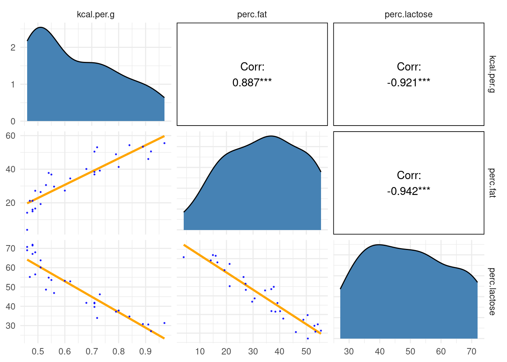


Either helps in predicting `kcal.per.g`, but neither helps as much *once you already know the other*.

DAG the sense out of it:


```r
dag_coords <-
  tibble(name = c("L", "D", "F", "K"),
         x    = c(1, 2, 3, 2),
         y    = c(2, 2, 2, 1))

ggdag::dagify(L ~ D,
       F ~ D,
       K ~ L + F,
       coords = dag_coords) %>%
  
  ggplot(aes(x = x, y = y, xend = xend, yend = yend)) +
  ggdag::geom_dag_point(aes(color = name == "D"),
                        alpha = 1/2, size = 6.5, show.legend = F) +
  geom_point(x = 2, y = 2, 
             size = 6.5, shape = 1, stroke = 1, color = "orange") +
  ggdag::geom_dag_text(color = "black") +
  ggdag::geom_dag_edges() +
  scale_color_manual(values = c("steelblue", "orange")) +
  scale_x_continuous(NULL, breaks = NULL, expand = c(.1, .1)) +
  scale_y_continuous(NULL, breaks = NULL, expand = c(.1, .1))
```

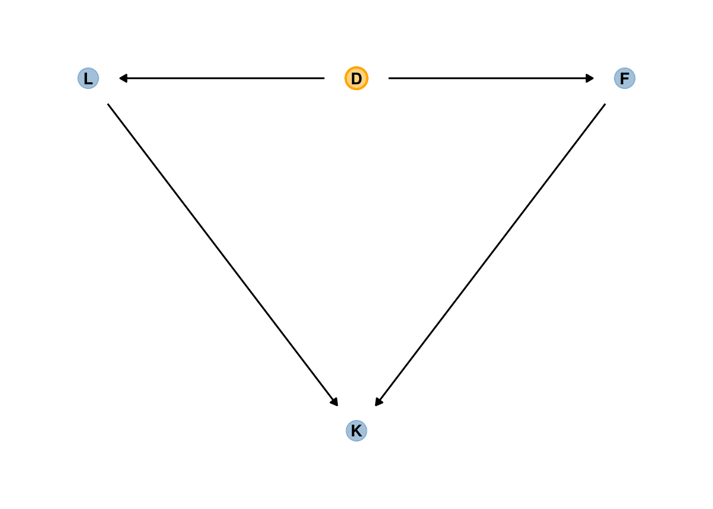


Some fields actually teach students to inspect pairwise correlations before fitting a model, to identify and drop highly correlated predictors. This is a mistake. Pairwise correlations are not the problem. It is the conditional associations—not correlations—that matter. 

Now let's see how the imprecision of the posterior increases with association between two predictors.


```r
# define a custom function
sim_coll <- function(seed, rho) {
  
  # simulate the data
  set.seed(seed)
  
  d <-
    d %>% 
    mutate(x = rnorm(n(), 
                     mean = perc.fat * rho,
                     sd = sqrt((1 - rho^2) * var(perc.fat))))
    
  # fit an OLS model
  m <- lm(kcal.per.g ~ perc.fat + x, data = d)
  
  # extract the parameter SD
  sqrt(diag(vcov(m)))[2]
  
}

# how many simulations per `rho`-value would you like?
n_seed <- 100
# how many `rho`-values from 0 to .99 would you like to evaluate the process over?
n_rho  <- 30

d <-
  crossing(seed = 1:n_seed,
           rho  = seq(from = 0, to = .99, length.out = n_rho))  %>% 
  mutate(parameter_sd = purrr::map2_dbl(seed, rho, sim_coll)) %>% 
  group_by(rho) %>% 
  # we'll `summarise()` our output by the mean and 95% intervals
  summarise(mean = mean(parameter_sd),
            ll   = quantile(parameter_sd, prob = .025),
            ul   = quantile(parameter_sd, prob = .975))

# Add 95% interval bands
d %>% 
  ggplot(aes(x = rho, y = mean)) +
  geom_smooth(aes(ymin = ll, ymax = ul),
              stat = "identity",
              fill = "orange", color = "orange", alpha = 1/3, size = 2/3) +
  labs(x = expression(rho),
       y = "parameter SD") +
  coord_cartesian(ylim = c(0, .0072))
```

<div class="figure">
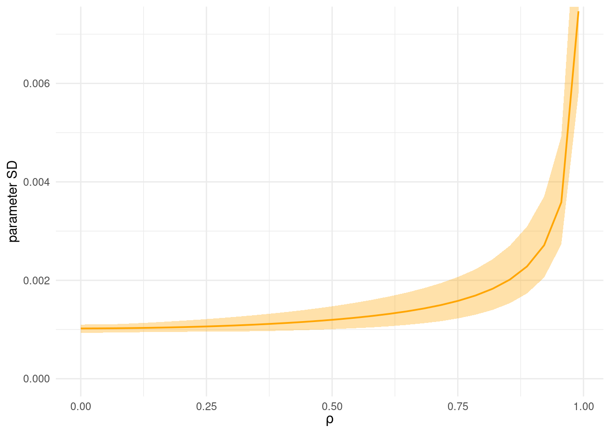
<p class="caption">Figure 5.10</p>
</div>


## Post-treatment bias

<div class="figure">

<p class="caption">The confound that gets created is the "post-treatment bias", Z. Post-treatment variables arise as a consequence of treatment. This happens a lot. The bias occurs when you're not aware of Z, and end up inferring something wrong. </p>
</div>

<div class="figure">

<p class="caption">Let's imagine an experiment where there's fungal growth in a greenhouse, and you have an anti-fungal treatment, and you randomly assign plants to either the treatment or control. The initial height of the plant is H0. The anti-fungal treatment is upstream from the fungus, but doesn't influence it directly. What happens here in a regression is if you measure fungus - which is how you test for mediation - but what you're interested in is the full path from T to H1. If you condition on F, it'll look like the treatment doesn't work. If you condition on F, you block the pipe, and information doesn't flow from T to H1. In observational studies, the terror is real. </p>
</div>


```r
# how many plants would you like?
n <- 100

set.seed(71)
d <- 
  tibble(h0        = rnorm(n, mean = 10, sd = 2), 
         treatment = rep(0:1, each = n / 2),
         fungus    = rbinom(n, size = 1, prob = .5 - treatment * 0.4),
         h1        = h0 + rnorm(n, mean = 5 - 3 * fungus, sd = 1))
```


```r
d %>% 
  head()
```

```
## # A tibble: 6 × 4
##      h0 treatment fungus    h1
##   <dbl>     <int>  <int> <dbl>
## 1  9.14         0      0  14.3
## 2  9.11         0      0  15.6
## 3  9.04         0      0  14.4
## 4 10.8          0      0  15.8
## 5  9.16         0      1  11.5
## 6  7.63         0      0  11.1
```


```r
d %>% 
  pivot_longer(everything()) %>% 
  group_by(name) %>% 
  tidybayes::mean_qi(.width = .89) %>% 
  mutate_if(is.double, round, digits = 2)
```

```
## # A tibble: 4 × 7
##   name      value .lower .upper .width .point .interval
##   <chr>     <dbl>  <dbl>  <dbl>  <dbl> <chr>  <chr>    
## 1 fungus     0.23   0       1     0.89 mean   qi       
## 2 h0         9.96   6.57   13.1   0.89 mean   qi       
## 3 h1        14.4   10.6    17.9   0.89 mean   qi       
## 4 treatment  0.5    0       1     0.89 mean   qi
```


***6.2.1. A prior is born***

We should allow $p$ to be less than 1, in case the experiment goes horribly wrong and we kill all the plants. We also have to ensure that $p > 0$, because it is a proportion. 

$$
h_{1,i}\sim Normal(\mu_i, \sigma) \\
\mu_i = h_{0,i} \times p
$$

Take a look as the $p \sim LogNormal(0, 0.25)$

```r
set.seed(6)

# simulate
sim_p <-
  tibble(sim_p = rlnorm(1e4, meanlog = 0, sdlog = 0.25)) 

# wrangle
sim_p %>% 
  mutate(`exp(sim_p)` = exp(sim_p)) %>%
  gather() %>% 
  
  # plot
  ggplot(aes(x = value)) +
  geom_density(fill = "steelblue") +
  scale_x_continuous(breaks = c(0, .5, 1, 1.5, 2, 3, 5)) +
  scale_y_continuous(NULL, breaks = NULL) +
  coord_cartesian(xlim = c(0, 6)) +
  theme(panel.grid.minor.x = element_blank()) +
  facet_wrap(~ key, scale = "free_y", ncol = 1)
```

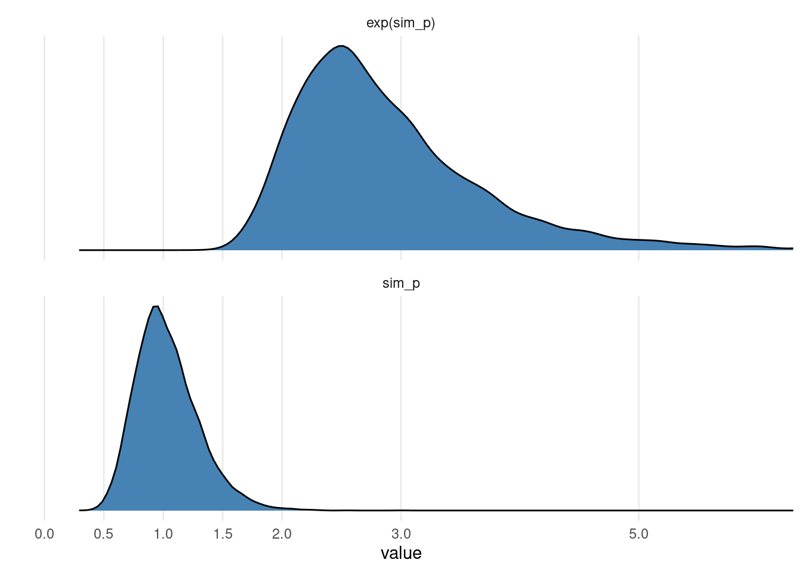


```r
sim_p %>% 
  mutate(`exp(sim_p)` = exp(sim_p)) %>%
  pivot_longer(everything()) %>%
  group_by(name) %>% 
  tidybayes::mean_qi(.width = .89) %>% 
  mutate_if(is.double, round, digits = 2)
```

```
## # A tibble: 2 × 7
##   name       value .lower .upper .width .point .interval
##   <chr>      <dbl>  <dbl>  <dbl>  <dbl> <chr>  <chr>    
## 1 exp(sim_p)  2.92   1.96   4.49   0.89 mean   qi       
## 2 sim_p       1.03   0.67   1.5    0.89 mean   qi
```


So this prior expects anything from 40% shrinkage up to 50% growth.


```r
b6.6 <- 
  brm(data = d, 
      family = gaussian,
      h1 ~ 0 + h0,
      prior = c(prior(lognormal(0, 0.25), class = b),
                prior(exponential(1), class = sigma)),
      iter = 2000, warmup = 1000, chains = 4, cores = 4,
      seed = 6,
      file = "fits/b06.06")
```


```r
print(b6.6)
```

```
##  Family: gaussian 
##   Links: mu = identity; sigma = identity 
## Formula: h1 ~ 0 + h0 
##    Data: d (Number of observations: 100) 
## Samples: 4 chains, each with iter = 2000; warmup = 1000; thin = 1;
##          total post-warmup samples = 4000
## 
## Population-Level Effects: 
##    Estimate Est.Error l-95% CI u-95% CI Rhat Bulk_ESS Tail_ESS
## h0     1.43      0.02     1.39     1.46 1.00     3136     2484
## 
## Family Specific Parameters: 
##       Estimate Est.Error l-95% CI u-95% CI Rhat Bulk_ESS Tail_ESS
## sigma     1.83      0.13     1.60     2.10 1.00     3161     2412
## 
## Samples were drawn using sampling(NUTS). For each parameter, Bulk_ESS
## and Tail_ESS are effective sample size measures, and Rhat is the potential
## scale reduction factor on split chains (at convergence, Rhat = 1).
```


```r
b6.7 <- 
  brm(data = d, 
      family = gaussian,
      bf(h1 ~ h0 * (a + t * treatment + f * fungus),
         a + t + f ~ 1,
         nl = TRUE),
      prior = c(prior(lognormal(0, 0.2), nlpar = a, lb = 0),
                prior(normal(0, 0.5), nlpar = t),
                prior(normal(0, 0.5), nlpar = f),
                prior(exponential(1), class = sigma)),
      iter = 2000, warmup = 1000, chains = 4, cores = 4,
      seed = 6,
      file = "fits/b06.07")
```


```r
print(b6.7)
```

```
##  Family: gaussian 
##   Links: mu = identity; sigma = identity 
## Formula: h1 ~ h0 * (a + t * treatment + f * fungus) 
##          a ~ 1
##          t ~ 1
##          f ~ 1
##    Data: d (Number of observations: 100) 
## Samples: 4 chains, each with iter = 2000; warmup = 1000; thin = 1;
##          total post-warmup samples = 4000
## 
## Population-Level Effects: 
##             Estimate Est.Error l-95% CI u-95% CI Rhat Bulk_ESS Tail_ESS
## a_Intercept     1.48      0.03     1.43     1.53 1.00     1565     1952
## t_Intercept     0.00      0.03    -0.06     0.06 1.00     1669     1940
## f_Intercept    -0.27      0.04    -0.34    -0.19 1.00     1923     2305
## 
## Family Specific Parameters: 
##       Estimate Est.Error l-95% CI u-95% CI Rhat Bulk_ESS Tail_ESS
## sigma     1.45      0.10     1.26     1.67 1.00     3162     2588
## 
## Samples were drawn using sampling(NUTS). For each parameter, Bulk_ESS
## and Tail_ESS are effective sample size measures, and Rhat is the potential
## scale reduction factor on split chains (at convergence, Rhat = 1).
```


***6.2.2. Blocked by consequence***

>So when we control for fungus, the model is implicitly answering the question: Once we already know whether or not a plant developed fungus, does soil treatment matter? The answer is “no,” because soil treatment has its effects on growth through reducing fungus.

To measure treatment properly, we should omit the post-treatment variable `fungus`.


```r
b6.8 <- 
  brm(data = d, 
      family = gaussian,
      bf(h1 ~ h0 * (a + t * treatment),
         a + t ~ 1,
         nl = TRUE),
      prior = c(prior(lognormal(0, 0.2), nlpar = a, lb = 0),
                prior(normal(0, 0.5), nlpar = t),
                prior(exponential(1), class = sigma)),
      iter = 2000, warmup = 1000, chains = 4, cores = 4,
      seed = 6,
      file = "fits/b06.08")
```


```r
print(b6.8)
```

```
##  Family: gaussian 
##   Links: mu = identity; sigma = identity 
## Formula: h1 ~ h0 * (a + t * treatment) 
##          a ~ 1
##          t ~ 1
##    Data: d (Number of observations: 100) 
## Samples: 4 chains, each with iter = 2000; warmup = 1000; thin = 1;
##          total post-warmup samples = 4000
## 
## Population-Level Effects: 
##             Estimate Est.Error l-95% CI u-95% CI Rhat Bulk_ESS Tail_ESS
## a_Intercept     1.38      0.03     1.33     1.43 1.00     2197     2079
## t_Intercept     0.09      0.04     0.02     0.15 1.00     2273     2062
## 
## Family Specific Parameters: 
##       Estimate Est.Error l-95% CI u-95% CI Rhat Bulk_ESS Tail_ESS
## sigma     1.79      0.13     1.56     2.04 1.00     2466     2548
## 
## Samples were drawn using sampling(NUTS). For each parameter, Bulk_ESS
## and Tail_ESS are effective sample size measures, and Rhat is the potential
## scale reduction factor on split chains (at convergence, Rhat = 1).
```

Now the impact of treatment is clearly positive, as it should be.

***6.2.3. Fungus and d-separation***


```r
# define our coordinates
dag_coords <-
  tibble(name = c("H0", "T", "F", "H1"),
         x    = c(1, 5, 4, 3),
         y    = c(2, 2, 1.5, 1))

# save our DAG
dag <-
  ggdag::dagify(F ~ T,
                H1 ~ H0 + F,
                coords = dag_coords)

# make function
gg_simple_dag <- function(d) {
  
  d %>% 
    ggplot(aes(x = x, y = y, xend = xend, yend = yend)) +
    ggdag::geom_dag_point(color = "steelblue", alpha = 1/2, size = 6.5) +
    ggdag::geom_dag_text(color = "black") +
    ggdag::geom_dag_edges() + 
    ggdag::theme_dag()
  
}

# try it out!
dag %>% 
  gg_simple_dag()
```

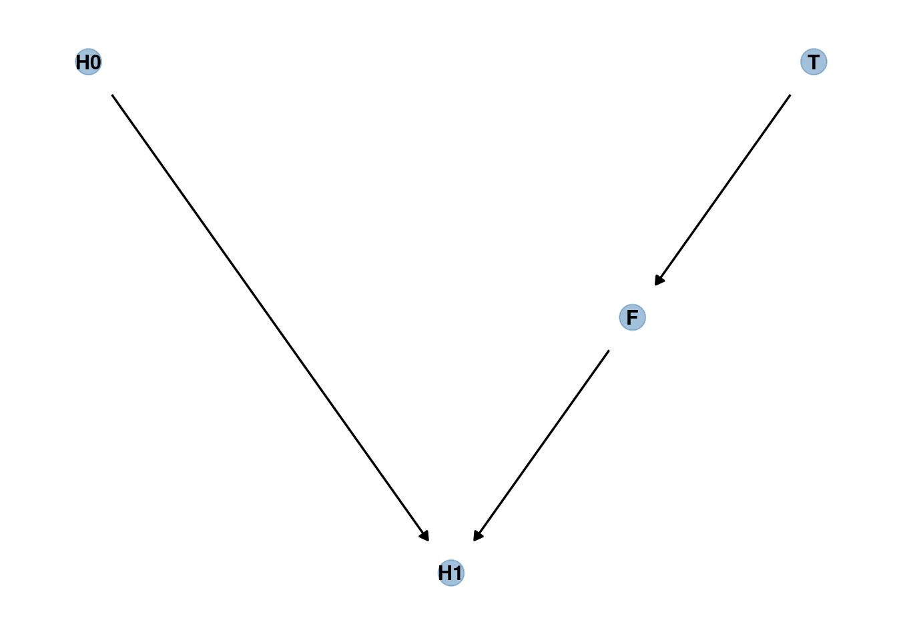

Conditioning on $F$ induces **d-separation**. The "d" stands for *directional*. D-separation means that some variables on a directed graph are independent of others. In this case, $H_1$ is d-separated from $T$, but only when we condition on $F$, because it blocks the path between $T$ and $H_1$. 


```r
dag %>% 
  dagitty::dseparated("T", "H1")
```

```
## [1] FALSE
```

```r
dag %>% 
  dagitty::dseparated("T", "H1", "F")
```

```
## [1] TRUE
```

```r
dagitty::impliedConditionalIndependencies(dag)
```

```
## F _||_ H0
## H0 _||_ T
## H1 _||_ T | F
```

The first two say that original plant height should not be associated with the treatment of fungus, provided we do not condition on anything.

But consider this DAG:


```r
knitr::include_graphics(here::here("docs/misc_figs/06/fungus_dag.png"))
```


```r
# define our coordinates
dag_coords <-
  tibble(name = c("H0", "H1", "M", "F", "T"),
         x    = c(1, 2, 2.5, 3, 4),
         y    = c(2, 2, 1, 2, 2))

# save our DAG
dag <-
  dagify(F ~ M + T,
         H1 ~ H0 + M,
         coords = dag_coords)

gg_fancy_dag <- function(d, x = 1, y = 1, circle = "U") {
  
  d %>% 
    ggplot(aes(x = x, y = y, xend = xend, yend = yend)) +
    geom_dag_point(aes(color = name == circle),
                   alpha = 1/2, size = 6.5, show.legend = F) +
    geom_point(x = x, y = y, 
               size = 6.5, shape = 1, stroke = 1, color = "orange") +
    geom_dag_text(color = "black") +
    geom_dag_edges() + 
    scale_color_manual(values = c("steelblue", "orange")) +
    theme_dag()
  
}

# check it out
dag %>% 
  gg_fancy_dag(x = 2.5, y = 1, circle = "M")
```

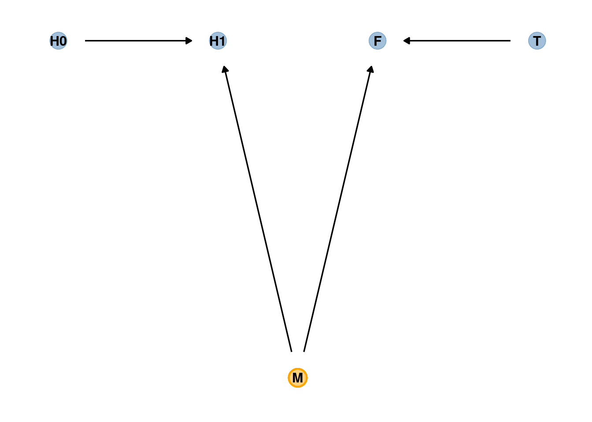


A regression of $H_1$ on $T$ will show no association between the treatment and plant growth. But if we include $F$ in the model, suddenly there will be an association. Let’s try it.


```r
set.seed(71)
n <- 1000

d2 <- 
  tibble(h0        = rnorm(n, mean = 10, sd = 2),
         treatment = rep(0:1, each = n / 2),
         m         = rbinom(n, size = 1, prob = .5),
         fungus    = rbinom(n, size = 1, prob = .5 - treatment * 0.4 + 0.4 * m),
         h1        = h0 + rnorm(n, mean = 5 + 3 * m, sd = 1))

head(d2)
```

```
## # A tibble: 6 × 5
##      h0 treatment     m fungus    h1
##   <dbl>     <int> <int>  <int> <dbl>
## 1  9.14         0     0      0  14.8
## 2  9.11         0     0      0  15.3
## 3  9.04         0     1      1  16.4
## 4 10.8          0     1      1  19.1
## 5  9.16         0     1      1  17.2
## 6  7.63         0     0      0  13.4
```


```r
# Rerun models with d2
b6.7b <- 
  brm(data = d2, 
      family = gaussian,
      bf(h1 ~ h0 * (a + t * treatment + f * fungus),
         a + t + f ~ 1,
         nl = TRUE),
      prior = c(prior(lognormal(0, 0.2), nlpar = a, lb = 0),
                prior(normal(0, 0.5), nlpar = t),
                prior(normal(0, 0.5), nlpar = f),
                prior(exponential(1), class = sigma)),
      iter = 2000, warmup = 1000, chains = 4, cores = 4,
      seed = 6,
      file = "fits/b06.07b")


b6.8b <- 
  brm(data = d2, 
      family = gaussian,
      bf(h1 ~ h0 * (a + t * treatment),
         a + t ~ 1,
         nl = TRUE),
      prior = c(prior(lognormal(0, 0.2), nlpar = a, lb = 0),
                prior(normal(0, 0.5), nlpar = t),
                prior(exponential(1), class = sigma)),
      iter = 2000, warmup = 1000, chains = 4, cores = 4,
      seed = 6,
      file = "fits/b06.08b")
```


```r
brms::posterior_samples(b6.7b) %>%
  round(digits = 2)
```

```
##      b_a_Intercept b_t_Intercept b_f_Intercept sigma     lp__
## 1             1.51          0.05          0.15  2.12 -2167.57
## 2             1.49          0.08          0.17  2.08 -2169.97
## 3             1.55          0.02          0.12  2.16 -2169.18
## 4             1.50          0.07          0.15  2.12 -2168.04
## 5             1.51          0.07          0.16  2.11 -2167.97
## 6             1.51          0.06          0.15  2.11 -2167.00
## 7             1.51          0.07          0.15  2.08 -2168.21
## 8             1.51          0.05          0.16  2.15 -2167.88
## 9             1.50          0.08          0.16  2.10 -2168.58
## 10            1.51          0.07          0.15  2.14 -2167.86
## 11            1.52          0.04          0.16  2.06 -2168.67
## 12            1.52          0.05          0.13  2.06 -2167.53
## 13            1.51          0.05          0.16  2.11 -2167.74
## 14            1.50          0.07          0.16  2.09 -2168.49
## 15            1.52          0.05          0.15  2.09 -2167.41
## 16            1.52          0.04          0.16  2.10 -2168.67
## 17            1.53          0.04          0.13  2.10 -2166.74
## 18            1.52          0.06          0.14  2.11 -2166.71
## 19            1.52          0.07          0.12  2.13 -2169.58
## 20            1.51          0.05          0.17  2.11 -2168.28
## 21            1.51          0.04          0.16  2.10 -2168.21
## 22            1.51          0.04          0.17  2.10 -2169.14
## 23            1.52          0.05          0.16  2.11 -2167.71
## 24            1.51          0.05          0.15  2.10 -2166.80
## 25            1.50          0.07          0.16  2.06 -2168.79
## 26            1.51          0.05          0.15  2.05 -2167.39
## 27            1.51          0.06          0.15  2.06 -2167.73
## 28            1.52          0.05          0.15  2.17 -2167.67
## 29            1.51          0.06          0.16  2.14 -2167.61
## 30            1.50          0.06          0.16  2.15 -2167.89
## 31            1.50          0.06          0.17  2.07 -2168.52
## 32            1.51          0.07          0.14  2.09 -2167.81
## 33            1.53          0.05          0.13  2.12 -2167.49
## 34            1.53          0.03          0.14  2.13 -2167.45
## 35            1.52          0.05          0.15  1.98 -2170.91
## 36            1.52          0.05          0.15  2.01 -2169.04
## 37            1.50          0.07          0.15  2.17 -2168.90
## 38            1.51          0.07          0.16  2.14 -2168.72
## 39            1.53          0.04          0.14  2.08 -2167.21
## 40            1.51          0.07          0.14  2.16 -2168.03
## 41            1.52          0.05          0.16  2.12 -2167.72
## 42            1.51          0.07          0.14  2.12 -2167.81
## 43            1.54          0.03          0.13  2.16 -2168.05
## 44            1.53          0.04          0.17  2.15 -2170.85
## 45            1.52          0.04          0.16  2.14 -2167.99
## 46            1.51          0.04          0.15  2.13 -2168.03
## 47            1.51          0.06          0.15  2.06 -2167.82
## 48            1.52          0.05          0.14  2.18 -2167.99
## 49            1.55          0.02          0.12  2.05 -2170.38
## 50            1.49          0.08          0.15  2.14 -2170.89
## 51            1.49          0.08          0.17  2.19 -2170.88
## 52            1.49          0.08          0.17  2.19 -2171.14
## 53            1.50          0.06          0.15  2.11 -2167.76
## 54            1.54          0.04          0.12  2.14 -2167.70
## 55            1.54          0.04          0.12  2.14 -2167.86
## 56            1.52          0.03          0.14  2.14 -2167.74
## 57            1.52          0.04          0.15  2.09 -2166.98
## 58            1.54          0.03          0.13  2.09 -2167.49
## 59            1.52          0.05          0.13  2.05 -2167.86
## 60            1.51          0.05          0.15  2.17 -2168.67
## 61            1.52          0.05          0.14  2.07 -2167.32
## 62            1.51          0.05          0.15  2.16 -2167.70
## 63            1.52          0.04          0.15  2.07 -2167.00
## 64            1.53          0.05          0.13  2.07 -2167.51
## 65            1.52          0.04          0.15  2.10 -2167.76
## 66            1.50          0.08          0.16  2.08 -2169.09
## 67            1.50          0.07          0.16  2.09 -2168.39
## 68            1.49          0.06          0.17  2.09 -2169.08
## 69            1.54          0.06          0.12  2.13 -2169.87
## 70            1.53          0.03          0.14  2.22 -2170.37
## 71            1.52          0.05          0.13  2.09 -2167.39
## 72            1.52          0.05          0.15  2.12 -2166.85
## 73            1.52          0.05          0.15  2.12 -2167.13
## 74            1.53          0.04          0.15  2.13 -2168.78
## 75            1.53          0.05          0.12  2.00 -2170.61
## 76            1.52          0.04          0.15  2.11 -2167.61
## 77            1.52          0.05          0.13  2.20 -2169.08
## 78            1.52          0.06          0.14  2.12 -2167.12
## 79            1.52          0.06          0.14  2.11 -2167.82
## 80            1.51          0.06          0.12  2.13 -2171.77
## 81            1.51          0.05          0.13  2.13 -2171.04
## 82            1.52          0.05          0.13  2.14 -2167.44
## 83            1.53          0.03          0.13  2.16 -2168.48
## 84            1.50          0.06          0.17  2.04 -2169.88
## 85            1.50          0.07          0.16  2.03 -2169.52
## 86            1.52          0.05          0.13  2.10 -2167.28
## 87            1.53          0.06          0.14  2.04 -2168.35
## 88            1.53          0.04          0.15  2.09 -2167.75
## 89            1.53          0.05          0.12  2.12 -2168.76
## 90            1.53          0.05          0.13  2.12 -2167.43
## 91            1.54          0.05          0.12  2.13 -2168.34
## 92            1.53          0.04          0.13  2.13 -2167.77
## 93            1.50          0.06          0.16  2.10 -2168.48
## 94            1.51          0.07          0.16  2.03 -2169.82
## 95            1.51          0.06          0.16  2.05 -2168.65
## 96            1.55          0.02          0.11  2.10 -2169.28
## 97            1.53          0.04          0.14  2.07 -2166.97
## 98            1.53          0.05          0.13  2.05 -2167.96
## 99            1.51          0.05          0.16  1.98 -2171.63
## 100           1.51          0.07          0.14  2.15 -2167.95
## 101           1.54          0.03          0.14  2.16 -2168.66
## 102           1.53          0.03          0.13  2.06 -2167.97
## 103           1.55          0.04          0.13  2.08 -2169.09
## 104           1.52          0.04          0.14  2.15 -2167.28
## 105           1.53          0.05          0.14  2.14 -2166.91
## 106           1.53          0.03          0.14  2.11 -2167.07
## 107           1.53          0.04          0.13  2.10 -2167.22
## 108           1.55          0.04          0.12  2.08 -2170.67
## 109           1.50          0.06          0.16  2.11 -2168.77
## 110           1.50          0.07          0.17  2.12 -2168.66
## 111           1.51          0.06          0.14  2.10 -2168.03
## 112           1.52          0.07          0.14  2.09 -2168.38
## 113           1.52          0.06          0.14  2.09 -2167.82
## 114           1.51          0.07          0.15  2.16 -2169.04
## 115           1.54          0.03          0.12  2.06 -2168.53
## 116           1.55          0.03          0.12  2.07 -2168.73
## 117           1.55          0.02          0.12  2.04 -2169.99
## 118           1.51          0.06          0.15  2.09 -2167.67
## 119           1.50          0.06          0.15  2.08 -2168.21
## 120           1.51          0.06          0.15  2.17 -2167.94
## 121           1.52          0.05          0.15  2.02 -2168.81
## 122           1.51          0.06          0.16  2.03 -2168.88
## 123           1.53          0.05          0.14  2.15 -2168.29
## 124           1.51          0.05          0.14  2.15 -2168.73
## 125           1.52          0.06          0.13  2.12 -2168.01
## 126           1.52          0.05          0.14  2.06 -2167.47
## 127           1.52          0.05          0.13  2.06 -2167.82
## 128           1.53          0.03          0.15  2.08 -2167.82
## 129           1.52          0.06          0.14  2.03 -2168.67
## 130           1.53          0.04          0.13  2.06 -2167.57
## 131           1.52          0.04          0.15  2.09 -2167.53
## 132           1.51          0.04          0.18  2.13 -2171.08
## 133           1.51          0.06          0.15  2.15 -2167.24
## 134           1.49          0.06          0.18  2.13 -2170.55
## 135           1.53          0.05          0.12  2.17 -2168.84
## 136           1.53          0.03          0.15  2.12 -2168.42
## 137           1.53          0.03          0.15  2.09 -2168.61
## 138           1.52          0.04          0.15  2.06 -2167.80
## 139           1.52          0.05          0.14  2.12 -2166.86
## 140           1.53          0.04          0.14  2.09 -2166.97
## 141           1.52          0.06          0.15  2.10 -2167.42
## 142           1.52          0.05          0.15  2.11 -2166.67
## 143           1.51          0.05          0.15  2.11 -2167.23
## 144           1.51          0.04          0.15  2.12 -2169.69
## 145           1.52          0.05          0.15  2.10 -2167.13
## 146           1.52          0.04          0.14  2.11 -2167.09
## 147           1.52          0.07          0.13  2.02 -2171.10
## 148           1.52          0.03          0.16  2.04 -2170.35
## 149           1.53          0.04          0.14  2.15 -2167.33
## 150           1.51          0.05          0.14  2.12 -2167.66
## 151           1.55          0.05          0.13  2.01 -2173.89
## 152           1.54          0.03          0.12  2.02 -2170.06
## 153           1.54          0.05          0.12  2.00 -2171.92
## 154           1.54          0.04          0.12  2.02 -2169.47
## 155           1.53          0.05          0.13  2.02 -2169.15
## 156           1.53          0.04          0.15  1.99 -2169.98
## 157           1.51          0.07          0.15  2.11 -2167.60
## 158           1.52          0.04          0.15  2.18 -2168.40
## 159           1.52          0.05          0.13  2.10 -2167.18
## 160           1.52          0.05          0.13  2.12 -2167.21
## 161           1.52          0.06          0.14  2.19 -2168.19
## 162           1.53          0.04          0.14  2.19 -2168.79
## 163           1.52          0.04          0.13  2.20 -2170.07
## 164           1.52          0.05          0.16  2.20 -2170.40
## 165           1.50          0.09          0.15  2.08 -2172.41
## 166           1.51          0.07          0.13  2.11 -2170.61
## 167           1.51          0.03          0.15  2.15 -2169.52
## 168           1.52          0.04          0.15  2.11 -2167.35
## 169           1.52          0.06          0.13  2.18 -2169.05
## 170           1.51          0.05          0.17  2.08 -2168.32
## 171           1.51          0.07          0.14  2.09 -2169.13
## 172           1.52          0.06          0.14  2.07 -2167.83
## 173           1.51          0.06          0.17  2.12 -2168.61
## 174           1.50          0.06          0.17  2.19 -2170.87
## 175           1.50          0.06          0.17  2.18 -2169.89
## 176           1.51          0.05          0.17  2.19 -2170.25
## 177           1.52          0.06          0.14  2.14 -2167.57
## 178           1.51          0.07          0.13  2.13 -2168.75
## 179           1.52          0.06          0.15  2.15 -2167.43
## 180           1.54          0.01          0.15  2.12 -2171.58
## 181           1.51          0.03          0.17  2.10 -2170.22
## 182           1.53          0.05          0.14  2.09 -2167.44
## 183           1.52          0.04          0.15  2.17 -2168.81
## 184           1.54          0.04          0.14  2.06 -2168.27
## 185           1.52          0.05          0.15  2.15 -2167.95
## 186           1.50          0.05          0.15  2.05 -2169.20
## 187           1.52          0.06          0.14  2.09 -2166.91
## 188           1.53          0.06          0.13  2.08 -2167.42
## 189           1.52          0.04          0.15  2.13 -2167.59
## 190           1.53          0.04          0.14  2.16 -2168.26
## 191           1.52          0.04          0.13  2.15 -2169.28
## 192           1.51          0.04          0.15  2.14 -2169.51
## 193           1.54          0.03          0.14  2.10 -2169.47
## 194           1.53          0.03          0.13  2.08 -2167.96
## 195           1.54          0.05          0.13  2.07 -2168.33
## 196           1.52          0.06          0.13  2.13 -2169.09
## 197           1.53          0.04          0.15  2.09 -2167.86
## 198           1.53          0.04          0.14  2.09 -2166.81
## 199           1.53          0.02          0.15  2.09 -2169.32
## 200           1.51          0.07          0.15  2.13 -2168.19
## 201           1.50          0.07          0.16  2.12 -2167.84
## 202           1.53          0.05          0.13  2.05 -2167.94
## 203           1.51          0.07          0.15  2.15 -2168.37
## 204           1.52          0.04          0.15  2.07 -2167.28
## 205           1.53          0.04          0.16  2.06 -2168.60
## 206           1.52          0.05          0.13  2.07 -2167.10
## 207           1.52          0.05          0.14  2.07 -2166.86
## 208           1.53          0.04          0.14  2.10 -2166.70
## 209           1.51          0.05          0.14  2.10 -2167.37
## 210           1.52          0.05          0.15  2.10 -2167.04
## 211           1.52          0.05          0.15  2.10 -2166.89
## 212           1.54          0.05          0.13  2.15 -2168.45
## 213           1.53          0.03          0.13  2.14 -2168.04
## 214           1.53          0.03          0.14  2.20 -2168.89
## 215           1.54          0.03          0.14  2.22 -2169.73
## 216           1.51          0.04          0.17  2.07 -2170.65
## 217           1.52          0.07          0.13  2.07 -2168.88
## 218           1.53          0.05          0.13  2.05 -2167.99
## 219           1.54          0.04          0.14  2.08 -2167.34
## 220           1.53          0.03          0.12  2.09 -2168.71
## 221           1.53          0.07          0.12  2.16 -2170.61
## 222           1.52          0.06          0.13  2.14 -2168.69
## 223           1.53          0.04          0.13  2.07 -2167.46
## 224           1.53          0.05          0.15  2.15 -2167.36
## 225           1.52          0.04          0.14  2.15 -2167.68
## 226           1.54          0.04          0.13  2.13 -2168.29
## 227           1.55          0.04          0.13  2.14 -2168.87
## 228           1.52          0.04          0.14  2.17 -2169.49
## 229           1.52          0.05          0.14  2.06 -2167.72
## 230           1.53          0.06          0.13  2.10 -2167.66
## 231           1.48          0.08          0.19  2.16 -2172.25
## 232           1.49          0.09          0.16  2.20 -2171.58
## 233           1.49          0.08          0.17  2.17 -2170.80
## 234           1.51          0.05          0.16  2.15 -2167.90
## 235           1.52          0.07          0.15  2.05 -2168.96
## 236           1.52          0.06          0.14  2.07 -2167.37
## 237           1.52          0.06          0.14  2.16 -2167.61
## 238           1.54          0.03          0.13  2.05 -2168.14
## 239           1.55          0.03          0.12  2.07 -2168.34
## 240           1.54          0.04          0.12  2.08 -2167.62
## 241           1.53          0.04          0.14  2.09 -2166.81
## 242           1.53          0.04          0.14  2.09 -2166.85
## 243           1.53          0.05          0.15  2.17 -2169.52
## 244           1.50          0.05          0.17  2.05 -2169.53
## 245           1.49          0.08          0.16  2.10 -2169.68
## 246           1.51          0.06          0.16  2.06 -2168.06
## 247           1.51          0.08          0.15  2.16 -2169.10
## 248           1.52          0.04          0.14  2.13 -2167.29
## 249           1.52          0.05          0.14  2.08 -2166.91
## 250           1.52          0.06          0.14  2.17 -2167.97
## 251           1.51          0.06          0.15  2.09 -2166.98
## 252           1.52          0.05          0.14  2.11 -2166.70
## 253           1.51          0.05          0.15  2.07 -2167.12
## 254           1.52          0.04          0.16  2.08 -2168.02
## 255           1.51          0.06          0.14  2.11 -2167.50
## 256           1.51          0.06          0.14  2.11 -2167.50
## 257           1.53          0.05          0.13  2.15 -2167.43
## 258           1.51          0.05          0.12  2.15 -2174.50
## 259           1.52          0.05          0.16  2.18 -2169.13
## 260           1.52          0.06          0.15  2.16 -2168.39
## 261           1.51          0.04          0.15  2.09 -2168.65
## 262           1.54          0.04          0.13  2.14 -2167.71
## 263           1.54          0.03          0.12  2.07 -2168.09
## 264           1.54          0.05          0.13  2.05 -2168.35
## 265           1.53          0.05          0.13  2.02 -2168.38
## 266           1.53          0.05          0.13  2.02 -2168.91
## 267           1.52          0.03          0.14  2.08 -2167.81
## 268           1.53          0.03          0.15  2.11 -2167.84
## 269           1.53          0.05          0.13  2.13 -2167.03
## 270           1.52          0.04          0.16  2.09 -2167.91
## 271           1.52          0.05          0.14  2.15 -2167.14
## 272           1.52          0.05          0.15  2.06 -2167.17
## 273           1.51          0.05          0.14  2.05 -2169.07
## 274           1.52          0.06          0.15  2.17 -2169.30
## 275           1.52          0.06          0.15  2.18 -2168.05
## 276           1.52          0.05          0.14  2.12 -2167.25
## 277           1.51          0.06          0.16  2.05 -2167.98
## 278           1.53          0.03          0.14  2.12 -2167.85
## 279           1.50          0.07          0.15  2.09 -2168.01
## 280           1.50          0.06          0.16  2.08 -2168.21
## 281           1.53          0.04          0.14  2.11 -2166.71
## 282           1.53          0.05          0.13  2.09 -2166.72
## 283           1.52          0.04          0.14  2.07 -2167.09
## 284           1.54          0.04          0.14  2.13 -2167.86
## 285           1.54          0.05          0.13  2.03 -2169.09
## 286           1.54          0.03          0.14  2.18 -2169.15
## 287           1.53          0.03          0.13  2.17 -2168.66
## 288           1.51          0.05          0.14  2.05 -2168.49
## 289           1.50          0.06          0.17  2.16 -2168.86
## 290           1.50          0.05          0.17  2.15 -2169.56
## 291           1.51          0.07          0.15  2.04 -2169.14
## 292           1.52          0.03          0.15  2.17 -2169.02
## 293           1.53          0.05          0.12  2.07 -2169.32
## 294           1.53          0.05          0.12  2.07 -2169.75
## 295           1.52          0.03          0.16  2.02 -2171.42
## 296           1.52          0.03          0.17  2.18 -2171.57
## 297           1.52          0.04          0.16  2.07 -2168.81
## 298           1.52          0.04          0.17  2.07 -2172.53
## 299           1.51          0.05          0.14  1.99 -2171.25
## 300           1.50          0.06          0.17  2.22 -2171.14
## 301           1.51          0.06          0.15  2.05 -2167.74
## 302           1.53          0.03          0.14  2.00 -2170.13
## 303           1.52          0.05          0.13  2.03 -2169.05
## 304           1.53          0.06          0.14  2.12 -2167.55
## 305           1.52          0.03          0.15  2.10 -2167.99
## 306           1.51          0.07          0.13  2.17 -2169.44
## 307           1.51          0.07          0.15  2.20 -2169.68
## 308           1.54          0.04          0.12  2.11 -2168.05
## 309           1.52          0.04          0.15  2.09 -2167.28
## 310           1.52          0.04          0.15  2.14 -2167.40
## 311           1.52          0.03          0.15  2.13 -2169.19
## 312           1.53          0.05          0.14  2.14 -2167.17
## 313           1.54          0.03          0.14  2.11 -2167.81
## 314           1.53          0.04          0.14  2.06 -2167.38
## 315           1.54          0.03          0.13  2.05 -2168.83
## 316           1.53          0.05          0.14  2.05 -2167.35
## 317           1.52          0.06          0.12  2.02 -2170.56
## 318           1.52          0.04          0.14  2.11 -2167.65
## 319           1.52          0.05          0.16  2.11 -2169.01
## 320           1.54          0.04          0.12  2.13 -2168.66
## 321           1.50          0.07          0.17  2.05 -2169.47
## 322           1.49          0.06          0.17  2.07 -2169.98
## 323           1.54          0.04          0.13  2.15 -2168.59
## 324           1.52          0.04          0.13  2.12 -2168.32
## 325           1.53          0.04          0.14  2.11 -2166.78
## 326           1.51          0.06          0.14  2.13 -2168.28
## 327           1.53          0.05          0.16  2.09 -2170.99
## 328           1.52          0.04          0.16  2.09 -2167.44
## 329           1.52          0.06          0.14  2.13 -2167.28
## 330           1.52          0.05          0.15  2.12 -2166.86
## 331           1.52          0.06          0.14  2.10 -2167.25
## 332           1.52          0.05          0.14  2.08 -2166.81
## 333           1.52          0.06          0.15  2.04 -2167.64
## 334           1.52          0.06          0.14  2.04 -2167.84
## 335           1.53          0.04          0.15  2.06 -2168.08
## 336           1.53          0.03          0.14  2.11 -2168.89
## 337           1.52          0.04          0.14  2.09 -2167.26
## 338           1.54          0.04          0.13  2.08 -2167.75
## 339           1.52          0.05          0.16  2.11 -2167.80
## 340           1.53          0.05          0.13  2.05 -2167.74
## 341           1.50          0.07          0.15  2.18 -2170.18
## 342           1.54          0.03          0.15  2.04 -2170.10
## 343           1.52          0.04          0.17  2.02 -2172.71
## 344           1.53          0.04          0.12  2.14 -2169.38
## 345           1.53          0.03          0.14  2.06 -2169.08
## 346           1.52          0.05          0.13  2.18 -2168.86
## 347           1.55          0.03          0.12  2.12 -2168.19
## 348           1.54          0.03          0.11  2.12 -2169.76
## 349           1.51          0.06          0.16  2.11 -2167.73
## 350           1.51          0.07          0.15  2.18 -2168.91
## 351           1.54          0.03          0.13  2.08 -2168.08
## 352           1.50          0.07          0.16  2.15 -2168.47
## 353           1.53          0.05          0.13  2.10 -2166.89
## 354           1.53          0.04          0.14  2.13 -2166.80
## 355           1.53          0.04          0.14  2.09 -2167.13
## 356           1.51          0.06          0.16  2.14 -2167.29
## 357           1.55          0.03          0.12  2.10 -2168.20
## 358           1.52          0.05          0.14  2.03 -2167.85
## 359           1.53          0.03          0.13  2.18 -2168.35
## 360           1.52          0.05          0.16  2.06 -2167.88
## 361           1.51          0.04          0.15  2.05 -2168.31
## 362           1.48          0.09          0.17  2.10 -2172.06
## 363           1.50          0.06          0.17  2.16 -2169.57
## 364           1.53          0.05          0.13  2.06 -2168.12
## 365           1.52          0.05          0.16  2.08 -2167.93
## 366           1.52          0.06          0.13  2.13 -2168.45
## 367           1.50          0.07          0.16  2.10 -2167.81
## 368           1.51          0.06          0.15  2.08 -2167.14
## 369           1.52          0.05          0.14  2.12 -2166.77
## 370           1.52          0.05          0.14  2.10 -2166.66
## 371           1.52          0.05          0.15  2.07 -2166.88
## 372           1.53          0.05          0.14  2.08 -2166.83
## 373           1.52          0.06          0.14  2.05 -2167.68
## 374           1.52          0.06          0.13  2.15 -2168.27
## 375           1.52          0.05          0.14  2.05 -2167.50
## 376           1.50          0.08          0.16  2.17 -2169.83
## 377           1.55          0.03          0.11  2.10 -2169.89
## 378           1.55          0.04          0.10  2.10 -2170.56
## 379           1.50          0.05          0.18  2.17 -2172.39
## 380           1.51          0.04          0.16  2.09 -2168.64
## 381           1.51          0.05          0.17  2.11 -2169.60
## 382           1.51          0.07          0.14  2.11 -2168.44
## 383           1.53          0.05          0.13  2.18 -2167.93
## 384           1.53          0.03          0.16  2.10 -2168.92
## 385           1.52          0.05          0.14  2.12 -2166.65
## 386           1.52          0.05          0.15  2.11 -2166.85
## 387           1.53          0.05          0.13  2.11 -2167.45
## 388           1.53          0.06          0.13  2.13 -2168.45
## 389           1.50          0.05          0.18  2.02 -2172.70
## 390           1.50          0.05          0.17  2.02 -2170.68
## 391           1.49          0.07          0.16  2.10 -2168.99
## 392           1.52          0.05          0.15  2.12 -2166.74
## 393           1.52          0.05          0.15  2.12 -2166.74
## 394           1.54          0.03          0.13  2.13 -2167.54
## 395           1.55          0.04          0.12  2.15 -2169.17
## 396           1.52          0.04          0.12  2.21 -2171.83
## 397           1.51          0.05          0.15  2.06 -2168.27
## 398           1.52          0.04          0.13  2.17 -2168.47
## 399           1.53          0.04          0.15  2.16 -2169.37
## 400           1.52          0.04          0.15  2.19 -2168.59
## 401           1.53          0.04          0.15  2.17 -2168.34
## 402           1.52          0.05          0.16  2.14 -2167.69
## 403           1.52          0.03          0.14  2.09 -2169.87
## 404           1.51          0.05          0.13  2.13 -2168.92
## 405           1.52          0.06          0.13  2.08 -2167.92
## 406           1.53          0.03          0.15  2.10 -2168.23
## 407           1.51          0.05          0.14  2.10 -2167.84
## 408           1.51          0.06          0.13  2.09 -2168.88
## 409           1.53          0.06          0.13  2.05 -2168.77
## 410           1.51          0.04          0.16  2.04 -2169.82
## 411           1.52          0.05          0.17  2.07 -2170.54
## 412           1.51          0.05          0.17  2.03 -2169.43
## 413           1.52          0.06          0.14  2.18 -2168.32
## 414           1.52          0.05          0.15  2.03 -2167.89
## 415           1.50          0.07          0.15  2.16 -2167.98
## 416           1.51          0.07          0.16  2.14 -2167.78
## 417           1.53          0.04          0.12  2.08 -2167.65
## 418           1.53          0.05          0.14  2.17 -2167.94
## 419           1.53          0.03          0.13  2.16 -2167.91
## 420           1.53          0.04          0.14  2.15 -2167.37
## 421           1.53          0.05          0.13  2.16 -2168.13
## 422           1.51          0.06          0.17  2.07 -2168.45
## 423           1.51          0.06          0.16  2.08 -2167.65
## 424           1.51          0.05          0.16  2.11 -2167.17
## 425           1.52          0.04          0.16  2.12 -2168.06
## 426           1.52          0.03          0.15  2.18 -2169.18
## 427           1.51          0.06          0.14  2.12 -2168.40
## 428           1.52          0.04          0.16  2.16 -2168.32
## 429           1.52          0.04          0.16  2.08 -2167.90
## 430           1.52          0.06          0.13  2.07 -2168.55
## 431           1.53          0.05          0.13  2.10 -2167.82
## 432           1.55          0.03          0.10  2.09 -2170.31
## 433           1.54          0.03          0.13  2.11 -2167.73
## 434           1.52          0.05          0.14  2.11 -2166.57
## 435           1.52          0.04          0.15  2.08 -2167.31
## 436           1.55          0.04          0.12  2.06 -2169.57
## 437           1.53          0.03          0.13  2.06 -2169.66
## 438           1.54          0.03          0.13  2.10 -2168.06
## 439           1.52          0.06          0.14  2.10 -2167.08
## 440           1.50          0.06          0.18  2.08 -2169.42
## 441           1.49          0.08          0.16  2.04 -2170.15
## 442           1.50          0.08          0.16  2.06 -2169.26
## 443           1.50          0.06          0.15  2.11 -2168.50
## 444           1.51          0.04          0.17  2.01 -2170.88
## 445           1.53          0.05          0.13  2.10 -2167.23
## 446           1.51          0.05          0.15  2.11 -2166.99
## 447           1.53          0.05          0.13  2.11 -2166.93
## 448           1.52          0.05          0.14  2.10 -2167.02
## 449           1.52          0.05          0.14  2.10 -2167.02
## 450           1.52          0.05          0.14  2.03 -2168.34
## 451           1.52          0.05          0.15  2.00 -2169.20
## 452           1.51          0.06          0.15  2.08 -2167.24
## 453           1.50          0.07          0.17  2.08 -2168.17
## 454           1.50          0.07          0.15  2.07 -2168.21
## 455           1.50          0.07          0.16  2.08 -2167.82
## 456           1.50          0.07          0.16  2.08 -2168.37
## 457           1.50          0.07          0.15  2.07 -2169.14
## 458           1.52          0.07          0.13  2.08 -2169.52
## 459           1.54          0.02          0.15  2.00 -2172.98
## 460           1.54          0.05          0.11  2.10 -2170.17
## 461           1.53          0.04          0.15  2.14 -2167.66
## 462           1.52          0.04          0.15  2.10 -2167.66
## 463           1.52          0.05          0.13  2.00 -2170.32
## 464           1.54          0.02          0.13  2.15 -2168.74
## 465           1.55          0.03          0.12  2.14 -2170.17
## 466           1.54          0.03          0.13  2.18 -2168.84
## 467           1.54          0.02          0.12  2.19 -2171.46
## 468           1.53          0.07          0.14  2.04 -2170.79
## 469           1.55          0.03          0.14  2.11 -2169.52
## 470           1.55          0.04          0.11  2.17 -2171.04
## 471           1.55          0.03          0.11  2.16 -2170.57
## 472           1.55          0.03          0.12  2.15 -2168.64
## 473           1.54          0.03          0.13  2.14 -2167.97
## 474           1.55          0.03          0.13  2.15 -2168.53
## 475           1.54          0.03          0.12  2.15 -2168.40
## 476           1.50          0.06          0.17  2.07 -2169.35
## 477           1.50          0.07          0.16  2.13 -2168.32
## 478           1.50          0.05          0.16  2.13 -2168.34
## 479           1.53          0.03          0.14  1.99 -2171.81
## 480           1.53          0.04          0.15  2.01 -2169.89
## 481           1.52          0.06          0.14  2.14 -2167.83
## 482           1.52          0.06          0.14  2.13 -2167.22
## 483           1.53          0.05          0.13  2.10 -2166.83
## 484           1.51          0.06          0.17  2.13 -2168.05
## 485           1.51          0.06          0.16  2.14 -2167.84
## 486           1.54          0.04          0.12  2.07 -2168.35
## 487           1.54          0.03          0.12  2.06 -2169.02
## 488           1.56          0.03          0.12  2.15 -2169.83
## 489           1.54          0.03          0.12  2.08 -2168.01
## 490           1.54          0.03          0.13  2.10 -2167.88
## 491           1.54          0.03          0.13  2.11 -2167.52
## 492           1.52          0.06          0.15  2.07 -2167.24
## 493           1.55          0.04          0.11  2.13 -2169.08
## 494           1.52          0.05          0.15  2.09 -2166.73
## 495           1.53          0.04          0.13  2.10 -2167.12
## 496           1.53          0.04          0.14  2.10 -2167.91
## 497           1.52          0.05          0.14  2.11 -2167.28
## 498           1.53          0.05          0.14  2.10 -2166.72
## 499           1.52          0.05          0.16  2.04 -2168.20
## 500           1.52          0.05          0.14  2.08 -2166.96
## 501           1.54          0.05          0.14  2.10 -2169.36
## 502           1.52          0.05          0.14  2.18 -2168.29
## 503           1.53          0.05          0.13  2.11 -2166.84
## 504           1.53          0.05          0.13  2.11 -2166.84
## 505           1.52          0.05          0.16  2.08 -2167.96
## 506           1.50          0.07          0.17  2.06 -2168.64
## 507           1.54          0.04          0.12  2.10 -2168.31
## 508           1.55          0.02          0.12  2.09 -2169.43
## 509           1.50          0.08          0.16  2.10 -2168.56
## 510           1.53          0.04          0.15  2.14 -2167.00
## 511           1.52          0.04          0.14  2.11 -2166.90
## 512           1.52          0.05          0.15  2.09 -2167.03
## 513           1.52          0.04          0.14  2.16 -2167.76
## 514           1.51          0.07          0.15  2.08 -2168.89
## 515           1.52          0.04          0.16  2.09 -2167.75
## 516           1.53          0.04          0.14  2.06 -2167.61
## 517           1.52          0.06          0.15  2.12 -2168.18
## 518           1.52          0.05          0.13  2.07 -2167.90
## 519           1.54          0.06          0.12  2.08 -2170.01
## 520           1.51          0.06          0.14  2.17 -2168.39
## 521           1.52          0.04          0.13  2.10 -2167.50
## 522           1.53          0.04          0.12  2.05 -2169.23
## 523           1.53          0.03          0.13  2.02 -2169.72
## 524           1.53          0.04          0.15  2.00 -2170.68
## 525           1.50          0.07          0.16  2.19 -2169.55
## 526           1.53          0.03          0.15  2.09 -2167.60
## 527           1.54          0.05          0.13  2.13 -2168.32
## 528           1.53          0.04          0.15  2.13 -2166.90
## 529           1.53          0.04          0.14  2.11 -2166.91
## 530           1.50          0.07          0.16  2.11 -2168.03
## 531           1.53          0.05          0.15  2.15 -2167.57
## 532           1.51          0.05          0.14  2.18 -2169.74
## 533           1.53          0.02          0.12  2.04 -2170.88
## 534           1.55          0.02          0.12  2.04 -2170.26
## 535           1.54          0.03          0.13  2.05 -2168.43
## 536           1.54          0.02          0.12  2.10 -2168.64
## 537           1.52          0.06          0.15  2.08 -2168.02
## 538           1.52          0.04          0.14  2.10 -2167.45
## 539           1.54          0.04          0.11  2.15 -2170.95
## 540           1.55          0.04          0.12  2.16 -2169.53
## 541           1.53          0.04          0.13  2.10 -2166.95
## 542           1.53          0.04          0.14  2.06 -2167.10
## 543           1.51          0.05          0.15  2.14 -2167.07
## 544           1.52          0.06          0.14  2.04 -2168.04
## 545           1.53          0.03          0.16  2.12 -2168.35
## 546           1.51          0.04          0.15  2.14 -2170.87
## 547           1.52          0.05          0.15  2.14 -2167.00
## 548           1.53          0.05          0.13  2.07 -2166.99
## 549           1.53          0.04          0.13  2.05 -2167.98
## 550           1.50          0.06          0.15  2.06 -2168.33
## 551           1.50          0.05          0.16  2.04 -2169.13
## 552           1.52          0.05          0.14  2.05 -2168.20
## 553           1.54          0.05          0.13  2.18 -2169.54
## 554           1.52          0.05          0.13  2.11 -2167.24
## 555           1.50          0.08          0.18  2.06 -2171.78
## 556           1.50          0.06          0.16  2.12 -2168.07
## 557           1.52          0.05          0.16  2.11 -2167.24
## 558           1.53          0.04          0.14  2.07 -2166.96
## 559           1.53          0.05          0.12  2.07 -2168.14
## 560           1.51          0.06          0.14  2.06 -2167.89
## 561           1.54          0.03          0.14  2.14 -2168.02
## 562           1.53          0.04          0.13  2.13 -2167.30
## 563           1.52          0.05          0.15  2.12 -2166.82
## 564           1.52          0.05          0.15  2.10 -2167.26
## 565           1.52          0.05          0.14  2.03 -2168.48
## 566           1.52          0.05          0.16  2.05 -2168.57
## 567           1.53          0.04          0.13  2.12 -2167.30
## 568           1.54          0.04          0.13  2.17 -2168.32
## 569           1.54          0.01          0.14  2.15 -2170.17
## 570           1.54          0.03          0.13  2.13 -2168.10
## 571           1.54          0.03          0.12  2.04 -2168.90
## 572           1.53          0.04          0.14  2.16 -2167.23
## 573           1.52          0.05          0.13  2.08 -2167.61
## 574           1.51          0.06          0.15  2.10 -2167.22
## 575           1.51          0.06          0.15  2.05 -2167.83
## 576           1.52          0.06          0.16  2.06 -2169.26
## 577           1.53          0.03          0.13  2.02 -2169.50
## 578           1.54          0.04          0.13  2.05 -2168.87
## 579           1.52          0.05          0.13  2.04 -2168.76
## 580           1.54          0.05          0.13  2.10 -2168.62
## 581           1.51          0.05          0.14  2.05 -2169.59
## 582           1.53          0.06          0.14  2.10 -2168.79
## 583           1.51          0.05          0.15  2.07 -2168.83
## 584           1.52          0.05          0.15  2.12 -2167.01
## 585           1.52          0.04          0.14  2.11 -2166.95
## 586           1.52          0.05          0.13  2.10 -2167.11
## 587           1.53          0.03          0.13  2.09 -2167.63
## 588           1.51          0.07          0.16  2.10 -2167.99
## 589           1.52          0.05          0.15  2.08 -2167.24
## 590           1.51          0.05          0.14  2.09 -2168.37
## 591           1.53          0.04          0.16  2.19 -2169.82
## 592           1.53          0.05          0.14  2.06 -2166.99
## 593           1.53          0.03          0.14  2.10 -2167.63
## 594           1.53          0.04          0.14  2.17 -2168.21
## 595           1.53          0.04          0.14  2.15 -2167.14
## 596           1.54          0.04          0.13  2.11 -2167.28
## 597           1.51          0.05          0.15  2.14 -2167.09
## 598           1.53          0.05          0.13  2.11 -2166.85
## 599           1.53          0.03          0.13  2.11 -2167.29
## 600           1.54          0.03          0.14  2.03 -2168.74
## 601           1.55          0.01          0.15  2.11 -2172.01
## 602           1.54          0.00          0.15  2.14 -2173.33
## 603           1.54          0.01          0.14  2.12 -2172.19
## 604           1.54          0.03          0.14  2.16 -2168.72
## 605           1.52          0.06          0.16  2.14 -2168.45
## 606           1.50          0.06          0.16  2.21 -2169.77
## 607           1.52          0.05          0.14  2.16 -2167.46
## 608           1.53          0.06          0.13  2.13 -2168.50
## 609           1.52          0.04          0.14  2.09 -2167.09
## 610           1.53          0.06          0.14  2.14 -2167.64
## 611           1.52          0.05          0.15  2.11 -2166.60
## 612           1.52          0.06          0.13  2.12 -2167.62
## 613           1.53          0.04          0.14  2.13 -2166.87
## 614           1.51          0.06          0.15  2.11 -2166.76
## 615           1.52          0.07          0.14  2.09 -2168.57
## 616           1.51          0.06          0.14  2.12 -2167.39
## 617           1.51          0.05          0.15  2.13 -2167.18
## 618           1.53          0.03          0.13  2.07 -2168.62
## 619           1.53          0.06          0.14  2.05 -2169.41
## 620           1.53          0.05          0.15  2.05 -2170.02
## 621           1.51          0.05          0.15  2.06 -2167.40
## 622           1.52          0.05          0.14  2.06 -2167.00
## 623           1.53          0.04          0.14  2.08 -2166.83
## 624           1.52          0.05          0.14  2.05 -2167.38
## 625           1.50          0.06          0.16  2.16 -2168.21
## 626           1.51          0.08          0.14  2.09 -2169.79
## 627           1.52          0.06          0.15  2.16 -2167.46
## 628           1.50          0.07          0.15  2.12 -2168.24
## 629           1.50          0.08          0.16  2.09 -2169.12
## 630           1.52          0.05          0.15  2.10 -2166.81
## 631           1.52          0.06          0.15  2.07 -2167.99
## 632           1.51          0.06          0.14  2.06 -2168.21
## 633           1.51          0.04          0.17  2.12 -2169.39
## 634           1.49          0.07          0.17  2.13 -2168.79
## 635           1.50          0.08          0.16  2.16 -2169.43
## 636           1.50          0.06          0.15  2.18 -2168.84
## 637           1.52          0.06          0.15  2.12 -2167.07
## 638           1.50          0.04          0.15  2.06 -2172.08
## 639           1.47          0.09          0.17  2.12 -2175.14
## 640           1.48          0.09          0.16  2.13 -2172.23
## 641           1.53          0.02          0.14  2.09 -2168.88
## 642           1.54          0.04          0.12  2.06 -2169.56
## 643           1.52          0.05          0.16  2.11 -2167.59
## 644           1.51          0.04          0.14  2.12 -2168.43
## 645           1.52          0.04          0.14  2.09 -2167.21
## 646           1.52          0.04          0.14  2.07 -2167.24
## 647           1.51          0.06          0.16  2.12 -2167.58
## 648           1.54          0.04          0.13  2.14 -2168.19
## 649           1.52          0.04          0.13  2.09 -2167.65
## 650           1.53          0.05          0.14  2.13 -2167.13
## 651           1.51          0.05          0.15  2.09 -2167.38
## 652           1.51          0.06          0.16  2.11 -2167.34
## 653           1.51          0.06          0.17  2.11 -2168.02
## 654           1.51          0.06          0.17  2.12 -2169.24
## 655           1.54          0.03          0.14  2.12 -2169.01
## 656           1.53          0.04          0.14  2.13 -2166.93
## 657           1.52          0.04          0.16  2.07 -2168.80
## 658           1.51          0.04          0.16  2.07 -2168.56
## 659           1.52          0.07          0.15  2.09 -2167.87
## 660           1.50          0.06          0.14  2.08 -2168.74
## 661           1.53          0.03          0.13  2.13 -2169.64
## 662           1.53          0.04          0.12  2.11 -2168.66
## 663           1.52          0.05          0.16  2.08 -2167.68
## 664           1.52          0.05          0.13  2.17 -2168.80
## 665           1.53          0.06          0.14  2.08 -2168.02
## 666           1.52          0.04          0.14  2.03 -2168.11
## 667           1.53          0.04          0.14  2.16 -2167.56
## 668           1.52          0.04          0.14  2.20 -2169.10
## 669           1.53          0.04          0.13  2.09 -2167.42
## 670           1.52          0.06          0.14  2.09 -2167.58
## 671           1.51          0.06          0.15  2.04 -2167.95
## 672           1.54          0.03          0.13  2.13 -2167.59
## 673           1.54          0.04          0.13  2.16 -2169.45
## 674           1.52          0.04          0.15  2.15 -2168.86
## 675           1.51          0.05          0.18  2.12 -2172.06
## 676           1.51          0.08          0.14  2.02 -2172.73
## 677           1.52          0.03          0.18  2.14 -2172.69
## 678           1.51          0.06          0.16  2.15 -2168.01
## 679           1.53          0.05          0.13  2.15 -2167.61
## 680           1.53          0.04          0.13  2.17 -2168.12
## 681           1.53          0.04          0.13  2.16 -2167.77
## 682           1.53          0.04          0.14  2.05 -2167.47
## 683           1.53          0.04          0.14  2.06 -2167.28
## 684           1.52          0.05          0.15  2.10 -2166.60
## 685           1.52          0.05          0.15  2.06 -2167.16
## 686           1.51          0.06          0.14  2.09 -2167.54
## 687           1.52          0.05          0.15  2.12 -2167.07
## 688           1.52          0.04          0.14  2.12 -2167.25
## 689           1.53          0.05          0.13  2.11 -2167.11
## 690           1.51          0.05          0.14  2.15 -2167.61
## 691           1.52          0.04          0.14  2.09 -2167.44
## 692           1.53          0.05          0.14  2.11 -2166.90
## 693           1.53          0.05          0.15  2.17 -2169.44
## 694           1.52          0.07          0.15  2.15 -2169.13
## 695           1.53          0.04          0.12  2.07 -2167.98
## 696           1.51          0.07          0.15  2.15 -2168.00
## 697           1.51          0.06          0.15  2.11 -2166.75
## 698           1.52          0.04          0.15  2.13 -2167.00
## 699           1.54          0.04          0.14  2.10 -2167.39
## 700           1.53          0.05          0.13  2.11 -2167.07
## 701           1.51          0.06          0.16  2.14 -2167.55
## 702           1.51          0.07          0.16  2.12 -2167.66
## 703           1.53          0.04          0.12  2.07 -2168.14
## 704           1.51          0.06          0.15  2.13 -2167.30
## 705           1.52          0.05          0.15  2.15 -2167.26
## 706           1.52          0.04          0.15  2.12 -2167.24
## 707           1.52          0.04          0.16  2.11 -2168.42
## 708           1.51          0.06          0.15  2.15 -2167.42
## 709           1.54          0.04          0.13  2.10 -2167.21
## 710           1.54          0.04          0.14  2.09 -2167.28
## 711           1.52          0.06          0.14  2.13 -2167.55
## 712           1.52          0.06          0.13  2.10 -2168.06
## 713           1.53          0.06          0.14  2.14 -2168.63
## 714           1.51          0.04          0.15  2.07 -2167.96
## 715           1.53          0.04          0.13  2.12 -2167.58
## 716           1.50          0.07          0.15  2.13 -2168.16
## 717           1.50          0.07          0.15  2.10 -2167.70
## 718           1.53          0.05          0.14  2.14 -2167.20
## 719           1.53          0.05          0.14  2.06 -2167.55
## 720           1.53          0.03          0.14  2.07 -2167.56
## 721           1.52          0.05          0.14  2.10 -2166.82
## 722           1.54          0.02          0.12  2.05 -2168.91
## 723           1.54          0.02          0.12  2.03 -2170.34
## 724           1.53          0.03          0.13  2.11 -2167.86
## 725           1.54          0.02          0.13  2.14 -2169.35
## 726           1.56          0.02          0.12  2.12 -2169.68
## 727           1.53          0.05          0.12  2.10 -2169.41
## 728           1.54          0.05          0.13  2.15 -2168.53
## 729           1.53          0.06          0.11  2.09 -2171.24
## 730           1.51          0.03          0.15  2.13 -2170.18
## 731           1.52          0.05          0.16  2.20 -2170.17
## 732           1.51          0.05          0.14  2.22 -2170.21
## 733           1.53          0.04          0.14  2.05 -2167.77
## 734           1.52          0.05          0.14  2.13 -2166.80
## 735           1.52          0.06          0.14  2.12 -2167.05
## 736           1.54          0.03          0.14  2.14 -2168.42
## 737           1.55          0.04          0.11  2.10 -2170.14
## 738           1.52          0.04          0.17  2.19 -2171.32
## 739           1.54          0.06          0.12  2.16 -2170.88
## 740           1.53          0.02          0.15  2.06 -2170.01
## 741           1.53          0.04          0.14  2.18 -2168.18
## 742           1.53          0.04          0.13  2.16 -2167.66
## 743           1.53          0.04          0.13  2.17 -2167.97
## 744           1.53          0.03          0.14  2.14 -2167.49
## 745           1.51          0.06          0.16  2.13 -2167.59
## 746           1.52          0.05          0.13  2.03 -2168.73
## 747           1.54          0.04          0.13  2.08 -2167.25
## 748           1.51          0.07          0.16  2.05 -2168.27
## 749           1.52          0.06          0.14  2.13 -2167.56
## 750           1.52          0.05          0.14  2.15 -2167.38
## 751           1.53          0.05          0.13  2.05 -2167.96
## 752           1.53          0.04          0.14  2.09 -2166.67
## 753           1.52          0.06          0.15  2.06 -2167.26
## 754           1.52          0.05          0.14  2.14 -2167.27
## 755           1.54          0.04          0.15  2.12 -2169.85
## 756           1.54          0.03          0.12  2.06 -2169.21
## 757           1.51          0.07          0.16  2.18 -2168.95
## 758           1.51          0.07          0.14  2.19 -2169.62
## 759           1.50          0.06          0.14  2.20 -2171.57
## 760           1.52          0.07          0.15  2.15 -2169.41
## 761           1.51          0.06          0.15  2.13 -2167.28
## 762           1.50          0.07          0.16  2.16 -2168.83
## 763           1.51          0.07          0.17  2.21 -2171.76
## 764           1.50          0.05          0.15  2.10 -2168.85
## 765           1.52          0.05          0.13  2.05 -2168.91
## 766           1.53          0.06          0.14  2.04 -2169.15
## 767           1.52          0.06          0.12  2.04 -2170.03
## 768           1.51          0.04          0.16  2.06 -2169.19
## 769           1.50          0.08          0.14  2.03 -2171.95
## 770           1.50          0.07          0.14  2.06 -2171.24
## 771           1.51          0.08          0.15  2.05 -2171.12
## 772           1.52          0.06          0.12  2.06 -2169.88
## 773           1.53          0.07          0.12  2.10 -2172.72
## 774           1.52          0.05          0.12  2.12 -2169.73
## 775           1.53          0.06          0.14  2.10 -2167.34
## 776           1.52          0.04          0.14  2.10 -2166.92
## 777           1.52          0.05          0.15  2.10 -2166.74
## 778           1.52          0.04          0.16  2.14 -2168.64
## 779           1.53          0.05          0.13  2.09 -2167.60
## 780           1.52          0.04          0.15  2.07 -2167.86
## 781           1.50          0.07          0.16  2.13 -2168.28
## 782           1.49          0.07          0.15  2.14 -2170.59
## 783           1.51          0.07          0.15  2.16 -2168.51
## 784           1.51          0.06          0.15  2.20 -2169.28
## 785           1.53          0.04          0.14  2.09 -2167.07
## 786           1.53          0.04          0.13  2.09 -2167.00
## 787           1.53          0.04          0.13  2.07 -2167.31
## 788           1.51          0.06          0.15  2.06 -2167.68
## 789           1.52          0.06          0.15  2.07 -2168.13
## 790           1.52          0.05          0.12  2.08 -2168.52
## 791           1.52          0.05          0.13  2.08 -2167.40
## 792           1.53          0.03          0.13  2.15 -2168.13
## 793           1.54          0.04          0.11  2.16 -2169.24
## 794           1.53          0.03          0.14  2.17 -2168.45
## 795           1.53          0.03          0.15  2.13 -2168.64
## 796           1.51          0.04          0.15  2.11 -2168.24
## 797           1.54          0.05          0.13  2.14 -2167.93
## 798           1.54          0.05          0.13  2.14 -2168.46
## 799           1.53          0.04          0.15  2.04 -2168.46
## 800           1.54          0.04          0.13  2.11 -2167.25
## 801           1.54          0.05          0.14  2.10 -2168.88
## 802           1.52          0.04          0.13  2.10 -2168.61
## 803           1.53          0.04          0.14  2.09 -2166.76
## 804           1.51          0.05          0.16  2.17 -2168.12
## 805           1.55          0.03          0.12  2.00 -2171.16
## 806           1.51          0.06          0.16  2.15 -2167.95
## 807           1.53          0.04          0.13  2.11 -2166.93
## 808           1.53          0.04          0.13  2.11 -2167.84
## 809           1.54          0.04          0.14  2.12 -2167.52
## 810           1.50          0.07          0.15  2.13 -2170.03
## 811           1.50          0.06          0.17  2.13 -2168.80
## 812           1.51          0.06          0.15  2.06 -2167.80
## 813           1.51          0.06          0.16  2.08 -2167.32
## 814           1.54          0.04          0.14  2.11 -2167.39
## 815           1.53          0.04          0.13  2.11 -2167.44
## 816           1.53          0.04          0.13  2.11 -2167.37
## 817           1.52          0.05          0.14  2.18 -2168.13
## 818           1.54          0.03          0.13  2.06 -2168.28
## 819           1.54          0.03          0.13  2.04 -2168.71
## 820           1.56          0.02          0.11  2.00 -2172.82
## 821           1.54          0.03          0.14  2.17 -2169.06
## 822           1.52          0.06          0.14  2.10 -2167.22
## 823           1.53          0.05          0.13  2.10 -2166.76
## 824           1.53          0.05          0.12  2.11 -2168.06
## 825           1.52          0.06          0.14  2.08 -2167.20
## 826           1.53          0.03          0.14  2.11 -2167.19
## 827           1.54          0.04          0.12  2.14 -2167.99
## 828           1.52          0.05          0.16  2.09 -2167.46
## 829           1.52          0.06          0.14  2.07 -2167.36
## 830           1.52          0.05          0.15  2.12 -2166.67
## 831           1.51          0.05          0.15  2.11 -2167.00
## 832           1.52          0.05          0.16  2.12 -2168.19
## 833           1.54          0.03          0.14  2.12 -2167.82
## 834           1.53          0.02          0.14  2.09 -2168.55
## 835           1.53          0.03          0.12  2.02 -2170.69
## 836           1.50          0.06          0.16  2.13 -2169.76
## 837           1.50          0.07          0.15  2.10 -2168.51
## 838           1.50          0.06          0.14  2.11 -2168.27
## 839           1.52          0.06          0.15  2.12 -2166.77
## 840           1.51          0.05          0.14  2.08 -2167.70
## 841           1.54          0.04          0.13  2.15 -2167.65
## 842           1.54          0.03          0.13  2.11 -2167.73
## 843           1.52          0.04          0.14  2.08 -2167.14
## 844           1.53          0.04          0.13  2.11 -2167.03
## 845           1.53          0.04          0.12  2.02 -2169.70
## 846           1.53          0.04          0.13  2.07 -2167.44
## 847           1.53          0.03          0.14  2.03 -2168.54
## 848           1.53          0.05          0.14  2.01 -2169.93
## 849           1.51          0.06          0.15  2.00 -2169.67
## 850           1.52          0.07          0.16  2.04 -2172.43
## 851           1.51          0.06          0.16  2.04 -2168.67
## 852           1.52          0.05          0.16  2.08 -2167.57
## 853           1.51          0.05          0.15  2.06 -2168.23
## 854           1.53          0.03          0.14  2.18 -2169.44
## 855           1.54          0.02          0.14  2.18 -2170.66
## 856           1.55          0.02          0.13  2.22 -2171.58
## 857           1.55          0.02          0.12  2.21 -2171.04
## 858           1.54          0.02          0.12  2.11 -2168.91
## 859           1.55          0.03          0.12  2.10 -2169.48
## 860           1.54          0.02          0.13  2.09 -2168.40
## 861           1.55          0.03          0.13  2.09 -2169.18
## 862           1.54          0.04          0.13  2.09 -2168.33
## 863           1.51          0.06          0.14  2.10 -2167.51
## 864           1.53          0.04          0.13  2.12 -2166.95
## 865           1.52          0.04          0.14  2.09 -2167.08
## 866           1.52          0.05          0.14  2.10 -2166.68
## 867           1.52          0.04          0.15  2.12 -2166.81
## 868           1.52          0.03          0.15  2.09 -2168.29
## 869           1.51          0.04          0.16  2.10 -2167.86
## 870           1.51          0.06          0.15  2.14 -2167.29
## 871           1.51          0.07          0.13  2.11 -2168.75
## 872           1.52          0.05          0.14  2.08 -2166.76
## 873           1.52          0.05          0.15  2.06 -2167.14
## 874           1.52          0.05          0.15  2.11 -2166.82
## 875           1.51          0.06          0.15  2.08 -2167.59
## 876           1.53          0.05          0.14  2.15 -2167.60
## 877           1.51          0.07          0.15  2.17 -2168.25
## 878           1.50          0.07          0.16  2.12 -2168.32
## 879           1.52          0.06          0.15  2.12 -2167.47
## 880           1.52          0.04          0.15  2.12 -2167.18
## 881           1.53          0.05          0.15  2.11 -2167.30
## 882           1.53          0.04          0.14  2.10 -2167.31
## 883           1.53          0.04          0.14  2.10 -2166.92
## 884           1.53          0.04          0.13  2.10 -2167.25
## 885           1.53          0.04          0.14  2.10 -2166.91
## 886           1.52          0.05          0.15  2.08 -2166.78
## 887           1.52          0.05          0.16  2.07 -2167.75
## 888           1.53          0.04          0.13  2.04 -2167.64
## 889           1.53          0.04          0.14  2.05 -2167.60
## 890           1.51          0.06          0.14  2.17 -2167.88
## 891           1.52          0.06          0.15  2.18 -2168.08
## 892           1.51          0.07          0.16  2.14 -2168.06
## 893           1.55          0.04          0.12  2.10 -2168.64
## 894           1.52          0.04          0.15  2.07 -2168.44
## 895           1.54          0.04          0.14  2.12 -2167.34
## 896           1.53          0.02          0.14  2.10 -2168.50
## 897           1.50          0.05          0.17  2.11 -2168.99
## 898           1.53          0.05          0.12  2.11 -2168.09
## 899           1.50          0.05          0.17  2.05 -2170.34
## 900           1.51          0.07          0.13  2.17 -2170.16
## 901           1.51          0.07          0.13  2.14 -2170.37
## 902           1.50          0.05          0.17  2.06 -2170.27
## 903           1.52          0.05          0.13  2.06 -2167.97
## 904           1.53          0.04          0.14  2.02 -2168.84
## 905           1.54          0.04          0.14  2.02 -2170.04
## 906           1.52          0.06          0.16  2.13 -2168.55
## 907           1.49          0.06          0.17  2.11 -2171.34
## 908           1.50          0.06          0.15  2.09 -2170.60
## 909           1.53          0.03          0.14  2.12 -2167.60
## 910           1.52          0.04          0.13  2.12 -2167.43
## 911           1.55          0.04          0.11  2.13 -2169.82
## 912           1.53          0.05          0.11  2.10 -2171.45
## 913           1.54          0.05          0.12  2.08 -2169.31
## 914           1.54          0.02          0.13  2.12 -2168.69
## 915           1.50          0.08          0.15  2.08 -2169.27
## 916           1.50          0.08          0.15  2.07 -2169.68
## 917           1.50          0.05          0.16  2.15 -2168.88
## 918           1.51          0.06          0.16  2.14 -2167.90
## 919           1.53          0.05          0.14  2.14 -2166.98
## 920           1.52          0.05          0.15  2.06 -2167.59
## 921           1.54          0.04          0.13  2.17 -2167.93
## 922           1.54          0.05          0.13  2.16 -2168.41
## 923           1.52          0.05          0.16  2.13 -2168.45
## 924           1.51          0.06          0.14  2.16 -2167.97
## 925           1.51          0.06          0.14  2.17 -2168.17
## 926           1.51          0.07          0.15  2.15 -2169.24
## 927           1.51          0.06          0.15  2.10 -2166.99
## 928           1.48          0.07          0.19  2.20 -2173.94
## 929           1.48          0.07          0.19  2.20 -2174.57
## 930           1.51          0.07          0.17  2.18 -2170.95
## 931           1.50          0.06          0.16  2.20 -2169.73
## 932           1.50          0.06          0.15  2.01 -2170.06
## 933           1.51          0.07          0.15  2.01 -2169.72
## 934           1.51          0.06          0.15  2.05 -2167.97
## 935           1.54          0.03          0.13  2.14 -2168.28
## 936           1.53          0.04          0.14  2.09 -2166.73
## 937           1.52          0.04          0.13  2.09 -2167.66
## 938           1.52          0.04          0.14  2.07 -2168.77
## 939           1.53          0.05          0.14  2.07 -2168.72
## 940           1.52          0.05          0.12  2.12 -2169.88
## 941           1.52          0.05          0.13  2.12 -2167.35
## 942           1.52          0.04          0.15  2.13 -2167.45
## 943           1.51          0.04          0.15  2.11 -2167.59
## 944           1.52          0.06          0.14  2.13 -2167.35
## 945           1.52          0.04          0.14  2.02 -2168.48
## 946           1.50          0.07          0.16  2.11 -2168.79
## 947           1.49          0.07          0.18  2.13 -2170.16
## 948           1.51          0.06          0.14  2.14 -2167.28
## 949           1.55          0.02          0.12  2.04 -2170.44
## 950           1.54          0.05          0.12  2.16 -2169.21
## 951           1.53          0.04          0.12  2.14 -2169.76
## 952           1.54          0.04          0.13  2.10 -2167.61
## 953           1.51          0.06          0.16  2.12 -2167.78
## 954           1.52          0.06          0.13  2.03 -2169.32
## 955           1.52          0.06          0.13  2.03 -2168.98
## 956           1.52          0.04          0.15  2.05 -2168.73
## 957           1.51          0.07          0.14  2.09 -2168.12
## 958           1.50          0.06          0.16  2.10 -2168.48
## 959           1.52          0.05          0.14  2.09 -2167.15
## 960           1.52          0.05          0.15  2.07 -2167.31
## 961           1.49          0.09          0.17  2.16 -2171.18
## 962           1.51          0.06          0.15  2.12 -2166.90
## 963           1.51          0.06          0.14  2.12 -2167.46
## 964           1.50          0.06          0.15  2.13 -2167.78
## 965           1.52          0.04          0.14  2.16 -2169.13
## 966           1.53          0.05          0.14  2.16 -2168.18
## 967           1.53          0.04          0.13  2.17 -2167.56
## 968           1.53          0.05          0.14  2.08 -2166.78
## 969           1.51          0.05          0.15  2.09 -2168.03
## 970           1.51          0.05          0.15  2.09 -2167.10
## 971           1.53          0.04          0.13  2.07 -2167.16
## 972           1.53          0.04          0.14  2.14 -2167.05
## 973           1.52          0.06          0.14  2.15 -2167.39
## 974           1.52          0.05          0.15  2.09 -2166.87
## 975           1.53          0.05          0.14  2.11 -2166.69
## 976           1.50          0.07          0.17  2.13 -2168.54
## 977           1.50          0.08          0.15  2.17 -2169.58
## 978           1.51          0.08          0.15  2.18 -2170.44
## 979           1.55          0.04          0.12  2.02 -2170.98
## 980           1.54          0.04          0.12  2.04 -2169.74
## 981           1.51          0.05          0.16  2.05 -2168.87
## 982           1.51          0.07          0.14  2.06 -2168.67
## 983           1.51          0.04          0.16  2.04 -2168.75
## 984           1.51          0.06          0.16  2.04 -2168.29
## 985           1.54          0.03          0.11  2.07 -2169.66
## 986           1.54          0.03          0.12  2.07 -2168.73
## 987           1.49          0.07          0.16  2.06 -2169.48
## 988           1.49          0.06          0.18  2.08 -2170.06
## 989           1.50          0.07          0.15  2.23 -2171.83
## 990           1.51          0.05          0.16  1.97 -2172.12
## 991           1.51          0.06          0.16  2.02 -2169.16
## 992           1.51          0.05          0.15  2.02 -2168.76
## 993           1.52          0.06          0.15  2.09 -2167.37
## 994           1.51          0.06          0.13  2.08 -2169.09
## 995           1.52          0.05          0.13  2.11 -2167.21
## 996           1.52          0.05          0.15  2.08 -2166.72
## 997           1.52          0.04          0.16  2.13 -2167.42
## 998           1.52          0.05          0.16  2.12 -2167.17
## 999           1.53          0.04          0.13  2.21 -2169.40
## 1000          1.54          0.05          0.12  2.21 -2170.45
## 1001          1.54          0.04          0.12  2.11 -2167.77
## 1002          1.54          0.03          0.14  2.17 -2168.58
## 1003          1.54          0.03          0.14  2.18 -2169.86
## 1004          1.53          0.03          0.13  2.22 -2171.31
## 1005          1.51          0.07          0.15  2.16 -2168.44
## 1006          1.50          0.04          0.16  2.09 -2169.81
## 1007          1.53          0.04          0.13  2.06 -2167.24
## 1008          1.51          0.06          0.17  2.26 -2172.75
## 1009          1.49          0.06          0.17  2.03 -2171.19
## 1010          1.52          0.06          0.14  2.15 -2167.59
## 1011          1.51          0.05          0.16  2.02 -2169.22
## 1012          1.51          0.06          0.17  2.03 -2169.92
## 1013          1.50          0.05          0.17  2.03 -2170.50
## 1014          1.51          0.06          0.13  2.10 -2168.04
## 1015          1.51          0.06          0.14  2.08 -2167.81
## 1016          1.51          0.06          0.16  2.18 -2168.34
## 1017          1.53          0.05          0.13  2.00 -2169.51
## 1018          1.52          0.05          0.15  2.23 -2169.86
## 1019          1.51          0.06          0.15  2.00 -2169.63
## 1020          1.54          0.03          0.13  2.05 -2168.34
## 1021          1.53          0.03          0.15  2.07 -2168.50
## 1022          1.54          0.04          0.12  2.09 -2168.20
## 1023          1.53          0.04          0.13  2.20 -2168.74
## 1024          1.51          0.06          0.15  1.99 -2170.75
## 1025          1.51          0.06          0.16  1.99 -2170.71
## 1026          1.53          0.06          0.12  2.09 -2168.60
## 1027          1.52          0.06          0.12  2.10 -2170.25
## 1028          1.53          0.05          0.14  2.02 -2168.82
## 1029          1.53          0.04          0.15  2.12 -2167.28
## 1030          1.52          0.05          0.14  2.12 -2166.92
## 1031          1.53          0.04          0.14  2.05 -2168.12
## 1032          1.55          0.04          0.12  2.16 -2169.17
## 1033          1.54          0.03          0.11  2.13 -2169.90
## 1034          1.53          0.04          0.14  2.13 -2166.95
## 1035          1.53          0.04          0.16  2.10 -2168.49
## 1036          1.53          0.04          0.16  2.07 -2170.21
## 1037          1.52          0.04          0.16  2.08 -2168.35
## 1038          1.53          0.04          0.14  2.10 -2166.70
## 1039          1.52          0.04          0.14  2.12 -2167.33
## 1040          1.51          0.05          0.17  2.11 -2168.36
## 1041          1.52          0.07          0.14  2.06 -2168.62
## 1042          1.51          0.07          0.14  2.09 -2168.19
## 1043          1.51          0.04          0.16  2.07 -2168.50
## 1044          1.51          0.07          0.14  2.08 -2167.91
## 1045          1.53          0.03          0.14  2.15 -2167.82
## 1046          1.53          0.05          0.12  2.19 -2169.48
## 1047          1.52          0.05          0.14  2.17 -2167.43
## 1048          1.52          0.05          0.14  2.11 -2166.77
## 1049          1.52          0.05          0.14  2.13 -2166.91
## 1050          1.54          0.04          0.14  2.10 -2167.33
## 1051          1.52          0.04          0.13  2.09 -2167.12
## 1052          1.52          0.06          0.13  2.07 -2167.93
## 1053          1.51          0.05          0.15  2.18 -2168.10
## 1054          1.52          0.05          0.15  2.20 -2168.79
## 1055          1.52          0.05          0.14  2.06 -2167.37
## 1056          1.53          0.05          0.14  2.10 -2166.68
## 1057          1.53          0.05          0.15  2.13 -2167.16
## 1058          1.52          0.05          0.15  2.05 -2167.30
## 1059          1.51          0.06          0.14  2.10 -2168.19
## 1060          1.54          0.03          0.14  2.09 -2168.00
## 1061          1.54          0.05          0.12  2.15 -2168.52
## 1062          1.55          0.03          0.13  2.07 -2168.43
## 1063          1.52          0.05          0.14  2.10 -2166.85
## 1064          1.51          0.06          0.14  2.11 -2168.21
## 1065          1.52          0.06          0.15  2.11 -2168.18
## 1066          1.53          0.04          0.14  2.11 -2166.66
## 1067          1.52          0.05          0.15  2.08 -2166.75
## 1068          1.52          0.06          0.14  2.21 -2170.06
## 1069          1.51          0.06          0.15  2.18 -2168.48
## 1070          1.51          0.05          0.15  2.18 -2168.89
## 1071          1.51          0.05          0.14  2.17 -2169.11
## 1072          1.53          0.05          0.15  2.13 -2168.62
## 1073          1.53          0.05          0.14  2.09 -2168.41
## 1074          1.52          0.04          0.15  2.06 -2167.85
## 1075          1.52          0.03          0.15  2.07 -2167.96
## 1076          1.53          0.04          0.15  2.09 -2167.45
## 1077          1.54          0.04          0.13  2.11 -2168.91
## 1078          1.52          0.03          0.14  2.12 -2168.59
## 1079          1.53          0.05          0.15  2.08 -2168.81
## 1080          1.53          0.05          0.14  2.07 -2167.23
## 1081          1.52          0.05          0.15  2.17 -2167.68
## 1082          1.54          0.03          0.13  1.99 -2170.90
## 1083          1.54          0.03          0.12  2.06 -2168.33
## 1084          1.53          0.03          0.13  2.13 -2167.93
## 1085          1.53          0.04          0.12  2.11 -2168.60
## 1086          1.54          0.05          0.13  2.13 -2169.58
## 1087          1.51          0.04          0.16  2.13 -2167.77
## 1088          1.51          0.04          0.15  2.13 -2170.26
## 1089          1.52          0.05          0.15  2.09 -2166.64
## 1090          1.54          0.04          0.13  2.15 -2168.42
## 1091          1.53          0.05          0.12  2.06 -2169.08
## 1092          1.54          0.05          0.11  2.07 -2169.78
## 1093          1.53          0.03          0.15  2.10 -2168.55
## 1094          1.51          0.05          0.17  2.08 -2169.06
## 1095          1.51          0.05          0.17  2.08 -2168.72
## 1096          1.50          0.06          0.15  2.08 -2168.88
## 1097          1.52          0.06          0.15  2.07 -2168.41
## 1098          1.51          0.06          0.17  2.13 -2168.05
## 1099          1.52          0.06          0.13  2.21 -2170.71
## 1100          1.52          0.06          0.13  2.10 -2168.73
## 1101          1.53          0.06          0.12  2.11 -2169.29
## 1102          1.51          0.07          0.15  2.10 -2167.78
## 1103          1.52          0.05          0.14  2.13 -2166.96
## 1104          1.49          0.08          0.17  2.12 -2170.04
## 1105          1.53          0.04          0.16  2.13 -2170.20
## 1106          1.53          0.04          0.14  2.12 -2166.88
## 1107          1.51          0.04          0.15  2.16 -2168.57
## 1108          1.52          0.05          0.15  2.06 -2168.27
## 1109          1.51          0.06          0.14  2.04 -2169.23
## 1110          1.54          0.02          0.13  2.21 -2171.58
## 1111          1.53          0.07          0.12  2.16 -2172.38
## 1112          1.54          0.02          0.16  2.06 -2173.39
## 1113          1.51          0.05          0.14  2.11 -2168.64
## 1114          1.52          0.07          0.14  2.08 -2168.66
## 1115          1.52          0.03          0.15  2.05 -2168.65
## 1116          1.52          0.05          0.16  2.02 -2169.23
## 1117          1.50          0.05          0.16  2.07 -2168.47
## 1118          1.51          0.07          0.14  2.13 -2167.85
## 1119          1.52          0.04          0.16  2.03 -2169.55
## 1120          1.52          0.04          0.16  2.04 -2169.02
## 1121          1.51          0.04          0.15  1.98 -2171.96
## 1122          1.54          0.04          0.15  2.06 -2169.43
## 1123          1.54          0.04          0.15  2.06 -2169.43
## 1124          1.52          0.03          0.14  2.05 -2169.50
## 1125          1.53          0.05          0.13  2.05 -2167.82
## 1126          1.53          0.04          0.14  2.07 -2167.73
## 1127          1.52          0.06          0.14  2.05 -2167.64
## 1128          1.53          0.05          0.14  2.07 -2166.83
## 1129          1.52          0.03          0.15  2.10 -2168.39
## 1130          1.52          0.04          0.15  2.11 -2167.20
## 1131          1.49          0.08          0.16  1.98 -2173.47
## 1132          1.54          0.03          0.15  2.16 -2169.01
## 1133          1.55          0.04          0.12  2.17 -2170.39
## 1134          1.55          0.04          0.11  2.17 -2169.91
## 1135          1.54          0.04          0.14  2.26 -2171.91
## 1136          1.52          0.05          0.16  2.08 -2167.54
## 1137          1.51          0.06          0.15  2.14 -2167.58
## 1138          1.51          0.07          0.15  2.18 -2169.33
## 1139          1.54          0.04          0.14  2.07 -2168.89
## 1140          1.53          0.05          0.14  2.10 -2166.84
## 1141          1.54          0.04          0.13  2.06 -2168.03
## 1142          1.52          0.04          0.14  2.19 -2170.69
## 1143          1.52          0.05          0.15  2.11 -2167.11
## 1144          1.51          0.06          0.15  2.11 -2167.09
## 1145          1.53          0.04          0.13  2.08 -2167.50
## 1146          1.53          0.06          0.12  2.10 -2169.79
## 1147          1.52          0.06          0.13  2.11 -2168.15
## 1148          1.53          0.05          0.14  2.13 -2166.85
## 1149          1.53          0.05          0.14  2.13 -2167.37
## 1150          1.51          0.05          0.15  2.04 -2168.38
## 1151          1.54          0.02          0.12  2.12 -2169.19
## 1152          1.55          0.02          0.13  2.11 -2168.55
## 1153          1.52          0.05          0.13  2.20 -2169.55
## 1154          1.50          0.06          0.16  2.18 -2168.92
## 1155          1.53          0.05          0.13  2.12 -2167.08
## 1156          1.52          0.07          0.12  2.14 -2170.50
## 1157          1.53          0.04          0.16  2.08 -2171.24
## 1158          1.50          0.06          0.15  2.12 -2168.66
## 1159          1.51          0.04          0.15  2.15 -2169.17
## 1160          1.52          0.05          0.16  2.08 -2169.56
## 1161          1.52          0.06          0.16  2.08 -2168.69
## 1162          1.51          0.06          0.15  2.06 -2168.68
## 1163          1.52          0.05          0.14  2.11 -2166.71
## 1164          1.52          0.06          0.15  2.13 -2167.73
## 1165          1.50          0.04          0.17  2.12 -2170.99
## 1166          1.51          0.03          0.17  2.11 -2170.31
## 1167          1.50          0.08          0.15  2.07 -2169.13
## 1168          1.53          0.04          0.15  2.14 -2168.00
## 1169          1.55          0.04          0.11  2.21 -2172.10
## 1170          1.50          0.06          0.17  2.02 -2171.12
## 1171          1.54          0.02          0.13  2.03 -2171.32
## 1172          1.53          0.03          0.12  2.14 -2168.13
## 1173          1.53          0.04          0.13  2.10 -2167.28
## 1174          1.53          0.04          0.15  2.11 -2167.55
## 1175          1.53          0.04          0.13  2.15 -2167.56
## 1176          1.53          0.05          0.12  2.18 -2168.92
## 1177          1.53          0.05          0.14  2.15 -2167.02
## 1178          1.52          0.07          0.14  2.09 -2167.86
## 1179          1.52          0.05          0.13  2.06 -2167.40
## 1180          1.52          0.05          0.14  2.04 -2168.52
## 1181          1.50          0.07          0.16  2.12 -2168.32
## 1182          1.49          0.08          0.17  2.09 -2169.39
## 1183          1.49          0.08          0.17  2.05 -2170.34
## 1184          1.53          0.04          0.14  2.10 -2166.82
## 1185          1.53          0.06          0.13  2.09 -2168.12
## 1186          1.52          0.06          0.12  2.10 -2169.76
## 1187          1.53          0.03          0.15  2.15 -2168.52
## 1188          1.51          0.07          0.15  2.10 -2167.61
## 1189          1.53          0.02          0.13  2.11 -2170.20
## 1190          1.54          0.03          0.13  2.09 -2167.32
## 1191          1.51          0.07          0.16  2.07 -2168.51
## 1192          1.51          0.07          0.14  2.03 -2170.42
## 1193          1.50          0.05          0.17  2.09 -2169.46
## 1194          1.55          0.02          0.12  2.12 -2169.08
## 1195          1.54          0.04          0.12  2.16 -2168.77
## 1196          1.53          0.05          0.12  2.16 -2168.38
## 1197          1.53          0.03          0.13  2.17 -2168.75
## 1198          1.53          0.04          0.12  2.19 -2169.65
## 1199          1.53          0.04          0.14  2.20 -2169.02
## 1200          1.52          0.06          0.14  2.08 -2167.07
## 1201          1.53          0.04          0.14  2.09 -2167.06
## 1202          1.53          0.04          0.14  2.13 -2167.25
## 1203          1.53          0.05          0.14  2.12 -2167.34
## 1204          1.53          0.04          0.13  2.06 -2168.12
## 1205          1.54          0.04          0.13  2.06 -2168.11
## 1206          1.54          0.04          0.13  2.06 -2168.28
## 1207          1.53          0.04          0.14  2.15 -2167.12
## 1208          1.52          0.05          0.14  2.11 -2166.65
## 1209          1.52          0.06          0.15  2.06 -2168.10
## 1210          1.53          0.03          0.14  2.13 -2167.58
## 1211          1.54          0.04          0.14  2.10 -2167.16
## 1212          1.51          0.06          0.16  2.11 -2167.29
## 1213          1.51          0.06          0.15  2.11 -2167.35
## 1214          1.50          0.07          0.16  2.10 -2168.51
## 1215          1.50          0.07          0.16  2.08 -2168.25
## 1216          1.53          0.04          0.14  2.18 -2167.97
## 1217          1.54          0.04          0.13  2.02 -2168.80
## 1218          1.53          0.04          0.12  2.11 -2167.41
## 1219          1.54          0.03          0.13  2.09 -2167.33
## 1220          1.55          0.04          0.13  2.10 -2168.46
## 1221          1.54          0.03          0.12  2.08 -2168.70
## 1222          1.52          0.05          0.15  2.11 -2166.66
## 1223          1.52          0.05          0.14  2.08 -2166.74
## 1224          1.53          0.05          0.14  2.11 -2166.60
## 1225          1.51          0.06          0.16  2.09 -2167.39
## 1226          1.53          0.05          0.14  2.25 -2171.23
## 1227          1.53          0.04          0.15  2.17 -2168.85
## 1228          1.53          0.03          0.14  2.13 -2167.65
## 1229          1.53          0.04          0.13  2.10 -2166.94
## 1230          1.52          0.05          0.14  2.12 -2167.01
## 1231          1.52          0.05          0.14  2.10 -2167.42
## 1232          1.54          0.02          0.13  2.15 -2168.90
## 1233          1.55          0.04          0.12  2.12 -2168.63
## 1234          1.53          0.04          0.14  2.06 -2167.11
## 1235          1.52          0.05          0.14  2.10 -2166.61
## 1236          1.52          0.06          0.14  2.08 -2167.48
## 1237          1.53          0.07          0.13  2.07 -2172.00
## 1238          1.53          0.02          0.15  2.21 -2171.20
## 1239          1.53          0.05          0.11  2.06 -2170.07
## 1240          1.52          0.03          0.14  2.09 -2169.01
## 1241          1.53          0.04          0.14  2.13 -2167.11
## 1242          1.50          0.07          0.15  2.08 -2168.46
## 1243          1.52          0.05          0.13  2.10 -2168.54
## 1244          1.54          0.04          0.14  2.12 -2167.33
## 1245          1.54          0.04          0.14  2.12 -2168.33
## 1246          1.54          0.04          0.13  2.11 -2168.43
## 1247          1.51          0.05          0.14  2.15 -2168.16
## 1248          1.52          0.07          0.14  2.02 -2170.28
## 1249          1.50          0.03          0.15  2.09 -2175.33
## 1250          1.53          0.05          0.16  2.09 -2169.56
## 1251          1.54          0.05          0.14  1.99 -2172.47
## 1252          1.54          0.03          0.15  2.13 -2168.46
## 1253          1.53          0.06          0.12  2.03 -2169.90
## 1254          1.51          0.06          0.15  2.07 -2167.34
## 1255          1.50          0.06          0.17  2.11 -2168.42
## 1256          1.52          0.06          0.14  2.12 -2167.24
## 1257          1.52          0.06          0.16  2.08 -2167.61
## 1258          1.51          0.04          0.15  2.14 -2168.07
## 1259          1.51          0.06          0.14  2.08 -2168.17
## 1260          1.53          0.02          0.12  2.16 -2171.19
## 1261          1.53          0.03          0.15  2.04 -2169.27
## 1262          1.53          0.05          0.13  2.04 -2168.43
## 1263          1.51          0.04          0.15  2.12 -2168.62
## 1264          1.53          0.04          0.12  1.98 -2173.40
## 1265          1.52          0.05          0.15  2.06 -2167.40
## 1266          1.52          0.06          0.15  2.04 -2169.38
## 1267          1.52          0.06          0.15  2.04 -2169.38
## 1268          1.51          0.05          0.14  2.08 -2167.52
## 1269          1.51          0.06          0.14  2.10 -2168.02
## 1270          1.51          0.05          0.15  2.16 -2167.71
## 1271          1.52          0.05          0.16  2.17 -2167.93
## 1272          1.52          0.05          0.15  2.10 -2166.75
## 1273          1.53          0.06          0.15  2.11 -2169.07
## 1274          1.53          0.05          0.13  2.05 -2168.36
## 1275          1.54          0.02          0.13  2.14 -2168.74
## 1276          1.55          0.03          0.12  2.11 -2168.65
## 1277          1.53          0.04          0.14  2.07 -2167.22
## 1278          1.53          0.04          0.13  2.13 -2167.34
## 1279          1.53          0.04          0.15  2.15 -2167.59
## 1280          1.52          0.04          0.14  2.07 -2167.27
## 1281          1.54          0.03          0.13  2.19 -2168.94
## 1282          1.54          0.04          0.13  2.18 -2169.59
## 1283          1.51          0.05          0.14  2.16 -2168.24
## 1284          1.52          0.04          0.14  2.15 -2167.57
## 1285          1.51          0.07          0.16  2.07 -2168.09
## 1286          1.51          0.05          0.14  2.12 -2168.09
## 1287          1.53          0.05          0.14  2.15 -2167.33
## 1288          1.54          0.03          0.13  2.04 -2169.05
## 1289          1.54          0.05          0.11  2.06 -2170.82
## 1290          1.53          0.05          0.13  2.10 -2167.44
## 1291          1.52          0.06          0.12  2.08 -2169.39
## 1292          1.53          0.07          0.12  2.08 -2171.32
## 1293          1.54          0.01          0.15  2.14 -2171.89
## 1294          1.51          0.06          0.14  2.14 -2167.64
## 1295          1.53          0.04          0.14  2.06 -2167.55
## 1296          1.54          0.03          0.13  2.16 -2168.17
## 1297          1.53          0.04          0.12  2.12 -2168.04
## 1298          1.51          0.06          0.16  2.11 -2167.16
## 1299          1.54          0.04          0.13  2.05 -2168.29
## 1300          1.53          0.05          0.15  2.18 -2168.63
## 1301          1.52          0.05          0.14  2.18 -2167.70
## 1302          1.54          0.02          0.15  2.19 -2170.53
## 1303          1.53          0.06          0.12  2.03 -2170.85
## 1304          1.52          0.05          0.13  2.05 -2167.80
## 1305          1.52          0.04          0.13  2.06 -2168.34
## 1306          1.52          0.05          0.13  2.09 -2167.17
## 1307          1.50          0.06          0.17  2.13 -2168.55
## 1308          1.52          0.05          0.15  2.17 -2167.77
## 1309          1.49          0.07          0.16  2.17 -2170.32
## 1310          1.51          0.05          0.15  2.08 -2167.53
## 1311          1.51          0.05          0.15  2.07 -2167.24
## 1312          1.51          0.06          0.15  2.10 -2167.59
## 1313          1.52          0.05          0.15  2.09 -2166.99
## 1314          1.51          0.06          0.14  2.13 -2168.31
## 1315          1.51          0.05          0.15  2.14 -2167.32
## 1316          1.51          0.07          0.16  2.10 -2167.48
## 1317          1.51          0.05          0.15  2.21 -2169.38
## 1318          1.51          0.05          0.14  2.02 -2170.95
## 1319          1.52          0.05          0.15  2.04 -2167.79
## 1320          1.52          0.04          0.15  2.09 -2166.99
## 1321          1.52          0.05          0.15  2.09 -2166.80
## 1322          1.52          0.05          0.15  2.10 -2166.87
## 1323          1.54          0.04          0.12  2.05 -2169.05
## 1324          1.50          0.07          0.17  2.15 -2168.95
## 1325          1.54          0.05          0.14  2.15 -2168.36
## 1326          1.53          0.02          0.13  2.15 -2169.34
## 1327          1.52          0.06          0.14  2.07 -2167.16
## 1328          1.52          0.06          0.14  2.08 -2167.27
## 1329          1.53          0.06          0.14  2.06 -2167.96
## 1330          1.52          0.05          0.16  2.07 -2168.13
## 1331          1.52          0.05          0.16  2.07 -2168.43
## 1332          1.52          0.06          0.13  2.04 -2168.28
## 1333          1.51          0.05          0.16  2.08 -2167.21
## 1334          1.52          0.05          0.14  2.11 -2166.62
## 1335          1.52          0.05          0.14  2.08 -2167.02
## 1336          1.52          0.05          0.15  2.12 -2166.92
## 1337          1.50          0.07          0.16  2.06 -2169.20
## 1338          1.53          0.05          0.13  2.15 -2167.69
## 1339          1.52          0.06          0.15  2.22 -2169.38
## 1340          1.52          0.05          0.14  2.22 -2169.42
## 1341          1.52          0.07          0.14  2.19 -2169.58
## 1342          1.52          0.05          0.12  2.09 -2168.38
## 1343          1.52          0.06          0.15  2.07 -2167.72
## 1344          1.52          0.04          0.14  2.15 -2167.24
## 1345          1.52          0.05          0.14  2.20 -2168.65
## 1346          1.52          0.06          0.13  2.19 -2169.11
## 1347          1.52          0.07          0.15  2.13 -2169.83
## 1348          1.52          0.07          0.15  2.14 -2168.95
## 1349          1.51          0.04          0.13  2.16 -2174.09
## 1350          1.53          0.06          0.15  2.17 -2172.11
## 1351          1.52          0.05          0.14  2.20 -2168.70
## 1352          1.53          0.06          0.12  2.14 -2168.84
## 1353          1.53          0.05          0.13  2.13 -2167.21
## 1354          1.52          0.04          0.14  2.13 -2166.98
## 1355          1.53          0.06          0.13  2.11 -2167.71
## 1356          1.50          0.07          0.18  2.12 -2169.99
## 1357          1.51          0.07          0.16  2.19 -2169.24
## 1358          1.51          0.06          0.16  2.14 -2168.42
## 1359          1.52          0.04          0.13  2.07 -2168.87
## 1360          1.53          0.05          0.14  2.12 -2168.32
## 1361          1.47          0.09          0.17  2.12 -2174.88
## 1362          1.48          0.09          0.16  2.13 -2172.55
## 1363          1.48          0.09          0.17  2.14 -2171.46
## 1364          1.55          0.02          0.13  2.07 -2168.87
## 1365          1.56          0.03          0.11  2.08 -2170.31
## 1366          1.52          0.05          0.13  2.11 -2167.23
## 1367          1.54          0.03          0.13  2.15 -2167.66
## 1368          1.52          0.06          0.14  2.06 -2167.82
## 1369          1.50          0.05          0.16  2.09 -2168.20
## 1370          1.51          0.05          0.16  2.14 -2168.17
## 1371          1.52          0.06          0.14  2.12 -2167.30
## 1372          1.51          0.07          0.14  2.23 -2170.85
## 1373          1.53          0.04          0.15  2.14 -2167.82
## 1374          1.52          0.04          0.14  2.05 -2167.71
## 1375          1.51          0.06          0.15  2.15 -2167.61
## 1376          1.53          0.04          0.14  2.09 -2167.09
## 1377          1.50          0.06          0.15  2.08 -2168.28
## 1378          1.51          0.05          0.15  2.03 -2169.70
## 1379          1.51          0.04          0.15  2.10 -2168.43
## 1380          1.52          0.05          0.16  2.11 -2167.55
## 1381          1.52          0.05          0.14  2.09 -2166.64
## 1382          1.53          0.05          0.13  2.07 -2167.88
## 1383          1.53          0.05          0.13  2.10 -2167.27
## 1384          1.54          0.05          0.13  2.09 -2167.63
## 1385          1.53          0.03          0.13  2.06 -2167.80
## 1386          1.54          0.04          0.11  2.05 -2169.94
## 1387          1.54          0.04          0.12  2.05 -2168.65
## 1388          1.55          0.02          0.14  2.25 -2174.50
## 1389          1.54          0.03          0.13  2.27 -2173.26
## 1390          1.55          0.04          0.12  1.98 -2172.93
## 1391          1.53          0.04          0.12  1.98 -2173.22
## 1392          1.54          0.03          0.14  2.09 -2167.40
## 1393          1.52          0.06          0.15  2.21 -2169.20
## 1394          1.50          0.05          0.15  2.22 -2173.24
## 1395          1.52          0.06          0.15  2.16 -2167.82
## 1396          1.53          0.05          0.13  2.15 -2167.45
## 1397          1.54          0.04          0.13  2.04 -2168.58
## 1398          1.55          0.04          0.10  2.10 -2172.64
## 1399          1.52          0.03          0.16  2.14 -2169.85
## 1400          1.51          0.07          0.15  2.16 -2168.40
## 1401          1.51          0.06          0.15  2.08 -2167.52
## 1402          1.50          0.06          0.16  2.14 -2168.96
## 1403          1.52          0.05          0.13  2.05 -2168.03
## 1404          1.49          0.07          0.17  2.16 -2170.21
## 1405          1.49          0.08          0.17  2.16 -2170.00
## 1406          1.51          0.06          0.16  2.18 -2168.83
## 1407          1.54          0.05          0.12  2.15 -2168.68
## 1408          1.53          0.04          0.13  2.06 -2167.14
## 1409          1.52          0.06          0.15  2.07 -2168.75
## 1410          1.52          0.06          0.14  2.10 -2167.65
## 1411          1.53          0.06          0.14  2.11 -2167.96
## 1412          1.52          0.05          0.16  2.11 -2167.94
## 1413          1.53          0.04          0.12  2.14 -2168.73
## 1414          1.53          0.03          0.13  2.02 -2169.59
## 1415          1.55          0.04          0.11  2.06 -2170.19
## 1416          1.53          0.03          0.15  2.05 -2169.30
## 1417          1.53          0.05          0.12  2.02 -2169.90
## 1418          1.53          0.05          0.12  2.03 -2169.88
## 1419          1.52          0.05          0.14  2.06 -2167.06
## 1420          1.53          0.05          0.14  2.10 -2167.12
## 1421          1.52          0.04          0.14  2.08 -2167.44
## 1422          1.50          0.06          0.16  2.07 -2167.97
## 1423          1.51          0.07          0.15  2.12 -2168.05
## 1424          1.53          0.04          0.15  2.09 -2167.96
## 1425          1.54          0.03          0.13  2.13 -2167.48
## 1426          1.53          0.04          0.13  2.09 -2167.22
## 1427          1.54          0.03          0.12  2.11 -2168.47
## 1428          1.53          0.04          0.13  2.12 -2167.15
## 1429          1.52          0.06          0.12  2.10 -2168.47
## 1430          1.51          0.06          0.16  2.16 -2168.97
## 1431          1.49          0.09          0.17  2.08 -2170.79
## 1432          1.48          0.08          0.17  2.07 -2172.76
## 1433          1.54          0.05          0.13  2.16 -2168.08
## 1434          1.52          0.06          0.12  2.16 -2169.49
## 1435          1.52          0.04          0.15  2.14 -2167.49
## 1436          1.52          0.04          0.16  2.11 -2169.21
## 1437          1.51          0.08          0.14  2.13 -2170.41
## 1438          1.51          0.06          0.15  2.13 -2167.21
## 1439          1.53          0.04          0.14  2.07 -2167.29
## 1440          1.53          0.03          0.14  2.03 -2169.20
## 1441          1.52          0.06          0.14  2.13 -2167.20
## 1442          1.52          0.05          0.15  2.11 -2166.78
## 1443          1.51          0.04          0.15  2.11 -2167.86
## 1444          1.53          0.05          0.14  2.13 -2167.70
## 1445          1.54          0.05          0.14  2.19 -2170.54
## 1446          1.52          0.04          0.15  2.13 -2167.19
## 1447          1.52          0.04          0.13  2.17 -2168.68
## 1448          1.52          0.04          0.14  2.16 -2167.40
## 1449          1.52          0.05          0.15  2.08 -2167.10
## 1450          1.52          0.05          0.15  2.08 -2167.10
## 1451          1.51          0.07          0.15  2.15 -2168.08
## 1452          1.52          0.08          0.14  2.17 -2170.27
## 1453          1.52          0.04          0.16  2.06 -2168.45
## 1454          1.51          0.06          0.15  2.11 -2166.97
## 1455          1.54          0.03          0.14  2.14 -2168.53
## 1456          1.54          0.02          0.14  2.15 -2168.72
## 1457          1.54          0.03          0.14  2.16 -2170.04
## 1458          1.53          0.03          0.13  2.15 -2168.21
## 1459          1.53          0.03          0.13  2.14 -2168.21
## 1460          1.54          0.03          0.15  2.11 -2168.97
## 1461          1.52          0.06          0.13  2.09 -2167.81
## 1462          1.52          0.05          0.13  2.19 -2168.56
## 1463          1.52          0.05          0.13  2.23 -2170.91
## 1464          1.52          0.04          0.16  2.04 -2168.56
## 1465          1.53          0.04          0.14  2.06 -2167.29
## 1466          1.52          0.05          0.14  2.09 -2166.69
## 1467          1.52          0.03          0.15  2.14 -2168.45
## 1468          1.49          0.07          0.15  2.11 -2170.26
## 1469          1.52          0.06          0.15  2.12 -2166.99
## 1470          1.51          0.04          0.15  2.15 -2170.25
## 1471          1.52          0.07          0.16  2.11 -2170.04
## 1472          1.51          0.07          0.15  2.11 -2167.50
## 1473          1.53          0.04          0.14  2.14 -2167.28
## 1474          1.53          0.04          0.14  2.16 -2167.78
## 1475          1.53          0.06          0.13  2.17 -2169.46
## 1476          1.51          0.06          0.14  2.19 -2169.25
## 1477          1.50          0.06          0.17  2.04 -2169.55
## 1478          1.50          0.07          0.15  2.07 -2169.00
## 1479          1.51          0.04          0.15  2.16 -2168.49
## 1480          1.51          0.07          0.15  2.08 -2167.65
## 1481          1.50          0.07          0.17  2.06 -2169.07
## 1482          1.53          0.05          0.13  2.07 -2167.81
## 1483          1.53          0.04          0.14  2.12 -2167.04
## 1484          1.50          0.07          0.16  2.01 -2170.48
## 1485          1.51          0.05          0.14  2.28 -2173.36
## 1486          1.53          0.05          0.15  2.20 -2169.58
## 1487          1.53          0.04          0.14  2.12 -2166.99
## 1488          1.52          0.05          0.14  2.09 -2166.75
## 1489          1.53          0.03          0.13  2.15 -2168.89
## 1490          1.54          0.03          0.13  2.14 -2167.98
## 1491          1.54          0.03          0.12  2.04 -2169.77
## 1492          1.49          0.08          0.16  2.19 -2171.69
## 1493          1.49          0.10          0.16  2.25 -2176.10
## 1494          1.51          0.06          0.16  2.00 -2169.99
## 1495          1.53          0.05          0.13  2.11 -2166.98
## 1496          1.51          0.06          0.15  2.14 -2167.15
## 1497          1.51          0.06          0.16  2.02 -2168.97
## 1498          1.54          0.03          0.13  2.09 -2167.44
## 1499          1.53          0.05          0.13  2.02 -2168.75
## 1500          1.54          0.03          0.14  2.17 -2168.97
## 1501          1.54          0.02          0.13  2.18 -2169.28
## 1502          1.53          0.04          0.14  2.19 -2168.50
## 1503          1.54          0.04          0.13  2.07 -2167.58
## 1504          1.52          0.06          0.13  2.02 -2169.80
## 1505          1.53          0.05          0.14  2.05 -2167.42
## 1506          1.53          0.05          0.14  2.03 -2169.13
## 1507          1.55          0.04          0.13  2.13 -2169.04
## 1508          1.53          0.04          0.15  2.13 -2167.04
## 1509          1.52          0.05          0.14  2.15 -2167.22
## 1510          1.54          0.04          0.12  2.09 -2168.12
## 1511          1.53          0.06          0.13  2.12 -2167.48
## 1512          1.52          0.06          0.14  2.12 -2167.73
## 1513          1.51          0.05          0.14  2.11 -2167.52
## 1514          1.52          0.06          0.13  2.10 -2167.55
## 1515          1.53          0.05          0.14  2.10 -2167.34
## 1516          1.51          0.05          0.16  2.10 -2167.27
## 1517          1.51          0.07          0.15  2.12 -2167.71
## 1518          1.53          0.04          0.15  2.10 -2168.46
## 1519          1.53          0.06          0.14  2.19 -2170.14
## 1520          1.51          0.05          0.15  2.06 -2167.67
## 1521          1.50          0.06          0.16  2.10 -2167.77
## 1522          1.50          0.06          0.16  2.01 -2169.54
## 1523          1.56          0.03          0.11  2.20 -2172.71
## 1524          1.55          0.01          0.11  2.09 -2171.90
## 1525          1.55          0.04          0.12  2.14 -2168.95
## 1526          1.54          0.03          0.14  2.10 -2168.98
## 1527          1.49          0.07          0.17  2.16 -2169.90
## 1528          1.51          0.06          0.15  2.07 -2167.23
## 1529          1.52          0.06          0.14  2.05 -2167.48
## 1530          1.51          0.05          0.15  2.03 -2168.32
## 1531          1.54          0.04          0.13  2.07 -2167.75
## 1532          1.54          0.03          0.13  2.14 -2167.87
## 1533          1.55          0.03          0.12  2.08 -2168.33
## 1534          1.54          0.04          0.11  2.09 -2168.78
## 1535          1.54          0.03          0.11  2.07 -2172.46
## 1536          1.55          0.03          0.12  2.08 -2168.58
## 1537          1.54          0.03          0.12  2.09 -2168.18
## 1538          1.51          0.04          0.16  2.14 -2167.83
## 1539          1.51          0.04          0.16  2.16 -2168.94
## 1540          1.52          0.05          0.15  2.10 -2166.69
## 1541          1.52          0.07          0.15  2.08 -2167.88
## 1542          1.51          0.04          0.15  2.12 -2167.53
## 1543          1.52          0.06          0.14  2.07 -2167.69
## 1544          1.52          0.05          0.15  2.15 -2167.04
## 1545          1.52          0.05          0.14  2.11 -2166.69
## 1546          1.52          0.05          0.16  2.08 -2167.58
## 1547          1.53          0.05          0.13  2.08 -2167.58
## 1548          1.53          0.05          0.15  2.11 -2167.38
## 1549          1.52          0.04          0.15  2.13 -2167.05
## 1550          1.52          0.05          0.14  2.13 -2166.81
## 1551          1.51          0.05          0.15  2.14 -2168.08
## 1552          1.53          0.04          0.16  2.15 -2169.02
## 1553          1.54          0.06          0.11  2.11 -2173.34
## 1554          1.55          0.04          0.11  2.12 -2170.42
## 1555          1.55          0.02          0.15  2.06 -2171.02
## 1556          1.51          0.05          0.18  2.12 -2171.05
## 1557          1.52          0.05          0.13  2.17 -2168.43
## 1558          1.53          0.04          0.13  2.15 -2167.31
## 1559          1.53          0.05          0.14  2.11 -2166.88
## 1560          1.51          0.05          0.14  2.10 -2166.98
## 1561          1.52          0.05          0.15  2.09 -2167.03
## 1562          1.52          0.04          0.15  2.10 -2167.47
## 1563          1.53          0.04          0.16  2.11 -2168.98
## 1564          1.53          0.03          0.16  2.11 -2169.56
## 1565          1.53          0.05          0.17  2.12 -2171.39
## 1566          1.52          0.05          0.14  2.13 -2166.81
## 1567          1.53          0.03          0.16  2.09 -2169.35
## 1568          1.54          0.02          0.16  2.07 -2173.17
## 1569          1.52          0.05          0.12  2.17 -2169.61
## 1570          1.54          0.06          0.12  2.09 -2171.01
## 1571          1.52          0.04          0.13  2.08 -2169.44
## 1572          1.53          0.06          0.12  2.06 -2168.53
## 1573          1.52          0.04          0.14  2.12 -2166.78
## 1574          1.53          0.03          0.15  2.14 -2168.26
## 1575          1.55          0.04          0.10  2.13 -2171.21
## 1576          1.55          0.03          0.11  2.14 -2170.52
## 1577          1.54          0.03          0.12  2.17 -2169.35
## 1578          1.54          0.03          0.12  2.16 -2169.12
## 1579          1.52          0.04          0.15  2.12 -2167.32
## 1580          1.54          0.02          0.14  2.09 -2168.18
## 1581          1.51          0.05          0.15  2.13 -2168.21
## 1582          1.52          0.06          0.15  2.08 -2167.83
## 1583          1.52          0.06          0.13  2.08 -2167.97
## 1584          1.53          0.05          0.14  2.11 -2167.12
## 1585          1.51          0.07          0.15  2.14 -2167.79
## 1586          1.54          0.03          0.12  2.13 -2168.18
## 1587          1.53          0.04          0.13  2.05 -2167.56
## 1588          1.53          0.04          0.13  2.11 -2167.24
## 1589          1.53          0.06          0.13  1.99 -2170.55
## 1590          1.52          0.06          0.13  1.98 -2171.45
## 1591          1.51          0.06          0.14  2.01 -2169.66
## 1592          1.53          0.03          0.13  2.23 -2170.55
## 1593          1.53          0.04          0.14  2.22 -2169.62
## 1594          1.53          0.05          0.13  2.20 -2169.19
## 1595          1.52          0.05          0.13  2.16 -2167.66
## 1596          1.54          0.03          0.14  2.01 -2170.87
## 1597          1.53          0.06          0.13  2.06 -2169.86
## 1598          1.52          0.07          0.14  2.19 -2169.51
## 1599          1.53          0.05          0.13  2.12 -2167.65
## 1600          1.52          0.04          0.14  2.16 -2167.99
## 1601          1.52          0.04          0.14  2.09 -2166.72
## 1602          1.53          0.03          0.14  2.07 -2169.15
## 1603          1.53          0.05          0.13  2.09 -2167.21
## 1604          1.52          0.07          0.14  2.16 -2169.10
## 1605          1.50          0.07          0.15  2.11 -2168.13
## 1606          1.49          0.07          0.18  2.15 -2170.60
## 1607          1.50          0.07          0.16  2.04 -2169.52
## 1608          1.52          0.04          0.17  2.02 -2171.75
## 1609          1.54          0.05          0.12  2.17 -2169.29
## 1610          1.52          0.05          0.14  2.22 -2169.62
## 1611          1.53          0.05          0.13  2.23 -2170.38
## 1612          1.52          0.04          0.15  2.08 -2167.39
## 1613          1.51          0.06          0.15  2.03 -2168.77
## 1614          1.52          0.05          0.15  2.07 -2167.20
## 1615          1.50          0.07          0.15  2.15 -2169.16
## 1616          1.50          0.08          0.15  2.14 -2168.95
## 1617          1.53          0.03          0.14  2.05 -2168.32
## 1618          1.54          0.05          0.14  2.10 -2169.75
## 1619          1.52          0.06          0.13  2.09 -2167.64
## 1620          1.53          0.03          0.13  2.21 -2169.86
## 1621          1.53          0.05          0.13  2.14 -2167.82
## 1622          1.51          0.06          0.13  2.05 -2168.70
## 1623          1.52          0.06          0.13  2.08 -2168.04
## 1624          1.51          0.06          0.16  2.15 -2167.96
## 1625          1.50          0.07          0.17  2.10 -2169.40
## 1626          1.52          0.05          0.14  2.24 -2170.88
## 1627          1.52          0.04          0.14  1.98 -2170.85
## 1628          1.53          0.05          0.13  2.12 -2167.01
## 1629          1.54          0.04          0.13  2.10 -2167.24
## 1630          1.53          0.04          0.12  2.10 -2167.46
## 1631          1.51          0.06          0.17  2.11 -2168.07
## 1632          1.52          0.05          0.13  2.10 -2167.73
## 1633          1.50          0.05          0.16  2.11 -2167.98
## 1634          1.51          0.06          0.15  2.13 -2167.27
## 1635          1.52          0.05          0.14  2.12 -2166.85
## 1636          1.54          0.03          0.13  2.15 -2168.01
## 1637          1.52          0.06          0.15  2.04 -2168.79
## 1638          1.53          0.05          0.14  2.12 -2167.11
## 1639          1.53          0.05          0.15  2.12 -2167.33
## 1640          1.50          0.08          0.16  2.18 -2170.07
## 1641          1.52          0.05          0.15  2.16 -2168.32
## 1642          1.50          0.07          0.15  2.09 -2169.18
## 1643          1.53          0.05          0.14  2.15 -2167.91
## 1644          1.51          0.04          0.15  2.06 -2169.40
## 1645          1.52          0.05          0.15  2.08 -2167.01
## 1646          1.52          0.04          0.16  2.14 -2167.93
## 1647          1.51          0.06          0.15  2.14 -2167.47
## 1648          1.54          0.03          0.13  2.04 -2168.01
## 1649          1.53          0.04          0.13  2.18 -2168.18
## 1650          1.54          0.03          0.12  2.10 -2168.01
## 1651          1.50          0.07          0.17  2.11 -2168.70
## 1652          1.49          0.08          0.17  2.14 -2169.37
## 1653          1.49          0.07          0.17  2.11 -2170.83
## 1654          1.49          0.07          0.18  2.11 -2170.31
## 1655          1.50          0.07          0.16  2.13 -2168.32
## 1656          1.52          0.04          0.12  2.15 -2169.28
## 1657          1.52          0.06          0.15  2.12 -2167.83
## 1658          1.51          0.03          0.16  2.10 -2170.64
## 1659          1.52          0.07          0.14  2.03 -2169.32
## 1660          1.51          0.06          0.15  2.08 -2167.09
## 1661          1.52          0.06          0.15  2.07 -2167.84
## 1662          1.51          0.06          0.16  2.19 -2169.30
## 1663          1.51          0.03          0.17  2.18 -2171.14
## 1664          1.52          0.06          0.15  2.05 -2168.34
## 1665          1.52          0.04          0.16  2.14 -2168.56
## 1666          1.51          0.06          0.15  2.16 -2167.68
## 1667          1.53          0.03          0.14  2.07 -2167.49
## 1668          1.54          0.04          0.12  2.11 -2167.88
## 1669          1.53          0.03          0.14  2.09 -2167.58
## 1670          1.52          0.02          0.16  2.10 -2171.16
## 1671          1.52          0.02          0.15  2.10 -2172.35
## 1672          1.53          0.07          0.14  2.05 -2170.43
## 1673          1.52          0.05          0.13  2.02 -2169.25
## 1674          1.54          0.02          0.13  2.17 -2169.05
## 1675          1.55          0.02          0.10  2.05 -2172.17
## 1676          1.56          0.02          0.11  2.06 -2170.97
## 1677          1.55          0.01          0.13  2.11 -2170.09
## 1678          1.54          0.04          0.12  2.09 -2168.05
## 1679          1.52          0.04          0.14  2.16 -2167.96
## 1680          1.53          0.05          0.14  2.16 -2167.97
## 1681          1.51          0.06          0.12  2.11 -2172.93
## 1682          1.51          0.05          0.15  2.10 -2167.35
## 1683          1.52          0.04          0.14  2.11 -2167.42
## 1684          1.52          0.04          0.15  2.08 -2166.92
## 1685          1.52          0.05          0.16  2.04 -2168.87
## 1686          1.52          0.06          0.15  2.12 -2166.98
## 1687          1.51          0.05          0.16  2.14 -2168.10
## 1688          1.52          0.06          0.15  2.13 -2167.22
## 1689          1.52          0.04          0.15  2.16 -2168.05
## 1690          1.51          0.06          0.15  2.12 -2166.98
## 1691          1.52          0.05          0.15  2.06 -2167.11
## 1692          1.54          0.03          0.12  2.14 -2168.15
## 1693          1.53          0.03          0.14  2.10 -2167.11
## 1694          1.53          0.06          0.14  2.07 -2167.31
## 1695          1.51          0.05          0.15  2.13 -2167.60
## 1696          1.51          0.05          0.15  2.12 -2166.77
## 1697          1.54          0.05          0.13  2.07 -2168.27
## 1698          1.53          0.03          0.14  2.08 -2168.44
## 1699          1.51          0.07          0.16  2.13 -2168.95
## 1700          1.49          0.07          0.18  2.15 -2170.69
## 1701          1.51          0.06          0.15  2.17 -2167.96
## 1702          1.50          0.06          0.15  2.17 -2170.39
## 1703          1.52          0.06          0.15  2.19 -2169.82
## 1704          1.53          0.04          0.15  2.05 -2168.35
## 1705          1.52          0.04          0.13  2.03 -2168.86
## 1706          1.53          0.05          0.14  2.04 -2167.71
## 1707          1.51          0.06          0.16  2.17 -2168.29
## 1708          1.55          0.02          0.12  2.08 -2168.68
## 1709          1.51          0.06          0.15  2.15 -2167.34
## 1710          1.51          0.06          0.16  2.11 -2167.27
## 1711          1.52          0.06          0.15  2.10 -2167.61
## 1712          1.52          0.05          0.15  2.11 -2167.15
## 1713          1.53          0.05          0.12  2.08 -2169.06
## 1714          1.54          0.04          0.10  2.10 -2172.02
## 1715          1.54          0.04          0.10  2.11 -2171.58
## 1716          1.54          0.05          0.13  2.12 -2168.55
## 1717          1.52          0.04          0.15  2.19 -2169.17
## 1718          1.53          0.04          0.14  2.20 -2168.45
## 1719          1.52          0.05          0.14  2.19 -2168.29
## 1720          1.53          0.05          0.14  2.19 -2168.12
## 1721          1.53          0.02          0.13  2.15 -2168.65
## 1722          1.53          0.03          0.13  2.15 -2168.34
## 1723          1.53          0.05          0.14  2.07 -2167.32
## 1724          1.51          0.06          0.14  2.06 -2167.61
## 1725          1.54          0.02          0.13  2.13 -2168.35
## 1726          1.55          0.02          0.13  2.13 -2169.59
## 1727          1.54          0.03          0.12  2.10 -2168.55
## 1728          1.49          0.07          0.17  2.05 -2170.36
## 1729          1.50          0.07          0.17  2.03 -2170.42
## 1730          1.50          0.05          0.16  2.05 -2169.93
## 1731          1.52          0.04          0.14  2.12 -2167.47
## 1732          1.51          0.06          0.16  2.05 -2168.08
## 1733          1.51          0.07          0.14  2.02 -2169.13
## 1734          1.52          0.04          0.15  2.16 -2167.43
## 1735          1.53          0.04          0.14  2.09 -2166.77
## 1736          1.50          0.06          0.15  2.10 -2168.07
## 1737          1.53          0.04          0.13  2.10 -2167.72
## 1738          1.54          0.05          0.13  2.09 -2168.21
## 1739          1.52          0.04          0.14  2.07 -2167.98
## 1740          1.52          0.04          0.15  2.07 -2168.22
## 1741          1.52          0.05          0.14  2.14 -2167.06
## 1742          1.52          0.06          0.16  2.05 -2168.52
## 1743          1.52          0.05          0.15  2.14 -2167.76
## 1744          1.52          0.04          0.12  2.11 -2170.49
## 1745          1.54          0.05          0.14  2.11 -2168.97
## 1746          1.54          0.04          0.13  2.15 -2167.92
## 1747          1.54          0.04          0.12  2.16 -2168.91
## 1748          1.54          0.04          0.13  2.17 -2168.15
## 1749          1.55          0.02          0.12  2.11 -2168.93
## 1750          1.54          0.04          0.12  2.13 -2168.04
## 1751          1.53          0.04          0.12  2.14 -2170.09
## 1752          1.53          0.02          0.13  2.08 -2169.69
## 1753          1.54          0.03          0.13  2.07 -2167.74
## 1754          1.54          0.03          0.12  2.08 -2167.92
## 1755          1.52          0.05          0.16  2.11 -2167.25
## 1756          1.53          0.04          0.12  2.10 -2167.67
## 1757          1.54          0.03          0.14  2.09 -2167.72
## 1758          1.50          0.07          0.15  2.13 -2168.03
## 1759          1.52          0.05          0.15  2.02 -2168.51
## 1760          1.51          0.07          0.15  2.05 -2168.26
## 1761          1.51          0.05          0.15  2.16 -2167.62
## 1762          1.53          0.05          0.13  2.07 -2167.26
## 1763          1.51          0.05          0.15  2.13 -2167.40
## 1764          1.53          0.05          0.15  2.07 -2168.87
## 1765          1.54          0.05          0.13  2.03 -2169.61
## 1766          1.50          0.06          0.16  2.18 -2168.75
## 1767          1.53          0.06          0.13  2.07 -2167.78
## 1768          1.53          0.03          0.14  2.13 -2169.45
## 1769          1.53          0.05          0.15  2.08 -2168.61
## 1770          1.51          0.03          0.15  2.11 -2169.35
## 1771          1.51          0.04          0.16  2.07 -2168.27
## 1772          1.54          0.04          0.14  2.14 -2167.48
## 1773          1.52          0.03          0.15  2.18 -2168.84
## 1774          1.53          0.05          0.12  2.04 -2169.17
## 1775          1.52          0.04          0.15  2.20 -2168.72
## 1776          1.53          0.03          0.13  2.14 -2167.37
## 1777          1.53          0.05          0.13  2.14 -2167.40
## 1778          1.51          0.06          0.16  2.07 -2167.82
## 1779          1.54          0.04          0.13  2.17 -2168.22
## 1780          1.53          0.02          0.13  2.17 -2170.35
## 1781          1.55          0.03          0.12  2.17 -2169.83
## 1782          1.53          0.04          0.15  2.13 -2167.12
## 1783          1.54          0.05          0.14  2.10 -2168.94
## 1784          1.52          0.04          0.14  2.09 -2166.84
## 1785          1.51          0.06          0.15  2.15 -2167.96
## 1786          1.52          0.05          0.15  2.13 -2167.27
## 1787          1.50          0.07          0.15  2.14 -2168.54
## 1788          1.50          0.07          0.16  2.09 -2168.84
## 1789          1.55          0.03          0.11  2.09 -2169.34
## 1790          1.53          0.03          0.13  2.08 -2167.20
## 1791          1.55          0.04          0.12  2.09 -2168.72
## 1792          1.52          0.04          0.14  2.13 -2167.10
## 1793          1.53          0.05          0.14  2.10 -2166.70
## 1794          1.53          0.04          0.13  2.18 -2168.07
## 1795          1.54          0.02          0.14  2.21 -2170.84
## 1796          1.52          0.06          0.13  2.04 -2168.42
## 1797          1.50          0.05          0.16  2.16 -2169.08
## 1798          1.51          0.05          0.15  2.08 -2168.44
## 1799          1.49          0.07          0.17  2.18 -2170.41
## 1800          1.52          0.06          0.14  2.09 -2167.41
## 1801          1.51          0.06          0.14  2.08 -2167.38
## 1802          1.53          0.05          0.13  2.14 -2167.19
## 1803          1.52          0.05          0.15  2.13 -2167.27
## 1804          1.51          0.06          0.15  2.20 -2169.41
## 1805          1.51          0.06          0.16  2.17 -2169.47
## 1806          1.52          0.06          0.15  2.07 -2168.14
## 1807          1.50          0.06          0.15  2.14 -2169.13
## 1808          1.51          0.07          0.15  2.17 -2168.29
## 1809          1.52          0.06          0.15  2.11 -2167.06
## 1810          1.53          0.04          0.15  2.11 -2167.37
## 1811          1.51          0.05          0.15  2.11 -2167.22
## 1812          1.53          0.05          0.13  2.11 -2166.98
## 1813          1.52          0.05          0.15  2.19 -2168.44
## 1814          1.51          0.05          0.15  2.20 -2169.35
## 1815          1.52          0.06          0.14  2.15 -2167.47
## 1816          1.50          0.06          0.18  2.13 -2169.51
## 1817          1.50          0.08          0.15  2.14 -2169.24
## 1818          1.52          0.05          0.15  2.04 -2167.57
## 1819          1.51          0.05          0.16  1.99 -2170.38
## 1820          1.51          0.07          0.15  2.04 -2169.23
## 1821          1.52          0.05          0.16  2.02 -2169.33
## 1822          1.53          0.04          0.14  2.18 -2168.29
## 1823          1.54          0.02          0.15  2.21 -2173.41
## 1824          1.54          0.04          0.11  2.16 -2170.05
## 1825          1.54          0.04          0.12  2.15 -2168.59
## 1826          1.53          0.03          0.14  2.13 -2168.07
## 1827          1.52          0.06          0.14  2.15 -2167.51
## 1828          1.52          0.06          0.14  2.15 -2167.32
## 1829          1.52          0.04          0.14  2.16 -2168.15
## 1830          1.51          0.07          0.15  2.10 -2167.90
## 1831          1.51          0.04          0.15  2.09 -2167.57
## 1832          1.53          0.06          0.14  2.13 -2167.47
## 1833          1.53          0.05          0.14  2.13 -2167.09
## 1834          1.52          0.04          0.14  2.17 -2168.14
## 1835          1.52          0.05          0.16  2.15 -2168.14
## 1836          1.53          0.05          0.13  2.09 -2167.58
## 1837          1.55          0.03          0.12  2.09 -2168.61
## 1838          1.54          0.04          0.11  2.15 -2169.09
## 1839          1.53          0.05          0.13  2.18 -2168.28
## 1840          1.51          0.06          0.15  2.08 -2167.07
## 1841          1.52          0.03          0.15  2.16 -2169.31
## 1842          1.53          0.05          0.14  2.12 -2166.75
## 1843          1.51          0.05          0.16  2.16 -2167.93
## 1844          1.50          0.04          0.17  2.15 -2171.20
## 1845          1.51          0.05          0.17  2.14 -2169.57
## 1846          1.51          0.04          0.17  2.15 -2169.81
## 1847          1.51          0.04          0.16  2.12 -2168.29
## 1848          1.53          0.05          0.13  2.13 -2167.58
## 1849          1.53          0.03          0.15  2.06 -2167.93
## 1850          1.52          0.03          0.15  2.07 -2170.18
## 1851          1.51          0.06          0.13  2.08 -2170.67
## 1852          1.53          0.03          0.16  2.10 -2171.80
## 1853          1.52          0.04          0.15  2.07 -2168.09
## 1854          1.52          0.05          0.13  2.04 -2168.50
## 1855          1.52          0.04          0.14  2.13 -2167.36
## 1856          1.50          0.06          0.16  2.12 -2168.48
## 1857          1.50          0.07          0.16  2.14 -2168.42
## 1858          1.55          0.03          0.13  2.11 -2168.22
## 1859          1.54          0.01          0.14  2.19 -2171.48
## 1860          1.49          0.06          0.18  2.09 -2170.06
## 1861          1.49          0.08          0.16  2.09 -2169.26
## 1862          1.51          0.06          0.16  2.17 -2168.29
## 1863          1.53          0.02          0.13  2.09 -2168.99
## 1864          1.53          0.04          0.13  2.08 -2167.22
## 1865          1.52          0.07          0.15  2.10 -2168.65
## 1866          1.52          0.04          0.13  2.13 -2168.26
## 1867          1.51          0.05          0.15  2.15 -2167.46
## 1868          1.52          0.05          0.16  2.17 -2168.32
## 1869          1.51          0.06          0.15  2.05 -2167.56
## 1870          1.51          0.06          0.14  2.09 -2167.37
## 1871          1.51          0.06          0.15  2.14 -2167.15
## 1872          1.51          0.05          0.15  2.06 -2168.74
## 1873          1.53          0.06          0.13  2.09 -2167.68
## 1874          1.52          0.04          0.13  2.12 -2167.11
## 1875          1.52          0.05          0.14  2.20 -2168.66
## 1876          1.52          0.05          0.15  2.04 -2167.48
## 1877          1.52          0.04          0.15  2.06 -2167.48
## 1878          1.51          0.06          0.15  2.11 -2167.70
## 1879          1.52          0.07          0.14  2.10 -2168.02
## 1880          1.51          0.05          0.15  2.16 -2167.75
## 1881          1.53          0.04          0.13  2.15 -2167.99
## 1882          1.54          0.04          0.13  2.14 -2167.53
## 1883          1.54          0.03          0.12  2.07 -2168.62
## 1884          1.51          0.06          0.15  2.17 -2168.11
## 1885          1.50          0.07          0.16  2.14 -2168.76
## 1886          1.50          0.06          0.17  2.17 -2170.06
## 1887          1.55          0.02          0.13  2.16 -2169.40
## 1888          1.54          0.02          0.13  2.13 -2168.67
## 1889          1.50          0.07          0.16  2.10 -2168.52
## 1890          1.51          0.06          0.16  2.12 -2168.18
## 1891          1.51          0.05          0.16  2.11 -2167.44
## 1892          1.50          0.04          0.16  2.10 -2171.43
## 1893          1.51          0.05          0.16  2.11 -2168.49
## 1894          1.51          0.07          0.15  2.10 -2168.31
## 1895          1.55          0.01          0.13  2.14 -2170.72
## 1896          1.52          0.07          0.14  2.08 -2168.63
## 1897          1.52          0.04          0.16  2.09 -2168.26
## 1898          1.54          0.04          0.12  2.04 -2169.20
## 1899          1.53          0.04          0.12  2.06 -2168.79
## 1900          1.55          0.05          0.11  2.10 -2170.19
## 1901          1.49          0.06          0.19  2.11 -2171.85
## 1902          1.51          0.07          0.15  2.06 -2168.71
## 1903          1.51          0.08          0.15  2.04 -2170.84
## 1904          1.50          0.07          0.15  2.06 -2168.28
## 1905          1.52          0.05          0.16  2.11 -2167.63
## 1906          1.53          0.05          0.16  2.11 -2168.08
## 1907          1.51          0.05          0.14  2.12 -2167.51
## 1908          1.52          0.05          0.15  2.12 -2166.91
## 1909          1.53          0.03          0.15  2.05 -2168.39
## 1910          1.53          0.04          0.14  2.11 -2166.93
## 1911          1.54          0.03          0.13  2.11 -2167.52
## 1912          1.52          0.05          0.14  2.08 -2166.72
## 1913          1.52          0.05          0.15  2.14 -2167.34
## 1914          1.52          0.06          0.14  2.11 -2167.26
## 1915          1.52          0.05          0.15  2.10 -2166.91
## 1916          1.51          0.06          0.16  2.10 -2167.00
## 1917          1.50          0.05          0.17  2.08 -2168.91
## 1918          1.50          0.08          0.15  2.11 -2169.57
## 1919          1.50          0.08          0.16  2.10 -2168.50
## 1920          1.51          0.06          0.15  2.08 -2167.49
## 1921          1.53          0.04          0.15  2.14 -2167.69
## 1922          1.51          0.05          0.15  2.09 -2167.39
## 1923          1.52          0.06          0.15  2.16 -2167.73
## 1924          1.52          0.05          0.14  2.16 -2167.78
## 1925          1.49          0.07          0.17  2.10 -2169.72
## 1926          1.50          0.07          0.15  2.17 -2169.49
## 1927          1.54          0.05          0.12  2.18 -2169.59
## 1928          1.54          0.04          0.11  2.11 -2168.54
## 1929          1.55          0.01          0.11  2.08 -2171.16
## 1930          1.52          0.04          0.14  2.12 -2168.38
## 1931          1.52          0.05          0.14  2.12 -2166.83
## 1932          1.52          0.06          0.14  2.12 -2167.59
## 1933          1.52          0.05          0.15  2.13 -2167.03
## 1934          1.52          0.06          0.14  2.07 -2167.26
## 1935          1.53          0.04          0.14  2.12 -2167.54
## 1936          1.52          0.06          0.16  2.14 -2168.97
## 1937          1.53          0.05          0.14  2.11 -2167.78
## 1938          1.52          0.04          0.14  2.10 -2167.44
## 1939          1.52          0.04          0.14  2.09 -2167.12
## 1940          1.52          0.05          0.13  2.11 -2167.69
## 1941          1.52          0.03          0.15  2.06 -2168.45
## 1942          1.55          0.03          0.11  2.14 -2169.65
## 1943          1.52          0.04          0.15  2.03 -2168.01
## 1944          1.54          0.03          0.14  2.04 -2168.29
## 1945          1.53          0.05          0.12  2.18 -2168.82
## 1946          1.53          0.05          0.12  2.18 -2169.77
## 1947          1.52          0.03          0.15  2.14 -2168.80
## 1948          1.54          0.03          0.14  2.09 -2168.72
## 1949          1.53          0.06          0.14  2.10 -2167.41
## 1950          1.53          0.04          0.15  2.08 -2167.35
## 1951          1.51          0.07          0.15  2.12 -2168.19
## 1952          1.51          0.05          0.16  2.16 -2168.28
## 1953          1.50          0.07          0.15  2.10 -2168.22
## 1954          1.52          0.05          0.14  2.13 -2166.83
## 1955          1.52          0.05          0.14  2.09 -2166.61
## 1956          1.52          0.04          0.15  2.08 -2168.52
## 1957          1.54          0.04          0.11  2.12 -2169.15
## 1958          1.50          0.05          0.16  2.11 -2168.84
## 1959          1.51          0.07          0.16  2.04 -2171.57
## 1960          1.50          0.08          0.17  2.14 -2170.15
## 1961          1.50          0.07          0.15  2.15 -2169.18
## 1962          1.50          0.07          0.15  2.13 -2168.60
## 1963          1.51          0.06          0.16  2.16 -2167.92
## 1964          1.51          0.06          0.17  2.15 -2168.64
## 1965          1.53          0.04          0.14  2.07 -2167.30
## 1966          1.53          0.05          0.14  2.12 -2166.91
## 1967          1.52          0.06          0.14  2.10 -2167.10
## 1968          1.52          0.06          0.13  2.22 -2170.96
## 1969          1.52          0.05          0.14  2.17 -2167.79
## 1970          1.53          0.05          0.13  2.17 -2167.82
## 1971          1.53          0.04          0.13  2.16 -2167.55
## 1972          1.54          0.03          0.13  2.12 -2167.90
## 1973          1.54          0.04          0.13  2.14 -2167.44
## 1974          1.52          0.05          0.15  2.05 -2167.36
## 1975          1.54          0.04          0.12  2.22 -2170.27
## 1976          1.53          0.04          0.13  2.19 -2168.65
## 1977          1.54          0.02          0.13  2.11 -2169.15
## 1978          1.54          0.04          0.14  2.06 -2168.20
## 1979          1.54          0.04          0.12  2.11 -2168.36
## 1980          1.54          0.04          0.14  2.12 -2167.45
## 1981          1.52          0.04          0.15  2.09 -2167.06
## 1982          1.52          0.03          0.15  2.07 -2168.04
## 1983          1.53          0.05          0.15  2.06 -2167.83
## 1984          1.54          0.03          0.13  2.17 -2168.94
## 1985          1.53          0.05          0.13  2.12 -2167.23
## 1986          1.51          0.05          0.16  2.10 -2167.21
## 1987          1.51          0.05          0.16  2.10 -2167.64
## 1988          1.52          0.03          0.14  2.23 -2170.36
## 1989          1.54          0.04          0.12  2.04 -2169.50
## 1990          1.53          0.03          0.14  2.13 -2168.06
## 1991          1.53          0.04          0.12  2.07 -2168.29
## 1992          1.52          0.05          0.15  2.13 -2167.15
## 1993          1.52          0.05          0.13  2.10 -2167.75
## 1994          1.52          0.05          0.15  2.10 -2166.63
## 1995          1.52          0.04          0.15  2.09 -2167.56
## 1996          1.52          0.03          0.16  2.10 -2168.93
## 1997          1.52          0.06          0.12  2.13 -2168.89
## 1998          1.52          0.05          0.15  2.14 -2166.95
## 1999          1.53          0.05          0.13  2.11 -2167.36
## 2000          1.53          0.04          0.14  2.09 -2166.87
## 2001          1.51          0.08          0.16  2.16 -2170.63
## 2002          1.53          0.04          0.15  2.06 -2167.63
## 2003          1.52          0.05          0.13  2.15 -2167.40
## 2004          1.53          0.06          0.13  2.16 -2168.69
## 2005          1.52          0.06          0.14  2.22 -2169.71
## 2006          1.53          0.05          0.13  2.22 -2169.71
## 2007          1.54          0.05          0.13  2.08 -2167.52
## 2008          1.53          0.05          0.13  2.07 -2167.34
## 2009          1.53          0.05          0.13  2.07 -2167.02
## 2010          1.52          0.06          0.16  2.16 -2169.25
## 2011          1.52          0.05          0.13  2.21 -2169.33
## 2012          1.52          0.05          0.15  2.20 -2168.87
## 2013          1.52          0.04          0.14  2.19 -2168.89
## 2014          1.55          0.03          0.12  2.07 -2169.32
## 2015          1.52          0.04          0.15  2.16 -2168.13
## 2016          1.54          0.02          0.15  2.08 -2169.82
## 2017          1.53          0.04          0.13  2.12 -2167.64
## 2018          1.54          0.04          0.13  2.10 -2167.40
## 2019          1.54          0.04          0.11  2.10 -2169.05
## 2020          1.51          0.05          0.16  2.12 -2167.77
## 2021          1.52          0.04          0.16  2.06 -2169.13
## 2022          1.51          0.04          0.16  2.12 -2168.77
## 2023          1.53          0.04          0.13  2.09 -2167.14
## 2024          1.55          0.02          0.12  2.08 -2169.59
## 2025          1.53          0.05          0.14  2.13 -2166.98
## 2026          1.52          0.05          0.14  2.08 -2166.69
## 2027          1.52          0.04          0.15  2.02 -2168.39
## 2028          1.52          0.05          0.14  2.19 -2168.41
## 2029          1.54          0.03          0.14  2.00 -2170.29
## 2030          1.53          0.03          0.15  2.01 -2170.72
## 2031          1.52          0.04          0.12  2.08 -2169.70
## 2032          1.52          0.06          0.14  2.05 -2167.86
## 2033          1.52          0.05          0.15  2.14 -2167.16
## 2034          1.51          0.06          0.15  2.08 -2167.15
## 2035          1.52          0.03          0.17  2.08 -2172.24
## 2036          1.50          0.05          0.16  2.10 -2169.20
## 2037          1.51          0.06          0.14  2.07 -2169.37
## 2038          1.52          0.05          0.14  2.13 -2167.35
## 2039          1.53          0.04          0.14  2.15 -2167.81
## 2040          1.54          0.03          0.13  2.10 -2167.30
## 2041          1.53          0.05          0.14  2.07 -2168.01
## 2042          1.53          0.03          0.13  2.10 -2168.06
## 2043          1.50          0.06          0.16  2.08 -2167.73
## 2044          1.53          0.03          0.13  2.04 -2169.07
## 2045          1.54          0.05          0.13  2.10 -2168.22
## 2046          1.53          0.04          0.14  2.11 -2167.59
## 2047          1.54          0.03          0.13  2.11 -2167.50
## 2048          1.53          0.04          0.13  2.09 -2167.18
## 2049          1.52          0.04          0.15  2.08 -2167.39
## 2050          1.53          0.04          0.13  2.06 -2167.64
## 2051          1.53          0.04          0.14  2.20 -2169.52
## 2052          1.52          0.05          0.15  2.15 -2167.33
## 2053          1.51          0.06          0.15  2.11 -2167.31
## 2054          1.53          0.04          0.14  2.14 -2167.26
## 2055          1.51          0.07          0.15  2.04 -2168.54
## 2056          1.53          0.05          0.12  2.13 -2169.26
## 2057          1.54          0.04          0.13  2.13 -2168.10
## 2058          1.51          0.06          0.14  2.17 -2168.51
## 2059          1.53          0.04          0.13  2.11 -2166.97
## 2060          1.53          0.05          0.13  2.16 -2168.37
## 2061          1.51          0.06          0.15  2.09 -2167.02
## 2062          1.53          0.04          0.13  2.10 -2167.13
## 2063          1.52          0.06          0.14  2.07 -2167.19
## 2064          1.52          0.05          0.15  2.15 -2167.97
## 2065          1.51          0.06          0.15  2.23 -2170.21
## 2066          1.53          0.06          0.14  2.01 -2170.23
## 2067          1.52          0.06          0.13  2.06 -2168.42
## 2068          1.51          0.07          0.15  2.15 -2167.78
## 2069          1.51          0.06          0.16  2.11 -2167.45
## 2070          1.50          0.07          0.16  2.16 -2168.76
## 2071          1.53          0.03          0.13  2.05 -2169.02
## 2072          1.55          0.04          0.09  2.09 -2173.91
## 2073          1.55          0.01          0.13  2.11 -2170.76
## 2074          1.55          0.01          0.12  2.09 -2170.18
## 2075          1.55          0.02          0.11  2.05 -2170.59
## 2076          1.56          0.02          0.12  2.07 -2170.17
## 2077          1.55          0.01          0.13  2.07 -2170.06
## 2078          1.54          0.04          0.12  2.09 -2168.08
## 2079          1.53          0.04          0.13  2.13 -2167.00
## 2080          1.54          0.03          0.13  2.14 -2167.85
## 2081          1.52          0.06          0.15  2.08 -2167.09
## 2082          1.54          0.05          0.12  2.02 -2171.23
## 2083          1.52          0.05          0.13  2.00 -2170.68
## 2084          1.53          0.04          0.13  2.08 -2166.82
## 2085          1.53          0.03          0.13  2.10 -2167.41
## 2086          1.53          0.05          0.13  2.07 -2167.39
## 2087          1.54          0.05          0.13  2.09 -2168.33
## 2088          1.53          0.04          0.14  2.04 -2167.90
## 2089          1.53          0.03          0.13  2.08 -2167.35
## 2090          1.54          0.04          0.14  2.02 -2169.25
## 2091          1.52          0.06          0.15  2.18 -2168.86
## 2092          1.53          0.04          0.14  2.14 -2166.95
## 2093          1.53          0.04          0.15  2.18 -2168.04
## 2094          1.51          0.05          0.16  2.07 -2167.68
## 2095          1.51          0.07          0.14  2.14 -2167.56
## 2096          1.52          0.04          0.16  2.15 -2168.53
## 2097          1.54          0.05          0.13  2.08 -2168.31
## 2098          1.52          0.04          0.15  2.15 -2167.80
## 2099          1.50          0.07          0.16  2.10 -2168.35
## 2100          1.53          0.05          0.15  2.15 -2167.98
## 2101          1.52          0.06          0.15  2.06 -2168.70
## 2102          1.52          0.06          0.15  2.15 -2167.64
## 2103          1.52          0.04          0.15  2.05 -2167.64
## 2104          1.54          0.04          0.13  2.08 -2167.41
## 2105          1.51          0.07          0.14  2.12 -2168.33
## 2106          1.53          0.03          0.15  2.14 -2168.39
## 2107          1.53          0.03          0.14  2.09 -2167.49
## 2108          1.53          0.03          0.15  2.04 -2168.64
## 2109          1.53          0.04          0.14  2.17 -2167.45
## 2110          1.52          0.04          0.14  2.15 -2168.71
## 2111          1.51          0.06          0.14  2.07 -2168.87
## 2112          1.52          0.06          0.14  2.10 -2167.05
## 2113          1.50          0.07          0.16  2.11 -2168.21
## 2114          1.50          0.08          0.16  2.13 -2169.19
## 2115          1.52          0.05          0.13  2.09 -2169.10
## 2116          1.51          0.05          0.16  2.03 -2169.06
## 2117          1.54          0.02          0.13  2.08 -2169.06
## 2118          1.51          0.06          0.14  2.15 -2167.90
## 2119          1.51          0.05          0.16  2.06 -2167.93
## 2120          1.53          0.05          0.14  2.05 -2167.41
## 2121          1.54          0.03          0.14  2.05 -2168.00
## 2122          1.55          0.03          0.11  2.09 -2169.57
## 2123          1.54          0.03          0.14  2.03 -2169.26
## 2124          1.53          0.03          0.14  2.03 -2169.17
## 2125          1.51          0.05          0.14  2.17 -2167.87
## 2126          1.54          0.02          0.15  2.15 -2169.50
## 2127          1.51          0.06          0.14  2.07 -2167.73
## 2128          1.52          0.04          0.14  2.07 -2168.00
## 2129          1.52          0.03          0.16  2.05 -2170.75
## 2130          1.53          0.05          0.12  2.12 -2167.68
## 2131          1.48          0.07          0.18  2.10 -2172.08
## 2132          1.48          0.08          0.18  2.06 -2172.15
## 2133          1.52          0.05          0.15  2.17 -2168.08
## 2134          1.52          0.05          0.15  2.09 -2166.96
## 2135          1.52          0.05          0.14  2.14 -2167.06
## 2136          1.52          0.05          0.15  2.07 -2166.85
## 2137          1.53          0.05          0.14  2.08 -2167.00
## 2138          1.53          0.05          0.14  2.19 -2169.57
## 2139          1.52          0.04          0.12  2.18 -2170.99
## 2140          1.55          0.05          0.13  2.14 -2170.61
## 2141          1.53          0.03          0.13  2.09 -2168.86
## 2142          1.53          0.04          0.13  2.07 -2167.45
## 2143          1.50          0.07          0.15  2.15 -2168.29
## 2144          1.51          0.08          0.14  2.14 -2169.44
## 2145          1.52          0.05          0.14  2.12 -2167.48
## 2146          1.53          0.05          0.14  2.12 -2167.35
## 2147          1.51          0.05          0.15  2.02 -2168.44
## 2148          1.51          0.05          0.17  2.03 -2169.65
## 2149          1.52          0.06          0.15  2.07 -2167.40
## 2150          1.52          0.04          0.14  2.11 -2166.71
## 2151          1.52          0.05          0.16  2.12 -2167.23
## 2152          1.52          0.05          0.14  2.07 -2166.94
## 2153          1.52          0.06          0.14  2.07 -2167.76
## 2154          1.51          0.06          0.13  2.06 -2169.60
## 2155          1.51          0.05          0.16  2.13 -2168.26
## 2156          1.51          0.05          0.16  2.16 -2167.78
## 2157          1.54          0.04          0.12  2.06 -2168.02
## 2158          1.54          0.04          0.13  2.11 -2167.44
## 2159          1.51          0.06          0.16  2.10 -2168.16
## 2160          1.52          0.06          0.14  2.09 -2166.77
## 2161          1.53          0.05          0.14  2.13 -2168.67
## 2162          1.53          0.06          0.13  2.14 -2167.86
## 2163          1.53          0.04          0.13  2.12 -2167.27
## 2164          1.53          0.05          0.14  2.17 -2167.95
## 2165          1.52          0.05          0.13  2.18 -2169.73
## 2166          1.51          0.05          0.17  2.03 -2169.87
## 2167          1.52          0.05          0.14  2.19 -2168.32
## 2168          1.51          0.05          0.15  2.02 -2168.65
## 2169          1.52          0.05          0.15  2.00 -2169.50
## 2170          1.52          0.04          0.15  2.01 -2169.50
## 2171          1.54          0.04          0.12  2.17 -2168.90
## 2172          1.51          0.04          0.15  2.10 -2169.12
## 2173          1.52          0.04          0.16  2.15 -2168.44
## 2174          1.53          0.03          0.17  2.20 -2172.46
## 2175          1.53          0.05          0.13  2.18 -2168.52
## 2176          1.52          0.05          0.15  2.05 -2167.62
## 2177          1.52          0.05          0.15  2.08 -2167.10
## 2178          1.52          0.05          0.15  2.16 -2167.27
## 2179          1.52          0.07          0.14  2.15 -2167.97
## 2180          1.50          0.06          0.15  2.11 -2170.61
## 2181          1.51          0.05          0.16  2.16 -2168.61
## 2182          1.50          0.07          0.15  2.07 -2168.36
## 2183          1.54          0.04          0.13  2.14 -2168.25
## 2184          1.50          0.06          0.17  2.07 -2168.35
## 2185          1.51          0.06          0.17  2.06 -2169.37
## 2186          1.52          0.06          0.13  2.20 -2169.51
## 2187          1.53          0.04          0.14  2.19 -2168.32
## 2188          1.51          0.06          0.15  2.05 -2167.85
## 2189          1.50          0.06          0.17  2.01 -2170.77
## 2190          1.51          0.06          0.16  2.04 -2168.61
## 2191          1.51          0.06          0.14  2.08 -2167.73
## 2192          1.52          0.05          0.16  2.13 -2167.25
## 2193          1.50          0.06          0.15  2.09 -2167.83
## 2194          1.50          0.07          0.16  2.13 -2167.88
## 2195          1.52          0.05          0.15  2.12 -2167.21
## 2196          1.51          0.06          0.14  2.13 -2167.06
## 2197          1.51          0.08          0.15  2.11 -2169.71
## 2198          1.54          0.03          0.15  2.14 -2170.42
## 2199          1.53          0.02          0.15  2.20 -2170.65
## 2200          1.52          0.07          0.14  2.13 -2169.17
## 2201          1.53          0.08          0.14  2.16 -2172.60
## 2202          1.51          0.04          0.14  2.16 -2171.03
## 2203          1.52          0.06          0.16  2.14 -2169.46
## 2204          1.53          0.05          0.14  2.16 -2167.56
## 2205          1.52          0.03          0.14  2.15 -2168.98
## 2206          1.54          0.05          0.12  2.05 -2168.50
## 2207          1.54          0.02          0.13  2.13 -2168.39
## 2208          1.51          0.07          0.15  2.08 -2168.08
## 2209          1.50          0.07          0.15  2.04 -2170.30
## 2210          1.51          0.06          0.16  2.06 -2168.81
## 2211          1.50          0.06          0.16  2.02 -2170.40
## 2212          1.53          0.06          0.14  2.06 -2171.39
## 2213          1.52          0.04          0.14  2.12 -2167.86
## 2214          1.52          0.05          0.15  2.14 -2168.22
## 2215          1.52          0.03          0.14  2.13 -2169.79
## 2216          1.53          0.02          0.15  2.13 -2169.81
## 2217          1.54          0.02          0.15  2.12 -2169.27
## 2218          1.54          0.03          0.12  2.15 -2168.94
## 2219          1.54          0.04          0.13  2.18 -2168.43
## 2220          1.52          0.05          0.13  2.24 -2170.96
## 2221          1.50          0.07          0.17  2.19 -2169.88
## 2222          1.50          0.07          0.17  2.19 -2170.97
## 2223          1.53          0.04          0.13  2.01 -2168.86
## 2224          1.53          0.04          0.14  2.20 -2169.27
## 2225          1.52          0.06          0.14  2.09 -2167.84
## 2226          1.50          0.08          0.15  2.04 -2169.72
## 2227          1.52          0.04          0.14  2.20 -2168.65
## 2228          1.54          0.03          0.12  2.08 -2168.43
## 2229          1.51          0.06          0.17  2.14 -2168.26
## 2230          1.50          0.05          0.16  2.19 -2169.52
## 2231          1.51          0.07          0.15  2.13 -2167.56
## 2232          1.50          0.07          0.17  2.11 -2168.24
## 2233          1.54          0.03          0.14  2.15 -2168.44
## 2234          1.54          0.04          0.12  2.07 -2167.70
## 2235          1.52          0.04          0.15  2.15 -2167.47
## 2236          1.52          0.05          0.14  2.14 -2166.86
## 2237          1.53          0.04          0.13  2.08 -2168.17
## 2238          1.52          0.05          0.14  2.07 -2167.11
## 2239          1.52          0.06          0.15  2.08 -2166.88
## 2240          1.52          0.06          0.15  2.08 -2166.88
## 2241          1.55          0.03          0.13  2.12 -2168.82
## 2242          1.51          0.07          0.17  2.07 -2169.21
## 2243          1.53          0.04          0.14  2.10 -2168.25
## 2244          1.52          0.04          0.14  2.12 -2169.37
## 2245          1.53          0.05          0.15  2.15 -2167.75
## 2246          1.51          0.05          0.15  2.09 -2167.65
## 2247          1.53          0.04          0.12  2.13 -2167.77
## 2248          1.52          0.05          0.14  2.05 -2167.29
## 2249          1.52          0.04          0.14  2.17 -2168.37
## 2250          1.53          0.04          0.15  2.22 -2170.27
## 2251          1.52          0.03          0.15  2.15 -2168.48
## 2252          1.53          0.04          0.12  2.19 -2169.94
## 2253          1.54          0.05          0.14  2.18 -2168.99
## 2254          1.52          0.04          0.14  2.14 -2167.68
## 2255          1.53          0.04          0.14  2.07 -2167.54
## 2256          1.51          0.06          0.17  2.15 -2169.47
## 2257          1.49          0.07          0.17  2.13 -2169.21
## 2258          1.50          0.07          0.15  2.07 -2168.13
## 2259          1.51          0.05          0.16  2.12 -2167.31
## 2260          1.53          0.04          0.14  2.07 -2167.18
## 2261          1.52          0.06          0.14  2.16 -2168.10
## 2262          1.51          0.06          0.15  2.10 -2167.10
## 2263          1.51          0.05          0.14  2.18 -2169.12
## 2264          1.53          0.03          0.13  2.07 -2169.33
## 2265          1.54          0.03          0.13  2.08 -2167.80
## 2266          1.54          0.01          0.15  2.14 -2171.12
## 2267          1.54          0.05          0.11  2.06 -2169.68
## 2268          1.54          0.04          0.13  2.08 -2167.74
## 2269          1.54          0.04          0.13  2.09 -2167.20
## 2270          1.55          0.03          0.12  2.01 -2170.45
## 2271          1.50          0.06          0.17  2.21 -2170.37
## 2272          1.50          0.05          0.17  2.19 -2170.25
## 2273          1.49          0.05          0.17  2.19 -2172.82
## 2274          1.51          0.07          0.14  2.03 -2170.05
## 2275          1.51          0.06          0.15  2.05 -2167.51
## 2276          1.51          0.05          0.16  2.10 -2167.16
## 2277          1.51          0.06          0.15  2.10 -2167.18
## 2278          1.51          0.05          0.15  2.13 -2167.65
## 2279          1.52          0.04          0.15  2.08 -2167.36
## 2280          1.50          0.05          0.16  2.05 -2169.20
## 2281          1.51          0.07          0.14  2.15 -2168.05
## 2282          1.52          0.06          0.15  2.15 -2167.93
## 2283          1.52          0.05          0.16  2.09 -2167.42
## 2284          1.51          0.06          0.15  2.10 -2167.09
## 2285          1.52          0.07          0.15  2.08 -2168.29
## 2286          1.51          0.05          0.15  1.98 -2170.67
## 2287          1.51          0.05          0.15  1.98 -2171.09
## 2288          1.52          0.05          0.15  2.05 -2167.61
## 2289          1.51          0.06          0.15  2.17 -2167.81
## 2290          1.50          0.07          0.15  2.22 -2171.27
## 2291          1.49          0.07          0.17  2.15 -2169.13
## 2292          1.52          0.05          0.16  2.12 -2167.14
## 2293          1.51          0.04          0.16  2.09 -2168.24
## 2294          1.52          0.06          0.13  2.08 -2167.76
## 2295          1.53          0.05          0.15  2.14 -2167.74
## 2296          1.55          0.04          0.13  2.09 -2168.74
## 2297          1.53          0.04          0.12  2.10 -2168.61
## 2298          1.51          0.05          0.17  2.01 -2170.62
## 2299          1.51          0.05          0.16  2.10 -2167.41
## 2300          1.51          0.05          0.15  2.09 -2168.39
## 2301          1.53          0.04          0.14  2.13 -2167.10
## 2302          1.52          0.06          0.12  2.08 -2169.20
## 2303          1.54          0.04          0.13  2.12 -2167.48
## 2304          1.53          0.04          0.13  2.11 -2167.40
## 2305          1.54          0.03          0.13  2.11 -2167.42
## 2306          1.54          0.05          0.13  2.08 -2167.56
## 2307          1.51          0.05          0.16  2.05 -2168.42
## 2308          1.51          0.07          0.16  2.13 -2167.58
## 2309          1.50          0.07          0.17  2.11 -2168.82
## 2310          1.52          0.06          0.15  2.19 -2168.47
## 2311          1.51          0.05          0.15  2.12 -2167.25
## 2312          1.53          0.04          0.15  2.12 -2167.19
## 2313          1.51          0.07          0.14  2.10 -2168.08
## 2314          1.54          0.03          0.13  2.11 -2167.43
## 2315          1.52          0.04          0.15  2.00 -2169.39
## 2316          1.53          0.04          0.13  2.10 -2166.96
## 2317          1.51          0.06          0.14  2.17 -2169.01
## 2318          1.51          0.05          0.15  2.07 -2167.74
## 2319          1.51          0.06          0.15  2.13 -2167.11
## 2320          1.51          0.06          0.14  2.23 -2170.76
## 2321          1.54          0.05          0.14  2.00 -2171.86
## 2322          1.54          0.03          0.13  2.13 -2167.90
## 2323          1.53          0.04          0.13  2.16 -2168.17
## 2324          1.53          0.02          0.13  2.11 -2168.63
## 2325          1.52          0.06          0.13  2.10 -2167.38
## 2326          1.53          0.05          0.13  2.04 -2167.69
## 2327          1.51          0.06          0.17  2.09 -2168.03
## 2328          1.53          0.04          0.14  2.11 -2167.02
## 2329          1.53          0.03          0.14  2.12 -2167.50
## 2330          1.51          0.05          0.15  2.04 -2167.91
## 2331          1.52          0.06          0.13  2.08 -2167.63
## 2332          1.53          0.04          0.13  2.11 -2166.92
## 2333          1.51          0.05          0.16  2.21 -2169.32
## 2334          1.51          0.06          0.16  2.10 -2167.23
## 2335          1.52          0.06          0.14  2.14 -2168.04
## 2336          1.52          0.06          0.13  2.13 -2167.91
## 2337          1.52          0.06          0.12  2.14 -2169.13
## 2338          1.50          0.06          0.17  2.10 -2168.73
## 2339          1.51          0.07          0.16  2.11 -2167.41
## 2340          1.55          0.04          0.13  2.17 -2169.41
## 2341          1.52          0.03          0.14  2.13 -2168.40
## 2342          1.52          0.06          0.14  2.04 -2168.22
## 2343          1.52          0.04          0.14  2.13 -2166.87
## 2344          1.51          0.07          0.16  2.11 -2167.56
## 2345          1.52          0.05          0.14  2.12 -2166.94
## 2346          1.52          0.05          0.15  2.09 -2166.72
## 2347          1.53          0.04          0.13  2.12 -2167.15
## 2348          1.54          0.03          0.12  2.13 -2168.88
## 2349          1.51          0.04          0.15  2.09 -2168.04
## 2350          1.52          0.06          0.15  2.11 -2167.16
## 2351          1.55          0.04          0.13  2.13 -2168.76
## 2352          1.54          0.02          0.13  2.13 -2168.53
## 2353          1.55          0.02          0.13  2.08 -2169.73
## 2354          1.51          0.07          0.14  2.14 -2168.88
## 2355          1.53          0.03          0.16  2.16 -2169.23
## 2356          1.51          0.06          0.14  2.03 -2168.34
## 2357          1.49          0.07          0.16  2.14 -2170.56
## 2358          1.50          0.06          0.17  2.00 -2171.35
## 2359          1.50          0.07          0.16  2.05 -2169.06
## 2360          1.51          0.08          0.15  2.04 -2170.28
## 2361          1.54          0.04          0.12  2.19 -2169.06
## 2362          1.54          0.04          0.14  2.06 -2168.31
## 2363          1.51          0.06          0.15  2.11 -2167.19
## 2364          1.50          0.07          0.14  2.17 -2170.91
## 2365          1.51          0.07          0.17  2.05 -2170.26
## 2366          1.51          0.07          0.16  2.02 -2170.32
## 2367          1.51          0.06          0.15  2.22 -2170.26
## 2368          1.52          0.05          0.14  2.05 -2167.61
## 2369          1.53          0.05          0.14  2.21 -2169.36
## 2370          1.52          0.04          0.13  2.15 -2168.43
## 2371          1.53          0.04          0.14  2.13 -2166.90
## 2372          1.53          0.04          0.14  2.10 -2166.83
## 2373          1.52          0.05          0.16  2.16 -2168.07
## 2374          1.51          0.06          0.15  2.05 -2167.41
## 2375          1.53          0.04          0.14  2.18 -2168.00
## 2376          1.51          0.06          0.15  2.02 -2169.04
## 2377          1.50          0.07          0.17  2.20 -2169.91
## 2378          1.50          0.09          0.14  2.19 -2172.92
## 2379          1.52          0.03          0.17  2.04 -2173.56
## 2380          1.52          0.06          0.15  2.14 -2168.23
## 2381          1.51          0.06          0.14  2.14 -2169.65
## 2382          1.53          0.03          0.14  2.07 -2167.30
## 2383          1.52          0.05          0.13  2.09 -2167.33
## 2384          1.53          0.07          0.12  2.04 -2170.87
## 2385          1.51          0.05          0.14  2.21 -2170.40
## 2386          1.51          0.07          0.16  2.01 -2170.20
## 2387          1.50          0.07          0.16  2.10 -2168.36
## 2388          1.49          0.08          0.17  2.13 -2170.01
## 2389          1.48          0.10          0.16  2.14 -2172.53
## 2390          1.49          0.08          0.17  2.09 -2169.90
## 2391          1.51          0.06          0.16  2.14 -2167.57
## 2392          1.52          0.04          0.16  2.15 -2168.16
## 2393          1.51          0.05          0.17  2.18 -2169.51
## 2394          1.51          0.06          0.17  2.26 -2173.48
## 2395          1.51          0.07          0.16  2.22 -2171.49
## 2396          1.50          0.06          0.15  2.21 -2170.11
## 2397          1.51          0.05          0.15  2.21 -2169.72
## 2398          1.51          0.06          0.16  2.20 -2169.53
## 2399          1.52          0.05          0.16  2.07 -2168.24
## 2400          1.50          0.05          0.16  2.12 -2167.97
## 2401          1.52          0.04          0.16  2.09 -2168.11
## 2402          1.52          0.05          0.15  2.09 -2166.96
## 2403          1.52          0.05          0.15  2.07 -2167.38
## 2404          1.53          0.04          0.13  2.12 -2166.97
## 2405          1.52          0.04          0.12  2.11 -2170.03
## 2406          1.53          0.03          0.13  2.08 -2169.53
## 2407          1.54          0.03          0.14  2.15 -2169.30
## 2408          1.53          0.04          0.12  2.05 -2169.14
## 2409          1.53          0.05          0.15  2.13 -2167.27
## 2410          1.54          0.03          0.12  2.17 -2169.21
## 2411          1.53          0.03          0.14  2.07 -2168.69
## 2412          1.54          0.03          0.10  2.15 -2172.83
## 2413          1.54          0.03          0.13  2.14 -2168.18
## 2414          1.53          0.05          0.13  2.09 -2167.61
## 2415          1.52          0.04          0.16  2.06 -2168.30
## 2416          1.53          0.04          0.14  2.07 -2167.12
## 2417          1.53          0.05          0.13  2.16 -2167.88
## 2418          1.52          0.05          0.15  2.06 -2167.24
## 2419          1.52          0.07          0.15  2.17 -2168.47
## 2420          1.52          0.04          0.15  2.13 -2167.88
## 2421          1.53          0.04          0.14  2.12 -2167.64
## 2422          1.54          0.05          0.14  2.06 -2168.24
## 2423          1.54          0.04          0.14  2.19 -2169.60
## 2424          1.51          0.06          0.16  2.22 -2170.11
## 2425          1.51          0.08          0.16  2.11 -2168.62
## 2426          1.51          0.06          0.16  2.16 -2168.09
## 2427          1.50          0.08          0.15  2.14 -2169.35
## 2428          1.50          0.05          0.16  2.09 -2168.08
## 2429          1.50          0.08          0.14  2.14 -2169.05
## 2430          1.51          0.08          0.15  2.13 -2169.19
## 2431          1.50          0.05          0.17  2.12 -2169.09
## 2432          1.54          0.03          0.13  2.13 -2168.05
## 2433          1.53          0.03          0.13  2.15 -2168.71
## 2434          1.55          0.03          0.11  2.09 -2168.96
## 2435          1.54          0.03          0.13  2.10 -2167.81
## 2436          1.52          0.06          0.14  2.12 -2167.46
## 2437          1.53          0.05          0.16  2.06 -2169.03
## 2438          1.54          0.05          0.12  2.07 -2170.18
## 2439          1.51          0.06          0.15  1.99 -2170.15
## 2440          1.51          0.06          0.15  2.03 -2168.29
## 2441          1.51          0.07          0.16  2.12 -2167.97
## 2442          1.53          0.05          0.15  2.06 -2168.19
## 2443          1.55          0.03          0.12  2.15 -2169.53
## 2444          1.52          0.05          0.15  2.11 -2166.81
## 2445          1.51          0.05          0.16  2.04 -2168.94
## 2446          1.51          0.06          0.14  2.07 -2168.81
## 2447          1.52          0.06          0.17  2.16 -2169.36
## 2448          1.51          0.04          0.16  2.06 -2170.27
## 2449          1.51          0.06          0.16  2.06 -2168.51
## 2450          1.55          0.02          0.11  2.18 -2171.11
## 2451          1.52          0.07          0.14  2.16 -2168.28
## 2452          1.52          0.05          0.15  2.08 -2166.76
## 2453          1.51          0.04          0.16  2.13 -2167.86
## 2454          1.51          0.05          0.16  2.12 -2167.58
## 2455          1.53          0.04          0.14  2.08 -2167.56
## 2456          1.53          0.03          0.15  2.14 -2168.20
## 2457          1.53          0.03          0.15  2.17 -2168.52
## 2458          1.51          0.05          0.14  2.21 -2169.58
## 2459          1.52          0.06          0.15  2.22 -2172.12
## 2460          1.52          0.05          0.14  2.26 -2171.73
## 2461          1.53          0.05          0.13  2.12 -2167.28
## 2462          1.52          0.05          0.15  2.11 -2166.90
## 2463          1.52          0.05          0.14  2.11 -2166.72
## 2464          1.54          0.05          0.13  2.14 -2167.68
## 2465          1.51          0.04          0.15  2.07 -2168.37
## 2466          1.52          0.04          0.15  2.08 -2167.39
## 2467          1.52          0.05          0.14  2.17 -2167.48
## 2468          1.51          0.05          0.14  2.11 -2167.23
## 2469          1.51          0.05          0.14  2.11 -2166.95
## 2470          1.51          0.07          0.16  2.09 -2167.97
## 2471          1.51          0.06          0.16  2.06 -2167.63
## 2472          1.50          0.07          0.17  2.15 -2168.91
## 2473          1.49          0.07          0.17  2.12 -2169.35
## 2474          1.52          0.06          0.14  2.14 -2167.51
## 2475          1.51          0.06          0.16  2.15 -2168.16
## 2476          1.51          0.05          0.16  2.10 -2167.82
## 2477          1.51          0.07          0.15  2.12 -2167.92
## 2478          1.52          0.04          0.15  2.11 -2167.44
## 2479          1.51          0.06          0.14  2.15 -2168.37
## 2480          1.52          0.05          0.14  2.06 -2167.18
## 2481          1.52          0.04          0.16  2.04 -2168.52
## 2482          1.51          0.07          0.14  2.15 -2168.11
## 2483          1.52          0.06          0.15  2.15 -2167.54
## 2484          1.52          0.06          0.15  2.17 -2169.56
## 2485          1.52          0.05          0.14  2.19 -2168.16
## 2486          1.51          0.05          0.15  2.06 -2169.60
## 2487          1.50          0.06          0.16  2.19 -2170.19
## 2488          1.51          0.07          0.16  2.17 -2170.61
## 2489          1.52          0.06          0.14  2.06 -2167.61
## 2490          1.51          0.06          0.15  2.03 -2168.46
## 2491          1.51          0.05          0.15  2.11 -2167.23
## 2492          1.52          0.05          0.13  2.18 -2168.03
## 2493          1.52          0.05          0.14  2.21 -2168.79
## 2494          1.53          0.04          0.12  2.09 -2167.58
## 2495          1.53          0.03          0.13  2.13 -2169.10
## 2496          1.52          0.06          0.13  2.08 -2167.81
## 2497          1.47          0.08          0.19  2.12 -2173.64
## 2498          1.48          0.08          0.20  2.12 -2174.36
## 2499          1.49          0.07          0.17  2.14 -2170.31
## 2500          1.49          0.06          0.17  2.13 -2170.60
## 2501          1.50          0.06          0.18  2.07 -2170.98
## 2502          1.51          0.08          0.14  2.19 -2170.30
## 2503          1.52          0.04          0.16  1.99 -2170.73
## 2504          1.50          0.07          0.15  2.20 -2169.94
## 2505          1.51          0.04          0.16  2.11 -2168.32
## 2506          1.53          0.05          0.12  2.12 -2168.75
## 2507          1.53          0.03          0.14  2.10 -2167.37
## 2508          1.54          0.03          0.14  2.12 -2167.89
## 2509          1.54          0.04          0.13  2.16 -2167.64
## 2510          1.53          0.04          0.13  2.16 -2167.60
## 2511          1.52          0.06          0.14  2.06 -2168.21
## 2512          1.52          0.05          0.15  2.09 -2166.67
## 2513          1.52          0.04          0.14  2.09 -2167.02
## 2514          1.53          0.04          0.14  2.11 -2166.88
## 2515          1.51          0.07          0.16  2.09 -2168.00
## 2516          1.51          0.05          0.16  2.16 -2168.03
## 2517          1.52          0.03          0.15  2.09 -2168.34
## 2518          1.54          0.05          0.12  2.11 -2169.30
## 2519          1.53          0.05          0.12  2.08 -2168.22
## 2520          1.53          0.05          0.13  2.07 -2167.48
## 2521          1.53          0.05          0.14  2.09 -2166.73
## 2522          1.55          0.02          0.12  2.13 -2169.20
## 2523          1.55          0.01          0.13  2.09 -2170.87
## 2524          1.51          0.07          0.14  2.18 -2168.89
## 2525          1.53          0.03          0.15  2.04 -2168.81
## 2526          1.52          0.04          0.14  2.18 -2168.99
## 2527          1.54          0.05          0.12  2.17 -2169.40
## 2528          1.52          0.05          0.16  2.06 -2169.45
## 2529          1.53          0.04          0.13  2.07 -2168.01
## 2530          1.52          0.04          0.14  2.09 -2167.29
## 2531          1.53          0.04          0.14  2.11 -2166.89
## 2532          1.52          0.05          0.14  2.06 -2167.52
## 2533          1.52          0.05          0.14  2.10 -2166.82
## 2534          1.52          0.05          0.14  2.08 -2166.74
## 2535          1.53          0.05          0.12  2.17 -2169.43
## 2536          1.53          0.05          0.13  2.06 -2168.21
## 2537          1.52          0.05          0.16  2.11 -2168.00
## 2538          1.51          0.07          0.15  2.10 -2167.49
## 2539          1.53          0.03          0.13  2.15 -2168.20
## 2540          1.53          0.02          0.13  2.16 -2170.41
## 2541          1.52          0.06          0.13  2.21 -2169.42
## 2542          1.53          0.06          0.13  2.01 -2170.15
## 2543          1.53          0.04          0.14  2.11 -2167.74
## 2544          1.53          0.03          0.15  2.07 -2168.09
## 2545          1.51          0.06          0.14  2.15 -2167.71
## 2546          1.52          0.04          0.15  2.07 -2167.42
## 2547          1.51          0.05          0.16  2.13 -2167.78
## 2548          1.52          0.04          0.12  2.21 -2171.59
## 2549          1.54          0.06          0.13  2.16 -2170.00
## 2550          1.52          0.05          0.13  2.07 -2168.63
## 2551          1.53          0.03          0.15  2.15 -2167.83
## 2552          1.52          0.07          0.14  2.07 -2168.32
## 2553          1.52          0.06          0.14  2.18 -2168.06
## 2554          1.53          0.05          0.14  2.05 -2167.38
## 2555          1.55          0.03          0.12  2.11 -2169.10
## 2556          1.51          0.06          0.15  2.11 -2167.15
## 2557          1.51          0.07          0.15  2.03 -2169.40
## 2558          1.50          0.07          0.15  2.13 -2168.20
## 2559          1.51          0.05          0.16  2.09 -2168.17
## 2560          1.51          0.07          0.15  2.15 -2168.73
## 2561          1.52          0.05          0.16  2.12 -2168.03
## 2562          1.52          0.06          0.14  2.07 -2167.66
## 2563          1.51          0.08          0.13  2.04 -2172.37
## 2564          1.51          0.03          0.17  2.10 -2172.64
## 2565          1.52          0.07          0.15  2.12 -2170.12
## 2566          1.54          0.04          0.11  2.15 -2169.60
## 2567          1.54          0.04          0.12  2.14 -2168.27
## 2568          1.51          0.05          0.16  2.11 -2167.81
## 2569          1.53          0.04          0.14  2.05 -2167.57
## 2570          1.52          0.05          0.14  2.13 -2167.13
## 2571          1.51          0.07          0.15  2.06 -2168.20
## 2572          1.51          0.08          0.14  2.03 -2171.06
## 2573          1.52          0.03          0.16  2.18 -2170.68
## 2574          1.52          0.06          0.15  2.16 -2167.64
## 2575          1.51          0.06          0.16  2.09 -2167.27
## 2576          1.51          0.05          0.16  2.19 -2168.79
## 2577          1.53          0.05          0.14  2.03 -2168.28
## 2578          1.54          0.03          0.13  2.21 -2169.50
## 2579          1.52          0.05          0.14  2.17 -2167.57
## 2580          1.53          0.04          0.14  2.13 -2167.53
## 2581          1.52          0.06          0.15  2.11 -2167.88
## 2582          1.52          0.06          0.15  2.12 -2167.54
## 2583          1.52          0.04          0.15  2.04 -2168.28
## 2584          1.51          0.08          0.15  2.22 -2171.75
## 2585          1.53          0.05          0.14  2.01 -2169.62
## 2586          1.52          0.05          0.15  2.19 -2168.30
## 2587          1.52          0.05          0.15  2.19 -2168.53
## 2588          1.52          0.04          0.13  2.08 -2169.30
## 2589          1.54          0.05          0.15  2.16 -2170.58
## 2590          1.51          0.05          0.14  2.11 -2167.48
## 2591          1.53          0.04          0.15  2.13 -2168.17
## 2592          1.50          0.06          0.16  2.09 -2168.43
## 2593          1.50          0.08          0.16  2.13 -2168.97
## 2594          1.50          0.06          0.16  2.13 -2168.32
## 2595          1.51          0.06          0.13  2.13 -2169.43
## 2596          1.51          0.05          0.15  2.15 -2168.20
## 2597          1.52          0.06          0.12  2.07 -2169.44
## 2598          1.53          0.06          0.12  2.05 -2169.91
## 2599          1.53          0.03          0.14  2.07 -2167.46
## 2600          1.53          0.04          0.14  2.09 -2167.32
## 2601          1.53          0.03          0.15  2.07 -2167.59
## 2602          1.53          0.04          0.15  2.05 -2168.42
## 2603          1.53          0.03          0.13  2.11 -2168.08
## 2604          1.54          0.03          0.14  2.13 -2168.71
## 2605          1.52          0.07          0.13  2.05 -2170.44
## 2606          1.52          0.05          0.13  2.03 -2169.53
## 2607          1.54          0.05          0.14  2.08 -2168.46
## 2608          1.54          0.03          0.15  2.15 -2169.10
## 2609          1.53          0.03          0.14  2.12 -2167.44
## 2610          1.50          0.08          0.15  2.09 -2168.74
## 2611          1.51          0.07          0.15  2.12 -2167.51
## 2612          1.51          0.07          0.15  2.05 -2168.02
## 2613          1.54          0.03          0.13  2.14 -2168.04
## 2614          1.54          0.02          0.13  2.13 -2168.70
## 2615          1.53          0.05          0.13  2.10 -2167.16
## 2616          1.53          0.04          0.14  2.09 -2167.25
## 2617          1.52          0.04          0.14  2.11 -2167.50
## 2618          1.52          0.06          0.15  2.12 -2167.82
## 2619          1.49          0.07          0.15  2.10 -2170.78
## 2620          1.55          0.03          0.12  2.12 -2169.46
## 2621          1.54          0.02          0.13  2.10 -2169.44
## 2622          1.53          0.03          0.16  2.08 -2170.51
## 2623          1.52          0.04          0.16  2.12 -2168.77
## 2624          1.53          0.05          0.12  2.16 -2169.16
## 2625          1.52          0.06          0.13  2.08 -2167.47
## 2626          1.53          0.05          0.13  2.01 -2169.94
## 2627          1.53          0.04          0.14  2.07 -2167.34
## 2628          1.53          0.03          0.14  2.10 -2167.17
## 2629          1.51          0.07          0.15  2.09 -2167.46
## 2630          1.52          0.05          0.16  2.05 -2167.88
## 2631          1.50          0.08          0.15  2.13 -2169.28
## 2632          1.50          0.08          0.14  2.10 -2170.09
## 2633          1.51          0.07          0.14  2.10 -2167.75
## 2634          1.52          0.03          0.15  2.09 -2168.62
## 2635          1.53          0.05          0.14  2.06 -2167.25
## 2636          1.53          0.06          0.14  2.01 -2173.15
## 2637          1.53          0.04          0.13  2.14 -2167.01
## 2638          1.51          0.06          0.16  2.09 -2167.38
## 2639          1.55          0.04          0.14  2.15 -2170.36
## 2640          1.52          0.05          0.14  2.17 -2167.60
## 2641          1.52          0.05          0.15  2.14 -2167.40
## 2642          1.51          0.06          0.16  2.11 -2167.25
## 2643          1.52          0.05          0.13  2.11 -2167.51
## 2644          1.53          0.05          0.15  2.08 -2167.81
## 2645          1.52          0.03          0.14  2.07 -2169.99
## 2646          1.55          0.03          0.12  1.99 -2171.80
## 2647          1.53          0.04          0.13  2.07 -2167.18
## 2648          1.53          0.04          0.13  2.12 -2167.11
## 2649          1.53          0.04          0.14  2.09 -2166.85
## 2650          1.53          0.04          0.13  2.10 -2167.04
## 2651          1.50          0.07          0.16  2.00 -2170.62
## 2652          1.53          0.04          0.13  2.23 -2170.01
## 2653          1.53          0.05          0.14  2.22 -2169.92
## 2654          1.52          0.03          0.16  2.03 -2171.21
## 2655          1.54          0.05          0.10  2.08 -2171.77
## 2656          1.53          0.04          0.15  2.17 -2168.97
## 2657          1.55          0.02          0.12  2.17 -2170.13
## 2658          1.56          0.02          0.13  2.02 -2172.61
## 2659          1.55          0.02          0.11  2.09 -2169.99
## 2660          1.52          0.04          0.14  2.14 -2167.35
## 2661          1.54          0.02          0.15  2.16 -2169.71
## 2662          1.52          0.07          0.14  2.03 -2169.66
## 2663          1.51          0.04          0.16  2.16 -2168.90
## 2664          1.52          0.06          0.14  2.06 -2167.63
## 2665          1.52          0.06          0.14  2.03 -2168.57
## 2666          1.53          0.05          0.14  2.07 -2167.00
## 2667          1.52          0.06          0.15  2.11 -2166.97
## 2668          1.54          0.03          0.15  2.13 -2168.91
## 2669          1.53          0.07          0.14  2.17 -2169.53
## 2670          1.51          0.07          0.13  2.11 -2169.43
## 2671          1.53          0.04          0.15  2.10 -2167.03
## 2672          1.52          0.04          0.15  2.06 -2167.22
## 2673          1.51          0.07          0.15  2.24 -2171.77
## 2674          1.51          0.07          0.16  2.06 -2168.96
## 2675          1.53          0.03          0.13  2.15 -2168.16
## 2676          1.54          0.01          0.14  2.15 -2170.90
## 2677          1.52          0.06          0.13  2.12 -2167.27
## 2678          1.53          0.03          0.13  2.16 -2168.77
## 2679          1.53          0.05          0.13  2.05 -2167.65
## 2680          1.53          0.05          0.14  2.12 -2166.66
## 2681          1.51          0.05          0.15  2.06 -2167.30
## 2682          1.52          0.05          0.16  2.14 -2167.47
## 2683          1.52          0.04          0.15  2.17 -2167.79
## 2684          1.53          0.05          0.13  2.05 -2167.93
## 2685          1.51          0.06          0.16  2.13 -2167.29
## 2686          1.54          0.04          0.12  2.15 -2168.51
## 2687          1.50          0.07          0.18  2.05 -2170.12
## 2688          1.52          0.06          0.14  2.19 -2168.58
## 2689          1.51          0.05          0.16  2.19 -2168.92
## 2690          1.52          0.05          0.14  2.14 -2167.07
## 2691          1.48          0.07          0.17  2.12 -2170.62
## 2692          1.49          0.08          0.17  2.20 -2171.65
## 2693          1.52          0.05          0.14  2.03 -2168.28
## 2694          1.51          0.05          0.16  2.13 -2167.37
## 2695          1.54          0.03          0.13  2.15 -2167.95
## 2696          1.51          0.06          0.16  2.06 -2167.85
## 2697          1.51          0.06          0.16  2.13 -2167.61
## 2698          1.53          0.04          0.13  2.09 -2167.12
## 2699          1.52          0.05          0.14  2.09 -2166.64
## 2700          1.51          0.05          0.14  2.08 -2169.01
## 2701          1.50          0.06          0.16  2.15 -2168.18
## 2702          1.51          0.07          0.15  2.04 -2168.96
## 2703          1.51          0.06          0.14  2.11 -2168.21
## 2704          1.53          0.06          0.14  2.11 -2167.96
## 2705          1.54          0.04          0.12  2.08 -2168.07
## 2706          1.54          0.04          0.13  2.09 -2167.57
## 2707          1.53          0.04          0.13  2.10 -2167.53
## 2708          1.54          0.03          0.15  2.13 -2168.97
## 2709          1.52          0.07          0.13  2.09 -2168.32
## 2710          1.52          0.04          0.14  2.18 -2168.02
## 2711          1.50          0.06          0.16  2.03 -2168.99
## 2712          1.50          0.06          0.15  2.19 -2169.56
## 2713          1.50          0.06          0.15  2.17 -2168.90
## 2714          1.53          0.04          0.14  2.04 -2167.74
## 2715          1.54          0.04          0.13  2.11 -2167.52
## 2716          1.54          0.04          0.14  2.10 -2168.26
## 2717          1.51          0.07          0.15  2.12 -2168.01
## 2718          1.52          0.08          0.14  2.12 -2170.05
## 2719          1.50          0.06          0.14  2.14 -2170.36
## 2720          1.52          0.06          0.15  2.17 -2168.70
## 2721          1.52          0.06          0.15  2.17 -2168.70
## 2722          1.53          0.03          0.13  2.06 -2167.66
## 2723          1.54          0.04          0.14  2.15 -2168.87
## 2724          1.54          0.04          0.14  2.15 -2168.87
## 2725          1.52          0.06          0.14  2.09 -2167.24
## 2726          1.52          0.05          0.15  2.04 -2167.77
## 2727          1.55          0.02          0.12  2.18 -2170.11
## 2728          1.54          0.03          0.13  2.11 -2167.36
## 2729          1.52          0.06          0.15  2.12 -2166.89
## 2730          1.52          0.06          0.15  2.12 -2166.89
## 2731          1.52          0.06          0.14  2.14 -2167.04
## 2732          1.53          0.05          0.13  2.17 -2168.04
## 2733          1.51          0.05          0.17  2.07 -2168.58
## 2734          1.52          0.05          0.17  2.11 -2171.17
## 2735          1.51          0.05          0.16  2.05 -2169.12
## 2736          1.51          0.06          0.15  2.09 -2167.29
## 2737          1.52          0.06          0.14  2.05 -2167.90
## 2738          1.53          0.03          0.14  2.09 -2167.10
## 2739          1.53          0.03          0.14  2.11 -2167.62
## 2740          1.52          0.05          0.14  2.18 -2168.03
## 2741          1.54          0.03          0.14  2.09 -2167.41
## 2742          1.53          0.03          0.13  2.03 -2168.58
## 2743          1.53          0.04          0.13  2.18 -2168.01
## 2744          1.53          0.06          0.13  2.04 -2168.98
## 2745          1.53          0.03          0.14  2.19 -2169.95
## 2746          1.54          0.04          0.13  2.14 -2167.46
## 2747          1.53          0.04          0.14  2.12 -2167.34
## 2748          1.53          0.04          0.13  2.10 -2166.98
## 2749          1.53          0.04          0.13  2.11 -2167.17
## 2750          1.55          0.03          0.12  2.12 -2168.41
## 2751          1.55          0.03          0.12  2.19 -2170.01
## 2752          1.55          0.03          0.13  2.20 -2170.36
## 2753          1.53          0.05          0.14  2.02 -2168.71
## 2754          1.54          0.03          0.14  2.14 -2168.38
## 2755          1.54          0.02          0.13  2.10 -2168.93
## 2756          1.53          0.05          0.13  2.08 -2167.66
## 2757          1.53          0.03          0.14  2.12 -2167.41
## 2758          1.52          0.06          0.13  2.09 -2167.45
## 2759          1.52          0.04          0.15  2.16 -2167.54
## 2760          1.52          0.05          0.14  2.07 -2166.85
## 2761          1.52          0.03          0.15  2.06 -2168.76
## 2762          1.53          0.04          0.15  2.12 -2167.31
## 2763          1.52          0.06          0.14  2.10 -2167.09
## 2764          1.52          0.06          0.14  2.11 -2166.85
## 2765          1.53          0.04          0.14  2.10 -2166.83
## 2766          1.53          0.04          0.13  2.06 -2167.28
## 2767          1.51          0.05          0.16  2.10 -2168.17
## 2768          1.51          0.05          0.14  2.03 -2169.19
## 2769          1.53          0.03          0.14  2.19 -2168.75
## 2770          1.53          0.05          0.13  2.04 -2168.79
## 2771          1.52          0.05          0.14  2.03 -2167.83
## 2772          1.52          0.03          0.16  2.09 -2168.50
## 2773          1.52          0.06          0.14  2.09 -2167.47
## 2774          1.53          0.03          0.14  2.12 -2168.08
## 2775          1.54          0.03          0.15  2.10 -2169.64
## 2776          1.51          0.05          0.14  2.06 -2168.15
## 2777          1.53          0.05          0.14  2.10 -2168.27
## 2778          1.51          0.06          0.16  2.12 -2168.10
## 2779          1.51          0.06          0.15  2.06 -2167.32
## 2780          1.52          0.05          0.13  2.10 -2167.91
## 2781          1.54          0.03          0.11  2.18 -2170.50
## 2782          1.55          0.02          0.13  2.19 -2170.07
## 2783          1.54          0.01          0.13  2.15 -2170.37
## 2784          1.55          0.04          0.12  2.05 -2169.67
## 2785          1.53          0.03          0.13  2.08 -2168.32
## 2786          1.50          0.07          0.15  2.19 -2170.81
## 2787          1.54          0.02          0.13  2.14 -2168.48
## 2788          1.51          0.05          0.15  2.01 -2169.18
## 2789          1.52          0.06          0.15  2.01 -2168.90
## 2790          1.52          0.03          0.16  2.18 -2169.65
## 2791          1.52          0.07          0.13  2.10 -2168.45
## 2792          1.52          0.06          0.14  2.15 -2167.43
## 2793          1.53          0.06          0.14  2.22 -2169.77
## 2794          1.52          0.05          0.15  2.20 -2168.60
## 2795          1.52          0.04          0.15  2.20 -2169.54
## 2796          1.53          0.03          0.14  2.08 -2167.22
## 2797          1.53          0.03          0.15  2.05 -2168.34
## 2798          1.51          0.07          0.15  2.19 -2169.65
## 2799          1.52          0.03          0.15  2.06 -2168.39
## 2800          1.52          0.04          0.15  2.06 -2168.07
## 2801          1.51          0.04          0.16  2.06 -2168.28
## 2802          1.51          0.04          0.15  2.07 -2171.09
## 2803          1.52          0.05          0.15  2.11 -2166.59
## 2804          1.52          0.04          0.14  2.13 -2166.94
## 2805          1.53          0.05          0.14  2.10 -2166.84
## 2806          1.52          0.04          0.14  2.10 -2166.68
## 2807          1.53          0.06          0.12  2.10 -2169.17
## 2808          1.53          0.03          0.15  2.13 -2168.04
## 2809          1.52          0.07          0.13  2.12 -2168.77
## 2810          1.52          0.06          0.13  2.14 -2168.13
## 2811          1.54          0.05          0.13  2.11 -2168.14
## 2812          1.53          0.05          0.12  2.13 -2168.32
## 2813          1.53          0.04          0.15  2.07 -2168.72
## 2814          1.51          0.06          0.14  2.13 -2167.44
## 2815          1.53          0.05          0.13  2.09 -2167.18
## 2816          1.53          0.04          0.13  2.10 -2167.31
## 2817          1.53          0.04          0.13  2.10 -2167.31
## 2818          1.53          0.03          0.13  2.14 -2168.28
## 2819          1.53          0.05          0.12  2.11 -2168.84
## 2820          1.53          0.04          0.14  2.08 -2166.84
## 2821          1.53          0.05          0.14  2.08 -2166.99
## 2822          1.51          0.07          0.15  2.06 -2168.62
## 2823          1.54          0.02          0.14  2.08 -2168.45
## 2824          1.53          0.05          0.13  2.11 -2167.37
## 2825          1.52          0.05          0.14  2.09 -2166.66
## 2826          1.52          0.05          0.14  2.09 -2166.66
## 2827          1.53          0.05          0.14  2.12 -2167.81
## 2828          1.52          0.03          0.14  2.14 -2168.20
## 2829          1.55          0.03          0.12  2.08 -2169.90
## 2830          1.53          0.04          0.12  2.05 -2169.27
## 2831          1.54          0.04          0.13  2.06 -2168.08
## 2832          1.51          0.07          0.17  2.11 -2168.35
## 2833          1.50          0.07          0.14  2.09 -2170.30
## 2834          1.52          0.06          0.14  2.12 -2167.15
## 2835          1.54          0.03          0.13  2.11 -2168.42
## 2836          1.54          0.04          0.13  2.09 -2167.32
## 2837          1.54          0.04          0.12  2.05 -2168.29
## 2838          1.53          0.05          0.12  1.99 -2171.41
## 2839          1.54          0.05          0.12  2.01 -2170.79
## 2840          1.54          0.05          0.12  1.98 -2171.93
## 2841          1.55          0.01          0.12  2.14 -2170.44
## 2842          1.49          0.07          0.19  2.08 -2171.89
## 2843          1.49          0.07          0.17  2.06 -2170.60
## 2844          1.52          0.05          0.15  2.17 -2167.61
## 2845          1.53          0.04          0.14  2.12 -2167.21
## 2846          1.53          0.05          0.13  2.11 -2167.50
## 2847          1.51          0.06          0.14  2.18 -2168.45
## 2848          1.52          0.05          0.15  2.06 -2167.28
## 2849          1.51          0.06          0.15  2.17 -2167.93
## 2850          1.54          0.03          0.12  2.01 -2170.33
## 2851          1.54          0.04          0.13  2.07 -2167.75
## 2852          1.51          0.05          0.16  2.09 -2167.95
## 2853          1.54          0.02          0.12  2.13 -2169.34
## 2854          1.54          0.03          0.12  2.14 -2168.08
## 2855          1.54          0.04          0.12  2.09 -2168.43
## 2856          1.54          0.04          0.12  2.07 -2168.68
## 2857          1.51          0.06          0.17  2.15 -2169.49
## 2858          1.53          0.05          0.13  2.07 -2167.77
## 2859          1.52          0.04          0.14  2.26 -2172.68
## 2860          1.55          0.03          0.13  2.09 -2168.71
## 2861          1.55          0.04          0.14  2.10 -2171.01
## 2862          1.55          0.04          0.13  2.14 -2169.77
## 2863          1.53          0.04          0.11  2.15 -2169.83
## 2864          1.53          0.04          0.12  2.10 -2167.70
## 2865          1.52          0.04          0.15  2.13 -2167.09
## 2866          1.53          0.05          0.14  2.11 -2168.00
## 2867          1.52          0.04          0.15  2.13 -2167.39
## 2868          1.52          0.07          0.14  2.18 -2169.54
## 2869          1.51          0.06          0.13  2.19 -2169.53
## 2870          1.52          0.06          0.16  2.10 -2171.50
## 2871          1.51          0.05          0.15  2.13 -2167.47
## 2872          1.52          0.04          0.15  2.12 -2167.07
## 2873          1.53          0.04          0.14  2.05 -2167.62
## 2874          1.52          0.04          0.15  2.00 -2169.78
## 2875          1.53          0.04          0.13  2.06 -2167.19
## 2876          1.53          0.05          0.13  2.11 -2167.37
## 2877          1.53          0.04          0.13  2.13 -2167.37
## 2878          1.53          0.03          0.15  2.13 -2167.44
## 2879          1.53          0.04          0.12  2.11 -2167.43
## 2880          1.53          0.04          0.12  2.11 -2168.41
## 2881          1.51          0.05          0.16  2.11 -2168.08
## 2882          1.50          0.04          0.18  2.11 -2170.40
## 2883          1.52          0.06          0.11  2.14 -2170.81
## 2884          1.51          0.04          0.16  2.07 -2168.66
## 2885          1.52          0.05          0.16  2.04 -2169.00
## 2886          1.52          0.06          0.12  2.12 -2169.82
## 2887          1.53          0.06          0.15  2.07 -2170.54
## 2888          1.53          0.06          0.16  2.09 -2170.96
## 2889          1.52          0.06          0.15  2.14 -2167.27
## 2890          1.55          0.03          0.11  2.04 -2170.16
## 2891          1.51          0.05          0.15  2.12 -2167.80
## 2892          1.53          0.06          0.13  2.15 -2168.88
## 2893          1.52          0.05          0.16  2.09 -2167.41
## 2894          1.52          0.05          0.14  2.13 -2166.75
## 2895          1.53          0.05          0.15  2.11 -2168.52
## 2896          1.50          0.05          0.15  2.04 -2170.68
## 2897          1.51          0.06          0.15  2.10 -2166.98
## 2898          1.50          0.06          0.15  2.08 -2167.97
## 2899          1.52          0.05          0.14  2.14 -2167.00
## 2900          1.51          0.06          0.14  2.11 -2167.80
## 2901          1.52          0.05          0.16  2.11 -2167.56
## 2902          1.52          0.04          0.14  2.08 -2168.27
## 2903          1.52          0.05          0.15  2.11 -2167.34
## 2904          1.53          0.04          0.13  2.12 -2167.21
## 2905          1.52          0.06          0.14  2.04 -2168.01
## 2906          1.50          0.06          0.17  2.14 -2168.72
## 2907          1.50          0.05          0.16  2.12 -2168.23
## 2908          1.52          0.05          0.16  2.20 -2170.59
## 2909          1.54          0.05          0.13  2.05 -2169.55
## 2910          1.53          0.04          0.13  2.08 -2168.03
## 2911          1.53          0.04          0.13  2.07 -2168.05
## 2912          1.53          0.05          0.14  2.10 -2167.86
## 2913          1.53          0.04          0.14  2.02 -2168.99
## 2914          1.53          0.04          0.15  2.00 -2169.79
## 2915          1.53          0.04          0.14  2.06 -2167.30
## 2916          1.54          0.04          0.13  2.05 -2168.07
## 2917          1.54          0.04          0.13  2.05 -2168.07
## 2918          1.51          0.05          0.15  2.17 -2168.15
## 2919          1.49          0.07          0.18  2.18 -2170.82
## 2920          1.55          0.04          0.11  2.10 -2170.00
## 2921          1.54          0.02          0.12  2.12 -2168.91
## 2922          1.53          0.04          0.15  2.07 -2167.76
## 2923          1.52          0.04          0.14  2.07 -2167.41
## 2924          1.53          0.06          0.15  2.09 -2169.53
## 2925          1.51          0.06          0.15  2.07 -2167.00
## 2926          1.51          0.05          0.16  2.07 -2167.61
## 2927          1.50          0.07          0.16  2.19 -2169.86
## 2928          1.54          0.03          0.14  2.10 -2168.49
## 2929          1.52          0.04          0.13  2.12 -2167.14
## 2930          1.52          0.04          0.14  2.24 -2170.46
## 2931          1.54          0.04          0.12  2.01 -2170.56
## 2932          1.54          0.03          0.13  1.98 -2171.84
## 2933          1.51          0.06          0.14  2.11 -2167.50
## 2934          1.52          0.05          0.13  2.12 -2167.46
## 2935          1.52          0.06          0.14  2.08 -2167.54
## 2936          1.53          0.05          0.14  2.11 -2166.77
## 2937          1.52          0.06          0.15  2.10 -2167.31
## 2938          1.54          0.04          0.12  2.11 -2167.46
## 2939          1.53          0.04          0.12  2.09 -2167.70
## 2940          1.53          0.02          0.13  2.10 -2169.92
## 2941          1.53          0.03          0.15  2.11 -2168.53
## 2942          1.52          0.04          0.15  2.08 -2167.44
## 2943          1.54          0.04          0.13  2.13 -2167.79
## 2944          1.50          0.07          0.17  2.10 -2168.16
## 2945          1.50          0.07          0.16  2.03 -2169.58
## 2946          1.49          0.08          0.16  2.03 -2170.91
## 2947          1.50          0.07          0.16  2.04 -2169.54
## 2948          1.53          0.04          0.14  2.13 -2166.93
## 2949          1.53          0.04          0.14  2.16 -2167.61
## 2950          1.52          0.06          0.15  1.99 -2170.21
## 2951          1.52          0.05          0.14  2.01 -2169.11
## 2952          1.52          0.07          0.15  2.04 -2168.65
## 2953          1.53          0.04          0.14  2.16 -2167.70
## 2954          1.54          0.05          0.13  2.15 -2168.35
## 2955          1.52          0.07          0.14  2.10 -2167.55
## 2956          1.52          0.05          0.14  2.05 -2168.05
## 2957          1.51          0.05          0.19  2.20 -2176.51
## 2958          1.53          0.06          0.13  2.11 -2168.49
## 2959          1.53          0.02          0.13  2.10 -2173.77
## 2960          1.54          0.03          0.13  2.08 -2168.18
## 2961          1.55          0.02          0.13  2.02 -2170.41
## 2962          1.55          0.01          0.13  2.07 -2170.39
## 2963          1.56          0.03          0.10  2.17 -2173.40
## 2964          1.52          0.04          0.16  2.10 -2168.07
## 2965          1.52          0.05          0.15  2.13 -2167.09
## 2966          1.52          0.04          0.15  2.11 -2167.61
## 2967          1.50          0.06          0.15  2.11 -2169.09
## 2968          1.50          0.06          0.15  2.11 -2168.76
## 2969          1.51          0.08          0.15  2.12 -2169.28
## 2970          1.50          0.06          0.15  2.14 -2168.53
## 2971          1.51          0.05          0.15  2.10 -2167.33
## 2972          1.51          0.06          0.16  2.14 -2167.26
## 2973          1.53          0.04          0.14  2.10 -2166.91
## 2974          1.53          0.04          0.13  2.13 -2167.11
## 2975          1.52          0.06          0.14  2.17 -2167.57
## 2976          1.52          0.03          0.14  2.13 -2169.22
## 2977          1.53          0.05          0.14  2.17 -2168.08
## 2978          1.52          0.04          0.13  2.19 -2168.75
## 2979          1.53          0.06          0.13  2.03 -2169.51
## 2980          1.53          0.05          0.15  2.07 -2169.57
## 2981          1.53          0.05          0.15  2.07 -2167.62
## 2982          1.53          0.04          0.14  2.14 -2167.37
## 2983          1.53          0.04          0.13  2.15 -2167.95
## 2984          1.52          0.05          0.15  2.11 -2167.23
## 2985          1.51          0.05          0.15  2.16 -2167.53
## 2986          1.52          0.05          0.13  2.08 -2167.70
## 2987          1.53          0.04          0.14  2.08 -2166.92
## 2988          1.52          0.05          0.15  2.09 -2166.62
## 2989          1.53          0.04          0.14  2.08 -2167.20
## 2990          1.52          0.04          0.14  2.05 -2167.46
## 2991          1.53          0.05          0.14  2.07 -2167.59
## 2992          1.50          0.07          0.15  2.14 -2167.81
## 2993          1.51          0.06          0.16  2.08 -2168.19
## 2994          1.52          0.06          0.16  2.12 -2168.94
## 2995          1.50          0.04          0.17  2.06 -2171.49
## 2996          1.55          0.04          0.11  2.16 -2171.10
## 2997          1.53          0.04          0.15  2.07 -2168.32
## 2998          1.51          0.06          0.14  2.11 -2167.69
## 2999          1.54          0.02          0.12  2.10 -2169.38
## 3000          1.54          0.04          0.12  2.11 -2168.56
## 3001          1.52          0.05          0.16  2.09 -2168.06
## 3002          1.50          0.07          0.15  2.17 -2169.78
## 3003          1.51          0.08          0.15  2.13 -2169.51
## 3004          1.56          0.01          0.13  2.16 -2171.65
## 3005          1.53          0.06          0.14  2.13 -2167.97
## 3006          1.53          0.06          0.15  2.12 -2171.12
## 3007          1.51          0.04          0.13  2.15 -2172.30
## 3008          1.52          0.05          0.14  2.13 -2167.01
## 3009          1.52          0.04          0.16  2.24 -2171.28
## 3010          1.52          0.04          0.16  2.23 -2170.92
## 3011          1.51          0.04          0.15  2.24 -2171.35
## 3012          1.50          0.06          0.16  2.05 -2169.59
## 3013          1.53          0.04          0.12  2.09 -2169.00
## 3014          1.50          0.08          0.17  2.12 -2169.08
## 3015          1.49          0.07          0.17  2.15 -2170.64
## 3016          1.51          0.08          0.15  2.14 -2169.82
## 3017          1.50          0.08          0.15  2.13 -2168.91
## 3018          1.50          0.07          0.16  2.14 -2168.20
## 3019          1.51          0.04          0.16  2.15 -2168.95
## 3020          1.55          0.03          0.12  2.11 -2169.86
## 3021          1.53          0.04          0.15  2.17 -2169.12
## 3022          1.52          0.04          0.14  2.21 -2169.77
## 3023          1.53          0.06          0.13  2.14 -2168.01
## 3024          1.53          0.06          0.13  2.14 -2168.27
## 3025          1.50          0.06          0.17  2.13 -2169.43
## 3026          1.48          0.10          0.19  2.22 -2177.28
## 3027          1.53          0.05          0.16  2.09 -2168.17
## 3028          1.52          0.04          0.15  2.08 -2167.94
## 3029          1.52          0.05          0.15  2.06 -2167.66
## 3030          1.52          0.05          0.15  2.07 -2166.87
## 3031          1.54          0.03          0.14  2.12 -2167.30
## 3032          1.52          0.06          0.15  2.09 -2167.38
## 3033          1.53          0.04          0.13  2.11 -2167.16
## 3034          1.54          0.05          0.11  2.09 -2169.29
## 3035          1.54          0.03          0.14  2.20 -2169.51
## 3036          1.53          0.05          0.13  2.01 -2169.34
## 3037          1.51          0.05          0.15  2.10 -2166.70
## 3038          1.54          0.04          0.12  2.10 -2167.63
## 3039          1.56          0.02          0.12  2.14 -2170.06
## 3040          1.54          0.03          0.11  2.09 -2169.86
## 3041          1.55          0.03          0.13  2.04 -2169.39
## 3042          1.53          0.05          0.13  2.06 -2168.12
## 3043          1.50          0.07          0.15  2.18 -2168.66
## 3044          1.51          0.06          0.15  2.11 -2166.87
## 3045          1.51          0.05          0.15  2.11 -2166.77
## 3046          1.51          0.06          0.15  2.09 -2166.90
## 3047          1.52          0.06          0.15  2.09 -2166.81
## 3048          1.51          0.05          0.16  2.15 -2167.46
## 3049          1.51          0.05          0.16  2.16 -2168.13
## 3050          1.52          0.04          0.15  2.22 -2170.11
## 3051          1.54          0.04          0.13  2.15 -2167.65
## 3052          1.51          0.06          0.14  2.19 -2168.96
## 3053          1.50          0.07          0.17  2.12 -2168.62
## 3054          1.50          0.07          0.17  2.15 -2169.61
## 3055          1.51          0.06          0.16  2.10 -2167.37
## 3056          1.53          0.04          0.14  2.11 -2166.88
## 3057          1.53          0.03          0.15  2.09 -2168.58
## 3058          1.53          0.05          0.13  2.07 -2167.83
## 3059          1.53          0.03          0.14  2.14 -2167.73
## 3060          1.54          0.03          0.14  2.13 -2167.56
## 3061          1.53          0.05          0.14  2.13 -2167.22
## 3062          1.52          0.07          0.15  2.13 -2168.06
## 3063          1.51          0.06          0.15  2.12 -2167.73
## 3064          1.52          0.06          0.15  2.11 -2166.86
## 3065          1.52          0.05          0.14  2.07 -2167.02
## 3066          1.53          0.04          0.13  2.14 -2167.15
## 3067          1.52          0.04          0.12  2.13 -2169.68
## 3068          1.50          0.06          0.15  2.03 -2169.64
## 3069          1.50          0.05          0.15  2.03 -2170.90
## 3070          1.50          0.07          0.16  2.21 -2170.35
## 3071          1.51          0.08          0.17  2.20 -2174.12
## 3072          1.49          0.05          0.17  2.16 -2172.12
## 3073          1.52          0.04          0.12  2.11 -2171.02
## 3074          1.55          0.02          0.14  2.10 -2170.20
## 3075          1.53          0.03          0.14  2.08 -2167.55
## 3076          1.52          0.06          0.14  2.13 -2167.03
## 3077          1.54          0.05          0.12  2.11 -2169.54
## 3078          1.52          0.07          0.15  2.14 -2169.03
## 3079          1.51          0.05          0.15  2.13 -2168.15
## 3080          1.54          0.06          0.13  2.06 -2169.51
## 3081          1.53          0.04          0.15  2.05 -2169.61
## 3082          1.52          0.06          0.15  2.16 -2168.73
## 3083          1.51          0.06          0.15  2.17 -2167.80
## 3084          1.53          0.04          0.13  2.04 -2168.00
## 3085          1.52          0.05          0.13  2.18 -2168.12
## 3086          1.53          0.06          0.13  2.17 -2168.65
## 3087          1.54          0.03          0.15  2.11 -2168.39
## 3088          1.53          0.03          0.14  2.14 -2167.60
## 3089          1.53          0.04          0.13  2.09 -2167.46
## 3090          1.53          0.04          0.14  2.11 -2167.00
## 3091          1.51          0.06          0.15  2.05 -2167.76
## 3092          1.51          0.06          0.15  2.12 -2167.26
## 3093          1.52          0.04          0.14  2.18 -2167.95
## 3094          1.53          0.04          0.13  2.06 -2167.39
## 3095          1.53          0.04          0.13  2.04 -2167.92
## 3096          1.53          0.03          0.13  2.03 -2171.01
## 3097          1.54          0.04          0.13  2.02 -2168.81
## 3098          1.53          0.03          0.15  2.17 -2168.24
## 3099          1.52          0.06          0.14  2.11 -2166.92
## 3100          1.52          0.07          0.15  2.11 -2169.00
## 3101          1.51          0.06          0.14  2.08 -2167.29
## 3102          1.53          0.05          0.14  2.08 -2166.80
## 3103          1.52          0.06          0.17  2.14 -2169.48
## 3104          1.52          0.03          0.15  2.11 -2169.98
## 3105          1.51          0.07          0.17  2.12 -2169.24
## 3106          1.51          0.05          0.15  2.09 -2167.41
## 3107          1.53          0.04          0.14  2.06 -2167.35
## 3108          1.53          0.05          0.14  2.03 -2168.18
## 3109          1.53          0.05          0.13  2.18 -2168.49
## 3110          1.53          0.05          0.11  2.20 -2171.81
## 3111          1.55          0.03          0.12  2.16 -2169.49
## 3112          1.53          0.04          0.14  2.04 -2168.03
## 3113          1.53          0.05          0.13  2.11 -2167.29
## 3114          1.52          0.04          0.14  2.02 -2170.16
## 3115          1.51          0.05          0.16  2.15 -2168.04
## 3116          1.51          0.05          0.17  2.17 -2169.05
## 3117          1.50          0.08          0.15  2.06 -2168.96
## 3118          1.51          0.06          0.16  2.12 -2167.51
## 3119          1.50          0.07          0.17  2.08 -2168.40
## 3120          1.52          0.08          0.14  2.20 -2171.53
## 3121          1.52          0.05          0.14  2.20 -2168.56
## 3122          1.51          0.05          0.16  2.15 -2167.89
## 3123          1.54          0.04          0.13  2.13 -2167.32
## 3124          1.51          0.06          0.16  2.08 -2167.21
## 3125          1.51          0.05          0.15  2.06 -2167.10
## 3126          1.52          0.06          0.13  2.11 -2168.39
## 3127          1.52          0.07          0.13  2.12 -2169.36
## 3128          1.51          0.06          0.16  2.12 -2167.17
## 3129          1.53          0.05          0.14  2.13 -2167.27
## 3130          1.53          0.04          0.15  2.16 -2168.08
## 3131          1.53          0.04          0.15  2.17 -2169.51
## 3132          1.53          0.04          0.15  2.17 -2168.62
## 3133          1.52          0.04          0.14  2.17 -2168.03
## 3134          1.52          0.05          0.14  2.05 -2167.56
## 3135          1.53          0.04          0.14  2.01 -2169.24
## 3136          1.54          0.04          0.13  2.15 -2167.71
## 3137          1.53          0.04          0.13  2.16 -2168.04
## 3138          1.53          0.05          0.15  2.13 -2168.35
## 3139          1.53          0.04          0.15  2.14 -2168.73
## 3140          1.52          0.04          0.14  2.14 -2167.72
## 3141          1.50          0.06          0.15  2.09 -2168.09
## 3142          1.52          0.07          0.15  2.23 -2172.01
## 3143          1.54          0.04          0.13  2.03 -2169.50
## 3144          1.54          0.04          0.13  2.02 -2169.56
## 3145          1.54          0.04          0.13  2.02 -2170.89
## 3146          1.52          0.05          0.13  2.03 -2170.12
## 3147          1.53          0.04          0.14  2.03 -2168.12
## 3148          1.50          0.06          0.15  2.16 -2168.51
## 3149          1.54          0.04          0.13  2.09 -2167.94
## 3150          1.53          0.02          0.13  2.09 -2170.37
## 3151          1.53          0.04          0.15  2.12 -2167.60
## 3152          1.52          0.05          0.15  2.09 -2167.35
## 3153          1.53          0.05          0.14  2.07 -2167.11
## 3154          1.53          0.05          0.14  2.13 -2166.89
## 3155          1.51          0.06          0.16  2.15 -2167.69
## 3156          1.50          0.07          0.17  2.06 -2168.93
## 3157          1.51          0.06          0.16  2.12 -2168.01
## 3158          1.51          0.04          0.16  2.13 -2168.38
## 3159          1.54          0.04          0.13  2.13 -2168.29
## 3160          1.51          0.06          0.15  2.05 -2168.33
## 3161          1.51          0.06          0.16  2.21 -2169.75
## 3162          1.52          0.06          0.14  2.01 -2169.16
## 3163          1.54          0.03          0.14  2.19 -2168.89
## 3164          1.54          0.03          0.12  2.21 -2169.72
## 3165          1.53          0.04          0.13  2.08 -2167.62
## 3166          1.52          0.05          0.14  2.13 -2166.71
## 3167          1.49          0.08          0.16  2.10 -2169.64
## 3168          1.53          0.02          0.15  2.13 -2169.53
## 3169          1.53          0.04          0.16  2.09 -2168.41
## 3170          1.52          0.05          0.14  2.16 -2167.67
## 3171          1.52          0.05          0.13  2.19 -2168.48
## 3172          1.55          0.03          0.12  2.16 -2168.71
## 3173          1.54          0.02          0.13  2.17 -2169.09
## 3174          1.53          0.02          0.12  2.17 -2171.22
## 3175          1.55          0.03          0.14  2.12 -2170.04
## 3176          1.53          0.06          0.14  2.11 -2168.99
## 3177          1.51          0.06          0.16  2.06 -2167.52
## 3178          1.54          0.04          0.13  2.14 -2167.55
## 3179          1.54          0.04          0.12  2.12 -2168.11
## 3180          1.54          0.03          0.13  2.13 -2167.68
## 3181          1.51          0.06          0.15  2.07 -2167.31
## 3182          1.52          0.05          0.15  2.09 -2166.69
## 3183          1.51          0.08          0.15  2.16 -2169.23
## 3184          1.50          0.06          0.16  2.18 -2168.99
## 3185          1.50          0.06          0.16  2.18 -2169.52
## 3186          1.50          0.06          0.16  2.19 -2168.95
## 3187          1.49          0.07          0.18  2.13 -2169.82
## 3188          1.49          0.08          0.17  2.12 -2169.90
## 3189          1.51          0.05          0.15  2.08 -2167.40
## 3190          1.52          0.06          0.15  2.04 -2168.12
## 3191          1.52          0.06          0.13  2.02 -2170.00
## 3192          1.51          0.06          0.14  2.04 -2168.90
## 3193          1.51          0.06          0.14  2.08 -2168.90
## 3194          1.51          0.04          0.15  2.03 -2169.02
## 3195          1.53          0.05          0.14  2.07 -2167.36
## 3196          1.53          0.05          0.14  2.06 -2167.33
## 3197          1.54          0.04          0.13  2.02 -2169.13
## 3198          1.51          0.06          0.15  2.19 -2168.54
## 3199          1.50          0.07          0.16  2.19 -2169.38
## 3200          1.49          0.07          0.16  2.03 -2170.10
## 3201          1.50          0.08          0.16  2.09 -2168.64
## 3202          1.50          0.06          0.16  2.09 -2167.87
## 3203          1.51          0.06          0.15  2.14 -2167.13
## 3204          1.51          0.05          0.15  2.14 -2168.04
## 3205          1.52          0.07          0.14  2.12 -2167.93
## 3206          1.53          0.03          0.15  2.10 -2167.84
## 3207          1.52          0.06          0.14  2.05 -2167.81
## 3208          1.52          0.06          0.13  2.02 -2169.22
## 3209          1.52          0.06          0.14  2.02 -2169.18
## 3210          1.51          0.05          0.16  2.15 -2168.19
## 3211          1.55          0.03          0.13  2.09 -2168.85
## 3212          1.54          0.05          0.14  2.06 -2169.00
## 3213          1.52          0.04          0.15  2.06 -2167.66
## 3214          1.51          0.06          0.14  2.18 -2168.56
## 3215          1.53          0.04          0.15  2.17 -2168.50
## 3216          1.53          0.03          0.13  2.14 -2167.95
## 3217          1.51          0.06          0.15  2.04 -2168.09
## 3218          1.52          0.05          0.14  2.16 -2167.72
## 3219          1.53          0.04          0.14  2.08 -2166.88
## 3220          1.51          0.06          0.15  2.20 -2169.05
## 3221          1.49          0.08          0.16  2.13 -2170.65
## 3222          1.52          0.04          0.14  2.14 -2168.05
## 3223          1.52          0.04          0.14  2.15 -2167.43
## 3224          1.52          0.05          0.15  2.11 -2166.63
## 3225          1.53          0.06          0.15  2.09 -2168.53
## 3226          1.53          0.06          0.14  2.10 -2168.65
## 3227          1.52          0.04          0.17  2.03 -2170.56
## 3228          1.51          0.05          0.16  2.05 -2168.35
## 3229          1.52          0.05          0.15  2.07 -2167.06
## 3230          1.52          0.04          0.14  2.06 -2167.09
## 3231          1.52          0.05          0.14  2.15 -2167.12
## 3232          1.49          0.07          0.17  2.08 -2169.57
## 3233          1.51          0.07          0.16  2.17 -2169.80
## 3234          1.50          0.06          0.17  2.15 -2168.83
## 3235          1.50          0.06          0.17  2.12 -2167.92
## 3236          1.51          0.06          0.15  2.18 -2168.27
## 3237          1.52          0.04          0.14  2.06 -2167.47
## 3238          1.52          0.04          0.15  2.10 -2167.31
## 3239          1.55          0.04          0.11  2.16 -2169.40
## 3240          1.51          0.06          0.16  2.17 -2168.39
## 3241          1.51          0.07          0.15  2.16 -2168.87
## 3242          1.50          0.07          0.15  2.15 -2168.54
## 3243          1.55          0.03          0.12  2.11 -2168.35
## 3244          1.52          0.06          0.15  2.07 -2167.04
## 3245          1.50          0.07          0.17  2.05 -2169.68
## 3246          1.51          0.06          0.15  2.12 -2166.93
## 3247          1.53          0.06          0.14  2.10 -2167.34
## 3248          1.52          0.06          0.14  2.11 -2167.00
## 3249          1.53          0.03          0.14  2.09 -2167.56
## 3250          1.54          0.04          0.14  2.05 -2170.61
## 3251          1.54          0.05          0.13  2.18 -2170.00
## 3252          1.54          0.01          0.14  2.15 -2170.52
## 3253          1.55          0.02          0.12  2.18 -2170.35
## 3254          1.55          0.01          0.13  2.20 -2171.42
## 3255          1.54          0.04          0.13  2.07 -2167.59
## 3256          1.53          0.04          0.14  2.06 -2167.63
## 3257          1.53          0.04          0.13  2.15 -2167.70
## 3258          1.54          0.04          0.14  2.16 -2169.89
## 3259          1.53          0.04          0.12  2.14 -2168.88
## 3260          1.55          0.02          0.12  2.15 -2169.29
## 3261          1.51          0.05          0.15  2.19 -2168.67
## 3262          1.51          0.06          0.15  2.11 -2167.09
## 3263          1.54          0.04          0.13  2.10 -2167.28
## 3264          1.52          0.05          0.16  2.11 -2167.30
## 3265          1.52          0.06          0.15  2.14 -2167.00
## 3266          1.53          0.04          0.14  2.13 -2167.11
## 3267          1.49          0.08          0.17  2.07 -2170.04
## 3268          1.50          0.07          0.16  2.06 -2168.85
## 3269          1.51          0.05          0.16  2.11 -2167.88
## 3270          1.53          0.05          0.12  2.11 -2168.84
## 3271          1.52          0.05          0.15  2.05 -2168.08
## 3272          1.52          0.05          0.14  2.11 -2167.41
## 3273          1.51          0.06          0.15  2.09 -2166.97
## 3274          1.54          0.03          0.13  2.13 -2167.91
## 3275          1.52          0.05          0.15  2.27 -2172.19
## 3276          1.50          0.07          0.14  2.15 -2171.39
## 3277          1.51          0.04          0.15  2.11 -2168.51
## 3278          1.53          0.04          0.15  2.12 -2169.47
## 3279          1.52          0.07          0.16  2.14 -2170.41
## 3280          1.51          0.06          0.14  2.17 -2168.52
## 3281          1.53          0.05          0.16  2.17 -2169.57
## 3282          1.51          0.05          0.14  2.22 -2170.28
## 3283          1.52          0.07          0.15  2.17 -2171.06
## 3284          1.51          0.06          0.15  2.15 -2167.60
## 3285          1.51          0.06          0.15  2.04 -2168.30
## 3286          1.52          0.05          0.14  2.12 -2166.61
## 3287          1.53          0.06          0.14  2.14 -2168.14
## 3288          1.53          0.05          0.14  2.17 -2167.93
## 3289          1.52          0.05          0.13  2.17 -2167.87
## 3290          1.54          0.03          0.13  2.10 -2167.25
## 3291          1.54          0.04          0.14  2.10 -2167.49
## 3292          1.53          0.04          0.12  2.16 -2168.77
## 3293          1.53          0.04          0.12  2.16 -2169.26
## 3294          1.51          0.08          0.15  2.04 -2169.85
## 3295          1.51          0.06          0.16  2.09 -2167.72
## 3296          1.54          0.04          0.13  2.13 -2167.34
## 3297          1.52          0.06          0.14  2.18 -2168.43
## 3298          1.52          0.06          0.14  2.17 -2168.13
## 3299          1.52          0.06          0.14  2.16 -2167.57
## 3300          1.51          0.06          0.17  2.19 -2169.38
## 3301          1.50          0.06          0.16  2.19 -2169.65
## 3302          1.53          0.05          0.14  2.05 -2167.37
## 3303          1.50          0.06          0.17  2.25 -2172.00
## 3304          1.49          0.07          0.16  2.26 -2173.41
## 3305          1.51          0.06          0.17  2.10 -2168.69
## 3306          1.50          0.05          0.18  2.11 -2171.40
## 3307          1.51          0.08          0.16  2.12 -2169.38
## 3308          1.50          0.07          0.16  2.11 -2167.74
## 3309          1.48          0.09          0.17  2.11 -2172.59
## 3310          1.47          0.09          0.17  2.12 -2173.07
## 3311          1.48          0.09          0.17  2.11 -2171.61
## 3312          1.49          0.08          0.17  2.07 -2170.67
## 3313          1.51          0.05          0.16  2.14 -2168.11
## 3314          1.53          0.06          0.13  2.05 -2168.57
## 3315          1.51          0.04          0.16  2.00 -2171.05
## 3316          1.52          0.07          0.15  1.98 -2173.06
## 3317          1.51          0.05          0.16  2.03 -2169.10
## 3318          1.51          0.04          0.16  2.04 -2168.88
## 3319          1.52          0.06          0.12  2.15 -2169.27
## 3320          1.52          0.06          0.11  2.15 -2172.73
## 3321          1.54          0.05          0.13  2.08 -2168.34
## 3322          1.52          0.04          0.16  2.09 -2167.44
## 3323          1.51          0.06          0.14  2.10 -2167.38
## 3324          1.52          0.05          0.14  2.11 -2166.89
## 3325          1.52          0.05          0.15  2.15 -2167.44
## 3326          1.51          0.07          0.14  2.10 -2168.88
## 3327          1.52          0.05          0.16  2.11 -2167.34
## 3328          1.52          0.05          0.14  2.15 -2167.20
## 3329          1.50          0.07          0.16  2.07 -2168.69
## 3330          1.50          0.08          0.16  2.09 -2169.08
## 3331          1.49          0.06          0.18  2.08 -2170.75
## 3332          1.50          0.05          0.18  2.05 -2170.69
## 3333          1.51          0.06          0.15  2.12 -2167.00
## 3334          1.52          0.06          0.14  2.12 -2167.16
## 3335          1.51          0.06          0.15  2.12 -2166.84
## 3336          1.50          0.07          0.16  2.12 -2167.83
## 3337          1.51          0.06          0.16  2.04 -2168.33
## 3338          1.51          0.05          0.16  2.11 -2167.37
## 3339          1.50          0.07          0.16  2.06 -2168.25
## 3340          1.51          0.07          0.14  2.09 -2168.10
## 3341          1.51          0.03          0.18  2.08 -2171.93
## 3342          1.52          0.04          0.17  2.10 -2170.49
## 3343          1.52          0.04          0.16  2.12 -2168.43
## 3344          1.53          0.03          0.14  2.12 -2168.08
## 3345          1.53          0.02          0.14  2.12 -2169.41
## 3346          1.51          0.04          0.15  2.18 -2168.92
## 3347          1.53          0.06          0.13  2.11 -2168.11
## 3348          1.52          0.04          0.13  2.21 -2169.38
## 3349          1.53          0.04          0.13  2.20 -2168.80
## 3350          1.53          0.05          0.14  2.22 -2169.74
## 3351          1.53          0.04          0.13  2.22 -2169.97
## 3352          1.53          0.05          0.12  2.17 -2169.03
## 3353          1.52          0.05          0.14  2.12 -2166.97
## 3354          1.52          0.04          0.14  2.13 -2166.97
## 3355          1.52          0.04          0.15  2.13 -2167.09
## 3356          1.52          0.06          0.12  2.11 -2170.28
## 3357          1.53          0.04          0.17  2.15 -2172.70
## 3358          1.51          0.06          0.14  2.04 -2169.31
## 3359          1.53          0.03          0.13  2.04 -2168.49
## 3360          1.53          0.04          0.13  2.18 -2168.89
## 3361          1.53          0.05          0.13  2.14 -2167.63
## 3362          1.52          0.06          0.12  2.08 -2170.90
## 3363          1.53          0.04          0.15  2.17 -2168.88
## 3364          1.53          0.03          0.16  2.13 -2169.75
## 3365          1.51          0.08          0.14  2.07 -2170.17
## 3366          1.53          0.02          0.14  2.11 -2170.49
## 3367          1.54          0.02          0.14  2.10 -2169.60
## 3368          1.53          0.04          0.15  2.14 -2168.43
## 3369          1.54          0.04          0.15  2.14 -2169.47
## 3370          1.51          0.05          0.16  2.08 -2168.69
## 3371          1.51          0.05          0.17  2.09 -2168.26
## 3372          1.51          0.05          0.18  2.06 -2170.31
## 3373          1.56          0.02          0.13  2.09 -2170.97
## 3374          1.55          0.03          0.09  2.14 -2173.00
## 3375          1.51          0.04          0.15  2.13 -2168.81
## 3376          1.52          0.06          0.15  2.07 -2168.00
## 3377          1.52          0.03          0.15  2.09 -2168.22
## 3378          1.52          0.03          0.15  2.11 -2167.66
## 3379          1.53          0.04          0.15  2.11 -2167.21
## 3380          1.53          0.04          0.15  2.12 -2167.87
## 3381          1.51          0.04          0.16  2.10 -2168.36
## 3382          1.49          0.07          0.15  2.17 -2171.31
## 3383          1.51          0.07          0.17  2.21 -2172.17
## 3384          1.49          0.07          0.16  2.19 -2170.75
## 3385          1.50          0.05          0.15  2.23 -2171.56
## 3386          1.52          0.06          0.15  2.21 -2169.33
## 3387          1.51          0.04          0.17  2.12 -2169.71
## 3388          1.51          0.06          0.16  2.11 -2167.32
## 3389          1.53          0.04          0.14  2.17 -2167.58
## 3390          1.52          0.05          0.15  2.07 -2166.93
## 3391          1.53          0.04          0.13  2.10 -2166.76
## 3392          1.53          0.03          0.14  2.06 -2167.80
## 3393          1.53          0.06          0.13  2.17 -2168.44
## 3394          1.53          0.04          0.16  2.07 -2168.95
## 3395          1.55          0.01          0.12  2.04 -2171.14
## 3396          1.55          0.04          0.10  2.06 -2172.05
## 3397          1.53          0.03          0.15  2.06 -2169.16
## 3398          1.51          0.06          0.16  2.11 -2167.31
## 3399          1.54          0.04          0.13  2.06 -2168.26
## 3400          1.52          0.03          0.15  2.09 -2169.20
## 3401          1.52          0.06          0.13  2.09 -2168.45
## 3402          1.52          0.06          0.13  2.11 -2167.74
## 3403          1.54          0.04          0.12  2.04 -2169.36
## 3404          1.52          0.04          0.15  2.12 -2166.98
## 3405          1.52          0.04          0.15  2.12 -2166.98
## 3406          1.52          0.04          0.15  2.17 -2167.88
## 3407          1.49          0.10          0.17  2.12 -2173.68
## 3408          1.50          0.07          0.15  2.10 -2168.07
## 3409          1.50          0.06          0.17  2.07 -2168.63
## 3410          1.53          0.04          0.13  2.15 -2167.45
## 3411          1.51          0.06          0.15  2.13 -2166.94
## 3412          1.53          0.04          0.13  2.14 -2167.53
## 3413          1.54          0.03          0.13  2.07 -2167.49
## 3414          1.51          0.06          0.15  2.13 -2167.17
## 3415          1.51          0.06          0.14  2.21 -2169.75
## 3416          1.52          0.07          0.13  2.25 -2172.58
## 3417          1.52          0.04          0.14  2.13 -2167.01
## 3418          1.53          0.03          0.14  2.08 -2168.30
## 3419          1.55          0.04          0.12  2.08 -2169.44
## 3420          1.54          0.04          0.12  2.09 -2168.60
## 3421          1.56          0.02          0.11  2.16 -2170.90
## 3422          1.50          0.05          0.18  2.04 -2170.92
## 3423          1.52          0.05          0.16  2.10 -2167.58
## 3424          1.51          0.07          0.15  2.11 -2167.92
## 3425          1.52          0.05          0.16  1.97 -2172.47
## 3426          1.52          0.05          0.14  2.20 -2168.51
## 3427          1.52          0.05          0.15  2.18 -2167.98
## 3428          1.52          0.05          0.14  2.15 -2167.07
## 3429          1.51          0.04          0.15  2.11 -2168.33
## 3430          1.51          0.07          0.16  2.14 -2168.95
## 3431          1.50          0.06          0.16  2.16 -2168.88
## 3432          1.52          0.07          0.15  2.05 -2168.52
## 3433          1.52          0.05          0.13  2.15 -2167.66
## 3434          1.52          0.04          0.15  2.15 -2167.19
## 3435          1.53          0.04          0.14  2.05 -2167.28
## 3436          1.51          0.06          0.15  2.14 -2167.18
## 3437          1.50          0.04          0.17  2.15 -2170.06
## 3438          1.51          0.07          0.15  2.14 -2169.04
## 3439          1.53          0.03          0.14  2.10 -2167.67
## 3440          1.54          0.04          0.12  2.10 -2168.01
## 3441          1.54          0.06          0.12  2.12 -2171.81
## 3442          1.52          0.06          0.12  2.20 -2173.22
## 3443          1.52          0.07          0.14  2.23 -2171.93
## 3444          1.52          0.05          0.13  2.07 -2168.27
## 3445          1.52          0.04          0.13  2.06 -2170.10
## 3446          1.52          0.04          0.14  2.13 -2167.94
## 3447          1.52          0.06          0.14  2.14 -2167.32
## 3448          1.54          0.04          0.13  2.14 -2167.43
## 3449          1.55          0.04          0.12  2.05 -2169.49
## 3450          1.51          0.05          0.15  2.21 -2170.81
## 3451          1.53          0.08          0.12  2.17 -2175.02
## 3452          1.52          0.06          0.13  2.18 -2169.37
## 3453          1.52          0.06          0.14  2.16 -2168.38
## 3454          1.53          0.03          0.15  2.12 -2168.44
## 3455          1.52          0.05          0.14  2.11 -2166.74
## 3456          1.53          0.04          0.15  2.11 -2167.00
## 3457          1.55          0.02          0.11  2.14 -2170.40
## 3458          1.55          0.03          0.13  2.13 -2168.57
## 3459          1.54          0.04          0.12  2.12 -2167.73
## 3460          1.53          0.04          0.14  2.08 -2167.58
## 3461          1.51          0.06          0.15  2.15 -2167.40
## 3462          1.53          0.04          0.14  2.07 -2167.22
## 3463          1.53          0.05          0.12  2.15 -2168.33
## 3464          1.53          0.05          0.14  2.06 -2167.26
## 3465          1.53          0.04          0.13  2.11 -2167.03
## 3466          1.51          0.06          0.16  2.07 -2167.91
## 3467          1.51          0.07          0.14  2.20 -2169.62
## 3468          1.52          0.05          0.14  2.12 -2166.71
## 3469          1.53          0.03          0.13  2.15 -2167.77
## 3470          1.53          0.05          0.14  2.18 -2168.30
## 3471          1.55          0.02          0.12  2.07 -2169.74
## 3472          1.55          0.02          0.12  2.07 -2169.85
## 3473          1.54          0.01          0.12  2.09 -2171.49
## 3474          1.49          0.09          0.17  2.13 -2172.85
## 3475          1.51          0.06          0.15  2.19 -2168.99
## 3476          1.51          0.06          0.15  2.19 -2168.63
## 3477          1.52          0.05          0.15  2.05 -2167.52
## 3478          1.51          0.06          0.15  2.09 -2167.12
## 3479          1.52          0.05          0.15  2.09 -2166.64
## 3480          1.51          0.06          0.16  2.16 -2167.99
## 3481          1.53          0.05          0.15  2.18 -2168.05
## 3482          1.51          0.04          0.15  2.11 -2168.07
## 3483          1.53          0.04          0.15  2.12 -2167.75
## 3484          1.53          0.04          0.13  2.04 -2168.33
## 3485          1.54          0.04          0.14  2.08 -2167.22
## 3486          1.51          0.05          0.14  2.00 -2170.02
## 3487          1.52          0.06          0.13  2.03 -2168.88
## 3488          1.53          0.03          0.15  2.02 -2169.72
## 3489          1.51          0.07          0.15  2.08 -2167.84
## 3490          1.52          0.05          0.16  2.06 -2167.75
## 3491          1.54          0.02          0.13  2.06 -2169.44
## 3492          1.54          0.04          0.12  2.13 -2168.55
## 3493          1.51          0.04          0.16  2.14 -2167.93
## 3494          1.52          0.06          0.15  2.19 -2168.39
## 3495          1.51          0.06          0.13  2.14 -2168.79
## 3496          1.53          0.03          0.14  2.13 -2168.86
## 3497          1.54          0.03          0.15  2.16 -2169.29
## 3498          1.53          0.03          0.14  2.16 -2168.14
## 3499          1.54          0.04          0.12  2.09 -2167.52
## 3500          1.51          0.05          0.16  2.10 -2167.68
## 3501          1.52          0.03          0.16  2.13 -2168.38
## 3502          1.51          0.03          0.15  2.24 -2173.09
## 3503          1.50          0.07          0.14  2.05 -2171.23
## 3504          1.52          0.06          0.15  2.05 -2167.82
## 3505          1.51          0.06          0.14  2.17 -2169.04
## 3506          1.53          0.04          0.14  2.15 -2167.28
## 3507          1.53          0.04          0.14  2.09 -2167.16
## 3508          1.53          0.05          0.14  2.11 -2167.06
## 3509          1.55          0.03          0.12  2.08 -2168.29
## 3510          1.54          0.02          0.13  2.10 -2168.49
## 3511          1.56          0.03          0.13  2.07 -2171.07
## 3512          1.54          0.04          0.11  2.07 -2170.05
## 3513          1.54          0.04          0.11  2.06 -2169.56
## 3514          1.55          0.01          0.12  2.16 -2171.70
## 3515          1.55          0.02          0.12  2.15 -2169.70
## 3516          1.55          0.02          0.12  2.11 -2168.40
## 3517          1.53          0.05          0.13  2.11 -2167.02
## 3518          1.53          0.04          0.14  2.10 -2166.88
## 3519          1.54          0.04          0.13  2.11 -2167.29
## 3520          1.51          0.06          0.15  2.04 -2168.08
## 3521          1.52          0.06          0.13  2.14 -2167.74
## 3522          1.52          0.04          0.15  2.12 -2167.18
## 3523          1.53          0.04          0.15  2.06 -2167.88
## 3524          1.52          0.04          0.15  2.15 -2167.83
## 3525          1.53          0.03          0.15  2.13 -2168.32
## 3526          1.51          0.05          0.15  2.13 -2168.18
## 3527          1.51          0.06          0.15  2.12 -2167.16
## 3528          1.51          0.07          0.16  2.09 -2167.69
## 3529          1.53          0.04          0.12  2.19 -2170.04
## 3530          1.50          0.05          0.14  2.12 -2169.74
## 3531          1.50          0.05          0.16  2.19 -2171.59
## 3532          1.51          0.06          0.16  2.18 -2168.83
## 3533          1.53          0.04          0.12  2.10 -2167.62
## 3534          1.53          0.06          0.13  2.11 -2168.30
## 3535          1.52          0.04          0.16  2.12 -2168.00
## 3536          1.53          0.05          0.14  2.14 -2167.02
## 3537          1.52          0.06          0.16  2.10 -2167.27
## 3538          1.54          0.03          0.11  2.05 -2169.67
## 3539          1.51          0.06          0.16  2.17 -2168.41
## 3540          1.51          0.07          0.16  2.11 -2168.82
## 3541          1.49          0.08          0.18  2.09 -2171.07
## 3542          1.50          0.07          0.16  2.12 -2168.06
## 3543          1.50          0.07          0.15  2.19 -2169.97
## 3544          1.50          0.08          0.15  2.19 -2169.98
## 3545          1.53          0.04          0.14  2.06 -2167.32
## 3546          1.53          0.06          0.14  2.19 -2168.50
## 3547          1.52          0.05          0.14  2.19 -2168.41
## 3548          1.54          0.04          0.13  2.09 -2167.57
## 3549          1.52          0.05          0.14  2.10 -2166.86
## 3550          1.50          0.07          0.16  2.09 -2168.59
## 3551          1.51          0.06          0.17  2.06 -2168.62
## 3552          1.51          0.05          0.16  2.08 -2167.76
## 3553          1.51          0.06          0.15  2.05 -2167.95
## 3554          1.51          0.06          0.14  2.11 -2167.13
## 3555          1.49          0.08          0.16  2.05 -2170.43
## 3556          1.50          0.07          0.16  2.05 -2169.05
## 3557          1.53          0.05          0.14  2.16 -2167.20
## 3558          1.52          0.05          0.12  2.13 -2168.46
## 3559          1.53          0.05          0.15  2.04 -2168.49
## 3560          1.52          0.04          0.15  2.02 -2169.37
## 3561          1.53          0.04          0.16  2.00 -2171.08
## 3562          1.50          0.07          0.14  2.07 -2168.94
## 3563          1.51          0.07          0.15  2.08 -2168.34
## 3564          1.50          0.07          0.16  2.05 -2168.54
## 3565          1.50          0.07          0.16  2.03 -2169.22
## 3566          1.51          0.08          0.14  2.14 -2170.97
## 3567          1.51          0.05          0.16  2.14 -2168.14
## 3568          1.53          0.05          0.13  2.07 -2167.66
## 3569          1.52          0.04          0.15  2.06 -2167.39
## 3570          1.52          0.05          0.15  2.14 -2167.22
## 3571          1.51          0.05          0.17  2.15 -2169.44
## 3572          1.50          0.07          0.15  2.12 -2168.07
## 3573          1.54          0.04          0.13  2.06 -2167.64
## 3574          1.51          0.07          0.15  2.17 -2168.78
## 3575          1.51          0.05          0.14  2.11 -2167.23
## 3576          1.52          0.05          0.13  2.13 -2167.24
## 3577          1.52          0.04          0.15  2.10 -2167.11
## 3578          1.52          0.05          0.14  2.11 -2166.66
## 3579          1.51          0.04          0.15  2.09 -2168.06
## 3580          1.52          0.05          0.13  2.07 -2167.67
## 3581          1.50          0.07          0.17  2.13 -2168.84
## 3582          1.50          0.07          0.16  2.12 -2168.50
## 3583          1.52          0.03          0.14  2.11 -2167.92
## 3584          1.50          0.06          0.16  2.10 -2168.59
## 3585          1.51          0.07          0.16  2.04 -2169.56
## 3586          1.51          0.06          0.14  2.18 -2167.96
## 3587          1.55          0.02          0.12  2.07 -2169.87
## 3588          1.55          0.03          0.13  2.11 -2168.39
## 3589          1.51          0.03          0.16  2.08 -2170.92
## 3590          1.52          0.04          0.15  2.11 -2166.99
## 3591          1.52          0.04          0.15  2.19 -2168.32
## 3592          1.52          0.05          0.13  2.19 -2168.64
## 3593          1.52          0.04          0.15  2.15 -2167.04
## 3594          1.52          0.05          0.15  2.14 -2167.34
## 3595          1.51          0.06          0.14  2.14 -2167.40
## 3596          1.52          0.04          0.16  2.19 -2168.69
## 3597          1.51          0.06          0.15  2.03 -2168.47
## 3598          1.51          0.07          0.15  2.09 -2168.27
## 3599          1.54          0.04          0.15  2.11 -2168.44
## 3600          1.52          0.03          0.13  2.12 -2168.61
## 3601          1.51          0.05          0.14  2.08 -2168.93
## 3602          1.50          0.06          0.16  2.12 -2169.07
## 3603          1.51          0.06          0.17  2.11 -2169.28
## 3604          1.51          0.06          0.17  2.09 -2168.16
## 3605          1.53          0.04          0.14  2.12 -2166.92
## 3606          1.52          0.05          0.14  2.15 -2167.38
## 3607          1.53          0.04          0.15  2.18 -2168.36
## 3608          1.53          0.05          0.12  2.11 -2168.95
## 3609          1.54          0.01          0.14  2.16 -2170.27
## 3610          1.53          0.05          0.12  2.15 -2167.95
## 3611          1.53          0.06          0.12  2.11 -2169.82
## 3612          1.52          0.05          0.13  2.10 -2167.52
## 3613          1.53          0.03          0.16  2.10 -2168.27
## 3614          1.52          0.05          0.13  2.12 -2167.88
## 3615          1.52          0.06          0.14  2.09 -2167.55
## 3616          1.52          0.04          0.15  2.08 -2168.23
## 3617          1.51          0.06          0.14  2.03 -2169.13
## 3618          1.51          0.06          0.15  2.17 -2168.51
## 3619          1.50          0.06          0.16  2.13 -2168.62
## 3620          1.49          0.07          0.16  2.00 -2171.74
## 3621          1.52          0.06          0.16  2.04 -2168.36
## 3622          1.54          0.04          0.12  2.06 -2168.20
## 3623          1.54          0.03          0.14  2.05 -2168.25
## 3624          1.54          0.04          0.15  2.05 -2169.15
## 3625          1.53          0.03          0.14  2.04 -2168.18
## 3626          1.50          0.07          0.16  2.14 -2168.05
## 3627          1.51          0.05          0.16  2.17 -2168.24
## 3628          1.51          0.07          0.15  2.06 -2167.96
## 3629          1.52          0.04          0.14  2.13 -2169.39
## 3630          1.54          0.05          0.14  2.14 -2169.27
## 3631          1.53          0.03          0.13  2.10 -2168.35
## 3632          1.54          0.05          0.13  2.10 -2169.22
## 3633          1.51          0.07          0.16  2.15 -2170.05
## 3634          1.50          0.06          0.16  2.17 -2169.65
## 3635          1.48          0.08          0.17  2.10 -2170.44
## 3636          1.50          0.05          0.16  2.07 -2168.72
## 3637          1.55          0.03          0.12  2.15 -2169.78
## 3638          1.55          0.03          0.12  2.15 -2169.47
## 3639          1.54          0.03          0.10  2.16 -2173.71
## 3640          1.55          0.05          0.12  2.10 -2172.73
## 3641          1.54          0.04          0.12  2.11 -2168.00
## 3642          1.54          0.04          0.12  2.10 -2167.99
## 3643          1.52          0.05          0.16  2.04 -2169.04
## 3644          1.50          0.08          0.16  2.12 -2169.17
## 3645          1.51          0.05          0.15  2.01 -2169.66
## 3646          1.51          0.07          0.16  2.05 -2169.16
## 3647          1.53          0.05          0.12  2.17 -2169.83
## 3648          1.55          0.04          0.13  2.16 -2170.45
## 3649          1.53          0.03          0.13  2.08 -2169.43
## 3650          1.54          0.03          0.14  2.13 -2168.03
## 3651          1.54          0.03          0.13  2.14 -2168.17
## 3652          1.55          0.02          0.13  2.14 -2170.30
## 3653          1.53          0.06          0.13  2.04 -2169.89
## 3654          1.51          0.06          0.13  2.08 -2168.23
## 3655          1.53          0.04          0.15  2.10 -2167.67
## 3656          1.55          0.03          0.11  2.08 -2169.96
## 3657          1.55          0.04          0.12  2.19 -2170.69
## 3658          1.50          0.07          0.17  2.06 -2168.92
## 3659          1.54          0.04          0.13  2.12 -2167.66
## 3660          1.53          0.05          0.11  2.14 -2170.16
## 3661          1.50          0.05          0.17  2.11 -2169.11
## 3662          1.51          0.06          0.14  2.12 -2167.07
## 3663          1.53          0.04          0.13  2.16 -2167.96
## 3664          1.52          0.05          0.13  2.14 -2167.84
## 3665          1.52          0.04          0.13  2.15 -2168.13
## 3666          1.53          0.03          0.14  2.10 -2167.52
## 3667          1.53          0.03          0.14  2.09 -2167.34
## 3668          1.52          0.05          0.12  2.15 -2168.64
## 3669          1.52          0.06          0.15  2.11 -2166.91
## 3670          1.51          0.05          0.15  2.09 -2167.13
## 3671          1.52          0.05          0.14  2.11 -2167.29
## 3672          1.50          0.06          0.16  2.08 -2168.05
## 3673          1.53          0.04          0.13  2.10 -2167.26
## 3674          1.53          0.05          0.13  2.18 -2168.91
## 3675          1.52          0.05          0.16  2.06 -2167.67
## 3676          1.52          0.05          0.16  2.08 -2167.47
## 3677          1.51          0.04          0.16  2.04 -2170.34
## 3678          1.53          0.06          0.15  2.25 -2172.77
## 3679          1.51          0.06          0.14  2.13 -2170.22
## 3680          1.53          0.06          0.15  2.19 -2170.51
## 3681          1.51          0.04          0.14  2.10 -2168.46
## 3682          1.52          0.04          0.13  2.11 -2167.54
## 3683          1.51          0.06          0.15  2.12 -2167.16
## 3684          1.51          0.07          0.15  2.09 -2167.46
## 3685          1.51          0.05          0.16  2.09 -2167.63
## 3686          1.53          0.05          0.12  2.19 -2170.06
## 3687          1.53          0.02          0.13  2.01 -2172.55
## 3688          1.54          0.03          0.14  2.04 -2169.47
## 3689          1.52          0.06          0.14  2.08 -2167.57
## 3690          1.52          0.06          0.15  2.06 -2167.66
## 3691          1.53          0.05          0.15  2.13 -2167.41
## 3692          1.51          0.04          0.15  2.10 -2168.08
## 3693          1.54          0.04          0.13  2.14 -2167.67
## 3694          1.53          0.05          0.13  2.11 -2167.59
## 3695          1.53          0.03          0.14  2.12 -2167.19
## 3696          1.52          0.06          0.14  2.11 -2167.27
## 3697          1.53          0.03          0.14  2.08 -2168.07
## 3698          1.51          0.06          0.14  2.13 -2168.09
## 3699          1.50          0.07          0.14  2.10 -2168.67
## 3700          1.52          0.07          0.14  2.11 -2168.21
## 3701          1.52          0.06          0.14  2.14 -2168.50
## 3702          1.51          0.05          0.16  2.11 -2167.68
## 3703          1.52          0.04          0.16  2.11 -2169.16
## 3704          1.53          0.06          0.12  2.12 -2169.07
## 3705          1.51          0.04          0.15  2.08 -2169.20
## 3706          1.52          0.04          0.15  2.08 -2167.21
## 3707          1.50          0.08          0.16  2.14 -2169.27
## 3708          1.51          0.06          0.15  2.07 -2167.31
## 3709          1.50          0.07          0.16  2.03 -2169.31
## 3710          1.54          0.04          0.13  2.13 -2167.38
## 3711          1.54          0.04          0.13  2.06 -2169.30
## 3712          1.51          0.05          0.15  2.09 -2168.63
## 3713          1.50          0.08          0.16  2.05 -2169.93
## 3714          1.49          0.08          0.16  2.12 -2168.99
## 3715          1.53          0.03          0.14  2.08 -2167.89
## 3716          1.52          0.05          0.14  2.14 -2167.48
## 3717          1.52          0.05          0.14  2.15 -2167.18
## 3718          1.53          0.04          0.15  2.07 -2167.61
## 3719          1.53          0.05          0.13  2.08 -2167.60
## 3720          1.52          0.05          0.16  2.10 -2167.67
## 3721          1.51          0.05          0.16  2.09 -2167.47
## 3722          1.53          0.04          0.13  2.12 -2167.18
## 3723          1.53          0.04          0.13  2.13 -2167.16
## 3724          1.54          0.03          0.13  2.14 -2168.09
## 3725          1.51          0.05          0.16  2.12 -2167.72
## 3726          1.51          0.07          0.15  2.12 -2167.69
## 3727          1.51          0.05          0.16  2.10 -2167.03
## 3728          1.53          0.04          0.14  2.12 -2166.74
## 3729          1.53          0.03          0.14  2.11 -2167.24
## 3730          1.54          0.04          0.14  2.06 -2167.79
## 3731          1.52          0.05          0.14  2.14 -2167.12
## 3732          1.53          0.04          0.14  2.06 -2167.37
## 3733          1.54          0.03          0.12  2.08 -2168.23
## 3734          1.54          0.02          0.13  2.09 -2168.28
## 3735          1.54          0.03          0.13  2.07 -2168.41
## 3736          1.52          0.05          0.15  2.15 -2167.31
## 3737          1.53          0.05          0.13  2.15 -2167.60
## 3738          1.54          0.01          0.14  2.12 -2171.26
## 3739          1.50          0.07          0.16  2.13 -2167.77
## 3740          1.50          0.06          0.17  2.10 -2169.09
## 3741          1.50          0.06          0.15  2.09 -2167.47
## 3742          1.52          0.05          0.15  2.13 -2166.86
## 3743          1.54          0.04          0.13  2.06 -2167.86
## 3744          1.52          0.05          0.15  2.18 -2168.26
## 3745          1.51          0.05          0.16  2.12 -2167.72
## 3746          1.53          0.06          0.12  2.05 -2170.61
## 3747          1.53          0.04          0.13  2.12 -2167.16
## 3748          1.51          0.04          0.16  2.06 -2168.61
## 3749          1.51          0.06          0.15  2.07 -2167.64
## 3750          1.53          0.03          0.13  2.14 -2170.32
## 3751          1.52          0.04          0.13  2.17 -2170.30
## 3752          1.53          0.04          0.14  2.14 -2167.32
## 3753          1.54          0.03          0.12  2.07 -2168.94
## 3754          1.54          0.03          0.12  2.10 -2167.80
## 3755          1.53          0.03          0.13  2.10 -2168.02
## 3756          1.50          0.06          0.16  2.02 -2170.10
## 3757          1.55          0.02          0.13  2.20 -2171.40
## 3758          1.52          0.04          0.13  2.11 -2167.08
## 3759          1.53          0.03          0.15  2.07 -2168.85
## 3760          1.53          0.04          0.13  2.14 -2169.02
## 3761          1.53          0.04          0.14  2.11 -2167.33
## 3762          1.54          0.04          0.13  2.09 -2167.54
## 3763          1.53          0.04          0.13  2.11 -2167.04
## 3764          1.54          0.04          0.14  2.17 -2168.12
## 3765          1.53          0.03          0.13  2.04 -2168.92
## 3766          1.49          0.07          0.15  2.18 -2171.85
## 3767          1.53          0.04          0.14  2.08 -2166.85
## 3768          1.52          0.05          0.14  2.08 -2166.67
## 3769          1.53          0.05          0.14  2.20 -2168.73
## 3770          1.52          0.04          0.14  2.08 -2168.35
## 3771          1.53          0.04          0.15  2.09 -2167.34
## 3772          1.53          0.04          0.15  2.11 -2167.61
## 3773          1.53          0.02          0.13  2.19 -2169.72
## 3774          1.54          0.03          0.14  2.19 -2168.86
## 3775          1.49          0.07          0.17  2.04 -2171.25
## 3776          1.48          0.08          0.18  2.08 -2171.75
## 3777          1.51          0.06          0.16  2.12 -2167.59
## 3778          1.52          0.05          0.16  2.15 -2169.00
## 3779          1.53          0.06          0.13  2.10 -2167.30
## 3780          1.51          0.06          0.14  2.11 -2167.24
## 3781          1.51          0.05          0.16  2.15 -2167.42
## 3782          1.51          0.05          0.16  2.14 -2167.77
## 3783          1.50          0.06          0.15  2.18 -2169.89
## 3784          1.48          0.07          0.17  2.09 -2170.48
## 3785          1.49          0.07          0.16  2.24 -2173.84
## 3786          1.55          0.04          0.12  2.00 -2172.84
## 3787          1.54          0.02          0.12  2.10 -2171.43
## 3788          1.52          0.04          0.14  2.17 -2169.19
## 3789          1.52          0.05          0.14  2.14 -2166.99
## 3790          1.50          0.07          0.16  2.10 -2167.99
## 3791          1.54          0.03          0.14  2.09 -2167.35
## 3792          1.54          0.03          0.14  2.19 -2168.85
## 3793          1.52          0.06          0.13  2.10 -2167.24
## 3794          1.52          0.03          0.16  2.10 -2168.74
## 3795          1.52          0.06          0.14  2.14 -2166.99
## 3796          1.53          0.05          0.13  2.05 -2167.80
## 3797          1.52          0.05          0.15  1.99 -2169.89
## 3798          1.54          0.03          0.12  2.19 -2169.64
## 3799          1.54          0.04          0.12  2.18 -2168.88
## 3800          1.52          0.03          0.16  2.08 -2169.10
## 3801          1.51          0.07          0.13  2.12 -2168.86
## 3802          1.52          0.03          0.16  2.11 -2168.59
## 3803          1.52          0.04          0.17  2.11 -2169.78
## 3804          1.51          0.05          0.18  2.13 -2170.64
## 3805          1.55          0.05          0.11  2.11 -2171.24
## 3806          1.54          0.05          0.10  2.11 -2172.41
## 3807          1.54          0.03          0.12  2.11 -2167.75
## 3808          1.51          0.05          0.16  2.10 -2167.79
## 3809          1.53          0.05          0.13  2.14 -2167.67
## 3810          1.52          0.04          0.15  2.13 -2167.37
## 3811          1.54          0.05          0.13  2.06 -2168.28
## 3812          1.52          0.05          0.15  2.12 -2167.73
## 3813          1.53          0.03          0.12  2.09 -2170.18
## 3814          1.54          0.04          0.12  2.10 -2167.80
## 3815          1.54          0.04          0.12  2.08 -2168.06
## 3816          1.52          0.05          0.15  2.11 -2166.93
## 3817          1.53          0.06          0.14  2.10 -2167.33
## 3818          1.53          0.04          0.12  2.17 -2169.14
## 3819          1.51          0.04          0.15  2.01 -2170.75
## 3820          1.52          0.05          0.15  2.04 -2167.79
## 3821          1.50          0.08          0.16  2.09 -2168.84
## 3822          1.55          0.02          0.12  2.12 -2169.06
## 3823          1.51          0.07          0.16  2.06 -2168.69
## 3824          1.52          0.06          0.16  2.14 -2169.57
## 3825          1.50          0.07          0.13  2.10 -2173.27
## 3826          1.54          0.05          0.15  2.12 -2169.67
## 3827          1.51          0.04          0.14  2.10 -2168.21
## 3828          1.54          0.06          0.14  2.13 -2169.57
## 3829          1.52          0.04          0.13  2.14 -2168.89
## 3830          1.53          0.02          0.13  2.08 -2169.43
## 3831          1.55          0.03          0.14  2.12 -2170.15
## 3832          1.53          0.05          0.12  2.14 -2167.94
## 3833          1.50          0.07          0.14  2.22 -2171.28
## 3834          1.51          0.06          0.17  2.19 -2170.22
## 3835          1.53          0.02          0.13  2.05 -2169.76
## 3836          1.51          0.06          0.14  2.10 -2167.68
## 3837          1.52          0.05          0.15  2.10 -2166.60
## 3838          1.53          0.03          0.15  2.10 -2167.66
## 3839          1.52          0.06          0.14  2.09 -2167.28
## 3840          1.55          0.03          0.13  2.13 -2169.25
## 3841          1.52          0.07          0.15  2.21 -2170.51
## 3842          1.50          0.06          0.16  2.07 -2169.02
## 3843          1.51          0.07          0.15  2.04 -2168.46
## 3844          1.52          0.05          0.15  2.15 -2167.76
## 3845          1.51          0.04          0.15  2.10 -2167.50
## 3846          1.52          0.06          0.14  2.09 -2167.19
## 3847          1.52          0.05          0.14  2.07 -2166.82
## 3848          1.52          0.05          0.15  2.09 -2166.88
## 3849          1.51          0.06          0.15  2.06 -2167.71
## 3850          1.50          0.05          0.17  2.08 -2168.77
## 3851          1.53          0.05          0.12  2.13 -2169.04
## 3852          1.53          0.06          0.12  2.12 -2169.65
## 3853          1.54          0.02          0.13  2.19 -2170.96
## 3854          1.52          0.07          0.13  2.03 -2171.19
## 3855          1.51          0.05          0.14  2.00 -2170.07
## 3856          1.49          0.07          0.17  2.11 -2169.03
## 3857          1.51          0.06          0.15  2.01 -2169.36
## 3858          1.52          0.05          0.15  2.02 -2168.70
## 3859          1.53          0.04          0.14  2.05 -2167.41
## 3860          1.54          0.04          0.13  2.05 -2168.03
## 3861          1.52          0.03          0.15  2.17 -2170.83
## 3862          1.53          0.06          0.14  2.20 -2170.70
## 3863          1.51          0.07          0.14  2.01 -2170.25
## 3864          1.53          0.02          0.14  2.08 -2168.56
## 3865          1.54          0.04          0.14  2.05 -2167.99
## 3866          1.53          0.04          0.14  2.12 -2166.86
## 3867          1.55          0.02          0.13  2.07 -2170.02
## 3868          1.54          0.04          0.12  2.13 -2168.23
## 3869          1.53          0.05          0.11  2.13 -2169.43
## 3870          1.54          0.05          0.12  2.12 -2168.54
## 3871          1.54          0.06          0.12  2.14 -2171.86
## 3872          1.51          0.04          0.14  2.09 -2169.44
## 3873          1.54          0.04          0.15  2.10 -2169.56
## 3874          1.52          0.05          0.14  2.07 -2166.82
## 3875          1.53          0.04          0.13  2.10 -2166.77
## 3876          1.52          0.04          0.13  2.10 -2167.85
## 3877          1.52          0.05          0.15  2.03 -2168.01
## 3878          1.52          0.06          0.14  2.12 -2166.99
## 3879          1.50          0.06          0.15  2.22 -2171.87
## 3880          1.54          0.05          0.15  2.16 -2169.53
## 3881          1.52          0.05          0.13  2.13 -2167.98
## 3882          1.52          0.04          0.14  2.13 -2167.52
## 3883          1.51          0.07          0.16  2.08 -2168.08
## 3884          1.51          0.04          0.15  2.07 -2167.74
## 3885          1.51          0.05          0.15  2.09 -2167.76
## 3886          1.54          0.04          0.13  2.13 -2168.12
## 3887          1.55          0.03          0.13  2.03 -2169.67
## 3888          1.54          0.03          0.12  2.02 -2170.11
## 3889          1.52          0.05          0.14  2.13 -2166.87
## 3890          1.53          0.04          0.14  2.08 -2167.20
## 3891          1.52          0.04          0.12  2.19 -2171.00
## 3892          1.53          0.04          0.14  2.17 -2167.87
## 3893          1.54          0.01          0.12  2.17 -2171.25
## 3894          1.50          0.06          0.14  2.12 -2168.66
## 3895          1.52          0.07          0.15  2.13 -2168.97
## 3896          1.50          0.05          0.15  2.15 -2170.16
## 3897          1.51          0.06          0.15  2.16 -2167.85
## 3898          1.51          0.07          0.16  2.09 -2167.88
## 3899          1.54          0.04          0.13  2.10 -2167.43
## 3900          1.53          0.05          0.15  2.15 -2167.27
## 3901          1.55          0.04          0.13  2.16 -2169.48
## 3902          1.52          0.05          0.16  2.13 -2168.06
## 3903          1.52          0.04          0.17  2.13 -2169.45
## 3904          1.51          0.06          0.15  2.07 -2167.03
## 3905          1.52          0.05          0.14  2.07 -2166.94
## 3906          1.53          0.04          0.14  2.04 -2168.01
## 3907          1.52          0.04          0.16  2.14 -2168.28
## 3908          1.51          0.05          0.16  2.08 -2167.29
## 3909          1.51          0.08          0.14  2.14 -2169.46
## 3910          1.51          0.04          0.17  2.10 -2169.28
## 3911          1.52          0.06          0.14  2.08 -2167.74
## 3912          1.52          0.07          0.14  2.08 -2168.46
## 3913          1.52          0.07          0.13  2.10 -2169.59
## 3914          1.52          0.05          0.17  2.12 -2170.98
## 3915          1.54          0.04          0.12  2.05 -2168.55
## 3916          1.53          0.04          0.15  2.11 -2167.33
## 3917          1.50          0.07          0.16  2.08 -2168.27
## 3918          1.49          0.06          0.17  2.09 -2169.30
## 3919          1.50          0.07          0.15  2.08 -2168.56
## 3920          1.51          0.05          0.17  2.12 -2169.18
## 3921          1.52          0.05          0.15  2.10 -2166.86
## 3922          1.50          0.07          0.15  2.11 -2167.91
## 3923          1.51          0.08          0.15  2.07 -2169.01
## 3924          1.52          0.04          0.17  2.11 -2170.17
## 3925          1.52          0.04          0.14  2.08 -2167.18
## 3926          1.54          0.05          0.15  2.08 -2171.72
## 3927          1.52          0.04          0.15  2.09 -2167.25
## 3928          1.53          0.05          0.14  2.13 -2167.21
## 3929          1.52          0.06          0.13  2.10 -2167.47
## 3930          1.52          0.05          0.14  2.12 -2167.18
## 3931          1.52          0.05          0.15  2.12 -2167.35
## 3932          1.53          0.05          0.15  2.12 -2169.21
## 3933          1.53          0.05          0.15  2.06 -2168.83
## 3934          1.54          0.04          0.15  2.08 -2169.53
## 3935          1.51          0.07          0.15  2.09 -2168.03
## 3936          1.50          0.06          0.16  2.01 -2170.01
## 3937          1.51          0.05          0.17  2.05 -2169.29
## 3938          1.51          0.07          0.14  2.13 -2168.54
## 3939          1.52          0.06          0.14  2.09 -2167.01
## 3940          1.52          0.06          0.14  2.12 -2167.70
## 3941          1.52          0.06          0.14  2.09 -2166.82
## 3942          1.52          0.05          0.12  2.04 -2169.91
## 3943          1.52          0.05          0.13  2.04 -2169.04
## 3944          1.51          0.05          0.13  2.18 -2169.11
## 3945          1.54          0.04          0.13  2.08 -2168.25
## 3946          1.53          0.03          0.14  2.10 -2167.41
## 3947          1.53          0.02          0.14  2.10 -2168.85
## 3948          1.53          0.06          0.13  2.13 -2168.02
## 3949          1.52          0.06          0.13  2.11 -2167.64
## 3950          1.53          0.05          0.15  2.07 -2167.13
## 3951          1.52          0.04          0.15  2.14 -2167.99
## 3952          1.52          0.06          0.13  2.05 -2168.53
## 3953          1.53          0.04          0.13  2.12 -2166.94
## 3954          1.53          0.03          0.13  2.19 -2168.79
## 3955          1.55          0.02          0.12  2.22 -2171.12
## 3956          1.56          0.02          0.10  2.21 -2173.60
## 3957          1.50          0.06          0.17  2.04 -2169.22
## 3958          1.50          0.07          0.16  2.11 -2167.61
## 3959          1.52          0.06          0.15  2.06 -2167.11
## 3960          1.52          0.03          0.16  2.10 -2168.34
## 3961          1.51          0.07          0.14  2.16 -2168.61
## 3962          1.50          0.07          0.16  2.17 -2168.75
## 3963          1.51          0.05          0.16  2.15 -2167.69
## 3964          1.52          0.03          0.16  2.07 -2169.02
## 3965          1.52          0.03          0.16  2.06 -2168.47
## 3966          1.52          0.07          0.13  2.11 -2168.72
## 3967          1.52          0.07          0.13  2.11 -2169.08
## 3968          1.51          0.04          0.17  2.13 -2169.35
## 3969          1.53          0.02          0.15  2.16 -2170.80
## 3970          1.54          0.02          0.15  2.14 -2169.95
## 3971          1.53          0.02          0.14  2.15 -2168.62
## 3972          1.53          0.05          0.14  2.15 -2167.28
## 3973          1.52          0.04          0.14  2.13 -2167.24
## 3974          1.52          0.06          0.14  2.13 -2167.78
## 3975          1.52          0.05          0.13  2.18 -2168.37
## 3976          1.53          0.03          0.14  2.17 -2168.51
## 3977          1.53          0.04          0.14  2.15 -2167.66
## 3978          1.52          0.05          0.16  2.11 -2167.57
## 3979          1.51          0.05          0.15  2.08 -2167.05
## 3980          1.51          0.06          0.14  2.15 -2168.21
## 3981          1.53          0.02          0.13  2.14 -2169.89
## 3982          1.54          0.03          0.12  2.16 -2168.65
## 3983          1.53          0.04          0.14  2.12 -2166.82
## 3984          1.55          0.04          0.11  2.10 -2170.64
## 3985          1.54          0.04          0.11  2.09 -2168.79
## 3986          1.56          0.01          0.12  2.07 -2170.48
## 3987          1.52          0.06          0.15  2.15 -2167.89
## 3988          1.52          0.05          0.15  2.13 -2166.78
## 3989          1.52          0.05          0.15  2.18 -2167.93
## 3990          1.53          0.04          0.13  2.07 -2167.43
## 3991          1.52          0.05          0.15  2.12 -2166.97
## 3992          1.51          0.06          0.15  2.14 -2167.53
## 3993          1.54          0.03          0.13  2.09 -2167.64
## 3994          1.54          0.04          0.13  2.10 -2168.76
## 3995          1.53          0.04          0.14  2.11 -2167.25
## 3996          1.52          0.05          0.14  2.12 -2167.38
## 3997          1.54          0.04          0.13  2.08 -2167.98
## 3998          1.53          0.03          0.13  2.08 -2168.09
## 3999          1.54          0.03          0.14  2.09 -2168.91
## 4000          1.54          0.05          0.12  2.13 -2168.36
```

```r
brms::posterior_samples(b6.7b) %>%
  round(digits = 2)
```

```
##      b_a_Intercept b_t_Intercept b_f_Intercept sigma     lp__
## 1             1.51          0.05          0.15  2.12 -2167.57
## 2             1.49          0.08          0.17  2.08 -2169.97
## 3             1.55          0.02          0.12  2.16 -2169.18
## 4             1.50          0.07          0.15  2.12 -2168.04
## 5             1.51          0.07          0.16  2.11 -2167.97
## 6             1.51          0.06          0.15  2.11 -2167.00
## 7             1.51          0.07          0.15  2.08 -2168.21
## 8             1.51          0.05          0.16  2.15 -2167.88
## 9             1.50          0.08          0.16  2.10 -2168.58
## 10            1.51          0.07          0.15  2.14 -2167.86
## 11            1.52          0.04          0.16  2.06 -2168.67
## 12            1.52          0.05          0.13  2.06 -2167.53
## 13            1.51          0.05          0.16  2.11 -2167.74
## 14            1.50          0.07          0.16  2.09 -2168.49
## 15            1.52          0.05          0.15  2.09 -2167.41
## 16            1.52          0.04          0.16  2.10 -2168.67
## 17            1.53          0.04          0.13  2.10 -2166.74
## 18            1.52          0.06          0.14  2.11 -2166.71
## 19            1.52          0.07          0.12  2.13 -2169.58
## 20            1.51          0.05          0.17  2.11 -2168.28
## 21            1.51          0.04          0.16  2.10 -2168.21
## 22            1.51          0.04          0.17  2.10 -2169.14
## 23            1.52          0.05          0.16  2.11 -2167.71
## 24            1.51          0.05          0.15  2.10 -2166.80
## 25            1.50          0.07          0.16  2.06 -2168.79
## 26            1.51          0.05          0.15  2.05 -2167.39
## 27            1.51          0.06          0.15  2.06 -2167.73
## 28            1.52          0.05          0.15  2.17 -2167.67
## 29            1.51          0.06          0.16  2.14 -2167.61
## 30            1.50          0.06          0.16  2.15 -2167.89
## 31            1.50          0.06          0.17  2.07 -2168.52
## 32            1.51          0.07          0.14  2.09 -2167.81
## 33            1.53          0.05          0.13  2.12 -2167.49
## 34            1.53          0.03          0.14  2.13 -2167.45
## 35            1.52          0.05          0.15  1.98 -2170.91
## 36            1.52          0.05          0.15  2.01 -2169.04
## 37            1.50          0.07          0.15  2.17 -2168.90
## 38            1.51          0.07          0.16  2.14 -2168.72
## 39            1.53          0.04          0.14  2.08 -2167.21
## 40            1.51          0.07          0.14  2.16 -2168.03
## 41            1.52          0.05          0.16  2.12 -2167.72
## 42            1.51          0.07          0.14  2.12 -2167.81
## 43            1.54          0.03          0.13  2.16 -2168.05
## 44            1.53          0.04          0.17  2.15 -2170.85
## 45            1.52          0.04          0.16  2.14 -2167.99
## 46            1.51          0.04          0.15  2.13 -2168.03
## 47            1.51          0.06          0.15  2.06 -2167.82
## 48            1.52          0.05          0.14  2.18 -2167.99
## 49            1.55          0.02          0.12  2.05 -2170.38
## 50            1.49          0.08          0.15  2.14 -2170.89
## 51            1.49          0.08          0.17  2.19 -2170.88
## 52            1.49          0.08          0.17  2.19 -2171.14
## 53            1.50          0.06          0.15  2.11 -2167.76
## 54            1.54          0.04          0.12  2.14 -2167.70
## 55            1.54          0.04          0.12  2.14 -2167.86
## 56            1.52          0.03          0.14  2.14 -2167.74
## 57            1.52          0.04          0.15  2.09 -2166.98
## 58            1.54          0.03          0.13  2.09 -2167.49
## 59            1.52          0.05          0.13  2.05 -2167.86
## 60            1.51          0.05          0.15  2.17 -2168.67
## 61            1.52          0.05          0.14  2.07 -2167.32
## 62            1.51          0.05          0.15  2.16 -2167.70
## 63            1.52          0.04          0.15  2.07 -2167.00
## 64            1.53          0.05          0.13  2.07 -2167.51
## 65            1.52          0.04          0.15  2.10 -2167.76
## 66            1.50          0.08          0.16  2.08 -2169.09
## 67            1.50          0.07          0.16  2.09 -2168.39
## 68            1.49          0.06          0.17  2.09 -2169.08
## 69            1.54          0.06          0.12  2.13 -2169.87
## 70            1.53          0.03          0.14  2.22 -2170.37
## 71            1.52          0.05          0.13  2.09 -2167.39
## 72            1.52          0.05          0.15  2.12 -2166.85
## 73            1.52          0.05          0.15  2.12 -2167.13
## 74            1.53          0.04          0.15  2.13 -2168.78
## 75            1.53          0.05          0.12  2.00 -2170.61
## 76            1.52          0.04          0.15  2.11 -2167.61
## 77            1.52          0.05          0.13  2.20 -2169.08
## 78            1.52          0.06          0.14  2.12 -2167.12
## 79            1.52          0.06          0.14  2.11 -2167.82
## 80            1.51          0.06          0.12  2.13 -2171.77
## 81            1.51          0.05          0.13  2.13 -2171.04
## 82            1.52          0.05          0.13  2.14 -2167.44
## 83            1.53          0.03          0.13  2.16 -2168.48
## 84            1.50          0.06          0.17  2.04 -2169.88
## 85            1.50          0.07          0.16  2.03 -2169.52
## 86            1.52          0.05          0.13  2.10 -2167.28
## 87            1.53          0.06          0.14  2.04 -2168.35
## 88            1.53          0.04          0.15  2.09 -2167.75
## 89            1.53          0.05          0.12  2.12 -2168.76
## 90            1.53          0.05          0.13  2.12 -2167.43
## 91            1.54          0.05          0.12  2.13 -2168.34
## 92            1.53          0.04          0.13  2.13 -2167.77
## 93            1.50          0.06          0.16  2.10 -2168.48
## 94            1.51          0.07          0.16  2.03 -2169.82
## 95            1.51          0.06          0.16  2.05 -2168.65
## 96            1.55          0.02          0.11  2.10 -2169.28
## 97            1.53          0.04          0.14  2.07 -2166.97
## 98            1.53          0.05          0.13  2.05 -2167.96
## 99            1.51          0.05          0.16  1.98 -2171.63
## 100           1.51          0.07          0.14  2.15 -2167.95
## 101           1.54          0.03          0.14  2.16 -2168.66
## 102           1.53          0.03          0.13  2.06 -2167.97
## 103           1.55          0.04          0.13  2.08 -2169.09
## 104           1.52          0.04          0.14  2.15 -2167.28
## 105           1.53          0.05          0.14  2.14 -2166.91
## 106           1.53          0.03          0.14  2.11 -2167.07
## 107           1.53          0.04          0.13  2.10 -2167.22
## 108           1.55          0.04          0.12  2.08 -2170.67
## 109           1.50          0.06          0.16  2.11 -2168.77
## 110           1.50          0.07          0.17  2.12 -2168.66
## 111           1.51          0.06          0.14  2.10 -2168.03
## 112           1.52          0.07          0.14  2.09 -2168.38
## 113           1.52          0.06          0.14  2.09 -2167.82
## 114           1.51          0.07          0.15  2.16 -2169.04
## 115           1.54          0.03          0.12  2.06 -2168.53
## 116           1.55          0.03          0.12  2.07 -2168.73
## 117           1.55          0.02          0.12  2.04 -2169.99
## 118           1.51          0.06          0.15  2.09 -2167.67
## 119           1.50          0.06          0.15  2.08 -2168.21
## 120           1.51          0.06          0.15  2.17 -2167.94
## 121           1.52          0.05          0.15  2.02 -2168.81
## 122           1.51          0.06          0.16  2.03 -2168.88
## 123           1.53          0.05          0.14  2.15 -2168.29
## 124           1.51          0.05          0.14  2.15 -2168.73
## 125           1.52          0.06          0.13  2.12 -2168.01
## 126           1.52          0.05          0.14  2.06 -2167.47
## 127           1.52          0.05          0.13  2.06 -2167.82
## 128           1.53          0.03          0.15  2.08 -2167.82
## 129           1.52          0.06          0.14  2.03 -2168.67
## 130           1.53          0.04          0.13  2.06 -2167.57
## 131           1.52          0.04          0.15  2.09 -2167.53
## 132           1.51          0.04          0.18  2.13 -2171.08
## 133           1.51          0.06          0.15  2.15 -2167.24
## 134           1.49          0.06          0.18  2.13 -2170.55
## 135           1.53          0.05          0.12  2.17 -2168.84
## 136           1.53          0.03          0.15  2.12 -2168.42
## 137           1.53          0.03          0.15  2.09 -2168.61
## 138           1.52          0.04          0.15  2.06 -2167.80
## 139           1.52          0.05          0.14  2.12 -2166.86
## 140           1.53          0.04          0.14  2.09 -2166.97
## 141           1.52          0.06          0.15  2.10 -2167.42
## 142           1.52          0.05          0.15  2.11 -2166.67
## 143           1.51          0.05          0.15  2.11 -2167.23
## 144           1.51          0.04          0.15  2.12 -2169.69
## 145           1.52          0.05          0.15  2.10 -2167.13
## 146           1.52          0.04          0.14  2.11 -2167.09
## 147           1.52          0.07          0.13  2.02 -2171.10
## 148           1.52          0.03          0.16  2.04 -2170.35
## 149           1.53          0.04          0.14  2.15 -2167.33
## 150           1.51          0.05          0.14  2.12 -2167.66
## 151           1.55          0.05          0.13  2.01 -2173.89
## 152           1.54          0.03          0.12  2.02 -2170.06
## 153           1.54          0.05          0.12  2.00 -2171.92
## 154           1.54          0.04          0.12  2.02 -2169.47
## 155           1.53          0.05          0.13  2.02 -2169.15
## 156           1.53          0.04          0.15  1.99 -2169.98
## 157           1.51          0.07          0.15  2.11 -2167.60
## 158           1.52          0.04          0.15  2.18 -2168.40
## 159           1.52          0.05          0.13  2.10 -2167.18
## 160           1.52          0.05          0.13  2.12 -2167.21
## 161           1.52          0.06          0.14  2.19 -2168.19
## 162           1.53          0.04          0.14  2.19 -2168.79
## 163           1.52          0.04          0.13  2.20 -2170.07
## 164           1.52          0.05          0.16  2.20 -2170.40
## 165           1.50          0.09          0.15  2.08 -2172.41
## 166           1.51          0.07          0.13  2.11 -2170.61
## 167           1.51          0.03          0.15  2.15 -2169.52
## 168           1.52          0.04          0.15  2.11 -2167.35
## 169           1.52          0.06          0.13  2.18 -2169.05
## 170           1.51          0.05          0.17  2.08 -2168.32
## 171           1.51          0.07          0.14  2.09 -2169.13
## 172           1.52          0.06          0.14  2.07 -2167.83
## 173           1.51          0.06          0.17  2.12 -2168.61
## 174           1.50          0.06          0.17  2.19 -2170.87
## 175           1.50          0.06          0.17  2.18 -2169.89
## 176           1.51          0.05          0.17  2.19 -2170.25
## 177           1.52          0.06          0.14  2.14 -2167.57
## 178           1.51          0.07          0.13  2.13 -2168.75
## 179           1.52          0.06          0.15  2.15 -2167.43
## 180           1.54          0.01          0.15  2.12 -2171.58
## 181           1.51          0.03          0.17  2.10 -2170.22
## 182           1.53          0.05          0.14  2.09 -2167.44
## 183           1.52          0.04          0.15  2.17 -2168.81
## 184           1.54          0.04          0.14  2.06 -2168.27
## 185           1.52          0.05          0.15  2.15 -2167.95
## 186           1.50          0.05          0.15  2.05 -2169.20
## 187           1.52          0.06          0.14  2.09 -2166.91
## 188           1.53          0.06          0.13  2.08 -2167.42
## 189           1.52          0.04          0.15  2.13 -2167.59
## 190           1.53          0.04          0.14  2.16 -2168.26
## 191           1.52          0.04          0.13  2.15 -2169.28
## 192           1.51          0.04          0.15  2.14 -2169.51
## 193           1.54          0.03          0.14  2.10 -2169.47
## 194           1.53          0.03          0.13  2.08 -2167.96
## 195           1.54          0.05          0.13  2.07 -2168.33
## 196           1.52          0.06          0.13  2.13 -2169.09
## 197           1.53          0.04          0.15  2.09 -2167.86
## 198           1.53          0.04          0.14  2.09 -2166.81
## 199           1.53          0.02          0.15  2.09 -2169.32
## 200           1.51          0.07          0.15  2.13 -2168.19
## 201           1.50          0.07          0.16  2.12 -2167.84
## 202           1.53          0.05          0.13  2.05 -2167.94
## 203           1.51          0.07          0.15  2.15 -2168.37
## 204           1.52          0.04          0.15  2.07 -2167.28
## 205           1.53          0.04          0.16  2.06 -2168.60
## 206           1.52          0.05          0.13  2.07 -2167.10
## 207           1.52          0.05          0.14  2.07 -2166.86
## 208           1.53          0.04          0.14  2.10 -2166.70
## 209           1.51          0.05          0.14  2.10 -2167.37
## 210           1.52          0.05          0.15  2.10 -2167.04
## 211           1.52          0.05          0.15  2.10 -2166.89
## 212           1.54          0.05          0.13  2.15 -2168.45
## 213           1.53          0.03          0.13  2.14 -2168.04
## 214           1.53          0.03          0.14  2.20 -2168.89
## 215           1.54          0.03          0.14  2.22 -2169.73
## 216           1.51          0.04          0.17  2.07 -2170.65
## 217           1.52          0.07          0.13  2.07 -2168.88
## 218           1.53          0.05          0.13  2.05 -2167.99
## 219           1.54          0.04          0.14  2.08 -2167.34
## 220           1.53          0.03          0.12  2.09 -2168.71
## 221           1.53          0.07          0.12  2.16 -2170.61
## 222           1.52          0.06          0.13  2.14 -2168.69
## 223           1.53          0.04          0.13  2.07 -2167.46
## 224           1.53          0.05          0.15  2.15 -2167.36
## 225           1.52          0.04          0.14  2.15 -2167.68
## 226           1.54          0.04          0.13  2.13 -2168.29
## 227           1.55          0.04          0.13  2.14 -2168.87
## 228           1.52          0.04          0.14  2.17 -2169.49
## 229           1.52          0.05          0.14  2.06 -2167.72
## 230           1.53          0.06          0.13  2.10 -2167.66
## 231           1.48          0.08          0.19  2.16 -2172.25
## 232           1.49          0.09          0.16  2.20 -2171.58
## 233           1.49          0.08          0.17  2.17 -2170.80
## 234           1.51          0.05          0.16  2.15 -2167.90
## 235           1.52          0.07          0.15  2.05 -2168.96
## 236           1.52          0.06          0.14  2.07 -2167.37
## 237           1.52          0.06          0.14  2.16 -2167.61
## 238           1.54          0.03          0.13  2.05 -2168.14
## 239           1.55          0.03          0.12  2.07 -2168.34
## 240           1.54          0.04          0.12  2.08 -2167.62
## 241           1.53          0.04          0.14  2.09 -2166.81
## 242           1.53          0.04          0.14  2.09 -2166.85
## 243           1.53          0.05          0.15  2.17 -2169.52
## 244           1.50          0.05          0.17  2.05 -2169.53
## 245           1.49          0.08          0.16  2.10 -2169.68
## 246           1.51          0.06          0.16  2.06 -2168.06
## 247           1.51          0.08          0.15  2.16 -2169.10
## 248           1.52          0.04          0.14  2.13 -2167.29
## 249           1.52          0.05          0.14  2.08 -2166.91
## 250           1.52          0.06          0.14  2.17 -2167.97
## 251           1.51          0.06          0.15  2.09 -2166.98
## 252           1.52          0.05          0.14  2.11 -2166.70
## 253           1.51          0.05          0.15  2.07 -2167.12
## 254           1.52          0.04          0.16  2.08 -2168.02
## 255           1.51          0.06          0.14  2.11 -2167.50
## 256           1.51          0.06          0.14  2.11 -2167.50
## 257           1.53          0.05          0.13  2.15 -2167.43
## 258           1.51          0.05          0.12  2.15 -2174.50
## 259           1.52          0.05          0.16  2.18 -2169.13
## 260           1.52          0.06          0.15  2.16 -2168.39
## 261           1.51          0.04          0.15  2.09 -2168.65
## 262           1.54          0.04          0.13  2.14 -2167.71
## 263           1.54          0.03          0.12  2.07 -2168.09
## 264           1.54          0.05          0.13  2.05 -2168.35
## 265           1.53          0.05          0.13  2.02 -2168.38
## 266           1.53          0.05          0.13  2.02 -2168.91
## 267           1.52          0.03          0.14  2.08 -2167.81
## 268           1.53          0.03          0.15  2.11 -2167.84
## 269           1.53          0.05          0.13  2.13 -2167.03
## 270           1.52          0.04          0.16  2.09 -2167.91
## 271           1.52          0.05          0.14  2.15 -2167.14
## 272           1.52          0.05          0.15  2.06 -2167.17
## 273           1.51          0.05          0.14  2.05 -2169.07
## 274           1.52          0.06          0.15  2.17 -2169.30
## 275           1.52          0.06          0.15  2.18 -2168.05
## 276           1.52          0.05          0.14  2.12 -2167.25
## 277           1.51          0.06          0.16  2.05 -2167.98
## 278           1.53          0.03          0.14  2.12 -2167.85
## 279           1.50          0.07          0.15  2.09 -2168.01
## 280           1.50          0.06          0.16  2.08 -2168.21
## 281           1.53          0.04          0.14  2.11 -2166.71
## 282           1.53          0.05          0.13  2.09 -2166.72
## 283           1.52          0.04          0.14  2.07 -2167.09
## 284           1.54          0.04          0.14  2.13 -2167.86
## 285           1.54          0.05          0.13  2.03 -2169.09
## 286           1.54          0.03          0.14  2.18 -2169.15
## 287           1.53          0.03          0.13  2.17 -2168.66
## 288           1.51          0.05          0.14  2.05 -2168.49
## 289           1.50          0.06          0.17  2.16 -2168.86
## 290           1.50          0.05          0.17  2.15 -2169.56
## 291           1.51          0.07          0.15  2.04 -2169.14
## 292           1.52          0.03          0.15  2.17 -2169.02
## 293           1.53          0.05          0.12  2.07 -2169.32
## 294           1.53          0.05          0.12  2.07 -2169.75
## 295           1.52          0.03          0.16  2.02 -2171.42
## 296           1.52          0.03          0.17  2.18 -2171.57
## 297           1.52          0.04          0.16  2.07 -2168.81
## 298           1.52          0.04          0.17  2.07 -2172.53
## 299           1.51          0.05          0.14  1.99 -2171.25
## 300           1.50          0.06          0.17  2.22 -2171.14
## 301           1.51          0.06          0.15  2.05 -2167.74
## 302           1.53          0.03          0.14  2.00 -2170.13
## 303           1.52          0.05          0.13  2.03 -2169.05
## 304           1.53          0.06          0.14  2.12 -2167.55
## 305           1.52          0.03          0.15  2.10 -2167.99
## 306           1.51          0.07          0.13  2.17 -2169.44
## 307           1.51          0.07          0.15  2.20 -2169.68
## 308           1.54          0.04          0.12  2.11 -2168.05
## 309           1.52          0.04          0.15  2.09 -2167.28
## 310           1.52          0.04          0.15  2.14 -2167.40
## 311           1.52          0.03          0.15  2.13 -2169.19
## 312           1.53          0.05          0.14  2.14 -2167.17
## 313           1.54          0.03          0.14  2.11 -2167.81
## 314           1.53          0.04          0.14  2.06 -2167.38
## 315           1.54          0.03          0.13  2.05 -2168.83
## 316           1.53          0.05          0.14  2.05 -2167.35
## 317           1.52          0.06          0.12  2.02 -2170.56
## 318           1.52          0.04          0.14  2.11 -2167.65
## 319           1.52          0.05          0.16  2.11 -2169.01
## 320           1.54          0.04          0.12  2.13 -2168.66
## 321           1.50          0.07          0.17  2.05 -2169.47
## 322           1.49          0.06          0.17  2.07 -2169.98
## 323           1.54          0.04          0.13  2.15 -2168.59
## 324           1.52          0.04          0.13  2.12 -2168.32
## 325           1.53          0.04          0.14  2.11 -2166.78
## 326           1.51          0.06          0.14  2.13 -2168.28
## 327           1.53          0.05          0.16  2.09 -2170.99
## 328           1.52          0.04          0.16  2.09 -2167.44
## 329           1.52          0.06          0.14  2.13 -2167.28
## 330           1.52          0.05          0.15  2.12 -2166.86
## 331           1.52          0.06          0.14  2.10 -2167.25
## 332           1.52          0.05          0.14  2.08 -2166.81
## 333           1.52          0.06          0.15  2.04 -2167.64
## 334           1.52          0.06          0.14  2.04 -2167.84
## 335           1.53          0.04          0.15  2.06 -2168.08
## 336           1.53          0.03          0.14  2.11 -2168.89
## 337           1.52          0.04          0.14  2.09 -2167.26
## 338           1.54          0.04          0.13  2.08 -2167.75
## 339           1.52          0.05          0.16  2.11 -2167.80
## 340           1.53          0.05          0.13  2.05 -2167.74
## 341           1.50          0.07          0.15  2.18 -2170.18
## 342           1.54          0.03          0.15  2.04 -2170.10
## 343           1.52          0.04          0.17  2.02 -2172.71
## 344           1.53          0.04          0.12  2.14 -2169.38
## 345           1.53          0.03          0.14  2.06 -2169.08
## 346           1.52          0.05          0.13  2.18 -2168.86
## 347           1.55          0.03          0.12  2.12 -2168.19
## 348           1.54          0.03          0.11  2.12 -2169.76
## 349           1.51          0.06          0.16  2.11 -2167.73
## 350           1.51          0.07          0.15  2.18 -2168.91
## 351           1.54          0.03          0.13  2.08 -2168.08
## 352           1.50          0.07          0.16  2.15 -2168.47
## 353           1.53          0.05          0.13  2.10 -2166.89
## 354           1.53          0.04          0.14  2.13 -2166.80
## 355           1.53          0.04          0.14  2.09 -2167.13
## 356           1.51          0.06          0.16  2.14 -2167.29
## 357           1.55          0.03          0.12  2.10 -2168.20
## 358           1.52          0.05          0.14  2.03 -2167.85
## 359           1.53          0.03          0.13  2.18 -2168.35
## 360           1.52          0.05          0.16  2.06 -2167.88
## 361           1.51          0.04          0.15  2.05 -2168.31
## 362           1.48          0.09          0.17  2.10 -2172.06
## 363           1.50          0.06          0.17  2.16 -2169.57
## 364           1.53          0.05          0.13  2.06 -2168.12
## 365           1.52          0.05          0.16  2.08 -2167.93
## 366           1.52          0.06          0.13  2.13 -2168.45
## 367           1.50          0.07          0.16  2.10 -2167.81
## 368           1.51          0.06          0.15  2.08 -2167.14
## 369           1.52          0.05          0.14  2.12 -2166.77
## 370           1.52          0.05          0.14  2.10 -2166.66
## 371           1.52          0.05          0.15  2.07 -2166.88
## 372           1.53          0.05          0.14  2.08 -2166.83
## 373           1.52          0.06          0.14  2.05 -2167.68
## 374           1.52          0.06          0.13  2.15 -2168.27
## 375           1.52          0.05          0.14  2.05 -2167.50
## 376           1.50          0.08          0.16  2.17 -2169.83
## 377           1.55          0.03          0.11  2.10 -2169.89
## 378           1.55          0.04          0.10  2.10 -2170.56
## 379           1.50          0.05          0.18  2.17 -2172.39
## 380           1.51          0.04          0.16  2.09 -2168.64
## 381           1.51          0.05          0.17  2.11 -2169.60
## 382           1.51          0.07          0.14  2.11 -2168.44
## 383           1.53          0.05          0.13  2.18 -2167.93
## 384           1.53          0.03          0.16  2.10 -2168.92
## 385           1.52          0.05          0.14  2.12 -2166.65
## 386           1.52          0.05          0.15  2.11 -2166.85
## 387           1.53          0.05          0.13  2.11 -2167.45
## 388           1.53          0.06          0.13  2.13 -2168.45
## 389           1.50          0.05          0.18  2.02 -2172.70
## 390           1.50          0.05          0.17  2.02 -2170.68
## 391           1.49          0.07          0.16  2.10 -2168.99
## 392           1.52          0.05          0.15  2.12 -2166.74
## 393           1.52          0.05          0.15  2.12 -2166.74
## 394           1.54          0.03          0.13  2.13 -2167.54
## 395           1.55          0.04          0.12  2.15 -2169.17
## 396           1.52          0.04          0.12  2.21 -2171.83
## 397           1.51          0.05          0.15  2.06 -2168.27
## 398           1.52          0.04          0.13  2.17 -2168.47
## 399           1.53          0.04          0.15  2.16 -2169.37
## 400           1.52          0.04          0.15  2.19 -2168.59
## 401           1.53          0.04          0.15  2.17 -2168.34
## 402           1.52          0.05          0.16  2.14 -2167.69
## 403           1.52          0.03          0.14  2.09 -2169.87
## 404           1.51          0.05          0.13  2.13 -2168.92
## 405           1.52          0.06          0.13  2.08 -2167.92
## 406           1.53          0.03          0.15  2.10 -2168.23
## 407           1.51          0.05          0.14  2.10 -2167.84
## 408           1.51          0.06          0.13  2.09 -2168.88
## 409           1.53          0.06          0.13  2.05 -2168.77
## 410           1.51          0.04          0.16  2.04 -2169.82
## 411           1.52          0.05          0.17  2.07 -2170.54
## 412           1.51          0.05          0.17  2.03 -2169.43
## 413           1.52          0.06          0.14  2.18 -2168.32
## 414           1.52          0.05          0.15  2.03 -2167.89
## 415           1.50          0.07          0.15  2.16 -2167.98
## 416           1.51          0.07          0.16  2.14 -2167.78
## 417           1.53          0.04          0.12  2.08 -2167.65
## 418           1.53          0.05          0.14  2.17 -2167.94
## 419           1.53          0.03          0.13  2.16 -2167.91
## 420           1.53          0.04          0.14  2.15 -2167.37
## 421           1.53          0.05          0.13  2.16 -2168.13
## 422           1.51          0.06          0.17  2.07 -2168.45
## 423           1.51          0.06          0.16  2.08 -2167.65
## 424           1.51          0.05          0.16  2.11 -2167.17
## 425           1.52          0.04          0.16  2.12 -2168.06
## 426           1.52          0.03          0.15  2.18 -2169.18
## 427           1.51          0.06          0.14  2.12 -2168.40
## 428           1.52          0.04          0.16  2.16 -2168.32
## 429           1.52          0.04          0.16  2.08 -2167.90
## 430           1.52          0.06          0.13  2.07 -2168.55
## 431           1.53          0.05          0.13  2.10 -2167.82
## 432           1.55          0.03          0.10  2.09 -2170.31
## 433           1.54          0.03          0.13  2.11 -2167.73
## 434           1.52          0.05          0.14  2.11 -2166.57
## 435           1.52          0.04          0.15  2.08 -2167.31
## 436           1.55          0.04          0.12  2.06 -2169.57
## 437           1.53          0.03          0.13  2.06 -2169.66
## 438           1.54          0.03          0.13  2.10 -2168.06
## 439           1.52          0.06          0.14  2.10 -2167.08
## 440           1.50          0.06          0.18  2.08 -2169.42
## 441           1.49          0.08          0.16  2.04 -2170.15
## 442           1.50          0.08          0.16  2.06 -2169.26
## 443           1.50          0.06          0.15  2.11 -2168.50
## 444           1.51          0.04          0.17  2.01 -2170.88
## 445           1.53          0.05          0.13  2.10 -2167.23
## 446           1.51          0.05          0.15  2.11 -2166.99
## 447           1.53          0.05          0.13  2.11 -2166.93
## 448           1.52          0.05          0.14  2.10 -2167.02
## 449           1.52          0.05          0.14  2.10 -2167.02
## 450           1.52          0.05          0.14  2.03 -2168.34
## 451           1.52          0.05          0.15  2.00 -2169.20
## 452           1.51          0.06          0.15  2.08 -2167.24
## 453           1.50          0.07          0.17  2.08 -2168.17
## 454           1.50          0.07          0.15  2.07 -2168.21
## 455           1.50          0.07          0.16  2.08 -2167.82
## 456           1.50          0.07          0.16  2.08 -2168.37
## 457           1.50          0.07          0.15  2.07 -2169.14
## 458           1.52          0.07          0.13  2.08 -2169.52
## 459           1.54          0.02          0.15  2.00 -2172.98
## 460           1.54          0.05          0.11  2.10 -2170.17
## 461           1.53          0.04          0.15  2.14 -2167.66
## 462           1.52          0.04          0.15  2.10 -2167.66
## 463           1.52          0.05          0.13  2.00 -2170.32
## 464           1.54          0.02          0.13  2.15 -2168.74
## 465           1.55          0.03          0.12  2.14 -2170.17
## 466           1.54          0.03          0.13  2.18 -2168.84
## 467           1.54          0.02          0.12  2.19 -2171.46
## 468           1.53          0.07          0.14  2.04 -2170.79
## 469           1.55          0.03          0.14  2.11 -2169.52
## 470           1.55          0.04          0.11  2.17 -2171.04
## 471           1.55          0.03          0.11  2.16 -2170.57
## 472           1.55          0.03          0.12  2.15 -2168.64
## 473           1.54          0.03          0.13  2.14 -2167.97
## 474           1.55          0.03          0.13  2.15 -2168.53
## 475           1.54          0.03          0.12  2.15 -2168.40
## 476           1.50          0.06          0.17  2.07 -2169.35
## 477           1.50          0.07          0.16  2.13 -2168.32
## 478           1.50          0.05          0.16  2.13 -2168.34
## 479           1.53          0.03          0.14  1.99 -2171.81
## 480           1.53          0.04          0.15  2.01 -2169.89
## 481           1.52          0.06          0.14  2.14 -2167.83
## 482           1.52          0.06          0.14  2.13 -2167.22
## 483           1.53          0.05          0.13  2.10 -2166.83
## 484           1.51          0.06          0.17  2.13 -2168.05
## 485           1.51          0.06          0.16  2.14 -2167.84
## 486           1.54          0.04          0.12  2.07 -2168.35
## 487           1.54          0.03          0.12  2.06 -2169.02
## 488           1.56          0.03          0.12  2.15 -2169.83
## 489           1.54          0.03          0.12  2.08 -2168.01
## 490           1.54          0.03          0.13  2.10 -2167.88
## 491           1.54          0.03          0.13  2.11 -2167.52
## 492           1.52          0.06          0.15  2.07 -2167.24
## 493           1.55          0.04          0.11  2.13 -2169.08
## 494           1.52          0.05          0.15  2.09 -2166.73
## 495           1.53          0.04          0.13  2.10 -2167.12
## 496           1.53          0.04          0.14  2.10 -2167.91
## 497           1.52          0.05          0.14  2.11 -2167.28
## 498           1.53          0.05          0.14  2.10 -2166.72
## 499           1.52          0.05          0.16  2.04 -2168.20
## 500           1.52          0.05          0.14  2.08 -2166.96
## 501           1.54          0.05          0.14  2.10 -2169.36
## 502           1.52          0.05          0.14  2.18 -2168.29
## 503           1.53          0.05          0.13  2.11 -2166.84
## 504           1.53          0.05          0.13  2.11 -2166.84
## 505           1.52          0.05          0.16  2.08 -2167.96
## 506           1.50          0.07          0.17  2.06 -2168.64
## 507           1.54          0.04          0.12  2.10 -2168.31
## 508           1.55          0.02          0.12  2.09 -2169.43
## 509           1.50          0.08          0.16  2.10 -2168.56
## 510           1.53          0.04          0.15  2.14 -2167.00
## 511           1.52          0.04          0.14  2.11 -2166.90
## 512           1.52          0.05          0.15  2.09 -2167.03
## 513           1.52          0.04          0.14  2.16 -2167.76
## 514           1.51          0.07          0.15  2.08 -2168.89
## 515           1.52          0.04          0.16  2.09 -2167.75
## 516           1.53          0.04          0.14  2.06 -2167.61
## 517           1.52          0.06          0.15  2.12 -2168.18
## 518           1.52          0.05          0.13  2.07 -2167.90
## 519           1.54          0.06          0.12  2.08 -2170.01
## 520           1.51          0.06          0.14  2.17 -2168.39
## 521           1.52          0.04          0.13  2.10 -2167.50
## 522           1.53          0.04          0.12  2.05 -2169.23
## 523           1.53          0.03          0.13  2.02 -2169.72
## 524           1.53          0.04          0.15  2.00 -2170.68
## 525           1.50          0.07          0.16  2.19 -2169.55
## 526           1.53          0.03          0.15  2.09 -2167.60
## 527           1.54          0.05          0.13  2.13 -2168.32
## 528           1.53          0.04          0.15  2.13 -2166.90
## 529           1.53          0.04          0.14  2.11 -2166.91
## 530           1.50          0.07          0.16  2.11 -2168.03
## 531           1.53          0.05          0.15  2.15 -2167.57
## 532           1.51          0.05          0.14  2.18 -2169.74
## 533           1.53          0.02          0.12  2.04 -2170.88
## 534           1.55          0.02          0.12  2.04 -2170.26
## 535           1.54          0.03          0.13  2.05 -2168.43
## 536           1.54          0.02          0.12  2.10 -2168.64
## 537           1.52          0.06          0.15  2.08 -2168.02
## 538           1.52          0.04          0.14  2.10 -2167.45
## 539           1.54          0.04          0.11  2.15 -2170.95
## 540           1.55          0.04          0.12  2.16 -2169.53
## 541           1.53          0.04          0.13  2.10 -2166.95
## 542           1.53          0.04          0.14  2.06 -2167.10
## 543           1.51          0.05          0.15  2.14 -2167.07
## 544           1.52          0.06          0.14  2.04 -2168.04
## 545           1.53          0.03          0.16  2.12 -2168.35
## 546           1.51          0.04          0.15  2.14 -2170.87
## 547           1.52          0.05          0.15  2.14 -2167.00
## 548           1.53          0.05          0.13  2.07 -2166.99
## 549           1.53          0.04          0.13  2.05 -2167.98
## 550           1.50          0.06          0.15  2.06 -2168.33
## 551           1.50          0.05          0.16  2.04 -2169.13
## 552           1.52          0.05          0.14  2.05 -2168.20
## 553           1.54          0.05          0.13  2.18 -2169.54
## 554           1.52          0.05          0.13  2.11 -2167.24
## 555           1.50          0.08          0.18  2.06 -2171.78
## 556           1.50          0.06          0.16  2.12 -2168.07
## 557           1.52          0.05          0.16  2.11 -2167.24
## 558           1.53          0.04          0.14  2.07 -2166.96
## 559           1.53          0.05          0.12  2.07 -2168.14
## 560           1.51          0.06          0.14  2.06 -2167.89
## 561           1.54          0.03          0.14  2.14 -2168.02
## 562           1.53          0.04          0.13  2.13 -2167.30
## 563           1.52          0.05          0.15  2.12 -2166.82
## 564           1.52          0.05          0.15  2.10 -2167.26
## 565           1.52          0.05          0.14  2.03 -2168.48
## 566           1.52          0.05          0.16  2.05 -2168.57
## 567           1.53          0.04          0.13  2.12 -2167.30
## 568           1.54          0.04          0.13  2.17 -2168.32
## 569           1.54          0.01          0.14  2.15 -2170.17
## 570           1.54          0.03          0.13  2.13 -2168.10
## 571           1.54          0.03          0.12  2.04 -2168.90
## 572           1.53          0.04          0.14  2.16 -2167.23
## 573           1.52          0.05          0.13  2.08 -2167.61
## 574           1.51          0.06          0.15  2.10 -2167.22
## 575           1.51          0.06          0.15  2.05 -2167.83
## 576           1.52          0.06          0.16  2.06 -2169.26
## 577           1.53          0.03          0.13  2.02 -2169.50
## 578           1.54          0.04          0.13  2.05 -2168.87
## 579           1.52          0.05          0.13  2.04 -2168.76
## 580           1.54          0.05          0.13  2.10 -2168.62
## 581           1.51          0.05          0.14  2.05 -2169.59
## 582           1.53          0.06          0.14  2.10 -2168.79
## 583           1.51          0.05          0.15  2.07 -2168.83
## 584           1.52          0.05          0.15  2.12 -2167.01
## 585           1.52          0.04          0.14  2.11 -2166.95
## 586           1.52          0.05          0.13  2.10 -2167.11
## 587           1.53          0.03          0.13  2.09 -2167.63
## 588           1.51          0.07          0.16  2.10 -2167.99
## 589           1.52          0.05          0.15  2.08 -2167.24
## 590           1.51          0.05          0.14  2.09 -2168.37
## 591           1.53          0.04          0.16  2.19 -2169.82
## 592           1.53          0.05          0.14  2.06 -2166.99
## 593           1.53          0.03          0.14  2.10 -2167.63
## 594           1.53          0.04          0.14  2.17 -2168.21
## 595           1.53          0.04          0.14  2.15 -2167.14
## 596           1.54          0.04          0.13  2.11 -2167.28
## 597           1.51          0.05          0.15  2.14 -2167.09
## 598           1.53          0.05          0.13  2.11 -2166.85
## 599           1.53          0.03          0.13  2.11 -2167.29
## 600           1.54          0.03          0.14  2.03 -2168.74
## 601           1.55          0.01          0.15  2.11 -2172.01
## 602           1.54          0.00          0.15  2.14 -2173.33
## 603           1.54          0.01          0.14  2.12 -2172.19
## 604           1.54          0.03          0.14  2.16 -2168.72
## 605           1.52          0.06          0.16  2.14 -2168.45
## 606           1.50          0.06          0.16  2.21 -2169.77
## 607           1.52          0.05          0.14  2.16 -2167.46
## 608           1.53          0.06          0.13  2.13 -2168.50
## 609           1.52          0.04          0.14  2.09 -2167.09
## 610           1.53          0.06          0.14  2.14 -2167.64
## 611           1.52          0.05          0.15  2.11 -2166.60
## 612           1.52          0.06          0.13  2.12 -2167.62
## 613           1.53          0.04          0.14  2.13 -2166.87
## 614           1.51          0.06          0.15  2.11 -2166.76
## 615           1.52          0.07          0.14  2.09 -2168.57
## 616           1.51          0.06          0.14  2.12 -2167.39
## 617           1.51          0.05          0.15  2.13 -2167.18
## 618           1.53          0.03          0.13  2.07 -2168.62
## 619           1.53          0.06          0.14  2.05 -2169.41
## 620           1.53          0.05          0.15  2.05 -2170.02
## 621           1.51          0.05          0.15  2.06 -2167.40
## 622           1.52          0.05          0.14  2.06 -2167.00
## 623           1.53          0.04          0.14  2.08 -2166.83
## 624           1.52          0.05          0.14  2.05 -2167.38
## 625           1.50          0.06          0.16  2.16 -2168.21
## 626           1.51          0.08          0.14  2.09 -2169.79
## 627           1.52          0.06          0.15  2.16 -2167.46
## 628           1.50          0.07          0.15  2.12 -2168.24
## 629           1.50          0.08          0.16  2.09 -2169.12
## 630           1.52          0.05          0.15  2.10 -2166.81
## 631           1.52          0.06          0.15  2.07 -2167.99
## 632           1.51          0.06          0.14  2.06 -2168.21
## 633           1.51          0.04          0.17  2.12 -2169.39
## 634           1.49          0.07          0.17  2.13 -2168.79
## 635           1.50          0.08          0.16  2.16 -2169.43
## 636           1.50          0.06          0.15  2.18 -2168.84
## 637           1.52          0.06          0.15  2.12 -2167.07
## 638           1.50          0.04          0.15  2.06 -2172.08
## 639           1.47          0.09          0.17  2.12 -2175.14
## 640           1.48          0.09          0.16  2.13 -2172.23
## 641           1.53          0.02          0.14  2.09 -2168.88
## 642           1.54          0.04          0.12  2.06 -2169.56
## 643           1.52          0.05          0.16  2.11 -2167.59
## 644           1.51          0.04          0.14  2.12 -2168.43
## 645           1.52          0.04          0.14  2.09 -2167.21
## 646           1.52          0.04          0.14  2.07 -2167.24
## 647           1.51          0.06          0.16  2.12 -2167.58
## 648           1.54          0.04          0.13  2.14 -2168.19
## 649           1.52          0.04          0.13  2.09 -2167.65
## 650           1.53          0.05          0.14  2.13 -2167.13
## 651           1.51          0.05          0.15  2.09 -2167.38
## 652           1.51          0.06          0.16  2.11 -2167.34
## 653           1.51          0.06          0.17  2.11 -2168.02
## 654           1.51          0.06          0.17  2.12 -2169.24
## 655           1.54          0.03          0.14  2.12 -2169.01
## 656           1.53          0.04          0.14  2.13 -2166.93
## 657           1.52          0.04          0.16  2.07 -2168.80
## 658           1.51          0.04          0.16  2.07 -2168.56
## 659           1.52          0.07          0.15  2.09 -2167.87
## 660           1.50          0.06          0.14  2.08 -2168.74
## 661           1.53          0.03          0.13  2.13 -2169.64
## 662           1.53          0.04          0.12  2.11 -2168.66
## 663           1.52          0.05          0.16  2.08 -2167.68
## 664           1.52          0.05          0.13  2.17 -2168.80
## 665           1.53          0.06          0.14  2.08 -2168.02
## 666           1.52          0.04          0.14  2.03 -2168.11
## 667           1.53          0.04          0.14  2.16 -2167.56
## 668           1.52          0.04          0.14  2.20 -2169.10
## 669           1.53          0.04          0.13  2.09 -2167.42
## 670           1.52          0.06          0.14  2.09 -2167.58
## 671           1.51          0.06          0.15  2.04 -2167.95
## 672           1.54          0.03          0.13  2.13 -2167.59
## 673           1.54          0.04          0.13  2.16 -2169.45
## 674           1.52          0.04          0.15  2.15 -2168.86
## 675           1.51          0.05          0.18  2.12 -2172.06
## 676           1.51          0.08          0.14  2.02 -2172.73
## 677           1.52          0.03          0.18  2.14 -2172.69
## 678           1.51          0.06          0.16  2.15 -2168.01
## 679           1.53          0.05          0.13  2.15 -2167.61
## 680           1.53          0.04          0.13  2.17 -2168.12
## 681           1.53          0.04          0.13  2.16 -2167.77
## 682           1.53          0.04          0.14  2.05 -2167.47
## 683           1.53          0.04          0.14  2.06 -2167.28
## 684           1.52          0.05          0.15  2.10 -2166.60
## 685           1.52          0.05          0.15  2.06 -2167.16
## 686           1.51          0.06          0.14  2.09 -2167.54
## 687           1.52          0.05          0.15  2.12 -2167.07
## 688           1.52          0.04          0.14  2.12 -2167.25
## 689           1.53          0.05          0.13  2.11 -2167.11
## 690           1.51          0.05          0.14  2.15 -2167.61
## 691           1.52          0.04          0.14  2.09 -2167.44
## 692           1.53          0.05          0.14  2.11 -2166.90
## 693           1.53          0.05          0.15  2.17 -2169.44
## 694           1.52          0.07          0.15  2.15 -2169.13
## 695           1.53          0.04          0.12  2.07 -2167.98
## 696           1.51          0.07          0.15  2.15 -2168.00
## 697           1.51          0.06          0.15  2.11 -2166.75
## 698           1.52          0.04          0.15  2.13 -2167.00
## 699           1.54          0.04          0.14  2.10 -2167.39
## 700           1.53          0.05          0.13  2.11 -2167.07
## 701           1.51          0.06          0.16  2.14 -2167.55
## 702           1.51          0.07          0.16  2.12 -2167.66
## 703           1.53          0.04          0.12  2.07 -2168.14
## 704           1.51          0.06          0.15  2.13 -2167.30
## 705           1.52          0.05          0.15  2.15 -2167.26
## 706           1.52          0.04          0.15  2.12 -2167.24
## 707           1.52          0.04          0.16  2.11 -2168.42
## 708           1.51          0.06          0.15  2.15 -2167.42
## 709           1.54          0.04          0.13  2.10 -2167.21
## 710           1.54          0.04          0.14  2.09 -2167.28
## 711           1.52          0.06          0.14  2.13 -2167.55
## 712           1.52          0.06          0.13  2.10 -2168.06
## 713           1.53          0.06          0.14  2.14 -2168.63
## 714           1.51          0.04          0.15  2.07 -2167.96
## 715           1.53          0.04          0.13  2.12 -2167.58
## 716           1.50          0.07          0.15  2.13 -2168.16
## 717           1.50          0.07          0.15  2.10 -2167.70
## 718           1.53          0.05          0.14  2.14 -2167.20
## 719           1.53          0.05          0.14  2.06 -2167.55
## 720           1.53          0.03          0.14  2.07 -2167.56
## 721           1.52          0.05          0.14  2.10 -2166.82
## 722           1.54          0.02          0.12  2.05 -2168.91
## 723           1.54          0.02          0.12  2.03 -2170.34
## 724           1.53          0.03          0.13  2.11 -2167.86
## 725           1.54          0.02          0.13  2.14 -2169.35
## 726           1.56          0.02          0.12  2.12 -2169.68
## 727           1.53          0.05          0.12  2.10 -2169.41
## 728           1.54          0.05          0.13  2.15 -2168.53
## 729           1.53          0.06          0.11  2.09 -2171.24
## 730           1.51          0.03          0.15  2.13 -2170.18
## 731           1.52          0.05          0.16  2.20 -2170.17
## 732           1.51          0.05          0.14  2.22 -2170.21
## 733           1.53          0.04          0.14  2.05 -2167.77
## 734           1.52          0.05          0.14  2.13 -2166.80
## 735           1.52          0.06          0.14  2.12 -2167.05
## 736           1.54          0.03          0.14  2.14 -2168.42
## 737           1.55          0.04          0.11  2.10 -2170.14
## 738           1.52          0.04          0.17  2.19 -2171.32
## 739           1.54          0.06          0.12  2.16 -2170.88
## 740           1.53          0.02          0.15  2.06 -2170.01
## 741           1.53          0.04          0.14  2.18 -2168.18
## 742           1.53          0.04          0.13  2.16 -2167.66
## 743           1.53          0.04          0.13  2.17 -2167.97
## 744           1.53          0.03          0.14  2.14 -2167.49
## 745           1.51          0.06          0.16  2.13 -2167.59
## 746           1.52          0.05          0.13  2.03 -2168.73
## 747           1.54          0.04          0.13  2.08 -2167.25
## 748           1.51          0.07          0.16  2.05 -2168.27
## 749           1.52          0.06          0.14  2.13 -2167.56
## 750           1.52          0.05          0.14  2.15 -2167.38
## 751           1.53          0.05          0.13  2.05 -2167.96
## 752           1.53          0.04          0.14  2.09 -2166.67
## 753           1.52          0.06          0.15  2.06 -2167.26
## 754           1.52          0.05          0.14  2.14 -2167.27
## 755           1.54          0.04          0.15  2.12 -2169.85
## 756           1.54          0.03          0.12  2.06 -2169.21
## 757           1.51          0.07          0.16  2.18 -2168.95
## 758           1.51          0.07          0.14  2.19 -2169.62
## 759           1.50          0.06          0.14  2.20 -2171.57
## 760           1.52          0.07          0.15  2.15 -2169.41
## 761           1.51          0.06          0.15  2.13 -2167.28
## 762           1.50          0.07          0.16  2.16 -2168.83
## 763           1.51          0.07          0.17  2.21 -2171.76
## 764           1.50          0.05          0.15  2.10 -2168.85
## 765           1.52          0.05          0.13  2.05 -2168.91
## 766           1.53          0.06          0.14  2.04 -2169.15
## 767           1.52          0.06          0.12  2.04 -2170.03
## 768           1.51          0.04          0.16  2.06 -2169.19
## 769           1.50          0.08          0.14  2.03 -2171.95
## 770           1.50          0.07          0.14  2.06 -2171.24
## 771           1.51          0.08          0.15  2.05 -2171.12
## 772           1.52          0.06          0.12  2.06 -2169.88
## 773           1.53          0.07          0.12  2.10 -2172.72
## 774           1.52          0.05          0.12  2.12 -2169.73
## 775           1.53          0.06          0.14  2.10 -2167.34
## 776           1.52          0.04          0.14  2.10 -2166.92
## 777           1.52          0.05          0.15  2.10 -2166.74
## 778           1.52          0.04          0.16  2.14 -2168.64
## 779           1.53          0.05          0.13  2.09 -2167.60
## 780           1.52          0.04          0.15  2.07 -2167.86
## 781           1.50          0.07          0.16  2.13 -2168.28
## 782           1.49          0.07          0.15  2.14 -2170.59
## 783           1.51          0.07          0.15  2.16 -2168.51
## 784           1.51          0.06          0.15  2.20 -2169.28
## 785           1.53          0.04          0.14  2.09 -2167.07
## 786           1.53          0.04          0.13  2.09 -2167.00
## 787           1.53          0.04          0.13  2.07 -2167.31
## 788           1.51          0.06          0.15  2.06 -2167.68
## 789           1.52          0.06          0.15  2.07 -2168.13
## 790           1.52          0.05          0.12  2.08 -2168.52
## 791           1.52          0.05          0.13  2.08 -2167.40
## 792           1.53          0.03          0.13  2.15 -2168.13
## 793           1.54          0.04          0.11  2.16 -2169.24
## 794           1.53          0.03          0.14  2.17 -2168.45
## 795           1.53          0.03          0.15  2.13 -2168.64
## 796           1.51          0.04          0.15  2.11 -2168.24
## 797           1.54          0.05          0.13  2.14 -2167.93
## 798           1.54          0.05          0.13  2.14 -2168.46
## 799           1.53          0.04          0.15  2.04 -2168.46
## 800           1.54          0.04          0.13  2.11 -2167.25
## 801           1.54          0.05          0.14  2.10 -2168.88
## 802           1.52          0.04          0.13  2.10 -2168.61
## 803           1.53          0.04          0.14  2.09 -2166.76
## 804           1.51          0.05          0.16  2.17 -2168.12
## 805           1.55          0.03          0.12  2.00 -2171.16
## 806           1.51          0.06          0.16  2.15 -2167.95
## 807           1.53          0.04          0.13  2.11 -2166.93
## 808           1.53          0.04          0.13  2.11 -2167.84
## 809           1.54          0.04          0.14  2.12 -2167.52
## 810           1.50          0.07          0.15  2.13 -2170.03
## 811           1.50          0.06          0.17  2.13 -2168.80
## 812           1.51          0.06          0.15  2.06 -2167.80
## 813           1.51          0.06          0.16  2.08 -2167.32
## 814           1.54          0.04          0.14  2.11 -2167.39
## 815           1.53          0.04          0.13  2.11 -2167.44
## 816           1.53          0.04          0.13  2.11 -2167.37
## 817           1.52          0.05          0.14  2.18 -2168.13
## 818           1.54          0.03          0.13  2.06 -2168.28
## 819           1.54          0.03          0.13  2.04 -2168.71
## 820           1.56          0.02          0.11  2.00 -2172.82
## 821           1.54          0.03          0.14  2.17 -2169.06
## 822           1.52          0.06          0.14  2.10 -2167.22
## 823           1.53          0.05          0.13  2.10 -2166.76
## 824           1.53          0.05          0.12  2.11 -2168.06
## 825           1.52          0.06          0.14  2.08 -2167.20
## 826           1.53          0.03          0.14  2.11 -2167.19
## 827           1.54          0.04          0.12  2.14 -2167.99
## 828           1.52          0.05          0.16  2.09 -2167.46
## 829           1.52          0.06          0.14  2.07 -2167.36
## 830           1.52          0.05          0.15  2.12 -2166.67
## 831           1.51          0.05          0.15  2.11 -2167.00
## 832           1.52          0.05          0.16  2.12 -2168.19
## 833           1.54          0.03          0.14  2.12 -2167.82
## 834           1.53          0.02          0.14  2.09 -2168.55
## 835           1.53          0.03          0.12  2.02 -2170.69
## 836           1.50          0.06          0.16  2.13 -2169.76
## 837           1.50          0.07          0.15  2.10 -2168.51
## 838           1.50          0.06          0.14  2.11 -2168.27
## 839           1.52          0.06          0.15  2.12 -2166.77
## 840           1.51          0.05          0.14  2.08 -2167.70
## 841           1.54          0.04          0.13  2.15 -2167.65
## 842           1.54          0.03          0.13  2.11 -2167.73
## 843           1.52          0.04          0.14  2.08 -2167.14
## 844           1.53          0.04          0.13  2.11 -2167.03
## 845           1.53          0.04          0.12  2.02 -2169.70
## 846           1.53          0.04          0.13  2.07 -2167.44
## 847           1.53          0.03          0.14  2.03 -2168.54
## 848           1.53          0.05          0.14  2.01 -2169.93
## 849           1.51          0.06          0.15  2.00 -2169.67
## 850           1.52          0.07          0.16  2.04 -2172.43
## 851           1.51          0.06          0.16  2.04 -2168.67
## 852           1.52          0.05          0.16  2.08 -2167.57
## 853           1.51          0.05          0.15  2.06 -2168.23
## 854           1.53          0.03          0.14  2.18 -2169.44
## 855           1.54          0.02          0.14  2.18 -2170.66
## 856           1.55          0.02          0.13  2.22 -2171.58
## 857           1.55          0.02          0.12  2.21 -2171.04
## 858           1.54          0.02          0.12  2.11 -2168.91
## 859           1.55          0.03          0.12  2.10 -2169.48
## 860           1.54          0.02          0.13  2.09 -2168.40
## 861           1.55          0.03          0.13  2.09 -2169.18
## 862           1.54          0.04          0.13  2.09 -2168.33
## 863           1.51          0.06          0.14  2.10 -2167.51
## 864           1.53          0.04          0.13  2.12 -2166.95
## 865           1.52          0.04          0.14  2.09 -2167.08
## 866           1.52          0.05          0.14  2.10 -2166.68
## 867           1.52          0.04          0.15  2.12 -2166.81
## 868           1.52          0.03          0.15  2.09 -2168.29
## 869           1.51          0.04          0.16  2.10 -2167.86
## 870           1.51          0.06          0.15  2.14 -2167.29
## 871           1.51          0.07          0.13  2.11 -2168.75
## 872           1.52          0.05          0.14  2.08 -2166.76
## 873           1.52          0.05          0.15  2.06 -2167.14
## 874           1.52          0.05          0.15  2.11 -2166.82
## 875           1.51          0.06          0.15  2.08 -2167.59
## 876           1.53          0.05          0.14  2.15 -2167.60
## 877           1.51          0.07          0.15  2.17 -2168.25
## 878           1.50          0.07          0.16  2.12 -2168.32
## 879           1.52          0.06          0.15  2.12 -2167.47
## 880           1.52          0.04          0.15  2.12 -2167.18
## 881           1.53          0.05          0.15  2.11 -2167.30
## 882           1.53          0.04          0.14  2.10 -2167.31
## 883           1.53          0.04          0.14  2.10 -2166.92
## 884           1.53          0.04          0.13  2.10 -2167.25
## 885           1.53          0.04          0.14  2.10 -2166.91
## 886           1.52          0.05          0.15  2.08 -2166.78
## 887           1.52          0.05          0.16  2.07 -2167.75
## 888           1.53          0.04          0.13  2.04 -2167.64
## 889           1.53          0.04          0.14  2.05 -2167.60
## 890           1.51          0.06          0.14  2.17 -2167.88
## 891           1.52          0.06          0.15  2.18 -2168.08
## 892           1.51          0.07          0.16  2.14 -2168.06
## 893           1.55          0.04          0.12  2.10 -2168.64
## 894           1.52          0.04          0.15  2.07 -2168.44
## 895           1.54          0.04          0.14  2.12 -2167.34
## 896           1.53          0.02          0.14  2.10 -2168.50
## 897           1.50          0.05          0.17  2.11 -2168.99
## 898           1.53          0.05          0.12  2.11 -2168.09
## 899           1.50          0.05          0.17  2.05 -2170.34
## 900           1.51          0.07          0.13  2.17 -2170.16
## 901           1.51          0.07          0.13  2.14 -2170.37
## 902           1.50          0.05          0.17  2.06 -2170.27
## 903           1.52          0.05          0.13  2.06 -2167.97
## 904           1.53          0.04          0.14  2.02 -2168.84
## 905           1.54          0.04          0.14  2.02 -2170.04
## 906           1.52          0.06          0.16  2.13 -2168.55
## 907           1.49          0.06          0.17  2.11 -2171.34
## 908           1.50          0.06          0.15  2.09 -2170.60
## 909           1.53          0.03          0.14  2.12 -2167.60
## 910           1.52          0.04          0.13  2.12 -2167.43
## 911           1.55          0.04          0.11  2.13 -2169.82
## 912           1.53          0.05          0.11  2.10 -2171.45
## 913           1.54          0.05          0.12  2.08 -2169.31
## 914           1.54          0.02          0.13  2.12 -2168.69
## 915           1.50          0.08          0.15  2.08 -2169.27
## 916           1.50          0.08          0.15  2.07 -2169.68
## 917           1.50          0.05          0.16  2.15 -2168.88
## 918           1.51          0.06          0.16  2.14 -2167.90
## 919           1.53          0.05          0.14  2.14 -2166.98
## 920           1.52          0.05          0.15  2.06 -2167.59
## 921           1.54          0.04          0.13  2.17 -2167.93
## 922           1.54          0.05          0.13  2.16 -2168.41
## 923           1.52          0.05          0.16  2.13 -2168.45
## 924           1.51          0.06          0.14  2.16 -2167.97
## 925           1.51          0.06          0.14  2.17 -2168.17
## 926           1.51          0.07          0.15  2.15 -2169.24
## 927           1.51          0.06          0.15  2.10 -2166.99
## 928           1.48          0.07          0.19  2.20 -2173.94
## 929           1.48          0.07          0.19  2.20 -2174.57
## 930           1.51          0.07          0.17  2.18 -2170.95
## 931           1.50          0.06          0.16  2.20 -2169.73
## 932           1.50          0.06          0.15  2.01 -2170.06
## 933           1.51          0.07          0.15  2.01 -2169.72
## 934           1.51          0.06          0.15  2.05 -2167.97
## 935           1.54          0.03          0.13  2.14 -2168.28
## 936           1.53          0.04          0.14  2.09 -2166.73
## 937           1.52          0.04          0.13  2.09 -2167.66
## 938           1.52          0.04          0.14  2.07 -2168.77
## 939           1.53          0.05          0.14  2.07 -2168.72
## 940           1.52          0.05          0.12  2.12 -2169.88
## 941           1.52          0.05          0.13  2.12 -2167.35
## 942           1.52          0.04          0.15  2.13 -2167.45
## 943           1.51          0.04          0.15  2.11 -2167.59
## 944           1.52          0.06          0.14  2.13 -2167.35
## 945           1.52          0.04          0.14  2.02 -2168.48
## 946           1.50          0.07          0.16  2.11 -2168.79
## 947           1.49          0.07          0.18  2.13 -2170.16
## 948           1.51          0.06          0.14  2.14 -2167.28
## 949           1.55          0.02          0.12  2.04 -2170.44
## 950           1.54          0.05          0.12  2.16 -2169.21
## 951           1.53          0.04          0.12  2.14 -2169.76
## 952           1.54          0.04          0.13  2.10 -2167.61
## 953           1.51          0.06          0.16  2.12 -2167.78
## 954           1.52          0.06          0.13  2.03 -2169.32
## 955           1.52          0.06          0.13  2.03 -2168.98
## 956           1.52          0.04          0.15  2.05 -2168.73
## 957           1.51          0.07          0.14  2.09 -2168.12
## 958           1.50          0.06          0.16  2.10 -2168.48
## 959           1.52          0.05          0.14  2.09 -2167.15
## 960           1.52          0.05          0.15  2.07 -2167.31
## 961           1.49          0.09          0.17  2.16 -2171.18
## 962           1.51          0.06          0.15  2.12 -2166.90
## 963           1.51          0.06          0.14  2.12 -2167.46
## 964           1.50          0.06          0.15  2.13 -2167.78
## 965           1.52          0.04          0.14  2.16 -2169.13
## 966           1.53          0.05          0.14  2.16 -2168.18
## 967           1.53          0.04          0.13  2.17 -2167.56
## 968           1.53          0.05          0.14  2.08 -2166.78
## 969           1.51          0.05          0.15  2.09 -2168.03
## 970           1.51          0.05          0.15  2.09 -2167.10
## 971           1.53          0.04          0.13  2.07 -2167.16
## 972           1.53          0.04          0.14  2.14 -2167.05
## 973           1.52          0.06          0.14  2.15 -2167.39
## 974           1.52          0.05          0.15  2.09 -2166.87
## 975           1.53          0.05          0.14  2.11 -2166.69
## 976           1.50          0.07          0.17  2.13 -2168.54
## 977           1.50          0.08          0.15  2.17 -2169.58
## 978           1.51          0.08          0.15  2.18 -2170.44
## 979           1.55          0.04          0.12  2.02 -2170.98
## 980           1.54          0.04          0.12  2.04 -2169.74
## 981           1.51          0.05          0.16  2.05 -2168.87
## 982           1.51          0.07          0.14  2.06 -2168.67
## 983           1.51          0.04          0.16  2.04 -2168.75
## 984           1.51          0.06          0.16  2.04 -2168.29
## 985           1.54          0.03          0.11  2.07 -2169.66
## 986           1.54          0.03          0.12  2.07 -2168.73
## 987           1.49          0.07          0.16  2.06 -2169.48
## 988           1.49          0.06          0.18  2.08 -2170.06
## 989           1.50          0.07          0.15  2.23 -2171.83
## 990           1.51          0.05          0.16  1.97 -2172.12
## 991           1.51          0.06          0.16  2.02 -2169.16
## 992           1.51          0.05          0.15  2.02 -2168.76
## 993           1.52          0.06          0.15  2.09 -2167.37
## 994           1.51          0.06          0.13  2.08 -2169.09
## 995           1.52          0.05          0.13  2.11 -2167.21
## 996           1.52          0.05          0.15  2.08 -2166.72
## 997           1.52          0.04          0.16  2.13 -2167.42
## 998           1.52          0.05          0.16  2.12 -2167.17
## 999           1.53          0.04          0.13  2.21 -2169.40
## 1000          1.54          0.05          0.12  2.21 -2170.45
## 1001          1.54          0.04          0.12  2.11 -2167.77
## 1002          1.54          0.03          0.14  2.17 -2168.58
## 1003          1.54          0.03          0.14  2.18 -2169.86
## 1004          1.53          0.03          0.13  2.22 -2171.31
## 1005          1.51          0.07          0.15  2.16 -2168.44
## 1006          1.50          0.04          0.16  2.09 -2169.81
## 1007          1.53          0.04          0.13  2.06 -2167.24
## 1008          1.51          0.06          0.17  2.26 -2172.75
## 1009          1.49          0.06          0.17  2.03 -2171.19
## 1010          1.52          0.06          0.14  2.15 -2167.59
## 1011          1.51          0.05          0.16  2.02 -2169.22
## 1012          1.51          0.06          0.17  2.03 -2169.92
## 1013          1.50          0.05          0.17  2.03 -2170.50
## 1014          1.51          0.06          0.13  2.10 -2168.04
## 1015          1.51          0.06          0.14  2.08 -2167.81
## 1016          1.51          0.06          0.16  2.18 -2168.34
## 1017          1.53          0.05          0.13  2.00 -2169.51
## 1018          1.52          0.05          0.15  2.23 -2169.86
## 1019          1.51          0.06          0.15  2.00 -2169.63
## 1020          1.54          0.03          0.13  2.05 -2168.34
## 1021          1.53          0.03          0.15  2.07 -2168.50
## 1022          1.54          0.04          0.12  2.09 -2168.20
## 1023          1.53          0.04          0.13  2.20 -2168.74
## 1024          1.51          0.06          0.15  1.99 -2170.75
## 1025          1.51          0.06          0.16  1.99 -2170.71
## 1026          1.53          0.06          0.12  2.09 -2168.60
## 1027          1.52          0.06          0.12  2.10 -2170.25
## 1028          1.53          0.05          0.14  2.02 -2168.82
## 1029          1.53          0.04          0.15  2.12 -2167.28
## 1030          1.52          0.05          0.14  2.12 -2166.92
## 1031          1.53          0.04          0.14  2.05 -2168.12
## 1032          1.55          0.04          0.12  2.16 -2169.17
## 1033          1.54          0.03          0.11  2.13 -2169.90
## 1034          1.53          0.04          0.14  2.13 -2166.95
## 1035          1.53          0.04          0.16  2.10 -2168.49
## 1036          1.53          0.04          0.16  2.07 -2170.21
## 1037          1.52          0.04          0.16  2.08 -2168.35
## 1038          1.53          0.04          0.14  2.10 -2166.70
## 1039          1.52          0.04          0.14  2.12 -2167.33
## 1040          1.51          0.05          0.17  2.11 -2168.36
## 1041          1.52          0.07          0.14  2.06 -2168.62
## 1042          1.51          0.07          0.14  2.09 -2168.19
## 1043          1.51          0.04          0.16  2.07 -2168.50
## 1044          1.51          0.07          0.14  2.08 -2167.91
## 1045          1.53          0.03          0.14  2.15 -2167.82
## 1046          1.53          0.05          0.12  2.19 -2169.48
## 1047          1.52          0.05          0.14  2.17 -2167.43
## 1048          1.52          0.05          0.14  2.11 -2166.77
## 1049          1.52          0.05          0.14  2.13 -2166.91
## 1050          1.54          0.04          0.14  2.10 -2167.33
## 1051          1.52          0.04          0.13  2.09 -2167.12
## 1052          1.52          0.06          0.13  2.07 -2167.93
## 1053          1.51          0.05          0.15  2.18 -2168.10
## 1054          1.52          0.05          0.15  2.20 -2168.79
## 1055          1.52          0.05          0.14  2.06 -2167.37
## 1056          1.53          0.05          0.14  2.10 -2166.68
## 1057          1.53          0.05          0.15  2.13 -2167.16
## 1058          1.52          0.05          0.15  2.05 -2167.30
## 1059          1.51          0.06          0.14  2.10 -2168.19
## 1060          1.54          0.03          0.14  2.09 -2168.00
## 1061          1.54          0.05          0.12  2.15 -2168.52
## 1062          1.55          0.03          0.13  2.07 -2168.43
## 1063          1.52          0.05          0.14  2.10 -2166.85
## 1064          1.51          0.06          0.14  2.11 -2168.21
## 1065          1.52          0.06          0.15  2.11 -2168.18
## 1066          1.53          0.04          0.14  2.11 -2166.66
## 1067          1.52          0.05          0.15  2.08 -2166.75
## 1068          1.52          0.06          0.14  2.21 -2170.06
## 1069          1.51          0.06          0.15  2.18 -2168.48
## 1070          1.51          0.05          0.15  2.18 -2168.89
## 1071          1.51          0.05          0.14  2.17 -2169.11
## 1072          1.53          0.05          0.15  2.13 -2168.62
## 1073          1.53          0.05          0.14  2.09 -2168.41
## 1074          1.52          0.04          0.15  2.06 -2167.85
## 1075          1.52          0.03          0.15  2.07 -2167.96
## 1076          1.53          0.04          0.15  2.09 -2167.45
## 1077          1.54          0.04          0.13  2.11 -2168.91
## 1078          1.52          0.03          0.14  2.12 -2168.59
## 1079          1.53          0.05          0.15  2.08 -2168.81
## 1080          1.53          0.05          0.14  2.07 -2167.23
## 1081          1.52          0.05          0.15  2.17 -2167.68
## 1082          1.54          0.03          0.13  1.99 -2170.90
## 1083          1.54          0.03          0.12  2.06 -2168.33
## 1084          1.53          0.03          0.13  2.13 -2167.93
## 1085          1.53          0.04          0.12  2.11 -2168.60
## 1086          1.54          0.05          0.13  2.13 -2169.58
## 1087          1.51          0.04          0.16  2.13 -2167.77
## 1088          1.51          0.04          0.15  2.13 -2170.26
## 1089          1.52          0.05          0.15  2.09 -2166.64
## 1090          1.54          0.04          0.13  2.15 -2168.42
## 1091          1.53          0.05          0.12  2.06 -2169.08
## 1092          1.54          0.05          0.11  2.07 -2169.78
## 1093          1.53          0.03          0.15  2.10 -2168.55
## 1094          1.51          0.05          0.17  2.08 -2169.06
## 1095          1.51          0.05          0.17  2.08 -2168.72
## 1096          1.50          0.06          0.15  2.08 -2168.88
## 1097          1.52          0.06          0.15  2.07 -2168.41
## 1098          1.51          0.06          0.17  2.13 -2168.05
## 1099          1.52          0.06          0.13  2.21 -2170.71
## 1100          1.52          0.06          0.13  2.10 -2168.73
## 1101          1.53          0.06          0.12  2.11 -2169.29
## 1102          1.51          0.07          0.15  2.10 -2167.78
## 1103          1.52          0.05          0.14  2.13 -2166.96
## 1104          1.49          0.08          0.17  2.12 -2170.04
## 1105          1.53          0.04          0.16  2.13 -2170.20
## 1106          1.53          0.04          0.14  2.12 -2166.88
## 1107          1.51          0.04          0.15  2.16 -2168.57
## 1108          1.52          0.05          0.15  2.06 -2168.27
## 1109          1.51          0.06          0.14  2.04 -2169.23
## 1110          1.54          0.02          0.13  2.21 -2171.58
## 1111          1.53          0.07          0.12  2.16 -2172.38
## 1112          1.54          0.02          0.16  2.06 -2173.39
## 1113          1.51          0.05          0.14  2.11 -2168.64
## 1114          1.52          0.07          0.14  2.08 -2168.66
## 1115          1.52          0.03          0.15  2.05 -2168.65
## 1116          1.52          0.05          0.16  2.02 -2169.23
## 1117          1.50          0.05          0.16  2.07 -2168.47
## 1118          1.51          0.07          0.14  2.13 -2167.85
## 1119          1.52          0.04          0.16  2.03 -2169.55
## 1120          1.52          0.04          0.16  2.04 -2169.02
## 1121          1.51          0.04          0.15  1.98 -2171.96
## 1122          1.54          0.04          0.15  2.06 -2169.43
## 1123          1.54          0.04          0.15  2.06 -2169.43
## 1124          1.52          0.03          0.14  2.05 -2169.50
## 1125          1.53          0.05          0.13  2.05 -2167.82
## 1126          1.53          0.04          0.14  2.07 -2167.73
## 1127          1.52          0.06          0.14  2.05 -2167.64
## 1128          1.53          0.05          0.14  2.07 -2166.83
## 1129          1.52          0.03          0.15  2.10 -2168.39
## 1130          1.52          0.04          0.15  2.11 -2167.20
## 1131          1.49          0.08          0.16  1.98 -2173.47
## 1132          1.54          0.03          0.15  2.16 -2169.01
## 1133          1.55          0.04          0.12  2.17 -2170.39
## 1134          1.55          0.04          0.11  2.17 -2169.91
## 1135          1.54          0.04          0.14  2.26 -2171.91
## 1136          1.52          0.05          0.16  2.08 -2167.54
## 1137          1.51          0.06          0.15  2.14 -2167.58
## 1138          1.51          0.07          0.15  2.18 -2169.33
## 1139          1.54          0.04          0.14  2.07 -2168.89
## 1140          1.53          0.05          0.14  2.10 -2166.84
## 1141          1.54          0.04          0.13  2.06 -2168.03
## 1142          1.52          0.04          0.14  2.19 -2170.69
## 1143          1.52          0.05          0.15  2.11 -2167.11
## 1144          1.51          0.06          0.15  2.11 -2167.09
## 1145          1.53          0.04          0.13  2.08 -2167.50
## 1146          1.53          0.06          0.12  2.10 -2169.79
## 1147          1.52          0.06          0.13  2.11 -2168.15
## 1148          1.53          0.05          0.14  2.13 -2166.85
## 1149          1.53          0.05          0.14  2.13 -2167.37
## 1150          1.51          0.05          0.15  2.04 -2168.38
## 1151          1.54          0.02          0.12  2.12 -2169.19
## 1152          1.55          0.02          0.13  2.11 -2168.55
## 1153          1.52          0.05          0.13  2.20 -2169.55
## 1154          1.50          0.06          0.16  2.18 -2168.92
## 1155          1.53          0.05          0.13  2.12 -2167.08
## 1156          1.52          0.07          0.12  2.14 -2170.50
## 1157          1.53          0.04          0.16  2.08 -2171.24
## 1158          1.50          0.06          0.15  2.12 -2168.66
## 1159          1.51          0.04          0.15  2.15 -2169.17
## 1160          1.52          0.05          0.16  2.08 -2169.56
## 1161          1.52          0.06          0.16  2.08 -2168.69
## 1162          1.51          0.06          0.15  2.06 -2168.68
## 1163          1.52          0.05          0.14  2.11 -2166.71
## 1164          1.52          0.06          0.15  2.13 -2167.73
## 1165          1.50          0.04          0.17  2.12 -2170.99
## 1166          1.51          0.03          0.17  2.11 -2170.31
## 1167          1.50          0.08          0.15  2.07 -2169.13
## 1168          1.53          0.04          0.15  2.14 -2168.00
## 1169          1.55          0.04          0.11  2.21 -2172.10
## 1170          1.50          0.06          0.17  2.02 -2171.12
## 1171          1.54          0.02          0.13  2.03 -2171.32
## 1172          1.53          0.03          0.12  2.14 -2168.13
## 1173          1.53          0.04          0.13  2.10 -2167.28
## 1174          1.53          0.04          0.15  2.11 -2167.55
## 1175          1.53          0.04          0.13  2.15 -2167.56
## 1176          1.53          0.05          0.12  2.18 -2168.92
## 1177          1.53          0.05          0.14  2.15 -2167.02
## 1178          1.52          0.07          0.14  2.09 -2167.86
## 1179          1.52          0.05          0.13  2.06 -2167.40
## 1180          1.52          0.05          0.14  2.04 -2168.52
## 1181          1.50          0.07          0.16  2.12 -2168.32
## 1182          1.49          0.08          0.17  2.09 -2169.39
## 1183          1.49          0.08          0.17  2.05 -2170.34
## 1184          1.53          0.04          0.14  2.10 -2166.82
## 1185          1.53          0.06          0.13  2.09 -2168.12
## 1186          1.52          0.06          0.12  2.10 -2169.76
## 1187          1.53          0.03          0.15  2.15 -2168.52
## 1188          1.51          0.07          0.15  2.10 -2167.61
## 1189          1.53          0.02          0.13  2.11 -2170.20
## 1190          1.54          0.03          0.13  2.09 -2167.32
## 1191          1.51          0.07          0.16  2.07 -2168.51
## 1192          1.51          0.07          0.14  2.03 -2170.42
## 1193          1.50          0.05          0.17  2.09 -2169.46
## 1194          1.55          0.02          0.12  2.12 -2169.08
## 1195          1.54          0.04          0.12  2.16 -2168.77
## 1196          1.53          0.05          0.12  2.16 -2168.38
## 1197          1.53          0.03          0.13  2.17 -2168.75
## 1198          1.53          0.04          0.12  2.19 -2169.65
## 1199          1.53          0.04          0.14  2.20 -2169.02
## 1200          1.52          0.06          0.14  2.08 -2167.07
## 1201          1.53          0.04          0.14  2.09 -2167.06
## 1202          1.53          0.04          0.14  2.13 -2167.25
## 1203          1.53          0.05          0.14  2.12 -2167.34
## 1204          1.53          0.04          0.13  2.06 -2168.12
## 1205          1.54          0.04          0.13  2.06 -2168.11
## 1206          1.54          0.04          0.13  2.06 -2168.28
## 1207          1.53          0.04          0.14  2.15 -2167.12
## 1208          1.52          0.05          0.14  2.11 -2166.65
## 1209          1.52          0.06          0.15  2.06 -2168.10
## 1210          1.53          0.03          0.14  2.13 -2167.58
## 1211          1.54          0.04          0.14  2.10 -2167.16
## 1212          1.51          0.06          0.16  2.11 -2167.29
## 1213          1.51          0.06          0.15  2.11 -2167.35
## 1214          1.50          0.07          0.16  2.10 -2168.51
## 1215          1.50          0.07          0.16  2.08 -2168.25
## 1216          1.53          0.04          0.14  2.18 -2167.97
## 1217          1.54          0.04          0.13  2.02 -2168.80
## 1218          1.53          0.04          0.12  2.11 -2167.41
## 1219          1.54          0.03          0.13  2.09 -2167.33
## 1220          1.55          0.04          0.13  2.10 -2168.46
## 1221          1.54          0.03          0.12  2.08 -2168.70
## 1222          1.52          0.05          0.15  2.11 -2166.66
## 1223          1.52          0.05          0.14  2.08 -2166.74
## 1224          1.53          0.05          0.14  2.11 -2166.60
## 1225          1.51          0.06          0.16  2.09 -2167.39
## 1226          1.53          0.05          0.14  2.25 -2171.23
## 1227          1.53          0.04          0.15  2.17 -2168.85
## 1228          1.53          0.03          0.14  2.13 -2167.65
## 1229          1.53          0.04          0.13  2.10 -2166.94
## 1230          1.52          0.05          0.14  2.12 -2167.01
## 1231          1.52          0.05          0.14  2.10 -2167.42
## 1232          1.54          0.02          0.13  2.15 -2168.90
## 1233          1.55          0.04          0.12  2.12 -2168.63
## 1234          1.53          0.04          0.14  2.06 -2167.11
## 1235          1.52          0.05          0.14  2.10 -2166.61
## 1236          1.52          0.06          0.14  2.08 -2167.48
## 1237          1.53          0.07          0.13  2.07 -2172.00
## 1238          1.53          0.02          0.15  2.21 -2171.20
## 1239          1.53          0.05          0.11  2.06 -2170.07
## 1240          1.52          0.03          0.14  2.09 -2169.01
## 1241          1.53          0.04          0.14  2.13 -2167.11
## 1242          1.50          0.07          0.15  2.08 -2168.46
## 1243          1.52          0.05          0.13  2.10 -2168.54
## 1244          1.54          0.04          0.14  2.12 -2167.33
## 1245          1.54          0.04          0.14  2.12 -2168.33
## 1246          1.54          0.04          0.13  2.11 -2168.43
## 1247          1.51          0.05          0.14  2.15 -2168.16
## 1248          1.52          0.07          0.14  2.02 -2170.28
## 1249          1.50          0.03          0.15  2.09 -2175.33
## 1250          1.53          0.05          0.16  2.09 -2169.56
## 1251          1.54          0.05          0.14  1.99 -2172.47
## 1252          1.54          0.03          0.15  2.13 -2168.46
## 1253          1.53          0.06          0.12  2.03 -2169.90
## 1254          1.51          0.06          0.15  2.07 -2167.34
## 1255          1.50          0.06          0.17  2.11 -2168.42
## 1256          1.52          0.06          0.14  2.12 -2167.24
## 1257          1.52          0.06          0.16  2.08 -2167.61
## 1258          1.51          0.04          0.15  2.14 -2168.07
## 1259          1.51          0.06          0.14  2.08 -2168.17
## 1260          1.53          0.02          0.12  2.16 -2171.19
## 1261          1.53          0.03          0.15  2.04 -2169.27
## 1262          1.53          0.05          0.13  2.04 -2168.43
## 1263          1.51          0.04          0.15  2.12 -2168.62
## 1264          1.53          0.04          0.12  1.98 -2173.40
## 1265          1.52          0.05          0.15  2.06 -2167.40
## 1266          1.52          0.06          0.15  2.04 -2169.38
## 1267          1.52          0.06          0.15  2.04 -2169.38
## 1268          1.51          0.05          0.14  2.08 -2167.52
## 1269          1.51          0.06          0.14  2.10 -2168.02
## 1270          1.51          0.05          0.15  2.16 -2167.71
## 1271          1.52          0.05          0.16  2.17 -2167.93
## 1272          1.52          0.05          0.15  2.10 -2166.75
## 1273          1.53          0.06          0.15  2.11 -2169.07
## 1274          1.53          0.05          0.13  2.05 -2168.36
## 1275          1.54          0.02          0.13  2.14 -2168.74
## 1276          1.55          0.03          0.12  2.11 -2168.65
## 1277          1.53          0.04          0.14  2.07 -2167.22
## 1278          1.53          0.04          0.13  2.13 -2167.34
## 1279          1.53          0.04          0.15  2.15 -2167.59
## 1280          1.52          0.04          0.14  2.07 -2167.27
## 1281          1.54          0.03          0.13  2.19 -2168.94
## 1282          1.54          0.04          0.13  2.18 -2169.59
## 1283          1.51          0.05          0.14  2.16 -2168.24
## 1284          1.52          0.04          0.14  2.15 -2167.57
## 1285          1.51          0.07          0.16  2.07 -2168.09
## 1286          1.51          0.05          0.14  2.12 -2168.09
## 1287          1.53          0.05          0.14  2.15 -2167.33
## 1288          1.54          0.03          0.13  2.04 -2169.05
## 1289          1.54          0.05          0.11  2.06 -2170.82
## 1290          1.53          0.05          0.13  2.10 -2167.44
## 1291          1.52          0.06          0.12  2.08 -2169.39
## 1292          1.53          0.07          0.12  2.08 -2171.32
## 1293          1.54          0.01          0.15  2.14 -2171.89
## 1294          1.51          0.06          0.14  2.14 -2167.64
## 1295          1.53          0.04          0.14  2.06 -2167.55
## 1296          1.54          0.03          0.13  2.16 -2168.17
## 1297          1.53          0.04          0.12  2.12 -2168.04
## 1298          1.51          0.06          0.16  2.11 -2167.16
## 1299          1.54          0.04          0.13  2.05 -2168.29
## 1300          1.53          0.05          0.15  2.18 -2168.63
## 1301          1.52          0.05          0.14  2.18 -2167.70
## 1302          1.54          0.02          0.15  2.19 -2170.53
## 1303          1.53          0.06          0.12  2.03 -2170.85
## 1304          1.52          0.05          0.13  2.05 -2167.80
## 1305          1.52          0.04          0.13  2.06 -2168.34
## 1306          1.52          0.05          0.13  2.09 -2167.17
## 1307          1.50          0.06          0.17  2.13 -2168.55
## 1308          1.52          0.05          0.15  2.17 -2167.77
## 1309          1.49          0.07          0.16  2.17 -2170.32
## 1310          1.51          0.05          0.15  2.08 -2167.53
## 1311          1.51          0.05          0.15  2.07 -2167.24
## 1312          1.51          0.06          0.15  2.10 -2167.59
## 1313          1.52          0.05          0.15  2.09 -2166.99
## 1314          1.51          0.06          0.14  2.13 -2168.31
## 1315          1.51          0.05          0.15  2.14 -2167.32
## 1316          1.51          0.07          0.16  2.10 -2167.48
## 1317          1.51          0.05          0.15  2.21 -2169.38
## 1318          1.51          0.05          0.14  2.02 -2170.95
## 1319          1.52          0.05          0.15  2.04 -2167.79
## 1320          1.52          0.04          0.15  2.09 -2166.99
## 1321          1.52          0.05          0.15  2.09 -2166.80
## 1322          1.52          0.05          0.15  2.10 -2166.87
## 1323          1.54          0.04          0.12  2.05 -2169.05
## 1324          1.50          0.07          0.17  2.15 -2168.95
## 1325          1.54          0.05          0.14  2.15 -2168.36
## 1326          1.53          0.02          0.13  2.15 -2169.34
## 1327          1.52          0.06          0.14  2.07 -2167.16
## 1328          1.52          0.06          0.14  2.08 -2167.27
## 1329          1.53          0.06          0.14  2.06 -2167.96
## 1330          1.52          0.05          0.16  2.07 -2168.13
## 1331          1.52          0.05          0.16  2.07 -2168.43
## 1332          1.52          0.06          0.13  2.04 -2168.28
## 1333          1.51          0.05          0.16  2.08 -2167.21
## 1334          1.52          0.05          0.14  2.11 -2166.62
## 1335          1.52          0.05          0.14  2.08 -2167.02
## 1336          1.52          0.05          0.15  2.12 -2166.92
## 1337          1.50          0.07          0.16  2.06 -2169.20
## 1338          1.53          0.05          0.13  2.15 -2167.69
## 1339          1.52          0.06          0.15  2.22 -2169.38
## 1340          1.52          0.05          0.14  2.22 -2169.42
## 1341          1.52          0.07          0.14  2.19 -2169.58
## 1342          1.52          0.05          0.12  2.09 -2168.38
## 1343          1.52          0.06          0.15  2.07 -2167.72
## 1344          1.52          0.04          0.14  2.15 -2167.24
## 1345          1.52          0.05          0.14  2.20 -2168.65
## 1346          1.52          0.06          0.13  2.19 -2169.11
## 1347          1.52          0.07          0.15  2.13 -2169.83
## 1348          1.52          0.07          0.15  2.14 -2168.95
## 1349          1.51          0.04          0.13  2.16 -2174.09
## 1350          1.53          0.06          0.15  2.17 -2172.11
## 1351          1.52          0.05          0.14  2.20 -2168.70
## 1352          1.53          0.06          0.12  2.14 -2168.84
## 1353          1.53          0.05          0.13  2.13 -2167.21
## 1354          1.52          0.04          0.14  2.13 -2166.98
## 1355          1.53          0.06          0.13  2.11 -2167.71
## 1356          1.50          0.07          0.18  2.12 -2169.99
## 1357          1.51          0.07          0.16  2.19 -2169.24
## 1358          1.51          0.06          0.16  2.14 -2168.42
## 1359          1.52          0.04          0.13  2.07 -2168.87
## 1360          1.53          0.05          0.14  2.12 -2168.32
## 1361          1.47          0.09          0.17  2.12 -2174.88
## 1362          1.48          0.09          0.16  2.13 -2172.55
## 1363          1.48          0.09          0.17  2.14 -2171.46
## 1364          1.55          0.02          0.13  2.07 -2168.87
## 1365          1.56          0.03          0.11  2.08 -2170.31
## 1366          1.52          0.05          0.13  2.11 -2167.23
## 1367          1.54          0.03          0.13  2.15 -2167.66
## 1368          1.52          0.06          0.14  2.06 -2167.82
## 1369          1.50          0.05          0.16  2.09 -2168.20
## 1370          1.51          0.05          0.16  2.14 -2168.17
## 1371          1.52          0.06          0.14  2.12 -2167.30
## 1372          1.51          0.07          0.14  2.23 -2170.85
## 1373          1.53          0.04          0.15  2.14 -2167.82
## 1374          1.52          0.04          0.14  2.05 -2167.71
## 1375          1.51          0.06          0.15  2.15 -2167.61
## 1376          1.53          0.04          0.14  2.09 -2167.09
## 1377          1.50          0.06          0.15  2.08 -2168.28
## 1378          1.51          0.05          0.15  2.03 -2169.70
## 1379          1.51          0.04          0.15  2.10 -2168.43
## 1380          1.52          0.05          0.16  2.11 -2167.55
## 1381          1.52          0.05          0.14  2.09 -2166.64
## 1382          1.53          0.05          0.13  2.07 -2167.88
## 1383          1.53          0.05          0.13  2.10 -2167.27
## 1384          1.54          0.05          0.13  2.09 -2167.63
## 1385          1.53          0.03          0.13  2.06 -2167.80
## 1386          1.54          0.04          0.11  2.05 -2169.94
## 1387          1.54          0.04          0.12  2.05 -2168.65
## 1388          1.55          0.02          0.14  2.25 -2174.50
## 1389          1.54          0.03          0.13  2.27 -2173.26
## 1390          1.55          0.04          0.12  1.98 -2172.93
## 1391          1.53          0.04          0.12  1.98 -2173.22
## 1392          1.54          0.03          0.14  2.09 -2167.40
## 1393          1.52          0.06          0.15  2.21 -2169.20
## 1394          1.50          0.05          0.15  2.22 -2173.24
## 1395          1.52          0.06          0.15  2.16 -2167.82
## 1396          1.53          0.05          0.13  2.15 -2167.45
## 1397          1.54          0.04          0.13  2.04 -2168.58
## 1398          1.55          0.04          0.10  2.10 -2172.64
## 1399          1.52          0.03          0.16  2.14 -2169.85
## 1400          1.51          0.07          0.15  2.16 -2168.40
## 1401          1.51          0.06          0.15  2.08 -2167.52
## 1402          1.50          0.06          0.16  2.14 -2168.96
## 1403          1.52          0.05          0.13  2.05 -2168.03
## 1404          1.49          0.07          0.17  2.16 -2170.21
## 1405          1.49          0.08          0.17  2.16 -2170.00
## 1406          1.51          0.06          0.16  2.18 -2168.83
## 1407          1.54          0.05          0.12  2.15 -2168.68
## 1408          1.53          0.04          0.13  2.06 -2167.14
## 1409          1.52          0.06          0.15  2.07 -2168.75
## 1410          1.52          0.06          0.14  2.10 -2167.65
## 1411          1.53          0.06          0.14  2.11 -2167.96
## 1412          1.52          0.05          0.16  2.11 -2167.94
## 1413          1.53          0.04          0.12  2.14 -2168.73
## 1414          1.53          0.03          0.13  2.02 -2169.59
## 1415          1.55          0.04          0.11  2.06 -2170.19
## 1416          1.53          0.03          0.15  2.05 -2169.30
## 1417          1.53          0.05          0.12  2.02 -2169.90
## 1418          1.53          0.05          0.12  2.03 -2169.88
## 1419          1.52          0.05          0.14  2.06 -2167.06
## 1420          1.53          0.05          0.14  2.10 -2167.12
## 1421          1.52          0.04          0.14  2.08 -2167.44
## 1422          1.50          0.06          0.16  2.07 -2167.97
## 1423          1.51          0.07          0.15  2.12 -2168.05
## 1424          1.53          0.04          0.15  2.09 -2167.96
## 1425          1.54          0.03          0.13  2.13 -2167.48
## 1426          1.53          0.04          0.13  2.09 -2167.22
## 1427          1.54          0.03          0.12  2.11 -2168.47
## 1428          1.53          0.04          0.13  2.12 -2167.15
## 1429          1.52          0.06          0.12  2.10 -2168.47
## 1430          1.51          0.06          0.16  2.16 -2168.97
## 1431          1.49          0.09          0.17  2.08 -2170.79
## 1432          1.48          0.08          0.17  2.07 -2172.76
## 1433          1.54          0.05          0.13  2.16 -2168.08
## 1434          1.52          0.06          0.12  2.16 -2169.49
## 1435          1.52          0.04          0.15  2.14 -2167.49
## 1436          1.52          0.04          0.16  2.11 -2169.21
## 1437          1.51          0.08          0.14  2.13 -2170.41
## 1438          1.51          0.06          0.15  2.13 -2167.21
## 1439          1.53          0.04          0.14  2.07 -2167.29
## 1440          1.53          0.03          0.14  2.03 -2169.20
## 1441          1.52          0.06          0.14  2.13 -2167.20
## 1442          1.52          0.05          0.15  2.11 -2166.78
## 1443          1.51          0.04          0.15  2.11 -2167.86
## 1444          1.53          0.05          0.14  2.13 -2167.70
## 1445          1.54          0.05          0.14  2.19 -2170.54
## 1446          1.52          0.04          0.15  2.13 -2167.19
## 1447          1.52          0.04          0.13  2.17 -2168.68
## 1448          1.52          0.04          0.14  2.16 -2167.40
## 1449          1.52          0.05          0.15  2.08 -2167.10
## 1450          1.52          0.05          0.15  2.08 -2167.10
## 1451          1.51          0.07          0.15  2.15 -2168.08
## 1452          1.52          0.08          0.14  2.17 -2170.27
## 1453          1.52          0.04          0.16  2.06 -2168.45
## 1454          1.51          0.06          0.15  2.11 -2166.97
## 1455          1.54          0.03          0.14  2.14 -2168.53
## 1456          1.54          0.02          0.14  2.15 -2168.72
## 1457          1.54          0.03          0.14  2.16 -2170.04
## 1458          1.53          0.03          0.13  2.15 -2168.21
## 1459          1.53          0.03          0.13  2.14 -2168.21
## 1460          1.54          0.03          0.15  2.11 -2168.97
## 1461          1.52          0.06          0.13  2.09 -2167.81
## 1462          1.52          0.05          0.13  2.19 -2168.56
## 1463          1.52          0.05          0.13  2.23 -2170.91
## 1464          1.52          0.04          0.16  2.04 -2168.56
## 1465          1.53          0.04          0.14  2.06 -2167.29
## 1466          1.52          0.05          0.14  2.09 -2166.69
## 1467          1.52          0.03          0.15  2.14 -2168.45
## 1468          1.49          0.07          0.15  2.11 -2170.26
## 1469          1.52          0.06          0.15  2.12 -2166.99
## 1470          1.51          0.04          0.15  2.15 -2170.25
## 1471          1.52          0.07          0.16  2.11 -2170.04
## 1472          1.51          0.07          0.15  2.11 -2167.50
## 1473          1.53          0.04          0.14  2.14 -2167.28
## 1474          1.53          0.04          0.14  2.16 -2167.78
## 1475          1.53          0.06          0.13  2.17 -2169.46
## 1476          1.51          0.06          0.14  2.19 -2169.25
## 1477          1.50          0.06          0.17  2.04 -2169.55
## 1478          1.50          0.07          0.15  2.07 -2169.00
## 1479          1.51          0.04          0.15  2.16 -2168.49
## 1480          1.51          0.07          0.15  2.08 -2167.65
## 1481          1.50          0.07          0.17  2.06 -2169.07
## 1482          1.53          0.05          0.13  2.07 -2167.81
## 1483          1.53          0.04          0.14  2.12 -2167.04
## 1484          1.50          0.07          0.16  2.01 -2170.48
## 1485          1.51          0.05          0.14  2.28 -2173.36
## 1486          1.53          0.05          0.15  2.20 -2169.58
## 1487          1.53          0.04          0.14  2.12 -2166.99
## 1488          1.52          0.05          0.14  2.09 -2166.75
## 1489          1.53          0.03          0.13  2.15 -2168.89
## 1490          1.54          0.03          0.13  2.14 -2167.98
## 1491          1.54          0.03          0.12  2.04 -2169.77
## 1492          1.49          0.08          0.16  2.19 -2171.69
## 1493          1.49          0.10          0.16  2.25 -2176.10
## 1494          1.51          0.06          0.16  2.00 -2169.99
## 1495          1.53          0.05          0.13  2.11 -2166.98
## 1496          1.51          0.06          0.15  2.14 -2167.15
## 1497          1.51          0.06          0.16  2.02 -2168.97
## 1498          1.54          0.03          0.13  2.09 -2167.44
## 1499          1.53          0.05          0.13  2.02 -2168.75
## 1500          1.54          0.03          0.14  2.17 -2168.97
## 1501          1.54          0.02          0.13  2.18 -2169.28
## 1502          1.53          0.04          0.14  2.19 -2168.50
## 1503          1.54          0.04          0.13  2.07 -2167.58
## 1504          1.52          0.06          0.13  2.02 -2169.80
## 1505          1.53          0.05          0.14  2.05 -2167.42
## 1506          1.53          0.05          0.14  2.03 -2169.13
## 1507          1.55          0.04          0.13  2.13 -2169.04
## 1508          1.53          0.04          0.15  2.13 -2167.04
## 1509          1.52          0.05          0.14  2.15 -2167.22
## 1510          1.54          0.04          0.12  2.09 -2168.12
## 1511          1.53          0.06          0.13  2.12 -2167.48
## 1512          1.52          0.06          0.14  2.12 -2167.73
## 1513          1.51          0.05          0.14  2.11 -2167.52
## 1514          1.52          0.06          0.13  2.10 -2167.55
## 1515          1.53          0.05          0.14  2.10 -2167.34
## 1516          1.51          0.05          0.16  2.10 -2167.27
## 1517          1.51          0.07          0.15  2.12 -2167.71
## 1518          1.53          0.04          0.15  2.10 -2168.46
## 1519          1.53          0.06          0.14  2.19 -2170.14
## 1520          1.51          0.05          0.15  2.06 -2167.67
## 1521          1.50          0.06          0.16  2.10 -2167.77
## 1522          1.50          0.06          0.16  2.01 -2169.54
## 1523          1.56          0.03          0.11  2.20 -2172.71
## 1524          1.55          0.01          0.11  2.09 -2171.90
## 1525          1.55          0.04          0.12  2.14 -2168.95
## 1526          1.54          0.03          0.14  2.10 -2168.98
## 1527          1.49          0.07          0.17  2.16 -2169.90
## 1528          1.51          0.06          0.15  2.07 -2167.23
## 1529          1.52          0.06          0.14  2.05 -2167.48
## 1530          1.51          0.05          0.15  2.03 -2168.32
## 1531          1.54          0.04          0.13  2.07 -2167.75
## 1532          1.54          0.03          0.13  2.14 -2167.87
## 1533          1.55          0.03          0.12  2.08 -2168.33
## 1534          1.54          0.04          0.11  2.09 -2168.78
## 1535          1.54          0.03          0.11  2.07 -2172.46
## 1536          1.55          0.03          0.12  2.08 -2168.58
## 1537          1.54          0.03          0.12  2.09 -2168.18
## 1538          1.51          0.04          0.16  2.14 -2167.83
## 1539          1.51          0.04          0.16  2.16 -2168.94
## 1540          1.52          0.05          0.15  2.10 -2166.69
## 1541          1.52          0.07          0.15  2.08 -2167.88
## 1542          1.51          0.04          0.15  2.12 -2167.53
## 1543          1.52          0.06          0.14  2.07 -2167.69
## 1544          1.52          0.05          0.15  2.15 -2167.04
## 1545          1.52          0.05          0.14  2.11 -2166.69
## 1546          1.52          0.05          0.16  2.08 -2167.58
## 1547          1.53          0.05          0.13  2.08 -2167.58
## 1548          1.53          0.05          0.15  2.11 -2167.38
## 1549          1.52          0.04          0.15  2.13 -2167.05
## 1550          1.52          0.05          0.14  2.13 -2166.81
## 1551          1.51          0.05          0.15  2.14 -2168.08
## 1552          1.53          0.04          0.16  2.15 -2169.02
## 1553          1.54          0.06          0.11  2.11 -2173.34
## 1554          1.55          0.04          0.11  2.12 -2170.42
## 1555          1.55          0.02          0.15  2.06 -2171.02
## 1556          1.51          0.05          0.18  2.12 -2171.05
## 1557          1.52          0.05          0.13  2.17 -2168.43
## 1558          1.53          0.04          0.13  2.15 -2167.31
## 1559          1.53          0.05          0.14  2.11 -2166.88
## 1560          1.51          0.05          0.14  2.10 -2166.98
## 1561          1.52          0.05          0.15  2.09 -2167.03
## 1562          1.52          0.04          0.15  2.10 -2167.47
## 1563          1.53          0.04          0.16  2.11 -2168.98
## 1564          1.53          0.03          0.16  2.11 -2169.56
## 1565          1.53          0.05          0.17  2.12 -2171.39
## 1566          1.52          0.05          0.14  2.13 -2166.81
## 1567          1.53          0.03          0.16  2.09 -2169.35
## 1568          1.54          0.02          0.16  2.07 -2173.17
## 1569          1.52          0.05          0.12  2.17 -2169.61
## 1570          1.54          0.06          0.12  2.09 -2171.01
## 1571          1.52          0.04          0.13  2.08 -2169.44
## 1572          1.53          0.06          0.12  2.06 -2168.53
## 1573          1.52          0.04          0.14  2.12 -2166.78
## 1574          1.53          0.03          0.15  2.14 -2168.26
## 1575          1.55          0.04          0.10  2.13 -2171.21
## 1576          1.55          0.03          0.11  2.14 -2170.52
## 1577          1.54          0.03          0.12  2.17 -2169.35
## 1578          1.54          0.03          0.12  2.16 -2169.12
## 1579          1.52          0.04          0.15  2.12 -2167.32
## 1580          1.54          0.02          0.14  2.09 -2168.18
## 1581          1.51          0.05          0.15  2.13 -2168.21
## 1582          1.52          0.06          0.15  2.08 -2167.83
## 1583          1.52          0.06          0.13  2.08 -2167.97
## 1584          1.53          0.05          0.14  2.11 -2167.12
## 1585          1.51          0.07          0.15  2.14 -2167.79
## 1586          1.54          0.03          0.12  2.13 -2168.18
## 1587          1.53          0.04          0.13  2.05 -2167.56
## 1588          1.53          0.04          0.13  2.11 -2167.24
## 1589          1.53          0.06          0.13  1.99 -2170.55
## 1590          1.52          0.06          0.13  1.98 -2171.45
## 1591          1.51          0.06          0.14  2.01 -2169.66
## 1592          1.53          0.03          0.13  2.23 -2170.55
## 1593          1.53          0.04          0.14  2.22 -2169.62
## 1594          1.53          0.05          0.13  2.20 -2169.19
## 1595          1.52          0.05          0.13  2.16 -2167.66
## 1596          1.54          0.03          0.14  2.01 -2170.87
## 1597          1.53          0.06          0.13  2.06 -2169.86
## 1598          1.52          0.07          0.14  2.19 -2169.51
## 1599          1.53          0.05          0.13  2.12 -2167.65
## 1600          1.52          0.04          0.14  2.16 -2167.99
## 1601          1.52          0.04          0.14  2.09 -2166.72
## 1602          1.53          0.03          0.14  2.07 -2169.15
## 1603          1.53          0.05          0.13  2.09 -2167.21
## 1604          1.52          0.07          0.14  2.16 -2169.10
## 1605          1.50          0.07          0.15  2.11 -2168.13
## 1606          1.49          0.07          0.18  2.15 -2170.60
## 1607          1.50          0.07          0.16  2.04 -2169.52
## 1608          1.52          0.04          0.17  2.02 -2171.75
## 1609          1.54          0.05          0.12  2.17 -2169.29
## 1610          1.52          0.05          0.14  2.22 -2169.62
## 1611          1.53          0.05          0.13  2.23 -2170.38
## 1612          1.52          0.04          0.15  2.08 -2167.39
## 1613          1.51          0.06          0.15  2.03 -2168.77
## 1614          1.52          0.05          0.15  2.07 -2167.20
## 1615          1.50          0.07          0.15  2.15 -2169.16
## 1616          1.50          0.08          0.15  2.14 -2168.95
## 1617          1.53          0.03          0.14  2.05 -2168.32
## 1618          1.54          0.05          0.14  2.10 -2169.75
## 1619          1.52          0.06          0.13  2.09 -2167.64
## 1620          1.53          0.03          0.13  2.21 -2169.86
## 1621          1.53          0.05          0.13  2.14 -2167.82
## 1622          1.51          0.06          0.13  2.05 -2168.70
## 1623          1.52          0.06          0.13  2.08 -2168.04
## 1624          1.51          0.06          0.16  2.15 -2167.96
## 1625          1.50          0.07          0.17  2.10 -2169.40
## 1626          1.52          0.05          0.14  2.24 -2170.88
## 1627          1.52          0.04          0.14  1.98 -2170.85
## 1628          1.53          0.05          0.13  2.12 -2167.01
## 1629          1.54          0.04          0.13  2.10 -2167.24
## 1630          1.53          0.04          0.12  2.10 -2167.46
## 1631          1.51          0.06          0.17  2.11 -2168.07
## 1632          1.52          0.05          0.13  2.10 -2167.73
## 1633          1.50          0.05          0.16  2.11 -2167.98
## 1634          1.51          0.06          0.15  2.13 -2167.27
## 1635          1.52          0.05          0.14  2.12 -2166.85
## 1636          1.54          0.03          0.13  2.15 -2168.01
## 1637          1.52          0.06          0.15  2.04 -2168.79
## 1638          1.53          0.05          0.14  2.12 -2167.11
## 1639          1.53          0.05          0.15  2.12 -2167.33
## 1640          1.50          0.08          0.16  2.18 -2170.07
## 1641          1.52          0.05          0.15  2.16 -2168.32
## 1642          1.50          0.07          0.15  2.09 -2169.18
## 1643          1.53          0.05          0.14  2.15 -2167.91
## 1644          1.51          0.04          0.15  2.06 -2169.40
## 1645          1.52          0.05          0.15  2.08 -2167.01
## 1646          1.52          0.04          0.16  2.14 -2167.93
## 1647          1.51          0.06          0.15  2.14 -2167.47
## 1648          1.54          0.03          0.13  2.04 -2168.01
## 1649          1.53          0.04          0.13  2.18 -2168.18
## 1650          1.54          0.03          0.12  2.10 -2168.01
## 1651          1.50          0.07          0.17  2.11 -2168.70
## 1652          1.49          0.08          0.17  2.14 -2169.37
## 1653          1.49          0.07          0.17  2.11 -2170.83
## 1654          1.49          0.07          0.18  2.11 -2170.31
## 1655          1.50          0.07          0.16  2.13 -2168.32
## 1656          1.52          0.04          0.12  2.15 -2169.28
## 1657          1.52          0.06          0.15  2.12 -2167.83
## 1658          1.51          0.03          0.16  2.10 -2170.64
## 1659          1.52          0.07          0.14  2.03 -2169.32
## 1660          1.51          0.06          0.15  2.08 -2167.09
## 1661          1.52          0.06          0.15  2.07 -2167.84
## 1662          1.51          0.06          0.16  2.19 -2169.30
## 1663          1.51          0.03          0.17  2.18 -2171.14
## 1664          1.52          0.06          0.15  2.05 -2168.34
## 1665          1.52          0.04          0.16  2.14 -2168.56
## 1666          1.51          0.06          0.15  2.16 -2167.68
## 1667          1.53          0.03          0.14  2.07 -2167.49
## 1668          1.54          0.04          0.12  2.11 -2167.88
## 1669          1.53          0.03          0.14  2.09 -2167.58
## 1670          1.52          0.02          0.16  2.10 -2171.16
## 1671          1.52          0.02          0.15  2.10 -2172.35
## 1672          1.53          0.07          0.14  2.05 -2170.43
## 1673          1.52          0.05          0.13  2.02 -2169.25
## 1674          1.54          0.02          0.13  2.17 -2169.05
## 1675          1.55          0.02          0.10  2.05 -2172.17
## 1676          1.56          0.02          0.11  2.06 -2170.97
## 1677          1.55          0.01          0.13  2.11 -2170.09
## 1678          1.54          0.04          0.12  2.09 -2168.05
## 1679          1.52          0.04          0.14  2.16 -2167.96
## 1680          1.53          0.05          0.14  2.16 -2167.97
## 1681          1.51          0.06          0.12  2.11 -2172.93
## 1682          1.51          0.05          0.15  2.10 -2167.35
## 1683          1.52          0.04          0.14  2.11 -2167.42
## 1684          1.52          0.04          0.15  2.08 -2166.92
## 1685          1.52          0.05          0.16  2.04 -2168.87
## 1686          1.52          0.06          0.15  2.12 -2166.98
## 1687          1.51          0.05          0.16  2.14 -2168.10
## 1688          1.52          0.06          0.15  2.13 -2167.22
## 1689          1.52          0.04          0.15  2.16 -2168.05
## 1690          1.51          0.06          0.15  2.12 -2166.98
## 1691          1.52          0.05          0.15  2.06 -2167.11
## 1692          1.54          0.03          0.12  2.14 -2168.15
## 1693          1.53          0.03          0.14  2.10 -2167.11
## 1694          1.53          0.06          0.14  2.07 -2167.31
## 1695          1.51          0.05          0.15  2.13 -2167.60
## 1696          1.51          0.05          0.15  2.12 -2166.77
## 1697          1.54          0.05          0.13  2.07 -2168.27
## 1698          1.53          0.03          0.14  2.08 -2168.44
## 1699          1.51          0.07          0.16  2.13 -2168.95
## 1700          1.49          0.07          0.18  2.15 -2170.69
## 1701          1.51          0.06          0.15  2.17 -2167.96
## 1702          1.50          0.06          0.15  2.17 -2170.39
## 1703          1.52          0.06          0.15  2.19 -2169.82
## 1704          1.53          0.04          0.15  2.05 -2168.35
## 1705          1.52          0.04          0.13  2.03 -2168.86
## 1706          1.53          0.05          0.14  2.04 -2167.71
## 1707          1.51          0.06          0.16  2.17 -2168.29
## 1708          1.55          0.02          0.12  2.08 -2168.68
## 1709          1.51          0.06          0.15  2.15 -2167.34
## 1710          1.51          0.06          0.16  2.11 -2167.27
## 1711          1.52          0.06          0.15  2.10 -2167.61
## 1712          1.52          0.05          0.15  2.11 -2167.15
## 1713          1.53          0.05          0.12  2.08 -2169.06
## 1714          1.54          0.04          0.10  2.10 -2172.02
## 1715          1.54          0.04          0.10  2.11 -2171.58
## 1716          1.54          0.05          0.13  2.12 -2168.55
## 1717          1.52          0.04          0.15  2.19 -2169.17
## 1718          1.53          0.04          0.14  2.20 -2168.45
## 1719          1.52          0.05          0.14  2.19 -2168.29
## 1720          1.53          0.05          0.14  2.19 -2168.12
## 1721          1.53          0.02          0.13  2.15 -2168.65
## 1722          1.53          0.03          0.13  2.15 -2168.34
## 1723          1.53          0.05          0.14  2.07 -2167.32
## 1724          1.51          0.06          0.14  2.06 -2167.61
## 1725          1.54          0.02          0.13  2.13 -2168.35
## 1726          1.55          0.02          0.13  2.13 -2169.59
## 1727          1.54          0.03          0.12  2.10 -2168.55
## 1728          1.49          0.07          0.17  2.05 -2170.36
## 1729          1.50          0.07          0.17  2.03 -2170.42
## 1730          1.50          0.05          0.16  2.05 -2169.93
## 1731          1.52          0.04          0.14  2.12 -2167.47
## 1732          1.51          0.06          0.16  2.05 -2168.08
## 1733          1.51          0.07          0.14  2.02 -2169.13
## 1734          1.52          0.04          0.15  2.16 -2167.43
## 1735          1.53          0.04          0.14  2.09 -2166.77
## 1736          1.50          0.06          0.15  2.10 -2168.07
## 1737          1.53          0.04          0.13  2.10 -2167.72
## 1738          1.54          0.05          0.13  2.09 -2168.21
## 1739          1.52          0.04          0.14  2.07 -2167.98
## 1740          1.52          0.04          0.15  2.07 -2168.22
## 1741          1.52          0.05          0.14  2.14 -2167.06
## 1742          1.52          0.06          0.16  2.05 -2168.52
## 1743          1.52          0.05          0.15  2.14 -2167.76
## 1744          1.52          0.04          0.12  2.11 -2170.49
## 1745          1.54          0.05          0.14  2.11 -2168.97
## 1746          1.54          0.04          0.13  2.15 -2167.92
## 1747          1.54          0.04          0.12  2.16 -2168.91
## 1748          1.54          0.04          0.13  2.17 -2168.15
## 1749          1.55          0.02          0.12  2.11 -2168.93
## 1750          1.54          0.04          0.12  2.13 -2168.04
## 1751          1.53          0.04          0.12  2.14 -2170.09
## 1752          1.53          0.02          0.13  2.08 -2169.69
## 1753          1.54          0.03          0.13  2.07 -2167.74
## 1754          1.54          0.03          0.12  2.08 -2167.92
## 1755          1.52          0.05          0.16  2.11 -2167.25
## 1756          1.53          0.04          0.12  2.10 -2167.67
## 1757          1.54          0.03          0.14  2.09 -2167.72
## 1758          1.50          0.07          0.15  2.13 -2168.03
## 1759          1.52          0.05          0.15  2.02 -2168.51
## 1760          1.51          0.07          0.15  2.05 -2168.26
## 1761          1.51          0.05          0.15  2.16 -2167.62
## 1762          1.53          0.05          0.13  2.07 -2167.26
## 1763          1.51          0.05          0.15  2.13 -2167.40
## 1764          1.53          0.05          0.15  2.07 -2168.87
## 1765          1.54          0.05          0.13  2.03 -2169.61
## 1766          1.50          0.06          0.16  2.18 -2168.75
## 1767          1.53          0.06          0.13  2.07 -2167.78
## 1768          1.53          0.03          0.14  2.13 -2169.45
## 1769          1.53          0.05          0.15  2.08 -2168.61
## 1770          1.51          0.03          0.15  2.11 -2169.35
## 1771          1.51          0.04          0.16  2.07 -2168.27
## 1772          1.54          0.04          0.14  2.14 -2167.48
## 1773          1.52          0.03          0.15  2.18 -2168.84
## 1774          1.53          0.05          0.12  2.04 -2169.17
## 1775          1.52          0.04          0.15  2.20 -2168.72
## 1776          1.53          0.03          0.13  2.14 -2167.37
## 1777          1.53          0.05          0.13  2.14 -2167.40
## 1778          1.51          0.06          0.16  2.07 -2167.82
## 1779          1.54          0.04          0.13  2.17 -2168.22
## 1780          1.53          0.02          0.13  2.17 -2170.35
## 1781          1.55          0.03          0.12  2.17 -2169.83
## 1782          1.53          0.04          0.15  2.13 -2167.12
## 1783          1.54          0.05          0.14  2.10 -2168.94
## 1784          1.52          0.04          0.14  2.09 -2166.84
## 1785          1.51          0.06          0.15  2.15 -2167.96
## 1786          1.52          0.05          0.15  2.13 -2167.27
## 1787          1.50          0.07          0.15  2.14 -2168.54
## 1788          1.50          0.07          0.16  2.09 -2168.84
## 1789          1.55          0.03          0.11  2.09 -2169.34
## 1790          1.53          0.03          0.13  2.08 -2167.20
## 1791          1.55          0.04          0.12  2.09 -2168.72
## 1792          1.52          0.04          0.14  2.13 -2167.10
## 1793          1.53          0.05          0.14  2.10 -2166.70
## 1794          1.53          0.04          0.13  2.18 -2168.07
## 1795          1.54          0.02          0.14  2.21 -2170.84
## 1796          1.52          0.06          0.13  2.04 -2168.42
## 1797          1.50          0.05          0.16  2.16 -2169.08
## 1798          1.51          0.05          0.15  2.08 -2168.44
## 1799          1.49          0.07          0.17  2.18 -2170.41
## 1800          1.52          0.06          0.14  2.09 -2167.41
## 1801          1.51          0.06          0.14  2.08 -2167.38
## 1802          1.53          0.05          0.13  2.14 -2167.19
## 1803          1.52          0.05          0.15  2.13 -2167.27
## 1804          1.51          0.06          0.15  2.20 -2169.41
## 1805          1.51          0.06          0.16  2.17 -2169.47
## 1806          1.52          0.06          0.15  2.07 -2168.14
## 1807          1.50          0.06          0.15  2.14 -2169.13
## 1808          1.51          0.07          0.15  2.17 -2168.29
## 1809          1.52          0.06          0.15  2.11 -2167.06
## 1810          1.53          0.04          0.15  2.11 -2167.37
## 1811          1.51          0.05          0.15  2.11 -2167.22
## 1812          1.53          0.05          0.13  2.11 -2166.98
## 1813          1.52          0.05          0.15  2.19 -2168.44
## 1814          1.51          0.05          0.15  2.20 -2169.35
## 1815          1.52          0.06          0.14  2.15 -2167.47
## 1816          1.50          0.06          0.18  2.13 -2169.51
## 1817          1.50          0.08          0.15  2.14 -2169.24
## 1818          1.52          0.05          0.15  2.04 -2167.57
## 1819          1.51          0.05          0.16  1.99 -2170.38
## 1820          1.51          0.07          0.15  2.04 -2169.23
## 1821          1.52          0.05          0.16  2.02 -2169.33
## 1822          1.53          0.04          0.14  2.18 -2168.29
## 1823          1.54          0.02          0.15  2.21 -2173.41
## 1824          1.54          0.04          0.11  2.16 -2170.05
## 1825          1.54          0.04          0.12  2.15 -2168.59
## 1826          1.53          0.03          0.14  2.13 -2168.07
## 1827          1.52          0.06          0.14  2.15 -2167.51
## 1828          1.52          0.06          0.14  2.15 -2167.32
## 1829          1.52          0.04          0.14  2.16 -2168.15
## 1830          1.51          0.07          0.15  2.10 -2167.90
## 1831          1.51          0.04          0.15  2.09 -2167.57
## 1832          1.53          0.06          0.14  2.13 -2167.47
## 1833          1.53          0.05          0.14  2.13 -2167.09
## 1834          1.52          0.04          0.14  2.17 -2168.14
## 1835          1.52          0.05          0.16  2.15 -2168.14
## 1836          1.53          0.05          0.13  2.09 -2167.58
## 1837          1.55          0.03          0.12  2.09 -2168.61
## 1838          1.54          0.04          0.11  2.15 -2169.09
## 1839          1.53          0.05          0.13  2.18 -2168.28
## 1840          1.51          0.06          0.15  2.08 -2167.07
## 1841          1.52          0.03          0.15  2.16 -2169.31
## 1842          1.53          0.05          0.14  2.12 -2166.75
## 1843          1.51          0.05          0.16  2.16 -2167.93
## 1844          1.50          0.04          0.17  2.15 -2171.20
## 1845          1.51          0.05          0.17  2.14 -2169.57
## 1846          1.51          0.04          0.17  2.15 -2169.81
## 1847          1.51          0.04          0.16  2.12 -2168.29
## 1848          1.53          0.05          0.13  2.13 -2167.58
## 1849          1.53          0.03          0.15  2.06 -2167.93
## 1850          1.52          0.03          0.15  2.07 -2170.18
## 1851          1.51          0.06          0.13  2.08 -2170.67
## 1852          1.53          0.03          0.16  2.10 -2171.80
## 1853          1.52          0.04          0.15  2.07 -2168.09
## 1854          1.52          0.05          0.13  2.04 -2168.50
## 1855          1.52          0.04          0.14  2.13 -2167.36
## 1856          1.50          0.06          0.16  2.12 -2168.48
## 1857          1.50          0.07          0.16  2.14 -2168.42
## 1858          1.55          0.03          0.13  2.11 -2168.22
## 1859          1.54          0.01          0.14  2.19 -2171.48
## 1860          1.49          0.06          0.18  2.09 -2170.06
## 1861          1.49          0.08          0.16  2.09 -2169.26
## 1862          1.51          0.06          0.16  2.17 -2168.29
## 1863          1.53          0.02          0.13  2.09 -2168.99
## 1864          1.53          0.04          0.13  2.08 -2167.22
## 1865          1.52          0.07          0.15  2.10 -2168.65
## 1866          1.52          0.04          0.13  2.13 -2168.26
## 1867          1.51          0.05          0.15  2.15 -2167.46
## 1868          1.52          0.05          0.16  2.17 -2168.32
## 1869          1.51          0.06          0.15  2.05 -2167.56
## 1870          1.51          0.06          0.14  2.09 -2167.37
## 1871          1.51          0.06          0.15  2.14 -2167.15
## 1872          1.51          0.05          0.15  2.06 -2168.74
## 1873          1.53          0.06          0.13  2.09 -2167.68
## 1874          1.52          0.04          0.13  2.12 -2167.11
## 1875          1.52          0.05          0.14  2.20 -2168.66
## 1876          1.52          0.05          0.15  2.04 -2167.48
## 1877          1.52          0.04          0.15  2.06 -2167.48
## 1878          1.51          0.06          0.15  2.11 -2167.70
## 1879          1.52          0.07          0.14  2.10 -2168.02
## 1880          1.51          0.05          0.15  2.16 -2167.75
## 1881          1.53          0.04          0.13  2.15 -2167.99
## 1882          1.54          0.04          0.13  2.14 -2167.53
## 1883          1.54          0.03          0.12  2.07 -2168.62
## 1884          1.51          0.06          0.15  2.17 -2168.11
## 1885          1.50          0.07          0.16  2.14 -2168.76
## 1886          1.50          0.06          0.17  2.17 -2170.06
## 1887          1.55          0.02          0.13  2.16 -2169.40
## 1888          1.54          0.02          0.13  2.13 -2168.67
## 1889          1.50          0.07          0.16  2.10 -2168.52
## 1890          1.51          0.06          0.16  2.12 -2168.18
## 1891          1.51          0.05          0.16  2.11 -2167.44
## 1892          1.50          0.04          0.16  2.10 -2171.43
## 1893          1.51          0.05          0.16  2.11 -2168.49
## 1894          1.51          0.07          0.15  2.10 -2168.31
## 1895          1.55          0.01          0.13  2.14 -2170.72
## 1896          1.52          0.07          0.14  2.08 -2168.63
## 1897          1.52          0.04          0.16  2.09 -2168.26
## 1898          1.54          0.04          0.12  2.04 -2169.20
## 1899          1.53          0.04          0.12  2.06 -2168.79
## 1900          1.55          0.05          0.11  2.10 -2170.19
## 1901          1.49          0.06          0.19  2.11 -2171.85
## 1902          1.51          0.07          0.15  2.06 -2168.71
## 1903          1.51          0.08          0.15  2.04 -2170.84
## 1904          1.50          0.07          0.15  2.06 -2168.28
## 1905          1.52          0.05          0.16  2.11 -2167.63
## 1906          1.53          0.05          0.16  2.11 -2168.08
## 1907          1.51          0.05          0.14  2.12 -2167.51
## 1908          1.52          0.05          0.15  2.12 -2166.91
## 1909          1.53          0.03          0.15  2.05 -2168.39
## 1910          1.53          0.04          0.14  2.11 -2166.93
## 1911          1.54          0.03          0.13  2.11 -2167.52
## 1912          1.52          0.05          0.14  2.08 -2166.72
## 1913          1.52          0.05          0.15  2.14 -2167.34
## 1914          1.52          0.06          0.14  2.11 -2167.26
## 1915          1.52          0.05          0.15  2.10 -2166.91
## 1916          1.51          0.06          0.16  2.10 -2167.00
## 1917          1.50          0.05          0.17  2.08 -2168.91
## 1918          1.50          0.08          0.15  2.11 -2169.57
## 1919          1.50          0.08          0.16  2.10 -2168.50
## 1920          1.51          0.06          0.15  2.08 -2167.49
## 1921          1.53          0.04          0.15  2.14 -2167.69
## 1922          1.51          0.05          0.15  2.09 -2167.39
## 1923          1.52          0.06          0.15  2.16 -2167.73
## 1924          1.52          0.05          0.14  2.16 -2167.78
## 1925          1.49          0.07          0.17  2.10 -2169.72
## 1926          1.50          0.07          0.15  2.17 -2169.49
## 1927          1.54          0.05          0.12  2.18 -2169.59
## 1928          1.54          0.04          0.11  2.11 -2168.54
## 1929          1.55          0.01          0.11  2.08 -2171.16
## 1930          1.52          0.04          0.14  2.12 -2168.38
## 1931          1.52          0.05          0.14  2.12 -2166.83
## 1932          1.52          0.06          0.14  2.12 -2167.59
## 1933          1.52          0.05          0.15  2.13 -2167.03
## 1934          1.52          0.06          0.14  2.07 -2167.26
## 1935          1.53          0.04          0.14  2.12 -2167.54
## 1936          1.52          0.06          0.16  2.14 -2168.97
## 1937          1.53          0.05          0.14  2.11 -2167.78
## 1938          1.52          0.04          0.14  2.10 -2167.44
## 1939          1.52          0.04          0.14  2.09 -2167.12
## 1940          1.52          0.05          0.13  2.11 -2167.69
## 1941          1.52          0.03          0.15  2.06 -2168.45
## 1942          1.55          0.03          0.11  2.14 -2169.65
## 1943          1.52          0.04          0.15  2.03 -2168.01
## 1944          1.54          0.03          0.14  2.04 -2168.29
## 1945          1.53          0.05          0.12  2.18 -2168.82
## 1946          1.53          0.05          0.12  2.18 -2169.77
## 1947          1.52          0.03          0.15  2.14 -2168.80
## 1948          1.54          0.03          0.14  2.09 -2168.72
## 1949          1.53          0.06          0.14  2.10 -2167.41
## 1950          1.53          0.04          0.15  2.08 -2167.35
## 1951          1.51          0.07          0.15  2.12 -2168.19
## 1952          1.51          0.05          0.16  2.16 -2168.28
## 1953          1.50          0.07          0.15  2.10 -2168.22
## 1954          1.52          0.05          0.14  2.13 -2166.83
## 1955          1.52          0.05          0.14  2.09 -2166.61
## 1956          1.52          0.04          0.15  2.08 -2168.52
## 1957          1.54          0.04          0.11  2.12 -2169.15
## 1958          1.50          0.05          0.16  2.11 -2168.84
## 1959          1.51          0.07          0.16  2.04 -2171.57
## 1960          1.50          0.08          0.17  2.14 -2170.15
## 1961          1.50          0.07          0.15  2.15 -2169.18
## 1962          1.50          0.07          0.15  2.13 -2168.60
## 1963          1.51          0.06          0.16  2.16 -2167.92
## 1964          1.51          0.06          0.17  2.15 -2168.64
## 1965          1.53          0.04          0.14  2.07 -2167.30
## 1966          1.53          0.05          0.14  2.12 -2166.91
## 1967          1.52          0.06          0.14  2.10 -2167.10
## 1968          1.52          0.06          0.13  2.22 -2170.96
## 1969          1.52          0.05          0.14  2.17 -2167.79
## 1970          1.53          0.05          0.13  2.17 -2167.82
## 1971          1.53          0.04          0.13  2.16 -2167.55
## 1972          1.54          0.03          0.13  2.12 -2167.90
## 1973          1.54          0.04          0.13  2.14 -2167.44
## 1974          1.52          0.05          0.15  2.05 -2167.36
## 1975          1.54          0.04          0.12  2.22 -2170.27
## 1976          1.53          0.04          0.13  2.19 -2168.65
## 1977          1.54          0.02          0.13  2.11 -2169.15
## 1978          1.54          0.04          0.14  2.06 -2168.20
## 1979          1.54          0.04          0.12  2.11 -2168.36
## 1980          1.54          0.04          0.14  2.12 -2167.45
## 1981          1.52          0.04          0.15  2.09 -2167.06
## 1982          1.52          0.03          0.15  2.07 -2168.04
## 1983          1.53          0.05          0.15  2.06 -2167.83
## 1984          1.54          0.03          0.13  2.17 -2168.94
## 1985          1.53          0.05          0.13  2.12 -2167.23
## 1986          1.51          0.05          0.16  2.10 -2167.21
## 1987          1.51          0.05          0.16  2.10 -2167.64
## 1988          1.52          0.03          0.14  2.23 -2170.36
## 1989          1.54          0.04          0.12  2.04 -2169.50
## 1990          1.53          0.03          0.14  2.13 -2168.06
## 1991          1.53          0.04          0.12  2.07 -2168.29
## 1992          1.52          0.05          0.15  2.13 -2167.15
## 1993          1.52          0.05          0.13  2.10 -2167.75
## 1994          1.52          0.05          0.15  2.10 -2166.63
## 1995          1.52          0.04          0.15  2.09 -2167.56
## 1996          1.52          0.03          0.16  2.10 -2168.93
## 1997          1.52          0.06          0.12  2.13 -2168.89
## 1998          1.52          0.05          0.15  2.14 -2166.95
## 1999          1.53          0.05          0.13  2.11 -2167.36
## 2000          1.53          0.04          0.14  2.09 -2166.87
## 2001          1.51          0.08          0.16  2.16 -2170.63
## 2002          1.53          0.04          0.15  2.06 -2167.63
## 2003          1.52          0.05          0.13  2.15 -2167.40
## 2004          1.53          0.06          0.13  2.16 -2168.69
## 2005          1.52          0.06          0.14  2.22 -2169.71
## 2006          1.53          0.05          0.13  2.22 -2169.71
## 2007          1.54          0.05          0.13  2.08 -2167.52
## 2008          1.53          0.05          0.13  2.07 -2167.34
## 2009          1.53          0.05          0.13  2.07 -2167.02
## 2010          1.52          0.06          0.16  2.16 -2169.25
## 2011          1.52          0.05          0.13  2.21 -2169.33
## 2012          1.52          0.05          0.15  2.20 -2168.87
## 2013          1.52          0.04          0.14  2.19 -2168.89
## 2014          1.55          0.03          0.12  2.07 -2169.32
## 2015          1.52          0.04          0.15  2.16 -2168.13
## 2016          1.54          0.02          0.15  2.08 -2169.82
## 2017          1.53          0.04          0.13  2.12 -2167.64
## 2018          1.54          0.04          0.13  2.10 -2167.40
## 2019          1.54          0.04          0.11  2.10 -2169.05
## 2020          1.51          0.05          0.16  2.12 -2167.77
## 2021          1.52          0.04          0.16  2.06 -2169.13
## 2022          1.51          0.04          0.16  2.12 -2168.77
## 2023          1.53          0.04          0.13  2.09 -2167.14
## 2024          1.55          0.02          0.12  2.08 -2169.59
## 2025          1.53          0.05          0.14  2.13 -2166.98
## 2026          1.52          0.05          0.14  2.08 -2166.69
## 2027          1.52          0.04          0.15  2.02 -2168.39
## 2028          1.52          0.05          0.14  2.19 -2168.41
## 2029          1.54          0.03          0.14  2.00 -2170.29
## 2030          1.53          0.03          0.15  2.01 -2170.72
## 2031          1.52          0.04          0.12  2.08 -2169.70
## 2032          1.52          0.06          0.14  2.05 -2167.86
## 2033          1.52          0.05          0.15  2.14 -2167.16
## 2034          1.51          0.06          0.15  2.08 -2167.15
## 2035          1.52          0.03          0.17  2.08 -2172.24
## 2036          1.50          0.05          0.16  2.10 -2169.20
## 2037          1.51          0.06          0.14  2.07 -2169.37
## 2038          1.52          0.05          0.14  2.13 -2167.35
## 2039          1.53          0.04          0.14  2.15 -2167.81
## 2040          1.54          0.03          0.13  2.10 -2167.30
## 2041          1.53          0.05          0.14  2.07 -2168.01
## 2042          1.53          0.03          0.13  2.10 -2168.06
## 2043          1.50          0.06          0.16  2.08 -2167.73
## 2044          1.53          0.03          0.13  2.04 -2169.07
## 2045          1.54          0.05          0.13  2.10 -2168.22
## 2046          1.53          0.04          0.14  2.11 -2167.59
## 2047          1.54          0.03          0.13  2.11 -2167.50
## 2048          1.53          0.04          0.13  2.09 -2167.18
## 2049          1.52          0.04          0.15  2.08 -2167.39
## 2050          1.53          0.04          0.13  2.06 -2167.64
## 2051          1.53          0.04          0.14  2.20 -2169.52
## 2052          1.52          0.05          0.15  2.15 -2167.33
## 2053          1.51          0.06          0.15  2.11 -2167.31
## 2054          1.53          0.04          0.14  2.14 -2167.26
## 2055          1.51          0.07          0.15  2.04 -2168.54
## 2056          1.53          0.05          0.12  2.13 -2169.26
## 2057          1.54          0.04          0.13  2.13 -2168.10
## 2058          1.51          0.06          0.14  2.17 -2168.51
## 2059          1.53          0.04          0.13  2.11 -2166.97
## 2060          1.53          0.05          0.13  2.16 -2168.37
## 2061          1.51          0.06          0.15  2.09 -2167.02
## 2062          1.53          0.04          0.13  2.10 -2167.13
## 2063          1.52          0.06          0.14  2.07 -2167.19
## 2064          1.52          0.05          0.15  2.15 -2167.97
## 2065          1.51          0.06          0.15  2.23 -2170.21
## 2066          1.53          0.06          0.14  2.01 -2170.23
## 2067          1.52          0.06          0.13  2.06 -2168.42
## 2068          1.51          0.07          0.15  2.15 -2167.78
## 2069          1.51          0.06          0.16  2.11 -2167.45
## 2070          1.50          0.07          0.16  2.16 -2168.76
## 2071          1.53          0.03          0.13  2.05 -2169.02
## 2072          1.55          0.04          0.09  2.09 -2173.91
## 2073          1.55          0.01          0.13  2.11 -2170.76
## 2074          1.55          0.01          0.12  2.09 -2170.18
## 2075          1.55          0.02          0.11  2.05 -2170.59
## 2076          1.56          0.02          0.12  2.07 -2170.17
## 2077          1.55          0.01          0.13  2.07 -2170.06
## 2078          1.54          0.04          0.12  2.09 -2168.08
## 2079          1.53          0.04          0.13  2.13 -2167.00
## 2080          1.54          0.03          0.13  2.14 -2167.85
## 2081          1.52          0.06          0.15  2.08 -2167.09
## 2082          1.54          0.05          0.12  2.02 -2171.23
## 2083          1.52          0.05          0.13  2.00 -2170.68
## 2084          1.53          0.04          0.13  2.08 -2166.82
## 2085          1.53          0.03          0.13  2.10 -2167.41
## 2086          1.53          0.05          0.13  2.07 -2167.39
## 2087          1.54          0.05          0.13  2.09 -2168.33
## 2088          1.53          0.04          0.14  2.04 -2167.90
## 2089          1.53          0.03          0.13  2.08 -2167.35
## 2090          1.54          0.04          0.14  2.02 -2169.25
## 2091          1.52          0.06          0.15  2.18 -2168.86
## 2092          1.53          0.04          0.14  2.14 -2166.95
## 2093          1.53          0.04          0.15  2.18 -2168.04
## 2094          1.51          0.05          0.16  2.07 -2167.68
## 2095          1.51          0.07          0.14  2.14 -2167.56
## 2096          1.52          0.04          0.16  2.15 -2168.53
## 2097          1.54          0.05          0.13  2.08 -2168.31
## 2098          1.52          0.04          0.15  2.15 -2167.80
## 2099          1.50          0.07          0.16  2.10 -2168.35
## 2100          1.53          0.05          0.15  2.15 -2167.98
## 2101          1.52          0.06          0.15  2.06 -2168.70
## 2102          1.52          0.06          0.15  2.15 -2167.64
## 2103          1.52          0.04          0.15  2.05 -2167.64
## 2104          1.54          0.04          0.13  2.08 -2167.41
## 2105          1.51          0.07          0.14  2.12 -2168.33
## 2106          1.53          0.03          0.15  2.14 -2168.39
## 2107          1.53          0.03          0.14  2.09 -2167.49
## 2108          1.53          0.03          0.15  2.04 -2168.64
## 2109          1.53          0.04          0.14  2.17 -2167.45
## 2110          1.52          0.04          0.14  2.15 -2168.71
## 2111          1.51          0.06          0.14  2.07 -2168.87
## 2112          1.52          0.06          0.14  2.10 -2167.05
## 2113          1.50          0.07          0.16  2.11 -2168.21
## 2114          1.50          0.08          0.16  2.13 -2169.19
## 2115          1.52          0.05          0.13  2.09 -2169.10
## 2116          1.51          0.05          0.16  2.03 -2169.06
## 2117          1.54          0.02          0.13  2.08 -2169.06
## 2118          1.51          0.06          0.14  2.15 -2167.90
## 2119          1.51          0.05          0.16  2.06 -2167.93
## 2120          1.53          0.05          0.14  2.05 -2167.41
## 2121          1.54          0.03          0.14  2.05 -2168.00
## 2122          1.55          0.03          0.11  2.09 -2169.57
## 2123          1.54          0.03          0.14  2.03 -2169.26
## 2124          1.53          0.03          0.14  2.03 -2169.17
## 2125          1.51          0.05          0.14  2.17 -2167.87
## 2126          1.54          0.02          0.15  2.15 -2169.50
## 2127          1.51          0.06          0.14  2.07 -2167.73
## 2128          1.52          0.04          0.14  2.07 -2168.00
## 2129          1.52          0.03          0.16  2.05 -2170.75
## 2130          1.53          0.05          0.12  2.12 -2167.68
## 2131          1.48          0.07          0.18  2.10 -2172.08
## 2132          1.48          0.08          0.18  2.06 -2172.15
## 2133          1.52          0.05          0.15  2.17 -2168.08
## 2134          1.52          0.05          0.15  2.09 -2166.96
## 2135          1.52          0.05          0.14  2.14 -2167.06
## 2136          1.52          0.05          0.15  2.07 -2166.85
## 2137          1.53          0.05          0.14  2.08 -2167.00
## 2138          1.53          0.05          0.14  2.19 -2169.57
## 2139          1.52          0.04          0.12  2.18 -2170.99
## 2140          1.55          0.05          0.13  2.14 -2170.61
## 2141          1.53          0.03          0.13  2.09 -2168.86
## 2142          1.53          0.04          0.13  2.07 -2167.45
## 2143          1.50          0.07          0.15  2.15 -2168.29
## 2144          1.51          0.08          0.14  2.14 -2169.44
## 2145          1.52          0.05          0.14  2.12 -2167.48
## 2146          1.53          0.05          0.14  2.12 -2167.35
## 2147          1.51          0.05          0.15  2.02 -2168.44
## 2148          1.51          0.05          0.17  2.03 -2169.65
## 2149          1.52          0.06          0.15  2.07 -2167.40
## 2150          1.52          0.04          0.14  2.11 -2166.71
## 2151          1.52          0.05          0.16  2.12 -2167.23
## 2152          1.52          0.05          0.14  2.07 -2166.94
## 2153          1.52          0.06          0.14  2.07 -2167.76
## 2154          1.51          0.06          0.13  2.06 -2169.60
## 2155          1.51          0.05          0.16  2.13 -2168.26
## 2156          1.51          0.05          0.16  2.16 -2167.78
## 2157          1.54          0.04          0.12  2.06 -2168.02
## 2158          1.54          0.04          0.13  2.11 -2167.44
## 2159          1.51          0.06          0.16  2.10 -2168.16
## 2160          1.52          0.06          0.14  2.09 -2166.77
## 2161          1.53          0.05          0.14  2.13 -2168.67
## 2162          1.53          0.06          0.13  2.14 -2167.86
## 2163          1.53          0.04          0.13  2.12 -2167.27
## 2164          1.53          0.05          0.14  2.17 -2167.95
## 2165          1.52          0.05          0.13  2.18 -2169.73
## 2166          1.51          0.05          0.17  2.03 -2169.87
## 2167          1.52          0.05          0.14  2.19 -2168.32
## 2168          1.51          0.05          0.15  2.02 -2168.65
## 2169          1.52          0.05          0.15  2.00 -2169.50
## 2170          1.52          0.04          0.15  2.01 -2169.50
## 2171          1.54          0.04          0.12  2.17 -2168.90
## 2172          1.51          0.04          0.15  2.10 -2169.12
## 2173          1.52          0.04          0.16  2.15 -2168.44
## 2174          1.53          0.03          0.17  2.20 -2172.46
## 2175          1.53          0.05          0.13  2.18 -2168.52
## 2176          1.52          0.05          0.15  2.05 -2167.62
## 2177          1.52          0.05          0.15  2.08 -2167.10
## 2178          1.52          0.05          0.15  2.16 -2167.27
## 2179          1.52          0.07          0.14  2.15 -2167.97
## 2180          1.50          0.06          0.15  2.11 -2170.61
## 2181          1.51          0.05          0.16  2.16 -2168.61
## 2182          1.50          0.07          0.15  2.07 -2168.36
## 2183          1.54          0.04          0.13  2.14 -2168.25
## 2184          1.50          0.06          0.17  2.07 -2168.35
## 2185          1.51          0.06          0.17  2.06 -2169.37
## 2186          1.52          0.06          0.13  2.20 -2169.51
## 2187          1.53          0.04          0.14  2.19 -2168.32
## 2188          1.51          0.06          0.15  2.05 -2167.85
## 2189          1.50          0.06          0.17  2.01 -2170.77
## 2190          1.51          0.06          0.16  2.04 -2168.61
## 2191          1.51          0.06          0.14  2.08 -2167.73
## 2192          1.52          0.05          0.16  2.13 -2167.25
## 2193          1.50          0.06          0.15  2.09 -2167.83
## 2194          1.50          0.07          0.16  2.13 -2167.88
## 2195          1.52          0.05          0.15  2.12 -2167.21
## 2196          1.51          0.06          0.14  2.13 -2167.06
## 2197          1.51          0.08          0.15  2.11 -2169.71
## 2198          1.54          0.03          0.15  2.14 -2170.42
## 2199          1.53          0.02          0.15  2.20 -2170.65
## 2200          1.52          0.07          0.14  2.13 -2169.17
## 2201          1.53          0.08          0.14  2.16 -2172.60
## 2202          1.51          0.04          0.14  2.16 -2171.03
## 2203          1.52          0.06          0.16  2.14 -2169.46
## 2204          1.53          0.05          0.14  2.16 -2167.56
## 2205          1.52          0.03          0.14  2.15 -2168.98
## 2206          1.54          0.05          0.12  2.05 -2168.50
## 2207          1.54          0.02          0.13  2.13 -2168.39
## 2208          1.51          0.07          0.15  2.08 -2168.08
## 2209          1.50          0.07          0.15  2.04 -2170.30
## 2210          1.51          0.06          0.16  2.06 -2168.81
## 2211          1.50          0.06          0.16  2.02 -2170.40
## 2212          1.53          0.06          0.14  2.06 -2171.39
## 2213          1.52          0.04          0.14  2.12 -2167.86
## 2214          1.52          0.05          0.15  2.14 -2168.22
## 2215          1.52          0.03          0.14  2.13 -2169.79
## 2216          1.53          0.02          0.15  2.13 -2169.81
## 2217          1.54          0.02          0.15  2.12 -2169.27
## 2218          1.54          0.03          0.12  2.15 -2168.94
## 2219          1.54          0.04          0.13  2.18 -2168.43
## 2220          1.52          0.05          0.13  2.24 -2170.96
## 2221          1.50          0.07          0.17  2.19 -2169.88
## 2222          1.50          0.07          0.17  2.19 -2170.97
## 2223          1.53          0.04          0.13  2.01 -2168.86
## 2224          1.53          0.04          0.14  2.20 -2169.27
## 2225          1.52          0.06          0.14  2.09 -2167.84
## 2226          1.50          0.08          0.15  2.04 -2169.72
## 2227          1.52          0.04          0.14  2.20 -2168.65
## 2228          1.54          0.03          0.12  2.08 -2168.43
## 2229          1.51          0.06          0.17  2.14 -2168.26
## 2230          1.50          0.05          0.16  2.19 -2169.52
## 2231          1.51          0.07          0.15  2.13 -2167.56
## 2232          1.50          0.07          0.17  2.11 -2168.24
## 2233          1.54          0.03          0.14  2.15 -2168.44
## 2234          1.54          0.04          0.12  2.07 -2167.70
## 2235          1.52          0.04          0.15  2.15 -2167.47
## 2236          1.52          0.05          0.14  2.14 -2166.86
## 2237          1.53          0.04          0.13  2.08 -2168.17
## 2238          1.52          0.05          0.14  2.07 -2167.11
## 2239          1.52          0.06          0.15  2.08 -2166.88
## 2240          1.52          0.06          0.15  2.08 -2166.88
## 2241          1.55          0.03          0.13  2.12 -2168.82
## 2242          1.51          0.07          0.17  2.07 -2169.21
## 2243          1.53          0.04          0.14  2.10 -2168.25
## 2244          1.52          0.04          0.14  2.12 -2169.37
## 2245          1.53          0.05          0.15  2.15 -2167.75
## 2246          1.51          0.05          0.15  2.09 -2167.65
## 2247          1.53          0.04          0.12  2.13 -2167.77
## 2248          1.52          0.05          0.14  2.05 -2167.29
## 2249          1.52          0.04          0.14  2.17 -2168.37
## 2250          1.53          0.04          0.15  2.22 -2170.27
## 2251          1.52          0.03          0.15  2.15 -2168.48
## 2252          1.53          0.04          0.12  2.19 -2169.94
## 2253          1.54          0.05          0.14  2.18 -2168.99
## 2254          1.52          0.04          0.14  2.14 -2167.68
## 2255          1.53          0.04          0.14  2.07 -2167.54
## 2256          1.51          0.06          0.17  2.15 -2169.47
## 2257          1.49          0.07          0.17  2.13 -2169.21
## 2258          1.50          0.07          0.15  2.07 -2168.13
## 2259          1.51          0.05          0.16  2.12 -2167.31
## 2260          1.53          0.04          0.14  2.07 -2167.18
## 2261          1.52          0.06          0.14  2.16 -2168.10
## 2262          1.51          0.06          0.15  2.10 -2167.10
## 2263          1.51          0.05          0.14  2.18 -2169.12
## 2264          1.53          0.03          0.13  2.07 -2169.33
## 2265          1.54          0.03          0.13  2.08 -2167.80
## 2266          1.54          0.01          0.15  2.14 -2171.12
## 2267          1.54          0.05          0.11  2.06 -2169.68
## 2268          1.54          0.04          0.13  2.08 -2167.74
## 2269          1.54          0.04          0.13  2.09 -2167.20
## 2270          1.55          0.03          0.12  2.01 -2170.45
## 2271          1.50          0.06          0.17  2.21 -2170.37
## 2272          1.50          0.05          0.17  2.19 -2170.25
## 2273          1.49          0.05          0.17  2.19 -2172.82
## 2274          1.51          0.07          0.14  2.03 -2170.05
## 2275          1.51          0.06          0.15  2.05 -2167.51
## 2276          1.51          0.05          0.16  2.10 -2167.16
## 2277          1.51          0.06          0.15  2.10 -2167.18
## 2278          1.51          0.05          0.15  2.13 -2167.65
## 2279          1.52          0.04          0.15  2.08 -2167.36
## 2280          1.50          0.05          0.16  2.05 -2169.20
## 2281          1.51          0.07          0.14  2.15 -2168.05
## 2282          1.52          0.06          0.15  2.15 -2167.93
## 2283          1.52          0.05          0.16  2.09 -2167.42
## 2284          1.51          0.06          0.15  2.10 -2167.09
## 2285          1.52          0.07          0.15  2.08 -2168.29
## 2286          1.51          0.05          0.15  1.98 -2170.67
## 2287          1.51          0.05          0.15  1.98 -2171.09
## 2288          1.52          0.05          0.15  2.05 -2167.61
## 2289          1.51          0.06          0.15  2.17 -2167.81
## 2290          1.50          0.07          0.15  2.22 -2171.27
## 2291          1.49          0.07          0.17  2.15 -2169.13
## 2292          1.52          0.05          0.16  2.12 -2167.14
## 2293          1.51          0.04          0.16  2.09 -2168.24
## 2294          1.52          0.06          0.13  2.08 -2167.76
## 2295          1.53          0.05          0.15  2.14 -2167.74
## 2296          1.55          0.04          0.13  2.09 -2168.74
## 2297          1.53          0.04          0.12  2.10 -2168.61
## 2298          1.51          0.05          0.17  2.01 -2170.62
## 2299          1.51          0.05          0.16  2.10 -2167.41
## 2300          1.51          0.05          0.15  2.09 -2168.39
## 2301          1.53          0.04          0.14  2.13 -2167.10
## 2302          1.52          0.06          0.12  2.08 -2169.20
## 2303          1.54          0.04          0.13  2.12 -2167.48
## 2304          1.53          0.04          0.13  2.11 -2167.40
## 2305          1.54          0.03          0.13  2.11 -2167.42
## 2306          1.54          0.05          0.13  2.08 -2167.56
## 2307          1.51          0.05          0.16  2.05 -2168.42
## 2308          1.51          0.07          0.16  2.13 -2167.58
## 2309          1.50          0.07          0.17  2.11 -2168.82
## 2310          1.52          0.06          0.15  2.19 -2168.47
## 2311          1.51          0.05          0.15  2.12 -2167.25
## 2312          1.53          0.04          0.15  2.12 -2167.19
## 2313          1.51          0.07          0.14  2.10 -2168.08
## 2314          1.54          0.03          0.13  2.11 -2167.43
## 2315          1.52          0.04          0.15  2.00 -2169.39
## 2316          1.53          0.04          0.13  2.10 -2166.96
## 2317          1.51          0.06          0.14  2.17 -2169.01
## 2318          1.51          0.05          0.15  2.07 -2167.74
## 2319          1.51          0.06          0.15  2.13 -2167.11
## 2320          1.51          0.06          0.14  2.23 -2170.76
## 2321          1.54          0.05          0.14  2.00 -2171.86
## 2322          1.54          0.03          0.13  2.13 -2167.90
## 2323          1.53          0.04          0.13  2.16 -2168.17
## 2324          1.53          0.02          0.13  2.11 -2168.63
## 2325          1.52          0.06          0.13  2.10 -2167.38
## 2326          1.53          0.05          0.13  2.04 -2167.69
## 2327          1.51          0.06          0.17  2.09 -2168.03
## 2328          1.53          0.04          0.14  2.11 -2167.02
## 2329          1.53          0.03          0.14  2.12 -2167.50
## 2330          1.51          0.05          0.15  2.04 -2167.91
## 2331          1.52          0.06          0.13  2.08 -2167.63
## 2332          1.53          0.04          0.13  2.11 -2166.92
## 2333          1.51          0.05          0.16  2.21 -2169.32
## 2334          1.51          0.06          0.16  2.10 -2167.23
## 2335          1.52          0.06          0.14  2.14 -2168.04
## 2336          1.52          0.06          0.13  2.13 -2167.91
## 2337          1.52          0.06          0.12  2.14 -2169.13
## 2338          1.50          0.06          0.17  2.10 -2168.73
## 2339          1.51          0.07          0.16  2.11 -2167.41
## 2340          1.55          0.04          0.13  2.17 -2169.41
## 2341          1.52          0.03          0.14  2.13 -2168.40
## 2342          1.52          0.06          0.14  2.04 -2168.22
## 2343          1.52          0.04          0.14  2.13 -2166.87
## 2344          1.51          0.07          0.16  2.11 -2167.56
## 2345          1.52          0.05          0.14  2.12 -2166.94
## 2346          1.52          0.05          0.15  2.09 -2166.72
## 2347          1.53          0.04          0.13  2.12 -2167.15
## 2348          1.54          0.03          0.12  2.13 -2168.88
## 2349          1.51          0.04          0.15  2.09 -2168.04
## 2350          1.52          0.06          0.15  2.11 -2167.16
## 2351          1.55          0.04          0.13  2.13 -2168.76
## 2352          1.54          0.02          0.13  2.13 -2168.53
## 2353          1.55          0.02          0.13  2.08 -2169.73
## 2354          1.51          0.07          0.14  2.14 -2168.88
## 2355          1.53          0.03          0.16  2.16 -2169.23
## 2356          1.51          0.06          0.14  2.03 -2168.34
## 2357          1.49          0.07          0.16  2.14 -2170.56
## 2358          1.50          0.06          0.17  2.00 -2171.35
## 2359          1.50          0.07          0.16  2.05 -2169.06
## 2360          1.51          0.08          0.15  2.04 -2170.28
## 2361          1.54          0.04          0.12  2.19 -2169.06
## 2362          1.54          0.04          0.14  2.06 -2168.31
## 2363          1.51          0.06          0.15  2.11 -2167.19
## 2364          1.50          0.07          0.14  2.17 -2170.91
## 2365          1.51          0.07          0.17  2.05 -2170.26
## 2366          1.51          0.07          0.16  2.02 -2170.32
## 2367          1.51          0.06          0.15  2.22 -2170.26
## 2368          1.52          0.05          0.14  2.05 -2167.61
## 2369          1.53          0.05          0.14  2.21 -2169.36
## 2370          1.52          0.04          0.13  2.15 -2168.43
## 2371          1.53          0.04          0.14  2.13 -2166.90
## 2372          1.53          0.04          0.14  2.10 -2166.83
## 2373          1.52          0.05          0.16  2.16 -2168.07
## 2374          1.51          0.06          0.15  2.05 -2167.41
## 2375          1.53          0.04          0.14  2.18 -2168.00
## 2376          1.51          0.06          0.15  2.02 -2169.04
## 2377          1.50          0.07          0.17  2.20 -2169.91
## 2378          1.50          0.09          0.14  2.19 -2172.92
## 2379          1.52          0.03          0.17  2.04 -2173.56
## 2380          1.52          0.06          0.15  2.14 -2168.23
## 2381          1.51          0.06          0.14  2.14 -2169.65
## 2382          1.53          0.03          0.14  2.07 -2167.30
## 2383          1.52          0.05          0.13  2.09 -2167.33
## 2384          1.53          0.07          0.12  2.04 -2170.87
## 2385          1.51          0.05          0.14  2.21 -2170.40
## 2386          1.51          0.07          0.16  2.01 -2170.20
## 2387          1.50          0.07          0.16  2.10 -2168.36
## 2388          1.49          0.08          0.17  2.13 -2170.01
## 2389          1.48          0.10          0.16  2.14 -2172.53
## 2390          1.49          0.08          0.17  2.09 -2169.90
## 2391          1.51          0.06          0.16  2.14 -2167.57
## 2392          1.52          0.04          0.16  2.15 -2168.16
## 2393          1.51          0.05          0.17  2.18 -2169.51
## 2394          1.51          0.06          0.17  2.26 -2173.48
## 2395          1.51          0.07          0.16  2.22 -2171.49
## 2396          1.50          0.06          0.15  2.21 -2170.11
## 2397          1.51          0.05          0.15  2.21 -2169.72
## 2398          1.51          0.06          0.16  2.20 -2169.53
## 2399          1.52          0.05          0.16  2.07 -2168.24
## 2400          1.50          0.05          0.16  2.12 -2167.97
## 2401          1.52          0.04          0.16  2.09 -2168.11
## 2402          1.52          0.05          0.15  2.09 -2166.96
## 2403          1.52          0.05          0.15  2.07 -2167.38
## 2404          1.53          0.04          0.13  2.12 -2166.97
## 2405          1.52          0.04          0.12  2.11 -2170.03
## 2406          1.53          0.03          0.13  2.08 -2169.53
## 2407          1.54          0.03          0.14  2.15 -2169.30
## 2408          1.53          0.04          0.12  2.05 -2169.14
## 2409          1.53          0.05          0.15  2.13 -2167.27
## 2410          1.54          0.03          0.12  2.17 -2169.21
## 2411          1.53          0.03          0.14  2.07 -2168.69
## 2412          1.54          0.03          0.10  2.15 -2172.83
## 2413          1.54          0.03          0.13  2.14 -2168.18
## 2414          1.53          0.05          0.13  2.09 -2167.61
## 2415          1.52          0.04          0.16  2.06 -2168.30
## 2416          1.53          0.04          0.14  2.07 -2167.12
## 2417          1.53          0.05          0.13  2.16 -2167.88
## 2418          1.52          0.05          0.15  2.06 -2167.24
## 2419          1.52          0.07          0.15  2.17 -2168.47
## 2420          1.52          0.04          0.15  2.13 -2167.88
## 2421          1.53          0.04          0.14  2.12 -2167.64
## 2422          1.54          0.05          0.14  2.06 -2168.24
## 2423          1.54          0.04          0.14  2.19 -2169.60
## 2424          1.51          0.06          0.16  2.22 -2170.11
## 2425          1.51          0.08          0.16  2.11 -2168.62
## 2426          1.51          0.06          0.16  2.16 -2168.09
## 2427          1.50          0.08          0.15  2.14 -2169.35
## 2428          1.50          0.05          0.16  2.09 -2168.08
## 2429          1.50          0.08          0.14  2.14 -2169.05
## 2430          1.51          0.08          0.15  2.13 -2169.19
## 2431          1.50          0.05          0.17  2.12 -2169.09
## 2432          1.54          0.03          0.13  2.13 -2168.05
## 2433          1.53          0.03          0.13  2.15 -2168.71
## 2434          1.55          0.03          0.11  2.09 -2168.96
## 2435          1.54          0.03          0.13  2.10 -2167.81
## 2436          1.52          0.06          0.14  2.12 -2167.46
## 2437          1.53          0.05          0.16  2.06 -2169.03
## 2438          1.54          0.05          0.12  2.07 -2170.18
## 2439          1.51          0.06          0.15  1.99 -2170.15
## 2440          1.51          0.06          0.15  2.03 -2168.29
## 2441          1.51          0.07          0.16  2.12 -2167.97
## 2442          1.53          0.05          0.15  2.06 -2168.19
## 2443          1.55          0.03          0.12  2.15 -2169.53
## 2444          1.52          0.05          0.15  2.11 -2166.81
## 2445          1.51          0.05          0.16  2.04 -2168.94
## 2446          1.51          0.06          0.14  2.07 -2168.81
## 2447          1.52          0.06          0.17  2.16 -2169.36
## 2448          1.51          0.04          0.16  2.06 -2170.27
## 2449          1.51          0.06          0.16  2.06 -2168.51
## 2450          1.55          0.02          0.11  2.18 -2171.11
## 2451          1.52          0.07          0.14  2.16 -2168.28
## 2452          1.52          0.05          0.15  2.08 -2166.76
## 2453          1.51          0.04          0.16  2.13 -2167.86
## 2454          1.51          0.05          0.16  2.12 -2167.58
## 2455          1.53          0.04          0.14  2.08 -2167.56
## 2456          1.53          0.03          0.15  2.14 -2168.20
## 2457          1.53          0.03          0.15  2.17 -2168.52
## 2458          1.51          0.05          0.14  2.21 -2169.58
## 2459          1.52          0.06          0.15  2.22 -2172.12
## 2460          1.52          0.05          0.14  2.26 -2171.73
## 2461          1.53          0.05          0.13  2.12 -2167.28
## 2462          1.52          0.05          0.15  2.11 -2166.90
## 2463          1.52          0.05          0.14  2.11 -2166.72
## 2464          1.54          0.05          0.13  2.14 -2167.68
## 2465          1.51          0.04          0.15  2.07 -2168.37
## 2466          1.52          0.04          0.15  2.08 -2167.39
## 2467          1.52          0.05          0.14  2.17 -2167.48
## 2468          1.51          0.05          0.14  2.11 -2167.23
## 2469          1.51          0.05          0.14  2.11 -2166.95
## 2470          1.51          0.07          0.16  2.09 -2167.97
## 2471          1.51          0.06          0.16  2.06 -2167.63
## 2472          1.50          0.07          0.17  2.15 -2168.91
## 2473          1.49          0.07          0.17  2.12 -2169.35
## 2474          1.52          0.06          0.14  2.14 -2167.51
## 2475          1.51          0.06          0.16  2.15 -2168.16
## 2476          1.51          0.05          0.16  2.10 -2167.82
## 2477          1.51          0.07          0.15  2.12 -2167.92
## 2478          1.52          0.04          0.15  2.11 -2167.44
## 2479          1.51          0.06          0.14  2.15 -2168.37
## 2480          1.52          0.05          0.14  2.06 -2167.18
## 2481          1.52          0.04          0.16  2.04 -2168.52
## 2482          1.51          0.07          0.14  2.15 -2168.11
## 2483          1.52          0.06          0.15  2.15 -2167.54
## 2484          1.52          0.06          0.15  2.17 -2169.56
## 2485          1.52          0.05          0.14  2.19 -2168.16
## 2486          1.51          0.05          0.15  2.06 -2169.60
## 2487          1.50          0.06          0.16  2.19 -2170.19
## 2488          1.51          0.07          0.16  2.17 -2170.61
## 2489          1.52          0.06          0.14  2.06 -2167.61
## 2490          1.51          0.06          0.15  2.03 -2168.46
## 2491          1.51          0.05          0.15  2.11 -2167.23
## 2492          1.52          0.05          0.13  2.18 -2168.03
## 2493          1.52          0.05          0.14  2.21 -2168.79
## 2494          1.53          0.04          0.12  2.09 -2167.58
## 2495          1.53          0.03          0.13  2.13 -2169.10
## 2496          1.52          0.06          0.13  2.08 -2167.81
## 2497          1.47          0.08          0.19  2.12 -2173.64
## 2498          1.48          0.08          0.20  2.12 -2174.36
## 2499          1.49          0.07          0.17  2.14 -2170.31
## 2500          1.49          0.06          0.17  2.13 -2170.60
## 2501          1.50          0.06          0.18  2.07 -2170.98
## 2502          1.51          0.08          0.14  2.19 -2170.30
## 2503          1.52          0.04          0.16  1.99 -2170.73
## 2504          1.50          0.07          0.15  2.20 -2169.94
## 2505          1.51          0.04          0.16  2.11 -2168.32
## 2506          1.53          0.05          0.12  2.12 -2168.75
## 2507          1.53          0.03          0.14  2.10 -2167.37
## 2508          1.54          0.03          0.14  2.12 -2167.89
## 2509          1.54          0.04          0.13  2.16 -2167.64
## 2510          1.53          0.04          0.13  2.16 -2167.60
## 2511          1.52          0.06          0.14  2.06 -2168.21
## 2512          1.52          0.05          0.15  2.09 -2166.67
## 2513          1.52          0.04          0.14  2.09 -2167.02
## 2514          1.53          0.04          0.14  2.11 -2166.88
## 2515          1.51          0.07          0.16  2.09 -2168.00
## 2516          1.51          0.05          0.16  2.16 -2168.03
## 2517          1.52          0.03          0.15  2.09 -2168.34
## 2518          1.54          0.05          0.12  2.11 -2169.30
## 2519          1.53          0.05          0.12  2.08 -2168.22
## 2520          1.53          0.05          0.13  2.07 -2167.48
## 2521          1.53          0.05          0.14  2.09 -2166.73
## 2522          1.55          0.02          0.12  2.13 -2169.20
## 2523          1.55          0.01          0.13  2.09 -2170.87
## 2524          1.51          0.07          0.14  2.18 -2168.89
## 2525          1.53          0.03          0.15  2.04 -2168.81
## 2526          1.52          0.04          0.14  2.18 -2168.99
## 2527          1.54          0.05          0.12  2.17 -2169.40
## 2528          1.52          0.05          0.16  2.06 -2169.45
## 2529          1.53          0.04          0.13  2.07 -2168.01
## 2530          1.52          0.04          0.14  2.09 -2167.29
## 2531          1.53          0.04          0.14  2.11 -2166.89
## 2532          1.52          0.05          0.14  2.06 -2167.52
## 2533          1.52          0.05          0.14  2.10 -2166.82
## 2534          1.52          0.05          0.14  2.08 -2166.74
## 2535          1.53          0.05          0.12  2.17 -2169.43
## 2536          1.53          0.05          0.13  2.06 -2168.21
## 2537          1.52          0.05          0.16  2.11 -2168.00
## 2538          1.51          0.07          0.15  2.10 -2167.49
## 2539          1.53          0.03          0.13  2.15 -2168.20
## 2540          1.53          0.02          0.13  2.16 -2170.41
## 2541          1.52          0.06          0.13  2.21 -2169.42
## 2542          1.53          0.06          0.13  2.01 -2170.15
## 2543          1.53          0.04          0.14  2.11 -2167.74
## 2544          1.53          0.03          0.15  2.07 -2168.09
## 2545          1.51          0.06          0.14  2.15 -2167.71
## 2546          1.52          0.04          0.15  2.07 -2167.42
## 2547          1.51          0.05          0.16  2.13 -2167.78
## 2548          1.52          0.04          0.12  2.21 -2171.59
## 2549          1.54          0.06          0.13  2.16 -2170.00
## 2550          1.52          0.05          0.13  2.07 -2168.63
## 2551          1.53          0.03          0.15  2.15 -2167.83
## 2552          1.52          0.07          0.14  2.07 -2168.32
## 2553          1.52          0.06          0.14  2.18 -2168.06
## 2554          1.53          0.05          0.14  2.05 -2167.38
## 2555          1.55          0.03          0.12  2.11 -2169.10
## 2556          1.51          0.06          0.15  2.11 -2167.15
## 2557          1.51          0.07          0.15  2.03 -2169.40
## 2558          1.50          0.07          0.15  2.13 -2168.20
## 2559          1.51          0.05          0.16  2.09 -2168.17
## 2560          1.51          0.07          0.15  2.15 -2168.73
## 2561          1.52          0.05          0.16  2.12 -2168.03
## 2562          1.52          0.06          0.14  2.07 -2167.66
## 2563          1.51          0.08          0.13  2.04 -2172.37
## 2564          1.51          0.03          0.17  2.10 -2172.64
## 2565          1.52          0.07          0.15  2.12 -2170.12
## 2566          1.54          0.04          0.11  2.15 -2169.60
## 2567          1.54          0.04          0.12  2.14 -2168.27
## 2568          1.51          0.05          0.16  2.11 -2167.81
## 2569          1.53          0.04          0.14  2.05 -2167.57
## 2570          1.52          0.05          0.14  2.13 -2167.13
## 2571          1.51          0.07          0.15  2.06 -2168.20
## 2572          1.51          0.08          0.14  2.03 -2171.06
## 2573          1.52          0.03          0.16  2.18 -2170.68
## 2574          1.52          0.06          0.15  2.16 -2167.64
## 2575          1.51          0.06          0.16  2.09 -2167.27
## 2576          1.51          0.05          0.16  2.19 -2168.79
## 2577          1.53          0.05          0.14  2.03 -2168.28
## 2578          1.54          0.03          0.13  2.21 -2169.50
## 2579          1.52          0.05          0.14  2.17 -2167.57
## 2580          1.53          0.04          0.14  2.13 -2167.53
## 2581          1.52          0.06          0.15  2.11 -2167.88
## 2582          1.52          0.06          0.15  2.12 -2167.54
## 2583          1.52          0.04          0.15  2.04 -2168.28
## 2584          1.51          0.08          0.15  2.22 -2171.75
## 2585          1.53          0.05          0.14  2.01 -2169.62
## 2586          1.52          0.05          0.15  2.19 -2168.30
## 2587          1.52          0.05          0.15  2.19 -2168.53
## 2588          1.52          0.04          0.13  2.08 -2169.30
## 2589          1.54          0.05          0.15  2.16 -2170.58
## 2590          1.51          0.05          0.14  2.11 -2167.48
## 2591          1.53          0.04          0.15  2.13 -2168.17
## 2592          1.50          0.06          0.16  2.09 -2168.43
## 2593          1.50          0.08          0.16  2.13 -2168.97
## 2594          1.50          0.06          0.16  2.13 -2168.32
## 2595          1.51          0.06          0.13  2.13 -2169.43
## 2596          1.51          0.05          0.15  2.15 -2168.20
## 2597          1.52          0.06          0.12  2.07 -2169.44
## 2598          1.53          0.06          0.12  2.05 -2169.91
## 2599          1.53          0.03          0.14  2.07 -2167.46
## 2600          1.53          0.04          0.14  2.09 -2167.32
## 2601          1.53          0.03          0.15  2.07 -2167.59
## 2602          1.53          0.04          0.15  2.05 -2168.42
## 2603          1.53          0.03          0.13  2.11 -2168.08
## 2604          1.54          0.03          0.14  2.13 -2168.71
## 2605          1.52          0.07          0.13  2.05 -2170.44
## 2606          1.52          0.05          0.13  2.03 -2169.53
## 2607          1.54          0.05          0.14  2.08 -2168.46
## 2608          1.54          0.03          0.15  2.15 -2169.10
## 2609          1.53          0.03          0.14  2.12 -2167.44
## 2610          1.50          0.08          0.15  2.09 -2168.74
## 2611          1.51          0.07          0.15  2.12 -2167.51
## 2612          1.51          0.07          0.15  2.05 -2168.02
## 2613          1.54          0.03          0.13  2.14 -2168.04
## 2614          1.54          0.02          0.13  2.13 -2168.70
## 2615          1.53          0.05          0.13  2.10 -2167.16
## 2616          1.53          0.04          0.14  2.09 -2167.25
## 2617          1.52          0.04          0.14  2.11 -2167.50
## 2618          1.52          0.06          0.15  2.12 -2167.82
## 2619          1.49          0.07          0.15  2.10 -2170.78
## 2620          1.55          0.03          0.12  2.12 -2169.46
## 2621          1.54          0.02          0.13  2.10 -2169.44
## 2622          1.53          0.03          0.16  2.08 -2170.51
## 2623          1.52          0.04          0.16  2.12 -2168.77
## 2624          1.53          0.05          0.12  2.16 -2169.16
## 2625          1.52          0.06          0.13  2.08 -2167.47
## 2626          1.53          0.05          0.13  2.01 -2169.94
## 2627          1.53          0.04          0.14  2.07 -2167.34
## 2628          1.53          0.03          0.14  2.10 -2167.17
## 2629          1.51          0.07          0.15  2.09 -2167.46
## 2630          1.52          0.05          0.16  2.05 -2167.88
## 2631          1.50          0.08          0.15  2.13 -2169.28
## 2632          1.50          0.08          0.14  2.10 -2170.09
## 2633          1.51          0.07          0.14  2.10 -2167.75
## 2634          1.52          0.03          0.15  2.09 -2168.62
## 2635          1.53          0.05          0.14  2.06 -2167.25
## 2636          1.53          0.06          0.14  2.01 -2173.15
## 2637          1.53          0.04          0.13  2.14 -2167.01
## 2638          1.51          0.06          0.16  2.09 -2167.38
## 2639          1.55          0.04          0.14  2.15 -2170.36
## 2640          1.52          0.05          0.14  2.17 -2167.60
## 2641          1.52          0.05          0.15  2.14 -2167.40
## 2642          1.51          0.06          0.16  2.11 -2167.25
## 2643          1.52          0.05          0.13  2.11 -2167.51
## 2644          1.53          0.05          0.15  2.08 -2167.81
## 2645          1.52          0.03          0.14  2.07 -2169.99
## 2646          1.55          0.03          0.12  1.99 -2171.80
## 2647          1.53          0.04          0.13  2.07 -2167.18
## 2648          1.53          0.04          0.13  2.12 -2167.11
## 2649          1.53          0.04          0.14  2.09 -2166.85
## 2650          1.53          0.04          0.13  2.10 -2167.04
## 2651          1.50          0.07          0.16  2.00 -2170.62
## 2652          1.53          0.04          0.13  2.23 -2170.01
## 2653          1.53          0.05          0.14  2.22 -2169.92
## 2654          1.52          0.03          0.16  2.03 -2171.21
## 2655          1.54          0.05          0.10  2.08 -2171.77
## 2656          1.53          0.04          0.15  2.17 -2168.97
## 2657          1.55          0.02          0.12  2.17 -2170.13
## 2658          1.56          0.02          0.13  2.02 -2172.61
## 2659          1.55          0.02          0.11  2.09 -2169.99
## 2660          1.52          0.04          0.14  2.14 -2167.35
## 2661          1.54          0.02          0.15  2.16 -2169.71
## 2662          1.52          0.07          0.14  2.03 -2169.66
## 2663          1.51          0.04          0.16  2.16 -2168.90
## 2664          1.52          0.06          0.14  2.06 -2167.63
## 2665          1.52          0.06          0.14  2.03 -2168.57
## 2666          1.53          0.05          0.14  2.07 -2167.00
## 2667          1.52          0.06          0.15  2.11 -2166.97
## 2668          1.54          0.03          0.15  2.13 -2168.91
## 2669          1.53          0.07          0.14  2.17 -2169.53
## 2670          1.51          0.07          0.13  2.11 -2169.43
## 2671          1.53          0.04          0.15  2.10 -2167.03
## 2672          1.52          0.04          0.15  2.06 -2167.22
## 2673          1.51          0.07          0.15  2.24 -2171.77
## 2674          1.51          0.07          0.16  2.06 -2168.96
## 2675          1.53          0.03          0.13  2.15 -2168.16
## 2676          1.54          0.01          0.14  2.15 -2170.90
## 2677          1.52          0.06          0.13  2.12 -2167.27
## 2678          1.53          0.03          0.13  2.16 -2168.77
## 2679          1.53          0.05          0.13  2.05 -2167.65
## 2680          1.53          0.05          0.14  2.12 -2166.66
## 2681          1.51          0.05          0.15  2.06 -2167.30
## 2682          1.52          0.05          0.16  2.14 -2167.47
## 2683          1.52          0.04          0.15  2.17 -2167.79
## 2684          1.53          0.05          0.13  2.05 -2167.93
## 2685          1.51          0.06          0.16  2.13 -2167.29
## 2686          1.54          0.04          0.12  2.15 -2168.51
## 2687          1.50          0.07          0.18  2.05 -2170.12
## 2688          1.52          0.06          0.14  2.19 -2168.58
## 2689          1.51          0.05          0.16  2.19 -2168.92
## 2690          1.52          0.05          0.14  2.14 -2167.07
## 2691          1.48          0.07          0.17  2.12 -2170.62
## 2692          1.49          0.08          0.17  2.20 -2171.65
## 2693          1.52          0.05          0.14  2.03 -2168.28
## 2694          1.51          0.05          0.16  2.13 -2167.37
## 2695          1.54          0.03          0.13  2.15 -2167.95
## 2696          1.51          0.06          0.16  2.06 -2167.85
## 2697          1.51          0.06          0.16  2.13 -2167.61
## 2698          1.53          0.04          0.13  2.09 -2167.12
## 2699          1.52          0.05          0.14  2.09 -2166.64
## 2700          1.51          0.05          0.14  2.08 -2169.01
## 2701          1.50          0.06          0.16  2.15 -2168.18
## 2702          1.51          0.07          0.15  2.04 -2168.96
## 2703          1.51          0.06          0.14  2.11 -2168.21
## 2704          1.53          0.06          0.14  2.11 -2167.96
## 2705          1.54          0.04          0.12  2.08 -2168.07
## 2706          1.54          0.04          0.13  2.09 -2167.57
## 2707          1.53          0.04          0.13  2.10 -2167.53
## 2708          1.54          0.03          0.15  2.13 -2168.97
## 2709          1.52          0.07          0.13  2.09 -2168.32
## 2710          1.52          0.04          0.14  2.18 -2168.02
## 2711          1.50          0.06          0.16  2.03 -2168.99
## 2712          1.50          0.06          0.15  2.19 -2169.56
## 2713          1.50          0.06          0.15  2.17 -2168.90
## 2714          1.53          0.04          0.14  2.04 -2167.74
## 2715          1.54          0.04          0.13  2.11 -2167.52
## 2716          1.54          0.04          0.14  2.10 -2168.26
## 2717          1.51          0.07          0.15  2.12 -2168.01
## 2718          1.52          0.08          0.14  2.12 -2170.05
## 2719          1.50          0.06          0.14  2.14 -2170.36
## 2720          1.52          0.06          0.15  2.17 -2168.70
## 2721          1.52          0.06          0.15  2.17 -2168.70
## 2722          1.53          0.03          0.13  2.06 -2167.66
## 2723          1.54          0.04          0.14  2.15 -2168.87
## 2724          1.54          0.04          0.14  2.15 -2168.87
## 2725          1.52          0.06          0.14  2.09 -2167.24
## 2726          1.52          0.05          0.15  2.04 -2167.77
## 2727          1.55          0.02          0.12  2.18 -2170.11
## 2728          1.54          0.03          0.13  2.11 -2167.36
## 2729          1.52          0.06          0.15  2.12 -2166.89
## 2730          1.52          0.06          0.15  2.12 -2166.89
## 2731          1.52          0.06          0.14  2.14 -2167.04
## 2732          1.53          0.05          0.13  2.17 -2168.04
## 2733          1.51          0.05          0.17  2.07 -2168.58
## 2734          1.52          0.05          0.17  2.11 -2171.17
## 2735          1.51          0.05          0.16  2.05 -2169.12
## 2736          1.51          0.06          0.15  2.09 -2167.29
## 2737          1.52          0.06          0.14  2.05 -2167.90
## 2738          1.53          0.03          0.14  2.09 -2167.10
## 2739          1.53          0.03          0.14  2.11 -2167.62
## 2740          1.52          0.05          0.14  2.18 -2168.03
## 2741          1.54          0.03          0.14  2.09 -2167.41
## 2742          1.53          0.03          0.13  2.03 -2168.58
## 2743          1.53          0.04          0.13  2.18 -2168.01
## 2744          1.53          0.06          0.13  2.04 -2168.98
## 2745          1.53          0.03          0.14  2.19 -2169.95
## 2746          1.54          0.04          0.13  2.14 -2167.46
## 2747          1.53          0.04          0.14  2.12 -2167.34
## 2748          1.53          0.04          0.13  2.10 -2166.98
## 2749          1.53          0.04          0.13  2.11 -2167.17
## 2750          1.55          0.03          0.12  2.12 -2168.41
## 2751          1.55          0.03          0.12  2.19 -2170.01
## 2752          1.55          0.03          0.13  2.20 -2170.36
## 2753          1.53          0.05          0.14  2.02 -2168.71
## 2754          1.54          0.03          0.14  2.14 -2168.38
## 2755          1.54          0.02          0.13  2.10 -2168.93
## 2756          1.53          0.05          0.13  2.08 -2167.66
## 2757          1.53          0.03          0.14  2.12 -2167.41
## 2758          1.52          0.06          0.13  2.09 -2167.45
## 2759          1.52          0.04          0.15  2.16 -2167.54
## 2760          1.52          0.05          0.14  2.07 -2166.85
## 2761          1.52          0.03          0.15  2.06 -2168.76
## 2762          1.53          0.04          0.15  2.12 -2167.31
## 2763          1.52          0.06          0.14  2.10 -2167.09
## 2764          1.52          0.06          0.14  2.11 -2166.85
## 2765          1.53          0.04          0.14  2.10 -2166.83
## 2766          1.53          0.04          0.13  2.06 -2167.28
## 2767          1.51          0.05          0.16  2.10 -2168.17
## 2768          1.51          0.05          0.14  2.03 -2169.19
## 2769          1.53          0.03          0.14  2.19 -2168.75
## 2770          1.53          0.05          0.13  2.04 -2168.79
## 2771          1.52          0.05          0.14  2.03 -2167.83
## 2772          1.52          0.03          0.16  2.09 -2168.50
## 2773          1.52          0.06          0.14  2.09 -2167.47
## 2774          1.53          0.03          0.14  2.12 -2168.08
## 2775          1.54          0.03          0.15  2.10 -2169.64
## 2776          1.51          0.05          0.14  2.06 -2168.15
## 2777          1.53          0.05          0.14  2.10 -2168.27
## 2778          1.51          0.06          0.16  2.12 -2168.10
## 2779          1.51          0.06          0.15  2.06 -2167.32
## 2780          1.52          0.05          0.13  2.10 -2167.91
## 2781          1.54          0.03          0.11  2.18 -2170.50
## 2782          1.55          0.02          0.13  2.19 -2170.07
## 2783          1.54          0.01          0.13  2.15 -2170.37
## 2784          1.55          0.04          0.12  2.05 -2169.67
## 2785          1.53          0.03          0.13  2.08 -2168.32
## 2786          1.50          0.07          0.15  2.19 -2170.81
## 2787          1.54          0.02          0.13  2.14 -2168.48
## 2788          1.51          0.05          0.15  2.01 -2169.18
## 2789          1.52          0.06          0.15  2.01 -2168.90
## 2790          1.52          0.03          0.16  2.18 -2169.65
## 2791          1.52          0.07          0.13  2.10 -2168.45
## 2792          1.52          0.06          0.14  2.15 -2167.43
## 2793          1.53          0.06          0.14  2.22 -2169.77
## 2794          1.52          0.05          0.15  2.20 -2168.60
## 2795          1.52          0.04          0.15  2.20 -2169.54
## 2796          1.53          0.03          0.14  2.08 -2167.22
## 2797          1.53          0.03          0.15  2.05 -2168.34
## 2798          1.51          0.07          0.15  2.19 -2169.65
## 2799          1.52          0.03          0.15  2.06 -2168.39
## 2800          1.52          0.04          0.15  2.06 -2168.07
## 2801          1.51          0.04          0.16  2.06 -2168.28
## 2802          1.51          0.04          0.15  2.07 -2171.09
## 2803          1.52          0.05          0.15  2.11 -2166.59
## 2804          1.52          0.04          0.14  2.13 -2166.94
## 2805          1.53          0.05          0.14  2.10 -2166.84
## 2806          1.52          0.04          0.14  2.10 -2166.68
## 2807          1.53          0.06          0.12  2.10 -2169.17
## 2808          1.53          0.03          0.15  2.13 -2168.04
## 2809          1.52          0.07          0.13  2.12 -2168.77
## 2810          1.52          0.06          0.13  2.14 -2168.13
## 2811          1.54          0.05          0.13  2.11 -2168.14
## 2812          1.53          0.05          0.12  2.13 -2168.32
## 2813          1.53          0.04          0.15  2.07 -2168.72
## 2814          1.51          0.06          0.14  2.13 -2167.44
## 2815          1.53          0.05          0.13  2.09 -2167.18
## 2816          1.53          0.04          0.13  2.10 -2167.31
## 2817          1.53          0.04          0.13  2.10 -2167.31
## 2818          1.53          0.03          0.13  2.14 -2168.28
## 2819          1.53          0.05          0.12  2.11 -2168.84
## 2820          1.53          0.04          0.14  2.08 -2166.84
## 2821          1.53          0.05          0.14  2.08 -2166.99
## 2822          1.51          0.07          0.15  2.06 -2168.62
## 2823          1.54          0.02          0.14  2.08 -2168.45
## 2824          1.53          0.05          0.13  2.11 -2167.37
## 2825          1.52          0.05          0.14  2.09 -2166.66
## 2826          1.52          0.05          0.14  2.09 -2166.66
## 2827          1.53          0.05          0.14  2.12 -2167.81
## 2828          1.52          0.03          0.14  2.14 -2168.20
## 2829          1.55          0.03          0.12  2.08 -2169.90
## 2830          1.53          0.04          0.12  2.05 -2169.27
## 2831          1.54          0.04          0.13  2.06 -2168.08
## 2832          1.51          0.07          0.17  2.11 -2168.35
## 2833          1.50          0.07          0.14  2.09 -2170.30
## 2834          1.52          0.06          0.14  2.12 -2167.15
## 2835          1.54          0.03          0.13  2.11 -2168.42
## 2836          1.54          0.04          0.13  2.09 -2167.32
## 2837          1.54          0.04          0.12  2.05 -2168.29
## 2838          1.53          0.05          0.12  1.99 -2171.41
## 2839          1.54          0.05          0.12  2.01 -2170.79
## 2840          1.54          0.05          0.12  1.98 -2171.93
## 2841          1.55          0.01          0.12  2.14 -2170.44
## 2842          1.49          0.07          0.19  2.08 -2171.89
## 2843          1.49          0.07          0.17  2.06 -2170.60
## 2844          1.52          0.05          0.15  2.17 -2167.61
## 2845          1.53          0.04          0.14  2.12 -2167.21
## 2846          1.53          0.05          0.13  2.11 -2167.50
## 2847          1.51          0.06          0.14  2.18 -2168.45
## 2848          1.52          0.05          0.15  2.06 -2167.28
## 2849          1.51          0.06          0.15  2.17 -2167.93
## 2850          1.54          0.03          0.12  2.01 -2170.33
## 2851          1.54          0.04          0.13  2.07 -2167.75
## 2852          1.51          0.05          0.16  2.09 -2167.95
## 2853          1.54          0.02          0.12  2.13 -2169.34
## 2854          1.54          0.03          0.12  2.14 -2168.08
## 2855          1.54          0.04          0.12  2.09 -2168.43
## 2856          1.54          0.04          0.12  2.07 -2168.68
## 2857          1.51          0.06          0.17  2.15 -2169.49
## 2858          1.53          0.05          0.13  2.07 -2167.77
## 2859          1.52          0.04          0.14  2.26 -2172.68
## 2860          1.55          0.03          0.13  2.09 -2168.71
## 2861          1.55          0.04          0.14  2.10 -2171.01
## 2862          1.55          0.04          0.13  2.14 -2169.77
## 2863          1.53          0.04          0.11  2.15 -2169.83
## 2864          1.53          0.04          0.12  2.10 -2167.70
## 2865          1.52          0.04          0.15  2.13 -2167.09
## 2866          1.53          0.05          0.14  2.11 -2168.00
## 2867          1.52          0.04          0.15  2.13 -2167.39
## 2868          1.52          0.07          0.14  2.18 -2169.54
## 2869          1.51          0.06          0.13  2.19 -2169.53
## 2870          1.52          0.06          0.16  2.10 -2171.50
## 2871          1.51          0.05          0.15  2.13 -2167.47
## 2872          1.52          0.04          0.15  2.12 -2167.07
## 2873          1.53          0.04          0.14  2.05 -2167.62
## 2874          1.52          0.04          0.15  2.00 -2169.78
## 2875          1.53          0.04          0.13  2.06 -2167.19
## 2876          1.53          0.05          0.13  2.11 -2167.37
## 2877          1.53          0.04          0.13  2.13 -2167.37
## 2878          1.53          0.03          0.15  2.13 -2167.44
## 2879          1.53          0.04          0.12  2.11 -2167.43
## 2880          1.53          0.04          0.12  2.11 -2168.41
## 2881          1.51          0.05          0.16  2.11 -2168.08
## 2882          1.50          0.04          0.18  2.11 -2170.40
## 2883          1.52          0.06          0.11  2.14 -2170.81
## 2884          1.51          0.04          0.16  2.07 -2168.66
## 2885          1.52          0.05          0.16  2.04 -2169.00
## 2886          1.52          0.06          0.12  2.12 -2169.82
## 2887          1.53          0.06          0.15  2.07 -2170.54
## 2888          1.53          0.06          0.16  2.09 -2170.96
## 2889          1.52          0.06          0.15  2.14 -2167.27
## 2890          1.55          0.03          0.11  2.04 -2170.16
## 2891          1.51          0.05          0.15  2.12 -2167.80
## 2892          1.53          0.06          0.13  2.15 -2168.88
## 2893          1.52          0.05          0.16  2.09 -2167.41
## 2894          1.52          0.05          0.14  2.13 -2166.75
## 2895          1.53          0.05          0.15  2.11 -2168.52
## 2896          1.50          0.05          0.15  2.04 -2170.68
## 2897          1.51          0.06          0.15  2.10 -2166.98
## 2898          1.50          0.06          0.15  2.08 -2167.97
## 2899          1.52          0.05          0.14  2.14 -2167.00
## 2900          1.51          0.06          0.14  2.11 -2167.80
## 2901          1.52          0.05          0.16  2.11 -2167.56
## 2902          1.52          0.04          0.14  2.08 -2168.27
## 2903          1.52          0.05          0.15  2.11 -2167.34
## 2904          1.53          0.04          0.13  2.12 -2167.21
## 2905          1.52          0.06          0.14  2.04 -2168.01
## 2906          1.50          0.06          0.17  2.14 -2168.72
## 2907          1.50          0.05          0.16  2.12 -2168.23
## 2908          1.52          0.05          0.16  2.20 -2170.59
## 2909          1.54          0.05          0.13  2.05 -2169.55
## 2910          1.53          0.04          0.13  2.08 -2168.03
## 2911          1.53          0.04          0.13  2.07 -2168.05
## 2912          1.53          0.05          0.14  2.10 -2167.86
## 2913          1.53          0.04          0.14  2.02 -2168.99
## 2914          1.53          0.04          0.15  2.00 -2169.79
## 2915          1.53          0.04          0.14  2.06 -2167.30
## 2916          1.54          0.04          0.13  2.05 -2168.07
## 2917          1.54          0.04          0.13  2.05 -2168.07
## 2918          1.51          0.05          0.15  2.17 -2168.15
## 2919          1.49          0.07          0.18  2.18 -2170.82
## 2920          1.55          0.04          0.11  2.10 -2170.00
## 2921          1.54          0.02          0.12  2.12 -2168.91
## 2922          1.53          0.04          0.15  2.07 -2167.76
## 2923          1.52          0.04          0.14  2.07 -2167.41
## 2924          1.53          0.06          0.15  2.09 -2169.53
## 2925          1.51          0.06          0.15  2.07 -2167.00
## 2926          1.51          0.05          0.16  2.07 -2167.61
## 2927          1.50          0.07          0.16  2.19 -2169.86
## 2928          1.54          0.03          0.14  2.10 -2168.49
## 2929          1.52          0.04          0.13  2.12 -2167.14
## 2930          1.52          0.04          0.14  2.24 -2170.46
## 2931          1.54          0.04          0.12  2.01 -2170.56
## 2932          1.54          0.03          0.13  1.98 -2171.84
## 2933          1.51          0.06          0.14  2.11 -2167.50
## 2934          1.52          0.05          0.13  2.12 -2167.46
## 2935          1.52          0.06          0.14  2.08 -2167.54
## 2936          1.53          0.05          0.14  2.11 -2166.77
## 2937          1.52          0.06          0.15  2.10 -2167.31
## 2938          1.54          0.04          0.12  2.11 -2167.46
## 2939          1.53          0.04          0.12  2.09 -2167.70
## 2940          1.53          0.02          0.13  2.10 -2169.92
## 2941          1.53          0.03          0.15  2.11 -2168.53
## 2942          1.52          0.04          0.15  2.08 -2167.44
## 2943          1.54          0.04          0.13  2.13 -2167.79
## 2944          1.50          0.07          0.17  2.10 -2168.16
## 2945          1.50          0.07          0.16  2.03 -2169.58
## 2946          1.49          0.08          0.16  2.03 -2170.91
## 2947          1.50          0.07          0.16  2.04 -2169.54
## 2948          1.53          0.04          0.14  2.13 -2166.93
## 2949          1.53          0.04          0.14  2.16 -2167.61
## 2950          1.52          0.06          0.15  1.99 -2170.21
## 2951          1.52          0.05          0.14  2.01 -2169.11
## 2952          1.52          0.07          0.15  2.04 -2168.65
## 2953          1.53          0.04          0.14  2.16 -2167.70
## 2954          1.54          0.05          0.13  2.15 -2168.35
## 2955          1.52          0.07          0.14  2.10 -2167.55
## 2956          1.52          0.05          0.14  2.05 -2168.05
## 2957          1.51          0.05          0.19  2.20 -2176.51
## 2958          1.53          0.06          0.13  2.11 -2168.49
## 2959          1.53          0.02          0.13  2.10 -2173.77
## 2960          1.54          0.03          0.13  2.08 -2168.18
## 2961          1.55          0.02          0.13  2.02 -2170.41
## 2962          1.55          0.01          0.13  2.07 -2170.39
## 2963          1.56          0.03          0.10  2.17 -2173.40
## 2964          1.52          0.04          0.16  2.10 -2168.07
## 2965          1.52          0.05          0.15  2.13 -2167.09
## 2966          1.52          0.04          0.15  2.11 -2167.61
## 2967          1.50          0.06          0.15  2.11 -2169.09
## 2968          1.50          0.06          0.15  2.11 -2168.76
## 2969          1.51          0.08          0.15  2.12 -2169.28
## 2970          1.50          0.06          0.15  2.14 -2168.53
## 2971          1.51          0.05          0.15  2.10 -2167.33
## 2972          1.51          0.06          0.16  2.14 -2167.26
## 2973          1.53          0.04          0.14  2.10 -2166.91
## 2974          1.53          0.04          0.13  2.13 -2167.11
## 2975          1.52          0.06          0.14  2.17 -2167.57
## 2976          1.52          0.03          0.14  2.13 -2169.22
## 2977          1.53          0.05          0.14  2.17 -2168.08
## 2978          1.52          0.04          0.13  2.19 -2168.75
## 2979          1.53          0.06          0.13  2.03 -2169.51
## 2980          1.53          0.05          0.15  2.07 -2169.57
## 2981          1.53          0.05          0.15  2.07 -2167.62
## 2982          1.53          0.04          0.14  2.14 -2167.37
## 2983          1.53          0.04          0.13  2.15 -2167.95
## 2984          1.52          0.05          0.15  2.11 -2167.23
## 2985          1.51          0.05          0.15  2.16 -2167.53
## 2986          1.52          0.05          0.13  2.08 -2167.70
## 2987          1.53          0.04          0.14  2.08 -2166.92
## 2988          1.52          0.05          0.15  2.09 -2166.62
## 2989          1.53          0.04          0.14  2.08 -2167.20
## 2990          1.52          0.04          0.14  2.05 -2167.46
## 2991          1.53          0.05          0.14  2.07 -2167.59
## 2992          1.50          0.07          0.15  2.14 -2167.81
## 2993          1.51          0.06          0.16  2.08 -2168.19
## 2994          1.52          0.06          0.16  2.12 -2168.94
## 2995          1.50          0.04          0.17  2.06 -2171.49
## 2996          1.55          0.04          0.11  2.16 -2171.10
## 2997          1.53          0.04          0.15  2.07 -2168.32
## 2998          1.51          0.06          0.14  2.11 -2167.69
## 2999          1.54          0.02          0.12  2.10 -2169.38
## 3000          1.54          0.04          0.12  2.11 -2168.56
## 3001          1.52          0.05          0.16  2.09 -2168.06
## 3002          1.50          0.07          0.15  2.17 -2169.78
## 3003          1.51          0.08          0.15  2.13 -2169.51
## 3004          1.56          0.01          0.13  2.16 -2171.65
## 3005          1.53          0.06          0.14  2.13 -2167.97
## 3006          1.53          0.06          0.15  2.12 -2171.12
## 3007          1.51          0.04          0.13  2.15 -2172.30
## 3008          1.52          0.05          0.14  2.13 -2167.01
## 3009          1.52          0.04          0.16  2.24 -2171.28
## 3010          1.52          0.04          0.16  2.23 -2170.92
## 3011          1.51          0.04          0.15  2.24 -2171.35
## 3012          1.50          0.06          0.16  2.05 -2169.59
## 3013          1.53          0.04          0.12  2.09 -2169.00
## 3014          1.50          0.08          0.17  2.12 -2169.08
## 3015          1.49          0.07          0.17  2.15 -2170.64
## 3016          1.51          0.08          0.15  2.14 -2169.82
## 3017          1.50          0.08          0.15  2.13 -2168.91
## 3018          1.50          0.07          0.16  2.14 -2168.20
## 3019          1.51          0.04          0.16  2.15 -2168.95
## 3020          1.55          0.03          0.12  2.11 -2169.86
## 3021          1.53          0.04          0.15  2.17 -2169.12
## 3022          1.52          0.04          0.14  2.21 -2169.77
## 3023          1.53          0.06          0.13  2.14 -2168.01
## 3024          1.53          0.06          0.13  2.14 -2168.27
## 3025          1.50          0.06          0.17  2.13 -2169.43
## 3026          1.48          0.10          0.19  2.22 -2177.28
## 3027          1.53          0.05          0.16  2.09 -2168.17
## 3028          1.52          0.04          0.15  2.08 -2167.94
## 3029          1.52          0.05          0.15  2.06 -2167.66
## 3030          1.52          0.05          0.15  2.07 -2166.87
## 3031          1.54          0.03          0.14  2.12 -2167.30
## 3032          1.52          0.06          0.15  2.09 -2167.38
## 3033          1.53          0.04          0.13  2.11 -2167.16
## 3034          1.54          0.05          0.11  2.09 -2169.29
## 3035          1.54          0.03          0.14  2.20 -2169.51
## 3036          1.53          0.05          0.13  2.01 -2169.34
## 3037          1.51          0.05          0.15  2.10 -2166.70
## 3038          1.54          0.04          0.12  2.10 -2167.63
## 3039          1.56          0.02          0.12  2.14 -2170.06
## 3040          1.54          0.03          0.11  2.09 -2169.86
## 3041          1.55          0.03          0.13  2.04 -2169.39
## 3042          1.53          0.05          0.13  2.06 -2168.12
## 3043          1.50          0.07          0.15  2.18 -2168.66
## 3044          1.51          0.06          0.15  2.11 -2166.87
## 3045          1.51          0.05          0.15  2.11 -2166.77
## 3046          1.51          0.06          0.15  2.09 -2166.90
## 3047          1.52          0.06          0.15  2.09 -2166.81
## 3048          1.51          0.05          0.16  2.15 -2167.46
## 3049          1.51          0.05          0.16  2.16 -2168.13
## 3050          1.52          0.04          0.15  2.22 -2170.11
## 3051          1.54          0.04          0.13  2.15 -2167.65
## 3052          1.51          0.06          0.14  2.19 -2168.96
## 3053          1.50          0.07          0.17  2.12 -2168.62
## 3054          1.50          0.07          0.17  2.15 -2169.61
## 3055          1.51          0.06          0.16  2.10 -2167.37
## 3056          1.53          0.04          0.14  2.11 -2166.88
## 3057          1.53          0.03          0.15  2.09 -2168.58
## 3058          1.53          0.05          0.13  2.07 -2167.83
## 3059          1.53          0.03          0.14  2.14 -2167.73
## 3060          1.54          0.03          0.14  2.13 -2167.56
## 3061          1.53          0.05          0.14  2.13 -2167.22
## 3062          1.52          0.07          0.15  2.13 -2168.06
## 3063          1.51          0.06          0.15  2.12 -2167.73
## 3064          1.52          0.06          0.15  2.11 -2166.86
## 3065          1.52          0.05          0.14  2.07 -2167.02
## 3066          1.53          0.04          0.13  2.14 -2167.15
## 3067          1.52          0.04          0.12  2.13 -2169.68
## 3068          1.50          0.06          0.15  2.03 -2169.64
## 3069          1.50          0.05          0.15  2.03 -2170.90
## 3070          1.50          0.07          0.16  2.21 -2170.35
## 3071          1.51          0.08          0.17  2.20 -2174.12
## 3072          1.49          0.05          0.17  2.16 -2172.12
## 3073          1.52          0.04          0.12  2.11 -2171.02
## 3074          1.55          0.02          0.14  2.10 -2170.20
## 3075          1.53          0.03          0.14  2.08 -2167.55
## 3076          1.52          0.06          0.14  2.13 -2167.03
## 3077          1.54          0.05          0.12  2.11 -2169.54
## 3078          1.52          0.07          0.15  2.14 -2169.03
## 3079          1.51          0.05          0.15  2.13 -2168.15
## 3080          1.54          0.06          0.13  2.06 -2169.51
## 3081          1.53          0.04          0.15  2.05 -2169.61
## 3082          1.52          0.06          0.15  2.16 -2168.73
## 3083          1.51          0.06          0.15  2.17 -2167.80
## 3084          1.53          0.04          0.13  2.04 -2168.00
## 3085          1.52          0.05          0.13  2.18 -2168.12
## 3086          1.53          0.06          0.13  2.17 -2168.65
## 3087          1.54          0.03          0.15  2.11 -2168.39
## 3088          1.53          0.03          0.14  2.14 -2167.60
## 3089          1.53          0.04          0.13  2.09 -2167.46
## 3090          1.53          0.04          0.14  2.11 -2167.00
## 3091          1.51          0.06          0.15  2.05 -2167.76
## 3092          1.51          0.06          0.15  2.12 -2167.26
## 3093          1.52          0.04          0.14  2.18 -2167.95
## 3094          1.53          0.04          0.13  2.06 -2167.39
## 3095          1.53          0.04          0.13  2.04 -2167.92
## 3096          1.53          0.03          0.13  2.03 -2171.01
## 3097          1.54          0.04          0.13  2.02 -2168.81
## 3098          1.53          0.03          0.15  2.17 -2168.24
## 3099          1.52          0.06          0.14  2.11 -2166.92
## 3100          1.52          0.07          0.15  2.11 -2169.00
## 3101          1.51          0.06          0.14  2.08 -2167.29
## 3102          1.53          0.05          0.14  2.08 -2166.80
## 3103          1.52          0.06          0.17  2.14 -2169.48
## 3104          1.52          0.03          0.15  2.11 -2169.98
## 3105          1.51          0.07          0.17  2.12 -2169.24
## 3106          1.51          0.05          0.15  2.09 -2167.41
## 3107          1.53          0.04          0.14  2.06 -2167.35
## 3108          1.53          0.05          0.14  2.03 -2168.18
## 3109          1.53          0.05          0.13  2.18 -2168.49
## 3110          1.53          0.05          0.11  2.20 -2171.81
## 3111          1.55          0.03          0.12  2.16 -2169.49
## 3112          1.53          0.04          0.14  2.04 -2168.03
## 3113          1.53          0.05          0.13  2.11 -2167.29
## 3114          1.52          0.04          0.14  2.02 -2170.16
## 3115          1.51          0.05          0.16  2.15 -2168.04
## 3116          1.51          0.05          0.17  2.17 -2169.05
## 3117          1.50          0.08          0.15  2.06 -2168.96
## 3118          1.51          0.06          0.16  2.12 -2167.51
## 3119          1.50          0.07          0.17  2.08 -2168.40
## 3120          1.52          0.08          0.14  2.20 -2171.53
## 3121          1.52          0.05          0.14  2.20 -2168.56
## 3122          1.51          0.05          0.16  2.15 -2167.89
## 3123          1.54          0.04          0.13  2.13 -2167.32
## 3124          1.51          0.06          0.16  2.08 -2167.21
## 3125          1.51          0.05          0.15  2.06 -2167.10
## 3126          1.52          0.06          0.13  2.11 -2168.39
## 3127          1.52          0.07          0.13  2.12 -2169.36
## 3128          1.51          0.06          0.16  2.12 -2167.17
## 3129          1.53          0.05          0.14  2.13 -2167.27
## 3130          1.53          0.04          0.15  2.16 -2168.08
## 3131          1.53          0.04          0.15  2.17 -2169.51
## 3132          1.53          0.04          0.15  2.17 -2168.62
## 3133          1.52          0.04          0.14  2.17 -2168.03
## 3134          1.52          0.05          0.14  2.05 -2167.56
## 3135          1.53          0.04          0.14  2.01 -2169.24
## 3136          1.54          0.04          0.13  2.15 -2167.71
## 3137          1.53          0.04          0.13  2.16 -2168.04
## 3138          1.53          0.05          0.15  2.13 -2168.35
## 3139          1.53          0.04          0.15  2.14 -2168.73
## 3140          1.52          0.04          0.14  2.14 -2167.72
## 3141          1.50          0.06          0.15  2.09 -2168.09
## 3142          1.52          0.07          0.15  2.23 -2172.01
## 3143          1.54          0.04          0.13  2.03 -2169.50
## 3144          1.54          0.04          0.13  2.02 -2169.56
## 3145          1.54          0.04          0.13  2.02 -2170.89
## 3146          1.52          0.05          0.13  2.03 -2170.12
## 3147          1.53          0.04          0.14  2.03 -2168.12
## 3148          1.50          0.06          0.15  2.16 -2168.51
## 3149          1.54          0.04          0.13  2.09 -2167.94
## 3150          1.53          0.02          0.13  2.09 -2170.37
## 3151          1.53          0.04          0.15  2.12 -2167.60
## 3152          1.52          0.05          0.15  2.09 -2167.35
## 3153          1.53          0.05          0.14  2.07 -2167.11
## 3154          1.53          0.05          0.14  2.13 -2166.89
## 3155          1.51          0.06          0.16  2.15 -2167.69
## 3156          1.50          0.07          0.17  2.06 -2168.93
## 3157          1.51          0.06          0.16  2.12 -2168.01
## 3158          1.51          0.04          0.16  2.13 -2168.38
## 3159          1.54          0.04          0.13  2.13 -2168.29
## 3160          1.51          0.06          0.15  2.05 -2168.33
## 3161          1.51          0.06          0.16  2.21 -2169.75
## 3162          1.52          0.06          0.14  2.01 -2169.16
## 3163          1.54          0.03          0.14  2.19 -2168.89
## 3164          1.54          0.03          0.12  2.21 -2169.72
## 3165          1.53          0.04          0.13  2.08 -2167.62
## 3166          1.52          0.05          0.14  2.13 -2166.71
## 3167          1.49          0.08          0.16  2.10 -2169.64
## 3168          1.53          0.02          0.15  2.13 -2169.53
## 3169          1.53          0.04          0.16  2.09 -2168.41
## 3170          1.52          0.05          0.14  2.16 -2167.67
## 3171          1.52          0.05          0.13  2.19 -2168.48
## 3172          1.55          0.03          0.12  2.16 -2168.71
## 3173          1.54          0.02          0.13  2.17 -2169.09
## 3174          1.53          0.02          0.12  2.17 -2171.22
## 3175          1.55          0.03          0.14  2.12 -2170.04
## 3176          1.53          0.06          0.14  2.11 -2168.99
## 3177          1.51          0.06          0.16  2.06 -2167.52
## 3178          1.54          0.04          0.13  2.14 -2167.55
## 3179          1.54          0.04          0.12  2.12 -2168.11
## 3180          1.54          0.03          0.13  2.13 -2167.68
## 3181          1.51          0.06          0.15  2.07 -2167.31
## 3182          1.52          0.05          0.15  2.09 -2166.69
## 3183          1.51          0.08          0.15  2.16 -2169.23
## 3184          1.50          0.06          0.16  2.18 -2168.99
## 3185          1.50          0.06          0.16  2.18 -2169.52
## 3186          1.50          0.06          0.16  2.19 -2168.95
## 3187          1.49          0.07          0.18  2.13 -2169.82
## 3188          1.49          0.08          0.17  2.12 -2169.90
## 3189          1.51          0.05          0.15  2.08 -2167.40
## 3190          1.52          0.06          0.15  2.04 -2168.12
## 3191          1.52          0.06          0.13  2.02 -2170.00
## 3192          1.51          0.06          0.14  2.04 -2168.90
## 3193          1.51          0.06          0.14  2.08 -2168.90
## 3194          1.51          0.04          0.15  2.03 -2169.02
## 3195          1.53          0.05          0.14  2.07 -2167.36
## 3196          1.53          0.05          0.14  2.06 -2167.33
## 3197          1.54          0.04          0.13  2.02 -2169.13
## 3198          1.51          0.06          0.15  2.19 -2168.54
## 3199          1.50          0.07          0.16  2.19 -2169.38
## 3200          1.49          0.07          0.16  2.03 -2170.10
## 3201          1.50          0.08          0.16  2.09 -2168.64
## 3202          1.50          0.06          0.16  2.09 -2167.87
## 3203          1.51          0.06          0.15  2.14 -2167.13
## 3204          1.51          0.05          0.15  2.14 -2168.04
## 3205          1.52          0.07          0.14  2.12 -2167.93
## 3206          1.53          0.03          0.15  2.10 -2167.84
## 3207          1.52          0.06          0.14  2.05 -2167.81
## 3208          1.52          0.06          0.13  2.02 -2169.22
## 3209          1.52          0.06          0.14  2.02 -2169.18
## 3210          1.51          0.05          0.16  2.15 -2168.19
## 3211          1.55          0.03          0.13  2.09 -2168.85
## 3212          1.54          0.05          0.14  2.06 -2169.00
## 3213          1.52          0.04          0.15  2.06 -2167.66
## 3214          1.51          0.06          0.14  2.18 -2168.56
## 3215          1.53          0.04          0.15  2.17 -2168.50
## 3216          1.53          0.03          0.13  2.14 -2167.95
## 3217          1.51          0.06          0.15  2.04 -2168.09
## 3218          1.52          0.05          0.14  2.16 -2167.72
## 3219          1.53          0.04          0.14  2.08 -2166.88
## 3220          1.51          0.06          0.15  2.20 -2169.05
## 3221          1.49          0.08          0.16  2.13 -2170.65
## 3222          1.52          0.04          0.14  2.14 -2168.05
## 3223          1.52          0.04          0.14  2.15 -2167.43
## 3224          1.52          0.05          0.15  2.11 -2166.63
## 3225          1.53          0.06          0.15  2.09 -2168.53
## 3226          1.53          0.06          0.14  2.10 -2168.65
## 3227          1.52          0.04          0.17  2.03 -2170.56
## 3228          1.51          0.05          0.16  2.05 -2168.35
## 3229          1.52          0.05          0.15  2.07 -2167.06
## 3230          1.52          0.04          0.14  2.06 -2167.09
## 3231          1.52          0.05          0.14  2.15 -2167.12
## 3232          1.49          0.07          0.17  2.08 -2169.57
## 3233          1.51          0.07          0.16  2.17 -2169.80
## 3234          1.50          0.06          0.17  2.15 -2168.83
## 3235          1.50          0.06          0.17  2.12 -2167.92
## 3236          1.51          0.06          0.15  2.18 -2168.27
## 3237          1.52          0.04          0.14  2.06 -2167.47
## 3238          1.52          0.04          0.15  2.10 -2167.31
## 3239          1.55          0.04          0.11  2.16 -2169.40
## 3240          1.51          0.06          0.16  2.17 -2168.39
## 3241          1.51          0.07          0.15  2.16 -2168.87
## 3242          1.50          0.07          0.15  2.15 -2168.54
## 3243          1.55          0.03          0.12  2.11 -2168.35
## 3244          1.52          0.06          0.15  2.07 -2167.04
## 3245          1.50          0.07          0.17  2.05 -2169.68
## 3246          1.51          0.06          0.15  2.12 -2166.93
## 3247          1.53          0.06          0.14  2.10 -2167.34
## 3248          1.52          0.06          0.14  2.11 -2167.00
## 3249          1.53          0.03          0.14  2.09 -2167.56
## 3250          1.54          0.04          0.14  2.05 -2170.61
## 3251          1.54          0.05          0.13  2.18 -2170.00
## 3252          1.54          0.01          0.14  2.15 -2170.52
## 3253          1.55          0.02          0.12  2.18 -2170.35
## 3254          1.55          0.01          0.13  2.20 -2171.42
## 3255          1.54          0.04          0.13  2.07 -2167.59
## 3256          1.53          0.04          0.14  2.06 -2167.63
## 3257          1.53          0.04          0.13  2.15 -2167.70
## 3258          1.54          0.04          0.14  2.16 -2169.89
## 3259          1.53          0.04          0.12  2.14 -2168.88
## 3260          1.55          0.02          0.12  2.15 -2169.29
## 3261          1.51          0.05          0.15  2.19 -2168.67
## 3262          1.51          0.06          0.15  2.11 -2167.09
## 3263          1.54          0.04          0.13  2.10 -2167.28
## 3264          1.52          0.05          0.16  2.11 -2167.30
## 3265          1.52          0.06          0.15  2.14 -2167.00
## 3266          1.53          0.04          0.14  2.13 -2167.11
## 3267          1.49          0.08          0.17  2.07 -2170.04
## 3268          1.50          0.07          0.16  2.06 -2168.85
## 3269          1.51          0.05          0.16  2.11 -2167.88
## 3270          1.53          0.05          0.12  2.11 -2168.84
## 3271          1.52          0.05          0.15  2.05 -2168.08
## 3272          1.52          0.05          0.14  2.11 -2167.41
## 3273          1.51          0.06          0.15  2.09 -2166.97
## 3274          1.54          0.03          0.13  2.13 -2167.91
## 3275          1.52          0.05          0.15  2.27 -2172.19
## 3276          1.50          0.07          0.14  2.15 -2171.39
## 3277          1.51          0.04          0.15  2.11 -2168.51
## 3278          1.53          0.04          0.15  2.12 -2169.47
## 3279          1.52          0.07          0.16  2.14 -2170.41
## 3280          1.51          0.06          0.14  2.17 -2168.52
## 3281          1.53          0.05          0.16  2.17 -2169.57
## 3282          1.51          0.05          0.14  2.22 -2170.28
## 3283          1.52          0.07          0.15  2.17 -2171.06
## 3284          1.51          0.06          0.15  2.15 -2167.60
## 3285          1.51          0.06          0.15  2.04 -2168.30
## 3286          1.52          0.05          0.14  2.12 -2166.61
## 3287          1.53          0.06          0.14  2.14 -2168.14
## 3288          1.53          0.05          0.14  2.17 -2167.93
## 3289          1.52          0.05          0.13  2.17 -2167.87
## 3290          1.54          0.03          0.13  2.10 -2167.25
## 3291          1.54          0.04          0.14  2.10 -2167.49
## 3292          1.53          0.04          0.12  2.16 -2168.77
## 3293          1.53          0.04          0.12  2.16 -2169.26
## 3294          1.51          0.08          0.15  2.04 -2169.85
## 3295          1.51          0.06          0.16  2.09 -2167.72
## 3296          1.54          0.04          0.13  2.13 -2167.34
## 3297          1.52          0.06          0.14  2.18 -2168.43
## 3298          1.52          0.06          0.14  2.17 -2168.13
## 3299          1.52          0.06          0.14  2.16 -2167.57
## 3300          1.51          0.06          0.17  2.19 -2169.38
## 3301          1.50          0.06          0.16  2.19 -2169.65
## 3302          1.53          0.05          0.14  2.05 -2167.37
## 3303          1.50          0.06          0.17  2.25 -2172.00
## 3304          1.49          0.07          0.16  2.26 -2173.41
## 3305          1.51          0.06          0.17  2.10 -2168.69
## 3306          1.50          0.05          0.18  2.11 -2171.40
## 3307          1.51          0.08          0.16  2.12 -2169.38
## 3308          1.50          0.07          0.16  2.11 -2167.74
## 3309          1.48          0.09          0.17  2.11 -2172.59
## 3310          1.47          0.09          0.17  2.12 -2173.07
## 3311          1.48          0.09          0.17  2.11 -2171.61
## 3312          1.49          0.08          0.17  2.07 -2170.67
## 3313          1.51          0.05          0.16  2.14 -2168.11
## 3314          1.53          0.06          0.13  2.05 -2168.57
## 3315          1.51          0.04          0.16  2.00 -2171.05
## 3316          1.52          0.07          0.15  1.98 -2173.06
## 3317          1.51          0.05          0.16  2.03 -2169.10
## 3318          1.51          0.04          0.16  2.04 -2168.88
## 3319          1.52          0.06          0.12  2.15 -2169.27
## 3320          1.52          0.06          0.11  2.15 -2172.73
## 3321          1.54          0.05          0.13  2.08 -2168.34
## 3322          1.52          0.04          0.16  2.09 -2167.44
## 3323          1.51          0.06          0.14  2.10 -2167.38
## 3324          1.52          0.05          0.14  2.11 -2166.89
## 3325          1.52          0.05          0.15  2.15 -2167.44
## 3326          1.51          0.07          0.14  2.10 -2168.88
## 3327          1.52          0.05          0.16  2.11 -2167.34
## 3328          1.52          0.05          0.14  2.15 -2167.20
## 3329          1.50          0.07          0.16  2.07 -2168.69
## 3330          1.50          0.08          0.16  2.09 -2169.08
## 3331          1.49          0.06          0.18  2.08 -2170.75
## 3332          1.50          0.05          0.18  2.05 -2170.69
## 3333          1.51          0.06          0.15  2.12 -2167.00
## 3334          1.52          0.06          0.14  2.12 -2167.16
## 3335          1.51          0.06          0.15  2.12 -2166.84
## 3336          1.50          0.07          0.16  2.12 -2167.83
## 3337          1.51          0.06          0.16  2.04 -2168.33
## 3338          1.51          0.05          0.16  2.11 -2167.37
## 3339          1.50          0.07          0.16  2.06 -2168.25
## 3340          1.51          0.07          0.14  2.09 -2168.10
## 3341          1.51          0.03          0.18  2.08 -2171.93
## 3342          1.52          0.04          0.17  2.10 -2170.49
## 3343          1.52          0.04          0.16  2.12 -2168.43
## 3344          1.53          0.03          0.14  2.12 -2168.08
## 3345          1.53          0.02          0.14  2.12 -2169.41
## 3346          1.51          0.04          0.15  2.18 -2168.92
## 3347          1.53          0.06          0.13  2.11 -2168.11
## 3348          1.52          0.04          0.13  2.21 -2169.38
## 3349          1.53          0.04          0.13  2.20 -2168.80
## 3350          1.53          0.05          0.14  2.22 -2169.74
## 3351          1.53          0.04          0.13  2.22 -2169.97
## 3352          1.53          0.05          0.12  2.17 -2169.03
## 3353          1.52          0.05          0.14  2.12 -2166.97
## 3354          1.52          0.04          0.14  2.13 -2166.97
## 3355          1.52          0.04          0.15  2.13 -2167.09
## 3356          1.52          0.06          0.12  2.11 -2170.28
## 3357          1.53          0.04          0.17  2.15 -2172.70
## 3358          1.51          0.06          0.14  2.04 -2169.31
## 3359          1.53          0.03          0.13  2.04 -2168.49
## 3360          1.53          0.04          0.13  2.18 -2168.89
## 3361          1.53          0.05          0.13  2.14 -2167.63
## 3362          1.52          0.06          0.12  2.08 -2170.90
## 3363          1.53          0.04          0.15  2.17 -2168.88
## 3364          1.53          0.03          0.16  2.13 -2169.75
## 3365          1.51          0.08          0.14  2.07 -2170.17
## 3366          1.53          0.02          0.14  2.11 -2170.49
## 3367          1.54          0.02          0.14  2.10 -2169.60
## 3368          1.53          0.04          0.15  2.14 -2168.43
## 3369          1.54          0.04          0.15  2.14 -2169.47
## 3370          1.51          0.05          0.16  2.08 -2168.69
## 3371          1.51          0.05          0.17  2.09 -2168.26
## 3372          1.51          0.05          0.18  2.06 -2170.31
## 3373          1.56          0.02          0.13  2.09 -2170.97
## 3374          1.55          0.03          0.09  2.14 -2173.00
## 3375          1.51          0.04          0.15  2.13 -2168.81
## 3376          1.52          0.06          0.15  2.07 -2168.00
## 3377          1.52          0.03          0.15  2.09 -2168.22
## 3378          1.52          0.03          0.15  2.11 -2167.66
## 3379          1.53          0.04          0.15  2.11 -2167.21
## 3380          1.53          0.04          0.15  2.12 -2167.87
## 3381          1.51          0.04          0.16  2.10 -2168.36
## 3382          1.49          0.07          0.15  2.17 -2171.31
## 3383          1.51          0.07          0.17  2.21 -2172.17
## 3384          1.49          0.07          0.16  2.19 -2170.75
## 3385          1.50          0.05          0.15  2.23 -2171.56
## 3386          1.52          0.06          0.15  2.21 -2169.33
## 3387          1.51          0.04          0.17  2.12 -2169.71
## 3388          1.51          0.06          0.16  2.11 -2167.32
## 3389          1.53          0.04          0.14  2.17 -2167.58
## 3390          1.52          0.05          0.15  2.07 -2166.93
## 3391          1.53          0.04          0.13  2.10 -2166.76
## 3392          1.53          0.03          0.14  2.06 -2167.80
## 3393          1.53          0.06          0.13  2.17 -2168.44
## 3394          1.53          0.04          0.16  2.07 -2168.95
## 3395          1.55          0.01          0.12  2.04 -2171.14
## 3396          1.55          0.04          0.10  2.06 -2172.05
## 3397          1.53          0.03          0.15  2.06 -2169.16
## 3398          1.51          0.06          0.16  2.11 -2167.31
## 3399          1.54          0.04          0.13  2.06 -2168.26
## 3400          1.52          0.03          0.15  2.09 -2169.20
## 3401          1.52          0.06          0.13  2.09 -2168.45
## 3402          1.52          0.06          0.13  2.11 -2167.74
## 3403          1.54          0.04          0.12  2.04 -2169.36
## 3404          1.52          0.04          0.15  2.12 -2166.98
## 3405          1.52          0.04          0.15  2.12 -2166.98
## 3406          1.52          0.04          0.15  2.17 -2167.88
## 3407          1.49          0.10          0.17  2.12 -2173.68
## 3408          1.50          0.07          0.15  2.10 -2168.07
## 3409          1.50          0.06          0.17  2.07 -2168.63
## 3410          1.53          0.04          0.13  2.15 -2167.45
## 3411          1.51          0.06          0.15  2.13 -2166.94
## 3412          1.53          0.04          0.13  2.14 -2167.53
## 3413          1.54          0.03          0.13  2.07 -2167.49
## 3414          1.51          0.06          0.15  2.13 -2167.17
## 3415          1.51          0.06          0.14  2.21 -2169.75
## 3416          1.52          0.07          0.13  2.25 -2172.58
## 3417          1.52          0.04          0.14  2.13 -2167.01
## 3418          1.53          0.03          0.14  2.08 -2168.30
## 3419          1.55          0.04          0.12  2.08 -2169.44
## 3420          1.54          0.04          0.12  2.09 -2168.60
## 3421          1.56          0.02          0.11  2.16 -2170.90
## 3422          1.50          0.05          0.18  2.04 -2170.92
## 3423          1.52          0.05          0.16  2.10 -2167.58
## 3424          1.51          0.07          0.15  2.11 -2167.92
## 3425          1.52          0.05          0.16  1.97 -2172.47
## 3426          1.52          0.05          0.14  2.20 -2168.51
## 3427          1.52          0.05          0.15  2.18 -2167.98
## 3428          1.52          0.05          0.14  2.15 -2167.07
## 3429          1.51          0.04          0.15  2.11 -2168.33
## 3430          1.51          0.07          0.16  2.14 -2168.95
## 3431          1.50          0.06          0.16  2.16 -2168.88
## 3432          1.52          0.07          0.15  2.05 -2168.52
## 3433          1.52          0.05          0.13  2.15 -2167.66
## 3434          1.52          0.04          0.15  2.15 -2167.19
## 3435          1.53          0.04          0.14  2.05 -2167.28
## 3436          1.51          0.06          0.15  2.14 -2167.18
## 3437          1.50          0.04          0.17  2.15 -2170.06
## 3438          1.51          0.07          0.15  2.14 -2169.04
## 3439          1.53          0.03          0.14  2.10 -2167.67
## 3440          1.54          0.04          0.12  2.10 -2168.01
## 3441          1.54          0.06          0.12  2.12 -2171.81
## 3442          1.52          0.06          0.12  2.20 -2173.22
## 3443          1.52          0.07          0.14  2.23 -2171.93
## 3444          1.52          0.05          0.13  2.07 -2168.27
## 3445          1.52          0.04          0.13  2.06 -2170.10
## 3446          1.52          0.04          0.14  2.13 -2167.94
## 3447          1.52          0.06          0.14  2.14 -2167.32
## 3448          1.54          0.04          0.13  2.14 -2167.43
## 3449          1.55          0.04          0.12  2.05 -2169.49
## 3450          1.51          0.05          0.15  2.21 -2170.81
## 3451          1.53          0.08          0.12  2.17 -2175.02
## 3452          1.52          0.06          0.13  2.18 -2169.37
## 3453          1.52          0.06          0.14  2.16 -2168.38
## 3454          1.53          0.03          0.15  2.12 -2168.44
## 3455          1.52          0.05          0.14  2.11 -2166.74
## 3456          1.53          0.04          0.15  2.11 -2167.00
## 3457          1.55          0.02          0.11  2.14 -2170.40
## 3458          1.55          0.03          0.13  2.13 -2168.57
## 3459          1.54          0.04          0.12  2.12 -2167.73
## 3460          1.53          0.04          0.14  2.08 -2167.58
## 3461          1.51          0.06          0.15  2.15 -2167.40
## 3462          1.53          0.04          0.14  2.07 -2167.22
## 3463          1.53          0.05          0.12  2.15 -2168.33
## 3464          1.53          0.05          0.14  2.06 -2167.26
## 3465          1.53          0.04          0.13  2.11 -2167.03
## 3466          1.51          0.06          0.16  2.07 -2167.91
## 3467          1.51          0.07          0.14  2.20 -2169.62
## 3468          1.52          0.05          0.14  2.12 -2166.71
## 3469          1.53          0.03          0.13  2.15 -2167.77
## 3470          1.53          0.05          0.14  2.18 -2168.30
## 3471          1.55          0.02          0.12  2.07 -2169.74
## 3472          1.55          0.02          0.12  2.07 -2169.85
## 3473          1.54          0.01          0.12  2.09 -2171.49
## 3474          1.49          0.09          0.17  2.13 -2172.85
## 3475          1.51          0.06          0.15  2.19 -2168.99
## 3476          1.51          0.06          0.15  2.19 -2168.63
## 3477          1.52          0.05          0.15  2.05 -2167.52
## 3478          1.51          0.06          0.15  2.09 -2167.12
## 3479          1.52          0.05          0.15  2.09 -2166.64
## 3480          1.51          0.06          0.16  2.16 -2167.99
## 3481          1.53          0.05          0.15  2.18 -2168.05
## 3482          1.51          0.04          0.15  2.11 -2168.07
## 3483          1.53          0.04          0.15  2.12 -2167.75
## 3484          1.53          0.04          0.13  2.04 -2168.33
## 3485          1.54          0.04          0.14  2.08 -2167.22
## 3486          1.51          0.05          0.14  2.00 -2170.02
## 3487          1.52          0.06          0.13  2.03 -2168.88
## 3488          1.53          0.03          0.15  2.02 -2169.72
## 3489          1.51          0.07          0.15  2.08 -2167.84
## 3490          1.52          0.05          0.16  2.06 -2167.75
## 3491          1.54          0.02          0.13  2.06 -2169.44
## 3492          1.54          0.04          0.12  2.13 -2168.55
## 3493          1.51          0.04          0.16  2.14 -2167.93
## 3494          1.52          0.06          0.15  2.19 -2168.39
## 3495          1.51          0.06          0.13  2.14 -2168.79
## 3496          1.53          0.03          0.14  2.13 -2168.86
## 3497          1.54          0.03          0.15  2.16 -2169.29
## 3498          1.53          0.03          0.14  2.16 -2168.14
## 3499          1.54          0.04          0.12  2.09 -2167.52
## 3500          1.51          0.05          0.16  2.10 -2167.68
## 3501          1.52          0.03          0.16  2.13 -2168.38
## 3502          1.51          0.03          0.15  2.24 -2173.09
## 3503          1.50          0.07          0.14  2.05 -2171.23
## 3504          1.52          0.06          0.15  2.05 -2167.82
## 3505          1.51          0.06          0.14  2.17 -2169.04
## 3506          1.53          0.04          0.14  2.15 -2167.28
## 3507          1.53          0.04          0.14  2.09 -2167.16
## 3508          1.53          0.05          0.14  2.11 -2167.06
## 3509          1.55          0.03          0.12  2.08 -2168.29
## 3510          1.54          0.02          0.13  2.10 -2168.49
## 3511          1.56          0.03          0.13  2.07 -2171.07
## 3512          1.54          0.04          0.11  2.07 -2170.05
## 3513          1.54          0.04          0.11  2.06 -2169.56
## 3514          1.55          0.01          0.12  2.16 -2171.70
## 3515          1.55          0.02          0.12  2.15 -2169.70
## 3516          1.55          0.02          0.12  2.11 -2168.40
## 3517          1.53          0.05          0.13  2.11 -2167.02
## 3518          1.53          0.04          0.14  2.10 -2166.88
## 3519          1.54          0.04          0.13  2.11 -2167.29
## 3520          1.51          0.06          0.15  2.04 -2168.08
## 3521          1.52          0.06          0.13  2.14 -2167.74
## 3522          1.52          0.04          0.15  2.12 -2167.18
## 3523          1.53          0.04          0.15  2.06 -2167.88
## 3524          1.52          0.04          0.15  2.15 -2167.83
## 3525          1.53          0.03          0.15  2.13 -2168.32
## 3526          1.51          0.05          0.15  2.13 -2168.18
## 3527          1.51          0.06          0.15  2.12 -2167.16
## 3528          1.51          0.07          0.16  2.09 -2167.69
## 3529          1.53          0.04          0.12  2.19 -2170.04
## 3530          1.50          0.05          0.14  2.12 -2169.74
## 3531          1.50          0.05          0.16  2.19 -2171.59
## 3532          1.51          0.06          0.16  2.18 -2168.83
## 3533          1.53          0.04          0.12  2.10 -2167.62
## 3534          1.53          0.06          0.13  2.11 -2168.30
## 3535          1.52          0.04          0.16  2.12 -2168.00
## 3536          1.53          0.05          0.14  2.14 -2167.02
## 3537          1.52          0.06          0.16  2.10 -2167.27
## 3538          1.54          0.03          0.11  2.05 -2169.67
## 3539          1.51          0.06          0.16  2.17 -2168.41
## 3540          1.51          0.07          0.16  2.11 -2168.82
## 3541          1.49          0.08          0.18  2.09 -2171.07
## 3542          1.50          0.07          0.16  2.12 -2168.06
## 3543          1.50          0.07          0.15  2.19 -2169.97
## 3544          1.50          0.08          0.15  2.19 -2169.98
## 3545          1.53          0.04          0.14  2.06 -2167.32
## 3546          1.53          0.06          0.14  2.19 -2168.50
## 3547          1.52          0.05          0.14  2.19 -2168.41
## 3548          1.54          0.04          0.13  2.09 -2167.57
## 3549          1.52          0.05          0.14  2.10 -2166.86
## 3550          1.50          0.07          0.16  2.09 -2168.59
## 3551          1.51          0.06          0.17  2.06 -2168.62
## 3552          1.51          0.05          0.16  2.08 -2167.76
## 3553          1.51          0.06          0.15  2.05 -2167.95
## 3554          1.51          0.06          0.14  2.11 -2167.13
## 3555          1.49          0.08          0.16  2.05 -2170.43
## 3556          1.50          0.07          0.16  2.05 -2169.05
## 3557          1.53          0.05          0.14  2.16 -2167.20
## 3558          1.52          0.05          0.12  2.13 -2168.46
## 3559          1.53          0.05          0.15  2.04 -2168.49
## 3560          1.52          0.04          0.15  2.02 -2169.37
## 3561          1.53          0.04          0.16  2.00 -2171.08
## 3562          1.50          0.07          0.14  2.07 -2168.94
## 3563          1.51          0.07          0.15  2.08 -2168.34
## 3564          1.50          0.07          0.16  2.05 -2168.54
## 3565          1.50          0.07          0.16  2.03 -2169.22
## 3566          1.51          0.08          0.14  2.14 -2170.97
## 3567          1.51          0.05          0.16  2.14 -2168.14
## 3568          1.53          0.05          0.13  2.07 -2167.66
## 3569          1.52          0.04          0.15  2.06 -2167.39
## 3570          1.52          0.05          0.15  2.14 -2167.22
## 3571          1.51          0.05          0.17  2.15 -2169.44
## 3572          1.50          0.07          0.15  2.12 -2168.07
## 3573          1.54          0.04          0.13  2.06 -2167.64
## 3574          1.51          0.07          0.15  2.17 -2168.78
## 3575          1.51          0.05          0.14  2.11 -2167.23
## 3576          1.52          0.05          0.13  2.13 -2167.24
## 3577          1.52          0.04          0.15  2.10 -2167.11
## 3578          1.52          0.05          0.14  2.11 -2166.66
## 3579          1.51          0.04          0.15  2.09 -2168.06
## 3580          1.52          0.05          0.13  2.07 -2167.67
## 3581          1.50          0.07          0.17  2.13 -2168.84
## 3582          1.50          0.07          0.16  2.12 -2168.50
## 3583          1.52          0.03          0.14  2.11 -2167.92
## 3584          1.50          0.06          0.16  2.10 -2168.59
## 3585          1.51          0.07          0.16  2.04 -2169.56
## 3586          1.51          0.06          0.14  2.18 -2167.96
## 3587          1.55          0.02          0.12  2.07 -2169.87
## 3588          1.55          0.03          0.13  2.11 -2168.39
## 3589          1.51          0.03          0.16  2.08 -2170.92
## 3590          1.52          0.04          0.15  2.11 -2166.99
## 3591          1.52          0.04          0.15  2.19 -2168.32
## 3592          1.52          0.05          0.13  2.19 -2168.64
## 3593          1.52          0.04          0.15  2.15 -2167.04
## 3594          1.52          0.05          0.15  2.14 -2167.34
## 3595          1.51          0.06          0.14  2.14 -2167.40
## 3596          1.52          0.04          0.16  2.19 -2168.69
## 3597          1.51          0.06          0.15  2.03 -2168.47
## 3598          1.51          0.07          0.15  2.09 -2168.27
## 3599          1.54          0.04          0.15  2.11 -2168.44
## 3600          1.52          0.03          0.13  2.12 -2168.61
## 3601          1.51          0.05          0.14  2.08 -2168.93
## 3602          1.50          0.06          0.16  2.12 -2169.07
## 3603          1.51          0.06          0.17  2.11 -2169.28
## 3604          1.51          0.06          0.17  2.09 -2168.16
## 3605          1.53          0.04          0.14  2.12 -2166.92
## 3606          1.52          0.05          0.14  2.15 -2167.38
## 3607          1.53          0.04          0.15  2.18 -2168.36
## 3608          1.53          0.05          0.12  2.11 -2168.95
## 3609          1.54          0.01          0.14  2.16 -2170.27
## 3610          1.53          0.05          0.12  2.15 -2167.95
## 3611          1.53          0.06          0.12  2.11 -2169.82
## 3612          1.52          0.05          0.13  2.10 -2167.52
## 3613          1.53          0.03          0.16  2.10 -2168.27
## 3614          1.52          0.05          0.13  2.12 -2167.88
## 3615          1.52          0.06          0.14  2.09 -2167.55
## 3616          1.52          0.04          0.15  2.08 -2168.23
## 3617          1.51          0.06          0.14  2.03 -2169.13
## 3618          1.51          0.06          0.15  2.17 -2168.51
## 3619          1.50          0.06          0.16  2.13 -2168.62
## 3620          1.49          0.07          0.16  2.00 -2171.74
## 3621          1.52          0.06          0.16  2.04 -2168.36
## 3622          1.54          0.04          0.12  2.06 -2168.20
## 3623          1.54          0.03          0.14  2.05 -2168.25
## 3624          1.54          0.04          0.15  2.05 -2169.15
## 3625          1.53          0.03          0.14  2.04 -2168.18
## 3626          1.50          0.07          0.16  2.14 -2168.05
## 3627          1.51          0.05          0.16  2.17 -2168.24
## 3628          1.51          0.07          0.15  2.06 -2167.96
## 3629          1.52          0.04          0.14  2.13 -2169.39
## 3630          1.54          0.05          0.14  2.14 -2169.27
## 3631          1.53          0.03          0.13  2.10 -2168.35
## 3632          1.54          0.05          0.13  2.10 -2169.22
## 3633          1.51          0.07          0.16  2.15 -2170.05
## 3634          1.50          0.06          0.16  2.17 -2169.65
## 3635          1.48          0.08          0.17  2.10 -2170.44
## 3636          1.50          0.05          0.16  2.07 -2168.72
## 3637          1.55          0.03          0.12  2.15 -2169.78
## 3638          1.55          0.03          0.12  2.15 -2169.47
## 3639          1.54          0.03          0.10  2.16 -2173.71
## 3640          1.55          0.05          0.12  2.10 -2172.73
## 3641          1.54          0.04          0.12  2.11 -2168.00
## 3642          1.54          0.04          0.12  2.10 -2167.99
## 3643          1.52          0.05          0.16  2.04 -2169.04
## 3644          1.50          0.08          0.16  2.12 -2169.17
## 3645          1.51          0.05          0.15  2.01 -2169.66
## 3646          1.51          0.07          0.16  2.05 -2169.16
## 3647          1.53          0.05          0.12  2.17 -2169.83
## 3648          1.55          0.04          0.13  2.16 -2170.45
## 3649          1.53          0.03          0.13  2.08 -2169.43
## 3650          1.54          0.03          0.14  2.13 -2168.03
## 3651          1.54          0.03          0.13  2.14 -2168.17
## 3652          1.55          0.02          0.13  2.14 -2170.30
## 3653          1.53          0.06          0.13  2.04 -2169.89
## 3654          1.51          0.06          0.13  2.08 -2168.23
## 3655          1.53          0.04          0.15  2.10 -2167.67
## 3656          1.55          0.03          0.11  2.08 -2169.96
## 3657          1.55          0.04          0.12  2.19 -2170.69
## 3658          1.50          0.07          0.17  2.06 -2168.92
## 3659          1.54          0.04          0.13  2.12 -2167.66
## 3660          1.53          0.05          0.11  2.14 -2170.16
## 3661          1.50          0.05          0.17  2.11 -2169.11
## 3662          1.51          0.06          0.14  2.12 -2167.07
## 3663          1.53          0.04          0.13  2.16 -2167.96
## 3664          1.52          0.05          0.13  2.14 -2167.84
## 3665          1.52          0.04          0.13  2.15 -2168.13
## 3666          1.53          0.03          0.14  2.10 -2167.52
## 3667          1.53          0.03          0.14  2.09 -2167.34
## 3668          1.52          0.05          0.12  2.15 -2168.64
## 3669          1.52          0.06          0.15  2.11 -2166.91
## 3670          1.51          0.05          0.15  2.09 -2167.13
## 3671          1.52          0.05          0.14  2.11 -2167.29
## 3672          1.50          0.06          0.16  2.08 -2168.05
## 3673          1.53          0.04          0.13  2.10 -2167.26
## 3674          1.53          0.05          0.13  2.18 -2168.91
## 3675          1.52          0.05          0.16  2.06 -2167.67
## 3676          1.52          0.05          0.16  2.08 -2167.47
## 3677          1.51          0.04          0.16  2.04 -2170.34
## 3678          1.53          0.06          0.15  2.25 -2172.77
## 3679          1.51          0.06          0.14  2.13 -2170.22
## 3680          1.53          0.06          0.15  2.19 -2170.51
## 3681          1.51          0.04          0.14  2.10 -2168.46
## 3682          1.52          0.04          0.13  2.11 -2167.54
## 3683          1.51          0.06          0.15  2.12 -2167.16
## 3684          1.51          0.07          0.15  2.09 -2167.46
## 3685          1.51          0.05          0.16  2.09 -2167.63
## 3686          1.53          0.05          0.12  2.19 -2170.06
## 3687          1.53          0.02          0.13  2.01 -2172.55
## 3688          1.54          0.03          0.14  2.04 -2169.47
## 3689          1.52          0.06          0.14  2.08 -2167.57
## 3690          1.52          0.06          0.15  2.06 -2167.66
## 3691          1.53          0.05          0.15  2.13 -2167.41
## 3692          1.51          0.04          0.15  2.10 -2168.08
## 3693          1.54          0.04          0.13  2.14 -2167.67
## 3694          1.53          0.05          0.13  2.11 -2167.59
## 3695          1.53          0.03          0.14  2.12 -2167.19
## 3696          1.52          0.06          0.14  2.11 -2167.27
## 3697          1.53          0.03          0.14  2.08 -2168.07
## 3698          1.51          0.06          0.14  2.13 -2168.09
## 3699          1.50          0.07          0.14  2.10 -2168.67
## 3700          1.52          0.07          0.14  2.11 -2168.21
## 3701          1.52          0.06          0.14  2.14 -2168.50
## 3702          1.51          0.05          0.16  2.11 -2167.68
## 3703          1.52          0.04          0.16  2.11 -2169.16
## 3704          1.53          0.06          0.12  2.12 -2169.07
## 3705          1.51          0.04          0.15  2.08 -2169.20
## 3706          1.52          0.04          0.15  2.08 -2167.21
## 3707          1.50          0.08          0.16  2.14 -2169.27
## 3708          1.51          0.06          0.15  2.07 -2167.31
## 3709          1.50          0.07          0.16  2.03 -2169.31
## 3710          1.54          0.04          0.13  2.13 -2167.38
## 3711          1.54          0.04          0.13  2.06 -2169.30
## 3712          1.51          0.05          0.15  2.09 -2168.63
## 3713          1.50          0.08          0.16  2.05 -2169.93
## 3714          1.49          0.08          0.16  2.12 -2168.99
## 3715          1.53          0.03          0.14  2.08 -2167.89
## 3716          1.52          0.05          0.14  2.14 -2167.48
## 3717          1.52          0.05          0.14  2.15 -2167.18
## 3718          1.53          0.04          0.15  2.07 -2167.61
## 3719          1.53          0.05          0.13  2.08 -2167.60
## 3720          1.52          0.05          0.16  2.10 -2167.67
## 3721          1.51          0.05          0.16  2.09 -2167.47
## 3722          1.53          0.04          0.13  2.12 -2167.18
## 3723          1.53          0.04          0.13  2.13 -2167.16
## 3724          1.54          0.03          0.13  2.14 -2168.09
## 3725          1.51          0.05          0.16  2.12 -2167.72
## 3726          1.51          0.07          0.15  2.12 -2167.69
## 3727          1.51          0.05          0.16  2.10 -2167.03
## 3728          1.53          0.04          0.14  2.12 -2166.74
## 3729          1.53          0.03          0.14  2.11 -2167.24
## 3730          1.54          0.04          0.14  2.06 -2167.79
## 3731          1.52          0.05          0.14  2.14 -2167.12
## 3732          1.53          0.04          0.14  2.06 -2167.37
## 3733          1.54          0.03          0.12  2.08 -2168.23
## 3734          1.54          0.02          0.13  2.09 -2168.28
## 3735          1.54          0.03          0.13  2.07 -2168.41
## 3736          1.52          0.05          0.15  2.15 -2167.31
## 3737          1.53          0.05          0.13  2.15 -2167.60
## 3738          1.54          0.01          0.14  2.12 -2171.26
## 3739          1.50          0.07          0.16  2.13 -2167.77
## 3740          1.50          0.06          0.17  2.10 -2169.09
## 3741          1.50          0.06          0.15  2.09 -2167.47
## 3742          1.52          0.05          0.15  2.13 -2166.86
## 3743          1.54          0.04          0.13  2.06 -2167.86
## 3744          1.52          0.05          0.15  2.18 -2168.26
## 3745          1.51          0.05          0.16  2.12 -2167.72
## 3746          1.53          0.06          0.12  2.05 -2170.61
## 3747          1.53          0.04          0.13  2.12 -2167.16
## 3748          1.51          0.04          0.16  2.06 -2168.61
## 3749          1.51          0.06          0.15  2.07 -2167.64
## 3750          1.53          0.03          0.13  2.14 -2170.32
## 3751          1.52          0.04          0.13  2.17 -2170.30
## 3752          1.53          0.04          0.14  2.14 -2167.32
## 3753          1.54          0.03          0.12  2.07 -2168.94
## 3754          1.54          0.03          0.12  2.10 -2167.80
## 3755          1.53          0.03          0.13  2.10 -2168.02
## 3756          1.50          0.06          0.16  2.02 -2170.10
## 3757          1.55          0.02          0.13  2.20 -2171.40
## 3758          1.52          0.04          0.13  2.11 -2167.08
## 3759          1.53          0.03          0.15  2.07 -2168.85
## 3760          1.53          0.04          0.13  2.14 -2169.02
## 3761          1.53          0.04          0.14  2.11 -2167.33
## 3762          1.54          0.04          0.13  2.09 -2167.54
## 3763          1.53          0.04          0.13  2.11 -2167.04
## 3764          1.54          0.04          0.14  2.17 -2168.12
## 3765          1.53          0.03          0.13  2.04 -2168.92
## 3766          1.49          0.07          0.15  2.18 -2171.85
## 3767          1.53          0.04          0.14  2.08 -2166.85
## 3768          1.52          0.05          0.14  2.08 -2166.67
## 3769          1.53          0.05          0.14  2.20 -2168.73
## 3770          1.52          0.04          0.14  2.08 -2168.35
## 3771          1.53          0.04          0.15  2.09 -2167.34
## 3772          1.53          0.04          0.15  2.11 -2167.61
## 3773          1.53          0.02          0.13  2.19 -2169.72
## 3774          1.54          0.03          0.14  2.19 -2168.86
## 3775          1.49          0.07          0.17  2.04 -2171.25
## 3776          1.48          0.08          0.18  2.08 -2171.75
## 3777          1.51          0.06          0.16  2.12 -2167.59
## 3778          1.52          0.05          0.16  2.15 -2169.00
## 3779          1.53          0.06          0.13  2.10 -2167.30
## 3780          1.51          0.06          0.14  2.11 -2167.24
## 3781          1.51          0.05          0.16  2.15 -2167.42
## 3782          1.51          0.05          0.16  2.14 -2167.77
## 3783          1.50          0.06          0.15  2.18 -2169.89
## 3784          1.48          0.07          0.17  2.09 -2170.48
## 3785          1.49          0.07          0.16  2.24 -2173.84
## 3786          1.55          0.04          0.12  2.00 -2172.84
## 3787          1.54          0.02          0.12  2.10 -2171.43
## 3788          1.52          0.04          0.14  2.17 -2169.19
## 3789          1.52          0.05          0.14  2.14 -2166.99
## 3790          1.50          0.07          0.16  2.10 -2167.99
## 3791          1.54          0.03          0.14  2.09 -2167.35
## 3792          1.54          0.03          0.14  2.19 -2168.85
## 3793          1.52          0.06          0.13  2.10 -2167.24
## 3794          1.52          0.03          0.16  2.10 -2168.74
## 3795          1.52          0.06          0.14  2.14 -2166.99
## 3796          1.53          0.05          0.13  2.05 -2167.80
## 3797          1.52          0.05          0.15  1.99 -2169.89
## 3798          1.54          0.03          0.12  2.19 -2169.64
## 3799          1.54          0.04          0.12  2.18 -2168.88
## 3800          1.52          0.03          0.16  2.08 -2169.10
## 3801          1.51          0.07          0.13  2.12 -2168.86
## 3802          1.52          0.03          0.16  2.11 -2168.59
## 3803          1.52          0.04          0.17  2.11 -2169.78
## 3804          1.51          0.05          0.18  2.13 -2170.64
## 3805          1.55          0.05          0.11  2.11 -2171.24
## 3806          1.54          0.05          0.10  2.11 -2172.41
## 3807          1.54          0.03          0.12  2.11 -2167.75
## 3808          1.51          0.05          0.16  2.10 -2167.79
## 3809          1.53          0.05          0.13  2.14 -2167.67
## 3810          1.52          0.04          0.15  2.13 -2167.37
## 3811          1.54          0.05          0.13  2.06 -2168.28
## 3812          1.52          0.05          0.15  2.12 -2167.73
## 3813          1.53          0.03          0.12  2.09 -2170.18
## 3814          1.54          0.04          0.12  2.10 -2167.80
## 3815          1.54          0.04          0.12  2.08 -2168.06
## 3816          1.52          0.05          0.15  2.11 -2166.93
## 3817          1.53          0.06          0.14  2.10 -2167.33
## 3818          1.53          0.04          0.12  2.17 -2169.14
## 3819          1.51          0.04          0.15  2.01 -2170.75
## 3820          1.52          0.05          0.15  2.04 -2167.79
## 3821          1.50          0.08          0.16  2.09 -2168.84
## 3822          1.55          0.02          0.12  2.12 -2169.06
## 3823          1.51          0.07          0.16  2.06 -2168.69
## 3824          1.52          0.06          0.16  2.14 -2169.57
## 3825          1.50          0.07          0.13  2.10 -2173.27
## 3826          1.54          0.05          0.15  2.12 -2169.67
## 3827          1.51          0.04          0.14  2.10 -2168.21
## 3828          1.54          0.06          0.14  2.13 -2169.57
## 3829          1.52          0.04          0.13  2.14 -2168.89
## 3830          1.53          0.02          0.13  2.08 -2169.43
## 3831          1.55          0.03          0.14  2.12 -2170.15
## 3832          1.53          0.05          0.12  2.14 -2167.94
## 3833          1.50          0.07          0.14  2.22 -2171.28
## 3834          1.51          0.06          0.17  2.19 -2170.22
## 3835          1.53          0.02          0.13  2.05 -2169.76
## 3836          1.51          0.06          0.14  2.10 -2167.68
## 3837          1.52          0.05          0.15  2.10 -2166.60
## 3838          1.53          0.03          0.15  2.10 -2167.66
## 3839          1.52          0.06          0.14  2.09 -2167.28
## 3840          1.55          0.03          0.13  2.13 -2169.25
## 3841          1.52          0.07          0.15  2.21 -2170.51
## 3842          1.50          0.06          0.16  2.07 -2169.02
## 3843          1.51          0.07          0.15  2.04 -2168.46
## 3844          1.52          0.05          0.15  2.15 -2167.76
## 3845          1.51          0.04          0.15  2.10 -2167.50
## 3846          1.52          0.06          0.14  2.09 -2167.19
## 3847          1.52          0.05          0.14  2.07 -2166.82
## 3848          1.52          0.05          0.15  2.09 -2166.88
## 3849          1.51          0.06          0.15  2.06 -2167.71
## 3850          1.50          0.05          0.17  2.08 -2168.77
## 3851          1.53          0.05          0.12  2.13 -2169.04
## 3852          1.53          0.06          0.12  2.12 -2169.65
## 3853          1.54          0.02          0.13  2.19 -2170.96
## 3854          1.52          0.07          0.13  2.03 -2171.19
## 3855          1.51          0.05          0.14  2.00 -2170.07
## 3856          1.49          0.07          0.17  2.11 -2169.03
## 3857          1.51          0.06          0.15  2.01 -2169.36
## 3858          1.52          0.05          0.15  2.02 -2168.70
## 3859          1.53          0.04          0.14  2.05 -2167.41
## 3860          1.54          0.04          0.13  2.05 -2168.03
## 3861          1.52          0.03          0.15  2.17 -2170.83
## 3862          1.53          0.06          0.14  2.20 -2170.70
## 3863          1.51          0.07          0.14  2.01 -2170.25
## 3864          1.53          0.02          0.14  2.08 -2168.56
## 3865          1.54          0.04          0.14  2.05 -2167.99
## 3866          1.53          0.04          0.14  2.12 -2166.86
## 3867          1.55          0.02          0.13  2.07 -2170.02
## 3868          1.54          0.04          0.12  2.13 -2168.23
## 3869          1.53          0.05          0.11  2.13 -2169.43
## 3870          1.54          0.05          0.12  2.12 -2168.54
## 3871          1.54          0.06          0.12  2.14 -2171.86
## 3872          1.51          0.04          0.14  2.09 -2169.44
## 3873          1.54          0.04          0.15  2.10 -2169.56
## 3874          1.52          0.05          0.14  2.07 -2166.82
## 3875          1.53          0.04          0.13  2.10 -2166.77
## 3876          1.52          0.04          0.13  2.10 -2167.85
## 3877          1.52          0.05          0.15  2.03 -2168.01
## 3878          1.52          0.06          0.14  2.12 -2166.99
## 3879          1.50          0.06          0.15  2.22 -2171.87
## 3880          1.54          0.05          0.15  2.16 -2169.53
## 3881          1.52          0.05          0.13  2.13 -2167.98
## 3882          1.52          0.04          0.14  2.13 -2167.52
## 3883          1.51          0.07          0.16  2.08 -2168.08
## 3884          1.51          0.04          0.15  2.07 -2167.74
## 3885          1.51          0.05          0.15  2.09 -2167.76
## 3886          1.54          0.04          0.13  2.13 -2168.12
## 3887          1.55          0.03          0.13  2.03 -2169.67
## 3888          1.54          0.03          0.12  2.02 -2170.11
## 3889          1.52          0.05          0.14  2.13 -2166.87
## 3890          1.53          0.04          0.14  2.08 -2167.20
## 3891          1.52          0.04          0.12  2.19 -2171.00
## 3892          1.53          0.04          0.14  2.17 -2167.87
## 3893          1.54          0.01          0.12  2.17 -2171.25
## 3894          1.50          0.06          0.14  2.12 -2168.66
## 3895          1.52          0.07          0.15  2.13 -2168.97
## 3896          1.50          0.05          0.15  2.15 -2170.16
## 3897          1.51          0.06          0.15  2.16 -2167.85
## 3898          1.51          0.07          0.16  2.09 -2167.88
## 3899          1.54          0.04          0.13  2.10 -2167.43
## 3900          1.53          0.05          0.15  2.15 -2167.27
## 3901          1.55          0.04          0.13  2.16 -2169.48
## 3902          1.52          0.05          0.16  2.13 -2168.06
## 3903          1.52          0.04          0.17  2.13 -2169.45
## 3904          1.51          0.06          0.15  2.07 -2167.03
## 3905          1.52          0.05          0.14  2.07 -2166.94
## 3906          1.53          0.04          0.14  2.04 -2168.01
## 3907          1.52          0.04          0.16  2.14 -2168.28
## 3908          1.51          0.05          0.16  2.08 -2167.29
## 3909          1.51          0.08          0.14  2.14 -2169.46
## 3910          1.51          0.04          0.17  2.10 -2169.28
## 3911          1.52          0.06          0.14  2.08 -2167.74
## 3912          1.52          0.07          0.14  2.08 -2168.46
## 3913          1.52          0.07          0.13  2.10 -2169.59
## 3914          1.52          0.05          0.17  2.12 -2170.98
## 3915          1.54          0.04          0.12  2.05 -2168.55
## 3916          1.53          0.04          0.15  2.11 -2167.33
## 3917          1.50          0.07          0.16  2.08 -2168.27
## 3918          1.49          0.06          0.17  2.09 -2169.30
## 3919          1.50          0.07          0.15  2.08 -2168.56
## 3920          1.51          0.05          0.17  2.12 -2169.18
## 3921          1.52          0.05          0.15  2.10 -2166.86
## 3922          1.50          0.07          0.15  2.11 -2167.91
## 3923          1.51          0.08          0.15  2.07 -2169.01
## 3924          1.52          0.04          0.17  2.11 -2170.17
## 3925          1.52          0.04          0.14  2.08 -2167.18
## 3926          1.54          0.05          0.15  2.08 -2171.72
## 3927          1.52          0.04          0.15  2.09 -2167.25
## 3928          1.53          0.05          0.14  2.13 -2167.21
## 3929          1.52          0.06          0.13  2.10 -2167.47
## 3930          1.52          0.05          0.14  2.12 -2167.18
## 3931          1.52          0.05          0.15  2.12 -2167.35
## 3932          1.53          0.05          0.15  2.12 -2169.21
## 3933          1.53          0.05          0.15  2.06 -2168.83
## 3934          1.54          0.04          0.15  2.08 -2169.53
## 3935          1.51          0.07          0.15  2.09 -2168.03
## 3936          1.50          0.06          0.16  2.01 -2170.01
## 3937          1.51          0.05          0.17  2.05 -2169.29
## 3938          1.51          0.07          0.14  2.13 -2168.54
## 3939          1.52          0.06          0.14  2.09 -2167.01
## 3940          1.52          0.06          0.14  2.12 -2167.70
## 3941          1.52          0.06          0.14  2.09 -2166.82
## 3942          1.52          0.05          0.12  2.04 -2169.91
## 3943          1.52          0.05          0.13  2.04 -2169.04
## 3944          1.51          0.05          0.13  2.18 -2169.11
## 3945          1.54          0.04          0.13  2.08 -2168.25
## 3946          1.53          0.03          0.14  2.10 -2167.41
## 3947          1.53          0.02          0.14  2.10 -2168.85
## 3948          1.53          0.06          0.13  2.13 -2168.02
## 3949          1.52          0.06          0.13  2.11 -2167.64
## 3950          1.53          0.05          0.15  2.07 -2167.13
## 3951          1.52          0.04          0.15  2.14 -2167.99
## 3952          1.52          0.06          0.13  2.05 -2168.53
## 3953          1.53          0.04          0.13  2.12 -2166.94
## 3954          1.53          0.03          0.13  2.19 -2168.79
## 3955          1.55          0.02          0.12  2.22 -2171.12
## 3956          1.56          0.02          0.10  2.21 -2173.60
## 3957          1.50          0.06          0.17  2.04 -2169.22
## 3958          1.50          0.07          0.16  2.11 -2167.61
## 3959          1.52          0.06          0.15  2.06 -2167.11
## 3960          1.52          0.03          0.16  2.10 -2168.34
## 3961          1.51          0.07          0.14  2.16 -2168.61
## 3962          1.50          0.07          0.16  2.17 -2168.75
## 3963          1.51          0.05          0.16  2.15 -2167.69
## 3964          1.52          0.03          0.16  2.07 -2169.02
## 3965          1.52          0.03          0.16  2.06 -2168.47
## 3966          1.52          0.07          0.13  2.11 -2168.72
## 3967          1.52          0.07          0.13  2.11 -2169.08
## 3968          1.51          0.04          0.17  2.13 -2169.35
## 3969          1.53          0.02          0.15  2.16 -2170.80
## 3970          1.54          0.02          0.15  2.14 -2169.95
## 3971          1.53          0.02          0.14  2.15 -2168.62
## 3972          1.53          0.05          0.14  2.15 -2167.28
## 3973          1.52          0.04          0.14  2.13 -2167.24
## 3974          1.52          0.06          0.14  2.13 -2167.78
## 3975          1.52          0.05          0.13  2.18 -2168.37
## 3976          1.53          0.03          0.14  2.17 -2168.51
## 3977          1.53          0.04          0.14  2.15 -2167.66
## 3978          1.52          0.05          0.16  2.11 -2167.57
## 3979          1.51          0.05          0.15  2.08 -2167.05
## 3980          1.51          0.06          0.14  2.15 -2168.21
## 3981          1.53          0.02          0.13  2.14 -2169.89
## 3982          1.54          0.03          0.12  2.16 -2168.65
## 3983          1.53          0.04          0.14  2.12 -2166.82
## 3984          1.55          0.04          0.11  2.10 -2170.64
## 3985          1.54          0.04          0.11  2.09 -2168.79
## 3986          1.56          0.01          0.12  2.07 -2170.48
## 3987          1.52          0.06          0.15  2.15 -2167.89
## 3988          1.52          0.05          0.15  2.13 -2166.78
## 3989          1.52          0.05          0.15  2.18 -2167.93
## 3990          1.53          0.04          0.13  2.07 -2167.43
## 3991          1.52          0.05          0.15  2.12 -2166.97
## 3992          1.51          0.06          0.15  2.14 -2167.53
## 3993          1.54          0.03          0.13  2.09 -2167.64
## 3994          1.54          0.04          0.13  2.10 -2168.76
## 3995          1.53          0.04          0.14  2.11 -2167.25
## 3996          1.52          0.05          0.14  2.12 -2167.38
## 3997          1.54          0.04          0.13  2.08 -2167.98
## 3998          1.53          0.03          0.13  2.08 -2168.09
## 3999          1.54          0.03          0.14  2.09 -2168.91
## 4000          1.54          0.05          0.12  2.13 -2168.36
```


Now fungus seems like it helped the plants, even though it had no effect.

<div class="figure">

<p class="caption">Frustrating thing for statisticians is that if you condition on career choice, there's basically no wage gap. But that doesn't mean gender and race isn't causal, because there are streams where something downstream knocks it out. If you look at funding rates for the sciences, women get way less grant money. But not if you condition on field. </p>
</div>

## Collider bias

<div class="figure">

<p class="caption">This is where the selection effect comes from. Like the fork but in reverse. Here `Z` is a common result of `X` and `Y`. X and Y are really independent, but if you condition on Z, it creates a spurious causal connection between X and Y. There's this "finding out" effect. </p>
</div>


<div class="figure">

<p class="caption">This is the finding out effect. Works for continuous variables as well. </p>
</div>


<div class="figure">

<p class="caption">Both influence publication.</p>
</div>

<div class="figure">

<p class="caption">So if it's been published in Nature and isn't trustworthy, can you tell me how newsworthy it is?</p>
</div>


<div class="figure">

<p class="caption">There are lots of effects like this that happen all the time. Being tall is definitely causatively-speaking an advantage. The taller you are, the easier to score field goals. But conditional on being a professional player, there's no correlation between height and shooting percentage. Because the shorter players are compensating by being amazing in other ways. They've been distorted by the selection effects.</p>
</div>

***6.3.1. Collider of false sorrow***

<div class="figure">

<p class="caption">Let's do an example. Image this causal graph at the bottom. Imagine it's true that getting married is positively, causally associated with happiness, and age. Now our question is, is there any causal impact of age on happiness? Here's a simulation where it's totally spurious. </p>
</div>


<div class="figure">

<p class="caption">Here the simulation is slightly different to the usual `rnorm`. Here's the algorithm. Uniform happiness at birth. Distributed from 0 to 1. Reality is more complicated, even harder to figure out. At 18 years old, you're eligible to marry. Then you have your coin-flip chance to get married. The chance is proportional to your happiness, which is constant. Age itself doesn't cause marriage, but each year you're alive you have another chance to get married. Married people remain married unto death. Then everyone moves to Spain. 1300 people, 3 variables, over 1000 years.</p>
</div>


```r
d <- rethinking::sim_happiness(seed = 1977, N_years = 1000)

head(d)
```

```
##   age married  happiness
## 1  65       0 -2.0000000
## 2  65       0 -1.7894737
## 3  65       1 -1.5789474
## 4  65       0 -1.3684211
## 5  65       0 -1.1578947
## 6  65       0 -0.9473684
```

Summarise the variables:


```r
d %>% 
  pivot_longer(everything()) %>% 
  group_by(name) %>% 
  tidybayes::mean_qi(value) %>% 
  mutate_if(is.double, round, digits = 2)
```

```
## # A tibble: 3 × 7
##   name      value .lower .upper .width .point .interval
##   <chr>     <dbl>  <dbl>  <dbl>  <dbl> <chr>  <chr>    
## 1 age        33        2     64   0.95 mean   qi       
## 2 happiness   0       -2      2   0.95 mean   qi       
## 3 married     0.3      0      1   0.95 mean   qi
```


```r
d %>% 
  mutate(married = factor(married,
                          labels = c("unmarried", "married"))) %>% 
  
  ggplot(aes(x = age, y = happiness, color = married)) +
  geom_point(size = 1.75) +
  scale_color_manual(NULL, values = c("grey85", "forestgreen")) +
  scale_x_continuous(expand = c(.015, .015)) +
  theme(panel.grid = element_blank())
```

<div class="figure">
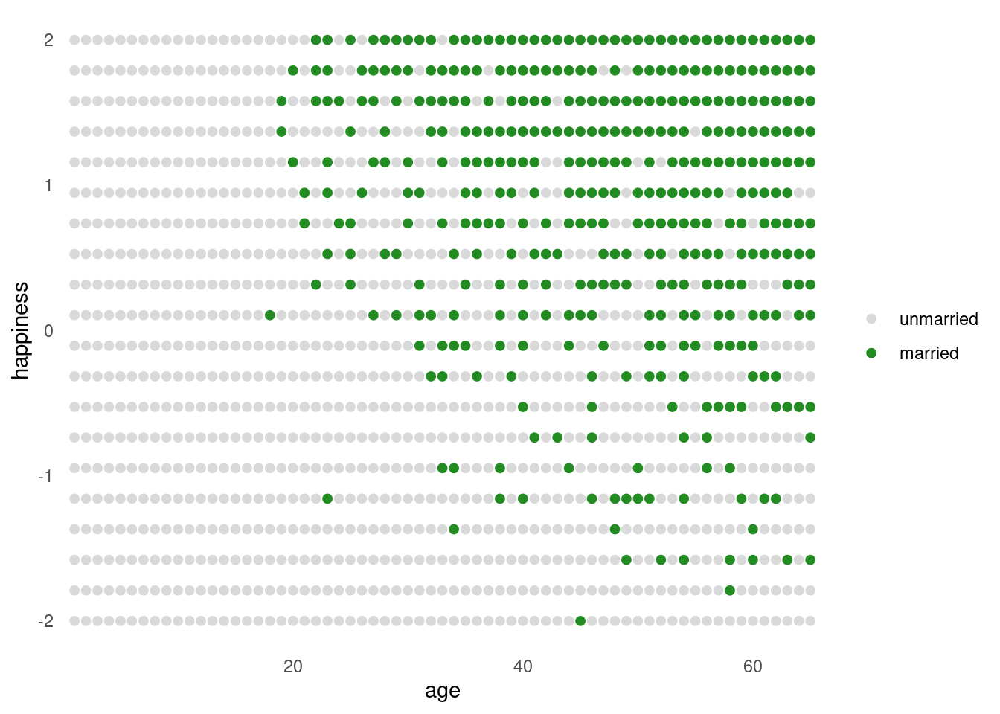
<p class="caption">Figure 6.5</p>
</div>


Rescale age so that the range from 18 to 65 is one unit, i.e. `A` ranges from 0 to 1, where 0 is age 18 and 1 is age 65:


```r
d2 <-
  d %>% 
  filter(age > 17) %>% 
  mutate(a = (age - 18) / (65 - 18))

head(d2)
```

```
##   age married  happiness a
## 1  65       0 -2.0000000 1
## 2  65       0 -1.7894737 1
## 3  65       1 -1.5789474 1
## 4  65       0 -1.3684211 1
## 5  65       0 -1.1578947 1
## 6  65       0 -0.9473684 1
```

Save `mid` as a factor to make the results easier to interpret:


```r
d2 <-
  d2 %>% 
  mutate(mid = factor(married + 1, labels = c("single", "married")))

head(d2)
```

```
##   age married  happiness a     mid
## 1  65       0 -2.0000000 1  single
## 2  65       0 -1.7894737 1  single
## 3  65       1 -1.5789474 1 married
## 4  65       0 -1.3684211 1  single
## 5  65       0 -1.1578947 1  single
## 6  65       0 -0.9473684 1  single
```


Approximate the posterior 

```r
b6.9 <- 
  brm(data = d2, 
      family = gaussian,
      happiness ~ 0 + mid + a,
      prior = c(prior(normal(0, 1), class = b, coef = midmarried),
                prior(normal(0, 1), class = b, coef = midsingle),
                prior(normal(0, 2), class = b, coef = a),
                prior(exponential(1), class = sigma)),
      iter = 2000, warmup = 1000, chains = 4, cores = 4,
      seed = 6,
      file = "fits/b06.09")
```


```r
print(b6.9)
```

```
##  Family: gaussian 
##   Links: mu = identity; sigma = identity 
## Formula: happiness ~ 0 + mid + a 
##    Data: d2 (Number of observations: 960) 
## Samples: 4 chains, each with iter = 2000; warmup = 1000; thin = 1;
##          total post-warmup samples = 4000
## 
## Population-Level Effects: 
##            Estimate Est.Error l-95% CI u-95% CI Rhat Bulk_ESS Tail_ESS
## midsingle     -0.23      0.06    -0.36    -0.11 1.00     1649     2365
## midmarried     1.26      0.09     1.09     1.43 1.00     1665     2341
## a             -0.75      0.11    -0.97    -0.53 1.00     1501     1925
## 
## Family Specific Parameters: 
##       Estimate Est.Error l-95% CI u-95% CI Rhat Bulk_ESS Tail_ESS
## sigma     0.99      0.02     0.95     1.04 1.00     2380     2263
## 
## Samples were drawn using sampling(NUTS). For each parameter, Bulk_ESS
## and Tail_ESS are effective sample size measures, and Rhat is the potential
## scale reduction factor on split chains (at convergence, Rhat = 1).
```


The model is quite sure that age is negatively associated with happiness. We’d like to compare the inferences from this model to a model that omits marriage status:


```r
b6.10 <- 
  brm(data = d2, 
      family = gaussian,
      happiness ~ 0 + Intercept + a,
      prior = c(prior(normal(0, 1), class = b, coef = Intercept),
                prior(normal(0, 2), class = b, coef = a),
                prior(exponential(1), class = sigma)),
      iter = 2000, warmup = 1000, chains = 4, cores = 4,
      seed = 6,
      file = "fits/b06.10")
```


```r
print(b6.10)
```

```
##  Family: gaussian 
##   Links: mu = identity; sigma = identity 
## Formula: happiness ~ 0 + Intercept + a 
##    Data: d2 (Number of observations: 960) 
## Samples: 4 chains, each with iter = 2000; warmup = 1000; thin = 1;
##          total post-warmup samples = 4000
## 
## Population-Level Effects: 
##           Estimate Est.Error l-95% CI u-95% CI Rhat Bulk_ESS Tail_ESS
## Intercept    -0.00      0.08    -0.15     0.15 1.00     1514     1752
## a             0.00      0.13    -0.25     0.25 1.00     1626     2112
## 
## Family Specific Parameters: 
##       Estimate Est.Error l-95% CI u-95% CI Rhat Bulk_ESS Tail_ESS
## sigma     1.22      0.03     1.17     1.27 1.00     2363     1956
## 
## Samples were drawn using sampling(NUTS). For each parameter, Bulk_ESS
## and Tail_ESS are effective sample size measures, and Rhat is the potential
## scale reduction factor on split chains (at convergence, Rhat = 1).
```

>The collider is marriage status. It is a common consequence of age and happiness.

<div class="figure">

<p class="caption">Here's the system. Run a regression where we take happiness. Happiness is the outcome, then the linear model `mu`, the slope `a` which is age. That's the exposure we're interested in. And we know the marriage status, so perhaps we control for that. (No, that's the wrong thing to do, as we'll see.) Created an index variable. Then put that in as a control. We see that single people are less happy. Regression models don't have arrows. It's not in the Bayesian network; that's what the DAG does. `a[2]` is married individuals. Positive `mu`. The slope is solidly negative. But this is a spurious correlation by conditioning on a collider. </p>
</div>


<div class="figure">

<p class="caption">We know that happiness doesn't change and doesn't decline with age, because that's how we coded it. But if we stratify by marriage status, it does. Each point is a person. Each year 20 individuals are born. Happiness is uniformly distributed and constant. Blue filled are married. Starting early on the blue points are only at the top. But over time, indiviuals who are less happy will also get married. By 65, most of the population in the simulation is married.</p>
</div>

 

<div class="figure">

<p class="caption">Now if we draw regression lines, we can see there's a negative correlation. But the distribution of happiness has not changed for anybody.</p>
</div>


<div class="figure">

<p class="caption">If we condition on it, we allow information to flow from age to happiness. In reality we don't know, so we need to use information external to the data. </p>
</div>

***6.3.2. The haunted DAG***

<div class="figure">

<p class="caption">Another example. Colliders are so powerful they can even occur when you haven't measured the confounder. In my subfield, we're interested in allopaternal effects. What is the material benefit of having grandparents? There are resource and information flows, so we want to figure out how important they are. How do you figure this out empirically? Say you have triads, and you're looking at educational outcomes. Indirect path through P, say through books. But also a potential direct effects during say babysitting. But regressions can show that grandparents have a negative effect?</p>
</div>

<div class="figure">

<p class="caption">It's plausible that parents and children share unobserved confounds. Whenever you do observational studies, there are `U`s all over the place. e.g. the neighbourhood you live in. School and neighbourhood effects are really powerful. Makes parents into a collider. So if we condition on parents, it becomes a collider. </p>
</div>

<div class="figure">

<p class="caption">So we simulate this. Assuming that the direct path is 0.</p>
</div>


```r
# how many grandparent-parent-child triads would you like?
n    <- 200 

b_gp <- 1  # direct effect of G on P
b_gc <- 0  # direct effect of G on C
b_pc <- 1  # direct effect of P on C
b_u  <- 2  # direct effect of U on P and C

# simulate triads
set.seed(1)
d <-
  tibble(u = 2 * rbinom(n, size = 1, prob = .5) - 1,
         g = rnorm(n, mean = 0, sd = 1)) %>% 
  mutate(p = rnorm(n, mean = b_gp * g + b_u * u, sd = 1)) %>% 
  mutate(c = rnorm(n, mean = b_pc * p + b_gc * g + b_u * u, sd = 1))

head(d)
```

```
## # A tibble: 6 × 4
##       u       g     p     c
##   <dbl>   <dbl> <dbl> <dbl>
## 1    -1 -0.620  -1.73 -3.65
## 2    -1  0.0421 -3.01 -5.30
## 3     1 -0.911   3.06  3.88
## 4     1  0.158   1.77  3.79
## 5    -1 -0.655  -1.00 -2.01
## 6     1  1.77    5.28  8.87
```


<div class="figure">

<p class="caption">We end up concluding that grandparents hurt their kids. How does this work? Conditioning on a collider opens a path. It's closed by default. This oepns a path from G through U to see, which creates a spurious correlation.</p>
</div>


```r
b6.11 <- 
  brm(data = d, 
      family = gaussian,
      c ~ 0 + Intercept + p + g,
      prior = c(prior(normal(0, 1), class = b),
                prior(exponential(1), class = sigma)),
      iter = 2000, warmup = 1000, chains = 4, cores = 4,
      seed = 6,
      file = "fits/b06.11")
```


```r
print(b6.11)
```

```
##  Family: gaussian 
##   Links: mu = identity; sigma = identity 
## Formula: c ~ 0 + Intercept + p + g 
##    Data: d (Number of observations: 200) 
## Samples: 4 chains, each with iter = 2000; warmup = 1000; thin = 1;
##          total post-warmup samples = 4000
## 
## Population-Level Effects: 
##           Estimate Est.Error l-95% CI u-95% CI Rhat Bulk_ESS Tail_ESS
## Intercept    -0.12      0.10    -0.31     0.07 1.00     3832     3110
## p             1.79      0.04     1.70     1.87 1.00     3508     2925
## g            -0.84      0.11    -1.05    -0.63 1.00     3431     3045
## 
## Family Specific Parameters: 
##       Estimate Est.Error l-95% CI u-95% CI Rhat Bulk_ESS Tail_ESS
## sigma     1.43      0.07     1.30     1.58 1.00     4158     3115
## 
## Samples were drawn using sampling(NUTS). For each parameter, Bulk_ESS
## and Tail_ESS are effective sample size measures, and Rhat is the potential
## scale reduction factor on split chains (at convergence, Rhat = 1).
```


<div class="figure">

<p class="caption">One way to think about this is on the left we have good neighbourhoods in blue. All filled in points are where the parents are in a particular stratum. Why is it negative? Focus only on parents in the narrow range of educational outcomes. Parents in the good neighbourhoods, to be within this range, they must have had less educated grandparents. There are two ways to become a highly-educated parent. Either you are in a good neighbourhood, or you had an educated parent yourself. Each end the P box. </p>
</div>


```r
d %>% 
  mutate(centile = ifelse(p >= quantile(p, prob = .45) & p <= quantile(p, prob = .60), "a", "b"),
         u = factor(u)) %>%
  
  ggplot(aes(x = g, y = c)) +
  geom_point(aes(shape = centile, color = u),
             size = 2.5, stroke = 1/4) +
  stat_smooth(data = . %>% filter(centile == "a"),
              method = "lm", se = F, size = 1/2, color = "black", fullrange = T) +
  scale_shape_manual(values = c(19, 1)) +
  scale_color_manual(values = c("black", "lightblue")) +
  theme(legend.position = "none")
```

```
## `geom_smooth()` using formula 'y ~ x'
```

<div class="figure">

<p class="caption">Figure 6.5</p>
</div>


What can we do about this? We have to measure $U$:


```r
b6.12 <- 
  brm(data = d, 
      family = gaussian,
      c ~ 0 + Intercept + p + g + u,
      prior = c(prior(normal(0, 1), class = b),
                prior(exponential(1), class = sigma)),
      iter = 2000, warmup = 1000, chains = 4, cores = 4,
      seed = 6,
      file = "fits/b06.12")
```


```r
print(b6.12)
```

```
##  Family: gaussian 
##   Links: mu = identity; sigma = identity 
## Formula: c ~ 0 + Intercept + p + g + u 
##    Data: d (Number of observations: 200) 
## Samples: 4 chains, each with iter = 2000; warmup = 1000; thin = 1;
##          total post-warmup samples = 4000
## 
## Population-Level Effects: 
##           Estimate Est.Error l-95% CI u-95% CI Rhat Bulk_ESS Tail_ESS
## Intercept    -0.12      0.07    -0.27     0.02 1.00     2589     2138
## p             1.01      0.07     0.88     1.15 1.00     1415     1980
## g            -0.04      0.10    -0.24     0.16 1.00     1814     2178
## u             1.99      0.15     1.69     2.29 1.00     1395     1949
## 
## Family Specific Parameters: 
##       Estimate Est.Error l-95% CI u-95% CI Rhat Bulk_ESS Tail_ESS
## sigma     1.04      0.05     0.94     1.15 1.00     3001     2545
## 
## Samples were drawn using sampling(NUTS). For each parameter, Bulk_ESS
## and Tail_ESS are effective sample size measures, and Rhat is the potential
## scale reduction factor on split chains (at convergence, Rhat = 1).
```

Now the posterior for $\beta_g$ is hovering around 0, where it belongs. 


```r
b_gc
```

```
## [1] 0
```


And those are the slopes we simulated with.

## Confronting confounding

***6.4.1. Shutting the backdoor***

<div class="figure">

<p class="caption">The back door criterion is that you want to figure out the true causal impact on some outcome, you need to shut all backdoor paths from the treatment to the outcome. We have to shut that arrow off to infer a true causal effect. In experiments you shut all the backdoor paths by randomising. But in observational studies, you want some set of criteria for what variables you should include to shut the paths.</p>
</div>

<div class="figure">

<p class="caption">These are the only ways that variables interact in these graphs. </p>
</div>


```r
slides_dir = here::here("docs/slides/L07")
```


<div class="figure">

<p class="caption">You can solve causal inference by assuming the DAG is true. There is a framework that unites all these examples: the **back-door criterion**. We need to shut all the back door paths into the exposure. There are only really three different ways they can meet in the DAG.</p>
</div>


<div class="figure">

<p class="caption">Break the fork by conditioning on Z. Block the pipe by conditioning on Z. The collider only opens the path if you condition on it. Conditioning on a descendant of a collider is like conditioning on a collider, depending on how strong the relationship is. </p>
</div>


<div class="figure">

<p class="caption">The classic confound involves some exposure $E$. A lot of research goes into understanding what the returns on education are. There are a lot of confounds $U$. How do we de-confound this DAG using the back-door criterion? $E \leftarrow  U \rightarrow W$. How to shut this? It's a fork, and you close it by conditioning on $U$. But here it's unobserved, so we can't condition on it. You therefore can't get an unbiased estimate. But that's an achievement, because we've wasted less time. </p>
</div>


<div class="figure">

<p class="caption">If we want to estimate the direct causal influence from grandparents to kids, we see there are three paths from G to C. If we condition on $P$, that closes the second path through parents. Since that's a pipe, you condition on parents, but that opens the other path, because they're a collider between grandparents and unobserved neighbourhood effects. So we can't get a valid estimate unless we measure it. This is happy news, because we know we're being fooled.</p>
</div>


<div class="figure">

<p class="caption">We want to know the causal effect of $X$ on $Y$. We have an unobserved cause of $X$, then three covariates. What do you need to condition on, and what should you absolutely not condition on? The backdoor criterion is sufficient to figure it out. Find each backdoor path, and figure out which ones to open and close. Just three paths.</p>
</div>

Can get `dagitty` to do it for us:


```r
dag_6.1 <- 
  dagitty::dagitty(
    "dag {
    U [unobserved]
    X -> Y
    X <- U <- A -> C -> Y 
    U -> B <- C
    }"
  )

dagitty::adjustmentSets(dag_6.1, exposure = "X", outcome = "Y")
```

```
## { C }
## { A }
```

Conditioning on either $C$ or $A$ would suffice. Conditioning on $C$ is the better idea, from the perspective of efficiency, since it could also help with the precision of the estimate of $X \rightarrow Y$. 

Now consider the second path, passing through $B$. This path does contain a collider, $U → B ← C$ It is therefore already closed, which is why `adjustmentSets` did not mention $B$.


<div class="figure">

<p class="caption">What should we prefer between A or C? Just pick the one that's measured better. By the way, you need both good estimation, and a causal framework. Both are necessary.</p>
</div>

***6.4.3. Backdoor waffles***

<div class="figure">

<p class="caption">Statistical assocation between Waffle Houses and divorce rate. What do we need to control for to remove spurious causation? Same elemental confounds as before. Backdoor into Waffle Houses through South. What do we have to do to estimate the causal impact of Waffles? Come out the backdoor of Waffle House, and find all the paths to get to D. It's sufficient to condition on A and M too. But it's sufficient to just condition on S.</p>
</div>


```r
dag_6.2 <- 
  dagitty::dagitty(
    "dag {
    A -> D
    A -> M -> D
    A <- S -> M
    S -> W -> D
    }"
  )

dagitty::adjustmentSets(dag_6.2, exposure = "W", outcome = "D")
```

```
## { A, M }
## { S }
```


<div class="figure">

<p class="caption">Good news. There are a number of packages where you give them the DAG, and then you can get it to algorithmically tell you things about the DAG. You can test your DAG, bu inspecting the implied conditional dependencies. The causal structure implies that some things are independent on others. A and W should have no correlation after conditioning on S. It's a fork from S. Parts of the DAG may be wrong. It's a good lesson that the answers require the data, but aren't in the data.</p>
</div>


```r
dagitty::impliedConditionalIndependencies(dag_6.2)
```

```
## A _||_ W | S
## D _||_ S | A, M, W
## M _||_ W | S
```


<div class="figure">

<p class="caption">Hume did more to sort out causal inference than any other thinker. The whole approach of causal inference is Humian. We ahven't solved the problem, but he'd be proud of what we've built. It shows that experiments aren't necessary. We don't need them if we can close the backdoor paths. Often experiments in the human sciences are either impractical or unethical or both. Lots of progress can come from observational studies. Also, interventions influence many variables at once. e.g. experimentally manipulate obsesity. Choosing exercise or diet will affect what you're observing. Huge advantage of observational studies.</p>
</div>


<div class="figure">

<p class="caption">The first alternative uses the existence of a mediator to remove a cofound between an exposure and an outcome. The second is used a lot in behavioural genetics and economics. We'll learn how to use these.</p>
</div>


<div class="figure">

<p class="caption">Shouldn't get cocky. DAGs are heuristic models. Still a lot of residual confounding. You can put measurement error into a DAG. We'll get there near the end. This is important if you're say an anthropologist, half your measurements are error. Phylogenetic trees: big nest of error. Last is that you shouldn't let DAGs stop you from making a real causal model. Physicists don't need DAGs because they have real models, with causal implications. That's what you want to drive towards.</p>
</div>

## Summary

>Multiple regression is no oracle, but only a golem. It is logical, but the relationships it describes are conditional associations, not causal influences. Therefore additional information, from outside the model, is needed to make sense of it. This chapter presented introductory examples of some common frustrations: multicollinearity, post-treatment bias, and collider bias. Solutions to these frustrations can be organized under a coherent framework in which hypothetical causal relations among variables are analyzed to cope with confounding. In all cases, causal models exist outside the statistical model and can be difficult to test. However, it is possible to reach valid causal inferences in the absence of experiments. This is good news, because we often cannot perform experiments, both for practical and ethical reasons.

## Practice

6E1.  List three mechanisms by which multiple regression can produce false inferences about causal effects.

* Multicollinearity
* Post-treatment bias
* Collider bias


