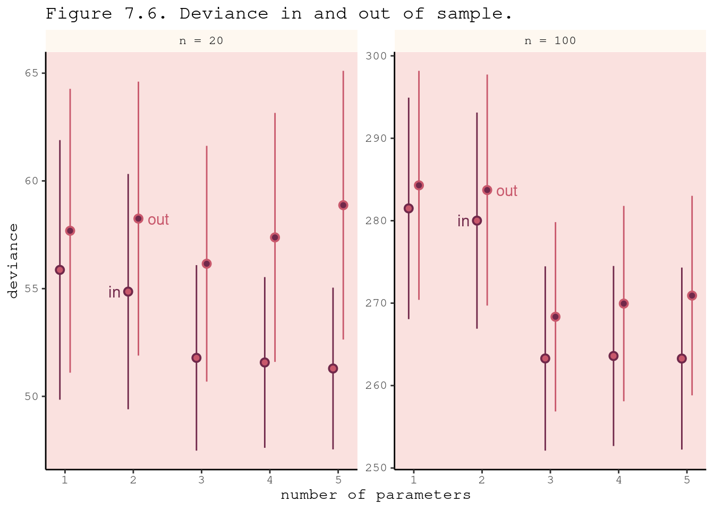

# Ulysses' Compass


```r
library(here)
source(here::here("code/scripts/source.R"))
```


```r
slides_dir = here::here("docs/slides/L07")
```

<div class="figure">

<p class="caption">Polish astronomer and ecclesiastical lawyer. Famous for arguing about the heliocentric model. What's missing is that Copernicus's model was terrible. No better than the Ptolemaic model.</p>
</div>


<div class="figure">

<p class="caption">Keppler later figured out that orbits were ellipses. If you're committed to circles, you can't make it work unless you stack circles on circles. Was an equivalent model. Copernican needed fewer epicricles.. it's simpler, and therefore more beautiful. </p>
</div>


<div class="figure">

<p class="caption">Not a fully-developed research program. Need something more substantial if we wantto chose between models based on complexity.</p>
</div>


<div class="figure">

<p class="caption">Often we have to make trade-offs between complexity and accuracy. Usually what we're trading off. So Ockham's Razor is one-sided. Let's think of _The Odyssey_. He gets near Sicily, and there are two monsters, Scylla and Charybdis, who eat most of his crew.</p>
</div>


<div class="figure">

<p class="caption">Metaphor for how complexity and accuracy trade off. There are monsters on both sides, with different characteristics. </p>
</div>


<div class="figure">

<p class="caption">In the wilds of the sciences, the standard method is "star-gazing", because you run a regression and you keep the asterisks. There's nothing about p-values, but whether you use them or not, they're not designed for this, so they do a bad job at it. Statistical significance is not a criterion about predictive accuracy, but rather Type 1 error rate.</p>
</div>


<div class="figure">

<p class="caption">Scylla and Charybdis. Regularization teaches statistical models to expect overfitting and guard against it. CV and information cirteria are tools to cope with it,  by not solving it, but measuiring it. Want to emphasise that finding a model that makes good predictions is different from causal inference. Netflix predicts your viewing habits. No one understands how those systems work. But in the basic sciences we intend to intervene. </p>
</div>


<div class="figure">

<p class="caption">Think about a contest between different models. In a given race (sample), one horse will win (fit it the best). The distance between the horses gives us information about the relative performance on average across tracks. You want to make a bet on the _next_ race. The quantiative differences between the finishing times is what you want to use. The finishing times won't be exactly the same. What you shouldn't do is alwasy choose the horse that runs the fastest.</p>
</div>

## The problem with parameters

<div class="figure">

<p class="caption">The basic problem is that models that are too simple don't know enough; and models that are too complex learn too much. On the extrmee, you can encrypt every data point as a parameter, but it will make terrible predictions. Want to learn the "regular features" of the sample. Multilevel models don't work like this because they're less liekly to overfit. I have a model with 27K parameters, and it overfits very little because of this hierarchical structure.</p>
</div>

***7.1.1. More parameters (almost) always improve fit***

<div class="figure">

<p class="caption">Humans have big brains. If we look at body mass v brain volume, there is some association. What's the statistical relationship?</p>
</div>


```r
sppnames <- c( "afarensis","africanus","habilis","boisei","rudolfensis","ergaster","sapiens")
brainvolcc <- c( 438 , 452 , 612, 521, 752, 871, 1350 )
masskg <- c( 37.0 , 35.5 , 34.5 , 41.5 , 55.5 , 61.0 , 53.5 )
d <- data.frame( species=sppnames , brain=brainvolcc , mass=masskg )
```


<div class="figure">

<p class="caption">$R^2$ is one of the most over-used measures. If there's no variance in the residuals, $R^2$ = 1. It's trivial to get there. A bit of a joke, but I've seen it in _Nature_.</p>
</div>


```r
d$mass_std <- (d$mass - mean(d$mass))/sd(d$mass)
d$brain_std <- d$brain / max(d$brain)
```


```r
m7.1 <- quap(
  alist(
    brain_std ~ dnorm( mu , exp(log_sigma) ),
    mu <- a + b*mass_std,
    a ~ dnorm( 0.5 , 1 ),
    b ~ dnorm( 0 , 10 ),
    log_sigma ~ dnorm( 0 , 1 )
  ), data=d )
```

I’ve used `exp(log_sigma)` in the likelihood, so that the result is always greater than zero.

---

**Rethinking:**

You could use OLD to get posteriors for these brain size model, e.g. by using `lm`. But you won't get a posterior for `sigma`. 


```r
m7.1_OLS <- lm( brain_std ~ mass_std , data=d )
post <- extract.samples( m7.1_OLS )
```

>Bayesian inference means approximating the posterior distribution. It does not specify how that approximation is done.

---

We'll compute $R^2$ ourselves by computing the variance of the residuals, and the variance of the outcome variable. This means the actual empirical variance, not the variance that R returns with the `var` function, which is a frequentist estimator and therefore has the wrong denominator. So we’ll compute variance the old fashioned way: the average squared deviation from the mean. `rethinking::var2` does this.


```r
set.seed(12)
s <- sim( m7.1 )
r <- apply(s,2,mean) - d$brain_std
resid_var <- var2(r)
outcome_var <- var2( d$brain_std )
1 - resid_var/outcome_var
```

```
## [1] 0.4774589
```

Let's write a function to do this again:


```r
R2_is_bad <- function( quap_fit ) {
  s <- sim( quap_fit , refresh=0 )
  r <- apply(s,2,mean) - d$brain_std
  1 - var2(r)/var2(d$brain_std)
}
```

Now we'll compare 5 models, each just a polynomial of higher degree.


```r
m7.2 <- quap(
  alist(
    brain_std ~ dnorm( mu , exp(log_sigma) ),
    mu <- a + b[1]*mass_std + b[2]*mass_std^2,
    a ~ dnorm( 0.5 , 1 ),
    b ~ dnorm( 0 , 10 ),
    log_sigma ~ dnorm( 0 , 1 )
  ), data=d , start=list(b=rep(0,2)) )
```


```r
m7.3 <- quap(
  alist(
    brain_std ~ dnorm( mu , exp(log_sigma) ),
    mu <- a + b[1]*mass_std + b[2]*mass_std^2 +
      b[3]*mass_std^3,
    a ~ dnorm( 0.5 , 1 ),
    b ~ dnorm( 0 , 10 ),
    log_sigma ~ dnorm( 0 , 1 )
  ), data=d , start=list(b=rep(0,3)) )
  
m7.4 <- quap(
  alist(
    brain_std ~ dnorm( mu , exp(log_sigma) ),
    mu <- a + b[1]*mass_std + b[2]*mass_std^2 +
      b[3]*mass_std^3 + b[4]*mass_std^4,
    a ~ dnorm( 0.5 , 1 ),
    b ~ dnorm( 0 , 10 ),
    log_sigma ~ dnorm( 0 , 1 )
  ), data=d , start=list(b=rep(0,4)) )
  
m7.5 <- quap(
  alist(
    brain_std ~ dnorm( mu , exp(log_sigma) ),
    mu <- a + b[1]*mass_std + b[2]*mass_std^2 +
    b[3]*mass_std^3 + b[4]*mass_std^4 +
      b[5]*mass_std^5,
    a ~ dnorm( 0.5 , 1 ),
    b ~ dnorm( 0 , 10 ),
    log_sigma ~ dnorm( 0 , 1 )
  ), data=d , start=list(b=rep(0,5)) )
```

For the last one we replace the standard deviation with 0.001.


```r
m7.6 <- quap(
  alist(
    brain_std ~ dnorm( mu , 0.001 ),
    mu <- a + b[1]*mass_std + b[2]*mass_std^2 +
      b[3]*mass_std^3 + b[4]*mass_std^4 +
      b[5]*mass_std^5 + b[6]*mass_std^6,
    a ~ dnorm( 0.5 , 1 ),
    b ~ dnorm( 0 , 10 )
  ), data=d , start=list(b=rep(0,6)) )
```


```r
post <- extract.samples(m7.1)
mass_seq <- seq( from=min(d$mass_std) , to=max(d$mass_std) , length.out=100 )
l <- link( m7.1 , data=list( mass_std=mass_seq ) )
mu <- apply( l , 2 , mean )
ci <- apply( l , 2 , PI )
plot( brain_std ~ mass_std , data=d )
lines( mass_seq , mu )
shade( ci , mass_seq )
```


<div class="figure">

<p class="caption">This isn't a bad model. $R^2$ is 0.5 - that's pretty good. But can you do better?</p>
</div>


<div class="figure">

<p class="caption">Sure, make it a parabola. Does a little better. Why stop there?</p>
</div>


<div class="figure">

<p class="caption">We can make it all the way to 6 parameters, then we run out of data points.</p>
</div>


<div class="figure">

<p class="caption">Maybe brain evolution is cubic.</p>
</div>


<div class="figure">

<p class="caption">Finally, we've reached nirvana - the singularity. If all you do basing your model on $R^2$, this is the danger. In multiple regression, it's less obvious that it's happening.</p>
</div>

***7.1.2. Too few parameters hurts, too***

<div class="figure">

<p class="caption">The model is overly sensitive. We can repeat the linear regression, removing one data point at a time. The lines don't move very much. Drops a lot when we drop _homo sapiens_.</p>
</div>


<div class="figure">

<p class="caption">This fifth-order polynomial.</p>
</div>


```r
#d_minus_i <- d[ -i , ]
```

## Entropy and accuracy


<div class="figure">

<p class="caption">Multiple strategies. In Bayesian statistics, we regularise. Can be even omre aggressive. In non-Bayesian, it's mathematically identical to using a prior. Why do machine leanring people regularise? Because it makes better predictions. </p>
</div>


<div class="figure">

<p class="caption">We want to get to CV and WAIC, which replaced AIC. The jounrey to these appraoches requires some setups. First thing to answer is how to measure accuracy. Many bad ways to measure it. There's an actual gold standard. And once we've got it, we want to measure distance from the target. How do we decide how close the models are getting to it? Then we learn how to develop these instruments.</p>
</div>

***7.2.1. Firing the weatherperson***

In defining a target, there are two major dimensions to worry about:

1.  *Cost-benefit analysis*. How much does it cost when we're wrong? How much do we win when we're right? Most scientists never ask these questions in any formal way, but applied scientists must routinely answer them.
2. *Accuracy in context*. Some prediction tasks are inherently easier than others. So even if we ignore costs and benefits, we still need a way to judge "accuracy" that accounts for how much a model could possibly improve prediction.


-----


```r
slides_dir = here::here("docs/slides/L08")
```


<div class="figure">

<p class="caption">We need to appeal to information theory because machine prediction works by following the laws of information theory. We'll drive the single gold-standard way to score a model's accuracy. Here's the basic problem information theory sets out to address. When we have some unknown event, there is uncertainty. When we know more, we become less uncertain. IC is a principle for saying when something is more uncertain than something else. There's uncertainty about the weather tomorrow. We may use cues from today to predict tomorrow.</p>
</div>


<div class="figure">

<p class="caption">Presume you know that LA has no weather. Always sunny. 15-20 degrees. Little uncertainty. If it does rain, you'll be shocked. Contrast this with Glasgow, where it rains a lot. More rain than not. NY has highly-variable weather. There's great uncertainty about what the weather would be like, unlike the other two. This uncertainty arises from the frequency distributions of these microclimates.</p>
</div>

***7.2.2. Information and uncertainty***

The basic insight is to ask: How much is our uncertainty reduced by learning an outcome? 

>Information: The reduction in uncertainty when we learn an outcome.

There are many possible ways to measure uncertainty. The most common way begins by naming some properties a measure of uncertainty should possess. These are the three intuitive desiderata:

1. The measure of uncertainty should be continuous. 

2. The measure of uncertainty should increase as the number of possible events increases.  

3. The measure of uncertainty should be additive.

There is only one function that satisfies these desiderata. This function is usually known as INFORMATION ENTROPY, and has a surprisingly simple definition.

<div class="figure">

<p class="caption">Uncertainty $H$ of $p$, which is a vector of probability, is just the average log-probability of the event. This is a unique criterion. If you want a reasonable measure of surprise, you have to adopt something that is this or something proportional to this. Your mobile phones (3G and above) work because of this.</p>
</div>

***7.2.3. From entropy to accuracy***

How can we use information entropy to say how far a model is from the target? 

> **Divergence**: The additional uncertainty induced by using probabilities from one distribution to describe another distribution.

<div class="figure">

<p class="caption">What's the **potential for surprise**?. We are interested in this. Want to calculate the entropy of our model, and then there's the entropy of the true distribution, of nature. And we want to minimise the difference between them. This is called the $D_{KL}$ divergence. Two probabilities $p$ and $q$. $p$ is nature, say the frequencies of weather events, and $q$ is our forecast. If we want to score $q$, we look at the divergence. K is for Kulbak. The distance from $p$ to $q$ is the sum (averaging) between $p$ and $q$. It's a distance, but it's not symmetric. </p>
</div>


<div class="figure">

<p class="caption">Easy to code. Take the vector `p`. Sum `p` time the difference between `log(p)` and `log(q)`. It's only 0 where `q = p`. </p>
</div>

Compute the information entropy for the weather:


```r
p <- c( 0.3 , 0.7 )
-sum( p*log(p) )
```

```
## [1] 0.6108643
```

Suppose instead we live in Abu Dhabi. Then the probabilities of rain and shine might be more like 
$p_1 = 0.01 $ and $p_2 = 0.99$. Now the entropy would be approximately 0.06. Why has the uncertainty decreased? Because in Abu Dhabi it hardly ever rains. Therefore there’s much less uncertainty about any given day, compared to a place in which it rains 30% of the time. It’s in this way that information entropy measures the uncertainty inherent in a distribution of events. Similarly, if we add another kind of event to the distribution—forecasting into winter, so also predicting snow—entropy tends to increase, due to the added dimensionality of the prediction problem. 

<div class="figure">

<p class="caption">Here's a cartoon version. You're heading to Mars, or a Mars-like planet, but you don't know much about it. You can't control your rocket and you want to predict whether you'll land on water or land. You'll use Earth as your only model. Earth is a high-entropy planet because it has a lot of water and land. So you won't be surprised whether you get land or water. </p>
</div>


<div class="figure">

<p class="caption">But say you're going in the other direction. Your potential for surprise is now very high. When you get to Earth and discover all this blue liquid, you'll be surprised. Mars is the LA of planets. And as a consequence, the information distance from Earth to Mars is smaller than the information distance from Mars to Earth. Because if your model is the Earth, it expects all sorts of events, which means that it's less surprised, which means that its prediction error is lower, on average, across a huge number of potential planets across the universe, than if you came from Mars, where you'll be surprised by water all the time. **This is why simpler models work better - because they have higher entropy.** The distance between a simpler model and other things are on average lower, because it expects many things. Gneeralized linear models have higher entropy. All machine learning works this way.</p>
</div>

***7.2.4. Estimating divergence***

<div class="figure">

<p class="caption">How to estimate this in practice: we want the gold standard way to score, but the problem is we can't score the truth. Turns out we don't need the truth part because it's just an additive term, so you can get the relative scores of the models without knowning the truth. THe log score is the gold standard, whether you're Bayesian or not. In practice, there's not a single log score, but a distribution of log scores. So we want the average log score, which unfortunately is called the *log-pointwise-predictive-density*. For each point `i`, we're taking the average probability of that observation conditional on the samples, and we average over the samples, and find the average probabiltiy that the model expects, then we take the log and sum across all observations in the model.</p>
</div>

>This kind of score is a log-probability score, and it is the gold standard way to compare the predictive accuracy of different models. It is an estimate of $E\ log(q_i)$, just without the final step of dividing by the number of observations.

Compute lppd for the first model we fit in this chapter:


```r
set.seed(1)
rethinking::lppd( m7.1 , n=1e4 ) 
```

```
## [1]  0.6098669  0.6483439  0.5496093  0.6234934  0.4648143  0.4347605 -0.8444632
```

Larger values are better, because that indicates larger average accuracy.


```r
set.seed(1)
logprob <- sim( m7.1 , ll=TRUE , n=1e4 )
n <- ncol(logprob)
ns <- nrow(logprob)
f <- function( i ) log_sum_exp( logprob[,i] ) - log(ns)
( lppd <- sapply( 1:n , f ) )
```

```
## [1]  0.6098669  0.6483439  0.5496093  0.6234934  0.4648143  0.4347605 -0.8444632
```


<div class="figure">

<p class="caption">Why does this all matter in a practical sense? We can measure overfitting. Look at the difference between in- and out-of-sample. Smaller is better. The more negative it is, the better it is. Two samples from the same generative process. Training and testing set. Fit our model to the training sample, and get the deviance of train. Then we force it to predict the out-of-sample. The difference between them are our measure of overfitting.</p>
</div>


<div class="figure">

<p class="caption">We'll generate some samples based on a known "truth". The first is our intercept model. </p>
</div>

***7.2.5. Scoring the right data***

Let’s compute the log-score for each of the models from earlier in this chapter:


```r
set.seed(1) 
sapply( list(m7.1,m7.2,m7.3,m7.4,m7.5,m7.6) , function(m) sum(lppd(m)) )
```

```
## [1]  2.490390  2.566165  3.707343  5.333750 14.090061 39.445390
```

The more complex models have larger scores, but it is really the score on new data that interests us.


<div class="figure">

<p class="caption">This is what happens in-sample. Lower deviance is better. The point is the average across all simulations, with one standard deviation on either side. Note the more complicated models do better. They're always going to fit in-sample better. Note there's a big jump at 3, then very little after 3. </p>
</div>


<div class="figure">

<p class="caption">Here's out-of-sample. Unsurprisingly, everything does worse out-of-sample. There's a pattern to the amount of overfitting. You can see that model 3 is best on average. Models 4 and 5 get progressively worse, because they're fitting noise. </p>
</div>


<div class="figure">

<p class="caption">In anthropology we're happy with 20. But with N = 100, you can more precisely estimate when a data point doesn't matter. So 4 and 5 are only slightly worse. Because you can get a really good posterior distribution. But they pattern is the same. There's a very special pattern in the distances between these points. On the left, you can see the distances are growing, and approximately twice the number of parameters in each case. Hold that in your mind.</p>
</div>


```r
# Note: this takes ages to run, so I reduced the number of samples from 1e4 to 1e3 
N <- 20
kseq <- 1:5
dev <- sapply( kseq , function(k) {
    print(k);
    r <- replicate( 1000 , rethinking::sim_train_test( N=N, k=k ) );
    c( mean(r[1,]) , mean(r[2,]) , sd(r[1,]) , sd(r[2,]) )
  } )
```


Parallelize the simulations by replacing the replicate line with:


```r
# Note: doesn't seem to work
r <- mcreplicate( 1e4 , sim_train_test( N=N, k=k ) , mc.cores=2 )
```


```r
# Add variables again
N <- 20
kseq <- 1:5

plot( 1:5 , dev[1,] , ylim=c( min(dev[1:2,])-5 , max(dev[1:2,])+10 ) ,
  xlim=c(1,5.1) , xlab="number of parameters" , ylab="deviance" ,
  pch=16 , col=rangi2 )
mtext( concat( "N = ",N ) )
points( (1:5)+0.1 , dev[2,] )
for ( i in kseq ) {
  pts_in <- dev[1,i] + c(-1,+1)*dev[3,i]
  pts_out <- dev[2,i] + c(-1,+1)*dev[4,i]
  lines( c(i,i) , pts_in , col=rangi2 )
  lines( c(i,i)+0.1 , pts_out )
}
```



## Golem taming: regularization

The root of overfitting is a model’s tendency to get overexcited by the training sample. When the priors are flat or nearly flat, the machine interprets this to mean that every parameter value is equally plausible. 

One way to prevent a model from getting too excited by the training sample is to use a skeptical prior. By “skeptical,” I mean a prior that slows the rate of learning from the sample.

<div class="figure">

<p class="caption">The first thing to do is regularize. We don't want to use flat priors. We have to be skeptical. We have to build scepticism into the models. Choose priors that only give us possible outcomes. That helps to regularise - to reduce overfitting. </p>
</div>


<div class="figure">

<p class="caption">The model on the left is the linear regression model. We're going to use different standard deviations to deduce different amounts of skeptisism to large effects. SD of 0.2 is the very peaked one. Which of these will be best?</p>
</div>


<div class="figure">

<p class="caption">On average, how did they do in-sample? The more sceptical prior does worse.</p>
</div>


<div class="figure">

<p class="caption">But out of sample, it's the opposite. Why? Because it learns less from the sample. It's skeptical. Out of sample, it predicts best because it ignored irregular distractions. Now in any particular problem the pattern might be different. Too skeptical and you can overshoot. But some scepticism helps you make good predictions. That's why you should never use flat priors. Even slightly curved and you'll do better. The order is the same, but the differences are tiny. Because if you have enough data, the regularisation isnt' doing any heavy work for you. But for a small sample, regularization does a lot. With multi-level models, we have to revisit, because even in really big smaple sizes there are some parameters with not big datasets.</p>
</div>


<div class="figure">

<p class="caption">In industry, there's a lot of regularisation, because they're scored on it. But they do care about predictive accuracy. Why do scientists care less? Maybe because we're not taught to. Functionally, it makes getting significant results harder. Maybe the biggest thing is that we're not judged on the accuracy of future predictions. We don't have a strong philosophy on how it's connected to inference.</p>
</div>

## Predicting predictive accuracy

<div class="figure">

<p class="caption">If we regularize correctly, we'll do better out-of-sample. We can actually predict the amount of overfitting, even when you don't have the out-of-sample. This is all small-world stuff, so be sceptical, but it gives us a principled way of talking about a model in terms of its overfitting risk. </p>
</div>

***7.4.1. Cross-validation***

<div class="figure">

<p class="caption">If you do this across lots of left-out bits from your sample, that turns out to be a really good approximation of your model. These prediction contests in industry. Motivated this on Monday talking about under- vs over-fitted model. There's a LOOCV function for `quap`. Huge literature about how many to leave out. But the general idea is to use this. </p>
</div>

The key trouble with leave-one-out cross-validation is that, if we have 1000 observations, that means computing 1000 posterior distributions. That can be time consuming. Luckily, there are clever ways to approximate the cross-validation score without actually running the model over and over again. One approach is to use the “importance” of each observation to the posterior distribution. What “importance” means here is that some observations have a larger impact on the posterior distribution—if we remove an important observation, the posterior changes more. Other observations have less impact. It is a benign aspect of the universe that this importance can be estimated without refitting the model. *The key intuition is that an observation that is relatively unlikely is more important than one that is relatively expected.*

<div class="figure">

<p class="caption">These days you have too many data points. Really good analytical approximations, like Pareto-smoothed. Incredibly accurate. Pareto-smoothed is useful because you get a lot of diagnostic information.</p>
</div>

***7.4.2. Information criteria***

<div class="figure">

<p class="caption">Other approach, stemming from Akaike. To get an analytical approximation, a lot of assumptions are made, including that you need a Gaussian distribution. If that's true, you can get a really nice approxiatmion of the performance of the log score out-of-sample. Just the training deviance time twice th enumber of parameters. Incredible acheivement.</p>
</div>


<div class="figure">

<p class="caption">It has since been eclipsed. Another theoretical statistician has developed this new, more capable version. This thing looks complicated, but lppd is the Bayesian distance, and the penalty term on the right is the point-wise variance of the log probability of each observation. That's the generalised parameter count you want. This works for anything. Turns out in general the parameter count isn't what matters, rather the variance in the posterior distribution. And for models with flat priors and Gaussian distributions, it gives you the same value as AIC. But in general we won't use flat priors, and it often has interesting information.</p>
</div>

To see how WAIC works:

Consider a simple regression fit with `quap`: 


```r
data(cars)
m <- quap(
  alist(
    dist ~ dnorm(mu,sigma),
    mu <- a + b*speed,
    a ~ dnorm(0,100),
    b ~ dnorm(0,10),
    sigma ~ dexp(1)
  ) , data=cars )
set.seed(94)
post <- extract.samples(m,n=1000)
```

Get the log-likelihood of each observation $i$ at each sample $s$ from the posterior:


```r
n_samples <- 1000
logprob <- sapply( 1:n_samples ,
  function(s) {
    mu <- post$a[s] + post$b[s]*cars$speed
    dnorm( cars$dist , mu , post$sigma[s] , log=TRUE )
  } )
```

You end up with a 50-by-1000 matrix of log-likelihoods, with observations in rows and samples in columns. Now to compute lppd, the Bayesian deviance, we average the samples in each row, take the log, and add all of the logs together. However, to do this with precision, we need to do all of the averaging on the log scale. This is made easy with a function `log_sum_exp`, which computes the log of a sum of exponentiated terms. Then we can just subtract the log of the number of samples. This computes the log of the average.


```r
n_cases <- nrow(cars)
lppd <- sapply( 1:n_cases , function(i) log_sum_exp(logprob[i,]) - log(n_samples) )
```


```r
pWAIC <- sapply( 1:n_cases , function(i) var(logprob[i,]) )
```

And `sum(pWAIC)` returns pWAIC, as defined in the main text. To compute WAIC:


```r
-2*( sum(lppd) - sum(pWAIC) )
```

```
## [1] 423.3188
```


```r
waic_vec <- -2*( lppd - pWAIC )
sqrt( n_cases*var(waic_vec) )
```

```
## [1] 17.81797
```

***7.4.3. Comparing CV, PSIS, and WAIC***

<div class="figure">

<p class="caption">Now we'll score them on their error. All are trying to estimate the prediction error. So how close do they get? Top are flat priors. Open circles and the actual generalisation errors. Each trend line is a different metric for calculating it. WAIC is getting closer, but the differences are really small. LOOIC is a really good approximation. At the bottom we have regularising priors. Everything does better, but the differences are about the same. Unit difference on the vertical is tiny.</p>
</div>


<div class="figure">

<p class="caption">Target we're trying to get is the out-of-sample error. These differences are tiny. All of these things work amazingly well.</p>
</div>


<div class="figure">

<p class="caption">When samples are large, they all work identically.</p>
</div>

## Model comparison

Road so far:

* When there are several plausible (and hopefully un-confounded) models for the same set of observations, how should we compare the accuracy of these models?
* We need to somehow evaluate models out-of-sample. How can we do that? A meta-model of forecasting tells us two important things. First, flat priors produce bad predictions. Regularizing priors—priors which are skeptical of extreme parameter values—reduce fit to sample but tend to improve predictive accuracy. 
* Second, we can get a useful guess of predictive accuracy with the criteria CV, PSIS, and WAIC. Regularizing priors and CV/PSIS/WAIC are complementary. Regularization reduces overfitting, and predictive criteria measure it.

You should never just keep the model that scores the best, and discard the rest. This kind of selection procedure discards the information about relative model accuracy contained in the differences among the CV/PSIS/WAIC values. Why are the differences useful? Because sometimes the differences are large and sometimes they are small. Just as relative posterior probability provides advice about how confident we might be about parameters (conditional on the model), relative model accuracy provides advice about how confident we might be about models (conditional on the set of models compared).

<div class="figure">

<p class="caption">Avoid model selection. We want to score the expected overfitting models to understand their properties. In the sciences we usually have an inferential objective, rather than a predictive one. But if you intend to intervene in the world, then we don't want to use these criteria to select a model, but rather to compare them.</p>
</div>

***7.5.1. Model mis-selection***

Remember: Inferring cause and making predictions are different tasks. Cross-validation and WAIC aim to find models that make good predictions.

Run models from previous chapter again:


```r
set.seed(71)
# number of plants
N <- 100

# simulate initial heights
h0 <- rnorm(N,10,2)

# assign treatments and simulate fungus and growth
treatment <- rep( 0:1 , each=N/2 )
fungus <- rbinom( N , size=1 , prob=0.5 - treatment*0.4 )
h1 <- h0 + rnorm(N, 5 - 3*fungus)

# compose a clean data frame
d <- data.frame( h0=h0 , h1=h1 , treatment=treatment , fungus=fungus )
precis(d)
```

```
##               mean        sd      5.5%    94.5%    histogram
## h0         9.95978 2.1011623  6.570328 13.07874 ▁▂▂▂▇▃▂▃▁▁▁▁
## h1        14.39920 2.6880870 10.618002 17.93369     ▁▁▃▇▇▇▁▁
## treatment  0.50000 0.5025189  0.000000  1.00000   ▇▁▁▁▁▁▁▁▁▇
## fungus     0.23000 0.4229526  0.000000  1.00000   ▇▁▁▁▁▁▁▁▁▂
```

```r
m6.6 <- quap(
  alist(
    h1 ~ dnorm( mu , sigma ),
    mu <- h0*p,
    p ~ dlnorm( 0 , 0.25 ),
    sigma ~ dexp( 1 )
  ), data=d )
precis(m6.6)
```

```
##           mean         sd     5.5%    94.5%
## p     1.426628 0.01759834 1.398503 1.454754
## sigma 1.792106 0.12496794 1.592383 1.991829
```

```r
m6.7 <- quap(
  alist(
    h1 ~ dnorm( mu , sigma ),
    mu <- h0 * p,
    p <- a + bt*treatment + bf*fungus,
    a ~ dlnorm( 0 , 0.2 ) ,
    bt ~ dnorm( 0 , 0.5 ),
    bf ~ dnorm( 0 , 0.5 ),
    sigma ~ dexp( 1 )
  ), data=d )
precis(m6.7)
```

```
##              mean         sd        5.5%       94.5%
## a      1.48139094 0.02451068  1.44221815  1.52056373
## bt     0.00241255 0.02986963 -0.04532488  0.05014998
## bf    -0.26671805 0.03654770 -0.32512833 -0.20830777
## sigma  1.40879638 0.09862052  1.25118174  1.56641102
```

```r
m6.8 <- quap(
  alist(
    h1 ~ dnorm( mu , sigma ),
    mu <- h0 * p,
    p <- a + bt*treatment,
    a ~ dlnorm( 0 , 0.2 ),
    bt ~ dnorm( 0 , 0.5 ),
    sigma ~ dexp( 1 )
  ), data=d )
precis(m6.8)
```

```
##             mean         sd       5.5%     94.5%
## a     1.38035157 0.02517700 1.34011386 1.4205893
## bt    0.08499494 0.03429912 0.03017831 0.1398116
## sigma 1.74641704 0.12193300 1.55154456 1.9412895
```


```r
set.seed(11)
WAIC( m6.7 )
```

```
##       WAIC      lppd penalty  std_err
## 1 361.4511 -177.1724  3.5532 14.17035
```


<div class="figure">

<p class="caption">Smaller numbers are better, so the top model is 6.7 that includes the fungus. Can probably see the difference here. The fungus is what's causal. Inference about cause and finding a predictive model aren't the same thing. So you need to do both, but keep in mind that they're different. Because you haven't necessarily inferred a cause if you have good prediction error, because you might have blocked a pipe. Even spurious correlations are useful. The confounding really matters when you want to intervene. The highest preditive model won't necessary predict what will happen when you intervene. </p>
</div>


```r
set.seed(77)
rethinking::compare( m6.6 , m6.7 ,m6.8 , func=WAIC )
```

```
##          WAIC       SE    dWAIC      dSE    pWAIC       weight
## m6.7 361.8901 14.26191  0.00000       NA 3.839493 1.000000e+00
## m6.8 402.7753 11.28120 40.88517 10.47814 2.645589 1.324032e-09
## m6.6 405.9174 11.66153 44.02729 12.23018 1.582861 2.751664e-10
```


```r
set.seed(91)
waic_m6.7 <- WAIC( m6.7 , pointwise=TRUE )$WAIC
waic_m6.8 <- WAIC( m6.8 , pointwise=TRUE )$WAIC
n <- length(waic_m6.7)
diff_m6.7_m6.8 <- waic_m6.7 - waic_m6.8
sqrt( n*var( diff_m6.7_m6.8 ) )
```

```
## [1] 10.35785
```


```r
40.0 + c(-1,1)*10.4*2.6
```

```
## [1] 12.96 67.04
```


```r
plot( rethinking::compare( m6.6 , m6.7 , m6.8 ) )
```


```r
set.seed(92)
waic_m6.6 <- WAIC( m6.6 , pointwise=TRUE )$WAIC
diff_m6.6_m6.8 <- waic_m6.6 - waic_m6.8
sqrt( n*var( diff_m6.6_m6.8 ) )
```

```
## [1] 4.858914
```


```r
set.seed(93)
rethinking::compare( m6.6 , m6.7 , m6.8 )@dSE
```

```
##           m6.6     m6.7      m6.8
## m6.6        NA 12.20638  4.934353
## m6.7 12.206380       NA 10.426576
## m6.8  4.934353 10.42658        NA
```

***7.5.2. Outliers and other illusions***

In the divorce example from Chapter 5, we saw in the posterior predictions that a few States were very hard for the model to retrodict. The State of Idaho in particular was something of an outlier. Individual points like Idaho tend to be very influential in ordinary regression models. Let’s see how PSIS and WAIC represent that importance.


```r
library(rethinking)
data(WaffleDivorce)
d <- WaffleDivorce
d$A <- standardize( d$MedianAgeMarriage )
d$D <- standardize( d$Divorce )
d$M <- standardize( d$Marriage )

m5.1 <- quap(
  alist(
    D ~ dnorm( mu , sigma ) ,
    mu <- a + bA * A ,
    a ~ dnorm( 0 , 0.2 ) ,
    bA ~ dnorm( 0 , 0.5 ) ,
    sigma ~ dexp( 1 )
  ) , data = d )
  
m5.2 <- quap(
  alist(
    D ~ dnorm( mu , sigma ) ,
    mu <- a + bM * M ,
    a ~ dnorm( 0 , 0.2 ) ,
    bM ~ dnorm( 0 , 0.5 ) ,
    sigma ~ dexp( 1 )
  ) , data = d )
  
m5.3 <- quap(
  alist(
    D ~ dnorm( mu , sigma ) ,
    mu <- a + bM*M + bA*A ,
    a ~ dnorm( 0 , 0.2 ) ,
    bM ~ dnorm( 0 , 0.5 ) ,
    bA ~ dnorm( 0 , 0.5 ) ,
    sigma ~ dexp( 1 )
  ) , data = d )
```

Let's compare these models with PSIS


```r
set.seed(24071847)
rethinking::compare( m5.1 , m5.2 , m5.3 , func=PSIS )
```

```
## Some Pareto k values are high (>0.5). Set pointwise=TRUE to inspect individual points.
## Some Pareto k values are high (>0.5). Set pointwise=TRUE to inspect individual points.
```

```
## Some Pareto k values are very high (>1). Set pointwise=TRUE to inspect individual points.
```

```
##          PSIS       SE     dPSIS       dSE    pPSIS       weight
## m5.1 127.5665 14.69485  0.000000        NA 4.671425 0.8340176286
## m5.3 130.8062 16.15696  3.239685  1.808671 6.578663 0.1650769863
## m5.2 141.2178 11.56557 13.651299 10.923820 4.057204 0.0009053851
```

First note that the model that omits marriage rate, m5.1, lands on top. This is because marriage rate has very little association with the outcome. So the model that omits it has slightly better expected out-of-sample performance, even though it actually fits the sample slightly worse than m5.3, the model with both predictors. 

`Some Pareto k values are very high (>1).` means that the smoothing approximation that PSIS uses is unreliable for some points.

Let’s look at the individual States, to see which are causing the problem. We can do this by adding `pointwise=TRUE` to PSIS. When you do this, you get a matrix with each observation on a row and the PSIS information, including individual Pareto k values, in columns. 


```r
set.seed(24071847)
PSIS_m5.3 <- PSIS(m5.3,pointwise=TRUE)
```

```
## Some Pareto k values are very high (>1). Set pointwise=TRUE to inspect individual points.
```

```r
set.seed(24071847)
WAIC_m5.3 <- WAIC(m5.3,pointwise=TRUE)
plot( PSIS_m5.3$k , WAIC_m5.3$penalty , xlab="PSIS Pareto k" ,
  ylab="WAIC penalty" , col=rangi2 , lwd=2 )
```


One way to both use these extreme observations and reduce their influence is to employ some kind of ROBUST REGRESSION. A “robust regression” can mean many different things, but usually it indicates a linear model in which the influence of extreme observations is reduced. A common and useful kind of robust regression is to replace the Gaussian model with a thicker-tailed distribution like STUDENT’S T (or “Student-t”) distribution.

Let’s re-estimate the divorce model using a Student-t distribution with $v = 2$.


```r
m5.3t <- quap(
  alist(
    D ~ dstudent( 2 , mu , sigma ) ,
    mu <- a + bM*M + bA*A ,
    a ~ dnorm( 0 , 0.2 ) ,
    bM ~ dnorm( 0 , 0.5 ) ,
    bA ~ dnorm( 0 , 0.5 ) ,
    sigma ~ dexp( 1 )
  ) , data = d )

PSIS(m5.3t)
```

```
##       PSIS      lppd  penalty  std_err
## 1 133.7104 -66.85521 6.845203 11.94534
```


<div class="figure">

<p class="caption">Incredibly clever and diabolical. Interested in life history evolution. Something to understand by looking at the whole field. Here's a dataset to consider. Why does lifespan vary so much? A typcial kind of conceptual model is this idea that body mass = fewer things kill you = living longer. And brain size = smart = avoiding danger. Should also season your DAG with some unobserved confounds.</p>
</div>


<div class="figure">

<p class="caption">After you remove all the missing values, you get three models. The first is the industry standard m7.8 everyone expects to be the right prediction model. WIf we wnat ot figure out the infleucne of brainsize on lifespan, we need to block the backdoor path on body mass. Black dots are the in-sample, and open are the WAIC scores. Bars are standard errors. 7.8 and 7.9 are basically equivalent in their out-of-sample predictions. When you see something like this, you should see this as an invitiation to poke inside them. You can use IC to do that poiking.</p>
</div>


<div class="figure">

<p class="caption">bM is the slope for body mass, and bB is the slope for brain size. 7.9 only has bM, and says there's a positive correlation. The model with both has this catastrophic flipping. Now bM is negative? What's going on here? </p>
</div>


<div class="figure">

<p class="caption">The thing to do here is to do WAIC point-wise. For each species in the sample, say the Capuchin monkey which has those life history characteristics, which model expects to do the best out-of-sample on organisms with those same covariates? Or you could think about it as entropy scores, or divergence scores, to say how surprised is this model by a Capuchin monkey? The relative surprise between these models is plotted. </p>
</div>


<div class="figure">

<p class="caption">The model with brain + mass does better with Capuchins because they have small brains, but they're really big for their body size. So if you don't control for body size, you can't explain their longevity. So the model without body size is really surprised by Cebus. Lepilemur on the other extreme with small brains and extremely short lifespans, where you'd be surprised if you ignore body size.</p>
</div>


<div class="figure">

<p class="caption">On the other hand, for these you can make fine predictions by knowing body size. So you can understand how they perform if you look point-wise. This is a principled way to inspect and understand your golem. Also a way to find your high-leverage points.</p>
</div>


## Practice


