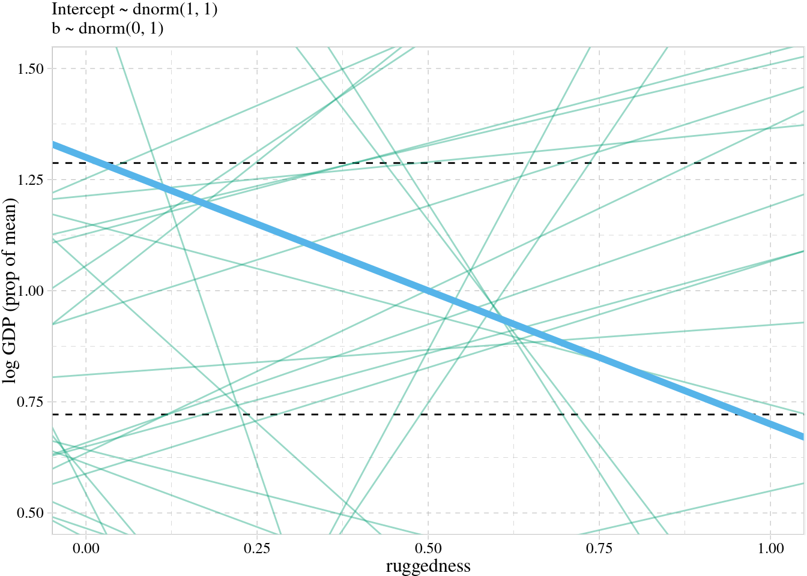
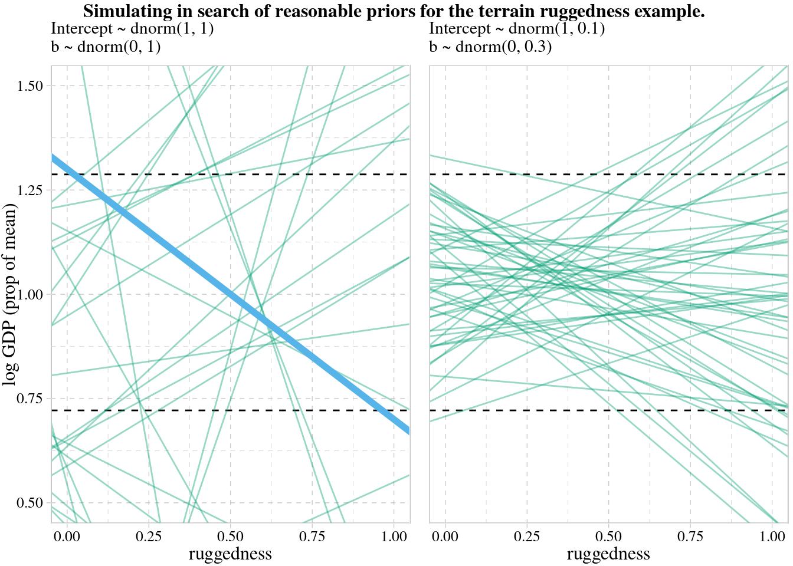
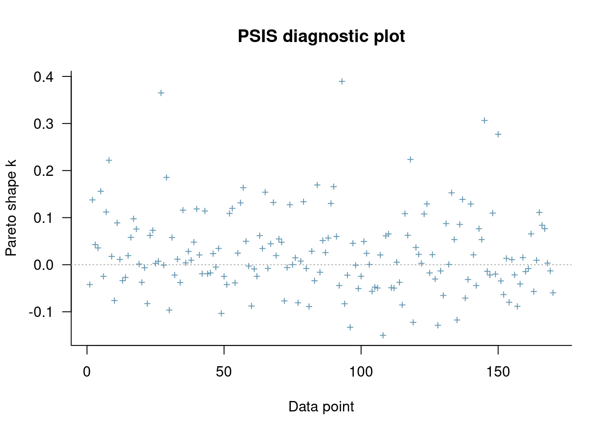
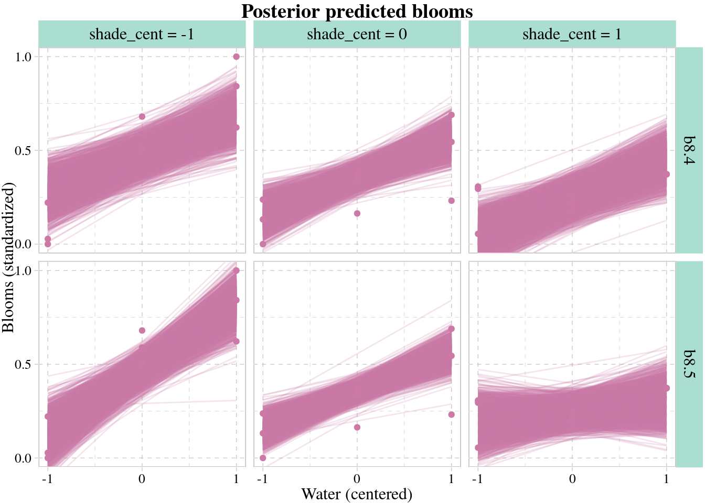

# Conditional Manatees


```r
library(here)
source(here::here("code/scripts/source.R"))
```


```r
slides_dir = here::here("docs/slides/L09")
```


<div class="figure">

<p class="caption">There are things in the universe that really are dichotomous -- they either happen or they don't. Tests for them work really nicely. How many animals do you see? Tests for most congenital forms of colour-blindness. Most of what we do in statistics is unfortuantely like this. Most outcomes are continuous. </p>
</div>

<div class="figure">

<p class="caption">This is why there are no tests in this course. When you do that you're making a decision way too early. Stop testing and start thinking. There are a bunch of off-the-shelf tools that have value. But eventually in your research you have to do better than off-the-shelf. You need to make it bespoke. We want besoke models and risk analyses. Your analysis needs to be bespoke to the problem at hand. It's ethically irresponsible to do anything else.</p>
</div>

<div class="figure">

<p class="caption">Here's an example. NY is getting pummelled wih blizzards right now. In Jan '15, there was a prediction of a catastrophic blizzard. The city was shut down. But the blizzard didn't come and everyone was mad. But it was the right thing to do.</p>
</div>

<div class="figure">

<p class="caption">Why did they shut it down? They relied on a forecast. Their forecast was way more extreme. What do you do if you're a responsible public servant? </p>
</div>

<div class="figure">

<p class="caption">Accuracy always matters, but it's not the only thing that matters. When you make a decision, you have to take into account the costs and benefits of each course of action. Even though it was a tail probability that it could have been that bad, if it was, it would have been catastrophic. You may need to plan for the extreme events in case many people die.</p>
</div>

<div class="figure">

<p class="caption">This is a manatee. Related to an elephant. Gentle vegetarian mermaid. The only natural predator it has is the speedboat. This is quite common to manatees in Florida, where a lot of people own speedboats. Probably more manatees than not have these sorts of scars. Florida has gone to a lot of effort to avoid this. Now you can put a cage around the blades. It turns out that hasn't helped at all, for an interesting reason statistically. Rotors mainly don't kill manatees -- the keel does. You see manatees with rotor scars is because it doesn't kill them. Then you don't show up in the sample.</p>
</div>

<div class="figure">

<p class="caption">Same information structure with WWII bombers. They're a workhorse bomber.</p>
</div>

<div class="figure">

<p class="caption"> As the war dragged on, metal came in short supply. They wanted to up-armour the bombers. The RAF asked the statistician to look at the damage pattern and figure out where to put the armour. You need to armour selectively to avoid weighing the whole thing down. So what's the most crucial place? The intuition was to put the armour where the damage was. Wald went for the opposite, because he didn't condition on this collider. None of the planes that made it back had holes in the cockpit or engine. So he recommended up-armouring the parts with the least damage.</p>
</div>

<div class="figure">

<p class="caption">The variable we've conditioned on is survival. Selection bias. It opens the path... the rotor damage confounds survival. This is very common when there are multiple things that can affect these outcomes.</p>
</div>

<div class="figure">

<p class="caption">We need to grow up our models. Everything we do is about conditioning. Everything is conditional. Today we'll work on how the influence of some variable is conditional on other variables. We'll build it in because nature is additive.</p>
</div>

<div class="figure">

<p class="caption">Here are some natural examples. In GLMs there necessarily are interactions.</p>
</div>

<div class="figure">

<p class="caption">DAGs are totally heuristic. They're not enough to make accurate predictions; they're tools to help you understand confound risk, and figure out a deconfounding strategy if one exists. </p>
</div>

<div class="figure">

<p class="caption">On the left is a hypothetical and completely ridiculous example. Like what we've looked at so far, where there are independent additive terms. If there's sugar in there, they interact. On the right is a fanciful representation that captures that relationship.</p>
</div>

## Building an interaction

<div class="figure">

<p class="caption">Economics of Africa. Africa is really really big. A lot of diversity - economies, language, environment - makes it interesting because it creates a lot of natural experiments.</p>
</div>

<div class="figure">

<p class="caption">There's a feature of the terrain which is ruggedness, which is bad becasuse it makes it hard to move things. On the right is normalised. 0 is perfectly flat, 1 is Lesotho, the world's most rugged place. Kind of like Switzerland. Really strong negative relationship with GDP. But in Africa, the relationship goes in the other direction. Removing outliers doesn't remove the difference between the continents. So what's going on?</p>
</div>


```r
data(rugged, package = "rethinking")
d <- rugged
rm(rugged)

theme_set(
  ggthemes::theme_pander() +
    theme(text = element_text(family = "Times"),
          panel.background = element_rect(color = "black")) 
)
```

Wrangle the data

```r
# make the log version of criterion
d <- 
  d %>%
  mutate(log_gdp = log(rgdppc_2000))

# extract countries with GDP data
dd <-
  d %>%
  filter(complete.cases(rgdppc_2000)) %>% 
  # re-scale variables
  mutate(log_gdp_std = log_gdp / mean(log_gdp), 
         rugged_std  = rugged / max(rugged))
```


```r
# African nations
p1 <-
  dd %>% 
  filter(cont_africa == 1) %>% 
  ggplot(aes(x = rugged_std, y = log_gdp_std)) +
  geom_smooth(method = "lm", formula = y ~ x,
              fill = ggthemes::palette_pander(n = 2)[1],
              color = ggthemes::palette_pander(n = 2)[1]) +
  geom_point(color = ggthemes::palette_pander(n = 2)[1]) +
  geom_text_repel(data = . %>% 
                    filter(country %in% c("Lesotho", "Seychelles")),  
                  aes(label = country), 
                  size = 3, family = "Times", seed = 8) +
  labs(subtitle = "African nations",
       x = "ruggedness (standardized)",
       y = "log GDP (as proportion of mean)")

# Non-African nations
p2 <-
  dd %>% 
  filter(cont_africa == 0) %>% 
  ggplot(aes(x = rugged_std, y = log_gdp_std)) +
  geom_smooth(method = "lm", formula = y ~ x,
              fill = ggthemes::palette_pander(n = 2)[2],
              color = ggthemes::palette_pander(n = 2)[2]) +
  geom_point(color = ggthemes::palette_pander(n = 2)[2]) +
  geom_text_repel(data = . %>% 
                    filter(country %in% c("Switzerland", "Tajikistan")),  
                  aes(label = country), 
                  size = 3, family = "Times", seed = 8) +
  xlim(0, 1) +
  labs(subtitle = "Non-African nations",
       x = "ruggedness (standardized)",
       y = "log GDP (as proportion of mean)")

# combine
p1 + p2 + plot_annotation(title = "Figure 8.2. Separate linear regressions inside and outside of Africa")
```


```r
mean(dd$rugged_std)
```

```
## [1] 0.2149601
```

Make a mean-centered version of `rugged_std`.

```r
dd <-
  dd %>%
  mutate(rugged_std_c  = rugged_std - mean(rugged_std))
```


Remember that using $\bar{r}$ just makes it easier to assign a prior to the intercept $\alpha$.

Consider first the intercept, $\alpha$, defined as the log GDP when ruggedness is at the sample mean. So it must be close to 1, because we scaled the outcome so that the mean is 1. 

Now for $\beta$, the slope. If we center it on zero, that indicates no bias for positive or negative, which makes sense. But what about the standard deviation? Let’s start with a guess at 1.

And finally, let’s assign $\sigma$ something very broad, $\sigma \sim Exponential(1)$.


```r
b8.1 <-
  brm(data = dd, 
      family = gaussian,
      log_gdp_std ~ 1 + rugged_std_c,
      prior = c(prior(normal(1, 1), class = Intercept),
                prior(normal(0, 1), class = b),
                prior(exponential(1), class = sigma)),
      iter = 2000, warmup = 1000, chains = 4, cores = 4,
      seed = 8,
      sample_prior = T, # allows us to use `prior_samples()`
      file = "fits/b08.01")
```


<div class="figure">

<p class="caption">We want to develop priors that constrain pre-data the outcomes to the possible outcome space. We've scaled the outcome between 0 and 1. Then I've taken log GDP, and scaled it in proportion to the average. 1.5 is 50% more. Think about doubling the economy - that would be a huge effect. The dashed lines are the world's GDPs. We've centered at 1 for the average GDP. We simulate priors and we get chaos. At least on the right you can stay within the world's possible economies.</p>
</div>

Let's look at the prior predictions:


```r
prior <- brms::prior_samples(b8.1)

set.seed(8)

p1 <-
  prior %>% 
  slice_sample(n = 50) %>% 
  rownames_to_column() %>% 
  expand(nesting(rowname, Intercept, b),
         rugged_std_c = c(-2, 2)) %>% 
  mutate(log_gdp_std = Intercept + b * rugged_std_c,
         rugged_std  = rugged_std_c + mean(dd$rugged_std)) %>% 
  
  ggplot(aes(x = rugged_std, y = log_gdp_std, group = rowname)) +
  geom_hline(yintercept = range(dd$log_gdp_std), linetype = 2) +
  geom_line(color = ggthemes::palette_pander(n = 2)[2], alpha = .4) +
  geom_abline(intercept = 1.3, slope = -0.6,
              color = ggthemes::palette_pander(n = 2)[1], size = 2) +
  labs(subtitle = "Intercept ~ dnorm(1, 1)\nb ~ dnorm(0, 1)",
       x = "ruggedness",
       y = "log GDP (prop of mean)") +
  coord_cartesian(xlim = c(0, 1),
                  ylim = c(0.5, 1.5))

p1
```




```r
prior %>%
  summarise(a = sum(abs(b) > abs(-0.6)) / nrow(prior))
```

```
##         a
## 1 0.55725
```


```r
b8.1b <-
  brm(data = dd, 
      family = gaussian,
      log_gdp_std ~ 1 + rugged_std_c,
      prior = c(prior(normal(1, 0.1), class = Intercept),
                prior(normal(0, 0.3), class = b),
                prior(exponential(1), class = sigma)),
      iter = 2000, warmup = 1000, chains = 4, cores = 4,
      seed = 8,
      sample_prior = T,
      file = "fits/b08.01b")
```


```r
set.seed(8)

p2 <-
  prior_samples(b8.1b) %>% 
  slice_sample(n = 50) %>% 
  rownames_to_column() %>% 
  expand(nesting(rowname, Intercept, b),
         rugged_std_c = c(-2, 2)) %>% 
  mutate(log_gdp_std = Intercept + b * rugged_std_c,
         rugged_std  = rugged_std_c + mean(dd$rugged_std)) %>% 
  
  ggplot(aes(x = rugged_std, y = log_gdp_std, group = rowname)) +
  geom_hline(yintercept = range(dd$log_gdp_std), linetype = 2) +
  geom_line(color = palette_pander(n = 2)[2], alpha = .4) +
  scale_y_continuous("", breaks = NULL) +
  labs(subtitle = "Intercept ~ dnorm(1, 0.1)\nb ~ dnorm(0, 0.3)",
       x = "ruggedness") +
  coord_cartesian(xlim = c(0, 1),
                  ylim = c(0.5, 1.5))

p1 + p2 + 
  plot_annotation(title = "Simulating in search of reasonable priors for the terrain ruggedness example.",
                  theme = theme(plot.title = element_text(size = 12)))
```

<div class="figure">

<p class="caption">Figure 8.3</p>
</div>


```r
print(b8.1b)
```

```
##  Family: gaussian 
##   Links: mu = identity; sigma = identity 
## Formula: log_gdp_std ~ 1 + rugged_std_c 
##    Data: dd (Number of observations: 170) 
## Samples: 4 chains, each with iter = 2000; warmup = 1000; thin = 1;
##          total post-warmup samples = 4000
## 
## Population-Level Effects: 
##              Estimate Est.Error l-95% CI u-95% CI Rhat Bulk_ESS Tail_ESS
## Intercept        1.00      0.01     0.98     1.02 1.00     4316     2983
## rugged_std_c     0.00      0.06    -0.11     0.12 1.00     3677     2896
## 
## Family Specific Parameters: 
##       Estimate Est.Error l-95% CI u-95% CI Rhat Bulk_ESS Tail_ESS
## sigma     0.14      0.01     0.12     0.15 1.00     3938     3028
## 
## Samples were drawn using sampling(NUTS). For each parameter, Bulk_ESS
## and Tail_ESS are effective sample size measures, and Rhat is the potential
## scale reduction factor on split chains (at convergence, Rhat = 1).
```


Really no overall association between terrain ruggedness and log GDP. Next we’ll see how to split apart the continents.

***8.1.2. Adding an indicator variable isn't enough***


```r
# make variable to index Africa (1) or not (2)
dd <- 
  dd %>% 
  mutate(cid = if_else(cont_africa == 1, "1", "2"))
```

Note we're suppressing the default intercept via the `0 + ...` syntax.

```r
b8.2 <-
  brm(data = dd, 
      family = gaussian,
      log_gdp_std ~ 0 + cid + rugged_std_c,
      prior = c(prior(normal(1, 0.1), class = b, coef = cid1),
                prior(normal(1, 0.1), class = b, coef = cid2),
                prior(normal(0, 0.3), class = b, coef = rugged_std_c),
                prior(exponential(1), class = sigma)),
      iter = 2000, warmup = 1000, chains = 4, cores = 4,
      seed = 8,
      file = "fits/b08.02")
```


```r
b8.1b <- add_criterion(b8.1b, "waic")
b8.2 <- add_criterion(b8.2, "waic")

brms::loo_compare(b8.1b, b8.2, criterion = "waic") %>%
  print(simplify = F)
```

```
##       elpd_diff se_diff elpd_waic se_elpd_waic p_waic se_p_waic waic   se_waic
## b8.2     0.0       0.0   126.1       7.4          4.1    0.8    -252.3   14.8 
## b8.1b  -31.7       7.3    94.4       6.5          2.6    0.3    -188.8   13.0
```


```r
model_weights(b8.1b, b8.2, weights = "waic") %>% round(digits = 3)
```

```
## b8.1b  b8.2 
##     0     1
```


```r
print(b8.2)
```

```
##  Family: gaussian 
##   Links: mu = identity; sigma = identity 
## Formula: log_gdp_std ~ 0 + cid + rugged_std_c 
##    Data: dd (Number of observations: 170) 
## Samples: 4 chains, each with iter = 2000; warmup = 1000; thin = 1;
##          total post-warmup samples = 4000
## 
## Population-Level Effects: 
##              Estimate Est.Error l-95% CI u-95% CI Rhat Bulk_ESS Tail_ESS
## cid1             0.88      0.02     0.85     0.91 1.00     4089     2944
## cid2             1.05      0.01     1.03     1.07 1.00     4491     2987
## rugged_std_c    -0.05      0.05    -0.14     0.04 1.00     3484     2736
## 
## Family Specific Parameters: 
##       Estimate Est.Error l-95% CI u-95% CI Rhat Bulk_ESS Tail_ESS
## sigma     0.11      0.01     0.10     0.13 1.00     3981     3176
## 
## Samples were drawn using sampling(NUTS). For each parameter, Bulk_ESS
## and Tail_ESS are effective sample size measures, and Rhat is the potential
## scale reduction factor on split chains (at convergence, Rhat = 1).
```


```r
post <- 
  brms::posterior_samples(b8.2) %>% 
  mutate(diff = b_cid1 - b_cid2)

library(tidybayes)

qi(post$diff, .width = .89)
```

```
##            [,1]       [,2]
## [1,] -0.2004941 -0.1370836
```

The difference is reliably below zero.


```r
nd <- 
  crossing(cid        = 1:2,
           rugged_std = seq(from = -0.2, to = 1.2, length.out = 30)) %>% 
  mutate(rugged_std_c = rugged_std - mean(dd$rugged_std))

f <-
  fitted(b8.2, 
         newdata = nd,
         probs = c(.015, .985)) %>%
  data.frame() %>%
  bind_cols(nd) %>%
  mutate(cont_africa = ifelse(cid == 1, "Africa", "not Africa"))

# what did we do?
head(f)
```

```
##    Estimate  Est.Error      Q1.5     Q98.5 cid   rugged_std rugged_std_c
## 1 0.8999853 0.02380766 0.8493229 0.9514257   1 -0.200000000   -0.4149601
## 2 0.8977392 0.02231333 0.8501207 0.9451827   1 -0.151724138   -0.3666842
## 3 0.8954931 0.02093972 0.8501513 0.9397260   1 -0.103448276   -0.3184083
## 4 0.8932469 0.01971208 0.8517471 0.9355161   1 -0.055172414   -0.2701325
## 5 0.8910008 0.01865925 0.8511358 0.9314925   1 -0.006896552   -0.2218566
## 6 0.8887547 0.01781224 0.8504140 0.9274236   1  0.041379310   -0.1735808
##   cont_africa
## 1      Africa
## 2      Africa
## 3      Africa
## 4      Africa
## 5      Africa
## 6      Africa
```


```r
dd %>%
  mutate(cont_africa = ifelse(cont_africa == 1, "Africa", "not Africa")) %>%
  
  ggplot(aes(x = rugged_std, fill = cont_africa, color = cont_africa)) +
  geom_smooth(data = f,
              aes(y = Estimate, ymin = Q1.5, ymax = Q98.5),
              stat = "identity",
              alpha = 1/4, size = 1/2) +
  geom_point(aes(y = log_gdp_std),
             size = 2/3) +
  scale_fill_pander() +
  scale_colour_pander() +
  labs(subtitle = "b8.2",
       x = "ruggedness (standardized)",
       y = "log GDP (as proportion of mean)") +
  coord_cartesian(xlim = c(0, 1)) +
  theme(legend.background = element_blank(),
        legend.direction = "horizontal",
        legend.position = c(.67, .93),
        legend.title = element_blank())
```

<div class="figure">

<p class="caption">Figure 8.4</p>
</div>


<div class="figure">

<p class="caption">These two plots come from splitting the data. This is cheating, because now you have no statistical criterion on which to evaluate the split. Need to estimate both of the lines in the same model. DOn't split it yourself - let the model split it and tell you how compelling it is.</p>
</div>


<div class="figure">

<p class="caption">Using an index variable that is continent ID. 1 means Africa, 2 means not Africa. Can do it for each continent. Different $\alpha$ for each continent. Now you can assign the same prior to all of the continents. We run the model and get the graphs on the right. The intercepts now have changed, and African countries are depressed relative to non-African countries.</p>
</div>

***8.1.3. Adding an interaction does work***

This just means making the slope conditional on continent.


<div class="figure">

<p class="caption">Just add the index variable to the slope. Now we have a separete slope for ecah continent. Centered the GDP so that the intercept makes sense. </p>
</div>


<div class="figure">

<p class="caption">Here are the marginal posterior distributions. Index of 1 means Africa, 2 means not Africa. Average GDP is lower. At the mean ruggedness, in the world, an African country has 90% of the average GDP in the sample. How does GDP change? It's postivie for AFrican countries `b[1]`, and `b[2]` is negative. Basically the same magnitude.</p>
</div>


```r
b8.3 <- 
  brm(data = dd, 
      family = gaussian,
      bf(log_gdp_std ~ 0 + a + b * rugged_std_c, 
         a ~ 0 + cid, 
         b ~ 0 + cid,
         nl = TRUE),
      prior = c(prior(normal(1, 0.1), class = b, coef = cid1, nlpar = a),
                prior(normal(1, 0.1), class = b, coef = cid2, nlpar = a),
                prior(normal(0, 0.3), class = b, coef = cid1, nlpar = b),
                prior(normal(0, 0.3), class = b, coef = cid2, nlpar = b),
                prior(exponential(1), class = sigma)),
      iter = 2000, warmup = 1000, chains = 4, cores = 4,
      seed = 8,
      file = "fits/b08.03")
```


<div class="figure">

<p class="caption">Now they're from the same model. Looks the same. The slope on the left is less certain. Compatibility bowtie is bigger because there are fewer African countries. </p>
</div>

<div class="figure">

<p class="caption">Here we're just looking at two categories, but it can get confusing quickly, especially if you don't center the variables. Need to plot to understand. **Whenever you have an interaction, the impact of a change in one predictor depends on more that one parameter.** So you can't look at a single row and guess what the effect is of changing things. You need them all. This is why plotting is so essential.</p>
</div>


```r
print(b8.3)
```

```
##  Family: gaussian 
##   Links: mu = identity; sigma = identity 
## Formula: log_gdp_std ~ 0 + a + b * rugged_std_c 
##          a ~ 0 + cid
##          b ~ 0 + cid
##    Data: dd (Number of observations: 170) 
## Samples: 4 chains, each with iter = 2000; warmup = 1000; thin = 1;
##          total post-warmup samples = 4000
## 
## Population-Level Effects: 
##        Estimate Est.Error l-95% CI u-95% CI Rhat Bulk_ESS Tail_ESS
## a_cid1     0.89      0.02     0.86     0.92 1.00     4808     3274
## a_cid2     1.05      0.01     1.03     1.07 1.00     6227     3439
## b_cid1     0.13      0.08    -0.02     0.28 1.00     5023     2991
## b_cid2    -0.14      0.06    -0.25    -0.03 1.00     4639     2559
## 
## Family Specific Parameters: 
##       Estimate Est.Error l-95% CI u-95% CI Rhat Bulk_ESS Tail_ESS
## sigma     0.11      0.01     0.10     0.12 1.00     4913     2940
## 
## Samples were drawn using sampling(NUTS). For each parameter, Bulk_ESS
## and Tail_ESS are effective sample size measures, and Rhat is the potential
## scale reduction factor on split chains (at convergence, Rhat = 1).
```


```r
b8.1b <- add_criterion(b8.1b, "loo")
b8.2 <- add_criterion(b8.2, "loo")
b8.3 <- add_criterion(b8.3, c("loo", "waic"))

brms::loo_compare(b8.1b, b8.2, b8.3, criterion = "loo") %>%
  print(simplify = F)
```

```
##       elpd_diff se_diff elpd_loo se_elpd_loo p_loo  se_p_loo looic  se_looic
## b8.3     0.0       0.0   129.6      7.3         5.0    0.9   -259.2   14.7  
## b8.2    -3.5       3.2   126.1      7.4         4.1    0.8   -252.2   14.8  
## b8.1b  -35.2       7.5    94.4      6.5         2.6    0.3   -188.8   13.0
```

Get the LOO weights

```r
model_weights(b8.1b, b8.2, b8.3, weights = "loo") %>% round(digits = 2)
```

```
## b8.1b  b8.2  b8.3 
##  0.00  0.03  0.97
```


Model family b8.3 has more than 95% of the weight. That’s very strong support for including the interaction effect, if prediction is our goal. But the modicum of weight given to `m8.2` suggests that the posterior means for the slopes in `m8.3` are a little overfit.


```r
loo(b8.3) %>% 
  plot()
```




***8.1.4. Plotting the interaction***


```r
countries <- c("Equatorial Guinea", "South Africa", "Seychelles", "Swaziland", "Lesotho", "Rwanda", "Burundi", "Luxembourg", "Greece", "Switzerland", "Lebanon", "Yemen", "Tajikistan", "Nepal")

f <-
  fitted(b8.3, 
         # we already defined `nd`, above
         newdata = nd,
         probs = c(.015, .985)) %>%
  data.frame() %>%
  bind_cols(nd) %>%
  mutate(cont_africa = ifelse(cid == 1, "African nations", "Non-African nations"))

dd %>%
  mutate(cont_africa = ifelse(cont_africa == 1, "African nations", "Non-African nations")) %>%
  
  ggplot(aes(x = rugged_std, y = log_gdp_std, fill = cont_africa, color = cont_africa)) +
  geom_smooth(data = f,
              aes(y = Estimate, ymin = Q1.5, ymax = Q98.5),
              stat = "identity",
              alpha = 1/4, size = 1/2) +
  geom_text_repel(data = . %>% filter(country %in% countries),  
                  aes(label = country), 
                  size = 3, seed = 8, 
                  segment.color = "grey25", min.segment.length = 0) +
  geom_point(aes(y = log_gdp_std),
             size = 2/3) +
  scale_fill_pander() +
  scale_colour_pander() +
  labs(x = "ruggedness (standardized)",
       y = "log GDP (as proportion of mean)") +
  coord_cartesian(xlim = c(0, 1)) +
  theme(legend.position = "none") +
  facet_wrap(~ cont_africa)
```

<div class="figure">

<p class="caption">Figure 8.4</p>
</div>

## Symmetry of interactions

A simple interaction model contains two symmetrical interpretations. Absent some other information, outside the model, there’s no logical basis for preferring one over the other.

<div class="figure">

<p class="caption">There's a causal symmetry to them. You can't tell the difference. Only way is to use your scientific knowledge. You're bringing in your extra knowledge with the first interpretation. In the statstical model, the second is the same, but it doesn't make sense because a country can't switch continents.</p>
</div>


```r
fitted(b8.3, 
       newdata = nd,
       summary = F) %>%
  data.frame() %>%
  pivot_longer(everything()) %>% 
  bind_cols(expand(nd,
                   iter = 1:4000,
                   nesting(cid, rugged_std))) %>% 
  dplyr::select(-name) %>% 
  pivot_wider(names_from = cid, values_from = value) %>% 
  mutate(delta = `1` - `2`) %>% 
  
  ggplot(aes(x = rugged_std, y = delta)) +
  stat_lineribbon(.width = .95, fill = palette_pander(n = 8)[8], alpha = 3/4) +
  geom_hline(yintercept = 0, linetype = 2) +
  annotate(geom = "text",
           x = .2, y = 0,
           label = "Africa higher GDP\nAfrica lower GDP",
           family = "Times") +
  labs(x = "ruggedness (standardized)",
       y = "expected difference log GDP") +
  coord_cartesian(xlim = c(0, 1),
                  ylim = c(-0.3, 0.2))
```

<div class="figure">

<p class="caption">Figure 8.6</p>
</div>


<div class="figure">

<p class="caption">Now this is trying to predict the effect of moving a country to a different continent. y-axis is expected improvement if we move the nation to Africa. At low ruggedness you expect it to hurt the economy, but at high ruggedness you expect it to help it. We can see that this interpretation is causally ridiculous. But the model doesn't see them as different things. The reason this is confusing is because there is causal information in your head. You want to interpret the variables in certain ways.</p>
</div>

## Continuous interactions

Interpretation is much harder with continuous variables, even though the mathematics of the model are essentially the same.

***8.3.1. A winter flower***


```r
data(tulips, package = "rethinking")
d <- tulips
rm(tulips)

glimpse(d)
```

```
## Rows: 27
## Columns: 4
## $ bed    <fct> a, a, a, a, a, a, a, a, a, b, b, b, b, b, b, b, b, b, c, c, c, …
## $ water  <int> 1, 1, 1, 2, 2, 2, 3, 3, 3, 1, 1, 1, 2, 2, 2, 3, 3, 3, 1, 1, 1, …
## $ shade  <int> 1, 2, 3, 1, 2, 3, 1, 2, 3, 1, 2, 3, 1, 2, 3, 1, 2, 3, 1, 2, 3, …
## $ blooms <dbl> 0.00, 0.00, 111.04, 183.47, 59.16, 76.75, 224.97, 83.77, 134.95…
```

***8.3.2. The models***


```r
d <-
  d %>% 
  mutate(blooms_std = blooms / max(blooms),
         water_cent = water - mean(water),
         shade_cent = shade - mean(shade))
```


Now `blooms_std` ranges from 0 to 1, and both water_cent and shade_cent range from −1 to 1. I’ve scaled blooms by its maximum observed value, for three reasons. First, the large values on the raw scale will make optimization difficult. Second, it will be easier to assign a reasonable prior this way. Third, we don’t want to standardize blooms, because zero is a meaningful boundary we want to preserve.

<div class="figure">

<p class="caption">Now here both predictors are continuous. Basically works the same way, but much harder to think about. Experimental example but works the same in observationals. 3 variables of interest plus the experimental block which you want to control for. We're going to leave out `block` and add that in later. Three levels of water and shade, with the outcome bloom area. </p>
</div>

<div class="figure">

<p class="caption">They're categorical, but in principle they're continuous. This is the conventional form of the interaction. When you add an interaction of continous variables, you multiply the predictors and add a third coefficient. First is to understand why this happens. </p>
</div>

<div class="figure">

<p class="caption">Here is the conventional form on top. </p>
</div>

<div class="figure">

<p class="caption">It means we replace one of these slopes with another linear model. Now $W$ will be the centered version, as with $S$ for shade. We've replaced the $\beta$ coefficient in front of water level with $\gamma$, and $\gamma$ isn't a parameter but a linear model. Another one. We can have as many as we want. And this linear model now tells us the slope. And the slope has two parameters in it. One is the ordinary slope, $\beta_W$, and the other $\beta_{WS}$, is the interaction. That parameter measures the marginal effect of changing shade on the impact of water. So we're directly assuming that the effect of water depends on shade. And we make the submodel, which is linear because we're still in geocentric world. </p>
</div>

<div class="figure">

<p class="caption">It doesnt' matter which one you pick, you get the same equation. Basically, this is where it comes from - assuming I want the association of each with the outcome to be dependent on the other's value, so let's make a linear model of that. Liek a regression within a regression. </p>
</div>

<div class="figure">

<p class="caption">Let's fit this. Contrasting one with and without an interaction. Main effect of water, main effect of shade. With priors. But we've already got the problem of how to visualise this.</p>
</div>


```r
set.seed(8)

tibble(a = rnorm(1e4, mean = 0.5, sd = 1)) %>% 
  summarise(proportion_outside_of_the_range = sum(a < 0 | a > 1) / n())
```

```
## # A tibble: 1 × 1
##   proportion_outside_of_the_range
##                             <dbl>
## 1                           0.621
```

If it’s 0.5 units from the mean to zero, then a standard deviation of 0.25 should put only 5% of the mass outside the valid internal. Let’s see:


```r
set.seed(8)

tibble(a = rnorm(1e4, mean = 0.5, sd = 0.25)) %>% 
  summarise(proportion_outside_of_the_range = sum(a < 0 | a > 1) / n())
```

```
## # A tibble: 1 × 1
##   proportion_outside_of_the_range
##                             <dbl>
## 1                          0.0501
```

Much better.

Ranges for the two predictors:

```r
range(d$water_cent)
```

```
## [1] -1  1
```

```r
range(d$shade_cent)
```

```
## [1] -1  1
```


```r
b8.4 <-
  brm(data = d, 
      family = gaussian,
      blooms_std ~ 1 + water_cent + shade_cent,
      prior = c(prior(normal(0.5, 0.25), class = Intercept),
                prior(normal(0, 0.25), class = b, coef = water_cent),
                prior(normal(0, 0.25), class = b, coef = shade_cent),
                prior(exponential(1), class = sigma)),
      iter = 2000, warmup = 1000, chains = 4, cores = 4,
      seed = 8,
      file = "fits/b08.04")
```


```r
print(b8.4)
```

```
##  Family: gaussian 
##   Links: mu = identity; sigma = identity 
## Formula: blooms_std ~ 1 + water_cent + shade_cent 
##    Data: d (Number of observations: 27) 
## Samples: 4 chains, each with iter = 2000; warmup = 1000; thin = 1;
##          total post-warmup samples = 4000
## 
## Population-Level Effects: 
##            Estimate Est.Error l-95% CI u-95% CI Rhat Bulk_ESS Tail_ESS
## Intercept      0.36      0.03     0.29     0.43 1.00     4448     2585
## water_cent     0.20      0.04     0.12     0.28 1.00     4299     2788
## shade_cent    -0.11      0.04    -0.20    -0.03 1.00     4390     3062
## 
## Family Specific Parameters: 
##       Estimate Est.Error l-95% CI u-95% CI Rhat Bulk_ESS Tail_ESS
## sigma     0.18      0.03     0.13     0.24 1.00     3063     2786
## 
## Samples were drawn using sampling(NUTS). For each parameter, Bulk_ESS
## and Tail_ESS are effective sample size measures, and Rhat is the potential
## scale reduction factor on split chains (at convergence, Rhat = 1).
```


Now with the interaction:


```r
b8.5 <-
  brm(data = d, 
      family = gaussian,
      blooms_std ~ 1 + water_cent + shade_cent + water_cent:shade_cent,
      prior = c(prior(normal(0.5, 0.25), class = Intercept),
                prior(normal(0, 0.25), class = b, coef = water_cent),
                prior(normal(0, 0.25), class = b, coef = shade_cent),
                prior(normal(0, 0.25), class = b, coef = "water_cent:shade_cent"),
                prior(exponential(1), class = sigma)),
      iter = 2000, warmup = 1000, chains = 4, cores = 4,
      seed = 8,
      file = "fits/b08.05")
```


```r
print(b8.5)
```

```
##  Family: gaussian 
##   Links: mu = identity; sigma = identity 
## Formula: blooms_std ~ 1 + water_cent + shade_cent + water_cent:shade_cent 
##    Data: d (Number of observations: 27) 
## Samples: 4 chains, each with iter = 2000; warmup = 1000; thin = 1;
##          total post-warmup samples = 4000
## 
## Population-Level Effects: 
##                       Estimate Est.Error l-95% CI u-95% CI Rhat Bulk_ESS
## Intercept                 0.36      0.03     0.30     0.41 1.00     4147
## water_cent                0.21      0.03     0.14     0.27 1.00     4603
## shade_cent               -0.11      0.03    -0.18    -0.04 1.00     4625
## water_cent:shade_cent    -0.14      0.04    -0.22    -0.06 1.00     4689
##                       Tail_ESS
## Intercept                 2853
## water_cent                2752
## shade_cent                2673
## water_cent:shade_cent     2968
## 
## Family Specific Parameters: 
##       Estimate Est.Error l-95% CI u-95% CI Rhat Bulk_ESS Tail_ESS
## sigma     0.14      0.02     0.11     0.19 1.00     3304     2710
## 
## Samples were drawn using sampling(NUTS). For each parameter, Bulk_ESS
## and Tail_ESS are effective sample size measures, and Rhat is the potential
## scale reduction factor on split chains (at convergence, Rhat = 1).
```


***8.3.3. Plotting posterior predictions***


<div class="figure">

<p class="caption">Related frames that tell a bigger story. Going to have graphs in triptych form. Nothing binding you to only three, but that's the minimum. You can do 20 if you think that's necessary.</p>
</div>


```r
# augment the data
points <-
  d %>%
  expand(fit = c("b8.4", "b8.5"),
         nesting(shade_cent, water_cent, blooms_std)) %>%
  mutate(x_grid = str_c("shade_cent = ", shade_cent),
         y_grid = fit)

# redefine `nd`
nd <- crossing(shade_cent = -1:1, 
               water_cent = c(-1, 1))

# use `fitted()`
set.seed(8)

rbind(fitted(b8.4, newdata = nd, summary = F, ndraws = 20),
      fitted(b8.5, newdata = nd, summary = F, ndraws = 20)) %>%
  # wrangle
  data.frame() %>%
  set_names(mutate(nd, name = str_c(shade_cent, water_cent, sep = "_")) %>% pull()) %>%
  mutate(row = 1:n(),
         fit = rep(c("b8.4", "b8.5"), each = n() / 2)) %>%
  pivot_longer(-c(row:fit), values_to = "blooms_std") %>%
  separate(name, into = c("shade_cent", "water_cent"), sep = "_") %>%
  mutate(shade_cent = shade_cent %>% as.double(),
         water_cent = water_cent %>% as.double()) %>%
  # these will come in handy for `ggplot2::facet_grid()`
  mutate(x_grid = str_c("shade_cent = ", shade_cent),
         y_grid = fit) %>%
  
  # plot!
  ggplot(aes(x = water_cent, y = blooms_std)) +
  geom_line(aes(group = row),
            color = palette_pander(n = 6)[6], alpha = 1/5, size = 1/2) +
  geom_point(data = points,
             color = palette_pander(n = 6)[6]) +
  scale_x_continuous("Water (centered)", breaks = c(-1, 0, 1)) +
  scale_y_continuous("Blooms (standardized)", breaks = c(0, .5, 1)) +
  ggtitle("Posterior predicted blooms") +
  coord_cartesian(xlim = c(-1, 1),
                  ylim = c(0, 1)) +
  theme(strip.background = element_rect(fill = alpha(palette_pander(n = 2)[2], 1/3))) +
  facet_grid(y_grid ~ x_grid)
```

<div class="figure">

<p class="caption">Figure 8.8</p>
</div>

***8.3.4. Plotting prior predictions***


<div class="figure">

<p class="caption">Here's the triptych for the prior predictions Just showing you that the outcomes are staying within the legal range. Don't want to predict negative outcomes. I'd make them even tighter. The black lines come from the same sample from the prior distribution. The slope is always the same, because there's no interaction.</p>
</div>

<div class="figure">

<p class="caption">The posterior predictions are plotted as these lines. Same arrangement as the tritpych. Notice that we're missing the data in each case here. Why? Because the slope is the same in each graph. It's doing a pretty bad job a prediction. Water has no effect if you have no light, and vice versa. There's necessarily an interaction.</p>
</div>

<div class="figure">

<p class="caption">Now we've added the interaction term. You can't look at just `bws` because it depends on other parameters now, so you have to push things out through the predictions. Need to look at its behaviour.</p>
</div>

<div class="figure">

<p class="caption">Now the slope changes across shade levels. Allows interactions.</p>
</div>

<div class="figure">

<p class="caption">On the left, shade is low, meaning there's a lot of light. Which means a big effect for water, because as you add water, you get a lot of growth. On the right the plant can't do much because it doesn't get much light.</p>
</div>

<div class="figure">

<p class="caption">In this data, we've cut all backdoors between shade and water because it's an experiment. This isn't the real knowledge we want to know how real plants grow. What's the difference? Shade influences water level because it reduces evaporation. So shady flowers can grow better because they retain more moisture. That's the backdoor path. Need to think about this when you're considering intervening. You can't just cut down the trees to give the flowers more light and let them dehydrate. Need to think carefully about these things.</p>
</div>

<div class="figure">

<p class="caption">You can find the function, but you'd expect a non-linear effect.</p>
</div>

<div class="figure">

<p class="caption">There may be good scientific reasons to go beyond to further interactions. Slope times each predictor, then three two-way interactions, because they're all possible. Then there's a 3-way where the extent to which the first depends on the second depends on the third.</p>
</div>

<div class="figure">

<p class="caption">These things are really hard to understand. Tend to be small effects.</p>
</div>

<div class="figure">

<p class="caption">Some will know about a famous wine judgment. New Jersey now grows a lot of good wine. In 2012 they arrranged a similar judgment and did very well. French judges can't tell the difference between good French and New Jersey wines. The outcome variable is the score. All these predictors can interact with each other.</p>
</div>


