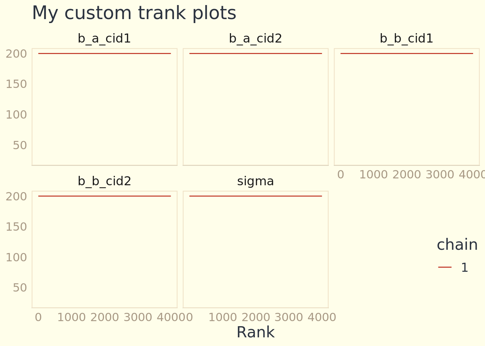

# Markov Chain Monte Carlo


```r
library(here)
source(here::here("code/scripts/source.R"))
```


```r
slides_dir = here::here("docs/slides/L10")
```

This chapter introduces one commonplace example of Fortuna and Minerva’s cooperation: the estimation of posterior probability distributions using a stochastic process known as MARKOV CHAIN MONTE CARLO (MCMC). Unlike earlier chapters in this book, here we’ll produce samples from the joint posterior without maximizing anything. Instead of having to lean on quadratic and other approximations of the shape of the posterior, now we’ll be able to sample directly from the posterior without assuming a Gaussian, or any other, shape.

<div class="figure">

<p class="caption">Major transition point where we switch over algorithms for estimating the posterior.</p>
</div>

<div class="figure">

<p class="caption">As a reminder, Bayesian inference is not about how to get the posterior, it's just about the posterior distribution. There are a lot of ways to get it. In this case, you can calculate it a huge number of ways and they're all valid. In biology, Bayesian is thought of as synonymous with Markov Chains. But you can use Markov chains for lots of things. There's a bunch of additional machinery you need to fool around with when you play with Markov chains.</p>
</div>

<div class="figure">

<p class="caption">We'll discuss for ways to compute the posterior. The analytical approach was used to create the previous slide. Interesting models, but almost always impossible. So you need another way to do the numerical differentiation. Grid I showed you earlier. You've been using `quap` for months now. Unreasonably effective for lots of models. If you're doing maximum likelihood estimation, you're doing the same steps. There's a connection there between lots of standard tools. But now we're going to get into things that make the connection a lot blurrier.</p>
</div>

## Good King Markov and his island kingdom

<div class="figure">

<p class="caption">King Markov rules a bunch of islands.</p>
</div>

<div class="figure">

<p class="caption">There are 10, with different population sizes and densities.</p>
</div>

<div class="figure">

<p class="caption">They'll let you tax them as long as you visit them. You must visit them in proportion to their population density. So you need some simple algorithm.</p>
</div>

<div class="figure">

<p class="caption">You start on a particular island. Now you're ready to move to another one. You flip a coin to decide on which island.</p>
</div>

<div class="figure">

<p class="caption">Then you send a servant across to the proposed island and they take a survey of how many people are on the island. You do the same for the island you're on. We'll call that $p_5$, and the current island $p_4$.</p>
</div>


<div class="figure">

<p class="caption">You want to compare these two numbers in a particular way.</p>
</div>

<div class="figure">

<p class="caption">You want to take the ratio of them, and that will be the probability of accepting the proposal of moving from island 4 to 5. If it's greater than 1, you'll move. </p>
</div>

<div class="figure">

<p class="caption">So you move to the proposal island with that probability.</p>
</div>

<div class="figure">

<p class="caption">This is a valid way to fill the contract. It guarantees that in the long run, you will visit each island in proportion to its relative populations size. This is an example of Markov Chain Monte Carlo.</p>
</div>


<div class="figure">

<p class="caption">It's the most famous, and the most primitive. The huge advantage is if you don't know the distribution of population sizes, you actually don't need to actually visit each of the islands in proportion to their population sizes. We don't know the posterior distribution, but we can visit each part of it in proportion to its relative probability. That's the magic: we can sample from the distribution that we don't know. Also going to introduce you to Stan. `ulam` is a simplified input that will make a custom Markov chain for you.</p>
</div>

<div class="figure">

<p class="caption">Here is the R script version of King Monty's royal tour. Metropolis was also a person. Let's walk through each line to get a sense of how simple it is. Positions is an empty vector. We'll store the islands the King is on here. Then we'll just put him on island 10 (`current`). Then we loop over the weeks, and record where the king is now. Then we'll flip a coin to generate the proposal. Finally there's the action. We've got the ratio, where we're asserting the relative popn size is the same as their number. </p>
</div>

Simulate it yourself:


```r
num_weeks <- 1e5
positions <- rep(0,num_weeks)
current <- 10
for ( i in 1:num_weeks ) {
  ## record current position
    positions[i] <- current
  ## flip coin to generate proposal
    proposal <- current + sample( c(-1,1) , size=1 )
  ## now make sure he loops around the archipelago
    if ( proposal < 1 ) proposal <- 10
    if ( proposal > 10 ) proposal <- 1
  ## move?
    prob_move <- proposal/current
    current <- ifelse( runif(1) < prob_move , proposal , current )
}
```


<div class="figure">

<p class="caption">Run that code and plot it out, and you'll get this. You can see the King zig-zagging around. You can see he gets stuck on densely populated islands. In the long run, it's in the right proportions.</p>
</div>


```r
plot( 1:100 , positions[1:100] )
```


```r
plot( table( positions ) )
```


<div class="figure">

<p class="caption">Chain is more obvious here.</p>
</div>

<div class="figure">

<p class="caption">Starting to emerge that he's visiting 10 more. After 2000 weeks, we're almost there. Guaranteed to work in the long run. What the 'long run' means is controversial.</p>
</div>

<div class="figure">

<p class="caption">Summary slide. Not sensitive to initial conditions. In this algorithm you need symmetric proposals... there are other algorithms without this condition, which improves them. </p>
</div>

## Metropolis algorithm

<div class="figure">

<p class="caption">The population size is the posterior probability. This works no matter how many parameters you have, in the long run. The long run is really long if you have a lot of parameters. That's the snag.</p>
</div>

***9.2.1. Gibbs sampling***

Why would we want an algorithm that allows asymmetric proposals? One reason is that it makes it easier to handle parameters, like standard deviations, that have boundaries at zero. A better reason, however, is that it allows us to generate savvy proposals that explore the posterior distribution more efficiently. By “more efficiently,” I mean that we can acquire an equally good image of the posterior distribution in fewer steps.
The most common way to generate savvy proposals is a technique known as GIBBS SAMPLING.

***9.2.2. High-dimensional problems***


```r
D <- 10
T <- 1e3
Y <- rmvnorm(T,rep(0,D),diag(D))
rad_dist <- function( Y ) sqrt( sum(Y^2) )
Rd <- sapply( 1:T , function(i) rad_dist( Y[i,] ) )
dens( Rd )
```


<div class="figure">

<p class="caption">Here's the famous paper where they first implemented it. Some famous people here. Rosenbluth did most of the programming, and Teller figured out the memory. The fed the tape in with a bicycle wheel. This was all part of the Manhattan project - for making fusion bombs post-war. </p>
</div>

<div class="figure">

<p class="caption">Metropolis in the foreground. MANIAC in the background. Currently a laptop can do billions of multiplications per second.</p>
</div>

<div class="figure">

<p class="caption">What are Markov Chains? The Metropolis is the simplest verison. Named after Markov. What makes something a Markov chain only depends on where you are now, not where you've been. What matters is the current state. Great for computing because you don't need to store a bunch of numbers.</p>
</div>

<div class="figure">

<p class="caption">Sometimes you get a model that is to hard to integrate. Often with integrals you're guessing. Not like derivatives. Going in the other direction is much harder. Integrating is sometimes not practical. MCMC is just one of the methods of estimating it. Optimisation (like quap) often targets the wrong area of the distribution ('concentration of measure'). This is why everyone gives up on optimisation once you have more than 100 parameters. This is bread and butter sort of stuff in applied statistics. </p>
</div>

<div class="figure">

<p class="caption">There are a bunch of different MCMC strategies. Hastings showed that you don't need symmetric proposals, which made them more efficient. Gibbs sampling is extremely efficient, but basically Metropolis. What they have in common is they guess and check. They make a proposal to move somewhere, check the posterior probability at that location, then decide to move. If you make dumb proposals, you won't move. The goal is to constantly move by making really smart proposals. Guess and checking gives you dumb proposals, so you need a completely different strategy: Hamiltonian. Really efficient and can make models with tens of thousands of parameters. Hamiltonians use a gradient. </p>
</div>


<div class="figure">

<p class="caption">Simulation of the MC run. Red it stays, green is moves. It stacks the distribution as it moves. Metropolis works really well. The problem comes when the distribution is not as nice as a Gaussian hill.</p>
</div>


<div class="figure">

<p class="caption">... like a donut. In high-dimensional spaces, it gets concentrated into thin shells. Picture a hyper-donut. We must sample from it. And the Metropolialogrithm is really bad like that, because it makes a lot of proposals into dead space. You can see it's a donut, but it doesn't. Now the long run is very long indeed. It gets stuck in narrow regions. The basic problem is that the proposals don't know the shape of the distribution.</p>
</div>

As models become more complex and contain hundreds or thousands or tens of thousands of parameters, both Metropolis and Gibbs sampling become shockingly inefficient. The reason is that they tend to get stuck in small regions of the posterior for potentially a long time. The high number of parameters isn’t the problem so much as the fact that models with many parameters nearly always have regions of high correlation in the posterior. This means that two or more parameters are highly correlated with one another in the posterior samples. You’ve seen this before with, for example, the two legs example in Chapter 6. Why is this a problem? Because high correlation means a narrow ridge of high probability combinations, and both Metropolis and Gibbs make too many dumb proposals of where to go next. So they get stuck.

<div class="figure">

<p class="caption">You can tune it, but there's a really tight trade-off. On the left we start with the Markov chain. Filled circles are accepted. If you only consider points near you, you'll get more valid proposals, but you'll move really slow. If we lengthen, then we reject more. This is the fundamental trade-off. Really you can't win. Gibbs can do a little better. Butas soon as the dimensions increase, the problem eventually appears. The issue is guess and check.</p>
</div>

## Hamiltonian Monte Carlo

>It appears to be a quite general principle that, whenever there is a randomized way of doing something, then there is a nonrandomized way that delivers better performance but requires more thought. —E. T. Jaynes

<div class="figure">

<p class="caption">So what do we do instead? This is a different process entirely. No guess and check. Instead, it runs a physics simulation. We'll represent our parameter state as a coordinate in some high-dimensional space. In more dimensions, you have some hyperspace. You're a particle in this space in some position. Then we'll flick you, and it'll cruise on some surface - the posterior distribution - and record where you stop, then do it again. Because it follows the curvature, it always makes good proposals because it doesn't go into bad areas. So there's no more guessing and checking, all proposals are good proposals.</p>
</div>

***9.3.1. Another parable***

<div class="figure">

<p class="caption">Continuous urban smear. More living in the bottom. How to use this? Hamiltonian.</p>
</div>


<div class="figure">

<p class="caption">In the book, here's a simulation. Time on the horizontal. It's Gaussian. You take the log of a Gaussian and it's a parabola. So you start in the middle. But you need to know the contour.</p>
</div>

<div class="figure">

<p class="caption">Roll the marble and periodically stop and record the position. Over time you get position samples that are proportional to the shape, as if there is more probability in the bottom.</p>
</div>


<div class="figure">

<p class="caption">Again, 2D Gaussian hill. It's a bowl now. Flick the simulation and do the pass. Always ends up inside the bowl. What stops you from getting into the silly spots. Better living through physics.</p>
</div>

<div class="figure">

<p class="caption">Because each proposal is accepted, you need many many fewer. So a lot of efficiency. Using the code in the chapter, we get tours. Start with x on the left, and it rolls down the valley. Eventually we stop, then flick it again. High acceptance rate, but the sequential auto-correlation is very low. </p>
</div>


<div class="figure">

<p class="caption">Hamiltonian MC does really well with the donut. It knows the curvature. Tours the whole thing, and you don't get stuck. If you have 27K parameters, that's really handy. </p>
</div>

<div class="figure">

<p class="caption">You need to put in momentum variables now. You need to choose the mass. The system has energy, which is how to check that it's working. If energy is not conserved, the simulation stops working. With Metropolis, you won't know. But this breaks dramatically. Also need gradients - the log posterior at a particular point.</p>
</div>

<div class="figure">

<p class="caption">Not that complicated, so tour through it. </p>
</div>


```r
# U needs to return neg-log-probability
U <- function( q , a=0 , b=1 , k=0 , d=1 ) {
  muy <- q[1]
  mux <- q[2]
  U <- sum( dnorm(y,muy,1,log=TRUE) ) + sum( dnorm(x,mux,1,log=TRUE) ) +
    dnorm(muy,a,b,log=TRUE) + dnorm(mux,k,d,log=TRUE)
  return( -U )
}
```


```r
# gradient function
# need vector of partial derivatives of U with respect to vector q
U_gradient <- function( q , a=0 , b=1 , k=0 , d=1 ) {
  muy <- q[1]
  mux <- q[2]
  G1 <- sum( y - muy ) + (a - muy)/b^2 #dU/dmuy
  G2 <- sum( x - mux ) + (k - mux)/d^2 #dU/dmux
  return( c( -G1 , -G2 ) ) # negative bc energy is neg-log-prob
}
# test data
set.seed(7)
y <- rnorm(50)
x <- rnorm(50)
x <- as.numeric(scale(x))
y <- as.numeric(scale(y))
```


```r
library(shape) # for fancy arrows
Q <- list()
Q$q <- c(-0.1,0.2)
pr <- 0.3
plot( NULL , ylab="muy" , xlab="mux" , xlim=c(-pr,pr) , ylim=c(-pr,pr) )
step <- 0.03
L <- 11 # 0.03/28 for U-turns — 11 for working example
n_samples <- 4
path_col <- rethinking::col.alpha("black",0.5)
points( Q$q[1] , Q$q[2] , pch=4 , col="black" )
for ( i in 1:n_samples ) {
  Q <- rethinking::HMC2( U , U_gradient , step , L , Q$q )
  if ( n_samples < 10 ) {
    for ( j in 1:L ) {
      K0 <- sum(Q$ptraj[j,]^2)/2 # kinetic energy
      lines( Q$traj[j:(j+1),1] , Q$traj[j:(j+1),2] , col=path_col , lwd=1+2*K0 )
    }
    points( Q$traj[1:L+1,] , pch=16 , col="white" , cex=0.35 )
    Arrows( Q$traj[L,1] , Q$traj[L,2] , Q$traj[L+1,1] , Q$traj[L+1,2] ,
      arr.length=0.35 , arr.adj = 0.7 )
    text( Q$traj[L+1,1] , Q$traj[L+1,2] , i , cex=0.8 , pos=4 , offset=0.4 )
  }
  points( Q$traj[L+1,1] , Q$traj[L+1,2] , pch=ifelse( Q$accept==1 , 16 , 1 ) ,
    col=ifelse( abs(Q$dH)>0.1 , "red" , "black" ) )
}
```


Let's tour through the `HMC2` function in `rethinking`:


```r
HMC2 <- function (U, grad_U, epsilon, L, current_q) {
  q = current_q
  p = rnorm(length(q),0,1) # random flick - p is momentum.
  current_p = p
  # Make a half step for momentum at the beginning
  p = p - epsilon * grad_U(q) / 2
  # initialize bookkeeping - saves trajectory
  qtraj <- matrix(NA,nrow=L+1,ncol=length(q))
  ptraj <- qtraj
  qtraj[1,] <- current_q
  ptraj[1,] <- p
}
```

`L` steps are taken, using the gradient to compute a linear appoximation of the log-posterior surface at each point.


```r
# Alternate full steps for position and momentum
for ( i in 1:L ) {
  q = q + epsilon * p # Full step for the position
  # Make a full step for the momentum, except at end of trajectory
  if ( i!=L ) {
    p = p - epsilon * grad_U(q)
    ptraj[i+1,] <- p
  }
    qtraj[i+1,] <- q
  }
```


```r
  # Make a half step for momentum at the end
  p = p - epsilon * grad_U(q) / 2
  ptraj[L+1,] <- p
  # Negate momentum at end of trajectory to make the proposal symmetric
  p = -p
  # Evaluate potential and kinetic energies at start and end of trajectory
  current_U = U(current_q)
  current_K = sum(current_p^2) / 2
  proposed_U = U(q)
  proposed_K = sum(p^2) / 2
  # Accept or reject the state at end of trajectory, returning either
  # the position at the end of the trajectory or the initial position
  accept <- 0
  if (runif(1) < exp(current_U-proposed_U+current_K-proposed_K)) {
    new_q <- q # accept
    accept <- 1
  } else new_q <- current_q # reject
  return(list( q=new_q, traj=qtraj, ptraj=ptraj, accept=accept ))
}
```


<div class="figure">

<p class="caption">Problem is that there's stuff to pick, namely the step size (the length of time we run a segment). You want basically the biggest step size, but if you make it too big, you can overshoot the shape. THen you need to choose the number of steps you'll take in each trajectory. If you choose bad values for those, you'll have a bad time. In general it's not as bad as it gets in a 2D Gaussian. Since it's a parabolic bowl, you can get these parabolic loops. In the long run it'll still work, but it's super inefficient. How do you fix it? Choose good values for the tuning parameters, which is annoying.</p>
</div>


<div class="figure">

<p class="caption">Here's the simulation where it resembles an Ouroboros. Since you don't know the distribution, it's hard to say what the best tuning parameters are.</p>
</div>

<div class="figure">

<p class="caption">Stan does two things: 1) Warm up phase, then maximises the step size. 2) Runs the NUTS2 algorithm. </p>
</div>


<div class="figure">

<p class="caption">Here's NUTS. It runs the simulation in both directions in time. It imagines a simulation that loops back on itself, and runs it backwards from teh starting point, and goes backdwards at the same time, but when it sees itself turning around, it stops. This means it figures out a good number of leapfrog steps for each trajectory. So you don't need to make a bunch of decisions.</p>
</div>

<div class="figure">

<p class="caption">One of the mathematicians working with Metropolis. Built mechnical MCMC simulators. Also did important work in biology. Could run Stan on anything you like. </p>
</div>


<div class="figure">

<p class="caption">There are still problems. If you have multiple separated hills, like in factored analytical models, the wait between hills can be long indeed. In my experience you handle this by changing the geometry of the model. We get these with item-response theory models.</p>
</div>

<div class="figure">

<p class="caption">SWant you to recognise a bad chain when you see it.</p>
</div>

## Easy HMC: `ulam`

* Preprocess any variable transformations
* Construct a clean data list with only the variables you will use.


```r
library(rethinking)
data(rugged)
d <- rugged
d$log_gdp <- log(d$rgdppc_2000)
dd <- d[ complete.cases(d$rgdppc_2000) , ]
dd$log_gdp_std <- dd$log_gdp / mean(dd$log_gdp)
dd$rugged_std <- dd$rugged / max(dd$rugged)
dd$cid <- ifelse( dd$cont_africa==1 , 1 , 2 )
```


<div class="figure">

<p class="caption">Run quap as before. Now let's do this with a MC.</p>
</div>


```r
m8.3 <- quap(
  alist(
    log_gdp_std ~ dnorm( mu , sigma ) ,
    mu <- a[cid] + b[cid]*( rugged_std - 0.215 ) ,
    a[cid] ~ dnorm( 1 , 0.1 ) ,
    b[cid] ~ dnorm( 0 , 0.3 ) ,
    sigma ~ dexp( 1 )
  ) , data=dd )
precis( m8.3 , depth=2 )
```

```
##             mean          sd        5.5%       94.5%
## a[1]   0.8865640 0.015674552  0.86151302  0.91161495
## a[2]   1.0505666 0.009935872  1.03468714  1.06644602
## b[1]   0.1324981 0.074199237  0.01391344  0.25108286
## b[2]  -0.1426057 0.054745410 -0.23009945 -0.05511197
## sigma  0.1094859 0.005934188  0.10000194  0.11896990
```

***9.4.1. Preparation***

<div class="figure">

<p class="caption">Same formula, but slim dataset with just the variables of interest. 4 chains on separate cores.</p>
</div>


```r
dat_slim <- list(
  log_gdp_std = dd$log_gdp_std,
  rugged_std = dd$rugged_std,
  cid = as.integer( dd$cid )
)
str(dat_slim)
```

```
## List of 3
##  $ log_gdp_std: num [1:170] 0.88 0.965 1.166 1.104 0.915 ...
##  $ rugged_std : num [1:170] 0.138 0.553 0.124 0.125 0.433 ...
##  $ cid        : int [1:170] 1 2 2 2 2 2 2 2 2 1 ...
```


***9.4.2. Sampling from the posterior***


```r
m9.1 <- ulam(
  alist(
    log_gdp_std ~ dnorm( mu , sigma ) ,
    mu <- a[cid] + b[cid]*( rugged_std - 0.215 ) ,
    a[cid] ~ dnorm( 1 , 0.1 ) ,
    b[cid] ~ dnorm( 0 , 0.3 ) ,
    sigma ~ dexp( 1 )
  ) , data=dat_slim , chains=1 )
```

```
## This is cmdstanr version 0.4.0.9000
```

```
## - Online documentation and vignettes at mc-stan.org/cmdstanr
```

```
## - CmdStan path set to: /Users/brettell/.cmdstanr/cmdstan-2.27.0
```

```
## - Use set_cmdstan_path() to change the path
```

```
## Running MCMC with 1 chain, with 1 thread(s) per chain...
## 
## Chain 1 Iteration:   1 / 1000 [  0%]  (Warmup) 
## Chain 1 Iteration: 100 / 1000 [ 10%]  (Warmup) 
## Chain 1 Iteration: 200 / 1000 [ 20%]  (Warmup) 
## Chain 1 Iteration: 300 / 1000 [ 30%]  (Warmup) 
## Chain 1 Iteration: 400 / 1000 [ 40%]  (Warmup) 
## Chain 1 Iteration: 500 / 1000 [ 50%]  (Warmup) 
## Chain 1 Iteration: 501 / 1000 [ 50%]  (Sampling) 
## Chain 1 Iteration: 600 / 1000 [ 60%]  (Sampling) 
## Chain 1 Iteration: 700 / 1000 [ 70%]  (Sampling) 
## Chain 1 Iteration: 800 / 1000 [ 80%]  (Sampling) 
## Chain 1 Iteration: 900 / 1000 [ 90%]  (Sampling) 
## Chain 1 Iteration: 1000 / 1000 [100%]  (Sampling) 
## Chain 1 finished in 0.1 seconds.
```


<div class="figure">

<p class="caption">`ulam` translates this into raw Stan code. A bunch of formal variable definitions. </p>
</div>

<div class="figure">

<p class="caption">What happens here is it reports each chain. Warmup figures out the step size. Total samples is the length of each chain minus the warmup. You won't need more than a couple of thousand samples to get a good estimate.</p>
</div>

<div class="figure">

<p class="caption"> `n_eff` is the number of effective samples. Note that it's greater than the number of samples from the MC. True because it takes dispersed samples. The number of samples you would get if there was no auto-correlation between sequential samples. `Rhat` is the Gelman-Ruben diagnostic. You want it to converge across chains. They should all look the same and be exchangeable.</p>
</div>


```r
precis(m9.1, depth = 2)
```

```
##             mean          sd        5.5%      94.5%    n_eff    Rhat4
## a[1]   0.8863693 0.016857778  0.86122129  0.9147263 716.3739 1.002273
## a[2]   1.0511318 0.010164509  1.03506230  1.0675088 823.3144 1.001111
## b[1]   0.1321142 0.073856498  0.01366032  0.2481505 489.0231 1.003188
## b[2]  -0.1415806 0.057097726 -0.23539425 -0.0570833 572.0549 1.015222
## sigma  0.1117945 0.006053714  0.10264904  0.1219095 492.8719 1.002470
```


***9.4.3. Sampling agian, in parallel***


```r
m9.1 <- ulam(
  alist(
    log_gdp_std ~ dnorm( mu , sigma ) ,
    mu <- a[cid] + b[cid]*( rugged_std - 0.215 ) ,
    a[cid] ~ dnorm( 1 , 0.1 ) ,
    b[cid] ~ dnorm( 0 , 0.3 ) ,
    sigma ~ dexp( 1 )
  ) , data=dat_slim , chains=4 , cores=4 )
```

```
## Running MCMC with 4 parallel chains, with 1 thread(s) per chain...
## 
## Chain 1 Iteration:   1 / 1000 [  0%]  (Warmup) 
## Chain 1 Iteration: 100 / 1000 [ 10%]  (Warmup) 
## Chain 1 Iteration: 200 / 1000 [ 20%]  (Warmup)
```

```
## Chain 1 Informational Message: The current Metropolis proposal is about to be rejected because of the following issue:
```

```
## Chain 1 Exception: normal_lpdf: Scale parameter is 0, but must be positive! (in '/var/folders/24/qgbyngx94ygb2fg_q0x5jf_r8kxxgt/T/Rtmp64D9Qu/model-123262894e945.stan', line 19, column 4 to column 39)
```

```
## Chain 1 If this warning occurs sporadically, such as for highly constrained variable types like covariance matrices, then the sampler is fine,
```

```
## Chain 1 but if this warning occurs often then your model may be either severely ill-conditioned or misspecified.
```

```
## Chain 1
```

```
## Chain 2 Iteration:   1 / 1000 [  0%]  (Warmup) 
## Chain 2 Iteration: 100 / 1000 [ 10%]  (Warmup) 
## Chain 2 Iteration: 200 / 1000 [ 20%]  (Warmup) 
## Chain 3 Iteration:   1 / 1000 [  0%]  (Warmup)
```

```
## Chain 3 Informational Message: The current Metropolis proposal is about to be rejected because of the following issue:
```

```
## Chain 3 Exception: normal_lpdf: Scale parameter is 0, but must be positive! (in '/var/folders/24/qgbyngx94ygb2fg_q0x5jf_r8kxxgt/T/Rtmp64D9Qu/model-123262894e945.stan', line 19, column 4 to column 39)
```

```
## Chain 3 If this warning occurs sporadically, such as for highly constrained variable types like covariance matrices, then the sampler is fine,
```

```
## Chain 3 but if this warning occurs often then your model may be either severely ill-conditioned or misspecified.
```

```
## Chain 3
```

```
## Chain 4 Iteration:   1 / 1000 [  0%]  (Warmup) 
## Chain 4 Iteration: 100 / 1000 [ 10%]  (Warmup) 
## Chain 4 Iteration: 200 / 1000 [ 20%]  (Warmup) 
## Chain 4 Iteration: 300 / 1000 [ 30%]  (Warmup)
```

```
## Chain 4 Informational Message: The current Metropolis proposal is about to be rejected because of the following issue:
```

```
## Chain 4 Exception: normal_lpdf: Scale parameter is 0, but must be positive! (in '/var/folders/24/qgbyngx94ygb2fg_q0x5jf_r8kxxgt/T/Rtmp64D9Qu/model-123262894e945.stan', line 19, column 4 to column 39)
```

```
## Chain 4 If this warning occurs sporadically, such as for highly constrained variable types like covariance matrices, then the sampler is fine,
```

```
## Chain 4 but if this warning occurs often then your model may be either severely ill-conditioned or misspecified.
```

```
## Chain 4
```

```
## Chain 1 Iteration: 300 / 1000 [ 30%]  (Warmup) 
## Chain 1 Iteration: 400 / 1000 [ 40%]  (Warmup) 
## Chain 1 Iteration: 500 / 1000 [ 50%]  (Warmup) 
## Chain 1 Iteration: 501 / 1000 [ 50%]  (Sampling) 
## Chain 1 Iteration: 600 / 1000 [ 60%]  (Sampling) 
## Chain 1 Iteration: 700 / 1000 [ 70%]  (Sampling) 
## Chain 1 Iteration: 800 / 1000 [ 80%]  (Sampling) 
## Chain 1 Iteration: 900 / 1000 [ 90%]  (Sampling) 
## Chain 2 Iteration: 300 / 1000 [ 30%]  (Warmup) 
## Chain 2 Iteration: 400 / 1000 [ 40%]  (Warmup) 
## Chain 2 Iteration: 500 / 1000 [ 50%]  (Warmup) 
## Chain 2 Iteration: 501 / 1000 [ 50%]  (Sampling) 
## Chain 2 Iteration: 600 / 1000 [ 60%]  (Sampling) 
## Chain 2 Iteration: 700 / 1000 [ 70%]  (Sampling) 
## Chain 2 Iteration: 800 / 1000 [ 80%]  (Sampling) 
## Chain 2 Iteration: 900 / 1000 [ 90%]  (Sampling) 
## Chain 3 Iteration: 100 / 1000 [ 10%]  (Warmup) 
## Chain 3 Iteration: 200 / 1000 [ 20%]  (Warmup) 
## Chain 3 Iteration: 300 / 1000 [ 30%]  (Warmup) 
## Chain 3 Iteration: 400 / 1000 [ 40%]  (Warmup) 
## Chain 3 Iteration: 500 / 1000 [ 50%]  (Warmup) 
## Chain 3 Iteration: 501 / 1000 [ 50%]  (Sampling) 
## Chain 3 Iteration: 600 / 1000 [ 60%]  (Sampling) 
## Chain 3 Iteration: 700 / 1000 [ 70%]  (Sampling) 
## Chain 3 Iteration: 800 / 1000 [ 80%]  (Sampling) 
## Chain 4 Iteration: 400 / 1000 [ 40%]  (Warmup) 
## Chain 4 Iteration: 500 / 1000 [ 50%]  (Warmup) 
## Chain 4 Iteration: 501 / 1000 [ 50%]  (Sampling) 
## Chain 4 Iteration: 600 / 1000 [ 60%]  (Sampling) 
## Chain 4 Iteration: 700 / 1000 [ 70%]  (Sampling) 
## Chain 4 Iteration: 800 / 1000 [ 80%]  (Sampling) 
## Chain 4 Iteration: 900 / 1000 [ 90%]  (Sampling) 
## Chain 4 Iteration: 1000 / 1000 [100%]  (Sampling) 
## Chain 4 finished in 0.2 seconds.
## Chain 1 Iteration: 1000 / 1000 [100%]  (Sampling) 
## Chain 2 Iteration: 1000 / 1000 [100%]  (Sampling) 
## Chain 3 Iteration: 900 / 1000 [ 90%]  (Sampling) 
## Chain 3 Iteration: 1000 / 1000 [100%]  (Sampling) 
## Chain 1 finished in 0.2 seconds.
## Chain 2 finished in 0.2 seconds.
## Chain 3 finished in 0.2 seconds.
## 
## All 4 chains finished successfully.
## Mean chain execution time: 0.2 seconds.
## Total execution time: 0.5 seconds.
```


```r
show( m9.1 )
```

```
## Hamiltonian Monte Carlo approximation
## 2000 samples from 4 chains
## 
## Sampling durations (seconds):
##         warmup sample total
## chain:1   0.14   0.07  0.22
## chain:2   0.12   0.08  0.21
## chain:3   0.10   0.06  0.16
## chain:4   0.14   0.07  0.21
## 
## Formula:
## log_gdp_std ~ dnorm(mu, sigma)
## mu <- a[cid] + b[cid] * (rugged_std - 0.215)
## a[cid] ~ dnorm(1, 0.1)
## b[cid] ~ dnorm(0, 0.3)
## sigma ~ dexp(1)
```


```r
precis( m9.1 , 2 )
```

```
##             mean          sd        5.5%       94.5%    n_eff     Rhat4
## a[1]   0.8862612 0.016052160  0.86087777  0.91244762 3039.869 1.0004433
## a[2]   1.0506887 0.010431308  1.03427780  1.06749165 3183.331 1.0000783
## b[1]   0.1302839 0.073973317  0.01444338  0.25037649 2690.883 0.9990496
## b[2]  -0.1439431 0.055033741 -0.23355094 -0.05448671 2595.312 1.0001181
## sigma  0.1116414 0.005945456  0.10247334  0.12141777 2870.237 0.9995166
```

If there were only 2000 samples in total, how can we have more than 2000 effective samples for each parameter? It’s no mistake. The adaptive sampler that Stan uses is so good, it can actually produce sequential samples that are better than uncorrelated. They are anti-correlated. This means it can explore the posterior distribution so efficiently that it can beat random.

***9.4.4. Visualization***


```r
pairs(m9.1)
```


***9.4.5. Checking the chain***


```r
# Error: 'traceplot' is not an exported object from 'namespace:rethinking'
rethinking::traceplot( m9.1)
```


```r
rethinking::trankplot( m9.1)
```




<div class="figure">

<p class="caption">What you want to see are these hairy caterpillars.</p>
</div>

Now, how is this chain a healthy one? Typically we look for three things in these trace plots: (1) stationarity, (2) good mixing, and (3) convergence.

## Care and feeding of your Markov chain

***9.5.1. How many samples do you need?***

First, what really matters is the effective number of samples, not the raw number. You can think of `n_eff` as the length of a Markov chain with no autocorrelation that would provide the same quality of estimate as your chain. One consequence of this definition, as you saw earlier in the chapter, is that `n_eff` can be larger than the length of your chain, provided sequential samples are anti-correlated in the right way. While n_eff is only an estimate, it is usually better than the raw number of samples, which can be very misleading.

Second, what do you want to know? If all you want are posterior means, it doesn’t take many samples at all to get very good estimates. Even a couple hundred samples will do. But if you care about the exact shape in the extreme tails of the posterior, the 99th percentile or so, then you’ll need many more.


The warmup setting is more subtle. On the one hand, you want to have the shortest warmup period necessary, so you can get on with real sampling. But on the other hand, more warmup can mean more efficient sampling. With Stan models, typically you can devote as much as half of your total samples, the iter value, to warmup and come out very well. But for simple models like those you’ve fit so far, much less warmup is really needed. Models can vary a lot in the shape of their posterior distributions, so again there is no universally best answer. But if you are having trouble, you might try increasing the warmup. If not, you might try reducing it. 

***9.5.2. How many chains do you need?***

So the question naturally arises: How many chains do we need? There are three answers to this question. First, when initially debugging a model, use a single chain. There are some error messages that don’t display unless you use only one chain. The chain will fail with more than one chain, but the reason may not be displayed. This is why the `ulam` default is `chains=1`. Second, when deciding whether the chains are valid, you need more than one chain. Third, when you begin the final run that you’ll make inferences from, you only really need one chain.

There are exotic situations in which all of the advice above must be modified. But for typical regression models, you can live by the motto:
>One short chain to debug, four chains for verification and inference.


***9.5.3. Taming a wild chain***


```r
y <- c(-1,1)
set.seed(11)
m9.2 <- ulam(
  alist(
    y ~ dnorm( mu , sigma ) ,
    mu <- alpha ,
    alpha ~ dnorm( 0 , 1000 ) ,
    sigma ~ dexp( 0.0001 )
  ) , data=list(y=y) , chains=3 )
```

```
## Running MCMC with 3 sequential chains, with 1 thread(s) per chain...
## 
## Chain 1 Iteration:   1 / 1000 [  0%]  (Warmup) 
## Chain 1 Iteration: 100 / 1000 [ 10%]  (Warmup) 
## Chain 1 Iteration: 200 / 1000 [ 20%]  (Warmup) 
## Chain 1 Iteration: 300 / 1000 [ 30%]  (Warmup) 
## Chain 1 Iteration: 400 / 1000 [ 40%]  (Warmup) 
## Chain 1 Iteration: 500 / 1000 [ 50%]  (Warmup) 
## Chain 1 Iteration: 501 / 1000 [ 50%]  (Sampling) 
## Chain 1 Iteration: 600 / 1000 [ 60%]  (Sampling) 
## Chain 1 Iteration: 700 / 1000 [ 70%]  (Sampling) 
## Chain 1 Iteration: 800 / 1000 [ 80%]  (Sampling) 
## Chain 1 Iteration: 900 / 1000 [ 90%]  (Sampling) 
## Chain 1 Iteration: 1000 / 1000 [100%]  (Sampling) 
## Chain 1 finished in 0.0 seconds.
## Chain 2 Iteration:   1 / 1000 [  0%]  (Warmup) 
## Chain 2 Iteration: 100 / 1000 [ 10%]  (Warmup) 
## Chain 2 Iteration: 200 / 1000 [ 20%]  (Warmup) 
## Chain 2 Iteration: 300 / 1000 [ 30%]  (Warmup) 
## Chain 2 Iteration: 400 / 1000 [ 40%]  (Warmup) 
## Chain 2 Iteration: 500 / 1000 [ 50%]  (Warmup) 
## Chain 2 Iteration: 501 / 1000 [ 50%]  (Sampling) 
## Chain 2 Iteration: 600 / 1000 [ 60%]  (Sampling) 
## Chain 2 Iteration: 700 / 1000 [ 70%]  (Sampling) 
## Chain 2 Iteration: 800 / 1000 [ 80%]  (Sampling) 
## Chain 2 Iteration: 900 / 1000 [ 90%]  (Sampling) 
## Chain 2 Iteration: 1000 / 1000 [100%]  (Sampling) 
## Chain 2 finished in 0.0 seconds.
## Chain 3 Iteration:   1 / 1000 [  0%]  (Warmup) 
## Chain 3 Iteration: 100 / 1000 [ 10%]  (Warmup) 
## Chain 3 Iteration: 200 / 1000 [ 20%]  (Warmup) 
## Chain 3 Iteration: 300 / 1000 [ 30%]  (Warmup) 
## Chain 3 Iteration: 400 / 1000 [ 40%]  (Warmup) 
## Chain 3 Iteration: 500 / 1000 [ 50%]  (Warmup) 
## Chain 3 Iteration: 501 / 1000 [ 50%]  (Sampling) 
## Chain 3 Iteration: 600 / 1000 [ 60%]  (Sampling) 
## Chain 3 Iteration: 700 / 1000 [ 70%]  (Sampling) 
## Chain 3 Iteration: 800 / 1000 [ 80%]  (Sampling) 
## Chain 3 Iteration: 900 / 1000 [ 90%]  (Sampling) 
## Chain 3 Iteration: 1000 / 1000 [100%]  (Sampling) 
## Chain 3 finished in 0.0 seconds.
## 
## All 3 chains finished successfully.
## Mean chain execution time: 0.0 seconds.
## Total execution time: 0.6 seconds.
```

```
## 
## Warning: 46 of 1500 (3.0%) transitions ended with a divergence.
## This may indicate insufficient exploration of the posterior distribution.
## Possible remedies include: 
##   * Increasing adapt_delta closer to 1 (default is 0.8) 
##   * Reparameterizing the model (e.g. using a non-centered parameterization)
##   * Using informative or weakly informative prior distributions
```


```r
precis( m9.2 )
```

```
##            mean        sd       5.5%     94.5%     n_eff    Rhat4
## alpha -66.77886  387.6496 -862.48058  411.6954  79.95515 1.036383
## sigma 667.00277 1472.5992   15.61534 2897.0778 187.69349 1.017445
```

Whoa! This posterior can’t be right. The mean of −1 and 1 is zero, so we’re hoping to get a mean value for alpha around zero. Instead we get crazy values and implausibly wide intervals. Inference for sigma is no better. The n_eff and Rhat diagnostics don’t look good either.

You should see something like:

```
Warning messages:
1: There were 67 divergent transitions after warmup. Increasing adapt_delta
above 0.95 may help. See
http://mc-stan.org/misc/warnings.html#divergent-transitions-after-warmup
```

The warnings say that Stan detected problems in exploring all of the posterior. These are **divergent transitions**.

You should also see a second warning:

```
2: Examine the pairs() plot to diagnose sampling problems
```

This refers to Stan’s pairs method, not `ulam`’s.

Let's look at the unhealthy chains:


```r
trankplot(m9.2)
```


They show the chains spend long periods with one chain above or below the others. This indicates poor exploration of the posterior.

It’s easy to tame this particular chain by using weakly informative priors. 


<div class="figure">

<p class="caption">You might get something like this instead. Not good.</p>
</div>


```r
set.seed(11)
m9.3 <- ulam(
  alist(
    y ~ dnorm( mu , sigma ) ,
    mu <- alpha ,
    alpha ~ dnorm( 1 , 10 ) ,
    sigma ~ dexp( 1 )
  ) , data=list(y=y) , chains=3 )
```

```
## Running MCMC with 3 sequential chains, with 1 thread(s) per chain...
## 
## Chain 1 Iteration:   1 / 1000 [  0%]  (Warmup) 
## Chain 1 Iteration: 100 / 1000 [ 10%]  (Warmup) 
## Chain 1 Iteration: 200 / 1000 [ 20%]  (Warmup) 
## Chain 1 Iteration: 300 / 1000 [ 30%]  (Warmup) 
## Chain 1 Iteration: 400 / 1000 [ 40%]  (Warmup) 
## Chain 1 Iteration: 500 / 1000 [ 50%]  (Warmup) 
## Chain 1 Iteration: 501 / 1000 [ 50%]  (Sampling) 
## Chain 1 Iteration: 600 / 1000 [ 60%]  (Sampling) 
## Chain 1 Iteration: 700 / 1000 [ 70%]  (Sampling) 
## Chain 1 Iteration: 800 / 1000 [ 80%]  (Sampling) 
## Chain 1 Iteration: 900 / 1000 [ 90%]  (Sampling) 
## Chain 1 Iteration: 1000 / 1000 [100%]  (Sampling) 
## Chain 1 finished in 0.0 seconds.
## Chain 2 Iteration:   1 / 1000 [  0%]  (Warmup) 
## Chain 2 Iteration: 100 / 1000 [ 10%]  (Warmup) 
## Chain 2 Iteration: 200 / 1000 [ 20%]  (Warmup) 
## Chain 2 Iteration: 300 / 1000 [ 30%]  (Warmup) 
## Chain 2 Iteration: 400 / 1000 [ 40%]  (Warmup) 
## Chain 2 Iteration: 500 / 1000 [ 50%]  (Warmup) 
## Chain 2 Iteration: 501 / 1000 [ 50%]  (Sampling) 
## Chain 2 Iteration: 600 / 1000 [ 60%]  (Sampling) 
## Chain 2 Iteration: 700 / 1000 [ 70%]  (Sampling) 
## Chain 2 Iteration: 800 / 1000 [ 80%]  (Sampling) 
## Chain 2 Iteration: 900 / 1000 [ 90%]  (Sampling) 
## Chain 2 Iteration: 1000 / 1000 [100%]  (Sampling) 
## Chain 2 finished in 0.0 seconds.
## Chain 3 Iteration:   1 / 1000 [  0%]  (Warmup) 
## Chain 3 Iteration: 100 / 1000 [ 10%]  (Warmup) 
## Chain 3 Iteration: 200 / 1000 [ 20%]  (Warmup) 
## Chain 3 Iteration: 300 / 1000 [ 30%]  (Warmup) 
## Chain 3 Iteration: 400 / 1000 [ 40%]  (Warmup) 
## Chain 3 Iteration: 500 / 1000 [ 50%]  (Warmup) 
## Chain 3 Iteration: 501 / 1000 [ 50%]  (Sampling) 
## Chain 3 Iteration: 600 / 1000 [ 60%]  (Sampling) 
## Chain 3 Iteration: 700 / 1000 [ 70%]  (Sampling) 
## Chain 3 Iteration: 800 / 1000 [ 80%]  (Sampling) 
## Chain 3 Iteration: 900 / 1000 [ 90%]  (Sampling) 
## Chain 3 Iteration: 1000 / 1000 [100%]  (Sampling) 
## Chain 3 finished in 0.0 seconds.
## 
## All 3 chains finished successfully.
## Mean chain execution time: 0.0 seconds.
## Total execution time: 0.6 seconds.
```

```r
precis( m9.3 )
```

```
##              mean        sd       5.5%    94.5%    n_eff    Rhat4
## alpha -0.01240969 1.2171064 -1.7886833 2.051604 354.2072 1.008284
## sigma  1.56910373 0.8674973  0.6641003 3.173082 507.7150 1.002210
```


<div class="figure">

<p class="caption">Typically when you're having trouble getting your chain to work, it's because there's something wrong with your model definition. So first check the model. </p>
</div>

***9.5.4. Non-identifiable parameters***


```r
set.seed(41)
y <- rnorm( 100 , mean=0 , sd=1 )
```


```r
set.seed(384)
m9.4 <- ulam(
  alist(
    y ~ dnorm( mu , sigma ) ,
    mu <- a1 + a2 ,
    a1 ~ dnorm( 0 , 1000 ),
    a2 ~ dnorm( 0 , 1000 ),
    sigma ~ dexp( 1 )
  ) , data=list(y=y) , chains=3 )
```

```
## Running MCMC with 3 sequential chains, with 1 thread(s) per chain...
## 
## Chain 1 Iteration:   1 / 1000 [  0%]  (Warmup) 
## Chain 1 Iteration: 100 / 1000 [ 10%]  (Warmup) 
## Chain 1 Iteration: 200 / 1000 [ 20%]  (Warmup) 
## Chain 1 Iteration: 300 / 1000 [ 30%]  (Warmup) 
## Chain 1 Iteration: 400 / 1000 [ 40%]  (Warmup) 
## Chain 1 Iteration: 500 / 1000 [ 50%]  (Warmup) 
## Chain 1 Iteration: 501 / 1000 [ 50%]  (Sampling) 
## Chain 1 Iteration: 600 / 1000 [ 60%]  (Sampling) 
## Chain 1 Iteration: 700 / 1000 [ 70%]  (Sampling) 
## Chain 1 Iteration: 800 / 1000 [ 80%]  (Sampling) 
## Chain 1 Iteration: 900 / 1000 [ 90%]  (Sampling) 
## Chain 1 Iteration: 1000 / 1000 [100%]  (Sampling) 
## Chain 1 finished in 1.4 seconds.
## Chain 2 Iteration:   1 / 1000 [  0%]  (Warmup) 
## Chain 2 Iteration: 100 / 1000 [ 10%]  (Warmup)
```

```
## Chain 2 Informational Message: The current Metropolis proposal is about to be rejected because of the following issue:
```

```
## Chain 2 Exception: normal_lpdf: Scale parameter is 0, but must be positive! (in '/var/folders/24/qgbyngx94ygb2fg_q0x5jf_r8kxxgt/T/Rtmp64D9Qu/model-1232617fdd6e9.stan', line 15, column 4 to column 29)
```

```
## Chain 2 If this warning occurs sporadically, such as for highly constrained variable types like covariance matrices, then the sampler is fine,
```

```
## Chain 2 but if this warning occurs often then your model may be either severely ill-conditioned or misspecified.
```

```
## Chain 2
```

```
## Chain 2 Iteration: 200 / 1000 [ 20%]  (Warmup) 
## Chain 2 Iteration: 300 / 1000 [ 30%]  (Warmup) 
## Chain 2 Iteration: 400 / 1000 [ 40%]  (Warmup) 
## Chain 2 Iteration: 500 / 1000 [ 50%]  (Warmup) 
## Chain 2 Iteration: 501 / 1000 [ 50%]  (Sampling) 
## Chain 2 Iteration: 600 / 1000 [ 60%]  (Sampling) 
## Chain 2 Iteration: 700 / 1000 [ 70%]  (Sampling) 
## Chain 2 Iteration: 800 / 1000 [ 80%]  (Sampling) 
## Chain 2 Iteration: 900 / 1000 [ 90%]  (Sampling) 
## Chain 2 Iteration: 1000 / 1000 [100%]  (Sampling) 
## Chain 2 finished in 1.4 seconds.
## Chain 3 Iteration:   1 / 1000 [  0%]  (Warmup) 
## Chain 3 Iteration: 100 / 1000 [ 10%]  (Warmup)
```

```
## Chain 3 Informational Message: The current Metropolis proposal is about to be rejected because of the following issue:
```

```
## Chain 3 Exception: normal_lpdf: Scale parameter is 0, but must be positive! (in '/var/folders/24/qgbyngx94ygb2fg_q0x5jf_r8kxxgt/T/Rtmp64D9Qu/model-1232617fdd6e9.stan', line 15, column 4 to column 29)
```

```
## Chain 3 If this warning occurs sporadically, such as for highly constrained variable types like covariance matrices, then the sampler is fine,
```

```
## Chain 3 but if this warning occurs often then your model may be either severely ill-conditioned or misspecified.
```

```
## Chain 3
```

```
## Chain 3 Iteration: 200 / 1000 [ 20%]  (Warmup) 
## Chain 3 Iteration: 300 / 1000 [ 30%]  (Warmup) 
## Chain 3 Iteration: 400 / 1000 [ 40%]  (Warmup) 
## Chain 3 Iteration: 500 / 1000 [ 50%]  (Warmup) 
## Chain 3 Iteration: 501 / 1000 [ 50%]  (Sampling) 
## Chain 3 Iteration: 600 / 1000 [ 60%]  (Sampling) 
## Chain 3 Iteration: 700 / 1000 [ 70%]  (Sampling) 
## Chain 3 Iteration: 800 / 1000 [ 80%]  (Sampling) 
## Chain 3 Iteration: 900 / 1000 [ 90%]  (Sampling) 
## Chain 3 Iteration: 1000 / 1000 [100%]  (Sampling) 
## Chain 3 finished in 1.6 seconds.
## 
## All 3 chains finished successfully.
## Mean chain execution time: 1.5 seconds.
## Total execution time: 5.0 seconds.
```

```
## 1178 of 1500 (79.0%) transitions hit the maximum treedepth limit of 10 or 2^10-1 leapfrog steps.
## Trajectories that are prematurely terminated due to this limit will result in slow exploration.
## Increasing the max_treedepth limit can avoid this at the expense of more computation.
## If increasing max_treedepth does not remove warnings, try to reparameterize the model.
```

```r
precis( m9.4 )
```

```
##             mean           sd         5.5%      94.5%     n_eff    Rhat4
## a1     85.139255 345.47929165 -439.3472850 673.768315  3.798898 2.445521
## a2    -84.948905 345.47804710 -673.6431600 439.499380  3.798842 2.445557
## sigma   1.061253   0.07158248    0.9449788   1.176775 20.122387 1.203158
```


Again, weakly regularizing priors can rescue us.


```r
m9.5 <- ulam(
  alist(
    y ~ dnorm( mu , sigma ) ,
    mu <- a1 + a2 ,
    a1 ~ dnorm( 0 , 10 ),
    a2 ~ dnorm( 0 , 10 ),
    sigma ~ dexp( 1 )
  ) , data=list(y=y) , chains=3 )
```

```
## Running MCMC with 3 sequential chains, with 1 thread(s) per chain...
## 
## Chain 1 Iteration:   1 / 1000 [  0%]  (Warmup) 
## Chain 1 Iteration: 100 / 1000 [ 10%]  (Warmup) 
## Chain 1 Iteration: 200 / 1000 [ 20%]  (Warmup) 
## Chain 1 Iteration: 300 / 1000 [ 30%]  (Warmup) 
## Chain 1 Iteration: 400 / 1000 [ 40%]  (Warmup) 
## Chain 1 Iteration: 500 / 1000 [ 50%]  (Warmup) 
## Chain 1 Iteration: 501 / 1000 [ 50%]  (Sampling) 
## Chain 1 Iteration: 600 / 1000 [ 60%]  (Sampling) 
## Chain 1 Iteration: 700 / 1000 [ 70%]  (Sampling) 
## Chain 1 Iteration: 800 / 1000 [ 80%]  (Sampling) 
## Chain 1 Iteration: 900 / 1000 [ 90%]  (Sampling) 
## Chain 1 Iteration: 1000 / 1000 [100%]  (Sampling) 
## Chain 1 finished in 0.5 seconds.
## Chain 2 Iteration:   1 / 1000 [  0%]  (Warmup) 
## Chain 2 Iteration: 100 / 1000 [ 10%]  (Warmup) 
## Chain 2 Iteration: 200 / 1000 [ 20%]  (Warmup) 
## Chain 2 Iteration: 300 / 1000 [ 30%]  (Warmup) 
## Chain 2 Iteration: 400 / 1000 [ 40%]  (Warmup) 
## Chain 2 Iteration: 500 / 1000 [ 50%]  (Warmup) 
## Chain 2 Iteration: 501 / 1000 [ 50%]  (Sampling) 
## Chain 2 Iteration: 600 / 1000 [ 60%]  (Sampling) 
## Chain 2 Iteration: 700 / 1000 [ 70%]  (Sampling) 
## Chain 2 Iteration: 800 / 1000 [ 80%]  (Sampling) 
## Chain 2 Iteration: 900 / 1000 [ 90%]  (Sampling) 
## Chain 2 Iteration: 1000 / 1000 [100%]  (Sampling) 
## Chain 2 finished in 0.4 seconds.
## Chain 3 Iteration:   1 / 1000 [  0%]  (Warmup) 
## Chain 3 Iteration: 100 / 1000 [ 10%]  (Warmup) 
## Chain 3 Iteration: 200 / 1000 [ 20%]  (Warmup) 
## Chain 3 Iteration: 300 / 1000 [ 30%]  (Warmup) 
## Chain 3 Iteration: 400 / 1000 [ 40%]  (Warmup) 
## Chain 3 Iteration: 500 / 1000 [ 50%]  (Warmup) 
## Chain 3 Iteration: 501 / 1000 [ 50%]  (Sampling) 
## Chain 3 Iteration: 600 / 1000 [ 60%]  (Sampling) 
## Chain 3 Iteration: 700 / 1000 [ 70%]  (Sampling) 
## Chain 3 Iteration: 800 / 1000 [ 80%]  (Sampling) 
## Chain 3 Iteration: 900 / 1000 [ 90%]  (Sampling) 
## Chain 3 Iteration: 1000 / 1000 [100%]  (Sampling) 
## Chain 3 finished in 0.5 seconds.
## 
## All 3 chains finished successfully.
## Mean chain execution time: 0.5 seconds.
## Total execution time: 1.7 seconds.
```

```r
precis( m9.5 )
```

```
##             mean         sd        5.5%     94.5%    n_eff    Rhat4
## a1     0.4428561 7.16485421 -10.9226230 11.546352 377.9022 1.004020
## a2    -0.2515754 7.16535702 -11.4071440 10.979916 377.5094 1.003954
## sigma  1.0290187 0.07332843   0.9174876  1.152761 504.9415 1.006016
```


