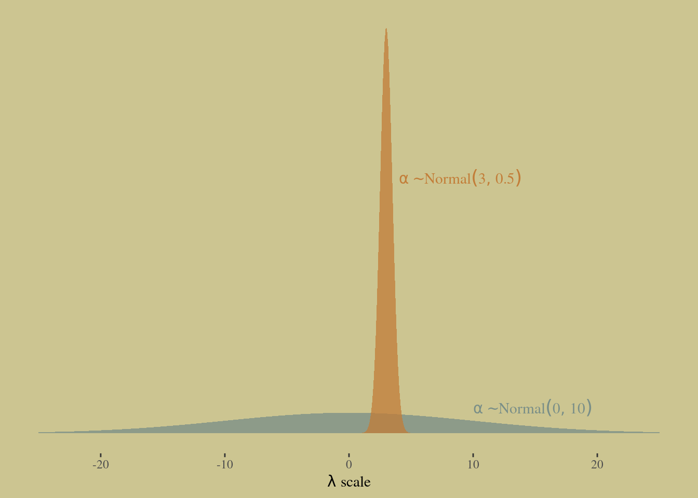

# God Spiked the Integers


```r
library(here)
source(here::here("code/scripts/source.R"))
```


```r
slides_dir = here::here("docs/slides/L11")
```


>The essential problem is this: When what we wish to predict is a count, the scale of the parameters is never the same as the scale of the outcome.

We will engineer complete examples of the two most common types of count model. 

BINOMIAL REGRESSION is the name we’ll use for a family of related procedures that all model a binary classification — alive/dead, accept/reject, left/right—for which the total of both categories is known. This is like the marble and globe tossing examples from Chapter 2. But now you get to incorporate predictor variables. 

POISSON REGRESSION is a GLM that models a count with an unknown maximum—number of elephants in Kenya, number of applications to a PhD program, number of significance tests in an issue of Psychological Science. As described in Chapter 10, the Poisson model is a special case of binomial. At the end, the chapter describes some other count regressions.

## Binomial regression

There are two common flavours of GLM that use binomial probability functions: 

1. **Logistic regression**: data are organized into single-trial cases, such that the outcome variable can only take values 0 and 1.

1. **Aggregated binomial regression**: When individual trials with the same covariate values are instead aggregated together. In this case, the outcome can take the value zero or any positive integer up to n, the number of trials.

Both flavors use the same logit link function.

***11.1.1. Logistic regression: Prosocial chimpanzees***

<div class="figure">

<p class="caption">Example dataset. Imagine you're a chimp on the close side. If you pull a lever, it's expand out on both sides. There may or may not be food in both trays. If you pull the right, they other chimp will get the snack too. Interested in whetehr chimps care about this distinction. It's not enough to do the experiment. They might pull the right because there's more food there. One of the treatments is to remove the partner from the other end. Also chimpanzees are handed, so you have to adjust for that. BUt you want to know the differnce - do they pulll the prosocial option more if there's a chimp on the other end. </p>
</div>


```r
data(chimpanzees, package = "rethinking")
d <- chimpanzees
rm(chimpanzees)

d %>% 
  distinct(prosoc_left, condition) %>% 
  mutate(description = c("Two food items on right and no partner",
                         "Two food items on left and no partner",
                         "Two food items on right and partner present",
                         "Two food items on left and partner present")) %>% 
  DT::datatable()
```

```{=html}
<div id="htmlwidget-5eca4bd235090ce48432" style="width:100%;height:auto;" class="datatables html-widget"></div>
<script type="application/json" data-for="htmlwidget-5eca4bd235090ce48432">{"x":{"filter":"none","data":[["1","2","3","4"],[0,0,1,1],[0,1,0,1],["Two food items on right and no partner","Two food items on left and no partner","Two food items on right and partner present","Two food items on left and partner present"]],"container":"<table class=\"display\">\n  <thead>\n    <tr>\n      <th> <\/th>\n      <th>condition<\/th>\n      <th>prosoc_left<\/th>\n      <th>description<\/th>\n    <\/tr>\n  <\/thead>\n<\/table>","options":{"columnDefs":[{"className":"dt-right","targets":[1,2]},{"orderable":false,"targets":0}],"order":[],"autoWidth":false,"orderClasses":false}},"evals":[],"jsHooks":[]}</script>
```


<div class="figure">

<p class="caption">Alone with no other chimp. Prosocial and asocial option is balanced across left and right. We want to predict the outcome as a function of the condition -the total treatment. </p>
</div>

It would be conventional to include these two variables and their interaction using dummy variables. We're going to follow McElreath and use an index variable approach. 

```r
d <-
  d %>% 
  mutate(treatment = factor(1 + prosoc_left + 2 * condition)) %>% 
  # this will come in handy, later
  mutate(labels = factor(treatment,
                         levels = 1:4,
                         labels = c("r/n", "l/n", "r/p", "l/p")))
```

Now treatment contains the values 1 through 4, matching the numbers in the list above. You can verify by using cross-tabs:


```r
d %>% 
  count(condition, treatment, prosoc_left)
```

```
##   condition treatment prosoc_left   n
## 1         0         1           0 126
## 2         0         2           1 126
## 3         1         3           0 126
## 4         1         4           1 126
```


<div class="figure">

<p class="caption">Four possible distinct unordered treatments. Wnat to estimate the tendency to pull the lever. The linear model on teh left is the Binomial. $lpha$ measures handedness. Then we have a vector of four $\beta$ parameters$, one for each treatment. Note that the Bernoullli is just the Binomial with one trial.</p>
</div>

<div class="figure">

<p class="caption">How to do priors? They behave in GLMs in very unpredictable ways. So need to do prior simulation. Let's consider a skeletal verison of Bionmal regression where the linear model is some alpha, some intercept, the average log odds across all trials. What kind of prior to set on that. Let's set a Gaussian. Centered on a half. But what about the scale? What happens when you pick $\omega$.</p>
</div>

<div class="figure">

<p class="caption">Let's try with $''omega = 10$. </p>
</div>


We need to pick a value for $\omega$. To emphasize the madness of conventional flat priors, let’s start with something rather flat, like $\omega = 10$. 


```r
b11.1 <-
  brms::brm(data = d, 
            family = binomial,
            pulled_left | trials(1) ~ 1,
            prior(normal(0, 10), class = Intercept),
            seed = 11,
            sample_prior = T,
            file = "fits/b11.01")
```


```r
library(wesanderson)
library(ggthemes)

theme_set(
  theme_default() + 
    theme_tufte() +
    theme(plot.background = element_rect(fill = wes_palette("Moonrise2")[3],
                                         color = wes_palette("Moonrise2")[3]))
)
```


Now let’s sample from the prior:


```r
brms::prior_samples(b11.1) %>% 
  mutate(p = inv_logit_scaled(Intercept)) %>% 
  
  ggplot(aes(x = p)) +
  geom_density(fill = wes_palette("Moonrise2")[4], 
               size = 0, adjust = 0.1) +
  scale_y_continuous(NULL, breaks = NULL) +
  xlab("prior prob pull left")
```


```r
b11.1b <-
  brm(data = d, 
      family = binomial,
      pulled_left | trials(1) ~ 1,
      prior(normal(0, 1.5), class = Intercept),
      seed = 11,
      sample_prior = T,
      file = "fits/b11.01b")
```


One step remains. We need to convert the parameter to the outcome scale. This means using the INVERSE-LINK FUNCTION, as discussed in the previous chapter. In this case, the link function is logit, so the inverse link is `inv_logit`.


```r
# wrangle
bind_rows(brms::prior_samples(b11.1),
          brms::prior_samples(b11.1b)) %>% 
  mutate(p = brms::inv_logit_scaled(Intercept),
         w = factor(rep(c(10, 1.5), each = n() / 2),
                    levels = c(10, 1.5))) %>% 
  
  # plot
  ggplot(aes(x = p, fill = w)) +
  geom_density(size = 0, alpha = 3/4, adjust = 0.1) +
  scale_fill_manual(expression(italic(w)), values = wes_palette("Moonrise2")[c(4, 1)]) +
  scale_y_continuous(NULL, breaks = NULL) +
  labs(title = expression(alpha%~%Normal(0*", "*italic(w))),
       x = "prior prob pull left")
```


The model thinks, before it sees the data, that chimpanzees either never or always pull the left lever.

<div class="figure">

<p class="caption">What happens is we have the prior proabability scale. THe black density curve is the prior where you assign alpha the normal 0,10. Because a Gaussian distribution has huge amount of mass beyond absolute 3. Most of the mass is outside the extremes. Because the range of the log-odds scale is -4,4. So when you change it to the probabilty scale, it puts a lot of probability in the tails. We can adopt this heuritsitc postiion of having something flat, which is normal with omega of 1.5</p>
</div>

---


```r
slides_dir = here::here("docs/slides/L12")
```


<div class="figure">

<p class="caption">Some motivation. These are simulated fireflies. They synchronise their flashes. The whole forest will flash at once. They're slowly synchroninising. Each is a clock, and when it hits 12 it flashes, but they turn their clocks forward each time a firefly near them flashes. That's all that's required to get perfect synchrony. Heartbeats do this. We're stuyding discrete phenomena. And what's interesting is that underneath they aren't discrete. Just like the GLMs I'm teaching. </p>
</div>

<div class="figure">

<p class="caption">Number of belts close together, like Saturn's rings. There are significant gaps, and they occur at even integer ratios of Jupite's orbits. It's like God spiked the integers. </p>
</div>

<div class="figure">

<p class="caption">Jupiter is like a large parent pushing you on a swing. It pushes asteroids out of orbit when it gets to push them at the same orbit at every time. When it's not at some integer resonance, it'll stay there to be found as an asteroid. Nature is full of discrete phenomena, but underneath they're not discrete; they're complicated. </p>
</div>

<div class="figure">

<p class="caption">We turn to these models. To remind you, we're processesing chimp lever-pulling data. We're dealing with getting sinsible priors. Last time it was about slope. Now we're also thinking about treatments. There are 4 treatments. Partner at the table or not, and whether the food is on the left or right. We want to measure unqiue log-odds for each of those. Flat prior on the logit scale is definitely not flat on the probability scale. Same problem for the treatment. For the prior predictives, we want to look at the distribution of differences.</p>
</div>


```r
# w = 10
b11.2 <- 
  brm(data = d, 
      family = binomial,
      bf(pulled_left | trials(1) ~ a + b,
         a ~ 1, 
         b ~ 0 + treatment,
         nl = TRUE),
      prior = c(prior(normal(0, 1.5), nlpar = a),
                prior(normal(0, 10), nlpar = b, coef = treatment1),
                prior(normal(0, 10), nlpar = b, coef = treatment2),
                prior(normal(0, 10), nlpar = b, coef = treatment3),
                prior(normal(0, 10), nlpar = b, coef = treatment4)),
      iter = 2000, warmup = 1000, chains = 4, cores = 4,
      seed = 11,
      sample_prior = T,
      file = "fits/b11.02")

# w = 0.5
b11.3 <- 
  brm(data = d, 
      family = binomial,
      bf(pulled_left | trials(1) ~ a + b,
         a ~ 1, 
         b ~ 0 + treatment,
         nl = TRUE),
      prior = c(prior(normal(0, 1.5), nlpar = a),
                prior(normal(0, 0.5), nlpar = b, coef = treatment1),
                prior(normal(0, 0.5), nlpar = b, coef = treatment2),
                prior(normal(0, 0.5), nlpar = b, coef = treatment3),
                prior(normal(0, 0.5), nlpar = b, coef = treatment4)),
      iter = 2000, warmup = 1000, chains = 4, cores = 4,
      seed = 11,
      sample_prior = T,
      file = "fits/b11.03")
```

Plot the absolute prior difference between the first two treatments.


```r
# wrangle
prior <-
  bind_rows(prior_samples(b11.2),
            prior_samples(b11.3)) %>% 
  mutate(w  = factor(rep(c(10, 0.5), each = n() / 2),
                     levels = c(10, 0.5)),
         p1 = inv_logit_scaled(b_a + b_b_treatment1),
         p2 = inv_logit_scaled(b_a + b_b_treatment2)) %>% 
  mutate(diff = abs(p1 - p2)) 

# plot
prior %>% 
  ggplot(aes(x = diff, fill = w)) +
  geom_density(size = 0, alpha = 3/4, adjust = 0.1) +
  scale_fill_manual(expression(italic(w)), values = wes_palette("Moonrise2")[c(4, 2)]) +
  scale_y_continuous(NULL, breaks = NULL) +
  labs(title = expression(alpha%~%Normal(0*", "*italic(w))),
       x = "prior diff between treatments")
```


<div class="figure">

<p class="caption">I'm using `rnorm` to sample some parameter values and look at some differences. Left is simulating the intercept alpha. A flat prior transformed to the probability scale it puts all the mass at 0 and 1, so we use 1.5. On the right we have the difference. The biggest difference is 1, smallest is 0. Again if you iuse something large on the logit scale, on the probability scale assumes that the treatments are either 0 or 1. We want it to reflect that the differences probably aren't large. To be near 0 you need a tighter scale parameter.</p>
</div>

<div class="figure">

<p class="caption">Ran four chains and here's the summary. 7 chimp parameters and 4 treatment parameters. Each posterior mean is on the logit scale, so this is the log-odds handedness preference. Above 0 means they pull the left lever more than chance. You can see there's a tendency for right-handedness. Chimp 2 knows what chimp 2 wants, which is the left lever. </p>
</div>

Let’s turn to Hamiltonian Monte Carlo to approximate the posterior, so you can get some practice with it.

Save `actor` as a factor:


```r
d <-
  d %>% 
  mutate(actor = factor(actor))
```

Now start the Markov chain. Add `log_lik=TRUE` to the call, so that `ulam` computes the values necessary for PSIS and WAIC. 


```r
b11.4 <- 
  brm(data = d, 
      family = binomial,
      bf(pulled_left | trials(1) ~ a + b,
         a ~ 0 + actor, 
         b ~ 0 + treatment,
         nl = TRUE),
      prior = c(prior(normal(0, 1.5), nlpar = a),
                prior(normal(0, 0.5), nlpar = b)),
      iter = 2000, warmup = 1000, chains = 4, cores = 4,
      seed = 11,
      file = "fits/b11.04")
```


```r
print(b11.4)
```

```
##  Family: binomial 
##   Links: mu = logit 
## Formula: pulled_left | trials(1) ~ a + b 
##          a ~ 0 + actor
##          b ~ 0 + treatment
##    Data: d (Number of observations: 504) 
## Samples: 4 chains, each with iter = 2000; warmup = 1000; thin = 1;
##          total post-warmup samples = 4000
## 
## Population-Level Effects: 
##              Estimate Est.Error l-95% CI u-95% CI Rhat Bulk_ESS Tail_ESS
## a_actor1        -0.44      0.33    -1.06     0.19 1.00     1260     2039
## a_actor2         3.90      0.74     2.59     5.51 1.00     3768     2944
## a_actor3        -0.74      0.34    -1.42    -0.09 1.00     1341     2357
## a_actor4        -0.74      0.34    -1.42    -0.12 1.00     1352     2154
## a_actor5        -0.44      0.33    -1.08     0.22 1.00     1372     2550
## a_actor6         0.49      0.34    -0.16     1.14 1.00     1346     2499
## a_actor7         1.97      0.42     1.19     2.81 1.00     2023     2359
## b_treatment1    -0.05      0.28    -0.59     0.52 1.00     1195     2433
## b_treatment2     0.47      0.28    -0.07     1.04 1.00     1088     2249
## b_treatment3    -0.40      0.29    -0.95     0.17 1.00     1135     2196
## b_treatment4     0.36      0.28    -0.18     0.90 1.00     1062     2158
## 
## Samples were drawn using sampling(NUTS). For each parameter, Bulk_ESS
## and Tail_ESS are effective sample size measures, and Rhat is the potential
## scale reduction factor on split chains (at convergence, Rhat = 1).
```

<div class="figure">

<p class="caption">Let's look at the individual difference parameters. Chimp 2 is 'lefty'. He never pulled the right lever. The others have some more variation, with a slight tnedency for handedness. 7 has no preference. So handedness adds noise. It's not technically a confound, but it makes measurement harder. Backdoor criterion doesn't tell you to control for handedness. We don't need it because this is an experiment.</p>
</div>


```r
post <- brms::posterior_samples(b11.4)

post %>% 
  pivot_longer(contains("actor")) %>%
  mutate(probability = brms::inv_logit_scaled(value),
         actor       = factor(str_remove(name, "b_a_actor"),
                              levels = 7:1)) %>% 
  
  ggplot(aes(x = probability, y = actor)) +
  geom_vline(xintercept = .5, color = wes_palette("Moonrise2")[1], linetype = 3) +
  tidybayes::stat_pointinterval(.width = .95, size = 1/2,
                     color = wes_palette("Moonrise2")[4]) +
  scale_x_continuous(expression(alpha[actor]), limits = 0:1) +
  ylab(NULL) +
  theme(axis.ticks.y = element_blank())
```


<div class="figure">

<p class="caption">N = no partner; P = partner. This is an example of how hard it is to figure out what happened in the experiment. The contrasts of interest are the interaction. We need them to choose the prosocial option more when there's a parter on the other end, not just because there's more food on that side. When the prosocial option is on the left, we'd expect higher estimates. For the other two treatments are on the right hand side, and they do, but there's not much of an interaction effect. The side of the prosocial option has more effect, but not as much of the handedness. </p>
</div>

On the logit scale:


```r
tx <- c("R/N", "L/N", "R/P", "L/P")

post %>% 
  dplyr::select(contains("treatment")) %>% 
  set_names("R/N","L/N","R/P","L/P") %>% 
  pivot_longer(everything()) %>%
  mutate(probability = brms::inv_logit_scaled(value),
         treatment   = factor(name, levels = tx)) %>% 
  mutate(treatment = fct_rev(treatment)) %>% 
  
  ggplot(aes(x = value, y = treatment)) +
  geom_vline(xintercept = 0, color = wes_palette("Moonrise2")[2], linetype = 3) +
  tidybayes::stat_pointinterval(.width = .95, size = 1/2,
                                color = wes_palette("Moonrise2")[4]) +
  labs(x = expression(beta[treatment]),
       y = NULL) +
  theme(axis.ticks.y = element_blank())
```


You can probably see already that there isn’t much evidence of prosocial intention in these data. But let’s calculate the differences between no-partner/partner and make sure.


```r
post %>% 
  mutate(db13 = b_b_treatment1 - b_b_treatment3,
         db24 = b_b_treatment2 - b_b_treatment4) %>% 
  pivot_longer(db13:db24) %>%
  mutate(diffs = factor(name, levels = c("db24", "db13"))) %>% 
  
  ggplot(aes(x = value, y = diffs)) +
  geom_vline(xintercept = 0, color = wes_palette("Moonrise2")[2], linetype = 3) +
  tidybayes::stat_pointinterval(.width = .95, size = 1/2,
                     color = wes_palette("Moonrise2")[4]) +
  labs(x = "difference",
       y = NULL) +
  theme(axis.ticks.y = element_blank())
```


Now let’s consider a posterior prediction check. Let’s summarize the proportions of left pulls for each actor in each treatment and then plot against the posterior predictions. First, to calculate the proportion in each combination of `actor` and `treatment`:


```r
d %>%
  group_by(actor, treatment) %>%
  summarise(proportion = mean(pulled_left)) %>% 
  filter(actor == 1)
```

```
## `summarise()` has grouped output by 'actor'. You can override using the `.groups` argument.
```

```
## # A tibble: 4 × 3
## # Groups:   actor [1]
##   actor treatment proportion
##   <fct> <fct>          <dbl>
## 1 1     1              0.333
## 2 1     2              0.5  
## 3 1     3              0.278
## 4 1     4              0.556
```


<div class="figure">

<p class="caption">It's much easier to just plot this stuff on the outcome scale. Just push the posterior distribution out through the model onto the prediction scale. This is the raw data, with some augmented lines. Each group is an actor, and I've taken all pulls and averaged them. The different treatment are points. Filled are partners. You can see that other than 2, they pull the left lever more when there is more food on that side. But the lines are pretty horizontal. If they titled more, you'd get a big change when you added a partner, but we don't see that consistently. That's the raw data. </p>
</div>

<div class="figure">

<p class="caption">Now look at the posterior predictions. This is what it thinks. Sees that every chimp has the same partner effect. Can't vary based on actor. If anything, adding a partner reduced the tendency to pull left. Look at actor 2's predictions. The model is not sure that it would never pull it again. So even though the data has no variation in it, the model does. With 5-year-old kids, adding a partner changes everything.</p>
</div>


```r
p1 <-
  d %>%
  group_by(actor, treatment) %>%
  summarise(proportion = mean(pulled_left)) %>% 
  left_join(d %>% distinct(actor, treatment, labels, condition, prosoc_left),
            by = c("actor", "treatment")) %>% 
  mutate(condition = factor(condition)) %>% 
  
  ggplot(aes(x = labels, y = proportion)) +
  geom_hline(yintercept = .5, color = wes_palette("Moonrise2")[3]) +
  geom_line(aes(group = prosoc_left),
            size = 1/4, color = wes_palette("Moonrise2")[4]) +
  geom_point(aes(color = condition),
             size = 2.5, show.legend = F) + 
  labs(subtitle = "observed proportions")
```

```
## `summarise()` has grouped output by 'actor'. You can override using the `.groups` argument.
```


Compute the posterior predictions:


```r
nd <- 
  d %>% 
  distinct(actor, treatment, labels, condition, prosoc_left)

p2 <-
  fitted(b11.4,
         newdata = nd) %>% 
  data.frame() %>% 
  bind_cols(nd) %>% 
  mutate(condition = factor(condition)) %>% 
  
  ggplot(aes(x = labels, y = Estimate, ymin = Q2.5, ymax = Q97.5)) +
  geom_hline(yintercept = .5, color = wes_palette("Moonrise2")[3]) +
  geom_line(aes(group = prosoc_left),
            size = 1/4, color = wes_palette("Moonrise2")[4]) +
  geom_pointrange(aes(color = condition),
                  fatten = 2.5, show.legend = F) + 
  labs(subtitle = "posterior predictions")

# combine the two ggplots
library(patchwork)

(p1 / p2) &
  scale_color_manual(values = wes_palette("Moonrise2")[c(2:1)]) &
  scale_y_continuous("proportion left lever", 
                     breaks = c(0, .5, 1), limits = c(0, 1)) &
  xlab(NULL) &
  theme(axis.ticks.x = element_blank(),
        panel.background = element_rect(fill = alpha("white", 1/10), size = 0)) &
  facet_wrap(~ actor, nrow = 1, labeller = label_both)
```


The model expects almost no change when adding a partner. Most of the variation in predictions comes from the actor intercepts. Handedness seems to be the big story of this experiment.

The data themselves show additional variation—some of the actors possibly respond more to the treatments than others do. We might consider a model that allows each unique actor to have unique treatment parameters. But we’ll leave such a model until we arrive at multilevel models, because we’ll need some additional tricks to do the model well.

Let's confirm that a simpler model will do just fine, because there doesn't seem to be any evidence of an interaction between location of the prosocial option and the presence of a partner. 

To confirm this, here are the new index variables we'll need:


```r
d <-
  d %>% 
  mutate(side = factor(prosoc_left + 1),  # right 1, left 2
         cond = factor(condition + 1))    # no partner 1, partner 2
```

<div class="figure">

<p class="caption">If you want to do model comparison, you'll have to add this `log_lik` which computes the log probability of each observation. Once you hav those, they get spit out of the chain. Have to do it optionally because it can exhaust the memory on your computer. So if you don't need it, don't add it. Here I'm using `LOO` to compare. There's no interaction because there's no unique parameter for that. Now we can confirm that the interaction is not doing any work, because the models are the same on the prediction scale.</p>
</div>


```r
b11.5 <- 
  brm(data = d, 
      family = binomial,
      bf(pulled_left | trials(1) ~ a + bs + bc,
         a ~ 0 + actor, 
         bs ~ 0 + side, 
         bc ~ 0 + cond,
         nl = TRUE),
      prior = c(prior(normal(0, 1.5), nlpar = a),
                prior(normal(0, 0.5), nlpar = bs),
                prior(normal(0, 0.5), nlpar = bc)),
      iter = 2000, warmup = 1000, chains = 4, cores = 4,
      seed = 11,
      file = "fits/b11.05")
```

Comparing the two models with PSIS:


```r
b11.4 <- add_criterion(b11.4, c("loo", "waic"))
b11.5 <- add_criterion(b11.5, c("loo", "waic"))

brms::loo_compare(b11.4, b11.5, criterion = "loo") %>% print(simplify = F)
```

```
##       elpd_diff se_diff elpd_loo se_elpd_loo p_loo  se_p_loo looic  se_looic
## b11.5    0.0       0.0  -265.3      9.6         7.7    0.4    530.6   19.1  
## b11.4   -0.8       0.6  -266.1      9.5         8.5    0.4    532.2   19.0
```


```r
brms::loo_compare(b11.4, b11.5, criterion = "waic") %>% print(simplify = F)
```

```
##       elpd_diff se_diff elpd_waic se_elpd_waic p_waic se_p_waic waic   se_waic
## b11.5    0.0       0.0  -265.3       9.6          7.7    0.4     530.6   19.1 
## b11.4   -0.8       0.6  -266.1       9.5          8.5    0.4     532.2   19.0
```


<div class="figure">

<p class="caption">You'll get used to bionmial and logistical regression through examples. You can talk about effect scales in two different ways. And you need both. When you're looking at differences between parameters on the log-odds scale, they're relative. Why? Because you're not talking about the probability of the event happening. But if you want to predict how it happens in the real world, then the base rate matters. That's absolute. Something can seem really big when the absolute effect is small. The proportional odds adjustment is 0.9. So that's 90% of the previous odds. If you switch the lever, you reduce the odds by 90%. The risk with this is that unimportant things  can seem super important on the relative scale... because of base rate effects.</p>
</div>


```r
brms::model_weights(b11.4, b11.5, weights = "loo") %>% round(digits = 2)
```

```
## b11.4 b11.5 
##  0.32  0.68
```


```r
brms::model_weights(b11.4, b11.5, weights = "waic") %>% round(digits = 2)
```

```
## b11.4 b11.5 
##  0.32  0.68
```


```r
print(b11.5)
```

```
##  Family: binomial 
##   Links: mu = logit 
## Formula: pulled_left | trials(1) ~ a + bs + bc 
##          a ~ 0 + actor
##          bs ~ 0 + side
##          bc ~ 0 + cond
##    Data: d (Number of observations: 504) 
## Samples: 4 chains, each with iter = 2000; warmup = 1000; thin = 1;
##          total post-warmup samples = 4000
## 
## Population-Level Effects: 
##          Estimate Est.Error l-95% CI u-95% CI Rhat Bulk_ESS Tail_ESS
## a_actor1    -0.63      0.45    -1.49     0.28 1.00     1276     1864
## a_actor2     3.72      0.78     2.31     5.38 1.00     2236     2356
## a_actor3    -0.94      0.46    -1.84    -0.06 1.00     1348     2115
## a_actor4    -0.94      0.46    -1.83    -0.05 1.00     1320     1932
## a_actor5    -0.64      0.45    -1.53     0.23 1.00     1343     2201
## a_actor6     0.30      0.45    -0.60     1.17 1.00     1374     2021
## a_actor7     1.78      0.52     0.74     2.81 1.00     1542     2339
## bs_side1    -0.20      0.34    -0.85     0.47 1.00     1377     2164
## bs_side2     0.49      0.33    -0.17     1.12 1.00     1333     1869
## bc_cond1     0.27      0.34    -0.38     0.94 1.00     1504     1963
## bc_cond2     0.03      0.33    -0.61     0.69 1.00     1577     2074
## 
## Samples were drawn using sampling(NUTS). For each parameter, Bulk_ESS
## and Tail_ESS are effective sample size measures, and Rhat is the potential
## scale reduction factor on split chains (at convergence, Rhat = 1).
```


```r
brms::log_lik(b11.5) %>% str()
```

```
##  num [1:4000, 1:504] -0.417 -0.345 -0.499 -0.58 -0.669 ...
##  - attr(*, "dimnames")=List of 2
##   ..$ : NULL
##   ..$ : NULL
```

The log_lik matrix at the top contains all of the log-probabilities needed to calculate WAIC and PSIS. 
Finally, we loop over the observations and calculate the binomial probability of each, conditional on the parameters.
 

 
***11.1.2. Relative shark and absolute deer***

<div class="figure">

<p class="caption">The parable of absolute shark and relative penguin. This says don't worry about sharks. Why is it easy to believe that more deer kill people than sharks? Because people aren't aquatic. There's an exposure effect. Each individual deer is less dangerous. THe absolute danger of a shark conditioning on the distibution of people acorss the earth is very small. But what if you're a penguin? HTen the absolute risk is much larger. </p>
</div>

<div class="figure">

<p class="caption">Relative effects are useful, but misused in epidemiological risk because it can make a very rare disease look dangerous when something you do doubles the risk. 3/4 of all lung cancer is cauised by smoking, but lung cancer is still very rare. MOst of the risk is from heart disease. But you really need relative effect to do cuasual inference to transfer results to things with different base rates. YOu need to think about both. </p>
</div>

<div class="figure">

<p class="caption">We worry about lots of public health risks. Here's a famous case from the UK. Study of the way that a pill could create blood clots. Turns out that on average they develop in the absence of the pill at 1/1000. (In reality more like 1/10000). Lots of women stopped taking birth control and got pregrant, wihicn is much more dangerous. THis happens whenever th econdition of interest has a really low baserate. A big change in relative risk doesn't make a big absolute difference. But it does when the base rate is large.</p>
</div>

It is more common to see logistic regressions interpreted through RELATIVE EFFECTS. Relative effects are proportional changes in the odds of an outcome. If we change a variable and say the odds of an outcome double, then we are discussing relative effects. You can calculate these PROPORTIONAL ODDS relative effect sizes by simply exponentiating the parameter of interest. For example, to calculate the proportional odds of switching from treatment 2 to treatment 4 (adding a partner):


```r
brms::posterior_samples(b11.4) %>% 
  mutate(proportional_odds = exp(b_b_treatment4 - b_b_treatment2)) %>% 
  tidybayes::mean_qi(proportional_odds)
```

```
## # A tibble: 1 × 6
##   proportional_odds .lower .upper .width .point .interval
##               <dbl>  <dbl>  <dbl>  <dbl> <chr>  <chr>    
## 1             0.929  0.521   1.54   0.95 mean   qi
```
>On average, the switch multiplies the odds of pulling the left lever by 0.92, an 8% reduction in odds. This is what is meant by proportional odds. The new odds are calculated by taking the old odds and multiplying them by the proportional odds, which is 0.92 in this example. (p. 336)

***11.1.3. Aggregated binomial: Chimpanzees again, condensed***

In the `chimpanzees` data context, the models all calculated the likelihood of observing either zero or one pulls of the left-hand lever. The models did so, because the data were organized such that each row describes the outcome of a single pull. But in principle the same data could be organized differently. As long as we don’t care about the order of the individual pulls, the same information is contained in a count of how many times each individual pulled the left-hand lever, for each combination of predictor variables.

For example, to calculate the number of times each chimpanzee pulled the left-hand lever, for each combination of predictor values:


```r
d_aggregated <-
  d %>%
  group_by(treatment, actor, side, cond) %>%
  summarise(left_pulls = sum(pulled_left)) %>% 
  ungroup()
```

```
## `summarise()` has grouped output by 'treatment', 'actor', 'side'. You can override using the `.groups` argument.
```

```r
d_aggregated %>%
  head(n = 8)
```

```
## # A tibble: 8 × 5
##   treatment actor side  cond  left_pulls
##   <fct>     <fct> <fct> <fct>      <int>
## 1 1         1     1     1              6
## 2 1         2     1     1             18
## 3 1         3     1     1              5
## 4 1         4     1     1              6
## 5 1         5     1     1              6
## 6 1         6     1     1             14
## 7 1         7     1     1             14
## 8 2         1     2     1              9
```


```r
b11.6 <- 
  brm(data = d_aggregated, 
      family = binomial,
      bf(left_pulls | trials(18) ~ a + b,
         a ~ 0 + actor, 
         b ~ 0 + treatment,
         nl = TRUE),
      prior = c(prior(normal(0, 1.5), nlpar = a),
                prior(normal(0, 0.5), nlpar = b)),
      iter = 2000, warmup = 1000, chains = 4, cores = 4,
      seed = 11,
      file = "fits/b11.06")
```


```r
print(b11.6)
```

```
##  Family: binomial 
##   Links: mu = logit 
## Formula: left_pulls | trials(18) ~ a + b 
##          a ~ 0 + actor
##          b ~ 0 + treatment
##    Data: d_aggregated (Number of observations: 28) 
## Samples: 4 chains, each with iter = 2000; warmup = 1000; thin = 1;
##          total post-warmup samples = 4000
## 
## Population-Level Effects: 
##              Estimate Est.Error l-95% CI u-95% CI Rhat Bulk_ESS Tail_ESS
## a_actor1        -0.46      0.32    -1.09     0.17 1.00     1222     1894
## a_actor2         3.88      0.74     2.57     5.56 1.00     3309     2485
## a_actor3        -0.76      0.33    -1.41    -0.11 1.00     1344     2078
## a_actor4        -0.76      0.33    -1.41    -0.11 1.00     1108     1990
## a_actor5        -0.45      0.33    -1.10     0.19 1.00     1097     1833
## a_actor6         0.47      0.34    -0.19     1.15 1.00     1107     2113
## a_actor7         1.95      0.42     1.14     2.79 1.00     1981     2851
## b_treatment1    -0.03      0.29    -0.59     0.52 1.00      987     1883
## b_treatment2     0.49      0.28    -0.06     1.04 1.00     1073     1985
## b_treatment3    -0.37      0.29    -0.95     0.19 1.00     1078     2015
## b_treatment4     0.37      0.28    -0.20     0.92 1.00     1096     1851
## 
## Samples were drawn using sampling(NUTS). For each parameter, Bulk_ESS
## and Tail_ESS are effective sample size measures, and Rhat is the potential
## scale reduction factor on split chains (at convergence, Rhat = 1).
```


```r
# this is just for fancy annotation
text <-
  tibble(value = c(1.4, 2.6),
         name  = "b_a_actor7",
         fit   = c("b11.6", "b11.4"))

# rope in the posterior draws and wrangle
bind_rows(brms::posterior_samples(b11.4),
          brms::posterior_samples(b11.6)) %>% 
  mutate(fit = rep(c("b11.4", "b11.6"), each = n() / 2)) %>% 
  pivot_longer(b_a_actor1:b_b_treatment4) %>% 
  
  # plot
  ggplot(aes(x = value, y = name, color = fit)) +
  stat_pointinterval(.width = .95, size = 2/3,
                     position = position_dodge(width = 0.5)) +
  scale_color_manual(values = wes_palette("Moonrise2")[2:1]) +
  geom_text(data = text,
            aes(label = fit),
            family = "Times", position = position_dodge(width = 2.25)) +
  labs(x = "posterior (log-odds scale)",
       y = NULL) +
  theme(axis.ticks.y = element_blank(),
        legend.position = "none")
```


This makes the aggregated probabilities larger—there are more ways to see the data. So the PSIS/WAIC scores end up being smaller. Go ahead and try it with the simple example here:


```r
b11.4 <- brms::add_criterion(b11.4, "loo")
b11.6 <- brms::add_criterion(b11.6, "loo")

loo(b11.4)
```

```
## 
## Computed from 4000 by 504 log-likelihood matrix
## 
##          Estimate   SE
## elpd_loo   -266.1  9.5
## p_loo         8.5  0.4
## looic       532.2 19.0
## ------
## Monte Carlo SE of elpd_loo is 0.0.
## 
## All Pareto k estimates are good (k < 0.5).
## See help('pareto-k-diagnostic') for details.
```

```r
loo(b11.6)
```

```
## 
## Computed from 4000 by 28 log-likelihood matrix
## 
##          Estimate  SE
## elpd_loo    -57.2 4.2
## p_loo         8.5 1.5
## looic       114.4 8.5
## ------
## Monte Carlo SE of elpd_loo is 0.1.
## 
## Pareto k diagnostic values:
##                          Count Pct.    Min. n_eff
## (-Inf, 0.5]   (good)     20    71.4%   923       
##  (0.5, 0.7]   (ok)        8    28.6%   597       
##    (0.7, 1]   (bad)       0     0.0%   <NA>      
##    (1, Inf)   (very bad)  0     0.0%   <NA>      
## 
## All Pareto k estimates are ok (k < 0.7).
## See help('pareto-k-diagnostic') for details.
```

>Before looking at the Pareto $k$ values, you might have noticed already that we didn’t get a similar warning before in the disaggregated logistic models of the same data. Why not? Because when we aggregated the data by actor-treatment, we forced PSIS (and WAIC) to imagine cross-validation that leaves out all 18 observations in each actor-treatment combination. So instead of leave-one-out cross-validation, it is more like leave-eighteen-out. This makes some observations more influential, because they are really now 18 observations.
What’s the bottom line? If you want to calculate WAIC or PSIS, you should use a logistic regression data format, not an aggregated format. Otherwise you are implicitly assuming that only large chunks of the data are separable. (p. 340)

***11.1.4. Aggregated binomial: Graduate school admissions***

<div class="figure">

<p class="caption">Binomial regression takes two flavours. Either Bernoulli as before, or here, 'aggregated bionmial'. Same kind of model with difference in how the data is coded. Graduate admissions data from Berkeley. Worried they might get sued for gender discrimination. See whether there's any evidence of gender bias. </p>
</div>


```r
data(UCBadmit, package = "rethinking")
d <- UCBadmit
rm(UCBadmit)

d
```

```
##    dept applicant.gender admit reject applications
## 1     A             male   512    313          825
## 2     A           female    89     19          108
## 3     B             male   353    207          560
## 4     B           female    17      8           25
## 5     C             male   120    205          325
## 6     C           female   202    391          593
## 7     D             male   138    279          417
## 8     D           female   131    244          375
## 9     E             male    53    138          191
## 10    E           female    94    299          393
## 11    F             male    22    351          373
## 12    F           female    24    317          341
```

Compute our index variable `gid`:

```r
d <- 
  d %>%  
  mutate(gid  = factor(applicant.gender, levels = c("male", "female")),
         case = factor(1:n()))
```

<div class="figure">

<p class="caption">This is the whole dataset. Each application is like a coin flip, with a probabilityt htat the candidate is admitted. There are 6 anonymised departments. `admit` is total offered, `reject` is the complement, and `applications` is the total. You could disaggregate them but it would be a really long table with a row of applications. This is a nice compact way to represent it and run exactly the same model either way.</p>
</div>

<div class="figure">

<p class="caption">Here's the model. Start by considering just hte index for the applcant's gender, male 1 female 2. Run this model, the marginal posterior distributions. This is log-odds. Lower numbers have lower probability on the outcome scale. Males have -0.22 and females -0.83, so it looks like it's biased in favour of males.</p>
</div>


```r
b11.7 <-
  brm(data = d, 
      family = binomial,
      admit | trials(applications) ~ 0 + gid,
      prior(normal(0, 1.5), class = b),
      iter = 2000, warmup = 1000, cores = 4, chains = 4,
      seed = 11,
      file = "fits/b11.07")
```


```r
print(b11.7)
```

```
##  Family: binomial 
##   Links: mu = logit 
## Formula: admit | trials(applications) ~ 0 + gid 
##    Data: d (Number of observations: 12) 
## Samples: 4 chains, each with iter = 2000; warmup = 1000; thin = 1;
##          total post-warmup samples = 4000
## 
## Population-Level Effects: 
##           Estimate Est.Error l-95% CI u-95% CI Rhat Bulk_ESS Tail_ESS
## gidmale      -0.22      0.04    -0.30    -0.14 1.00     3538     2676
## gidfemale    -0.83      0.05    -0.93    -0.73 1.00     2887     2331
## 
## Samples were drawn using sampling(NUTS). For each parameter, Bulk_ESS
## and Tail_ESS are effective sample size measures, and Rhat is the potential
## scale reduction factor on split chains (at convergence, Rhat = 1).
```


<div class="figure">

<p class="caption">Let's calculate the relative and absolute effect sizes. `diff_a` is the difference in log-odds between male and females. Summarise with `precis`. On the probability scale it's between 0.12 and 0.16. That's a huge advantage. If you could swithc your gender, you would get a 10% advantage in admission. That's a big effect. Very fewe things have equally big effects.</p>
</div>

The posterior for male applicants, `a[1]`, is higher than that of female applicants. How much higher? We need to compute the contrast. Let’s calculate the contrast on the logit scale (shark) as well as the contrast on the outcome scale (absolute deer):


```r
brms::posterior_samples(b11.7) %>% 
  mutate(diff_a = b_gidmale - b_gidfemale,
         diff_p = inv_logit_scaled(b_gidmale) - inv_logit_scaled(b_gidfemale)) %>% 
  pivot_longer(contains("diff")) %>% 
  group_by(name) %>% 
  tidybayes::mean_qi(value, .width = .89)
```

```
## # A tibble: 2 × 7
##   name   value .lower .upper .width .point .interval
##   <chr>  <dbl>  <dbl>  <dbl>  <dbl> <chr>  <chr>    
## 1 diff_a 0.610  0.504  0.714   0.89 mean   qi       
## 2 diff_p 0.141  0.118  0.165   0.89 mean   qi
```


```r
p <- 
  predict(b11.7) %>% 
  data.frame() %>% 
  bind_cols(d)

text <-
  d %>%
  group_by(dept) %>%
  summarise(case  = mean(as.numeric(case)),
            admit = mean(admit / applications) + .05)

p %>% 
  ggplot(aes(x = case, y = admit / applications)) +
  geom_pointrange(aes(y    = Estimate / applications,
                      ymin = Q2.5     / applications ,
                      ymax = Q97.5    / applications),
                  color = wes_palette("Moonrise2")[1],
                  shape = 1, alpha = 1/3) +
  geom_point(color = wes_palette("Moonrise2")[2]) +
  geom_line(aes(group = dept),
            color = wes_palette("Moonrise2")[2]) +
  geom_text(data = text,
            aes(y = admit, label = dept),
            color = wes_palette("Moonrise2")[2],
            family = "serif") +
  scale_y_continuous("Proportion admitted", limits = 0:1) +
  ggtitle("Posterior validation check") +
  theme(axis.ticks.x = element_blank())
```


>Sometimes a fit this bad is the result of a coding mistake. In this case, it is not. The model did correctly answer the question we asked of it: *What are the average probabilities of admission for women and men, across all departments?* The problem in this case is that men and women did not apply to the same departments, and departments vary in their rates of admission. This makes the answer misleading….
Instead of asking "*What are the average probabilities of admission for women and men across all departments?*" we want to ask “What is the average difference in probability of admission between women and men within departments?” (pp. 342–343, emphasis in the original).

<div class="figure">

<p class="caption">Now push the posterior out through the model and get predictions. Ugly graph. Blue is raw data. Black is predictions. Open circle is posterior mean for each case in data (combination of department and gender). The posteriro predictions go down as you go from male to female, but at the department level, all except 1 are admitted at a higher rate. </p>
</div>

<div class="figure">

<p class="caption">There's a backdoor path into gender. One of them is department. They have idfferent overall admission rates. e.g. physics has small number of applicants, and they take half. Social psychology has many more applicants,a nd take 10%. The applicant for these departments differ on gender. Gender influences which department you apply to. Then department influence probability of admission. Interpretation is legally distinct. One leads to Berkeley getting sued, the other gets them off. There are other backdoors, to explore in the homework. Add another vector of parameters. Estiamte them with deltas. </p>
</div>

<div class="figure">

<p class="caption">Let's first think about what the previous model actually asked. They're like hostile genies, who will answer your questions extremely literally. The first model is not asking what the direct path is. It's asking the total causal effect of gender, not the discrimination effect. If you want just that one path, you have to use a different model. You need to close the back door. </p>
</div>

<div class="figure">

<p class="caption">Need to condition on the department's average admission rates. Both causal questions, but different ones. </p>
</div>

<div class="figure">

<p class="caption">Code for the model on the previous slide. Bunch of delta estimates. Notice that some of them are high. Greater than 0 is more than half of applications. Think they're electrical engineering and physics. Then 6 I think is social psychology. Most applications are rejected. Don't have enough slots for the interest. `a` parameters are basically the same. </p>
</div>


```r
b11.8 <-
  brm(data = d, 
      family = binomial,
      bf(admit | trials(applications) ~ a + d,
         a ~ 0 + gid, 
         d ~ 0 + dept,
         nl = TRUE),
      prior = c(prior(normal(0, 1.5), nlpar = a),
                prior(normal(0, 1.5), nlpar = d)),
      iter = 4000, warmup = 1000, cores = 4, chains = 4,
      seed = 11,
      file = "fits/b11.08") 
```


```r
print(b11.8)
```

```
##  Family: binomial 
##   Links: mu = logit 
## Formula: admit | trials(applications) ~ a + d 
##          a ~ 0 + gid
##          d ~ 0 + dept
##    Data: d (Number of observations: 12) 
## Samples: 4 chains, each with iter = 4000; warmup = 1000; thin = 1;
##          total post-warmup samples = 12000
## 
## Population-Level Effects: 
##             Estimate Est.Error l-95% CI u-95% CI Rhat Bulk_ESS Tail_ESS
## a_gidmale      -0.56      0.56    -1.65     0.52 1.00      922     1011
## a_gidfemale    -0.46      0.56    -1.56     0.61 1.00      930     1010
## d_deptA         1.14      0.56     0.06     2.23 1.00      931     1081
## d_deptB         1.09      0.56     0.01     2.20 1.00      933     1125
## d_deptC        -0.12      0.56    -1.21     0.99 1.00      933     1085
## d_deptD        -0.15      0.56    -1.23     0.96 1.00      930     1083
## d_deptE        -0.60      0.56    -1.68     0.51 1.00      950     1085
## d_deptF        -2.15      0.58    -3.27    -1.03 1.00      968     1229
## 
## Samples were drawn using sampling(NUTS). For each parameter, Bulk_ESS
## and Tail_ESS are effective sample size measures, and Rhat is the potential
## scale reduction factor on split chains (at convergence, Rhat = 1).
```


<div class="figure">

<p class="caption">Again, same code. On the relative scale, codnitioning on department, is on averge -0.1. On the probability scale, it's on average a 2% disadvantage for males, but overlaps 0 a little bit. This is Simpson's paradox, where you add a variable and the effect flips. You can do this endlessly. It has to do with backdoor paths. It could be a spurious reversal, or it could be a causal one. </p>
</div>


```r
brms::posterior_samples(b11.8) %>% 
  mutate(diff_a = b_a_gidmale - b_a_gidfemale,
         diff_p = brms::inv_logit_scaled(b_a_gidmale) - brms::inv_logit_scaled(b_a_gidfemale)) %>% 
  pivot_longer(contains("diff")) %>% 
  group_by(name) %>% 
  mean_qi(value, .width = .89)
```

```
## # A tibble: 2 × 7
##   name     value  .lower  .upper .width .point .interval
##   <chr>    <dbl>   <dbl>   <dbl>  <dbl> <chr>  <chr>    
## 1 diff_a -0.0976 -0.225  0.0293    0.89 mean   qi       
## 2 diff_p -0.0216 -0.0512 0.00639   0.89 mean   qi
```


<div class="figure">

<p class="caption">In this case, the reversal tells us something about teh reason. The system is discrimintory, but the departments would not. </p>
</div>


```r
d %>% 
  group_by(dept) %>% 
  mutate(proportion = applications / sum(applications)) %>% 
  dplyr::select(dept, gid, proportion) %>% 
  pivot_wider(names_from = dept,
              values_from = proportion) %>% 
  mutate_if(is.double, round, digits = 2)
```

```
## # A tibble: 2 × 7
##   gid        A     B     C     D     E     F
##   <fct>  <dbl> <dbl> <dbl> <dbl> <dbl> <dbl>
## 1 male    0.88  0.96  0.35  0.53  0.33  0.52
## 2 female  0.12  0.04  0.65  0.47  0.67  0.48
```


<div class="figure">

<p class="caption">I have a homework problem where you can explore other paths. It's very hard to make causal inference from these samples, because it's not experimental. If you're doing an intervention to fix this, you need more slots for social psychology.</p>
</div>

## Poisson regression

Binomial GLMs are appropriate when the outcome is a count from zero to some known upper bound. If you can analogize the data to the globe tossing model, then you should use a binomial GLM. But often the upper bound isn’t known. Instead the counts never get close to any upper limit. For example, if we go fishing and return with 17 fish, what was the theoretical maximum? Whatever it is, it isn’t in our data. How do we model the fish counts?

<div class="figure">

<p class="caption">Like binomial models, in whcih the number of trials is unknown and very large, but the probability the event happens is very small. lambda is the average number of events. The variance is also lambda.</p>
</div>

<div class="figure">

<p class="caption">Famous dataset of Prussian soliders getting killed by horse kicks.</p>
</div>

***11.2.1. Example: Oceanic tools complexity***

<div class="figure">

<p class="caption">Michelle does ethnographic field work. Interestd in Oceania as a natural experiment in cultutral evolution. Theoretical model that says that cultural evolution is proportional to the logarithm of population size. Even these islands have a small population, they might have a high contact rate.</p>
</div>


```r
data(Kline, package = "rethinking")
d <- Kline
rm(Kline)

d
```

```
##       culture population contact total_tools mean_TU
## 1    Malekula       1100     low          13     3.2
## 2     Tikopia       1500     low          22     4.7
## 3  Santa Cruz       3600     low          24     4.0
## 4         Yap       4791    high          43     5.0
## 5    Lau Fiji       7400    high          33     5.0
## 6   Trobriand       8000    high          19     4.0
## 7       Chuuk       9200    high          40     3.8
## 8       Manus      13000     low          28     6.6
## 9       Tonga      17500    high          55     5.4
## 10     Hawaii     275000     low          71     6.6
```

We’ll want to use regularization to damp down overfitting, as always. But as you’ll see, a lot can still be learned from these data. Any rules you’ve been taught about minimum sample sizes for inference are just non-Bayesian superstitions. If you get the prior back, then the data aren’t enough. It’s that simple.

First make some new columns with the standardized log of population and an index variable for contact:


```r
d <-
  d %>%
  mutate(log_pop_std = (log(population) - mean(log(population))) / sd(log(population)),
         cid         = contact)
```


<div class="figure">

<p class="caption">We'll use a Poisson GLM to model this. Our link is a log-link. This ensures that a parameter is positive. Lambda has to be positive because it's an expected count. </p>
</div>

<div class="figure">

<p class="caption">Can't have a negative expected count. Maps all negative real numbers to the 0,1 interval. e^0 is 1. All of the positive real numbers get mapped from 1 to infinity. It's really explosive. Literally exponential. We exponentiate the curve. 0 or the left scale is mapped to 1. So you get a massive compression of small numbers. And the other half is 1 to infinity. Hard to have intuitions about it, so we should simulate. </p>
</div>

<div class="figure">

<p class="caption">Need to do prior predictive simulation because of this explosive scaling. Play with some rudimentary Poisson with something 'benign' liek Normal(0,10). Plotted that distribution in black. Doesn't look very flat. The mean of this distribution. The tail goes for a very long time. So something like norm(3, 0.5) gives something that we see in these kinds of archaeological datasets. At least now the prior mean isn't in the billions. 9^12 is a lot of tools. An island full of tools.</p>
</div>


I encourage you to play around with the curve code above, trying different means and standard deviations. The fact to appreciate is that a log link puts half of the real numbers—the negative numbers—between 0 and 1 on the outcome scale. 

Here's my weakly informative suggestion:


```r
tibble(x       = c(3, 22),
       y       = c(0.055, 0.04),
       meanlog = c(0, 3),
       sdlog   = c(10, 0.5)) %>% 
  expand(nesting(x, y, meanlog, sdlog),
         number = seq(from = 0, to = 100, length.out = 200)) %>% 
  mutate(density = dlnorm(number, meanlog, sdlog),
         group   = str_c("alpha%~%Normal(", meanlog, ", ", sdlog, ")")) %>% 
  
  ggplot(aes(fill = group, color = group)) +
  geom_area(aes(x = number, y = density),
            alpha = 3/4, size = 0, position = "identity") +
  geom_text(data = . %>% group_by(group) %>% slice(1),
            aes(x = x, y = y, label = group),
            family = "Times", parse = T,  hjust = 0) +
  scale_fill_manual(values = wes_palette("Moonrise2")[1:2]) +
  scale_color_manual(values = wes_palette("Moonrise2")[1:2]) +
  scale_y_continuous(NULL, breaks = NULL) +
  xlab("mean number of tools") +
  theme(legend.position = "none")
```


<div class="figure">

<p class="caption">On the left we have the slopes for the log population. If we put a normal(0,10) prior, it's explosive. That's a problem. Expect that you'll get a billion tools again. On the right something a lot tighter with 0.2, and a lot flatter on the outcome scale. WIth a GLM, if it's flat ont he linear model scale, it's not going to be falt on the outcome scale. But you hav ethe power of prior predictive simulation to sort this out.</p>
</div>


```r
tibble(x    = c(10, 4),
       y    = c(0.05, 0.5),
       mean = c(0, 3),
       sd   = c(10, 0.5)) %>% 
  expand(nesting(x, y, mean, sd),
         number = seq(from = -25, to = 25, length.out = 500)) %>% 
  mutate(density = dnorm(number, mean, sd),
         group   = str_c("alpha%~%Normal(", mean, ", ", sd, ")")) %>% 
  
  ggplot(aes(fill = group, color = group)) +
  geom_area(aes(x = number, y = density),
            alpha = 3/4, size = 0, position = "identity") +
  geom_text(data = . %>% group_by(group) %>% slice(1),
            aes(x = x, y = y, label = group),
            family = "Times", parse = T,  hjust = 0) +
  scale_fill_manual(values = wes_palette("Moonrise2")[1:2]) +
  scale_color_manual(values = wes_palette("Moonrise2")[1:2]) +
  scale_y_continuous(NULL, breaks = NULL) +
  xlab(expression(lambda~scale)) +
  theme(legend.position = "none")
```



This prior is terrible. Of course you will be able to confirm, once we start fitting models, that even 10 observations can overcome these terrible priors. But please remember that we are practicing for when it does matter.

So let's try something much tighter.


```r
set.seed(11)

# how many lines would you like?
n <- 100

# simulate and wrangle
tibble(i = 1:n,
       a = rnorm(n, mean = 3, sd = 0.5)) %>% 
  mutate(`beta%~%Normal(0*', '*10)`  = rnorm(n, mean = 0 , sd = 10),
         `beta%~%Normal(0*', '*0.2)` = rnorm(n, mean = 0 , sd = 0.2)) %>% 
  pivot_longer(contains("beta"),
               values_to = "b",
               names_to = "prior") %>% 
  expand(nesting(i, a, b, prior),
         x = seq(from = -2, to = 2, length.out = 100)) %>% 
  
  # plot
  ggplot(aes(x = x, y = exp(a + b * x), group = i)) +
  geom_line(size = 1/4, alpha = 2/3,
            color = wes_palette("Moonrise2")[4]) +
  labs(x = "log population (std)",
       y = "total tools") +
  coord_cartesian(ylim = c(0, 100)) +
  facet_wrap(~ prior, labeller = label_parsed)
```


Let's view them on the natural population scale:


```r
set.seed(11)

prior <-
  tibble(i = 1:n,
         a = rnorm(n, mean = 3, sd = 0.5),
         b = rnorm(n, mean = 0, sd = 0.2)) %>% 
  expand(nesting(i, a, b),
         x = seq(from = log(100), to = log(200000), length.out = 100))

# left
p1 <-
  prior %>% 
  ggplot(aes(x = x, y = exp(a + b * x), group = i)) +
  geom_line(size = 1/4, alpha = 2/3,
            color = wes_palette("Moonrise2")[4]) +
  labs(subtitle = expression(beta%~%Normal(0*', '*0.2)),
       x = "log population",
       y = "total tools") +
  coord_cartesian(xlim = c(log(100), log(200000)),
                  ylim = c(0, 500))
# right
p2 <-
  prior %>% 
  ggplot(aes(x = exp(x), y = exp(a + b * x), group = i)) +
  geom_line(size = 1/4, alpha = 2/3,
            color = wes_palette("Moonrise2")[4]) +
  labs(subtitle = expression(beta%~%Normal(0*', '*0.2)),
       x = "population",
       y = "total tools") +
  coord_cartesian(xlim = c(100, 200000),
                  ylim = c(0, 500))

# combine
p1 | p2
```


<div class="figure">

<p class="caption">`dpois` is R's Poisson. The top model is intercept only. The model of interest at the bottom. </p>
</div>

Okay, finally we can approximate some posterior distributions. 


```r
# intercept only
b11.9 <-
  brm(data = d, 
      family = poisson,
      total_tools ~ 1,
      prior(normal(3, 0.5), class = Intercept),
      iter = 2000, warmup = 1000, chains = 4, cores = 4,
      seed = 11,
      file = "fits/b11.09") 

# interaction model
b11.10 <-
  brm(data = d, 
      family = poisson,
      bf(total_tools ~ a + b * log_pop_std,
         a + b ~ 0 + cid,
         nl = TRUE),
      prior = c(prior(normal(3, 0.5), nlpar = a),
                prior(normal(0, 0.2), nlpar = b)),
      iter = 2000, warmup = 1000, chains = 4, cores = 4,
      seed = 11,
      file = "fits/b11.10") 
```


```r
print(b11.9)
```

```
##  Family: poisson 
##   Links: mu = log 
## Formula: total_tools ~ 1 
##    Data: d (Number of observations: 10) 
## Samples: 4 chains, each with iter = 2000; warmup = 1000; thin = 1;
##          total post-warmup samples = 4000
## 
## Population-Level Effects: 
##           Estimate Est.Error l-95% CI u-95% CI Rhat Bulk_ESS Tail_ESS
## Intercept     3.54      0.05     3.44     3.65 1.00     1815     1498
## 
## Samples were drawn using sampling(NUTS). For each parameter, Bulk_ESS
## and Tail_ESS are effective sample size measures, and Rhat is the potential
## scale reduction factor on split chains (at convergence, Rhat = 1).
```


```r
print(b11.10)
```

```
##  Family: poisson 
##   Links: mu = log 
## Formula: total_tools ~ a + b * log_pop_std 
##          a ~ 0 + cid
##          b ~ 0 + cid
##    Data: d (Number of observations: 10) 
## Samples: 4 chains, each with iter = 2000; warmup = 1000; thin = 1;
##          total post-warmup samples = 4000
## 
## Population-Level Effects: 
##           Estimate Est.Error l-95% CI u-95% CI Rhat Bulk_ESS Tail_ESS
## a_cidhigh     3.61      0.07     3.47     3.75 1.00     3941     2746
## a_cidlow      3.32      0.09     3.14     3.48 1.00     3300     2786
## b_cidhigh     0.19      0.16    -0.13     0.50 1.00     3907     2481
## b_cidlow      0.38      0.05     0.27     0.48 1.00     3051     2756
## 
## Samples were drawn using sampling(NUTS). For each parameter, Bulk_ESS
## and Tail_ESS are effective sample size measures, and Rhat is the potential
## scale reduction factor on split chains (at convergence, Rhat = 1).
```


Let’s look at the PSIS model comparison quickly, just to flag two important facts.


```r
b11.9  <- brms::add_criterion(b11.9, "loo")
b11.10 <- brms::add_criterion(b11.10, "loo")

brms::loo_compare(b11.9, b11.10, criterion = "loo") %>% print(simplify = F)
```

```
##        elpd_diff se_diff elpd_loo se_elpd_loo p_loo se_p_loo looic se_looic
## b11.10   0.0       0.0   -42.7      6.6         7.0   2.6     85.4  13.2   
## b11.9  -27.8      16.3   -70.5     16.6         8.0   3.5    141.0  33.3
```

```r
brms::model_weights(b11.9, b11.10, weights = "loo") %>% round(digits = 2)
```

```
##  b11.9 b11.10 
##      0      1
```

```r
loo::loo(b11.10) %>% loo::pareto_k_table()
```

```
## Pareto k diagnostic values:
##                          Count Pct.    Min. n_eff
## (-Inf, 0.5]   (good)     6     60.0%   1225      
##  (0.5, 0.7]   (ok)       2     20.0%   233       
##    (0.7, 1]   (bad)      2     20.0%   40        
##    (1, Inf)   (very bad) 0      0.0%   <NA>
```


```r
tibble(culture = d$culture,
       k       = b11.10$criteria$loo$diagnostics$pareto_k) %>% 
  arrange(desc(k)) %>% 
  mutate_if(is.double, round, digits = 2)
```

```
## # A tibble: 10 × 2
##    culture        k
##    <fct>      <dbl>
##  1 Hawaii      0.96
##  2 Tonga       0.77
##  3 Yap         0.6 
##  4 Trobriand   0.56
##  5 Tikopia     0.39
##  6 Malekula    0.37
##  7 Santa Cruz  0.32
##  8 Lau Fiji    0.31
##  9 Chuuk       0.09
## 10 Manus       0.08
```


```r
cultures <- c("Hawaii", "Tonga", "Trobriand", "Yap")

library(ggrepel)

nd <-
  distinct(d, cid) %>% 
  expand(cid, 
         log_pop_std = seq(from = -4.5, to = 2.5, length.out = 100))
f <- 
  fitted(b11.10,
         newdata = nd,
         probs = c(.055, .945)) %>%
  data.frame() %>%
  bind_cols(nd)

p1 <-
  f %>%
  ggplot(aes(x = log_pop_std, group = cid, color = cid)) +
  geom_smooth(aes(y = Estimate, ymin = Q5.5, ymax = Q94.5, fill = cid),
              stat = "identity",
              alpha = 1/4, size = 1/2) +
  geom_point(data = bind_cols(d, b11.10$criteria$loo$diagnostics),
             aes(y = total_tools, size = pareto_k),
             alpha = 4/5) +
  geom_text_repel(data = 
                    bind_cols(d, b11.10$criteria$loo$diagnostics) %>% 
                    filter(culture %in% cultures) %>% 
                    mutate(label = str_c(culture, " (", round(pareto_k, digits = 2), ")")),
                  aes(y = total_tools, label = label), 
                  size = 3, seed = 11, color = "black", family = "Times") +
  labs(x = "log population (std)",
       y = "total tools") +
  coord_cartesian(xlim = range(b11.10$data$log_pop_std),
                  ylim = c(0, 80))

p2 <-
  f %>%
  mutate(population = exp((log_pop_std * sd(log(d$population))) + mean(log(d$population)))) %>% 

  ggplot(aes(x = population, group = cid, color = cid)) +
  geom_smooth(aes(y = Estimate, ymin = Q5.5, ymax = Q94.5, fill = cid),
              stat = "identity",
              alpha = 1/4, size = 1/2) +
  geom_point(data = bind_cols(d, b11.10$criteria$loo$diagnostics),
             aes(y = total_tools, size = pareto_k),
             alpha = 4/5) +
  scale_x_continuous("population", breaks = c(0, 50000, 150000, 250000)) +
  ylab("total tools") +
  coord_cartesian(xlim = range(d$population),
                  ylim = c(0, 80))

(p1 | p2) &
  scale_fill_manual(values = wes_palette("Moonrise2")[1:2]) &
  scale_color_manual(values = wes_palette("Moonrise2")[1:2]) &
  scale_size(range = c(2, 5)) &
  theme(legend.position = "none")
```

<div class="figure">

<p class="caption">Figure 11.9</p>
</div>


<div class="figure">

<p class="caption">We can compare the two. This shows that once you get into GLMs, the efffective number of parameters have very little to do with the actual parameter count. The law in GLMs. All that nice relationship in Gausssian, which is a measure of your overfitting risk, is correlated with yoiur paramter count. Why? Ceiling and floor effects. LOO will still measure your overfitting risk. The model with more parameters has less overfitting risk that the model with only one parameter.</p>
</div>


```r
b11.11 <-
  brm(data = d, 
      family = poisson(link = "identity"),
      bf(total_tools ~ exp(a) * population^b / g,
         a + b ~ 0 + cid,
         g ~ 1,
         nl = TRUE),
      prior = c(prior(normal(1, 1), nlpar = a),
                prior(exponential(1), nlpar = b, lb = 0),
                prior(exponential(1), nlpar = g, lb = 0)),
      iter = 2000, warmup = 1000, chains = 4, cores = 4,
      seed = 11,
      #control = list(adapt_delta = .95),
      file = "fits/b11.11") 
```


```r
print(b11.11)
```

```
##  Family: poisson 
##   Links: mu = identity 
## Formula: total_tools ~ exp(a) * population^b/g 
##          a ~ 0 + cid
##          b ~ 0 + cid
##          g ~ 1
##    Data: d (Number of observations: 10) 
## Samples: 4 chains, each with iter = 2000; warmup = 1000; thin = 1;
##          total post-warmup samples = 4000
## 
## Population-Level Effects: 
##             Estimate Est.Error l-95% CI u-95% CI Rhat Bulk_ESS Tail_ESS
## a_cidhigh       0.93      0.86    -0.77     2.60 1.00     1939     1503
## a_cidlow        0.95      0.68    -0.44     2.27 1.00     1745     1736
## b_cidhigh       0.30      0.10     0.09     0.50 1.00     1531      991
## b_cidlow        0.26      0.04     0.19     0.33 1.00     1978     1596
## g_Intercept     1.20      0.82     0.24     3.29 1.00     1710     1736
## 
## Samples were drawn using sampling(NUTS). For each parameter, Bulk_ESS
## and Tail_ESS are effective sample size measures, and Rhat is the potential
## scale reduction factor on split chains (at convergence, Rhat = 1).
```


```r
#b11.11 <- brms::add_criterion(b11.11, criterion = "loo", moment_match = T)
#loo(b11.11)
```


***11.2.2. Negative binomial (gamma-Poisson) models***

***11.2.3. Example: Exposure and the offset***


The parameter $\lambda$ is the expected value of a Poisson model, but it’s also commonly thought of as a rate. Both interpretations are correct, and realizing this allows us to make Poisson models for which the EXPOSURE varies across cases `i`.

Suppose you own a monastery. The data available to you about the rate at which manuscripts are completed is totaled up each day. Suppose the true rate is $\lambda = 1.5$ manuscripts per day. We can simulate a month of daily counts:


```r
set.seed(11)

num_days <- 30
y        <- rpois(num_days, lambda = 1.5)

num_weeks <- 4
y_new     <- rpois(num_weeks, lambda = 0.5 * 7)
```

So now `y` holds 30 days of simulated counts of completed manuscripts.

Also suppose that your monastery is turning a tidy profit, so you are considering purchasing another monastery. Before purchasing, you’d like to know how productive the new monastery might be. Unfortunately, the current owners don’t keep daily records, so a head-to-head comparison of the daily totals isn’t possible. Instead, the owners keep weekly totals. Suppose the daily rate at the new monastery is actually $\lambda = 0.5$ manuscripts per day. To simulate data on a weekly basis, we just multiply this average by 7, the exposure:


```r
(
  d <- 
  tibble(y         = c(y, y_new), 
         days      = rep(c(1, 7), times = c(num_days, num_weeks)),  # this is the exposure
         monastery = rep(0:1, times = c(num_days, num_weeks))) %>%
  mutate(log_days = log(days))
)
```

```
## # A tibble: 34 × 4
##        y  days monastery log_days
##    <int> <dbl>     <int>    <dbl>
##  1     1     1         0        0
##  2     0     1         0        0
##  3     1     1         0        0
##  4     0     1         0        0
##  5     0     1         0        0
##  6     4     1         0        0
##  7     0     1         0        0
##  8     1     1         0        0
##  9     3     1         0        0
## 10     0     1         0        0
## # … with 24 more rows
```

And new y_new holds four weeks of counts of completed manuscripts.

To analyze both `y`, totaled up daily, and `y_new`, totaled up weekly, we just add the logarithm of the exposure to linear model. First, let’s build a data frame to organize the counts and help you see the exposure for each case:


```r
b11.12 <-
  brm(data = d, 
      family = poisson,
      y ~ 1 + offset(log_days) + monastery,
      prior = c(prior(normal(0, 1), class = Intercept),
                prior(normal(0, 1), class = b)),
      iter = 2000, warmup = 1000, cores = 4, chains = 4,
      seed = 11,
      file = "fits/b11.12")
```


```r
print(b11.12)
```

```
##  Family: poisson 
##   Links: mu = log 
## Formula: y ~ 1 + offset(log_days) + monastery 
##    Data: d (Number of observations: 34) 
## Samples: 4 chains, each with iter = 2000; warmup = 1000; thin = 1;
##          total post-warmup samples = 4000
## 
## Population-Level Effects: 
##           Estimate Est.Error l-95% CI u-95% CI Rhat Bulk_ESS Tail_ESS
## Intercept    -0.01      0.18    -0.37     0.33 1.00     1992     2093
## monastery    -0.88      0.32    -1.55    -0.29 1.00     2308     2370
## 
## Samples were drawn using sampling(NUTS). For each parameter, Bulk_ESS
## and Tail_ESS are effective sample size measures, and Rhat is the potential
## scale reduction factor on split chains (at convergence, Rhat = 1).
```


To compute the posterior distributions of λ in each monastery, we sample from the posterior and then just use the linear model, but without the offset now. We don’t use the offset again, when computing predictions, because the parameters are already on the daily scale, for both monasteries.


```r
brms::posterior_samples(b11.12) %>%
  mutate(lambda_old = exp(b_Intercept),
         lambda_new = exp(b_Intercept + b_monastery)) %>%
  pivot_longer(contains("lambda")) %>% 
  mutate(name = factor(name, levels = c("lambda_old", "lambda_new"))) %>%
  group_by(name) %>%
  mean_hdi(value, .width = .89) %>% 
  mutate_if(is.double, round, digits = 2)
```

```
## # A tibble: 2 × 7
##   name       value .lower .upper .width .point .interval
##   <fct>      <dbl>  <dbl>  <dbl>  <dbl> <chr>  <chr>    
## 1 lambda_old  1.01   0.73   1.29   0.89 mean   hdi      
## 2 lambda_new  0.43   0.24   0.6    0.89 mean   hdi
```

## Multinomial and categorical models

When more than two types of unordered events are possible, and the probability of each type of event is constant across trials, then the maximum entropy distribution is the **MULTI-NOMIAL DISTRIBUTION**.


***11.3.1. Predictors matched to outcomes***

For example, suppose you are modeling choice of career for a number of young adults. One of the relevant predictor variables is expected income. In that case, the same parameter βincome appears in each linear model, in order to estimate the impact of the income trait on the probability a career is chosen. But a different income value multiplies the parameter in each linear model.


```r
# simulate career choices among 500 individuals
n      <- 500           # number of individuals
income <- c(1, 2, 5)    # expected income of each career
score  <- 0.5 * income  # scores for each career, based on income

# next line converts scores to probabilities
p <- softmax(score[1], score[2], score[3])

# now simulate choice
# outcome career holds event type values, not counts
career <- rep(NA, n)  # empty vector of choices for each individual

# sample chosen career for each individual
set.seed(34302)
# sample chosen career for each individual
for(i in 1:n) career[i] <- sample(1:3, size = 1, prob = p)
```


```r
# put them in a tibble
d <-
  tibble(career = career) %>% 
  mutate(career_income = ifelse(career == 3, 5, career))

# plot 
d %>%
  ggplot(aes(x = career)) +
  geom_bar(size = 0, fill = wes_palette("Moonrise2")[2])
```


To fit the model to these fake data, we use the `dcategorical` likelihood, which is the multinomial logistic regression distribution. It works when each value in the outcome variable, here `career`, contains the individual event types on each row. To convert all the scores to probabilities, we’ll use the multinomial logit link, which is called `softmax.` Then each possible career gets its own linear model with its own features. There are no intercepts in the simulation above. But if income doesn’t predict career choice, you still want an intercept to account for differences in frequency. Here’s the code:


```r
# define the model
code_m11.13 <- "
data{
  int N; // number of individuals
  int K; // number of possible careers 
  int career[N]; // outcome
  vector[K] career_income;
}
parameters{
  vector[K - 1] a; // intercepts
  real<lower=0> b; // association of income with choice
}
model{
  vector[K] p;
  vector[K] s;
  a ~ normal(0, 1);
  b ~ normal(0, 0.5);
  s[1] = a[1] + b * career_income[1]; 
  s[2] = a[2] + b * career_income[2]; 
  s[3] = 0; // pivot
  p = softmax(s);
  career ~ categorical(p);
} 
"
```

Then we set up the data list and invoke stan:


```r
# wrangle the data
dat_list <- 
  list(N = n, 
       K = 3, 
       career = career, 
       career_income = income)

# fit the model
m11.13 <- 
  stan(data = dat_list,
       model_code = code_m11.13,
       chains = 4)
```

```
## Warning: There were 100 divergent transitions after warmup. See
## http://mc-stan.org/misc/warnings.html#divergent-transitions-after-warmup
## to find out why this is a problem and how to eliminate them.
```

```
## Warning: Examine the pairs() plot to diagnose sampling problems
```

```
## Warning: Bulk Effective Samples Size (ESS) is too low, indicating posterior means and medians may be unreliable.
## Running the chains for more iterations may help. See
## http://mc-stan.org/misc/warnings.html#bulk-ess
```

```
## Warning: Tail Effective Samples Size (ESS) is too low, indicating posterior variances and tail quantiles may be unreliable.
## Running the chains for more iterations may help. See
## http://mc-stan.org/misc/warnings.html#tail-ess
```


```r
precis(m11.13, depth = 2) %>% round(digits = 2)
```

```
##       mean   sd  5.5% 94.5%  n_eff Rhat4
## a[1] -2.12 0.18 -2.43 -1.84 333.35  1.01
## a[2] -1.77 0.24 -2.19 -1.45 183.29  1.03
## b     0.12 0.11  0.01  0.33 178.03  1.03
```


You might have gotten some divergent transitions above. Can you figure out why?

To conduct a counterfactual simulation, we can extract the samples and make our own. The goal is to compare a counterfactual career in which the income is changed. How much does the probability change, in the presence of these competing careers? This is a subtle kind of question, because the probability change always depends upon the other choices. So let’s imagine doubling the income of career 2 above:


```r
post <- extract.samples(m11.13)

# set up logit scores
s1      <- with(post, a[, 1] + b * income[1])
s2_orig <- with(post, a[, 2] + b * income[2])
s2_new  <- with(post, a[, 2] + b * income[2] * 2)

# compute probabilities for original and counterfactual 
p_orig <- sapply(1:length(post$b), function(i)
  softmax(c(s1[i], s2_orig[i], 0)))

p_new <- sapply(1:length(post$b), function(i)
  softmax(c(s1[i], s2_new[i], 0)))

# summarize
p_diff <- p_new[2, ] - p_orig[2, ] 
precis(p_diff)
```

```
##              mean         sd        5.5%     94.5%    histogram
## p_diff 0.03855332 0.03796612 0.002158311 0.1133116 ▇▅▂▂▁▁▁▁▁▁▁▁
```


```r
b11.13io <-
  brm(data = d, 
      family = categorical(link = logit, refcat = 3),
      career ~ 1,
      prior = c(prior(normal(0, 1), class = Intercept, dpar = mu1),
                prior(normal(0, 1), class = Intercept, dpar = mu2)),
      iter = 2000, warmup = 1000, cores = 4, chains = 4,
      seed = 11,
      file = "fits/b11.13io")
```


```r
print(b11.13io)
```

```
##  Family: categorical 
##   Links: mu1 = logit; mu2 = logit 
## Formula: career ~ 1 
##    Data: d (Number of observations: 500) 
## Samples: 4 chains, each with iter = 2000; warmup = 1000; thin = 1;
##          total post-warmup samples = 4000
## 
## Population-Level Effects: 
##               Estimate Est.Error l-95% CI u-95% CI Rhat Bulk_ESS Tail_ESS
## mu1_Intercept    -2.01      0.15    -2.31    -1.72 1.00     2772     2314
## mu2_Intercept    -1.53      0.12    -1.78    -1.30 1.00     2699     2599
## 
## Samples were drawn using sampling(NUTS). For each parameter, Bulk_ESS
## and Tail_ESS are effective sample size measures, and Rhat is the potential
## scale reduction factor on split chains (at convergence, Rhat = 1).
```


***11.3.2. Predictors matched to observations***


```r
n <- 500
set.seed(11)

# simulate family incomes for each individual
family_income <- runif(n)

# assign a unique coefficient for each type of event
b      <- c(-2, 0, 2)
career <- rep(NA, n)  # empty vector of choices for each individual
for (i in 1:n) {
    score     <- 0.5 * (1:3) + b * family_income[i]
    p         <- softmax(score[1], score[2], score[3])
    career[i] <- sample(1:3, size = 1, prob = p)
}
```


```r
# put the data in a tibble
d <-
  tibble(career = career) %>% 
  mutate(family_income = family_income)

p1 <-
  d %>% 
  mutate(career = as.factor(career)) %>% 
  
  ggplot(aes(x = family_income, fill = career)) +
  geom_density(size = 0, alpha = 3/4) +
  scale_fill_manual(values = wes_palette("Moonrise2")[c(4, 2, 1)]) +
  theme(legend.position = "none")
  
p2 <-
  d %>% 
  mutate(career = as.factor(career)) %>%
  
  mutate(fi = santoku::chop_width(family_income, width = .1, start = 0, labels = 1:10)) %>% 
  count(fi, career) %>% 
  group_by(fi) %>% 
  mutate(proportion = n / sum(n)) %>% 
  mutate(f = as.double(fi)) %>% 
  
  ggplot(aes(x = (f - 1) / 9, y = proportion, fill = career)) +
  geom_area() +
  scale_fill_manual(values = wes_palette("Moonrise2")[c(4, 2, 1)]) +
  xlab("family_income, descritized")

p1 + p2
```


```r
b11.14 <-
  brm(data = d, 
      family = categorical(link = logit, refcat = 3),
      bf(career ~ 1,
         nlf(mu1 ~ a1 + b1 * family_income),
         nlf(mu2 ~ a2 + b2 * family_income),
         a1 + a2 + b1 + b2 ~ 1),
      prior = c(prior(normal(0, 1.5), class = b, nlpar = a1),
                prior(normal(0, 1.5), class = b, nlpar = a2),
                prior(normal(0, 1), class = b, nlpar = b1),
                prior(normal(0, 1), class = b, nlpar = b2)),
      iter = 2000, warmup = 1000, cores = 4, chains = 4,
      seed = 11,
      file = "fits/b11.14")
```


```r
print(b11.14)
```

```
##  Family: categorical 
##   Links: mu1 = logit; mu2 = logit 
## Formula: career ~ 1 
##          mu1 ~ a1 + b1 * family_income
##          mu2 ~ a2 + b2 * family_income
##          a1 ~ 1
##          a2 ~ 1
##          b1 ~ 1
##          b2 ~ 1
##    Data: d (Number of observations: 500) 
## Samples: 4 chains, each with iter = 2000; warmup = 1000; thin = 1;
##          total post-warmup samples = 4000
## 
## Population-Level Effects: 
##              Estimate Est.Error l-95% CI u-95% CI Rhat Bulk_ESS Tail_ESS
## a1_Intercept    -1.28      0.27    -1.82    -0.76 1.00     2354     2697
## a2_Intercept    -1.01      0.22    -1.44    -0.59 1.00     1893     1987
## b1_Intercept    -2.51      0.58    -3.70    -1.41 1.00     2347     2531
## b2_Intercept    -1.21      0.42    -2.02    -0.37 1.00     1837     1954
## 
## Samples were drawn using sampling(NUTS). For each parameter, Bulk_ESS
## and Tail_ESS are effective sample size measures, and Rhat is the potential
## scale reduction factor on split chains (at convergence, Rhat = 1).
```


```r
b11.14 <- brms::add_criterion(b11.14, "loo")

loo(b11.14)
```

```
## 
## Computed from 4000 by 500 log-likelihood matrix
## 
##          Estimate   SE
## elpd_loo   -330.5 17.0
## p_loo         3.4  0.3
## looic       661.0 33.9
## ------
## Monte Carlo SE of elpd_loo is 0.0.
## 
## All Pareto k estimates are good (k < 0.5).
## See help('pareto-k-diagnostic') for details.
```


***11.3.3. Multinomial in disguise as Poisson***

Another way to fit a multinomial/categorical model is to refactor it into a series of Poisson likelihoods.180 That should sound a bit crazy. But it’s actually both principled and commonplace to model multinomial outcomes this way. It’s principled, because the mathematics justifies it. And it’s commonplace, because it is usually computationally easier to use Poisson rather than multinomial likelihoods. Here I’ll give an example of an implementation. For the mathematical details of the transformation, see the Overthinking box at the end.

I appreciate that this kind of thing—modeling the same data different ways but getting the same inferences—is exactly the kind of thing that makes statistics maddening for scientists. So I’ll begin by taking a binomial example from earlier in the chapter and doing it over as a Poisson regression. Since the binomial is just a special case of the multinomial, the approach extrapolates to any number of event types. Think again of the UC Berkeley admissions data. Let’s load it again:


```r
data(UCBadmit, package = "rethinking")
d <- UCBadmit
rm(UCBadmit)
```

Now let’s use a Poisson regression to model both the rate of admission and the rate of rejection. And we’ll compare the inference to the binomial model’s probability of admission. Here are both the binomial and Poisson models:


```r
# binomial model of overall admission probability
b11.binom <-
  brm(data = d, 
      family = binomial,
      admit | trials(applications) ~ 1,
      prior(normal(0, 1.5), class = Intercept),
      iter = 2000, warmup = 1000, cores = 3, chains = 3,
      seed = 11,
      file = "fits/b11.binom")

# Poisson model of overall admission rate and rejection rate
b11.pois <-
  brm(data = d %>%
        mutate(rej = reject),  # 'reject' is a reserved word
      family = poisson,
      mvbind(admit, rej) ~ 1,
      prior(normal(0, 1.5), class = Intercept),
      iter = 2000, warmup = 1000, cores = 3, chains = 3,
      seed = 11,
      file = "fits/b11.pois")
```

Let’s consider just the posterior means, for the sake of simplicity. But keep in mind that the entire posterior is what matters. First, the inferred binomial probability of admission, across the entire data set, is:


```r
# extract the samples
post <- brms::posterior_samples(b11.pois)
# wrangle
post %>%
  mutate(admit  = exp(b_admit_Intercept), 
         reject = exp(b_rej_Intercept)) %>% 
  pivot_longer(admit:reject) %>% 
  
  # plot
  ggplot(aes(x = value, y = name, fill = name)) +
  tidybayes::stat_halfeye(point_interval = median_qi, .width = .95,
               color = wes_palette("Moonrise2")[4]) +
  scale_fill_manual(values = wes_palette("Moonrise2")[1:2]) +
  labs(title = " Mean admit/reject rates across departments",
       x = "# applications",
       y = NULL) +
  theme(axis.ticks.y = element_blank(),
        legend.position = "none")
```


```r
#k <- coef(m_pois)
#a1 <- k['a1']; a2 <- k['a2']
#exp(a1)/(exp(a1)+exp(a2))
```

That’s the same inference as in the binomial model.


<div class="figure">

<p class="caption">Scientific grant awards. </p>
</div>


```r
slides_dir = here::here("docs/slides/L13")
```


<div class="figure">

<p class="caption">This course is like this. The lectures are circles, and the homework is the owl. The book has a lot more detail. What it doesn't get quite right about science is that science doesn't know what the owl looks like. There are many many owls that would be satisfactory. There's not some perfect platonic owl.</p>
</div>

<div class="figure">

<p class="caption">Poisson is a count distribution. 0 to infidinty. Arises where there's some unkown maximum count, but the rate of each trial is very low. This is a very handy way to model counts. This is a very small dataset. Theory that says you get more innovation with larger populations, and therefore more complicated toolkits. Dashed line is for low-contact, solid for high-contact. That's the other interacting effect in the model. Hawaii has low contact. All the others are near one another. Easy to get from one to the other. There's a strong relationship with log population. There's massive uncertainty with large population sizes because there are no high-contact islands with large populations. On the right it's the same curve, but squished. If you calculate the predicted out-of-sample with the Pareto-k, you can find which points are adding uncertainty in prediction. Hawaii has high leverage because it has an order of magnitude higher population, so it's the only one informing what happens on the high end. What could you do? Not drop Hawaii from the analysis, but drop Hawaii playfullly to see what happens. And perhaps you could see there's still a trend for the low-population islands.</p>
</div>

<div class="figure">

<p class="caption">Before we leave this example, here are some criticisms, which extend in general to GLMs. They're unreasonably effective. But, they generate a bunch of anomolies. If you know variables external to the model, they can produce ridiculous effects. If the first time you draw up a quantitative model, something ridiculous happens because you've left something out. Here the first weird thing is the intercept doesn't go through 0. For any real relationships, the 0s have to go together: 0 people = 0 tools. This GLM doesn't assert that because it has a free intercept. This isn't a total disaster. Also this weird thing where they cross.</p>
</div>

<div class="figure">

<p class="caption">Let's run a simple model of the system. We want a dynamical systems model. Over time individuals make tools. We start with delta t which is the change in number of tools in a given timestep.</p>
</div>

<div class="figure">

<p class="caption">Then there's a rate of alpha - how many tools can each person invent? You get more people, you get more tools. The beta is an elasticity. That governs the diminishing returns. People get lazy if other people are making them. So the more people you have, the fewer new inventions you get per person. </p>
</div>

<div class="figure">

<p class="caption">Then there's the loss. People forget them, or you don't need to use them anymore. Now we'll fit this to data. We've got 3 parameters.</p>
</div>

<div class="figure">

<p class="caption">This model implies a time series. We can use the same model in a cross-sectional case - we need an expectation. We can solve them for steady states where after a while the processes are balanced, where $\Delta T = 0$. On the left we have a hat over T = AlphaP to the Beta over gamma is the expected number of tools. Still stochastic, but the mean of the stationary distribution. Then can stick it into the Poisson. Better than Generalized Linear Madness, because the intercept is fixed here. </p>
</div>

<div class="figure">

<p class="caption">Can just write this into a Markov chain. Same idea, but now for lambda there's no link function. The only trick is that all these parameters needs to be positive. You have an array of tools to do that. One is to exponenentiate the parameter, which is what I've done with alpha. This is just a trick for making alpha positive. You're taking  a log normal now. For the other two I give them exponential distributions.  </p>
</div>

<div class="figure">

<p class="caption">Chains happen, and you can compare the two models. The scientific model has flaws, but now it passes through the origin. And you get real separation nwo between the solid and dashed lines. Now the violations mean something. And the parameters have biological meaning. You can use epxerimental datasets to get information about the parameters. </p>
</div>

<div class="figure">

<p class="caption">Every particular scientific example has its own idiosyncracies. So why teach GLMs? Because they're useful for everyone. If the different counts have different exposures or observation windows. If someone spends twice as much time fishing, we have to adjust for the exposure difference. How to do this? Use an offset, which is a log of the amount of time spent fishing. </p>
</div>

<div class="figure">

<p class="caption">There are other count distributions. Multinomial categorical models are extrapolations to more than two unordered outcomes. Geometric distributions are count distributions. Mixtures are binomial regressions, but allow the rates to vary in each case. Like multi-level models where you don't estimate the random effects.</p>
</div>

<div class="figure">

<p class="caption">I want to motivate this. They're like count models because they have discrete events. In this dataset it's cat adoptions. But to do this properly, you need to estimate the rate of the events. The parameters are about rates, and survival is counts. So imagine some lonely cat, and it's waiting to be adopted, and then it escapes. We don't know whether the cat would ever be adopted or not. The wrong this to do is throw it away, because it's still importnat to know how long it was waiting. So we have to count things that weren't counted. e.g. escaped, died of natural causes, whatever. This is called censoring. Left-consoring is when we don't know when the cat arrived. Right censoring is where at the time of counting they haven't been adopted yet. </p>
</div>

<div class="figure">

<p class="caption">20K cats from the Austin animal facility. Lots of things we know about them. Interested in adoption rates. In particular we want to compare all other cats to black cats. There are adoption events, so given some assumption about the rate. And want to predict what will happen given you're waiting a certain amount of times. Some die, some escape, and pure censoring is the cat is still there when we pulled the data. Epidemiological studies are like this. </p>
</div>

<div class="figure">

<p class="caption">The simplest kind of distribution for survival analysis is exponential. So the probability of getting adopted that day comes fromt he exponential distribution. </p>
</div>

<div class="figure">

<p class="caption">Measures the probability that it hasn't happened after a certain length of time. </p>
</div>

<div class="figure">

<p class="caption">You're really just coding the log-posterior here. It's raw stuff. If adopted = 0, now we're censored, so we need CCDF. When it sees a culstom tag, you can do a lot of dangerous things. </p>
</div>

<div class="figure">

<p class="caption">Black cats are discriminated against. There's a column for cat colours. </p>
</div>

