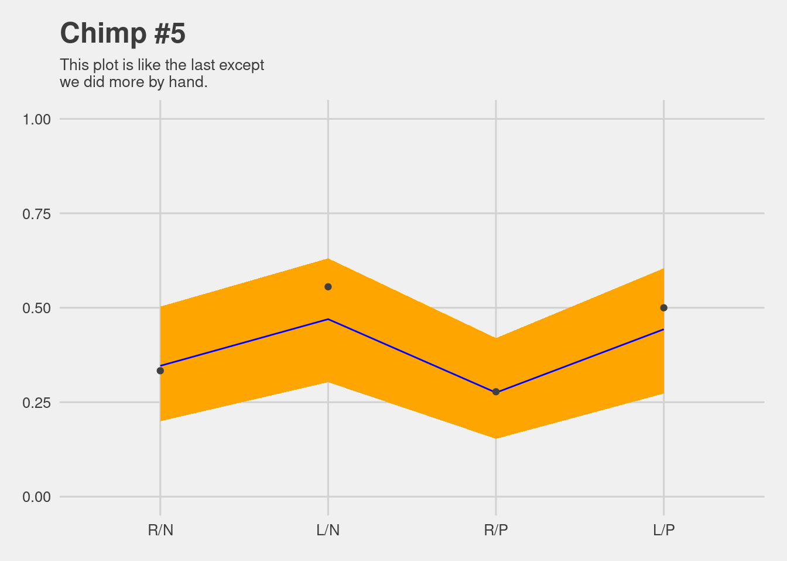
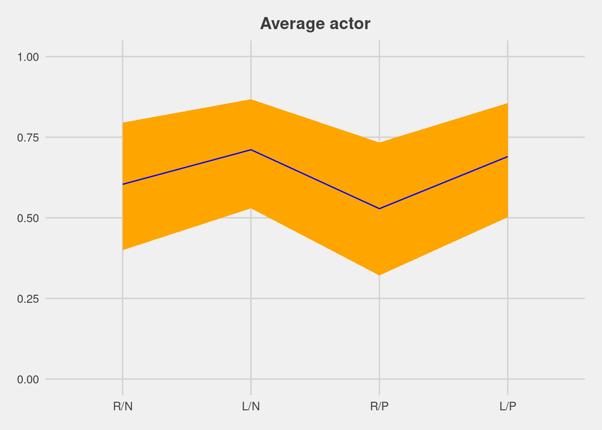
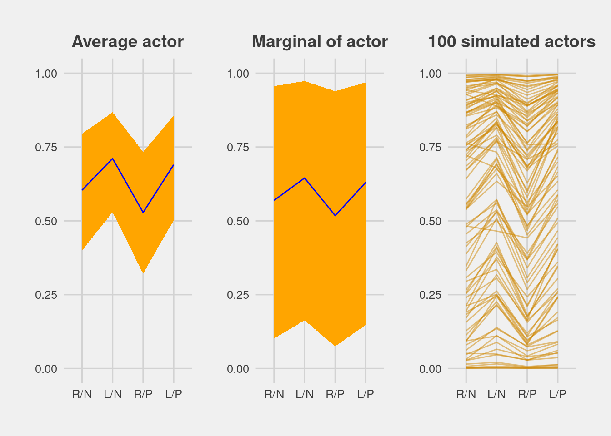

# Models With Memory


```r
library(here)
source(here::here("code/scripts/source.R"))
```


```r
slides_dir = here::here("docs/slides/L15")
```


<div class="figure">

<p class="caption">Way to justify multi-level models is that it's better to remember things than not to. Most of the statistical models we've considered up to this point is like this.</p>
</div>

Any of the models from previous chapters that used dummy variables to handle categories are programmed for amnesia. These models implicitly assume that nothing learned about any one category informs estimates for the other categories — the parameters are independent of one another and learn from completely separate portions of the data.

Anterograde amnesia is bad for learning about the world.

<div class="figure">

<p class="caption">In statistical language, they've all been fixed effects models. They have amnesia in that every time you move to a new cluster (indivdual, pond, block), it forgets everything it's seen about the thigns they visited previously. Learning develops expectations and lets us learn. MLMs develop expectations about all clusters in the data. They learn in a way that's invariant to the order that they miight visit them. That's the optimal way to learn. Some metaphors to latch onto...</p>
</div>

As the robot observes waiting times, it updates everything: the estimates for each café as well as the estimates for the population. If the population seems highly variable, then the prior is flat and uninformative and, as a consequence, the observations at any one café do very little to the estimate at another. If instead the population seems to contain little variation, then the prior is narrow and highly informative. An observation at any one café will have a big impact on estimates at any other café.

<div class="figure">

<p class="caption">Imagine you're visiting some cafes. The experience is largely the same. Here we're contrasting Paris and Berlin. Let's focus on one aspect of ordering - how long you wait for your cofffee. If you've never been to a cafe, you have no expectation of how long it takes. Then you go to Paris, and it takes 5 minutes. Then when you go to Berlin, you don't forget that experience, but you also don't think it's going to be exactly the same. A remmbering model treats a cafe as a population. And you can transfer infomration among units in that population. And that allows for better estaimtes for every cafe. Other thing to think is if it takes 10 minutes in Berlin, you had your 5 mintue prior, you update that with Bayesian updating, but the time order should be irrelevant to your learning. Now you need to update Paris too, because you have a limited sample in Paris, and you've got data from Berlin. So data from both are relevant to updating both of them. </p>
</div>

<div class="figure">

<p class="caption">How much information you transfer across depends on how variable they are. You learnn this variance as well. Different metaphor now. In East Africa, one of the strategies for not getting intestinal infections was to carry around a bunch of chillies. These are goat peppers. Their spiciness is quite random. One could be a dud, and the next one will kill you. When estiamting the spiciness of one particular plant, you can use your expectation from the whole population but because the plants are so variable, it's hard to transfer informtaion. It woud be as if with cafes, some give it instantly, others make you wait half an hour, so it's hard to estimate how long you'll wait. This variation is another thing we have to learn.</p>
</div>

In this chapter, you’ll see the formal version of this argument and how it leads us to MULTILEVEL MODELS. These models remember features of each cluster in the data as they learn about all of the clusters. Depending upon the variation among clusters, which is learned from the data as well, the model pools information across clusters. This pooling tends to improve estimates about each cluster. This improved estimation leads to several, more pragmatic sounding, benefits of the multilevel approach. I mentioned them in Chapter 1. They are worth repeating.

1. *Improved estimates for repeat sampling*. When more than one observation arises from the same individual, location, or time, then traditional, single-level models either maximally underfit or overfit the data.

1. *Improved estimates for imbalance in sampling*. When some individuals, locations, or times are sampled more than others, multilevel models automatically cope with differing uncertainty across these clusters. This prevents over-sampled clusters from unfairly dominating inference.

1. *Estimates of variation*. If our research questions include variation among individuals or other groups within the data, then multilevel models are a big help, because they model variation explicitly.

1. *Avoid averaging, retain variation*. Frequently, scholars pre-average some data to construct variables. This can be dangerous, because averaging removes variation, and there are also typically several different ways to perform the averaging. Averaging therefore both manufactures false confidence and introduces arbitrary data transformations. Multilevel models allow us to preserve the uncertainty and avoid data transformations.

It is better to begin to build a multilevel analysis, and then realize it’s unnecessary, than to overlook it.

<div class="figure">

<p class="caption">In this course, we have to wage our statistical battles on two fronts: causal inference. Avoid causal salad - they typical way it's done. Having a DAG you believe in is a small victory, but not the only thing. Getting precise estimates is a whole separate technology. Today we'll be talking about the second. If we can use the data in more powerful ways, that's what we'll do. </p>
</div>

<div class="figure">

<p class="caption">There are some really good defaults. Unfortunately they're not currently. As a default, you should always use multi-level regression. Single-level is always a bad idea. This is my favourite example of defaults. In some countries you are automatically. In others you have to opt in. In Germany, if you ask them if you should dontate your organs, most say yes. But the defaults are powerful, and MLMs are like that.</p>
</div>

<div class="figure">

<p class="caption">There are always reasons to use them, but they're always important. Typically they're better. </p>
</div>

<div class="figure">

<p class="caption">Here's what I want to get across today. Why shrinkage and pooling are good. How to do this with `ulam`. Show you how to plot and compre them. And going forward, this will open up a lot of model types. Factor models are a kind of MLM. Turtles all the way down; parameters all the way down. Model in a model. </p>
</div>

<div class="figure">

<p class="caption">What are they for? We're interested in what they can do for us: They help us with clustering in our dataset. e.g. you have a single dataset on educatioal tests, you can have a bunch of different levels nested within one another, and repeated observations at each of those levels. This is especially important when there's imbalance in sampling. Some of the clusters have been visited more than others, and you don't want that imbalance to let them dominate inference by regarding them separately. In biology, there's this term pseudoreplication. These models handle that.</p>
</div>

<div class="figure">

<p class="caption">We already had examples in this course. All of these things are clusters. </p>
</div>

## Example: Multilevel tadpoles

<div class="figure">

<p class="caption">Reed frog tadpoles. Quasi-experimental field experiment. Eggs were suspended on leaves above buckets. When they hatch, the tadpoles fall down below. In this experiment they land in the bucket, which are microcosms which you can manipulate. The outcome of interest is the number of surivivors in each bucket (pond).</p>
</div>


```r
data(reedfrogs, package = "rethinking")
d <- reedfrogs
rm(reedfrogs)

# Take a look
d %>%
  glimpse()
```

```
## Rows: 48
## Columns: 5
## $ density  <int> 10, 10, 10, 10, 10, 10, 10, 10, 10, 10, 10, 10, 10, 10, 10, 1…
## $ pred     <fct> no, no, no, no, no, no, no, no, pred, pred, pred, pred, pred,…
## $ size     <fct> big, big, big, big, small, small, small, small, big, big, big…
## $ surv     <int> 9, 10, 7, 10, 9, 9, 10, 9, 4, 9, 7, 6, 7, 5, 9, 9, 24, 23, 22…
## $ propsurv <dbl> 0.90, 1.00, 0.70, 1.00, 0.90, 0.90, 1.00, 0.90, 0.40, 0.90, 0…
```


Each row is a 'tank', and there are lots of unmeasured things peculiar to each tank which create variation in survival across tanks.

<div class="figure">

<p class="caption">We have tadpoles in tanks (buckets). They're at different densities. Different maximums can survive. This will be binomial regression. Number at start and end. Dummy variable is what we've done before. Now MLM with different intercepts.</p>
</div>


VARYING INTERCEPTS are the simplest kind of VARYING EFFECTS. For each cluster, we use a unique intercept parameter. 

<div class="figure">

<p class="caption">This is what we've done before. We have na index variable for tank. Different alpha. Regularising prior. Extreme mortality or survival will be viewed skeptivcally because of that 1.5. This is a fine model, but not a multi-level model. It has amnesia as you move from tank to tank. The only data in the dataset that informs each alpha is the data for that tank only. It learns about tank 1, using 7 tadpoles, estimates the alpha, then moves to the next tank and forgets all about it.  </p>
</div>

<div class="figure">

<p class="caption">We can do better than this. This is a reminder on how it's fitted.</p>
</div>


```r
# Make tank cluster variable
d <- 
  d %>%
  mutate(tank = 1:nrow(d))

d %>% 
  count(density)
```

```
##   density  n
## 1      10 16
## 2      25 16
## 3      35 16
```

```r
# Now fit binomial model like in Chapter 11
b13.1 <- 
  brm(data = d, 
      family = binomial,
      surv | trials(density) ~ 0 + factor(tank),
      prior(normal(0, 1.5), class = b),
      iter = 2000, warmup = 1000, chains = 4, cores = 4,
      seed = 13,
      file = "fits/b13.01")

print(b13.1)
```

```
##  Family: binomial 
##   Links: mu = logit 
## Formula: surv | trials(density) ~ 0 + factor(tank) 
##    Data: d (Number of observations: 48) 
## Samples: 4 chains, each with iter = 2000; warmup = 1000; thin = 1;
##          total post-warmup samples = 4000
## 
## Population-Level Effects: 
##              Estimate Est.Error l-95% CI u-95% CI Rhat Bulk_ESS Tail_ESS
## factortank1      1.71      0.76     0.35     3.32 1.00     5968     2690
## factortank2      2.41      0.90     0.77     4.38 1.00     4900     2558
## factortank3      0.76      0.63    -0.40     2.04 1.00     6092     2689
## factortank4      2.41      0.89     0.81     4.36 1.00     6258     3082
## factortank5      1.71      0.77     0.34     3.36 1.00     4940     2499
## factortank6      1.72      0.77     0.39     3.38 1.00     6044     3061
## factortank7      2.41      0.91     0.88     4.40 1.00     5596     2867
## factortank8      1.72      0.76     0.35     3.37 1.00     5477     2615
## factortank9     -0.36      0.60    -1.56     0.82 1.00     6323     2826
## factortank10     1.72      0.78     0.34     3.40 1.00     5799     2853
## factortank11     0.76      0.62    -0.42     2.01 1.00     5467     2858
## factortank12     0.35      0.63    -0.87     1.61 1.00     5133     3110
## factortank13     0.76      0.65    -0.44     2.10 1.00     6180     2641
## factortank14     0.01      0.59    -1.16     1.20 1.00     5359     3277
## factortank15     1.72      0.79     0.31     3.41 1.00     6558     2823
## factortank16     1.74      0.78     0.34     3.37 1.00     5035     2706
## factortank17     2.55      0.69     1.36     4.06 1.00     4771     2989
## factortank18     2.14      0.62     1.05     3.48 1.00     5673     2708
## factortank19     1.82      0.55     0.84     3.00 1.00     6580     2789
## factortank20     3.09      0.81     1.67     4.89 1.00     5512     2629
## factortank21     2.16      0.63     1.06     3.56 1.00     4868     2438
## factortank22     2.13      0.61     1.03     3.45 1.00     5752     2526
## factortank23     2.14      0.58     1.11     3.36 1.00     5812     2941
## factortank24     1.55      0.52     0.62     2.69 1.00     5606     2728
## factortank25    -1.11      0.46    -2.05    -0.25 1.01     5548     2758
## factortank26     0.07      0.41    -0.73     0.90 1.00     5360     2584
## factortank27    -1.55      0.50    -2.60    -0.63 1.00     5138     2886
## factortank28    -0.54      0.41    -1.35     0.24 1.00     5783     2878
## factortank29     0.08      0.39    -0.67     0.84 1.00     5349     3120
## factortank30     1.30      0.46     0.46     2.24 1.00     5681     2730
## factortank31    -0.72      0.41    -1.58     0.04 1.00     5584     2848
## factortank32    -0.39      0.41    -1.21     0.39 1.00     5755     3148
## factortank33     2.84      0.65     1.70     4.18 1.00     4913     2760
## factortank34     2.45      0.57     1.41     3.67 1.00     5085     2773
## factortank35     2.48      0.59     1.41     3.73 1.00     6235     3034
## factortank36     1.91      0.48     1.03     2.92 1.00     6056     3296
## factortank37     1.91      0.48     1.03     2.91 1.00     5467     2841
## factortank38     3.36      0.78     1.99     5.05 1.00     5907     2908
## factortank39     2.44      0.59     1.40     3.73 1.00     6059     2850
## factortank40     2.15      0.52     1.21     3.27 1.00     5156     2828
## factortank41    -1.90      0.48    -2.93    -1.02 1.00     6242     2527
## factortank42    -0.63      0.35    -1.34     0.03 1.00     6081     2929
## factortank43    -0.52      0.34    -1.20     0.15 1.00     5480     2523
## factortank44    -0.39      0.34    -1.08     0.25 1.00     6721     2985
## factortank45     0.51      0.35    -0.16     1.20 1.00     6432     3238
## factortank46    -0.63      0.35    -1.33     0.06 1.00     6303     2560
## factortank47     1.91      0.49     1.04     2.93 1.00     5039     2543
## factortank48    -0.06      0.34    -0.73     0.63 1.00     4892     3202
## 
## Samples were drawn using sampling(NUTS). For each parameter, Bulk_ESS
## and Tail_ESS are effective sample size measures, and Rhat is the potential
## scale reduction factor on split chains (at convergence, Rhat = 1).
```

Look at the distribution of the $\alpha_j$ parameters in density plots, in both log-odds and probability metrics.


```r
# change the default
theme_set(theme_gray() + theme_fivethirtyeight())

tibble(estimate = fixef(b13.1)[, 1]) %>% 
  mutate(p = inv_logit_scaled(estimate)) %>% 
  pivot_longer(estimate:p) %>% 
  mutate(name = if_else(name == "p", "expected survival probability", "expected survival log-odds")) %>% 
  
  ggplot(aes(x = value, fill = name)) +
  stat_dots(size = 0) +
  scale_fill_manual(values = c("orange1", "orange4")) +
  scale_y_continuous(breaks = NULL) +
  labs(title = "Tank-level intercepts from the no-pooling model",
       subtitle = "Notice now inspecting the distributions of the posterior means can offer insights you\nmight not get if you looked at them one at a time.") +
  theme(legend.position = "none",
        panel.grid = element_blank()) +
  facet_wrap(~ name, scales = "free_x")
```


To get each tank’s expected survival probability, just take one of the a intercept values and then use the logistic transform. So far there is nothing new here.

Now let’s do the multilevel model, which adaptively pools information across tanks. All that is required to enable adaptive pooling is to make the prior for the a parameters a function of some new parameters. 

<div class="figure">

<p class="caption">Now let's try something different. Added some stuff in blue. Let's step through. </p>
</div>

<div class="figure">

<p class="caption">$\alpha_j$ is still there. But I've made it into this magical thing called varying intercetps by inserting parameters inside the prior. Where there used to be (0, 1.5). $\bar{\alpha}$ is a parameter in and of itself that we're going to estimate. Represents the mean $\alpha$. Then $\sigma$, which is the SD in this population. So each $\alpha_j$ where $j$ is a tank has this prior. Then for these new parameters we have to give them priors. We give $\bar{\alpha}$ our regularizing prior, same with $\sigma$.</p>
</div>

$\bar{\alpha}$ and $\sigma$ are **HYPERPARAMETERS**. They create the second level. In the top level, the outcome is $S$, and in the second, the outcome is the vector of intercept parameters, $\alpha$.


<div class="figure">

<p class="caption">Why would we do this? What are varying intercepts? What's distinctive about this model, and the parameters inside the prior, is that you learn the prior from the data. So we'll regularise because it gives better predictions. Now we'll learn it from the data itself, and it's like visiting cafés. As you learn the variation among them, you pool the information across. </p>
</div>

<div class="figure">

<p class="caption">We have to learn those parameters and get posterior distributions for each from the data.</p>
</div>

<div class="figure">

<p class="caption">Then each of those gets a prior. A prior of a prior is called a hyperprior. They're all just priors. But now they're feeding up, with multiple levels of inference. You'll notice the line for $\alpha_j$ looks like the top line. The fact that it's not observed is irrelevant.  </p>
</div>

<div class="figure">

<p class="caption">In code. Just write what's up there into `ulam`. </p>
</div>


```r
b13.2 <- 
  brm(data = d, 
      family = binomial,
      surv | trials(density) ~ 1 + (1 | tank),
      prior = c(prior(normal(0, 1.5), class = Intercept),  # bar alpha
                prior(exponential(1), class = sd)),        # sigma
      iter = 5000, warmup = 1000, chains = 4, cores = 4,
      sample_prior = "yes",
      seed = 13,
      file = "fits/b13.02")
```


<div class="figure">

<p class="caption">If you focus on the model structure, you can understand things. If you focus on terminology, you'll get confused. Let's compare these models. Want to show you something about flexibilty in random effects 13.1 is fixed effects. 13.2 is MLM. In terms of WAIC, they're very similar. Not much of a difference. But look at the effective number of parameters. 131. has 48 paramaters because there are 48 tanks. One parameter for each. It ends up with 25 effective. Why? Because of the regularising prior. It wasn't flat. That means there are tank where all the tadploles survived. What's the log-odds of that? Infinite. But because of the piror, you don't end up with an alpha of infinity. What's happening with 13.2 is we've addedd two more parameters  ($\bar{\alpha}$ and $\sigma$). But fewer effective parameters. When teaching you about overfitting, the caveat was that every time you add a paramter the fit in-sample imporoves. *Other than* with MLMs. They learn how regular to be from the data itself. The regularising prior ends up being narrower. One of the coolest facts in statistics. Deep learning works because it's deep. Parameters stacked on parameters.  </p>
</div>

Compute the WAIC comparisons:


```r
b13.1 <- brms::add_criterion(b13.1, "waic")
b13.2 <- brms::add_criterion(b13.2, "waic")

w <- brms::loo_compare(b13.1, b13.2, criterion = "waic")

print(w, simplify = F)
```

```
##       elpd_diff se_diff elpd_waic se_elpd_waic p_waic se_p_waic waic   se_waic
## b13.2    0.0       0.0  -100.3       3.6         21.2    0.8     200.6    7.2 
## b13.1   -7.5       1.8  -107.7       2.4         26.0    1.3     215.5    4.7
```

The se_diff is small relative to the elpd_diff. If we convert the elpd difference to the WAIC metric, the message stays the same.


```r
cbind(waic_diff = w[, 1] * -2,
      se        = w[, 2] *  2)
```

```
##       waic_diff       se
## b13.2   0.00000 0.000000
## b13.1  14.92095 3.663999
```

Here are the WAIC weights:

```r
brms::model_weights(b13.1, b13.2, weights = "waic") %>% 
  round(digits = 2)
```

```
## b13.1 b13.2 
##     0     1
```

Compare number of effective parameters:


```r
w[, "p_waic"]
```

```
##    b13.2    b13.1 
## 21.15522 25.97493
```


```r
print(b13.2)
```

```
##  Family: binomial 
##   Links: mu = logit 
## Formula: surv | trials(density) ~ 1 + (1 | tank) 
##    Data: d (Number of observations: 48) 
## Samples: 4 chains, each with iter = 5000; warmup = 1000; thin = 1;
##          total post-warmup samples = 16000
## 
## Group-Level Effects: 
## ~tank (Number of levels: 48) 
##               Estimate Est.Error l-95% CI u-95% CI Rhat Bulk_ESS Tail_ESS
## sd(Intercept)     1.62      0.21     1.25     2.08 1.00     4165     7331
## 
## Population-Level Effects: 
##           Estimate Est.Error l-95% CI u-95% CI Rhat Bulk_ESS Tail_ESS
## Intercept     1.35      0.26     0.85     1.87 1.00     2713     5723
## 
## Samples were drawn using sampling(NUTS). For each parameter, Bulk_ESS
## and Tail_ESS are effective sample size measures, and Rhat is the potential
## scale reduction factor on split chains (at convergence, Rhat = 1).
```


There are 28 fewer effective parameters than actual parameters, because the prior assigned to each intercept shrinks them all towards the mean $\bar{\alpha}$. In this case, the prior is reasonably strong. This is a REGULARIZING PRIOR, like you’ve used in previous chapters, but now the amount of regularization has been learned from the data itself.

To appreciate the impact of this adaptive regularization, let’s plot and compare the posterior means from models `m13.1` and `m13.2`. 


```r
post <- posterior_samples(b13.2)

post_mdn <- 
  coef(b13.2, robust = T)$tank[, , ] %>% 
  data.frame() %>% 
  bind_cols(d) %>%
  mutate(post_mdn = inv_logit_scaled(Estimate))

head(post_mdn) %>% 
  DT::datatable(.)
```

```{=html}
<div id="htmlwidget-2d6164bd3d4fa7084dae" style="width:100%;height:auto;" class="datatables html-widget"></div>
<script type="application/json" data-for="htmlwidget-2d6164bd3d4fa7084dae">{"x":{"filter":"none","data":[["1","2","3","4","5","6"],[2.07101490702249,2.9601417851385,0.977219478393796,2.98225186804737,2.06776219958929,2.07753424130181],[0.848963345098701,1.07883706000414,0.668037927846341,1.08204013837234,0.847987576420224,0.842833444105403],[0.619945125467234,1.20174266154039,-0.235932669026868,1.16836753387363,0.577875768425798,0.616334889316982],[4.0045484922561,5.5189094947061,2.38397852383416,5.62364991057251,4.07854972271519,4.02129971300458],[10,10,10,10,10,10],["no","no","no","no","no","no"],["big","big","big","big","small","small"],[9,10,7,10,9,9],[0.9,1,0.7,1,0.9,0.9],[1,2,3,4,5,6],[0.888053897328874,0.950740634546783,0.726556151815982,0.951765854397906,0.887730123720208,0.888700373773134]],"container":"<table class=\"display\">\n  <thead>\n    <tr>\n      <th> <\/th>\n      <th>Estimate<\/th>\n      <th>Est.Error<\/th>\n      <th>Q2.5<\/th>\n      <th>Q97.5<\/th>\n      <th>density<\/th>\n      <th>pred<\/th>\n      <th>size<\/th>\n      <th>surv<\/th>\n      <th>propsurv<\/th>\n      <th>tank<\/th>\n      <th>post_mdn<\/th>\n    <\/tr>\n  <\/thead>\n<\/table>","options":{"columnDefs":[{"className":"dt-right","targets":[1,2,3,4,5,8,9,10,11]},{"orderable":false,"targets":0}],"order":[],"autoWidth":false,"orderClasses":false}},"evals":[],"jsHooks":[]}</script>
```

```r
# Reproduce Figure 13.1
post_mdn %>%
  ggplot(aes(x = tank)) +
  geom_hline(yintercept = inv_logit_scaled(median(post$b_Intercept)), linetype = 2, size = 1/4) +
  geom_vline(xintercept = c(16.5, 32.5), size = 1/4, color = "grey25") +
  geom_point(aes(y = propsurv), color = "orange2") +
  geom_point(aes(y = post_mdn), shape = 1) +
  annotate(geom = "text", 
           x = c(8, 16 + 8, 32 + 8), y = 0, 
           label = c("small tanks", "medium tanks", "large tanks")) +
  scale_x_continuous(breaks = c(1, 16, 32, 48)) +
  scale_y_continuous(breaks = 0:5 / 5, limits = c(0, 1)) +
  labs(title = "Multilevel shrinkage!",
       subtitle = "The empirical proportions are in orange while the model-\nimplied proportions are the black circles. The dashed line is\nthe model-implied average survival proportion.") +
  theme(panel.grid.major = element_blank())
```


First, notice that in every case, the multilevel estimate is closer to the dashed line than the raw empirical estimate is. It’s as if the entire distribution of black circles has been shrunk towards the dashed line at the center of the data, leaving the blue points behind on the outside.

Second, notice that the estimates for the smaller tanks have shrunk farther from the blue points.

Third, note that the farther a blue point is from the dashed line, the greater the distance between it and the corresponding multilevel estimate.

All three of these phenomena arise from a common cause: pooling information across clusters (tanks) to improve estimates.

First we’ll plot 100 Gaussian distributions, one for each of the first 100 samples from the posterior distribution of both α and σ. Then we’ll sample 8000 new log-odds of survival for individual tanks. 


```r
# this makes the output of `slice_sample()` reproducible
set.seed(13)

p1 <-
  post %>% 
  mutate(iter = 1:n()) %>% 
  slice_sample(n = 100) %>% 
  tidyr::expand(nesting(iter, b_Intercept, sd_tank__Intercept),
         x = seq(from = -4, to = 5, length.out = 100)) %>%
  mutate(density = dnorm(x, mean = b_Intercept, sd = sd_tank__Intercept)) %>% 
    
  ggplot(aes(x = x, y = density, group = iter)) +
  geom_line(alpha = .2, color = "orange2") +
  scale_y_continuous(NULL, breaks = NULL) +
  labs(title = "Population survival distribution",
       subtitle = "log-odds scale") +
  coord_cartesian(xlim = c(-3, 4))

set.seed(13)

p2 <-
  post %>% 
  slice_sample(n = 8000, replace = T) %>% 
  mutate(sim_tanks = rnorm(n(), mean = b_Intercept, sd = sd_tank__Intercept)) %>% 
  
  ggplot(aes(x = inv_logit_scaled(sim_tanks))) +
  geom_density(size = 0, fill = "orange2", adjust = 0.1) +
  scale_y_continuous(NULL, breaks = NULL) +
  labs(title = "Probability of survival",
       subtitle = "transformed by the inverse-logit function")

library(patchwork)

(p1 + p2) &
  theme(plot.title = element_text(size = 12),
        plot.subtitle = element_text(size = 10))
```


<div class="figure">

<p class="caption">Graphically, we'll compare the two models. Across the horizontal is all 48 tanks. They come in three sizes. You'll see that experimentally they were set up to be small, medium and large. Very cool experiment. Small have smaller initial density. Medium and large likewise. On the vertical, we're looking at the proportion survive. The outcome scale. Or the probability of survival. Blue dots are raw data. So you'll see the 1s on top. That's where all the lucky tadpoles lived. The open cricles are the multi-level estimates. THere's a pattern here - shrinkage. The model is not retrodicting the sample, but that's why it's a good model. Wnat to learn the regular features to make better predictions. The regularizing prior was learned from the data so it knows how to treat all the data. The dashed line is the popoulation mean, $\bar{\alpha}$that we have estimated from the data.</p>
</div>

<div class="figure">

<p class="caption">The raw mean is in a different place. Why? The raw mean comes from taking all the tadpoles and putting them into one group. The ones on the right bias the estimate because ethe survival rate is lower. If you want the mean of a population in idniviaul tanks, it's not pappropriate. </p>
</div>

<div class="figure">

<p class="caption">Above the dashed line, the open circles are off the blue lines towards the dashed line. The closer you are to it, the less difference between the two. If you're below the dashed line, you go up. This is shrinkage - shirnakge toward the poupatlion mean. If the divergence formt eh popuation mean is extreme, it's more sceptical and shrinks more. </p>
</div>

<div class="figure">

<p class="caption">Large tanks you see the shrinkage is smaller because there's more evidence in each tank - greater sample size. So more precise estimate in each tank. Each tank can overwhelm the information in the population. Only observations are 0 or 1. Otherwise we'd have massive overfitting. In any particualr dataset the exact amount of shrinkage will depend on many variables. Here it's reducing the fit-to-sample to improve rpedictive accuracy. You add parameters, and get better predictions out-of-sample.  </p>
</div>

<div class="figure">

<p class="caption">The more often you go to a cafe, the more data you have on that cafe, the less you need the population information. Extreme values are treated with sceticism of getting the same ones in the future.</p>
</div>

**Overthinking: prior for variance components**


```r
# Error in unserialize(socklist[[n]]) : error reading from connection
b13.2b <- 
  update(b13.2,
         prior = c(prior(normal(0, 1.5), class = Intercept),
                   prior(normal(0, 1), class = sd)),
         iter = 5000, warmup = 1000, chains = 4, cores = 2,
         sample_prior = "yes",
         seed = 13,
         file = "fits/b13.02b")

print(b13.2b)
```

Then compare:


```r
# for annotation
text <-
  tibble(value        = c(0.5, 2.4),
         density      = c(1, 1.85),
         distribution = factor(c("prior", "posterior"), levels = c("prior", "posterior")),
         prior        = "Exponential(1)")

# gather and wrangle the prior and posterior draws
tibble(`prior_Exponential(1)`        = prior_samples(b13.2) %>% pull(sd_tank),
       `posterior_Exponential(1)`    = posterior_samples(b13.2) %>% pull(sd_tank__Intercept),
       `prior_Half-Normal(0, 1)`     = prior_samples(b13.2b) %>% pull(sd_tank),
       `posterior_Half-Normal(0, 1)` = posterior_samples(b13.2b) %>% pull(sd_tank__Intercept)) %>% 
  pivot_longer(everything(),
               names_sep = "_",
               names_to = c("distribution", "prior")) %>% 
  mutate(distribution = factor(distribution, levels = c("prior", "posterior"))) %>% 
  
  # plot!
  ggplot(aes(x = value, fill = distribution)) +
  geom_density(size = 0, alpha = 2/3, adjust = 0.25) +
  geom_text(data = text,
            aes(y = density, label = distribution, color = distribution)) +
  scale_fill_manual(NULL, values = c("orange4", "orange2")) +
  scale_color_manual(NULL, values = c("orange4", "orange2")) +
  scale_y_continuous(NULL, breaks = NULL) +
  labs(subtitle = expression(Hierarchical~sigma~parameter)) +
  coord_cartesian(xlim = c(0, 4)) +
  theme(legend.position = "none") +
  facet_wrap(~ prior)
```


## Varying effects and the underfitting/overfitting trade-off

<div class="figure">

<p class="caption">All of this is really dealing with over/under-fitting. No pooling because there's no information being excahnged among clusters. How much pooling? Depends on variation among clusters. </p>
</div>

***13.2.1. The model***

<div class="figure">

<p class="caption">Try to back this up with a picture. MLM at the top. Focus on $\sigma$. If this was the cafes, it's the variation in wait times. </p>
</div>

<div class="figure">

<p class="caption">On the left it has a minimum of 0. If we fix it at 0 or put a really strong prior on it, it converges to the pooling model. All clusters are the same, and it will converge to the grand mean. Exactly one alpha. They're all there, but all the same.</p>
</div>

<div class="figure">

<p class="caption">On the other extreme, it's infinity. If sigma goes there, you get no pooling. Statistically assuming all tanks are infinteily different from each other. As a vertebrate, as you go from cafe to cafe, you do the pooling. YOur brain won't let you ignore the variation. But a statistical model won't do that unless you tell it to. If you want to program a robot to borrow information across clusters, you can't let $\sigma$ be infinity. The estimate for any particular alpha will be a mix of the data in that tank and all of the other tanks. The mix depends on the variation on the tanks. If there's no variation across tanks, then the whole population is used. If sigma goes to infitnty , you ignore the population.</p>
</div>

<div class="figure">

<p class="caption">In this particular model, you estimate sigma for the data, and it turns out to be this posterior here. Can get an almost Gaussian posterior. And that's the extreme amount of variation. What does this population look like? Not a real population, but a statistical one.</p>
</div>

<div class="figure">

<p class="caption">The population-generating process is called an ecologist. Those processes generate popualations with real mortality effects. We can draw this statistical population. Combinations of alphas and betes produce lines. Alphas and betas are correlated, which is why you need to draw correlated smaples from the posterior. Now the lines are a distribution of distributions. We don't know the distribution. Let's draw it. We could just draw correlated pairs as densities. On the left is a gaussian distribution of log-odds probability. Why Gaussian? Because we said it was. Most tadpoles survive. But there's a lot of heterogeneity. You can see that in the distribution. Ont he right I've transofrmed to the outcome probability scale. About half of the tanks we get a high survival rate. </p>
</div>

<div class="figure">

<p class="caption">So I keep asserting that the shrinkage estiamtes are better. Let's demonstrate it. We do better in prediction. WAIC works in theory, predicting the out-of-sample accuracy. Regularisation is good. Simulate a bunch of ponds, 60 of them, with different densities of tadpoles in each of 15 ponds. `true.a` is the true log-oddds survival rate. True because we' ve simulated it. THen simulated surivval events. `s`. Therea re some wipeouts, like pond 5. Then the next two are statsitcal estiamtes. `p.nopool` is the raw fixed effects estiamte. The MLM estimate is `p.partpool`. Then `p.true` is the inverse logit of `true.a`. Now we can assess because we can compare it to the truth.</p>
</div>

***13.2.2. Assign values to the parameters***


I’ve chosen 60 ponds, with 15 each of initial tadpole density 5, 10, 25, and 35. 


Go ahead and inspect the contents of dsim, the simulated data. The first column is the pond index, 1 through 60. The second column is the initial tadpole count in each pond. The third column is the true log-odds survival for each pond.


```r
a_bar   <-  1.5
sigma   <-  1.5
n_ponds <- 60

set.seed(5005)

dsim <- 
  tibble(pond   = 1:n_ponds,
         ni     = rep(c(5, 10, 25, 35), each = n_ponds / 4) %>% as.integer(),
         true_a = rnorm(n = n_ponds, mean = a_bar, sd = sigma))

head(dsim)
```

```
## # A tibble: 6 × 3
##    pond    ni true_a
##   <int> <int>  <dbl>
## 1     1     5  0.567
## 2     2     5  1.99 
## 3     3     5 -0.138
## 4     4     5  1.86 
## 5     5     5  3.91 
## 6     6     5  1.95
```

```r
# Plot
dsim %>% 
  mutate(ni = factor(ni)) %>% 
  
  ggplot(aes(x = true_a, y = ni)) +
  stat_dotsinterval(fill = "orange2", slab_size = 0, .width = .5) +
  ggtitle("Log-odds varying by # tadpoles per pond") +
  theme(plot.title = element_text(size = 14))
```


***13.2.3. Simulate survivors***

Now we’re ready to simulate the binomial survival process. Each pond i has ni potential survivors, and nature flips each tadpole’s coin, so to speak, with probability of survival $p_i$.


```r
set.seed(5005)

dsim <-
  dsim %>%
  mutate(si = rbinom(n = n(), prob = inv_logit_scaled(true_a), size = ni))

dsim %>% 
  DT::datatable(.)
```

```{=html}
<div id="htmlwidget-8dc1d8ecbfa319212a14" style="width:100%;height:auto;" class="datatables html-widget"></div>
<script type="application/json" data-for="htmlwidget-8dc1d8ecbfa319212a14">{"x":{"filter":"none","data":[["1","2","3","4","5","6","7","8","9","10","11","12","13","14","15","16","17","18","19","20","21","22","23","24","25","26","27","28","29","30","31","32","33","34","35","36","37","38","39","40","41","42","43","44","45","46","47","48","49","50","51","52","53","54","55","56","57","58","59","60"],[1,2,3,4,5,6,7,8,9,10,11,12,13,14,15,16,17,18,19,20,21,22,23,24,25,26,27,28,29,30,31,32,33,34,35,36,37,38,39,40,41,42,43,44,45,46,47,48,49,50,51,52,53,54,55,56,57,58,59,60],[5,5,5,5,5,5,5,5,5,5,5,5,5,5,5,10,10,10,10,10,10,10,10,10,10,10,10,10,10,10,25,25,25,25,25,25,25,25,25,25,25,25,25,25,25,35,35,35,35,35,35,35,35,35,35,35,35,35,35,35],[0.566731225916697,1.99002317494446,-0.13775687859197,1.85676650932582,3.91208799855199,1.95414869415232,1.48963804597738,2.52407196100137,2.17828009954472,2.04776577882686,2.74564558621871,-0.637223203961387,3.03948315175108,1.90733693898711,3.54119393742577,0.651656738900955,-1.16943953836601,0.595689725807092,0.385301767109194,1.02961242371106,0.0703400618011099,1.34936970907651,2.45730258119582,-0.0525132598186513,2.20677385792733,1.82918746009262,1.33997119534591,1.57233138408692,1.25467352836639,0.826633085870414,2.65834263895908,2.08241190508737,1.50758907130418,0.862659461420211,0.227217140392512,4.61568929184979,-1.75144379972601,-1.03306026177205,0.23817746617815,5.35841158281757,3.84572461284594,1.81628754938383,-0.342675840819622,0.761115816546673,-1.55979665570298,-0.0845607258183123,4.37882073787451,2.32597648607795,1.78144088540966,1.86990933052614,1.58196519369221,0.155606415030638,1.50345863738438,4.49654574616594,0.565182214792317,2.55806131929059,0.567426780951378,2.74606407790988,1.50422252636709,2.49737954219206],[4,4,3,5,5,4,4,4,3,4,5,2,5,4,5,6,3,5,5,7,4,9,10,6,8,9,8,7,6,7,24,22,24,18,15,25,2,8,15,25,25,22,10,17,5,17,35,35,29,29,29,17,29,35,22,34,23,33,30,33]],"container":"<table class=\"display\">\n  <thead>\n    <tr>\n      <th> <\/th>\n      <th>pond<\/th>\n      <th>ni<\/th>\n      <th>true_a<\/th>\n      <th>si<\/th>\n    <\/tr>\n  <\/thead>\n<\/table>","options":{"columnDefs":[{"className":"dt-right","targets":[1,2,3,4]},{"orderable":false,"targets":0}],"order":[],"autoWidth":false,"orderClasses":false}},"evals":[],"jsHooks":[]}</script>
```


***13.2.4. Compute the no-pooling estimates***


```r
dsim <-
  dsim %>%
  mutate(p_nopool = si / ni)

dsim %>% 
  DT::datatable(.)
```

```{=html}
<div id="htmlwidget-6802470dedcd3a0169d8" style="width:100%;height:auto;" class="datatables html-widget"></div>
<script type="application/json" data-for="htmlwidget-6802470dedcd3a0169d8">{"x":{"filter":"none","data":[["1","2","3","4","5","6","7","8","9","10","11","12","13","14","15","16","17","18","19","20","21","22","23","24","25","26","27","28","29","30","31","32","33","34","35","36","37","38","39","40","41","42","43","44","45","46","47","48","49","50","51","52","53","54","55","56","57","58","59","60"],[1,2,3,4,5,6,7,8,9,10,11,12,13,14,15,16,17,18,19,20,21,22,23,24,25,26,27,28,29,30,31,32,33,34,35,36,37,38,39,40,41,42,43,44,45,46,47,48,49,50,51,52,53,54,55,56,57,58,59,60],[5,5,5,5,5,5,5,5,5,5,5,5,5,5,5,10,10,10,10,10,10,10,10,10,10,10,10,10,10,10,25,25,25,25,25,25,25,25,25,25,25,25,25,25,25,35,35,35,35,35,35,35,35,35,35,35,35,35,35,35],[0.566731225916697,1.99002317494446,-0.13775687859197,1.85676650932582,3.91208799855199,1.95414869415232,1.48963804597738,2.52407196100137,2.17828009954472,2.04776577882686,2.74564558621871,-0.637223203961387,3.03948315175108,1.90733693898711,3.54119393742577,0.651656738900955,-1.16943953836601,0.595689725807092,0.385301767109194,1.02961242371106,0.0703400618011099,1.34936970907651,2.45730258119582,-0.0525132598186513,2.20677385792733,1.82918746009262,1.33997119534591,1.57233138408692,1.25467352836639,0.826633085870414,2.65834263895908,2.08241190508737,1.50758907130418,0.862659461420211,0.227217140392512,4.61568929184979,-1.75144379972601,-1.03306026177205,0.23817746617815,5.35841158281757,3.84572461284594,1.81628754938383,-0.342675840819622,0.761115816546673,-1.55979665570298,-0.0845607258183123,4.37882073787451,2.32597648607795,1.78144088540966,1.86990933052614,1.58196519369221,0.155606415030638,1.50345863738438,4.49654574616594,0.565182214792317,2.55806131929059,0.567426780951378,2.74606407790988,1.50422252636709,2.49737954219206],[4,4,3,5,5,4,4,4,3,4,5,2,5,4,5,6,3,5,5,7,4,9,10,6,8,9,8,7,6,7,24,22,24,18,15,25,2,8,15,25,25,22,10,17,5,17,35,35,29,29,29,17,29,35,22,34,23,33,30,33],[0.8,0.8,0.6,1,1,0.8,0.8,0.8,0.6,0.8,1,0.4,1,0.8,1,0.6,0.3,0.5,0.5,0.7,0.4,0.9,1,0.6,0.8,0.9,0.8,0.7,0.6,0.7,0.96,0.88,0.96,0.72,0.6,1,0.08,0.32,0.6,1,1,0.88,0.4,0.68,0.2,0.485714285714286,1,1,0.828571428571429,0.828571428571429,0.828571428571429,0.485714285714286,0.828571428571429,1,0.628571428571429,0.971428571428571,0.657142857142857,0.942857142857143,0.857142857142857,0.942857142857143]],"container":"<table class=\"display\">\n  <thead>\n    <tr>\n      <th> <\/th>\n      <th>pond<\/th>\n      <th>ni<\/th>\n      <th>true_a<\/th>\n      <th>si<\/th>\n      <th>p_nopool<\/th>\n    <\/tr>\n  <\/thead>\n<\/table>","options":{"columnDefs":[{"className":"dt-right","targets":[1,2,3,4,5]},{"orderable":false,"targets":0}],"order":[],"autoWidth":false,"orderClasses":false}},"evals":[],"jsHooks":[]}</script>
```


***13.2.5. Compute the partial-pooling estimates***


```r
b13.3 <- 
  brms::brm(data = dsim, 
            family = binomial,
            si | trials(ni) ~ 1 + (1 | pond),
            prior = c(prior(normal(0, 1.5), class = Intercept),
                      prior(exponential(1), class = sd)),
            iter = 2000, warmup = 1000, chains = 4, cores = 4,
            seed = 13,
            file = "fits/b13.03")

print(b13.3)
```

```
##  Family: binomial 
##   Links: mu = logit 
## Formula: si | trials(ni) ~ 1 + (1 | pond) 
##    Data: dsim_tb (Number of observations: 60) 
## Samples: 4 chains, each with iter = 2000; warmup = 1000; thin = 1;
##          total post-warmup samples = 4000
## 
## Group-Level Effects: 
## ~pond (Number of levels: 60) 
##               Estimate Est.Error l-95% CI u-95% CI Rhat Bulk_ESS Tail_ESS
## sd(Intercept)     1.49      0.20     1.14     1.92 1.00     1506     2368
## 
## Population-Level Effects: 
##           Estimate Est.Error l-95% CI u-95% CI Rhat Bulk_ESS Tail_ESS
## Intercept     1.46      0.23     1.03     1.94 1.00      961     1663
## 
## Samples were drawn using sampling(NUTS). For each parameter, Bulk_ESS
## and Tail_ESS are effective sample size measures, and Rhat is the potential
## scale reduction factor on split chains (at convergence, Rhat = 1).
```


Take a look at the estimates for $\bar{\alpha}$ and $\sigma$.


```r
b13.3$fit
```

```
## Inference for Stan model: 50bbea81c6f51c3bd01edfc7641dfc55.
## 4 chains, each with iter=2000; warmup=1000; thin=1; 
## post-warmup draws per chain=1000, total post-warmup draws=4000.
## 
##                         mean se_mean   sd    2.5%     25%     50%     75%
## b_Intercept             1.46    0.01 0.23    1.03    1.31    1.46    1.62
## sd_pond__Intercept      1.49    0.01 0.20    1.14    1.35    1.48    1.62
## r_pond[1,Intercept]     0.09    0.01 0.97   -1.71   -0.57    0.05    0.69
## r_pond[2,Intercept]     0.10    0.01 0.96   -1.66   -0.56    0.04    0.71
## r_pond[3,Intercept]    -0.68    0.01 0.84   -2.24   -1.27   -0.70   -0.13
## r_pond[4,Intercept]     1.14    0.01 1.12   -0.86    0.36    1.06    1.86
## r_pond[5,Intercept]     1.14    0.01 1.14   -0.85    0.33    1.06    1.84
## r_pond[6,Intercept]     0.09    0.01 0.96   -1.65   -0.57    0.04    0.71
## r_pond[7,Intercept]     0.09    0.01 0.98   -1.74   -0.59    0.04    0.72
## r_pond[8,Intercept]     0.10    0.01 0.95   -1.62   -0.54    0.06    0.68
## r_pond[9,Intercept]    -0.70    0.01 0.85   -2.35   -1.26   -0.71   -0.13
## r_pond[10,Intercept]    0.10    0.01 0.94   -1.65   -0.53    0.04    0.70
## r_pond[11,Intercept]    1.13    0.01 1.12   -0.89    0.35    1.06    1.81
## r_pond[12,Intercept]   -1.36    0.01 0.83   -2.97   -1.93   -1.36   -0.81
## r_pond[13,Intercept]    1.14    0.01 1.13   -0.86    0.34    1.08    1.86
## r_pond[14,Intercept]    0.08    0.01 0.95   -1.65   -0.57    0.05    0.70
## r_pond[15,Intercept]    1.12    0.01 1.12   -0.86    0.36    1.04    1.83
## r_pond[16,Intercept]   -0.85    0.01 0.63   -2.06   -1.28   -0.85   -0.42
## r_pond[17,Intercept]   -1.95    0.01 0.65   -3.26   -2.38   -1.93   -1.52
## r_pond[18,Intercept]   -1.21    0.01 0.64   -2.46   -1.65   -1.21   -0.80
## r_pond[19,Intercept]   -1.22    0.01 0.65   -2.46   -1.65   -1.22   -0.80
## r_pond[20,Intercept]   -0.43    0.01 0.70   -1.74   -0.91   -0.46    0.02
## r_pond[21,Intercept]   -1.57    0.01 0.65   -2.85   -1.99   -1.56   -1.12
## r_pond[22,Intercept]    0.66    0.01 0.86   -0.86    0.05    0.60    1.20
## r_pond[23,Intercept]    1.55    0.02 1.00   -0.19    0.83    1.48    2.16
## r_pond[24,Intercept]   -0.84    0.01 0.68   -2.13   -1.31   -0.85   -0.40
## r_pond[25,Intercept]    0.06    0.01 0.75   -1.32   -0.47    0.02    0.55
## r_pond[26,Intercept]    0.68    0.01 0.87   -0.86    0.06    0.61    1.22
## r_pond[27,Intercept]    0.06    0.01 0.74   -1.29   -0.46    0.03    0.56
## r_pond[28,Intercept]   -0.44    0.01 0.69   -1.77   -0.90   -0.46    0.01
## r_pond[29,Intercept]   -0.85    0.01 0.65   -2.07   -1.28   -0.86   -0.43
## r_pond[30,Intercept]   -0.45    0.01 0.69   -1.74   -0.93   -0.47    0.00
## r_pond[31,Intercept]    1.41    0.01 0.78    0.03    0.87    1.34    1.90
## r_pond[32,Intercept]    0.55    0.01 0.63   -0.61    0.11    0.53    0.95
## r_pond[33,Intercept]    1.41    0.01 0.78    0.03    0.86    1.37    1.90
## r_pond[34,Intercept]   -0.43    0.01 0.49   -1.37   -0.77   -0.43   -0.11
## r_pond[35,Intercept]   -0.96    0.01 0.46   -1.83   -1.27   -0.97   -0.65
## r_pond[36,Intercept]    2.10    0.01 0.95    0.46    1.44    2.00    2.66
## r_pond[37,Intercept]   -3.37    0.01 0.61   -4.65   -3.76   -3.33   -2.95
## r_pond[38,Intercept]   -2.06    0.01 0.46   -2.99   -2.36   -2.05   -1.75
## r_pond[39,Intercept]   -0.97    0.01 0.47   -1.90   -1.27   -0.97   -0.65
## r_pond[40,Intercept]    2.10    0.01 0.95    0.47    1.43    2.02    2.66
## r_pond[41,Intercept]    2.11    0.01 0.94    0.55    1.44    2.02    2.67
## r_pond[42,Intercept]    0.55    0.01 0.60   -0.52    0.13    0.52    0.92
## r_pond[43,Intercept]   -1.74    0.01 0.46   -2.66   -2.04   -1.73   -1.43
## r_pond[44,Intercept]   -0.63    0.01 0.47   -1.49   -0.94   -0.65   -0.32
## r_pond[45,Intercept]   -2.63    0.01 0.50   -3.63   -2.95   -2.62   -2.29
## r_pond[46,Intercept]   -1.44    0.01 0.40   -2.22   -1.71   -1.44   -1.18
## r_pond[47,Intercept]    2.34    0.01 0.92    0.74    1.69    2.26    2.90
## r_pond[48,Intercept]    2.33    0.01 0.93    0.78    1.67    2.25    2.88
## r_pond[49,Intercept]    0.16    0.01 0.48   -0.75   -0.16    0.14    0.47
## r_pond[50,Intercept]    0.16    0.01 0.49   -0.78   -0.17    0.15    0.48
## r_pond[51,Intercept]    0.15    0.01 0.48   -0.77   -0.17    0.15    0.47
## r_pond[52,Intercept]   -1.44    0.01 0.39   -2.24   -1.71   -1.44   -1.17
## r_pond[53,Intercept]    0.16    0.01 0.48   -0.73   -0.17    0.15    0.49
## r_pond[54,Intercept]    2.32    0.01 0.91    0.77    1.67    2.25    2.89
## r_pond[55,Intercept]   -0.88    0.01 0.42   -1.70   -1.15   -0.87   -0.60
## r_pond[56,Intercept]    1.70    0.01 0.76    0.36    1.17    1.64    2.16
## r_pond[57,Intercept]   -0.76    0.01 0.41   -1.53   -1.03   -0.76   -0.49
## r_pond[58,Intercept]    1.23    0.01 0.66    0.02    0.78    1.17    1.65
## r_pond[59,Intercept]    0.37    0.01 0.52   -0.58    0.01    0.34    0.71
## r_pond[60,Intercept]    1.23    0.01 0.65    0.10    0.77    1.19    1.64
## lp__                 -185.86    0.25 7.57 -201.09 -190.96 -185.44 -180.61
##                        97.5% n_eff Rhat
## b_Intercept             1.94   948    1
## sd_pond__Intercept      1.92  1480    1
## r_pond[1,Intercept]     2.17  7322    1
## r_pond[2,Intercept]     2.12  6248    1
## r_pond[3,Intercept]     1.00  5687    1
## r_pond[4,Intercept]     3.53  6376    1
## r_pond[5,Intercept]     3.62  6681    1
## r_pond[6,Intercept]     2.09  5908    1
## r_pond[7,Intercept]     2.11  6581    1
## r_pond[8,Intercept]     2.12  6627    1
## r_pond[9,Intercept]     1.01  6139    1
## r_pond[10,Intercept]    2.11  6207    1
## r_pond[11,Intercept]    3.54  6635    1
## r_pond[12,Intercept]    0.22  6388    1
## r_pond[13,Intercept]    3.51  6325    1
## r_pond[14,Intercept]    2.08  6733    1
## r_pond[15,Intercept]    3.54  6781    1
## r_pond[16,Intercept]    0.41  5022    1
## r_pond[17,Intercept]   -0.77  4933    1
## r_pond[18,Intercept]    0.06  5232    1
## r_pond[19,Intercept]    0.13  4799    1
## r_pond[20,Intercept]    0.99  5399    1
## r_pond[21,Intercept]   -0.34  4858    1
## r_pond[22,Intercept]    2.51  5055    1
## r_pond[23,Intercept]    3.75  4406    1
## r_pond[24,Intercept]    0.53  4207    1
## r_pond[25,Intercept]    1.58  4978    1
## r_pond[26,Intercept]    2.56  5753    1
## r_pond[27,Intercept]    1.63  5016    1
## r_pond[28,Intercept]    0.97  5209    1
## r_pond[29,Intercept]    0.43  4208    1
## r_pond[30,Intercept]    0.97  5670    1
## r_pond[31,Intercept]    3.11  5320    1
## r_pond[32,Intercept]    1.86  3754    1
## r_pond[33,Intercept]    3.06  5328    1
## r_pond[34,Intercept]    0.57  3148    1
## r_pond[35,Intercept]   -0.04  2441    1
## r_pond[36,Intercept]    4.25  4792    1
## r_pond[37,Intercept]   -2.24  3989    1
## r_pond[38,Intercept]   -1.18  3079    1
## r_pond[39,Intercept]   -0.05  3260    1
## r_pond[40,Intercept]    4.19  4059    1
## r_pond[41,Intercept]    4.22  4566    1
## r_pond[42,Intercept]    1.83  3807    1
## r_pond[43,Intercept]   -0.85  2776    1
## r_pond[44,Intercept]    0.34  2879    1
## r_pond[45,Intercept]   -1.71  3504    1
## r_pond[46,Intercept]   -0.66  2260    1
## r_pond[47,Intercept]    4.35  5553    1
## r_pond[48,Intercept]    4.38  4558    1
## r_pond[49,Intercept]    1.13  3172    1
## r_pond[50,Intercept]    1.15  2688    1
## r_pond[51,Intercept]    1.14  3165    1
## r_pond[52,Intercept]   -0.68  2353    1
## r_pond[53,Intercept]    1.12  2764    1
## r_pond[54,Intercept]    4.38  4731    1
## r_pond[55,Intercept]   -0.03  2715    1
## r_pond[56,Intercept]    3.41  5144    1
## r_pond[57,Intercept]    0.06  2612    1
## r_pond[58,Intercept]    2.64  4193    1
## r_pond[59,Intercept]    1.40  3089    1
## r_pond[60,Intercept]    2.60  3791    1
## lp__                 -171.64   889    1
## 
## Samples were drawn using NUTS(diag_e) at Fri Aug 13 15:58:51 2021.
## For each parameter, n_eff is a crude measure of effective sample size,
## and Rhat is the potential scale reduction factor on split chains (at 
## convergence, Rhat=1).
```


Compute the survival proportions and add them to our growing simulation data frame.


```r
# we could have included this step in the block of code below, if we wanted to
p_partpool <- 
  coef(b13.3)$pond[, , ] %>% 
  data.frame() %>%
  transmute(p_partpool = inv_logit_scaled(Estimate))

dsim <- 
  dsim %>%
  bind_cols(p_partpool) %>% 
  mutate(p_true = inv_logit_scaled(true_a)) %>%
  mutate(nopool_error   = abs(p_nopool   - p_true),
         partpool_error = abs(p_partpool - p_true))

dsim %>% 
  glimpse()
```

```
## Rows: 60
## Columns: 9
## $ pond           <int> 1, 2, 3, 4, 5, 6, 7, 8, 9, 10, 11, 12, 13, 14, 15, 16, …
## $ ni             <int> 5, 5, 5, 5, 5, 5, 5, 5, 5, 5, 5, 5, 5, 5, 5, 10, 10, 10…
## $ true_a         <dbl> 0.56673123, 1.99002317, -0.13775688, 1.85676651, 3.9120…
## $ si             <int> 4, 4, 3, 5, 5, 4, 4, 4, 3, 4, 5, 2, 5, 4, 5, 6, 3, 5, 5…
## $ p_nopool       <dbl> 0.8, 0.8, 0.6, 1.0, 1.0, 0.8, 0.8, 0.8, 0.6, 0.8, 1.0, …
## $ p_partpool     <dbl> 0.8256632, 0.8267518, 0.6859881, 0.9313513, 0.9308751, …
## $ p_true         <dbl> 0.6380086, 0.8797456, 0.4656151, 0.8649196, 0.9803934, …
## $ nopool_error   <dbl> 0.16199142, 0.07974559, 0.13438486, 0.13508039, 0.01960…
## $ partpool_error <dbl> 0.1876546251, 0.0529937565, 0.2203729151, 0.0664317322,…
```

Compare to the true per-pond survival probabilities.


Now plot


```r
dfline <- 
  dsim %>%
  dplyr::select(ni, nopool_error:partpool_error) %>%
  tidyr::pivot_longer(-ni) %>%
  dplyr::group_by(name, ni) %>%
  dplyr::summarise(mean_error = mean(value)) %>%
  dplyr::mutate(x    = c( 1, 16, 31, 46),
                xend = c(15, 30, 45, 60))
```

```
## `summarise()` has grouped output by 'name'. You can override using the `.groups` argument.
```

```r
dsim %>% 
  ggplot(aes(x = pond)) +
  geom_vline(xintercept = c(15.5, 30.5, 45.4), 
             color = "white", size = 2/3) +
  geom_point(aes(y = nopool_error), color = "orange2") +
  geom_point(aes(y = partpool_error), shape = 1) +
  geom_segment(data = dfline, 
               aes(x = x, xend = xend, 
                   y = mean_error, yend = mean_error),
               color = rep(c("orange2", "black"), each = 4),
               linetype = rep(1:2, each = 4)) +
  annotate(geom = "text", 
           x = c(15 - 7.5, 30 - 7.5, 45 - 7.5, 60 - 7.5), y = .45, 
           label = c("tiny (5)", "small (10)", "medium (25)", "large (35)")) +
  scale_x_continuous(breaks = c(1, 10, 20, 30, 40, 50, 60)) +
  labs(title = "Estimate error by model type",
       subtitle = "The horizontal axis displays pond number. The vertical axis measures\nthe absolute error in the predicted proportion of survivors, compared to\nthe true value used in the simulation. The higher the point, the worse\nthe estimate. No-pooling shown in orange. Partial pooling shown in black.\nThe orange and dashed black lines show the average error for each kind\nof estimate, across each initial density of tadpoles (pond size).",
       y = "absolute error") +
  theme(panel.grid.major = element_blank(),
        plot.subtitle = element_text(size = 10))
```


Or quantify the difference in simple summaries:

```r
dsim %>%
  dplyr::select(ni, nopool_error:partpool_error) %>%
  tidyr::pivot_longer(-ni) %>%
  dplyr::group_by(name) %>%
  dplyr::summarise(mean_error   = mean(value) %>% round(digits = 3),
            median_error = median(value) %>% round(digits = 3))
```

```
## # A tibble: 2 × 3
##   name           mean_error median_error
##   <chr>               <dbl>        <dbl>
## 1 nopool_error        0.059        0.042
## 2 partpool_error      0.054        0.034
```


Once you've compiled `m13.3` once, you can use this code to re-simulate ponds and sample from the new posterior, without waiting for the model to compile again:


<div class="figure">

<p class="caption">On the left we have tiny ponds. The blue points are the raw proportions survived. The open points are the partial pooling estimates. The error is the absolute error from the true value. 0 is totally correct. A lot of error here because you've only got 5 tadpoles. Hard to estimate the probability of heads if you only flip the coin 5 times. THe blue horizontal bar is the average of the raw estimates, the dashed is for the MLM. They're not perfect, but they're better. THis is all shrinkage. </p>
</div>


<div class="figure">

<p class="caption">The other tanks. The pattern holds as you go across. The amount of error declines, because we have more data. The difference, the advantage of MLMs, shrinks. But still estimates the popualtion, which is important for prediction. So even when it doesn't give you bettre predictions, it allows you to make them in the right way because it takes account of populations. </p>
</div>

**Overthinking::repeating the pond simulation**


```r
# Error in unserialize(socklist[[n]]) : error reading from connection

# Simulate new data
a_bar   <-  1.5
sigma   <-  1.5
n_ponds <- 60

set.seed(1999)  # for new data, set a new seed

new_dsim <- 
  tibble(pond   = 1:n_ponds,
         ni     = rep(c(5, 10, 25, 35), each = n_ponds / 4) %>% as.integer(),
         true_a = rnorm(n = n_ponds, mean = a_bar, sd = sigma)) %>% 
  mutate(si = rbinom(n = n(), prob = inv_logit_scaled(true_a), size = ni)) %>% 
  mutate(p_nopool = si / ni)

glimpse(new_dsim)

# Fit the new model
b13.3_new <- 
  update(b13.3,
         newdata = new_dsim,
         chains = 4, cores = 1,
         seed = 13,
      file = "fits/b13.03_new")

print(b13.3_new)
```


-----


```r
slides_dir = here::here("docs/slides/L16")
```


## More than one type of cluster

We can use and often should use more than one type of cluster in the same model. Each pull is within a cluster of pulls belonging to an individual chimpanzee. But each pull is also within an experimental block, which represents a collection of observations that happened on the same day.

<div class="figure">

<p class="caption">Experiment with a small number of chimps. Replicated on each. 4 treatments with prosocial option. Question is do they intepret it that way? </p>
</div>

<div class="figure">

<p class="caption">Want to use it to learn how to build a more complex vasrying effects model when we have more than one type of cluster. Called cross-classfication. The indivdual chimps are cross-classified, as is experimental day. In this dataset everything is balanced. All the chimps in all the blocks. Going to use both these types of clusters. Actors is a clsuter so we can estimate parameters specific to the chimp, like handedness. Also have repeated observations inside blocks. You can just design them liek a varying intercept model. </p>
</div>

***13.3.1. Multilevel chimpanzees***


<div class="figure">

<p class="caption">Here's the MLM with both actor and block intercepts. Alpha for each actor, gamma for each block, and beta for each treatment. Ordinary fixed effects, regularising, not adaptive. Just like tank effects. Interpretation is the handedness. Adaptive prior, with alpha bar. And a sigma alpha. So the model will learn the prior from the data.</p>
</div>

<div class="figure">

<p class="caption">Then another adaptive prior, gamma for each block. It's conditional on each parameter. No gamma bar. You could put it there, but it would be redundant. Could just put a 0 there. Hyperpriors at the bottom. Blue bits are the block. You can extend this strategy for as many cluster types as you like. </p>
</div>

<div class="figure">

<p class="caption">Just a logistic regression with a bunch of stuff. `a[actor]`. </p>
</div>


In this case, you should see a warning about DIVERGENT TRANSITIONS. In the next section, I’ll show you how to fix this. For now, we can keep moving and interpret the posterior.

<div class="figure">

<p class="caption">`a` for each actor. Vector of those. They each have a common prior, with two parameters inside it. Conditional on other parameters (which makes it adaptive.) Then at the bottom it gives it shape. </p>
</div>

<div class="figure">

<p class="caption">Same thing for blocks. Block in the model, black adaptive prior, then sigma. </p>
</div>

This is easily the most complicated model we’ve used in the book so far. So let’s look at the posterior and take note of a few important features:


```r
data(chimpanzees, package = "rethinking")
d <- chimpanzees
rm(chimpanzees)

d <-
  d %>% 
  mutate(actor     = factor(actor),
         block     = factor(block),
         treatment = factor(1 + prosoc_left + 2 * condition))

glimpse(d)
```

```
## Rows: 504
## Columns: 9
## $ actor        <fct> 1, 1, 1, 1, 1, 1, 1, 1, 1, 1, 1, 1, 1, 1, 1, 1, 1, 1, 1, …
## $ recipient    <int> NA, NA, NA, NA, NA, NA, NA, NA, NA, NA, NA, NA, NA, NA, N…
## $ condition    <int> 0, 0, 0, 0, 0, 0, 0, 0, 0, 0, 0, 0, 0, 0, 0, 0, 0, 0, 0, …
## $ block        <fct> 1, 1, 1, 1, 1, 1, 2, 2, 2, 2, 2, 2, 3, 3, 3, 3, 3, 3, 4, …
## $ trial        <int> 2, 4, 6, 8, 10, 12, 14, 16, 18, 20, 22, 24, 26, 28, 30, 3…
## $ prosoc_left  <int> 0, 0, 1, 0, 1, 1, 1, 1, 0, 0, 0, 1, 0, 1, 0, 1, 1, 0, 1, …
## $ chose_prosoc <int> 1, 0, 0, 1, 1, 1, 0, 0, 1, 1, 0, 0, 0, 1, 1, 1, 0, 1, 1, …
## $ pulled_left  <int> 0, 1, 0, 0, 1, 1, 0, 0, 0, 0, 1, 0, 1, 1, 0, 1, 0, 0, 1, …
## $ treatment    <fct> 1, 1, 2, 1, 2, 2, 2, 2, 1, 1, 1, 2, 1, 2, 1, 2, 2, 1, 2, …
```

```r
b13.4 <- 
  brm(data = d, 
      family = binomial,
      bf(pulled_left | trials(1) ~ a + b,
         a ~ 1 + (1 | actor) + (1 | block), 
         b ~ 0 + treatment,
         nl = TRUE),
      prior = c(prior(normal(0, 0.5), nlpar = b),
                prior(normal(0, 1.5), class = b, coef = Intercept, nlpar = a),
                prior(exponential(1), class = sd, group = actor, nlpar = a),
                prior(exponential(1), class = sd, group = block, nlpar = a)),
      iter = 2000, warmup = 1000, chains = 4, cores = 4,
      seed = 13,
      file = "fits/b13.04")
```


Check the trace plots:


```r
bayesplot::color_scheme_set("orange")

post <- brms::posterior_samples(b13.4, add_chain = T)

post %>% 
  bayesplot::mcmc_trace(pars = vars(-iter, -lp__),
                        facet_args = list(ncol = 4), 
                        size = .15) +
  theme(legend.position = "none")
```


```r
print(b13.4)
```

```
##  Family: binomial 
##   Links: mu = logit 
## Formula: pulled_left | trials(1) ~ a + b 
##          a ~ 1 + (1 | actor) + (1 | block)
##          b ~ 0 + treatment
##    Data: d (Number of observations: 504) 
## Samples: 4 chains, each with iter = 2000; warmup = 1000; thin = 1;
##          total post-warmup samples = 4000
## 
## Group-Level Effects: 
## ~actor (Number of levels: 7) 
##                 Estimate Est.Error l-95% CI u-95% CI Rhat Bulk_ESS Tail_ESS
## sd(a_Intercept)     1.98      0.63     1.08     3.52 1.00     1612     2195
## 
## ~block (Number of levels: 6) 
##                 Estimate Est.Error l-95% CI u-95% CI Rhat Bulk_ESS Tail_ESS
## sd(a_Intercept)     0.20      0.17     0.01     0.62 1.00     1450     1567
## 
## Population-Level Effects: 
##              Estimate Est.Error l-95% CI u-95% CI Rhat Bulk_ESS Tail_ESS
## a_Intercept      0.60      0.71    -0.83     2.07 1.01      999     1494
## b_treatment1    -0.14      0.30    -0.74     0.43 1.00     2000     2559
## b_treatment2     0.39      0.30    -0.20     0.97 1.00     2189     3051
## b_treatment3    -0.48      0.30    -1.06     0.09 1.00     2094     2688
## b_treatment4     0.28      0.30    -0.29     0.88 1.00     2113     2765
## 
## Samples were drawn using sampling(NUTS). For each parameter, Bulk_ESS
## and Tail_ESS are effective sample size measures, and Rhat is the potential
## scale reduction factor on split chains (at convergence, Rhat = 1).
```


```r
posterior_summary(b13.4) %>% round(digits = 2)
```

```
##                         Estimate Est.Error    Q2.5   Q97.5
## b_a_Intercept               0.60      0.71   -0.83    2.07
## b_b_treatment1             -0.14      0.30   -0.74    0.43
## b_b_treatment2              0.39      0.30   -0.20    0.97
## b_b_treatment3             -0.48      0.30   -1.06    0.09
## b_b_treatment4              0.28      0.30   -0.29    0.88
## sd_actor__a_Intercept       1.98      0.63    1.08    3.52
## sd_block__a_Intercept       0.20      0.17    0.01    0.62
## r_actor__a[1,Intercept]    -0.96      0.72   -2.42    0.47
## r_actor__a[2,Intercept]     4.08      1.35    2.01    7.29
## r_actor__a[3,Intercept]    -1.26      0.73   -2.75    0.17
## r_actor__a[4,Intercept]    -1.26      0.73   -2.71    0.19
## r_actor__a[5,Intercept]    -0.96      0.72   -2.38    0.49
## r_actor__a[6,Intercept]    -0.01      0.72   -1.46    1.46
## r_actor__a[7,Intercept]     1.51      0.77    0.03    3.09
## r_block__a[1,Intercept]    -0.16      0.22   -0.72    0.14
## r_block__a[2,Intercept]     0.04      0.18   -0.29    0.45
## r_block__a[3,Intercept]     0.05      0.18   -0.27    0.47
## r_block__a[4,Intercept]     0.01      0.18   -0.35    0.41
## r_block__a[5,Intercept]    -0.03      0.17   -0.40    0.32
## r_block__a[6,Intercept]     0.11      0.20   -0.19    0.61
## lp__                     -286.98      3.87 -295.39 -280.38
```


<div class="figure">

<p class="caption">Run this model at home. WOn't encounter any problems. Plot the precis on the left. Treatment parameters. No new story here. Atraacted to the prosocial option, but not more when there's a partner. `a[2]` has a big intecetpt. Why such a wide marginal posterior for left? `g` are block effects. All very small, around 0. Which means there's not much variation among blocks. Then down the bottom we have alpha bar, which is lslightly left-handed. THen the two sigmas teell the same story. The variation among actor and block, you cna see the actors vary more, and the sigmas are picking them up. For actor, sigma of 2 is very big. sigma[g] is practically 0. Plotted the two densities for the sigma variables. The consequence of this is there's a lot more shrinkage among blocks. The actors had very little shrinkage, becuase lefty proves that indibvdiuals are indiviuals, with personality.</p>
</div>


```r
mcmc_plot(b13.4, pars = c("^r_", "^b_", "^sd_")) +
  theme(axis.text.y = element_text(hjust = 0))
```


Now use `post` to compare the group-level $\sigma$ parameters:


```r
post %>%
  pivot_longer(starts_with("sd")) %>% 
  
  ggplot(aes(x = value, fill = name)) +
  geom_density(size = 0, alpha = 3/4, adjust = 2/3, show.legend = F) +
  annotate(geom = "text", x = 0.67, y = 2, label = "block", color = "orange4") +
  annotate(geom = "text", x = 2.725, y = 0.5, label = "actor", color = "orange1") +
  scale_fill_manual(values = str_c("orange", c(1, 4))) +
  scale_y_continuous(NULL, breaks = NULL) +
  ggtitle(expression(sigma["<group>"])) +
  coord_cartesian(xlim = c(0, 4))
```


First, notice that the number of effective samples, `n_eff`, varies quite a lot across parameters. This is common in complex models. Why? There are many reasons for this. But in this sort of model a common reason is that some parameter spends a lot of time near a boundary. Here, that parameter is `sigma_g.` It spends a lot of time near its minimum of zero. Some Rhat values are also slightly above 1.00 now. All of this is a sign of inefficient sampling, which we’ll fix in the next section.

<div class="figure">

<p class="caption">Natural to ask then, should we even have varying intercepts on block. Doesn't matter. Leave them out and get the same inference. Nice feature of varying effects is if there's not much vasriation, not harmful to add varying effects. Here's the same model, but we've taken out the block effects entirely, but with varying intercepts on individuals, and can compare with WAIC or LOO, and see that they're very similar models. Effectively the same. Notice the parameter counts have a small difference. 2 effective parameter difference, even though it has 7 more parameters. Lots of machine learning works this way.  </p>
</div>


```r
b13.5 <- 
  brm(data = d, 
      family = binomial,
      bf(pulled_left | trials(1) ~ a + b,
         a ~ 1 + (1 | actor), 
         b ~ 0 + treatment,
         nl = TRUE),
      prior = c(prior(normal(0, 0.5), nlpar = b),
                prior(normal(0, 1.5), class = b, coef = Intercept, nlpar = a),
                prior(exponential(1), class = sd, group = actor, nlpar = a)),
      iter = 2000, warmup = 1000, chains = 4, cores = 4,
      seed = 13,
      file = "fits/b13.05")
```

Compare WAICs


```r
b13.4 <- add_criterion(b13.4, "waic")
b13.5 <- add_criterion(b13.5, "waic")

loo_compare(b13.4, b13.5, criterion = "waic") %>% 
  print(simplify = F)
```

```
##       elpd_diff se_diff elpd_waic se_elpd_waic p_waic se_p_waic waic   se_waic
## b13.5    0.0       0.0  -265.6       9.6          8.6    0.4     531.2   19.2 
## b13.4   -0.4       0.8  -266.0       9.7         10.5    0.5     532.1   19.4
```

```r
model_weights(b13.4, b13.5, weights = "waic") %>% 
  round(digits = 2)
```

```
## b13.4 b13.5 
##   0.4   0.6
```


There is nothing to gain here by selecting either model. The comparison of the two models tells a richer story—whether we include block or not hardly matters, and the g and sigma_g estimates tell us why.

***13.3.2. Even more clusters***

<div class="figure">

<p class="caption">Let's add some more random effects. Synonym of varying effects. Rnadom has a tendency to interpret effects in a stronger way. Just a statistcal way to regularise inference. Source of clusters is irrelevant to whethr to add random effects or not. Wnat to regularise, but not adaptively. If you care about mroe accurate inferences, use adaptive priors. All we have ot do is add a sigma beta. Give it a parameter and we learn it. </p>
</div>

<div class="figure">

<p class="caption">One more sigma down the bottom. Run it and compare to the preivous. They're basiclaly the same estimates. Why? Because there's tonnes of data per treatment. It trims the posterior uncertainty a little bit, but doesn't change the effective inference.</p>
</div>


```r
b13.6 <- 
  brm(data = d, 
      family = binomial,
      pulled_left | trials(1) ~ 1 + (1 | actor) + (1 | block) + (1 | treatment),
      prior = c(prior(normal(0, 1.5), class = Intercept),
                prior(exponential(1), class = sd)),
      iter = 2000, warmup = 1000, chains = 4, cores = 4,  
      seed = 13,
      file = "fits/b13.06")

# Compare coefficients
tibble(parameter = str_c("b[", 1:4, "]"),
       `b13.4`   = fixef(b13.4)[2:5, 1],
       `b13.6`   = ranef(b13.6)$treatment[, 1, "Intercept"]) %>% 
  mutate_if(is.double, round, digits = 2)
```

```
## # A tibble: 4 × 3
##   parameter b13.4 b13.6
##   <chr>     <dbl> <dbl>
## 1 b[1]      -0.14 -0.1 
## 2 b[2]       0.39  0.4 
## 3 b[3]      -0.48 -0.43
## 4 b[4]       0.28  0.29
```


And there is a lot of data in each treatment, so they don’t get pooled much in any event. If you compare model m13.6 with m13.4, using either WAIC or PSIS, you’ll see they are no different on purely predictive criteria. This is the typical result, when each cluster (each treatment here) has a lot of data to inform its parameters.

Compare group-level $\sigma$ parameters with a plot:


```r
posterior_samples(b13.6) %>% 
  pivot_longer(starts_with("sd")) %>% 
  mutate(group = str_remove(name, "sd_") %>% str_remove(., "__Intercept")) %>% 
  mutate(parameter = str_c("sigma[", group,"]")) %>% 
  
  ggplot(aes(x = value, y = parameter)) +
  stat_halfeye(.width = .95, size = 1, fill = "orange", adjust = 0.1) +
  scale_y_discrete(labels = ggplot2:::parse_safe) +
  labs(subtitle = "The variation among treatment levels is small, but the\nvariation among the levels of block is still the smallest.") +
  coord_cartesian(ylim = c(1.5, 3)) +
  theme(axis.text.y = element_text(hjust = 0))
```


Now compare `b13.6` with the last two models:


```r
b13.6 <- add_criterion(b13.6, "waic")

brms::loo_compare(b13.4, b13.5, b13.6, criterion = "waic") %>% 
  print(simplify = F)
```

```
##       elpd_diff se_diff elpd_waic se_elpd_waic p_waic se_p_waic waic   se_waic
## b13.5    0.0       0.0  -265.6       9.6          8.6    0.4     531.2   19.2 
## b13.4   -0.4       0.8  -266.0       9.7         10.5    0.5     532.1   19.4 
## b13.6   -1.0       0.8  -266.6       9.6         10.9    0.5     533.3   19.2
```

```r
model_weights(b13.4, b13.5, b13.6, weights = "loo") %>% 
  round(digits = 2)
```

```
## b13.4 b13.5 b13.6 
##  0.33  0.50  0.18
```


## Divergent transitions and non-centered priors

In a purely mathematical system, the energy is always conserved correctly. It’s just a fact about the physics.

But in a numerical system, it might not be. Sometimes the total energy is not the same at the end as it was at the start. In these cases, the energy is divergent. How can this happen? It tends to happen when the posterior distribution is very steep in some region of parameter space. Steep changes in probability are hard for a discrete physics simulation to follow. When that happens, the algorithm notices by comparing the energy at the start to the energy at the end. When they don’t match, it indicates numerical problems exploring that part of the posterior distribution.

Divergent transitions are rejected. They don’t directly damage your approximation of the posterior distribution. But they do hurt it indirectly, because the region where divergent transitions happen is hard to explore correctly. And even when there aren’t any divergent transitions, distributions with steep regions are hard to explore. The chains will be less efficient. And unfortunately this happens quite often in multilevel models.

There are two easy tricks for reducing the impact of divergent transitions. The first is to tune the simulation so that it doesn’t overshoot the valley wall. This means doing more warmup with a higher target acceptance rate, Stan’s adapt_delta. But for many models, you can never tune the sampler enough to remove the divergent transitions. The second trick is to write the statistical model in a new way, to REPARAMETERIZE it.

<div class="figure">

<p class="caption">You will get these warnings. Divergent transitions. They are your friend, in the sense that they are telling you something numerically inefficient about ht emodel. Easy to get rid of them. Teaches you someting really important. Even though mathematiclaly equivalent, the Markvov Chain will see them as quite different. Need to swtich between different ways of writing the same model. Gives you advice to increase `adapt_delta`. But sometimes that won't save you, and you just need to re-parameterise the modeo.</p>
</div>

<div class="figure">

<p class="caption">Imagine you're on a frictionless rollercoaster. As it moves from A to D, there are two forms of energy. The energy is in two buckets. Start at A and going to B, it lost potential gravitational energy, and is converted to kinetic energy, to motion. Then as it goes from B to C, that conversion goes the other way. Then C to D, and will do it again. The sum of those two things is constant in a frictionless system.</p>
</div>

***13.4.1. The Devil's Funnel***


```r
m13.7 <- 
  ulam(
    data = list(N = 1),
    alist(
      v ~ normal(0, 3),
      x ~ normal(0, exp(v))
    ), 
    chains = 4 
  )
```


```r
set.seed(13)

tibble(v = rnorm(1e3, mean = 0, sd = 3)) %>% 
  mutate(x = rnorm(1e3, mean = 0, sd = exp(v))) %>% 
  
  ggplot(aes(x = x)) +
  geom_histogram(binwidth = 1, fill = "orange2") +
  annotate(geom = "text",
           x = -100, y = 490, hjust = 0,
           label = expression(italic(v)%~%Normal(0, 3))) +
  annotate(geom = "text",
           x = -100, y = 440, hjust = 0,
           label = expression(italic(x)%~%Normal(0, exp(italic(v))))) +
  coord_cartesian(xlim = c(-100, 100)) +
  scale_y_continuous(breaks = NULL)
```

```
## Warning in is.na(x): is.na() applied to non-(list or vector) of type
## 'expression'

## Warning in is.na(x): is.na() applied to non-(list or vector) of type
## 'expression'
```


```r
# define the parameter space
parameter_space <- seq(from = -4, to = 4, length.out = 200)

# simulate
crossing(v = parameter_space,
         x = parameter_space) %>% 
  mutate(likelihood_v = dnorm(v, mean = 0, sd = 3),
         likelihood_x = dnorm(x, mean = 0, sd = exp(v))) %>% 
  mutate(joint_likelihood = likelihood_v * likelihood_x) %>% 
  
  # plot!
  ggplot(aes(x = x, y = v, fill = joint_likelihood)) +
  geom_raster(interpolate = T) +
  scale_fill_viridis_c(option = "B") +
  labs(subtitle = "Centered parameterization") +
  theme(legend.position = "none")
```


<div class="figure">

<p class="caption">Divergent transitions are when your rollercoaster pops off the track. In Hamiltonian dynamics, it is the total energy in the system. If energy isn't conserved in the chain, something is wrong. We have little steps, we calculate the gradient, find a step, and get a piecewise approximation. When the rollercoaster track bends really violently, or the stepsize is big, it can happen. Divergent means it pops off the true surface. On the right is a posterior distribution that tends towards divergent transitions. It happens when you have parameters that is conditional on other parameters. Gibbs and Metropolis experience the same thing, but don't tell you when it's happening. Hamiltonian just works better especially in high dimensions, but also gives you diagnostic information.</p>
</div>

<div class="figure">

<p class="caption">This is a routine situation where you get divergent transitions. Arises often in the funnel. Turn it on its side. Very simple posterior with two parameters, $v$ and $x$. $x$ is conditional on $v$. When this is true you can get very interesting shapes. As $v$ gets small, $x$ contracts and you get a very narrow valley. Curvature is really tight there. Out in the big plane you can take big steps. But out in the valley, there's no single step size that can efficiently explore both. You want a bigger one int he open area, and a smaller one in the tight area.</p>
</div>

<div class="figure">

<p class="caption">When energy at the start is different form the energy at the end, that's divergent. This doesn't necessarily corrupt your chain, but it's less efficient. The places where you do the rejections are particular regions of the posterior, and you won't be sampling that area of it. We can also make the step size small, but spend your time missing your funnel completely. Stan will do better than this, but as you increase the dimensionality, it gets pathological. So what do we do?</p>
</div>

<div class="figure">

<p class="caption">The first mean you could spend a long time finding the funnel. Also makes the chain run slower. Second is to re-parameterize. When the chain is inefficient, it's usually because I did something stupid, like leave out a prior.</p>
</div>

<div class="figure">

<p class="caption">It's a wonderful fact that any statistical model can be expressed in a few identical ways. Alpha is conditional on mu and sigma. </p>
</div>

<div class="figure">

<p class="caption">Alpha has some probability distribution. This is another way to do it. Now alpha has the same distribution of alpha at the top, just took mu out and then added it back later. </p>
</div>

<div class="figure">

<p class="caption">We can go one step further and get $z$. When we multiply the zs by sigma, we're back on the scale. And add mu back in and we're in the same place.</p>
</div>

<div class="figure">

<p class="caption">Why do this? Even though it's mathematically the same, the geometry is different. On the left we have the default (centered) form. There are parameters inside the distribution. Non-centered is wehre we take all the conditioniing out. Let's look at the geometry of these equivalent distributions.</p>
</div>

<div class="figure">

<p class="caption">Same thing but we've got a Guassian bucket again. Same distribution, you can convert between them, but the one on the right is way easier to cruise around in. Can get many more effective samples.</p>
</div>

<div class="figure">

<p class="caption">Red points are transitions that are rejected. Start back over where you started again. A lot of them are down in the funnel. A loit of them start in the funnel. On the right, no divergences at all. So this is a big difference. </p>
</div>


All is well. If you plot x against v, you will see the funnel. We managed to sample it by sampling a different variable and then transforming it.

***13.4.2. Non-centered chimpanzees***

Before reparameterizing, the first thing you can try is to increase Stan’s target acceptance rate. This is controlled by the `adapt_delta` control parameter. The ulam default is 0.95, which means that it aims to attain a 95% acceptance rate. It tries this during the warmup phase, adjusting the step size of each leapfrog step (go back to Chapter 9 if these terms aren’t familiar). When adapt_delta is set high, it results in a smaller step size, which means a more accurate approximation of the curved surface. It can also mean slower exploration of the distribution.

Increasing `adapt_delta` will often, but not always, help with divergent transitions. 

So that did help. But sometimes this won’t be enough. And while the divergent transitions are gone, the chain still isn’t very efficient — look at the `precis` output and notice that many of the `n_eff` values are still far below the true number of samples (2000 in this case: 4 chains, 500 from each).

<div class="figure">

<p class="caption">This is what it looks like in a real model. As before, it's a centered model because it has paramters insdie the adaptive priors. And it sampled fine. But if we de-center it, it'll be more efficient.  </p>
</div>

<div class="figure">

<p class="caption">Let's focus on the linear model now. It's going to be written with the z socres in it. One zs per actor, times the sigma among actors, which rescales it. Alpha bar is outside too. Same for block. Treatments are still fixed effects so we leave them.</p>
</div>


<div class="figure">

<p class="caption">The new bit is where we had alpha and gamma. We now have z and x Normal(0,1). This is the most importnat thing to get varying effects models working right. </p>
</div>

<div class="figure">

<p class="caption">In code, this is what it looks like. </p>
</div>


```r
posterior_samples(b13.4) %>% 
  summarise_draws() %>% 

  ggplot(aes(x = ess_bulk, y = ess_tail)) +
  geom_abline(linetype = 2) +
  geom_point(color = "blue") +
  xlim(0, 4700) +
  ylim(0, 4700) +
  ggtitle("Effective sample size summaries for b13.4",
          subtitle = "ess_bulk is on the x and ess_tail is on the y") +
  theme(plot.subtitle = element_text(size = 10),
        plot.title = element_text(size = 11.5),
        plot.title.position = "plot")
```


<div class="figure">

<p class="caption">What does this get us? Going to compare the effective number of sample. Going to compare the effective number of samples per parameter for both models. Same posterior distribution, and the precis shows they're basically the same. `neff_c` is centered. Per parameter, those numbers are always bigger for the non-centered model. Means you don't need to run the model for that long. </p>
</div>


All but two parameters lie above the diagonal, indicating better sampling for the non-centered parameterization.

## Multilevel posterior predictions

***13.5.1. Posterior prediction for same clusters***

<div class="figure">

<p class="caption">Last thing to talk about is how to do posterior predictions. You have to make some choices. You get to decide how to think about the generalisation of the model. The most direct way to consider the choices is, when you generalise inferences, are you interested in new units, or the same chimps. If you interested in new ones, you wouldn't get to use the alphas. However the other parameters are definitely relevant, because you've learned about the variation in a popoulation of chimps, which would give you a prior. So here's an example.</p>
</div>

<div class="figure">

<p class="caption">Let's consider. Different ways to draw this. Take the statsitically average chimpanzee, and ask what the nmodel says it owuld do. Marginal of actor says let's sampel a bunch of chimps and average over their variation. this is differnet beause it cincludes the population variation. Then show the sample of actors fromt eh posterior.</p>
</div>

***13.5.1. Posterior prediction for same clusters***

Construct posterior predictions with a link function and compute predictions:


```r
chimp <- 2

nd <-
  d %>% 
  distinct(treatment) %>% 
  mutate(actor = chimp,
         block = 1)

labels <- c("R/N", "L/N", "R/P", "L/P")

f <-
  fitted(b13.4,
         newdata = nd) %>% 
  data.frame() %>% 
  bind_cols(nd) %>% 
  mutate(treatment = factor(treatment, labels = labels))

f
```

```
##    Estimate  Est.Error      Q2.5     Q97.5 treatment actor block
## 1 0.9790908 0.01961220 0.9277346 0.9994592       R/N     2     1
## 2 0.9873767 0.01242438 0.9547778 0.9996282       L/N     2     1
## 3 0.9711403 0.02662191 0.9008207 0.9991563       R/P     2     1
## 4 0.9860410 0.01340503 0.9501147 0.9996183       L/P     2     1
```

Empirical probabilities computed directly from the data (i.e. no pooling)

```r
chimp_2_d <-
  d %>% 
  filter(actor == chimp) %>% 
  group_by(treatment) %>% 
  summarise(prob = mean(pulled_left)) %>% 
  ungroup() %>% 
  mutate(treatment = factor(treatment, labels = labels))

chimp_2_d
```

```
## # A tibble: 4 × 2
##   treatment  prob
##   <fct>     <dbl>
## 1 R/N           1
## 2 L/N           1
## 3 R/P           1
## 4 L/P           1
```

And the corresponding plot:

```r
f %>%
  # if you want to use `geom_line()` or `geom_ribbon()` with a factor on the x-axis,
  # you need to code something like `group = 1` in `aes()`
  ggplot(aes(x = treatment, y = Estimate, group = 1)) +
  geom_ribbon(aes(ymin = Q2.5, ymax = Q97.5), fill = "orange1") +
  geom_line(color = "blue") +
  geom_point(data = chimp_2_d,
             aes(y = prob),
             color = "grey25") +
  ggtitle("Chimp #2",
          subtitle = "The posterior mean and 95%\nintervals are the blue line\nand orange band, respectively.\nThe empirical means are\nthe charcoal dots.") +
  coord_cartesian(ylim = c(.75, 1)) +
  theme(plot.subtitle = element_text(size = 10))
```


Extract the posterior samples and look at the structure of the data:


```r
post <- posterior_samples(b13.4)

glimpse(post)
```

```
## Rows: 4,000
## Columns: 21
## $ b_a_Intercept             <dbl> 1.3021558, 1.2230044, 1.4514463, 1.2493757, …
## $ b_b_treatment1            <dbl> 0.045943207, 0.193764903, -0.144046413, 0.11…
## $ b_b_treatment2            <dbl> 0.527943052, 0.607728359, 0.664090709, 0.427…
## $ b_b_treatment3            <dbl> -0.65337805, -0.60835264, -0.33002358, -0.30…
## $ b_b_treatment4            <dbl> 0.62706385, 0.62201381, 0.29950707, 0.552404…
## $ sd_actor__a_Intercept     <dbl> 1.703332, 1.882084, 1.649978, 1.752502, 1.80…
## $ sd_block__a_Intercept     <dbl> 0.22532974, 0.13789393, 0.44017726, 0.111468…
## $ `r_actor__a[1,Intercept]` <dbl> -2.0639022, -2.0221336, -1.7018977, -1.73524…
## $ `r_actor__a[2,Intercept]` <dbl> 3.445438, 3.504269, 3.045323, 3.254185, 2.97…
## $ `r_actor__a[3,Intercept]` <dbl> -2.109574, -2.076856, -1.995991, -1.886381, …
## $ `r_actor__a[4,Intercept]` <dbl> -2.2207650, -1.8723443, -2.2369024, -2.02334…
## $ `r_actor__a[5,Intercept]` <dbl> -2.0945013, -2.1226541, -1.2873641, -2.09518…
## $ `r_actor__a[6,Intercept]` <dbl> -1.0146662, -1.1288649, -0.6976608, -0.87739…
## $ `r_actor__a[7,Intercept]` <dbl> 1.2575993, 0.9338849, 0.7456903, 0.7271162, …
## $ `r_block__a[1,Intercept]` <dbl> 0.07314157, -0.21606731, -0.50680853, -0.030…
## $ `r_block__a[2,Intercept]` <dbl> 0.2421557109, -0.0631763240, -0.1262601137, …
## $ `r_block__a[3,Intercept]` <dbl> 0.14889112, 0.12668037, 0.24547520, -0.08049…
## $ `r_block__a[4,Intercept]` <dbl> 0.010269812, -0.119706957, -0.264721041, 0.0…
## $ `r_block__a[5,Intercept]` <dbl> -0.067246997, 0.043689655, -0.239099466, 0.0…
## $ `r_block__a[6,Intercept]` <dbl> -0.0192112634, 0.0955534719, 0.1932751562, 0…
## $ lp__                      <dbl> -285.4452, -285.5290, -281.8289, -282.9040, …
```


```r
post %>%
  transmute(actor_5 = `r_actor__a[5,Intercept]`) %>% 
  
  ggplot(aes(x = actor_5)) +
  geom_density(size = 0, fill = "blue") +
  scale_y_continuous(breaks = NULL) +
  ggtitle("Chimp #5's density")
```


```r
f <-
  post %>% 
  pivot_longer(b_b_treatment1:b_b_treatment4) %>% 
  mutate(fitted = inv_logit_scaled(b_a_Intercept + value + `r_actor__a[1,Intercept]` + `r_block__a[1,Intercept]`)) %>% 
  mutate(treatment = factor(str_remove(name, "b_b_treatment"),
                            labels = labels)) %>% 
  dplyr::select(name:treatment)

f
```

```
## # A tibble: 16,000 × 4
##    name             value fitted treatment
##    <chr>            <dbl>  <dbl> <fct>    
##  1 b_b_treatment1  0.0459  0.345 R/N      
##  2 b_b_treatment2  0.528   0.460 L/N      
##  3 b_b_treatment3 -0.653   0.207 R/P      
##  4 b_b_treatment4  0.627   0.485 L/P      
##  5 b_b_treatment1  0.194   0.305 R/N      
##  6 b_b_treatment2  0.608   0.400 L/N      
##  7 b_b_treatment3 -0.608   0.165 R/P      
##  8 b_b_treatment4  0.622   0.403 L/P      
##  9 b_b_treatment1 -0.144   0.289 R/N      
## 10 b_b_treatment2  0.664   0.477 L/N      
## # … with 15,990 more rows
```

Now summarise:


```r
# the posterior summaries
(
  f <-
  f %>%
  group_by(treatment) %>%
  tidybayes::mean_qi(fitted)
)
```

```
## # A tibble: 4 × 7
##   treatment fitted .lower .upper .width .point .interval
##   <fct>      <dbl>  <dbl>  <dbl>  <dbl> <chr>  <chr>    
## 1 R/N        0.346  0.200  0.503   0.95 mean   qi       
## 2 L/N        0.470  0.303  0.631   0.95 mean   qi       
## 3 R/P        0.275  0.153  0.420   0.95 mean   qi       
## 4 L/P        0.443  0.273  0.604   0.95 mean   qi
```


```r
# the empirical summaries
chimp <- 5

(
  chimp_5_d <-
  d %>% 
  filter(actor == chimp) %>% 
  group_by(treatment) %>% 
  summarise(prob = mean(pulled_left)) %>% 
  ungroup() %>% 
  mutate(treatment = factor(treatment, labels = labels))
)
```

```
## # A tibble: 4 × 2
##   treatment  prob
##   <fct>     <dbl>
## 1 R/N       0.333
## 2 L/N       0.556
## 3 R/P       0.278
## 4 L/P       0.5
```


Now see how good at retrodicting the `pulled_left` probabilities for `actor == 5`:

```r
f %>%
  ggplot(aes(x = treatment, y = fitted, group = 1)) +
  geom_ribbon(aes(ymin = .lower, ymax = .upper), fill = "orange1") +
  geom_line(color = "blue") +
  geom_point(data = chimp_5_d,
             aes(y = prob),
             color = "grey25") +
  ggtitle("Chimp #5",
          subtitle = "This plot is like the last except\nwe did more by hand.") +
  coord_cartesian(ylim = 0:1) +
  theme(plot.subtitle = element_text(size = 10))
```




***13.5.2. Posterior prediction for new clusters***

One way to grasp the task of constructing posterior predictions for new clusters is to imagine leaving out one of the clusters when you fit the model to the data. For example, suppose we leave out actor number 7 when we fit the chimpanzees model. Now how can we assess the model’s accuracy for predicting actor number 7’s behavior? We can’t use any of the a parameter estimates, because those apply to other individuals. But we can make good use of the a_bar and sigma_a parameters. These parameters describe a statistical population of actors, and we can simulate new actors from it.

<div class="figure">

<p class="caption">Chimp with alpha bar. All we have to do is replace all the intercepts with 0, then we can use link. Extract the samples, then put in a big matrix of 0s and run the link. </p>
</div>


<div class="figure">

<p class="caption">Here's the average actor. There's uncertainty about it. </p>
</div>

<div class="figure">

<p class="caption">Now we have to create a prediction interval for all chimps. There's uncretainty re: handedness, which makes it wider.</p>
</div>

To show the variation among actors, we’ll need to use sigma_a in the calculation. 


<div class="figure">

<p class="caption">Why wider? Because chimps vary a lto. </p>
</div>


<div class="figure">

<p class="caption">Finally, sample a bunch of chimps and draw them. One of the things that happens is because there's a posterior distribution for each parameter, the model things it's possible to get completely right-handed chimps. But the treatment effect is still there. </p>
</div>


```r
f <-
  post %>% 
  pivot_longer(b_b_treatment1:b_b_treatment4) %>% 
  dplyr::mutate(fitted = inv_logit_scaled(b_a_Intercept + value)) %>% 
  dplyr::mutate(treatment = factor(str_remove(name, "b_b_treatment"),
                                   labels = labels)) %>% 
  dplyr::select(name:treatment) %>%
  dplyr::group_by(treatment) %>%
  # note we're using 80% intervals
  mean_qi(fitted, .width = .8)

f
```

```
## # A tibble: 4 × 7
##   treatment fitted .lower .upper .width .point .interval
##   <fct>      <dbl>  <dbl>  <dbl>  <dbl> <chr>  <chr>    
## 1 R/N        0.604  0.400  0.795    0.8 mean   qi       
## 2 L/N        0.711  0.529  0.868    0.8 mean   qi       
## 3 R/P        0.528  0.321  0.734    0.8 mean   qi       
## 4 L/P        0.690  0.502  0.856    0.8 mean   qi
```


```r
# Make Figure 13.7a
p1 <-
  f %>%
  ggplot(aes(x = treatment, y = fitted, group = 1)) +
  geom_ribbon(aes(ymin = .lower, ymax = .upper), fill = "orange1") +
  geom_line(color = "blue") +
  ggtitle("Average actor") +
  coord_cartesian(ylim = 0:1) +
  theme(plot.title = element_text(size = 14, hjust = .5))

p1
```



Average over `block`

```r
set.seed(13)

f <-
  post %>% 
  # simulated chimpanzees
  mutate(a_sim = rnorm(n(), mean = b_a_Intercept, sd = sd_actor__a_Intercept)) %>% 
  pivot_longer(b_b_treatment1:b_b_treatment4) %>% 
  mutate(fitted = inv_logit_scaled(a_sim + value)) %>% 
  mutate(treatment = factor(str_remove(name, "b_b_treatment"),
                            labels = labels)) %>% 
  group_by(treatment) %>%
  # note we're using 80% intervals
  mean_qi(fitted, .width = .8)

f
```

```
## # A tibble: 4 × 7
##   treatment fitted .lower .upper .width .point .interval
##   <fct>      <dbl>  <dbl>  <dbl>  <dbl> <chr>  <chr>    
## 1 R/N        0.569 0.102   0.956    0.8 mean   qi       
## 2 L/N        0.645 0.163   0.974    0.8 mean   qi       
## 3 R/P        0.518 0.0754  0.939    0.8 mean   qi       
## 4 L/P        0.630 0.148   0.969    0.8 mean   qi
```

Figure 13.7b


```r
p2 <-
  f %>%
  ggplot(aes(x = treatment, y = fitted, group = 1)) +
  geom_ribbon(aes(ymin = .lower, ymax = .upper), fill = "orange1") +
  geom_line(color = "blue") +
  ggtitle("Marginal of actor") +
  coord_cartesian(ylim = 0:1) +
  theme(plot.title = element_text(size = 14, hjust = .5))

p2
```


```r
# how many simulated chimps would you like?
n_chimps <- 100

set.seed(13)

f <-
  post %>% 
  mutate(iter = 1:n()) %>% 
  slice_sample(n = n_chimps) %>% 
  # simulated chimpanzees
  mutate(a_sim = rnorm(n(), mean = b_a_Intercept, sd = sd_actor__a_Intercept)) %>% 
  pivot_longer(b_b_treatment1:b_b_treatment4) %>% 
  mutate(fitted = inv_logit_scaled(a_sim + value)) %>% 
  mutate(treatment = factor(str_remove(name, "b_b_treatment"),
                            labels = labels)) %>% 
  dplyr::select(iter:treatment)

f
```

```
## # A tibble: 400 × 6
##     iter  a_sim name            value   fitted treatment
##    <int>  <dbl> <chr>           <dbl>    <dbl> <fct>    
##  1  1496 -6.53  b_b_treatment1 -1.03  0.000523 R/N      
##  2  1496 -6.53  b_b_treatment2 -0.214 0.00118  L/N      
##  3  1496 -6.53  b_b_treatment3 -1.80  0.000241 R/P      
##  4  1496 -6.53  b_b_treatment4 -0.561 0.000832 L/P      
##  5  3843 -0.978 b_b_treatment1 -0.100 0.254    R/N      
##  6  3843 -0.978 b_b_treatment2  0.444 0.370    L/N      
##  7  3843 -0.978 b_b_treatment3 -0.571 0.175    R/P      
##  8  3843 -0.978 b_b_treatment4  0.329 0.343    L/P      
##  9   960  1.39  b_b_treatment1 -0.114 0.782    R/N      
## 10   960  1.39  b_b_treatment2  0.522 0.871    L/N      
## # … with 390 more rows
```


```r
p3 <-
  f %>%
  ggplot(aes(x = treatment, y = fitted, group = iter)) +
  geom_line(alpha = 1/2, color = "orange3") +
  ggtitle("100 simulated actors") +
  coord_cartesian(ylim = 0:1) +
  theme(plot.title = element_text(size = 14, hjust = .5))

p3
```


```r
library(patchwork)

p1 | p2 | p3
```




***13.5.3. Post-stratification***

A common problem is how to use a non-representative sample of a population to generate representative predictions for the same population. For example, we might survey potential voters, asking about their voting intentions. Such samples are biased—different groups respond to such surveys at different rates. So if we just use the survey average, we’ll make the wrong prediction about the election. How can we do better?
One technique is POST-STRATIFICATION.

How does it work? Supposing you have estimates $p_i$ for each demographic category $i$, then the post-stratified prediction for the whole population (not the sample) just re-weights these estimates using the number of individuals $N_i$ in each category:

<div class="figure">

<p class="caption">Focus on the variation that adds to the tanks. Look at the sigma across different models, and there will be a pattern. The second dataset is a historical Bangladeshi dataset. Also will be a varying interecepts model, but now youll be exploring shrinkage. </p>
</div>


