# Adventures in Covariance


```r
library(here)
source(here::here("code/scripts/source.R"))
```


```r
slides_dir = here::here("docs/slides/L17")
```

<div class="figure">

<p class="caption">Today we'll take the basic MLM strategy into higher dimensions.</p>
</div>

<div class="figure">

<p class="caption">Last week was all about varying intercepts, the simplest type of MLM. Pooling estimates are biased estimators, but they're better than unbiased ones. One datapoint is an unbiased estimate of the mean, but it's probably not good to estimate it based on that. But being biased, we get better estimates out of sample. We can extend this strategy to slopes. Slopes are treatment effects, another feature of how the subjects respond to treatments. We can distinguish those among the clusters as well, and apply partial pooling, and get better estimates as before. In the upper plot you just have varying intercepts. Each line is a differen tcluster (chimp or tank). They all have the same response (slope). In the lower one we let the slopes vary. We want to do this quite often. </p>
</div>

<div class="figure">

<p class="caption">There are lots of domain-specific scientific reasons to consider varying slopes. Different people respond to different pain relief in different ways. There could be 0 average, but some poeple could benefit hugely from it. Personalised medicine is trying to leverage this. e.g education. Not everyone benefits from after school programs, but some do, so looking at average effects is not useful. </p>
</div>

## Varying slopes by construction

<div class="figure">

<p class="caption">Statistically, the major conceptual innovation is that with varying slopes is you could treat them the same as varying intercepts. But you can do even better than that by noticing that the intercepts and slopes are related in the population. When you learn about the intercetpp, you often get informatyion about the slope. Why? Because tye're lines, adn when you change the slope, you change the intercept. Now think about a single prior that has both the intercepts and slopes inside it. We'lll have a popualtion of features. There's a correlation structure among those features, which lets you transfer infomraiton across the features. Think about your friends or family, There is a correlation structure. There are now other things you expect Brendan to like when you find out he likes Death Metal. That's correlation structure.</p>
</div>

<div class="figure">

<p class="caption">Think back to the cafe example. Before you order your coffee in Berlin, you should update your estimate for Paris even though you left it behind. Now let's extend it. Your robot is your model. How do you get it to learn by visiting cafes. Now it keeps track of the time of day. Average wait time at 9am is longer than at 2pm. So we want to make that distinction. Code it as the difference between afternoon and evening. These two things are related by teh causal properties of cafes. This is toy data. Top is a popular cafe, with a big drop in wait time between morning and afternoon. Cafe B has a much smaller diffference in wait time because there's no morning saturation.</p>
</div>

***14.1.1. Simulate the population***


<div class="figure">

<p class="caption">Now we have some statistical population, and there's a negative correlation between the intercepts (average wait time in the morning, standardsied), and the slope (dfiference between morning and afternooon). Higher intercepts = lower slopes. So there are two sets of parameteres, and we could treat them as completely separate.</p>
</div>

<div class="figure">

<p class="caption">The agent of our pooling now is a 2D Gaussian. We're going to have both parameters inside it. You need both a vector of means (average intercept and average slope). Then you need a variance-covarinace matrix. It assumes the posterior was multivariate Guassian, and approximated with this kind of entity. Now we'll be more explicit about it. We'll have covariances as part of the model now. THe simplest one is shown here - tey multi-dimensional analogue of sigma. If you add more dimensions to the Guassian distribution. Then there's the correlation between the two. SO you need three parameters to describe the covariance. $\sigma_a$ is the standard deviation of the intercepts. Square that for the variance. Then there's the covariance, which is the product of the two variances times this correlation coefficient $\rho$. The book has a box that explains why the covariance is the product of the variances times the correlation coefficient. That's the definition of correlation. </p>
</div>

<div class="figure">

<p class="caption">Let's do some work with this. Simulate the journey of your coffee robot. 10 data points per cafe. Small sample, so we'll do some pooling. </p>
</div>


```r
a       <-  3.5  # average morning wait time
b       <- -1    # average difference afternoon wait time
sigma_a <-  1    # std dev in intercepts
sigma_b <-  0.5  # std dev in slopes
rho     <- -.7   # correlation between intercepts and slopes

# the next three lines of code simply combine the terms, above
mu     <- c(a, b)

cov_ab <- sigma_a * sigma_b * rho
sigma  <- matrix(c(sigma_a^2, cov_ab, 
                   cov_ab, sigma_b^2), ncol = 2)
```


```r
matrix(1:4, nrow = 2, ncol = 2)
```

```
##      [,1] [,2]
## [1,]    1    3
## [2,]    2    4
```


```r
sigmas <- c(sigma_a, sigma_b)          # standard deviations
rho    <- matrix(c(1, rho,             # correlation matrix
                   rho, 1), nrow = 2)

# now matrix multiply to get covariance matrix
sigma <- diag(sigmas) %*% rho %*% diag(sigmas)

# how many cafes would you like?
n_cafes <- 20

set.seed(5)  # used to replicate example

vary_effects <- 
  MASS::mvrnorm(n_cafes, mu, sigma) %>% 
  data.frame() %>% 
  set_names("a_cafe", "b_cafe")

head(vary_effects)
```

```
##     a_cafe     b_cafe
## 1 4.223962 -1.6093565
## 2 2.010498 -0.7517704
## 3 4.565811 -1.9482646
## 4 3.343635 -1.1926539
## 5 1.700971 -0.5855618
## 6 4.134373 -1.1444539
```

Set theme:


```r
theme_pearl_earring <- function(light_color = "#E8DCCF", 
                                dark_color = "#100F14", 
                                my_family = "Courier",
                                ...) {
  
  theme(line = element_line(color = light_color),
        text = element_text(color = light_color, family = my_family),
        axis.line = element_blank(),
        axis.text = element_text(color = light_color),
        axis.ticks = element_line(color = light_color),
        legend.background = element_rect(fill = dark_color, color = "transparent"),
        legend.key = element_rect(fill = dark_color, color = "transparent"),
        panel.background = element_rect(fill = dark_color, color = light_color),
        panel.grid = element_blank(),
        plot.background = element_rect(fill = dark_color, color = dark_color),
        strip.background = element_rect(fill = dark_color, color = "transparent"),
        strip.text = element_text(color = light_color, family = my_family),
        ...)
  
}

# now set `theme_pearl_earring()` as the default theme
theme_set(theme_pearl_earring())
```


```r
vary_effects %>% 
  ggplot(aes(x = a_cafe, y = b_cafe)) +
  geom_point(color = "#80A0C7") +
  geom_rug(color = "#8B9DAF", size = 1/7)
```


Note these are not "data", but rather a distribution of *parameters*. Here's their correlation coefficient:


```r
cor(vary_effects$a_cafe, vary_effects$b_cafe)
```

```
## [1] -0.5721537
```

***14.1.2. Simulate observations***


```r
n_visits <- 10
sigma    <-  0.5  # std dev within cafes

set.seed(22)  # used to replicate example

d <-
  vary_effects %>% 
  dplyr::mutate(cafe = 1:n_cafes) %>% 
  tidyr::expand(nesting(cafe, a_cafe, b_cafe), visit = 1:n_visits) %>% 
  mutate(afternoon = rep(0:1, times = n() / 2)) %>% 
  mutate(mu = a_cafe + b_cafe * afternoon) %>% 
  mutate(wait = rnorm(n = n(), mean = mu, sd = sigma))
```


```r
d %>%
  glimpse()
```

```
## Rows: 200
## Columns: 7
## $ cafe      <int> 1, 1, 1, 1, 1, 1, 1, 1, 1, 1, 2, 2, 2, 2, 2, 2, 2, 2, 2, 2, …
## $ a_cafe    <dbl> 4.223962, 4.223962, 4.223962, 4.223962, 4.223962, 4.223962, …
## $ b_cafe    <dbl> -1.6093565, -1.6093565, -1.6093565, -1.6093565, -1.6093565, …
## $ visit     <int> 1, 2, 3, 4, 5, 6, 7, 8, 9, 10, 1, 2, 3, 4, 5, 6, 7, 8, 9, 10…
## $ afternoon <int> 0, 1, 0, 1, 0, 1, 0, 1, 0, 1, 0, 1, 0, 1, 0, 1, 0, 1, 0, 1, …
## $ mu        <dbl> 4.223962, 2.614606, 4.223962, 2.614606, 4.223962, 2.614606, …
## $ wait      <dbl> 3.9678929, 3.8571978, 4.7278755, 2.7610133, 4.1194827, 3.543…
```

Now make Figure 14.1:


```r
d %>%
  mutate(afternoon = ifelse(afternoon == 0, "M", "A"),
         day       = rep(rep(1:5, each = 2), times = n_cafes)) %>%
  filter(cafe %in% c(3, 5)) %>%
  mutate(cafe = str_c("café #", cafe)) %>% 
  
  ggplot(aes(x = visit, y = wait, group = day)) +
  geom_point(aes(color = afternoon), size = 2) +
  geom_line(color = "#8B9DAF") +
  scale_color_manual(values = c("#80A0C7", "#EEDA9D")) +
  scale_x_continuous(NULL, breaks = 1:10, labels = rep(c("M", "A"), times = 5)) +
  scale_y_continuous("wait time in minutes", limits = c(0, NA)) +
  theme_pearl_earring(axis.ticks.x = element_blank(),
                      legend.position = "none") +
  facet_wrap(~ cafe, ncol = 1)
```


***14.1.3. The varying slopes model***

<div class="figure">

<p class="caption">This is your robot's brain. Step by step: Outcome variabes $W$ is the wait time for some cafe $i$. </p>
</div>

<div class="figure">

<p class="caption">Then we have varying intercepts and slopes (difference between mornign and afternoon, denoted by the dummy variable $A$. If $A$ is 1, it's $\alpha + \beta$. </p>
</div>

<div class="figure">

<p class="caption">Here's the action. When we want to pool across alphas and betas, we have this 2D prior. For each cafe, there's a pair of parameters, alpha and beta, and they're distributed as a 2D normal They're averages are alpha and beta. Then they have this $S$, which is the covariance matrix. </p>
</div>


<div class="figure">

<p class="caption">Where does this covariance matrix come from? 5 slides on matrix multiplication. Thing to understand is they're matrixes, ways of working with systems of equations. Just a compact form to do things faster. It's compressed. That's all it is. Let's think about our covariance matrix, shuffle it around to put priors on the parameters. $m$ is some dimension (2, going to be 4 by the end of the day). That means you need $m$ standard deviations. And you need the correlations. Just a formula for how many unordered pairs there are. Still a very small number of parameters relative to varying effects.</p>
</div>

<div class="figure">

<p class="caption">So how to put priors on all these parameters. Lots of different conventions. There's a big litereature on what's wrong with the inverse-Wishart. We can do much better in practical terms. Want to assign priors independently to each sigma and correlation coefficient. So we'll decompose our covariance matrix into three different matrices. Turns out it's a  product of a diagonal matrix with the two sigmas, times a correlation matrix, times the diagonal matrix again.</p>
</div>

<div class="figure">

<p class="caption">They're very nice, because they're shortcuts. Matrix derived from 'mother' or 'womb'. Something that somethign develops in. There are a few simple rules, which are ways to deal with systems of equations.</p>
</div>

<div class="figure">

<p class="caption">Two-minute version just to demystify. If you have two square matrixes with capital and lower case letters. Set them up like this. The rule is you take the row and the column relevant to it. </p>
</div>


<div class="figure">

<p class="caption">Sometimes written as $\boldsymbol{SRS}$</p>
</div>

<div class="figure">

<p class="caption">You do two matrix multiplications and get the original back.</p>
</div>


<div class="figure">

<p class="caption">Now we can specify independent priors ont he correaltions adn the standard deviations. </p>
</div>

<div class="figure">

<p class="caption">Need priors. Three SDs for this model. One at the top, one for the intercepts, one for the slopes.</p>
</div>

<div class="figure">

<p class="caption">How do you put a prior on a matrix? In general the matrix could be very big. You can't assign priors independently, because there are contstraints. The values can constrain one another. If you only have one correlation, it can vary between 1 and -1. If you have two values with a really strong correlation, that constrains the other values because they're also correlated with those two. As the matrix gets really big, the constraints get really strong. And in a big correlation matrix, it's really hard to get strong correlations. You can, but then all the others have to be really small. So you need a family of priors that deal with this problem. </p>
</div>

<div class="figure">

<p class="caption">So there's this really nice family of priors. Present in almost all recent textbooks. LKJ named after the authors. There's one parameter that determines the shape, which specifies how concentrated it is relative to the identify matrix, which has no correlations. So if *eta* is higher, there are no correaltions. If lower, then flatter, and many more correaltions are possible. Eta = 1 is uniform. As you increase eta, you get more concentration around 0, which is the identity matrix. Usually you want to use something that is regularizing, skeptical of high correlations.</p>
</div>


```r
n_sim <- 1e4

set.seed(14)
r_1 <- 
  rlkjcorr(n_sim, K = 2, eta = 1) %>%
  data.frame()

set.seed(14)
r_2 <- 
  rlkjcorr(n_sim, K = 2, eta = 2) %>%
  data.frame()

set.seed(14)
r_4 <- 
  rlkjcorr(n_sim, K = 2, eta = 4) %>%
  data.frame()
```


```r
# for annotation
text <-
  tibble(x     = c(.83, .625, .45),
         y     = c(.56, .75, 1.07),
         label = c("eta = 1", "eta = 2", "eta = 4"))

# plot
r_1 %>% 
  ggplot(aes(x = X2)) +
  geom_density(color = "transparent", fill = "#394165", alpha = 2/3, adjust = 1/2) +
  geom_density(data = r_2,
               color = "transparent", fill = "#DCA258", alpha = 2/3, adjust = 1/2) +
  geom_density(data = r_4,
               color = "transparent", fill = "#FCF9F0", alpha = 2/3, adjust = 1/2) +
  geom_text(data = text,
            aes(x = x, y = y, label = label),
            color = "#A65141", family = "Courier") +
  scale_y_continuous(NULL, breaks = NULL) +
  labs(title = expression(LKJcorr(eta)),
       x = "correlation")
```

<div class="figure">

<p class="caption">Figure 14.3</p>
</div>

It's sensitive to both $\eta$ and $K$ dimensions of the correlation matrix, so let's tkae a look:


```r
crossing(k   = 2:5,
         eta = 1:4) %>% 
  mutate(prior = str_c("lkjcorr_marginal(", k, ", ", eta, ")"),
         strip = str_c("K==", k)) %>% 
  parse_dist(prior) %>%
  
  ggplot(aes(y = eta, dist = .dist, args = .args)) +
  stat_dist_halfeye(.width = c(.5, .95),
                    color = "#FCF9F0", fill = "#A65141") +
  scale_x_continuous(expression(rho), limits = c(-1, 1),
                     breaks = c(-1, -.5, 0, .5, 1), labels = c("-1", "-.5", "0", ".5", "1")) +
  scale_y_continuous(expression(eta), breaks = 1:4) +
  ggtitle(expression("Marginal correlation for the LKJ prior relative to K and "*eta)) +
  facet_wrap(~ strip, labeller = label_parsed, ncol = 4)
```


<div class="figure">

<p class="caption">Have both random intercepts and slopes. Vector of alphas for each cafe, and beta for each cafe. Here's the most transparent - use `c` to put `a` and `b` together like making a two-column matrix. Then we write `multi_normal` instead of normal. Then a vector of means. Then our correlation matrix `Rho`. </p>
</div>

<div class="figure">

<p class="caption">WHen this builds in Stan, it knows that `sigma_cafe` is fo length 2 because `multi_normal` has two elements. Does it automatically. But later we can specify the link manually because we have to. </p>
</div>


```r
b14.1 <- 
  brm(data = d, 
      family = gaussian,
      wait ~ 1 + afternoon + (1 + afternoon | cafe),
      prior = c(prior(normal(5, 2), class = Intercept),
                prior(normal(-1, 0.5), class = b),
                prior(exponential(1), class = sd),
                prior(exponential(1), class = sigma),
                prior(lkj(2), class = cor)),
      iter = 2000, warmup = 1000, chains = 4, cores = 4,
      seed = 867530,
      file = "fits/b14.01")
```


<div class="figure">

<p class="caption">Run the posterior distribution for the correlation. Extract the posterior and plot the density for the correlation matrix. [1,1] is always  1. [1,2] and [2,1] is the same value. The black dashed density is the prior. The blue is the posterior. Almost all the mass is below 0. What's the consequence of this? You get shrinkage.</p>
</div>


```r
post <- posterior_samples(b14.1)

post %>%
  ggplot() +
  geom_density(data = r_2, aes(x = X2),
               color = "transparent", fill = "#EEDA9D", alpha = 3/4) +
  geom_density(aes(x = cor_cafe__Intercept__afternoon),
               color = "transparent", fill = "#A65141", alpha = 9/10) +
  annotate(geom = "text", 
           x = c(-0.15, 0), y = c(2.21, 0.85), 
           label = c("posterior", "prior"), 
           color = c("#A65141", "#EEDA9D"), family = "Courier") +
  scale_y_continuous(NULL, breaks = NULL) +
  labs(subtitle = "Correlation between intercepts\nand slopes, prior and posterior",
  x = "correlation")
```


<div class="figure">

<p class="caption">Horizontal are the intercept estimates for each cafe. Vertical are th slope estimates. Drawn like a statistical population. Blue points are the raw data values. Fixed effect estimates. Raw, unregularised fixed effects estimate. Open circles are varying effects estimates.</p>
</div>

<div class="figure">

<p class="caption">First thing to notice are the elipses. The contours of theinferred populations. The alpha and beta means and covrainces weren't nkown. Plotted the contours of the population with these ellipses. Any 2D Gaussian implies an ellipse. This is the statistical pouplation that generates shrinkage. Remember shinkage works where if the estimate is extrmee, thenn it gets shrunk towards the mean. We can highlight particular cafes liek the red one, and it has a very typical intercept, right in the middle of the popualtion. Boring, avergae cafe. Butits slope is unusual. Very extreme, out on the edges of theh population. Since it's extreme, it gets shrunk, but it also notices that intercepts and slopes are negatively correlated, so it also moves the intercept to the right. Even though the intercept is not extreme, it makes sense to adjust it because of the correlation strucutre. Why is this good? Helps to reduce overfitting. You can tour through. They're being drawn towards some contour twoards the angled middle. </p>
</div>

<div class="figure">

<p class="caption">Can also transform to the outcome scale. Now there's a positive correlation, and would expect to wait more int he morning than the afternoon. But everything is still being shrunk towards the middle. </p>
</div>


```r
coef(b14.1)
```

```
## $cafe
## , , Intercept
## 
##    Estimate Est.Error     Q2.5    Q97.5
## 1  4.216696 0.1993313 3.826785 4.606377
## 2  2.157785 0.2042999 1.751544 2.565549
## 3  4.376312 0.2052879 3.961862 4.778193
## 4  3.241655 0.1997675 2.853799 3.629085
## 5  1.875707 0.2032712 1.475846 2.272343
## 6  4.259519 0.2040913 3.870432 4.659490
## 7  3.609445 0.1932584 3.225994 3.997230
## 8  3.946772 0.2060604 3.552232 4.352194
## 9  3.981665 0.2002013 3.583096 4.377192
## 10 3.559604 0.2009870 3.174088 3.948352
## 11 1.931988 0.2060002 1.533306 2.333540
## 12 3.838585 0.1972990 3.439314 4.223135
## 13 3.883919 0.2067283 3.473713 4.284497
## 14 3.174623 0.2008026 2.778669 3.560395
## 15 4.453381 0.2056054 4.053133 4.848117
## 16 3.390474 0.2002557 3.010207 3.790014
## 17 4.222700 0.1938111 3.846177 4.611957
## 18 5.745584 0.2014613 5.348419 6.146005
## 19 3.244284 0.2032538 2.845847 3.644350
## 20 3.736465 0.1983782 3.350465 4.119243
## 
## , , afternoon
## 
##      Estimate Est.Error       Q2.5      Q97.5
## 1  -1.1539479 0.2683787 -1.6784707 -0.6347978
## 2  -0.9132497 0.2660157 -1.4386466 -0.3765573
## 3  -1.9394732 0.2721773 -2.4915366 -1.4146809
## 4  -1.2347574 0.2673954 -1.7641862 -0.7055286
## 5  -0.1319460 0.2771434 -0.6642467  0.4219599
## 6  -1.2984953 0.2694507 -1.8251391 -0.7799761
## 7  -1.0157580 0.2566564 -1.5246254 -0.5173951
## 8  -1.6374434 0.2709313 -2.1798554 -1.1128193
## 9  -1.3079207 0.2663182 -1.8157938 -0.7835424
## 10 -0.9462419 0.2619188 -1.4567145 -0.4321138
## 11 -0.4319153 0.2737102 -0.9616812  0.1106692
## 12 -1.1807311 0.2669675 -1.7187254 -0.6584106
## 13 -1.8196329 0.2732656 -2.3606439 -1.2880028
## 14 -0.9436111 0.2597548 -1.4502848 -0.4451183
## 15 -2.1977218 0.2805511 -2.7615255 -1.6357641
## 16 -1.0487636 0.2652781 -1.5677353 -0.5353321
## 17 -1.2249797 0.2580986 -1.7306851 -0.7230910
## 18 -1.0204906 0.2819026 -1.5696446 -0.4603278
## 19 -0.2559100 0.2750050 -0.7939099  0.2664067
## 20 -1.0663943 0.2583372 -1.5802572 -0.5629665
```

Extract relevant elements from `coef()`, convert them to a tibble, and add the `cafe` index:


```r
partially_pooled_params <-
  # with this line we select each of the 20 cafe's posterior mean (i.e., Estimate)
  # for both `Intercept` and `afternoon`
  coef(b14.1)$cafe[ , 1, 1:2] %>%
  data.frame() %>%              # convert the two vectors to a data frame
  rename(Slope = afternoon) %>%
  mutate(cafe = 1:nrow(.)) %>%  # add the `cafe` index
  dplyr::select(cafe, everything())    # simply moving `cafe` to the leftmost position
```

Compute unpooled estimates directly from the data:


```r
# compute unpooled estimates directly from data
un_pooled_params <-
  d %>%
  # with these two lines, we compute the mean value for each cafe's wait time 
  # in the morning and then the afternoon
  group_by(afternoon, cafe) %>%
  summarise(mean = mean(wait)) %>%
  ungroup() %>%  # ungrouping allows us to alter afternoon, one of the grouping variables
  mutate(afternoon = ifelse(afternoon == 0, "Intercept", "Slope")) %>%
  spread(key = afternoon, value = mean) %>%  # use `spread()` just as in the previous block
  mutate(Slope = Slope - Intercept)          # finally, here's our slope!
```

```
## `summarise()` has grouped output by 'afternoon'. You can override using the `.groups` argument.
```

```r
# here we combine the partially-pooled and unpooled means into a single data object, 
# which will make plotting easier.
params <-
  # `bind_rows()` will stack the second tibble below the first
  bind_rows(partially_pooled_params, un_pooled_params) %>%
  # index whether the estimates are pooled
  mutate(pooled = rep(c("partially", "not"), each = nrow(.)/2)) 

# here's a glimpse at what we've been working for
params %>%
  slice(c(1:5, 36:40))
```

```
##       cafe Intercept       Slope    pooled
## 1        1  4.216696 -1.15394786 partially
## 2        2  2.157785 -0.91324975 partially
## 3        3  4.376312 -1.93947320 partially
## 4        4  3.241655 -1.23475741 partially
## 5        5  1.875707 -0.13194596 partially
## ...6    16  3.373496 -1.02563866       not
## ...7    17  4.236192 -1.22236910       not
## ...8    18  5.755987 -0.87660383       not
## ...9    19  3.121060  0.01441784       not
## ...10   20  3.728481 -1.03811567       not
```

Then plot:


```r
p1 <-
  ggplot(data = params, aes(x = Intercept, y = Slope)) +
  stat_ellipse(geom = "polygon", type = "norm", level = 1/10, size = 0, alpha = 1/20, fill = "#E7CDC2") +
  stat_ellipse(geom = "polygon", type = "norm", level = 2/10, size = 0, alpha = 1/20, fill = "#E7CDC2") +
  stat_ellipse(geom = "polygon", type = "norm", level = 3/10, size = 0, alpha = 1/20, fill = "#E7CDC2") +
  stat_ellipse(geom = "polygon", type = "norm", level = 4/10, size = 0, alpha = 1/20, fill = "#E7CDC2") +
  stat_ellipse(geom = "polygon", type = "norm", level = 5/10, size = 0, alpha = 1/20, fill = "#E7CDC2") +
  stat_ellipse(geom = "polygon", type = "norm", level = 6/10, size = 0, alpha = 1/20, fill = "#E7CDC2") +
  stat_ellipse(geom = "polygon", type = "norm", level = 7/10, size = 0, alpha = 1/20, fill = "#E7CDC2") +
  stat_ellipse(geom = "polygon", type = "norm", level = 8/10, size = 0, alpha = 1/20, fill = "#E7CDC2") +
  stat_ellipse(geom = "polygon", type = "norm", level = 9/10, size = 0, alpha = 1/20, fill = "#E7CDC2") +
  stat_ellipse(geom = "polygon", type = "norm", level = .99,  size = 0, alpha = 1/20, fill = "#E7CDC2") +
  geom_point(aes(group = cafe, color = pooled)) +
  geom_line(aes(group = cafe), size = 1/4) +
  scale_color_manual("Pooled?", values = c("#80A0C7", "#A65141")) +
  coord_cartesian(xlim = range(params$Intercept),
                  ylim = range(params$Slope))
p1
```


Prep for Figure 4.5b:


```r
# retrieve the partially-pooled estimates with `coef()`
partially_pooled_estimates <-
  coef(b14.1)$cafe[ , 1, 1:2] %>%
  # convert the two vectors to a data frame
  data.frame() %>%
  # the Intercept is the wait time for morning (i.e., `afternoon == 0`)
  rename(morning = Intercept) %>%
  # `afternoon` wait time is the `morning` wait time plus the afternoon slope
  mutate(afternoon = morning + afternoon,
         cafe      = 1:n()) %>%  # add the `cafe` index
  dplyr::select(cafe, everything()) 

# compute unpooled estimates directly from data
un_pooled_estimates <-
  d %>%
  # as above, with these two lines, we compute each cafe's mean wait value by time of day
  group_by(afternoon, cafe) %>% 
  summarise(mean = mean(wait)) %>%
  # ungrouping allows us to alter the grouping variable, afternoon
  ungroup() %>% 
  mutate(afternoon = ifelse(afternoon == 0, "morning", "afternoon")) %>%
  # this separates out the values into morning and afternoon columns
  spread(key = afternoon, value = mean)
```

```
## `summarise()` has grouped output by 'afternoon'. You can override using the `.groups` argument.
```

```r
estimates <-
  bind_rows(partially_pooled_estimates, un_pooled_estimates) %>%
  mutate(pooled = rep(c("partially", "not"), each = n() / 2))
```

Figure 14.5b:


```r
p2 <-
  ggplot(data = estimates, aes(x = morning, y = afternoon)) +
  # nesting `stat_ellipse()` within `mapply()` is a less redundant way to produce the 
  # ten-layered semitransparent ellipses we did with ten lines of `stat_ellipse()` 
  # functions in the previous plot
  mapply(function(level) {
    stat_ellipse(geom  = "polygon", type = "norm",
                 size  = 0, alpha = 1/20, fill = "#E7CDC2",
                 level = level)
    }, 
    # enter the levels here
    level = c(1:9 / 10, .99)) +
  geom_point(aes(group = cafe, color = pooled)) +
  geom_line(aes(group = cafe), size = 1/4) +
  scale_color_manual("Pooled?", values = c("#80A0C7", "#A65141")) +
  labs(x = "morning wait (mins)",
       y = "afternoon wait (mins)") +
  coord_cartesian(xlim = range(estimates$morning),
                  ylim = range(estimates$afternoon))
```


```r
library(patchwork)

(p1 + theme(legend.position = "none")) + 
  p2 + 
  plot_annotation(title = "Shrinkage in two dimensions")
```


<div class="figure">

<p class="caption">Exploting multi-dimensional shrinkage here. Even better than pooling wihtin. Depends upon the correaltion between effects. </p>
</div>

## Advanced varying slopes

<div class="figure">

<p class="caption">Grown up version of this. Many effects, many types of clusters. Back to the chimp data. Four treatments. Trying to estimate theaverage behaviour in each of these treatments. Howw often the left lever is pulled can vary by treatment. TID is treatment IDs 1 to 4, and for ecah there's an avergae rate of pulling the leve. BUt each chimp and blcok has a deviation from that mean. Alpha sub actor i, TID[i] measn the alpha deviation from the mean in this treatment, for actor[i]. Each actor gets four parameters. 7 actors. 7 x 4 parameters. RThen beta parameters for the block effects - deviations for the gamma means for each block. 4 parameters, times 6 blocks. Want to do some shrinkage. Rawest empirical descrption for this dataset yet. For eery little box, that has a unique idnetity, there's a uknique treatment and blocka dn actor that has its own deviation. But we'll need to do some shrinkage to deal with overfitting.</p>
</div>


```r
data(chimpanzees, package = "rethinking")
d <- chimpanzees
rm(chimpanzees)

# wrangle
d <-
  d %>% 
  mutate(actor     = factor(actor),
         block     = factor(block),
         treatment = factor(1 + prosoc_left + 2 * condition),
         # this will come in handy, later
         labels    = factor(treatment,
                            levels = 1:4,
                            labels = c("r/n", "l/n", "r/p", "l/p")))

glimpse(d)
```

```
## Rows: 504
## Columns: 10
## $ actor        <fct> 1, 1, 1, 1, 1, 1, 1, 1, 1, 1, 1, 1, 1, 1, 1, 1, 1, 1, 1, …
## $ recipient    <int> NA, NA, NA, NA, NA, NA, NA, NA, NA, NA, NA, NA, NA, NA, N…
## $ condition    <int> 0, 0, 0, 0, 0, 0, 0, 0, 0, 0, 0, 0, 0, 0, 0, 0, 0, 0, 0, …
## $ block        <fct> 1, 1, 1, 1, 1, 1, 2, 2, 2, 2, 2, 2, 3, 3, 3, 3, 3, 3, 4, …
## $ trial        <int> 2, 4, 6, 8, 10, 12, 14, 16, 18, 20, 22, 24, 26, 28, 30, 3…
## $ prosoc_left  <int> 0, 0, 1, 0, 1, 1, 1, 1, 0, 0, 0, 1, 0, 1, 0, 1, 1, 0, 1, …
## $ chose_prosoc <int> 1, 0, 0, 1, 1, 1, 0, 0, 1, 1, 0, 0, 0, 1, 1, 1, 0, 1, 1, …
## $ pulled_left  <int> 0, 1, 0, 0, 1, 1, 0, 0, 0, 0, 1, 0, 1, 1, 0, 1, 0, 0, 1, …
## $ treatment    <fct> 1, 1, 2, 1, 2, 2, 2, 2, 1, 1, 1, 2, 1, 2, 1, 2, 2, 1, 2, …
## $ labels       <fct> r/n, r/n, l/n, r/n, l/n, l/n, l/n, l/n, r/n, r/n, r/n, l/…
```


<div class="figure">

<p class="caption">One matrix for each cluster type. So 28 actors, 24 blocks. Means are all 0. Then the covariance matrix.</p>
</div>


<div class="figure">

<p class="caption">Actor effects in red. Think of alphas as a matrix, with each row as an actor, and each column as a treatment. Then we define it down int he adaptive priors. `vector[4]` defines the matrix. 4 things minus the numbers of actors. Then there's this `multi_normal`. Multiplies the 4. `sigma_actor` and `Rho_actor`.</p>
</div>

<div class="figure">

<p class="caption">Now we have a matrix of betas. Row for each block, column for each treatment. The different treatment effects hav ea correlation across actors and blocks. What doe sthat mean? It's handedness. Actor number 2 always pulls the left. THe correlation among treatment effects is high. Really strong correlations, arising from handedness. With these models, part of learning is to run these, and then make the priors stronger. Try 64, 128. And see what happens to the posterior. Since you can't plot a 4D matrix. </p>
</div>

<div class="figure">

<p class="caption">One of my favourite topics. The rollercoaster really pops off the rail with these.</p>
</div>

<div class="figure">

<p class="caption">To do a non-cetnered parameterisation, you factor all of the parameters out of the prior, into the linear model. For a 1D normal that's easy, because you can take hte mean and sigma out. But now we have a whole matrix. Sigmas aren't a problem, but still have a correlation matrix as a prior. Answer courtesy fo this guy. Figured out a cool trick to figure out a system of equations. </p>
</div>

<div class="figure">

<p class="caption">Cholesky factor or decomposition is a workhorse. Artillery officer in WWI. Died in the war, but his colleagues had rescued his notes, where he had solved linear equations by solving fewer than you started with.</p>
</div>

<div class="figure">

<p class="caption">Why do we care? We've got this correlation matrix, and we need to somehow blend it with a vector of z scores. This is the non-centered prior business - you have independent z-scores, and blend them with a correaltion matrix to get things back on the right scale. This is what his technqiue lets us do. Imagine you wanted to simulated two vectors with a particular correlations. You could simulate independent random numbers. And you want their correlation to be 0.6. `z1` is just a bunch of z scores, like `z2`. Then we can get `a1` as a funtion by multiplying by sigma to put it on the normal scale. The last things is the Cholesky factor. This works for any size matrix. We'll pick up the rest in the next lecture.</p>
</div>


```r
b14.3 <- 
  brm(data = d, 
      family = binomial,
      pulled_left | trials(1) ~ 0 + treatment + (0 + treatment | actor) + (0 + treatment | block),
      prior = c(prior(normal(0, 1), class = b),
                prior(exponential(1), class = sd, group = actor),
                prior(exponential(1), class = sd, group = block),
                prior(lkj(2), class = cor, group = actor),
                prior(lkj(2), class = cor, group = block)),
      iter = 2000, warmup = 1000, chains = 4, cores = 4,  
      seed = 4387510,
      file = "fits/b14.03")
```

Check out the trank plot:


```r
# give the parameters fancy names
names <- 
  c(str_c("treatment[", 1:4, "]"), 
    str_c("sigma['actor[", 1:4, "]']"), 
    str_c("sigma['block[", 1:4, "]']"), 
    str_c("rho['actor:treatment[", c(1, 1:2, 1:3), ",", rep(2:4, times = 1:3), "]']"), 
    str_c("rho['block:treatment[", c(1, 1:2, 1:3), ",", rep(2:4, times = 1:3), "]']"), 
    "chain")

# wrangle
posterior_samples(b14.3, add_chain = T) %>% 
  dplyr::select(b_treatment1:`cor_block__treatment3__treatment4`, chain) %>% 
  set_names(names) %>% 
  
  # plot
  mcmc_rank_overlay() +
  scale_color_manual(values = c("#80A0C7", "#B1934A", "#A65141", "#EEDA9D")) +
  scale_x_continuous(breaks = 0:4 * 1e3, labels = c(0, str_c(1:4, "K"))) +
  coord_cartesian(ylim = c(30, NA)) +
  theme(legend.position = "bottom") +
  facet_wrap(~ parameter, labeller = label_parsed, ncol = 4)
```

```
## Scale for 'colour' is already present. Adding another scale for 'colour',
## which will replace the existing scale.
```

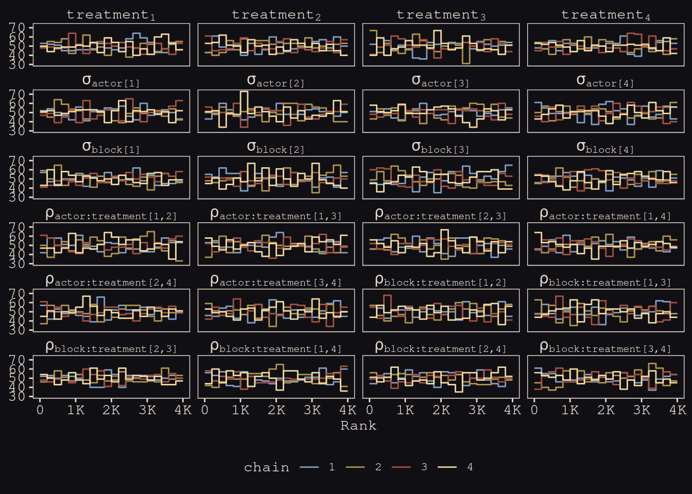


```r
library(posterior)
```

```
## This is posterior version 1.0.1
```

```
## 
## Attaching package: 'posterior'
```

```
## The following object is masked from 'package:brms':
## 
##     rhat
```

```
## The following object is masked from 'package:bayesplot':
## 
##     rhat
```

```
## The following objects are masked from 'package:rstan':
## 
##     ess_bulk, ess_tail
```

```
## The following objects are masked from 'package:stats':
## 
##     mad, sd, var
```

```r
posterior_samples(b14.3) %>% 
  summarise_draws() %>% 
  pivot_longer(starts_with("ess")) %>% 
  
  ggplot(aes(x = value)) +
  geom_histogram(binwidth = 250, fill = "#EEDA9D", color = "#DCA258") +
  xlim(0, NA) +
  facet_wrap(~ name)
```

```
## Warning: Removed 2 rows containing missing values (geom_bar).
```


```r
print(b14.3)
```

```
##  Family: binomial 
##   Links: mu = logit 
## Formula: pulled_left | trials(1) ~ 0 + treatment + (0 + treatment | actor) + (0 + treatment | block) 
##    Data: d (Number of observations: 504) 
## Samples: 4 chains, each with iter = 2000; warmup = 1000; thin = 1;
##          total post-warmup samples = 4000
## 
## Group-Level Effects: 
## ~actor (Number of levels: 7) 
##                            Estimate Est.Error l-95% CI u-95% CI Rhat Bulk_ESS
## sd(treatment1)                 1.40      0.50     0.69     2.64 1.00     2180
## sd(treatment2)                 0.91      0.41     0.33     1.91 1.00     2810
## sd(treatment3)                 1.84      0.55     1.03     3.15 1.00     3534
## sd(treatment4)                 1.56      0.59     0.73     3.01 1.00     3092
## cor(treatment1,treatment2)     0.42      0.28    -0.22     0.87 1.00     3004
## cor(treatment1,treatment3)     0.52      0.25    -0.06     0.89 1.00     2874
## cor(treatment2,treatment3)     0.49      0.26    -0.10     0.89 1.00     3276
## cor(treatment1,treatment4)     0.44      0.26    -0.14     0.87 1.00     3030
## cor(treatment2,treatment4)     0.44      0.28    -0.19     0.88 1.00     3560
## cor(treatment3,treatment4)     0.58      0.24     0.01     0.92 1.00     3481
##                            Tail_ESS
## sd(treatment1)                 2417
## sd(treatment2)                 2411
## sd(treatment3)                 3178
## sd(treatment4)                 2254
## cor(treatment1,treatment2)     3131
## cor(treatment1,treatment3)     2709
## cor(treatment2,treatment3)     3535
## cor(treatment1,treatment4)     2697
## cor(treatment2,treatment4)     3247
## cor(treatment3,treatment4)     2826
## 
## ~block (Number of levels: 6) 
##                            Estimate Est.Error l-95% CI u-95% CI Rhat Bulk_ESS
## sd(treatment1)                 0.42      0.34     0.01     1.26 1.00     2235
## sd(treatment2)                 0.43      0.35     0.02     1.29 1.00     1901
## sd(treatment3)                 0.30      0.27     0.01     0.99 1.00     2864
## sd(treatment4)                 0.47      0.38     0.02     1.41 1.00     2116
## cor(treatment1,treatment2)    -0.07      0.37    -0.74     0.64 1.00     5342
## cor(treatment1,treatment3)    -0.02      0.38    -0.72     0.71 1.00     8111
## cor(treatment2,treatment3)    -0.02      0.38    -0.72     0.69 1.00     5309
## cor(treatment1,treatment4)     0.05      0.37    -0.68     0.72 1.00     4579
## cor(treatment2,treatment4)     0.05      0.38    -0.66     0.73 1.00     4518
## cor(treatment3,treatment4)     0.02      0.38    -0.67     0.72 1.00     3951
##                            Tail_ESS
## sd(treatment1)                 2066
## sd(treatment2)                 2460
## sd(treatment3)                 1930
## sd(treatment4)                 2359
## cor(treatment1,treatment2)     3066
## cor(treatment1,treatment3)     2730
## cor(treatment2,treatment3)     2914
## cor(treatment1,treatment4)     2891
## cor(treatment2,treatment4)     3276
## cor(treatment3,treatment4)     3405
## 
## Population-Level Effects: 
##            Estimate Est.Error l-95% CI u-95% CI Rhat Bulk_ESS Tail_ESS
## treatment1     0.22      0.52    -0.80     1.27 1.00     2221     2356
## treatment2     0.64      0.40    -0.17     1.43 1.00     2906     2486
## treatment3    -0.02      0.57    -1.16     1.09 1.00     3243     3001
## treatment4     0.66      0.54    -0.40     1.73 1.00     3365     2678
## 
## Samples were drawn using sampling(NUTS). For each parameter, Bulk_ESS
## and Tail_ESS are effective sample size measures, and Rhat is the potential
## scale reduction factor on split chains (at convergence, Rhat = 1).
```

Compute the WAIC estimate:


```r
b14.3 <- add_criterion(b14.3, "waic")

waic(b14.3)
```

```
## 
## Computed from 4000 by 504 log-likelihood matrix
## 
##           Estimate   SE
## elpd_waic   -272.5  9.8
## p_waic        27.0  1.4
## waic         545.1 19.7
## 
## 1 (0.2%) p_waic estimates greater than 0.4. We recommend trying loo instead.
```


<div class="figure">

<p class="caption"> </p>
</div>


```r
# for annotation
text <-
  distinct(d, labels) %>% 
  mutate(actor = 1,
         prop  = c(.07, .8, .08, .795))

nd <-
  d %>% 
  distinct(actor, condition, labels, prosoc_left, treatment) %>% 
  mutate(block = 5)

# compute and wrangle the posterior predictions
fitted(b14.3,
       newdata = nd) %>% 
  data.frame() %>% 
  bind_cols(nd) %>% 
  # add the empirical proportions
  left_join(
    d %>%
      group_by(actor, treatment) %>%
      mutate(proportion = mean(pulled_left)) %>% 
      distinct(actor, treatment, proportion),
    by = c("actor", "treatment")
  ) %>% 
  mutate(condition = factor(condition)) %>% 
  
  # plot!
  ggplot(aes(x = labels)) +
  geom_hline(yintercept = .5, color = "#E8DCCF", alpha = 1/2, linetype = 2) +
  # empirical proportions
  geom_line(aes(y = proportion, group = prosoc_left),
            size = 1/4, color = "#394165") +
  geom_point(aes(y = proportion, shape = condition),
             color = "#394165", fill = "#100F14", size = 2.5, show.legend = F) + 
  # posterior predictions
  geom_line(aes(y = Estimate, group = prosoc_left),
            size = 3/4, color = "#80A0C7") +
  geom_pointrange(aes(y = Estimate, ymin = Q2.5, ymax = Q97.5, shape = condition),
                  color = "#80A0C7", fill = "#100F14", fatten = 8, size = 1/3, show.legend = F) + 
  # annotation for the conditions
  geom_text(data = text,
            aes(y = prop, label = labels), 
            color = "#DCA258", family = "Courier", size = 3) +
  scale_shape_manual(values = c(21, 19)) +
  scale_x_discrete(NULL, breaks = NULL) +
  scale_y_continuous("proportion left lever", breaks = 0:2 / 2, labels = c("0", ".5", "1")) +
  labs(subtitle = "Posterior predictions, in light blue, against the raw data, in dark blue, for\nmodel b14.3, the cross-classified varying effects model.") +
  facet_wrap(~ actor, nrow = 1, labeller = label_both)
```


----


```r
slides_dir = here::here("docs/slides/L18")
```


<div class="figure">

<p class="caption">We had specified this complicated random model. Now trying to show you non-centering reparameterising when you have random slopes. French guy called Cholesky figured out this cool technique. Way to take a bunch of uncorrelated values and give them any correlation you want. Here it's not what you want, it's the one the data wants. To get a non-cetnerd parameterisation, we nee the prior not to be conditonal on other parameters. For some datasets and models, some centering is better. You need to be flexible. </p>
</div>

<div class="figure">

<p class="caption">In red all the bits that have to do with actor effects. Parameter for each actor and treatment, doing it with shrinkage and pooling. That's what this `alpha[actor,tid]` is. Green is the analagous block effects. Column is again a treatment. So what's the average treatment on that day? Need to check for block effects. What we're doing here is almost exactly Stan code. What you want to see is that we're creating the matrix. Defined by `compose_noncentered`. Multiply them by the z-score gives us the right scale again. Last bit down the bottom, now it doesn't contain a correlation matrix, it's a cholesky factor. </p>
</div>


<div class="figure">

<p class="caption">What you get from this is really amazing. They produce the same inferences, but some do them more effectively than others. Each point is a parameter in the posterior distribution. The horizontal axis is the number of effective samples from the centered model, that looks how the way we talk about MLMs. The vertical si the corresponding number of effective samples. So sometimes there are more than double the number of effective samples. This is not unqiue to Hamiltonian Monte Carlo, but the difference is that it tells you.</p>
</div>

<div class="figure">

<p class="caption">Why are we doing this? We care about inference. Just the standard deviations from the random effects. For now, what do we learn from the SDs? They generate the stregth of pooling. The amount of variation is learned, and these are embodying that learning or information. The first four are actor effects that correspond to treatment factors. 1 was prosocial option on the right, and no partner present. 2 was prosocial left, no partner. 3 was prosocial right, parter, 4 prosocial left, partner present. And there's a lot less variation in treatment 2. The blocks are pretty much all the same. So it does more shrinkage than on actors, because the actors are diffferent due to handedlness. </p>
</div>

<div class="figure">

<p class="caption">Here are the correlation efffects. You can transform the Choleky factors by tranposing - rotating and multiplying by itself to get the correlation matrix. Diagonal is all 1s. All the things on the 1s show up as points. Then the others are correlations between the different treatments. Note they're all positive. What does that mean? It's handedness. At the individual level, the correlations are hgih because of handedness. Now you see it arises as a correlation among the treatments at the actor level. A lot of the information is like this where you can capture it. Looks different when you inspect it. But if you made parameters for left and right, these correlations won't appear. Homework has a similar problem. </p>
</div>

<div class="figure">

<p class="caption">Posterior predictions. Take the posterior and push it back through the model. Why? To make sure the model works, adn caputres the texture of the data, but isn't identical due to shrinkage. Each actor going across. Each is a point. Tilt tells you what happens when you add the partner. Answer is not much. But moving the food to the other side of the table makes them attracted to more food. Actor 2 doesn't respond that way because actor 2 doesn't change. But notic ehthe model doesn't retrodict, because of shrinkage. SO the predictions are pulled a little bit towards the mean of the population, and most in treatment 2. The variance of treatment 2 was lower, so you get more shirnkage. sigma actor 2 is about 1, where sigma for the others were above 1.</p>
</div>

<div class="figure">

<p class="caption">Only advice I can often give is horoscopic. The design of a proper analysis is outside the table, so the table is not enough. Nevertheless, it's nice to have a default; a place to start. I fyou had the bare minimum of information, you could use a horoscopes, adn the predictions are terrible. So you should feel fine about deviating from them when you learn something. So use a causal model first. Start with the empty model. Itdentify the clusters of interest (chimps, blocks, treatments) then put them in as varying intercepts. Like a shriking ANOVA. Where's the variation? Then you get the machine humming before you start adding predictors. Standardise unless ordered categories. Good default behaviour. Always pregularise by simulating from the piror. THen add in predictors and vary their slopes. Find to drop varying effects whens sigmas are small, but you could also leave them in and they'll aggressively shrink. Consider if you're trying to expmlain the sample, you'll focus on the units. More linkely that you're not interested in lefty, but in the variation in the population. We care about the indivdiuals, but they're exchangeable in the sense we're trying to generalise to the population, not making predictions about the same individuals.  </p>
</div>

<div class="figure">

<p class="caption">Quick conceptual introduction to two families of covariance models that go beyond random slopes. All the cool things we can do with covariance matrixes. Quick guide to say that lods of models focus on covariance matrixes. Going to look at instrumental variables. MR *is* instrumental variables. Then social relations model. Network models also depend on covariation of behaviour among nodes. Factor analysis is also covariance. And animal model. Shows that height is just a big covariance matrix. (Probably want to de-center.) Spatial distances are another kind of distance you can specify the covariaiton of.</p>
</div>

## Instruments and causal designs

***14.3.1. Instrumental variables***

<div class="figure">

<p class="caption">This is a cool technqiue that goes beyond the backdoor crioterion. Sometimes it tells you you can't remove the confounding. But all is not lost - you can still deconfound. Imagine this classic case where we're interested in some E for education, and W for wages. Many people are interested in measuring the ffect of education on wages. Unviersity funding hinges on it. The problem is that there are a huge umber of confounds, labelled U. Could just be personality effects, like your laziness. There are going to be lots like this in any observational system. Can't condition on you because we don't have it measured. </p>
</div>

<div class="figure">

<p class="caption">But if you can get an instrument Q, there's some hope. It's a variable that affects the exposure of interest, but not the outcome. Here it's birthday position in year. Q for quarter. Famous exampel form the economics literature. Pepople born earlier consume less eudcation. Why? First, age is a social variable. The age you're assigned is randomly cut off in January. So you can be biolgically almost a year older than someone the same social age. And it's your social age that determines when you start school. So earlier in the year are older when they start school, and graduate having completed less school. You're also eligible to quit school earlier. So you will have consumed less school if you drop out at the same time as someone younger. This is a natural experiment, assigned by the hand of god, interacts with the social system. Adjusts your education independent of the confounds, which are probably not associated with January - people born in January probably aren't lazier, but we need to check this.</p>
</div>

<div class="figure">

<p class="caption">Why does this help? It turns E into a collider. If we condition on E, which we're going ot do, and we know Q, we get information about U. Like the light switch - if the ligth is on, and the conditions for that are that the switch is on and there needs to be electricity, conditioning on E is like saying I know the light is on. Conditioning on Q is like saying I know the switch is thrown. Now you know U, that electricyt is there. So what's happening here? Next slide. Let's talk about correlation first. Q tells us something about the strength of the corrleation U. </p>
</div>

<div class="figure">

<p class="caption">Imagine on average Q1 people consume 10 years more. Then we look a ta parituclar Q1 person who consumed more than the average. We just learned seomething about the confound. That they're not more lazy. We find out about them when we find out about their education, because we now something about Q. </p>
</div>

<div class="figure">

<p class="caption">Often these are called natural experiments in biology. If we fould experimentally maniputlate education, we woudl do that, but can't. We'd satisfy the backdoor criterion. Not ethical to do that. The birthday is random, so now it's liek a weak experiemnt, where we've partially closed the backdoor. Like an experiemnt that doesn't always take. Q is suggesting to indiviuals they should do more or less education. The tendencies to follow the experiemnt give you information about the confound. If you follow up on the litereature, many experiements are actually like this, because we only suggest treatments to poeple. Epidemiologicla experiments are like this, becuase you only suggest treatment - they walk out the door and some take it and some don't. This is called *intent to treat*, and you have to estimate it. Really famous case with anti-retroviral trials. People taking them knew there was a control arm, so they blended up their medications. Turns out this isn't rare. This instrumental variable analysis is the correct way to anlysis an epxeriemtbn where the treatment is not enforced, but only suggested. Happens in psychology. Did they really look at the stimulus?  </p>
</div>

<div class="figure">

<p class="caption">Generatively, what to do. Take the DAG and simulate from it. There's a model for wages as a function of education and the confound. </p>
</div>

<div class="figure">

<p class="caption">Then education is there. </p>
</div>

<div class="figure">

<p class="caption">Then quarter of birth. Not true, but for the sake of the example.</p>
</div>


<div class="figure">

<p class="caption">Making the effect of E 0. </p>
</div>


```r
# make a standardizing function
standardize <- function(x) {
  (x - mean(x)) / sd(x)
}

# simulate
set.seed(73) 

n <- 500

dat_sim <-
  tibble(u_sim = rnorm(n, mean = 0, sd = 1),
         q_sim = sample(1:4, size = n, replace = T)) %>% 
  mutate(e_sim = rnorm(n, mean = u_sim + q_sim, sd = 1)) %>% 
  mutate(w_sim = rnorm(n, mean = u_sim + 0 * e_sim, sd = 1)) %>% 
  mutate(w = standardize(w_sim),
         e = standardize(e_sim),
         q = standardize(q_sim))

dat_sim
```

```
## # A tibble: 500 × 7
##      u_sim q_sim e_sim   w_sim       w       e      q
##      <dbl> <int> <dbl>   <dbl>   <dbl>   <dbl>  <dbl>
##  1 -0.145      1 1.51   0.216   0.173  -0.575  -1.36 
##  2  0.291      1 0.664  0.846   0.584  -1.09   -1.36 
##  3  0.0938     3 2.44  -0.664  -0.402  -0.0185  0.428
##  4 -0.127      3 4.09  -0.725  -0.442   0.978   0.428
##  5 -0.847      4 2.62  -1.24   -0.780   0.0939  1.32 
##  6  0.141      4 3.54  -0.0700 -0.0146  0.651   1.32 
##  7  1.54       2 3.65   1.88    1.26    0.714  -0.464
##  8  2.74       3 4.91   2.52    1.67    1.48    0.428
##  9  1.55       3 4.18   0.624   0.439   1.04    0.428
## 10  0.462      1 0.360  0.390   0.286  -1.27   -1.36 
## # … with 490 more rows
```


<div class="figure">

<p class="caption">Rn the naive regression. Strong and reliable effect. Purely the confound. Can't interpret these things.</p>
</div>


```r
b14.4 <-
  brm(data = dat_sim,
      family = gaussian,
      w ~ 1 + e,
      prior = c(prior(normal(0, 0.2), class = Intercept),
                prior(normal(0, 0.5), class = b),
                prior(exponential(1), class = sigma)),
      iter = 2000, warmup = 1000, chains = 4, cores = 4,  
      seed = 14,
      file = "fits/b14.04")

print(b14.4)
```

```
##  Family: gaussian 
##   Links: mu = identity; sigma = identity 
## Formula: w ~ 1 + e 
##    Data: dat_sim (Number of observations: 500) 
## Samples: 4 chains, each with iter = 2000; warmup = 1000; thin = 1;
##          total post-warmup samples = 4000
## 
## Population-Level Effects: 
##           Estimate Est.Error l-95% CI u-95% CI Rhat Bulk_ESS Tail_ESS
## Intercept    -0.00      0.04    -0.08     0.08 1.00     4195     2893
## e             0.40      0.04     0.32     0.48 1.00     3606     2780
## 
## Family Specific Parameters: 
##       Estimate Est.Error l-95% CI u-95% CI Rhat Bulk_ESS Tail_ESS
## sigma     0.92      0.03     0.86     0.98 1.00     4362     3150
## 
## Samples were drawn using sampling(NUTS). For each parameter, Bulk_ESS
## and Tail_ESS are effective sample size measures, and Rhat is the potential
## scale reduction factor on split chains (at convergence, Rhat = 1).
```


<div class="figure">

<p class="caption">Now add the instrument. And you could estimate all the $U$s as parameters, one for each of the 500 individuals in the sample. But the way better way to do that, is to use the MVNOrmal as your outcome distribution. So now as the likelihood, the top part of the model, we're going to say that $W$ and $E$ are drawn from a common distribtuion with some correlation. Where does the correlation come from? From the confound.</p>
</div>

<div class="figure">

<p class="caption">First path we'll worry about is the instrument to education. Expected amount of education is some intercept then slope for quartr of birth.</p>
</div>

<div class="figure">

<p class="caption">Siomuiltaenosuly we'll runt he other model of effect of education on wages. </p>
</div>

<div class="figure">

<p class="caption">Then at the top we deal with the confound. Generates correlated devaitions after we'd conditioned on other things. This is the same gerative model, but we've marginalised over all the $U$ values, by making a correlation matrix.</p>
</div>

<div class="figure">

<p class="caption">SO now we have this at the top of the mdoel.</p>
</div>

Now see what happens when we also condition directly on $Q$, as in $Q \rightarrow W \leftarrow E$.


```r
b14.5 <-
  brm(data = dat_sim,
      family = gaussian,
      w ~ 1 + e + q,
      prior = c(prior(normal(0, 0.2), class = Intercept),
                prior(normal(0, 0.5), class = b),
                prior(exponential(1), class = sigma)),
      iter = 2000, warmup = 1000, chains = 4, cores = 4,  
      seed = 14,
      file = "fits/b14.05")
```


```r
print(b14.5)
```

```
##  Family: gaussian 
##   Links: mu = identity; sigma = identity 
## Formula: w ~ 1 + e + q 
##    Data: dat_sim (Number of observations: 500) 
## Samples: 4 chains, each with iter = 2000; warmup = 1000; thin = 1;
##          total post-warmup samples = 4000
## 
## Population-Level Effects: 
##           Estimate Est.Error l-95% CI u-95% CI Rhat Bulk_ESS Tail_ESS
## Intercept    -0.00      0.04    -0.07     0.07 1.00     3712     2956
## e             0.63      0.05     0.54     0.73 1.00     3489     3290
## q            -0.40      0.05    -0.50    -0.31 1.00     3404     3029
## 
## Family Specific Parameters: 
##       Estimate Est.Error l-95% CI u-95% CI Rhat Bulk_ESS Tail_ESS
## sigma     0.86      0.03     0.81     0.91 1.00     3585     3149
## 
## Samples were drawn using sampling(NUTS). For each parameter, Bulk_ESS
## and Tail_ESS are effective sample size measures, and Rhat is the potential
## scale reduction factor on split chains (at convergence, Rhat = 1).
```

Holy smokes that's a mess. This model suggests both $E$ and $Q$ have moderate to strong effects on $W$, even though we know neither do based on the true data-generating model. 

The statistical solution is as follows:


```r
e_model <- bf(e ~ 1 + q)
w_model <- bf(w ~ 1 + e)

b14.6 <-
  brm(data = dat_sim, 
      family = gaussian,
      e_model + w_model + set_rescor(TRUE),
      prior = c(# E model
                prior(normal(0, 0.2), class = Intercept, resp = e),
                prior(normal(0, 0.5), class = b, resp = e),
                prior(exponential(1), class = sigma, resp = e),
                
                # W model
                prior(normal(0, 0.2), class = Intercept, resp = w),
                prior(normal(0, 0.5), class = b, resp = w),
                prior(exponential(1), class = sigma, resp = w),
                
                # rho
                prior(lkj(2), class = rescor)),
      iter = 2000, warmup = 1000, chains = 4, cores = 4,
      seed = 14,
      file = "fits/b14.06")
```


```r
print(b14.6)
```

```
##  Family: MV(gaussian, gaussian) 
##   Links: mu = identity; sigma = identity
##          mu = identity; sigma = identity 
## Formula: e ~ 1 + q 
##          w ~ 1 + e 
##    Data: dat_sim (Number of observations: 500) 
## Samples: 4 chains, each with iter = 2000; warmup = 1000; thin = 1;
##          total post-warmup samples = 4000
## 
## Population-Level Effects: 
##             Estimate Est.Error l-95% CI u-95% CI Rhat Bulk_ESS Tail_ESS
## e_Intercept    -0.00      0.04    -0.07     0.07 1.00     2866     2597
## w_Intercept    -0.00      0.04    -0.09     0.09 1.00     2895     2703
## e_q             0.59      0.04     0.52     0.66 1.00     2809     2527
## w_e            -0.05      0.08    -0.21     0.09 1.00     1969     2492
## 
## Family Specific Parameters: 
##         Estimate Est.Error l-95% CI u-95% CI Rhat Bulk_ESS Tail_ESS
## sigma_e     0.81      0.03     0.76     0.86 1.00     3419     2895
## sigma_w     1.02      0.05     0.94     1.12 1.00     2055     2223
## 
## Residual Correlations: 
##             Estimate Est.Error l-95% CI u-95% CI Rhat Bulk_ESS Tail_ESS
## rescor(e,w)     0.54      0.05     0.44     0.64 1.00     1983     2373
## 
## Samples were drawn using sampling(NUTS). For each parameter, Bulk_ESS
## and Tail_ESS are effective sample size measures, and Rhat is the potential
## scale reduction factor on split chains (at convergence, Rhat = 1).
```


Now the parameter for $E \rightarrow W$, `w_e`, is just where it should be -- near zero. The residual correlation between $E$ and $Q$ is positive and large in magnitude, indicating their common influence from the unmeasured variable $U$.

<div class="figure">

<p class="caption">This works. First thing to look at are the regression effects. No confound there. Now look at our unconfounded education. Notice that `Rho[1,2]` is the correlation between education and wages, after having conditioned on the instrument - so it's the effect of the confound. Positive correlations, which give you clues about what it could be. </p>
</div>

Now adjust the simulation and try a scenario in which education has a positive influence but the confound hides it:


```r
set.seed(73) 

n <- 500

dat_sim <-
  tibble(u_sim = rnorm(n, mean = 0, sd = 1),
         q_sim = sample(1:4, size = n, replace = T)) %>% 
  mutate(e_sim = rnorm(n, mean = u_sim + q_sim, sd = 1)) %>% 
  mutate(w_sim = rnorm(n, mean = -u_sim + 0.2 * e_sim, sd = 1)) %>% 
  mutate(w = standardize(w_sim),
         e = standardize(e_sim),
         q = standardize(q_sim))

dat_sim
```

```
## # A tibble: 500 × 7
##      u_sim q_sim e_sim  w_sim       w       e      q
##      <dbl> <int> <dbl>  <dbl>   <dbl>   <dbl>  <dbl>
##  1 -0.145      1 1.51   0.809  0.248  -0.575  -1.36 
##  2  0.291      1 0.664  0.396 -0.0563 -1.09   -1.36 
##  3  0.0938     3 2.44  -0.364 -0.615  -0.0185  0.428
##  4 -0.127      3 4.09   0.347 -0.0922  0.978   0.428
##  5 -0.847      4 2.62   0.976  0.370   0.0939  1.32 
##  6  0.141      4 3.54   0.357 -0.0852  0.651   1.32 
##  7  1.54       2 3.65  -0.466 -0.690   0.714  -0.464
##  8  2.74       3 4.91  -1.98  -1.80    1.48    0.428
##  9  1.55       3 4.18  -1.64  -1.55    1.04    0.428
## 10  0.462      1 0.360 -0.461 -0.686  -1.27   -1.36 
## # … with 490 more rows
```

Update the models:


```r
b14.4x <-
  update(b14.4,
         newdata = dat_sim,
         iter = 2000, warmup = 1000, chains = 4, cores = 4,  
         seed = 14,
         file = "fits/b14.04x")

b14.6x <-
  update(b14.6,
         newdata = dat_sim,
         iter = 2000, warmup = 1000, chains = 4, cores = 4,  
         seed = 14, 
         file = "fits/b14.06x")
```

Examine the effects with a coefficient plot

```r
text <-
  tibble(Estimate = c(fixef(b14.4x)[2, 3], fixef(b14.6x)[4, 4]),
         y        = c(4.35, 3.65),
         hjust    = c(0, 1),
         fit      = c("b14.4x", "b14.6x"))

bind_rows(
  # b_14.4x
  posterior_summary(b14.4x)[1:3, ] %>% 
    data.frame() %>% 
    mutate(param = c("alpha[W]", "beta[EW]", "sigma[W]"),
           fit = "b14.4x"),
  # b_14.6x
  posterior_summary(b14.6x)[1:7, ] %>%  
    data.frame() %>% 
    mutate(param = c("alpha[E]", "alpha[W]", "beta[QE]", "beta[EW]", "sigma[E]", "sigma[W]", "rho"),
           fit = "b14.6x")) %>% 
  mutate(param = factor(param,
                        levels = c("rho", "sigma[W]", "sigma[E]", "beta[EW]", "beta[QE]", "alpha[W]", "alpha[E]"))) %>%
  
  ggplot(aes(x = param, y = Estimate, color = fit)) +
  geom_hline(yintercept = 0, color = "#E8DCCF", alpha = 1/4) +
  geom_pointrange(aes(ymin = Q2.5, ymax = Q97.5),
                  fatten = 2, position = position_dodge(width = 0.5)) +
  geom_text(data = text,
            aes(x = y, label = fit, hjust = hjust)) +
  scale_color_manual(NULL, values = c("#E7CDC2", "#A65141")) +
  scale_x_discrete(NULL, labels = ggplot2:::parse_safe) +
  ylab("marginal posterior") +
  coord_flip() +
  theme(axis.text.y = element_text(hjust = 0),
        axis.ticks.y = element_blank(),
        legend.position = "none")
```

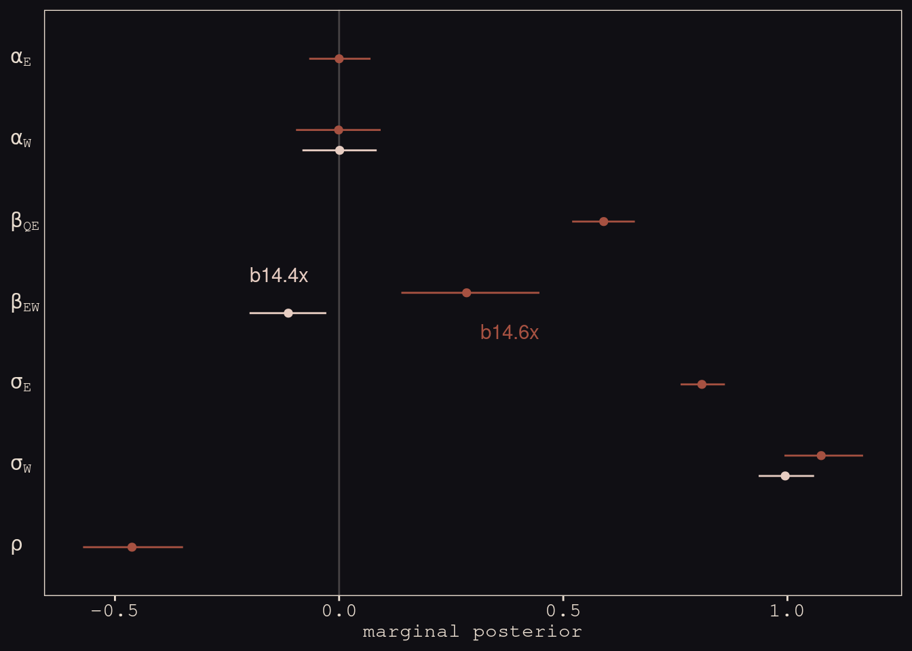

With the help from `b14.6x`, we found "that E and W have a negative correlation in their residual variance, because the confound positively influences one and negatively influences the other" (p. 459).

***14.3.2. Other designs***

<div class="figure">

<p class="caption">Instruments are limited. THe hardest part is finding a plausible instrument. Cannot test whether something is a good instrument! DAG depends upon scientific information, not the data alone. Weak instruments may not be useful. Try some simulations from the chapters. Now we'll introduce other things like the front door criterions.</p>
</div>

## Social relations as correlated varying effects

<div class="figure">

<p class="caption">One of my favourite types of models. Often in the social sciences and organismal biology, we're interested in dyadic interactionsb etween units. Complicated because there's a field of interactions. Pulling apart can be difficult. </p>
</div>

<div class="figure">

<p class="caption">Example from a collaborator. 25 households from rural Nicaragua. Outcome is gifts, usually of meat, from one household to another. Lots of reciprocity in these networks, but meausuring is tricky, becuase there are also generalised effects. 300 dyads. This dataset has 300 rows. Modest correalation of 0.24. But this isn't the way to measure reciprocity. </p>
</div>


```r
library(rethinking)
data(KosterLeckie)
```


```r
kl_dyads %>% glimpse()
```

```
## Rows: 300
## Columns: 13
## $ hidA    <int> 1, 1, 1, 1, 1, 1, 1, 1, 1, 1, 1, 1, 1, 1, 1, 1, 1, 1, 1, 1, 1,…
## $ hidB    <int> 2, 3, 4, 5, 6, 7, 8, 9, 10, 11, 12, 13, 14, 15, 16, 17, 18, 19…
## $ did     <int> 1, 2, 3, 4, 5, 6, 7, 8, 9, 10, 11, 12, 13, 14, 15, 16, 17, 18,…
## $ giftsAB <int> 0, 6, 2, 4, 8, 2, 1, 0, 10, 1, 0, 0, 1, 6, 0, 0, 0, 0, 0, 0, 0…
## $ giftsBA <int> 4, 31, 5, 2, 2, 1, 2, 1, 110, 0, 0, 6, 11, 0, 1, 4, 0, 2, 0, 7…
## $ offset  <dbl> 0.000, -0.003, -0.019, 0.000, -0.003, 0.000, 0.000, 0.000, -0.…
## $ drel1   <int> 0, 0, 0, 0, 1, 0, 0, 0, 1, 0, 0, 0, 0, 0, 0, 0, 0, 0, 0, 0, 0,…
## $ drel2   <int> 0, 1, 1, 1, 0, 0, 0, 0, 0, 1, 0, 0, 1, 0, 0, 0, 0, 0, 0, 0, 0,…
## $ drel3   <int> 1, 0, 0, 0, 0, 0, 0, 0, 0, 0, 1, 1, 0, 0, 0, 0, 0, 0, 1, 0, 0,…
## $ drel4   <int> 0, 0, 0, 0, 0, 0, 1, 1, 0, 0, 0, 0, 0, 0, 0, 1, 0, 1, 0, 1, 1,…
## $ dlndist <dbl> -2.790, -2.817, -1.886, -1.892, -3.499, -1.853, -1.475, -1.644…
## $ dass    <dbl> 0.000, 0.044, 0.025, 0.011, 0.022, 0.071, 0.046, 0.003, 0.552,…
## $ d0125   <int> 0, 0, 0, 0, 0, 0, 0, 0, 0, 0, 0, 0, 0, 0, 0, 0, 0, 0, 0, 0, 0,…
```


```r
kl_dyads %>% 
  ggplot(aes(x = hidA, y = hidB, label = did)) +
  geom_tile(aes(fill = did),
            show.legend = F) +
  geom_text(size = 2.25, family = "Courier") +
  geom_vline(xintercept = 0:24 + 0.5, color = "#394165", size = 1/5) +
  geom_hline(yintercept = 1:25 + 0.5, color = "#394165", size = 1/5) +
  scale_fill_gradient(low = "#DCA258", high = "#EEDA9D", limits = c(1, NA)) +
  scale_x_continuous(breaks = 1:24) +
  scale_y_continuous(breaks = 2:25) +
  theme(axis.text = element_text(size = 9),
        axis.ticks = element_blank())
```

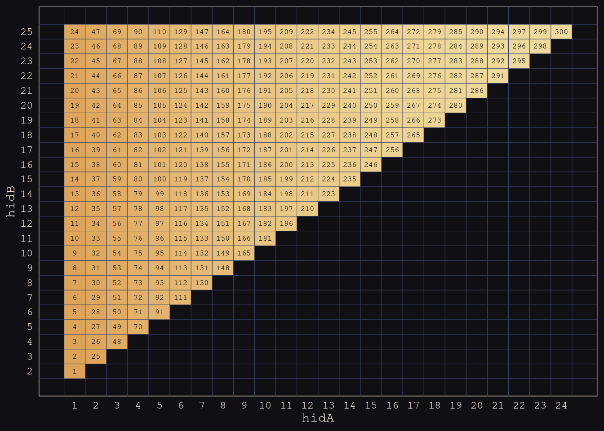


Figure 14.8


```r
kl_dyads %>% 
  ggplot(aes(x = giftsAB, y = giftsBA)) +
  geom_hex(bins = 70) +
  geom_abline(color = "#DCA258", linetype = 3) +
  scale_fill_gradient(low = "#E7CDC2", high = "#A65141", limits = c(1, NA)) +
  scale_x_continuous("gifts household A to household B", limits = c(0, 113)) +
  scale_y_continuous("gifts from B to A", limits = c(0, 113)) +
  ggtitle("Distribution of dyadic gifts") +
  coord_equal()
```

```
## Warning: Removed 11 rows containing missing values (geom_hex).
```


Pearson's correlation coefficient, collapsing across grouping levels.


```r
cor(kl_dyads$giftsAB, kl_dyads$giftsBA) %>% round(digits = 3)
```

```
## [1] 0.239
```

However, it would be a mistake to take this correlation seriously. It is a disentangled mixture of various kinds of associations, none of which are guaranteed to be even close to $r=.24$. Remember this as we move along with the analyses and let the consequences burn a methodological mark into your soul.

<div class="figure">

<p class="caption">Here's the problem. TThe 0.24 correlation is produced both by generalised effects, and household-specific (or dyadic) effects. Also a lot of predictors like kinship in the datsaaaset. We're going to ignore it. We think about the count from A to B. There's some average $\alpha$. There's also a generosity rate. Some households are more generous to others. There's also generalised receiving, $r_B$. These generalised effects are contaminating. Then there are dyad effects, consdiering only the household A and B, how much does A give to B, and how is that correlation to how much B gives to A. </p>
</div>

<div class="figure">

<p class="caption">How to model it? We need covariances! One covariance matrix for the generalised effects. For each hosuefhold $i$, you have two parameters, $g$ - gleneralised offset, as in how much it's giving on average, offset, adn $r$, which is how much more than alpha it tends to receive. They're going to be correlated. We set upt this 2x2 covariance matrix as before. Variation in the givingness offset, and variation in the receivingness offset. Nothing new here really.  </p>
</div>

<div class="figure">

<p class="caption">Next we have the dyad effects. For each dyad $i$ and $j$, they're donation offsets in both directions. A can tend to give a lot to B, and B gives little to A, then these `d` parameters will have low correaltion. If they're negative, the pairs end up in depednence relationships. We capture these effects iwth this covariance matrix. It's new, and special, because it only has one sigma inside of it. Why? Because it's symmetrical. A and B are th same type of parameter. Like judo - blue and read shorts are random, so the variance between their wins must be the same because it's randomised.</p>
</div>

<div class="figure">

<p class="caption">Just copy the sigma twice into the matrix. Details are boring. Just one sigma - $\sigma_d$.</p>
</div>


```r
kl_data <- 
  list(
    N            = nrow(kl_dyads),
    N_households = max(kl_dyads$hidB), 
    did          = kl_dyads$did,
    hidA         = kl_dyads$hidA,
    hidB         = kl_dyads$hidB,
    giftsAB      = kl_dyads$giftsAB, 
    giftsBA      = kl_dyads$giftsBA
  )

m14.7 <- 
  ulam( 
    alist(
      giftsAB ~ poisson(lambdaAB),
      giftsBA ~ poisson(lambdaBA),
      log(lambdaAB) <- a + gr[hidA, 1] + gr[hidB, 2] + d[did, 1] , 
      log(lambdaBA) <- a + gr[hidB, 1] + gr[hidA, 2] + d[did, 2] , 
      a ~ normal(0, 1),
      
      ## gr matrix of varying effects
      vector[2]:gr[N_households] ~ multi_normal(0, Rho_gr, sigma_gr), 
      Rho_gr ~ lkj_corr(4),
      sigma_gr ~ exponential(1),
      
      ## dyad effects
      transpars> matrix[N,2]:d <-
        compose_noncentered(rep_vector(sigma_d, 2), L_Rho_d, z), 
      matrix[2,N]:z ~ normal(0, 1),
      cholesky_factor_corr[2]:L_Rho_d ~ lkj_corr_cholesky(8), 
      sigma_d ~ exponential(1),
      
      ## compute correlation matrix for dyads
      gq> matrix[2, 2]:Rho_d <<- Chol_to_Corr(L_Rho_d)
    ), 
    data = kl_data, 
    chains = 4, cores = 4, iter = 2000
  )
```

```
## This is cmdstanr version 0.4.0
```

```
## - Online documentation and vignettes at mc-stan.org/cmdstanr
```

```
## - CmdStan path set to: /homes/brettell/.cmdstanr/cmdstan-2.28.2
```

```
## - Use set_cmdstan_path() to change the path
```

```
## Running MCMC with 4 parallel chains, with 1 thread(s) per chain...
## 
## Chain 1 Iteration:    1 / 2000 [  0%]  (Warmup)
```

```
## Chain 1 Informational Message: The current Metropolis proposal is about to be rejected because of the following issue:
```

```
## Chain 1 Exception: lkj_corr_lpdf: Correlation matrix is not positive definite. (in '/tmp/RtmpezcR3b/model-2dd7716dc7e650.stan', line 30, column 4 to column 27)
```

```
## Chain 1 If this warning occurs sporadically, such as for highly constrained variable types like covariance matrices, then the sampler is fine,
```

```
## Chain 1 but if this warning occurs often then your model may be either severely ill-conditioned or misspecified.
```

```
## Chain 1
```

```
## Chain 1 Informational Message: The current Metropolis proposal is about to be rejected because of the following issue:
```

```
## Chain 1 Exception: lkj_corr_lpdf: Correlation matrix is not positive definite. (in '/tmp/RtmpezcR3b/model-2dd7716dc7e650.stan', line 30, column 4 to column 27)
```

```
## Chain 1 If this warning occurs sporadically, such as for highly constrained variable types like covariance matrices, then the sampler is fine,
```

```
## Chain 1 but if this warning occurs often then your model may be either severely ill-conditioned or misspecified.
```

```
## Chain 1
```

```
## Chain 1 Informational Message: The current Metropolis proposal is about to be rejected because of the following issue:
```

```
## Chain 1 Exception: lkj_corr_lpdf: Correlation matrix is not positive definite. (in '/tmp/RtmpezcR3b/model-2dd7716dc7e650.stan', line 30, column 4 to column 27)
```

```
## Chain 1 If this warning occurs sporadically, such as for highly constrained variable types like covariance matrices, then the sampler is fine,
```

```
## Chain 1 but if this warning occurs often then your model may be either severely ill-conditioned or misspecified.
```

```
## Chain 1
```

```
## Chain 1 Informational Message: The current Metropolis proposal is about to be rejected because of the following issue:
```

```
## Chain 1 Exception: lkj_corr_lpdf: Correlation matrix is not positive definite. (in '/tmp/RtmpezcR3b/model-2dd7716dc7e650.stan', line 30, column 4 to column 27)
```

```
## Chain 1 If this warning occurs sporadically, such as for highly constrained variable types like covariance matrices, then the sampler is fine,
```

```
## Chain 1 but if this warning occurs often then your model may be either severely ill-conditioned or misspecified.
```

```
## Chain 1
```

```
## Chain 1 Informational Message: The current Metropolis proposal is about to be rejected because of the following issue:
```

```
## Chain 1 Exception: lkj_corr_lpdf: Correlation matrix is not positive definite. (in '/tmp/RtmpezcR3b/model-2dd7716dc7e650.stan', line 30, column 4 to column 27)
```

```
## Chain 1 If this warning occurs sporadically, such as for highly constrained variable types like covariance matrices, then the sampler is fine,
```

```
## Chain 1 but if this warning occurs often then your model may be either severely ill-conditioned or misspecified.
```

```
## Chain 1
```

```
## Chain 2 Iteration:    1 / 2000 [  0%]  (Warmup)
```

```
## Chain 2 Informational Message: The current Metropolis proposal is about to be rejected because of the following issue:
```

```
## Chain 2 Exception: lkj_corr_lpdf: Correlation matrix is not positive definite. (in '/tmp/RtmpezcR3b/model-2dd7716dc7e650.stan', line 30, column 4 to column 27)
```

```
## Chain 2 If this warning occurs sporadically, such as for highly constrained variable types like covariance matrices, then the sampler is fine,
```

```
## Chain 2 but if this warning occurs often then your model may be either severely ill-conditioned or misspecified.
```

```
## Chain 2
```

```
## Chain 2 Informational Message: The current Metropolis proposal is about to be rejected because of the following issue:
```

```
## Chain 2 Exception: lkj_corr_lpdf: Correlation matrix is not positive definite. (in '/tmp/RtmpezcR3b/model-2dd7716dc7e650.stan', line 30, column 4 to column 27)
```

```
## Chain 2 If this warning occurs sporadically, such as for highly constrained variable types like covariance matrices, then the sampler is fine,
```

```
## Chain 2 but if this warning occurs often then your model may be either severely ill-conditioned or misspecified.
```

```
## Chain 2
```

```
## Chain 2 Informational Message: The current Metropolis proposal is about to be rejected because of the following issue:
```

```
## Chain 2 Exception: lkj_corr_lpdf: Correlation matrix is not positive definite. (in '/tmp/RtmpezcR3b/model-2dd7716dc7e650.stan', line 30, column 4 to column 27)
```

```
## Chain 2 If this warning occurs sporadically, such as for highly constrained variable types like covariance matrices, then the sampler is fine,
```

```
## Chain 2 but if this warning occurs often then your model may be either severely ill-conditioned or misspecified.
```

```
## Chain 2
```

```
## Chain 2 Informational Message: The current Metropolis proposal is about to be rejected because of the following issue:
```

```
## Chain 2 Exception: lkj_corr_lpdf: Correlation matrix is not positive definite. (in '/tmp/RtmpezcR3b/model-2dd7716dc7e650.stan', line 30, column 4 to column 27)
```

```
## Chain 2 If this warning occurs sporadically, such as for highly constrained variable types like covariance matrices, then the sampler is fine,
```

```
## Chain 2 but if this warning occurs often then your model may be either severely ill-conditioned or misspecified.
```

```
## Chain 2
```

```
## Chain 2 Informational Message: The current Metropolis proposal is about to be rejected because of the following issue:
```

```
## Chain 2 Exception: lkj_corr_lpdf: Correlation matrix is not positive definite. (in '/tmp/RtmpezcR3b/model-2dd7716dc7e650.stan', line 30, column 4 to column 27)
```

```
## Chain 2 If this warning occurs sporadically, such as for highly constrained variable types like covariance matrices, then the sampler is fine,
```

```
## Chain 2 but if this warning occurs often then your model may be either severely ill-conditioned or misspecified.
```

```
## Chain 2
```

```
## Chain 2 Informational Message: The current Metropolis proposal is about to be rejected because of the following issue:
```

```
## Chain 2 Exception: lkj_corr_lpdf: Correlation matrix is not positive definite. (in '/tmp/RtmpezcR3b/model-2dd7716dc7e650.stan', line 30, column 4 to column 27)
```

```
## Chain 2 If this warning occurs sporadically, such as for highly constrained variable types like covariance matrices, then the sampler is fine,
```

```
## Chain 2 but if this warning occurs often then your model may be either severely ill-conditioned or misspecified.
```

```
## Chain 2
```

```
## Chain 3 Iteration:    1 / 2000 [  0%]  (Warmup)
```

```
## Chain 3 Informational Message: The current Metropolis proposal is about to be rejected because of the following issue:
```

```
## Chain 3 Exception: lkj_corr_lpdf: Correlation matrix is not positive definite. (in '/tmp/RtmpezcR3b/model-2dd7716dc7e650.stan', line 30, column 4 to column 27)
```

```
## Chain 3 If this warning occurs sporadically, such as for highly constrained variable types like covariance matrices, then the sampler is fine,
```

```
## Chain 3 but if this warning occurs often then your model may be either severely ill-conditioned or misspecified.
```

```
## Chain 3
```

```
## Chain 3 Informational Message: The current Metropolis proposal is about to be rejected because of the following issue:
```

```
## Chain 3 Exception: lkj_corr_lpdf: Correlation matrix is not positive definite. (in '/tmp/RtmpezcR3b/model-2dd7716dc7e650.stan', line 30, column 4 to column 27)
```

```
## Chain 3 If this warning occurs sporadically, such as for highly constrained variable types like covariance matrices, then the sampler is fine,
```

```
## Chain 3 but if this warning occurs often then your model may be either severely ill-conditioned or misspecified.
```

```
## Chain 3
```

```
## Chain 3 Informational Message: The current Metropolis proposal is about to be rejected because of the following issue:
```

```
## Chain 3 Exception: lkj_corr_lpdf: Correlation matrix is not positive definite. (in '/tmp/RtmpezcR3b/model-2dd7716dc7e650.stan', line 30, column 4 to column 27)
```

```
## Chain 3 If this warning occurs sporadically, such as for highly constrained variable types like covariance matrices, then the sampler is fine,
```

```
## Chain 3 but if this warning occurs often then your model may be either severely ill-conditioned or misspecified.
```

```
## Chain 3
```

```
## Chain 3 Informational Message: The current Metropolis proposal is about to be rejected because of the following issue:
```

```
## Chain 3 Exception: lkj_corr_lpdf: Correlation matrix is not positive definite. (in '/tmp/RtmpezcR3b/model-2dd7716dc7e650.stan', line 30, column 4 to column 27)
```

```
## Chain 3 If this warning occurs sporadically, such as for highly constrained variable types like covariance matrices, then the sampler is fine,
```

```
## Chain 3 but if this warning occurs often then your model may be either severely ill-conditioned or misspecified.
```

```
## Chain 3
```

```
## Chain 4 Iteration:    1 / 2000 [  0%]  (Warmup)
```

```
## Chain 4 Informational Message: The current Metropolis proposal is about to be rejected because of the following issue:
```

```
## Chain 4 Exception: lkj_corr_lpdf: Correlation matrix is not positive definite. (in '/tmp/RtmpezcR3b/model-2dd7716dc7e650.stan', line 30, column 4 to column 27)
```

```
## Chain 4 If this warning occurs sporadically, such as for highly constrained variable types like covariance matrices, then the sampler is fine,
```

```
## Chain 4 but if this warning occurs often then your model may be either severely ill-conditioned or misspecified.
```

```
## Chain 4
```

```
## Chain 4 Informational Message: The current Metropolis proposal is about to be rejected because of the following issue:
```

```
## Chain 4 Exception: lkj_corr_lpdf: Correlation matrix is not positive definite. (in '/tmp/RtmpezcR3b/model-2dd7716dc7e650.stan', line 30, column 4 to column 27)
```

```
## Chain 4 If this warning occurs sporadically, such as for highly constrained variable types like covariance matrices, then the sampler is fine,
```

```
## Chain 4 but if this warning occurs often then your model may be either severely ill-conditioned or misspecified.
```

```
## Chain 4
```

```
## Chain 4 Informational Message: The current Metropolis proposal is about to be rejected because of the following issue:
```

```
## Chain 4 Exception: lkj_corr_lpdf: Correlation matrix is not positive definite. (in '/tmp/RtmpezcR3b/model-2dd7716dc7e650.stan', line 30, column 4 to column 27)
```

```
## Chain 4 If this warning occurs sporadically, such as for highly constrained variable types like covariance matrices, then the sampler is fine,
```

```
## Chain 4 but if this warning occurs often then your model may be either severely ill-conditioned or misspecified.
```

```
## Chain 4
```

```
## Chain 4 Informational Message: The current Metropolis proposal is about to be rejected because of the following issue:
```

```
## Chain 4 Exception: multi_normal_lpdf: Covariance matrix is not symmetric. Covariance matrix[1,2] = 4.70818e+22, but Covariance matrix[2,1] = 4.70818e+22 (in '/tmp/RtmpezcR3b/model-2dd7716dc7e650.stan', line 31, column 4 to column 77)
```

```
## Chain 4 If this warning occurs sporadically, such as for highly constrained variable types like covariance matrices, then the sampler is fine,
```

```
## Chain 4 but if this warning occurs often then your model may be either severely ill-conditioned or misspecified.
```

```
## Chain 4
```

```
## Chain 4 Informational Message: The current Metropolis proposal is about to be rejected because of the following issue:
```

```
## Chain 4 Exception: lkj_corr_lpdf: Correlation matrix is not positive definite. (in '/tmp/RtmpezcR3b/model-2dd7716dc7e650.stan', line 30, column 4 to column 27)
```

```
## Chain 4 If this warning occurs sporadically, such as for highly constrained variable types like covariance matrices, then the sampler is fine,
```

```
## Chain 4 but if this warning occurs often then your model may be either severely ill-conditioned or misspecified.
```

```
## Chain 4
```

```
## Chain 4 Informational Message: The current Metropolis proposal is about to be rejected because of the following issue:
```

```
## Chain 4 Exception: lkj_corr_lpdf: Correlation matrix is not positive definite. (in '/tmp/RtmpezcR3b/model-2dd7716dc7e650.stan', line 30, column 4 to column 27)
```

```
## Chain 4 If this warning occurs sporadically, such as for highly constrained variable types like covariance matrices, then the sampler is fine,
```

```
## Chain 4 but if this warning occurs often then your model may be either severely ill-conditioned or misspecified.
```

```
## Chain 4
```

```
## Chain 3 Iteration:  100 / 2000 [  5%]  (Warmup) 
## Chain 1 Iteration:  100 / 2000 [  5%]  (Warmup) 
## Chain 2 Iteration:  100 / 2000 [  5%]  (Warmup) 
## Chain 1 Iteration:  200 / 2000 [ 10%]  (Warmup) 
## Chain 4 Iteration:  100 / 2000 [  5%]  (Warmup) 
## Chain 3 Iteration:  200 / 2000 [ 10%]  (Warmup) 
## Chain 1 Iteration:  300 / 2000 [ 15%]  (Warmup) 
## Chain 3 Iteration:  300 / 2000 [ 15%]  (Warmup) 
## Chain 2 Iteration:  200 / 2000 [ 10%]  (Warmup) 
## Chain 1 Iteration:  400 / 2000 [ 20%]  (Warmup) 
## Chain 3 Iteration:  400 / 2000 [ 20%]  (Warmup) 
## Chain 4 Iteration:  200 / 2000 [ 10%]  (Warmup) 
## Chain 2 Iteration:  300 / 2000 [ 15%]  (Warmup) 
## Chain 1 Iteration:  500 / 2000 [ 25%]  (Warmup) 
## Chain 3 Iteration:  500 / 2000 [ 25%]  (Warmup) 
## Chain 2 Iteration:  400 / 2000 [ 20%]  (Warmup) 
## Chain 4 Iteration:  300 / 2000 [ 15%]  (Warmup) 
## Chain 1 Iteration:  600 / 2000 [ 30%]  (Warmup) 
## Chain 2 Iteration:  500 / 2000 [ 25%]  (Warmup) 
## Chain 3 Iteration:  600 / 2000 [ 30%]  (Warmup) 
## Chain 4 Iteration:  400 / 2000 [ 20%]  (Warmup) 
## Chain 1 Iteration:  700 / 2000 [ 35%]  (Warmup) 
## Chain 2 Iteration:  600 / 2000 [ 30%]  (Warmup) 
## Chain 3 Iteration:  700 / 2000 [ 35%]  (Warmup) 
## Chain 1 Iteration:  800 / 2000 [ 40%]  (Warmup) 
## Chain 4 Iteration:  500 / 2000 [ 25%]  (Warmup) 
## Chain 3 Iteration:  800 / 2000 [ 40%]  (Warmup) 
## Chain 1 Iteration:  900 / 2000 [ 45%]  (Warmup) 
## Chain 2 Iteration:  700 / 2000 [ 35%]  (Warmup) 
## Chain 4 Iteration:  600 / 2000 [ 30%]  (Warmup) 
## Chain 2 Iteration:  800 / 2000 [ 40%]  (Warmup) 
## Chain 3 Iteration:  900 / 2000 [ 45%]  (Warmup) 
## Chain 1 Iteration: 1000 / 2000 [ 50%]  (Warmup) 
## Chain 1 Iteration: 1001 / 2000 [ 50%]  (Sampling) 
## Chain 4 Iteration:  700 / 2000 [ 35%]  (Warmup) 
## Chain 2 Iteration:  900 / 2000 [ 45%]  (Warmup) 
## Chain 1 Iteration: 1100 / 2000 [ 55%]  (Sampling) 
## Chain 4 Iteration:  800 / 2000 [ 40%]  (Warmup) 
## Chain 3 Iteration: 1000 / 2000 [ 50%]  (Warmup) 
## Chain 3 Iteration: 1001 / 2000 [ 50%]  (Sampling) 
## Chain 1 Iteration: 1200 / 2000 [ 60%]  (Sampling) 
## Chain 4 Iteration:  900 / 2000 [ 45%]  (Warmup) 
## Chain 3 Iteration: 1100 / 2000 [ 55%]  (Sampling) 
## Chain 2 Iteration: 1000 / 2000 [ 50%]  (Warmup) 
## Chain 2 Iteration: 1001 / 2000 [ 50%]  (Sampling) 
## Chain 1 Iteration: 1300 / 2000 [ 65%]  (Sampling) 
## Chain 4 Iteration: 1000 / 2000 [ 50%]  (Warmup) 
## Chain 4 Iteration: 1001 / 2000 [ 50%]  (Sampling) 
## Chain 3 Iteration: 1200 / 2000 [ 60%]  (Sampling) 
## Chain 2 Iteration: 1100 / 2000 [ 55%]  (Sampling) 
## Chain 1 Iteration: 1400 / 2000 [ 70%]  (Sampling) 
## Chain 3 Iteration: 1300 / 2000 [ 65%]  (Sampling) 
## Chain 4 Iteration: 1100 / 2000 [ 55%]  (Sampling) 
## Chain 1 Iteration: 1500 / 2000 [ 75%]  (Sampling) 
## Chain 2 Iteration: 1200 / 2000 [ 60%]  (Sampling) 
## Chain 4 Iteration: 1200 / 2000 [ 60%]  (Sampling) 
## Chain 3 Iteration: 1400 / 2000 [ 70%]  (Sampling) 
## Chain 1 Iteration: 1600 / 2000 [ 80%]  (Sampling) 
## Chain 2 Iteration: 1300 / 2000 [ 65%]  (Sampling) 
## Chain 3 Iteration: 1500 / 2000 [ 75%]  (Sampling) 
## Chain 1 Iteration: 1700 / 2000 [ 85%]  (Sampling) 
## Chain 4 Iteration: 1300 / 2000 [ 65%]  (Sampling) 
## Chain 2 Iteration: 1400 / 2000 [ 70%]  (Sampling) 
## Chain 1 Iteration: 1800 / 2000 [ 90%]  (Sampling) 
## Chain 3 Iteration: 1600 / 2000 [ 80%]  (Sampling) 
## Chain 4 Iteration: 1400 / 2000 [ 70%]  (Sampling) 
## Chain 1 Iteration: 1900 / 2000 [ 95%]  (Sampling) 
## Chain 2 Iteration: 1500 / 2000 [ 75%]  (Sampling) 
## Chain 3 Iteration: 1700 / 2000 [ 85%]  (Sampling) 
## Chain 4 Iteration: 1500 / 2000 [ 75%]  (Sampling) 
## Chain 1 Iteration: 2000 / 2000 [100%]  (Sampling) 
## Chain 1 finished in 16.3 seconds.
## Chain 2 Iteration: 1600 / 2000 [ 80%]  (Sampling) 
## Chain 4 Iteration: 1600 / 2000 [ 80%]  (Sampling) 
## Chain 3 Iteration: 1800 / 2000 [ 90%]  (Sampling) 
## Chain 4 Iteration: 1700 / 2000 [ 85%]  (Sampling) 
## Chain 2 Iteration: 1700 / 2000 [ 85%]  (Sampling) 
## Chain 3 Iteration: 1900 / 2000 [ 95%]  (Sampling) 
## Chain 4 Iteration: 1800 / 2000 [ 90%]  (Sampling) 
## Chain 2 Iteration: 1800 / 2000 [ 90%]  (Sampling) 
## Chain 3 Iteration: 2000 / 2000 [100%]  (Sampling) 
## Chain 3 finished in 18.3 seconds.
## Chain 4 Iteration: 1900 / 2000 [ 95%]  (Sampling) 
## Chain 2 Iteration: 1900 / 2000 [ 95%]  (Sampling) 
## Chain 4 Iteration: 2000 / 2000 [100%]  (Sampling) 
## Chain 4 finished in 19.4 seconds.
## Chain 2 Iteration: 2000 / 2000 [100%]  (Sampling) 
## Chain 2 finished in 19.7 seconds.
## 
## All 4 chains finished successfully.
## Mean chain execution time: 18.5 seconds.
## Total execution time: 19.9 seconds.
```


```r
precis(m14.7, depth = 3, pars = c("Rho_gr", "sigma_gr"))
```

```
##                   mean         sd       5.5%       94.5%    n_eff     Rhat4
## Rho_gr[1,1]  1.0000000 0.00000000  1.0000000  1.00000000      NaN       NaN
## Rho_gr[1,2] -0.4137022 0.19504259 -0.6989984 -0.08187759 1346.884 0.9997828
## Rho_gr[2,1] -0.4137022 0.19504259 -0.6989984 -0.08187759 1346.884 0.9997828
## Rho_gr[2,2]  1.0000000 0.00000000  1.0000000  1.00000000      NaN       NaN
## sigma_gr[1]  0.8280144 0.13839763  0.6319919  1.06595045 2201.960 1.0010170
## sigma_gr[2]  0.4206280 0.09125567  0.2869814  0.57225325 1038.857 1.0039446
```


<div class="figure">

<p class="caption">Correlation matrix for the GR effects and the two SDs for it. Look at the correaltion: -0.4.</p>
</div>


```r
post <- extract.samples(m14.7)

tibble(`sigma[italic(g)]`          = post$sigma_gr[, 1],
       `sigma[italic(r)]`          = post$sigma_gr[, 2],
       `rho[italic(g)][italic(r)]` = post$Rho_gr[, 2, 1]) %>% 
  pivot_longer(everything()) %>% 
  
  ggplot(aes(x = value, y = name, fill = name)) +
  geom_vline(xintercept = 0, color = "#FCF9F0", alpha = 1/3) +
  stat_halfeye(.width = .89, color = "#FCF9F0", height = 1.5) + 
  scale_fill_manual(values = c("#80A0C7", "#EEDA9D", "#DCA258")) +
  scale_y_discrete(NULL, labels = ggplot2:::parse_safe) +
  xlab("marginal posterior") +
  coord_cartesian(ylim = c(1.5, 3.9)) +
  theme(legend.position = "none")
```


<div class="figure">

<p class="caption">Generalised giving  for each household against generalised receiving. Negative correlation meaning that generous households receive less, because thy're rich. Then poor households on the left. Having conditioned on dyad effects. Can see the needs-based structure. Parameters on both axes. Drawn an ellipss. </p>
</div>

<div class="figure">

<p class="caption">Now let's think about dyads. `Rho_d` is 0.88. </p>
</div>

Try `plot(exp(g[,1]),exp(r[,1]))` to show the posterior distribution of giving/receiving for household 1.


```r
g <- sapply( 1:25 , function(i) post$a + post$gr[,i,1] ) 
r <- sapply( 1:25 , function(i) post$a + post$gr[,i,2] ) 

tibble(g = exp(g[, 1]),
       r = exp(r[, 1])) %>% 
  ggplot(aes(x = g, y = r)) +
  geom_abline(color = "#FCF9F0", linetype = 2, alpha = 1/3) + # white "#FCF9F0" # gold "#B1934A"
  geom_point(color = "#B1934A", alpha = 1/3, size = 1/4) +
  stat_ellipse(type = "norm", level = .5, size = 1/2, color = "#80A0C7") +
  stat_ellipse(type = "norm", level = .9, size = 1/2, color = "#80A0C7") +
  labs(x = expression(giving[italic(i)==1]),
       y = expression(receiving[italic(i)==1])) +
  coord_equal(xlim = c(0, 5),
              ylim = c(0, 5))
```

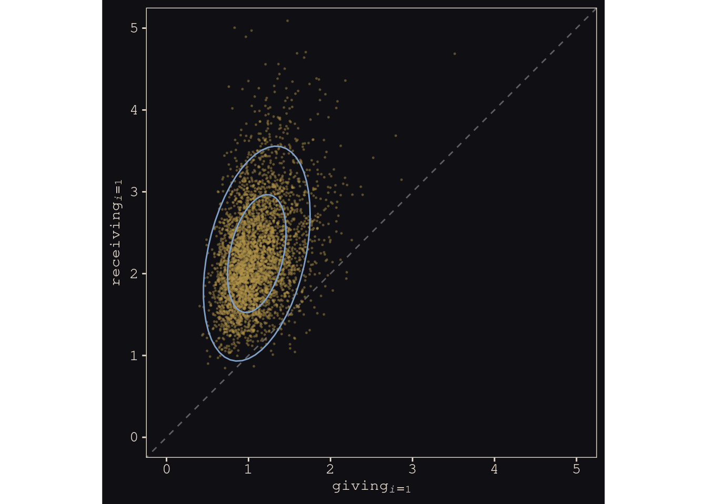


<div class="figure">

<p class="caption">Some of these devaitions are small. 0s are very balanced. Reciprocity on 0s, and also for kinships. </p>
</div>

Figure 14.9a:


```r
rbind(exp(g), exp(r)) %>% 
  data.frame() %>% 
  set_names(1:25) %>% 
  mutate(parameter = rep(c("g", "r"), each = n() / 2),
         iter      = rep(1:4000, times = 2)) %>% 
  pivot_longer(-c(parameter, iter), names_to = "household") %>% 
  pivot_wider(names_from = parameter, values_from = value) %>% 
  group_by(household) %>% 
  mutate(mu_g = mean(g),
         mu_r = mean(r)) %>% 
  nest(data = c("g", "r", "iter")) %>% 
  
  ggplot(aes(group = household)) +
  geom_abline(color = "#FCF9F0", linetype = 2, alpha = 1/3) +
  stat_ellipse(data = . %>% unnest(data),
               aes(x = g, y = r),
               type = "norm", level = .5, size = 1/2, alpha = 1/2, color = "#80A0C7") +
  geom_point(aes(x = mu_g, y = mu_r),
             color = "#DCA258") +
  labs(x = "generalized giving",
       y = "generalized receiving") +
  coord_equal(xlim = c(0, 8.5),
              ylim = c(0, 8.5))
```


Figure 14.9b


```r
tibble(dy1 = apply(post$d[, , 1], 2, mean),
       dy2 = apply(post$d[, , 2], 2, mean)) %>% 
  
  ggplot(aes(x = dy1, y = dy2)) +
  geom_abline(color = "#FCF9F0", linetype = 2, alpha = 1/3) +
  geom_vline(xintercept = 0, color = "#FCF9F0", linetype = 2, alpha = 1/3) +
  geom_hline(yintercept = 0, color = "#FCF9F0", linetype = 2, alpha = 1/3) +
  geom_point(color = "#8B9DAF", alpha = 1/2, size = 1/2) +
  geom_text(x = mean(post$d[, 1, 1]),
            y = mean(post$d[, 1, 2]),
            label = "1",
            color = "#EEDA9D", family = "Courier") +
  labs(x = "household A in dyad",
       y = "household B in dyad") +
  coord_equal(xlim = c(-2, 3.5),
              ylim = c(-2, 3.5))
```


<div class="figure">

<p class="caption">Very pleased with this homework set. Going to go back to the Bangladesh data, going to do random slopes, then adding predictor variables: the woman's age, and the number of kids she already has. Big effects on contrcetpive use. Draw a DAG and use it to anlayse the causal influence of age and kids on contreption.</p>
</div>


```r
slides_dir = here::here("docs/slides/L19")
```

## Continuous categories and the Gaussian process

All of the varying effects so far, whether they were intercepts or slopes, have been defined over discrete, unordered categories. For example, cafés are unique places, and there is no sense in which café 1 comes before café 2.

But what about continuous dimensions of variation like age or income or stature? Individuals of the same age share some of the same exposures. They listened to some of the same music, heard about the same politicians, and experienced the same weather events. And individuals of similar ages also experienced some of these same exposures, but to a lesser extent than individuals of the same age.

It doesn’t make sense to estimate a unique varying intercept for all individuals of the same age, ignoring the fact that individuals of similar ages should have more similar intercepts.

Luckily, there is a way to apply the varying effects approach to continuous categories of this kind. This will allow us to estimate a unique intercept (or slope) for any age, while still regarding age as a continuous dimension in which similar ages have more similar intercepts (or slopes). The general approach is known as GAUSSIAN PROCESS REGRESSION.


<div class="figure">

<p class="caption">Get to take everything we've learned and put it together.</p>
</div>

<div class="figure">

<p class="caption">Data story. General phenomoent that doesn't just applhy to American politics. Birth year of voters. On the veritcal we have the Republican vote share of individuals in that birth year. Share of the vote they have to the presidential candidates in that year. Each of the colours is a different election year. As you get closer to the present, younger people are allowed to vote, so you can seee the curves are shifting to the left. If you plotted this graph by age, you would see this view. Interesting view that the hills and valleys line up, even though in any particular year it can move up and down quite a lot. 2008 is much lower down across all age groups. Bu tthe peaks and valleys are in teh same place. These are cohort effecs. Something abou thteh year you're born in sets your politial preference for live. It's something that heppns to people born around that time that happens in their life. </p>
</div>

<div class="figure">

<p class="caption">They fit a bit heirarchical Bayesian model to find the age it is that sets their poltical orientation. What matters is that when your're 18, who is present, what party theyr'e from, and are they popular. THen you can predict their political orientation for the rest of their life. Things that happen when you're older don't have nearly as much of an effect. Year of birth is linear, but also a category. It's an orderd category. If we can to take effects like this seriously, we need to take them into account. Called continuous cateogries. Trough in 1950 is the Nixon effect. Most conservative is the Reagan effect. He was winnign the Cold War. </p>
</div>

<div class="figure">

<p class="caption">You can assert that they have linear effects, but then you're giving up on thise non-monotonic cohort effects. Or ny number of other interesting things as well, like income. No reaon that every paddditnoal percent of income has the same effect. How is location a category? It's a proxy of things you haven't measured. Location is a proxy for common exposures. Phylogentic distance analagous to location. No obvious cutpoints, but similar values are similar in their effects. If you want an infinite number of categories, buecasue it's continuous, you want pooling. So we'll make models with infiinte cateogories, and fit arbitrary function swith pooling, and it'll work great. In machine learning is Gaussain process regression. </p>
</div>


***14.5.1. Example: Spatial autocorrelation in Oceanic tools***


<div class="figure">

<p class="caption">Two examples with code on how to do this. First is with spatial autocorrelation, where shared space is a proxy for unmeasured confounds. Let's go back to tools. Interested in predicting number of tools based on size of population. One of the problems is that islands that are close to others can just go and get the tools rather than inventing them. Certainly down near Tonga there were a lo tof effects. So distance between islands is a proxy for contact. </p>
</div>


```r
# load the distance matrix
library(rethinking)
data(islandsDistMatrix)

# display (measured in thousands of km)
d_mat <- islandsDistMatrix
colnames(d_mat) <- c("Ml", "Ti", "SC", "Ya", "Fi", "Tr", "Ch", "Mn", "To", "Ha")

round(d_mat, 1)
```

```
##             Ml  Ti  SC  Ya  Fi  Tr  Ch  Mn  To  Ha
## Malekula   0.0 0.5 0.6 4.4 1.2 2.0 3.2 2.8 1.9 5.7
## Tikopia    0.5 0.0 0.3 4.2 1.2 2.0 2.9 2.7 2.0 5.3
## Santa Cruz 0.6 0.3 0.0 3.9 1.6 1.7 2.6 2.4 2.3 5.4
## Yap        4.4 4.2 3.9 0.0 5.4 2.5 1.6 1.6 6.1 7.2
## Lau Fiji   1.2 1.2 1.6 5.4 0.0 3.2 4.0 3.9 0.8 4.9
## Trobriand  2.0 2.0 1.7 2.5 3.2 0.0 1.8 0.8 3.9 6.7
## Chuuk      3.2 2.9 2.6 1.6 4.0 1.8 0.0 1.2 4.8 5.8
## Manus      2.8 2.7 2.4 1.6 3.9 0.8 1.2 0.0 4.6 6.7
## Tonga      1.9 2.0 2.3 6.1 0.8 3.9 4.8 4.6 0.0 5.0
## Hawaii     5.7 5.3 5.4 7.2 4.9 6.7 5.8 6.7 5.0 0.0
```


<div class="figure">

<p class="caption">Here's the idea. You construct a distance matrix. Could probably do better than this based on sailing routes, but this will suffice here. This is like our map of confoud threats. What could make the tools counts similar is correlation between islands that are closer together. </p>
</div>


```r
d_mat %>%
  data.frame() %>% 
  rownames_to_column("row") %>% 
  gather(column, distance, -row) %>% 
  mutate(column = factor(column, levels = colnames(d_mat)),
         row    = factor(row,    levels = rownames(d_mat)) %>% fct_rev(),
         label  = formatC(distance, format = 'f', digits = 2)) %>%
  
  ggplot(aes(x = column, y = row)) + 
  geom_raster(aes(fill = distance)) + 
  geom_text(aes(label = label),
            size = 3, family = "Courier", color = "#100F14") +
  scale_fill_gradient(low = "#FCF9F0", high = "#A65141") +
  scale_x_discrete(NULL, position = "top", expand = c(0, 0)) +
  scale_y_discrete(NULL, expand = c(0, 0)) +
  theme_pearl_earring(axis.text.y = element_text(hjust = 0)) +
  theme(axis.ticks = element_blank())
```

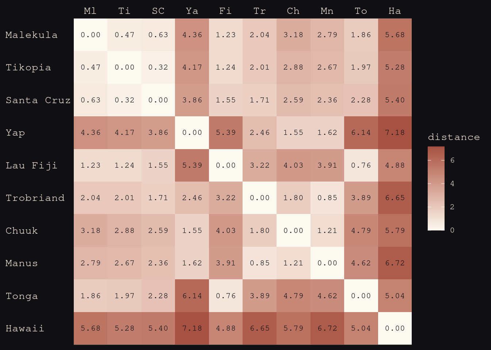


<div class="figure">

<p class="caption">Let's build the matrix into the model. We've got expected tools $\lambda$. $\alpha$ is the propoertinaly constant, i..e number of tools per member, then $\beta$ is elasticity, then $\gamma$ is the loss rate.</p>
</div>

<div class="figure">

<p class="caption">We can add the Guassian process by adding a factor on the front of it. Added this exponent to the $k_{SOCIETY}. It's like a varying intercept. It's a parameter that is estimated for each society, with a normal prior, but exponentitated to make it positive. This makes it a facotr.</p>
</div>

<div class="figure">

<p class="caption">$k$ = 0 is just the model prediction. Not inated or deflated at all. This factor is increasing or decreasing the expectation from other factors. Some will get inflated because the're near other islands with tools. If you ahd a linear model, you owulnd't do the exponnetiation, you'd just stik the $k$ on there.</p>
</div>

<div class="figure">

<p class="caption">WHere to get the $k$s from? This matrix. Big prior with all these varying effects. Big vecotr for a ll the $k$,s  10 becuase 1 for each island. Come form teh same multi-variate normal prior. How do you build this thing? Going to generate the whole matrix from that distance matrix, and use it to parameterise how the correlation falls off at distance. Going to show you the most common way to do with with so calle dL2Noral at the bottom, where each cell int he matrix $K$ is given by that expression. Note it only has three parameters in it. 300x300 matrix, which we could have by the end of the day. </p>
</div>

<div class="figure">

<p class="caption">This is what the L2Normal matrix means. eta squared is the maximum covaiance between any two isaldn,s fit from the data. Then multplied by the thing in the middle. Rho squared i st he rateo fo decline with distance, and Distance ist he squared distance from the distance matrix. THis is the Guassian part, buecause this is a bell curve. the e(-something^2) is what gives you something gaussian. Deltaij turns sigma squared on and off. So if you have multiple observations from each island, you neex thtis factor there so they're not all predicted to be the same.  </p>
</div>

<div class="figure">

<p class="caption">Gaussian decline, or squared distance. Horitzontal is diwstance between two islands, and vertical is the correlation, standardised. And I'v e made up some values for Rho. Squared idstance function gets the solid curve. Starts with a slow decline, gthen accelerates liek a Gaussain curve. End up with this accelerating rate to get to the flat part of the tail really fast. If you choose a linear distance instead, you take the square off the D, then you get the dahssed linear curve. Nothign wrong with that, but it has a different set of assumpotions: that the rate of loss is the fastests at the start. The amount gyou lose is fastests at the start. Probably not the case.</p>
</div>


```r
tibble(x       = seq(from = 0, to = 4, by = .01),
       linear  = exp(-1 * x),
       squared = exp(-1 * x^2)) %>%
  
  ggplot(aes(x = x)) +
  geom_line(aes(y = linear),
            color = "#B1934A", linetype = 2) +
  geom_line(aes(y = squared),
            color = "#DCA258") +
  scale_x_continuous("distance", expand = c(0, 0)) +
  scale_y_continuous("correlation", 
                     breaks = c(0, .5, 1),
                     labels = c(0, ".5", 1))
```


<div class="figure">

<p class="caption">All we're doing is all in the prior. Varying effects drawn from one giant Gaussian. Rest of the model is what we've done before. You could have all the pariwise differece between ages, and all the particular effects.  Vector of $k$s. Priors from eta nd rho, both squared. Don't have to be squared, by why? Convention. Want to simulate from these priors and see what they imply. </p>
</div>

<div class="figure">

<p class="caption">If almbda is 2, the mean is 0.5. The rate is the inverse of the mean in an exponential. So sample randomly, and draw a curve. 50 samples from the prior distribution. In this prior, most fall off pretty rapidly, so the prior assumes that it could be anything from moderatley strong to aboslutely incredibly weak, but all of them drop off really fast. POsterior will look really different.</p>
</div>

<div class="figure">

<p class="caption">As you might expect, only thing that changes is this Guassian process. Helper function in `ulam`</p>
</div>

<div class="figure">

<p class="caption">`k`s for each society, a vector of lenght 10. Just like a varying intercept vector. Come from this MVnOrmal distirbution. </p>
</div>

<div class="figure">

<p class="caption">Sigma is a 10x10 matrix. GPL2 is Gaussian process L2Norm. Do some loops to do what's on the previous slide. If you look at the Stan code, there's just a loop that calculates every trajectory. </p>
</div>

<div class="figure">

<p class="caption">Action inside this is Dmat, the distance matrix, then the parameters etasq and rhosq. Then the final term, which needs to be aboe 0, But we don't fit it here because we don't have multipole observations per island.</p>
</div>


```r
data(Kline2) # load the ordinary data, now with coordinates

d <- 
  Kline2 %>%
  mutate(society = 1:10)

rm(Kline2)

d %>% glimpse()
```

```
## Rows: 10
## Columns: 10
## $ culture     <fct> Malekula, Tikopia, Santa Cruz, Yap, Lau Fiji, Trobriand, C…
## $ population  <int> 1100, 1500, 3600, 4791, 7400, 8000, 9200, 13000, 17500, 27…
## $ contact     <fct> low, low, low, high, high, high, high, low, high, low
## $ total_tools <int> 13, 22, 24, 43, 33, 19, 40, 28, 55, 71
## $ mean_TU     <dbl> 3.2, 4.7, 4.0, 5.0, 5.0, 4.0, 3.8, 6.6, 5.4, 6.6
## $ lat         <dbl> -16.3, -12.3, -10.7, 9.5, -17.7, -8.7, 7.4, -2.1, -21.2, 1…
## $ lon         <dbl> 167.5, 168.8, 166.0, 138.1, 178.1, 150.9, 151.6, 146.9, -1…
## $ lon2        <dbl> -12.5, -11.2, -14.0, -41.9, -1.9, -29.1, -28.4, -33.1, 4.8…
## $ logpop      <dbl> 7.003065, 7.313220, 8.188689, 8.474494, 8.909235, 8.987197…
## $ society     <int> 1, 2, 3, 4, 5, 6, 7, 8, 9, 10
```

Transform `lat` and `lon2` into 1000 km units by multiplying each by 0.11132. 


```r
d <-
  d %>% 
  mutate(lat_adj  = lat  * 0.11132,
         lon2_adj = lon2 * 0.11132)

d %>% 
  dplyr::select(culture, lat, lon2, lat_adj:lon2_adj)
```

```
##       culture   lat  lon2   lat_adj  lon2_adj
## 1    Malekula -16.3 -12.5 -1.814516 -1.391500
## 2     Tikopia -12.3 -11.2 -1.369236 -1.246784
## 3  Santa Cruz -10.7 -14.0 -1.191124 -1.558480
## 4         Yap   9.5 -41.9  1.057540 -4.664308
## 5    Lau Fiji -17.7  -1.9 -1.970364 -0.211508
## 6   Trobriand  -8.7 -29.1 -0.968484 -3.239412
## 7       Chuuk   7.4 -28.4  0.823768 -3.161488
## 8       Manus  -2.1 -33.1 -0.233772 -3.684692
## 9       Tonga -21.2   4.8 -2.359984  0.534336
## 10     Hawaii  19.9  24.4  2.215268  2.716208
```


```r
b14.8 <-
  brm(data = d, 
      family = poisson(link = "identity"),
      bf(total_tools ~ exp(a) * population^b / g,
         a ~ 1 + gp(lat_adj, lon2_adj, scale = FALSE),
         b + g ~ 1,
         nl = TRUE),
      prior = c(prior(normal(0, 1), nlpar = a),
                prior(exponential(1), nlpar = b, lb = 0),
                prior(exponential(1), nlpar = g, lb = 0),
                prior(inv_gamma(2.874624, 2.941204), class = lscale, coef = gplat_adjlon2_adj, nlpar = a),
                prior(exponential(1), class = sdgp, coef = gplat_adjlon2_adj, nlpar = a)),
      iter = 2000, warmup = 1000, chains = 4, cores = 4,
      seed = 14,
      sample_prior = T,
      file = "fits/b14.08")
```


<div class="figure">

<p class="caption">What happens? This is wholly uninterpretable. Tide prediction enginge agian. So we want to plot thigns. PUsh the posterior back trhough is and get retrodictions. `k` values are exponentitated. Any island with a 0 is exactly as the model expected. If negative, drageged down by some negibouir. If higher, dragged up by some neighbour beyond the expectation of the model. `zetasq` and `rhosq` are uniterpretable for a reason to be explained.</p>
</div>


```r
print(b14.8)
```

```
##  Family: poisson 
##   Links: mu = identity 
## Formula: total_tools ~ exp(a) * population^b/g 
##          a ~ 1 + gp(lat_adj, lon2_adj, scale = FALSE)
##          b ~ 1
##          g ~ 1
##    Data: d (Number of observations: 10) 
## Samples: 4 chains, each with iter = 2000; warmup = 1000; thin = 1;
##          total post-warmup samples = 4000
## 
## Gaussian Process Terms: 
##                             Estimate Est.Error l-95% CI u-95% CI Rhat Bulk_ESS
## sdgp(a_gplat_adjlon2_adj)       0.47      0.30     0.15     1.27 1.00     1038
## lscale(a_gplat_adjlon2_adj)     1.64      0.91     0.51     4.00 1.00     1180
##                             Tail_ESS
## sdgp(a_gplat_adjlon2_adj)       1565
## lscale(a_gplat_adjlon2_adj)     2207
## 
## Population-Level Effects: 
##             Estimate Est.Error l-95% CI u-95% CI Rhat Bulk_ESS Tail_ESS
## a_Intercept     0.34      0.86    -1.41     1.95 1.00     2842     2573
## b_Intercept     0.26      0.08     0.09     0.42 1.00     1526     1376
## g_Intercept     0.67      0.65     0.05     2.44 1.00     2185     2118
## 
## Samples were drawn using sampling(NUTS). For each parameter, Bulk_ESS
## and Tail_ESS are effective sample size measures, and Rhat is the potential
## scale reduction factor on split chains (at convergence, Rhat = 1).
```


```r
posterior_summary(b14.8)[1:15, ] %>% round(digits = 2)
```

```
##                             Estimate Est.Error  Q2.5 Q97.5
## b_a_Intercept                   0.34      0.86 -1.41  1.95
## b_b_Intercept                   0.26      0.08  0.09  0.42
## b_g_Intercept                   0.67      0.65  0.05  2.44
## sdgp_a_gplat_adjlon2_adj        0.47      0.30  0.15  1.27
## lscale_a_gplat_adjlon2_adj      1.64      0.91  0.51  4.00
## zgp_a_gplat_adjlon2_adj[1]     -0.46      0.73 -1.91  0.95
## zgp_a_gplat_adjlon2_adj[2]      0.44      0.85 -1.23  2.07
## zgp_a_gplat_adjlon2_adj[3]     -0.62      0.72 -1.99  0.90
## zgp_a_gplat_adjlon2_adj[4]      1.00      0.68 -0.26  2.41
## zgp_a_gplat_adjlon2_adj[5]      0.25      0.74 -1.18  1.75
## zgp_a_gplat_adjlon2_adj[6]     -1.04      0.77 -2.59  0.48
## zgp_a_gplat_adjlon2_adj[7]      0.16      0.73 -1.40  1.59
## zgp_a_gplat_adjlon2_adj[8]     -0.22      0.85 -1.86  1.51
## zgp_a_gplat_adjlon2_adj[9]      0.42      0.91 -1.46  2.12
## zgp_a_gplat_adjlon2_adj[10]    -0.38      0.80 -2.01  1.16
```

Let’s focus on our three non-linear parameters, first. Happily, both our b_b_Intercept and b_g_Intercept summaries look a lot like those for McElreath’s `b` and `g`, respectively. Our `b_a_Intercept` might look distressingly small, but that’s just because of how we parameterized our model. It’s actually very close to McElreath’s a after you exponentiate.


```r
fixef(b14.8, probs = c(.055, .945))["a_Intercept", c(1, 3:4)] %>% 
  exp() %>% 
  round(digits = 2)
```

```
## Estimate     Q5.5    Q94.5 
##     1.41     0.35     5.26
```


```r
post <-
  posterior_samples(b14.8) %>% 
  mutate(etasq = sdgp_a_gplat_adjlon2_adj^2)

post %>% 
  mean_hdi(etasq, .width = .89) %>% 
  mutate_if(is.double, round, digits = 3)
```

```
## # A tibble: 1 × 6
##   etasq .lower .upper .width .point .interval
##   <dbl>  <dbl>  <dbl>  <dbl> <chr>  <chr>    
## 1 0.313  0.001   0.62   0.89 mean   hdi
```

```r
p1 <-
  tibble(`rho^2` = seq(from = 0, to = 11, by = 0.01)) %>% 
  mutate(lscale = sqrt(1 / (2 * `rho^2`))) %>%
  
  ggplot(aes(x = `rho^2`, y = lscale)) +
  geom_hline(yintercept = 0, color = "#FCF9F0", size = 1/4, linetype = 2) +
  geom_vline(xintercept = 0, color = "#FCF9F0", size = 1/4, linetype = 2) +
  geom_line(color = "#A65141") +
  xlab(expression(rho^2)) +
  coord_cartesian(xlim = c(0, 10),
                  ylim = c(0, 10))

p2 <-
  tibble(lscale = seq(from = 0, to = 11, by = 0.01)) %>% 
  mutate(`rho^2` = 1 / (2 * lscale^2)) %>%
  
  ggplot(aes(x = lscale, y = `rho^2`)) +
  geom_hline(yintercept = 0, color = "#FCF9F0", size = 1/4, linetype = 2) +
  geom_vline(xintercept = 0, color = "#FCF9F0", size = 1/4, linetype = 2) +
  geom_line(color = "#80A0C7") +
  ylab(expression(rho^2)) +
  coord_cartesian(xlim = c(0, 10),
                  ylim = c(0, 10))

p1 + p2
```

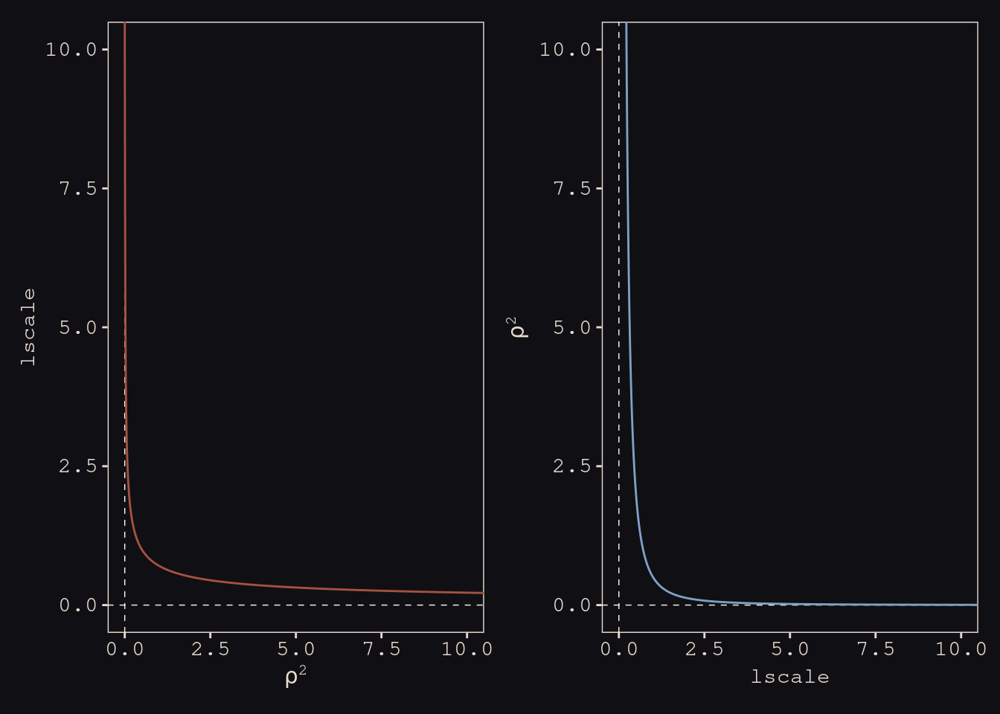

Let’s see how our posterior for $lscale$ looks when we convert it to the scale of McElreath’s $\rho^2$.


```r
post <-
  post %>% 
  mutate(rhosq = 1 / (2 * lscale_a_gplat_adjlon2_adj^2))

post %>% 
  mean_hdi(rhosq, .width = .89) %>% 
  mutate_if(is.double, round, digits = 3)
```

```
## # A tibble: 1 × 6
##   rhosq .lower .upper .width .point .interval
##   <dbl>  <dbl>  <dbl>  <dbl> <chr>  <chr>    
## 1 0.422  0.009  0.908   0.89 mean   hdi
```

The plot deepends. We used a very different prior for `lscale`. Use `get_prior()` to discover where that came from.


```r
get_prior(data = d, 
          family = poisson(link = "identity"),
          bf(total_tools ~ exp(a) * population^b / g,
             a  ~ 1 + gp(lat_adj, lon2_adj, scale = FALSE),
             b + g ~ 1,
             nl = TRUE))
```

```
##                          prior  class              coef group resp dpar nlpar
##                         (flat)      b                                       a
##                         (flat)      b         Intercept                     a
##                         (flat) lscale                                       a
##  inv_gamma(2.874624, 2.941204) lscale gplat_adjlon2_adj                     a
##          student_t(3, 0, 15.6)   sdgp                                       a
##          student_t(3, 0, 15.6)   sdgp gplat_adjlon2_adj                     a
##                         (flat)      b                                       b
##                         (flat)      b         Intercept                     b
##                         (flat)      b                                       g
##                         (flat)      b         Intercept                     g
##  bound       source
##             default
##        (vectorized)
##             default
##             default
##             default
##        (vectorized)
##             default
##        (vectorized)
##             default
##        (vectorized)
```


```r
tibble(lscale = seq(from = 0.01, to = 9, by = 0.01)) %>% 
  mutate(density = invgamma::dinvgamma(lscale, 2.874624, 2.941204)) %>% 
  
  ggplot(aes(x = lscale, y = density)) +
  geom_area(fill = "#80A0C7") +
  annotate(geom = "text", 
           x = 4.75, y = 0.75,
           label = "inverse gamma(2.874624, 2.941204)",
           color = "#8B9DAF", family = "Courier") +
  scale_y_continuous(NULL, breaks = NULL) +
  coord_cartesian(xlim = c(0, 8))
```

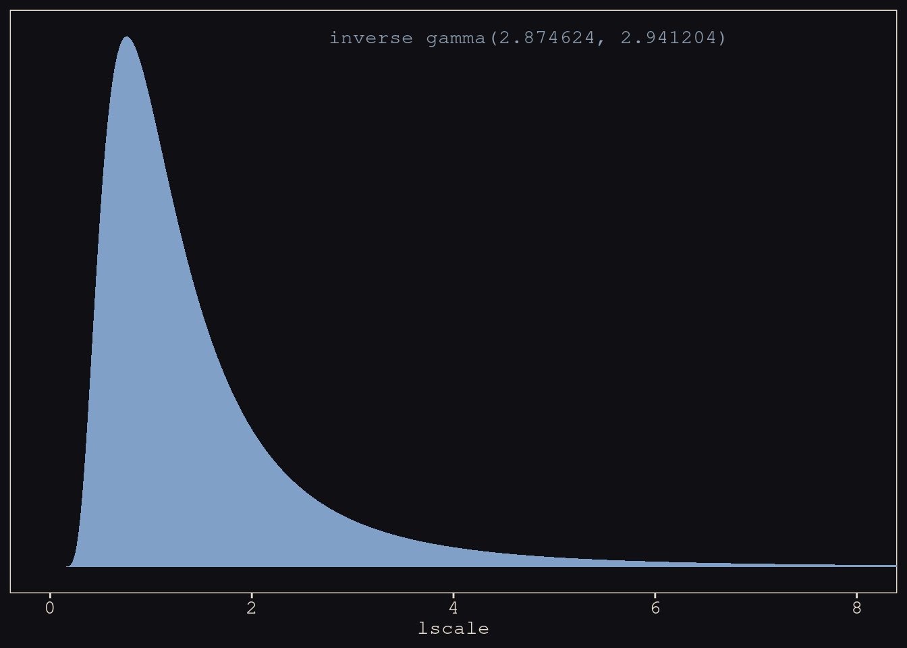

Figure 14.11 

```r
# for `slice_sample()`
set.seed(14)

# wrangle
p1 <-
  prior_samples(b14.8) %>% 
  mutate(iter  = 1:n(),
         etasq = sdgp_a_gplat_adjlon2_adj^2,
         rhosq = 1 / (2 * lscale_a_1_gplat_adjlon2_adj^2)) %>% 
  slice_sample(n = 100) %>%
  tidyr::expand(nesting(iter, etasq, rhosq),
         x = seq(from = 0, to = 10, by = .05)) %>% 
  mutate(covariance = etasq * exp(-rhosq * x^2)) %>% 
  
  # plot
  ggplot(aes(x = x, y = covariance)) +
  geom_line(aes(group = iter),
            size = 1/4, alpha = 1/4, color = "#EEDA9D") +
  scale_x_continuous("distance (thousand km)", expand = c(0, 0),
                     breaks = 0:5 * 2) +
  coord_cartesian(xlim = c(0, 10),
                  ylim = c(0, 2)) +
  labs(subtitle = "Gaussian process prior")

# for `slice_sample()`
set.seed(14)

# wrangle
p2 <-
  post %>% 
  transmute(iter  = 1:n(),
            etasq = sdgp_a_gplat_adjlon2_adj^2,
         rhosq = 1 / (2 * lscale_a_gplat_adjlon2_adj^2)) %>% 
  slice_sample(n = 50) %>% 
  tidyr::expand(nesting(iter, etasq, rhosq),
         x = seq(from = 0, to = 10, by = .05)) %>% 
  mutate(covariance = etasq * exp(-rhosq * x^2)) %>% 
  
  # plot
  ggplot(aes(x = x, y = covariance)) +
  geom_line(aes(group = iter),
            size = 1/4, alpha = 1/4, color = "#EEDA9D") +
  stat_function(fun = function(x) mean(post$sdgp_a_gplat_adjlon2_adj)^2 *
                  exp(-(1 / (2 * mean(post$lscale_a_gplat_adjlon2_adj)^2)) * x^2),
                color = "#DCA258", size = 1) +
  scale_x_continuous("distance (thousand km)", expand = c(0, 0),
                     breaks = 0:5 * 2) +
  coord_cartesian(xlim = c(0, 10),
                  ylim = c(0, 2)) +
  labs(subtitle = "Gaussian process posterior")

p1 | p2
```


<div class="figure">

<p class="caption">On the left we're repeating the piror. Ont her right, 50 samples form the posterior. Relatively small, but declines more slowly. SO there's some long-distance effects driving the tools around. Can't figure out the shpaes from etasq and rhosq because they're correlated. </p>
</div>

<div class="figure">

<p class="caption">For example, just plotting them on the left. Samples for the Markov chain. Non-indenpdence. If you make one smaller, the other gets bigger. Negaitve correlation. So can't interpret them indepedently.</p>
</div>

<div class="figure">

<p class="caption">We want to understand this model now. We can think of this on the outcome scale by taking the posterior distribution of the covariance matrixes, then compute for each pari of ilsands the posterior mean correlation. How? We know their distance on the horizontal axis, then we cna compute form the posterior mean theyir epxected covariance, then standardise for a correlation. The diagonal is all 1s, then the off diagonals are the expected correlations and tool counts. The bottom row is Hawaii. You've got no correlation because it's really far away. </p>
</div>

Push the parameters back through the function for $\mathbf{K}$, the covariance matrix.


```r
# compute posterior median covariance among societies
k <- matrix(0, nrow = 10, ncol = 10)
for (i in 1:10)
    for (j in 1:10)
        k[i, j] <- median(post$etasq) * 
  exp(-median(post$rhosq) * islandsDistMatrix[i, j]^2)

diag(k) <- median(post$etasq) + 0.01

k %>% round(2)
```

```
##       [,1] [,2] [,3] [,4] [,5] [,6] [,7] [,8] [,9] [,10]
##  [1,] 0.17 0.15 0.14 0.00 0.11 0.06 0.01 0.02 0.07  0.00
##  [2,] 0.15 0.17 0.16 0.00 0.11 0.06 0.02 0.03 0.06  0.00
##  [3,] 0.14 0.16 0.17 0.00 0.09 0.08 0.03 0.04 0.05  0.00
##  [4,] 0.00 0.00 0.00 0.17 0.00 0.04 0.09 0.08 0.00  0.00
##  [5,] 0.11 0.11 0.09 0.00 0.17 0.01 0.00 0.00 0.14  0.00
##  [6,] 0.06 0.06 0.08 0.04 0.01 0.17 0.07 0.13 0.00  0.00
##  [7,] 0.01 0.02 0.03 0.09 0.00 0.07 0.17 0.11 0.00  0.00
##  [8,] 0.02 0.03 0.04 0.08 0.00 0.13 0.11 0.17 0.00  0.00
##  [9,] 0.07 0.06 0.05 0.00 0.14 0.00 0.00 0.00 0.17  0.00
## [10,] 0.00 0.00 0.00 0.00 0.00 0.00 0.00 0.00 0.00  0.17
```

Change these to a correlation matrix:


```r
# convert to correlation matrix
rho <- round(cov2cor(k), 2)

# add row/col names for convenience
colnames(rho) <- c("Ml", "Ti", "SC", "Ya", "Fi", "Tr", "Ch", "Mn", "To", "Ha")
rownames(rho) <- colnames(rho)

rho %>% round(2)
```

```
##      Ml   Ti   SC   Ya   Fi   Tr   Ch   Mn   To Ha
## Ml 1.00 0.89 0.85 0.01 0.65 0.35 0.08 0.14 0.41  0
## Ti 0.89 1.00 0.92 0.01 0.65 0.36 0.13 0.17 0.37  0
## SC 0.85 0.92 1.00 0.03 0.53 0.47 0.19 0.25 0.27  0
## Ya 0.01 0.01 0.03 1.00 0.00 0.22 0.53 0.50 0.00  0
## Fi 0.65 0.65 0.53 0.00 1.00 0.08 0.02 0.02 0.82  0
## Tr 0.35 0.36 0.47 0.22 0.08 1.00 0.43 0.79 0.02  0
## Ch 0.08 0.13 0.19 0.53 0.02 0.43 1.00 0.66 0.00  0
## Mn 0.14 0.17 0.25 0.50 0.02 0.79 0.66 1.00 0.01  0
## To 0.41 0.37 0.27 0.00 0.82 0.02 0.00 0.01 1.00  0
## Ha 0.00 0.00 0.00 0.00 0.00 0.00 0.00 0.00 0.00  1
```

Plot the correlations:


```r
rho %>%
  data.frame() %>% 
  mutate(row = d$culture) %>% 
  pivot_longer(-row, values_to = "distance") %>% 
  mutate(column = factor(name, levels = colnames(d_mat)),
         row    = factor(row, levels = rownames(d_mat)) %>% fct_rev(),
         label  = formatC(distance, format = 'f', digits = 2) %>% str_replace(., "0.", ".")) %>%
  # omit this line to keep the diagonal of 1's
  filter(distance != 1) %>% 
  
  ggplot(aes(x = column, y = row)) + 
  geom_raster(aes(fill = distance)) + 
  geom_text(aes(label = label),
            size = 2.75, family = "Courier", color = "#100F14") +
  scale_fill_gradient(expression(rho), low = "#FCF9F0", high = "#A65141", limits = c(0, 1)) +
  scale_x_discrete(NULL, position = "top", expand = c(0, 0)) +
  scale_y_discrete(NULL, expand = c(0, 0)) +
  theme_pearl_earring(axis.text.y = element_text(hjust = 0)) +
  theme(axis.ticks = element_blank())
```

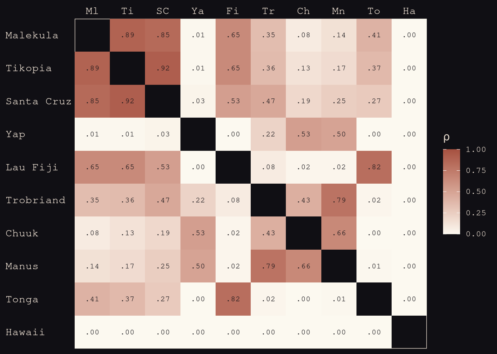

Get `rho` into a tidy data frame:


```r
tidy_rho <-
  rho %>%
  data.frame() %>% 
  rownames_to_column() %>% 
  bind_cols(d %>% dplyr::select(culture, logpop, total_tools, lon2, lat)) %>% 
  pivot_longer(Ml:Ha,
               names_to = "colname", 
               values_to = "correlation") %>%
  mutate(group = str_c(pmin(rowname, colname), pmax(rowname, colname))) %>%
  dplyr::select(rowname, colname, group, culture, everything())  

head(tidy_rho)
```

```
## # A tibble: 6 × 9
##   rowname colname group culture  logpop total_tools  lon2   lat correlation
##   <chr>   <chr>   <chr> <fct>     <dbl>       <int> <dbl> <dbl>       <dbl>
## 1 Ml      Ml      MlMl  Malekula   7.00          13 -12.5 -16.3        1   
## 2 Ml      Ti      MlTi  Malekula   7.00          13 -12.5 -16.3        0.89
## 3 Ml      SC      MlSC  Malekula   7.00          13 -12.5 -16.3        0.85
## 4 Ml      Ya      MlYa  Malekula   7.00          13 -12.5 -16.3        0.01
## 5 Ml      Fi      FiMl  Malekula   7.00          13 -12.5 -16.3        0.65
## 6 Ml      Tr      MlTr  Malekula   7.00          13 -12.5 -16.3        0.35
```

Figure 14.12a

```r
library(ggrepel)

p1 <-
  tidy_rho %>%       
  ggplot(aes(x = lon2, y = lat)) +
  geom_point(data = d, 
             aes(size = logpop), color = "#DCA258") +
  geom_line(aes(group = group, alpha = correlation^2),
            color = "#EEDA9D") +
  geom_text_repel(data = d, aes(label = culture), 
                  seed = 14, point.padding = .2, size = 2.75, color = "#FCF9F0", family = "Courier") +
  scale_alpha_continuous(range = c(0, 1)) +
  labs(subtitle = "Among societies in geographic space\n",
       x = "longitude",
       y = "latitude") +
  coord_cartesian(xlim = range(d$lon2),
                  ylim = range(d$lat)) +
  theme(legend.position = "none")
```

Figure 14.12b

```r
# compute the average posterior predictive relationship between 
# log population and total tools, summarized by the median and 80% interval
f <-
  post %>% 
  tidyr::expand(logpop = seq(from = 6, to = 14, length.out = 30),
         nesting(b_a_Intercept, b_b_Intercept, b_g_Intercept)) %>%
  mutate(population = exp(logpop)) %>% 
  mutate(lambda = exp(b_a_Intercept) * population^b_b_Intercept / b_g_Intercept) %>%
  group_by(logpop) %>% 
  median_qi(lambda, .width = .8)

# plot
p2 <-
  tidy_rho %>% 
  ggplot(aes(x = logpop)) +
  geom_smooth(data = f,
              aes(y = lambda, ymin = .lower, ymax = .upper),
              stat = "identity",
              fill = "#394165", color = "#100F14", alpha = .5, size = 1.1) +
  geom_point(data = d, 
             aes(y = total_tools, size = logpop), 
             color = "#DCA258") +
  geom_line(aes(y = total_tools, group = group, alpha = correlation^2),
            color = "#EEDA9D") +
  geom_text_repel(data = d, 
                  aes(y = total_tools, label = culture), 
                  seed = 14, point.padding = .2, size = 2.75, color = "#FCF9F0", family = "Courier") +
  scale_alpha_continuous(range = c(0, 1)) +
  labs(subtitle = "Shown against the relation between\ntotal tools and log pop",
       x = "log population",
       y = "total tools") +
  coord_cartesian(xlim = range(d$logpop),
                  ylim = range(d$total_tools)) +
  theme(legend.position = "none")
```

Then combine

```r
p1 + p2 + 
  plot_annotation(title = "Posterior median correlations")
```

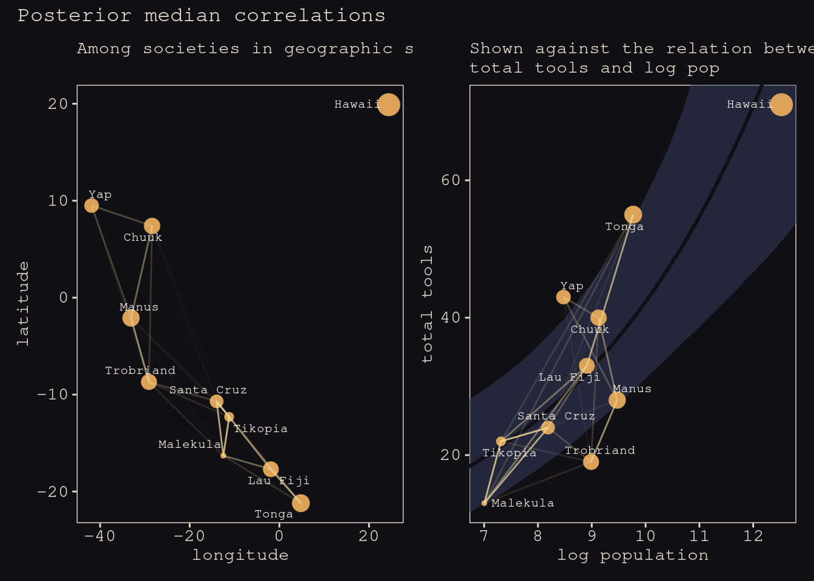


<div class="figure">

<p class="caption">On a map, this is what it looks like. LIke the world's least high-tech map of the pacific ocean. Size of each point is the population size. Line setgments are the correlations. Triad of Santa Cruz, Tikopia and Malekula. Tool counts are more similar, and deviate more because of their popualtions sizes. Tonga correlated with Fiji. </p>
</div>

<div class="figure">

<p class="caption">Can also plot this based ont he original hypothesis. Again, ilsand society points are proportional to their poulations. Trend is avergae prediction based on pouplation size. Can see things getting dragged around. Model thinks Fiji was dragged upwards from its population expectation.</p>
</div>


<div class="figure">

<p class="caption">Sometimes called Bayesian non-parametric regression. Non-parametric meaning infinte number of functions being considerd. They consider an infinite number of splines that pass along continuos categories than select among them with regularisation. Very popular with machine learning. Lots of really diverse applications. There are lots of periodic datasets, like seasonality datasets in ecology or social science, where the covariance function has cosines in it to measure the periodicity in it. e.g. human births - cool analysis by Gelman et al using Gaussian process regression. Phylogenetic distances are like this as well. All are special cases, with particular stratgeies for building the covariance matrix. Then don't need to make assumptions about the regression shape, you can do that with regularisation. Finally there's automatic relevance determination -- terrible machine learning term -- estimating the importance of each kind of distance in the covariance between the items.</p>
</div>

***14.5.2. Example: Phylogenetic distance***

<div class="figure">

<p class="caption">In evo bio, you worry about how long ago this pair of species diverged. Concerned about shared common history. This introduces a lot of back doors. Like a proxy of shared exposures. e.g. comon genes, kinds of ecologies, etc. YOu may not have measured all of those things. Then time since divergence is a proxy for those common exposures. We're going to use this to see how flexible it is. Lots of way st o smuggle it in. One way is Brownian motion model Simplest but also goofiest evolutionary model because no trait evolves this way. Other processes like the OU, like Brownian but variance constrained. Some attractor that pulls back traits. Any particular phylogency implies a covariance structure.  </p>
</div>

<div class="figure">

<p class="caption">Let's use this primates dataset. </p>
</div>


```r
data(Primates301, package = "rethinking") 
data(Primates301_nex)

# devtools::install_github("GuangchuangYu/ggtree")
#library(ggtree)

#Primates301_nex %>%
#  ggtree(layout = "circular", color = "#394165", size = 1/4) + 
#  geom_tiplab(size = 5/3, color = "#100F14")
```


<div class="figure">

<p class="caption">Apes are the losers of the pirmates. Old World are the winners - recent diversification. Galagos and Lorises adre small and recently diverged. Tarisers tiny andvery differnt from each other. New World are Americas. A lot of them as well. </p>
</div>

<div class="figure">

<p class="caption">There we are.</p>
</div>

<div class="figure">

<p class="caption">A large brain makes it possible to live in big groups. There's this back door through body size, which might also causally affect group size, by changing the ecology you're in. </p>
</div>

<div class="figure">

<p class="caption">Have to trim the tree. You end up with 150. Purely treating phylogeny as some squishy common exposure measure. Definitely not super sicence. Really geocentric.</p>
</div>

First format the data:


```r
d <-
  Primates301 %>% 
  mutate(name = as.character(name)) %>% 
  drop_na(group_size, body, brain) %>% 
  mutate(m = log(body) %>% standardize(),
         b = log(brain) %>% standardize(),
         g = log(group_size) %>% standardize())

glimpse(d)
```

```
## Rows: 151
## Columns: 19
## $ name                <chr> "Allenopithecus_nigroviridis", "Alouatta_belzebul"…
## $ genus               <fct> Allenopithecus, Alouatta, Alouatta, Alouatta, Alou…
## $ species             <fct> nigroviridis, belzebul, caraya, guariba, palliata,…
## $ subspecies          <fct> NA, NA, NA, NA, NA, NA, NA, NA, NA, NA, NA, NA, NA…
## $ spp_id              <int> 1, 3, 4, 5, 6, 7, 9, 10, 18, 22, 23, 25, 26, 28, 2…
## $ genus_id            <int> 1, 3, 3, 3, 3, 3, 3, 4, 4, 6, 7, 7, 7, 8, 8, 10, 1…
## $ social_learning     <int> 0, 0, 0, 0, 3, 0, 0, 0, 0, 0, 0, 2, 0, 0, 0, 0, 0,…
## $ research_effort     <int> 6, 15, 45, 37, 79, 25, 82, 22, 58, 1, 12, 58, 30, …
## $ brain               <dbl> 58.02, 52.84, 52.63, 51.70, 49.88, 51.13, 55.22, 2…
## $ body                <dbl> 4655, 6395, 5383, 5175, 6250, 8915, 5950, 1205, 98…
## $ group_size          <dbl> 40.00, 7.40, 8.90, 7.40, 13.10, 5.50, 7.90, 4.10, …
## $ gestation           <dbl> NA, NA, 185.92, NA, 185.42, 185.92, 189.90, NA, 13…
## $ weaning             <dbl> 106.15, NA, 323.16, NA, 495.60, NA, 370.04, 229.69…
## $ longevity           <dbl> 276.0, NA, 243.6, NA, 300.0, 240.0, 300.0, NA, 303…
## $ sex_maturity        <dbl> NA, NA, 1276.72, NA, 1578.42, NA, 1690.22, NA, 736…
## $ maternal_investment <dbl> NA, NA, 509.08, NA, 681.02, NA, 559.94, NA, 209.68…
## $ m                   <dbl> 0.36958768, 0.57601585, 0.46403740, 0.43842259, 0.…
## $ b                   <dbl> 0.4039485, 0.3285765, 0.3253670, 0.3109981, 0.2821…
## $ g                   <dbl> 1.397272713, 0.003132082, 0.155626096, 0.003132082…
```


<div class="figure">

<p class="caption">To get here, this is an ordinary regression but weirded. All of the outcomes for all species is one outcome, a single big vector of group sizes, a log groupsize as a function of log body size and log brian size. Think of sampling all tips of the tree simultaneously at the smae time. Bold G is all the group sizes. Some vector mu. Then this covariance matrix S. In standard linear regression it las sigma squared along the diagonal and 0 everywhere else. So toconstrust S is by multiplying sigma squared by I. If you mutpily the scalar sigma 2 with this, there's no correaltions, and you're back to a linear regression. Why do this? We'll get back to a linear regression by replacing S. </p>
</div>

<div class="figure">

<p class="caption">Matrix with number of rows equal to numbe ro fspecies, and number o fcolumsn the same. Covariance matrix. Diagonal is sigma squared. Imat is the identity matrix. Just a linear regression, and we find a strong association between brain size and group size, and a slightly negative relationship with boyd mass. These are only direct effects. Bigger species live in bigger groups. But if you take brain size out, you'll see the coeffcient for body mass is positive. This is the direct effect of body size is negative, but not the total effect.</p>
</div>

Make the naïve model, exploring the conditional relations of log(body mass) and log(group size) on log(brain size) without accounting for phylogenetic relationships.


```r
b14.9 <-
  brm(data = d,
      family = gaussian,
      b ~ 1 + m + g,
      prior = c(prior(normal(0, 1), class = Intercept),
                prior(normal(0, 0.5), class = b),
                prior(exponential(1), class = sigma)),
      iter = 2000, warmup = 1000, chains = 4, cores = 4,
      seed = 14,
      file = "fits/b14.09")
```


```r
print(b14.9)
```

```
##  Family: gaussian 
##   Links: mu = identity; sigma = identity 
## Formula: b ~ 1 + m + g 
##    Data: d (Number of observations: 151) 
## Samples: 4 chains, each with iter = 2000; warmup = 1000; thin = 1;
##          total post-warmup samples = 4000
## 
## Population-Level Effects: 
##           Estimate Est.Error l-95% CI u-95% CI Rhat Bulk_ESS Tail_ESS
## Intercept     0.00      0.02    -0.03     0.03 1.00     3357     2947
## m             0.89      0.02     0.85     0.94 1.00     3155     3114
## g             0.12      0.02     0.08     0.17 1.00     3384     2709
## 
## Family Specific Parameters: 
##       Estimate Est.Error l-95% CI u-95% CI Rhat Bulk_ESS Tail_ESS
## sigma     0.22      0.01     0.19     0.24 1.00     3724     3029
## 
## Samples were drawn using sampling(NUTS). For each parameter, Bulk_ESS
## and Tail_ESS are effective sample size measures, and Rhat is the potential
## scale reduction factor on split chains (at convergence, Rhat = 1).
```


If you want $\sigma$ in the $\sigma^2$ metric, you can square that by hand:


```r
posterior_samples(b14.9) %>% 
  mutate(sigma_sq = sigma^2) %>% 
  mean_qi(sigma_sq) %>% 
  mutate_if(is.double, round, digits = 2)
```

```
## # A tibble: 1 × 6
##   sigma_sq .lower .upper .width .point .interval
##      <dbl>  <dbl>  <dbl>  <dbl> <chr>  <chr>    
## 1     0.05   0.04   0.06   0.95 mean   qi
```


<div class="figure">

<p class="caption">The inferentail threat is this haunting phylogeny. It gives us a tool, and instrument if you will, to measure these things. To get increased covariance for recently separated species. </p>
</div>

<div class="figure">

<p class="caption">The traits just wander randomly. When this happens, the covariance is expected to decline in a linear function since the time they diverged. We compute the implied covariance matrix then plot that against phylogenetic distance. How to get phylogenetic distance? Total branch length. No one really likes this model, but it's easy to use. </p>
</div>

Make the covariance matrix (`V`) and the distance matrix (`Dmat`).


```r
library(ape)

spp_obs <- d$name

tree_trimmed <- keep.tip(Primates301_nex, spp_obs)
Rbm <- corBrownian(phy = tree_trimmed)

V <- vcv(Rbm)
```

```
## Warning in Initialize.corPhyl(phy, dummy.df): No covariate specified, species
## will be taken as ordered in the data frame. To avoid this message, specify a
## covariate containing the species names with the 'form' argument.
```

```r
Dmat <- cophenetic( tree_trimmed )
```

Distance by covariance scatter plot

```r
full_join(
  Dmat %>% 
    as_tibble(rownames = "row") %>% 
    pivot_longer(-row,
                 names_to = "col",
                 values_to = "distance"),
  V %>% 
    as_tibble(rownames = "row") %>% 
    pivot_longer(-row,
                 names_to = "col",
                 values_to = "covariance"),
  by = c("row", "col")
) %>% 
  
  ggplot(aes(x = distance, y = covariance)) +
  geom_point(color = "#80A0C7", alpha = 1/10) +
  labs(subtitle = "These variables are the\ninverse of one another.",
       x = "phylogenetic distance", 
       y = "covariance")
```

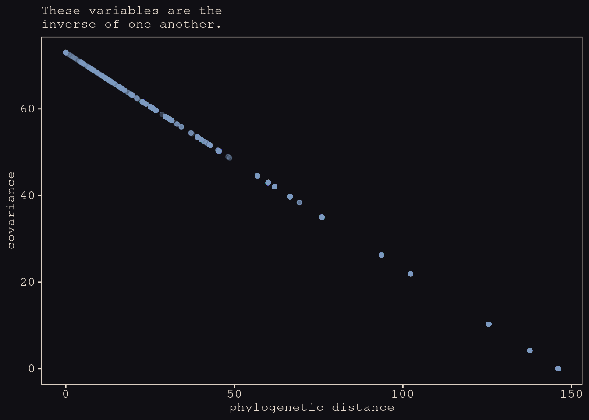

Plot heatmaps of each matrix:


```r
# headmap of Dmat
p1 <-
  Dmat %>% 
  as_tibble(rownames = "row") %>% 
  pivot_longer(-row,
               names_to = "col",
               values_to = "distance") %>%
  
  ggplot(aes(x = col, y = row, fill = distance)) +
  geom_tile() +
  scale_fill_gradient(low = "#100F14", high = "#EEDA9D") +
  scale_x_discrete(NULL, breaks = NULL) +
  scale_y_discrete(NULL, breaks = NULL) +
  theme(legend.position = "top")

# headmap of V
p2 <-
  V %>% 
  as_tibble(rownames = "row") %>% 
  pivot_longer(-row,
               names_to = "col",
               values_to = "covariance") %>% 
  
  ggplot(aes(x = col, y = row, fill = covariance)) +
  geom_tile() +
  scale_fill_gradient(low = "#100F14", high = "#EEDA9D") +
  scale_x_discrete(NULL, breaks = NULL) +
  scale_y_discrete(NULL, breaks = NULL) +
  theme(legend.position = "top")

# combine
(p1 | p2) + plot_annotation(subtitle = "Again, distance is the inverse of covariance.")
```

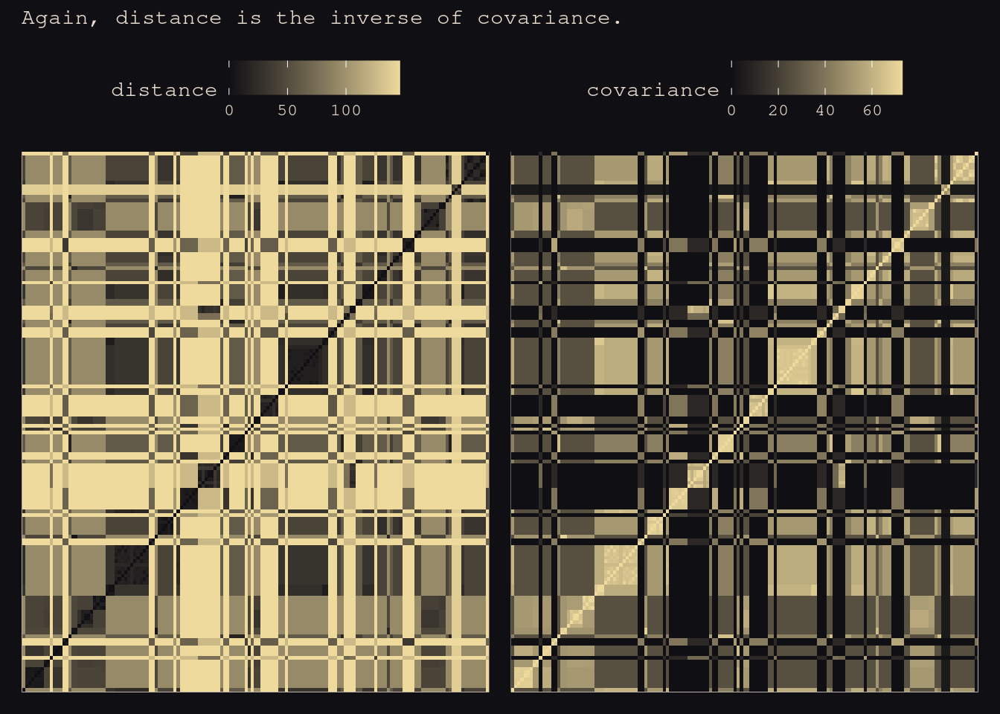


<div class="figure">

<p class="caption">So you can get the covariance matrix by inverting the phylogenetic distance matrix. Then once you have that, make it into a correlation matrix so we can fit the residual variance. Then just pass it in = replace the identity matrix with this correlation matrix. That's the Brownian motion model. Run this model. Things change a lot. Brain size is nothing now. Body size is now positive, because all that baackdoor throug brain is knocked out. This says the correlation etween brian size and and group size si that closely related species have similar brains and body sizes. </p>
</div>


```r
R <- V[spp_obs, spp_obs] / max(V)

b14.10 <-
  brm(data = d,
      data2 = list(R = R),
      family = gaussian,
      b ~ 1 + m + g + fcor(R),
      prior = c(prior(normal(0, 1), class = Intercept),
                prior(normal(0, 0.5), class = b),
                prior(exponential(1), class = sigma)),
      iter = 2000, warmup = 1000, chains = 4, cores = 4,
      seed = 14,
      file = "fits/b14.10")
```


```r
print(b14.10)
```

```
##  Family: gaussian 
##   Links: mu = identity; sigma = identity 
## Formula: b ~ 1 + m + g + fcor(R) 
##    Data: d (Number of observations: 151) 
## Samples: 4 chains, each with iter = 2000; warmup = 1000; thin = 1;
##          total post-warmup samples = 4000
## 
## Population-Level Effects: 
##           Estimate Est.Error l-95% CI u-95% CI Rhat Bulk_ESS Tail_ESS
## Intercept    -0.19      0.17    -0.52     0.14 1.00     4104     3302
## m             0.70      0.04     0.63     0.77 1.00     4074     2779
## g            -0.01      0.02    -0.05     0.03 1.00     4314     3222
## 
## Family Specific Parameters: 
##       Estimate Est.Error l-95% CI u-95% CI Rhat Bulk_ESS Tail_ESS
## sigma     0.40      0.02     0.36     0.45 1.00     4129     2922
## 
## Samples were drawn using sampling(NUTS). For each parameter, Bulk_ESS
## and Tail_ESS are effective sample size measures, and Rhat is the potential
## scale reduction factor on split chains (at convergence, Rhat = 1).
```

Since our residual variance is still in the $\sigma$ metric, it will be easier to compare it to McElreath’s `sigma_sq` parameter after transforming the posterior samples.


```r
posterior_samples(b14.10) %>% 
  transmute(sigma_sq = sigma^2) %>% 
  mean_hdi(sigma_sq, .width = .89) %>% 
  mutate_if(is.double, round, 2)
```

```
## # A tibble: 1 × 6
##   sigma_sq .lower .upper .width .point .interval
##      <dbl>  <dbl>  <dbl>  <dbl> <chr>  <chr>    
## 1     0.16   0.13   0.19   0.89 mean   hdi
```


<div class="figure">

<p class="caption">Swap the tip labels for group sizes. At the bottom we have prosimians. Gibbons in the upper left. </p>
</div>

<div class="figure">

<p class="caption">Let's do the Guassian process version of this. The only way to get linear decline with distance is thorugh no selection. Anything else, you'd get an acceleration of decline with distance. Closely-related species can be very simliar, but after som ephylogenetic sdsistance you don't expect any of thsoe confounds to be shared anynommre. You can fit a bunch of functions that way.   </p>
</div>

<div class="figure">

<p class="caption">We just have to change one line. Change the covariance matrix and make the right hand size the cov-GPL2. Now it's about divergence. We're going to estiamte the covariance in group sizes with genetic distance. Brain size is still basically nothing. Now group size is even stronger before. If there's any relationship with brain size, it's negative. But there are a lot of other confounds. So much other reciprocal causation. Important to see the impact that a measure of confounds cna have. </p>
</div>

Need to use `rethinking` for the next model:


```r
dat_list <- 
  list(
    N_spp = nrow(d),
    M     = standardize(log(d$body)),
    B     = standardize(log(d$brain)),
    G     = standardize(log(d$group_size)), Imat = diag(nrow(d)),
    V     = V[spp_obs, spp_obs],
    R     = V[spp_obs, spp_obs] / max(V[spp_obs, spp_obs]),
    Dmat  = Dmat[spp_obs, spp_obs] / max(Dmat)
  )
```


```r
m14.11 <- 
  ulam( 
    alist(
      B ~ multi_normal(mu, SIGMA),
      mu <- a + bM * M + bG * G,
      matrix[N_spp,N_spp]: SIGMA <- cov_GPL1(Dmat, etasq, rhosq, 0.01), 
      a ~ normal(0, 1),
      c(bM,bG) ~ normal(0, 0.5),
      etasq ~ half_normal(1, 0.25),
      rhosq ~ half_normal(3, 0.25)
    ), 
    data = dat_list, 
    chains = 4, cores = 4)
```

```
## Running MCMC with 4 parallel chains, with 1 thread(s) per chain...
## 
## Chain 1 Iteration:   1 / 1000 [  0%]  (Warmup) 
## Chain 2 Iteration:   1 / 1000 [  0%]  (Warmup) 
## Chain 3 Iteration:   1 / 1000 [  0%]  (Warmup) 
## Chain 4 Iteration:   1 / 1000 [  0%]  (Warmup) 
## Chain 3 Iteration: 100 / 1000 [ 10%]  (Warmup) 
## Chain 4 Iteration: 100 / 1000 [ 10%]  (Warmup) 
## Chain 2 Iteration: 100 / 1000 [ 10%]  (Warmup) 
## Chain 1 Iteration: 100 / 1000 [ 10%]  (Warmup) 
## Chain 4 Iteration: 200 / 1000 [ 20%]  (Warmup) 
## Chain 3 Iteration: 200 / 1000 [ 20%]  (Warmup) 
## Chain 1 Iteration: 200 / 1000 [ 20%]  (Warmup) 
## Chain 2 Iteration: 200 / 1000 [ 20%]  (Warmup) 
## Chain 4 Iteration: 300 / 1000 [ 30%]  (Warmup) 
## Chain 3 Iteration: 300 / 1000 [ 30%]  (Warmup) 
## Chain 2 Iteration: 300 / 1000 [ 30%]  (Warmup) 
## Chain 4 Iteration: 400 / 1000 [ 40%]  (Warmup) 
## Chain 1 Iteration: 300 / 1000 [ 30%]  (Warmup) 
## Chain 3 Iteration: 400 / 1000 [ 40%]  (Warmup) 
## Chain 2 Iteration: 400 / 1000 [ 40%]  (Warmup) 
## Chain 1 Iteration: 400 / 1000 [ 40%]  (Warmup) 
## Chain 4 Iteration: 500 / 1000 [ 50%]  (Warmup) 
## Chain 4 Iteration: 501 / 1000 [ 50%]  (Sampling) 
## Chain 3 Iteration: 500 / 1000 [ 50%]  (Warmup) 
## Chain 3 Iteration: 501 / 1000 [ 50%]  (Sampling) 
## Chain 1 Iteration: 500 / 1000 [ 50%]  (Warmup) 
## Chain 1 Iteration: 501 / 1000 [ 50%]  (Sampling) 
## Chain 4 Iteration: 600 / 1000 [ 60%]  (Sampling) 
## Chain 2 Iteration: 500 / 1000 [ 50%]  (Warmup) 
## Chain 2 Iteration: 501 / 1000 [ 50%]  (Sampling) 
## Chain 3 Iteration: 600 / 1000 [ 60%]  (Sampling) 
## Chain 1 Iteration: 600 / 1000 [ 60%]  (Sampling) 
## Chain 4 Iteration: 700 / 1000 [ 70%]  (Sampling) 
## Chain 2 Iteration: 600 / 1000 [ 60%]  (Sampling) 
## Chain 3 Iteration: 700 / 1000 [ 70%]  (Sampling) 
## Chain 1 Iteration: 700 / 1000 [ 70%]  (Sampling) 
## Chain 4 Iteration: 800 / 1000 [ 80%]  (Sampling) 
## Chain 3 Iteration: 800 / 1000 [ 80%]  (Sampling) 
## Chain 2 Iteration: 700 / 1000 [ 70%]  (Sampling) 
## Chain 1 Iteration: 800 / 1000 [ 80%]  (Sampling) 
## Chain 3 Iteration: 900 / 1000 [ 90%]  (Sampling) 
## Chain 2 Iteration: 800 / 1000 [ 80%]  (Sampling) 
## Chain 4 Iteration: 900 / 1000 [ 90%]  (Sampling) 
## Chain 3 Iteration: 1000 / 1000 [100%]  (Sampling) 
## Chain 3 finished in 20.7 seconds.
## Chain 2 Iteration: 900 / 1000 [ 90%]  (Sampling) 
## Chain 1 Iteration: 900 / 1000 [ 90%]  (Sampling) 
## Chain 4 Iteration: 1000 / 1000 [100%]  (Sampling) 
## Chain 4 finished in 21.2 seconds.
## Chain 2 Iteration: 1000 / 1000 [100%]  (Sampling) 
## Chain 2 finished in 22.6 seconds.
## Chain 1 Iteration: 1000 / 1000 [100%]  (Sampling) 
## Chain 1 finished in 23.2 seconds.
## 
## All 4 chains finished successfully.
## Mean chain execution time: 21.9 seconds.
## Total execution time: 23.4 seconds.
```


```r
precis(m14.11)
```

```
##              mean          sd        5.5%      94.5%    n_eff     Rhat4
## a     -0.06550078 0.077430584 -0.18536769 0.05613062 1741.169 1.0012324
## bG     0.04976230 0.023616285  0.01173776 0.08717199 1456.941 1.0025405
## bM     0.83343481 0.029390706  0.78587935 0.88122616 1950.892 1.0007627
## etasq  0.03482748 0.006861162  0.02537451 0.04696830 1723.880 0.9996196
## rhosq  2.80164376 0.240698307  2.42028175 3.18507195 1704.993 0.9997263
```


<div class="figure">

<p class="caption">We plot the covariance matrix here. Definitely faster than linear. 1 is the maximum phylogenetic distance. The evidence is for closely related species, there's a lot pf correlation of group size. But it declines very fast as you move away. </p>
</div>


```r
post <- extract.samples(m14.11)

set.seed(14)

left_join(
  # posterior
  post %>% 
    data.frame() %>% 
    slice_sample(n = 30) %>% 
    mutate(iter = 1:n()) %>% 
    tidyr::expand(nesting(iter, etasq, rhosq),
                  d_seq = seq(from = 0, to = 1, length.out = 50)),
  # prior
  tibble(eta = abs(rnorm(1e5, mean = 1, sd = 0.25)),
         rho = abs(rnorm(1e5, mean = 3, sd = 0.25))) %>% 
    tidyr::expand(nesting(eta, rho), 
                  d_seq = seq(from = 0, to = 1, length.out = 50)) %>% 
    mutate(k = eta * exp(-rho * d_seq)) %>% 
    group_by(d_seq) %>% 
    mean_hdi(k, .width = .89),
  # join them
  by = "d_seq") %>% 
  
  # plot!
  ggplot(aes(x = d_seq)) +
  geom_line(aes(y = etasq * exp(-rhosq * d_seq), group = iter),
            color = "#80A0C7", alpha = 1/2) +
  geom_lineribbon(data = . %>% filter(iter == 1),
            aes(y = k, ymin = .lower, ymax = .upper),
            color = "#A65141", fill = "#E7CDC2") +
  annotate(geom = "text",
           x = c(0.2, 0.5), y = c(0.1, 0.5),
           label = c("posterior", "prior"),
           color = c("#80A0C7", "#E7CDC2"),
           family = "Courier") +
  labs(x = "phylogenetic distance", 
       y = "covariance") +
  ylim(0, 1.5)
```

<div class="figure">

<p class="caption">Figure 14.14</p>
</div>


<div class="figure">

<p class="caption">One of the interesting thing is variables rates in branches. Think about apes. Some have envolved faster (like us). Other pseices are weird too, but other linearages are more conservative. Gorillas are more diverged from one another than bonobos and chimps. Hemiplasy is incomplete lineage sorting. Where no trait fits the tree because species don't splitin an instance. There's this long period where they're not bifrucating. So at different loci you can be more closely related to one species (.ike chimps) and for other loci more closely related to antoher (gorillas). Big thing to try to jreconstruct nodes. Many equilibria as well. How do all of these things trade off? Want to see group size as an emergent outcome of all these different strategies. There's no unique null in evolutionary biology. </p>
</div>

## Bonus: Multilevel growth models and the MELSM

One of the two goals of this bonus section to provide a brief introduction multilevel models designed to express *change over time*. The particular brand of multilevel models we’ll focus on are often called multilevel growth models. Though we will focus on simple linear models, this basic framework can be generalized along many lines. The second goal is to build on our appreciation of covariance structures by introducing a class of multilevel models designed to investigate variation in variation called the mixed-effects location scale models (MELSM). For our final model, we get a little fancy and fit a multivariate MELSM.

Load the data:


```r
dat <- 
  readr::read_csv("https://raw.githubusercontent.com/ASKurz/Statistical_Rethinking_with_brms_ggplot2_and_the_tidyverse_2_ed/master/data/m_melsm_dat.csv") %>% 
  dplyr::rename(X1 = `...1`) %>% 
  dplyr::mutate(day01 = (day - 2) / max((day - 2)))
```

```
## New names:
## * `` -> ...1
```

```
## Rows: 13033 Columns: 9
```

```
## ── Column specification ────────────────────────────────────────────────────────
## Delimiter: ","
## dbl (9): ...1, P_A.std, day, P_A.lag, N_A.lag, steps.pm, steps.pmd, record_i...
```

```
## 
## ℹ Use `spec()` to retrieve the full column specification for this data.
## ℹ Specify the column types or set `show_col_types = FALSE` to quiet this message.
```

```r
glimpse(dat)
```

```
## Rows: 13,033
## Columns: 10
## $ X1        <dbl> 2, 3, 4, 5, 6, 7, 8, 9, 10, 11, 12, 13, 14, 15, 16, 17, 18, …
## $ P_A.std   <dbl> 1.74740876, -0.23109384, 0.34155950, 0.45664827, -0.23484069…
## $ day       <dbl> 2, 3, 4, 5, 6, 7, 8, 9, 10, 11, 12, 13, 14, 15, 16, 17, 18, …
## $ P_A.lag   <dbl> 0.7478597, 1.4674156, -0.3772641, 0.1286055, 0.3292090, 1.41…
## $ N_A.lag   <dbl> 0.25399356, -0.85363386, 0.96144592, -0.19620339, -0.1604734…
## $ steps.pm  <dbl> 0.955171, 0.955171, 0.955171, 0.955171, 0.955171, 0.955171, …
## $ steps.pmd <dbl> 0.5995578, -0.3947168, -1.5193587, -1.3442335, 0.4175970, -0…
## $ record_id <dbl> 1, 1, 1, 1, 1, 1, 1, 1, 1, 1, 1, 1, 1, 1, 1, 1, 1, 1, 1, 1, …
## $ N_A.std   <dbl> -0.73357975, 0.53856559, 0.60161616, 0.27807249, 0.54674641,…
## $ day01     <dbl> 0.00000000, 0.01020408, 0.02040816, 0.03061224, 0.04081633, …
```

These data are from 193 participants:

```r
distinct(dat, record_id) %>% 
  count()
```

```
## # A tibble: 1 × 1
##       n
##   <int>
## 1   193
```

Participants were asked to complete self-report ratings once a day for a few months.


```r
dat %>% 
  count(record_id) %>% 
  summarise(median = median(n),
            min = min(n),
            max = max(n))
```

```
## # A tibble: 1 × 3
##   median   min   max
##    <int> <int> <int>
## 1     74     8    99
```

How many days they participated in the study:

```r
dat %>% 
  count(record_id) %>% 
  
  ggplot(aes(x = n)) +
  geom_bar(fill = "#B1934A") +
  scale_x_continuous("number of days", limits = c(0, NA)) +
  theme_pearl_earring()
```

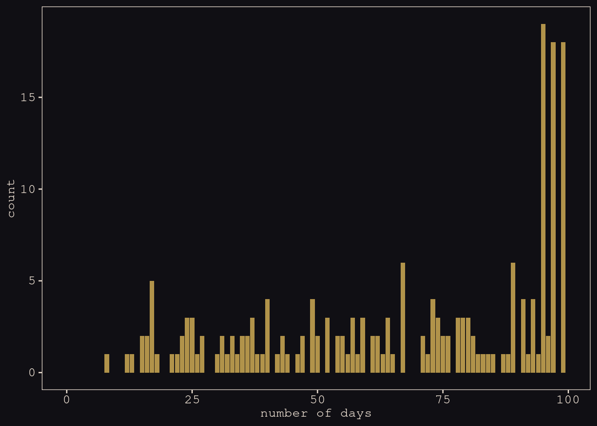

In this study, participants completed the PANAS (Positive and Negative Affect Schedule) once a day by endorsing the extent to which they experienced various positive (e.g., excited, inspired) and negative (e.g., upset, afraid) emotional states.

In the current data, the standardized versions of these scores are in the `P_A.std` and `N_A.std` columns, respectively.


```r
set.seed(14)

dat %>% 
  nest(data = c(X1, P_A.std, day, P_A.lag, N_A.lag, steps.pm, steps.pmd, N_A.std, day01)) %>% 
  slice_sample(n = 16) %>% 
  unnest(data) %>% 
  
  ggplot(aes(x = day, y = N_A.lag)) +
  geom_line(color = "#80A0C7") +
  geom_point(color = "#FCF9F0", size = 1/2) +
  ylab("negative affect (standardized)") +
  facet_wrap(~ record_id)
```

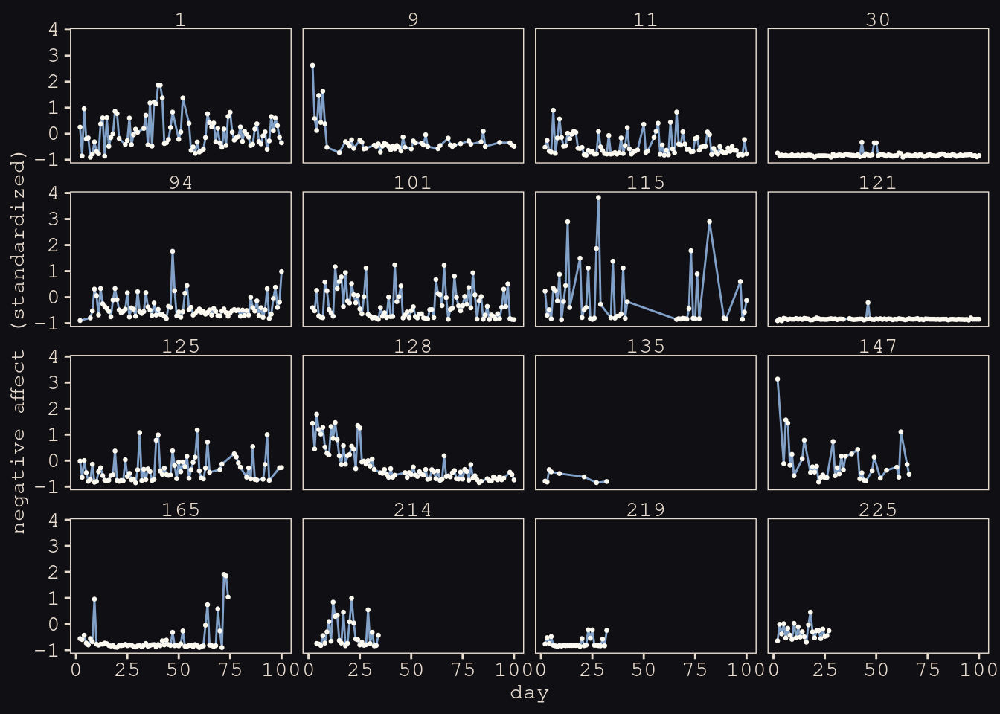

***14.6.2. Conventional multilevel growth model***


