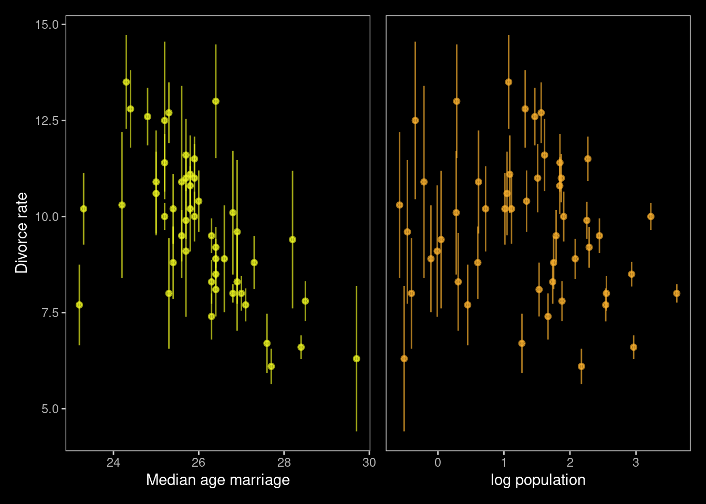
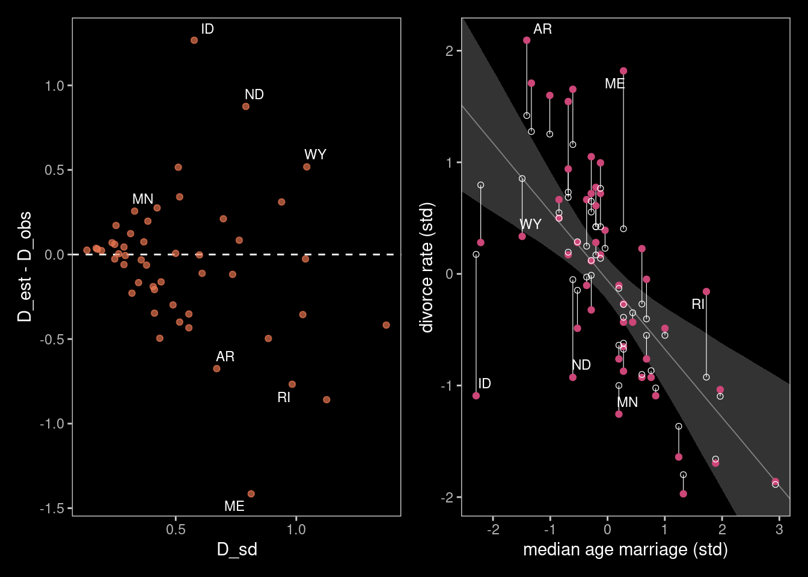
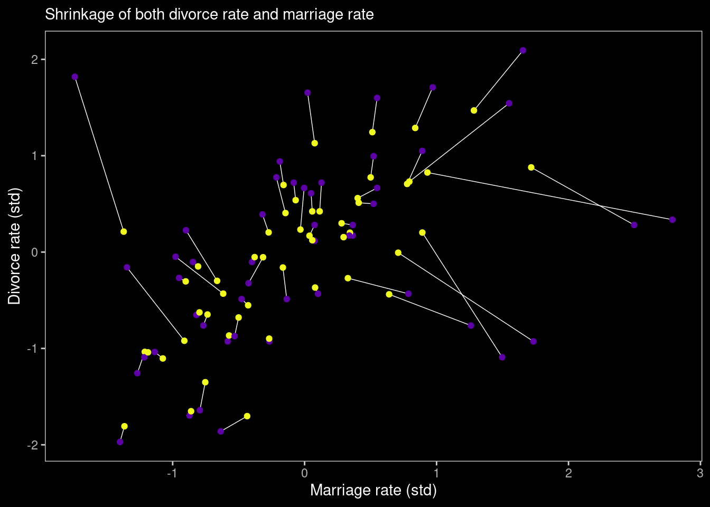
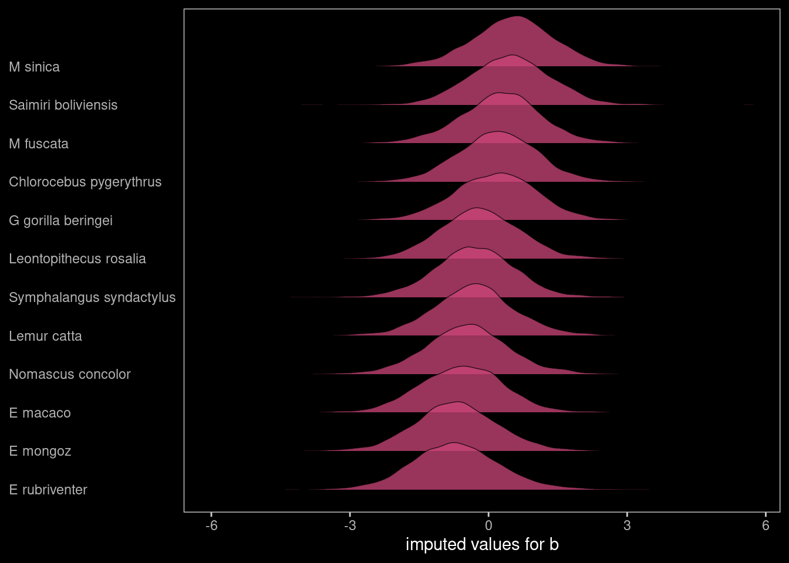
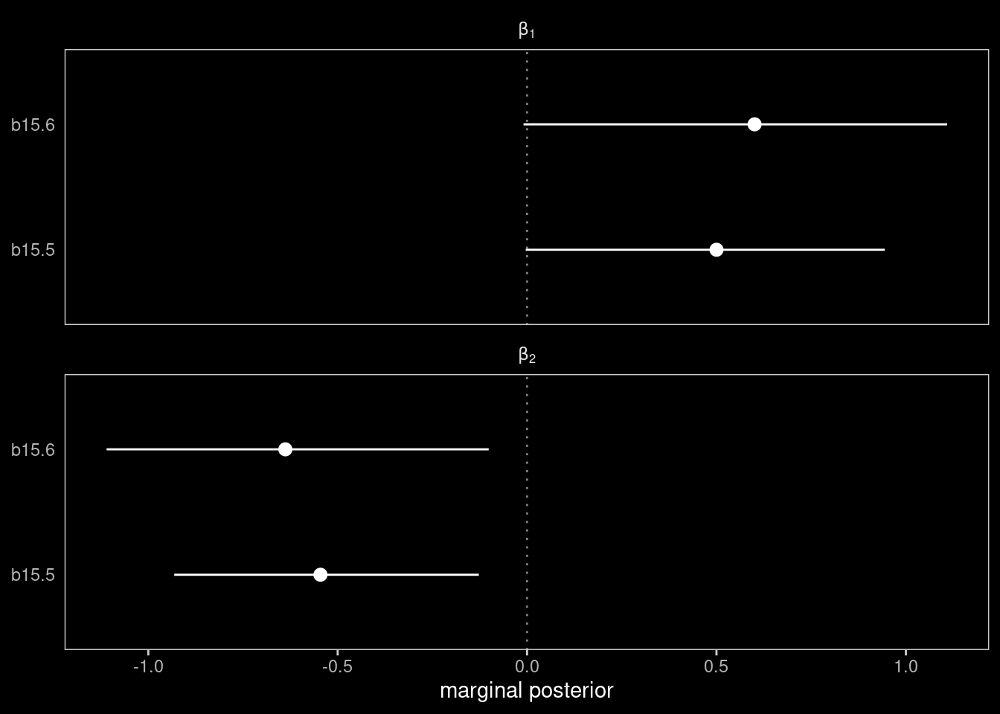
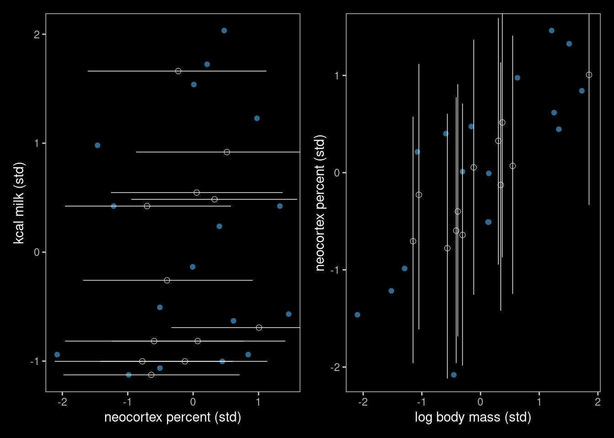
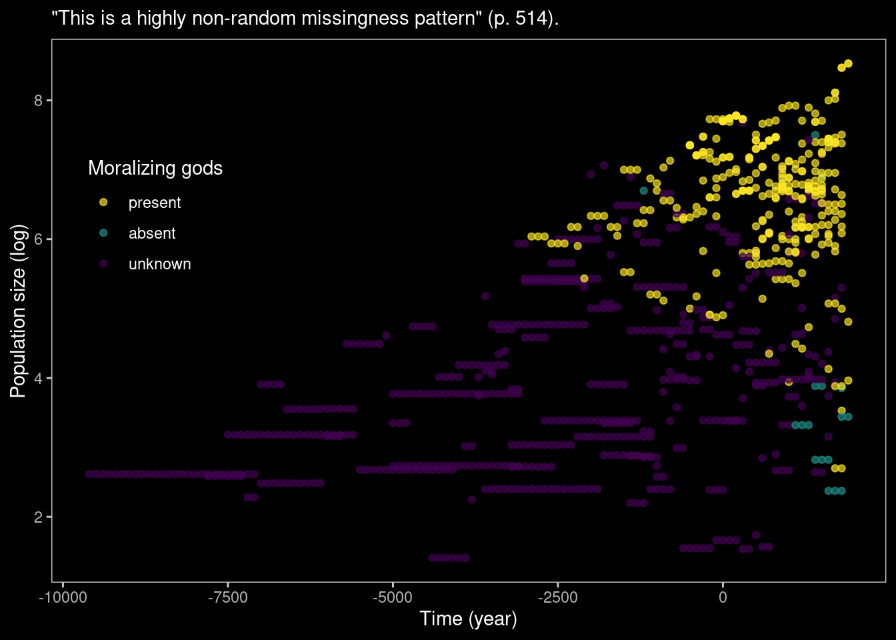

# Missing Data and Other Opportunities


```r
library(here)
source(here::here("code/scripts/source.R"))
```


```r
slides_dir = here::here("docs/slides/L20")
```


<div class="figure">

<p class="caption">Pancakes. Hatching indicates that that side is burnt. </p>
</div>

<div class="figure">

<p class="caption">Now I serve you a burnt pancake. The probability of the other side being burnt is not half, but rather 2/3.</p>
</div>

<div class="figure">

<p class="caption">Famous logic problem. Point of logic puzzles is to correct your intuitions and teach you methods for solving them. You don't have to be clever, just ruthlessley apply the rules of conditioning. Don't trust your intuitions. Theways we figure things out in probabilty theory, we condition on what we know, and seee if that updates. </p>
</div>

<div class="figure">

<p class="caption">We want to know the probabilty that the other side is burnt conditional on what we know, that one side is burnt. </p>
</div>

<div class="figure">

<p class="caption">We have all the information to compute this. There are three pancakes. BB is burnt-burnt. Probabillity that you would see a burnt side if it's BB is 1. </p>
</div>


<div class="figure">

<p class="caption">In the text there's a simulation. The mistake is focusing on pancakes. You want to focus on *sides*. There are three burnt sides. Of the other sides of those, how many of those are burnt? 2, so 2/3. </p>
</div>

<div class="figure">

<p class="caption">Everything we've done is underlain by being ruthless. Express our information by constraints in distributions. Take this approach and show you how it produces automatic solutions. Avoid being clever and you can get useful solutions. Missing data is the extreme version of measurement error.</p>
</div>

## Measurement error

<div class="figure">

<p class="caption">There's always some error in measurement, and ther'e always this sigma error. But what if there's also error on the predictors, and it's not consistent. Let's think about avoiding thying to be clever, and just codntiiong on what we know.</p>
</div>

<div class="figure">

<p class="caption">The columns were standard errors on a coulpl eof the variables. The error of measurement has been quantified. We have an esimate of the divors=ce rate, and the stnadared error stells us the error rate of that estiamte. SOome of the standard errors are big. </p>
</div>


```r
data(WaffleDivorce, package = "rethinking")
d <- WaffleDivorce
rm(WaffleDivorce)
```


```r
d <-
  d %>% 
  mutate(D_obs = (Divorce - mean(Divorce)) / sd(Divorce),
         D_sd  = Divorce.SE / sd(Divorce),
         M     = (Marriage - mean(Marriage)) / sd(Marriage),
         A     = (MedianAgeMarriage - mean(MedianAgeMarriage)) / sd(MedianAgeMarriage),
         M_obs = M,
         M_sd  = Marriage.SE / sd(Marriage))
```

Set theme:


```r
library(ggdark)

theme_set(
  dark_theme_bw() +
    theme(legend.position = "none",
          panel.grid = element_blank())
  )
```

```
## Inverted geom defaults of fill and color/colour.
## To change them back, use invert_geom_defaults().
```

```r
# to reset the default ggplot2 theme to its default parameters, execute both:
# ggplot2::theme_set(theme_gray())
# ggdark::invert_geom_defaults()
```

Figure 15.1a

```r
color <- viridis_pal(option = "C")(7)[7]

p1 <-
  d %>%
  ggplot(aes(x = MedianAgeMarriage, 
             y = Divorce,
             ymin = Divorce - Divorce.SE, 
             ymax = Divorce + Divorce.SE)) +
  geom_pointrange(shape = 20, alpha = 2/3, color = color) +
  labs(x = "Median age marriage" , 
       y = "Divorce rate")
```


```r
color <- viridis_pal(option = "C")(7)[6]

p2 <-
  d %>%
  ggplot(aes(x = log(Population), 
             y = Divorce,
             ymin = Divorce - Divorce.SE, 
             ymax = Divorce + Divorce.SE)) +
  geom_pointrange(shape = 20, alpha = 2/3, color = color) +
  scale_y_continuous(NULL, breaks = NULL) +
  xlab("log population")

p1 | p2
```



Just like in the text, our plot shows states with larger populations tend to have smaller measurement error. The relation between measurement error and `MedianAgeMarriage` is less apparent.

<div class="figure">

<p class="caption">Right now has the log population on the horizontal. And California is on the right. It's so big that the error rate is small.</p>
</div>

<div class="figure">

<p class="caption">Let's think about this in terms of a causal model. We want to see the divorce rate we observe as a function of the true divorce rate `D`, and the population size `N`. </p>
</div>

<div class="figure">

<p class="caption">Let's not be clever, just apply ruthless probability theory. There's some true divorce rate, and we'd like to use that as our outcome variable. Generatively thinking, our observed data is generated from a normal disttribution. The mean of this normal distribution will be the true rate. THen there's a standard deviation. In the long run, there's some D true. But in any finite period, ther's error, and that will be inversely proportional to population size.</p>
</div>

<div class="figure">

<p class="caption">This was our DAG before. The thing on the top is D TRUE. We're going to put a line on top of it.</p>
</div>

<div class="figure">

<p class="caption">... The observation process. Now D TRUE is's a vector of unkonwn parameters, then the line at the top estimates them for us. We also have the whole regression relationship that is going to pin down values from other states. Shrinkage is going to happen. If you were going to simulate pmeaurement error, this would be the model. Then it runs backwards. **Bayesian models are generative, and you can run them in both directions. If you run them forwards you simulate fake data, and if you run them in the reverse they spit out a posterior distribution. You feed in a distirbution and the spit out data, you feed in data they spit out a distribution.** So if you were going to simulate measurement error, you use the top line.  </p>
</div>

<div class="figure">

<p class="caption">How do we do this in a model? For every dstate, there's a D true, and that's what the vector[N] is. </p>
</div>

With brms, we accommodate measurement error in the criterion using the `mi()` syntax, following the general form `<response> | mi(<se_response>)`. This follows a missing data logic, resulting in Bayesian missing data imputation for the criterion values


```r
# put the data into a `list()`
dlist <- list(
  D_obs = d$D_obs,
  D_sd  = d$D_sd,
  M     = d$M,
  A     = d$A)

b15.1 <- 
  brm(data = dlist, 
      family = gaussian,
      D_obs | mi(D_sd) ~ 1 + A + M,
      prior = c(prior(normal(0, 0.2), class = Intercept),
                prior(normal(0, 0.5), class = b),
                prior(exponential(1), class = sigma)),
      iter = 2000, warmup = 1000, cores = 4, chains = 4,
      seed = 15,
      # note this line
      save_mevars = TRUE,
      file = "fits/b15.01")
```


```r
print(b15.1)
```

```
##  Family: gaussian 
##   Links: mu = identity; sigma = identity 
## Formula: D_obs | mi(D_sd) ~ 1 + A + M 
##    Data: dlist (Number of observations: 50) 
## Samples: 4 chains, each with iter = 2000; warmup = 1000; thin = 1;
##          total post-warmup samples = 4000
## 
## Population-Level Effects: 
##           Estimate Est.Error l-95% CI u-95% CI Rhat Bulk_ESS Tail_ESS
## Intercept    -0.06      0.10    -0.23     0.14 1.00     5130     3528
## A            -0.61      0.16    -0.92    -0.31 1.00     3953     3313
## M             0.05      0.17    -0.28     0.38 1.00     3801     2979
## 
## Family Specific Parameters: 
##       Estimate Est.Error l-95% CI u-95% CI Rhat Bulk_ESS Tail_ESS
## sigma     0.58      0.11     0.39     0.81 1.00     1615     1962
## 
## Samples were drawn using sampling(NUTS). For each parameter, Bulk_ESS
## and Tail_ESS are effective sample size measures, and Rhat is the potential
## scale reduction factor on split chains (at convergence, Rhat = 1).
```


<div class="figure">

<p class="caption">Remember the distinction between likelihoods and priors in a Baeysian model is coginitive. Probabilityt theory don't care. When something in your dataset becomes unobserved, the model doesn't change. The model exists before you know the sample. The fact that you haven't observed some data doesn't mean the model chagnes. It cjust means you have paraemters there, because parameters are unobserved variables.</p>
</div>

Return the summaries for the `D_true[i]` parameters.


```r
posterior_summary(b15.1) %>% 
  round(digits = 2) %>% 
  data.frame()
```

```
##             Estimate Est.Error   Q2.5  Q97.5
## b_Intercept    -0.06      0.10  -0.23   0.14
## b_A            -0.61      0.16  -0.92  -0.31
## b_M             0.05      0.17  -0.28   0.38
## sigma           0.58      0.11   0.39   0.81
## Yl[1]           1.16      0.36   0.46   1.89
## Yl[2]           0.69      0.57  -0.44   1.84
## Yl[3]           0.42      0.34  -0.24   1.12
## Yl[4]           1.42      0.48   0.50   2.38
## Yl[5]          -0.90      0.13  -1.15  -0.65
## Yl[6]           0.65      0.40  -0.12   1.46
## Yl[7]          -1.37      0.35  -2.06  -0.69
## Yl[8]          -0.35      0.49  -1.32   0.60
## Yl[9]          -1.89      0.59  -3.04  -0.75
## Yl[10]         -0.62      0.16  -0.94  -0.30
## Yl[11]          0.77      0.29   0.22   1.33
## Yl[12]         -0.55      0.48  -1.52   0.32
## Yl[13]          0.17      0.49  -0.82   1.11
## Yl[14]         -0.87      0.22  -1.32  -0.44
## Yl[15]          0.55      0.29  -0.02   1.13
## Yl[16]          0.29      0.37  -0.44   1.00
## Yl[17]          0.50      0.43  -0.32   1.34
## Yl[18]          1.25      0.35   0.59   1.94
## Yl[19]          0.42      0.39  -0.33   1.21
## Yl[20]          0.40      0.54  -0.59   1.48
## Yl[21]         -0.55      0.32  -1.17   0.08
## Yl[22]         -1.10      0.25  -1.59  -0.60
## Yl[23]         -0.27      0.26  -0.77   0.24
## Yl[24]         -1.00      0.29  -1.57  -0.42
## Yl[25]          0.42      0.41  -0.36   1.24
## Yl[26]         -0.03      0.31  -0.64   0.59
## Yl[27]         -0.01      0.50  -1.01   1.00
## Yl[28]         -0.15      0.38  -0.93   0.60
## Yl[29]         -0.27      0.50  -1.21   0.71
## Yl[30]         -1.80      0.23  -2.26  -1.35
## Yl[31]          0.17      0.43  -0.67   1.06
## Yl[32]         -1.66      0.16  -1.98  -1.34
## Yl[33]          0.12      0.24  -0.36   0.60
## Yl[34]         -0.05      0.51  -1.12   0.93
## Yl[35]         -0.13      0.23  -0.57   0.33
## Yl[36]          1.28      0.40   0.52   2.08
## Yl[37]          0.23      0.34  -0.44   0.90
## Yl[38]         -1.02      0.22  -1.45  -0.59
## Yl[39]         -0.93      0.54  -1.93   0.17
## Yl[40]         -0.68      0.31  -1.29  -0.08
## Yl[41]          0.25      0.54  -0.82   1.38
## Yl[42]          0.73      0.35   0.06   1.42
## Yl[43]          0.19      0.18  -0.15   0.54
## Yl[44]          0.80      0.43  -0.04   1.62
## Yl[45]         -0.40      0.54  -1.45   0.67
## Yl[46]         -0.39      0.26  -0.90   0.12
## Yl[47]          0.14      0.31  -0.46   0.74
## Yl[48]          0.55      0.47  -0.38   1.48
## Yl[49]         -0.64      0.28  -1.22  -0.10
## Yl[50]          0.85      0.60  -0.35   2.04
## lp__          -78.11      6.47 -91.50 -66.12
```


<div class="figure">

<p class="caption">There's shrinkage. Plotting the relationship between median age of marriage and the divorce rate. Most of these are standardised variables. The blue points are the values that were observed. The open circles are the values fromt eh posterior distribution. The line segments connect them for each state. There's shrinkage. Some have moved more than others. You can explain this pattern. Why have some moved way more than others? Thye've moved tothe regression line because that's the expectation. How much it shrinks is also a function of standard error. For ID it says given this relationship and these variables, that measred rate is too edteme to be beileveable, party due to sampling error, so it shirnks it. Wyoming is interesitn gbecause it'snot so far but so uncertain that it gets shrunk directly to the line. Maine gets shrunk a lot too. </p>
</div>

Figure 15.2a

```r
library(ggrepel)

states <- c("AL", "AR", "ME", "NH", "RI", "DC", "VT", "AK", "SD", "UT", "ID", "ND", "WY")

d_est <-
  posterior_summary(b15.1) %>% 
  data.frame() %>% 
  rownames_to_column("term") %>% 
  mutate(D_est = Estimate) %>% 
  dplyr::select(term, D_est) %>% 
  filter(str_detect(term, "Yl")) %>% 
  bind_cols(d)

color <- viridis_pal(option = "C")(7)[5]

p1 <-
  d_est %>%
  ggplot(aes(x = D_sd, y = D_est - D_obs)) +
  geom_hline(yintercept = 0, linetype = 2, color = "white") +
  geom_point(alpha = 2/3, color = color) +
  geom_text_repel(data = . %>% filter(Loc %in% states),  
                  aes(label = Loc), 
                  size = 3, seed = 15, color = "white") 
```


<div class="figure">

<p class="caption">You can compare it to the plot with teh standard devations. Ont ehleft we've taken the differnce between the estimated and the observed. Horizontal is the standard error. Any state taht has adifference of 0 means there's no shrinkage. </p>
</div>

Figure 15.2b

```r
library(tidybayes)

states <- c("AR", "ME", "RI", "ID", "WY", "ND", "MN")

color <- viridis_pal(option = "C")(7)[4]

p2 <-
  posterior_samples(b15.1) %>% 
  tidyr::expand(nesting(b_Intercept, b_A),
         A = seq(from = -3.5, to = 3.5, length.out = 50)) %>% 
  mutate(fitted = b_Intercept + b_A * A) %>% 
  
  ggplot(aes(x = A)) +
  stat_lineribbon(aes(y = fitted),
                  .width = .95, size = 1/3, color = "grey50", fill = "grey20") +
  geom_segment(data = d_est,
               aes(xend = A,
                   y = D_obs, yend = D_est),
               size = 1/5) +
  geom_point(data = d_est,
             aes(y = D_obs),
             color = color) +
  geom_point(data = d_est,
             aes(y = D_est),
             shape = 1, stroke = 1/3) +
  geom_text_repel(data = d %>% filter(Loc %in% states),  
                  aes(y = D_obs, label = Loc), 
                  size = 3, seed = 15, color = "white") +
  labs(x = "median age marriage (std)",
       y = "divorce rate (std)") +
  coord_cartesian(xlim = range(d$A), 
                  ylim = range(d$D_obs))
```


```r
p1 | p2
```

<div class="figure">

<p class="caption">Figure 15.2</p>
</div>

***15.1.2. Error on both outcome and predictor***

<div class="figure">

<p class="caption">That's error on the outcome. YOu can also have error on predictor variables. Imagine sampling a predictor now with error. On the plot on this slide we have the marriage rate. On the horizontal against log population. </p>
</div>

<div class="figure">

<p class="caption">Top part is the observation process on divorce rate. Then the regression of the true divorce rate on age of marriage and marriage rate. But now inside the regression, we have...</p>
</div>

<div class="figure">

<p class="caption">M true, not the observed M, and that's a paramter. There's a parameter for each state and it goes in. It's a parameter times a parameter. Every state will have one of this M trues. Same model because it's the same generative process. Then we have the likelihood for the observed rate, the M observed for each state comes from this sampling process again.  </p>
</div>

<div class="figure">

<p class="caption">You ahve to put in a prior for the MTrues. What hapens as a consquence of setting it as Normal(0, 1), because it's standaredised. Not terrible. Butyou're ignoring oinfoamtion inthe data because if i tele you the age of marrige in each state, you get information about themarriage rate. If you believe the DAG, age of marrige influence marriage rate. So we can get a better prior if we put the whole DAG into the model. If we do it all ato once, there's even more infomration. </p>
</div>


```r
# put the data into a `list()`
dlist <- list(
  D_obs = d$D_obs,
  D_sd  = d$D_sd,
  M_obs = d$M_obs,
  M_sd  = d$M_sd,
  A     = d$A)

b15.2 <- 
  brm(data = dlist, 
      family = gaussian,
      D_obs | mi(D_sd) ~ 1 + A + me(M_obs, M_sd),
      prior = c(prior(normal(0, 0.2), class = Intercept),
                prior(normal(0, 0.5), class = b),
                prior(normal(0, 1), class = meanme),
                prior(exponential(1), class = sigma)),
      iter = 2000, warmup = 1000, cores = 4, chains = 4,
      seed = 15,
      # note this line
      save_mevars = TRUE,
      file = "fits/b15.02")
```


```r
posterior_summary(b15.2) %>%
 round(digits = 2)
```

```
##                 Estimate Est.Error    Q2.5   Q97.5
## b_Intercept        -0.03      0.10   -0.22    0.16
## b_A                -0.52      0.16   -0.83   -0.21
## bsp_meM_obsM_sd     0.26      0.22   -0.18    0.68
## sigma               0.55      0.11    0.35    0.77
## Yl[1]               1.13      0.36    0.43    1.86
## Yl[2]               0.73      0.54   -0.31    1.82
## Yl[3]               0.42      0.33   -0.21    1.07
## Yl[4]               1.47      0.45    0.61    2.35
## Yl[5]              -0.90      0.13   -1.14   -0.65
## Yl[6]               0.71      0.39   -0.06    1.50
## Yl[7]              -1.35      0.35   -2.02   -0.67
## Yl[8]              -0.27      0.48   -1.21    0.66
## Yl[9]              -1.70      0.61   -2.87   -0.50
## Yl[10]             -0.63      0.16   -0.95   -0.30
## Yl[11]              0.78      0.28    0.24    1.34
## Yl[12]             -0.44      0.46   -1.37    0.46
## Yl[13]              0.20      0.49   -0.80    1.12
## Yl[14]             -0.87      0.23   -1.33   -0.42
## Yl[15]              0.54      0.30   -0.03    1.11
## Yl[16]              0.30      0.37   -0.45    1.00
## Yl[17]              0.51      0.40   -0.29    1.32
## Yl[18]              1.24      0.35    0.57    1.94
## Yl[19]              0.42      0.38   -0.31    1.18
## Yl[20]              0.21      0.54   -0.82    1.33
## Yl[21]             -0.55      0.31   -1.16    0.08
## Yl[22]             -1.10      0.26   -1.60   -0.58
## Yl[23]             -0.30      0.25   -0.81    0.20
## Yl[24]             -1.04      0.29   -1.61   -0.48
## Yl[25]              0.41      0.41   -0.36    1.21
## Yl[26]             -0.05      0.31   -0.66    0.54
## Yl[27]             -0.05      0.50   -1.09    0.95
## Yl[28]             -0.16      0.38   -0.93    0.57
## Yl[29]             -0.30      0.49   -1.23    0.65
## Yl[30]             -1.81      0.23   -2.26   -1.36
## Yl[31]              0.17      0.41   -0.64    1.00
## Yl[32]             -1.65      0.17   -1.97   -1.32
## Yl[33]              0.12      0.24   -0.35    0.59
## Yl[34]             -0.01      0.49   -0.99    0.96
## Yl[35]             -0.15      0.22   -0.58    0.29
## Yl[36]              1.29      0.41    0.49    2.07
## Yl[37]              0.20      0.34   -0.44    0.88
## Yl[38]             -1.04      0.21   -1.46   -0.63
## Yl[39]             -0.92      0.53   -1.93    0.15
## Yl[40]             -0.68      0.32   -1.31   -0.07
## Yl[41]              0.23      0.54   -0.80    1.33
## Yl[42]              0.70      0.33    0.05    1.35
## Yl[43]              0.20      0.18   -0.14    0.55
## Yl[44]              0.88      0.42    0.01    1.68
## Yl[45]             -0.43      0.52   -1.41    0.60
## Yl[46]             -0.37      0.25   -0.86    0.12
## Yl[47]              0.15      0.30   -0.44    0.74
## Yl[48]              0.56      0.46   -0.35    1.47
## Yl[49]             -0.65      0.27   -1.20   -0.12
## Yl[50]              0.83      0.53   -0.27    1.83
## meanme_meM_obs     -0.10      0.12   -0.34    0.13
## sdme_meM_obs        0.81      0.11    0.62    1.04
## Xme_meM_obs[1]      0.08      0.31   -0.51    0.70
## Xme_meM_obs[2]      0.79      0.55   -0.30    1.86
## Xme_meM_obs[3]      0.06      0.24   -0.40    0.52
## Xme_meM_obs[4]      1.28      0.40    0.50    2.05
## Xme_meM_obs[5]     -0.27      0.10   -0.48   -0.07
## Xme_meM_obs[6]      0.78      0.31    0.17    1.37
## Xme_meM_obs[7]     -0.75      0.26   -1.27   -0.24
## Xme_meM_obs[8]      0.33      0.54   -0.70    1.42
## Xme_meM_obs[9]     -0.44      0.52   -1.43    0.62
## Xme_meM_obs[10]    -0.80      0.15   -1.09   -0.49
## Xme_meM_obs[11]     0.50      0.20    0.11    0.89
## Xme_meM_obs[12]     0.64      0.52   -0.38    1.68
## Xme_meM_obs[13]     0.89      0.44    0.03    1.78
## Xme_meM_obs[14]    -0.57      0.16   -0.89   -0.26
## Xme_meM_obs[15]    -0.07      0.21   -0.48    0.34
## Xme_meM_obs[16]     0.28      0.36   -0.40    0.98
## Xme_meM_obs[17]     0.41      0.35   -0.27    1.08
## Xme_meM_obs[18]     0.51      0.28   -0.03    1.06
## Xme_meM_obs[19]     0.11      0.28   -0.45    0.68
## Xme_meM_obs[20]    -1.37      0.34   -2.05   -0.70
## Xme_meM_obs[21]    -0.43      0.25   -0.92    0.06
## Xme_meM_obs[22]    -1.07      0.18   -1.42   -0.73
## Xme_meM_obs[23]    -0.90      0.17   -1.24   -0.55
## Xme_meM_obs[24]    -1.21      0.20   -1.61   -0.82
## Xme_meM_obs[25]    -0.14      0.36   -0.89    0.56
## Xme_meM_obs[26]    -0.38      0.21   -0.77    0.03
## Xme_meM_obs[27]    -0.31      0.48   -1.29    0.62
## Xme_meM_obs[28]    -0.16      0.34   -0.83    0.52
## Xme_meM_obs[29]    -0.66      0.40   -1.44    0.13
## Xme_meM_obs[30]    -1.37      0.15   -1.65   -1.08
## Xme_meM_obs[31]     0.04      0.43   -0.81    0.87
## Xme_meM_obs[32]    -0.86      0.13   -1.11   -0.61
## Xme_meM_obs[33]     0.06      0.24   -0.43    0.53
## Xme_meM_obs[34]     0.71      0.58   -0.40    1.85
## Xme_meM_obs[35]    -0.81      0.15   -1.10   -0.51
## Xme_meM_obs[36]     0.84      0.31    0.23    1.45
## Xme_meM_obs[37]    -0.27      0.27   -0.80    0.27
## Xme_meM_obs[38]    -1.19      0.13   -1.44   -0.93
## Xme_meM_obs[39]    -0.91      0.47   -1.84    0.02
## Xme_meM_obs[40]    -0.50      0.29   -1.08    0.07
## Xme_meM_obs[41]    -0.03      0.51   -1.06    0.99
## Xme_meM_obs[42]    -0.16      0.22   -0.58    0.27
## Xme_meM_obs[43]     0.34      0.16    0.04    0.66
## Xme_meM_obs[44]     1.72      0.43    0.87    2.59
## Xme_meM_obs[45]    -0.62      0.49   -1.59    0.33
## Xme_meM_obs[46]     0.08      0.21   -0.33    0.49
## Xme_meM_obs[47]     0.30      0.25   -0.18    0.77
## Xme_meM_obs[48]     0.40      0.39   -0.38    1.17
## Xme_meM_obs[49]    -0.74      0.20   -1.12   -0.36
## Xme_meM_obs[50]     0.93      0.65   -0.28    2.24
## lp__             -163.86      9.80 -184.23 -145.48
```


<div class="figure">

<p class="caption">We've got two variables now, which are observed with error. Divorce rate on vertical; marigage rate on horitzontal. Open points are the corresponding pairs of posterior means for the esitmate true means. So we have shrinkage in two directions now towards some regression line (undrawn). Some shirnk a lot more than others. If you're really far from the line you shrink more. But also there's more shrinkage for the diveroce rate than the marriage rate. Top left is extreme in both. Comes downa  lot more on divorce rate. WHy?</p>
</div>


```r
color_y <- viridis_pal(option = "C")(7)[7]
color_p <- viridis_pal(option = "C")(7)[2]

# wrangle
full_join(
  # D
  tibble(Loc   = d %>% pull(Loc),
         D_obs = d %>% pull(D_obs),
         D_est = posterior_summary(b15.2) %>% 
           data.frame() %>% 
           rownames_to_column("term") %>% 
           filter(str_detect(term, "Yl")) %>% 
           pull(Estimate)) %>% 
    pivot_longer(-Loc, values_to = "d") %>% 
    mutate(name = if_else(name == "D_obs", "observed", "posterior")),
  # M
  tibble(Loc   = d %>% pull(Loc),
         M_obs = d %>% pull(M_obs),
         M_est = posterior_summary(b15.2) %>% 
           data.frame() %>% 
           rownames_to_column("term") %>% 
           filter(str_detect(term, "Xme_")) %>% 
           pull(Estimate)) %>% 
    pivot_longer(-Loc, values_to = "m") %>% 
    mutate(name = if_else(name == "M_obs", "observed", "posterior")),
  by = c("Loc", "name")
)  %>% 
  
  # plot!
  ggplot(aes(x = m, y = d)) +
  geom_line(aes(group = Loc),
            size = 1/4) +
  geom_point(aes(color = name)) +
  scale_color_manual(values = c(color_p, color_y)) +
  labs(subtitle = "Shrinkage of both divorce rate and marriage rate", 
       x = "Marriage rate (std)" , 
       y = "Divorce rate (std)")
```


<div class="figure">

<p class="caption">Because the regression says marriage rate isn't strongly associtated. It doesn 't know where to move it, so it doesn't.  </p>
</div>

<div class="figure">

<p class="caption">It comes in many disguises. Simplest is when there's variable that's called 'error'. But there are many more subtle forms. Pre-averaging removes the fact tht you have a finite sample to estimate the mean from. That takes variation out of the dataset. If you're doing that constantly, that's cheating. Otherwise you could just use a MLM. Then the means are varying effects - parameters - and you do the averaging within the model. And all the uncertainty to do with different sample sizes is taken care of. Parentage analysis is a fun case. Say you have a popuation of wild rodents and you're tyring to figure out who was whose parents. So you get their genotypes and figure out how they're related. Phylogenetics - the example last week used a single tree. Phylogenies are rarely very certain. Trend to plot them like on the right, so you're showing the whole posterior distribution. You can do the analysis over the whole distribution of trees. In archaology, measurement error is the norm, e.g. radio carbon dating. People take this very seriously now. Very difficult to sex a fossil. Or studying a place where they don't keep track of birthdays.</p>
</div>

***15.1.3. Measurement terrors***

## Missing data

<div class="figure">

<p class="caption">Grown up measurement error. Mechanically similar but feels really different. You want to do something about missing data. Most of the standard regression tools will autoamtically remove missing cases. So all the variables are removed. This squanders information, but can also create confounds. There are ways to deal with this. So how to deal with it? Worst appraoch is to replace teh missing values with the mean of the column. Really bad idea because they model will intepret it as if you knew the value. Procedure called multiple imputation, whcih works really well. Frequentist way of doing what we're going to do. Unreasoanbly effective. Basically do the modle multiple times on samples on some stochastic model of the dataset. We're just going to go full-flavour Bayesian.</p>
</div>

***15.2.2. Imputing primates***

<div class="figure">

<p class="caption">Let's talk about DAGs again. Deeply confusing, because the terminology is awful. Let's think about the primate milk data again. Interested in understanding why the energy content of milk varies so much. Is is related to the proportion of brain neocortex. U is the strong postive correlation between M and B, but we don't know what it is. Something going on here but we don't know what it is.</p>
</div>

<div class="figure">

<p class="caption">This taxonomy tells us what to do. Confusingly, MCAR is totally different to MAR. </p>
</div>

<div class="figure">

<p class="caption">MCAR. We're not going to get to see B, because it has missing values in it. Lot's of primates where they didn't measure percent neocortex. To get the gaps, we know it's partly caused by B, but it's also caused by the missingness process R. `R_B` creates missing values in `B`. </p>
</div>

<div class="figure">

<p class="caption">We're going to condition on `B_obs`. Are there backdoors? The answer is no, but there are two paths. Direct and indirect. But the total causal effect can be estimated by simple regression with just `B_obs`. There's an indirect effect through M. But there's no back door. </p>
</div>

<div class="figure">

<p class="caption">There's no path that takes you through `R_B`. This means the missingness mechanism is ignorable, because it doesn't create any backdoor confound. So you don't need to know it. This is the benign case.</p>
</div>

<div class="figure">

<p class="caption">You don't have to condition on anything to keep your inference about K independent from the missingness mechanism.</p>
</div>

<div class="figure">

<p class="caption">The only way this could happen is if you had a random number generator deletes values from your dataset. I assert this is highly implausible in most research situations. </p>
</div>

<div class="figure">

<p class="caption">This is something else that could be going on. This will give us MAR. M is now entering/influencing R_B. Now the missingness mechanism depends on the body mass values. Large or small body masses are more likely to have missing body mass values. Different species are more or less attractive to study. That generates a pattern where some features are associated causally with the missingness. </p>
</div>

<div class="figure">

<p class="caption">As before, is there a backdoor path. Now because there's an arrow entering R_B..</p>
</div>

<div class="figure">

<p class="caption">You have a complete path. How to close the backdoor? Condition on M. Here you don't have to know the missingness mechanism, but do need to do imputation.</p>
</div>

<div class="figure">

<p class="caption">There's some variable in the graph we can condition on, and separate the two. This is a nice situation to be in, and probably the most common. Why need to impute? Because you'd be polluting the other variables with this missngness pattern, whcihc an create really strong biases.</p>
</div>

<div class="figure">

<p class="caption">Worst case. In this case, the most obvious way to get it is the variable itself causes the missingness. Certain values of neoxortex percent are more likely to go missing. How? Maybe species with low neocortex weren't measured.</p>
</div>

<div class="figure">

<p class="caption">This is nasty because you get a backdoor you can't close. Your only hope is to model the missingness mechanism and thereby condition on it.</p>
</div>

<div class="figure">

<p class="caption">The other way to get it would be to have a missingness variable. Here there's fork, like phylogeny. We like to study animals closer to us. That will influence neocortex percent, and also influence missingness.</p>
</div>


<div class="figure">

<p class="caption">Imagine a DAG iwth four variables. R is nowD, a dog. In the first, the dog will eat any homework. In the middle, teh dog eats particular students' homework. The attribute could be attention span, as in they turn away and the dog eats it. Finally, the dog only eats bad homework. Or, more liekly, the stuent feeds it to the dog. But it depends ont he score ofthe homework. </p>
</div>

<div class="figure">

<p class="caption">Let's go through the mechanics of this. </p>
</div>


```r
data(milk, package = "rethinking")
d <- milk
rm(milk)

# transform
d <-
  d %>%
  mutate(neocortex.prop = neocortex.perc / 100,
         logmass        = log(mass)) %>% 
  mutate(k = (kcal.per.g - mean(kcal.per.g)) / sd(kcal.per.g),
         b = (neocortex.prop - mean(neocortex.prop, na.rm = T)) / sd(neocortex.prop, na.rm = T),
         m = (logmass - mean(logmass)) / sd(logmass))
```

We're missing 12 values from `neocortex.prop`:


```r
d %>% 
  count(is.na(neocortex.prop))
```

```
##   is.na(neocortex.prop)  n
## 1                 FALSE 17
## 2                  TRUE 12
```


<div class="figure">

<p class="caption">We'll replace the NAs with a parameter, and get posterior distributions for each of the missing values. </p>
</div>

<div class="figure">

<p class="caption">Now they get assigned a parameter. They'll be imputed by the modeo.</p>
</div>

<div class="figure">

<p class="caption">B is now a vector in which some values are observed, and toehrs are paratmets. We'll stick them in an ordianry regression modeo. But now we have a prior. When B is observed, it infomrs the parameters in side it. Those will be estimated from teh observed values.</p>
</div>


<div class="figure">

<p class="caption">Looks exavtly the same, but we add this prior. `ulam` automates this.</p>
</div>

When writing a multivariate model in brms, I find it easier to save the model code by itself and then insert it into the `brm()` function. Otherwise, things start to feel cluttered.


```r
b_model <- 
  # here's the primary `k` model
  bf(k ~ 1 + mi(b) + m) + 
  # here's the model for the missing `b` data 
  bf(b | mi() ~ 1) + 
  # here we set the residual correlations for the two models to zero
  set_rescor(FALSE)
```

Get a sense of how to specify the priors:


```r
get_prior(data = d, 
          family = gaussian,
          b_model)
```

```
##                    prior     class coef group resp dpar nlpar bound
##                   (flat)         b                                 
##                   (flat) Intercept                                 
##   student_t(3, 0.2, 2.5) Intercept               b                 
##     student_t(3, 0, 2.5)     sigma               b                 
##                   (flat)         b               k                 
##                   (flat)         b    m          k                 
##                   (flat)         b  mib          k                 
##  student_t(3, -0.3, 2.5) Intercept               k                 
##     student_t(3, 0, 2.5)     sigma               k                 
##        source
##       default
##       default
##       default
##       default
##  (vectorized)
##  (vectorized)
##  (vectorized)
##       default
##       default
```

With the one-step Bayesian imputation procedure in `brms`, you might need to use the `resp` argument when specifying non-default priors. Now fit the model.


```r
b15.5 <- 
  brm(data = d, 
      family = gaussian,
      b_model,  # here we insert the model
      prior = c(prior(normal(0, 0.5), class = Intercept, resp = k),
                prior(normal(0, 0.5), class = Intercept, resp = b),
                prior(normal(0, 0.5), class = b,         resp = k),
                prior(exponential(1), class = sigma,     resp = k),
                prior(exponential(1), class = sigma,     resp = b)),
      iter = 2000, warmup = 1000, chains = 4, cores = 4,
      seed = 15,
      file = "fits/b15.05")
```


`print()` only gives us part of the picture:


```r
print(b15.5)
```

```
##  Family: MV(gaussian, gaussian) 
##   Links: mu = identity; sigma = identity
##          mu = identity; sigma = identity 
## Formula: k ~ 1 + mi(b) + m 
##          b | mi() ~ 1 
##    Data: d (Number of observations: 29) 
## Samples: 4 chains, each with iter = 2000; warmup = 1000; thin = 1;
##          total post-warmup samples = 4000
## 
## Population-Level Effects: 
##             Estimate Est.Error l-95% CI u-95% CI Rhat Bulk_ESS Tail_ESS
## k_Intercept     0.03      0.16    -0.31     0.33 1.00     3841     3213
## b_Intercept    -0.05      0.21    -0.46     0.37 1.00     3503     2561
## k_m            -0.55      0.21    -0.93    -0.13 1.00     1846     2497
## k_mib           0.50      0.24    -0.00     0.94 1.00     1553     2294
## 
## Family Specific Parameters: 
##         Estimate Est.Error l-95% CI u-95% CI Rhat Bulk_ESS Tail_ESS
## sigma_k     0.84      0.15     0.60     1.16 1.00     1951     2629
## sigma_b     1.01      0.17     0.74     1.43 1.00     2185     2374
## 
## Samples were drawn using sampling(NUTS). For each parameter, Bulk_ESS
## and Tail_ESS are effective sample size measures, and Rhat is the potential
## scale reduction factor on split chains (at convergence, Rhat = 1).
```


<div class="figure">

<p class="caption"> You can see 12 imputes. What does this do to the slopes in the model?</p>
</div>

Get a summary of the imputed values:


```r
posterior_summary(b15.5) %>%
  round(digits = 2)
```

```
##               Estimate Est.Error   Q2.5  Q97.5
## b_k_Intercept     0.03      0.16  -0.31   0.33
## b_b_Intercept    -0.05      0.21  -0.46   0.37
## b_k_m            -0.55      0.21  -0.93  -0.13
## bsp_k_mib         0.50      0.24   0.00   0.94
## sigma_k           0.84      0.15   0.60   1.16
## sigma_b           1.01      0.17   0.74   1.43
## Ymi_b[2]         -0.57      0.93  -2.37   1.28
## Ymi_b[3]         -0.69      0.92  -2.48   1.15
## Ymi_b[4]         -0.70      0.95  -2.52   1.29
## Ymi_b[5]         -0.31      0.91  -2.08   1.55
## Ymi_b[9]          0.47      0.91  -1.26   2.20
## Ymi_b[14]        -0.18      0.88  -1.86   1.57
## Ymi_b[15]         0.20      0.87  -1.53   1.92
## Ymi_b[17]         0.27      0.89  -1.55   2.05
## Ymi_b[19]         0.53      0.90  -1.33   2.23
## Ymi_b[21]        -0.46      0.91  -2.24   1.44
## Ymi_b[23]        -0.30      0.88  -2.05   1.41
## Ymi_b[26]         0.15      0.92  -1.67   1.93
## lp__            -81.18      4.00 -90.23 -74.73
```

Plot to get a sense of what we've done:


```r
posterior_samples(b15.5) %>% 
  dplyr::select(starts_with("Ymi_b")) %>% 
  set_names(filter(d, is.na(b)) %>% pull(species)) %>% 
  pivot_longer(everything(),
               names_to = "species") %>% 
  
  ggplot(aes(x = value, 
             y = reorder(species, value))) +
  stat_slab(fill = viridis_pal(option = "C")(7)[4], 
            alpha = 3/4, height = 1.5, slab_color = "black", slab_size = 1/4) +
  labs(x = "imputed values for b",
       y = NULL) +
  theme(axis.text.y = element_text(hjust = 0),
        axis.ticks.y = element_blank())
```




```r
b15.6 <- 
  brm(data = d, 
      family = gaussian,
      k ~ 1 + b + m,
      prior = c(prior(normal(0, 0.5), class = Intercept),
                prior(normal(0, 0.5), class = b),
                prior(exponential(1), class = sigma)),
      iter = 2000, warmup = 1000, chains = 4, cores = 4,
      seed = 15,
      file = "fits/b15.06")
```


<div class="figure">

<p class="caption">Let's compare the same model. Now we can compare the slopes. Two predictors assocaited with the outcome variable in opposite directions. NOtice that the esimates have got more precise. They've also moved closer to the mean. </p>
</div>


```r
# wrangle
bind_rows(fixef(b15.5) %>% data.frame() %>% rownames_to_column("term"),
          fixef(b15.6) %>% data.frame() %>% rownames_to_column("term")) %>% 
  slice(c(4:3, 6:7)) %>% 
  mutate(term = str_c("beta[", c(1:2, 1:2), "]"),
         fit  = rep(c("b15.5", "b15.6"), each = n() / 2)) %>% 
  
  # plot!
  ggplot(aes(x = Estimate, y = fit)) +
  geom_vline(xintercept = 0, linetype = 3, alpha = 1/2) +
  geom_pointrange(aes(xmin = Q2.5, xmax = Q97.5)) +
  labs(x = "marginal posterior",
       y = NULL) +
  theme(axis.ticks.y = element_blank(),
        strip.background = element_rect(color = "transparent", fill = "transparent")) +
  facet_wrap(~ term, labeller = label_parsed, ncol = 1)
```




<div class="figure">

<p class="caption">We can plot the values up, but they'll have standard errors on them. Open circles is imputed. Posterior means follow the regression line. </p>
</div>

<div class="figure">

<p class="caption">The disappointing thing about this midel is that the relationship between the imputed values adn the predictor is 0, which is wrong. THat's because we dodn't tell it they're assocaited.</p>
</div>


```r
d <-
  d %>% 
  mutate(row = 1:n()) %>% 
  left_join(
    posterior_summary(b15.5) %>% 
      data.frame() %>% 
      rownames_to_column("term") %>% 
      filter(str_detect(term, "Ymi")) %>% 
      mutate(row = str_extract(term, "(\\d)+") %>% as.integer()),
    by = "row"
  ) 

d %>% 
  dplyr::select(species, k:Q97.5) %>% 
  glimpse()
```

```
## Rows: 29
## Columns: 10
## $ species   <fct> Eulemur fulvus, E macaco, E mongoz, E rubriventer, Lemur cat…
## $ k         <dbl> -0.9400408, -0.8161263, -1.1259125, -1.0019980, -0.2585112, …
## $ b         <dbl> -2.080196025, NA, NA, NA, NA, -0.508641289, -0.508641289, 0.…
## $ m         <dbl> -0.4558357, -0.4150024, -0.3071581, -0.5650254, -0.3874772, …
## $ row       <int> 1, 2, 3, 4, 5, 6, 7, 8, 9, 10, 11, 12, 13, 14, 15, 16, 17, 1…
## $ term      <chr> NA, "Ymi_b[2]", "Ymi_b[3]", "Ymi_b[4]", "Ymi_b[5]", NA, NA, …
## $ Estimate  <dbl> NA, -0.5749477, -0.6944976, -0.6971893, -0.3109926, NA, NA, …
## $ Est.Error <dbl> NA, 0.9324091, 0.9228088, 0.9491488, 0.9071429, NA, NA, NA, …
## $ Q2.5      <dbl> NA, -2.368005, -2.483320, -2.519301, -2.078711, NA, NA, NA, …
## $ Q97.5     <dbl> NA, 1.277546, 1.151146, 1.289826, 1.545820, NA, NA, NA, 2.20…
```

```r
color <- viridis_pal(option = "D")(7)[4]

# left
p1 <-
  d %>% 
  ggplot(aes(y = k)) +
  geom_point(aes(x = b),
             color = color) +
  geom_pointrange(aes(x = Estimate, xmin = Q2.5, xmax = Q97.5),
                  shape = 1, size = 1/4, fatten = 8, stroke = 1/4) +
  labs(x = "neocortex percent (std)",
       y = "kcal milk (std)") +
  coord_cartesian(xlim = range(d$b, na.rm = T))

# right
p2 <-
  d %>% 
  ggplot(aes(x = m)) +
  geom_point(aes(y = b),
             color = color) +
  geom_pointrange(aes(y = Estimate, ymin = Q2.5, ymax = Q97.5),
                  shape = 1, size = 1/4, fatten = 8, stroke = 1/4) +
  labs(x = "log body mass (std)",
       y = "neocortex percent (std)") +
  coord_cartesian(ylim = range(d$b, na.rm = T))

# combine and plot!
p1 + p2
```

```
## Warning: Removed 12 rows containing missing values (geom_point).
```

```
## Warning: Removed 17 rows containing missing values (geom_pointrange).
```

```
## Warning: Removed 12 rows containing missing values (geom_point).
```

```
## Warning: Removed 17 rows containing missing values (geom_pointrange).
```


<div class="figure">

<p class="caption"> We fix this by making it a MVNormal. </p>
</div>

<div class="figure">

<p class="caption">Need to manually construct it. </p>
</div>


```r
b_model <-
  mvbf(bf(k ~ 1 + mi(b) + m), 
       bf(b | mi() ~ 1 + m), 
       rescor = FALSE)

b15.7 <- 
  brm(data = d, 
      family = gaussian,
      b_model,
      prior = c(prior(normal(0, 0.5), class = Intercept, resp = k),
                prior(normal(0, 0.5), class = Intercept, resp = b),
                prior(normal(0, 0.5), class = b, resp = k),
                prior(normal(0, 0.5), class = b, resp = b),
                prior(exponential(1), class = sigma,     resp = k),
                prior(exponential(1), class = sigma,     resp = b)),
      iter = 2000, warmup = 1000, chains = 4, cores = 4,
      seed = 15,
      file = "fits/b15.07")
```


<div class="figure">

<p class="caption">Then happy days, you get even more precision.</p>
</div>

Figure 15.6

```r
d <-
  d %>% 
  dplyr::select(-(term:Q97.5)) %>% 
  left_join(
    posterior_summary(b15.7) %>% 
      data.frame() %>% 
      rownames_to_column("term") %>% 
      filter(str_detect(term, "Ymi")) %>% 
      mutate(row = str_extract(term, "(\\d)+") %>% as.integer()),
    by = "row"
  ) 

d %>% 
  dplyr::select(species, k:Q97.5) %>% 
  glimpse()
```

```
## Rows: 29
## Columns: 10
## $ species   <fct> Eulemur fulvus, E macaco, E mongoz, E rubriventer, Lemur cat…
## $ k         <dbl> -0.9400408, -0.8161263, -1.1259125, -1.0019980, -0.2585112, …
## $ b         <dbl> -2.080196025, NA, NA, NA, NA, -0.508641289, -0.508641289, 0.…
## $ m         <dbl> -0.4558357, -0.4150024, -0.3071581, -0.5650254, -0.3874772, …
## $ row       <int> 1, 2, 3, 4, 5, 6, 7, 8, 9, 10, 11, 12, 13, 14, 15, 16, 17, 1…
## $ term      <chr> NA, "Ymi_b[2]", "Ymi_b[3]", "Ymi_b[4]", "Ymi_b[5]", NA, NA, …
## $ Estimate  <dbl> NA, -0.59675787, -0.64115105, -0.77746004, -0.39920411, NA, …
## $ Est.Error <dbl> NA, 0.6844536, 0.6769265, 0.6791844, 0.6573925, NA, NA, NA, …
## $ Q2.5      <dbl> NA, -1.9581199, -1.9841119, -2.1180278, -1.6832233, NA, NA, …
## $ Q97.5     <dbl> NA, 0.7762222, 0.7100079, 0.6052781, 0.9105329, NA, NA, NA, …
```


```r
color <- viridis_pal(option = "D")(7)[3]

p1 <-
  d %>% 
  ggplot(aes(y = k)) +
  geom_point(aes(x = b),
             color = color) +
  geom_pointrange(aes(x = Estimate, xmin = Q2.5, xmax = Q97.5),
                  shape = 1, size = 1/4, fatten = 8, stroke = 1/4) +
  labs(x = "neocortex percent (std)",
       y = "kcal milk (std)") +
  coord_cartesian(xlim = range(d$b, na.rm = T))

p2 <-
  d %>% 
  ggplot(aes(x = m)) +
  geom_point(aes(y = b),
             color = color) +
  geom_pointrange(aes(y = Estimate, ymin = Q2.5, ymax = Q97.5),
                  shape = 1, size = 1/4, fatten = 8, stroke = 1/4) +
  labs(x = "log body mass (std)",
       y = "neocortex percent (std)") +
  coord_cartesian(ylim = range(d$b, na.rm = T))

p1 + p2
```

```
## Warning: Removed 12 rows containing missing values (geom_point).
```

```
## Warning: Removed 17 rows containing missing values (geom_pointrange).
```

```
## Warning: Removed 12 rows containing missing values (geom_point).
```

```
## Warning: Removed 17 rows containing missing values (geom_pointrange).
```



***15.2.3. Where is your god now?***

Sometimes there are no statistical solutions to scientific problems. But even then, careful statistical thinking can be useful because it will tell us that there is no statistical solution.

Some of the most successful religious traditions involve gods (and other supernatural entities) that enforce moral norms. For example, in the Abrahamic traditions, God punishes the wicked and rewards the just. Such gods might be called “moralizing gods.” In other traditions, gods behave in their own self-interest, with no interest in encouraging humans to cooperate with one another. Does such a difference in belief have any consequences for the society?


```r
data(Moralizing_gods, package = "rethinking")
d <- Moralizing_gods
rm(Moralizing_gods)
```


```r
glimpse(d)
```

```
## Rows: 864
## Columns: 5
## $ polity          <fct> Big Island Hawaii, Big Island Hawaii, Big Island Hawai…
## $ year            <int> 1000, 1100, 1200, 1300, 1400, 1500, 1600, 1700, 1800, …
## $ population      <dbl> 3.729643, 3.729643, 3.598340, 4.026240, 4.311767, 4.20…
## $ moralizing_gods <int> NA, NA, NA, NA, NA, NA, NA, NA, 1, NA, NA, NA, NA, NA,…
## $ writing         <int> 0, 0, 0, 0, 0, 0, 0, 0, 0, 0, 0, 0, 0, 0, 0, 0, 0, 0, …
```

Get a sense of how the values are distributed (Figure 15.7):

```r
d %>% 
  mutate(mg = factor(ifelse(is.na(moralizing_gods), 2, 1 - moralizing_gods),
                     levels = 0:2,
                     labels = c("present", "absent", "unknown"))) %>% 
  
  ggplot(aes(x = year, y = population, color = mg)) +
  geom_point(alpha = 2/3) +
  scale_color_manual("Moralizing gods", 
                     values = viridis_pal(option = "D")(7)[c(7, 4, 1)]) +
  labs(subtitle = '"This is a highly non-random missingness pattern" (p. 514).',
       x = "Time (year)",
       y = "Population size (log)") +
  theme(legend.position = c(.125, .67))
```




```r
d %>% 
  mutate(gods     = moralizing_gods,
         literacy = writing) %>% 
  count(gods, literacy) %>% 
  mutate(`%` = 100 * n / sum(n))
```

```
##   gods literacy   n          %
## 1    0        0  16  1.8518519
## 2    0        1   1  0.1157407
## 3    1        0   9  1.0416667
## 4    1        1 310 35.8796296
## 5   NA        0 442 51.1574074
## 6   NA        1  86  9.9537037
```


<div class="figure">

<p class="caption">This is a really big topic. One ofthe areas that is most important is with occupancy. Really missing data problems. There's a true occupancy but 0s are not trustworthy. They ahve a special preocess that comes from the detection process that you model.</p>
</div>


